# 第一章：安装 Eclipse、ADT 和 SDK

本章节作为在 Windows 环境下开发 Android 所需的所有开发工具包的安装说明。它分为以下子主题：

+   Android 平台简介

+   安装 Java 开发工具包（JDK）

+   安装 Android SDK

+   安装 Eclipse（Juno）

+   在 Eclipse（Juno）中安装 Android 开发工具包（ADT）

+   将 Android SDK 链接到 Eclipse

在我们开始安装指南之前，Android 开发者必须了解一些基本知识。

# 介绍 Android 平台

简而言之，Android 是一个基于 Linux 的触摸屏设备操作系统，由 Android Inc.开发，由 Google 资助，并于 2005 年后期收购。Android 的测试版在 2007 年 11 月回归，商业版本 1.0 在 2008 年 9 月发布。截至 2013 年，全球有超过 5 亿活跃设备使用 Android 操作系统。

# 什么是 Android？

Android 是移动设备的软件堆栈，包括操作系统、中间件和关键应用（平台）。Android 的**软件开发工具包**（**SDK**）提供了使用 Java 编程语言在 Android 平台上开始开发应用程序所需的工具和**应用程序编程接口**（**API**）。Android 的内核是 Linux。

## 介绍 Android 应用

在 Android 上运行的移动软件应用程序称为 Android 应用。这些应用使用`.apk`作为安装文件扩展名。有一些流行的移动应用示例，如 Foursquare、愤怒的小鸟、水果忍者等。

主要在 Eclipse 环境中，我们使用 Java，然后编译成 Dalvik 字节码（不是普通的 Java 字节码）。Android 在内部提供**Dalvik 虚拟机**（**DVM**）（不是 Java 虚拟机 JVM）。Dalvik VM 不与 Java SE 和 Java ME 库联盟，并建立在 Apache Harmony java 实现上。

## 什么是 Dalvik 虚拟机？

Dalvik VM 是一种基于寄存器的架构，由*丹·伯恩斯坦*创作。它针对低内存需求进行了优化，虚拟机被简化以占用更少的空间和更低的功耗。

## 了解 API 级别

API 级别是一个整数值，唯一标识由 Android 平台版本提供框架 API 修订。

Android 平台提供了一个框架 API，应用程序可以使用它来与底层的 Android 系统交互。框架 API 包括：

+   一组核心的包和类

+   一组用于声明清单文件的 XML 元素和属性

+   一组用于声明和访问资源的 XML 元素和属性

+   一组意图（Intents）

+   一组应用程序可以请求的权限，以及系统中包含的权限强制执行

## Android 有多少个版本（发行版）？

截至 2013 年 5 月 1 日的最新分布统计如图所示。它表明 Android 2.3.3 拥有最大的市场份额；然而，Android 4.1.x 正在获得动力并将占据主导地位。需要知道的是，如果应用主要针对的是某个 Android 版本，它将无法在之前的 Android 版本上运行。

例如，如果你正在为 Android 2.2（API 级别 8）开发应用，那么该应用将无法在 Android 2.1（API 级别 7）及以下版本上运行。然而，该应用与 Android 2.2 及更高版本兼容。

安卓 API 级别分布的饼图（来源：[`developer.android.com/about/dashboards/index.html`](http://developer.android.com/about/dashboards/index.html)）

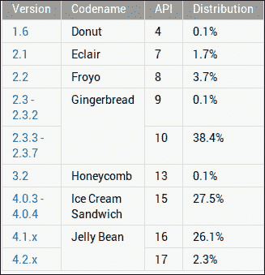

安卓 API 级别分布（来源：[`developer.android.com/about/dashboards/index.html`](http://developer.android.com/about/dashboards/index.html)）

# 准备 Android 开发

在本章的这一部分，我们将了解如何在 Eclipse Juno（4.2）上为 Android 安装开发环境。Eclipse 是 Android 开发的主要 IDE（见以下截图）。我们需要安装 Eclipse 扩展 ADT（Android 开发工具包）以开发 Android 应用：

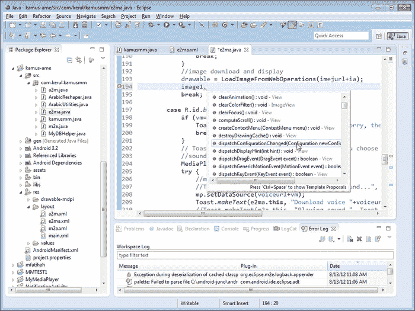

Eclipse 中的 ADT 操作

在下载 Android 包之前，必须确保有 Google API 的网络连接，这一点在继续操作前需要特别注意。以下是使用 Windows 和 Eclipse Juno 的步骤：

需要的软件：

+   来自 Oracle 的最新 JDK1.6.x

+   最新 Android SDK

+   Eclipse 4.2（Juno）

## 安装 JDK

要检查你的电脑是否已安装 JDK 并且安装正确，请打开命令提示符，并输入`javac –version`（如下截图所示）。建议为 Android 应用开发安装 JDK 1.6.x，因为它可能会抱怨编译器合规级别大于 6，可能会遇到问题：

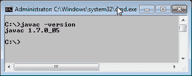

检查 JDK 版本

你可以从下载站点下载 JDK 1.6（Java 开发工具包）并安装它。确保安装后设置了 JAVA_HOME，并通过执行前面的命令来检查版本。[`www.oracle.com/technetwork/java/javase/downloads/index.html`](http://www.oracle.com/technetwork/java/javase/downloads/index.html)（见以下截图）。

如果我们已安装 java 1.6.x，则可以跳过此步骤：

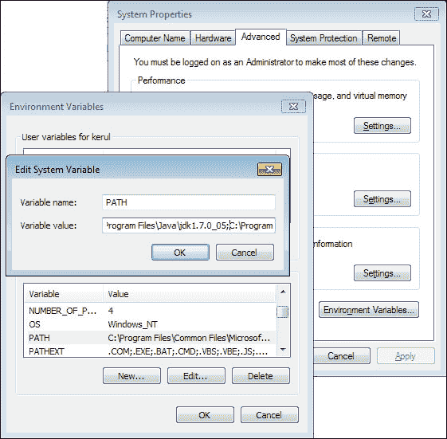

Java PATH 设置

## 安装 Android SDK

创建一个名为 `android-dev` 的文件夹（android-dev 只是一个建议，你也可以选择另一个名称）。本章将一直使用 `android-dev` 文件夹。此文件夹用于存放进行 Android 开发所需的所有软件。在另一个流程中还需要此文件夹。

从 [`developer.android.com/sdk/index.html`](http://developer.android.com/sdk/index.html) 下载，并将此软件安装到 `android-dev` 文件夹中。请记住，此下载仅提供 Android SDK 的基本工具，而非完整安装。稍后，我们需要下载 Android 系统映像、API、示例、文档和其他库：

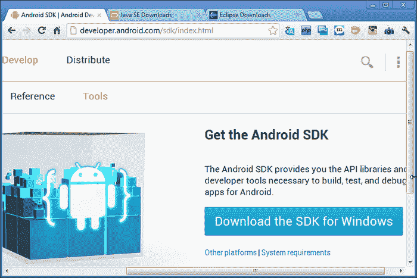

Android SDK 下载页面

下载完成后，将 SDK 安装在之前提到的文件夹中；在 `C:\android-dev\android-sdk`，如下截图所示。

在安装过程中，Android SDK 将检测到机器中的 Java 开发工具包。如果我们安装了最新的 JDK，应该不会有问题：

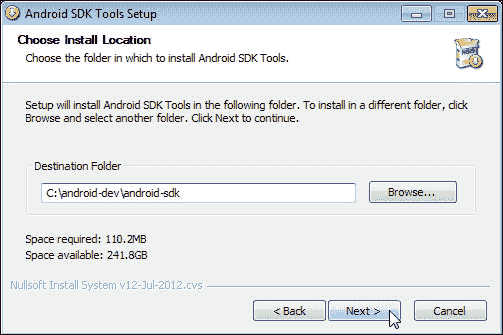

Android SDK 安装路径

## 安装 Eclipse (Juno)

Eclipse Juno (4.2) 可在 [`www.eclipse.org/downloads/`](http://www.eclipse.org/downloads/) 下载：

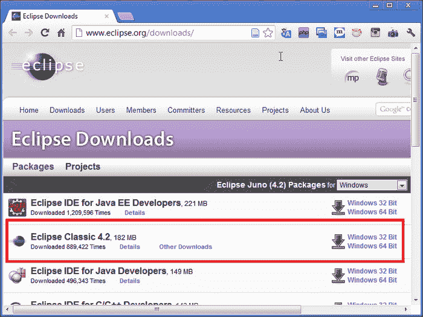

Eclipse Classic 下载页面

Eclipse 以 ZIP 文件形式提供，因此只需解压它并找到 `eclipse.exe` 文件来运行。

立即在之前创建的文件夹中解压 Eclipse（在 `C:\android-dev` 中）。解压后，创建一个桌面快捷方式以便使用，如下截图所示：

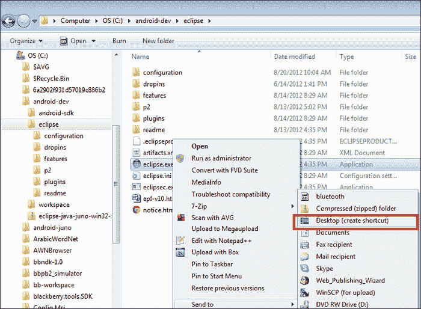

创建 Eclipse 快捷方式

## 在 Eclipse Juno 中安装 ADT

通过识别 Eclipse 安装文件夹并双击 `eclipse.exe`（或在**桌面**双击快捷方式）来运行 Eclipse。提供一个用于存储所有项目源代码的文件夹。再次强调，要在 `android-dev` 文件夹下创建此文件夹，如下截图所示：

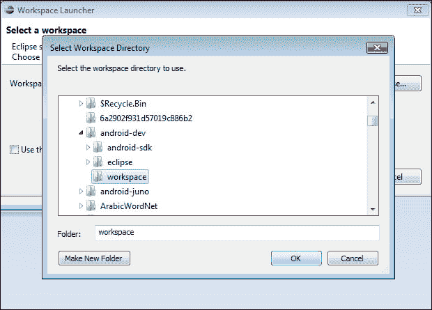

选择 Eclipse 工作空间

这个新的 Eclipse 安装不提供 Android 开发工具包（ADT）插件。要安装此插件，请导航到 **窗口** | **首选项** 打开首选项面板。点击 **安装/更新** | **可用软件站点**（在左侧面板上）。在右侧面板上点击 **添加** 按钮以添加软件下载站点（同样需要互联网连接）。

将会弹出另一个窗口。在**名称**中提供 `ADT`（例如），在**位置**中提供 `https://dl-ssl.google.com/android/eclipse/`（如 [`developer.android.com/sdk/eclipse-adt.html`](http://developer.android.com/sdk/eclipse-adt.html) 所示）：

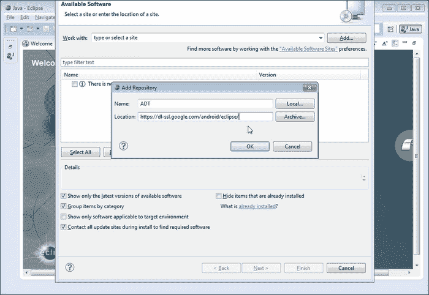

在**可用软件**对话框中，选中**开发者工具**旁边的复选框，然后点击**下一步**。在下一个窗口中，您将看到要下载的工具列表。除了**NDK 插件**外，选择所有工具并点击**下一步**。我们将在下一章讨论这些工具：

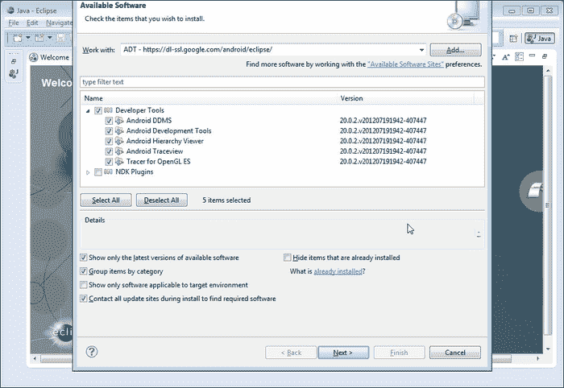

选择 ADT 和 SDK 工具

阅读并接受许可协议，然后点击**完成**。如果出现安全警告，提示无法验证软件的真实性或有效性，请点击**确定**。安装完成后，重启**Eclipse**。

# 将 Android SDK 链接到 Eclipse

运行 Eclipse。在**窗口** | **首选项**中，点击**Android**。找到您安装`android-sdk`的文件夹位置，如下截图所示：

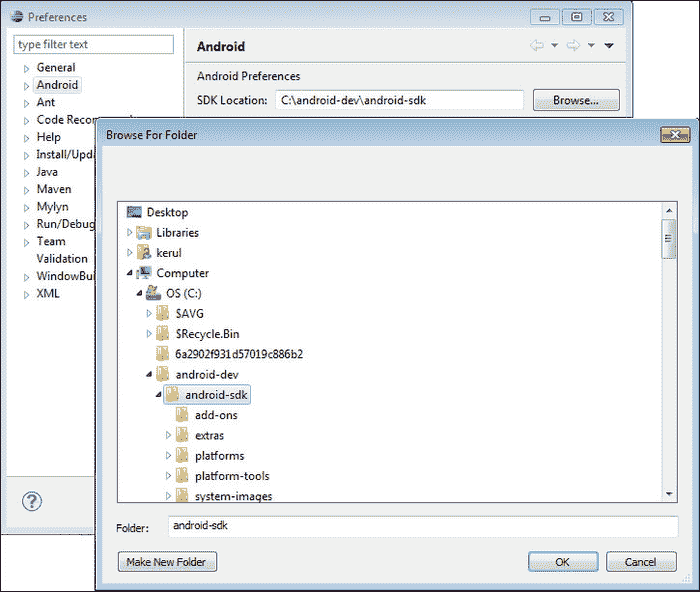

Eclipse 中的 Android 首选项

点击**应用**并按下**确定**。

接下来要做的就是下载 Android APIs 和操作系统映像。安装 Android SDK 是耗时的。它需要一条流畅的宽带线路，因为安装完成后，您需要下载 Android 和 Google API 的 API 包。

要开始这个操作，请点击如下截图所示的**Android SDK 管理器**图标：

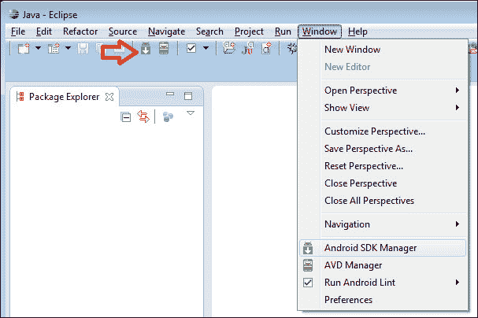

Android SDK 管理器图标

您将获得所有 Android 版本的所有 SDK 平台的列表。我建议您有选择性地先下载您的目标平台。如果您要为**Froyo**（Android 2.2）开发应用，则需要下载 API 版本 8。稍后，当您有更多时间时，可以回来下载其他版本。如果没有时间和互联网数据限制，那么您可以下载所有内容。这将获取 API 包，Android 操作系统映像，调试工具以及与 Android 开发相关的其他软件。

本次我们将下载带有**Jellybean**系统映像和**API 级别**16 的最新 SDK，如下截图所示：

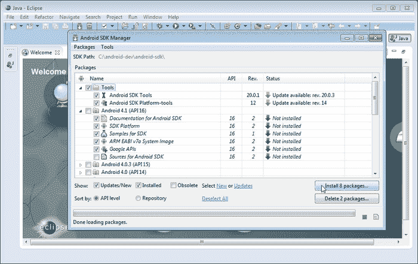

安装带有 API 级别 16 的 SDK

在点击**安装**按钮之前，我想分享一个重要提示。在进行此操作时，我们可能会遇到无特定原因的连接重置问题。为了解决这个问题，在**Android SDK 管理器**窗口中，导航到**工具** | **选项**。取消勾选强制**https://...源使用 https://...**获取的选项，然后点击**关闭**（如下截图所示）。现在您可以开始安装 SDK 和 API 了：

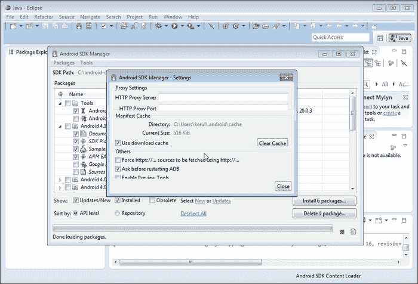

下载完 SDK、API 和系统镜像后，重启 Eclipse。等待是值得的！在安装和下载软件包近两小时后，我得到了这个用于屏幕布局安排的精美图形界面，如下面的截图所示。检查**Android 首选项**窗口，你可能会在 API 列表中看到**Android 4.1**。要添加另一个 API，你还需要通过 Android SDK 管理器下载：

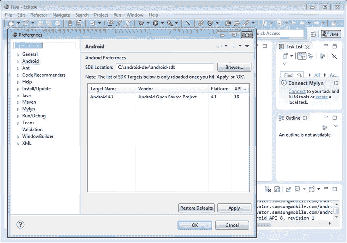

Android API 列表

为了避免在 Eclipse 上设置 ADT 的早期步骤并开始开发，请从[`developer.android.com/sdk/index.html`](http://developer.android.com/sdk/index.html)下载 ADT 捆绑包，并按照[`developer.android.com/sdk/installing/bundle.html`](http://developer.android.com/sdk/installing/bundle.html)的步骤进行设置。

在下一章中，我们将探讨 ADT 环境中的工具，这些工具简化了开发过程。

# 总结

在本章中，我们学习了如何安装 Eclipse Juno（集成开发环境）、Android SDK 和测试平台。下一章将讨论 IDE 的重要元素，在我们创建一个新的 Android 应用项目之前。
