# 第二章：IDE 的重要特性

本章介绍 Eclipse 和 ADT 环境中的几个重要特性，这些特性对于开发 Android 应用非常有用。它分为以下主题：

+   项目浏览器

+   代码编辑器

+   图形用户界面设计师

+   属性窗口

+   调试窗格

+   Dalvik 调试监控服务器（DDMS）

+   SDK 管理器

+   Android 虚拟设备管理器

+   运行应用

+   获取帮助

# 项目浏览器

项目浏览器是一个工具，用于查看项目下的所有文件夹和文件。通过双击项目，可以打开和编辑文件。当我们创建一个新项目时，将在第三章*创建新项目*中详细讨论，ADT 将自动创建所有这些默认的文件夹和文件，如下面的截图所示。根据项目，我们可能忽略或修改所有这些文件。以下是 Android 项目中默认文件夹和文件的简要说明：

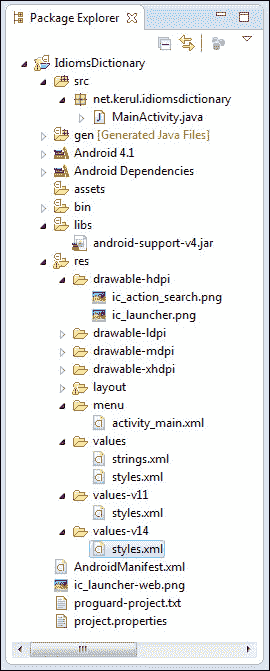

项目浏览器

下表包含了项目树中可用的重要文件夹和文件的简要描述：

| 文件夹 | 功能 |
| --- | --- |
| `/src` | 这里存放 Java 代码 |
| `/gen` | 自动生成 |
| `/assets` | 放置字体、视频、声音等。更像是一个文件系统，也可以放置 CSS、JavaScript 文件等。 |
| `/libs` | 外部库（通常为 JAR 格式） |
| `/res` | 存放图像、布局和全局变量 |
| `/drawable-xhdpi` | 针对超高性能设备（例如平板电脑、Galaxy SIII、HTC One X） |
| `/drawable-hdpi` | 针对高性能手机（例如：SGSI、SGSII） |
| `/drawable-mdpi` | 针对中等性能手机（例如：Galaxy W、HTC Desire） |
| `/drawable-ldpi` | 针对低性能手机（例如：Galaxy Y、HTC WildFire） |
| `/layout` | 所有屏幕布局的 XML 文件 |
| `/menu` | 屏幕菜单的 XML 文件 |
| `/values` | 全局常量 |
| `/values-v11` | 针对 Honeycomb（Android API 级别 11）设备的模板样式定义 |
| `/values-v14` | 针对 ICS（Android API 级别 14）设备的模板样式定义 |
| `AndroidManifest.xml` | 定义应用的重要文件之一。这是 Android OS 为了运行应用而首先定位的文件。它包含应用的属性、活动声明和权限列表。 |

# 代码编辑器

这是编程的“烹饪”工具。Eclipse 代码编辑器（程序员喜欢拥有的）的几个重要特性是智能感知和错误标记（参考截图以了解）。代码补全建议将可用的对象、方法或变量整合到我们的代码中，而错误标记会在不编译代码的情况下立即通知任何语法错误。这些特性对于快速编程非常有帮助：

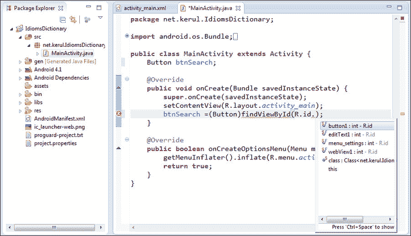

代码编辑器

代码编辑器的外观可以根据您的风格和偏好进行自定义。要更改编辑器环境（如背景色或代码字体样式），请在编辑器上右键单击并选择**首选项**，然后导航到**常规** | **外观** | **颜色和字体**。然后点击**编辑**来自定义，参考以下截图：

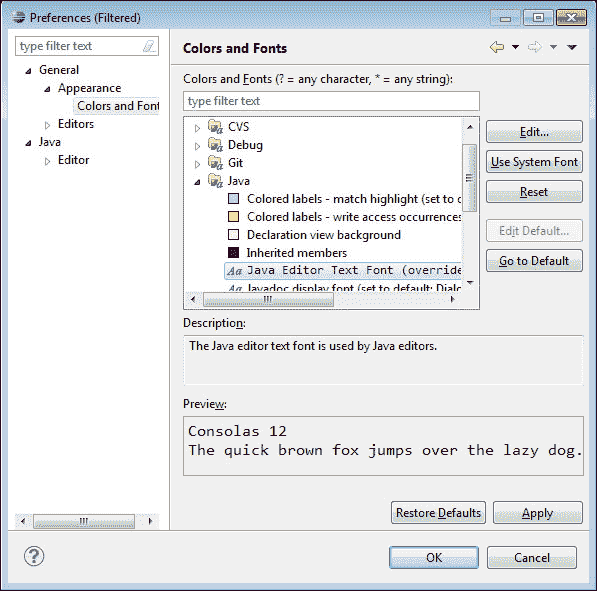

自定义代码编辑器的外观

还有一些其他的 XML 代码编辑器，在设计和开发过程中提供帮助。它们分为两种类型：基于 GUI 的，可以通过 GUI 界面操作，适合不习惯手动编辑 XML 代码的人；基于源代码的：可以手动编辑 XML 代码。以下列出了一些编辑器：

## 图形布局编辑器

使用拖放界面编辑和设计你的 XML 布局文件。布局编辑器还能渲染你的界面，让你在设计布局时预览效果。

## Android 清单编辑器

使用简单的图形界面编辑 Android 清单。当你打开一个`AndroidManifest.xml`文件时，会调用此编辑器。

## 菜单编辑器

使用简单的图形界面编辑菜单组和条目。当你打开一个声明了`<menu>`的 XML 文件时（通常位于`res/menu`文件夹中），会调用此编辑器。

## 资源编辑器

使用简单的图形界面编辑资源。当你打开一个声明了`<resources>`标签的 XML 文件时，会调用此编辑器。

## XML 资源编辑器

使用简单的图形界面编辑 XML 资源。当你打开一个 XML 文件时，会调用此编辑器。

# 图形用户界面设计师

这是界面设计师。它作为应用程序屏幕上的控件或**小部件**的 GUI 编辑器。此 GUI 设计师分为三个部分：调色板、配置选择器和屏幕布局预览，如下面的屏幕截图所示：

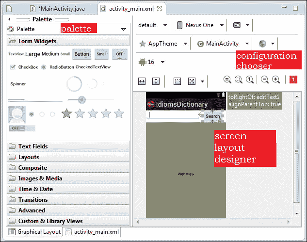

ADT 的 GUI 设计师

**调色板**包含了所有可以帮助我们设计界面的 GUI 控件（小部件）。可用的控件取决于我们在创建项目时选择的 API 级别。一些常见的控件有：按钮、文本字段、单选按钮、复选框、多媒体控件等等。

## 配置选择器

它让你决定你的应用视图在不同屏幕尺寸、方向、密度和主题下的外观。

## 屏幕布局设计师

它是一个放置物品并尝试不同设计的画布。它是一个设计工作区。同时，它还提供了屏幕在设备中可能出现的预览。

# 属性窗口

它帮助编辑小部件的属性。所有与小部件对应的属性都可以通过这个窗口可视化地查看和编辑。尽管可以通过编辑 XML 文件直接编辑属性，但这个 GUI 界面简化了操作。所有更改都会立即自动保存到 XML 文件中。以下截图展示了**属性**窗口：

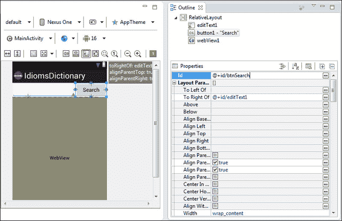

属性窗口

# 调试窗格

在调试视图中，我们可以看到语法错误、警告、控制台消息、运行时错误、变量过渡（如果使用了断点）以及**LogCat。** **LogCat**有助于追踪设备或模拟器内发生的任何活动。以下截图展示了列出所有代码问题（如警告或语法错误）的窗口：

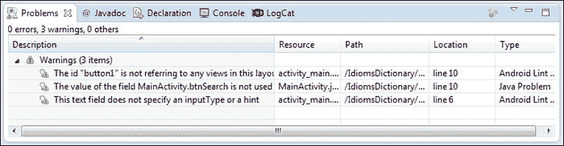

问题警告或代码语法错误

下面的截图展示了一个来自 ADB 的控制台消息示例。作为 Java 开发者，我们可能想使用`System.out.println()`来输出消息和对象值；这些在**LogCat**视图中显示，然而建议为此目的使用`Log`类，因为我们可以过滤、打印不同颜色并定义日志类型。这可以是调试程序的一种方式，通过显示变量值或参数。要使用`Log`，请导入`android.util.Log`，并使用以下方法之一将消息打印到**LogCat**：

```kt
v(String, String) (verbose)

d(String, String) (debug)

i(String, String) (information)

w(String, String) (warning)

e(String, String) (error)
```

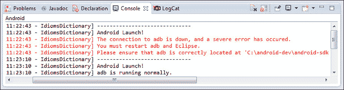

Android 调试桥接控制台（显示 ADB 活动）

**LogCat**用于查看 Android 系统的内部日志，如下截图所示。通过 ADB（Android 调试桥）追踪设备或模拟器内的任何活动非常有效。ADB 是一个将你的 PC 与虚拟设备或实际设备连接的工具。没有它，开发者不能直接将 APK 文件传输到 Android 设备/模拟器：

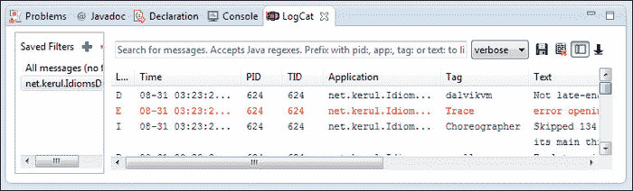

LogCat（追踪所有设备/模拟器活动的跟踪转储）

# Dalvik 调试监控服务器（DDMS）

DDMS 是查看模拟器/设备活动的必备工具。要在 Eclipse 中访问 DDMS，请导航到**窗口** | **打开透视图** | **其他**，然后选择**DDMS**。默认情况下，它可在 Android SDK 中找到（位于`android-sdk/tools`文件夹中的`ddms`文件）。从这个透视图，以下方面可用：

+   **设备**：连接到 ADB 的设备和 AVD 列表

+   **模拟器控制**：它帮助执行设备功能

+   **LogCat**：它查看实时系统日志消息

+   **线程**：它给出了 VM 中当前运行线程的概念

+   **堆**：它显示应用程序的堆使用情况

+   **分配追踪器**：它提供有关对象内存分配的信息

+   **文件资源管理器**：它浏览设备文件系统

下图展示了 DDMS 的重要方面：

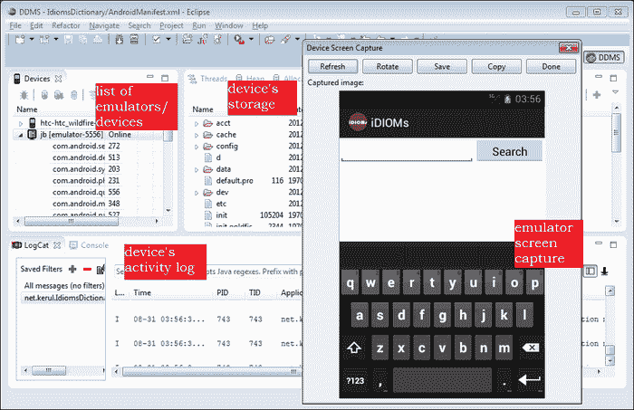

Dalvik 调试监控服务器（DDMS）

# SDK 管理器

SDK 管理器是用于更新安卓 SDK 和管理安卓操作系统映像、文档和 API 下载的工具。图标如下截图所示：

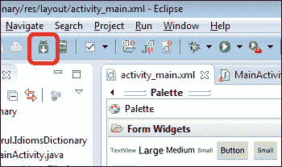

SDK 管理器图标

如截图所示，接下来出现的屏幕有一个非常长的列表。我们需要明确我们需要哪个 API 级别，并据此选择，因为下载可能需要相当长的时间，这取决于互联网速度。如果不确定，那么选择最新的 API 级别。

展开我们想要发布的 API 级别并检查 SDK 平台。这次下载包括相应级别的 API 和安卓操作系统映像。默认情况下，系统映像是基于 ARM 架构的。然而，为了在 Intel 架构机器上更快地运行安卓操作系统映像，只需勾选**Intel Atom x86 系统映像**选项。

如果需要从样本学习，请勾选**SDK 的样本**。如果你的应用程序需要整合谷歌特殊 API（如谷歌地图），那么你可能需要下载谷歌 API。列表的其余部分是关于特定设备的 API。除非你打算为特定设备优化你的应用程序，否则不要下载。

完成必要 API 的选择后，点击**安装包**按钮。如果在下载过程中遇到连接重置问题，请导航到**工具** | **选项**。取消勾选**强制使用 https://...**源，改为使用**http://...**获取，然后重试：

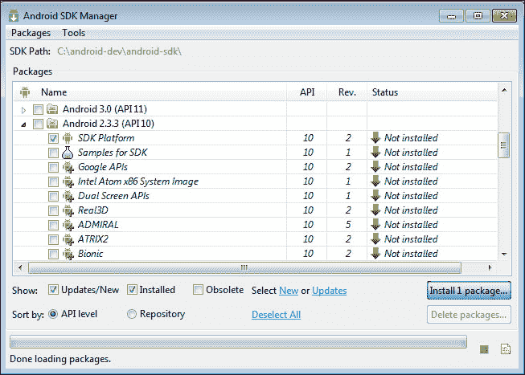

安卓 SDK 管理器窗口

# 安卓虚拟设备管理器

安卓虚拟设备是在你的计算机上运行的虚拟移动设备（模拟器）。模拟器允许你在不使用物理设备的情况下测试安卓应用程序。尽管这并不是最佳的测试方法，因为它只是模仿设备，但至少在你负担不起实际安卓设备的情况下，你还有东西可以测试。

当模拟器运行时，你可以像操作真实移动设备一样与模拟的移动设备互动，不同之处在于你使用鼠标指针触碰触摸屏，并且可以使用某些键盘按键来调用设备上的特定按键。

安卓模拟器模仿了典型移动设备的所有硬件和软件功能，唯独不能进行实际电话通话。它提供了多种导航和控制按键，你可以使用鼠标或键盘“点击”来为你的应用程序生成事件。它还提供了一个屏幕，显示你的应用程序以及任何其他正在运行的安卓应用程序。对于某些功能，我们可能需要了解热键，具体信息可以在[`developer.android.com/tools/help/emulator.html#KeyMapping`](http://developer.android.com/tools/help/emulator.html#KeyMapping)找到。

点击如下截图所示的按钮，打开 Android SDK 和**AVD 管理器**窗口。**AVD**即**Android 虚拟设备**：

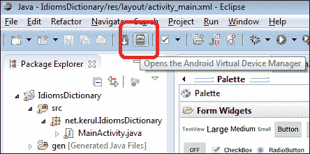

AVD 图标

**AVD 管理器**如下截图所示。首先，点击**新建…**来设置一个新的模拟器，如截图所示。输入一个名称（例如，`nexus`），选择一个目标（确保为所选目标下载了 Android OS 系统镜像），为了简单起见选择设备，其他字段将会自动填充。如果我们想要不同的设置，也可以进行编辑。同时，选择**CPU**为**ARM (armeabi-v7a)**，然后点击**创建 AVD**：

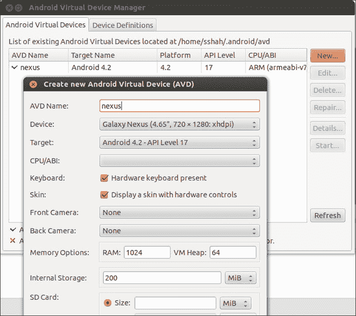

创建新的 AVD

点击已经创建好的新 AVD，然后使用**启动**按钮启动 AVD。使用默认设置，并点击**启动**按钮。

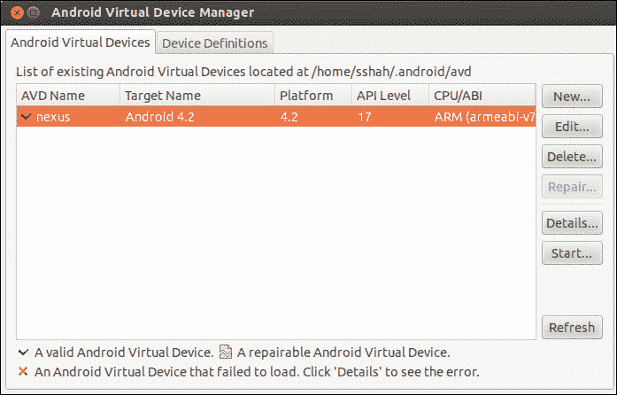

如果我们的处理器和内存规格较低，你会注意到它的模拟器启动非常慢。我想建议你至少有 3GB 的 RAM 来使其更快。

等待直到左侧屏幕显示如下截图所示的带有图标的漂亮图片。左边的组件是你的设备（智能手机）屏幕，而右边的组件是物理智能手机键盘：

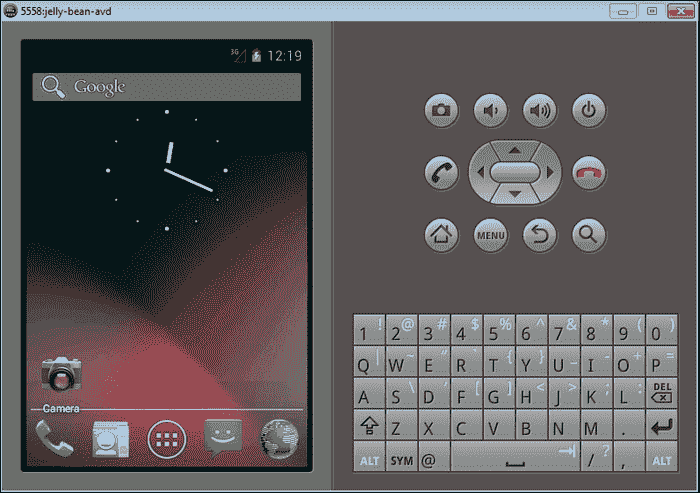

Android 模拟器

# 运行应用程序

没有错误的项目将能够被执行并发送到 AVD。要运行一个项目，请点击如下所示图片中的**运行**按钮。如果你的系统已经运行了几个模拟器，Eclipse 将会询问你要使用哪个版本的模拟器：

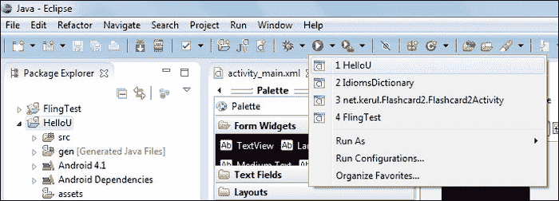

运行应用程序按钮

# 获取帮助

+   在菜单中选择**帮助**，然后选择**搜索**

+   Eclipse 帮助：[`help.eclipse.org/juno/index.jsp`](http://help.eclipse.org/juno/index.jsp)

+   ADT 帮助：[`developer.android.com/tools/help/adt.html`](http://developer.android.com/tools/help/adt.html)

+   Android 开发者官方参考：[`developer.android.com`](http://developer.android.com)

+   ADT 更新：定期从菜单中检查 ADT 更新，**帮助** | **检查更新**

+   更多关于 DDMS 的信息：[`developer.android.com/tools/debugging/ddms.html`](http://developer.android.com/tools/debugging/ddms.html)

# 总结

在本章中，我们讨论了 Eclipse 和 ADT 中提供的几个重要工具，如项目浏览器、代码编辑器、图形用户界面设计器、属性窗口、调试窗格、Dalvik 调试监控、SDK 管理器、AVD 管理器和运行应用程序设施。下一章将讨论如何创建一个新的 Android 应用程序项目。
