# 第三章：创建新的 Android 项目

本章将演示如何使用按钮和文本字段创建一个新的具有简单交互的 Android 应用。我们还将编写交互代码，编译并在模拟器/实际设备上运行应用。为了说明本章内容，我们将创建一个名为 HelloU 的简单项目。

+   创建新的 Android 应用项目字符串资源

+   使用图形布局设计器

+   字符串资源

+   XML 布局编辑器

+   通过源代码编辑器实现小部件的交互

+   提示信息

+   在模拟器上运行应用

+   在 Android 设备上运行应用

+   获取帮助

### 提示

**下载示例代码**

你可以从你在[`www.packtpub.com`](http://www.packtpub.com)的账户下载你所购买的所有 Packt 图书的示例代码文件。如果你在其他地方购买了这本书，可以访问[`www.packtpub.com/support`](http://www.packtpub.com/support)注册，我们会将文件直接通过电子邮件发送给你。

# 创建一个新的 Android 应用项目

在 Eclipse 中创建新的 Android 项目，选择**文件** | **新建** | **项目**。将出现新的项目窗口，然后从列表中选择**Android** | **Android Application Project**。点击**下一步**按钮。

+   **应用名称**：这是你的应用程序的名称，它将与应用启动图标并排显示。选择一个与你的应用相关的项目名称。

+   **项目名称**：这通常与应用名称相似。避免与 Eclipse 中现有项目的名称相同，这是不允许的。

+   **包名称**：这是应用程序的包名称。如果我们希望发布到 Google Play 应用商店，它将作为 ID。通常，如果我们有一个域名（因为这是唯一的），它将是域名反转后跟应用程序名称，并是一个有效的 Java 包名称；否则，我们现在可以是任何名称，并在发布前进行重构。

`android:minSdkVersion`是一个指定应用运行所需最低 API 级别的整数。如果不确定，可以保持默认选择。

例如，你可能将应用设置为`android:minSdkVersion="7"`。这个设置将保证你的应用在 Android Éclair（2.1）或更高版本的设备上运行，但不会在更低版本上运行。

`targetSdkVersion`是你关注的目标设备。假设你的应用有`android:minSdkVersion="16"`，这意味着应用可以利用 Android Jelly Bean 的所有功能。但是，请记住，如将应用移动到 SD 卡和原生 Unicode 支持等功能在 Android（2.1）Eclair 中是不支持的。尽管这些功能从 API 级别 8（Android 2.2/Froyo）和级别 11（Android 3.0/Honeycomb）开始提供，但它们不能在更低版本的 Android 上使用。

请记住，你的`targetSdkVersion`必须等于或高于`minSdkVersion`。否则，这样做没有太大意义。

点击**下一步**移到下一步：

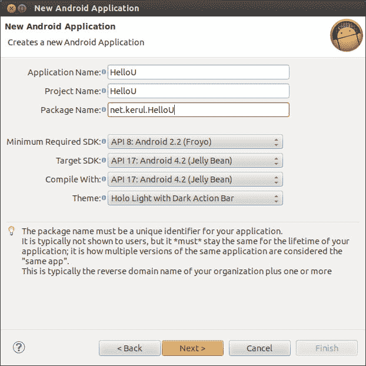

创建一个新的 Android 项目

这是配置你的启动图标的窗口。启动图标是在主屏幕或应用抽屉中出现的图标。这是你应用的一个重要方面，因为它将代表你的应用。为此，你可以使用 ADT 中预定制好的文本和图标形状的图标创建向导。将前景设置为文本，提供字母`U`作为**文本**，选择圆形作为图标形状，并根据以下截图调整你的颜色偏好。这个向导将创建一个简单的图标，并提供 ldpi（36x36 像素）、mdpi（48x48 像素）、hdpi（72x72 像素）和 xhdpi（96x96 像素）的启动图标。创建不同大小的图标是为了适应各种具有不同屏幕尺寸和分辨率配置的设备。点击**下一步**继续：

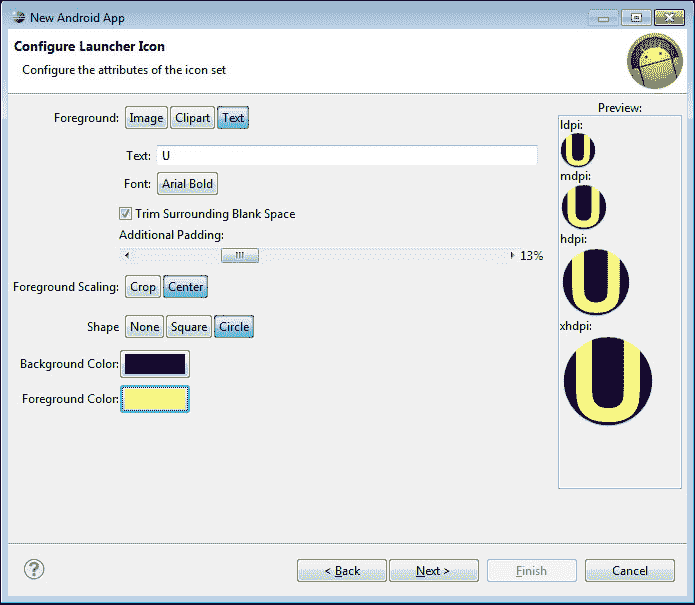

启动图标创建器

在如下截图所示的窗口中选择**BlankActivity**，然后点击**下一步**：

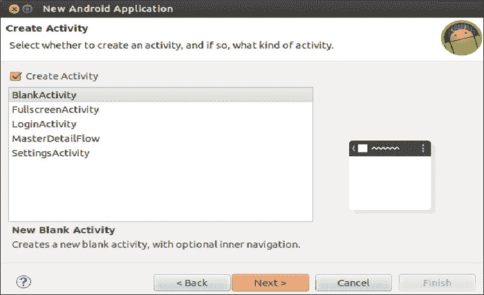

选择空白活动

下一个窗口将出现以输入`MainActivity`的名称，如下截图所示，然后点击**完成**按钮：

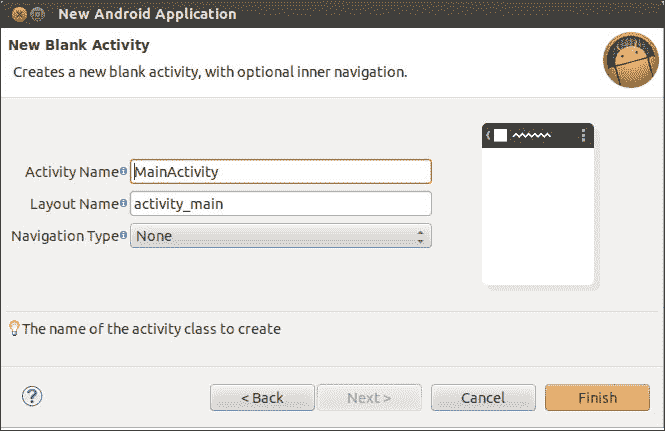

# 字符串资源

通常，对于 Android 应用来说，将字符串值存储在 XML 文件中以便于用户界面引用是一种做法，这是因为移动应用具有国际化的特性。因此，最好提供多种语言选项。然而，这一做法是可选的，如果你愿意，也可以直接分配字符串。

字符串资源文件以 XML 格式存在，可以通过项目树在`res/values/strings.xml`中找到。这些字符串资源还可以用来存储颜色信息、整型数组等。

现在，点击**添加**按钮新增一个字符串值，在**名称**框中提供变量名和字符串的**值**。按*Ctrl* + *S*保存更改。例如，在以下截图中，创建了一个新的字符串变量`hello_u`，其值为**Hello,**：

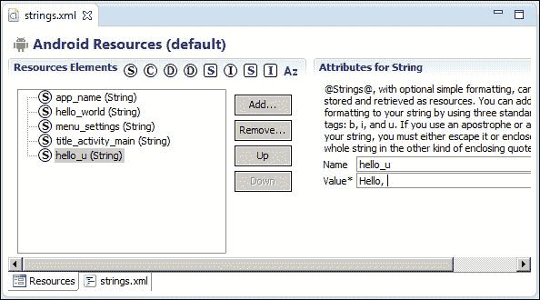

添加一个新的字符串值

根据下表添加另外两个字符串值。这些字符串将用作小部件的标题：

| 字符串变量 | 值 |
| --- | --- |
| `s_tvName` | 你的名字： |
| `s_btnDisplay` | 显示名字！ |

如果你注意到了，我们使用`s_`来表示它是一个来自资源的字符串变量，`tv`表示`TextView`，`btn`表示按钮。请记住，这些约定不是固定的，你可以使用你自己的偏好。

新创建的字符串值将被保存在 `string.xml` 文件中。通过点击如下截图所示的红箭头指向的标签，可以查看 XML 代码：

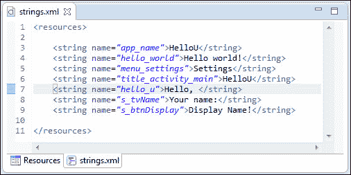

string.xml 代码文件

# 使用图形布局设计器

下一个练习是添加一个文本标签、一个文本框和一个按钮。这些元素在 Android 中被称为控件，其类名为 `TextView`、`EditText` 和 `Button`。我们将不详细介绍这些类，最重要的是我们可以将这些控件应用到我们的应用中。

要打开这个布局，请从项目浏览器中双击 `res/layout/activity_main.xml` 文件。

在应用屏幕的左侧，你会看到 **Palette（调色板）**。浏览 **Form Widgets（表单控件）**，其中有几个控件包括 `TextView`。点击并将 `TextView` 控件拖到应用屏幕上。将控件 ID 更改为 `"@+id/tvName"`，并确保按 *Enter* 键确认更改并将其保存到 XML 文件中。`"@+id/"` 是 ADT 表示法，表示必须创建新的 ID 并将其分配给控件。

之后，将 Text 属性设置为指向字符串资源中定义的值，`s_tvName`。可以通过点击每个属性右侧带有三个点的按钮来完成此操作。按下 *Ctrl* + *S* 保存更改，确保更改出现在 XML 文件中：

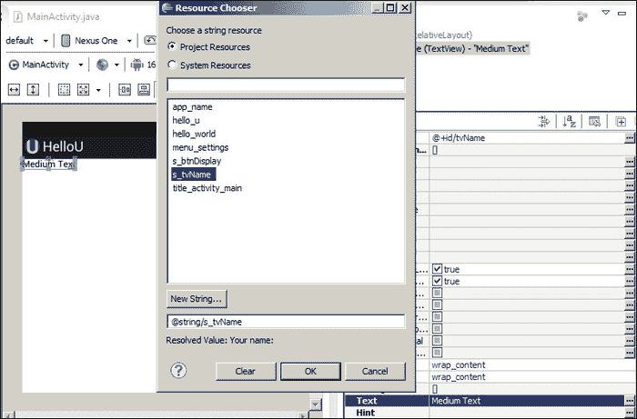

更改 TextView 的标题

接下来要添加的控件是带有 **Id** `txtName` 的 EditText，关联标签为 **Your name:** 以接受用户输入，如下截图所示：

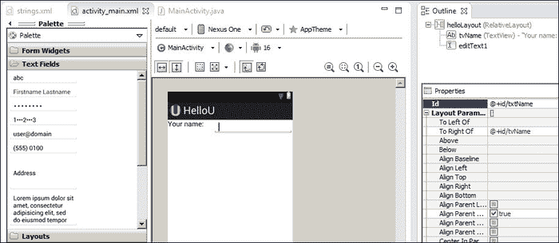

添加一个 EditText

添加另一个控件，按钮，指定 ID `btnDisplay` 并关联标签为 **Display Name**，如下所示，并将其水平扩展到整个屏幕。你可以通过点击并拖动控件边缘的蓝色调整标记来使用调整大小的功能：

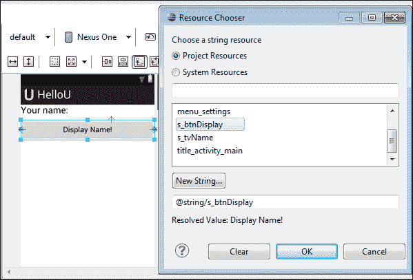

添加一个 Button

# XML 布局代码编辑器

代码编辑器是更改布局属性的另一种方式。如果你有 XML 的先验知识，我们建议直接更改此代码。这实际上是一段简单的 XML 代码。要直接访问此代码，只需点击布局编辑器底部的 `activity_main.xml`，如下截图所示：

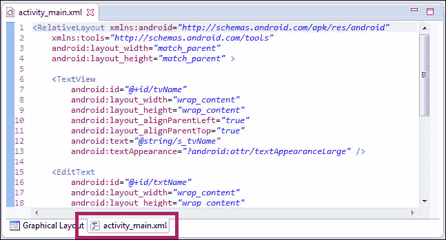

访问 XML 布局代码编辑器

# 通过源代码编辑器进行控件交互

我们之前设计的布局不需要自动相互交互；让我们实现这一点。简单来说，当我们执行项目时，点击应用上的按钮不会触发任何操作。我们需要添加交互的代码。

我们试图实现的是当用户点击 **显示名称！** 按钮时，应用将捕获 `TextView` 内的任何文本，并生成一个简单的弹出窗口来显示你的名字。

为了达到我们的目标，让我们随意操作，进入 `src` 目录，双击 `package` 文件夹，再次双击文件 `MainActivity.java`。这个 Java 文件将包含加载 XML 文件 `main_activity.xml` 的布局代码，以创建一个 UI。以下是由 ADT 提供的默认代码。

你会在第一行看到包名和导入项目的几个类。第六行的代码是主类声明，它继承了 `Activity` 类。第八行的 `onCreate` 方法是应用启动时第一个被调用的方法。`setContentView(R.layout.activity_main)` 是根据之前设计的主屏幕初始化屏幕布局的命令。第 13 行的创建屏幕菜单的方法将在 第五章 *添加单选按钮、复选框、菜单和偏好设置* 中讨论。

```kt
package net.kerul.HelloU;
import android.os.Bundle;
import android.app.Activity;
import android.view.Menu;

public class MainActivity extends Activity{
//First method called when App starts    
 @Override
    public void onCreate(Bundle savedInstanceState) {
        super.onCreate(savedInstanceState);
        setContentView(R.layout.activity_main);
    }
      // loads Screen menu 
    @Override
    public boolean onCreateOptionsMenu(Menu menu) {
        getMenuInflater().inflate(R.menu.activity_main,
         menu);
        return true;
    }
}
```

为了提供按钮交互，我们需要在主类头部添加实现 `OnClickListener`。

```kt
public class MainActivity extends Activity implements OnClickListener {
```

在代码的导入部分，添加这一行：

```kt
  import android.view.View.OnClickListener;
```

现在，初始化将在过程中涉及的所有小部件。在主类头部之后，立即添加小部件的成员声明。

```kt
public class MainActivity extends Activity implements OnClickListener{
   private EditText txtName;
   private Button btnDisplay;
   …
```

由于 `EditText` 和 `Button` 也是需要从 Android API 导入的另一个类，所以在导入部分添加几行。

```kt
import android.widget.Button;
import android.widget.EditText;
```

### 提示

在 Eclipse 中，你不需要记住所有需要导入的类和包的名称。只需将光标（插入符号）放在类上，按 *Ctrl* + *Shift* + *O*。IDE 将帮助你包含相关的包或者将鼠标指向其他类，会弹出一个菜单，选择导入该类。

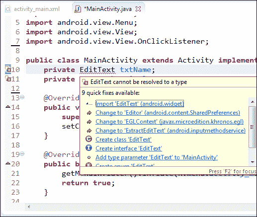

从 Android API 导入类的菜单

下一步是在 `MainActivity.xml` 文件中将代码与布局设计相链接。这是必要的，因为 ADT 正在采用 MVC（模型-视图-控制器）开发方法。这意味着屏幕布局与代码分离，以提高项目的可维护性。

基本上，在通过 `setContentView` 加载布局之后，你需要访问隐藏在该布局中的这些小部件。这时 `findViewById()` 就派上用场了。

```kt
txtName=(EditText)findViewById(R.id.txtName);
btnDisplay=(Button)findViewById(R.id.btnDisplay);
```

按钮是动作；我们需要为按钮添加事件监听器。需要添加的行如下：

```kt
btnDisplay.setOnClickListener(this);
```

在这里，我们让 Activity 本身实现 `onClickListener`。

为了处理任何点击事件，Java 需要包含一个特殊的方法。在这个方法内部，将执行任务。在我们的案例中，如果用户点击（或轻触）按钮（`btnDisplay`），应用将提取文本字段（`txtName`）的内容并在屏幕上显示。该动作可以按以下方式编码：

```kt
public void onClick(View arg0) {
   if(arg0.getId()==R.id.btnDisplay){
      String hellomsg="Hello, "+txtName.getText().toString();
      Toast.makeText(this.getApplicationContext(), hellomsg,
         Toast.LENGTH_SHORT).show();
  }
   }
```

`View arg0`是触发动作的元素。`arg0.getId()`是获取触发动作的小部件 ID 的方法。如果小部件 ID 是`btnDisplay`，则执行捕获输入并在屏幕上显示的动作。

要获取文本字段小部件的字符串，请使用以下代码：

```kt
txtName.getText().toString();
```

`Toast.makeText()`是在屏幕上显示简短消息的方法，我们将在下一节讨论它。

完整的代码将是：

```kt
package net.kerul.HelloU;

import android.app.Activity;
import android.os.Bundle;
import android.view.View;
import android.view.View.OnClickListener;
import android.widget.Button;
import android.widget.EditText;
import android.widget.Toast;

public class MainActivity extends Activity implements OnClickListener{
   private EditText txtName;
   private Button btnDisplay;

   @Override
   public void onCreate(Bundle savedInstanceState) {
      super.onCreate(savedInstanceState);
      setContentView(R.layout.activity_main);

      txtName=(EditText)findViewById(R.id.txtName);
      btnDisplay=(Button)findViewById(R.id.btnDisplay);
      btnDisplay.setOnClickListener(this);
   }

   public void onClick(View arg0) {
      if(arg0.getId()==R.id.btnDisplay){
          String hellomsg="Hello, "+txtName.getText().toString();
          Toast.makeText(this.getApplicationContext(), hellomsg, 
              Toast.LENGTH_SHORT).show();
      }
   }
}
```

# Toast 消息

这是一种常见的做法，用于弹出消息框以通知用户。这种通知是一种不需要用户回答或反馈的通知类型。

```kt
Toast.makeText(this.getApplicationContext(), hellomsg,
         Toast.LENGTH_SHORT).show();
```

`Toast.makeText()`包含三个参数，分别是应用上下文、消息和显示时长。

+   应用上下文是当前要显示消息的屏幕

+   要显示的消息是字符串

+   显示时长包括消息显示的短时间或长时间，必须是`Toast.LENGTH_*`常量之一

下面的截图中的箭头指向一个 Toast：

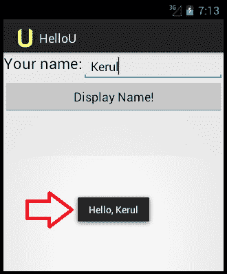

Toast 的一个示例

# 在模拟器上运行应用

在模拟器中运行**HelloU**应用需要你先启动模拟器。启动一个与你的目标平台相匹配的 Android 版本的模拟器。一旦模拟器完全加载，我们就可以编译并运行应用。

在项目资源管理器上点击**HelloU**项目（这是为了激活项目）。在 Eclipse 菜单中导航到**运行**，选择**运行**或按快捷键*Ctrl* + *F11*。选择作为 Android 应用运行，并按下*Enter*。等待几秒钟，查看你的模拟器。**HelloU**应用很快就会显示，如下面的截图所示。输入你的名字，点击**显示名字！**按钮，屏幕底部将出现带有输入名字的 Toast 消息：

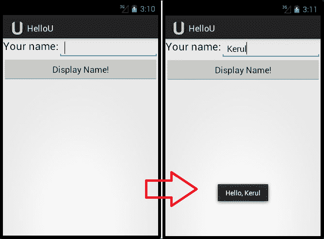

在模拟器中运行的 HelloU 应用

# 在 Android 设备上运行应用

要在真实设备上运行和部署，首先安装设备的驱动程序。这会根据设备型号和制造商而有所不同。

以下是一些你可以参考的链接：

+   仅适用于 Google Android 设备[`developer.android.com/sdk/win-usb.html`](http://developer.android.com/sdk/win-usb.html)。

+   其他：[`www.teamandroid.com/download-android-usb-drivers/`](http://www.teamandroid.com/download-android-usb-drivers/)。

确保安卓手机通过 USB 线连接到电脑。要检查手机是否已正确连接到你的电脑并处于调试模式，请切换到 DDMS 视角。

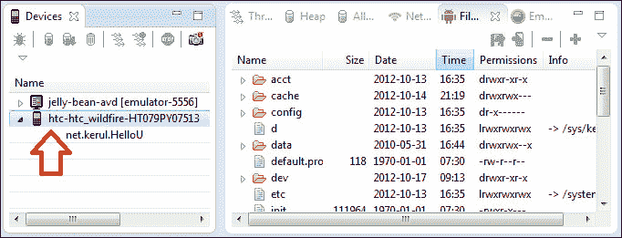

在 DDMS 中显示的安卓手机。

如果一切顺利，运行应用。注意会弹出一个窗口，让你选择模拟器和一个真实的安卓设备；选择安卓设备。几秒钟后，应用将在安卓手机上运行。

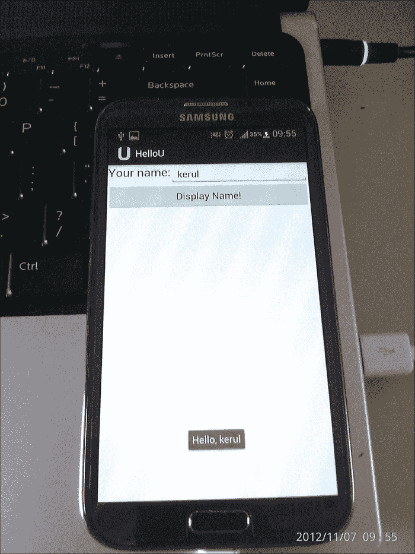

在实际安卓设备上运行 HelloU 应用。获取帮助

以下是一些关于如何使用 Eclipse 和 ADT 的参考资料。你可以花些时间阅读文档和教程以获取更新。在[stackoverflow.com](http://stackoverflow.com)上阅读教程和讨论是学习这些工具的便捷方式之一。

+   在菜单中选择**帮助**，然后选择**搜索**。

+   Eclipse 帮助：[`help.eclipse.org/juno/index.jsp`](http://help.eclipse.org/juno/index.jsp)

+   ADT 帮助：[`developer.android.com/tools/help/adt.html`](http://developer.android.com/tools/help/adt.html)

+   安卓开发者官方参考文档：[`developer.android.com`](http://developer.android.com)

+   ADT 更新：定期从菜单中的**帮助** | **检查更新**来检查 ADT 更新。

+   更多关于 DDMS 的信息：[`developer.android.com/tools/debugging/ddms.html`](http://developer.android.com/tools/debugging/ddms.html)

# 总结

恭喜你！现在你拥有了自己的安卓应用。你已经设计了屏幕布局，添加了标签、文本字段和按钮。简单的交互性让你了解了如何开发安卓移动应用。在下一章中，我们将添加更多小部件并学习开发涉及多个屏幕的更复杂应用。
