# 第四章：融入多媒体元素

本章将讨论如何在项目中融入多媒体元素并在应用中处理多个屏幕。我们将向读者展示如何添加图片、声音和 HTML 页面。我们将通过一个名为`SimpleNumb3r5`的项目来讨论以下主题：

+   构建布局

+   添加图像资源

+   插入 ImageView

+   插入 ImageButtons

+   ImageButton 和事件处理

+   添加音频和支持多屏幕

+   在 WebView 中插入 HTML

+   使用 Intent 和 Activity

+   在清单文件中添加新的活动

+   最终产品——运行、部署和测试应用

为了本章内容，我们需要一个新项目，该项目将涵盖从 Android 2.1（API 级别 7）到最新版本的设备。因此，将`android:minSdkVersion`设置为 7，`android:targetSdkVersion`设置为 16。

图标和其他资源可以在可下载的源代码中找到（参考本书*前言*中提到的下载提示）。在开发此应用之前，请下载这些材料。我们不想让你在做图形设计时感到痛苦。

新应用选择的名称为`SimpleNumb3r5`，如下截图所示。如果你好奇为什么我们选择 Android 2.1，这是因为我们希望扩大设备覆盖范围：

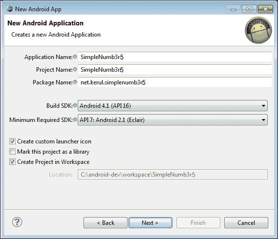

创建一个名为 SimpleNumb3r5 的新 Android 项目

我们在资源材料中提供启动图标，并在**图像文件**字段中提供名为`ic_launcher-web.png`的图片，如下截图所示。这是此应用的专用标志。如果你想要一个不同的标志以适应你的应用，欢迎你亲自设计。使用这个向导，图标启动器将被准备到适应`xhdpi`、`hdpi`、`mdpi`和`ldpi`格式的相应 drawable 文件夹中。

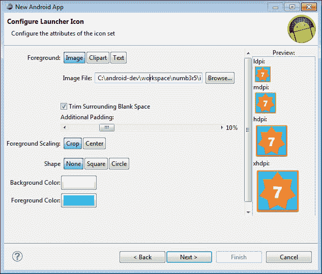

创建启动图标

如下截图所示的下一个屏幕是提供应用程序名称的。这可以是任何对应用有合适意义的字符串。布局名称将自动为您创建，可以根据您的喜好进行更改。选择导航类型为**无**，因为这与我们的应用开发无关。

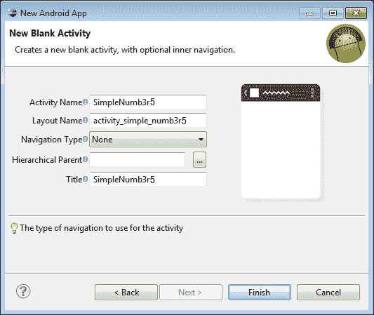

选择空白活动

下面的截图是正在开发的应用的模拟图。我们有一个主要区域用于显示数字零到九的图片和拼写。屏幕底部的行是导航栏，用户可以通过它导航到上一个或下一个屏幕。带有扬声器的按钮是让用户听数字发音的。带有小写字母**i**的按钮是显示信息屏幕的图标。

+   项目标题（默认显示）。

+   图像编号位置。这一行由三个单元格合并而成。

+   底部行包括上一个、信息、播放声音和下一个按钮。

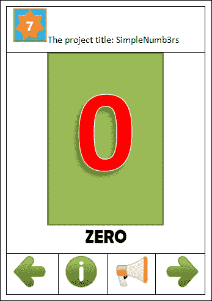

主屏幕模拟图

# 添加 TableLayout

我们的项目将包含一个 TableLayout，内部有两个 TableRow。默认情况下，当你添加 TableLayout 时，IDE 将包含四组 TableRow。使用 XML 代码编辑器删除两行，上一个应用程序模拟图可以提供一些指导以删除不使用的行。调整 TableLayout，使其利用屏幕布局的所有空间，如下一个截图所示：

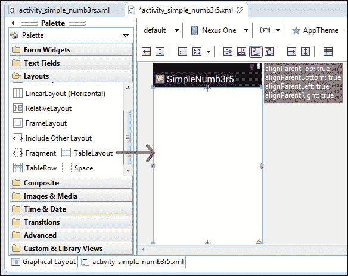

插入 TableLayout

# 添加图像资源

通过 Windows 文件管理器将第四章补充文件中提供的图像复制到`res/drawable-hdpi`文件夹中，如下一个截图所示。在此练习中，我们只为`hdpi` drawable 提供图像资源。相应地准备`xhdpi`、`mdpi`和`ldpi`的所有适当资源总是一个好习惯。别忘了 Android 设备中有许多屏幕尺寸变种。目前我们也没有考虑平板尺寸设备的资源。

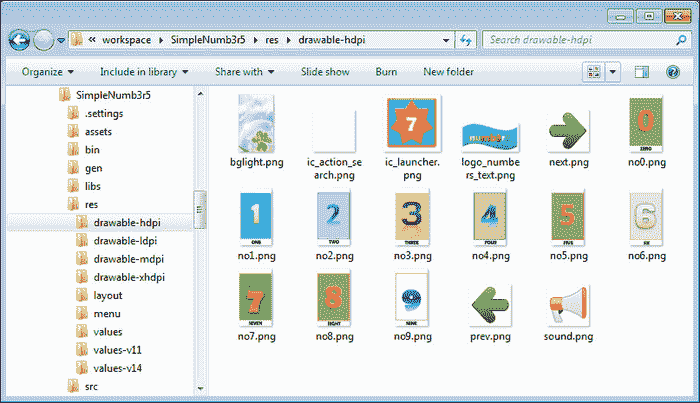

drawable 的资源

然后进入你的项目资源管理器（在 Eclipse 中），右键点击`res/drawable-hdpi`并选择**刷新**。以下截图显示了图像资源复制后`drawable-hdpi`文件夹的外观：

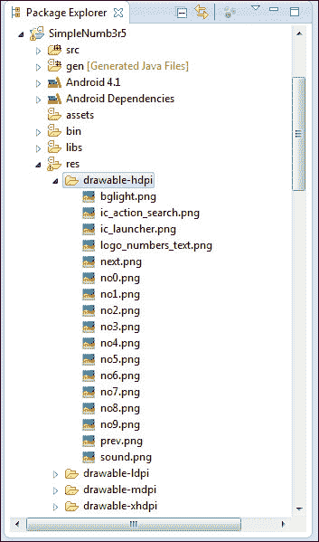

drawable 的资源

# 添加 ImageView

如前一个截图所示，我们的应用程序有一个图像 0，它占据了整个屏幕，为了实现这一点，让我们在 TableLayout 的第一行添加一个 ImageView。使用 drawable 文件夹中的 no0 图像作为初始图像（零是要显示的第一个数字）。调整 ImageView 的宽度和高度以填满屏幕。

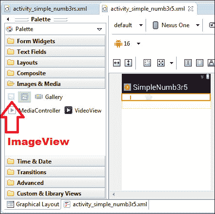

向应用屏幕添加 ImageView

平均分配权重（指定布局中额外的空间分配给视图的比例），以使小部件居中。使用以下截图中的按钮调整 ImageView 到屏幕中心。在 ImageView 处于激活（选中）状态时进行此操作：

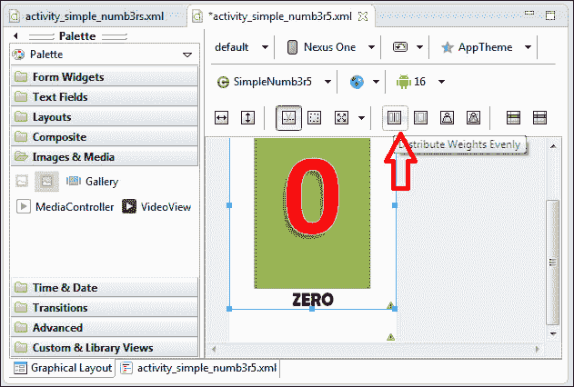

平均分配权重

# 添加 ImageButton

TableLayout 的第二行用于导航按钮（上一个和下一个）以及播放声音按钮。对于这种类型的应用程序，ImageButton 更具吸引力。创建 ImageButton 时，系统会要求你选择图像。对于第一个按钮，使用 drawables 中的**prev**图像。第二个是**sound**，最后一个是**next**。这些按钮需要逐一添加，如下一个截图所示：

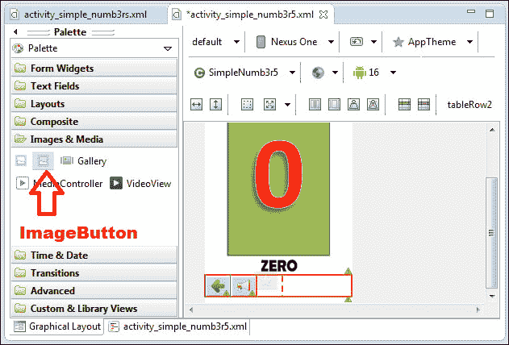

添加 ImageButton

激活（选择）其中一个按钮并平均分布，如下面的截图所示。这是为了确保所有按钮均匀分布在屏幕宽度上。

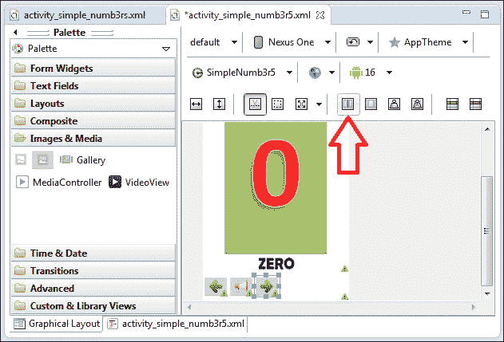

平均分配 ImageButton 的权重

如果你愿意，可以更改屏幕的背景。已经为你准备了一个背景图像；它在 drawables 文件夹中，名为**bglight**。通过点击应用屏幕上的应用标题/标志来激活主布局。点击属性右侧的三点按钮来更改背景属性。稍后，你可以添加**btninfo**按钮来显示应用信息。

# 分配小部件的 ID

基本上有一个 ImageView 和三个 ImageButton。要更改 ImageView 的 ID，选择它并转到右侧的小部件属性。点击**Id**属性上的三点按钮。将 ImageView 的 ID 更改为**imagenumber**，如下面的截图所示：

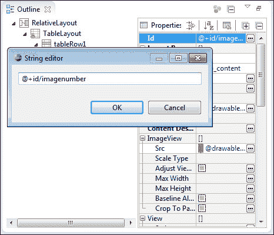

通过属性窗口更改小部件的 ID

之后，将所有按钮的 ID 更改为**btnprevious**、**btninfo**、**btnsound**和**btnnext**。以下表格可作为指南：

| 小部件 | ID |
| --- | --- |
| ImageView | imagenumber |
| 最左边的按钮 | btnprevious |
| 显示应用信息 | btninfo |
| 播放声音按钮 | btnsound |
| 最右边的按钮 | btnnext |

最后，你将得到如下所示的屏幕：

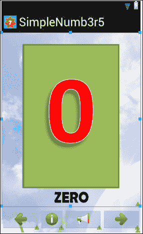

主活动的设计布局

以下 XML 代码可以通过**Graphical Layout**标签中的 XML 编辑器在`activity_simple_numb3rs.xml`标签中找到：

```kt
<RelativeLayout 

    android:layout_width="match_parent"
    android:layout_height="match_parent"
    android:background="@drawable/bglight" >

    <TableLayout
        android:layout_width="wrap_content"
        android:layout_height="wrap_content"
        android:layout_alignParentBottom="true"
        android:layout_alignParentLeft="true"
        android:layout_alignParentRight="true"
        android:layout_alignParentTop="true" >

        <TableRow
            android:id="@+id/tableRow1"
            android:layout_width="wrap_content"
            android:layout_height="0dp"
            android:layout_weight="1" >

            <ImageView
                android:id="@+id/imagenumber"
                android:layout_width="0dp"
                android:layout_height="wrap_content"
                android:layout_weight="1"
                android:src="img/no0" />
        </TableRow>

        <TableRow
            android:id="@+id/tableRow2"
            android:layout_width="wrap_content"
            android:layout_height="0dp"
            android:layout_weight="1" >

            <ImageButton
                android:id="@+id/btnprevious"
                android:layout_width="0dp"
                android:layout_height="wrap_content"
                android:layout_weight="1"
                android:src="img/prev" />
            <ImageButton
                android:id="@+id/btninfo"
                android:layout_width="0dp"
                android:layout_height="wrap_content"
                android:layout_weight="1"
                android:src="img/info" />
            <ImageButton
                android:id="@+id/btnsound"
                android:layout_width="0dp"
                android:layout_height="wrap_content"
                android:layout_weight="1"
                android:src="img/sound" />
            <ImageButton
                android:id="@+id/btnnext"
                android:layout_width="0dp"
                android:layout_height="wrap_content"
                android:layout_weight="1"
                android:src="img/next" />
        </TableRow>
    </TableLayout>
</RelativeLayout>
```

# ImageButton 和处理事件

在这里，我们将编写 ImageButton 的点击事件。打开`src/net.kerul.simplenumb3r5/SimpleNumb3r5.java`中的 Java 源代码。这里，我们将讨论主要活动类，它将使用以下代码提供屏幕导航：

```kt
public class SimpleNumb3r5 extends Activity implements OnClickListener
```

主类通常继承`Activity`类，并实现`OnClickListener`以启用小部件交互。

主要变量声明如下：

```kt
//initialize all widgets
  private ImageView imagenumber;
  private ImageButton btnprevious, btninfo, btnsound, btnnext;
  //define variables to track screen number, start from 0
  private int screennumber=0;
  //define a sound controller
  private MediaPlayer mp;
  //define an array for the sound files
  private String[] soundfile={"0.mp3","1.mp3","2.mp3","3.mp3",
    "4.mp3","5.mp3","6.mp3","7.mp3","8.mp3","9.mp3"};
```

小部件对象是用于显示图像数量的容器`imagenumber`，以及按钮`btnprevious`、`btnsound`和`btnnext`。

`screennumber`是跟踪当前屏幕位置的变量；最初它被赋予 0 的值，因为我们有一个从零（0）开始的数字列表。

声音控制器对象名为`mp`，字符串数组`soundfile`是零到九的口语数字录音列表。

`onCreate`方法是在其中初始化所有小部件并将它们在视图中连接在一起的地方，如下所示：

```kt
public void onCreate(Bundle savedInstanceState) {
        super.onCreate(savedInstanceState);
        setContentView(R.layout.activity_simple_numb3r5);
        imagenumber=(ImageView)findViewById(R.id.imagenumber);

        //create the object for the button
        btnprevious=(ImageButton)findViewById(R.id.btnprevious);
          //this button will initially be disabled
          btnprevious.setEnabled(false);
          //add listener to the button
          btnprevious.setOnClickListener(this);
        btninfo=(ImageButton)findViewById(R.id. btninfo);
          btninfo.setOnClickListener(this);
          btnsound=(ImageButton)findViewById(R.id.btnsound);
          btnsound.setOnClickListener(this);
          btnnext=(ImageButton)findViewById(R.id.btnnext);
          btnnext.setOnClickListener(this);

}//end onCreate
```

接下来，我们有`onClick`方法来处理导航交互。这里的基本操作是如果`screennumber`为 0，则禁用`btnprevious`按钮，如果`screennumber`大于 0 则启用。如果`screennumber`的值为 9，则禁用`btnnext`，如果小于 9 则启用。这是为了防止用户尝试访问小于 0 或大于 9 的值时出现运行时错误。`btnsound`的值目前被忽略；我们将在处理声音（即播放声音/音频）时再讨论。

```kt
//this method is to handle button click
  public void onClick(View arg0) {
    //when btnprevious is clicked
    if(arg0.getId()==R.id.btnprevious){
      screennumber--;// Decrement  1 to the screennumber
      changeNumber(screennumber);
      if(screennumber==0){
        // Disable previous Button 
        btnprevious.setEnabled(false);
      }else{
        // Enable back disabled Button.
        btnprevious.setEnabled(true);
      }
      changeNumber(screennumber);
      btnnext.setEnabled(true);
    }

    //when btnnext is clicked
    else if(arg0.getId()==R.id.btnnext){
      screennumber++;//add 1 to the screennumber
      changeNumber(screennumber);
      if(screennumber==9){
        Disable  no screen available  next 
        btnnext.setEnabled(false);
      }else{
        / Only prevoius screen  available  
        btnnext.setEnabled(true);
      }
      changeNumber(screennumber);
      btnprevious.setEnabled(true);

    }
    //when btnplay is clicked
    else if(arg0.getId()==R.id.btnsound){
      //playSound -  will implement later 
    }
    else if(arg0.getId()==R.id.btninfo){
      //display info  will implement later 
    }

  }//end onClick
```

还有一种方法可以切换数字的图片。`R.id.imagefile`是实际可绘制图像资源的表示。因为我们总共有 10 张图片，而`R.id`返回的是`int`类型，所以我们可以按照如下方式使用 switch case 10 次：

```kt
//this method is to change the number that appears on the screen
//  after the navigation button is clicked
//    as R.id retuns int so we  use switch 
private void changeNumber(int screen){
    switch (screen){
      case 0:  imagenumber.setImageResource(R.drawable.no0);
      break;
      case 1:  imagenumber.setImageResource(R.drawable.no1);
      break;
      case 2:  imagenumber.setImageResource(R.drawable.no2);
      break;
      case 3:  imagenumber.setImageResource(R.drawable.no3);
      break;
      case 4:  imagenumber.setImageResource(R.drawable.no4);
      break;
      case 5:  imagenumber.setImageResource(R.drawable.no5);
      break;
      case 6:  imagenumber.setImageResource(R.drawable.no6);
      break;
      case 7:  imagenumber.setImageResource(R.drawable.no7);
      break;
      case 8:  imagenumber.setImageResource(R.drawable.no8);
      break;
      case 9:  imagenumber.setImageResource(R.drawable.no9);
      break;

      }
    }//end changeNumber
```

# 添加音频

在进行这个练习之前，将所有声音资源复制到`assets`文件夹中。你可以通过`文件管理器`将所有 mp3 文件复制到`assets`文件夹中，如下面的截图所示：

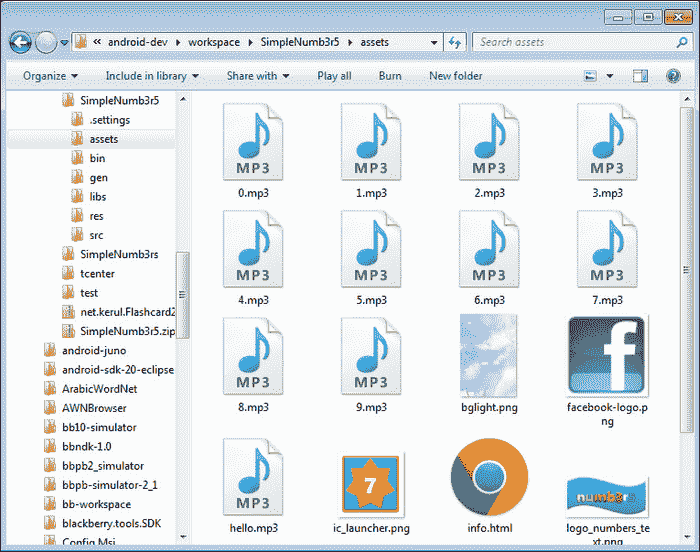

将 MP3 文件复制到 assets 文件夹。

在`onClick`方法中为`btnsound`添加代码。添加以下几行，以便当点击`btnplay`按钮时，执行名为`playSound()`的方法。这个方法将接收一个字符串参数，作为要播放的声音文件名。

`soundfile`数组变量是存储 mp3 文件名列表的变量，而`screennumber`表示屏幕上的当前数字。

```kt
//when btnplay is clicked
    else if(arg0.getId()==R.id.btnsound){
      //call the method playSound
      playSound(soundfile[screennumber].toString());
    }//end btnsound clicked
```

下一个重要的方法是`playsound`方法。这个方法将播放一个 mp3 声音文件。`soundname`参数是包含位于 Android 项目的`assets`文件夹中的声音文件名的字符串。

```kt
public void playSound(String soundName){
  Boolean mpPlayingStatus;

  try{//try to check MediaPlayer status
    mpPlayingStatus=mp.isPlaying();
  }
  catch (Exception e){
    mpPlayingStatus=false;
  }
//if the MediaPlayer is playing a sound, stop it to play new voice
  if(mp.isPlaying()){
       mp.stop(); //stop the sound
       mp.release(); //remove sound from the memory
  }
  else{
    try{
      mp = new MediaPlayer();
      AssetFileDescriptor afd = getAssets().openFd(soundName);
      //set the sound source file 

      FileDescriptor fd = afd.getFileDescriptor();
      mp.setDataSource(fd);

      mp.prepare(); // prepare for playback
      mp.start(); //play the sound

    }//try block
    catch(IOException e) {
      //display the error message in debug
      Log.i("Error playing sound: ", e.toString());
    }
  }
}//end playSound
```

以下是涉及到的变量和过程的解释：

+   `try…catch 块`: 这是一个异常处理程序，其目的是包围可能抛出异常的代码。在本例中，异常是尝试使用`MediaPlayer`播放声音文件时捕捉任何问题。如果你注意，如果某个代码执行导致异常，将执行 catch 块语句。

+   `mp`是从`MediaPlayer`类实例化的对象。

    +   `isPlaying()`: 检查`MediaPlayer`是否正在播放，`True`表示正在播放，`false`表示未播放。

    +   `setDataSource()`: 设置将要使用的数据源。在本例中，数据源是`FileDescriptor`。

    +   `prepare()`: 同步准备播放器进行播放。

    +   `play()`: 播放声音文件。

    +   `stop()`: 停止当前正在播放的声音。

    +   `release()`: 从内存中释放声音。

+   `afd`是从`AssetFileDescriptor`类实例化的变量。

    +   `getAssets()`: 通过`AssetManager` API 从`assets`文件夹中获取底层资源。

    +   `openFD()`: 打开`String`参数中指定的文件。

    +   `getFileDescriptor()`: 返回可以用来读取文件中数据的`FileDescriptor`数据源。

    +   `getStartOffSet()`: 返回此资产条目数据开始的字节偏移量

    +   `getLength()`: 返回此资产条目数据的总字节数

# 在应用中添加另一个屏幕

这个练习是在`SimpleNumb3r5`应用中添加一个信息屏幕。关于开发者、电子邮件、Facebook 粉丝页面和其他信息将在下一个屏幕上显示。由于屏幕包含大量文本信息，包括几幅图片，因此我们在这里使用 HTML 页面作为我们的方法：

1.  现在，创建一个活动类来处理新屏幕。打开`src`文件夹，右键点击包名（`net.kerul.SimpleNumb3r5`），选择**New** | **Other...**。在选项中，选择添加新的 Android 活动，然后点击**Next**按钮。接着，选择一个空白活动并点击**Next**。

1.  将活动名称设置为**Info**，如下截图所示，向导将建议屏幕布局为**info_activity**。点击**Finish**按钮。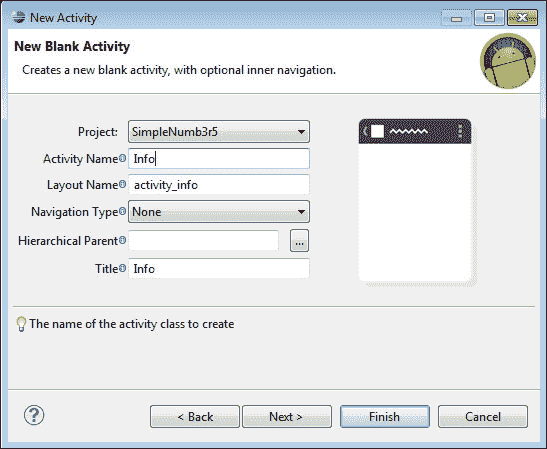

    创建一个名为 Info 的新活动

1.  将出现一个新的空白屏幕布局。移除默认的`HelloWorld`TextView。在**Palette**面板中，打开名为`Composite`的文件夹。

1.  点击并拖动 WebView 小部件。将 WebView 的 ID 更改为`webinfo`。此布局将保存在`info_activity.xml`文件中。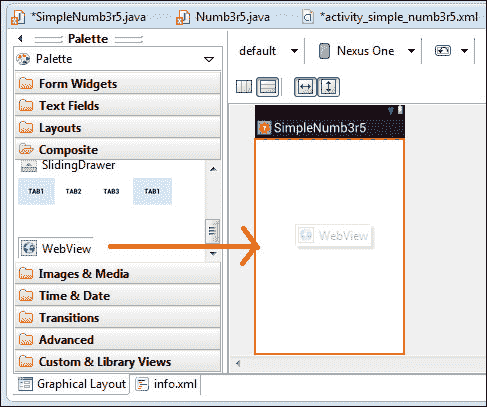

    添加一个 WebView 小部件

# 在 WebView 中添加 HTML

使用您喜欢的网页编辑器创建一个 HTML 页面，或者您可以重复使用提供的资源中的 HTML 页面（在`assets`文件夹中，文件名为`info.html`）。如下截图所示的 HTML 页面是一个包含应用信息的简单 HTML 页面。如果您发现 HTML 过于简单，请添加您自己的信息。在这个练习中，我们将把 HTML 页面和资源放在`assets`文件夹中，因此在继续之前，请将 HTML 页面的所有相关材料复制到`assets`文件夹中。


`info.html`中的 HTML 页面

接下来是编辑位于`src/net.kerul.simplenumb3r5`文件夹中的`Info.java`源代码。在现有模板中添加以下代码：

```kt
package net.kerul.simplenumb3r5;
import android.app.Activity;
import android.os.Bundle;
import android.webkit.WebView;

public class Info extends Activity {
    private WebView webinfo;
    @Override
    public void onCreate(Bundle savedInstanceState) {
        super.onCreate(savedInstanceState);
        setContentView(R.layout.activity_info);

        webinfo=(WebView)findViewById(R.id.webinfo);
        //provide the URL path pointing to info.html
        webinfo.loadUrl("file:///android_asset/info.html");
    }
}
```

让我们理解一下添加到上述模板中的以下代码行：

+   `setContentView(R.layout.activity_info)`: `R.layout.activity_info`是指之前创建的布局。

+   `webinfo.loadUrl("file:///android_asset/info.html")`: 这是加载特定 URL 的 HTML 页面的方法。指向`assets`文件夹内 HTML 文件的路径是`file:///android_asset/info.html`。这个路径在真实设备上找不到，但它提供了访问`app asset`文件的方法。

# 意图和活动

意图是对将要执行的操作的抽象描述。更具体地说，它是一个异步调用，允许应用程序从其他 Android 组件（例如服务/活动）请求功能。它可以与`startActivity()`命令一起使用来启动一个活动。在`SimpleNumb3r5.java`中的先前代码是此应用程序的主活动（或类）。我们刚刚在文件`Info.java`中创建了第二个活动（类）。为了让第二个活动出现，必须使用意图来启动它。

我们决定使用按钮`btninfo`作为触发器来调用第二个活动。再次打开文件`SimpleNumb3r5.java`，并添加以下代码以调用另一个活动。这些代码必须添加到`btninfo`按钮的`onClick`方法中。注意，这里创建了一个名为 info 的`Intent`实例。主类能够使用`startActivity()`方法调用第二个类。`Info.class`参数指的是第二个类。

```kt
  else if(arg0.getId()==R.id.btninfo){
    //invoke the Info activity
    Intent info = new Intent(this, Info.class);
    startActivity(info);
  }Adding Activity in Manifest file
```

为了通过`Intent`调用第二个类，需要修改`Manifest.xml`文件。但是，你会注意到从版本 20 开始，**Android 开发工具包**已经自动完成了这一步。如果`AndroidManifest.xml`中缺少以下代码，请手动添加：

```kt
<activity
    android:name=".Info"
    android:label="@string/title_activity_info" >
    <intent-filter>
        <action android:name="android.intent.action.MAIN" />
        <category 
android:name="android.intent.category.LAUNCHER" />
    </intent-filter>
</activity>
```

如果你需要在 WebView 中显示来自互联网的网页，你必须在`AndroidManifest.xml`中的`<application>`标签上方添加以下这行代码来声明用户权限：

```kt
<uses-permission android:name="android.permission.INTERNET" />
```

# 最终产品的运行和测试

在经历了所有这些过程之后，在模拟器中运行应用程序，你将得到以下屏幕：

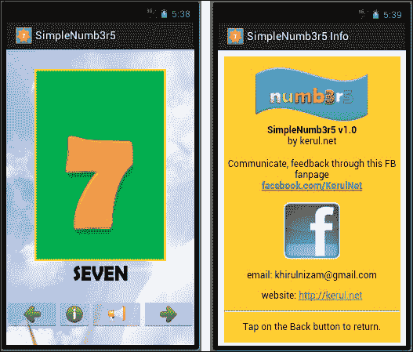

`SimpleNumb3r5`实战

# 概述

在本章中，我们探索了一种简单的方法来整合多个多媒体元素，如图片、HTML 页面和语音。最新的 SDK 比之前的任何版本都要用户友好。

在下一章中，我们将了解更多关于不同小部件的知识，如菜单、复选框、单选按钮，以及如何添加偏好设置屏幕。
