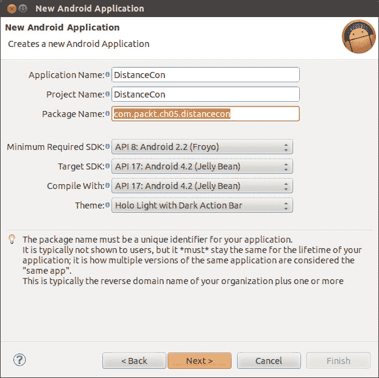
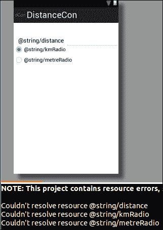
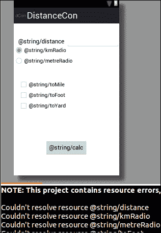
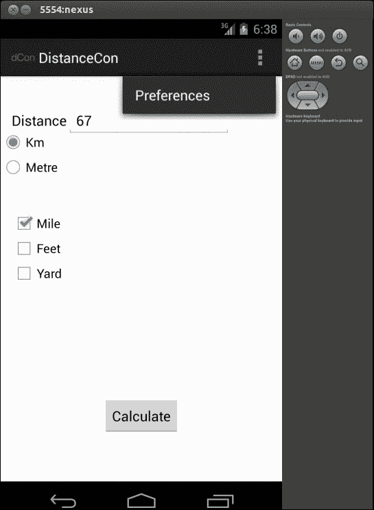
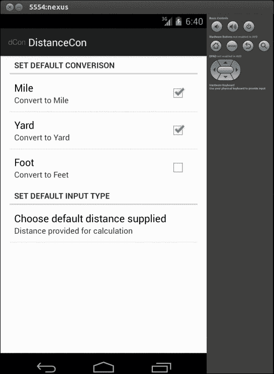

# 第五章：添加单选按钮、复选框、菜单和首选项

你是否足够兴奋？如果没有，你应该感到兴奋；我们已经完成了一半，准备探索更多常用并且在任何应用程序中都有重要意义的组件。本章将要介绍的是向应用程序添加菜单、复选框、单选按钮和首选项。我们将使用这些组件并创建`DistanceConverter`应用程序。该应用程序的主要目标是转换输入的公里/米到英里/英尺和码。以下是我们在本章中涵盖的步骤，以成功创建`DistanceConverter`应用程序：

+   创建项目：`DistanceConverter`

+   添加单选组.单选按钮

+   添加复选框

+   添加菜单

+   定义字符串

+   定义首选项屏幕

+   连接

+   绑定菜单和首选项

+   从首选项获取值

+   运行应用程序

# 创建新项目

`DistanceConverter`应用程序将允许用户输入公里/米，并将它们同时转换为英里、英尺和码。我们已经在之前的章节中介绍了如何创建新项目，因此这里我们会简短说明。让我们通过导航到**文件** | **新建** | **其他** | **Android 应用程序项目**来创建一个新项目。在相应的向导中输入以下表格中的合适数据：

| 属性 | 值 |
| --- | --- |
| 应用程序名称 | `DistanceCon` |
| 项目名称 | `DistanceCon` |
| 包名称 | `com.packt.ch05.distancecon` |
| 模板 | `BlankActivity` |
| 活动 | `MainActivity` |
| 布局 | `activity_main` |

以下屏幕显示了一些根据前表在向导中填写的数据：



# 添加单选组、单选按钮和文本字段

安卓 SDK 提供了两种单选控件，用于同时使用，在任何给定时间只能选择一个控件。单选组（`android.widget.RadioGroup`）用于封装一组单选按钮（RadioButton）控件，以达到此目的。

在我们添加单选组和单选按钮控件之前，让我们添加标签`Distance`和文本字段以允许用户输入。打开`activity_main.xml`文件，并添加以下条目：

```kt
  <TextView
        android:id="@+id/textView1"
        android:layout_width="wrap_content"
        android:layout_height="wrap_content"
        android:layout_alignParentLeft="true"
        android:layout_alignParentTop="true"
        android:layout_marginLeft="14dp"
        android:layout_marginTop="44dp"
        android:text="@string/distance "
        android:textAppearance="?android:attr/textAppearanceMedium" />
    <EditText
        android:id="@+id/distText"
        android:layout_width="wrap_content"
        android:layout_height="wrap_content"
        android:layout_alignBaseline="@+id/textView1"
        android:layout_alignBottom="@+id/textView1"
        android:layout_toRightOf="@+id/textView1"
        android:ems="10"
        android:inputType="numberDecimal|numberSigned" />
```

让我们回到同一文件中添加单选组和单选按钮。添加以下条目：

```kt
<RadioGroup android:id="@+id/distanceRadioGp"
        android:layout_width="wrap_content"
        android:layout_height="wrap_content"
        android:layout_alignParentLeft="true"
        android:layout_below="@+id/distText">
        <RadioButton android:id="@+id/kmRadiobutton"
            android:layout_height="wrap_content"
            android:layout_width="wrap_content"
            android:checked="true"
            android:text="@string/kmRadio">
        </RadioButton>
        <RadioButton  android:id="@+id/metreRadioButton"
            android:layout_width="wrap_content"
            android:layout_height="wrap_content"
            android:text="@string/metreRadio">
        </RadioButton>
</RadioGroup>
```

我们已经设置为默认选中`android:checked="true"`。完成这一步后，我们可能会看到一些错误，但不用担心，因为我们还没有定义这些字符串。

以下截图是我们在 XML 文件中添加上述代码后可能看到的内容：



# 添加复选框

我们将使用复选框（CheckBox）让用户一次性选择多种转换设施。要添加复选框，请在`activity_main.xml`中添加以下代码。我们将有三个复选框，分别对应：英里、英尺和码；使用以下方法可以实现同样的效果：

```kt
<CheckBox
        android:id="@+id/checkBoxFoot"
        android:layout_width="wrap_content"
        android:layout_height="wrap_content"
        android:layout_alignLeft="@+id/textView1"
        android:layout_below="@+id/checkBoxMile"
        android:text="@string/toFoot">   
</CheckBox>
<CheckBox
        android:id="@+id/checkBoxYard"
        android:layout_width="wrap_content"
        android:layout_height="wrap_content"
        android:layout_alignLeft="@+id/checkBoxFoot"
        android:layout_below="@+id/checkBoxFoot"
        android:text="@string/toYard">
</CheckBox>
<CheckBox
        android:id="@+id/checkBoxMile"
        android:layout_width="wrap_content"
        android:layout_height="wrap_content"
        android:layout_alignLeft="@+id/checkBoxFoot"
        android:layout_below="@+id/distanceRadioGp"
        android:layout_marginTop="40dp"
        android:text="@string/toMile">
</CheckBox>
```

还需添加一个按钮，点击它时启动转换：

```kt
<Button
        android:id="@+id/calButton"
        android:layout_width="wrap_content"
        android:layout_height="wrap_content"
        android:layout_alignParentBottom="true"
        android:layout_centerHorizontal="true"
        android:layout_marginBottom="60dp"
        android:onClick="onClick"           
        android:text="@string/calc">
</Button>
```

结果屏幕应如下所示：



# 添加菜单

我们将从菜单中调用`Preference`屏幕。实际上有三种不同的菜单可供选择：选项菜单、上下文菜单和弹出菜单。这里，我们将使用选项菜单来实现目的。在`res/menu`下添加菜单，创建一个名为`prefsetting.xml`的新文件。使用`<item></item>`元素添加以下代码来添加菜单项：

```kt
<menu 
    <item android:id="@+id/menusettings"
        android:showAsAction="never"
        android:title="Preferences"
        android:orderInCategory="100">  
    </item>
</menu>
```

菜单项的名称设置为`android:title="Preferences"`。`android:showAsAction`关键字表示项目应如何在操作栏中显示。更多菜单选项和属性请参考以下 URL：

+   [`developer.android.com/guide/topics/ui/menus.html`](http://developer.android.com/guide/topics/ui/menus.html)

+   [`developer.android.com/guide/topics/resources/menu-resource.html`](http://developer.android.com/guide/topics/resources/menu-resource.html)

# 定义字符串

在**res/values**标签下，打开`strings.xml`并添加以下条目：

```kt
<string name="menu_settings">Settings</string
    <string name="distance ">Distance</string>
    <string name="kmRadio">Km</string>
    <string name="metreRadio">Metre</string>
    <string name="calc">Calculate</string>
    <string name="toMile">Mile</string>
    <string name="toFoot">Feet</string>
    <string name="toYard">Yard</string>
```

完成此步骤后，之前的所有冗余错误应消失。

# 定义偏好设置屏幕

偏好设置是安卓应用的重要方面。它允许用户选择修改和个性化设置。偏好设置可以通过两种方式设置：第一种是在`res/xml`目录中创建`preferences.xml`文件，第二种是从代码中设置偏好设置。我们将使用前者，也就是更简单的方法，通过创建`preferences.xml`文件，如下所示：

如果不存在，则创建`xml`目录，并添加`preferences.xml`文件。每个偏好设置都需要以下属性，如下表所示：

| 属性 | 描述 |
| --- | --- |
| `android:key` | 用于获取偏好设置值 |
| `android:title` | 指定安卓标题 |
| `android:summary` | 关于偏好设置的摘要 |
| `android:defaultValue` | 可选，用于设置默认值 |

通常，有以下五种不同的偏好设置视图，如下表所示：

| 视图 | 描述 |
| --- | --- |
| `CheckBoxPreference` | 简单的复选框，返回 true/false |
| `ListPreference` | 显示 RadioGroup，仅选中 1 个条目 |
| `EditTextPreference` | 显示对话框编辑 TextView，返回字符串 |
| `RingTonePreference` | 显示铃声的 RadioGroup |
| `PreferenceCategory` | 带有偏好设置的类别 |

我们将在应用中使用`CheckBoxPreference`、`ListPreference`和`PreferenceCategory`。现在在已创建的`preferences.xml`文件中添加这些偏好设置视图。添加以下条目：

```kt
<?xml version="1.0" encoding="utf-8"?>
<PreferenceScreen  >
  <PreferenceCategory  android:title="Set Default Converison ">
      <CheckBoxPreference  android:title="@string/convertToMile"
          android:key="inputUserMile"
          android:summary="@string/summaryMile"
          android:defaultValue="false">   
      </CheckBoxPreference>
      <CheckBoxPreference  android:title="@string/convertToYard"
          android:key="inputUserYard"
          android:summary="@string/summaryYard"
          android:defaultValue="false">   
      </CheckBoxPreference>
      </PreferenceCategory>
      <CheckBoxPreference  android:title="@string/convertToFeet"
          android:key="inputUserFt"
          android:summary="@string/summaryFt"
          android:defaultValue="false">   
      </CheckBoxPreference>
      <PreferenceCategory android:title="@string/prefInputType">
      <ListPreference android:title="@string/inputTypeList"
          android:key="inputTypeKey"
          android:summary="@string/userInputSummary"
          android:entries="@array/inputEntry"
          android:entryValues="@array/inputValues">
      </ListPreference>    
      </PreferenceCategory
</PreferenceScreen>
```

这将导致出现很多错误，但是我们现在将通过定义字符串来解决这些问题。`ListPreference`提供一个列表，并且只允许选择一个项目，因此包含`android:entries,`和`android:entryValues`取数组。现在我们将为同样的内容提供数组声明，为此，在`res/values`下，如果不存在，创建`arrays.xml`文件并添加以下条目：

```kt
<?xml version="1.0" encoding="utf-8"?>
<resources>
    <string-array name="inputEntry">
        <item >Distance in Km</item>
        <item >Distance in Metre</item>
    </string-array>
    <string-array name="inputValues">
        <item >1</item>
        <item >2</item>
    </string-array>
</resources>
```

在`strings.xml`文件中定义以下字符串，这些字符串在`preferences.xml`文件中使用。

```kt
<string name="prefInputType">Set Default Input Type</string>
    <string name="userInputSummary">Distance  provided for
      calculation</string>
    <string name="convertedSummary">Summary of Conversion</string>
    <string name="convertToMile">Mile</string>
    <string name="convertToYard">Yard</string>
    <string name="convertToFeet">Foot</string>
    <string name="summaryMile">Convert to  Mile</string>
    <string name="summaryYard">Convert to Yard</string>
    <string name="summaryFt">Convert to Feet</string>
    <string name="inputTypeList">Choose default  distance supplied
      </string>
```

现在我们已经定义了偏好设置屏幕，让我们做一些工作来展示它。偏好设置框架带有`android.preference`的活动类。需要用我们的类覆盖`PreferenceActivity`。在`com.packt.ch05.distnacecon`包下创建一个`UserSettings.java`类，并编写以下代码：

```kt
package com.packt.ch05.distancecon;
import android.os.Bundle;
import android.preference.PreferenceActivity;

public class UserSettings extends PreferenceActivity {

@Override
  public void onCreate(Bundle savedInstanceState){
  super.onCreate(savedInstanceState);
    addPreferencesFromResource(R.xml.preferences);
}
}
```

`addPreferencesFromResources()`从`preferences.xml`文件加载偏好设置屏幕。

# 进行连接

在定义并放置好所有东西之后，让我们开始通过将所有内容与主屏幕（主活动）连接起来进行一些操作。打开`MainActivity.java`文件，现在让我们绑定东西。

按以下方式初始化小部件：

```kt
  private EditText text;
  private RadioButton rBtnKm;
  private RadioButton rBtnMtr;
  private CheckBox cBoxMile;
  private CheckBox cBoxFt;
  private CheckBox cBoxYd;
```

首先调用`onCreate`方法来获取小部件的实例，如下所示：

```kt
protected void onCreate(Bundle savedInstanceState) {
    super.onCreate(savedInstanceState);
    setContentView(R.layout.activity_main);
    text= (EditText)findViewById(R.id.distText);

rBtnKm=(RadioButton)findViewById(R.id.kmRadiobutton);
rBtnMtr= (RadioButton )findViewById(R.id.metreRadioButton);
cBoxMile = (CheckBox) findViewById(R.id.checkBoxMile);
cBoxFt = (CheckBox) findViewById(R.id.checkBoxFoot);
cBoxYd = (CheckBox) findViewById(R.id.checkBoxYard);
}
```

## 绑定菜单和偏好设置

我们通过`getMenuInflater().inflate(R.menu.prefsetting, menu)`命令从资源文件`prefesetting.xml`中指定我们之前定义的菜单，如下所示：

```kt
  public boolean onCreateOptionsMenu(Menu menu) {
    // Inflate the menu; this adds items to the action bar if
      it is present.
    getMenuInflater().inflate(R.menu.prefsetting, menu);
    return true;
    }
```

在菜单项选择以下`override`方法：

```kt
public boolean onOptionsItemSelected(MenuItem item) {
        switch (item.getItemId()) {
        case R.id.menusettings:
          //Get  the intent Preference Activity
          Intent i = new Intent(this, UserSettings.class);
            //Start the intent  and return the result       
            startActivityForResult(i, 1);
            break;
        }
        return true;
    }
```

`onActivityResult`在以下代码接收结果时被调用，因此在这里执行所需的操作：

```kt
protected void onActivityResult(int requestCode, int resultCode, Intent data) {
          super.onActivityResult(requestCode, resultCode, data);

          switch (requestCode) {
          case  1:
              showPreferenceSettings();
              break;
          }
      }
```

## 从偏好设置中获取值

现在，我们想要将偏好设置屏幕中设定的值反映到主屏幕上，以展示个性化设置。

我们从偏好设置屏幕获取值，并在`showPreferenceSettings()`中将其设置回主屏幕。我们通过`PreferenceManager`获取偏好设置值。

```kt
private void showPreferenceSettings(){
    SharedPreferences sharedPrefs = 
      PreferenceManager.getDefaultSharedPreferences(this);

    if(sharedPrefs.getBoolean("inputUserMile", false))
        cBoxMile.setChecked(true);
    if(sharedPrefs.getBoolean("inputUserYard", false))
        cBoxYd.setChecked(true);
    if(sharedPrefs.getBoolean("inputUserFt", false))
        cBoxFt.setChecked(true);
  }
```

当点击**计算**按钮时，应进行转换并显示结果。为了显示结果，我们在这里使用 ToastView 命令。

当点击按钮时，会调用`onClick`函数，然后我们获取单选按钮的值和选中的复选框的值，并调用相应的转换函数，然后通过以下代码通过 ToastView 显示：

```kt
public void onClick(View view ){
    StringBuffer dist =new StringBuffer();
    switch (view.getId()){
    case R.id.calButton:
      if(text.getText().length()==0){
        Toast.makeText(this, "Please enter the valid number ",
          Toast.LENGTH_LONG).show();
        return ;
      }

        double distValue=Double.parseDouble
          ((text.getText().toString()));
      //Find  RadioButton is checked
      if(rBtnKm.isChecked()){
      //Find checkBox is checked
        if(cBoxMile.isChecked()){
          double km=convertKmToMile(distValue);
          dist.append(km+"Mile.");
        }
        if(cBoxYd.isChecked()){
          double yd=convertkmToYard(distValue);
          dist.append("   "+yd+"yard.");
        }
        if(cBoxFt.isChecked()){
          double ft=convertkmToFoot(distValue);
          dist.append("   "+ft+"ft.");
        }

        Toast.makeText(this,dist,Toast.LENGTH_SHORT).show();
      }
      if(rBtnMtr.isChecked()){
        if(cBoxMile.isChecked()){
          double km=convertMToMile(distValue);
          dist.append(km+"Mile.");
        }
        if(cBoxYd.isChecked()){
          double yd=convertMtoYard(distValue);
           dist.append("   "+yd+"yard.");
         }
         if(cBoxFt.isChecked()){
           double ft=convertMtoFoot(distValue);
           dist.append("   "+ft+"ft.");
         }
         Toast.makeText(this,dist,Toast.LENGTH_SHORT).show();
       }
       return;
     }

  }
```

让我们按照以下方式为每种类型添加转换方法：

```kt
  private double convertKmToMile(double distance ){
    return (distance*0.62137);
  }

  private double convertkmToYard(double distance){
    return distance*1093.6;
  }
```

为其他选项也添加其他的转换方法。

最后，在`AndroidManifest.xml`文件中添加以下标签，表示一个活动。

```kt
<activity android:name=".UserSettings" />
```

完整的代码和资源可以在可下载的源代码中获得。

# 运行应用程序

当我们运行应用程序时，应该出现以下屏幕，其中第一个屏幕接受输入，点击**计算**按钮时输出作为 ToastView 弹出显示：



下面的截图展示了偏好设置屏幕：



# 本章小结

在本章中，我们了解了如何开始使用诸如复选框（CheckBox）、单选按钮（RadioButton）以及与其配合使用的菜单、创建自定义偏好设置视图并从中获取值等小部件。此外，我们使用这些概念创建了`DistanceConverter`应用程序。

在下一章中，我们将学习如何处理这个应用程序的各种屏幕类型和方向。
