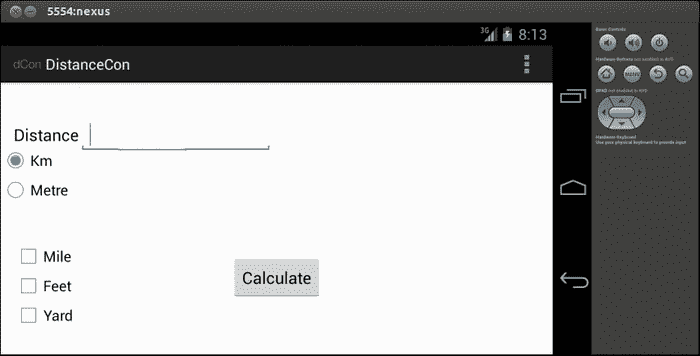
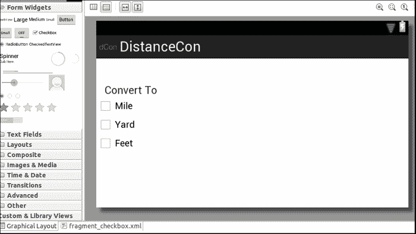
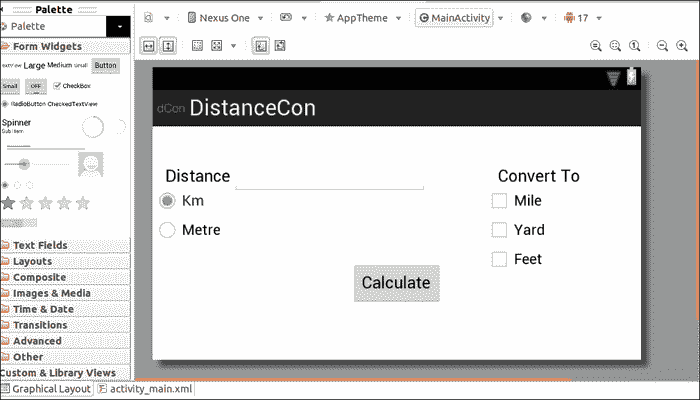
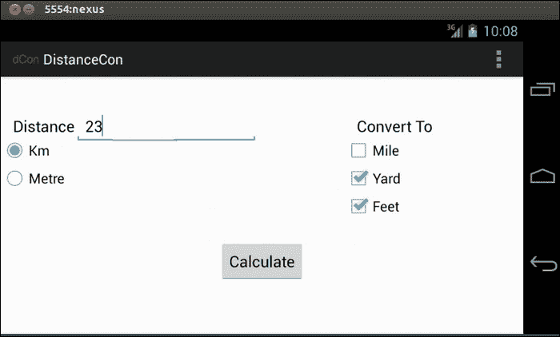
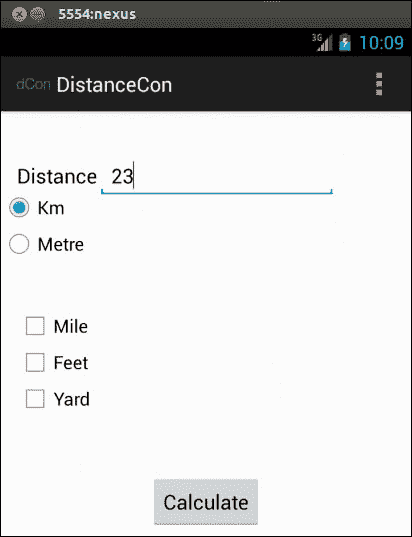
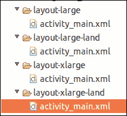

# 第六章：处理多种屏幕类型

安卓设备有各种形状和大小。为了更广泛的受众，处理不同设备上的多种屏幕类型是关键。在本章中，我们将学习如何应对不同的屏幕方向变化和不同的屏幕类型。我们将使用之前讨论的`DistanceConverter`应用程序，并进行更改以适应实现此目的所需的不同概念：

+   使用`wrap_content`和`match_parent`适应不同屏幕

+   介绍片段（Fragment）

+   定义片段和横屏布局

+   在主布局文件中挂钩

+   运行应用程序

+   为平板电脑优化

+   在状态转换期间持久化状态信息

### 提示

我们将使用之前章节中的`DistanceConverter`应用程序，并使用片段来定义横屏布局，以适应不同的屏幕方向和类型。

# 使用`wrap_content`和`match_parent`

为了满足市场上各种安卓设备的需求，应用程序需要兼容不同的屏幕尺寸。例如，布局应适应不同的屏幕尺寸，相应的视图也应相应调整大小。为了确保我们使用`wrap_content`和`match_parent`来设置视图组件的宽度和高度，请参考以下内容：

+   `wrap_content`：确保视图的宽度和高度设置为适应内容所需的最小尺寸

+   `match_parent`：在 API 级别 8 之前，它被称为`fill_parent`，确保组件扩展以匹配其父视图的大小

因此，使用这些属性确认了我们的观点，即使用所需的空间并扩展以填充可用空间。在`DistanceConverter`应用程序中，我们在布局文件中的组件里使用了这些属性。下面是来自我们之前的应用程序`activity_main.xml`的一个小代码片段，以演示其用法：

```kt
<RelativeLayout 

  android:layout_width="match_parent"
  android:layout_height="match_parent"
  tools:context=".MainActivity" >
  <RadioGroup android:id="@+id/distanceRadioGp"
    android:layout_width="wrap_content"
    android:layout_height="wrap_content"
    android:layout_alignParentLeft="true"
    android:layout_below="@+id/distText">
</RelativeLayout>
```

# 片段

**片段（Fragment）**是一个独立的组件，可以连接到一个活动（Activity）或简单地视为子活动。它通常定义了一部分用户界面，但也可以不存在用户界面，即无头。片段的实例必须存在于一个活动中。

片段简化了不同布局中组件的复用。片段是实现不同类型屏幕上用户界面差异化的方式。最流行的用法是构建适用于手机的单一窗格布局和适用于平板电脑（大屏幕）的多窗格布局。片段在 Android 3.0 API 11 中引入。片段还可以用于支持纵向和横向的不同布局。

当活动停止时，片段也会停止，当活动被销毁时，片段也会被销毁。`OnCreateView()`方法是创建视图 UI 的地方，通过`inflate()`方法调用。以下是之前代码中我们的应用程序在横向方向上的截图：



在接下来的章节中，我们将使用片段为我们的 DistanceConverter 应用程序定义一个景观布局。

## 定义片段和景观布局

让我们对横向模式下的布局进行更改。为了支持横向模式的不同布局，在`res`文件夹中创建一个`layout-land`文件夹。在它下面创建一个`activity_main.xml`文件，并添加以下代码：

```kt
<RelativeLayout 

  android:layout_width="match_parent"
  android:layout_height="match_parent"
  tools:context=".MainActivity" >
    <TextView
      android:id="@+id/textView1"
      android:layout_width="wrap_content"
      android:layout_height="wrap_content"
      android:layout_alignParentLeft="true"
      android:layout_alignParentTop="true"
      android:layout_marginLeft="14dp"
      android:layout_marginTop="44dp"
      android:text="@string/distance "
      android:textAppearance="?android:attr/textAppearanceMedium"/>
    <EditText
      android:id="@+id/distText"
      android:layout_width="wrap_content"
      android:layout_height="wrap_content"
      android:layout_alignBaseline="@+id/textView1"
      android:layout_alignBottom="@+id/textView1"
      android:layout_toRightOf="@+id/textView1"
      android:ems="10"
      android:inputType="numberDecimal|numberSigned" />
    <RadioGroup android:id="@+id/distanceRadioGp"
      android:layout_width="wrap_content"
      android:layout_height="wrap_content"
      android:layout_alignParentLeft="true"
      android:layout_below="@+id/distText"
    <RadioButton android:id="@+id/kmRadiobutton"
      android:layout_height="wrap_content"
      android:layout_width="wrap_content"
      android:checked="true"
      android:text="@string/kmRadio">
    </RadioButton>
    <RadioButton android:id="@+id/metreRadioButton"
      android:layout_width="wrap_content"
      android:layout_height="wrap_content"
      android:text="@string/metreRadio">
    </RadioButton>
    </RadioGroup>
    <Button
      android:id="@+id/calButton"
      android:layout_width="wrap_content"
      android:layout_height="wrap_content"
      android:layout_alignParentBottom="true"
      android:layout_centerHorizontal="true"
      android:layout_marginBottom="60dp"
      android:onClick="onClick"
      android:text="@string/calc"
    </Button>
</RelativeLayout>
```

在同一文件夹下创建一个`fragment_checkbox.xml`文件，以定义片段的 UI。在其中添加以下代码：

```kt
<?xml version="1.0" encoding="utf-8"?>
<LinearLayout 
  android:layout_width="match_parent"
  android:layout_height="match_parent"
  android:orientation="vertical" >
  <TextView>
    android:id="@+id/textView1"
    android:layout_width="wrap_content"
    android:layout_height="wrap_content"
    android:layout_marginLeft="14dp"
    android:layout_marginTop="44dp"
    android:text="@string/convertTo"
    android:textAppearance="?android:attr/textAppearanceMedium" />
  <CheckBox
    android:id="@+id/checkBoxMile"
    android:layout_width="wrap_content"
    android:layout_height="wrap_content"
    android:text="@string/toMile" />
  <CheckBox
    android:id="@+id/checkBoxYard"
    android:layout_width="wrap_content"
    android:layout_height="wrap_content"
    android:text="@string/toYard" />
  <CheckBox
    android:id="@+id/checkBoxFoot"
    android:layout_width="wrap_content"
    android:layout_height="wrap_content"
    android:text="@string/toFoot" />
</LinearLayout>
```

之前代码中的片段布局如下截图所示：



在放下片段的布局之后，让我们通过继承`android.app.Fragment`类来定义片段。让我们创建一个名为`ConvertToFragment`的片段类，并使用以下代码：

```kt
@TargetApi(Build.VERSION_CODES.HONEYCOMB)
public class ConvertToFragment extends Fragment{
  @Override
  public View onCreateView(LayoutInflater inflater, ViewGroup container,Bundle savedInstanceState) {
    View view = inflater.inflate(R.layout.fragment_checkbox,
      container, false);
    return view;
  }
}
```

由于片段在 Android 3.0（也称为 API 11）中可用，我们在顶部放置了`@TargetApi(Build.VERSION_CODES.HONEYCOMB)`。对于低 API 级别的设备，将没有片段，在这种情况下，我们不得不在`res/layout-land`文件夹下的`activity-main.xml`中定义和排列视图。

若要在低 API 级别强制使用片段，请使用支持库，这是一个 JAR 文件，允许我们使用最新的 Android API。更多信息，请参考[`developer.android.com/training/basics/fragments/support-lib.html`](http://developer.android.com/training/basics/fragments/support-lib.html)。

在`onCreateView()`方法中，我们通过`inflate()`方法从 XML 中填充视图。

## 在主布局文件中连接

打开`res/layout-land`中的`activity_main.xml`文件，并添加以下代码：

```kt
<fragment
  android:id="@+id/convertToCheckBox"
  android:layout_width="wrap_content"
  android:layout_height="match_parent"
  android:layout_alignParentTop="true"
  android:layout_marginLeft="45dp"
  android:layout_toRightOf="@+id/calButton"
  class="com.packt.ch05.distancecon.ConvertToFragment"
  tools:layout="@layout/fragment_checkbox" />
```

`class`指向相应的片段类。`tools:layout`指向相应片段的布局。

在上述步骤之后，图形布局屏幕应如下截图所示：



# 运行应用程序

现在我们完成了所有编程工作，让我们看看最终的应用程序会是什么样子。横向模式下的应用程序如下截图所示：



纵向模式下的应用程序如下截图所示：



### 提示

使用*Ctrl*+*F11*在模拟器中从纵向模式切换到横向模式，反之亦然。

# 针对平板电脑进行优化

平板电脑是当前环境下另一种新兴的 Android 设备。我们也应该定义布局以支持平板设备。为了适应平板设备，或者说大型设备，我们需要在`res/layout-xlarge`文件夹（用于纵向模式）和`layout-xlarge-land`（用于横向模式）下定义另一组布局。以下快照显示了为大型设备（平板电脑）定义布局的文件夹和文件：



一旦我们创建了相应的文件夹，就可以像之前演示的那样使用片段来创建不同的布局，并实现支持平板电脑的目标。

# 在状态转换期间保持状态信息

你可能已经注意到，在屏幕模式从横屏切换到竖屏，或者从竖屏切换到横屏后，复选框的状态并没有保持。这是我们应当了解的一个非常重要的概念。每次屏幕方向改变时，活动都会被销毁，然后重新创建。`onCreate()`方法会被调用，因此活动的当前状态会丢失。我们需要使用`onSaveInstanceSate`方法保存状态，并通过`onRestoreInstanceState`方法恢复它。下面我们将重写这些方法来实现这一点：

```kt
@Override
  public void onSaveInstanceState(Bundle outState)
  {
    //---save whatever you need to persist—
    outState.putBoolean("mileChecked",cBoxMile.isChecked());
    outState.putBoolean("ydChecked",cBoxYd.isChecked());
    outState.putBoolean("ftchecked",cBoxFt.isChecked());
    super.onSaveInstanceState(outState);
  }
@Override
  public void onRestoreInstanceState(Bundle savedInstanceState)
  {
    super.onRestoreInstanceState(savedInstanceState);
    //---retrieve the information persisted earlier---
    cBoxFt.setChecked(savedInstanceState.getBoolean("ftchecked"));
    cBoxMile.setChecked(savedInstanceState.getBoolean("mileChecked"));
    cBoxYd.setChecked(savedInstanceState.getBoolean("ydChecked"));
  }
```

若要查看完整的源代码，请访问[`www.packtpub.com/support`](http://www.packtpub.com/support)。关于处理不同屏幕类型的更多信息，请参考以下 URL：

+   [`developer.android.com/training/multiscreen/screensizes.html`](http://developer.android.com/training/multiscreen/screensizes.html)

+   [`developer.android.com/distribute/googleplay/quality/tablet.html`](http://developer.android.com/distribute/googleplay/quality/tablet.html)

# 总结

在本章中，我们学习了片段及其使用方法，并使用它为我们的应用程序 DistanceConverter 在不同的横屏模式下实现了不同的布局。我们还学习了如何处理不同的屏幕类型，并在屏幕模式更改期间保持状态。在下一章中，我们将学习如何添加外部库，例如`AdMob`，并在应用程序中嵌入广告。
