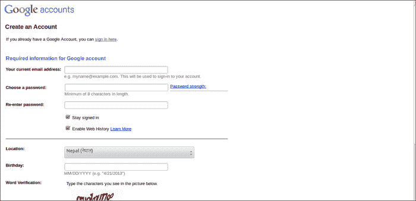
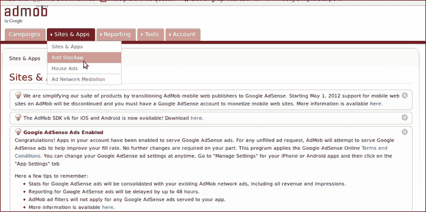
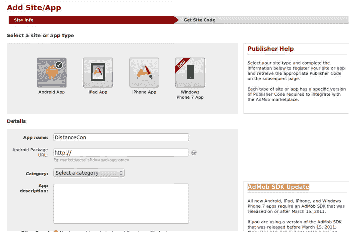
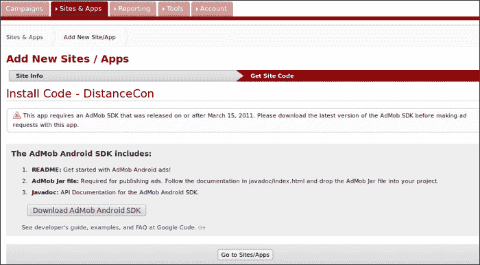
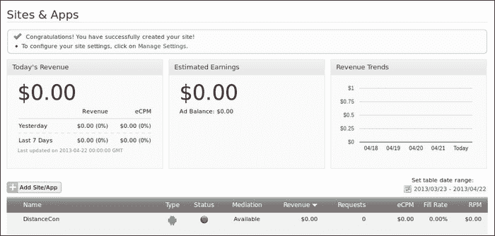
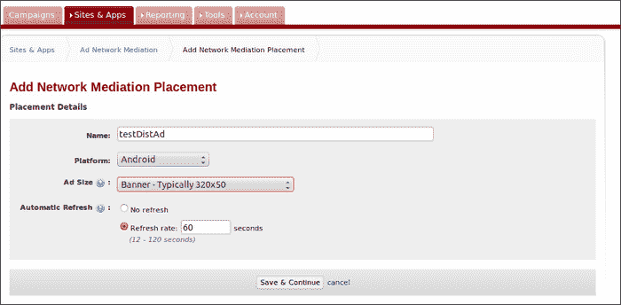
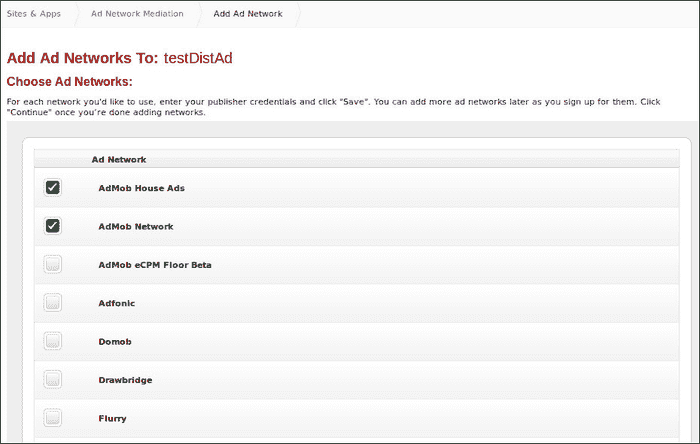
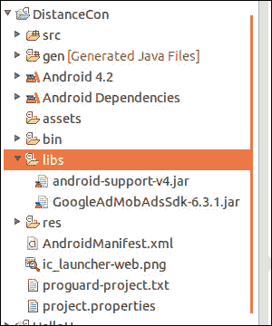
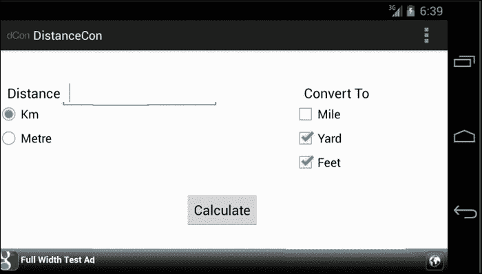
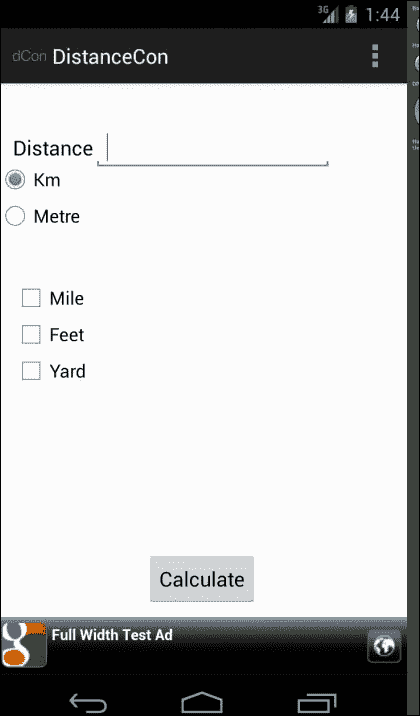

# 第七章：添加外部库

一个 Android 应用无法独立完成所有功能，它总是需要外部 jars/库的陪伴来实现不同的目标和提供各种服务。几乎每个在商店发布的免费 Android 应用都嵌入了广告，这需要使用外部组件来实现。在 Android 应用中嵌入广告是当今应用开发的一个重要方面。在本章中，我们将继续使用前几章开发的 DistanceConverter 应用，并利用外部库`AdMob`在我们的应用中嵌入广告。内容包括以下方面：

+   在`AdMob`网站创建一个账户

+   添加站点/应用

+   添加广告沉思网络

+   在应用中添加`AdMob`

+   在清单文件中进行更改

+   在布局文件中添加`AdMob`小部件/视图

+   运行应用程序

# 在 AdMob 网站创建一个账户

`AdMob`是我们在 Android 应用中嵌入广告的一种方式。要使用`AdMob`，我们首先需要在[`www.admob.com`](http://www.admob.com)网站注册并获取一个账户。注册时，请访问该网站，并在右侧点击**使用 AdMob 注册**，然后填写表格进行注册。

下面的截图展示了注册表格：



如果我们有现有的 Google ID，可以使用它，否则前面的步骤会创建一个并将其与`AdMob`账户关联。

## 添加站点/应用

创建账户后，我们需要添加一个站点/应用（基本上，它标识或作为广告网络放置广告的唯一句柄）。添加站点/应用需要执行以下步骤：



1.  从**站点与应用**菜单中选择**添加站点/应用**，如前一个截图所示。随后会出现**添加站点/应用**的屏幕，如下一个截图所示：

1.  选择**Android 应用**，如前一个截图所示，并填写其他详细信息。因为我们的应用不在市场，所以在**Android 包 URL**中使用**http://**，如前一个截图所示。

1.  选择相应的类别，在本例中我们使用了**工具**，并在**应用描述**文本区域添加一些描述。同时，其他字段保持默认，输入验证码并创建站点。这之后会出现以下屏幕：

1.  接下来，点击**下载 AdMob Android SDK**按钮下载`AdMob` SDK。下载 SDK 后，点击**前往站点/应用**按钮，我们的站点应该已经被添加，并会出现在站点列表中，如下一个截图所示：

1.  **状态**显示为红色，因为它还没有收到对该网站的任何广告请求。一旦开始收到对该网站的广告请求，它将自动变为绿色。

## 选择广告网络调解

添加网站/应用程序并下载 SDK 完成后，让我们开始添加**广告网络调解**（**AdMob 调解**）。它与其他广告网络协调，帮助我们最大化填充率（表示满足应用发送的广告请求的广告请求的百分比）并增加货币化。它确保随时选择合适的网络来投放广告。有关 AdMob 调解的更多信息，请参考以下网址：

[`support.google.com/admob/topic/2403413?hl=en&ref_topic=1307209`](https://support.google.com/admob/topic/2403413?hl=en&ref_topic=1307209)

要添加广告网络调解，请按照给定的步骤操作：

1.  导航到**网站与应用**菜单下的**广告网络调解**，按照以下步骤操作，如下图所示：

1.  选择**广告大小**为**横幅 - 通常 320x50**，以支持大多数 iPhone 和 Android 手机在纵向模式下的显示，以及**平台**为**Android**。

    有关横幅大小和决策的更多信息，请参考以下网址：

    [`developers.google.com/mobile-ads-sdk/docs/admob/smart-banners`](https://developers.google.com/mobile-ads-sdk/docs/admob/smart-banners)

1.  接下来，选择**自动刷新**，然后指定**刷新率**，然后点击**保存并继续**按钮。将会出现以下屏幕。从中选择**广告网络**，然后如以下截图所示点击**继续**：

1.  从前一个截图中的选项中选择您希望的网络。

### 注意

我们需要在屏幕底部为所选的网络提供发布者凭据。在本例中，我们有 `AdMob` 的凭据，因为我们刚刚注册并且只选择了**AdMob 网络**，如前一个截图所示。然而，只要我们有凭据详情，我们可以自由添加任何数量的网络。此外，我们可以在任何时间点添加任何网络。

## 将 AdMob SDK 添加到项目中

让我们解压之前下载的 `AdMob SDK zip` 文件，应该会得到文件夹 `GoogleAdMobAdsSdkAndroid-6.*.*`。在该文件夹下有一个 `GoogleAdMobAdsSdk-6.x.x.jar` 文件。将这个 JAR 文件复制到项目的 `libs` 文件夹中，如下截图所示：



可以以同样的方式添加其他 Java 库以在我们的项目中使用，并且为了在项目中引用 Android 库，相关信息可以在以下网址找到：

[`developer.android.com/tools/projects/projects-eclipse.html`](http://developer.android.com/tools/projects/projects-eclipse.html)

## 在清单文件中做出更改

`AdMob`需要通过互联网请求来获取广告。因此，需要在`AndroidManifest.xml`文件中添加此权限，如下代码所示：

```kt
<uses-permission android:name="android.permission.INTERNET" />
<uses-permission android:name="android.permission.ACCESS_NETWORK_STATE" />
```

换句话说，它还有助于 AdMob SDK 在发送请求之前确定当前可用的互联网连接。

同时，在文件中添加负责获取和显示广告的`AdView`活动，如下代码所示：

```kt
<activity
android:name="com.google.ads.AdActivity"android:configChanges="keyboard|keyboardHidden|orientation|screenLayout|uiMode|screenSize|smallestScreenSize" /> 
```

有关集成的更多信息，请参考以下 URL：

[`developers.google.com/mobile-ads-sdk/docs/`](https://developers.google.com/mobile-ads-sdk/docs/)

## 在布局文件中添加 AdMob 小部件/视图

要添加`AdMob`视图，请在竖屏模式的`layout/activity_main.xml`文件中添加以下代码：

```kt
<com.google.ads.AdView
  android:id="@+id/adView"
  android:layout_width="fill_parent"
  android:layout_height="wrap_content"
  android:layout_alignParentBottom="true"
  ads:adSize="SMART_BANNER"
  ads:testDevices="TEST_EMULATOR"
  ads:adUnitId="a1516e8871e5b38"
  ads:loadAdOnCreate="true"/>
```

同样，在横屏模式的`layout-land/activity_main.xml`文件中添加同一部分代码。添加后，将显示错误，这是因为我们还没有为`AdView`定义命名空间。我们接下来会做这个，错误就会消失。

在 XML 的顶部命名空间部分，与其他命名空间一起添加`meta`标签：

让我们回顾一下之前使用过的`AdView`的一些重要标签及其值：

| 项目 | 值 |
| --- | --- |
| `ads:adSize` | `SMART_BANNER`：根据屏幕类型和方向使用屏幕宽度调整横幅大小。 |
| `ads:testDevices` | 用于测试代码是否正常。`TEST_EMULATOR`用于模拟器。如果用于测试，也可以指定设备 ID。从开发转移到生产时应移除。找到设备 ID 的最简单方法是从`AdMob` SDK 的日志输出中。 |
| `ads:adUnitId` | 发布者 ID。替换为相应的 ID。 |
| `ads:loadAdOnCreate` | 通过膨胀创建视图，并向`AdMob`发送广告请求。 |

在前一个案例中，我们是通过 XML 加载`Adview`并发出请求。还有一种方法，通过在`MainActivity.java`文件的`onCreate()`方法中放置以下代码来实现，如下代码片段所示：

```kt
adView = (AdView)findViewById(R.id.adView);
AdRequest re = new AdRequest();
re.setTesting(true);
adView.loadAd(re)
```

### 提示

在 Android 应用准备发布到商店之前，确保移除测试模式。

# 运行应用程序

经过所有辛勤的工作后，让我们运行应用程序来看看它的样子。在横屏模式下，广告将如下截图所示出现：



在竖屏模式下，广告将如下截图所示出现：



第一次`AdMob`广告可能需要 1 到 2 分钟才能显示，所以请耐心等待。

# 总结

在本章中，我们学习了如何通过在 DistanceConverter 应用程序中整合`AdMob`移动广告，来添加外部库。

在下一章中，我们将学习签署并准备发布应用程序需要什么。
