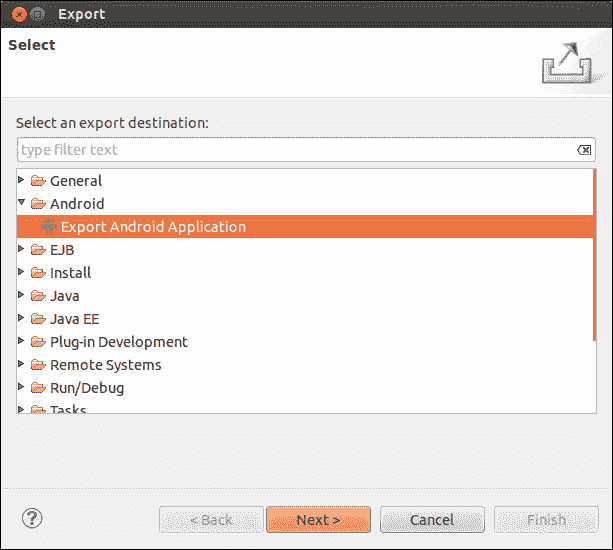
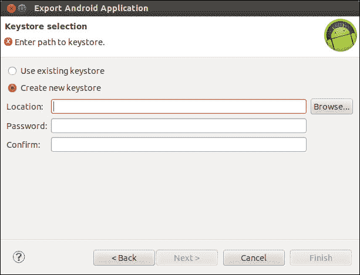
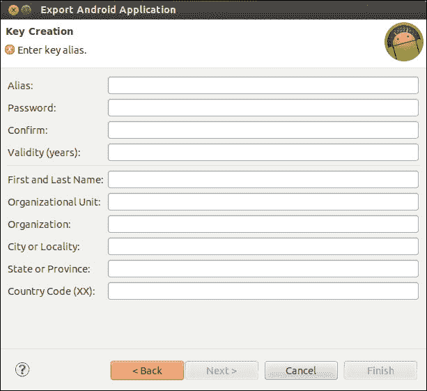

# 第八章：签名和分发 APK

所有至今为止的辛勤工作，除非我们分发应用供他人使用，否则都是徒劳的。安卓应用在上架分发前必须进行签名。任何安卓应用，无论是用于模拟器，还是分发给朋友、亲戚测试，或者发布到 Google Play 商店，都需要进行电子签名。在本章中，我们将学习如何签名并发布供他人使用。本章将涵盖以下内容：

+   APK (Android 包)

+   准备发布

+   发布编译

+   生成私钥

+   使用 Eclipse ADT 进行发布

+   发布到 Google Play

# APK – 安卓包

**安卓包**（**APK**）简单来说，类似于可运行的 JAR 或可执行文件（在 Windows 操作系统上），它包含了运行应用所需的一切。

安卓生态系统使用虚拟机，即**Dalvik 虚拟机**（**DVM**）来运行 Java 应用。Dalvik 使用自己的字节码，这与 Java 字节码有很大不同。

Android SDK 下的工具`dx`将我们的 Java 类转换为`.dex`（**Dalvik 可执行文件**）。

工具**aapt**（**安卓资源打包工具**）将`.dex`文件和应用资源（XML 和图片）打包到`.apk`文件中。

# 准备发布

经过编码和测试的辛勤工作后，应用需要被打包以便发布。打包包括以下步骤。

## 发布编译

这是发布和分发的第一步。它包括在应用的清单文件中设置包名，配置应用属性，以及发布前的编译。它们包括以下步骤：

+   **选择合适的包名**：一旦应用发布，就无法撤回，因此需要仔细考虑并选择一个合适的包名。包名可以在应用的清单文件中设置。

+   **禁用调试**：我们需要确保在发布之前禁用调试。要禁用调试，可以在代码中注释或移除`Log()`方法调用。此外，通过从`<application>`标签中移除`android:debuggable`属性也可以禁用调试。

+   **指出应用图标**：每个应用都需要有自己的图标。请确保图标遵循图标指南：[`developer.android.com/guide/practices/ui_guidelines/icon_design_launcher.html`](http://developer.android.com/guide/practices/ui_guidelines/icon_design_launcher.html)。图标可以通过使用`<application>`标签的 icon 属性来指定。

**版本控制**：这是发布和维护最重要的方面。版本标识应用程序的发布版本，并确定其更新方式。简单来说，每次发布时版本号必须递增。如果没有版本号，未来更新几乎是不可能的。版本信息由以下两个属性提供：

| `android:versionCode` | 这是一个表示应用程序版本的整数。 |
| --- | --- |
| `android:versionName` | 这是显示给用户以识别设备中安装内容的字符串。 |

这两个属性都可以在 `<manifest>` 元素下指定。

+   **检查权限清单文件**：它应该只使用 `<uses-permission>` 标签在清单文件中指定相关权限。

## 生成私钥

安卓应用程序必须使用我们自己的私钥进行签名。它标识与该应用程序相关联的人、公司或实体。这可以通过使用 Java SDK 中的程序 `keytool` 来生成。以下命令用于生成密钥：

```kt
keytool -genkey -v -keystore <filename>.keystore -alias <key-name> -keyalg RSA -keysize 2048 -validity 10000

```

我们可以为每个发布的应用程序使用不同的密钥，并为它指定一个不同的名称以进行标识。另外，谷歌期望有效期至少为 25 年或更长时间。一个非常重要的考虑是要备份并安全地存储密钥，因为一旦密钥泄露，就不可能更新已经发布的应用程序。

## 签名

获取私钥后，我们需要对应用程序进行签名。这是使用 Java SDK 中的程序 `jarsigner` 完成的。使用以下命令：

```kt
jarsigner -verbose -sigalg MD5withRSA -digestalg SHA1 -keystore my-release-key.keystore 
my_application.apk alias_name

```

## 对齐

一旦 APK 文件被签名，就需要对其进行优化。为此，我们使用 Android SDK 中的 `tools/` 目录下的 `zipalign` 工具。使用方法如下：

```kt
zipalign -v 4 your_project_name-unaligned.apk your_project_name.apk
```

# 使用 Eclipse ADT 发布

使用 Eclipse **Android 开发工具** (**ADT**)，*准备发布* 部分中提到的所有步骤都可以轻松完成。让我们使用 Eclipse ADT 为前一章中的 DistanceConverter 准备发布。

按照以下步骤操作：

1.  右键点击项目 **DistanceConverter**，然后从上下文菜单中选择 **Export**。选择 **Export Android Application**，如下所示截图：

1.  **Export** 向导现在将指导您完成签名过程，包括选择私钥的步骤（如果已经使用工具生成），或者创建新的密钥库和私钥。以下是一些截图，第一张是创建密钥库的截图。

1.  现在选择 **Create new keystore** 并提供 **Location** 和 **Password** 的值：

1.  在以下屏幕中，我们可以根据下表输入有关密钥创建的其他详细信息：

1.  在**导出 Android 应用**向导中，填写相应的详细信息：

    | 字段 | 值 |
    | --- | --- |
    | **别名** | `DIS` – 这是密钥别名名称 |
    | **密码** | `<密码>` |
    | **有效期** | `25` – 对于在 Google Play 上发布，截至 2033 年 10 月 22 日的期限是必须的 |
    | **名字和姓氏** | `<姓名>` |
    | **组织单位** | 个人 |
    | **组织** | 个人 |
    | **市/地区** | `<城市名称>` |
    | **州/省** | `<州名称>` |
    | **国家代码(xx)** | 两个字母代码（例如，US） |

1.  点击**完成**，结果就会被编译、签名、对齐，并准备好分发。

# 发布到 Google Play

在 Google Play 上发布非常简单，包括以下步骤：

+   **注册 Google Play**: 访问并注册[`play.google.com/`](https://play.google.com/)。注册需要 25 美元，过程相当直接，可能需要几天时间才能获得最终访问权限。

+   **上传 APK**: 注册完成后，用户需要登录并使用**上传应用**链接上传 APK 文件。此外，他们还需要上传所需的资源，并编辑列表详情，这些是用户在商店浏览应用时将看到的内容。

+   使用**发布**按钮来完成这项任务。

## 获取帮助

有关签名和发布的更多信息和支持，请参考以下链接：

+   [应用签名](http://developer.android.com/tools/publishing/app-signing.html)

+   [版本管理](http://developer.android.com/tools/publishing/versioning.html)

+   [准备发布](http://developer.android.com/tools/publishing/preparing.html)

# 摘要

在本章中，我们了解了签名和分发 APK 涉及的步骤，以及如何通过 Eclipse ADT 轻松实现这一过程。
