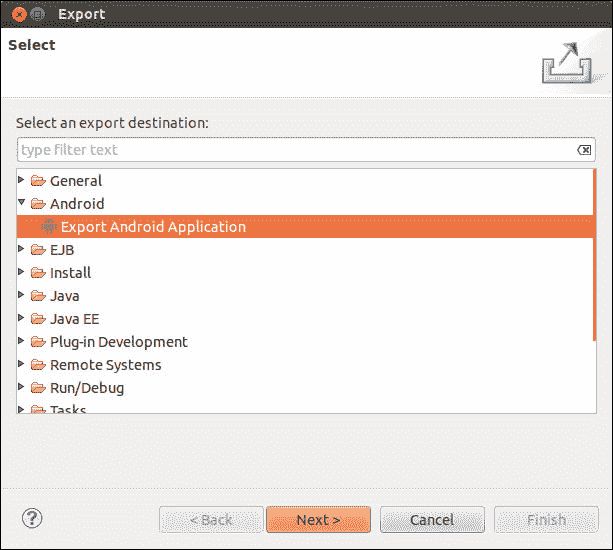
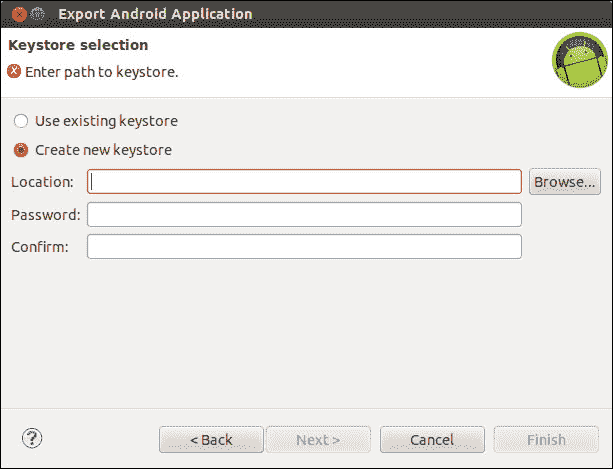

# 八、签署和分发 APK

到目前为止所做的所有努力都不会有回报，除非我们将我们的应用分发给其他人使用。一个安卓应用必须先签名，然后才能在雷达上发布。任何安卓应用，无论是在模拟器中使用还是分发给朋友、相关测试或发布到谷歌游戏商店，都需要电子签名。在这一章中，我们将学习如何签名并发布给其他人使用。本章将包括以下内容:

*   APK (Android 包)
*   准备发布
*   为发布而编译
*   生成私钥
*   使用 Eclipse ADT 进行发布
*   发布到谷歌游戏

# apk–Android 包

**安卓包** ( **APK** )简单来说，类似于可运行的 JAR 或可执行文件(在 Windows 操作系统上)，它包含运行应用所需的一切。

安卓生态系统使用虚拟机，即**达尔维克虚拟机** ( **DVM** ) 运行 Java 应用。Dalvik 使用自己的字节码，与 Java 字节码有很大不同。

Android SDK 下的一个工具`dx`将我们的 Java 类转换为`.dex` ( **达尔维克可执行文件**)。

应用的`.dex`文件和资源(XML 和图像)由工具 **aapt** ( **安卓资产打包工具** ) 打包成`.apk`文件。

# 准备释放

经过编码和测试的艰苦工作后，应用需要打包发布。打包包括以下步骤。

## 编译发布

这是走向发布和分发的第一步。它包括在应用的清单文件中设置包名、配置应用属性以及发布前的编译。它们包括以下步骤:

*   **选择合适的包名**:一旦应用被发布，它就不能被撤销，因此需要考虑并选择合适的包名。包名可以在应用的清单文件中设置。
*   **禁用调试**:我们需要确保在发布之前禁用调试。要禁用调试，请注释或删除代码中的`Log()`方法调用。此外，可以通过从`<application>`标签中移除`android:debuggable`属性来禁用调试。
*   **指出应用图标**:每个应用都需要有自己的图标。请确保图标遵循图标指南 a:[http://developer . Android . com/guide/practices/ui _ guidelines/icon _ design _ launcher . html](http://developer.android.com/guide/practices/ui_guidelines/icon_design_launcher.html)。可以使用`<application>`标签的图标属性来指定图标。

**版本化**:这是发布最重要的方面，也是维护。版本标识了应用的发布版本，并决定了它应该如何更新。简单来说，版本号必须随着每个发布的版本而递增。没有合适的版本，未来的更新是不可能的。版本信息由以下两个属性提供:

<colgroup><col style="text-align: left"> <col style="text-align: left"></colgroup> 
| `android:versionCode` | 它是代表应用版本的整数。 |
| `android:versionName` | 它是向用户显示的字符串，用于标识设备中安装了什么。 |

这两个属性都可以在`<manifest>`元素下指定。

*   **查看清单文件中的权限**:应该只使用`<uses-permission>`标签在清单文件中指定相关权限。

## 生成私钥

安卓应用必须使用我们自己的私钥进行签名。它标识与应用相关联的个人、公司或实体。这可以使用来自 Java SDK 的程序`keytool`生成。以下命令用于生成密钥:

```java
keytool -genkey -v -keystore <filename>.keystore -alias <key-name> -keyalg RSA -keysize 2048 -validity 10000

```

我们可以为每个发布的应用使用不同的键，并指定不同的名称来识别它。此外，谷歌预计有效期至少为 25 年或更长。需要考虑的一件非常重要的事情是保留一个备份并安全地存储密钥，因为一旦密钥被泄露，就不可能更新已经发布的应用。

## 签约

获得私钥后，我们需要签署申请。这是使用一个来自 Java SDK 的程序`jarsigner`完成的。使用以下命令:

```java
jarsigner -verbose -sigalg MD5withRSA -digestalg SHA1 -keystore my-release-key.keystore 
my_application.apk alias_name

```

## 对齐

一旦 APK 被签署，它需要被优化，为此我们使用`tools/`目录下安卓软件开发工具包提供的`zipalign`工具。用法如下:

```java
zipalign -v 4 your_project_name-unaligned.apk your_project_name.apk
```

# 使用 Eclipse ADT 进行发布

使用 Eclipse **安卓开发工具** ( **ADT** )可以轻松完成*准备发布*部分的所有上述步骤。让我们为使用 Eclipse ADT 发布的前一章准备一下我们的 DistanceConverter。

遵循给定的步骤:

1.  Right-click on the project **DistanceConverter** and then select **Export** from the context menu. Select **Export Android Application**, as shown in the following screenshot:

    

2.  **导出**向导现在将指导您完成签名过程，包括选择私钥(如果已经使用工具生成)或创建新密钥库和私钥的步骤。下面的一些屏幕被捕获，第一个屏幕截图是密钥库的创建。
3.  Now select **Create new keystore** and provide the **Location** and **Password** values:

    

4.  In the following screen we can enter other details about the key creation as specified in the next table:

    

5.  In the **Export Android Application** wizard, Fill in the respectful details: [ T26 T27 T28 T29 T30 T31 Alias T32 T33 T34 T35 T36 Tt0 is the key alias T37 T38 T39 T40 T40 43] Password

    `<CITY NAME>`

    <colgroup><col style="text-align: left"> <col style="text-align: left"></colgroup> 
    | 

    Tian

     | 

    Value

     | `<password>` |
    | --- | --- | --- |
    | **Validity**[T58 Publish in Google Play, The time period ending on October 22nd, 2033 is a requirement of |
    | --- |
    | **first name and last name** | `<NAME>` [ 】 | **Organizational unit** | Individual's |
    | --- | --- | --- | --- |
    | **T95】** |
    | --- |
    | **City or place** |
    | --- |
    | **State or province** | `<STATE NAME>` |
    | --- | --- |
    | 【 Code (XX) | A two-letter code (for example, the United States) |
    | --- | --- |

6.  点击**完成**，结果被编译、签名、对齐并准备分发。

# 发布到谷歌 Play

Google Play 发布非常简单，涉及到以下内容:

*   **注册 Google Play** :登陆[https://play.google.com/](https://play.google.com/)注册。注册需要 25 美元，相当简单，可能需要几天时间才能获得最终访问权限。
*   **上传 APK** :一旦注册结束，用户必须使用 **上传应用**链接登录并上传 APK 文件。此外，他们必须上传所需的资产，并编辑列表详细信息，这是用户浏览商店中的应用时会看到的信息。
*   使用**发布**按钮完成任务。

## 寻求帮助

有关签名和发布的更多信息和帮助，请参考以下链接:

*   [http://developer . Android . com/tools/publishing/app-signing . html](http://developer.android.com/tools/publishing/app-signing.html)
*   [http://developer . Android . com/tools/publishing/version . html](http://developer.android.com/tools/publishing/versioning.html)
*   [http://developer . Android . com/tools/publishing/preparing . html](http://developer.android.com/tools/publishing/preparing.html)

# 总结

在这一章中，我们了解了签署和分发 APK 所涉及的步骤，以及如何使用 Eclipse ADT 轻松实现。