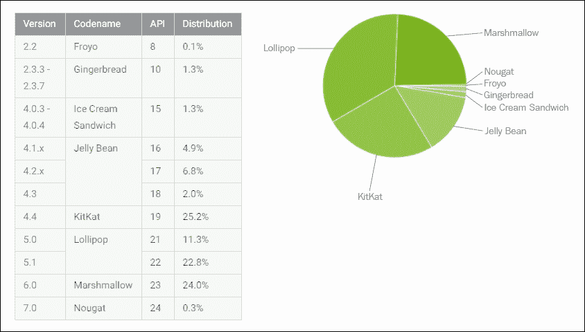
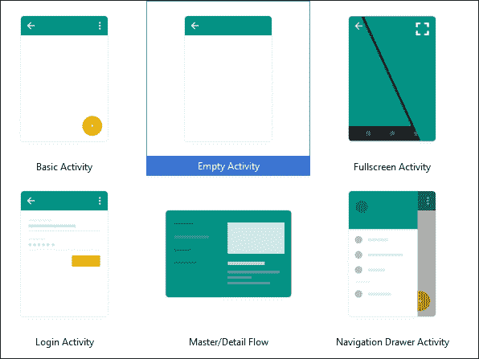
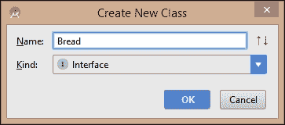
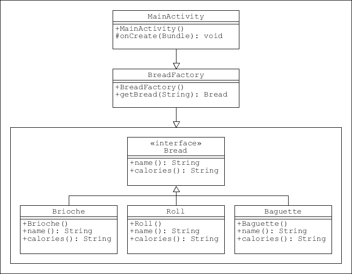
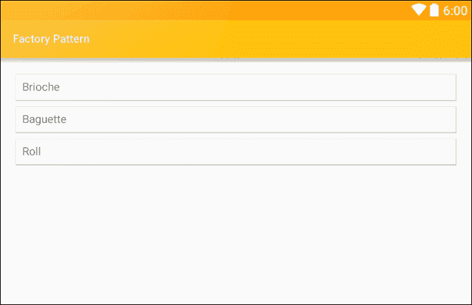
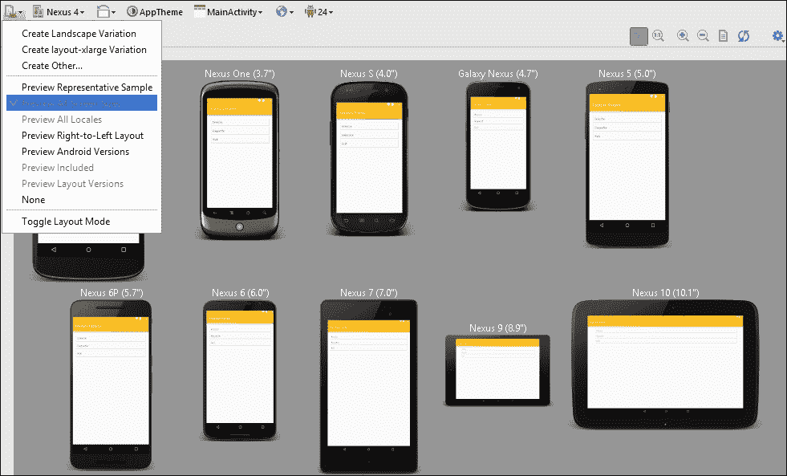
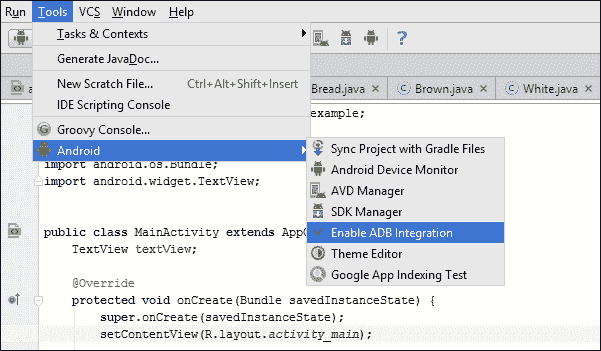
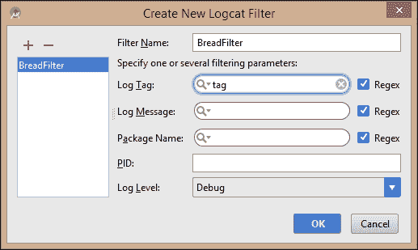
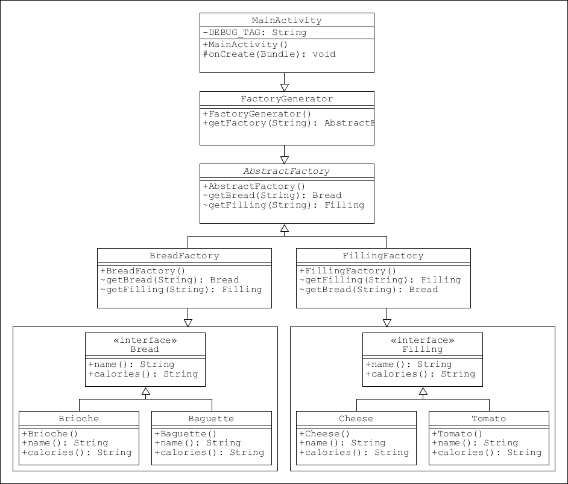

# 第一章：设计模式

设计模式长期以来被认为是解决常见软件设计问题最可靠和最有用的方法之一。模式为经常出现的发展问题提供了一般性和可重用的解决方案，例如如何在不对对象结构进行修改的情况下添加功能，或者如何最佳地构建复杂对象。

应用模式有几个优点，不仅仅是这种方法帮助开发者遵循最佳实践，以及它如何简化大型项目的管理。这些好处是通过提供可以重复使用的整体软件结构（模式）来实现的，以解决类似问题。这并不意味着代码可以从一个项目简单地剪切和粘贴到另一个项目，而是这些概念本身可以在许多不同情况下反复使用。

应用编程模式有许多其他好处，本书的某个部分将会涵盖这些内容，但以下一两个好处是现在值得一提的：

+   模式为团队工作的开发者之间提供了一种高效的通用语言。当一个开发者将一个结构描述为例如**适配器**或**外观**时，其他开发者能够理解其含义，并会立即识别代码的结构和目的。

+   模式提供的额外抽象层使得对已经处于开发阶段的代码进行修改和调整变得更加容易。甚至还有专门为这些情况设计的模式。

+   模式可以在许多尺度上应用，从项目的整体架构结构到最基本对象的制造。

+   应用模式可以大大减少所需的内联注释和一般文档的数量，因为模式本身也充当了自身的描述。仅类的名称或接口就能解释其目的和在模式中的位置。

安卓开发平台非常适合采用模式，因为不仅应用程序主要是用 Java 创建的，而且 SDK 包含许多自身使用模式的 API，例如用于创建对象的**工厂**接口和用于构建对象的**建造者**。像**单例**这样的简单模式甚至可以作为模板类类型使用。在本书中，我们不仅将看到如何构建自己的大型模式，还将了解如何利用这些内置结构来促进最佳实践并简化编码。

在本章中，我们首先简要概述整本书的布局、我们将使用的模式、我们接近它们的顺序，以及我们将构建的演示应用，看看如何在现实世界中应用模式。接下来，我们将快速检查 SDK 以及哪些组件将最好地协助我们的旅程，尤其是**支持库**所扮演的角色，使我们能够同时为多个平台版本开发。没有比实际经验更好的学习方式，因此本章的剩余部分将用于开发一个非常简单的演示应用，并使用我们的第一个模式——**工厂模式**及其相关的**抽象工厂**模式。

在本章中，你将学习以下内容：

+   模式如何分类以及本书涵盖哪些模式

+   本书演示应用的目的

+   如何定位平台版本

+   支持库的作用是什么

+   工厂模式是什么以及如何构建一个工厂模式

+   如何遵循 UML 类图

+   如何在实机和虚拟设备上测试应用

+   如何在运行时监控应用

+   如何使用简单的调试工具来测试代码

+   抽象工厂模式是什么以及如何使用它

# 本书如何运作

本书的目的是展示设计模式的运用如何直接协助开发 Android 应用。在本书的进程中，我们将专注于开发一个完整的客户端移动应用，特别关注在 Android 开发过程中何时、为何以及如何使用这些模式。

历史上，对于什么构成模式存在一定争议。然而，在 Erich Gamma、Richard Helm、Ralph Johnson 和 John Vlissides 于 1994 年出版的《设计模式》一书中提出的 23 种模式，被称为四人帮的模式，被广泛认为是权威集合，并为我们在软件工程中可能遇到的几乎所有问题提供解决方案，因此这些模式将成为本书的核心。这些模式可以分为三类：

+   **创建型** - 用于创建对象

+   **结构型** - 用于组织对象群组

+   **行为型** - 用于对象之间的通信

本书的实践性质意味着我们不会按照这里出现的顺序来处理这些类别；相反，我们将在开发应用时自然地探索各个模式，这通常意味着首先创建一个结构。

将所有设计模式集成到一个应用程序中是困难、笨拙且不现实的，因此我们将尝试应用尽可能多的看起来现实的模式。对于那些我们决定不直接使用的模式，我们至少会探讨我们可能如何使用它们，并且在每种情况下至少提供一个实际的使用示例。

模式并非刻在石头上，也不能解决所有可能的问题。在本书的末尾，我们将探讨一旦掌握了这个主题，我们如何可以创建自己的模式或调整现有的模式以适应那些既定模式不适用的情况。

简而言之，模式并非一套规则，而是一系列从已知问题通往经过验证的解决方案的熟悉路径。如果你在路上发现了一条捷径，那么尽可以采用它。如果你坚持这样做，那么你就创造了自己的一种模式，这种模式与我们在这里将要介绍的传统模式一样有效。

书的前几章主要关注 UI 设计，并介绍了一些基本的设计模式及其概念上的工作原理。从大约第六章《激活模式》开始，我们将开始将这些和其他模式应用于现实世界的例子，特别是针对一个应用程序。最后几章集中在开发的最后阶段，例如，调整应用程序以适应不同的设备，这项任务几乎是专为设计模式而设的，旨在达到最广泛的市场，以及如何使我们的应用程序盈利。

### 注意事项

如果你刚接触 Android 开发，前两三章中的说明会讲解得非常详细。如果你已经熟悉 Android 开发，你将能够跳过这些部分，专注于模式本身。

在深入我们第一个模式之前，仔细看看在本书过程中将要构建的应用程序，以及它所带来的挑战和机遇是有意义的。

# 我们将要构建的内容

如前所述，在本书的过程中，我们将构建一个虽小但完整的 Android 应用程序。现在了解一下我们将要构建的内容及其原因会是一个好主意。

我们将设身处地地考虑一个独立 Android 开发者的角色，这位开发者被一个潜在客户接近，这个客户经营着一家小企业，制作并配送新鲜三明治到当地的几栋办公楼。我们的客户面临几个问题，他们认为可以通过一个移动应用程序来解决。为了了解应用程序可能提供的解决方案，我们将把情况分为三个部分：场景、问题和解决方案。

## 场景概述

客户运营着一家小而成功的业务，为附近的上班族制作并送递新鲜的三明治，让他们可以在办公桌上购买并食用。三明治非常美味，由于口碑宣传，越来越受欢迎。业务有很大的扩展机会，但商业模式中存在一些明显的低效问题，客户认为可以通过使用移动应用程序来解决。

## 问题所在

客户几乎无法预测需求。很多时候某种三明治做多了，导致浪费。同样，也有准备三明治品种不足的时候，导致销售额的损失。不仅如此，顾客提供的口碑宣传也限制了业务扩展到较小的地理区域。客户没有可靠的方法来判断是否值得投资更多员工、摩托车以扩大送餐范围，甚至是否在其他镇区开设新的厨房。

## 解决方案

一款面向所有客户免费的移动应用程序不仅解决了这些问题，还提供了一系列全新的机会。不仅仅是应用程序能够解决无法预料的需求问题；我们现在有机会将这个业务提升到一个全新的层次。为何只向顾客提供固定菜单呢？我们可以提供让他们从一系列食材中构建自己的个性化三明治的机会。也许他们喜欢我们客户已经制作好的芝士和腌菜三明治，但想要加一两片苹果，或者更喜欢芒果酱而不是腌菜。也许他们是素食主义者，更喜欢从选择中过滤掉肉类产品。也许他们有过敏症。所有这些需求都可以通过一个设计良好的移动应用程序来满足。

此外，口碑宣传的地理限制，甚至当地广告如广告牌或当地报纸上的通知，都无法指示业务在更大舞台上的可能成功程度。而另一方面，社交媒体的使用不仅可以让我们客户清晰地了解当前趋势，还能将信息传播给尽可能广泛的受众。

我们的客户现在不仅能够准确判断他们业务的范围，还能添加完全新的、与现代数字生活特性相关的功能，比如应用程序的游戏化。竞赛、谜题和挑战可以为吸引顾客提供全新的维度，并呈现一种强大的增加收入和市场影响力的技术手段。

面前的任务现在更加清晰，我们现在可以开始编码了。我们将从工厂模式的简单演示开始，一路上看一些在开发过程中会用到的一些 SDK 功能。

# 定位平台版本

为了跟上最新技术，Android 平台的新版本会频繁发布。作为开发者，这意味着我们可以将最新的功能和发展融入到我们的应用程序中。显然，这样做的缺点是只有最新的设备才能运行这个平台，而这些设备在整个市场上只占很小的一部分。来看看开发者仪表板上的这张图表：



仪表板可以在[developer.android.com/about/dashboards/index.html](http://developer.android.com/about/dashboards/index.html)找到，其中包含了这个以及其他最新的信息，这些信息在项目初步规划时非常有用。

如你所见，绝大多数的 Android 设备仍然运行在较旧的平台上。幸运的是，Android 允许我们针对这些旧设备进行开发，同时还能融入最新平台版本的功能。这主要是通过使用**支持库**和设置最低 SDK 级别来实现的。

决定要针对哪些平台进行开发是我们需要做出的第一个决定之一，尽管我们可以在以后的日期更改这一点，但尽早决定要融入哪些功能以及了解这些功能在旧设备上的表现，可以大大简化整个任务。

要了解如何做到这一点，请启动一个新的 Android Studio 项目，随意为其命名，选择**手机和平板电脑**作为形态因素，并选择**API 16**作为**最低 SDK**。

在模板列表中，选择**空活动**，其他保持默认设置。



Android Studio 会自动选择可用的最高 SDK 版本作为目标级别。要查看如何应用，请从项目面板中打开`build.gradle (Module: app)`文件，并注意`defaultConfig`部分，它将类似于以下代码：

```kt
defaultConfig { 
    applicationId "com.example.kyle.factoryexample" 
    minSdkVersion 16 
    targetSdkVersion 25 
    versionCode 1 
    versionName "1.0" 
} 

```

这确保了我们的项目将针对这个 API 级别范围正确编译，但如果我们正在构建一个打算发布的 app，那么我们需要告诉 Google Play 商店哪些设备上可以提供我们的 app。这可以通过`build.gradle`模块文件来完成，如下所示：

```kt
minSdkVersion 21 
targetSdkVersion 24 

```

我们还需要编辑`AndroidManifest.xml`文件。对于这个例子，我们将在`manifest`节点中添加以下`uses-sdk`元素：

```kt
<uses-sdk 
    android:minSdkVersion="16" 
    android:targetSdkVersion="25" /> 

```

一旦我们确定了我们希望针对的平台范围，我们就可以继续了解支持库如何让我们在许多最旧的设备上融入许多最新的功能。

# 支持库

在构建向后兼容的应用程序方面，支持库无疑是我们的最强大工具。实际上，它是一系列单独的代码库，通过提供标准 API 中找到的类和接口的替代品来工作。

大约有 12 个单独的库，它们不仅提供兼容性；它们还包括常见的 UI 组件，如滑动抽屉和浮动操作按钮，否则这些组件必须从头开始构建。它们还可以简化针对不同屏幕大小和形状的开发过程，以及添加一个或两个杂项功能。

### 注意

由于我们是在 Android Studio 中进行开发，因此应该下载**支持仓库**而不是支持库，因为该仓库是专门为 Studio 设计的，提供的功能完全相同，而且效率更高。

在本章中我们正在工作的示例中，将不使用任何支持库。项目包含的唯一支持库是`v7 appcompat library`，它在我们开始项目时自动添加。在书中，我们将经常回到支持库，所以现在，我们可以集中精力应用我们的第一个模式。

# 工厂模式

工厂模式是最常用的创建型模式之一。顾名思义，它制造东西，或者更准确地说，它创建对象。它的有用之处在于它使用一个通用接口将逻辑与使用分离。了解这一机制的最佳方式就是现在就构建一个。打开我们在前一页或两页之前开始的项目，或者开始一个新项目。对于这个练习来说，最低和目标 SDK 级别并不重要。

### 提示

选择 API 级别为 21 或更高，允许 Android Studio 使用一种称为热交换的技术。这避免了每次运行项目时都完全重新构建项目，极大地加快了应用测试的速度。即使你打算最终针对一个更低的平台，热交换节省的时间也使得在应用开发得差不多时降低这个目标是非常值得的。

我们将要构建一个非常简单的示例应用，该应用生成对象来表示我们三明治制作应用可能提供的不同类型的面包。为了强调这个模式，我们会保持简单，让我们的对象返回的仅是一个字符串：

1.  在项目视图中找到`MainActivity.java`文件。

1.  右键点击它，并创建一个名为`Bread`的**接口**类型的`New | Java Class`：

1.  完成接口如下：

    ```kt
        public interface Bread { 

            String name(); 
            String calories(); 
        } 

    ```

1.  创建`Bread`的具体类，如下所示：

    ```kt
        public class Baguette implements Bread { 

            @Override 
            public String name() { 
                return "Baguette"; 
            } 

            @Override 
            public String calories() { 
                return " : 65 kcal"; 
            } 
          } 

          public class Roll implements Bread { 

            @Override 
            public String name() { 
                return "Roll"; 
            } 

            @Override 
            public String calories() { 
                return " : 75 kcal"; 
            } 
          } 

          public class Brioche implements Bread { 

            @Override 
            public String name() { 
                return "Brioche"; 
            } 

            @Override 
            public String calories() { 
                return " : 85 kcal"; 
            } 
        } 

    ```

1.  接下来，创建一个名为`BreadFactory`的新类，如下所示：

    ```kt
    public class BreadFactory { 

        public Bread getBread(String breadType) { 

            if (breadType == "BRI") { 
                return new Brioche(); 

            } else if (breadType == "BAG") { 
                return new Baguette(); 

            } else if (breadType == "ROL") { 
                return new Roll(); 
            } 

            return null; 
        } 
    } 

    ```

## UML 图表

理解设计模式的关键在于理解它们的结构以及各组成部分之间的相互关系。查看模式的一个最佳方式是图形化，统一建模语言（UML）类图是完成这一任务的好方法。

考虑一下我们刚才创建的模式以图表的形式表达，如下所示：



拥有了我们的模式，需要做的就是看到它的实际效果。在这个演示中，我们将使用模板为我们生成的布局中的 **TextView** 和每次主活动启动时都会调用的 `onCreate()` 方法：

1.  以 **文本** 模式打开 `activity_main.xml` 文件。

1.  为文本视图添加一个 `id`，如下所示：

    ```kt
    <TextView 
        android:id="@+id/text_view" 
        android:layout_width="match_parent" 
        android:layout_height="wrap_content" /> 

    ```

1.  打开 `MainActivity.java` 文件，并编辑 `onCreate()` 方法以匹配以下代码：

    ```kt
    @Override 
    protected void onCreate(Bundle savedInstanceState) { 
        super.onCreate(savedInstanceState); 
        setContentView(R.layout.activity_main); 

        TextView textView = (TextView) findViewById(R.id.text_view); 

        BreadFactory breadFactory = new BreadFactory(); 
        Bread bread = breadFactory.getBread("BAG"); 

        textView.setText(new StringBuilder() 
                .append(bread.name()) 
                .toString()); 
    } 

    ```

    ### 提示

    根据您设置 Android Studio 的方式，您可能需要导入 TextView 控件：`import android.widget.TextView;`。通常，编辑器会提示您，只需按 **Alt + Enter** 就可以导入控件。

您现在可以在模拟器或真实设备上测试这个模式：



初看之下，这或许会让人觉得是实现一个简单目标的一种极其冗长的方式，但模式的魅力正在于此。增加的抽象层使我们能够修改类，而无需编辑我们的活动，反之亦然。随着我们开发更复杂的对象，遇到需要不仅仅一个工厂的情况时，这种实用性会更加明显。

我们在这里创建的例子过于简单，实际上并不需要测试，但现在是一个探索如何在真实和虚拟设备上测试 Android 应用，以及如何监控性能和使用调试工具测试输出而不必添加不必要的屏幕组件的好时机。

# 运行和测试应用

现在市面上有大量的 Android 设备，它们有着各种各样的形状和大小。作为开发者，我们希望我们的应用程序能在尽可能多的设备和形态因素上运行，并且我们希望用最少的编码就能实现这一点。幸运的是，Android 平台非常适合应对这一挑战，它让我们可以轻松调整布局，构建虚拟设备以匹配我们所能想象到的任何形态因素。

### 提示

Google 在 firebase.google.com/docs/test-lab/ 提供了一个非常便捷的基于云的应用测试工具。

显然，虚拟设备是任何测试环境的重要组成部分，但这并不是说直接插入我们自己的设备并在此上进行应用测试就不方便。这不仅比任何模拟器都快，而且正如我们现在将要看到的，设置起来非常简单。

## 连接到真实设备

实际设备不仅比虚拟设备快，还允许我们在真实世界的情况中测试我们的应用。

将真实设备连接到我们的开发环境需要两个步骤：

1.  在您的手机上启用开发者选项。在某些型号上，这可能涉及到导航到 `设置 | 关于手机` 并点击 `Build number` 七次，之后会在设置中添加 `开发者选项`。使用它来启用 **USB 调试** 并选择 **允许模拟位置**。

1.  你现在很可能能够通过 USB 或 WiFi 插件电缆将你的设备连接到工作站，并在打开 Android Studio 时显示出来。如果不是这样，你可能需要打开 SDK 管理器，并从“工具”选项卡安装**Google USB 驱动程序**。在某些罕见的情况下，你可能需要从设备制造商处下载 USB 驱动程序。

实际设备对于快速测试应用程序功能更改非常有用，但要开发应用程序在各种屏幕形状和尺寸上的外观和行为，意味着我们将创建一些虚拟设备。

## 连接到虚拟设备

Android 虚拟设备（AVD）允许开发者自由地实验各种硬件配置的模拟，但它们速度慢，可能会耗尽许多计算机系统的资源，并且缺少实际设备中的许多功能。尽管有这些缺点，虚拟设备仍然是 Android 开发者工具箱中不可或缺的一部分，通过考虑一些事项，可以最小化许多这些障碍：

+   将你的虚拟设备精简到只包含你的应用程序所需的功能。例如，如果你的应用不需要拍照，就从模拟器中移除摄像头功能；以后可以根据需要添加。

+   将 AVD 的内存和存储需求降到最低。当应用程序需要时，可以轻松创建另一个设备。

+   只有在需要测试特定新功能时，才创建具有非常新的 API 级别的 AVD。

+   从测试低屏幕分辨率和密度的虚拟设备开始。这些设备运行速度更快，并且仍然允许你测试不同的屏幕尺寸和宽高比。

+   尝试将资源需求非常大的功能分离出来，单独测试。例如，如果你的应用使用了大量高清晰度的图片集，你可以通过单独测试这个功能来节省时间。

通常构建针对特定目的的虚拟设备比构建一个全能型的设备来测试我们所有的应用程序要快，而且现在有越来越多的第三方 Android 模拟器可用，如*Android-x86*和*Genymotion*，它们通常速度更快且拥有更多开发功能。

值得注意的是，当仅测试布局时，Android Studio 提供了一些强大的预览选项，允许我们在众多形态、SDK 级别和主题上查看我们潜在的用户界面，如下一个图像所示：



现在，创建一个基本的 AVD 来运行并测试当前项目。实际上并没有什么需要测试的，但我们将了解如何监控应用程序在运行时的行为，以及如何使用调试监控服务来测试输出，而无需使用设备屏幕，这不是一个吸引人的调试项目的方式。

## 监控设备

下面的演示在模拟设备或真实设备上同样有效，所以选择对你来说最简单的一个。如果你在创建 AVD，那么它不需要大屏幕或高密度屏幕，也不需要大量内存：

1.  打开我们刚才工作的项目。

1.  从`工具 | 安卓`菜单中，启用**ADB 集成**。

1.  从同一菜单中，选择**Android 设备监控器**，尽管它可能已经在运行。

1.  现在，在连接的设备上使用 Android Monitor 运行应用程序。

设备监控器在多种方式上非常有用：

+   **监控器**标签可以在运行时使用，以查看实时的系统信息，例如我们的应用使用了多少内存或 CPU 时间。当我们想要查看应用不在前台运行时使用了哪些资源时，这尤其有帮助。

+   监控器可以设置为收集各种数据，如方法跟踪和资源使用，并将这些数据存储为文件，可以在**捕获**窗格中查看（通常可以从左侧边栏打开）。

+   捕获应用运行时的屏幕截图和视频非常简单。

+   **LogCat**是一个特别有用的工具，它不仅可以实时报告应用的行为，而且如我们接下来将看到的，还可以生成用户定义的输出。

使用文本视图测试我们的工厂模式是一种方便但笨拙的方法，但一旦我们开始开发复杂的布局，它很快就会变得非常不方便。一种更优雅的解决方案是使用可以在不影响我们 UI 的情况下查看的调试工具。本练习的其余部分将演示如何做到这一点：

1.  打开`MainActivity.java`文件。

1.  声明以下常量：

    ```kt
    private static final String DEBUG_TAG = "tag"; 

    ```

1.  再次，你可能需要确认导入`android.util.Log;`。

1.  替换`onCreate()`方法中设置文本视图文本的行，使用以下行：

    ```kt
    Log.d(DEBUG_TAG, bread); 

    ```

1.  再次打开设备监控器。这可以通过按**Alt + 6**来完成。

1.  在监控器右上角的下拉菜单中，选择**编辑过滤器配置**。

1.  完成如图所示的对话框：

运行应用并测试我们的工厂演示应该在 logcat 监控器中产生类似于这里的输出：

```kt
05-24 13:25:52.484 17896-17896/? D/tag: Brioche
05-24 13:36:31.214 17896-17896/? D/tag: Baguette
05-24 13:42:45.180 17896-17896/? D/tag: Roll

```

### 提示

当然，如果你愿意，你仍然可以使用`System.out.println()`，它将在 ADB 监控器中打印出来，但你将不得不在其他输出中搜索它。

我们已经了解了如何在真实和虚拟设备上测试应用，以及如何使用调试和监控工具在运行时对应用进行询问。现在，我们可以进入一个更真实的情况，涉及不止一个工厂，输出的结果也远比一个双词字符串复杂。

# 抽象工厂模式

制作三明治时，面包只是我们第一个也是最基础的原料；显然，我们需要某种填充物。在编程术语中，这可能意味着像`Bread`一样简单地构建另一个接口，但将其称为`Filling`，并为它提供自己的关联工厂。同样，我们可以创建一个名为`Ingredient`的全局接口，并将`Bread`和`Filling`作为它的示例。无论哪种方式，我们都需要在其他地方进行大量的重新编码。

设计模式范式提供了**抽象工厂模式**，这可能是解决这一困境最灵活的解决方案。抽象工厂仅仅就是**创建其他工厂的工厂**。这种所需的额外抽象层次，在我们考虑到主活动中的顶层控制代码几乎不需要修改（如果有的话）时得到了充分的回报。能够修改低级结构而不影响之前的结构，正是应用设计模式的主要原因之一，当应用于复杂架构时，这种灵活性可以节省许多开发时间，并比其他方法提供更多的实验空间。

## 使用一个以上的工厂工作

下一个项目与上一个项目之间的相似性非常明显，应该是这样；模式最好的事情之一是我们可以重用结构。你可以编辑之前的示例或从头开始。在这里，我们将开始一个新项目；希望这将有助于使模式本身更加清晰。

**抽象工厂**的工作方式与我们的上一个示例略有不同。在这里，我们的活动使用了一个工厂生成器，该生成器进而使用一个抽象工厂类来处理决定调用哪个实际工厂的任务，从而创建哪个具体类。

与之前一样，我们不关心输入和输出的实际机制，而是专注于模式的结构。在继续之前，启动一个新的 Android Studio 项目。可以随意命名，将最低 API 级别设为你喜欢的低水平，并使用空白活动模板：

1.  我们开始，就像之前一样，创建接口；但这次，我们需要两个：一个用于面包，一个用于填充物。它们应该如下所示：

    ```kt
    public interface Bread { 

        String name(); 
        String calories(); 
    } 

    public interface Filling { 

        String name(); 
        String calories(); 
    } 

    ```

1.  与之前一样，创建这些接口的具体示例。为了节省空间，这里我们只创建每种两个。它们几乎都是相同的，所以这里只有一个：

    ```kt
    public class Baguette implements Bread { 

        @Override 
        public String name() { 
            return "Baguette"; 
        } 

        @Override 
        public String calories() { 
            return " : 65 kcal"; 
        } 
    } 

    ```

1.  创建另一个名为`Brioche`的`Bread`类和两种填充物，分别叫做`Cheese`和`Tomato`。

1.  接下来，创建一个可以调用每种类型工厂的类：

    ```kt
    public abstract class AbstractFactory { 

        abstract Bread getBread(String bread); 
        abstract Filling getFilling(String filling); 
    } 

    ```

1.  现在，创建工厂本身。首先，`BreadFactory`：

    ```kt
    public class BreadFactory extends AbstractFactory { 

        @Override 
        Bread getBread(String bread) { 

            if (bread == null) { 
                return null; 
            } 

            if (bread == "BAG") { 
                return new Baguette(); 
            } else if (bread == "BRI") { 
                return new Brioche(); 
            } 

            return null; 
        } 

        @Override 
        Filling getFilling(String filling) { 
            return null; 
        } 
    } 

    ```

1.  然后，`FillingFactory`：

    ```kt
    public class FillingFactory extends AbstractFactory { 

        @Override 
        Filling getFilling(String filling) { 

            if (filling == null) { 
                return null; 
            } 

            if (filling == "CHE") { 
                return new Cheese(); 
            } else if (filling == "TOM") { 
                return new Tomato(); 
            } 

            return null; 
        } 

        @Override 
        Bread getBread(String bread) { 
            return null; 
        } 
    } 

    ```

1.  最后，添加工厂生成器类本身：

    ```kt
    public class FactoryGenerator { 

        public static AbstractFactory getFactory(String factory) { 

            if (factory == null) { 
                return null; 
            } 

            if (factory == "BRE") { 
                return new BreadFactory(); 
            } else if (factory == "FIL") { 
                return new FillingFactory(); 
            } 

            return null; 
        } 
    } 

    ```

1.  我们可以像之前一样测试我们的代码，使用一个调试标签，如下所示：

    ```kt
    AbstractFactory fillingFactory = FactoryGenerator.getFactory("FIL"); 
    Filling filling = fillingFactory.getFilling("CHE"); 
    Log.d(DEBUG_TAG, filling.name()+" : "+filling.calories()); 

    AbstractFactory breadFactory = FactoryGenerator.getFactory("BRE"); 
    Bread bread = breadFactory.getBread("BRI"); 
    Log.d(DEBUG_TAG, bread.name()+" : "+bread.calories()); 

    ```

测试时，这应该在 Android 监视器中产生以下输出：

```kt
com.example.kyle.abstractfactory D/tag: Cheese :  : 155 kcal
com.example.kyle.abstractfactory D/tag: Brioche :  : 85 kcal

```

到本书结束时，每个成分都将是一个复杂的对象，拥有相关的图像和描述性文本、价格、卡路里价值等等。这时遵循模式将真正带来好处，但像这里一个非常简单的例子就能很好地展示出如何使用抽象工厂这样的创建型模式，让我们在不影响客户端代码或部署的情况下对产品进行修改。

与之前一样，通过视觉表示可以增强我们对模式的了解：



假设我们想在菜单中包含软饮料。这些既不是面包也不是填充物，我们需要引入一种全新的对象类型。添加这种模式的方案已经制定好了。我们需要一个新的接口，它与其他接口相同，只是叫做`Drink`；它将使用相同的`name()和 calories()`方法，具体的类如`IcedTea`可以按照上面的完全相同的线路实现，例如：

```kt
public class IcedTeaimplements Drink { 

    @Override 
    public String name() { 
        return "Iced tea"; 
    } 

    @Override 
    public String calories() { 
        return " : 110 kcal"; 
    } 
} 

```

我们需要扩展我们的抽象工厂，如下所示：

```kt
abstract Drink getDrink(String drinkType); 

```

当然，我们还需要实现一个`DrinkFactory`类，但这个类的结构与其他工厂相同。

换句话说，我们可以添加、删除、更改，以及随意摆弄项目的细节，而无需真正关心这些更改是如何被我们软件的高级逻辑所感知的。

工厂模式是所有模式中使用最频繁的模式之一。它可以在许多情况下使用，也应该被使用。然而，像所有模式一样，如果不仔细考虑，它可能会被过度使用或使用不足。当我们考虑项目的整体架构时，正如我们将会看到的，还有许多其他模式可供我们使用。

# 总结

考虑到这是一个介绍性的章节，我们已经涵盖了很多内容。我们已经构建了两种最著名和最有用的设计模式的示例，并希望了解它们为什么对我们有用。

我们首先探讨了模式是什么，以及为什么在 Android 环境中可能会使用它们。这得益于我们查看了一下可用的开发工具，以及我们如何以及为什么应该针对特定的平台版本和形态因素进行定位。

然后，我们将这一知识应用于创建两个非常简单的应用程序，这些程序使用了基本的工厂模式，并看到了如何测试并从运行在任何设备上的应用程序中检索数据，无论是真实的还是虚拟的。

这让我们有机会看看其他模式，并考虑在构建一个完全工作的应用程序时使用哪些模式。我们将在下一章更详细地介绍这一点，其中将介绍构建器模式以及如何生成 Android 布局。
