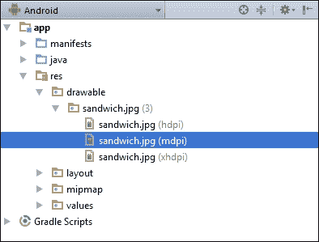

# 第二章：创建型模式

在上一章中，我们了解了**工厂模式**及其相关的**抽象工厂模式**。然而，我们以相当普遍的方式查看了这些模式，并没有查看一旦创建后，这些对象如何在 Android 设备上被表示和操作。换句话说，我们构建的模式可以应用于许多其他软件环境，为了使它们更具 Android 特色，我们需要查看 Android UI 及其组成方式。

在本章中，我们将集中讨论如何将我们的产品表现为 Android UI 组件。我们将使用**卡片视图**来展示这些内容，每个卡片将包含一个标题、一幅图像、一些描述性文本以及成分的热量值，如下面的截图所示：


这将引导我们初步了解**材料设计**，这是一种强大的、越来越受欢迎的**视觉设计语言**，用于创建清晰直观的 UI。最初为移动设备的小屏幕而设计，材料设计现在被认为是一个非常有价值的 UI 范例，其应用已经从 Android 设备扩展到网站，甚至其他移动平台。

**材料设计**不仅仅是一种时尚，它提供了一系列遵循最佳 UI 构建实践的非常有效的指南。材料设计提供了与我们已经讨论过的编程模式相似的视觉模式。这些模式提供了清晰、简单的操作结构。材料设计涵盖了比例、缩放、排版和间距等概念，所有这些都可以在 IDE 中轻松管理，并由材料设计指南整齐地规定。

当我们了解了如何将我们的成分表现为可操作的 UI 组件后，我们将查看另一种常用的创建型模式，即**构建器模式**。这将展示一种允许我们从单个*配料*对象构建一个*三明治*对象的模式。

在本章中，你将学习如何进行以下操作：

+   编辑材料样式和主题

+   应用调色板

+   自定义文本设置

+   管理屏幕密度

+   包含卡片视图支持库

+   理解 Z 轴深度和阴影

+   将材料设计应用于卡片视图

+   创建构建器模式

尽管可以在任何时候进行更改，但在构建 Android 应用时，我们首先应该考虑的就是配色方案。这是框架允许我们自定义许多熟悉屏幕组件的颜色和外观的方式，例如标题和状态栏背景颜色以及文本和突出显示的阴影。

# 应用主题

作为开发者，我们希望我们的应用程序能够从众多应用中脱颖而出，但同时我们也希望融入 Android 用户熟悉的全部功能。实现这一点的方法之一是在整个应用程序中应用特定的颜色方案。这最简单的方法是定制或创建 Android 主题。

自从 API 级别 21（Android 5.0）起，**材质主题**已成为 Android 设备的默认主题。然而，它不仅仅是一个新的外观。材质主题还默认提供了我们与材质设计相关的触摸反馈和过渡动画。与所有 Android 主题一样，材质主题也是基于 Android 样式的。

**Android 样式**是一组定义特定屏幕组件外观的图形属性。样式允许我们从字体大小、背景颜色、内边距和高度等方面进行定义，还有更多。Android 主题实际上就是应用于整个活动或应用程序的样式。样式被定义为 XML 文件，并存储在 Android Studio 项目的资源（`res`）目录中。

幸运的是，Android Studio 带有一个图形化的**主题编辑器**，它为我们生成 XML。不过，了解幕后发生的情况总是好的，这最好通过打开上一章的抽象工厂项目或开始一个新项目来查看。从项目浏览器中，打开`res/values/styles.xml`文件。它将包含以下样式定义：

```kt
<style name="AppTheme" parent="Theme.AppCompat.Light.DarkActionBar"> 

    <item name="colorPrimary">@color/colorPrimary</item> 
    <item name="colorPrimaryDark">@color/colorPrimaryDark</item> 
    <item name="colorAccent">@color/colorAccent</item> 

</style> 

```

在这里，虽然只定义了三种颜色，但我们也可以定义更多，例如主要和次要文本颜色、窗口背景颜色等。颜色本身在`colors.xml`文件中定义，该文件也位于`values`目录中，并将包含以下定义：

```kt
<color name="colorPrimary">#3F51B5</color> 
<color name="colorPrimaryDark">#303F9F</color> 
<color name="colorAccent">#FF4081</color> 

```

完全可以应用多个主题，并融入我们喜欢的多种样式，但通常来说，在整个应用程序中应用单一主题，并定制其中一个默认的材质主题是最简单、最整洁的方法。

定制默认主题的最简单方式是使用主题编辑器，可以从`工具 | Android`菜单中打开。编辑器提供了一个强大的所见即所得预览窗格，使我们能够在我们进行更改时即时查看任何更改，如下所示：


尽管我们可以为我们的主题自由选择任何喜欢的颜色，但材质设计指南对于如何一起使用颜色非常明确。这最好通过查看**材质调色板**来解释。

# 定制颜色和文本

应用主题时我们首先需要考虑的是颜色和文本。材质设计指南建议从预定义的一系列调色板中选择这些颜色。

## 使用调色板

在材料主题中，我们可以编辑的最重要的两种颜色是主色。它们直接应用于状态栏和应用程序栏，使应用具有独特的观感，而不会影响整个平台的统一感。这两种颜色都应该从同一个色板中选择。有许多这样的色板可供选择，整个系列可以在 www.google.com/design/spec/style/color.html#color-color-palette 找到。

无论你决定使用哪个色板作为你的主色，谷歌建议你使用值为**500**和**700**的阴影。


这不需要严格执行，但通常最好遵循这些值，并且总是选择同一颜色的两种阴影。

### 提示

在这里，主题编辑器会非常有帮助；它的实色块不仅提供了提示工具，告诉我们阴影值，而且一旦我们选定了主色，它还会推荐一个合适的深色版本。

选择强调色时，需要考虑我们选择的主要色调。这将应用于开关和高亮显示，并且需要与主色形成良好对比。除了选择看起来不错且具有浅色值**100**的颜色之外，没有简单的规则来决定哪些颜色之间形成对比。

### 提示

可以使用`navigationBarColor`改变屏幕底部的导航栏颜色，但不建议这样做，因为导航栏不应被视为应用的一部分。

对于大多数目的，其他主题设置可以保持原样。但是，如果你希望更改文本颜色，有一两件事需要注意。

## 自定义文本

材料文本不是通过使用更浅的色调来生成浅色阴影，而是通过使用 alpha 通道来创建不同级别的**透明度**。这样做的原因是，当它被用在不同的背景色或图像上时，看起来更加悦目。文本透明度的规则如下：


关于样式和主题，我们可以做很多事情，但现在只需创建一个简单的配色方案，并知道它将在整个应用程序中一致应用就足够了。我们下一个任务将是探讨如何将我们之前考虑的“三明治成分”对象扩展成一个用户友好的界面。毫无疑问，吸引用户的一个最佳方式就是使用诱人的照片。

# 添加图像资源

安卓提供的最具挑战性的问题之一是我们要适应的众多屏幕密度和尺寸。在显示位图图像时，这一点尤为正确，这里有两个需要解决的竞争性问题：

+   低分辨率图像在拉伸以适应大屏幕或高分辨率屏幕时显示效果非常差。

+   高质量图像在较小、低密度的屏幕上显示时，所使用的内存远大于所需。

屏幕尺寸先放一边，通过使用**密度独立像素**（**dp**）基本上解决了不同屏幕密度的问题。

## 管理屏幕密度

dp 是一个基于 160 dpi 屏幕显示的抽象测量单位。这意味着无论屏幕密度如何，宽度为 320 dp 的组件始终为 2 英寸宽。当涉及到屏幕的实际物理尺寸时，这可以通过各种布局类型、库和属性（如权重和重力）来管理，但现在我们将了解如何提供适合尽可能广泛的屏幕密度的图像。

安卓系统用以下限定符划分屏幕密度：

+   低密度（`ldpi`）- **120 dpi**

+   中等密度（`mdpi`）- **160 dpi**

+   高密度（`hdpi`）- **240 dpi**

+   超高密度（`xhdpi`）- **320 dpi**

+   超超超高密度（`xxhdpi`）- **480 dpi**

+   超超超高密度（`xxxhdpi`）- **640 dpi**

### 注意事项

在应用安装期间，每个设备只会下载与其规格相匹配的图像。这节省了旧设备的内存，同时为有能力的设备提供了尽可能丰富的视觉体验。

从开发者的角度来看，我们可能需要为每个项目生成六种不同版本的图像。幸运的是，通常情况下并非如此。在大多数手持设备上，640 dpi 图像与 320 dpi 图像之间的差别几乎无法察觉。考虑到我们三明治制作应用的大多数用户只想浏览食材菜单，而不是仔细检查图像质量，我们可以只安全地提供中等、高和超高密度设备的图像。

### 提示

在考虑高端设备图像质量时，一个很好的经验法则是将我们的图像尺寸与设备原生相机产生的尺寸进行比较。提供更大的图像不太可能足以改善用户体验，从而证明需要额外的内存是合理的。

在本例中，我们希望提供适合卡片视图的图像，该视图在纵向模式下将占据屏幕宽度的绝大部分。现在，找一个大约 2,000 像素宽的图像。在下面的例子中，它被称为`sandwich.png`，尺寸为 1,920×1,080 像素。你的图像不必与这些尺寸匹配，但稍后我们会看到，选择合适的图像比例是良好 UI 实践的重要组成部分。

在超高密度设备上显示 320 dpi 时，宽度为 1,920 像素的图像将显示为六英寸宽。现在至少假设我们的应用将来自移动设备，而不是计算机或电视，所以在高密度 10 英寸的平板电脑上，六英寸对我们来说已经足够了。接下来，我们还将了解如何为其他屏幕密度做准备。

## 使用指定资源

通过分配特定资源目录来满足不同屏幕密度的需求是很容易实现的。在 Android Studio 中，我们可以通过以下步骤从项目资源管理器中创建这些目录：

1.  

1.  接下来，创建两个同级的目录，分别命名为`drawable-hdpi`和`drawable-xhdpi`。

1.  通过从项目资源管理器中选择`drawable`上下文菜单中的**在资源管理器中显示**直接打开这些新文件夹。

1.  将`sandwich.png`图片添加到`drawable-xhdpi`文件夹中。

1.  制作这张图片的两个副本，并按 3:4 和 1:2 的比例缩放它们。

1.  将这些副本分别放置在`drawable-hdpi`和`drawable-mdpi`目录中。

这些变化现在可以在项目资源管理器中看到，如下所示：



这样一来，我们可以确保只有最适合设备原生屏幕密度的图像资源会被下载。

```kt
<ImageView 
    android:layout_width="wrap_content" 
    android:layout_height="wrap_content" 
    android:src="img/sandwich" /> 

```

首先，从`res`文件夹中创建一个`新 | 目录`，并将其命名为`drawable-mdpi`。

要查看效果，请在项目的`activity_main.xml`文件中添加以下图像视图：

这种方法的优点是，一旦我们正确指定了图片资源，就可以简单地通过引用`@drawable/sandwich`来忽略它实际存储的目录。

卡片视图是 Material Design 中最容易识别的组件之一，它设计用来以统一的方式展示多个相关的片段内容。这种内容通常包括图形、文本、操作按钮和图标等。卡片是展示像三明治配料和相关价格或热量信息这类选择的好方法。

# 创建一个卡片视图（**CardView**）。

输出可以在任何模拟器或真实设备上的预览屏幕上查看：

## 了解卡片视图属性。

如果您的最低目标 SDK 是 21 或更高，那么卡片视图小部件将作为标准包含。否则，您需要包含卡片视图支持库。这可以在`build.gradle`文件中通过添加以下高亮行轻松完成：

```kt
dependencies { 
    compile fileTree(dir: 'libs', include: ['*.jar']) 
    testCompile 'junit:junit:4.12' 
    compile 'com.android.support:appcompat-v7:23.4.0' 
    compile 'com.android.support:cardview-v7:23.4.0' 
} 

```

正如支持库的名字所暗示，我们只能支持回溯到 API 级别 7 的卡片视图。

不必手动编辑`build.gradle`文件，尽管了解如何操作是有用的，可以通过`文件 | 项目结构...`菜单选择以下所示的项目来完成：


### 提示

一些开发者使用`+`符号来版本化他们的支持库，如：`com.android.support:cardview-v7:23.+`。这是为了预测未来的库。这通常运作得很好，但这并不能保证这些应用在未来不会崩溃。在开发过程中使用编译的 SDK 版本，然后在应用发布后定期更新，虽然更耗时，但更明智。

在我们能够将卡片视图添加到我们的布局之前，你需要重新构建项目。首先，我们需要设置一些卡片的属性。打开`res/values/dimens.xml`文件，并添加以下三个新的尺寸资源：

```kt
<dimen name="card_height">200dp</dimen> 
<dimen name="card_corner_radius">4dp</dimen> 
<dimen name="card_elevation">2dp</dimen> 

```

现在，我们可以在主 XML 活动文件中将卡片作为小部件添加，如下所示：

```kt
<android.support.v7.widget.CardView  
    android:layout_width="match_parent" 
    android:layout_height="@dimen/card_height" 
    android:layout_gravity="center" 
    card_view:cardCornerRadius="@dimen/card_corner_radius" 
    card_view:cardElevation="@dimen/card_elevation"> 
</android.support.v7.widget.CardView> 

```

阴影的使用不仅仅是为了给界面提供三维外观；它还通过图形化地展示布局层次结构，让用户清楚地知道哪些功能可用。

### 提示

如果你花时间检查过卡片视图属性，你会注意到`translationZ`属性。这看起来与`elevation`有相同的效果。然而，`elevation`将设置卡片的绝对高度，而`translationZ`是一个相对设置，它的值将会加到或从当前高度中减去。

现在我们已经设置好了卡片视图，可以根据材料设计指南填充它，以表示我们的三明治成分。

## 应用 CardView 的度量标准

设计指南对字体、内边距和缩放等问题非常明确。一旦我们开始使用 CoordinatorLayout，这些设置中的许多将会自动设置，但现在，了解这些度量标准是如何应用的还是一个好主意。

关于卡片有许多不同的模式，它们的完整描述可以在这里找到：

[卡片设计规范](http://www.google.com/design/spec/components/cards.html)

我们将在这里创建的卡片将包含一个图片、三个文本项和一个动作按钮。卡片可以被看作是容器对象，通常它们包含自己的根布局。这可以直接放置在卡片视图内，但如果我们把卡片内容作为独立的 XML 布局创建，代码将更具可读性和灵活性。

下一个练习中，我们将至少需要一张图片。根据材料设计，照片应该是清晰、明亮、简单，并呈现单一、明确的主题。例如，如果我们想将咖啡添加到菜单中，左边的图片将是最合适的：


卡片图片的宽高比应为 16:9 或 1:1。这里，我们将使用 16:9，理想情况下我们应该生成缩放版本以适应各种屏幕密度，但既然这只是一个演示，我们可以偷懒直接将原始图片放入`drawable`文件夹。这种方法远非最佳实践，但对于初步测试是没问题的。

在找到并保存你的图片后，下一步是创建一个卡片的布局：

1.  从项目浏览器中，导航到`新建 | XML | 布局 XML 文件`，并将其命名为`card_content.xml`。它的根视图组应该是一个垂直方向的线性布局，应该看起来像这样：

    ```kt
    <LinearLayout  
        android:id="@+id/card_content" 
        android:layout_width="match_parent" 
        android:layout_height="match_parent" 
        android:orientation="vertical"> 
    </LinearLayout> 

    ```

1.  使用图形或文本编辑器，创建一个与这里看到的**组件树**相匹配的布局结构：

1.  现在，将此布局包含在主活动布局文件中的卡片视图中，如下所示：

    ```kt
    <android.support.v7.widget.CardView 
        android:id="@+id/card_view" 
        android:layout_width="match_parent" 
        android:layout_height="wrap_content"> 

        <include 
            android:id="@+id/card_content" 
            layout="@layout/card_content" /> 

    </android.support.v7.widget.CardView> 

    ```

    ### 提示

    尽管可以编辑，但建议卡片视图的默认高度为 2 dp，除非它已被选中和/或正在移动，在这种情况下，它的高度为 8 dp。

你无疑知道，在 XML 资源中硬编码字符串的使用是强烈不推荐的。至少，这使得将我们的应用程序翻译成其他语言的过程几乎不可能。然而，在布局设计的早期阶段，提供一些占位符值以了解布局可能的外观是有帮助的。稍后，我们将使用 Java 控制卡片内容，并根据用户输入选择此内容；但现在，我们将选择一些典型值，以便我们可以轻松快速地看到我们的设置产生的影响。为了了解这是如何有用的，请在`values`目录下的`strings.xml`文件中添加以下属性或等价物：

```kt
<string name="filling">Cheddar Cheese</string> 
<string name="filling_description">A ripe and creamy cheddar from the south west</string> 
<string name="calories">237 kcal per slice</string> 
<string name="action">ADD</string> 
<string name="alternative_text">A picture of some cheddar cheese</string> 

```

现在，我们将使用这些占位符来评估我们进行的任何更改。我们刚刚创建的布局，在预览中查看时，应该看起来像这样：


将其转化为材质设计组件只需要进行一些格式化处理，并了解一些材质设计指南的知识。

此布局的度量如下：

+   图片的长宽比必须是 16:9。

+   标题文本应为 24 sp。

+   描述性文本为 16 sp。

+   文本底部右侧和左侧的边距为 16 dp。

+   标题文本上方的边距为 24 dp。

+   动作文本的大小为 24 sp，并从强调色中获取其颜色。

这些属性可以通过属性面板或直接编辑 XML 非常容易地设置。这里有一两件事情没有提到，所以值得单独查看每个元素。

首先，必须指出的是，这些值绝不应像以下代码段中那样直接在代码中描述；例如，`android:paddingStart="24dp"` 应该像这样编码 `android:paddingStart="@dimen/text_paddingStart"`，其中 `text_paddingStart` 在 `dimens.xml` 文件中定义。这里，值是硬编码的，只是为了简化解释。

顶部图像视图的代码应该如下所示：

```kt
<ImageView 
       android:id="@+id/image_view" 
       android:layout_width="match_parent" 
       android:layout_height="wrap_content" 
       android:contentDescription="@string/alternative_text" 
       android:src="img/cheddar" /> 

```

这非常简单，但请注意 `contentDescription` 的使用；当视力受损的用户设置了辅助功能选项时，这会被用来让设备通过语音合成器朗读图像的描述，以便用户欣赏。

下面是以下三个文本视图。

```kt
<TextView 
    android:id="@+id/text_title" 
    android:layout_width="wrap_content" 
    android:layout_height="wrap_content" 
    android:paddingEnd="24dp" 
    android:paddingStart="24dp" 
    android:paddingTop="24dp" 
    android:text="@string/filling" 
    android:textAppearance="?android:attr/textAppearanceLarge" 
    android:textSize="24sp" /> 

<TextView 
    android:id="@+id/text_description" 
    android:layout_width="wrap_content" 
    android:layout_height="wrap_content" 
    android:paddingEnd="24dp" 
    android:paddingStart="24dp" 
    android:text="@string/filling_description" 
    android:textAppearance="?android:attr/textAppearanceMedium" 
    android:textSize="14sp" /> 

<TextView 
    android:id="@+id/text_calories" 
    android:layout_width="wrap_content" 
    android:layout_height="wrap_content" 
    android:layout_gravity="end" 
    android:paddingBottom="8dp" 
    android:paddingStart="16dp" 
    android:paddingEnd="16dp" 
    android:paddingTop="16dp" 
    android:text="@string/calories" 
    android:textAppearance="?android:attr/textAppearanceMedium" 
    android:textSize="14sp" /> 

```

这些也非常容易理解。真正需要指出的是，我们使用 `Start` 和 `End` 而不是 `Left` 和 `Right` 来定义内边距和重力，这有助于在将布局翻译成从右到左运行文本的语言时，让布局自我纠正。我们还包含了 `textAppearance` 属性，尽管我们直接设置了文本大小，这看起来可能有些多余。像 `textAppearanceMedium` 这样的属性很有用，因为它们不仅可以根据我们自定义的主题自动应用文本颜色，还可以根据个别用户的全局文本大小设置调整其大小。

这只剩下底部的动作按钮，由于这里使用的是文本视图而不是按钮，这可能需要一些解释。XML 看起来像这样：

```kt
<TextView 
    android:id="@+id/text_add" 
    android:layout_width="wrap_content" 
    android:layout_height="wrap_content" 
    android:layout_gravity="end" 
    android:clickable="true" 
    android:paddingBottom="16dp" 
    android:paddingEnd="40dp" 
    android:paddingLeft="16dp" 
    android:paddingRight="40dp" 
    android:paddingStart="16dp" 
    android:paddingTop="16dp" 
    android:text="@string/action" 
    android:textAppearance="?android:attr/textAppearanceLarge" 
    android:textColor="@color/colorAccent" 
    android:textSize="24sp" /> 

```

我们在这里选择文本视图而不是按钮控件有两个原因。首先，Android 推荐在卡片视图中使用只有文本可见的**扁平按钮**；其次，触发动作的可触摸区域需要比文本本身大。这可以通过设置内边距属性轻松实现，正如我们之前所做的那样。要让文本视图像按钮一样工作，我们只需添加一行 `android:clickable="true"`。

我们完成的卡片现在应该看起来像这样：


关于卡片视图的设计还有很多内容，但这应该足以作为我们需要遵循的一些原则的介绍，现在我们可以看到这些呈现对象的新方式如何反映在我们的工厂模式代码上。

## 更新工厂模式

设计模式的美之一在于它们可以轻松地适应我们希望做出的任何变化。如果我们选择，可以保留工厂代码不变，并使用单一字符串输出将客户端代码指向适当的数据集。然而，根据模式的本质，我们应该将它们适应到与我们稍微复杂的成分对象相匹配。

我们上一章代码结构中的思考现在得到了回报，因为尽管我们需要编辑我们的接口和具体示例，但我们可以将工厂类本身保持原样，这很好地展示了模式的一个优点。

使用我们构建卡片时使用的四个标准，我们更新后的接口可能看起来像这样：

```kt
public interface Bread { 

    String image(); 
    String name(); 
    String description(); 
    int calories(); 
} 

```

单个对象可能看起来像这样：

```kt
public class Baguette implements Bread { 

    @Override 
    public String image() { 
        return "R.drawable.baguette"; 
    } 

    @Override 
    public String name() { 
        return "Baguette"; 
    } 

    @Override 
    public String description() { 
        return "Fresh and crunchy"; 
    } 

    @Override 
    public int calories() { 
        return 150; 
    } 
} 

```

随着我们向前发展，我们的对象将需要更多的属性，比如价格以及它们是否是素食或含有坚果等。随着对象的变得更加复杂，我们将不得不应用更复杂的方式来管理我们的数据，但原则上这里使用的方法并没有错。它可能有些笨重，但肯定易于阅读和维护。工厂模式显然非常有用，但它们只创建单一对象。为了更真实地模拟三明治，我们需要能够将*配料*对象组合在一起，并将整个集合视为一个单独的*三明治*对象。这正是构建模式发挥作用的地方。

# 应用构建模式

构建器设计模式是最有用的创建模式之一，因为它从更小的对象构建更大的对象。这正是我们想要从配料列表构造三明治对象所做的。构建器模式的另一个优点是，可选特性稍后很容易加入。像之前一样，我们将从创建一个接口开始；我们将它称为`Ingredient`，用它来表示`面包`和`填充物`。这次，我们需要用整数来表示卡路里，因为我们需要计算成品三明治中的总含量。

打开一个 Android Studio 项目，或者开始一个新项目，并按照以下步骤创建一个基本的三明治构建模式：

1.  创建一个名为`Ingredient.java`的新接口，并完成如下：

    ```kt
    public interface Ingredient { 

        String name(); 
        int calories(); 
    } 

    ```

1.  现在像这样为`Bread`创建一个抽象类：

    ```kt
    public abstract class Bread implements Ingredient { 

        @Override 
        public abstract String name(); 

        @Override 
        public abstract int calories(); 
    } 

    ```

1.  并创建一个名为`Filling`的相同接口。

1.  接下来，像这样创建`Bread`的具体类：

    ```kt
    public class Bagel extends Bread { 

        @Override 
        public String name() { 
            return "Bagel"; 
        } 

        @Override 
        public int calories() { 
            return 250; 
        } 
    } 

    ```

1.  对`Filling`也做同样的处理。为了演示目的，每种类型两个类应该就足够了：

    ```kt
    public class SmokedSalmon extends Filling { 

        @Override 
        public String name() { 
            return "Smoked salmon"; 
        } 

        @Override 
        public int calories() { 
            return 400; 
        } 
    } 

    ```

1.  现在我们可以创建我们的`Sandwich`类：

    ```kt
    public class Sandwich { 
        private static final String DEBUG_TAG = "tag"; 

        // Create list to hold ingredients 
        private List<Ingredient> ingredients = new ArrayList<Ingredient>(); 

        // Calculate total calories 
        public void getCalories() { 
            int c = 0; 

            for (Ingredient i : ingredients) { 
                c += i.calories(); 
            } 

            Log.d(DEBUG_TAG, "Total calories : " + c + " kcal"); 
        } 

        // Add ingredient 
        public void addIngredient(Ingredient ingredient) { 
            ingredients.add(ingredient); 
        } 

        // Output ingredients 
        public void getSandwich() { 

            for (Ingredient i : ingredients) { 
                Log.d(DEBUG_TAG, i.name() + " : " + i.calories() + " kcal"); 
            } 
        } 

    } 

    ```

1.  最后，像这样创建`SandwichBuilder`类：

    ```kt
    public class SandwichBuilder { 

        // Off the shelf sandwich 
        public static Sandwich readyMade() { 
            Sandwich sandwich = new Sandwich(); 

            sandwich.addIngredient(new Bagel()); 
            sandwich.addIngredient(new SmokedSalmon()); 
            sandwich.addIngredient(new CreamCheese()); 

            return sandwich; 
        } 

        // Customized sandwich 
        public static Sandwich build(Sandwich s, Ingredient i) { 

            s.addIngredient(i); 
            return s; 
        } 
    } 

    ```

    这完成了我们的构建器设计模式，至少目前是这样。当它作为一个图表被查看时，看起来像这样：

    

在这里，我们为构建器提供了两个功能：返回一个现成的三明治和一个用户定制的三明治。我们目前还没有可用的接口，但我们可以通过客户端代码模拟用户选择。

我们还将输出职责委托给了`Sandwich`类本身，这样做通常是个好主意，因为它有助于保持客户端代码的清晰和明显，正如您在这里看到的：

```kt
        // Build a customized sandwich 
        SandwichBuilder builder = new SandwichBuilder(); 
        Sandwich custom = new Sandwich(); 

        // Simulate user selections 
        custom = builder.build(custom, new Bun()); 
        custom = builder.build(custom, new CreamCheese()); 

        Log.d(DEBUG_TAG, "CUSTOMIZED"); 
        custom.getSandwich(); 
        custom.getCalories(); 

        // Build a ready made sandwich 
        Sandwich offTheShelf = SandwichBuilder.readyMade(); 

        Log.d(DEBUG_TAG, "READY MADE"); 
        offTheShelf.getSandwich(); 
        offTheShelf.getCalories(); 

```

这应该会产生类似这样的输出：

```kt
D/tag: CUSTOMIZED
D/tag: Bun : 150 kcal
D/tag: Cream cheese : 350 kcal
D/tag: Total calories : 500 kcal
D/tag: READY MADE
D/tag: Bagel : 250 kcal
D/tag: Smoked salmon : 400 kcal
D/tag: Cream cheese : 350 kcal
D/tag: Total calories : 1000 kcal

```

构造者最大的优势之一是添加、删除和修改具体类非常容易，甚至接口或抽象的变更也无需修改客户端源代码。这使得构造者模式成为最强大的模式之一，并且可以应用于众多场景。但这并不是说构造者模式总是比工厂模式更优。对于简单对象，工厂通常是最佳选择。当然，模式存在于不同规模上，构造者中嵌套工厂或者工厂中嵌套构造者都是常见的情况。

# 概述

在本章中，我们介绍了大量关于如何展示产品的内容，这是任何成功应用的关键要素。我们学习了如何管理颜色和文本方案，并进一步探讨了更严肃的问题：如何管理应用可能运行在各种屏幕密度上的情况。

接下来，我们介绍了材料设计中使用最频繁的组件之一：卡片视图，并强调了支持库的重要性，尤其是设计库。我们需要进一步了解这个库，因为它对于创建我们应用所需的布局和交互至关重要。下一章将专注于更多这些视觉元素，聚焦于更常见的材料组件，如应用栏和滑动抽屉。
