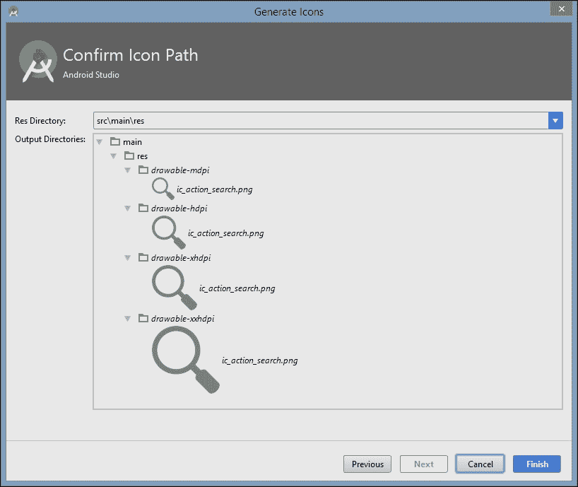
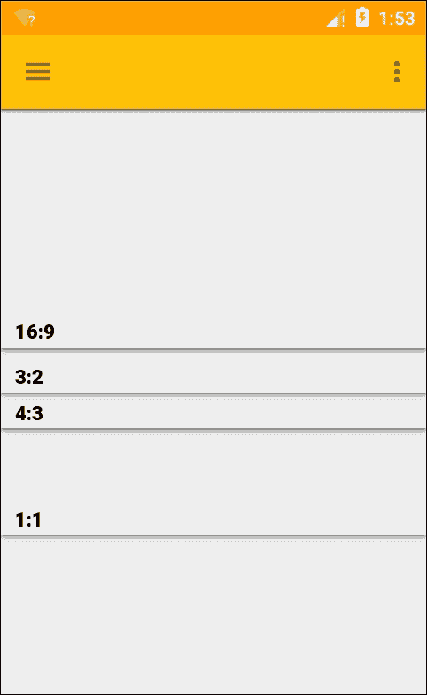

# 第三章：材料模式

在本书的这部分，我们探讨了如何通过使用设计模式来创建对象和对象集合，以及如何使用卡片视图来展示它们。在我们开始构建一个可工作的应用程序之前，我们需要考虑用户将如何输入他们的选择。在移动设备上有许多方式可以从用户那里收集信息，比如菜单、按钮、图标和对话框。安卓布局通常有一个应用栏（以前称为操作栏），它通常位于屏幕顶部，紧挨着状态栏，而实现材料设计的布局，通常会采用滑动导航抽屉来提供对应用顶级功能的访问。

通常情况下，使用支持库，尤其是**设计库**，可以非常容易地实现如导航栏这样的材质模式，材料设计本身包含了一些视觉模式，有助于促进最佳的 UI 实践。在本章中，我们将学习如何实现**应用栏**、**导航视图**，并探索材料设计提供的一些视觉模式。最后，我们还将快速了解一下**单例模式**。

在本章中，你将学习如何进行以下操作：

+   用应用栏替换操作栏

+   使用资产工作室添加操作图标

+   应用应用栏操作

+   在运行时控制应用栏

+   使用抽屉布局

+   添加菜单和子菜单

+   应用比例关键线

+   包含一个抽屉监听器

+   向应用中添加片段

+   管理片段回退栈

# 应用栏

安卓应用一直以来都在屏幕顶部包含一个工具栏。传统上，这被用来提供一个标题以及访问顶级菜单，被称为操作栏。自从安卓 5（API 级别 21）和材料设计的出现，这就可以用更灵活的应用栏来替代。应用栏允许我们设置其颜色，将其放置在屏幕的任何位置，并包含比其前身更广泛的内容。

大多数 Android Studio 模板使用的主题默认包含旧的操作栏，我们首先需要做的就是移除旧版本。要了解如何移除旧的操作栏并用定制的应用栏替换它，请按照以下步骤操作：

1.  使用空活动模板启动一个新的安卓项目，并通过主题编辑器设置你的材料主题。

1.  打开`styles.xml`文件，并编辑`style`定义以匹配这里的定义：

    ```kt
    <style name="AppTheme" parent="Theme.AppCompat.Light.NoActionBar"> 

    ```

1.  在`activity_main.xml`旁边创建一个新的 XML 文件，并将其命名为`toolbar.xml`。

1.  完成如下操作：

    ```kt
    <android.support.v7.widget.Toolbar  

        android:id="@+id/toolbar" 
        android:layout_width="match_parent" 
        android:layout_height="?attr/actionBarSize" 
        android:background="?attr/colorPrimary" 
        android:theme="@android:style/Theme.Material" 
        android:translationZ="4dp" /> 

    ```

1.  接下来，向`activity_main.xml`文件中添加以下元素：

    ```kt
    <include 
        android:id="@+id/toolbar" 
        layout="@layout/toolbar" /> 

    ```

    ```kt
    <android.support.v7.widget.Toolbar  

        android:id="@+id/toolbar" 
        android:layout_width="match_parent" 
        android:layout_height="?attr/actionBarSize" 
        android:background="?attr/colorPrimary" 
        android:theme="@android:style/Theme.Material" 
        android:translationZ="4dp" /> 

    ```

1.  最后，像这样编辑`dimens.xml`文件中的边距值：

    ```kt
    <resources> 
        <dimen name="activity_horizontal_margin">0dp</dimen> 
        <dimen name="activity_vertical_margin">0dp</dimen> 
    </resources> 

    ```

这个工具栏与其他任何 ViewGroup 一样，位于根布局内，因此与原始操作栏不同，它并不紧贴屏幕边缘。这就是为什么我们需要调整布局边距的原因。稍后，我们将使用 CoordinatorLayout，它会自动完成其中许多工作，但现在了解其工作原理是有用的。

工具栏现在虽然位置和阴影与原始工具栏类似，但并没有内容和功能。这可以在活动的 Java 元素中通过编辑`onCreate()`方法来实现：

```kt
@Override 
protected void onCreate(Bundle savedInstanceState) { 
    super.onCreate(savedInstanceState); 
    setContentView(R.layout.activity_main); 

    Toolbar toolbar = (Toolbar) findViewById(R.id.toolbar); 
    if (toolbar != null) { 
        setSupportActionBar(toolbar); 
    } 
} 

```

这将产生一个错误。这是因为这里可能导入两个库。按下**Alt + Enter**并选择如下所示的支持版本的 Toolbar：


### 提示

为了在处理 Java 时节省时间，更改设置以便在代码中包含 Java 库时自动导入。这可以通过**文件** | **设置**菜单中的**编辑器** | **常规** | **自动导入**来完成。

在运行 API 20 或更低版本的模拟器上测试项目，会立即展示 AppCompat 主题的一个缺点；尽管我们为状态栏`with colorPrimaryDark`声明了一个颜色，这在 API 21 及更高版本上完美运行，但在这里它仍然是黑色：


然而，考虑到我们现在能够触及的受众数量，这种做法以及缺少自然阴影的代价是微不足道的。

既然我们已经用工具栏替换了过时的操作栏，并将其设置为应用栏（有时称为主工具栏），我们可以更仔细地了解其工作原理以及如何使用 Asset Studio 应用符合材质设计规范的行动图标。

## 图像资源

在应用栏中包含文本菜单是可能的，但由于空间有限，通常使用图标更为常见。Android Studio 通过其 Asset Studio 提供了一组材质图标的访问。以下步骤将展示如何操作：

1.  在项目资源管理器中，从 drawable 文件夹的菜单选择**新建 | 图像资源**。

1.  然后选择**操作栏和标签图标**作为**资源类型**，接着点击**剪贴画**图标，从剪贴画集中选择一个图标：

1.  这张图片需要修剪，且填充为 0%。

1.  根据工具栏背景颜色是浅色还是深色选择一个主题。

1.  提供一个合适的名称并点击**下一步**：

    ### 提示

    可以从以下 URL 下载更多材质图标集合：[`design.google.com/icons`](https://design.google.com/icons)

资产工作室自动为我们跨四种屏幕密度创建图标，并将它们放置在正确的文件夹中，以便它们能够部署在适当的设备上。它甚至应用了材料设计用于图标所需的**54%不透明黑色**。要在我们的应用栏中包含这些，只需在适当的菜单项中添加一个图标属性。稍后，我们将使用导航抽屉提供顶级访问，但要了解如何使用应用栏，我们将添加一个搜索功能。我们为此选择的图标叫做 `ic_action_search`。

## 应用操作

操作图标保存在可绘制文件夹中，并且可以通过在菜单 XML 文件中包含 `items` 来包含在我们的操作栏中。根据您最初创建项目时使用的模板，您可能需要添加一个新目录 `res/menu` 和一个名为 `main.xml` 或 `menu_main.xml` 的文件，或者您选择作为 **新建 | 菜单资源文件** 的其他名称。可以像这样添加操作：

```kt
<menu  

    tools:context="com.example.kyle.appbar.MainActivity"> 

    <item 
        android:id="@+id/action_settings" 
        android:orderInCategory="100" 
        android: 
        app:showAsAction="collapseActionView" /> 

    <item 
        android:id="@+id/action_search" 
        android:icon="@drawable/ic_action" 
        android:orderInCategory="100" 
        android: 
        app:showAsAction="ifRoom" /> 
</menu> 

```

请注意，前面的示例使用了对字符串资源的引用，因此必须在 `strings.xml` 文件中伴有如下定义：

```kt
<string name="menu_search">Search</string> 

```

菜单项会自动包含在应用栏中，其标题取自字符串文件中的 `string name="app_name"` 定义。以这种方式构建时，这些组件会根据材料设计指南进行定位。

要查看实际效果，请按照以下步骤操作：

1.  打开主 Java 活动并添加这个字段：

    ```kt
    private Toolbar toolbar; 

    ```

1.  然后将这些行添加到 `onCreate()` 方法中：

    ```kt
    Toolbar toolbar = (Toolbar) findViewById(R.id.toolbar); 
        if (toolbar != null) { 
            setSupportActionBar(toolbar); 
        } 

    toolbar = (Toolbar) findViewById(R.id.toolbar); 
    toolbar.setTitle("A toolbar"); 
    toolbar.setSubtitle("with a subtitle"); 

    ```

1.  最后，在活动中添加以下方法：

    ```kt
    @Override 
    public boolean onCreateOptionsMenu(Menu menu) { 
        MenuInflater inflater = getMenuInflater(); 
        inflater.inflate(R.menu.menu_main, menu); 
        return true; 
    } 

    ```

现在我们应该能够在设备或模拟器上看到我们的新工具栏：


能够将我们喜欢的任何视图添加到工具栏，这使得它比旧的操作栏更有效。我们可以同时拥有多个，并且通过应用布局重力属性，它们甚至可以被放置在其他地方。正如之前所见，工具栏还带有自己的方法，可以通过这些方法添加图标和标志，但在这样做之前，根据材料设计指南探索应用栏的最佳实践会是一个好主意。

## 应用栏结构

尽管我们在这里应用的技术符合材料设计指南，我们除了确保其高度外不需要做很多工作，但在用自定义工具栏布局替换操作栏时，我们仍需要知道如何间隔和定位组件。这些在平板电脑和桌面上略有不同。

### 手机

在应用栏方面，只需记住一些简单的结构规则。这些规则涵盖了边距、填充、宽度、高度和定位，并且在不同平台和屏幕方向上有所不同。

+   应用栏在纵向模式下的 `layout_height` 为 `56 dp`，在横向模式下为 `48 dp`。

+   应用栏填充屏幕宽度或其包含列的宽度。它们不能被分成两个部分。它们的 `layout_width` 为 `match_parent`。

+   应用栏的 `elevation` 比它控制的材质纸张高 `2 dp`。

+   前一条规则的例外情况是，如果卡片或对话框有自己的工具栏，那么两者可以共享相同的阴影高度。

+   应用栏的填充恰好为 `16 dp`。这意味着包含的图标不能有自己的填充或边距，因此与这个边距共享边缘：

+   标题文本的颜色取自您主题的主文本颜色，图标则取自辅助文本颜色。

+   标题应位于工具栏左侧 `72 dp` 和底部 `20 dp` 的位置。即使工具栏展开时也适用此规则：

+   标题文本大小通过 `android:textAppearance="?android:attr/textAppearanceLarge"` 进行设置。

### 平板电脑

在为平板电脑和桌面构建应用栏时，规则相同，以下是一些例外：

+   工具栏的高度始终为 `64 dp`。

+   标题向内缩进 `80 dp`，并且在工具栏展开时不会向下移动。

+   应用栏的填充为 `24 dp`，顶部除外，那里是 `20 dp`。

我们已经按照材质设计指南构建了一个应用栏，但如果没有执行操作，操作图标是没有用的。本质上，当应用栏承担操作栏功能时，它实际上只是一个菜单的访问点。我们稍后会回到菜单和对话框，但现在我们将快速了解一下如何使用 Java 代码在运行时操作工具栏。

对旧操作栏所做的更改使其成为一个放置全局操作的简单直观视图。然而，空间有限，对于更复杂和图形化的导航组件，我们可以转向滑动抽屉。

# 导航抽屉

尽管可以让抽屉从屏幕的任一侧滑出，但导航抽屉应始终位于左侧，并且其阴影高度应高于除状态栏和导航栏之外的所有其他视图。将导航抽屉视为一个大部分时间隐藏在屏幕边缘之外的固定装置：


在设计库之前，必须使用其他视图构建如导航视图之类的组件，尽管库极大地简化了这一过程，并使我们不必手动实现许多材质原则，但仍有一些指南需要我们注意。了解这些的最佳方式是从头开始构建一个导航滑动抽屉。这将涉及创建布局，应用关于组件比例的材质设计指南，并通过代码将所有这些连接起来。

## 抽屉构建

你在设置项目时无疑已经注意到，Android Studio 提供了一个 **Navigation Drawer Activity** 模板。这为我们创建了很多可能需要的内容，并节省了大量工作。一旦我们决定了我们的三明治制作应用将具有哪些功能，我们将使用这个模板。然而，从头开始构建一个更有教育意义，可以看到它是如何工作的，基于这个想法，我们将创建一个需要通过 Asset Studio 轻松找到图标的抽屉布局：

1.  打开一个最低 SDK 级别为 21 或更高的 Android Studio 项目，并提供你自己的自定义颜色和主题。

1.  在你的 `styles.xml` 文件中添加以下行：

    ```kt
    <item name="android:statusBarColor"> 
    @android:color/transparent 
    </item> 

    ```

1.  确保你已经编译了以下依赖项：

    ```kt
    compile 'com.android.support:design:23.4.0' 

    ```

1.  如果你没有使用前一部分中的同一个项目，请设置一个名为 `toolbar.xml` 的 app-bar 布局。

1.  打开 `activity_main` 并用以下代码替换：

    ```kt
    <android.support.v4.widget.DrawerLayout  

        android:id="@+id/drawer" 
        android:layout_width="match_parent" 
        android:layout_height="match_parent" 
        android:fitsSystemWindows="true" 
        tools:context=".MainActivity"> 

        <LinearLayout 
            android:layout_width="match_parent" 
            android:layout_height="match_parent" 
            android:orientation="vertical"> 

            <include 
                android:id="@+id/toolbar" 
                layout="@layout/toolbar" /> 

            <FrameLayout 
                android:id="@+id/fragment" 
                android:layout_width="match_parent" 
                android:layout_height="match_parent"> 
            </FrameLayout> 

        </LinearLayout> 

        <android.support.design.widget.NavigationView 
            android:id="@+id/navigation_view" 
            android:layout_width="wrap_content" 
            android:layout_height="match_parent" 
            android:layout_gravity="start" 
            app:headerLayout="@layout/header" 
            app:menu="@menu/menu_drawer" /> 

    </android.support.v4.widget.DrawerLayout> 

    ```

如你所见，这里的根布局是由支持库提供的 **DrawerLayout**。注意 `fitsSystemWindows` 属性；这就是使得抽屉延伸到状态栏下方的屏幕顶部的原因。在样式中将 `statusBarColor` 设置为 `android:color/transparent`，抽屉现在可以通过状态栏看到。

即使使用 AppCompat，这个效果在运行 Android 5.0（API 21）以下版本的设备上也是不可用的，这将改变标题的显示宽高比并裁剪任何图片。为了解决这个问题，创建一个不设置 `fitsSystemWindows` 属性的替代 `styles.xml` 资源。

布局的其余部分包括一个 LinearLayout 和 **NavigationView** 本身。这个线性布局包含我们的应用栏和一个空的 **FrameLayout**。FrameLayout 是最简单的布局，只包含单个条目，通常用作占位符，在这种情况下，它将根据用户从导航菜单中的选择来包含内容。

从前面的代码可以看出，我们需要一个用于标题的布局文件和一个用于抽屉本身的菜单文件。`header.xml` 文件应该在 `layout` 目录中创建，并如下所示：

```kt
<?xml version="1.0" encoding="utf-8"?> 
<RelativeLayout  
    android:layout_width="match_parent" 
    android:layout_height="header_height" 
    android:background="@drawable/header_background" 
    android:orientation="vertical"> 

    <TextView 
        android:id="@+id/feature" 
        android:layout_width="wrap_content" 
        android:layout_height="wrap_content" 
        android:layout_above="@+id/details" 
        android:gravity="left" 
        android:paddingBottom="8dp" 
        android:paddingLeft="16dp" 
        android:text="@string/feature" 
        android:textColor="#FFFFFF" 
        android:textSize="14sp" 
        android:textStyle="bold" /> 

    <TextView 
        android:id="@+id/details" 
        android:layout_width="wrap_content" 
        android:layout_height="wrap_content" 
        android:layout_alignStart="@+id/feature" 
        android:layout_alignParentBottom="true" 
        android:layout_marginBottom="16dp" 
        android:gravity="left" 
        android:paddingLeft="16dp" 
        android:text="@string/details" 
        android:textColor="#FFFFFF" 
        android:textSize="14sp" /> 

</RelativeLayout> 

```

你需要向 `dimens.xml` 文件中添加以下值：

```kt
<dimen name="header_height">192dp</dimen> 

```

如你所见，我们需要一张用作标题的图片。这里称它为 `header_background`，它的宽高比应该是 4:3。

如果你在这个布局在不同的屏幕密度设备上进行测试，你很快就会发现这个宽高比没有得到保持。我们可以通过类似管理图像资源的方式，使用配置限定符来轻松解决这个问题。为此，请按照这里概述的简单步骤操作：

1.  为每个密度范围创建新的目录，其名称如 `values-ldpi`、`values-mdpi` 等，直至 `values-xxxhdpi`。

1.  在每个文件夹中复制一份 `dimens.xml` 文件。

1.  在每个文件中设置 `header_height` 的值，以匹配该屏幕密度。

菜单文件名为`menu_drawer.xml`，应放置在`menu`目录中，你可能需要创建这个目录。每个项目都有一个关联的图标，这些都可以在资源工作室中找到。代码本身应与以下内容相匹配：

```kt
<?xml version="1.0" encoding="utf-8"?> 
<menu > 

    <item 
        android:id="@+id/drama" 
        android:icon="@drawable/drama" 
        android: /> 

    <item 
        android:id="@+id/film" 
        android:icon="@drawable/film" 
        android: /> 

    <item 
        android:id="@+id/sport" 
        android:icon="@drawable/sport" 
        android: /> 

    <item 
        android:id="@+id/news" 
        android:> 
        <menu> 
            <item 
                android:id="@+id/national" 
                android:icon="@drawable/news" 
                android: /> 

            <item 
                android:id="@+id/international" 
                android:icon="@drawable/international" 
                android: /> 

        </menu> 
    </item> 
</menu> 

```

由于设计库，滑动抽屉和导航视图的大部分度量标准（如边距和文本大小）都为我们处理好了。然而，抽屉标题上的文本大小、位置和颜色并没有。尽管共享背景，但文本应该被认为是一个本身高度为 56-dp 的组件。它应该有 16-dp 的内部填充和 8-dp 的行间距。这，加上正确的文本颜色、大小和权重可以从前面的代码中得出。

## 比例关键线

当一个元素（如滑动抽屉）填满整个屏幕的高度，并被分为垂直段时，如我们的抽屉在标题和内容之间，那么这些分段只能在某些点发生，这些点称为比例关键线。这些点由元素的宽度和距离顶部发生分割的比例决定。在材料布局中有六种这样的比例，它们定义为宽高比（`width:height`），如下所示：

+   16:9

+   3:2

+   4:3

+   1:1

+   3:4

+   2:3

在此示例中，选择了 4:3 的比例，抽屉的宽度为 256 dp。我们还可以制作一个具有 16:9 比例的标题，并将`layout_height`设置为 144 dp。

比例关键线仅与包含元素的顶部距离有关；你不能在一个 16:9 视图下方再放置另一个。但是，如果另一个视图从顶部视图的底部延伸到另一条比例关键线，你可以在其下方放置另一个视图：


## 激活抽屉

现在剩下的就是用 Java 实现一些代码，让布局工作。这是通过监听回调方法实现的，当用户与抽屉交互时调用。以下步骤演示了如何实现这一点：

1.  打开 MainActivity 文件，并在`onCreate()`方法中添加以下行，用我们的工具栏替换动作栏：

    ```kt
    toolbar = (Toolbar) findViewById(R.id.toolbar); 
    setSupportActionBar(toolbar); 

    ```

1.  在此之下，添加以下行来配置抽屉：

    ```kt
    drawerLayout = (DrawerLayout) findViewById(R.id.drawer); 
    ActionBarDrawerToggle toggle = new ActionBarDrawerToggle(this, drawerLayout, toolbar, R.string.openDrawer, R.string.closeDrawer) { 

    public void onDrawerOpened(View v) { 
        super.onDrawerOpened(v); 
    } 

    public void onDrawerClosed(View v) { 
         super.onDrawerClosed(v); 
    } 

    }; 

    drawerLayout.setDrawerListener(toggle); 
    toggle.syncState(); 

    ```

1.  最后，添加此代码来设置导航视图：

    ```kt
    navigationView = (NavigationView) findViewById(R.id.navigation_view); 

    navigationView.setNavigationItemSelectedListener(new NavigationView.OnNavigationItemSelectedListener() { 

        @Override 
        public boolean onNavigationItemSelected(MenuItem item) { 

            drawerLayout.closeDrawers(); 

            switch (item.getItemId()) { 
                case R.id.drama: 
                    Log.d(DEBUG_TAG, "drama"); 
                    return true; 
                case R.id.film: 
                    Log.d(DEBUG_TAG, "film"); 
                    return true; 
                case R.id.news: 
                    Log.d(DEBUG_TAG, "news"); 
                    return true; 
                case R.id.sport: 
                    Log.d(DEBUG_TAG, "sport"); 
                    return true; 
                default: 
                    return true; 
                    } 
                } 
            }); 

    ```

    

上述 Java 代码允许我们在设备或模拟器上查看抽屉，但在选择导航项时几乎不起作用。我们真正需要做的是实际上跳转到应用程序的另一部分。这很容易实现，我们稍后会介绍。首先，在前面代码中有一两点需要提一下。

以 `ActionBarDrawerToggle` 开头的这行代码是导致应用栏上出现打开抽屉的汉堡包图标的代码，当然，你也可以从屏幕左侧向内滑动来打开它。两个字符串参数 `openDrawer` 和 `closeDrawer` 是出于可访问性考虑的，它们会被读给那些看不清屏幕的用户听，应该表述为类似“导航抽屉打开”和“导航抽屉关闭”。两个回调方法 `onDrawerOpened()` 和 `onDrawerClosed()` 在这里留空了，但它们展示了可以拦截这些事件的位置。

调用 `drawerLayout.closeDrawers()` 是必不可少的，因为否则抽屉将保持打开状态。在这里，我们使用了调试器来测试输出，但理想情况下我们希望菜单能引导我们到应用的其他部分。这并不是一个困难的任务，同时也提供了一个很好的机会来介绍 SDK 中最有用和多功能的类之一，即**碎片**。

## 添加碎片

根据我们目前所学到的知识，可以想象为具有多个功能的 apps 会使用单独的活动，尽管这通常是情况，但它们可能会成为资源的昂贵消耗，并且活动总是占据整个屏幕。碎片就像迷你活动，它们既有 Java 也有 XML 定义，并且具有与活动相同的许多回调和功能。与活动不同，碎片不是顶级组件，必须驻留在宿主活动中。这种做法的优点是我们可以拥有一个屏幕上的多个碎片。

要了解如何做到这一点，请创建一个新的 Java 类，比如叫 `ContentFragment`，然后按照以下步骤完成它，确保导入的是 `android.support.v4.app.Fragment` 而不是标准版本：

```kt
public class ContentFragment extends Fragment { 

    @Override 
    public View onCreateView(LayoutInflater inflater, ViewGroup container, Bundle savedInstanceState) { 
        View v = inflater.inflate(R.layout.content,container,false); 
        return v; 
    } 
} 

```

至于 XML 元素，创建一个名为 `content.xml` 的布局文件，并在其中放置你选择的任意视图和小部件。现在需要的只是当选择导航项时调用它的 Java 代码。

打开 `MainActivity.Java` 文件，并在 `switch` 语句中用以下内容替换一个 Debug 调用：

```kt
ContentFragment fragment = new ContentFragment(); 
android.support.v4.app.FragmentTransaction transaction = getSupportFragmentManager().beginTransaction(); 
transaction.replace(R.id.fragment, fragment); 
transaction.addToBackStack(null); 
transaction.commit(); 

```

我们在这里构建的示例只是为了演示抽屉布局和导航视图的基本结构。显然，要添加任何实际的功能，我们需要为菜单中的每个项都准备一个碎片，除非这样做，否则 `transaction.addToBackStack(null);` 这行代码实际上是多余的。它的功能是确保系统以记录使用哪个活动的方式记录用户访问每个碎片的顺序，这样当用户按下返回键时，他们将返回到上一个碎片。如果没有它，他们将被返回到上一个应用，而容器活动将被销毁。

## 右手抽屉

作为顶级导航组件，滑动抽屉应该只从左侧滑入，并遵循之前概述的度量标准。然而，要实现从右侧滑入的抽屉非常容易，对于许多次要功能来说，这可能是有吸引力的：


让滑动抽屉从右侧出现仅是设置布局重力的问题，例如：

```kt
android:layout_gravity="end" 

```

与传统的导航视图不同，它不应比屏幕宽度减去主应用栏的高度更宽，而右手侧抽屉可以延伸到整个屏幕。

本章的内容一直关于 UI 设计，我们还没有遇到过任何设计模式。我们本可以在这里使用设计模式，但选择专注于 Android UI 的机制。我们将在本书的后面看到，门面模式对于简化复杂菜单或布局的编码非常有用。

几乎可以在任何地方引入的一个设计模式是单例模式。这是因为它几乎可以在任何地方使用，其目的是提供一个对象的全球实例。

# 单例模式。

单例模式无疑是所有模式中最简单的一个，但同时也是最具争议的一个。许多开发者认为它完全没必要，认为将一个类声明为静态可以达到相同的功能，而且更为简单。尽管单例模式确实在许多本可以使用静态类的情况下被过度使用，但确实存在一些场合，单例模式比静态类更为合适：

+   当你想要对一个传递给它的变量执行函数时，使用静态类，例如，计算价格变量的折扣值。

+   当你想要一个完整的对象，但只有一个，并且希望这个对象可以被程序的任何部分访问时，使用单例模式，例如，代表当前登录应用的个人用户的对象。

单例模式的类图，正如你所想象的，非常简单，正如你在这里看到的：


如前面的图表所示，以下示例假设我们一次只登录一个用户到我们的应用，并且我们将创建一个可以从代码任何部分访问的单例对象。

Android Studio 在项目资源管理器的**新建**菜单下提供了单例创建功能，因此我们可以从这里开始。这个演示只有两个步骤，如下所示。

1.  将这个类添加到你的项目中：

    ```kt
    public class CurrentUser { 
        private static final String DEBUG_TAG = "tag"; 
        private String name; 

        // Create instance 
        private static CurrentUser user = new CurrentUser(); 

        // Protect class from being instantiated 
        private CurrentUser() { 
        } 

        // Return only instance of user 
        public static CurrentUser getUser() { 
            return user; 
        } 

        // Set name 
        protected void setName(String n) { 
            name = n; 
        } 

        // Output user name 
        protected void outputName() { 
            Log.d(DEBUG_TAG, name); 
        } 
    } 

    ```

1.  通过向活动中添加如下代码来测试这个模式：

    ```kt
    CurrentUser user = CurrentUser.getUser(); 
    user.setName("Singleton Pattern"); 
    user.outputName(); 

    ```

单例模式可能非常有用，但很容易不必要地使用它。在异步任务时非常有用，如文件系统，并且当我们希望从代码的任何地方访问其内容时，比如前面示例中的用户名。

# 总结

无论应用的目的如何，用户需要一种熟悉的方式来访问它的功能。应用栏和导航抽屉不仅容易被用户理解，而且提供了极大的灵活性。

在本章中，我们了解了如何在安卓设备上应用两种最重要的输入机制以及控制它们外观的材料设计模式。"SDK，尤其是设计库，使得编写这些结构既简单又直观。尽管与迄今为止我们遇到的设计模式不同，但材料设计模式发挥着类似的功能，并指导我们走向更好的实践。

下一个章节将继续探讨布局设计，并研究在组合整个布局时我们可以使用的工具，以及我们如何设法开发适应各种屏幕形状和大小的应用。
