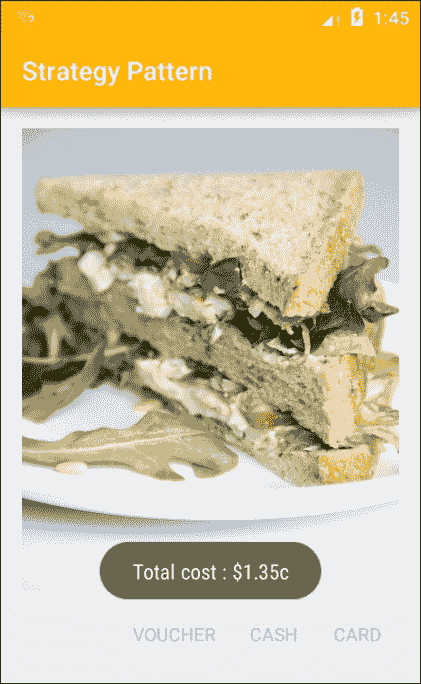

# 第四章：布局模式

在前面的章节中，我们已经了解了创建对象时最常用的模式以及一些最常使用的材质组件。为了将这些内容整合在一起，我们需要考虑应用程序可能需要的整体布局。这使我们能够更详细地规划我们的应用程序，同时也带来了为不同尺寸屏幕和方向设计应用程序的有趣挑战。Android 平台为开发各种屏幕尺寸和形状提供了非常简单直观的方法，并且只需编写很少的额外代码。最后，我们将探索并创建一个策略模式。

在本章中，您将学习如何：

+   使用相对布局和线性布局

+   应用重力和权重

+   使用 weightSum 缩放权重

+   使用百分比支持库

+   为特定屏幕尺寸开发布局

+   创建策略模式

Android 平台提供了一系列布局类。从非常简单的**帧布局**到支持库提供的相当复杂的布局。最广泛使用且最灵活的是线性布局和相对布局。

# 线性布局

在相对布局和线性布局之间选择通常非常简单。如果您的组件是从一边到另一边堆叠的，那么**线性布局**是明显的选择。尽管嵌套视图组是可能的，但对于更复杂的布局，相对布局通常是最好的选择。这主要是因为嵌套布局会消耗资源，应尽可能避免深层层次结构。**相对布局**可以用来创建许多复杂的布局，而无需大量嵌套。

无论哪种形式最适合我们的需求，一旦开始在形状不同的屏幕上测试我们的布局，或者将屏幕旋转 90°，我们很快就会发现我们在创建具有美观比例的组件上所做的所有思考都白费了。通常，这些问题可以通过使用**重力**属性定位元素并通过**权重**属性进行缩放来解决。

## 权重和重力

能够设置位置和比例而不必过分关注屏幕的确切形状可以为我们节省大量工作。通过设置组件和控件的权重属性，我们可以确定单个组件占用的屏幕宽度或高度的比例。当我们希望大多数控件使用`wrap_content`，以便根据用户需求进行扩展，但同时也希望一个视图占用尽可能多的空间时，这特别有用。

例如，在以下布局中的图像将随着上方文本的增长而适当缩小。


在此图中，只有图像视图应用了权重，其他视图的`height`都使用`wrap_content`声明。正如这里所看到的，我们需要将`layout_height`设置为`0dp`以避免在设置视图高度时发生内部冲突：

```kt
<ImageView 
    android:id="@+id/feedback_image" 
    android:layout_width="match_parent" 
    android:layout_height="0dp" 
    android:layout_weight="1" 
    android:contentDescription="@string/content_description" 
    android:src="img/tomatoes" /> 

```

### 提示

权重不仅可以应用于单个小部件和视图，还可以应用于视图组和嵌套布局。

自动填充可能变化的屏幕空间非常有用，但权重可以应用于多个视图，以创建每个视图占用活动指定相对面积的布局。例如，以下图片就使用了`1`、`2`、`3`和`2`的权重进行缩放。


尽管通常应避免在一个布局中嵌套另一个布局，但考虑一两个层级往往是有价值的，因为这可以产生一些非常实用的活动。例如：


这个布局仅使用两个嵌套的视图组，且权重的使用可以使得结构在相当广泛的屏幕尺寸上都能很好地工作。当然，这个布局在竖屏模式下看起来会很糟糕，但我们在本章后面会看到如何解决这个问题。生成此类布局的 XML 代码如下所示：

```kt
<FrameLayout 
    android:layout_width="match_parent" 
    android:layout_height="56dp" /> 

<LinearLayout 
    android:layout_width="match_parent" 
    android:layout_height="match_parent" 
    android:orientation="horizontal"> 

    <FrameLayout 
        android:layout_width="0dp" 
        android:layout_height="match_parent" 
        android:layout_weight="2" /> 

    <LinearLayout 
        android:layout_width="0dp" 
        android:layout_height="match_parent" 
        android:layout_weight="1" 
        android:orientation="vertical"> 

        <FrameLayout 
            android:layout_width="match_parent" 
            android:layout_height="0dp" 
            android:layout_weight="3" /> 

        <FrameLayout 
            android:layout_width="match_parent" 
            android:layout_height="0dp" 
            android:layout_weight="2" /> 

    </LinearLayout> 

    <FrameLayout 
        android:layout_width="0dp" 
        android:layout_height="match_parent" 
        android:layout_weight="1" /> 

</LinearLayout> 

```

上面的示例引出了一个有趣的问题。如果我们不想填满布局的整个宽度和高度怎么办？如果我们想要留出一些空间呢？这可以通过**weightSum**属性轻松管理。

要了解`weightSum`是如何工作的，可以在上一个示例中的内部线性布局定义中添加以下突出显示的属性：

```kt
<LinearLayout 
    android:layout_width="0dp" 
    android:layout_height="match_parent" 
    android:layout_weight="1" 
    android:orientation="vertical" 
    android:weightSum="10"> 

```

通过为布局设置最大权重，内部权重将按比例设置。在这个例子中，`weightSum`为`10`设置了内部权重，即`3`和`2`，分别占布局高度的 3/10 和 2/10，如下所示：

|  |   |
| --- | --- |
|  |  |

### 提示

请注意，权重和`weightSum`都是浮点属性，使用如下这样的行可以取得更高的精确度：`android:weightSum="20.5"`。

使用权重是充分利用未知屏幕大小和形状的极其有用的方法。管理整体屏幕空间的另一种技术是使用重力来定位组件及其内容。

**gravity**属性用于对齐视图及其内容。在之前给出的示例中，以下标记被用于将动作定位在活动的底部：

```kt
<TextView 
    android:id="@+id/action_post" 
    android:layout_width="100dp" 
    android:layout_height="wrap_content" 
    android:layout_gravity="right" 
    android:clickable="true" 
    android:padding="16dp" 
    android:text="@string/action_post" 
    android:textColor="@color/colorAccent" 
    android:textSize="24sp" /> 

```

这个示例演示了如何使用`layout_gravity`来对齐容器内的视图（或视图组）。单个视图的内容也可以通过`gravity`属性在视图内部定位，可以像这样设置：

```kt
android:layout_gravity="top|left" 

```

将布局按行和列排序可能是考虑屏幕布局的最简单方法，但这不是唯一的方法。**相对布局**提供了一种基于位置而非比例的替代技术。相对布局还允许我们使用**百分比支持库**来对其内容进行比例调整。

# 相对布局

相对布局最大的优势可能是它能够减少在构建复杂布局时嵌套视图组数量。这是通过定义视图的位置以及它们如何通过属性如`layout_below`和`layout_toEndOf`相互定位和对齐来实现的。要看这是如何操作的，可以考虑上一个示例中的线性布局。我们可以将其重新创建为一个没有嵌套视图组的相对布局，如下所示：

```kt
<?xml version="1.0" encoding="utf-8"?> 
<RelativeLayout  
    android:layout_width="match_parent" 
    android:layout_height="match_parent"> 

    <FrameLayout 
        android:id="@+id/header" 
        android:layout_width="match_parent" 
        android:layout_height="56dp" 
        android:layout_alignParentTop="true" 
        android:layout_centerHorizontal="true" /> 

    <FrameLayout 
        android:id="@+id/main_panel" 
        android:layout_width="320dp" 
        android:layout_height="match_parent" 
        android:layout_alignParentStart="true" 
        android:layout_below="@+id/header" /> 

    <FrameLayout 
        android:id="@+id/center_column_top" 
        android:layout_width="160dp" 
        android:layout_height="192dp" 
        android:layout_below="@+id/header" 
        android:layout_toEndOf="@+id/main_panel" /> 

    <FrameLayout 
        android:id="@+id/center_column_bottom" 
        android:layout_width="160dp" 
        android:layout_height="match_parent" 
        android:layout_below="@+id/center_column_top" 
        android:layout_toEndOf="@+id/main_panel" /> 

    <FrameLayout 
        android:id="@+id/right_column" 
        android:layout_width="match_parent" 
        android:layout_height="match_parent" 
        android:layout_below="@+id/header" 
        android:layout_toEndOf="@+id/center_column_top" /> 

</RelativeLayout> 

```

尽管这种方法的明显优势是不需要嵌套视图组，但我们必须明确设置单个视图的尺寸，一旦在不同屏幕上预览输出，这些比例很快就会丢失，或者至少会被扭曲。

解决这个问题的方法之一可能是为不同的屏幕配置创建单独的`dimens.xml`文件，但如果我们想要填充屏幕的精确百分比，那么我们永远无法保证在每种可能的设备上都能实现这一点。幸运的是，Android 提供了一个非常有用的支持库。

## 百分比支持库

在相对布局中为给定组件定义确切比例可能是一个问题，因为我们只能描述事物在哪里，而不能描述它们在组内的突出程度。幸运的是，百分比库提供了**PercentRelativeLayout**来解决这一问题。

与其他支持库一样，百分比库必须包含在`build.gradle`文件中：

```kt
compile 'com.android.support:percent:23.4.0' 

```

要创建之前的相同布局，我们将使用以下代码：

```kt
<android.support.percent.PercentRelativeLayout  

    android:layout_width="match_parent" 
    android:layout_height="match_parent"> 

    <FrameLayout 
        android:id="@+id/header" 
        android:layout_width="match_parent" 
        android:layout_height="0dp" 
        android:layout_alignParentTop="true" 
        android:layout_centerHorizontal="true" 
        app:layout_heightPercent="20%" /> 

    <FrameLayout 
        android:id="@+id/main_panel" 
        android:layout_width="0dp" 
        android:layout_height="match_parent" 
        android:layout_alignParentStart="true" 
        android:layout_below="@+id/header" 
        app:layout_widthPercent="50%" /> 

    <FrameLayout 
        android:id="@+id/center_column_top" 
        android:layout_width="0dp" 
        android:layout_height="0dp" 
        android:layout_below="@+id/header" 
        android:layout_toEndOf="@+id/main_panel" 
        app:layout_heightPercent="48%" 
        app:layout_widthPercent="25%" /> 

    <FrameLayout 
        android:id="@+id/center_column_bottom" 
        android:layout_width="0dp" 
        android:layout_height="0dp" 
        android:layout_below="@+id/center_column_top" 
        android:layout_toEndOf="@+id/main_panel" 
        app:layout_heightPercent="32%" 
        app:layout_widthPercent="25%" /> 

    <FrameLayout 
        android:id="@+id/right_column" 
        android:layout_width="0dp" 
        android:layout_height="match_parent" 
        android:layout_below="@+id/header" 
        android:layout_toEndOf="@+id/center_column_top" 
        app:layout_widthPercent="25%" /> 

</android.support.percent.PercentRelativeLayout> 

```

百分比库提供了一种直观且简单的方法来创建比例，这些比例在未测试的形态因素上显示时不容易被扭曲。这些模型在其他具有相同方向的设备上测试时工作得非常好。然而，一旦我们将这些布局旋转 90°，我们就能看到问题所在。幸运的是，Android SDK 允许我们重用我们的布局模式，以最小的重新编码创建替代版本。正如我们所料，这是通过创建指定的布局配置来实现的。

# 屏幕旋转

大多数，如果不是全部的移动设备，都允许屏幕重新定向。许多应用程序（如视频播放器）更适合一个方向而不是另一个。一般来说，我们希望我们的应用程序无论旋转多少度都能看起来最好。

当从竖屏转换为横屏或反之亦然时，大多数布局看起来都很糟糕。显然，我们需要为这些情况创建替代方案。幸运的是，我们不需要从头开始。要看这是如何实现的，可以从这里的一个标准的竖屏布局开始：


这可以通过以下代码重新创建：

```kt

    <android.support.percent.PercentRelativeLayout  

    android:layout_width="match_parent" 
    android:layout_height="match_parent"> 

    <FrameLayout 
        android:id="@+id/header" 
        android:layout_width="match_parent" 
        android:layout_height="0dp" 
        android:layout_alignParentTop="true" 
        android:layout_centerHorizontal="true" 
        android:background="@color/colorPrimary" 
        android:elevation="6dp" 
        app:layout_heightPercent="10%" /> 

    <ImageView 
        android:id="@+id/main_panel" 
        android:layout_width="match_parent" 
        android:layout_height="0dp" 
        android:layout_alignParentStart="true" 
        android:layout_below="@+id/header" 
        android:background="@color/colorAccent" 
        android:contentDescription="@string/image_description" 
        android:elevation="4dp" 
        android:scaleType="centerCrop" 
        android:src="img/cheese" 
        app:layout_heightPercent="40%" /> 

    <FrameLayout 
        android:id="@+id/panel_b" 
        android:layout_width="0dp" 
        android:layout_height="0dp" 
        android:layout_alignParentEnd="true" 
        android:layout_below="@+id/main_panel" 
        android:background="@color/material_grey_300" 
        app:layout_heightPercent="30%" 
        app:layout_widthPercent="50%" /> 

    <FrameLayout 
        android:id="@+id/panel_c" 
        android:layout_width="0dp" 
        android:layout_height="0dp" 
        android:layout_alignParentEnd="true" 
        android:layout_below="@+id/panel_b" 
        android:background="@color/material_grey_100" 
        app:layout_heightPercent="20%" 
        app:layout_widthPercent="50%" /> 

    <FrameLayout 
        android:id="@+id/panel_a" 
        android:layout_width="0dp" 
        android:layout_height="match_parent" 
        android:layout_alignParentStart="true" 
        android:layout_below="@+id/main_panel" 
        android:elevation="4dp" 
        app:layout_widthPercent="50%" /> 

</android.support.percent.PercentRelativeLayout> 

```

同样，一旦旋转，它看起来设计得非常糟糕。为了创建一个可接受的横屏版本，请在设计模式下查看你的布局，并点击设计面板左上角的配置图标，选择**创建横屏变体**：


这会在一个文件夹中创建我们文件的副本，该文件夹在应用程序处于横屏模式时会引用其布局定义。这个目录与`res/layout`文件夹并列，名为`res/layout-land`。现在只需重新排列我们的视图以适应这种新格式，实际上，我们可以使用本章早些时候的布局，如下所示：

```kt
<android.support.percent.PercentRelativeLayout  

    android:layout_width="match_parent" 
    android:layout_height="match_parent"> 

    <FrameLayout 
        android:id="@+id/header" 
        android:layout_width="match_parent" 
        android:layout_height="0dp" 
        android:layout_alignParentTop="true" 
        android:layout_centerHorizontal="true" 
        android:background="@color/colorPrimary" 
        android:elevation="6dp" 
        app:layout_heightPercent="15%" /> 

    <ImageView 
        android:id="@+id/main_panel" 
        android:layout_width="0dp" 
        android:layout_height="match_parent" 
        android:layout_alignParentStart="true" 
        android:layout_below="@+id/header" 
        android:background="@color/colorAccent" 
        android:contentDescription="@string/image_description" 
        android:elevation="4dp" 
        android:scaleType="centerCrop" 
        android:src="img/cheese" 
        app:layout_widthPercent="50%" /> 

    <FrameLayout 
        android:id="@+id/panel_a" 
        android:layout_width="0dp" 
        android:layout_height="0dp" 
        android:layout_below="@+id/header" 
        android:layout_toRightOf="@id/main_panel" 
        android:background="@color/material_grey_300" 
        app:layout_heightPercent="50%" 
        app:layout_widthPercent="25%" /> 

    <FrameLayout 
        android:id="@+id/panel_b" 
        android:layout_width="0dp" 
        android:layout_height="0dp" 
        android:layout_below="@+id/panel_a" 
        android:layout_toRightOf="@id/main_panel" 
        android:background="@color/material_grey_100" 
        app:layout_heightPercent="35%" 
        app:layout_widthPercent="25%" /> 

    <FrameLayout 
        android:id="@+id/panel_c" 
        android:layout_width="0dp" 
        android:layout_height="match_parent" 
        android:layout_alignParentEnd="true" 
        android:layout_below="@+id/header" 
        android:elevation="4dp" 
        app:layout_widthPercent="25%" /> 

</android.support.percent.PercentRelativeLayout> 

```


应用这些更改并创建横屏布局只需几秒钟，但我们还可以做得更多。特别是，我们可以创建专门为大屏幕和平板电脑设计的布局。

# 大屏幕布局

当我们从配置菜单创建我们布局的横屏版本时，你无疑注意到了**创建 layout-xlarge 版本**的选项，正如你所想象的，这是用于为平板电脑和甚至电视的大屏幕创建合适的布局。

如果你选择这个选项，你会立即看到我们对百分比库的明智使用产生了相同的布局，可能会觉得这个布局是不必要的，但这会忽略重点。像 10 英寸平板这样的设备提供了更多的空间，我们不仅应该放大我们的布局，还应该利用这个机会提供更多的内容。

在这个例子中，我们只为 xlarge 版本添加一个额外的框架。这很容易做到，只需添加以下 XML，并调整其他视图的高度百分比值：

```kt
<FrameLayout 
    android:id="@+id/panel_d" 
    android:layout_width="0dp" 
    android:layout_height="0dp" 
    android:layout_alignParentEnd="true" 
    android:layout_below="@+id/panel_c" 
    android:background="@color/colorAccent" 
    android:elevation="4dp" 
    app:layout_heightPercent="30%" 
    app:layout_widthPercent="50%" /> 

```


除了充分利用大屏幕，我们也可以通过使用`small`限定符为小屏幕实现相反的效果。这有助于优化小屏幕的布局，通过缩小元素大小，甚至移除不那么重要的内容。

我们在这里看到的限定符非常有用，但它们仍然相当宽泛。根据设备分辨率，我们可能会很容易地发现相同的布局被应用于大手机和小平板上。幸运的是，框架提供了让我们在定义布局时更加精确的方法。

## 宽度限定符

作为开发者，我们花费大量时间和精力寻找和创造优质的图像和其他媒体内容。重要的是，我们要让这些工作得到应有的展示，确保它们以最佳效果呈现。想象一下，你有一个至少需要 720 像素宽才能最好地欣赏的布局。在这种情况下，我们可以做两件事。

首先，我们可以确保我们的应用程序只在至少具有我们所需屏幕分辨率的设备上可用，这可以通过编辑`AndroidManifest`文件来实现，在`manifest`元素内添加以下标签：

```kt
 <supports-screens android:requiresSmallestWidthDp="720" /> 

```

通常，让我们的应用对小型屏幕用户不可用是一件遗憾的事，我们可能这样做的情况很少。为大型电视屏幕设计或精确照片编辑的应用可能是例外。更常见的是，我们更愿意创建适合尽可能多的屏幕尺寸的布局，这导致了我们的第二个选项。

安卓平台允许我们根据诸如 **最小和可用宽度**（以像素为单位）的具体屏幕尺寸标准来设计布局。通过*最小*，我们指的是两个屏幕尺寸中最窄的一个，无论方向如何。对于大多数设备来说，这意味着在纵向模式下查看时的宽度，以及横向模式下的高度。使用*可用*宽度提供了另一个级别的灵活性，即宽度是根据屏幕的方向来测量的，这允许我们设计一些非常特定的布局。根据最小宽度优化布局非常简单，就像以前使用限定符一样。所以一个名为：

```kt
res/layout-sw720dp/activity_main.xml 

```

将替换

```kt
res/layout/activity_main.xml 

```

在最短边为 720 dp 或更大的设备上。

当然，我们可以创建任意大小文件夹，例如 `res/layout-sw600dp`。

这种技术非常适合为大型屏幕设计布局，无论方向如何。然而，根据设备在特定时刻的方向来应用基于外观宽度的布局设计可能非常有用。这是通过指定目录以类似方式实现的。为了设计可用宽度，使用：

```kt
res/layout-w720dp 

```

为了优化可用高度，使用：

```kt
res/layout-h720dp 

```

这些限定符提供了确保我们的设计充分利用可用硬件的非常有用的技术，但如果我们想要为运行 Android 3.1 或更低版本的设备开发，就有一个小缺点。在这些设备上，最小和可用宽度限定符不可用，我们必须使用 `large` 和 `xlarge` 限定符。这可能导致两个相同的布局，浪费空间并增加我们的维护成本。幸运的是，有一种方法可以解决这个问题，那就是布局别名。

## 布局别名

为了演示布局别名如何工作，我们将想象一个简单的案例，我们只有两个布局，一个是默认的 `activity_main.xml` 文件，其中只有两个视图，另一个是我们称之为 `activity_main_large.xml` 的布局，它有三个视图，以利用更大的屏幕。要了解如何完成此操作，请按照以下步骤操作：

1.  打开 `activity_main` 文件，为其提供以下两个视图：

    ```kt
    <ImageView 
        android:id="@+id/image_view" 
        android:layout_width="match_parent" 
        android:layout_height="256dp" 
        android:layout_alignParentLeft="true" 
        android:layout_alignParentStart="true" 
        android:layout_alignParentTop="true" 
        android:contentDescription="@string/content_description" 
        android:scaleType="fitStart" 
        android:src="img/sandwich" /> 

    <TextView 
        android:id="@+id/text_view" 
        android:layout_width="wrap_content" 
        android:layout_height="wrap_content" 
        android:layout_below="@+id/image_view" 
        android:layout_centerHorizontal="true" 
        android:layout_centerVertical="true" 
        android:text="@string/text_value" 
        android:textAppearance="?android:attr/textAppearanceLarge" /> 

    ```

1.  复制此文件，将其命名为 `activity_main_large` 并添加以下视图：

    ```kt
    <TextView 
        android:id="@+id/text_view2" 
        android:layout_width="wrap_content" 
        android:layout_height="wrap_content" 
        android:layout_alignParentEnd="true" 
        android:layout_alignParentRight="true" 
        android:layout_below="@+id/text_view" 
        android:layout_marginTop="16dp" 
        android:text="@string/extra_text" 
        android:textAppearance="?android:attr/textAppearanceMedium" /> 

    ```

    ```kt
    <ImageView 
        android:id="@+id/image_view" 
        android:layout_width="match_parent" 
        android:layout_height="256dp" 
        android:layout_alignParentLeft="true" 
        android:layout_alignParentStart="true" 
        android:layout_alignParentTop="true" 
        android:contentDescription="@string/content_description" 
        android:scaleType="fitStart" 
        android:src="img/sandwich" /> 

    <TextView 
        android:id="@+id/text_view" 
        android:layout_width="wrap_content" 
        android:layout_height="wrap_content" 
        android:layout_below="@+id/image_view" 
        android:layout_centerHorizontal="true" 
        android:layout_centerVertical="true" 
        android:text="@string/text_value" 
        android:textAppearance="?android:attr/textAppearanceLarge" /> 

    ```

1.  创建两个名为 `res/values-large` 和 `res/values-sw720dp` 的 **新建 | 安卓资源目录**。

1.  在 `values-large` 文件夹中，创建一个名为 `layout.xml` 的文件，并完成如下：

    ```kt
    <resources> 
        <item name="main" type="layout">@layout/activity_main_large</item> 
    </resources> 

    ```

1.  最后，在 `values-sw720dp` 文件夹中创建一个相同的文件：

以这种方式使用布局别名意味着我们只需要创建一个大型布局，无论设备运行的是哪个 Android 平台，它都将应用于大屏幕。

在这个例子中，我们选择`720dp`作为我们的阈值。在大多数情况下，这将针对 10 英寸平板和更大的设备。如果我们希望我们的较大布局在大多数 7 英寸平板和大手机上运行，我们会使用`600dp`，当然我们可以选择任何符合我们目的的值。

### 提示

有时，我们可能希望限制应用仅支持横屏或竖屏。这可以通过在清单文件的 activity 标签中添加`android:screenOrientation="portrait"`或`android:screenOrientation="landscape"`来实现。

### 注意

通常来说，我们应该为手机、7 英寸平板和 10 英寸平板创建横屏和竖屏布局。

设计吸引人且直观的布局是我们作为开发者面临的最重要任务之一，这里引入的快捷方式大大减少了我们的工作量，使我们能够专注于设计吸引人的应用程序。

与上一章一样，我们关注的是更实际的布局结构问题，这当然是进一步开发的前提。然而，有很多模式需要我们熟悉，我们越早熟悉它们越好，这样我们就越有可能识别出那些可能从应用模式中受益的结构。本章探讨的情况中可以应用的一种模式就是策略设计模式。

# 策略模式

策略模式是另一种被广泛使用且极其有用的模式。其美妙之处在于它的灵活性，因为它可以应用于众多场景中。其目的是在运行时为给定问题提供一系列解决方案（策略）。一个很好的例子就是，一个应用在安装于 Windows、Mac OS 或 Linux 系统时，会采用不同的策略来运行不同的代码。如果我们上面用来为不同设备设计 UI 的系统如此高效，我们可以轻松地使用策略模式来完成这项任务。它看起来会像这样：


目前，我们将稍微向前迈进一步，设想一下我们的三明治制作应用用户准备支付的情况。我们将假设三种支付方式：信用卡、现金和优惠券。现金支付的用户将直接支付设定的价格。有些不公平的是，信用卡支付的用户将被收取小额费用，而持有优惠券的用户将获得 10%的折扣。我们还将使用单例来表示应用这些策略之前的基本价格。按照以下步骤设置策略模式：

1.  我们通常从接口开始：

    ```kt
    public interface Strategy { 

        String processPayment(float price); 
    } 

    ```

1.  接下来，创建这个接口的具体实现，如下所示：

    ```kt
    public class Cash implements Strategy{ 

        @Override 
        public String processPayment(float price) { 

            return String.format("%.2f", price); 
        } 
    } 

    public class Card implements Strategy{ 
       ... 
            return String.format("%.2f", price + 0.25f); 
       ... 
    } 

    public class Coupon implements Strategy{ 
        ... 
            return String.format("%.2f", price * 0.9f); 
        ... 
    } 

    ```

1.  现在添加以下类：

    ```kt
    public class Payment { 
        // Provide context for strategies 

        private Strategy strategy; 

        public Payment(Strategy strategy) { 
            this.strategy = strategy; 
        } 

        public String employStrategy(float f) { 
            return strategy.processPayment(f); 
        } 
    } 

    ```

1.  最后，添加将提供我们基本价格的单例类：

    ```kt
    public class BasicPrice { 
        private static BasicPrice basicPrice = new BasicPrice(); 
        private float price; 

        // Prevent more than one copy 
        private BasicPrice() { 
        } 

        // Return only instance 
        public static BasicPrice getInstance() { 
            return basicPrice; 
        } 

        protected float getPrice() { 
            return price; 
        } 

        protected void setPrice(float v) { 
            price = v; 
        } 
    } 

    ```

这就是我们需要创建模式所做的一切。使用单例是因为当前三明治的价格是需要只有一个实例并且在代码的任何地方都能访问到的东西。在我们构建用户界面并测试我们的模式之前，让我们快速查看一下策略类图：


从图中我们可以看到，活动包含了一个`onClick()`回调。在我们了解这是如何工作的之前，我们需要创建一个带有三个操作按钮的布局，以测试我们的三种支付选项。按照以下步骤来实现这一点：

1.  创建一个以水平线性布局为根的布局文件。

1.  添加以下视图和内部布局：

    ```kt
    <ImageView 
        android:id="@+id/image_view" 
        android:layout_width="match_parent" 
        android:layout_height="0dp" 
        android:layout_weight="1" 
        android:scaleType="centerCrop" 
        android:src="img/logo" /> 

    <RelativeLayout 
        android:layout_width="match_parent" 
        android:layout_height="wrap_content" 
        android:orientation="horizontal" 
        android:paddingTop="@dimen/layout_paddingTop"> 

    </RelativeLayout> 

    ```

1.  现在给相对布局添加按钮。前两个按钮看起来像这样：

    ```kt
    <Button 
        android:id="@+id/action_card" 
        style="?attr/borderlessButtonStyle" 
        android:layout_width="wrap_content" 
        android:layout_height="wrap_content" 
        android:layout_alignParentEnd="true" 
        android:layout_gravity="end" 
        android:gravity="center_horizontal" 
        android:minWidth="@dimen/action_minWidth" 
        android:padding="@dimen/padding" 
        android:text="@string/card" 
        android:textColor="@color/colorAccent" /> 

    <Button 
        android:id="@+id/action_cash" 
        style="?attr/borderlessButtonStyle" 
        android:layout_width="wrap_content" 
        android:layout_height="wrap_content" 
        android:layout_gravity="end" 
        android:layout_toStartOf="@id/action_card" 
        android:gravity="center_horizontal" 
        android:minWidth="@dimen/action_minWidth" 
        android:padding="@dimen/padding" 
        android:text="@string/cash" 
        android:textColor="@color/colorAccent" /> 

    ```

1.  第三个与第二个相同，除了以下例外：

    ```kt
    <Button 
        android:id="@+id/action_coupon" 
        ... 
        android:layout_toStartOf="@id/action_cash" 
        ... 
        android:text="@string/voucher" 
        ... /> 

    ```

1.  现在打开 Java 活动文件，扩展它，使其实现这个监听器：

    ```kt
    public class MainActivity extends AppCompatActivity implements View.OnClickListener 

    ```

1.  接下来添加以下字段：

    ```kt
    public BasicPrice basicPrice = BasicPrice.getInstance(); 

    ```

1.  在`onCreate()`方法中包含以下这些行：

    ```kt
    // Instantiate action views 
    Button actionCash = (TextView) findViewById(R.id.action_cash); 
    Button actionCard = (TextView) findViewById(R.id.action_card); 
    Button actionCoupon = (TextView) findViewById(R.id.action_coupon); 

    // Connect to local click listener 
    actionCash.setOnClickListener(this); 
    actionCard.setOnClickListener(this); 
    actionCoupon.setOnClickListener(this); 

    // Simulate price calculation 
    basicPrice.setPrice(1.5f); 

    ```

1.  最后添加`onClick()`方法，如下所示：

    ```kt
        @Override 
        public void onClick(View view) { 
            Payment payment; 

            switch (view.getId()) { 

                case R.id.action_card: 
                    payment = new Payment(new Card()); 
                    break; 

                case R.id.action_coupon: 
                    payment = new Payment(new Coupon()); 
                    break; 

                default: 
                    payment = new Payment((new Cash())); 
                    break; 
            } 

            // Output price 
            String price = new StringBuilder() 
                    .append("Total cost : $") 
                    .append(payment.employStrategy(basicPrice.getPrice())) 
                    .append("c") 
                    .toString(); 

            Toast toast = Toast.makeText(this, price, Toast.LENGTH_LONG); 
            toast.show(); 
        } 

    ```

现在我们可以测试在设备或模拟器上的输出了：



策略模式可以应用于许多情况，并且在你开发几乎任何软件时，你都会遇到可以一次又一次应用它的情况。我们肯定会在这里再次讨论它。希望现在介绍它能够帮助你发现可以利用它的情况。

# 总结

在本章中，我们了解了如何充分利用 Android 布局。这包括决定哪种布局类型适合哪种用途，尽管还有很多其他类型，但线性布局和相对布局提供了非常多的可能布局的功能和灵活性。选择了一个布局之后，我们可以使用权重和重力属性来组织空间。通过使用百分比库和 PercentRelativeLayout，大大简化了为各种可能的屏幕尺寸设计布局的过程。

开发者在为可能运行我们应用的众多现实世界设备设计 Android 布局时面临的最大挑战。幸运的是，资源指定的使用使得这项工作变得轻松。

当我们有了可用的布局后，我们可以继续了解如何利用这个空间显示一些有用的信息。这将引导我们在下一章中探讨 recycler view 如何管理列表及其数据。
