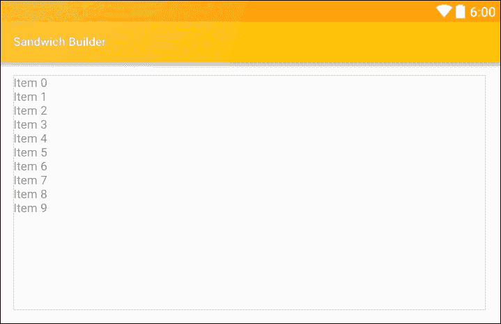
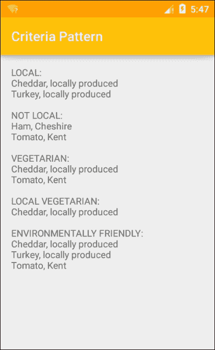

# 第五章：结构型模式

到目前为止，在这本书中，我们已经了解了用于保存和返回数据的模式，以及将对象组合成更大的对象的模式，但我们还没有考虑如何向用户提供选择的方式。

在规划我们的三明治制作应用时，我们理想情况下希望能为客户提供多种可能的食材选择。展示这些选择的最佳方式可能是通过列表，或者对于大量数据集合，一系列的列表。Android 通过**回收视图（RecyclerView）**很好地管理这些过程，它是一个列表容器和管理器，取代了之前的 ListView。这并不是说我们不应该使用普通的旧列表视图，在只需要短列表、简单文本列表几个项目的情况下，使用回收视图可能被认为是大材小用，列表视图通常是更好的选择。话虽如此，回收视图在管理数据方面要优越得多，特别是当它包含在协调器布局中时，可以保持内存占用小、滚动平滑，并允许用户拖放或滑动删除列表项。

为了了解如何完成所有这些工作，我们将构建一个界面，该界面将由用户从中选择的一系列食材列表组成。这将需要回收视图来持有列表，进而将介绍我们适配器模式。

在本章中，你将学习如何：

+   应用回收视图（RecyclerView）

+   应用协调器布局（CoordinatorLayout）

+   生成列表

+   翻译字符串资源

+   应用视图持有者（ViewHolder）

+   使用回收视图适配器（RecyclerView adapter）

+   创建适配器设计模式

+   构建桥接设计模式

+   应用外观模式（facade patterns）

+   使用模式来过滤数据

# 生成列表

回收视图是相对较新的添加项，取代了旧版本中的 ListView。它执行相同的功能，但数据管理效率要高得多，特别是对于非常长的列表。回收视图是 v7 支持库的一部分，需要在`build.gradle`文件中编译，以及这里显示的其他内容：

```kt
compile 'com.android.support:appcompat-v7:24.1.1'compile 'com.android.support:design:24.1.1'compile 'com.android.support:cardview-v7:24.1.1'compile 'com.android.support:recyclerview-v7:24.1.1'
```

协调器布局将形成主活动的根布局，看起来会像这样：

```kt
<android.support.design.widget.CoordinatorLayoutandroid:id="@+id/content"android:layout_width="match_parent"android:layout_height="match_parent"></android.support.design.widget.CoordinatorLayout>
```

然后，回收视图可以被放置在布局内：

```kt
<android.support.v7.widget.RecyclerView 
    android:id="@+id/main_recycler_view" 
    android:layout_width="match_parent" 
    android:layout_height="match_parent" 
    /> 

```



回收视图为我们提供了一个虚拟列表，但我们将从卡片视图中创建我们的列表。

# 列表项布局

使用卡片视图显示列表中的单个项目非常诱人，你可以找到许多这样的例子。然而，这种做法并不被谷歌推荐，并且有充分的理由。卡片设计用于显示大小不一的内容，而圆角和阴影只会让屏幕显得杂乱。当列表项大小相同并符合相同的布局时，它们应该显示为简单的矩形布局，有时用简单的分隔线隔开。

在本书的后面，我们将创建复杂的、可交互的列表项，所以现在我们只将图像和字符串作为我们的项目视图。

创建一个以水平线性布局为根的布局文件，并将这两个视图放在其中：

```kt
<ImageView 
    android:id="@+id/item_image" 
    android:layout_width="@dimen/item_image_size" 
    android:layout_height="@dimen/item_image_size" 
    android:layout_gravity="center_vertical|end" 
    android:layout_margin="@dimen/item_image_margin" 
    android:scaleType="fitXY" 
    android:src="img/placeholder" /> 

<TextView 
    android:id="@+id/item_name" 
    android:layout_width="0dp" 
    android:layout_height="wrap_content" 
    android:layout_gravity="center_vertical" 
    android:layout_weight="1" 
    android:paddingBottom="24dp" 
    android:paddingStart="@dimen/item_name_paddingStart" 
    tools:text="placeholder" 
    android:textSize="@dimen/item_name_textSize" /> 

```

我们在这里使用了`tools`命名空间，稍后应该移除它，这样我们就可以在不编译整个项目的情况下看到布局的外观：


### 提示

你可能已经注意到，在旧设备上测试时，CardViews 的一些边距和填充看起来不同。与其创建替代布局资源，通常使用`card_view:cardUseCompatPadding="true"`属性可以解决此问题。

我们在这里应用的文本大小和边距不是任意的，而是由材料设计指南指定的。

## 材料字体大小

在材料设计中，文本大小非常重要，且在特定上下文中只允许使用特定大小的文本。在当前示例中，我们为名称选择了 24sp，为描述选择了 16sp。一般来说，我们在材料设计应用程序中显示的几乎所有文本都将是 12、14、16、20、24 或 34sp 的大小。在选择使用哪种大小以及何时使用时，有一定的灵活性，但以下列表应提供良好的指导：


# 连接数据

Android 配备了**SQLite**库，这是一个创建和管理复杂数据库的强大工具。关于这个主题，可以轻松地填满整整一个章节甚至整本书。这里我们没有处理大量数据集，创建我们自己的数据类会更简单，希望也更清晰。

### 注意

如果你想了解更多关于 SQLite 的信息，可以在以下链接找到全面的文档：[`developer.android.com/reference/android/database/sqlite/SQLiteDatabase.html`](http://developer.android.com/reference/android/database/sqlite/SQLiteDatabase.html)

稍后我们将创建复杂的数据结构，但现在我们只需要了解设置是如何工作的，因此我们只创建三个条目。要添加这些，请创建一个名为`Filling`的新 Java 类，如下完成：

```kt
public class Filling { 
    private int image; 
    private int name; 

    public Filling(int image, int name) { 
        this.image = image; 
        this.name = name; 
    } 
} 

```

这可以在主活动中这样定义：

```kt
static final Filling fillings[] = new Filling[3]; 
fillings[0] = new Filling(R.drawable.cheese, R.string.cheese); 
fillings[1] = new Filling(R.drawable.ham, R.string.ham); 
fillings[2] = new Filling(R.drawable.tomato, R.string.tomato); 

```

如你所见，我们在`strings.xml`文件中定义了我们的字符串资源：

```kt
<string name="cheese">Cheese</string> 
<string name="ham">Ham</string> 
<string name="tomato">Tomato</string> 

```

这有两个很大的优势。首先，它允许我们保持视图和模型分离；其次，如果我们有朝一日将应用程序翻译成其他语言，现在只需要一个替代的`strings`文件。实际上，Android Studio 使这个过程变得如此简单，值得花时间了解如何完成。

# 翻译字符串资源

Android Studio 提供了一个**翻译编辑器**，以简化提供替代资源的过程。正如我们为不同的屏幕尺寸创建指定文件夹一样，我们也为不同的语言创建替代的值目录。编辑器为我们管理这些操作，我们实际上并不需要了解太多，但知道这一点很有用：如果我们希望将应用翻译成意大利语，例如，编辑器将创建一个名为`values-it`的文件夹，并将替代的`strings.xml`文件放在其中。


要访问翻译编辑器，只需在项目资源管理器中右键点击现有的`strings.xml`文件，并选择它。

尽管 RecyclerView 是一个在高效管理绑定数据方面非常出色的工具，但它确实需要相当多的设置。除了视图和数据之外，还需要两个其他元素来将数据绑定到我们的活动上，即**布局管理器**和**数据适配器**。

## 适配器和布局管理器

RecyclerView 通过使用`RecyclerView.LayoutManager`和`RecyclerView.Adapter`来管理其数据。可以将 LayoutManager 视为属于 RecyclerView 的一部分，它是与适配器通信的，而适配器则以以下图表所示的方式绑定到我们的数据：


创建布局管理器非常简单。只需按照以下两个步骤操作。

1.  打开`MainActivity.Java`文件，并包含以下字段：

    ```kt
    RecyclerView recyclerView; 
    DataAdapter adapter;; 

    ```

1.  然后，将以下行添加到`onCreate()`方法中：

    ```kt
    final ArrayList<Filling> fillings = initializeData(); 
    adapter = new DataAdapter(fillings); 

    recyclerView = (RecyclerView) findViewById(R.id.recycler_view); 
    recyclerView.setHasFixedSize(true); 
    recyclerView.setLayoutManager(new LinearLayoutManager(this)); 
    recyclerView.setAdapter(adapter); 

    ```

这段代码很容易理解，但`RecyclerView.setHasFixedSize(true)`命令的目的可能需要一些解释。如果我们提前知道列表总是相同长度，那么这个调用将使列表的管理更加高效。

要创建适配器，请按照以下步骤操作：

1.  创建一个新的 Java 类，名为`DataAdapter`，并让它继承`RecyclerView.Adapter<RecyclerViewAdapter.ViewHolder>`。

1.  这将生成一个错误，点击红色的快速修复图标并实施建议的方法。

1.  这三个方法应按照这里所示填写：

    ```kt
    // Inflate recycler view 
    @Override 
    public DataAdapter.ViewHolder onCreateViewHolder(ViewGroup parent, int viewType) { 
        Context context = parent.getContext(); 
        LayoutInflater inflater = LayoutInflater.from(context); 

        View v = inflater.inflate(R.layout.item, parent, false); 
        return new ViewHolder(v); 
        } 

    // Display data 
    @Override 
    public void onBindViewHolder(DataAdapter.ViewHolder holder, int position) { 
        Filling filling = fillings.get(position); 

        ImageView imageView = holder.imageView; 
        imageView.setImageResource(filling.getImage()); 

        TextView textView = holder.nameView; 
        textView.setText(filling.getName()); 
    } 

    @Override 
    @Overridepublic int getItemCount() {    return fillings.size();}
    ```

1.  最后，是 ViewHolder：

    ```kt
    public class ViewHolder extends RecyclerView.ViewHolder { 
        ImageView imageView; 
        TextView nameView; 

        public ViewHolder(View itemView) { 
            super(itemView); 
            imageView = (ImageView) itemView.findViewById(R.id.item_image); 
            nameView = (TextView) itemView.findViewById(R.id.item_name); 
        } 
    } 

    ```

**ViewHolder**通过只调用一次`findViewById()`来加速长列表，这是一个资源密集型的过程。

该示例现在可以在模拟器或手机上运行，并且将产生类似于这里看到的输出：


显然，我们想要的填充物远不止三个，但从这个例子中可以很容易看出，我们可以根据需要添加更多。

我们在这里已经详细介绍了如何使用 RecyclerView，足以让我们在各种情况下实现一个。这里我们使用了一个 LinearLayoutManager 来创建我们的列表，但还有**GridLayoutManager**和**StaggeredGridLayoutManager**以非常类似的方式工作。

# 适配器模式

在我们一直研究的这个例子中，我们使用了适配器模式将我们的数据以`DataAdapter`的形式与布局连接起来。这是一个现成的适配器，尽管它的工作原理很清晰，但它并没有告诉我们关于适配器结构或如何自己构建适配器的内容。

在很多情况下，Android 提供了内置的模式，这非常有用，但经常会有我们需要为自己创建的类适配器的时候，现在我们将看到如何做到这一点，以及如何创建相关的设计模式——桥接（bridge）。最好是从概念上了解这些模式开始。

适配器的作用可能是最容易理解的。一个好的类比就是当我们把电子设备带到其他国家时使用的物理适配器，那些国家的电源插座工作在不同的电压和频率上。适配器有两面，一面接受我们的插头，另一面适合插座。一些适配器甚至足够智能，可以接受多种配置，这正是软件适配器的工作原理。


在很多情况下，我们遇到的接口并不能像插头与插座那样完美匹配，适配器（adapter）就是最广泛采用的设计模式之一。我们之前看到，Android API 本身就使用了这种模式。

解决不兼容接口问题的一种方法是改变接口本身，但这可能导致代码非常混乱，并且类之间的联系像意大利面条一样复杂。适配器解决了这个问题，同时也允许我们在不真正破坏整体结构的情况下对软件进行大规模更改。

假设我们的三明治应用已经推出并且运行良好，但是后来我们送达的办公室改变了他们的楼层计划，从独立小办公室变成了开放式办公结构。之前我们使用建筑、楼层、办公室和办公桌字段来定位客户，但现在办公室字段不再有意义，我们必须相应地重新设计。

如果我们的应用程序稍微复杂一些，无疑会有许多地方引用和使用位置类，重写它们可能会非常耗时。幸运的是，适配器模式意味着我们可以非常轻松地适应这种变化。

这是原始的位置接口：

```kt
public interface OldLocation { 

    String getBuilding(); 
    void setBuilding(String building); 

    int getFloor(); 
    void setFloor(int floor); 

    String getOffice(); 
    void setOffice(String office); 

    int getDesk(); 
    void setDesk(int desk); 
} 

```

这是它的实现方式：

```kt
public class CustomerLocation implements OldLocation { 
    String building; 
    int floor; 
    String office; 
    int desk; 

    @Override 
    public String getBuilding() { return building; } 

    @Override 
    public void setBuilding(String building) { 
        this.building = building; 
    } 

    @Override 
    public int getFloor() { return floor; } 

    @Override 
    public void setFloor(int floor) { 
        this.floor = floor; 
    } 

    @Override 
    public String getOffice() { return office; } 

    @Override 
    public void setOffice(String office) { 
        this.office = office; 
    } 

    @Override 
    public int getDesk() { return desk; } 

    @Override 
    public void setDesk(int desk) { 
        this.desk = desk; 
    } 
} 

```

假设这些类已经存在，并且是我们希望适配的类，那么只需要一个适配器类和一些测试代码就可以将整个应用程序从旧系统转换到新系统：

1.  适配器类：

    ```kt
    public class Adapter implements NewLocation { 
        final OldLocation oldLocation; 

        String building; 
        int floor; 
        int desk; 

        // Wrap in old interface 
        public Adapter(OldLocation oldLocation) { 
            this.oldLocation = oldLocation; 
            setBuilding(this.oldLocation.getBuilding()); 
            setFloor(this.oldLocation.getFloor()); 
            setDesk(this.oldLocation.getDesk()); 
        } 

        @Override 
        public String getBuilding() { return building; } 

        @Override 
        public void setBuilding(String building) { 
            this.building = building; 
        } 

        @Override 
        public int getFloor() { return floor; } 

        @Override 
        public void setFloor(int floor) { 
            this.floor = floor; 
        } 

        @Override 
        public int getDesk() { return desk; } 

        @Override 
        public void setDesk(int desk) { 
            this.desk = desk; 
        } 
    } 

    ```

1.  测试代码：

    ```kt
    TextView textView = (TextView)findViewById(R.id.text_view); 

    OldLocation oldLocation = new CustomerLocation(); 
    oldLocation.setBuilding("Town Hall"); 
    oldLocation.setFloor(3); 
    oldLocation.setDesk(14); 

    NewLocation newLocation = new Adapter(oldLocation); 

    textView.setText(new StringBuilder() 
            .append(newLocation.getBuilding()) 
            .append(", floor ") 
            .append(newLocation.getFloor()) 
            .append(", desk ") 
            .append(newLocation.getDesk()) 
            .toString()); 

    ```

    尽管适配器模式非常有用，但它的结构非常简单，正如这里所示的图表：

    

适配器模式的关键在于适配器类实现新接口并包装旧接口的方式。

很容易看出这种模式如何应用于其他许多情况，在这些情况下，我们需要将一种接口转换为另一种接口。适配器是最有用和最常应用的结构型模式之一。在某种意义上，它与我们将遇到的下一个模式——桥接模式相似，因为它们都有一个用于转换接口的类。然而，正如我们接下来将看到的，桥接模式具有完全不同的功能。

# 桥接模式

适配器和桥接的主要区别在于，适配器是为了解决设计中出现的不兼容问题而构建的，而桥接是在之前构建的，其目的是将接口与其实现分离，这样我们就可以在不更改客户端代码的情况下修改甚至替换实现。

在以下示例中，我们将假设我们的三明治制作应用程序的用户可以选择开放或封闭的三明治。除了这一因素外，这些三明治在可以包含任意填充组合方面是相同的，尽管为了简化问题，只会有最多两个配料。这将演示如何将抽象类与其实现解耦，以便可以独立修改它们。

以下步骤解释了如何构建一个简单的桥接模式：

1.  首先，创建一个像这样的接口：

    ```kt
    public interface SandwichInterface { 

        void makeSandwich(String filling1, String filling2); 
    } 

    ```

1.  接下来，像这样创建一个抽象类：

    ```kt
    public abstract class AbstractSandwich { 
        protected SandwichInterface sandwichInterface; 

        protected AbstractSandwich(SandwichInterface sandwichInterface) { 
            this.sandwichInterface = sandwichInterface; 
        } 

        public abstract void make(); 
    } 

    ```

1.  现在像这样扩展这个类：

    ```kt
    public class Sandwich extends AbstractSandwich { 
        private String filling1, filling2; 

        public Sandwich(String filling1, String filling2, SandwichInterface sandwichInterface) { 
            super(sandwichInterface); 
            this.filling1 = filling1; 
            this.filling2 = filling2; 
        } 

        @Override 
        public void make() { 
            sandwichInterface.makeSandwich(filling1, filling2); 
        } 
    } 

    ```

1.  然后创建两个具体类来表示我们选择的三明治：

    ```kt
    public class Open implements SandwichInterface { 
        private static final String DEBUG_TAG = "tag"; 

        @Override 
        public void makeSandwich(String filling1, String filling2) { 
            Log.d(DEBUG_TAG, "Open sandwich " + filling1 + filling2); 
        } 
    } 

    public class Closed implements SandwichInterface { 
        private static final String DEBUG_TAG = "tag"; 

        @Override 
        public void makeSandwich(String filling1, String filling2) { 
            Log.d(DEBUG_TAG, "Closed sandwich " + filling1 + filling2); 
        } 
    } 

    ```

1.  现在，可以通过向客户端代码中添加以下几行来测试此模式：

    ```kt
    AbstractSandwich openSandwich = new Sandwich("Cheese ", "Tomato", new Open()); 
    openSandwich.make(); 

    AbstractSandwich closedSandwich = new Sandwich("Ham ", "Eggs", new Closed()); 
    closedSandwich.make();  

    ```

1.  然后调试屏幕上的输出将与以下内容相匹配：

    ```kt
    D/tag: Open sandwich Cheese Tomato 
    D/tag: Closed sandwich Ham Eggs 

    ```

这展示了该模式如何允许我们使用相同的抽象类方法以不同的方式制作三明治，但使用不同的桥接实现类。

适配器和桥接模式都通过创建清晰的结构来工作，我们可以使用这些结构来统一或分离类和接口，以解决出现的结构不兼容问题，或者在规划期间预测这些问题。从图解上观察，两者的区别变得更加明显：


大多数结构型模式（以及一般的设计模式）依赖于创建这些额外的层次来澄清代码。简化复杂结构无疑是设计模式最大的优点，而门面模式帮助我们简化代码的能力很少有模式能比肩。

# 门面模式

门面模式或许是最简单的结构型模式之一，易于理解和创建。顾名思义，它就像一个位于复杂系统前面的面孔。在编写客户端代码时，如果我们有一个门面来代表它，我们永远不必关心系统其余部分的复杂逻辑。我们只需要处理门面本身，这意味着我们可以设计门面以最大化简化。

将外观模式想象成在典型自动售货机上可能找到的简单键盘。自动售货机是非常复杂的系统，结合了各种机械和物理组件。然而，要操作它，我们只需要知道如何在它的键盘上输入一两个数字。键盘就是外观，它隐藏了所有背后的复杂性。我们可以通过考虑以下步骤中概述的假想自动售货机来演示这一点：

1.  从创建以下接口开始：

    ```kt
    public interface Product { 

        int dispense(); 
    } 

    ```

1.  接下来，像这样添加三个具体实现：

    ```kt
    public class Crisps implements Product { 

        @Override 
        public int dispense() { 
            return R.drawable.crisps; 
        } 
    } 

    public class Drink implements Product { 
       ... 
            return R.drawable.drink; 
       ... 
    } 

    public class Fruit implements Product { 
        ... 
            return R.drawable.fruit; 
        ... 
    } 

    ```

1.  现在添加外观类：

    ```kt
    public class Facade { 
        private Product crisps; 
        private Product fruit; 
        private Product drink; 

        public Facade() { 
            crisps = new Crisps(); 
            fruit = new Fruit(); 
            drink = new Drink(); 
        } 

        public int dispenseCrisps() { 
            return crisps.dispense(); 
        } 

        public int dispenseFruit() { 
            return fruit.dispense(); 
        } 

        public int dispenseDrink() { 
            return drink.dispense(); 
        } 
    } 

    ```

1.  在适当的可绘制目录中放置合适的图像。

1.  创建一个简单的布局文件，其中包含类似于这样的图像视图：

    ```kt
    <ImageView 
        android:id="@+id/image_view" 
        android:layout_width="match_parent" 
        android:layout_height="match_parent" /> 

    ```

1.  向活动类中添加一个`ImageView`：

    ```kt
    ImageView imageView = (ImageView) findViewById(R.id.image_view); 

    ```

1.  创建一个外观：

    ```kt
    Facade facade = new Facade(); 

    ```

1.  然后通过类似于此处的调用测试输出：

    ```kt
    imageView.setImageResource(facade.dispenseCrisps()); 

    ```

    这构成了我们的外观模式。它非常简单，容易可视化：

    

当然，此示例中的外观模式可能看起来毫无意义。`dispense()`方法所做的不过是显示一个图像，并不需要简化。然而，在一个更现实的模拟中，分发过程将涉及各种调用和检查，需要计算找零，检查库存可用性，以及设置多个伺服电机的动作。外观模式的优点是，如果我们要实施所有这些程序，我们不需要更改客户端代码或外观类中的任何一行。对`dispenseDrink()`的单个调用将产生正确的结果，不管背后的逻辑有多复杂。

尽管外观模式非常简单，但在许多情况下它都非常有用，比如我们想要为复杂的系统提供一个简单且有序的接口。不那么简单但同样有用的是标准（或过滤）模式，它允许我们查询复杂的数据结构。

# 标准模式

标准设计模式为根据设定标准过滤对象提供了一种清晰且简洁的技术。它可能是一个非常强大的工具，接下来的练习将证明这一点。

在此示例中，我们将应用一个过滤模式来筛选一系列食材，并根据它们是否为素食以及产地来过滤它们：

1.  从创建如下所示的过滤器接口开始：

    ```kt
    public interface Filter { 

        List<Ingredient> meetCriteria(List<Ingredient> ingredients); 
    } 

    ```

1.  接着添加如下所示的配料类：

    ```kt
    public class Ingredient { 

        String name; 
        String local; 
        boolean vegetarian; 

        public Ingredient(String name, String local, boolean vegetarian){ 
            this.name = name; 
            this.local = local; 
            this.vegetarian = vegetarian; 
        } 

        public String getName() { 
            return name; 
        } 

        public String getLocal() { 
            return local; 
        } 

        public boolean isVegetarian(){ 
            return vegetarian; 
        } 
    } 

    ```

1.  现在实现满足素食标准的过滤器：

    ```kt
    public class VegetarianFilter implements Filter { 

        @Override 
        public List<Ingredient> meetCriteria(List<Ingredient> ingredients) { 
            List<Ingredient> vegetarian = new ArrayList<Ingredient>(); 

            for (Ingredient ingredient : ingredients) { 
                if (ingredient.isVegetarian()) { 
                    vegetarian.add(ingredient); 
                } 
            } 
            return vegetarian; 
        } 
    } 

    ```

1.  然后添加一个测试本地产品的过滤器：

    ```kt
    public class LocalFilter implements Filter { 

        @Override 
        public List<Ingredient> meetCriteria(List<Ingredient> ingredients) { 
            List<Ingredient> local = new ArrayList<Ingredient>(); 

            for (Ingredient ingredient : ingredients) { 
                if (Objects.equals(ingredient.getLocal(), "Locally produced")) { 
                    local.add(ingredient); 
                } 
            } 
            return local; 
        } 
    } 

    ```

1.  再为非本地食材添加一个：

    ```kt
    public class NonLocalFilter implements Filter { 

        @Override 
        public List<Ingredient> meetCriteria(List<Ingredient> ingredients) { 
            List<Ingredient> nonLocal = new ArrayList<Ingredient>(); 

            for (Ingredient ingredient : ingredients) { 
                if (ingredient.getLocal() != "Locally produced") { 
                    nonLocal.add(ingredient); 
                } 
            } 
            return nonLocal; 
        } 
    } 

    ```

1.  现在我们需要包含一个`AND`标准过滤器：

    ```kt
    public class AndCriteria implements Filter { 
        Filter criteria; 
        Filter otherCriteria; 

        public AndCriteria(Filter criteria, Filter otherCriteria) { 
            this.criteria = criteria; 
            this.otherCriteria = otherCriteria; 
        } 

        @Override 
        public List<Ingredient> meetCriteria(List<Ingredient> ingredients) { 
            List<Ingredient> firstCriteria = criteria.meetCriteria(ingredients); 
            return otherCriteria.meetCriteria(firstCriteria); 
        } 
    } 

    ```

1.  接着是一个`OR`标准：

    ```kt
    public class OrCriteria implements Filter { 
        Filter criteria; 
        Filter otherCriteria; 

        public OrCriteria(Filter criteria, Filter otherCriteria) { 
            this.criteria = criteria; 
            this.otherCriteria = otherCriteria; 
        } 

        @Override 
        public List<Ingredient> meetCriteria(List<Ingredient> ingredients) { 
            List<Ingredient> firstCriteria = criteria.meetCriteria(ingredients); 
            List<Ingredient> nextCriteria = otherCriteria.meetCriteria(ingredients); 

            for (Ingredient ingredient : nextCriteria) { 
                if (!firstCriteria.contains(ingredient)) { 
                    firstCriteria.add(ingredient); 
                } 
            } 
            return firstCriteria; 
        } 
    } 

    ```

1.  现在，添加如下所示的小型数据集：

    ```kt
    List<Ingredient> ingredients = new ArrayList<Ingredient>(); 

    ingredients.add(new Ingredient("Cheddar", "Locally produced", true)); 
    ingredients.add(new Ingredient("Ham", "Cheshire", false)); 
    ingredients.add(new Ingredient("Tomato", "Kent", true)); 
    ingredients.add(new Ingredient("Turkey", "Locally produced", false)); 

    ```

1.  在主活动中，创建以下过滤器：

    ```kt
    Filter local = new LocalFilter(); 
    Filter nonLocal = new NonLocalFilter(); 
    Filter vegetarian = new VegetarianFilter(); 
    Filter localAndVegetarian = new AndCriteria(local, vegetarian); 
    Filter localOrVegetarian = new OrCriteria(local, vegetarian); 

    ```

1.  创建一个带有基本文本视图的简单布局。

1.  向主活动添加以下方法：

    ```kt
    public void printIngredients(List<Ingredient> ingredients, String header) { 

        textView.append(header); 

        for (Ingredient ingredient : ingredients) { 
            textView.append(new StringBuilder() 
                    .append(ingredient.getName()) 
                    .append(" ") 
                    .append(ingredient.getLocal()) 
                    .append("\n") 
                    .toString()); 
        } 
    } 

    ```

1.  现在可以使用类似于此处的调用测试该模式：

    ```kt
    printIngredients(local.meetCriteria(ingredients), 
    "LOCAL:\n"); 
    printIngredients(nonLocal.meetCriteria(ingredients), 
    "\nNOT LOCAL:\n"); 
    printIngredients(vegetarian.meetCriteria(ingredients), 
    "\nVEGETARIAN:\n"); 
    printIngredients(localAndVegetarian.meetCriteria(ingredients), 
    "\nLOCAL VEGETARIAN:\n"); 
    printIngredients(localOrVegetarian.meetCriteria(ingredients), 
    "\nENVIRONMENTALLY FRIENDLY:\n"); 

    ```

在设备上测试该模式应产生此输出：



我们在这里只应用了一些简单的标准，但我们同样可以轻松地包含有关过敏、卡路里、价格以及我们选择的任何其他信息，以及相应的过滤器。正是这种能够从多个标准创建单一标准的能力，使得这个模式如此有用和多变。它可以像这样视觉化地呈现：


过滤器模式，像许多其他模式一样，并没有做任何我们之前没有做过的事情。相反，它展示了执行熟悉和常见任务（如根据特定标准过滤数据）的另一种方式。只要我们为正确的任务选择正确的模式，这些经过验证的结构模式几乎必然会使最佳实践成为可能。

# 总结

在本章中，我们介绍了一些最常应用和最有用的结构模式。我们从框架如何将模型与视图分离开始，然后学习了如何使用 RecyclerView 及其适配器管理数据结构，以及这与适配器设计模式的相似之处。建立这种联系后，我们接着创建了一个示例，说明如何使用适配器来解决对象之间不可避免的兼容性问题，而我们随后构建的桥接模式则是在设计之初就预定好的。

这一章以非常实用的内容开始，最后通过深入探讨另外两个重要的结构模式作结：门面模式，用于简化结构的明显功能；以及标准模式，它处理数据集，返回经过筛选的对象集，像我们可能只应用一个标准那样简单地应用多个标准。

在下一章中，我们将探讨用户界面以及如何应用设计库来实现滑动和取消行为。我们还将重新审视工厂模式，并将其应用于我们的布局，使用自定义对话框来显示其输出。
