# 第六章：激活模式

之前的章节作为扩展介绍，探讨了 Android 开发的实用性以及设计模式应用的理论。我们已经涵盖了 Android 应用许多基本组件，并了解了最有用的模式是如何构建的，但我们还没有将这两者结合起来。

在本章中，我们将构建应用的一个主要部分：成分选择菜单。这将涉及一个可滚动的填充物列表，可以选中、展开和关闭。在途中，我们还将看看可折叠工具栏以及其他一两个有用的支持库功能，为操作按钮、浮动操作按钮和警告对话框添加功能。

在这段代码的核心，我们将应用一个简单的工厂模式来创建每个成分。这将很好地展示这种模式如何将创建逻辑从客户类中隐藏起来。在本章中，我们将只创建一个填充类型的示例，以了解其实现方式，但相同的结构和过程稍后会在添加更多复杂性时使用。这将引导我们探索回收视图格式和装饰，如网格布局和分隔线。

然后，我们将继续生成并自定义一个警告对话框，通过点击按钮来实现。这将需要使用内置的构建器模式，并引导我们了解如何为膨胀布局创建自己的构建器模式。

在本章中，你将学习如何：

+   创建应用栏布局

+   应用可折叠工具栏

+   控制滚动行为

+   包含嵌套滚动视图

+   应用数据工厂

+   创建列表项视图

+   将文本视图转换为按钮

+   应用网格布局

+   添加分隔线装饰

+   配置操作图标

+   创建警告对话框

+   自定义对话框

+   添加第二个活动

+   应用滑动和关闭行为

+   创建布局构建器模式

+   在运行时创建布局

我们的应用用户需要某种方式来选择成分。我们当然可以向他们展示一个长长的列表，但这会既麻烦又不吸引人。显然，我们需要将成分分类。在以下示例中，我们将专注于这些组中的一个，这将有助于简化稍后考虑更复杂场景时的底层过程。我们将从创建必要的布局开始，首先从可折叠工具栏布局开始。

# 可折叠工具栏

工具栏能够方便地滑出是材料设计 UI 的一个常见特性，并为手机甚至笔记本电脑上有限的空间提供了优雅和聪明的利用方式。

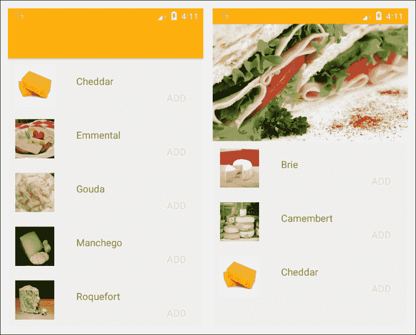

如你所想，**CollapsingToolbarLayout**是设计支持库的一部分。它是**AppBarLayout**的子视图，后者是一个线性布局，专门为材料设计特性而设计。

折叠工具栏优雅地管理空间，也提供了一个展示吸引人图形和推广我们产品的好机会。它们实现起来不需要太多时间，而且很容易适应。

看它们如何工作的最佳方式是构建一个，以下步骤将展示如何进行：

1.  开始一个新项目，并包含回收视图和设计支持库。

1.  通过更改主题来移除操作栏：

    ```kt
    Theme.AppCompat.Light.NoActionBar 

    ```

1.  打开 `activity_main.xml` 文件，并应用以下根布局：

    ```kt
    <android.support.design.widget.CoordinatorLayout  

        android:layout_width="match_parent" 
        android:layout_height="match_parent"> 

    </android.support.design.widget.CoordinatorLayout> 

    ```

1.  在此内部，添加这个 `AppBarLayout`：

    ```kt
    <android.support.design.widget.AppBarLayout 
        android:id="@+id/app_bar" 
        android:layout_width="match_parent" 
        android:layout_height="wrap_content" 
        android:fitsSystemWindows="true"> 

    </android.support.design.widget.AppBarLayout> 

    ```

1.  将此 `CollapsingToolbarLayout` 放在应用栏内：

    ```kt
    <android.support.design.widget.CollapsingToolbarLayout 
        android:id="@+id/collapsing_toolbar" 
        android:layout_width="match_parent" 
        android:layout_height="wrap_content" 
        android:fitsSystemWindows="true" 
        app:contentScrim="?attr/colorPrimary" 
        app:layout_scrollFlags="scroll|exitUntilCollapsed|enterAlwaysCollapsed"> 

    </android.support.design.widget.CollapsingToolbarLayout> 

    ```

1.  折叠工具栏的内容是以下两个视图：

    ```kt
    <ImageView 
        android:id="@+id/toolbar_image" 
        android:layout_width="match_parent" 
        android:layout_height="match_parent" 
        android:fitsSystemWindows="true" 
        android:scaleType="centerCrop" 
        android:src="img/some_drawable" 
        app:layout_collapseMode="parallax" /> 

    <android.support.v7.widget.Toolbar 
        android:id="@+id/toolbar" 
        android:layout_width="match_parent" 
        android:layout_height="?attr/actionBarSize" 
        app:layout_collapseMode="pin" /> 

    ```

1.  现在，在 app-bar 布局下方，添加这个回收视图：

    ```kt
    <android.support.v7.widget.RecyclerView 
        android:id="@+id/recycler_view" 
        android:layout_width="match_parent" 
        android:layout_height="match_parent" 
        android:scrollbars="vertical" 
        app:layout_behavior="@string/appbar_scrolling_view_behavior" /> 

    ```

1.  最后，添加这个浮动操作按钮：

    ```kt
    <android.support.design.widget.FloatingActionButton 
        android:id="@+id/fab" 
        android:layout_width="wrap_content" 
        android:layout_height="wrap_content" 
        android:layout_marginEnd="@dimen/fab_margin_end" 
        app:layout_anchor="@id/app_bar" 
        app:layout_anchorGravity="bottom|end" /> 

    ```

    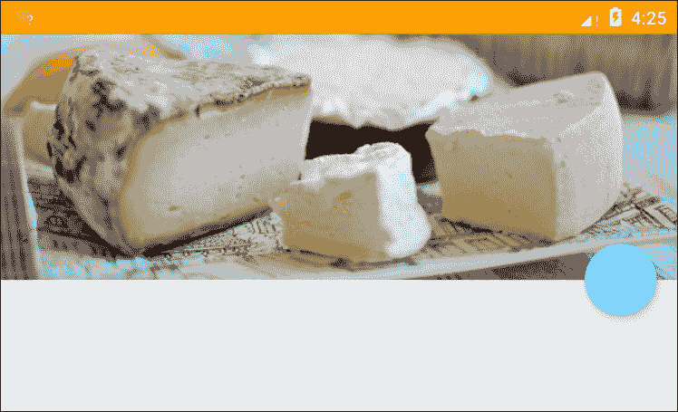

    ### 提示

    有时我们希望将状态栏设置为半透明，以便我们的应用栏图片能够显示在状态栏后面。这通过在 styles.xml 文件中添加以下两项来实现：

    ```kt
    <item name="android:windowDrawsSystemBarBackgrounds">true</item> 
    <item name="android:statusBarColor">@android:color/transparent</item> 

    ```

在前面的章节中我们已经遇到了协调布局，并看到了它如何实现许多材料设计功能。`AppBarLayout` 做类似的事情，通常用作折叠工具栏的容器。

另一方面，**CollapsingToolbarLayout** 需要解释一两个要点。首先，使用 `android:layout_height="wrap_content"` 将根据其 ImageView 包含的图片高度产生不同的效果。这样做的目的是，当我们为不同的屏幕尺寸和密度设计替代布局时，我们可以相应地缩放此图像。这里配置的是小（480 x 854dp）240dpi 设备，高度为 192dp。当然，我们也可以在 dp 中设置布局高度，并在不同的 `dimens.xml` 文件中缩放此值。然而，我们仍然需要缩放图像，所以这个方法是一石二鸟。

关于折叠工具栏布局的另一个有趣点是我们可以控制它的滚动方式，正如你所想象的，这是通过 **layout_scrollFlags** 属性处理的。这里我们使用了 `scroll`、`exitUntilCollapsed`、`enterAlwaysCollapsed`。这意味着工具栏永远不会从屏幕顶部消失，且当列表无法再向下滚动时，工具栏不会展开。

有五种滚动标志，它们是：

+   `scroll` - 启用滚动

+   `exitUntilCollapsed` - 当向上滚动时防止工具栏消失（省略此项，直到向下滚动时工具栏才会消失）

+   `enterAlways` - 列表向下滚动时工具栏展开

+   `enterAlwaysCollapsed` - 工具栏仅从列表顶部展开

+   `snap` - 工具栏直接定位而不是滑动

折叠工具栏内的图像视图几乎与我们可能见过的任何其他图像视图相同，除了可能有的 `layout_collapseMode` 属性。这个属性有两个可能的设置，`pin` 和 `parallax`：

+   `pin` - 列表和工具栏一起移动

+   `视差` - 列表和工具栏分别移动

欣赏这些效果的最佳方式就是尝试一下。我们也可以将这些布局折叠模式之一应用于图片下方的工具栏，但由于我们希望工具栏保持屏幕显示，因此无需关心其折叠行为。

这里将包含我们数据的回收视图与本书前面使用的唯一区别在于包含以下这行：

```kt
app:layout_behavior="@string/appbar_scrolling_view_behavior" 

```

这个属性是我们需要添加到任何位于应用栏下方的视图或视图组中的，以允许它们协调滚动行为。

这些简单的类在实现材料设计时为我们节省了大量工作，并让我们专注于提供功能。除了图片的大小，要创建一个在大数量可能设备上工作的布局，几乎不需要重构。

尽管这里我们使用了回收视图，但完全有可能在应用栏下方放置任意数量的视图和视图组。只要它们具有`app:layout_behavior="@string/appbar_scrolling_view_behavior"`属性，它们就会与栏一起移动。有一个特别适合此目的的布局，那就是**NestedScrollView**。举个例子，它看起来像这样：

```kt
<android.support.v4.widget.NestedScrollView 
    android:layout_width="match_parent" 
    android:layout_height="match_parent" 
    app:layout_behavior="@string/appbar_scrolling_view_behavior"> 

    <TextView 
        android:id="@+id/nested_text" 
        android:layout_width="match_parent" 
        android:layout_height="wrap_content" 
        android:padding="@dimen/nested_text_padding" 
        android:text="@string/some_text" 
        android:textSize="@dimen/nested_text_textSize" /> 

</android.support.v4.widget.NestedScrollView> 

```

下一步逻辑上是创建一个布局来填充回收视图，但首先我们需要准备数据。在本章中，我们将开发一个应用程序组件，负责向用户展示特定类别（在本例中是奶酪）的配料列表。我们将使用**工厂模式**来创建这些对象。

# 应用数据工厂模式

在本节中，我们将应用工厂模式来创建类型为*奶酪*的对象。这将进而实现一个*填充物*接口。每个对象将由几个属性组成，如价格和热量值。其中一些值将在我们的列表项中展示，其他值则只能通过扩展视图或在代码中访问。

设计模式为数不多的缺点之一是很快就会累积大量的类。因此，在开始以下练习之前，请在`java`目录中创建一个名为`fillings`的新包。

按照以下步骤生成我们的奶酪工厂：

1.  在`fillings`包中创建一个名为`Filling`的新接口，并按照以下方式完成它：

    ```kt

    public interface Filling { 

        String getName(); 
        int getImage(); 
        int getKcal(); 
        boolean isVeg(); 
        int getPrice(); 
    } 

    ```

1.  接下来，创建一个实现`Filling`的抽象类，名为`Cheese`，如下所示：

    ```kt
    public abstract class Cheese implements Filling { 
        private String name; 
        private int image; 
        private String description; 
        private int kcal; 
        private boolean vegetarian; 
        private int price; 

        public Cheese() { 
        } 

        public abstract String getName(); 

        public abstract int getImage(); 

        public abstract int getKcal(); 

        public abstract boolean getVeg(); 

        public abstract int getPrice(); 
    } 

    ```

1.  创建一个名为`Cheddar`的具体类，如下所示：

    ```kt
    public class Cheddar extends Cheese implements Filling { 

        @Override 
        public String getName() { 
            return "Cheddar"; 
        } 

        @Override 
        public int getImage() { 
            return R.drawable.cheddar; 
        } 

        @Override 
        public int getKcal() { 
            return 130; 
        } 

        @Override 
        public boolean getVeg() { 
            return true; 
        } 

        @Override 
        public int getPrice() { 
            return 75; 
        } 
    } 

    ```

1.  按照与`Cheddar`类似的方式创建其他几个`Cheese`类。

创建了工厂之后，我们需要一种方法来表示每一种奶酪。为此，我们将创建一个条目布局。

# 定位条目布局

为了保持界面整洁，我们将为回收视图列表创建一个非常简单的条目。它将只包含一个图片、一个字符串和一个用户添加配料到三明治的操作按钮。

初始项目布局将如下所示：

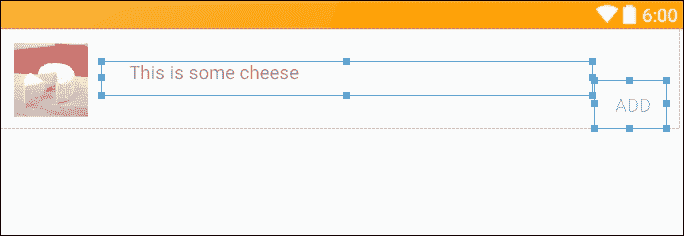

这可能看起来是一个非常简单的布局，但它比看上去要复杂得多。以下是三个视图的代码：

图片如下：

```kt
<ImageView 
    android:id="@+id/item_image" 
    android:layout_width="@dimen/item_image_size" 
    android:layout_height="@dimen/item_image_size" 
    android:layout_gravity="center_vertical|end" 
    android:layout_margin="@dimen/item_image_margin" 
    android:scaleType="fitXY" 
    android:src="img/placeholder" /> 

```

标题：

```kt
<TextView 
    android:id="@+id/item_name" 
    android:layout_width="0dp" 
    android:layout_height="wrap_content" 
    android:layout_gravity="center_vertical" 
    android:layout_weight="1" 
    android:paddingBottom="@dimen/item_name_paddingBottom" 
    android:paddingStart="@dimen/item_name_paddingStart" 
    android:text="@string/placeholder" 
    android:textSize="@dimen/item_name_textSize" /> 

```

操作按钮：

```kt
<Button 
    android:id="@+id/action_add" 
    style="?attr/borderlessButtonStyle" 
    android:layout_width="wrap_content" 
    android:layout_height="wrap_content" 
    android:layout_gravity="center_vertical|bottom" 
    android:layout_marginEnd="@dimen/action_marginEnd"" 
    android:minWidth="64dp" 
    android:padding="@dimen/action_padding" 
    android:paddingEnd="@dimen/action_paddingEnd" 
    android:paddingStart="@dimen/action_paddingStart" 
    android:text="@string/action_add_text" 
    android:textColor="@color/colorAccent" 
    android:textSize="@dimen/action_add_textSize" /> 

```

值得一看的是这里管理各种资源的方式。以下是`dimens.xml`文件：

```kt
<dimen name="item_name_paddingBottom">12dp</dimen> 
<dimen name="item_name_paddingStart">24dp</dimen> 
<dimen name="item_name_textSize">16sp</dimen> 

<dimen name="item_image_size">64dp</dimen> 
<dimen name="item_image_margin">12dp</dimen> 

<dimen name="action_padding">12dp</dimen> 
<dimen name="action_paddingStart">16dp</dimen> 
<dimen name="action_paddingEnd">16dp</dimen> 
<dimen name="action_marginEnd">12dp</dimen> 
<dimen name="action_textSize">16sp</dimen> 

<dimen name="fab_marginEnd">16dp</dimen> 

```

很明显，这些属性中有几个携带相同的值，我们可能只需要五个就能达到同样的效果。然而，这可能会导致代码混淆，尤其是在后期进行修改时，尽管这种方法有些过分，但仍然存在一定的效率。操作按钮的填充和边距设置对于整个应用程序中的所有此类按钮都将相同，从它们的名称可以清晰地读取，并且只需要声明一次。同样，此布局中的文本和图像视图在此应用程序中是唯一的，因此也相应地命名。这也使得调整单个属性更加清晰。

最后，使用`android:minWidth="64dp"`是材料规定，旨在确保所有这样的按钮宽度都能适应平均手指大小。

这完成了此活动的布局，并且我们的对象工厂也准备就绪，现在我们可以像之前一样，使用数据适配器和视图持有者填充我们的回收视图。

# 使用工厂与 RecyclerView

正如我们在本书前面简要看到的那样，RecyclerView 利用了一个内部的 LayoutManager。这进而通过适配器与数据集通信。这些适配器与我们之前在书中探讨的适配器设计模式完全相同。这个功能可能不是那么明显，但它充当数据集和回收视图的布局管理器之间的桥梁。适配器通过其 ViewHolder 跨过这座桥。适配器的工作与客户端代码整洁地分离，我们只需要几行代码就可以创建一个新的适配器和布局管理器。

考虑到这一点，我们的数据准备就绪，可以按照以下简单步骤快速组合一个适配器：

1.  首先，在主包中创建这个新类：

    ```kt
    public class DataAdapter extends RecyclerView.Adapter<DataAdapter.ViewHolder> { 

    ```

1.  它需要以下字段和构造函数：

    ```kt
    private List<Cheese> cheeses; 

    public DataAdapter(List<Cheese> cheeses) { 
        this.cheeses = cheeses; 
    } 

    ```

1.  现在，像这样将`ViewHolder`添加为一个内部类：

    ```kt
    public static class ViewHolder extends RecyclerView.ViewHolder { 
        public ImageView imageView; 
        public TextView nameView; 

        public ViewHolder(View itemView) { 
            super(itemView); 

            imageView = (ImageView) itemView.findViewById(R.id.item_image); 
            nameView = (TextView) itemView.findViewById(R.id.item_name); 
        } 
    } 

    ```

1.  有三个必须重写的方法。`onCreateViewHolder()`方法：

    ```kt
    @Override 
    public DataAdapter.ViewHolder onCreateViewHolder(ViewGroup parent, int viewType) { 
        Context context = parent.getContext(); 
        LayoutInflater inflater = LayoutInflater.from(context); 

        View cheeseView = inflater.inflate(R.layout.item_view, parent, false); 

        return new ViewHolder(cheeseView); 
    } 

    ```

1.  `onBindViewHolder()`方法：

    ```kt
    @Override 
    public void onBindViewHolder(DataAdapter.ViewHolder viewHolder, int position) { 
        Cheese cheese = cheeses.get(position); 

        ImageView imageView = viewHolder.imageView; 
        imageView.setImageResource(cheese.getImage()); 

        TextView nameView = viewHolder.nameView; 
        nameView.setText(cheese.getName()); 
    } 

    ```

1.  `getItemCount()`方法：

    ```kt
    @Override 
    public int getItemCount() { 
        return cheeses.size(); 
    } 

    ```

这样适配器就完成了，我们需要关心的就是将其连接到我们的数据和回收视图。这是在主活动的`onCreate()`方法中完成的。首先，我们需要创建一个包含所有奶酪的列表。有了我们的模式，这非常简单。以下方法可以放在任何地方，但这里放在主活动中：

```kt
private ArrayList<Cheese> buildList() { 
    ArrayList<Cheese> cheeses = new ArrayList<>(); 

    cheeses.add(new Brie()); 
    cheeses.add(new Camembert()); 
    cheeses.add(new Cheddar()); 
    cheeses.add(new Emmental()); 
    cheeses.add(new Gouda()); 
    cheeses.add(new Manchego()); 
    cheeses.add(new Roquefort()); 

    return cheeses; 
}
```

### 注意

需要注意的是，你需要从 Fillings 包中导入这些类。

我们现在可以通过适配器将这个连接到我们的回收视图，在主活动的`onCreate()`方法中添加以下几行：

```kt
RecyclerView recyclerView = (RecyclerView) findViewById(R.id.recycler_view); 

ArrayList<Cheese> cheeses = buildList(); 
DataAdapter adapter = new DataAdapter(cheeses); 

recyclerView.setLayoutManager(new LinearLayoutManager(this)); 
recyclerView.setAdapter(adapter); 

recyclerView.setHasFixedSize(true); 

```

首先值得注意的是，所需的客户端代码非常少，而且非常易懂。不仅仅是设置回收视图和适配器的代码，还包括构建列表的代码。如果没有这种模式，我们最终可能会得到这样的代码：

```kt
cheeses.add(new Cheese("Emmental", R.drawable.emmental), 120, true, 65); 

```

项目现在可以在设备上进行测试了。

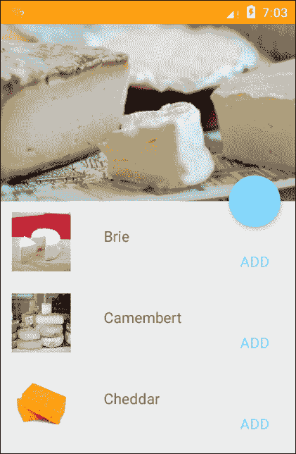

我们在这里使用的线性布局管理器不是唯一可用的。还有另外两个管理器，一个用于网格布局，另一个用于交错布局。可以这样应用：

```kt
recyclerView.setLayoutManager(new StaggeredGridLayoutManager(3, StaggeredGridLayoutManager.VERTICAL)); 

recyclerView.setLayoutManager(new GridLayoutManager(this, 2)); 

```

这只需要稍微调整布局文件，我们甚至可以提供替代布局并允许用户选择他们喜欢的布局。

从视觉角度来看，我们基本上已经准备就绪。然而，由于这样一个稀疏的项目设计，在项目之间添加分隔线可能会更好。这不像人们想象的那么简单，但这个过程简单而优雅。

# 添加分隔线

在回收视图之前，ListView 带有自己的分隔元素。而回收视图则没有。然而，这不应当被视为缺点，因为后者允许更大的灵活性。

添加一个非常窄的视图在项目布局底部以创建分隔线可能看起来很诱人，但这被认为是非常不好的做法，因为当项目移动或被移除时，分隔线也会随之移动。

回收视图使用内部类**ItemDecoration**来提供项目之间的分隔线，以及间距和突出显示。它还有一个非常有用的子类，即 ItemTouchHelper，当我们看到如何滑动和关闭卡片时会遇到它。

首先，按照以下步骤向我们的回收视图添加分隔线：

1.  创建一个新的 ItemDecoration 类：

    ```kt
    public class ItemDivider extends RecyclerView.ItemDecoration 

    ```

1.  包含这个 Drawable 字段：

    ```kt
    Private Drawable divider; 

    ```

1.  接着是这个构造函数：

    ```kt
        public ItemDivider(Context context) { 
            final TypedArray styledAttributes = context.obtainStyledAttributes(ATTRS); 
            divider = styledAttributes.getDrawable(0); 
            styledAttributes.recycle(); 
        } 

    ```

1.  然后重写`onDraw()`方法：

    ```kt
    @Override 
    public void onDraw(Canvas canvas, RecyclerView parent, RecyclerView.State state) { 
        int left = parent.getPaddingLeft(); 
        int right = parent.getWidth() - parent.getPaddingRight(); 

        int count = parent.getChildCount(); 
        for (int i = 0; i < count; i++) { 
            View child = parent.getChildAt(i); 

            RecyclerView.LayoutParams params = (RecyclerView.LayoutParams) child.getLayoutParams(); 

            int top = child.getBottom() + params.bottomMargin; 
            int bottom = top + divider.getIntrinsicHeight(); 

            divider.setBounds(left, top, right, bottom); 
            divider.draw(canvas); 
        } 
    } 

    ```

1.  现在，需要做的就是在`onCreate()`方法中实例化分隔线，在设置了`LayoutManager`之后：

    ```kt
    recyclerView.addItemDecoration(new ItemDivider(this)); 

    ```

这段代码提供了我们项目之间的系统分隔线。项目装饰还可以非常简单地创建**自定义分隔线**。

按照以下两个步骤看看是如何完成的：

1.  在`drawable`目录中创建一个名为`item_divider.xml`的 XML 文件，内容如下：

    ```kt
    <?xml version="1.0" encoding="utf-8"?> 
    <shape  
        android:shape="rectangle"> 

        <size android:height="1dp" /> 
        <solid android:color="@color/colorPrimaryDark" /> 

    </shape> 

    ```

1.  向`ItemDivider`类中添加第二个构造函数，如下所示：

    ```kt
    public ItemDivider(Context context, int resId) { 
        divider = ContextCompat.getDrawable(context, resId); 
    } 

    ```

1.  然后将活动中的分隔符初始化替换为此处：

    ```kt
    recyclerView.addItemDecoration(new ItemDivider(this, R.drawable.item_divider)); 

    ```

    当运行时，这两种技术将产生如下所示的结果：

    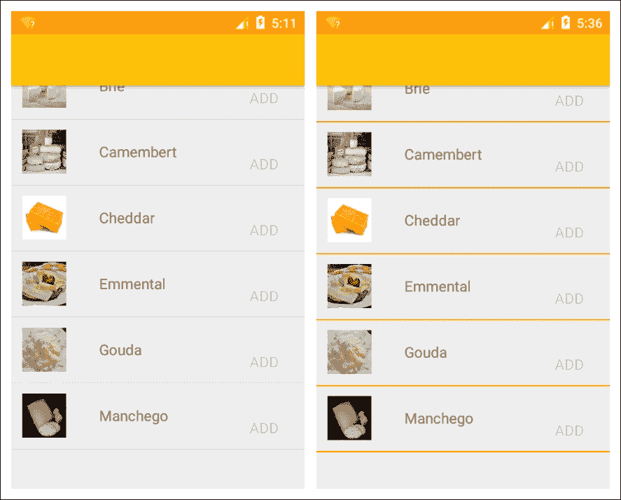

    ### 提示

    前面的方法是在视图之前绘制分隔符。如果您有一个花哨的分隔符，并希望其部分与视图重叠，那么您需要重写`onDrawOver()`方法，这将导致在视图之后绘制分隔符。

现在是时候为我们的项目添加一些功能了。我们将从考虑为我们的小悬浮操作按钮提供哪些功能开始。

# 配置悬浮操作按钮

到目前为止，我们的布局只提供了一个操作，即每个列表项上的*添加*操作按钮。这将用于包括用户最终的三明治填充。确保用户始终只需点击一次就能消费，因此我们将在活动中添加结账功能。

我们首先需要的是一个图标。图标最佳的来源可能是我们在书中早些时候使用的资产工作室。这是在项目中包含图标的好方法，主要是因为它自动为所有可用的屏幕密度生成版本。然而，图标的数量有限，没有结账篮子。在这里我们有两个选择：我们可以在网上找一个图标，或者我们可以自己设计一个。

网上有大量的符合材料设计规范的图标，谷歌也有自己的图标，可以在以下位置找到：

+   [design.google.com/icons/](http://design.google.com/icons/)

许多开发者喜欢设计自己的图形，而且总会有我们找不到所需图标的时候。谷歌还提供了图标设计的综合指南，可在以下位置找到：

+   [material.google.com/style/icons.html](http://material.google.com/style/icons.html)

无论您选择哪个选项，都可以通过按钮的`src`属性添加，如下所示：

```kt
android:src="img/ic_cart" 

```

创建了我们的图标后，现在需要考虑颜色。根据材料设计指南，操作和系统图标应与主文本或次文本颜色相同。它们不是如我们所想的两种灰色阴影，而是通过透明度级别定义的。这样做是因为在彩色背景上效果远比灰色阴影好。到目前为止，我们使用了默认的文本颜色，并没有在我们的`styles.xml`文件中包含这一点。根据材料文本颜色的规则，这样做是很容易的，规则如下：

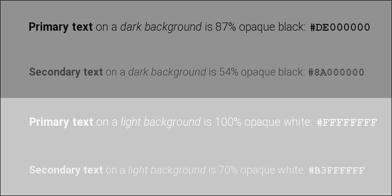

要为我们的主题添加主文本和次文本颜色，请在`colors`文件中添加以下这些行：

```kt
<color name="text_primary_dark">#DE000000</color> 
<color name="text_secondary_dark">#8A000000</color> 

<color name="text_primary_light">#FFFFFFFF</color> 
<color name="text_secondary_light">#B3FFFFFF</color> 

```

然后根据背景阴影，在`styles`文件中添加适当的行，例如：

```kt

<item name="android:textColorPrimary">@color/text_primary_light</item> 
<item name="android:textColorSecondary">@color/text_secondary_light</item> 

```

如果您使用了图像资源或下载了谷歌的材料图标之一，系统将自动将主文本颜色应用到我们的 FAB 图标上。否则，您需要直接为您的图标着色。

现在我们可以通过以下两个步骤激活工具栏和 FAB：

1.  在主活动的`onCreate()`方法中添加以下几行代码：

    ```kt
    Toolbar toolbar = (Toolbar) findViewById(R.id.toolbar); 
    setSupportActionBar(toolbar); 

    ```

1.  在其活动的`onCreate()`方法中添加以下点击监听器：

    ```kt
    FloatingActionButton fab = (FloatingActionButton) findViewById(R.id.fab); 
    fab.setOnClickListener(new View.OnClickListener() { 

        @Override 
        public void onClick(View view) { 
            // SYSTEM DISMISSES DIALOG 
        } 
    }); 

    ```

    现在，当视图滚动时，FAB 图标和工具栏标题将可见并正确动画：

    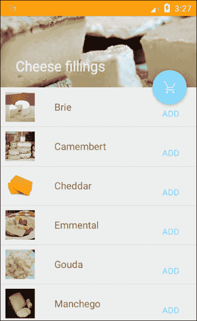

点击悬浮操作按钮（FAB）应将用户带到另一个活动，即结账活动。然而，用户可能误点击了按钮，因此我们首先应该弹出一个对话框，让用户确认选择。

# 对话框构建器

除了少数应用外，Android 对话框对所有应用都是必不可少的，它也是了解框架本身如何应用设计模式的好方法。在这个例子中，它是对话框构建器，它通过一系列 setter 来构建我们的对话框。

在当前情况下，我们真正需要的只是一个非常简单的对话框，允许用户确认他们的选择，但对话框构建是一个非常有趣的话题，因此我们将更详细地了解它是如何完成的，以及内置构建器模式是如何用于构建它们的。

我们即将构建的对话框，如果得到确认，将把用户带到另一个活动，因此在这样做之前，我们应该创建该活动。通过从项目资源管理器菜单中选择`新建 | 活动 | 空白活动`可以轻松完成。这里我们称它为`CheckoutActivity.java`。

创建此活动后，请按照以下两个步骤操作：

1.  悬浮操作按钮的点击监听器将构建并显示我们的对话框。它相当长，所以创建一个名为`buildDialog()`的新方法：并在`onCreate()`方法的底部添加以下两行：

    ```kt
    fab = (FloatingActionButton) findViewById(id.fab); 
    buildDialog(fab); 

    ```

1.  然后像这样定义方法：

    ```kt
    private void buildDialog(FloatingActionButton fab) { 
        fab.setOnClickListener(new View.OnClickListener() { 

            @Override 
            public void onClick(View view) { 
                AlertDialog.Builder builder = new AlertDialog.Builder(MainActivity.this); 

                LayoutInflater inflater = MainActivity.this.getLayoutInflater(); 

            builder.setTitle(R.string.checkout_dialog_title) 

                    .setMessage(R.string.checkout_dialog_message) 

                    .setIcon(R.drawable.ic_sandwich_primary) 

                    .setPositiveButton(R.string.action_ok_text, new DialogInterface.OnClickListener() { 

                        public void onClick(DialogInterface dialog, int id) { 
                            Intent intent = new Intent(MainActivity.this, CheckoutActivity.class); 
                            startActivity(intent); 
                        } 
                    }) 

                    .setNegativeButton(R.string.action_cancel_text, new DialogInterface.OnClickListener() { 

                        public void onClick(DialogInterface dialog, int id) { 
                            // SYSTEM DISMISSES DIALOG 
                        } 
                    }); 

                AlertDialog dialog = builder.create(); 
                dialog.show(); 
            } 
        }); 
    } 

    ```

    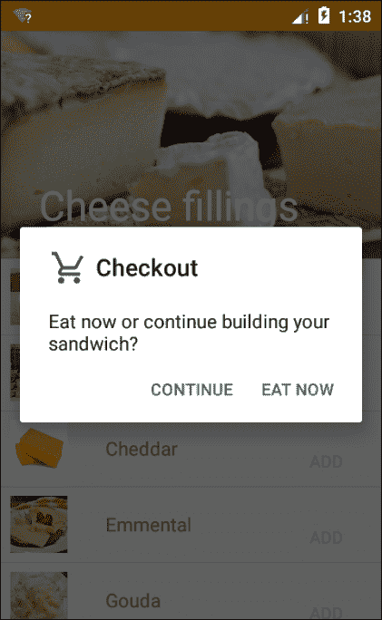

对于这样一个简单的对话框，标题和图标是不必要的，这里包括它们只是为了示例。`AlertDialog.Builder`提供了许多其他属性，并且可以在以下位置找到全面的指南：

developer.android.com/reference/android/app/AlertDialog.Builder.html

这为我们几乎可以想到的任何警告对话框提供了一种便捷的构建方式，但它有一些不足之处。例如，上述对话框使用默认主题给按钮文字上色。在我们的自定义主题中，将这种颜色应用到我们的对话框会很不错。通过创建自定义对话框，可以轻松实现这一点。

## 自定义对话框

如您所料，自定义对话框是用 XML 布局文件定义的，这与我们设计其他任何布局的方式相同。此外，我们可以在构建器链中填充此布局，这意味着我们可以在同一个对话框中组合自定义和默认功能。

要自定义我们的对话框，只需以下两个步骤：

1.  首先，创建一个名为`checkout_dialog.xml`的新布局资源文件，并完成如下：

    ```kt
    <?xml version="1.0" encoding="utf-8"?> 
    <LinearLayout  
        android:layout_width="match_parent" 
        android:layout_height="match_parent" 
        android:orientation="vertical" 
        android:theme="@style/AppTheme"> 

        <ImageView 
            android:id="@+id/dialog_title" 
            android:layout_width="match_parent" 
            android:layout_height="@dimen/dialog_title_height" 
            android:src="img/dialog_title" /> 

        <TextView 
        android:id="@+id/dialog_content" 
        android:layout_width="wrap_content" 
        android:layout_height="wrap_content" 
        android:paddingStart="@dimen/dialog_message_padding" 
        android:text="@string/checkout_dialog_message" 
        android:textAppearance="?android:attr/textAppearanceSmall" 
        android:textColor="@color/text_secondary_dark" /> 

    </LinearLayout> 

    ```

1.  然后，将`buildDialog()`方法编辑成与这里看到的一致。与之前方法的变化已被突出显示：

    ```kt
    private void buildDialog(FloatingActionButton fab) { 
        fab.setOnClickListener(new View.OnClickListener() { 

            @Override 
            public void onClick(View view) { 
                AlertDialog.Builder builder = new AlertDialog.Builder(MainActivity.this); 

                LayoutInflater inflater = MainActivity.this.getLayoutInflater(); 

                builder.setView(inflater.inflate(layout.checkout_dialog, null)) 

                        .setPositiveButton(string.action_ok_text, new DialogInterface.OnClickListener() { 
                            public void onClick(DialogInterface dialog, int id) { 
                                Intent intent = new Intent(MainActivity.this, CheckoutActivity.class); 
                                startActivity(intent); 
                            } 
                        }) 

                        .setNegativeButton(string.action_cancel_text, new DialogInterface.OnClickListener() { 
                            public void onClick(DialogInterface dialog, int id) { 
                                // System dismisses dialog 
                            } 
                        }); 

                AlertDialog dialog = builder.create(); 
                dialog.show(); 

                Button cancelButton = dialog.getButton(DialogInterface.BUTTON_NEGATIVE); 
                cancelButton.setTextColor(getResources().getColor(color.colorAccent)); 

                Button okButton = dialog.getButton(DialogInterface.BUTTON_POSITIVE); 
                okButton.setTextColor(getResources().getColor(color.colorAccent)); 
            } 
        }); 
    } 

    ```

在这里，我们使用了`AlertDialog.Builder`将视图设置为我们的自定义布局。这需要布局资源和父级，但在这个例子中，我们从监听器内部构建，所以它保持为`null`。

在设备上测试时，输出应该类似于以下屏幕截图：

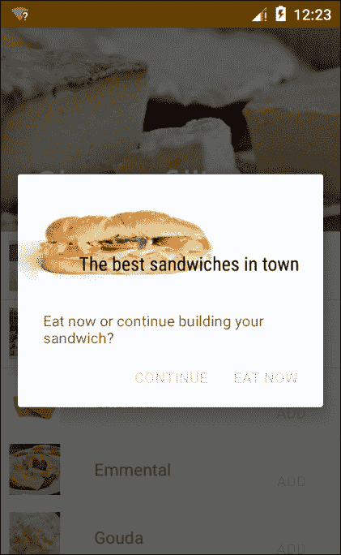

### 提示

值得注意的是，在为按钮定义字符串资源时，最好*不要*将整个字符串大写，只大写首字母。例如，以下定义创建了上一个示例中按钮上的文本：

```kt
<string name="action_ok_text">Eat now</string> 
<string name="action_cancel_text">Continue</string> 

```

在这个例子中，我们自定义了对话框的标题和内容，但仍然使用了提供的确定和取消按钮，我们可以将我们自己的自定义与对话框的许多设置器混合匹配。

在我们继续之前，我们将为回收视图提供另一种功能，即滑动并取消的行为。

# 添加滑动并取消操作

在这个特定的应用中，我们不太可能需要滑动并取消的行为，因为列表很短，允许用户编辑它们也没有太大的好处。然而，为了让我们了解这个重要且有用的功能是如何应用的，即使最终设计中不会包含它，我们也将在这里实现它。

滑动以及拖放操作主要由**ItemTouchHelper**管理，它是一种 RecyclerView.ItemDecoration 的类型。这个类提供的回调允许我们检测项目的移动和方向，并拦截这些操作，然后在代码中响应它们。

如您在此处所见，实现滑动并取消行为只需几个步骤：

1.  首先，我们的列表现在将改变长度，因此删除这行代码`recyclerView.setHasFixedSize(true);`或者将其设置为`false`。

1.  保持`onCreate()`方法尽可能简单总是一个好主意，因为那里通常有很多事情发生。我们将创建一个单独的方法来初始化我们的项目触摸助手，并在`onCreate()`中调用它。以下是该方法：

    ```kt
    private void initItemTouchHelper() { 
        ItemTouchHelper.SimpleCallback callback = new ItemTouchHelper.SimpleCallback(0, ItemTouchHelper.LEFT | ItemTouchHelper.RIGHT) { 

            @Override 
            public boolean onMove(RecyclerView recyclerView, RecyclerView.ViewHolder viewHolder, RecyclerView.ViewHolder viewHolder1) { 
                return false; 
            } 

            @Override 
            public void onSwiped(RecyclerView.ViewHolder viewHolder, int direction) { 
                int position = viewHolder.getAdapterPosition(); 
                adapter.removeItem(position); 
            } 
        }; 

        ItemTouchHelper itemTouchHelper = new ItemTouchHelper(callback); 
        itemTouchHelper.attachToRecyclerView(recyclerView); 
    } 

    ```

1.  现在将以下行添加到`onCreate()`方法中：

    ```kt
    InitItemTouchHelper(); 

    ```

    尽管执行了半个函数的功能，`onCreate()`方法仍然保持简短和清晰：

    ```kt
    @Override 
    protected void onCreate(Bundle savedInstanceState) { 
        super.onCreate(savedInstanceState); 
        setContentView(layout.activity_main); 

        Toolbar toolbar = (Toolbar) findViewById(id.toolbar); 
        setSupportActionBar(toolbar); 

        final ArrayList<Cheese> cheeses = buildList(); 
        adapter = new DataAdapter(cheeses); 

        recyclerView = (RecyclerView) findViewById(id.recycler_view); 
        recyclerView.setLayoutManager(new LinearLayoutManager(this)); 
        recyclerView.addItemDecoration(new ItemDivider(this)); 
        recyclerView.setAdapter(adapter); 

        initItemTouchHelper(); 

        fab = (FloatingActionButton) findViewById(id.fab); 
        buildDialog(fab); 
    } 

    ```

如果您在此时测试应用，您会注意到尽管项目在滑动时会从屏幕上消失，但间隙并没有关闭。这是因为我们还没有通知回收视图它已被移除。尽管这可以在`initItemTouchHelper()`方法中完成，但它实际上属于适配器类，因为它使用了它的方法。在适配器中添加以下方法以完成此任务：

```kt
public void removeItem(int position) { 
    cheeses.remove(position); 
    notifyItemRemoved(position); 
    notifyItemRangeChanged(position, cheeses.size()); 

```

现在当移除一个项目时，回收视图列表将会重新排序：

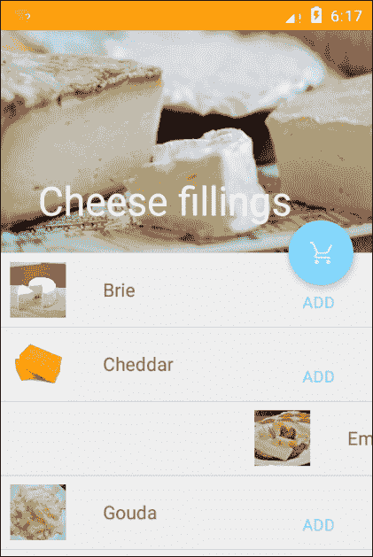

在此示例中，用户可以左右滑动以关闭项目，这对我们这里的目的来说是可以的，但在很多情况下这种区分非常有用。许多移动应用程序使用向右滑动来接受一个项目，向左滑动来关闭它。这可以通过使用`onSwiped()`方法的方向参数轻松实现。例如：

```kt
if (direction == ItemTouchHelper.LEFT) { 
    Log.d(DEBUG_TAG, "Swiped LEFT"); 
} else { 
    Log.d(DEBUG_TAG, "Swiped RIGHT"); 
} 

```

在本章前面，我们使用了一个本地模式，即 AlertDialog.Builder 来构建布局。正如创建性模式的本意，背后的逻辑对我们是隐藏的，但构建器设计模式为从单个视图组件构建布局和视图组提供了一个非常好的机制，我们将在下面看到这一点。

# 构造布局构建器

到目前为止，在这本书中，我们构建的所有布局都是静态的 XML 定义。然而，正如你所期望的，完全可以从我们的源代码中动态构建和填充 UI。此外，Android 布局非常适合构建器模式，正如我们在警告对话框中所看到的，因为它们由一系列有序的小对象组成。

下面的示例将遵循构建器设计模式，从一系列预定义的*布局视图*中填充一个线性布局。像之前一样，我们将从接口构建到抽象和具体类。我们将创建两种布局项，标题或*头条*视图和*内容*视图。然后我们制作这些的具体示例，可以通过构建器来构建。因为所有视图都有一些共同的特征（在这种情况下是文本和背景颜色），我们将通过另一个接口来避免重复方法，这个接口有自己的具体扩展来处理这种着色。

为了更好地了解这是如何工作的，请启动一个新的 Android 项目，并按照以下步骤构建模型：

1.  创建一个名为`builder`的内部包。将以下所有类添加到这个包中。

1.  为我们的视图类创建以下接口：

    ```kt
    public interface LayoutView { 

        ViewGroup.LayoutParams layoutParams(); 
        int textSize(); 
        int content(); 
        Shading shading(); 
        int[] padding(); 
    } 

    ```

1.  现在创建文本和背景颜色的接口，如下所示：

    ```kt
    public interface Shading { 

        int shade(); 
        int background(); 
    } 

    ```

1.  我们将创建`Shading`的具体示例。它们看起来像这样：

    ```kt
    public class HeaderShading implements Shading{ 

        @Override 
        public int shade() { 
            return R.color.text_primary_dark; 
        } 

        @Override 
        public int background() { 
            return R.color.title_background; 
        } 
    } 

    public class ContentShading implements Shading{ 

        ... 
            return R.color.text_secondary_dark; 
        ... 

        ... 
            return R.color.content_background; 
        ... 
    } 

    ```

1.  现在我们可以创建我们想要的两种视图类型的抽象实现。这些应该符合以下要求：

    ```kt
    public abstract class Header implements LayoutView { 

        @Override 
        public Shading shading() { 
            return new HeaderShading(); 
        } 
    } 

    public abstract class Content implements LayoutView { 

        ... 
            return new ContentShading(); 
        ... 
    } 

    ```

1.  接下来，我们需要创建这两种类型的具体类。首先是标题：

    ```kt
    public class Headline extends Header { 

        @Override 
        public ViewGroup.LayoutParams layoutParams() { 
            final int width = ViewGroup.LayoutParams.MATCH_PARENT; 
            final int height = ViewGroup.LayoutParams.WRAP_CONTENT; 

            return new ViewGroup.LayoutParams(width,height); 
        } 

        @Override 
        public int textSize() { 
            return 24; 
        } 

        @Override 
        public int content() { 
            return R.string.headline; 
        } 

        @Override 
        public int[] padding() { 
            return new int[]{24, 16, 16, 0}; 
        } 
    } 

    public class SubHeadline extends Header { 

        ... 

        @Override 
        public int textSize() { 
            return 18; 
        } 

        @Override 
        public int content() { 
            return R.string.sub_head; 
        } 

        @Override 
        public int[] padding() { 
            return new int[]{32, 0, 16, 8}; 
        } 
        ... 

    ```

1.  然后是内容：

    ```kt
    public class SimpleContent extends Content { 

        @Override 
        public ViewGroup.LayoutParams layoutParams() { 
            final int width = ViewGroup.LayoutParams.MATCH_PARENT; 
            final int height = ViewGroup.LayoutParams.MATCH_PARENT; 

            return new ViewGroup.LayoutParams(width, height); 
        } 

        @Override 
        public int textSize() { 
            return 14; 
        } 

        @Override 
        public int content() { 
            return R.string.short_text; 
        } 

        @Override 
        public int[] padding() { 
            return new int[]{16, 18, 16, 16}; 
        } 
    } 

    public class DetailedContent extends Content { 

        ... 
            final int height = ViewGroup.LayoutParams.WRAP_CONTENT; 
        ... 

        @Override 
        public int textSize() { 
            return 12; 
        } 

        @Override 
        public int content() { 
            return R.string.long_text; 
        } 

        ... 

    ```

这样我们的模型就完成了。我们有两个单独的视图以及每种视图的颜色设置。现在我们可以创建一个助手类，按照我们希望的顺序组合这些视图。这里我们只需要两个，一个用于简单的输出，另一个用于更详细的布局。

构建器的样子如下：

```kt
public class LayoutBuilder { 

    public List<LayoutView> displayDetailed() { 
        List<LayoutView> views = new ArrayList<LayoutView>(); 
        views.add(new Headline()); 
        views.add(new SubHeadline()); 
        views.add(new DetailedContent()); 
        return views; 
    } 

    public List<LayoutView> displaySimple() { 
        List<LayoutView> views = new ArrayList<LayoutView>(); 
        views.add(new Headline()); 
        views.add(new SimpleContent()); 
        return views; 
    } 
} 

```

此模式的类图如下：

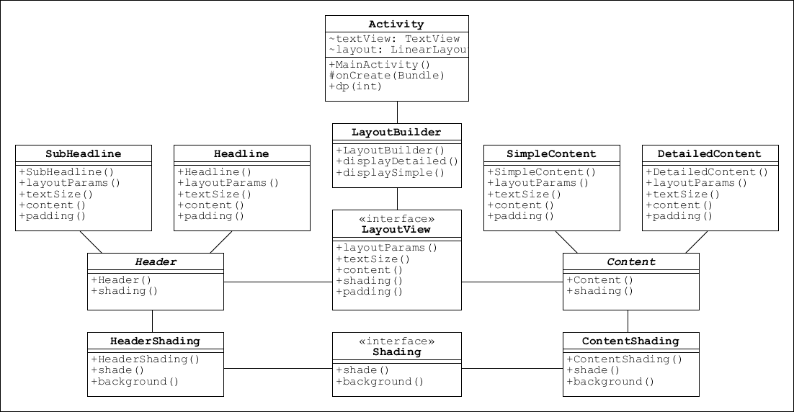

正如构建器模式和其他一般模式所期望的，我们所做的一切工作都是为了将模型逻辑从客户端代码中隐藏起来，在我们的例子中，特别是当前活动和`onCreate()`方法。

当然，我们可以在主 XML 活动提供的默认根视图组中扩展这些视图，但动态生成这些视图通常也很有用，特别是如果我们想要生成嵌套布局。

下一个活动演示了我们现在如何使用构建器动态扩展布局：

```kt
public class MainActivity extends AppCompatActivity { 
    TextView textView; 
    LinearLayout layout; 

    @Override 
    protected void onCreate(Bundle savedInstanceState) { 
        final int width = ViewGroup.LayoutParams.MATCH_PARENT; 
        final int height = ViewGroup.LayoutParams.WRAP_CONTENT; 

        super.onCreate(savedInstanceState); 

        layout = new LinearLayout(this); 
        layout.setOrientation(LinearLayout.VERTICAL); 
        layout.setLayoutParams(new ViewGroup.LayoutParams(width, height)); 

        setContentView(layout); 

        // COULD USE layoutBuilder.displaySimple() INSTEAD         
        LayoutBuilder layoutBuilder = new LayoutBuilder(); 
        List<LayoutView> layoutViews = layoutBuilder.displayDetailed(); 

                for (LayoutView layoutView : layoutViews) { 
            ViewGroup.LayoutParams params = layoutView.layoutParams(); 
            textView = new TextView(this); 

            textView.setLayoutParams(params); 
            textView.setText(layoutView.content()); 
            textView.setTextSize(TypedValue.COMPLEX_UNIT_SP, layoutView.textSize()); 
            textView.setTextColor(layoutView.shading().shade()); 
            textView.setBackgroundResource(layoutView.shading().background()); 

            int[] pad = layoutView.padding(); 
            textView.setPadding(dp(pad[0]), dp(pad[1]), dp(pad[2]), dp(pad[3])); 

            layout.addView(textView); 
        } 
    } 
} 

```

您还需要以下方法，该方法用于从`px`转换为`dp`：

```kt
public int dp(int px) { 
    final float scale = getResources().getDisplayMetrics().density; 
    return (int) (px * scale + 0.5f); 
} 

```

在设备上运行时，将产生以下两种 UI 之一：

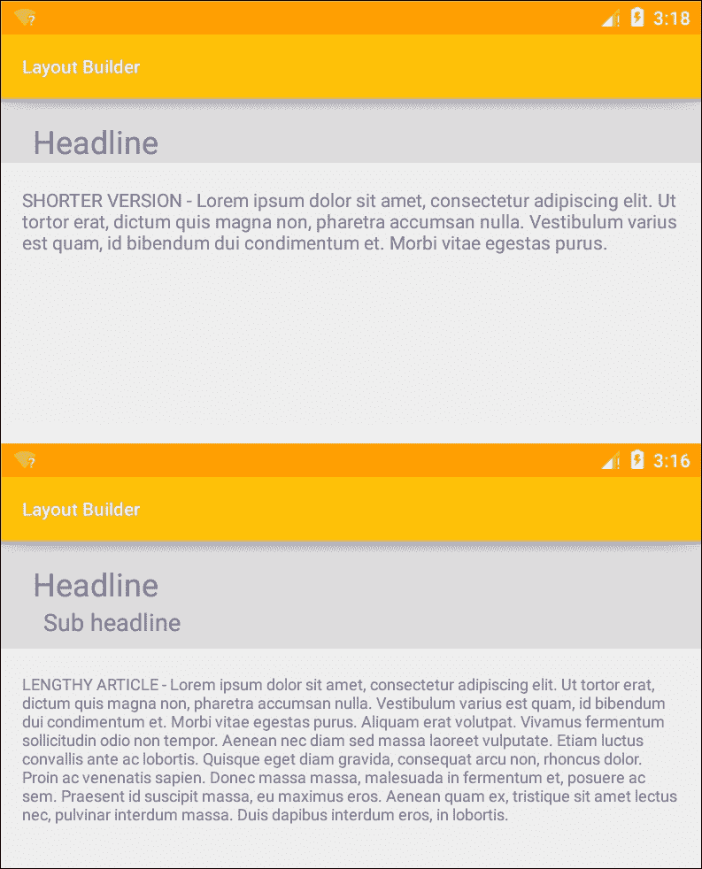

如预期的那样，客户端代码简单、简短且易于理解。

不必使用程序化布局或静态布局，两者可以混合使用。视图可以在 XML 中设计，然后像我们在这里用 Java 所做的那样进行扩展。我们可以甚至保持这里使用的相同模式。

这里还有很多内容可以介绍，比如如何使用适配器或桥接模式包含其他类型的视图，例如图片，但我们将在书中稍后介绍组合模式。现在，我们已经了解了布局构建器的工作原理以及它是如何将其逻辑与客户端代码分离的。

# 总结

本章内容相当丰富。我们从创建一个折叠工具栏和一个功能性的回收视图开始。我们了解了如何为布局的大部分添加基本功能，以及如何将工厂模式应用于特定案例。这引导我们探索构建器（内部和创建的）如何用于构建详细布局。

在下一章中，我们将进一步探讨如何响应用户活动，现在我们有了某些工作的控件和视图，我们将了解如何将它们连接到有用的逻辑。
