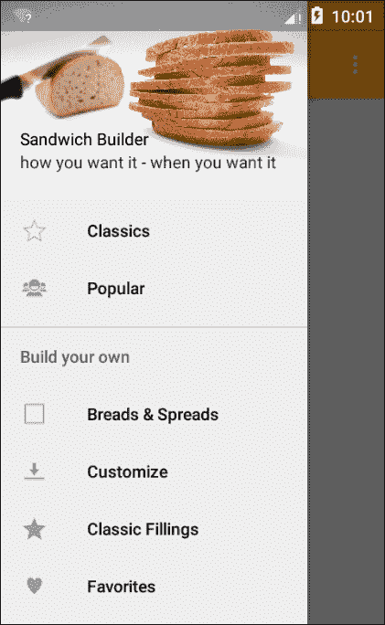
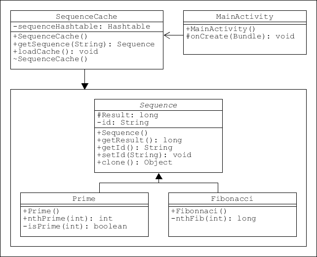
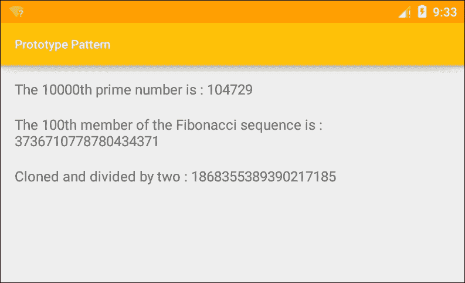
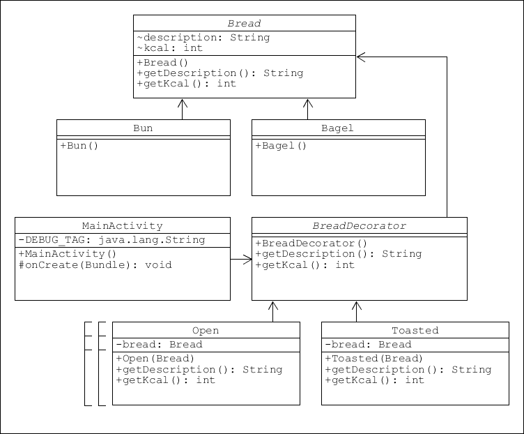
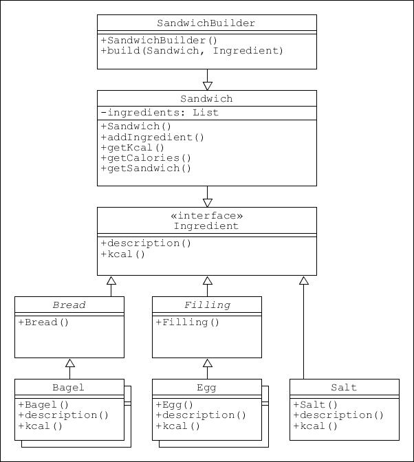
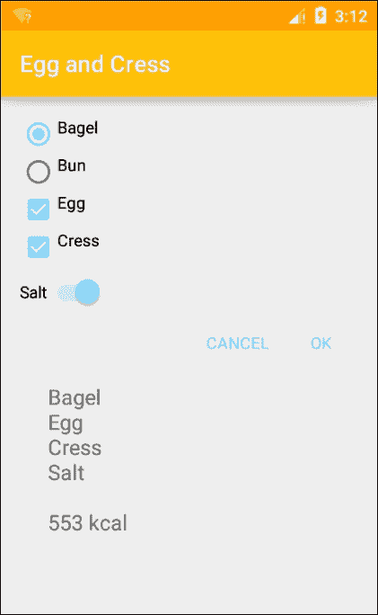
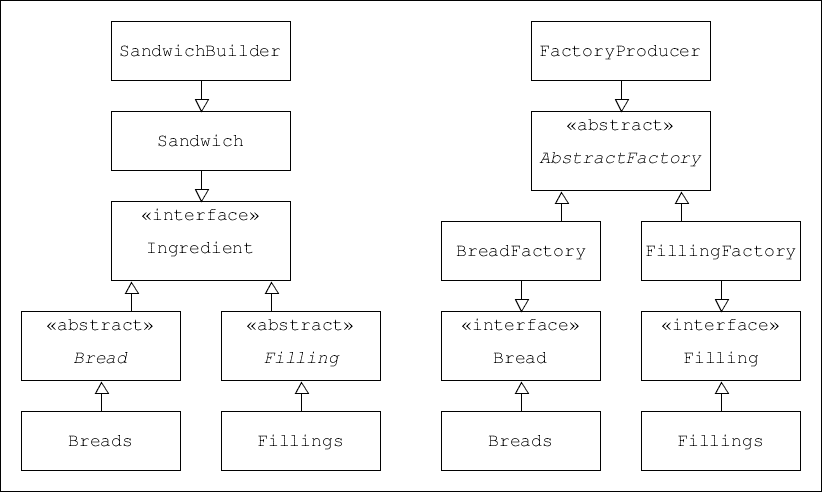
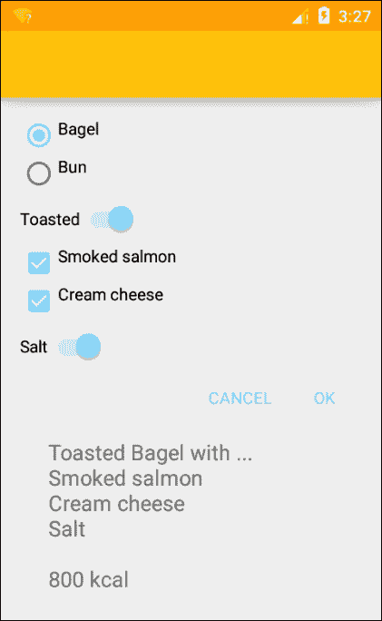
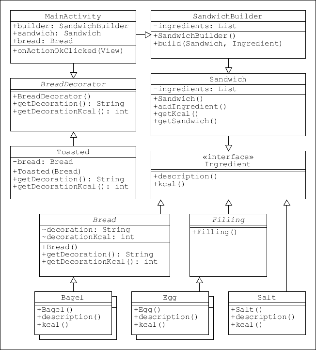
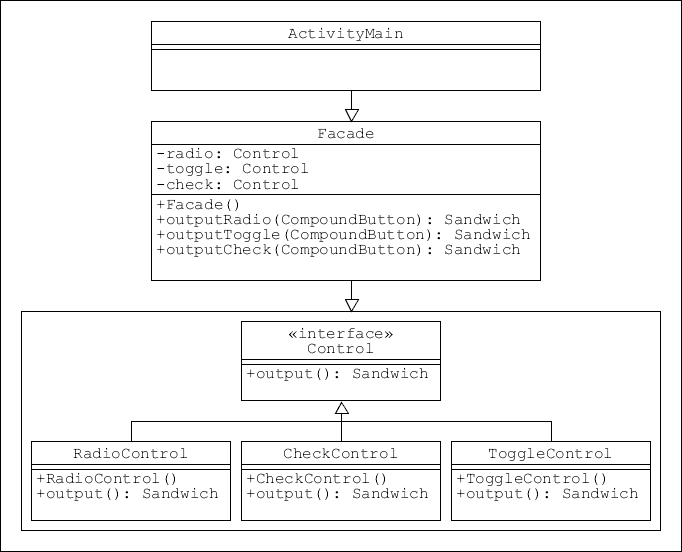

# 第七章：组合模式

我们已经看到模式如何帮助我们组织代码，以及如何将其具体应用于 Android 应用，但我们一次只应用了一个模式。随着我们需要执行的任务变得更加复杂，我们将需要同时应用多个模式，比如装饰器和生成器，甚至将它们组合成**混合模式**，这正是我们将在本章中要做的事情。

我们将从考虑更复杂的用户界面（UI）及其背后的代码开始。这将要求我们更精确地思考我们实际希望应用程序做什么。这也将引导我们研究**原型模式**，它提供了一种非常有效的方法，可以从原始对象或克隆对象创建对象。

接下来，我们将探讨**装饰器模式**，看看它如何用于向现有类添加额外功能。通常被称为包装器，装饰器用于为现有代码提供附加功能。这对于我们的三明治制作应用特别有用，因为它允许我们包含如下选项：订购开放式三明治或者选择烤面包。这些本身不是配料，但三明治销售商可能希望提供这些服务。装饰器模式非常适合这项任务。

在简要了解了其他选择之后，我们构建了一个生成器模式作为我们系统的核心，并将其连接到一个用户界面（UI），以便用户可以组合一个简单的三明治，并选择选项和配料。然后，我们连接一个装饰器到这个生成器以提供更多选项。

在本章中，你将学习如何做到以下几点：

+   创建原型模式

+   创建装饰器模式

+   扩展装饰器

+   将生成器连接到 UI

+   管理复合按钮

+   组合模式

现在我们能够开始更多地考虑我们应用的细节以及它能做什么、应该做什么。我们需要考虑潜在客户，并设计出简单、易用的产品。功能需要易于访问且直观，最重要的是，用户需要用最少的点击次数就能构建出他们想要的三明治。稍后，我们将看到用户如何存储他们的最爱，以及我们如何为用户提供部分构建的三明治以进行自定义，而不是从头开始构建。现在，我们将看看如何对我们的三明治相关对象和类进行分类。

# 制定规范

在上一章中，我们使用工厂模式创建了一个简单的三明治配料对象列表，并将其连接到布局中。然而，我们只表示了一种填充类型。在创建更复杂的系统之前，我们需要规划我们的数据结构，为此我们需要考虑我们向用户呈现的选择。

首先，我们可以提供哪些选项来使这个过程简单、有趣且直观？以下是一个潜在用户可能希望从这类应用中获得的功能列表：

+   订购现成的三明治，无需定制

+   定制现成的三明治

+   从一些基本食材开始并逐步构建

+   订购或定制他们之前吃过的三明治

+   从零开始制作三明治

+   随时查看并编辑他们的三明治

之前，我们为奶酪创建了一个单独的菜单，但为每种食品类型提供一个类别可能是一个笨拙的解决方案：想要一个培根、生菜和番茄三明治的用户可能需要访问三个不同的菜单。我们有很多不同的方法可以解决这个问题，这在很大程度上是个人选择的问题。在这里，我们将尝试遵循我们自己制作三明治时可能会采取的过程，可以描述如下列表：

1.  面包

1.  黄油

1.  内馅

1.  配料

我所说的配料是指蛋黄酱、胡椒、芥末等。我们将把这些类别作为我们类结构的基础。如果它们都能属于同一个类类型会很不错，但有一两个细微的差别禁止这样做：

**面包**：没有人会订购没有面包的三明治；那就不叫三明治了，我们可能会认为它可以像其他任何食材一样处理。然而，我们将提供开放式三明治的选择，并且为了使情况复杂化，还有烤面包的选项。

**黄油**：人们可能会认为添加黄油是理所当然的，但有些顾客可能想要低脂涂抹酱，或者根本不要。幸运的是，有一个非常适合此目的的模式：装饰者模式。

**内馅和配料**：尽管如果这两个类都从同一个类扩展而来，它们很容易共享相同的属性和实例，但我们将分别处理它们，因为这样构建菜单会更清晰。

在这些规格到位之后，我们可以开始考虑顶级菜单的外观。我们将使用滑动抽屉导航视图，并提供以下选项：



这为我们大致展示了我们的目标。使用模式的一个优点是它们易于修改，这意味着我们可以更直观地处理开发，同时放心地知道即使是大规模的更改通常也只需编辑最少的代码。

我们的下一步是选择一个适合概述任务的合适模式。我们对工厂和建造者都很熟悉，也知道它们如何实现我们想要的功能，但还有一个创建型模式，即原型模式，也非常方便，尽管在这种情况下我们不会使用它，但将来我们可能会使用，你肯定也会遇到需要使用的时候。

# 原型模式

原型设计模式与其他创建型模式（如构建器和工厂）执行类似任务，但采用的方法截然不同。它不是重度依赖许多硬编码的子类，正如其名，原型从原始对象进行复制，大大减少了所需的子类数量和任何冗长的创建过程。

## 设置原型

当实例的创建在某种程度上是昂贵的时，原型最为有用。这可能是加载大文件、详细检查数据库，或是其他计算成本高昂的操作。此外，它允许我们将克隆对象与其原始对象解耦，使我们能够进行修改而无需每次重新实例化。在以下示例中，我们将使用首次创建时计算时间较长的函数来演示这一点：第 n 个素数和第 n 个斐波那契数。

从图解上看来，我们的原型将如下所示：



在我们的主应用中，由于昂贵的创建非常少，因此不需要原型模式。然而，在许多情况下它至关重要，不应被忽视。以下是应用原型模式的步骤：

1.  我们将从以下抽象类开始：

    ```kt
    public abstract class Sequence implements Cloneable { 
        protected long result; 
        private String id; 

        public long getResult() { 
            return result; 
        } 

        public String getId() { 
            return id; 
        } 

        public void setId(String id) { 
            this.id = id; 
        } 

        public Object clone() { 
            Object clone = null; 

            try { 
                clone = super.clone(); 

            } catch (CloneNotSupportedException e) { 
                e.printStackTrace(); 
            } 

            return clone; 
        } 
    } 

    ```

1.  接下来，添加这个可克隆的具体类：

    ```kt
    // Calculates the 10,000th prime number 
    public class Prime extends Sequence { 

        public Prime() { 
            result = nthPrime(10000); 
        } 

        public static int nthPrime(int n) { 
            int i, count; 

            for (i = 2, count = 0; count < n; ++i) { 
                if (isPrime(i)) { 
                    ++count; 
                } 
            } 

            return i - 1; 
        } 

        // Test for prime number 
        private static boolean isPrime(int n) { 

            for (int i = 2; i < n; ++i) { 
                if (n % i == 0) { 
                    return false; 
                } 
            } 

            return true; 
        } 
    } 

    ```

1.  再添加一个`Sequence`类，用于斐波那契数列，如下所示：

    ```kt
    // Calculates the 100th Fibonacci number 
    public class Fibonacci extends Sequence { 

        public Fibonacci() { 
            result = nthFib(100); 
        } 

        private static long nthFib(int n) { 
            long f = 0; 
            long g = 1; 

            for (int i = 1; i <= n; i++) { 
                f = f + g; 
                g = f - g; 
            } 

            return f; 
        } 
    } 

    ```

1.  接下来，创建缓存类，如下所示：

    ```kt
    public class SequenceCache { 
       private static Hashtable<String, Sequence> sequenceHashtable = new Hashtable<String, Sequence>(); 

        public static Sequence getSequence(String sequenceId) { 

            Sequence cachedSequence = sequenceHashtable.get(sequenceId); 
            return (Sequence) cachedSequence.clone(); 
        } 

            public static void loadCache() { 

            Prime prime = new Prime(); 
            prime.setId("1"); 
            sequenceHashtable.put(prime.getId(), prime); 

            Fibonacci fib = new Fibonacci(); 
            fib.setId("2"); 
            sequenceHashtable.put(fib.getId(), fib); 
        } 
    } 

    ```

1.  在你的布局中添加三个`TextViews`，然后在你的`MainActivity`的`onCreate()`方法中添加代码。

1.  在客户端代码中添加以下几行：

    ```kt
    // Load the cache once only 
    SequenceCache.loadCache(); 

    // Lengthy calculation and display of prime result 
    Sequence prime = (Sequence) SequenceCache.getSequence("1"); 
    primeText.setText(new StringBuilder() 
            .append(getString(R.string.prime_text)) 
            .append(prime.getResult()) 
            .toString()); 

    // Lengthy calculation and display of Fibonacci result 
    SSequence fib = (Sequence) SequenceCache.getSequence("2"); 
    fibText.setText(new StringBuilder() 
            .append(getString(R.string.fib_text)) 
            .append(fib.getResult()) 
            .toString()); 

    ```

如你所见，前面的代码创建了模式，但并未演示它。一旦加载，缓存就可以创建我们之前昂贵的输出的即时副本。此外，我们可以修改副本，当我们有一个复杂的对象并且只想修改一个或两个属性时，原型非常有用。

## 应用原型

考虑一个在社交媒体网站上可能找到的详细用户资料。用户修改诸如图片和文本等详细信息，但所有资料的整体结构是相同的，这使得它成为原型模式的理想选择。

为了将这一原则付诸实践，请在客户端源代码中包含以下代码：

```kt
// Create a clone of already constructed object 
Sequence clone = (Fibonacci) new Fibonacci().clone(); 

// Modify the resultlong result = clone.getResult() / 2; 

// Display the result quickly 
cloneText.setText(new StringBuilder()        .append(getString(R.string.clone_text))        .append(result)        .toString());
```



在许多场合，原型是一个非常实用的模式，尤其是当我们需要创建昂贵的对象或面临子类激增的情况时。然而，这并不是唯一有助于减少过度子类化的模式，这引导我们了解另一个设计模式：**装饰器**。

# 装饰器设计模式

无论对象创建的成本如何，我们的模型性质有时仍会迫使产生不合理数量的子类，这正是装饰器模式极其方便之处。

以我们三明治应用中的面包为例。我们希望提供几种类型的面包，但除此之外，我们还希望提供选择烤过、开口的三明治以及一系列涂抹酱。为每种面包类型创建烤过和开口版本，项目很快就会变得难以管理。装饰器允许我们在运行时向对象添加功能和属性，而无需对原始类结构进行任何更改。

## 设置装饰器

有人可能会认为像*烤过*和*开口*这样的属性可以作为*bread*类的一部分包含，但这本身可能导致代码越来越难以管理。假设我们希望*bread*和*filling*继承自同一个类，比如*ingredient*。这是有道理的，因为它们有共同的属性，比如价格和热量值，我们希望它们都通过相同的布局结构显示。然而，将烤过和涂抹这样的属性应用于填充物是没有意义的，这会导致冗余。

装饰器解决了这两个问题。要了解如何应用，请按照以下步骤操作：

1.  从创建这个抽象类来表示所有面包开始：

    ```kt
    public abstract class Bread { 
        String description; 
        int kcal; 

        public String getDescription() { 
            return description; 
        } 

        public int getKcal() { 
            return kcal; 
        } 
    } 

    ```

1.  接下来，创建具体实例，如下所示：

    ```kt
    public class Bagel extends Bread { 

        public Bagel() { 
            description = "Bagel"; 
            kcal = 250; 
        } 
    } 

    public class Bun extends Bread { 

        public Bun() { 
            description = "Bun"; 
            kcal = 150; 
        } 
    } 

    ```

1.  现在我们需要一个抽象的装饰器，它看起来像这样：

    ```kt
    // All bread treatments extend from this 
    public abstract class BreadDecorator extends Bread { 

        public abstract String getDescription(); 

        public abstract int getKcal(); 
    } 

    ```

1.  我们需要四个此类装饰器的扩展来表示两种类型的涂抹酱以及开口和烤过的三明治。首先，是`Butter`装饰器：

    ```kt
    public class Butter extends BreadDecorator { 
        private Bread bread; 

    public Butter(Bread bread) { 
            this.bread = bread; 
        } 

        @Override 
        public String getDescription() { 
            return bread.getDescription() + " Butter"; 
        } 

        @Override 
        public int getKcal() { 
            return bread.getKcal() + 50; 
        } 
    } 

    ```

1.  其他三个类中，只有 getter 返回的值不同。它们如下：

    ```kt
    public class LowFatSpread extends BreadDecorator { 

            return bread.getDescription() + " Low fat spread"; 

            return bread.getKcal() + 25; 
    } 

    public class Toasted extends BreadDecorator { 

            return bread.getDescription() + " Toasted"; 

            return bread.getKcal() + 0; 
    } 

    public class Open extends BreadDecorator { 

            return bread.getDescription() + " Open"; 

            return bread.getKcal() / 2; 
    } 

    ```

这样就完成了装饰器模式的设置。我们现在需要做的就是将其连接到某种工作接口。稍后，我们将使用菜单选择面包，然后使用对话框添加*装饰*。

## 应用装饰器

用户将需要在黄油和低脂涂抹酱之间做出选择（尽管通过添加另一个装饰器可以包含一个*不涂抹*的选项），但可以选择让三明治既烤过又开口。

现在，我们将使用调试器通过向管理活动的`onCreate()`方法添加如下几行来测试各种组合。注意对象是如何链式调用的：

```kt
Bread bagel = new Bagel(); 

LowFatSpread spread = new LowFatSpread(bagel); 

Toasted toast = new Toasted(spread); 

Open open = new Open(toast); 

Log.d(DEBUG_TAG, open.getDescription() + " " + open.getKcal()); 

```

这应该会产生如下输出：

```kt
D/tag: Bagel Low fat spread 275
D/tag: Bun Butter Toasted 200
D/tag: Bagel Low fat spread Toasted Open 137

```

在图表上，我们的装饰器模式可以这样表示：



装饰器设计模式是一个极其有用的开发工具，可以应用于多种情况。除了帮助我们保持可管理的具体类数量，我们还可以让面包超类从与填充物类相同的接口继承，并仍然表现出不同的行为。

## 扩展装饰器

将前面的模式扩展到填充物同样很简单。我们可以创建一个名为`Fillings`的抽象类，它除了名字与 Bread 相同，具体扩展如下所示：

```kt
public class Lettuce extends Filling { 

    public Lettuce() { 
        description = "Lettuce"; 
        kcal = 1; 
    } 
} 

```

我们甚至可以创建针对填充物（如点双份）的特定装饰器。`FillingDecorator`类将从`Filling`扩展而来，但除此之外与`BreadDecorator`相同，具体的例子如下所示：

```kt
public class DoublePortion extends FillingDecorator { 
    private Filling filling; 

    public DoublePortion(Filling filling) { 
        this.filling = filling; 
    } 

    @Override 
    public String getDescription() { 
        return filling.getDescription() + " Double portion"; 
    } 

    @Override 
    public int getKcal() { 
        // Double the calories 
        return filling.getKcal() * 2; 
    } 
} 

```

我们将装饰器串联起来生成复合字符串的方式与构造者工作的方式非常相似，实际上我们可以使用这个模式生成整个三明治及其所有配料。然而，通常情况下，这项任务有多个候选者。正如本书前面所看到的，构造者和抽象工厂都能生产复杂对象。在我们决定模型之前，需要找到最适合的模式，或者更好的是，模式的组合。

构造者模式似乎是最明显的选择，因此我们首先来看看这个模式。

# 三明治构造者模式

构造者模式专为将简单对象组合成一个复杂对象而设计，这形成了制作三明治的完美类比。在本书前面我们已经遇到了一个通用的构造者模式，但现在我们需要将其适配为一个特定功能。此外，我们还将把模式连接到一个工作用户界面，以便根据用户选择构建三明治，而不是之前示例中的套餐。

## 应用模式

为了保持代码简短和简单，我们每种食材类型只创建两个具体类，我们将使用按钮和文本视图来显示输出，而不是回收视图。只需按照以下步骤创建我们的三明治构造者模式：

1.  从以下接口开始：

    ```kt
    public interface Ingredient { 

        public String description(); 

        public int kcal(); 
    } 

    ```

1.  创建这两个`Ingredient`的抽象实现。现在它们是空的，但稍后我们会需要它们：

    ```kt
    public abstract class Bread implements Ingredient { 

        // Base class for all bread types 
    } 

    public abstract class Filling implements Ingredient { 

        // Base class for all possible fillings 
    } 

    ```

1.  我们将只需要每种食材类型的两个具体示例。下面是其中一个，`Bagel`类：

    ```kt
    public class Bagel extends Bread { 

        @Override 
        public String description() { 
            return "Bagel"; 
        } 

        @Override 
        public int kcal() { 
            return 250; 
        } 
    } 

    ```

1.  创建另一个名为`Bun`的`Bread`类和两个名为`Egg`和`Cress`的`Filling`类。

1.  为这些类提供您喜欢的任何描述和卡路里值。

1.  现在我们可以创建三明治类本身，如下所示：

    ```kt
    public class Sandwich { 
        private List<Ingredient> ingredients = new ArrayList<Ingredient>(); 

        // Add individual ingredients 
        public void addIngredient(Ingredient i) { 
            ingredients.add(i); 
        } 

        // Calculate total calories 
        public int getKcal() { 
            int kcal = 0; 

            for (Ingredient ingredient : ingredients) { 
                kcal += ingredient.kcal(); 
            } 

            return kcal; 
        } 

        // Return all ingredients when selection is complete 
        public String getSandwich() { 
            String sandwich = ""; 

            for (Ingredient ingredient : ingredients) { 
                sandwich += ingredient.description() + "\n"; 
            } 

            return sandwich; 
        } 
    } 

    ```

1.  三明治构造者类不像之前的示例那样构建套餐，而是用于按需添加食材。如下所示：

    ```kt
    public class SandwichBuilder { 

        public Sandwich build(Sandwich sandwich, Ingredient ingredient) { 
            sandwich.addIngredient(ingredient); 
            return sandwich; 
        } 
    } 

    ```

这完成了模式本身，但在我们继续创建用户界面之前，需要处理空抽象类`Bread`和`Filling`。它们看似完全多余，但我们之所以这样做有两个原因。

首先，通过在公共接口中定义它们的方法`description()`和`kcal()`，我们可以更容易地创建既不是填充物也不是面包的食材，只需实现接口本身即可。

要了解如何操作，请将以下类添加到项目中：

```kt
 public class Salt implements Ingredient { 

    @Override 
    public String description() { 
        return "Salt"; 
    } 

    @Override 
    public int kcal() { 
        return 0; 
    } 
} 

```

这给我们带来了以下的类结构：



包含这些抽象类的第二个原因更有趣。上一个示例中的`BreadDecorator`类直接与抽象的`Bread`类一起工作，并且通过保持该结构，我们可以轻松地将装饰器连接到我们的成分类型。我们很快就会继续这个话题，但首先我们要构建一个 UI 来运行我们的三明治构建器。

## 连接到 UI

在这个演示中，我们有两种类型的填充和两种面包。他们可以选择任意多或少的填充，但只能选择一种面包，这使得选择成为使用**复选框**和**单选按钮**的良好候选者。还有一个添加盐的选项，这种二元选择非常适合**开关小部件**。

首先，我们需要一个布局。以下是所需的步骤：

1.  从垂直线性布局开始。

1.  然后像这样包括单选按钮组：

    ```kt
    <RadioGroup  
        android:layout_width="fill_parent" 
        android:layout_height="wrap_content" 
        android:orientation="vertical"> 

        <RadioButton 
            android:id="@+id/radio_bagel" 
            android:layout_width="wrap_content" 
            android:layout_height="wrap_content" 
            android:checked="false" 
            android:paddingBottom="@dimen/padding" 
            android:text="@string/bagel" /> 

        <RadioButton 
            android:id="@+id/radio_bun" 
            android:layout_width="wrap_content" 
            android:layout_height="wrap_content" 
            android:checked="true" 
            android:paddingBottom="@dimen/padding" 
            android:text="@string/bun" /> 

    </RadioGroup> 

    ```

1.  接下来，包括复选框：

    ```kt
    <CheckBox 
        android:id="@+id/check_egg" 
        android:layout_width="wrap_content" 
        android:layout_height="wrap_content" 
        android:checked="false" 
        android:paddingBottom="@dimen/padding" 
        android:text="@string/egg" /> 

    <CheckBox 
        android:id="@+id/check_cress" 
        android:layout_width="wrap_content" 
        android:layout_height="wrap_content" 
        android:checked="false" 
        android:paddingBottom="@dimen/padding" 
        android:text="@string/cress" /> 

    ```

1.  然后添加开关：

    ```kt
    <Switch 
        android:id="@+id/switch_salt" 
        android:layout_width="wrap_content" 
        android:layout_height="wrap_content" 
        android:checked="false" 
        android:paddingBottom="@dimen/padding" 
        android:paddingTop="@dimen/padding" 
        android:text="@string/salt" /> 

    ```

1.  这是一个内部相对布局，包含以下操作按钮：

    ```kt
    <TextView 
        android:id="@+id/action_ok" 
        android:layout_width="wrap_content" 
        android:layout_height="wrap_content" 
        android:layout_alignParentEnd="true" 
        android:layout_gravity="end" 
        android:background="?attr/selectableItemBackground" 
        android:clickable="true" 
        android:gravity="center_horizontal" 
        android:minWidth="@dimen/action_minWidth" 
        android:onClick="onActionOkClicked" 
        android:padding="@dimen/padding" 
        android:text="@android:string/ok" 
        android:textColor="@color/colorAccent" /> 

    <TextView 
        android:id="@+id/action_cancel" 
        android:layout_width="wrap_content" 
        android:layout_height="wrap_content" 
        android:layout_gravity="end" 
        android:layout_toStartOf="@id/action_ok" 
        android:background="?attr/selectableItemBackground" 
        android:clickable="true" 
        android:gravity="center_horizontal" 
        android:minWidth="@dimen/action_minWidth" 
        android:padding="@dimen/padding" 
        android:text="@string/action_cancel_text" 
        android:textColor="@color/colorAccent" /> 

    ```

注意 OK 按钮中使用的`android:onClick="onActionOkClicked"`。这可以代替点击监听器，并标识拥有活动中的方法，当点击视图时会被调用。这是一种非常方便的技术，尽管它确实模糊了模型和视图之间的界限，并且可能容易产生错误。

在我们添加这种方法之前，需要声明并实例化一个或两个字段和视图。按照以下步骤完成练习：

1.  在类中包括以下字段声明：

    ```kt
    public SandwichBuilder builder; 
    public Sandwich sandwich; 

    private  RadioButton bagel; 
    public CheckBox egg, cress; 
    public Switch salt; 
    public TextView order; 

    ```

1.  像这样实例化小部件：

    ```kt
    bagel = (RadioButton) findViewById(R.id.radio_bagel); 
    egg = (CheckBox) findViewById(R.id.check_egg); 
    cress = (CheckBox) findViewById(R.id.check_cress); 
    salt = (Switch) findViewById(R.id.switch_salt); 
    order = (TextView) findViewById(R.id.text_order); 

    ```

1.  现在我们可以添加我们在 XML 布局中声明的`onActionOkClicked()`方法：

    ```kt
    public void onActionOkClicked(View view) { 
        builder = new SandwichBuilder(); 
        sandwich = new Sandwich(); 

        // Radio button group 
        if (bagel.isChecked()) { 
            sandwich = builder.build(sandwich, new Bagel()); 
        } else { 
            sandwich = builder.build(sandwich, new Bun()); 
        } 

        // Check boxes 
        if (egg.isChecked()) { 
            sandwich = builder.build(sandwich, new Egg()); 
        } 

        if (cress.isChecked()) { 
            sandwich = builder.build(sandwich, new Cress()); 
        } 

        // Switch 
        if (salt.isChecked()) { 
            sandwich = builder.build(sandwich, new Salt()); 
        } 

        // Display output 
        order.setText(new StringBuilder() 
                .append(sandwich.getSandwich()) 
                .append("\n") 
                .append(sandwich.getKcal()) 
                .append(" kcal") 
                .toString()); 
    } 

    ```

我们现在可以在设备上测试这段代码，尽管成分数量较少，但应该清楚这是如何让用户构建他们选择的三明治：



多个小部件

我们只需要包括更多的成分和一个更复杂的 UI 来处理这个问题。尽管如此，原则将保持不变，相同的结构和逻辑可以应用。

尽管有潜力，但前面的示例缺少了我们之前看到的装饰性功能，例如提供烤面包品种和低脂涂抹酱。幸运的是，将装饰器附加到我们的面包和填充类是一个简单的任务。在我们这样做之前，我们将快速查看为什么构建器不是唯一能够执行此任务的可候选模式。

# 选择模式

检查以下比较构建器和抽象工厂的图：



构建器和抽象工厂模式之间的比较

尽管方法不同，构建器和抽象工厂模式之间有惊人的相似之处，它们执行类似的功能。我们可以很容易地使用抽象工厂来完成这项任务。在添加或修改产品时，工厂更具灵活性，结构上也稍微简单一些，但两种模式之间有一个重要的区别，这真正决定了我们的选择。

工厂和构建器都生产对象，但主要区别在于工厂在每次请求时返回其产品。这就像一次送来一个三明治配料。而构建器则在所有产品选择完毕后一次性构建其输出，这更像制作和送达三明治的行为。这就是为什么在这种情况下构建器模式提供最佳解决方案的原因。做出这个决定后，我们可以坚持使用前面的代码，并添加一些额外的功能。

# 添加装饰器

众所周知，增加进一步功能的最佳方式之一是使用装饰器模式。我们已经了解了它们是如何工作的，现在我们可以将一个添加到我们的简单三明治构建器中。单个装饰在结构上几乎相同，只是它们返回的值不同，因此我们只需创建一个作为示例。

## 附加模式

按以下步骤添加提供烤三明治的选项：

1.  打开空的`Bread`类，并像这样完成它：

    ```kt
    public abstract class Bread implements Ingredient { 

        String decoration; 
        int decorationKcal; 

        public String getDecoration() { 
            return decoration; 
        } 

        public int getDecorationKcal() { 
            return decorationKcal; 
        } 
    } 

    ```

1.  创建一个像这里找到的`BreadDecorator`类：

    ```kt
    public abstract class BreadDecorator extends Bread { 

        public abstract String getDecoration(); 

        public abstract int getDecorationKcal(); 
    } 

    ```

1.  现在添加具体的装饰器本身：

    ```kt
    public class Toasted extends BreadDecorator { 
        private Bread bread; 

        public Toasted(Bread bread) { 

            this.bread = bread; 
        } 

        @Override 
        public String getDecoration() { 

            return "Toasted"; 
        } 

        @Override 
        public int getDecorationKcal() { 

            return 0; 
        } 

        // Required but not used 
        @Override 
        public String description() { return null; } 

        @Override 
        public int kcal() { return 0; } 
    } 

    ```

使用装饰器不仅可以最小化我们需要创建的子类数量，它还提供了一个也许更有用的功能，即允许我们包含诸如烤制和/或开放等选项，这些严格来说不是配料，这有助于保持我们的类有意义。

显然，我们现在可以添加任意多的此类装饰，但首先我们需要对主源代码进行一两个更改，以便看到装饰的实际效果。

## 将模式连接到 UI

按照以下简单步骤编辑主 XML 布局和 Java 活动，以实现这一点：

1.  在单选按钮组下面添加以下开关：

    ```kt
    <Switch 
        android:id="@+id/switch_toasted" 
        android:layout_width="wrap_content" 
        android:layout_height="wrap_content" 
        android:checked="false" 
        android:paddingBottom="@dimen/padding" 
        android:paddingTop="@dimen/padding" 
        android:text="@string/toasted" /> 

    ```

1.  打开`MainActivity`类，并提供以下两个字段：

    ```kt
    public Switch toasted; 
    public Bread bread; 

    ```

1.  实例化小部件如下：

    ```kt
    toasted = (Switch) findViewById(R.id.switch_toasted); 

    ```

1.  在`onActionOkClicked()`方法中添加以下方法变量：

    ```kt
    String toast; 
    int extraKcal = 0; 

    ```

1.  在单选按钮下面添加这段代码：

    ```kt
    // Switch : Toasted 
    if (toasted.isChecked()) { 
        Toasted t = new Toasted(bread); 
        toast = t.getDecoration(); 
        extraKcal += t.getDecorationKcal(); 
    } else { 
        toast = ""; 
    } 

    ```

1.  最后，像这样修改文本输出代码：

    ```kt
    order.setText(new StringBuilder() 
            .append(toast + " ") 
            .append(sandwich.getSandwich()) 
            .append("\n") 
            .append(sandwich.getKcal() + extraKcal) 
            .append(" kcal") 
            .append("\n") 
            .toString()); 

    ```

这就是向现有模式添加装饰器并使其成为我们 UI 工作部分所需的一切。



### 提示

请注意，虽然这里将填充类重构为更美味的内容，但代码保持不变。从变量到类和包，都可以使用**Shift + F6**进行重构。这也会重命名所有出现、调用，甚至包括获取器和设置器。要重命名整个项目，只需在 Android Studio 项目文件夹中重命名目录，然后从文件菜单中打开它。

作为 UML 类图，我们可以这样表达这个新的结构：



这涵盖了使用简单设计模式连接模型和视图的基本过程。然而，我们的工作使得主活动看起来相当混乱和复杂，这是我们需要避免的。在这里实现这一点并不是必须的，因为这仍然是一个非常简单的程序。但是，有时客户端代码会因监听器和各种回调而变得非常混乱，了解如何最好地使用模式来整理这些内容是很有用的。

对于这类事情，外观模式是最有用的，它快速且易于实现。我们之前已经遇到过这种模式，在这里实现它留给读者作为练习。类结构大致如下：



# 概述

在本章中，我们了解了如何结合设计模式来执行复杂任务。我们创建了一个构建器，允许用户构建他们选择的三明治，并通过装饰器模式进行定制。我们还探索了另一个重要的模式——原型模式，并了解了在处理大型文件或缓慢进程时它有多么重要。

除了深入探讨设计模式的概念，本章还包含了更实际的方面，如设置、读取和响应复合按钮（如开关和复选框），这是开发更复杂系统的重要步骤。

在下一章中，我们将更深入地了解如何通过各种 Android 通知工具与用户进行通信，例如小吃栏，以及服务和广播在 Android 开发中的作用。
