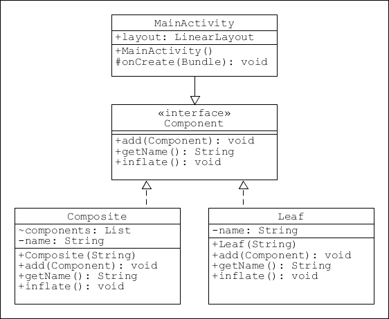
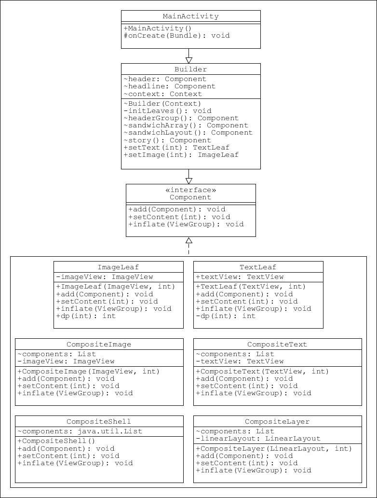
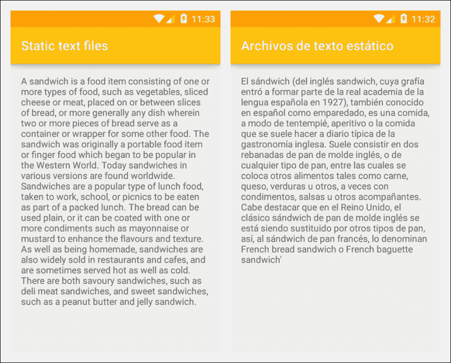
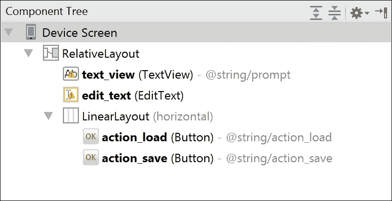
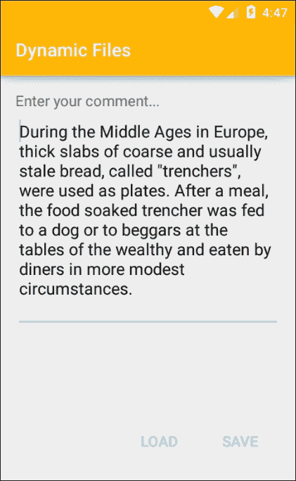
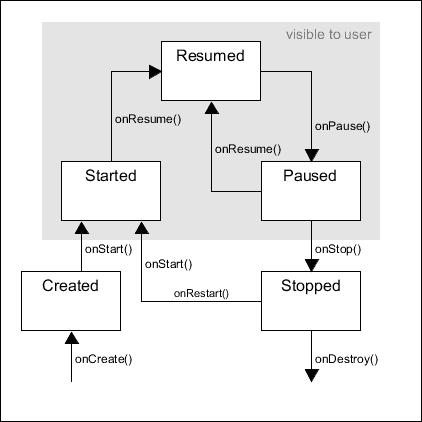
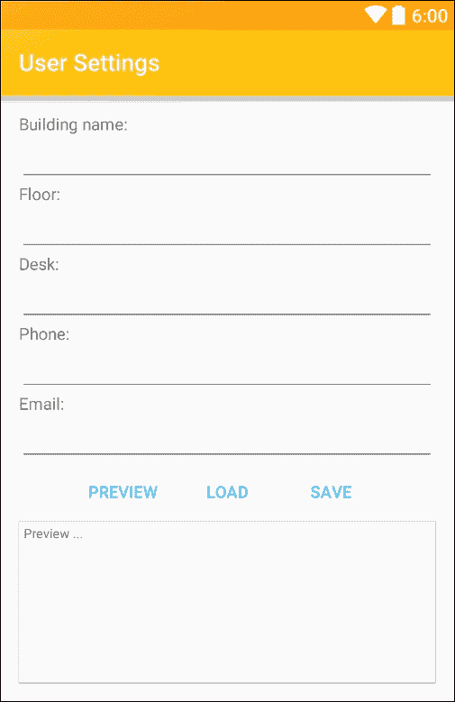
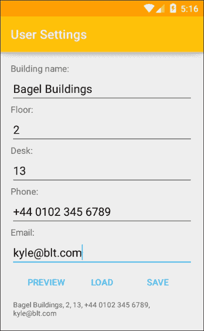

# 第八章：组合模式

我们已经看到如何使用模式来操作、组织和呈现数据，但这些数据是短暂的，我们还没有考虑如何确保数据从一个会话持续到下一个会话。在本章中，我们将探讨如何使用内部数据存储机制来实现这一点。特别是，我们将探索用户如何保存他们的偏好设置，使应用程序更简单、更有趣。在我们开始之前，本章将首先检查组合模式及其用途，尤其是在构建类似于 Android UIs 这样的层次结构时。

在本章中，你将学习如何做到以下几点：

+   构建组合模式

+   使用组合器创建布局

+   使用静态文件

+   编辑应用程序文件

+   存储用户偏好

+   理解活动生命周期

+   添加唯一标识符

我们可以将设计模式应用于 Android 项目的一个最直接的方法是布局膨胀，在第六章《激活模式》中，我们使用了一个构建器模式来膨胀一个简单的布局。这个例子有一些严重的不足之处。它只处理文本视图，并没有考虑嵌套布局。为了使动态布局膨胀对我们真正有用，我们需要能够在布局层次的任何级别上包含任何类型的控件或视图，这正是组合设计模式发挥作用的地方。

# 组合模式

初看起来，组合模式可能与构建器模式非常相似，因为它们都从小型组件构建复杂对象。然而，这些模式在方法上有一个显著的区别。构建器以非常线性的方式工作，一次添加一个对象。而组合模式可以添加对象组以及单个对象。更重要的是，它以这样的方式添加，即客户端可以添加单个对象或对象组，而无需关心它正在处理哪个。换句话说，我们可以使用完全相同的代码添加完成的布局、单个视图或视图组。

除了能够组合分支数据结构的能力之外，隐藏客户端正在操作的对象的细节是使组合器模式如此强大的原因。

在创建布局组合器之前，我们将先看看这个模式本身，应用于一个非常简单的模型，以便我们更好地理解模式的工作原理。这就是整体结构。如您所见，它在概念上非常简单。

按照以下步骤构建我们的组合模式：

1.  从一个接口开始，该接口可以表示单个组件和组件集合，如下所示：

    ```kt
    public interface Component { 

        void add(Component component); 
        String getName(); 
        void inflate(); 
    } 

    ```

1.  添加这个类以扩展单个组件的接口：

    ```kt
    public class Leaf implements Component { 
        private static final String DEBUG_TAG = "tag"; 
        private String name; 

        public Leaf(String name) { 
            this.name = name; 
        } 

        @Override 
        public void add(Component component) { } 

        @Override 
        public String getName() { 
            return name; 
        } 

        @Override 
        public void inflate() { 
            Log.d(DEBUG_TAG, getName()); 
        } 
    } 

    ```

1.  接下来为集合添加类：

    ```kt
    public class Composite implements Component { 
        private static final String DEBUG_TAG = "tag"; 

        // Store components 
        List<Component> components = new ArrayList<>(); 
        private String name; 

        public Composite(String name) { 
            this.name = name; 
        } 

        @Override 
        public void add(Component component) { 
            components.add(component); 
        } 

        @Override 
        public String getName() { 
            return name; 
        } 

        @Override 
        public void inflate() { 
            Log.d(DEBUG_TAG, getName()); 

            // Inflate composites including children 
            for (Component component : components) { 
                component.inflate(); 
            } 
        } 
    } 

    ```

如您在这里看到的，这个模式非常简单，但非常有效：



要查看实际效果，我们需要定义一些组件和组合。我们可以使用如下这样的代码行来定义组件：

```kt
Component newLeaf = new Leaf("New leaf"); 

```

我们可以使用 `add()` 方法创建组合集合，如下所示：

```kt
Component composite1 = new Composite("New composite"); 
composite1.add(newLeaf); 
composite1.add(oldLeaf); 

```

在彼此内部嵌套组合同样简单，因为我们编写的代码使得我们可以忽略我们是创建 `Leaf` 还是 `Composite`，并为两者使用相同的代码。以下是一个示例：

```kt
Component composite2 = Composite("Another composite"); 
composite2.add(someLeaf); 
composite2.add(composite1); 
composite2.add(anotherComponent); 

```

显示一个组件，在这个例子中它仅仅是一段文本，只需调用其 `inflate()` 方法即可。

## 添加构建器

定义并打印出一系列输出的公平选择将导致客户端代码相当混乱，我们将在这里采用的方法是从另一个模式中借鉴一个想法，并使用一个构建器类来完成构建我们所需组合的工作。这些可以是任何我们喜欢的内容，以下是一个可能的构建器：

```kt
public class Builder { 

    // Define individual components 
    Component image = new Leaf("  image view"); 
    Component text = new Leaf("  text view"); 
    Component list = new Leaf("  list view"); 

    // Define composites 
    Component layout1(){ 
        Component c = new Composite("layout 1"); 
        c.add(image); 
        c.add(text); 
        return c; 
    } 

    // Define nested composites 
    Component layout2() { 
        Component c = new Composite("layout 2"); 
        c.add(list); 
        c.add(layout1()); 
        return c; 
    } 

    Component layout3(){ 
        Component c = new Composite("layout 3"); 
        c.add(layout1()); 
        c.add(layout2()); 
        return c; 
    } 
} 

```

这样，我们的活动的 `onCreate()` 方法保持清晰简洁，正如您在这里看到的：

```kt
@Override 
protected void onCreate(Bundle savedInstanceState) { 

    super.onCreate(savedInstanceState); 
    setContentView(R.layout.activity_main); 

```

```kt
    Builder builder = new Builder(); 

    // Inflate a single component 
    builder.list.inflate(); 

    // Inflate a composite component 
    builder.layout1().inflate(); 

    // Inflate nested components 
    builder.layout2().inflate(); 
    builder.layout3().inflate(); 
} 

```

尽管我们只生成了一个基本的输出，但应该清楚我们现在如何将其扩展到充气实际布局，以及这项技术可能有多么有用。

# 布局构建器

在第六章《激活模式》中，我们使用构建器构建了一个简单的 UI。构建器是这项任务的完美选择，因为我们只关心包含一种类型的视图。我们可以通过适配器（字面上）来调整这个方案以适应其他视图类型，但最好使用一种不关心它正在处理哪种类型组件的模式。希望前面的示例展示了组合模式适合这类任务。

在以下示例中，我们将同样的原则应用于一个实际的 UI 充气器，它处理不同类型的视图，视图组合群以及最重要的动态嵌套布局。

为了这个练习的目的，我们将假设我们的应用程序有一个新闻页面。这主要是一个促销特性，但已经证明，当广告装扮成新闻时，消费者更容易接受广告。许多组件，如标题和标志，将保持静态，而其他组件将频繁更改内容和布局结构。这使得它成为我们组合模式的理想主题。

这是我们将要开发的 UI：


## 添加组件

我们将逐个解决问题，一边构建代码。首先，我们将按照以下步骤解决创建和显示单个组件视图的问题：

1.  与之前一样，我们从 `Component` 接口开始：

    ```kt
    public interface Component { 

        void add(Component component); 
        void setContent(int id); 
        void inflate(ViewGroup layout); 
    } 

    ```

1.  现在使用以下类来实现这一点：

    ```kt
    public class TextLeaf implements Component { 
        public TextView textView; 

        public TextLeaf(TextView textView, int id) { 
            this.textView = textView; 
            setContent(id); 
        } 

        @Override 
        public void add(Component component) { } 

        @Override 
        public void setContent(int id) { 
            textView.setText(id); 
        } 

        @Override 
        public void inflate(ViewGroup layout) { 
            layout.addView(textView); 
        } 
    } 

    ```

1.  接下来，添加 `Builder`，目前它非常简单，只包含两个属性和构造函数：

    ```kt
    public class Builder { 
        Context context; 
        Component text; 

        Builder(Context context) { 
            this.context = context; 
            init(); 
            text = new TextLeaf(new TextView(context), 
                    R.string.headline); 
        } 
    } 

    ```

1.  最后，编辑活动的 `onCreate()` 方法，使用我们自己的布局作为根布局，并添加我们的视图，如下所示：

    ```kt
    @Override 
    protected void onCreate(Bundle savedInstanceState) { 

        super.onCreate(savedInstanceState); 

        // Replace default layout 
        LinearLayout layout = new LinearLayout(this); 

        layout.setOrientation(LinearLayout.VERTICAL); 
        layout.setLayoutParams(new ViewGroup.LayoutParams( 
                ViewGroup.LayoutParams.MATCH_PARENT, 
                ViewGroup.LayoutParams.WRAP_CONTENT)); 
        setContentView(layout); 

        // Add component 
        Builder builder = new Builder(this); 
        builder.headline.inflate(layout); 
    } 

    ```

目前我们所做的工作并不令人印象深刻，但通过之前例子的演练，我们会很清楚接下来要做什么，下一步是创建一个处理图像视图的组件。

如以下代码段所示，`ImageLeaf`类几乎与其文本兄弟类相同，唯一的区别在于它生成的视图类型以及使用`setImageResource()`操作`id`参数：

```kt
public class ImageLeaf implements Component { 
    private ImageView imageView; 

    public ImageLeaf(ImageView imageView, int id) { 
        this.imageView = imageView; 
        setContent(id); 
    } 

    @Override 
    public void add(Component component) { } 

    @Override 
    public void setContent(int id) {         
        imageView.setImageResource(id); 
    } 

    @Override 
    public void inflate(ViewGroup layout) { 
        layout.addView(imageView); 
    } 
} 

```

这可以像文本视图一样轻松地添加到构建器中，但现在我们将为此创建一个小方法，并在构造函数中调用它，因为我们可能想要添加许多其他内容。现在代码应该看起来像这样：

```kt
Builder(Context context) { 
    this.context = context; 
    initLeaves(); 
} 

private void initLeaves() { 

    header = new ImageLeaf(new ImageView(context), 
            R.drawable.header); 

    headline = new TextLeaf(new TextView(context), 
            R.string.headline); 
} 

```

正如预期的那样，对于客户端代码来说，这与任何其他组件没有区别，可以使用以下方式来填充它：

```kt
builder.header.inflate(layout); 

```

图像视图和文本视图都可以将它们的主要内容（图像和文本）作为资源 ID 整数，因此我们可以为两者使用相同的`int`参数。在`setContent()`方法中处理这一点可以让我们解耦实际的实现，并允许我们简单地将它们每个都作为`Component`引用。当我们应用一些格式化属性时，`setContent()`方法也会很快证明其有用。

这仍然非常基础，如果我们像这样创建所有组件，无论它们如何组合在一起，构建器代码很快就会变得非常冗长。我们刚刚创建的横幅视图不太可能改变，所以这个系统适合这种设置。然而，对于更易变的内容，我们将需要找到一种更灵活的方法，但在我们这样做之前，我们将了解如何创建我们类的组合版本。

## 创建组合组件

复合模式的真正价值在于其将一组对象视为一个的能力，我们的两个头部视图提供了一个很好的机会来展示如何做到这一点。由于它们总是同时出现，将它们视为一个是有道理的。我们可以通过以下三种方式做到这一点：

+   调整其中一个现有的叶类，使其能够创建子项

+   创建一个没有父级的组合

+   创建一个以布局为父级的组合

我们将了解如何完成所有这些工作，但首先我们将在这种情况下实现最高效的方法，基于我们其中一个叶类创建一个组合类。我们希望标题图像在文本上方，因此我们将使用`ImageLeaf`类作为模板。

完成这项任务只需三个简单步骤：

1.  `CompositeImage`类与`ImageLeaf`完全相同，除了以下例外：

    ```kt
    public class CompositeImage implements Component { 
        List<Component> components = new ArrayList<>(); 

        ... 

        @Override 
        public void add(Component component) { 
            components.add(component); 
        } 

        ... 

        @Override 
        public void inflate(ViewGroup layout) { 
            layout.addView(imageView); 

            for (Component component : components) { 
                component.inflate(layout); 
            } 
        } 
    } 

    ```

1.  在构建器中构建这个组就像这样简单：

    ```kt
    Component headerGroup() { 
        Component c = new CompositeImage(new ImageView(context), 
                R.drawable.header); 
        c.add(headline); 
        return c; 
    } 

    ```

1.  现在我们也可以替换活动中的调用：

    ```kt
    builder.headerGroup().inflate(layout); 

    ```

这也可以像所有其他组件一样处理，制作一个等效的文本版本会非常简单。这些类可以看作是它们叶节点版本的扩展，在这里很有用，但创建一个没有容器的复合组件会更整洁，这将使我们能够组织可以在稍后插入到布局中的组。

下面的类是一个精简的复合类，可用于组合任何组件，包括其他组：

```kt
class CompositeShell implements Component { 
    List<Component> components = new ArrayList<>(); 

    @Override 
    public void add(Component component) { 
        components.add(component); 
    } 

    @Override 
    public void setContent(int id) { } 

    @Override 
    public void inflate(ViewGroup layout) { 

        for (Component component : components) { 
            component.inflate(layout); 
        } 
    } 
} 

```

假设我们想要将三个图像组合在一起，以便稍后添加到布局中。按照当前的代码，我们不得不在构建时添加这些定义。这可能导致代码庞大且不美观。我们将通过为构建器添加方法来解决这一问题，使我们能够按需创建组件。

这两个方法如下：

```kt
public TextLeaf setText(int t) { 
    TextLeaf leaf = new TextLeaf(new TextView(context), t); 
    return leaf; 
} 

public ImageLeaf setImage(int t) { 
    ImageLeaf leaf = new ImageLeaf(new ImageView(context), t); 
    return leaf; 
} 

```

我们可以使用构建器像这样构建这些组：

```kt
Component sandwichArray() { 
    Component c = new CompositeShell(); 

    c.add(setImage(R.drawable.sandwich1)); 
    c.add(setImage(R.drawable.sandwich2)); 
    c.add(setImage(R.drawable.sandwich3)); 
    return c; 

```

这个组可以像其他任何组件一样从客户端处进行填充，因为我们的布局具有垂直方向，所以将显示为列。如果我们希望它们以行输出，我们将需要水平方向，因此需要生成一个类。

## 创建复合布局

这是一个复合组件的代码，它将生成线性布局作为其根布局，并将任何添加的视图放置在其中：

```kt
class CompositeLayer implements Component { 
    List<Component> components = new ArrayList<>(); 
    private LinearLayout linearLayout; 

    CompositeLayer(LinearLayout linearLayout, int id) { 
        this.linearLayout = linearLayout; 
        setContent(id); 
    } 

    @Override 
    public void add(Component component) { 
        components.add(component); 
    } 

    @Override 
    public void setContent(int id) { 
        linearLayout.setBackgroundResource(id); 
        linearLayout.setOrientation(LinearLayout.HORIZONTAL); 
    } 

    @Override 
    public void inflate(ViewGroup layout) { 
        layout.addView(linearLayout); 

        for (Component component : components) { 
            component.inflate(linearLayout); 
        } 
    } 
} 

```

在构建器中构建此类的代码与其他代码没有区别：

```kt
Component sandwichLayout() { 
    Component c = new CompositeLayer(new LinearLayout(context), 
            R.color.colorAccent); 
    c.add(sandwichArray()); 
    return c; 
} 

```

现在我们可以通过在活动中编写少量清晰易懂的代码来填充我们的组合：

```kt
Builder builder = new Builder(this); 
builder.headerGroup().inflate(layout); 
builder.sandwichLayout().inflate(layout); 

```

值得注意的是，我们是如何使用复合层的`setContent()`方法来设置方向的。从整体结构来看，这显然是正确的位置，这也引出了我们的下一个任务，格式化用户界面。

## 运行时格式化布局

尽管我们现在有能力生成任意数量的复杂布局，但快速查看以下输出可以看出，在外观和设计方面，我们距离理想的设计还有很长的路要走：


我们之前看到过如何通过其`setContent()`方法设置插入布局的方向，这样我们就可以更控制组件的外观。进一步这样做只需一两分钟就能产生一个可接受的布局。只需遵循以下简单步骤：

1.  首先，编辑`TextLeaf`的`setContent()`方法，如下所示：

    ```kt
    @Override 
    public void setContent(int id) { 

        textView.setText(id); 

        textView.setPadding(dp(24), dp(0), dp(0), dp(16)); 
        textView.setTextSize(TypedValue.COMPLEX_UNIT_SP, 24); 
        textView.setLayoutParams(new ViewGroup.LayoutParams( 
                ViewGroup.LayoutParams.MATCH_PARENT, 
                ViewGroup.LayoutParams.WRAP_CONTENT)); 
    } 

    ```

1.  这还需要以下将 px 转换为 dp 的方法：

    ```kt
    private int dp(int px) { 
        float scale = textView.getResources() 
                .getDisplayMetrics() 
                .density; 
        return (int) (px * scale + 0.5f); 
    } 

    ```

1.  `ImageLeaf`组件只需要这些更改：

    ```kt
    @Override 
    public void setContent(int id) { 
        imageView.setScaleType(ImageView.ScaleType.FIT_CENTER); 

        imageView.setLayoutParams(new ViewGroup.LayoutParams( 
                ViewGroup.LayoutParams.WRAP_CONTENT, 
                dp(R.dimen.imageHeight))); 

        imageView.setImageResource(id); 
    } 

    ```

1.  我们还为构建器添加了更多的构造，如下所示：

    ```kt
    Component story(){ 
        Component c = new CompositeText(new TextView(context) 
                ,R.string.story); 
        c.add(setImage(R.drawable.footer)); 
        return c; 
    } 

    ```

1.  这可以通过在活动中添加以下几行代码来实现：

    ```kt
    Builder builder = new Builder(this); 

    builder.headerGroup().inflate(layout); 
    builder.sandwichLayout().inflate(layout); 
    builder.story().inflate(layout); 

    ```

这些调整现在应该能产生符合我们原始规格的设计。尽管我们添加了大量代码并创建了特定的 Android 对象，但查看以下图表将显示整体模式保持不变：



我们在这里还可以做更多的事情，例如，处理开发横屏布局和针对不同屏幕配置的缩放问题，所有这些都可以使用相同的方法简单地管理。然而，我们已经做得足够了，可以展示如何使用组合模式在运行时动态构建布局。

我们现在将暂时放弃这种模式，去探索如何提供一些定制功能，并考虑用户偏好以及我们如何存储持久数据。

# 存储选项

几乎所有的应用程序都有某种形式的**设置**菜单，允许用户存储经常访问的信息，并根据个人偏好定制应用程序。这些设置可以是更改密码、个性化颜色方案，或者是许多其他的调整和修改。

如果你拥有大量数据并且可以访问网络服务器，通常最好是从这个来源缓存数据，这将节省电池消耗并加快应用程序的运行速度。

首先我们应该考虑这些设置如何为用户节省时间。没有人希望在每次订购三明治时都输入所有详细信息，也不希望一次又一次地构建同一个三明治。这引出了一个问题，即我们如何在系统中表示三明治，以及如何将订单信息发送给供应商并接收。

无论我们采用哪种技术来传输订单数据，我们都可以假设在这个过程中某个时刻会有一个人类实际制作三明治。一个简单的文本字符串似乎是我们所需要的全部，它当然足以作为供应商的指令以及存储用户喜好。然而，这里有一个宝贵的机会，错过它将是愚蠢的。每个放置的订单都包含有价值的销售数据，通过汇总这些数据，我们可以了解哪些产品卖得好，哪些不好。因此，我们需要在订单信息中尽可能多地包含数据。购买历史可以包含许多有用的数据，购买的时间和日期也是如此。

无论我们选择收集哪些支持数据，有一件事将非常有用，那就是能够识别单个客户，但人们不喜欢透露个人信息，他们也不应该透露。没有理由为了买一个三明治而需要提供出生日期或性别。然而，正如我们将会看到的，我们可以为每个下载的应用程序和/或运行它的设备附加一个唯一的标识符。此外，我们或其他人无法从这些信息中识别个人，因此这对他们的安全或隐私没有威胁，保护这些是至关重要的。

我们有几种方法可以在用户的设备上存储数据，以便属性在会话之间持久化。通常，我们希望这些数据保持私密，在下一节中，我们将了解如何实现这一点。

## 创建静态文件

在本章的这一部分，我们的主要关注点是存储用户偏好。在开始之前，我们应该看看一两个其他的存储选项，首先从设备的内部存储开始。

在本章的前半部分，我们使用了`strings.xml`值文件分配了一个相当长的字符串。这类资源文件最适合存储单个单词和短句，但用于存储长句或段落则显得不太吸引人。在这种情况下，我们可以使用文本文件，并将其存储在`res/raw`目录中。

`raw`目录的方便之处在于，它作为`R`类的一部分被编译，这意味着它的内容可以像引用任何其他资源（如字符串或可绘制资源）一样引用，例如`R.raw.some_text`。

要了解如何在不弄乱字符串文件的情况下包含长文本，请按照以下简单步骤操作：

1.  默认情况下不包含`res/raw`文件夹，因此首先创建它。

1.  在这个文件夹中创建一个包含你文本的新文件。这里，它被称为`wiki`，因为它取自三明治的维基百科条目。

1.  打开你的活动或你用来填充布局的任何代码，并添加这个方法：

    ```kt
    public static String readFile(Context context, int resId) { 

        InputStream stream = context.getResources() 
                .openRawResource(R.raw.wiki); 
        InputStreamReader inputReader = new InputStreamReader(stream); 
        BufferedReader bufferedReader = new BufferedReader(inputReader); 
        String line; 
        StringBuilder builder = new StringBuilder(); 

        try { 
            while ((line = bufferedReader.readLine()) != null) { 
                builder.append(line) 
                        .append('\n'); 
            } 
        } catch (IOException e) { 

            return null; 
        } 

        return builder.toString(); 
    } 

    ```

1.  现在只需添加这些行来填充你的视图。

    ```kt
    TextView textView = (TextView) findViewById(R.id.text_view); 
    String data = readFile(this, R.raw.wiki); 
    textView.setText(data); 

    ```

将原始文件夹像其他资源目录一样处理的好处之一是，我们可以为不同的设备或地区创建指定的版本。例如，这里我们创建了一个名为`raw-es`的文件夹，并在其中放入了相同名称的西班牙语文本翻译：



### 提示

如果你使用的是外部文本编辑器，如记事本，你将需要确保文件以`UTF-8`格式保存，以便非拉丁字符能正确显示。

这种资源非常有用，而且非常容易实现，但这种文件是只读的，肯定会有我们想要创建和编辑这类文件的时候。

## 创建和编辑应用程序文件

当然，在这里我们能做的远不止方便地存储长字符串，而且能够在运行时更改这些文件的内容为我们提供了很大的范围。如果没有已经存在的用于存储用户偏好的方便方法，这将是一个很好的选择，而且有时共享偏好结构仍不足以满足我们所有的需求。这是使用这类文件的主要原因之一；另一个是作为定制功能，允许用户制作和存储笔记或书签。编码的文本文件甚至可以被创建者理解并用于重建包含用户喜欢的成分的三明治对象。

我们即将探讨的方法使用了一个内部应用目录，这个目录对设备上的其他应用是隐藏的。在下面的练习中，我们将展示用户如何使用我们的应用存储持久且私密的文本文件。启动一个新项目或打开一个你希望添加内部存储功能的项目，然后按照以下步骤操作：

1.  从创建一个简单的布局开始。基于以下组件树进行设计：

1.  为了简单起见，我们将使用 XML 的 onClick 属性，分别为每个按钮指定代码，使用`android:onClick="loadFile"`和`android:onClick="saveFile"`。

1.  首先，构建`saveFile()`方法：

    ```kt
    public void saveFile(View view) { 

        try { 
            OutputStreamWriter writer = new OutputStreamWriter(openFileOutput(fspc, 0)); 
            writer.write(editText.getText().toString()); 
            writer.close(); 

        } catch (IOException e) { 
            e.printStackTrace(); 
        } 
    } 

    ```

1.  然后制作`loadFile()`方法：

    ```kt
    public void loadFile(View view) { 

        try { 
            InputStream stream = openFileInput(fspc); 

            if (stream != null) { 
                InputStreamReader inputReader = new InputStreamReader(stream); 
                BufferedReader bufferedReader = new BufferedReader(inputReader); 
                String line; 
                StringBuilder builder = new StringBuilder(); 

                while ((line = bufferedReader.readLine()) != null) { 
                    builder.append(line) 
                            .append("\n"); 
                } 

                stream.close(); 
                editText.setText(builder.toString()); 
            } 

        } catch (IOException e) { 
            e.printStackTrace(); 
        } 
    } 

    ```

这个例子非常简单，但它只需要展示以这种方式存储数据的潜力。使用前面的布局，代码很容易测试。



存储用户数据，或我们想要了解的用户数据，这种方式非常方便且安全。我们当然也可以加密这些数据，但这不是本书讨论的内容。Android 框架与其他移动平台相比，安全性并没有更高或更低，由于我们不会存储比偏好设置更敏感的信息，这个系统将完全满足我们的需求。

当然，也可以在设备的外部存储上创建和访问文件，比如微型 SD 卡。这些文件默认是公开的，通常在我们需要与其他应用共享内容时创建。这个过程与我们刚才探讨的类似，因此这里不再赘述。相反，我们将继续使用内置的**SharedPreferences**接口存储用户偏好设置。

# 存储用户偏好设置

我们已经讨论过能够存储用户设置的重要性，并简要思考了我们想要存储的设置。共享偏好设置使用键值对来存储数据，这对于像`name="desk" value="4"`这样的值是合适的，但我们想要存储一些更详细的信息。例如，我们希望用户能够轻松地存储他们最喜欢的三明治以便快速回忆。

这里的第一步是了解 Android 共享偏好设置接口通常如何工作以及应该在何处应用它。

## 活动生命周期

使用**SharedPreferences**接口存储和检索用户偏好设置时，使用键值对来存储和检索基本数据类型。应用这一点非常简单，当询问何时何地执行这些操作时，这个过程才真正变得有趣。这就引出了活动生命周期的话题。

与桌面应用程序不同，移动应用通常不是被用户故意关闭的。相反，它们通常是被导航离开，经常在后台保持半活动状态。在运行时，一个活动将进入各种状态，如暂停、停止或恢复。这些状态每个都有一个关联的回调方法，比如我们非常熟悉的`onCreate()`方法。我们可以使用其中几个来保存和加载用户设置，为了决定使用哪个，我们需要查看生命周期本身：



前面的图表可能有些令人困惑，要了解何时发生什么，编写一些调试代码是最佳方式。包括`onCreate()`在内，在活动的生命周期期间可能会调用七个回调方法：

+   onCreate()

+   onStart()

+   onResume()

+   onPause()

+   onStop()

+   onDestroy()

+   onRestart()

初看起来，从`onDestroy()`方法保存用户设置似乎是有道理的，因为它是最后一个可能的状态。要了解为什么这通常不起作用，打开任何项目并覆盖前面列表中的每个方法，并添加一些调试代码，如这里的示例所示：

```kt
@Override 
public void onResume() { 
    super.onResume(); 
    Log.d(DEBUG_TAG, "Resuming..."); 
} 

```

稍作实验即可发现`onDestroy()`并不总是被调用。为了确保我们的数据得到保存，我们需要从`onPause()`或`onStop()`方法中存储我们的偏好设置。

## 应用偏好设置

要了解偏好设置的存储和检索方式，请启动一个新项目或打开一个现有项目，并按照以下步骤操作：

1.  首先，创建一个名为`User`的新类，如下所示：

    ```kt
    // Singleton class as only one user 
    public class User { 
        private static String building; 
        private static String floor; 
        private static String desk; 
        private static String phone; 
        private static String email; 
        private static User user = new User(); 

        public static User getInstance() { 
            return user; 
        } 

        public String getBuilding() { 
            return building; 
        } 

        public void setBuilding(String building) { 
            User.building = building; 
        } 

        public String getFloor() { 
            return floor; 
        } 

        public void setFloor(String floor) { 
            User.floor = floor; 
        } 

        public String getDesk() { 
            return desk; 
        } 

        public void setDesk(String desk) { 
            User.desk = desk; 
        } 

        public String getPhone() { 
            return phone; 
        } 

        public void setPhone(String phone) { 
            User.phone = phone; 
        } 

        public String getEmail() { 
            return email; 
        } 

        public void setEmail(String email) { 
            User.email = email; 
        } 
    } 

    ```

1.  接下来，根据以下预览创建一个 XML 布局以匹配这些数据：

1.  修改活动，使其实现以下监听器。

    ```kt
    public class MainActivity 
        extends AppCompatActivity 
        implements View.OnClickListener 

    ```

1.  按照通常的方式包含以下字段，并将它们与它们的 XML 对应项相关联：

    ```kt
    private User user = User.getInstance(); 

    private EditText editBuilding; 
    private EditText editFloor; 
    private EditText editDesk; 
    private EditText editPhone; 
    private EditText editEmail; 

    private TextView textPreview; 

    ```

1.  在`onCreate()`方法中本地添加按钮，并设置它们的点击监听器：

    ```kt
    Button actionLoad = (Button) findViewById(R.id.action_load); 
    Button actionSave = (Button) findViewById(R.id.action_save); 
    Button actionPreview = (Button) findViewById(R.id.action_preview); 

    actionLoad.setOnClickListener(this); 
    actionSave.setOnClickListener(this); 
    actionPreview.setOnClickListener(this); 

    ```

1.  创建以下方法，并在`onCreate()`内部调用它：

    ```kt
    public void loadPrefs() { 
        SharedPreferences prefs = getApplicationContext() 
            .getSharedPreferences("prefs", MODE_PRIVATE); 

        // Retrieve settings 
        // Use second parameter if never saved 
        user.setBuilding(prefs.getString("building", "unknown")); 
        user.setFloor(prefs.getString("floor", "unknown")); 
        user.setDesk(prefs.getString("desk", "unknown")); 
        user.setPhone(prefs.getString("phone", "unknown")); 
        user.setEmail(prefs.getString("email", "unknown")); 
    } 

    ```

1.  创建一个如下所示的方法来存储偏好设置：

    ```kt
    public void savePrefs() { 
        SharedPreferences prefs = getApplicationContext().getSharedPreferences("prefs", MODE_PRIVATE); 
        SharedPreferences.Editor editor = prefs.edit(); 

        // Store preferences 
        editor.putString("building", user.getBuilding()); 
        editor.putString("floor", user.getFloor()); 
        editor.putString("desk", user.getDesk()); 
        editor.putString("phone", user.getPhone()); 
        editor.putString("email", user.getEmail()); 

        // Use apply() not commit() 
        // to perform operation in background 
        editor.apply(); 
    } 

    ```

1.  添加`onPause()`方法以调用它：

    ```kt
    @Override 
    public void onPause() { 
        super.onPause(); 
        savePrefs(); 
    } 

    ```

1.  最后，像这样添加点击监听器：

    ```kt
    @Override 
    public void onClick(View view) { 

        switch (view.getId()) { 

            case R.id.action_load: 
                loadPrefs(); 
                break; 

            case R.id.action_save: 
                // Recover data from form 
                user.setBuilding(editBuilding.getText().toString()); 
                user.setFloor(editFloor.getText().toString()); 
                user.setDesk(editDesk.getText().toString()); 
                user.setPhone(editPhone.getText().toString()); 
                user.setEmail(editEmail.getText().toString()); 
                savePrefs(); 
                break; 

            default: 
                // Display as string 
                textPreview.setText(new StringBuilder() 
                        .append(user.getBuilding()).append(", ") 
                        .append(user.getFloor()).append(", ") 
                        .append(user.getDesk()).append(", ") 
                        .append(user.getPhone()).append(", ") 
                        .append(user.getEmail()).toString()); 
                break; 
        } 
    } 

    ```

这里添加了加载和预览功能，仅仅是为了让我们测试代码，但正如你所见，这个过程可以用来存储和检索任何数量的相关信息：



### 提示

如果需要清空偏好设置文件，可以使用`edit.clear()`方法。

通过**工具 | 安卓**菜单访问的 Android 设备监视器，可以很容易地找到并查看我们的共享偏好设置。打开**文件浏览器**，导航到`data/data/com.your_app/shared_prefs/prefs.xml`。它应该看起来像这样：

```kt
<?xml version='1.0' encoding='utf-8' standalone='yes' ?> 
<map> 
    <string name="phone">+44 0102 555 6789</string> 
    <string name="email">kyle@blt.com</string>     <string name="floor">5</string> 
    <string name="desk">13</string>     <string name="user_id"> 
        fbc08fca-f375-4786-9e2d-d610c9cd0377</string> 
    <boolean name="new_user" value="false" />     <string name="building">Bagel Building</string> </map> 

```

尽管共享偏好设置很简单，但它几乎是所有 Android 移动应用程序不可或缺的元素，除了这些明显的优势之外，我们还可以在这里执行一个很酷的技巧。我们可以使用共享偏好设置文件的内容来确定应用程序是否是第一次运行。

## 添加唯一标识符

在收集销售数据时，有一个方法来识别单个客户总是一个好主意。这不必是姓名或任何个人信息，一个简单的 ID 号码可以为数据集增加一个全新的维度。

在许多情况下，我们会使用简单的递增系统，并为每位新客户分配一个比上一个值高一位的数字 ID。当然，在像我们这样的分布式系统中这是不可能的，因为每个安装实例都无法了解可能存在的其他实例数量。在理想情况下，我们会说服所有客户向我们注册，或许通过提供免费三明治的优惠，但除了贿赂客户之外，还有一种相当聪明的技术可以在分布式系统上生成真正唯一的标识符。

**通用唯一标识符**（UUID）是创建唯一值的一种方法，它作为`java.util`的一部分。有几个版本，其中一些基于命名空间，它们本身就是唯一的标识符。我们在这里使用的版本（版本 4）使用随机数生成器。可能会诱人地认为这可能会产生重复，但标识符的构建方式意味着在二十亿年内每秒下载一次，才会有严重重复的风险，所以对于我们三明治销售商来说，这个系统可能已经足够了。

### 提示

我们还可以在这里使用许多其他功能，例如将点击计数器添加到偏好设置中，用它来统计应用程序被访问的次数，以及我们卖出的三明治数量，或者记录消费总额。

欢迎新用户并添加 ID 是我们只想在应用程序首次运行时执行的操作，因此我们将同时添加这两个功能。以下是添加欢迎功能并分配唯一用户 ID 所需的步骤：

1.  向`User`类中添加这两个字段、设置器和获取器：

    ```kt
    private static boolean newUser; 
    private static String userId; 

    ... 

    public boolean getNewUser() { 
        return newUser; 
    } 

    public void setNewUser(boolean newUser) { 
        User.newUser = newUser; 
    } 

    public String getUserId() { 
        return userId; 
    } 

    public void setUserId(String userId) { 
        User.userId = userId; 
    } 

    ```

1.  在`loadPrefs()`方法中添加以下代码：

    ```kt
    if (prefs.getBoolean("new_user", true)) { 
        // Display welcome dialog 
        // Add free credit for new users 
        String uuid = UUID.randomUUID().toString(); 
        prefs.edit().putString("user_id", uuid); 
        prefs.edit().putBoolean("new_user", false).apply(); 
    } 

    ```

我们的应用程序现在可以欢迎并识别每一位用户的。使用共享偏好设置来运行代码的美妙之处在于，这种方法会忽略更新，并且只在应用程序首次运行时执行。

### 提示

创建用户 ID 的一个相对简单但不够优雅的解决方案是使用设备的序列号，可以通过如下代码实现：`user.setId(` **Build.SERIAL** `.toString())`。

# 总结

在本章中，我们讨论了两个完全不同的话题，并涵盖了理论和实践方面的内容。组合模式非常有用，我们看到了它如何轻松地替代其他模式，比如建造者模式。

如果我们对软件必须执行的一些更机械的过程没有掌握，比如文件存储，那么模式将无用武之地。应该清楚，类似列表的数据文件（如我们之前使用的共享首选项）的性质非常适合构建器模式，而更复杂的数据结构可以使用组合模式来处理。

在下一章中，我们将探讨更多非即时性结构，研究当我们的应用程序当前未激活时如何创建服务和向用户发送通知。这将引入观察者模式，无疑您已经以监听器方法的形式遇到过。
