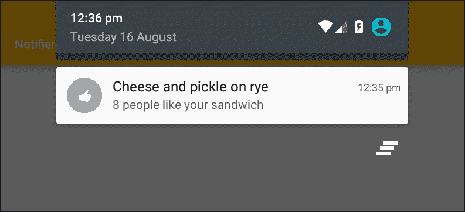
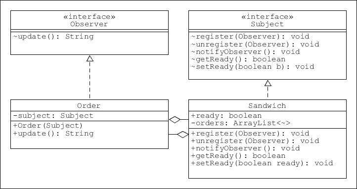
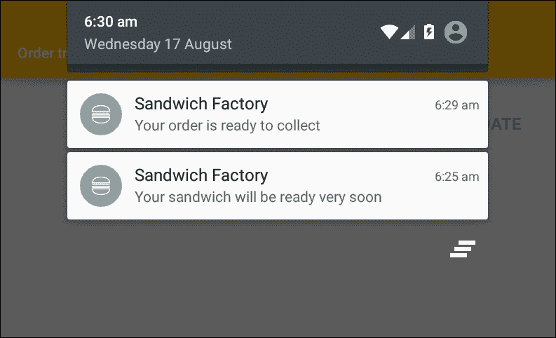
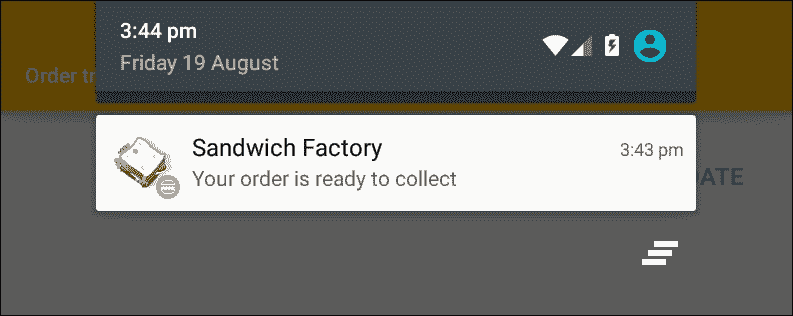
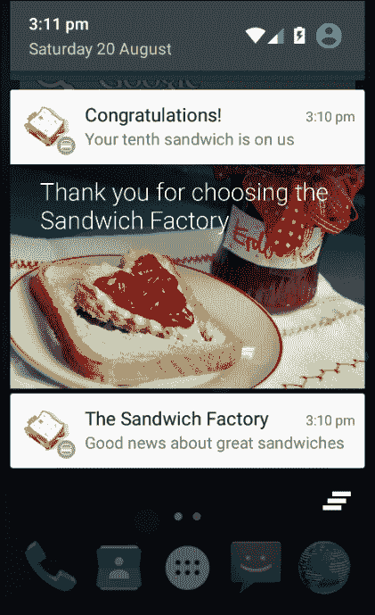
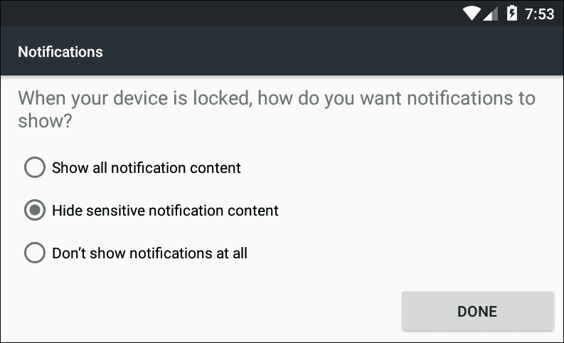
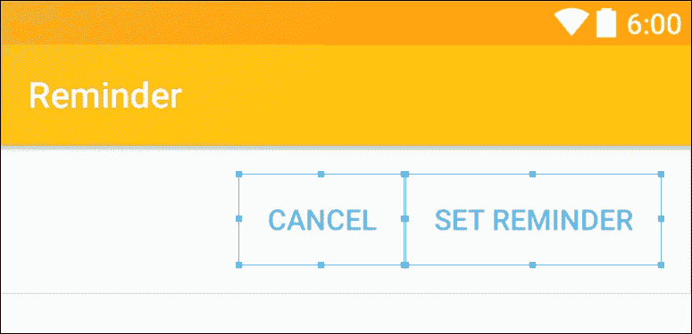

# 第九章：观察模式

在上一章，我们探讨了如何通过允许用户存储经常使用的数据，如位置和饮食偏好，来简化交互。这只是让应用使用尽可能愉快的一种方式。另一种有价值的方法是向用户提供及时的通知。



所有移动设备都有接收通知的机制；通常这些通知是通过屏幕顶部的狭窄状态栏传递的，Android 也不例外。对于我们开发者来说，这个过程之所以有趣，是因为这些通知需要在我们的应用可能并未使用时发送。显然，在活动中没有回调方法来处理此类事件，因此我们将不得不查看如**服务**这样的后台组件来触发此类事件。

就设计模式而言，有一个几乎专为管理一对多关系而设计的模式，即**观察者模式**。尽管它完美适用于通知的发送和接收，但观察者模式在软件设计的各个领域无处不在，你无疑已经遇到了**Observer**和**Observed**的 Java 实用工具。

我们将从观察者模式本身以及 Android 通知的设计、构建和自定义方法开始本章的学习。

在本章中，你将学习如何：

+   创建一个观察者模式

+   发出通知

+   使用 Java 观察者工具

+   应用一个待定意图

+   配置隐私和优先级设置

+   自定义通知

+   创建一个服务

本章主要关注观察者模式，以及如何将其应用于管理通知。最好的起点是查看模式本身，它的目的和结构。

# 观察者模式

你可能没有意识到，其实你已经多次遇到观察者模式，因为每个点击监听器（以及其他任何监听器）实际上都是一个观察者。同样，对于任何桌面或图形用户界面的图标和功能，这些类型的监听器接口非常清晰地展示了观察者模式的目的。

+   观察者像一个哨兵，监视其主体（或主体）的特定事件或状态变化，然后将这些信息报告给感兴趣的相关方。

如已经提到，Java 有自己的观察者工具，尽管在某些情况下它们可能很有用，但 Java 处理继承的方式和模式的简单性使得编写我们自己的版本更为可取。我们将了解如何使用这些内置类，但在大多数示例中，我们将构建自己的版本。这还将提供对模式工作原理的更深入理解。

使用通知时必须谨慎，因为没有什么比不希望收到的消息更能激怒用户了。然而，如果谨慎使用，通知可以提供一个非常有价值的推广工具。秘诀在于允许用户选择加入和退出各种消息流，这样他们只接收他们感兴趣的通知。

## 创建模式

考虑到我们的三明治制作应用，似乎很少有发送通知的机会。如果我们要提供让客户除了外卖还可以取三明治的选项，那么用户可能会感激在他们的三明治准备好时收到通知。

为了在设备间有效通信，我们需要一个带有相关应用程序的中心服务器。我们在这里无法涵盖这一点，但这不会阻止我们了解模式的工作原理以及如何发布通知。

我们将从构建一个简单的观察者模式开始，以及一个基本的通知管理器来跟踪和报告订单进度。

要了解如何执行此操作，请按照以下步骤操作：

1.  观察者模式的核心是一个用于主体的接口和一个用于观察者的接口。

1.  主体接口如下所示：

    ```kt
    public interface Subject { 

        void register(Observer o); 
        void unregister(Observer o); 
        boolean getReady(); 
        void setReady(boolean b); 
    } 

    ```

1.  这是观察者接口：

    ```kt
    public interface Observer { 

        String update(); 
    } 

    ```

1.  接下来，将正在订购的三明治实现为主体，如下所示：

1.  接下来，像这样实现观察者接口：

    ```kt
    public class Sandwich implements Subject { 
        public boolean ready; 

        // Maintain a list of observers 
        private ArrayList<Observer> orders = new ArrayList<Observer>(); 

        @Override 
        // Add a new observer 
        public void register(Observer o) { 
            orders.add(o); 
        } 

        @Override 
        // Remove observer when order complete 
        public void unregister(Observer o) { 
            orders.remove(o); 
        } 

        @Override 
        // Update all observers 
        public void notifyObserver() { 
            for (Observer order : orders) { 
                order.update(); 
            } 
        } 

        @Override 
        public boolean getReady() { 
            return ready; 
        } 

        public void setReady(boolean ready) { 
            this.ready = ready; 
        } 
    } 

    ```

    ```kt
    public class Order implements Observer { 
        private Subject subject = null; 

        public Order(Subject subject) { 
            this.subject = subject; 
        } 

        @Override 
        public String update() { 

            if (subject.getReady()) { 

                // Stop receiving notifications 
                subject.unregister(this); 

                return "Your order is ready to collect"; 

            } else { 
                return "Your sandwich will be ready very soon"; 
            } 
        } 
    } 

    ```

    这完成了模式本身；其结构非常简单，如下所示：

    

在这里，主体完成所有工作。它保存了所有观察者的列表，并为观察者提供订阅和取消订阅更新的机制。在前一个示例中，我们从观察者中在`update()`时调用`unregister()`，一旦订单完成，因为我们的监听器将不再对此主体感兴趣。

`Observer`接口看起来可能过于简单而不必要，但它允许`Sandwich`与其观察者之间进行松耦合，这意味着我们可以独立修改它们中的任何一个。

尽管我们只包含了一个观察者，但应该清楚的是，我们在主体中实现的方法允许任何数量的单独订单并相应地响应。

## 添加通知

`order.update()`方法为我们提供了适当的通知文本。要测试该模式并将通知发送到状态栏，请按照以下步骤操作：

1.  首先，创建一个包含以下嵌套布局的 XML 布局：

    ```kt
    <LinearLayout 
        ... 
        android:layout_alignParentBottom="true" 
        android:layout_centerHorizontal="true" 
        android:gravity="end" 
        android:orientation="horizontal"> 

        <Button 
            android:id="@+id/action_save" 
            style="?attr/borderlessButtonStyle" 
            android:layout_width="wrap_content" 
            android:layout_height="wrap_content" 
            android:minWidth="64dp" 
            android:onClick="onOrderClicked" 
            android:padding="@dimen/action_padding" 
            android:text="ORDER" 
            android:textColor="@color/colorAccent" 
            android:textSize="@dimen/action_textSize" /> 

        <Button 
            android:id="@+id/action_update" 
            ... 
            android:onClick="onUpdateClicked" 
            android:padding="@dimen/action_padding" 
            android:text="UPDATE" 
            ... 
            /> 

    </LinearLayout> 

    ```

1.  打开你的 Java 活动并添加这些字段：

    ```kt
    Sandwich sandwich = new Sandwich(); 
    Observer order = new Order(sandwich); 

    int notificationId = 1; 

    ```

1.  添加监听订单按钮被点击的方法：

    ```kt
    public void onOrderClicked(View view) { 

        // Subscribe to notifications 
        sandwich.register(order); 
        sendNotification(order.update()); 
    } 

    ```

1.  为更新按钮添加一个：

    ```kt
    public void onUpdateClicked(View view) { 

        // Mimic message from server 
        sandwich.setReady(true); 
        sendNotification(order.update()); 
    } 

    ```

1.  最后，添加`sendNotification()`方法：

```kt
private void sendNotification(String message) { 

    NotificationCompat.Builder builder = 
            (NotificationCompat.Builder) 
            new NotificationCompat.Builder(this) 
                    .setSmallIcon(R.drawable.ic_stat_bun) 
                    .setContentTitle("Sandwich Factory") 
                    .setContentText(message); 

    NotificationManager manager = (NotificationManager) 
            getSystemService(NOTIFICATION_SERVICE); 
    manager.notify(notificationId, builder.build()); 

    // Update notifications if needed 
    notificationId += 1; 
} 

```

我们现在可以在设备或模拟器上运行代码：



上面的代码负责发送通知，它展示了发布通知的最简单方式，其中图标和两个文本字段是此操作的最小要求。

### 注意

由于这只是一个演示，观察者模式实际上所做的并不比模拟服务器更多，因此重要的是不要将其与原生的通知 API 调用混淆。

通知 ID 的使用值得注意。这主要用于更新通知。使用相同的 ID 发送通知将更新之前的消息，在前面提到的情况下，实际上我们应该这样做，这里 ID 的递增只是为了演示如何使用它。为了纠正这一点，注释掉该行并重新运行项目，以便只生成一个消息流。

我们还可以并且应该做更多的事情来充分利用这个宝贵的工具，例如在应用不活跃时执行操作并传递通知，我们将在后面的章节回到这些问题，但现在看看 Java 如何提供自己的工具来实现观察者模式是值得的。

## 实用观察者和可观察对象

如前所述，Java 提供了自己的观察者工具，即`java.util.observer`接口和`java.util.observable`抽象类。它们配备了注册、注销和通知观察者的方法。正如通过以下步骤可以看到的，前一个示例可以很容易地使用它们实现：

1.  在这个例子中，主题是通过扩展可观察类来实现的，如下所示：

    ```kt
    import java.util.Observable; 

    public class Sandwich extends Observable { 
        private boolean ready; 

        public Sandwich(boolean ready) { 
            this.ready = ready; 
        } 

        public boolean getReady() { 
            return ready; 
        } 

        public void setReady(boolean ready) { 
            this.ready = ready; 
            setChanged(); 
            notifyObservers(); 
        } 
    } 

    ```

1.  `Order`类是一个观察者，因此实现了这个接口，如下所示：

    ```kt
    import java.util.Observable; 
    import java.util.Observer; 

    public class Order implements Observer { 
        private String update; 

        public String getUpdate() { 
            return update; 
        } 

        @Override 
        public void update(Observable observable, Object o) { 
            Sandwich subject = (Sandwich) observable; 

            if (subject.getReady()) { 
                subject.deleteObserver(this); 
                update = "Your order is ready to collect"; 

            } else { 
                update = "Your sandwich will be ready very soon"; 
            } 
        } 
    } 

    ```

1.  XML 布局和`sendNotification()`方法与之前完全相同，活动中源代码唯一的变化如下所述：

    ```kt
    public class MainActivity extends AppCompatActivity { 
        Sandwich sandwich = new Sandwich(false); 
        Order order = new Order(); 
        private int id; 

        @Override 
        protected void onCreate(Bundle savedInstanceState) 
            { ... } 

        public void onOrderClicked(View view) { 
            sandwich.addObserver(order); 
            sandwich.setReady(true); 
            sendNotification(order.getUpdate()); 
        } 

        public void onUpdateClicked(View view) { 
            sandwich.setReady(true); 
            sendNotification(order.getUpdate()); 
        } 

        private void sendNotification(String message) 
            { ... } 
    } 

    ```

如你所见，这段代码执行的任务与我们的前一个示例相同，值得比较这两个清单。观察者的`setChanged()`和`notifyObservers()`方法替换了我们自定义版本中实现的方法。

你未来采用哪种观察者模式的方法主要取决于特定情况。通常，Java 可观察工具适用于简单情况，如果你不确定，从这种方法开始是个好主意，因为很快你就会看到是否需要更灵活的方法。

以上示例仅介绍了观察者模式和通知。该模式展示了一个非常简单的情况，为了充分发挥其潜力，我们需要将其应用于更复杂的情况。不过首先，我们会看看我们还能用通知系统做些什么。

# 通知

向用户发送简单的字符串消息是通知系统的主要目的，但它还能做更多的事情。首先，通知可以被设置为执行一个或多个操作；通常其中之一是打开相关的应用程序。也可以创建扩展的通知，其中可以包含各种媒体，这对于单行消息无法容纳过多信息的情况非常有用，但我们又想省去用户打开应用程序的麻烦。

从 API 21 开始，已经可以发送弹窗通知和用户锁屏上的通知。这个功能是从其他移动平台上借鉴来的，尽管它显然很有用，但应该谨慎使用。几乎不用说，通知应该只包含相关及时的信息。经验法则是，只有在信息不能等到用户下次登录时才能发出通知。一个有效的通知的例子可能是*你的三明治已经延迟了*，而不是*新款奶酪即将推出*。

除了可能打扰用户的风险，锁屏通知还包含另一个危险。在锁定设备上显示的消息对于所有意图和目的都是公开的。任何经过留在桌上的手机的人都能看到内容。现在尽管大多数人可能不介意他们的老板看到他们喜欢的三明治类型，毫无疑问，你将编写的一些应用程序将包含更敏感的材料，幸运的是 API 提供了可编程的隐私设置。

尽管需要谨慎使用，但通知功能的完整范围仍然值得熟悉，从让通知实际执行某些操作开始。

## 设置意图

与启动活动或其他任何顶级应用组件一样，意图为我们提供了从通知到操作的路径。在大多数情况下，我们希望使用通知来启动活动，这就是我们在这里要做的事情。

移动设备的用户希望能够在活动和应用程序之间轻松快速地移动。当用户在应用程序之间导航时，系统会跟踪其顺序并将其存储在返回栈中。这通常已经足够，但是当用户被通知从应用程序中引开，然后按下返回按钮时，他们不会返回之前参与的应用程序。这很可能会激怒用户，但幸运的是，通过创建一个人工的返回栈可以轻松避免这个问题。

创建我们自己的返回栈并不像听起来那么困难，以下示例证明了这一点。实际上它非常简单，这个例子还详细介绍了如何包含一些其他通知功能，例如更详细的通知图标和当通知首次送达时在状态栏上滚动的提示文本。

按照以下步骤了解如何实现这一点：

1.  打开我们之前工作的项目，并创建一个新的活动类，如下所示：

    ```kt
    public class UserProfile extends AppCompatActivity { 

        @Override 
        protected void onCreate(Bundle savedInstanceState) { 
            super.onCreate(savedInstanceState); 
            setContentView(R.layout.activity_profile); 
        } 
    } 

    ```

1.  接下来，我们需要一个布局文件以匹配之前在`onCreate()`方法中设置的内容视图。这可以留空，只需包含一个根布局。

1.  现在在主活动中的`sendNotification()`方法顶部添加以下行：

    ```kt
    Intent profileIntent = new Intent(this, UserProfile.class); 

    TaskStackBuilder stackBuilder = TaskStackBuilder.create(this); 
    stackBuilder.addParentStack(UserProfile.class); 
    stackBuilder.addNextIntent(profileIntent); 

    PendingIntent pendingIntent = stackBuilder.getPendingIntent(0, 
            PendingIntent.FLAG_UPDATE_CURRENT); 

    ```

1.  在通知构建器中添加这些设置：

    ```kt
    .setAutoCancel(true) 
    .setTicker("the best sandwiches in town") 
    .setLargeIcon(BitmapFactory.decodeResource(getResources(), 
            R.drawable.ic_sandwich)) 
    .setContentIntent(pendingIntent); 

    ```

1.  最后，在清单文件中包含新的活动：

    ```kt
    <activity android:name="com.example.kyle.ordertracker.UserProfile"> 

        <intent-filter> 
            <action android:name="android.intent.action.DEFAULT" /> 
        </intent-filter> 

    </activity> 

    ```

这些更改的效果是显而易见的：



注释掉生成回退堆栈的行，并在使用另一个应用时打开通知，以了解它如何保持直观的导航。`setAutoCancel()`的调用意味着当跟随通知时，状态栏图标会被取消。

通常，我们希望用户从通知中打开我们的应用，但从用户的角度来看，最重要的是以最少的努力完成任务，如果他们不需要打开另一个应用就能获取相同的信息，那么这是件好事。这就是扩展通知的作用所在。

## 定制和配置通知

扩展通知是在 API 16 中引入的。它提供了一个更大、更灵活的内容区域，与其他移动平台保持一致。扩展通知有三种样式：文本、图像和列表。以下步骤将演示如何实现每一种样式：

1.  下一个项目可以从我们之前使用的项目修改，或者从头开始。

1.  编辑主布局文件，使其包含以下三个按钮和观察者方法：

    ```kt
    android:onClick="onTextClicked" 
    android:onClick="onPictureClicked" 
    android:onClick="onInboxClicked" 

    ```

1.  对`sendNotification()`方法进行以下更改：

    ```kt
    private void sendNotification(NotificationCompat.Style style) { 

        ... 

        NotificationCompat.Builder builder = (NotificationCompat.Builder) new NotificationCompat.Builder(this) 

                .setStyle(style) 

                ... 

        manager.notify(id, builder.build()); 
    } 

    ```

1.  现在创建三种样式方法。首先是大型文本样式：

    ```kt
    public void onTextClicked(View view) { 
        NotificationCompat.BigTextStyle bigTextStyle = new NotificationCompat.BigTextStyle(); 

        bigTextStyle.setBigContentTitle("Congratulations!"); 
        bigTextStyle.setSummaryText("Your tenth sandwich is on us"); 
        bigTextStyle.bigText(getString(R.string.long_text)); 

        id = 1; 
        sendNotification(bigTextStyle); 
    } 

    ```

1.  大图片样式需要以下设置：

    ```kt
    public void onPictureClicked(View view) { 
        NotificationCompat.BigPictureStyle bigPictureStyle = new NotificationCompat.BigPictureStyle(); 

        bigPictureStyle.setBigContentTitle("Congratulations!"); 
        bigPictureStyle.setSummaryText("Your tenth sandwich is on us"); 
        bigPictureStyle.bigPicture(BitmapFactory.decodeResource(getResources(), R.drawable.big_picture)); 

        id = 2; 
        sendNotification(bigPictureStyle); 
    } 

    ```

1.  最后添加列表样式或收件箱样式，如下所示：

```kt
public void onInboxClicked(View view) { 
    NotificationCompat.InboxStyle inboxStyle = new NotificationCompat.InboxStyle(); 

    inboxStyle.setBigContentTitle("This weeks most popular sandwiches"); 
    inboxStyle.setSummaryText("As voted by you"); 

    String[] list = { 
            "Cheese and pickle", 
            ... 
    }; 

    for (String l : list) { 
        inboxStyle.addLine(l); 
    } 

    id = 3; 
    sendNotification(inboxStyle); 
} 

```

这些通知现在可以在设备或 AVD 上进行测试：



最新的通知将始终展开，其他通知可以通过向下轻扫来展开。与大多数材料列表一样，可以通过水平轻扫来消除通知。

这些功能在通知设计上为我们提供了很大的灵活性，如果我们想要做更多，甚至可以自定义它们。通过向构建器传递一个 XML 布局，可以非常简单地完成此操作。为此，我们需要 RemoteViews 类，它是一种布局填充器。创建一个布局，然后在代码中包含以下行以实例化它：

```kt
RemoteViews expandedView = new RemoteViews(this.getPackageName(), R.layout.notification); 

```

然后将其传递给构建器：

```kt
builder.setContent(expandedView); 

```

在实现 Android 通知方面，我们需要了解的是如何发出弹窗通知和锁定屏幕通知。这更多的是关于设置优先级和用户权限及设置，而不是编码。

## 可见性和优先级

通知显示的位置和方式通常取决于两个相关属性：隐私和重要性。这些是通过元数据常量应用的，也可以包括如*闹钟*和*促销*等类别，系统可以使用这些类别对多个通知进行排序和过滤。

当涉及到向用户锁屏发送通知时，不仅是我们如何设置元数据，还取决于用户的安全设置。为了查看这些通知，用户必须选择一个安全的锁，如 PIN 码或手势，然后在**安全 | 通知**设置中选择以下选项之一：



只要用户设置了这些选项，我们的通知就会被发送到用户的锁屏。为了保护用户的隐私，我们可以通过构建器设置通知的可见性。有三个值可供选择：

+   `VISIBILITY_PUBLIC` - 显示整个通知

+   `VISIBILITY_PRIVATE` - 显示标题和图标但隐藏内容

+   `VISIBILITY_SECRET` - 完全不显示任何内容

要实现这些设置之一，请使用如下代码行：

```kt
builder.setVisibility(NotificationCompat.VISIBILITY_PUBLIC) 

```

顶部提醒会在屏幕顶部以基本（折叠）通知的形式出现五秒钟，然后恢复到状态栏图标，以此来提醒用户其重要性。它们只应用于需要用户立即注意的信息。这是通过优先级元数据控制的。

默认情况下，每个通知的优先级是 PRIORITY_DEFAULT。五个可能的值分别是：

+   `PRIORITY_MIN` = -2

+   `PRIORITY_LOW` = -1

+   `PRIORITY_DEFAULT` = 0

+   `PRIORITY_HIGH` = 1

+   `PRIORITY_MAX` = 2

这些也可以通过构建器设置，例如：

```kt
builder.setPriority(NotificationCompat.PRIORITY_MAX) 

```

任何大于 DEFAULT 的值都会触发顶部提醒，前提是同时触发声音或振动。这也可以通过我们的构建器添加，形式如下：

```kt
builder.setVibrate(new long[]{500, 500, 500}) 

```

振动器类接收一个长整型数组，并将其作为毫秒级的振动脉冲，因此前面的例子会振动三次，每次半秒钟。

在应用中的任何位置包含设备振动都需要在安装时获得用户权限。这些权限会作为根元素的直接子元素添加到清单文件中，如下所示：

```kt
<manifest  
    package="com.example.yourapp"> 

    <uses-permission  
        android:name="android.permission.VIBRATE" /> 

    <application 

        ... 

    </application> 

</manifest> 

```

关于显示和配置通知，我们还需要了解的并不多。然而，到目前为止，我们一直在应用内部发出通知，而不是像在野外那样远程发出。

# 服务

服务是顶级应用组件，如活动。它们的目的是管理长时间运行的背景任务，如播放音频或触发提醒或其他计划事件。服务不需要 UI，但在其他方面与活动类似，具有类似的生命周期和相关的回调方法，我们可以使用它们来拦截关键事件。

尽管所有服务一开始都是相同的，但它们基本上分为两类：绑定和非绑定。与活动绑定的服务将继续运行，直到收到停止指令或绑定活动停止。而非绑定的服务，无论调用活动是否活跃，都会继续运行。在这两种情况下，服务通常负责在完成分配的任务后自行关闭。

下面的示例演示了如何创建一个设置提醒的服务。该服务会在设定的延迟后发布通知，或者由用户操作取消。要了解如何实现这一点，请按照以下步骤操作：

1.  首先创建一个布局。这将需要两个按钮：

1.  在两个按钮中都包含 onClick 属性：

    ```kt
    android:onClick="onReminderClicked" 
    android:onClick="onCancelClicked" 

    ```

1.  创建一个新的类来扩展 Service：

    ```kt
    public class Reminder extends Service 

    ```

1.  `onBind()`方法虽然会被要求实现，但我们不需要它，所以可以像这样保留：

    ```kt
    @Override 
    public IBinder onBind(Intent intent) { 
        return null; 
    } 

    ```

1.  我们不会使用`onCreate()`或`onDestroy()`方法，但是了解后台活动的行为总是有用的，所以像这样完成方法：

    ```kt
    @Override 
    public void onCreate() { 
        Log.d(DEBUG_TAG, "Service created"); 
    } 

    @Override 
    public void onDestroy() { 
        Log.d(DEBUG_TAG, "Service destroyed"); 
    } 

    ```

1.  该类将需要以下字段：

    ```kt
    private static final String DEBUG_TAG = "tag"; 
    NotificationCompat.Builder builder; 
    @Override 
    public int onStartCommand(Intent intent, int flags, int startId) { 
        Log.d(DEBUG_TAG, "Service StartCommand"); 

        // Build notification 
        builder = new NotificationCompat.Builder(this) 
                .setSmallIcon(R.drawable.ic_bun) 
                .setContentTitle("Reminder") 
                .setContentText("Your sandwich is ready to collect"); 

        // Issue timed notification in separate thread 
        new Thread(new Runnable() { 

            @Override 
            public void run() { 
                Timer timer = new Timer(); 
                timer.schedule(new TimerTask() { 

                    @Override 
                    public void run() { 
                        NotificationManager manager = (NotificationManager) 
                                getSystemService(NOTIFICATION_SERVICE); 
                        manager.notify(0, builder.build()); 
                        cancel(); 
                    } 

                // Set ten minute delay 
                }, 1000 * 60 * 10); 

                // Destroy service after first use 
                stopSelf(); 
            } 

        }).start(); 

        return Service.START_STICKY; 
    } 

    ```

1.  将服务添加到清单文件中，与您的活动并列，如下所示：

    ```kt
    <service 
        android:name=".Reminder" /> 

    ```

1.  最后，打开您的 main Java 活动，并完成这两个按钮的监听器：

    ```kt
    public void onReminderClicked(View view) { 
        Intent intent = new Intent(MainActivity.this, Reminder.class); 
        startService(intent); 
    } 

    public void onCancelClicked(View view) { 
        Intent intent = new Intent(MainActivity.this, Reminder.class); 
        stopService(intent); 
    } 

    ```

上面的代码演示了如何使用服务在后台运行代码。在许多应用程序中，这是一个非常重要的功能。我们唯一真正需要考虑的是确保当不再需要时，所有的服务都能正确地被释放，因为服务特别容易遭受内存泄漏。

# 总结

在本章中，我们看到了观察者模式如何作为一个工具来管理用户通知的传递，以及跟踪许多其他事件并相应地作出反应。我们从模式本身开始，然后了解了 Android 通知 API，尽管它们使用系统控制的状态栏和通知抽屉，但它们在设计和应用通知方面给了我们很大的自由度。

在下一章中，我们将以此和其他模式为例，看看如何扩展现有的 Android 组件，并直接应用我们的设计模式。我们还将了解这在开发除手机和平板电脑以外的其他形态因素时如何帮助我们。
