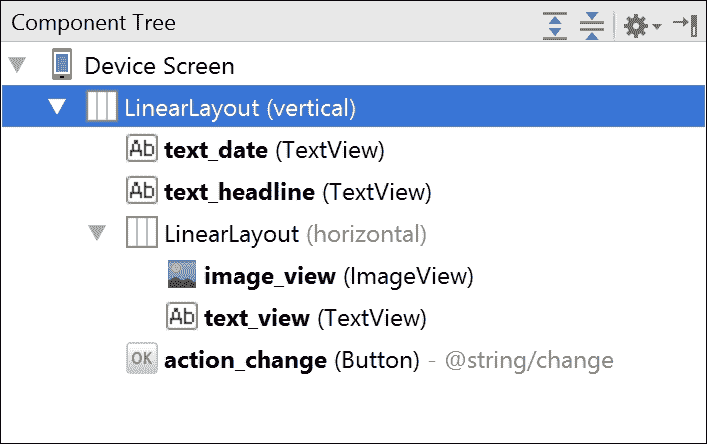
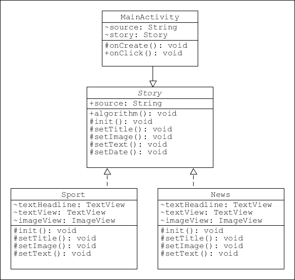
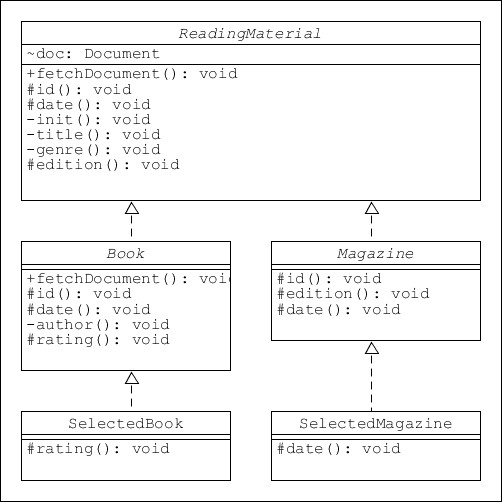
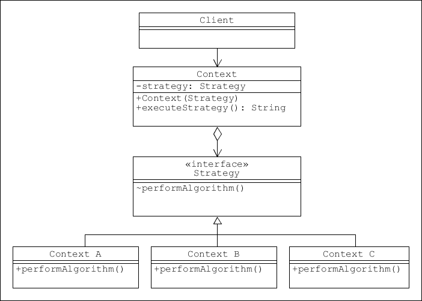
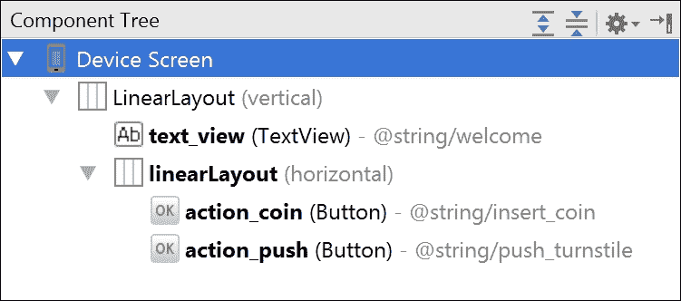
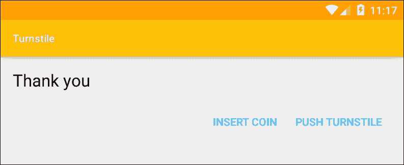
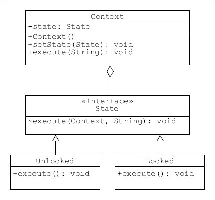

# 第十章：行为模式

到目前为止，在这本书中，我们已经详细研究了许多最重要的创建性和结构性设计模式。这使我们能够构建各种各样的架构，但是为了执行我们所需的任务，这些结构需要能够在自身的元素之间以及与其他结构之间进行通信。

行为模式旨在解决我们在日常开发中遇到的许多通用问题，例如响应特定对象状态的变化或调整行为以适应硬件变化。我们在上一章的观察者模式中已经遇到了一个，在这里我们将进一步了解一些最有用的行为模式。

与创建性和结构性模式相比，行为模式在能够执行的任务类型上具有更高的适应性。虽然这种灵活性很好，但在选择最佳模式时，它也可能使问题复杂化，因为通常会有两三个候选模式可供选择。看看这些模式中的几个，了解它们之间有时微妙的差异，可以帮助我们有效地应用行为模式，这是一个好主意。

在本章中，你将学习如何：

+   创建模板模式

+   向模式中添加专业化层次。

+   应用策略模式

+   构建和使用访问者模式

+   创建一个状态机

这些模式的通用性意味着它们可以应用于大量的不同场景中。它们能够执行的任务类型的一个很好的例子就是点击或触摸监听器，当然还有上一章中的观察者模式。在许多行为模式中经常看到的另一个共同特性是使用抽象类来创建通用算法，正如我们将在本章中看到的**访问者**和**策略模式**以及我们即将探讨的**模板模式**。

# 模板模式

即使你完全不了解设计模式，你也会熟悉模板模式的工作方式，因为它使用抽象类和方法形成一个通用的（模板）解决方案，可以用来创建特定的子类，这正是 OOP 中抽象意图的使用方式。

最简单的模板模式不过是抽象类形式的泛化，至少有一个具体的实现。例如，模板可能定义了一个空的布局，而其实现则控制内容。这种方法的一个很大的优点是，公共元素和共享逻辑只需在基类中定义，这意味着我们只需要在我们实现之间不同的地方编写代码。

如果在基础类中增加一层抽象，模板模式可以变得更加强大和灵活。这些可以作为其父类的子类别，并类似地对待。在探索这些多层次的模式之前，我们将先看一个最简单的基模板例子，它提供了根据其具体实现产生不同输出的属性和逻辑。

一般来说，模板模式适用于可以分解为步骤的算法或任何程序集。这个模板方法在基础类中定义，并通过具体实现来明确。

要理解这个概念，最好的方式是通过例子。这里我们将设想一个简单的新闻源应用，它有一个通用的*故事*模板，以及*新闻*和*体育*的实现。按照以下步骤来创建这个模式：

1.  开始一个新项目，并根据以下组件树创建一个主布局：

1.  创建一个新的抽象类`Story`，作为我们的泛化，如下所示：

    ```kt
            abstract class Story { 
                public String source; 

                // Template skeleton algorithm 
                public void publish(Context context) { 
                    init(context); 
                    setDate(context); 
                    setTitle(context); 
                    setImage(context); 
                    setText(context); 
                } 

                // Placeholder methods 
                protected abstract void init(Context context); 

                protected abstract void setTitle(Context context); 

                protected abstract void setImage(Context context); 

                protected abstract void setText(Context context); 

                // Calculate date as a common property 
                protected void setDate(Context context) { 
                    Calendar calendar = new GregorianCalendar(); 
                    SimpleDateFormat format = 
                         new SimpleDateFormat("MMMM d"); 

                    format.setTimeZone(calendar.getTimeZone()); 

                    TextView textDate = (TextView) 
                        ((Activity) context) 
                        .findViewById(R.id.text_date); 
                    textDate.setText(format.format(calendar.getTime())); 
                } 
            } 

    ```

1.  现在，按照如下方式扩展以创建`News`类：

    ```kt
            public class News extends Story { 
                TextView textHeadline; 
                TextView textView; 
                ImageView imageView; 

                @Override 
                protected void init(Context context) { 
                    source = "NEWS"; 
                    textHeadline = (TextView) ((Activity) context).findViewById(R.id.text_headline); 
                    textView = (TextView) ((Activity) context).findViewById(R.id.text_view); 
                    imageView = (ImageView) ((Activity) context).findViewById(R.id.image_view); 
                } 

                @Override 
                protected void setTitle(Context context) { 
                    ((Activity) context).setTitle(context.getString(R.string.news_title)); 
                } 

                @Override 
                protected void setImage(Context context) { 
                    imageView.setImageResource(R.drawable.news); 
                } 

                @Override 
                protected void setText(Context context) { 
                    textHeadline.setText(R.string.news_headline); 
                    textView.setText(R.string.news_content); 
                } 
            } 

    ```

1.  `Sport`实现是相同的，但有以下例外：

    ```kt
            public class Sport extends Story { 
                ... 

                @Override 
                protected void init(Context context) { 
                    source = "NEWS"; 
                    ... 
                } 

                @Override 
                     protected void setTitle(Context context) { 
                    ((Activity) context).setTitle(context.getString(R.string.sport_title)); 
                } 

                @Override 
                protected void setImage(Context context) { 
                    imageView.setImageResource(R.drawable.sport); 
                } 

                @Override 
                protected void setText(Context context) { 
                    textHeadline.setText(R.string.sport_headline); 
                    textView.setText(R.string.sport_content); 
                } 
            } 

    ```

1.  最后，将这些行添加到主活动中：

    ```kt
    public class MainActivity 
        extends AppCompatActivity 
        implements View.OnClickListener { 

        String source = "NEWS"; 
        Story story = new News(); 

        @Override 
        protected void onCreate(Bundle savedInstanceState) { 
            ... 

            Button button = (Button) 
                findViewById(R.id.action_change); 
            button.setOnClickListener(this); 

            story.publish(this); 
        } 

        @Override 
        public void onClick(View view) { 

            if (story.source == "NEWS") { 
                story = new Sport(); 

            } else { 
                story = new News(); 
            } 

            story.publish(this); 
        } 
    } 

    ```

在真实或虚拟设备上运行这段代码，允许我们在`Story`模板的两个实现之间切换：


这个模板例子既简单又熟悉，但尽管如此，模板可以应用于许多情况，并为组织代码提供了一种非常方便的方法，特别是当需要定义许多派生类时。类图与代码一样直接：



## 扩展模板

当各个实现非常相似时，前面的模式非常有用。但通常情况下，我们想要建模的对象虽然彼此足够相似，以至于可以共享代码，但仍然具有不同类型或数量的属性。一个很好的例子可能是阅读图书馆的数据库。我们可以创建一个名为*阅读材料*的基础类，并拥有合适的属性，这可以用来涵盖几乎任何书籍，无论其类型、内容或年龄。然而，如果我们想要包括杂志和期刊，我们可能会发现我们的模型无法表示这类期刊的多样性。在这种情况下，我们可以创建一个全新的基础类，或者创建新的专门抽象类来扩展基础类，而这些类本身也可以被扩展。

我们将使用上面的例子来演示这个更功能性的模板模式。现在这个模型有三个层次：泛化、专化和实现。由于这里重要的是模式的结构，我们将节省时间并使用调试器输出我们实现的对象。要了解如何将其实际应用，请按照以下步骤操作：

1.  首先，创建一个抽象的基类，如下所示：

    ```kt
    abstract class ReadingMaterial { 

        // Generalization 
        private static final String DEBUG_TAG = "tag"; 
        Document doc; 

        // Standardized skeleton algorithm 
        public void fetchDocument() { 
            init(); 
            title(); 
            genre(); 
            id(); 
            date(); 
            edition(); 
        } 

        // placeholder functions 
        protected abstract void id(); 

        protected abstract void date(); 

        // Common functions 
        private void init() { 
            doc = new Document(); 
        } 

        private void title() { 
            Log.d(DEBUG_TAG,"Title : "+doc.title); 
        } 

        private void genre() { 
            Log.d(DEBUG_TAG, doc.genre); 
        } 

        protected void edition() { 
            Log.d(DEBUG_TAG, doc.edition); 
        } 
    } 

    ```

1.  接下来，为书籍类别创建另一个抽象类：

    ```kt
    abstract class Book extends ReadingMaterial { 

        // Specialization 
        private static final String DEBUG_TAG = "tag"; 

        // Override implemented base method 
        @Override 
        public void fetchDocument() { 
            super.fetchDocument(); 
            author(); 
            rating(); 
        } 

        // Implement placeholder methods 
        @Override 
        protected void id() { 
            Log.d(DEBUG_TAG, "ISBN : " + doc.id); 
        } 

        @Override 
        protected void date() { 
            Log.d(DEBUG_TAG, doc.date); 
        } 

        private void author() { 
            Log.d(DEBUG_TAG, doc.author); 
        } 

        // Include specialization placeholder methods 
        protected abstract void rating(); 
    } 

    ```

1.  `Magazine`类应该如下所示：

    ```kt
    abstract class Magazine extends ReadingMaterial { 

        //Specialization 
        private static final String DEBUG_TAG = "tag"; 

        // Implement placeholder methods 
        @Override 
        protected void id() { 
            Log.d(DEBUG_TAG, "ISSN : " + doc.id); 
        } 

        @Override 
        protected void edition() { 
            Log.d(DEBUG_TAG, doc.period); 
        } 

        // Pass placeholder on to realization 
        protected abstract void date(); 
    } 

    ```

1.  现在我们可以创建具体的实现类。首先是书籍类：

    ```kt
    public class SelectedBook extends Book { 

        // Realization 
        private static final String DEBUG_TAG = "tag"; 

        // Implement specialization placeholders 
        @Override 
        protected void rating() { 
            Log.d(DEBUG_TAG, "4 stars"); 
        } 
    } 

    ```

1.  接着是杂志类：

    ```kt
    public class SelectedMagazine extends Magazine { 

        // Realization 
        private static final String DEBUG_TAG = "tag"; 

        // Implement placeholder method only once instance created 
        @Override 
        protected void date() { 
            Calendar calendar = new GregorianCalendar(); 
            SimpleDateFormat format = new SimpleDateFormat("MM-d-yyyy"); 
            format.setTimeZone(calendar.getTimeZone()); 
            Log.d(DEBUG_TAG,format.format(calendar.getTime())); 
        } 
    } 

    ```

1.  创建一个 POJO 作为假数据，如下所示：

    ```kt
    public class Document { 
        String title; 
        String genre; 
        String id; 
        String date; 
        String author; 
        String edition; 
        String period; 

        public Document() { 
            this.title = "The Art of Sandwiches"; 
            this.genre = "Non fiction"; 
            this.id = "1-23456-789-0"; 
            this.date = "06-19-1993"; 
            this.author = "J Bloggs"; 
            this.edition = "2nd edition"; 
            this.period = "Weekly"; 
        } 
    } 

    ```

1.  现在可以通过以下主活动中的代码测试此模式：

```kt
// Print book 
ReadingMaterial document = new SelectedBook(); 
document.fetchDocument(); 

// Print magazine 
ReadingMaterial document = new SelectedMagazine(); 
document.fetchDocument(); 

```

通过更改虚拟文档代码，可以测试任何实现，并将产生如下输出：

```kt
D/tag: The Art of Sandwiches
D/tag: Non fiction
D/tag: ISBN : 1-23456-789-0
D/tag: 06-19-1963
D/tag: 2nd edition
D/tag: J Bloggs
D/tag: 4 stars
D/tag: Sandwich Weekly
D/tag: Healthy Living
D/tag: ISSN : 1-23456-789-0
D/tag: 09-3-2016
D/tag: Weekly

```

上一个例子简短且简单，但它演示了使模式如此有用和多变的每个特性，如下列表详细说明：

+   基类提供标准化的骨架定义和代码，正如`fetchDocument()`方法所展示的。

+   实现中共同的代码在基类中定义，例如`title()`和`genre()`

+   占位符在基类中定义，用于专门的实现，就像`date()`方法的管理方式一样。

+   派生类可以覆盖占位符方法和已实现的方法；请参阅`rating()`

+   派生类可以使用`super`回调到基类，就像`Book`类中的`fetchDocument()`方法一样。

尽管模板模式一开始可能看起来很复杂，但由于有这么多元素是共享的，因此经过深思熟虑的概括和特殊化可以导致具体类中的代码非常简单和清晰，当我们处理的不仅仅是 一个或两个模板实现时，我们会为此感到庆幸。这种在抽象类中定义的代码集中，在模式类图中可以非常清楚地看到，派生类只包含与其单独相关的代码：



如章节开头所述，在给定情况下通常可以使用多种行为模式，我们之前讨论的模板模式，以及策略模式、访问者模式和状态模式，都适合这个类别，因为它们都是从概括的概要中派生出特殊情况的。这些模式都值得进行一些详细的探讨。

## 策略模式

策略模式与模板模式非常相似，真正的唯一区别在于个体实现创建的时机。模板模式在编译时发生，但策略模式在运行时发生，并且可以动态选择。

策略模式反映变化的发生，其输出取决于上下文，就像天气应用程序的输出取决于位置一样。我们可以在这个演示中使用这个场景，但首先考虑一下策略模式的类图：



使用天气示例可以轻松实现这一点。打开一个新项目，按照以下步骤查看如何操作：

1.  从策略接口开始；它看起来像这样：

    ```kt
    public interface Strategy { 

        String reportWeather(); 
    } 

    ```

1.  按照这里的类创建几个具体实现：

    ```kt
    public class London implements Strategy { 

        @Override 
        public String reportWeather() { 
            return "Constant drizzle"; 
        } 
    } 

    ```

1.  接下来，创建上下文类，这里就是位置：

    ```kt
    public class Location { 
        private Strategy strategy; 

        public Location(Strategy strategy) { 
            this.strategy = strategy; 
        } 

        public void executeStrategy(Context context) { 
            TextView textView=(TextView) 
                    ((Activity)context) 
                    .findViewById(R.id.text_view); 
            textView.setText(strategy.reportWeather()); 
        } 
    } 

    ```

1.  通过用字符串值模拟位置，我们可以使用以下客户端代码测试该模式：

    ```kt
    Location context; 
    String location = "London"; 

    switch (location) { 
        case "London": 
            context = new Location(new London()); 
            break; 
        case "Glasgow": 
            context = new Location(new Glasgow()); 
            break; 
        default: 
            context = new Location(new Paris()); 
            break; 
    } 

    context.executeStrategy(this); 

    ```

正如这个例子所示，策略模式虽然与模板相似，但用于不同的任务，因为它们分别在运行时和编译时应用。

与此同时，除了应用我们自己的模板和策略外，大多数平台还会将其作为系统的一部分应用。在 Android 框架中，策略模式工作中的一个好例子就是每次设备旋转时，都会应用模板为不同设备安装布局。我们很快就会更详细地了解这一点，但首先还有另外两种模式我们需要检查。

# 访问者模式

与模板和策略模式一样，访问者模式足够灵活，可以执行我们迄今为止考虑的任何任务，与其他行为模式一样，关键在于将正确的模式应用于正确的问题。术语“访问者”可能不如“模板”或“策略”那么不言自明。

访问者模式旨在让客户端可以将一个过程应用于一组不相关对象，而无需关心它们之间的差异。一个现实世界的好例子就是我们去超市购物，可能会购买可以扫描条形码的罐装产品，以及需要称重的新鲜商品。这种差异在超市中不需要我们关心，因为收银员会帮我们处理所有这些事情。在这种情况下，收银员充当访问者，做出关于如何处理单个商品的所有必要决策，而我们（客户端）只需考虑最终的账单。

这并不完全符合我们对“访问者”一词的直观理解，但从设计模式的角度来看，这就是它的含义。另一个现实世界的例子是，如果我们希望穿越城镇。在这个例子中，我们可能会选择出租车或公交车。在这两种情况下，我们只关心最终目的地（也许还有费用），而让司机/访问者协商实际路线的细节。

按照以下步骤，看看如何实现一个访问者模式，以模拟之前概述的超市场景：

1.  开始一个新的 Android 项目，并添加以下接口来定义购物项目，如下所示：

    ```kt
    public interface Item { 

        int accept(Visitor visitor); 
    } 

    ```

1.  接下来，创建两个项目示例。首先是罐装食品：

    ```kt
    public class CannedFood implements Item { 
        private int cost; 
        private String name; 

        public CannedFood(int cost, String name) { 
            this.cost = cost; 
            this.name = name; 
        } 

        public int getCost() { 
            return cost; 
        } 

        public String getName() { 
            return name; 
        } 

        @Override 
        public int accept(Visitor visitor) { 
            return visitor.visit(this); 
        } 
    } 

    ```

1.  接着，添加新鲜食品项目类：

    ```kt
    public class FreshFood implements Item { 
        private int costPerKilo; 
        private int weight; 
        private String name; 

        public FreshFood(int cost, int weight, String name) { 
            this.costPerKilo = cost; 
            this.weight = weight; 
            this.name = name; 
        } 

        public int getCostPerKilo() { 
            return costPerKilo; 
        } 

        public int getWeight() { 
            return weight; 
        } 

        public String getName() { 
            return name; 
        } 

        @Override 
        public int accept(Visitor visitor) { 
            return visitor.visit(this); 
        } 
    } 

    ```

1.  现在我们可以添加访问者接口本身，如下所示：

    ```kt
    public interface Visitor { 

        int visit(FreshFood freshFood); 
        int visit(CannedFood cannedFood); 
    } 

    ```

1.  然后，可以将其实现为以下`Checkout`类：

    ```kt
    public class Checkout implements Visitor { 
        private static final String DEBUG_TAG = "tag"; 

        @Override 
        public int visit(CannedFood cannedFood) { 
            int cost = cannedFood.getCost(); 
            String name = cannedFood.getName(); 
            Log.d(DEBUG_TAG, "Canned " + name + " : " + cost + "c"); 
            return cost; 
        } 

        @Override 
        public int visit(FreshFood freshFood) { 
            int cost = freshFood.getCostPerKilo() * freshFood.getWeight(); 
            String name = freshFood.getName(); 
            Log.d(DEBUG_TAG, "Fresh " + name + " : " + cost + "c"); 
            return cost; 
        } 
    } 

    ```

1.  我们现在可以看到模式如何让我们编写干净的客户端代码，如下所示：

    ```kt
    public class MainActivity extends AppCompatActivity { 
        private static final String DEBUG_TAG = "tag"; 

        private int totalCost(Item[] items) { 
            Visitor visitor = new Checkout(); 
            int total = 0; 
            for (Item item : items) { 
                System.out.println(); 
                total += item.accept(visitor); 
            } 
            return total; 
        } 

        @Override 
        protected void onCreate(Bundle savedInstanceState) { 
            super.onCreate(savedInstanceState); 
            setContentView(R.layout.activity_main); 

            Item[] items = new Item[]{ 
                    new CannedFood(65, "Tomato soup"), 
                    new FreshFood(60, 2, "Bananas"), 
                    new CannedFood(45, "Baked beans"), 
                    new FreshFood(45, 3, "Apples")}; 

            int total = totalCost(items); 
            Log.d(DEBUG_TAG, "Total cost : " + total + "c"); 
        } 
    } 

    ```

    这应该会产生如下输出：

    ```kt
    D/tag: Canned Tomato soup : 65c
    D/tag: Fresh Bananas : 120c
    D/tag: Canned Baked beans : 45c
    D/tag: Fresh Apples : 135c
    D/tag: Total cost : 365

    ```

    访问者模式有两个特别的优势。第一个是它使我们不必使用复杂的条件嵌套来区分项目类型。第二个，也是更重要的优势在于，访问者和被访问者是分开的，这意味着可以添加和修改新的项目类型，而无需对客户端进行任何更改。要了解如何做到这一点，只需添加以下代码：

1.  打开并编辑`Visitor`接口，使其包含如下高亮显示的额外行：

    ```kt
    public interface Visitor { 

        int visit(FreshFood freshFood); 
        int visit(CannedFood cannedFood); 

        int visit(SpecialOffer specialOffer); 
    } 

    ```

1.  按如下方式创建一个`SpecialOffer`类：

    ```kt
    public class SpecialOffer implements Item { 
        private int baseCost; 
        private int quantity; 
        private String name; 

        public SpecialOffer(int cost,  
                            int quantity,  
                            String name) { 
            this.baseCost = cost; 
            this.quantity = quantity; 
            this.name = name; 
        } 

        public int getBaseCost() { 
            return baseCost; 
        } 

        public int getQuantity() { 
            return quantity; 
        } 

        public String getName() { 
            return name; 
        } 

        @Override 
        public int accept(Visitor visitor) { 
            return visitor.visit(this); 
        } 
    } 

    ```

1.  在`Checkout`访问者类中按如下方式重载`visit()`方法：

    ```kt
    @Override 
    public int visit(SpecialOffer specialOffer) { 

        String name = specialOffer.getName(); 
        int cost = specialOffer.getBaseCost(); 
        int number = specialOffer.getQuantity(); 
        cost *= number; 

        if (number > 1) { 
            cost = cost / 2; 
        } 

        Log.d(DEBUG_TAG, "Special offer" + name + " : " + cost + "c"); 
        return cost; 
    } 

    ```

正如所示，访问者模式可以扩展以管理任意数量的项目和任意数量的不同解决方案。访问者可以一次使用一个，或者作为一系列处理过程的一部分，并且通常在导入具有不同格式的文件时使用。

我们在本章中看到的所有行为模式都有非常广泛的应用范围，可以用来解决各种软件设计问题。然而，有一个模式的应用范围甚至比这些还要广泛，那就是状态设计模式或状态机。

# 状态模式

状态模式无疑是所有行为模式中最灵活的一个。该模式展示了我们如何在代码中实现**有限状态机**。状态机是数学家艾伦·图灵的发明，他使用它们来实现通用计算机并证明任何数学上可计算的过程都可以机械地执行。简而言之，状态机可以用来执行我们选择的任何任务。

状态设计模式的工作机制简单而优雅。在有限状态机的生命周期中的任何时刻，该模式都知道其自身的内部状态和当前的外部状态或输入。基于这两个属性，机器将产生一个输出（可能没有）并改变其自身的内部状态（可能相同）。信不信由你，通过适当配置的有限状态机可以实现非常复杂算法。

展示状态模式的传统方式是使用在体育场馆或游乐场可能找到的投币式旋转门作为例子。这有两种可能的状态，锁定和解锁，并接受两种形式的输入，即硬币和物理推力。

要了解如何建模，请按照以下步骤操作：

1.  启动一个新的 Android 项目，并构建一个类似于以下布局的界面：

1.  添加以下接口：

    ```kt
    public interface State { 

        void execute(Context context, String input); 
    } 

    ```

1.  接下来是`Locked`状态：

    ```kt
    public class Locked implements State { 

        @Override 
        public void execute(Context context, String input) { 

            if (Objects.equals(input, "coin")) { 
                Output.setOutput("Please push"); 
                context.setState(new Unlocked()); 

            } else { 
                Output.setOutput("Insert coin"); 
            } 
        } 
    } 

    ```

1.  接着是`Unlocked`状态：

    ```kt
    public class Unlocked implements State { 

        @Override 
        public void execute(Context context, String input) { 

            if (Objects.equals(input, "coin")) { 
                Output.setOutput("You have already paid"); 

            } else { 
                Output.setOutput("Thank you"); 
                context.setState(new Locked()); 
            } 
        } 
    } 

    ```

1.  创建以下单例以保存输出字符串：

    ```kt
    public class Output { 
        private static String output; 

        public static String getOutput() { 
            return output; 
        } 

        public static void setOutput(String o) { 
            output = o; 
        } 
    } 

    ```

1.  接下来添加`Context`类，如下所示：

    ```kt
    public class Context { 
        private State state; 

        public Context() { 
            setState(new Locked()); 
        } 

        public void setState(State state) { 
            this.state = state; 
        } 

        public void execute(String input) { 
            state.execute(this, input); 
        } 
    } 

    ```

1.  最后，编辑主活动以匹配以下代码：

    ```kt
    public class MainActivity extends AppCompatActivity implements View.OnClickListener { 
        TextView textView; 
        Button buttonCoin; 
        Button buttonPush; 

        Context context = new Context(); 

        @Override 
        protected void onCreate(Bundle savedInstanceState) { 
            super.onCreate(savedInstanceState); 
            setContentView(R.layout.activity_main); 

            textView = (TextView) findViewById(R.id.text_view); 

            buttonCoin = (Button) findViewById(R.id.action_coin); 
            buttonPush = (Button) findViewById(R.id.action_push); 
            buttonCoin.setOnClickListener(this); 
            buttonPush.setOnClickListener(this); 
        } 

        @Override 
        public void onClick(View view) { 

            switch (view.getId()) { 

                case R.id.action_coin: 
                    context.execute("coin"); 
                    break; 

                case R.id.action_push: 
                    context.execute("push"); 
                    break; 
            } 

            textView.setText(Output.getOutput()); 
        } 
    } 

    ```

这个例子可能很简单，但它完美地展示了这个模式有多么强大。很容易看出同样的方案如何扩展来模拟更复杂的锁定系统，而有限状态机通常用于实现组合锁。正如前面提到的，状态模式可以用来模拟任何可以数学建模的事物。前面的例子很容易测试，也很容易扩展：



状态模式的真正魅力不仅在于它极其灵活，而且在于它在概念上的简单性，这一点在类图上可以看得最清楚：



状态模式，就像本章中的所有模式和其他行为模式一样，具有非常高的灵活性，这种能够适应大量情况的能力源于它们的抽象性质。这可能会使得行为模式在概念上更难以掌握，但通过一些尝试和错误是找到适合各种情境的正确模式的好方法。

# 总结

行为模式在结构上可能非常相似，功能上也有很多重叠，本章大部分内容是理论性的，以便我们可以集体地接近它们。一旦我们熟悉了这些结构，我们就会发现自己会经常在许多情况下返回到它们。

在下一章中，我们将专注于更多技术性的事务，并了解如何为各种可用的表单因子开发应用程序，例如手表和电视屏幕。从我们目前完成的工作来看，我们可以发现如何使用访问者模式等模式来管理这些选择。正如我们已经经历过的，系统为我们管理了大部分这些工作，经常使用它自己的内置模式。尽管如此，在设计模式中，我们仍有很多机会简化并合理化我们的代码。
