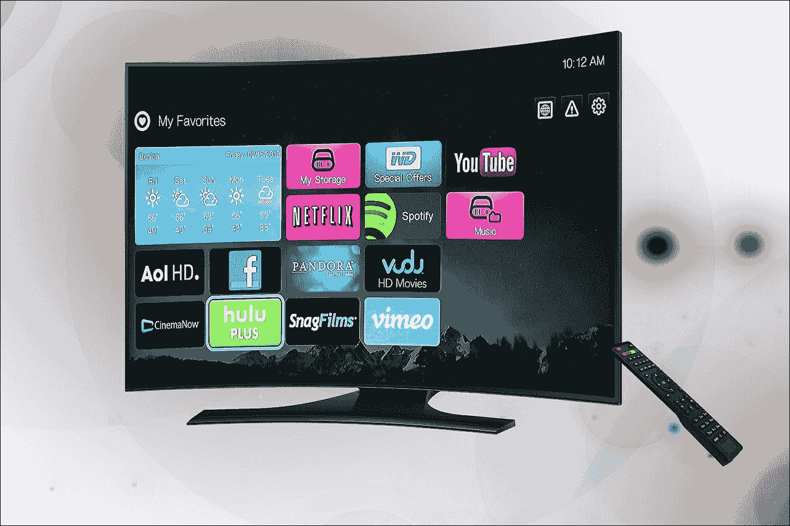
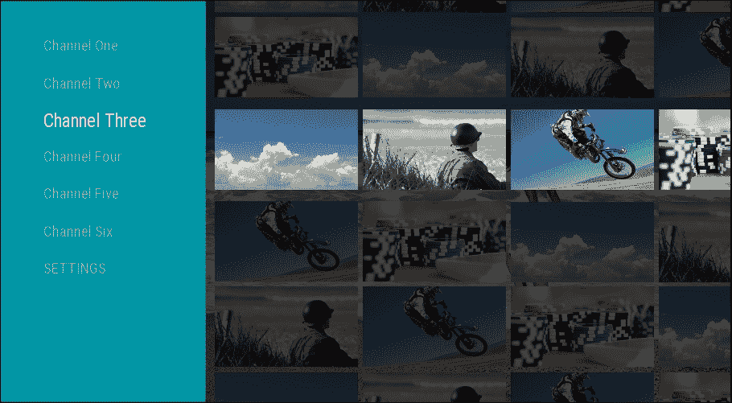
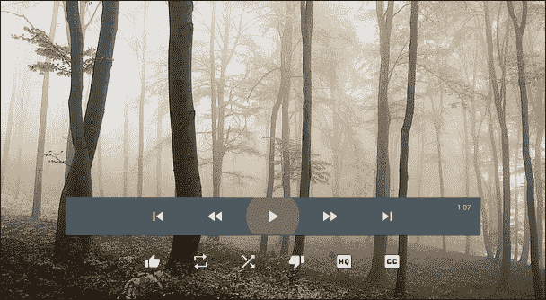
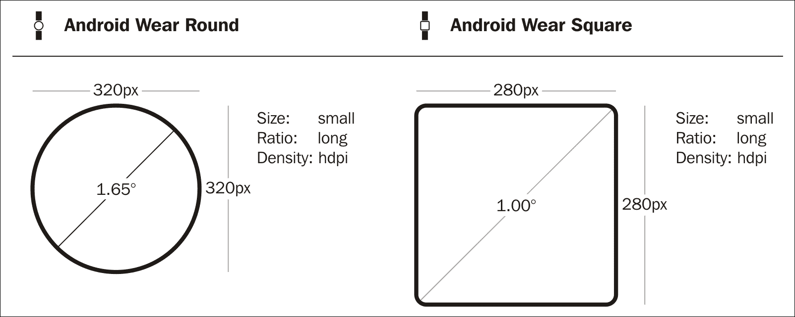
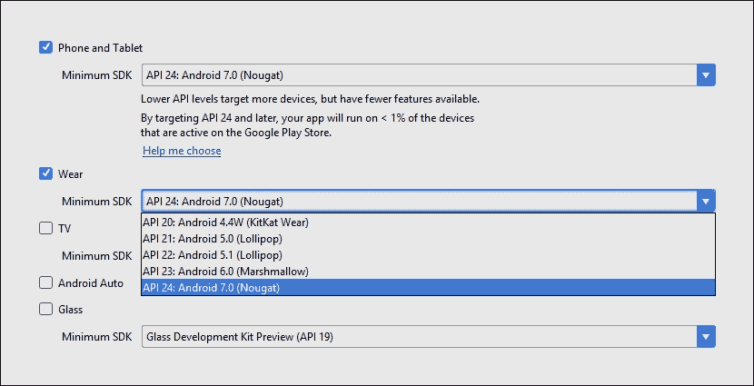
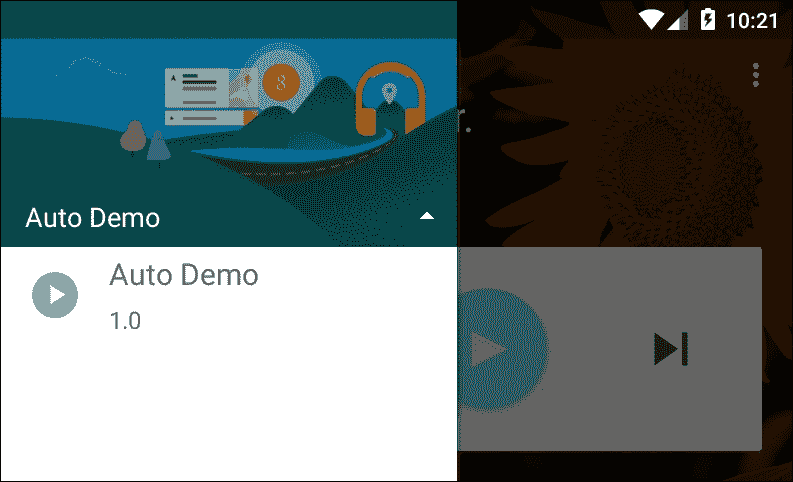

# 第十一章：可穿戴设备模式

迄今为止，在这本书中，我们考虑的所有 Android 应用程序都是为移动设备（如手机和平板电脑）设计的。正如我们所见，框架提供了极大的便利，确保我们的设计能在各种屏幕大小和形状上良好工作。然而，还有三种形态因素是我们至今未涉及的，那就是如手表、车载控制台和电视机等可穿戴设备。



当涉及到将这些设计模式应用于这些替代平台时，我们选择哪种模式取决于应用程序的目的，而不是平台本身。由于我们在上一章中重点讨论了模式，本章将主要涵盖为这些设备类型构建应用程序的实际操作。然而，当我们查看电视应用程序时，会发现它们采用了**模型-视图-呈现者模式**。

由于我们尚未处理编码传感器的部分，章节将包括探索如何读取用户的心率，并让我们的代码对此作出响应。物理传感器（如心率监测器和加速度计）的管理方式非常相似，通过研究其中一个，我们可以了解如何处理其他传感器。

在本章中，你将学习如何：

+   设置电视应用程序

+   使用 leanback 库

+   应用 MVP 模式

+   创建横幅和媒体组件

+   理解浏览器和消费视图

+   连接到可穿戴设备

+   管理可穿戴设备的屏幕形状

+   处理可穿戴设备的通知

+   读取传感器数据

+   理解自动安全特性

+   为媒体服务配置自动应用程序

+   为消息服务配置自动应用程序

在为这个广泛的形态因素开发时，首先要考虑的不仅仅是需要准备图形的大小，还有观看距离。大多数 Android 设备从几英寸远的地方使用，并且经常设计为可旋转、移动和触摸。这里的例外是电视屏幕，通常是从大约 10 英尺远的地方观看。

# 安卓电视

电视通常最适合于观看电影、电视节目和玩游戏等放松活动。然而，在这些活动中仍然有很大的重叠区域，尤其是在游戏方面，许多应用程序可以轻松转换为在电视上运行。观看距离、高清晰度和控制器设备意味着需要做出一些适应，这主要得益于 leanback 支持库的帮助。这个库促进了模型-视图-呈现者（model-view-presenter）设计模式的实现，这是模型-视图-控制器（model-view-controller）模式的一种适应。

对于电视，可以开发各种类型的应用，但其中很大一部分属于两类：游戏和媒体。与通常受益于独特界面和控制的游戏不同，基于媒体的应用通常应使用平台熟悉的和一致的控件和小部件。这就是**leanback 库**发挥作用的地方，它提供了各种详细、浏览器和搜索小部件，以及覆盖层。



leanback 库并不是唯一对电视开发有用的支持库，CardView 和 RecyclerView 也很有用，实际上 RecyclerView 是必需的，因为一些 leanback 类依赖于它。

Android Studio 提供了一个非常实用的电视模块模板，它提供了十几个展示许多基于媒体的电视应用所需功能的类。仔细研究这个模板是非常值得的，因为它是一个相当好的教程。然而，除非项目性质相当通用，否则它不一定是单个项目的最佳起点。如果你计划进行任何原创项目，有必要了解有关如何设置电视项目的一些知识，从设备主屏幕开始。

## 电视主屏幕

主屏幕是 Android TV 用户的入口点。从这里，他们可以搜索内容，调整设置，访问应用和游戏。用户对我们的应用的第一印象将是在这个屏幕上以横幅图像的形式出现。

每个电视应用都有一个横幅图像。这是一个 320 x 180 dp 的位图，应该以简单高效的方式展示我们的应用功能。例如：


横幅也可以包含丰富多彩的摄影图像，但文本应始终保持粗体并尽量简练。然后可以在项目清单中声明横幅。要了解如何进行此操作，以及如何设置其他与电视应用相关的**清单**属性，请按照以下步骤操作：

1.  开始一个新项目，选择**TV**作为**Target Android Device**，选择**Android TV Activity**作为活动模板。

1.  将你的图像添加到 drawable 文件夹中，并命名为`banner`或类似名称。

1.  打开`manifests/AndroidManifest.xml`文件。

1.  删除以下行：

    ```kt
            android:banner="@drawable/app_icon_your_company" 

    ```

1.  编辑开头的`<application>`节点，包含以下高亮行：

    ```kt
            <application 
                android:allowBackup="true" 
                android:banner="@drawable/banner" 
                android:label="@string/app_name" 
                android:supportsRtl="true" 
                android:theme="@style/Theme.Leanback"> 

    ```

1.  在根`<manifest>`节点中，添加以下属性：

    ```kt
            <uses-feature 
                android:name="android.hardware.microphone" 
                android:required="false" /> 

    ```

最后一个`<uses-feature>`节点不是严格必需的，但它将使你的应用适用于没有内置麦克风的老款电视。如果你的应用依赖于语音控制，那么省略这个属性。

我们还需要为我们的主活动声明一个 leanback 启动器，操作如下：

```kt
<intent-filter> 
  <action 
        android:name="android.intent.action.MAIN" /> 
  <category 
        android:name="android.intent.category.LEANBACK_LAUNCHER" /> 
</intent-filter> 

```

如果您仅针对电视构建应用，那么在 Play 商店的电视部分使您的应用可用需要做的就是这些。然而，您可能正在开发可以在其他设备上玩的游戏等应用程序。在这种情况下，请包含以下条款以使其适用于可以旋转的设备：

```kt
<uses-feature 
    android:name="android.hardware.screen.portrait" 
    android:required="false" /> 

```

在这些情况下，您还应该将`android.software.leanback`设置为`required="false"`，并恢复到材料或*appcompat*主题。

您可能想知道为什么我们将横幅声明从主活动移动到整个应用。这并非绝对必要，我们所做的是将一个横幅应用于整个应用，不管它包含多少个活动。除非您希望每个活动都有不同的横幅，否则这通常是最佳做法。

## 电视模型-视图-呈现器模式

Leanback 库是少数几个直接促进设计模式使用的库之一，即模型-视图-呈现器（MVP）模式，它是模型-视图-控制器（MVC）的衍生物。这两种模式都非常简单和明显，有些人可能会说它们实际上并不真正符合模式的定义。即使您以前从未接触过设计模式，您也可能会应用其中一种或两种*架构*。

我们之前简要介绍了 MVC 和 MVP，但回顾一下，在 MVC 模式中，视图和控制器是分开的。例如，当控制器从用户那里接收输入，比如按钮的点击，它会将此传递给模型，模型执行其逻辑并将这些更新的信息转发给视图，然后视图向用户显示这些更改，依此类推。

MVP 模式结合了视图和控制器两者的功能，成为用户和模型之间的中介。这是我们之前在适配器模式中看到过的，特别是回收视图及其适配器的工作方式。

Leanback 呈现器类也与嵌套的视图持有者一起工作，在 MVP 模式方面，视图可以是任何 Android 视图，模型可以是任何我们选择的 Java 对象或对象集合。这意味着我们可以使用呈现器作为我们选择的任何逻辑和任何布局之间的适配器。

尽管这个系统很自由，但在开始项目开发之前，了解一下电视应用开发中的一些约定是值得的。

## 电视应用结构

大多数媒体电视应用提供有限的功能集，这通常就是所需要的一切。大多数情况下，用户希望：

+   浏览内容

+   搜索内容

+   消费内容

Leanback 库为这些提供了片段类。一个典型的**浏览器视图**由`BrowserFragment`提供，模板通过一个简单的示例演示了这一点，以及一个`SearchFragment`：


**消费视图**由`PlaybackOverlayFragment`提供，可能是最简单的视图，包含的元素比 VideoView 和控制按钮多不了多少。

还有一个`DetailsFragment`，它提供特定内容的信息。这个视图的内容和布局取决于主题内容，可以采取你选择的任何形式，常规的材料设计规则同样适用。**设计视图**从消费视图的底部向上滚动：



_Leanback_ 库使得将材料设计引入电视设备变得轻而易举。如果你决定使用其他地方的视图，那么适用于其他地方的同材料规则在这里同样适用。在继续之前，值得一提的是背景图片需要在边缘留出 5%的出血区域，以确保它们能够覆盖所有电视屏幕的边缘。这意味着一个 1280 x 720 像素的图片需要是 1408 x 792 像素。

之前，我们介绍了用于启动应用程序的横幅图像，但我们还需要一种方法来引导用户访问个别内容，尤其是熟悉或相关的内容。

## 推荐卡片

安卓电视主屏幕的顶部行是**推荐行**。这允许用户根据他们的观看历史快速访问内容。内容之所以被推荐，可能是因为它是之前观看内容的延续，或者基于用户的观看历史以某种方式相关。

设计推荐卡片时，我们需要考虑的设计因素寥寥无几。这些卡片由图片或大图标、标题、副标题和应用程序图标构成，如下所示：


在卡片图片的宽高比方面有一定的灵活性。卡片的宽度绝不能小于其高度的 2/3 或超过 3/2。图片内部不能有透明元素，且高度不得小于 176 dp。

### 提示

大面积的白色在许多电视上可能相当刺眼。如果你需要大面积的白色，使用#EEE 而不是#FFF。

如果你查看一下实时安卓电视设置中的推荐行，你会看到每个卡片被选中时，背景图像会发生变化，我们也应该为每个推荐卡片提供背景图像。这些图像必须与卡片上的图像不同，并且是 2016 x 1134 像素，以允许 5%的出血，并确保它们不会在屏幕边缘留下空隙。这些图像也不应有透明部分。


设计如此大屏幕的挑战为我们提供了机会，可以包含丰富多彩、高质量的图像。在这个尺寸范围的另一端是可穿戴设备，空间极为宝贵，需要完全不同的方法。

# 安卓穿戴

可穿戴 Android 应用由于另一个原因也值得特别对待，那就是几乎所有 Android Wear 应用都作为伴侣应用，并与在用户手机上运行的主模块结合工作。这种绑定是一个有趣且直接的过程，许多移动应用可以通过添加可穿戴组件大大增强功能。另一个使可穿戴设备开发变得非常有趣的特点是，有许多激动人心的新型传感器和设备。特别是，许多智能手表中配备的心率监测器在健身应用中已经证明非常受欢迎。

可穿戴设备是智能设备开发中最激动人心的领域之一。智能手机和其他配备一系列新型传感器的可穿戴设备为开发者开启了无数新的可能性。

在可穿戴设备上运行的应用需要连接到在手机上运行的主应用，最好将其视为主应用的一个扩展。尽管大多数开发者至少能接触到一部手机，但可穿戴设备对于仅用于测试来说可能是一个昂贵的选项，特别是因为我们至少需要两部设备。这是因为方形和圆形屏幕处理方式的不同。幸运的是，我们可以创建带有模拟器的 AVD，并将其连接到真实的手机或平板电脑，或者是虚拟设备。

## 与可穿戴设备配对

要最好地了解圆形和方形屏幕管理的区别，首先为每种屏幕创建一个模拟器：



### 提示

还有一个带下巴的版本，但对于编程目的我们可以将其视为圆形屏幕。

您如何配对可穿戴 AVD 取决于您是将其与真实手机还是另一个模拟器配对。如果您使用手机，需要从以下位置下载 Android Wear 应用：

[`play.google.com/store/apps/details?id=com.google.android.wearable.app`](https://play.google.com/store/apps/details?id=com.google.android.wearable.app)

然后找到 `adb.exe` 文件，默认情况下位于 `user\AppData\Local\Android\sdk\platform-tools\`

在此打开命令窗口，并输入以下命令：

```kt
 adb -d forward tcp:5601 tcp:5601 

```

您现在可以启动伴侣应用并按照说明配对设备。

### 注意

您每次连接手机时都需要执行这个端口转发命令。

如果您要将可穿戴模拟器与模拟手机配对，那么您需要一个针对 Google APIs 而不是常规 Android 平台的 AVD。然后您可以下载 `com.google.android.wearable.app-2.apk`。在网上有许多地方可以找到这个文件，例如：[www.file-upload.net/download](http://www.file-upload.net/download)

apk 文件应放在您的 `sdk/platform-tools` 目录中，可以用以下命令安装：

```kt
adb install com.google.android.wearable.app-2.apk

```

现在启动您的可穿戴 AVD，并在命令提示符中输入 `adb devices`，确保两个模拟器都能用类似以下输出显示出来：

```kt
List of devices attached 
emulator-5554   device 
emulator-5555   device

```

输入：

```kt
adb telnet localhost 5554

```

在命令提示符下，其中 `5554` 是手机模拟器。接下来，输入 `adb redir add tcp:5601:5601\.` 现在你可以使用手持式 AVD 上的 Wear 应用连接到手表。

创建 Wear 项目时，你需要包含两个模块，一个用于可穿戴组件，另一个用于手机。



Android 提供了一个 **可穿戴 UI 支持库**，为 Wear 开发者和设计师提供了一些非常有用的功能。如果你使用向导创建了一个可穿戴项目，这将在设置过程中包含。否则，你需要在 `Module: wear` 的 `build.gradle` 文件中包含以下依赖项：

```kt
compile 'com.google.android.support:wearable:2.0.0-alpha3' 
compile 'com.google.android.gms:play-services-wearable:9.6.1' 

```

你还需要在 Module: mobile 构建文件中包含以下这些行：

```kt
wearApp project(':wear') 
compile 'com.google.android.gms:play-services:9.6.1' 

```

## 管理屏幕形状

我们无法提前知道应用将在哪些形状的屏幕上运行，对此有两个解决方案。第一个，也是最明显的，就是为每种形状创建一个布局，这通常是最佳解决方案。如果你使用向导创建了一个可穿戴项目，你会看到模板活动已经包含了这两种形状。

当应用在实际设备或模拟器上运行时，我们仍然需要一种方法来检测屏幕形状，以便知道要加载哪个布局。这是通过 **WatchViewStub** 实现的，调用它的代码必须包含在我们主活动文件的 `onCreate()` 方法中，如下所示：

```kt
@Override 
protected void onCreate(Bundle savedInstanceState) { 
    super.onCreate(savedInstanceState); 
    setContentView(R.layout.activity_main); 

    final WatchViewStub stub = (WatchViewStub) 
            findViewById(R.id.watch_view_stub); 
    stub.setOnLayoutInflatedListener( 
            new WatchViewStub.OnLayoutInflatedListener() { 

        @Override 
        public void onLayoutInflated(WatchViewStub stub) { 
            mTextView = (TextView) stub.findViewById(R.id.text); 
        } 

    }); 
} 

```

这可以在 XML 中如下实现：

```kt
<android.support.wearable.view.WatchViewStub  

    android:id="@+id/watch_view_stub" 
    android:layout_width="match_parent" 
    android:layout_height="match_parent" 
    app:rectLayout="@layout/rect_activity_main" 
    app:roundLayout="@layout/round_activity_main" 
    tools:context=".MainActivity" 
    tools:deviceIds="wear"> 
 </android.support.wearable.view.WatchViewStub> 

```

为每种屏幕形状创建独立布局的替代方法是使用一种本身能感知屏幕形状的布局。这就是 **BoxInsetLayout** 的形式，它会为圆形屏幕调整内边距设置，并且只在该圆圈中最大可能的正方形内定位视图。

BoxInsetLayout 可以像其他任何布局一样使用，作为主 XML 活动中的根 ViewGroup：

```kt
<android.support.wearable.view.BoxInsetLayout 

    android:layout_height="match_parent" 
    android:layout_width="match_parent"> 

    . . .  

</android.support.wearable.view.BoxInsetLayout> 

```

这种方法确实有一些缺点，因为它并不总是能充分利用圆形表盘上的空间，但 BoxInsetLayout 在灵活性方面的不足，通过易用性得到了弥补。在大多数情况下，这根本不是缺点，因为设计良好的 Wear 应用应该只通过简单信息短暂吸引用户的注意力。用户不希望在手表上导航复杂的 UI。我们在手表屏幕上显示的信息应该能够一眼就被吸收，响应动作应该限制在不超过一次点击或滑动。

智能设备的主要用途之一是当用户无法访问手机时接收通知，例如在锻炼时。

## 可穿戴设备通知

在任何移动应用中添加可穿戴通知功能非常简单。回想一下通知是如何从 第九章，*观察模式* 中传递的：

```kt
private void sendNotification(String message) { 

    NotificationCompat.Builder builder = 
            (NotificationCompat.Builder) 
            new NotificationCompat.Builder(this) 
                    .setSmallIcon(R.drawable.ic_stat_bun) 
                    .setContentTitle("Sandwich Factory") 
                    .setContentText(message); 

    NotificationManager manager = 
            (NotificationManager) 
            getSystemService(NOTIFICATION_SERVICE); 
    manager.notify(notificationId, builder.build()); 

    notificationId += 1; 
} 

```

要使通知也发送到配对的穿戴设备，只需将这两行添加到构建器字符串中：

```kt
.extend(new NotificationCompat.WearableExtender() 

.setHintShowBackgroundOnly(true)) 

```

可选的`setHintShowBackgroundOnly`设置允许我们不显示背景卡片而只显示通知。

大多数时候，穿戴设备被用作输出设备，但它也可以作为输入设备，并且当传感器靠近身体时，可以派生出许多新功能，比如许多智能手机中包含的心率监测器。

## 读取传感器

目前大多数智能设备上都配备了越来越多的传感器，智能手表为开发者提供了新的机会。幸运的是，这些传感器编程非常简单，毕竟它们只是另一种输入设备，因此我们使用监听器来*观察*它们。

尽管单个传感器的功能和用途存在很大差异，但读取它们的方式几乎相同，唯一的区别在于它们输出的性质。下面我们将看看许多可穿戴设备上找到的心率监测器：

1.  打开或启动一个 Wear 项目。

1.  打开穿戴模块，并在主活动 XML 文件中添加一个带有 TextView 的 BoxInsetLayout，如下所示：

    ```kt
            <android.support.wearable.view.BoxInsetLayout 

                android:layout_height="match_parent" 
                android:layout_width="match_parent"> 

                <TextView 
                    android:id="@+id/text_view" 
                    android:layout_width="match_parent" 
                    android:layout_height="wrap_content" 
                    android:layout_gravity="center_vertical" />  

            </android.support.wearable.view.BoxInsetLayout> 

    ```

1.  打开穿戴模块中的 Manifest 文件，并在根`manifest`节点内添加以下权限。

    ```kt
            <uses-permission android:name="android.permission.BODY_SENSORS" /> 

    ```

1.  打开穿戴模块中的主 Java 活动文件，并添加以下字段：

    ```kt
            private TextView textView; 
            private SensorManager sensorManager; 
            private Sensor sensor; 

    ```

1.  在活动上实现一个`SensorEventListener`：

    ```kt
            public class MainActivity extends Activity 
                    implements SensorEventListener { 

    ```

1.  实现监听器所需的两个方法。

1.  如下编辑`onCreate()`方法：

    ```kt
            @Override 
            protected void onCreate(Bundle savedInstanceState) { 
                super.onCreate(savedInstanceState); 
                setContentView(R.layout.activity_main); 

                textView = (TextView) findViewById(R.id.text_view); 

                sensorManager = ((SensorManager) 
                        getSystemService(SENSOR_SERVICE)); 
                sensor = sensorManager.getDefaultSensor 
                        (Sensor.TYPE_HEART_RATE); 
            } 

    ```

1.  添加这个`onResume()`方法：

    ```kt
            protected void onResume() { 
                super.onResume(); 

                sensorManager.registerListener(this, this.sensor, 3); 
            } 

    ```

1.  以及这个`onPause()`方法：

    ```kt
            @Override 
            protected void onPause() { 
                super.onPause(); 

                sensorManager.unregisterListener(this); 
            } 

    ```

1.  如下编辑`onSensorChanged()`回调：

    ```kt
            @Override 
            public void onSensorChanged(SensorEvent event) { 
                textView.setText(event.values[0]) + "bpm"; 
            } 

    ```


如你所见，传感器监听器与点击和触摸监听器一样，完全像观察者一样工作。唯一的真正区别是传感器需要显式注册和注销，因为它们默认不可用，并且在完成操作后需要关闭以节省电池。

所有传感器都可以通过传感器事件监听器以相同的方式管理，通常最好在初始化应用时检查每个传感器的存在，方法是：

```kt
 private SensorManager sensorManagerr = (SensorManager) getSystemService(Context.SENSOR_SERVICE); 
    if (mSensorManager.getDefaultSensor(Sensor.TYPE_ACCELEROMETER) != null){ 
      . . . 
    } 
    else { 
    . . .  
} 

```

穿戴设备开启了应用可能性的全新世界，将 Android 带入我们生活的各个方面。另一个例子就是在我们的汽车中使用 Android 设备。

# Android Auto

与 Android TV 一样，Android Auto 可以运行许多最初为移动设备设计的应用。当然，在车载软件中，安全是首要考虑的因素，这也是为什么大多数 Auto 应用主要集中在音频功能上，比如信息和音乐。

### 注意

由于对安全的重视，Android Auto 应用在发布前必须经过严格的测试。

几乎不用说，开发车载应用时安全是首要原则，因此，Android Auto 应用程序几乎都分为两类：音乐或音频播放器和信息传递。

所有应用在开发阶段都需要进行广泛测试。显然，在实车上测试 Auto 应用是不切实际且非常危险的，因此提供了 Auto API 模拟器。这些可以从 SDK 管理器的工具标签中安装。



## Auto 安全考虑因素

许多关于 Auto 安全的规则都是简单的常识，比如避免动画、分心和延迟，但当然需要对这些进行规范化，谷歌也这样做了。这些规则涉及驾驶员注意力、屏幕布局和可读性。最重要的可以在这里找到：

+   Auto 屏幕上不能有动画元素

+   只允许有声广告

+   应用必须支持语音控制

+   所有按钮和可点击控件必须在两秒内响应

+   文本必须超过 120 个字符，并且始终使用默认的 Roboto 字体

+   图标必须是白色，以便系统控制对比度

+   应用必须支持日间和夜间模式

+   应用必须支持语音命令

+   应用特定按钮必须在两秒内响应用户操作

您可以在以下链接找到详尽的列表：

[developer.android.com/distribute/essentials/quality/auto.html](http://developer.android.com/distribute/essentials/quality/auto.html)

重要提示：在发布之前，谷歌会测试这些以及其他一些规定，因此您自己运行所有这些测试是至关重要的。

### 提示

设计适用于日间和夜间模式的应用，并使系统可以控制对比度，以便在不同光线条件下自动保持可读性，这是一个非常详细的课题，谷歌提供了一个非常有用的指南，可以在以下链接找到：[commondatastorage.googleapis.com/androiddevelopers/shareables/auto/AndroidAuto-custom-colors.pdf](http://commondatastorage.googleapis.com/androiddevelopers/shareables/auto/AndroidAuto-custom-colors.pdf)

除了安全和应用类型的限制之外，Auto 应用与我们所探讨的其他应用在设置和配置上的唯一不同。

## 配置 Auto 应用

如果您使用工作室向导来设置 Auto 应用，您会看到，与 Wear 应用一样，我们必须同时包含移动和 Auto 模块。与可穿戴项目不同，这并不涉及第二个模块，一切都可以从移动模块管理。添加 Auto 组件会提供一个配置文件，可以在`res/xml`中找到。例如：

```kt
<?xml version="1.0" encoding="utf-8"?> 
<automotiveApp> 
    <uses name="media" /> 
</automotiveApp> 

```

对于消息应用，我们会使用以下资源：

```kt
    <uses name="media" /> 

```

通过检查模板生成的清单文件，可以找到其他重要的 Auto 元素。无论您选择开发哪种类型的应用，都需要添加以下元数据：

```kt
<meta-data 
    android:name="com.google.android.gms.car.application" 
    android:resource="@xml/automotive_app_desc" /> 

```

您可以想象，音乐或音频提供者需要伴随启动活动的一个服务，而消息应用则需要一个接收器。音乐服务标签如下所示：

```kt
<service 
    android:name=".SomeAudioService" 
    android:exported="true"> 
    <intent-filter> 
        <action android:name="android.media.browse.MediaBrowserService" /> 
    </intent-filter> 
</service> 

```

对于一个消息应用，我们需要一个服务以及两个接收器，一个用于接收消息，一个用于发送消息，如下所示：

```kt
<service android:name=".MessageService"> 
</service> 

<receiver android:name=".MessageRead"> 
    <intent-filter> 
        <action android:name="com.kyle.someapplication.ACTION_MESSAGE_READ" /> 
    </intent-filter> 
</receiver> 

<receiver android:name=".MessageReply"> 
    <intent-filter> 
        <action android:name="com.kyle.someapplication.ACTION_MESSAGE_REPLY" /> 
    </intent-filter> 
</receiver> 

```

车载设备是 Android 开发中增长最快的领域之一，随着免提驾驶变得越来越普遍，这一领域预计将进一步增长。通常，我们可能只想将单个 Auto 功能集成到主要为其他形态因子设计的应用程序中。

与手持和可穿戴设备不同，我们不必过分关注屏幕尺寸、形状或密度，也不必担心特定车辆的制造商或型号。随着驾驶和交通方式的变化，这无疑将在不久的将来发生变化。

# 总结

本章描述的替代形态因子为开发人员以及我们可以创建的应用类型提供了令人激动的新平台。这不仅仅是针对每个平台开发应用程序的问题，完全有可能在单个应用程序中包含这三种设备类型。

以我们之前看过的三明治制作应用为例；我们可以轻松地调整它，让用户在观看电影时下单三明治。同样，我们也可以将订单准备好的通知发送到他们的智能手机或自动控制台。简而言之，这些设备为新的应用程序和现有应用程序的附加功能开辟了市场。

无论我们的创造多么巧妙或多功能，很少有应用程序不能从社交媒体提供的推广机会中受益。一个单一的*tweet*或*like*可以在不花费广告费用的情况下，触及无数的人。

在下一章中，我们将看到向应用程序中添加社交媒体功能是多么容易，以及我们如何将 Web 应用功能构建到 Android 应用中，甚至使用 SDK 的 webkit 和 WebView 构建完整的 Web 应用。
