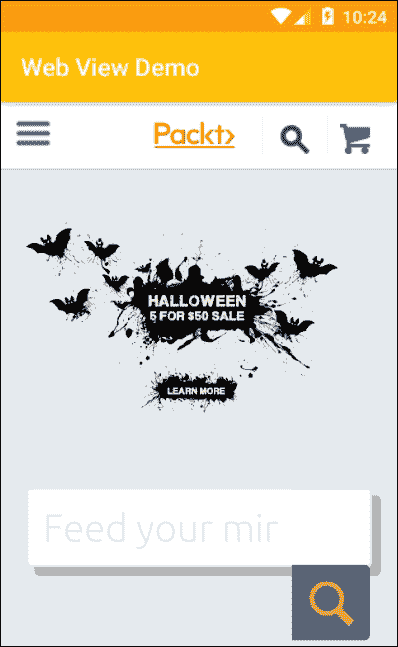
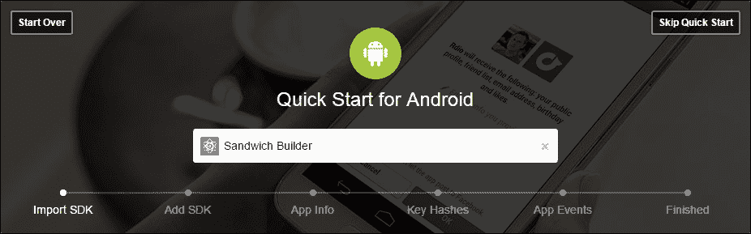
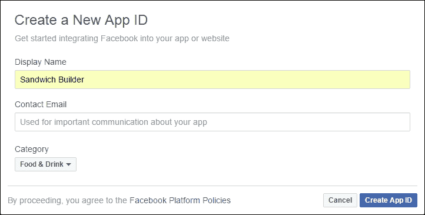
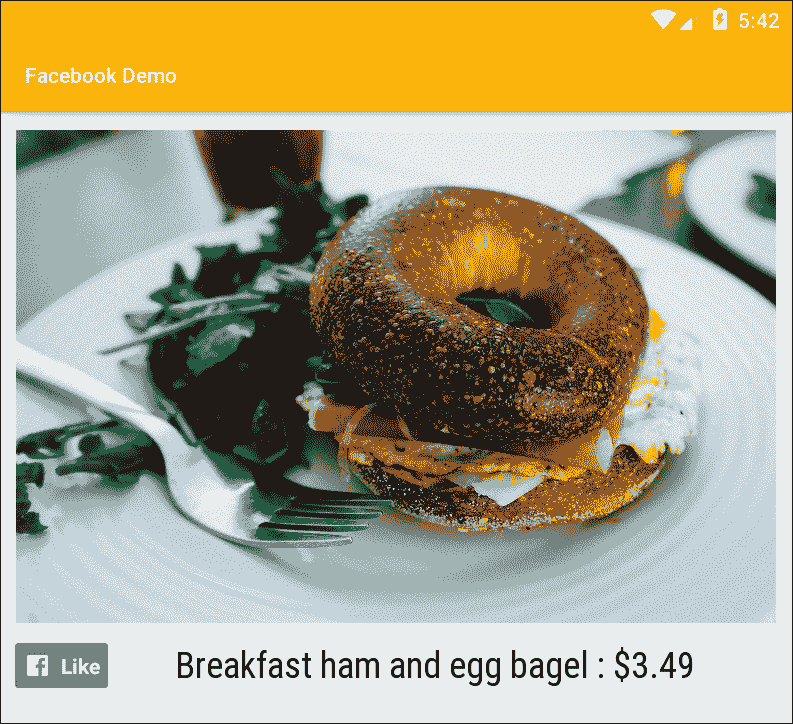
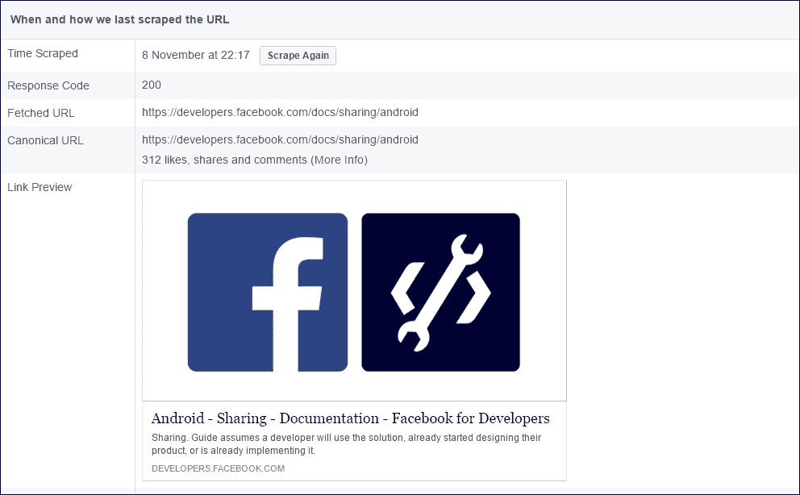
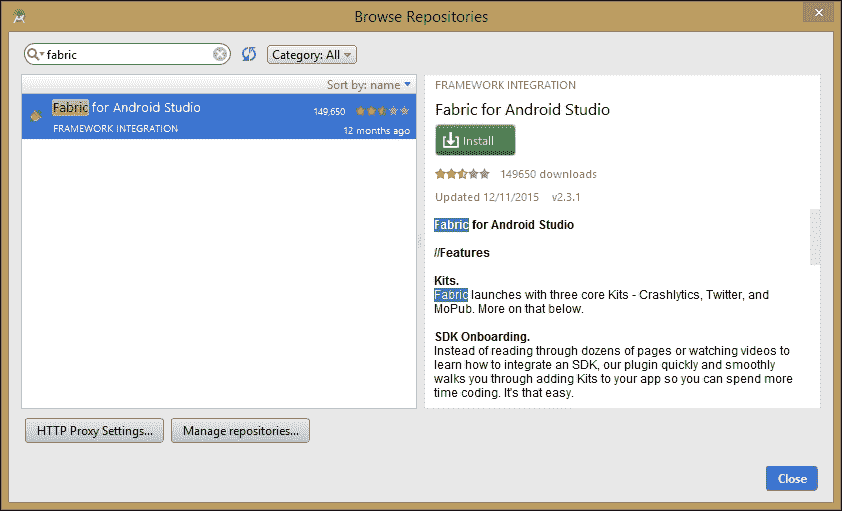

# 第十二章：社交模式

到目前为止，在这本书中我们已经涵盖了移动应用开发的许多方面。然而，即使设计得最好和最有用的应用也可以通过采用社交媒体和其他网页内容获得巨大的好处。

我们在前面章节中介绍的快餐制作应用是一个很好的例子，这个应用可以通过生成 Facebook 点赞和推文来提升其知名度，而这些以及其他社交媒体都提供了直接将这些功能整合到我们应用中的技术。

除了将现有的社交媒体平台整合到我们的应用中，我们还可以使用 **WebView** 类将任何喜欢的网页内容直接嵌入到活动中。这个视图类的扩展可以用来向应用添加单个网页，甚至构建完整的网页应用。当我们的产品或数据需要定期更新时，WebView 类非常有用，因为这样可以实现，无需重新编码和发布更新。

我们将从查看 WebView 类开始本章，并了解如何引入 JavaScript 以赋予页面功能；然后，我们将探索一些社交媒体 SDK，它们允许我们整合许多功能，如分享、发布和点赞。

在本章中，你将学习如何执行以下操作：

+   在 WebView 中打开网页

+   在浏览器中打开网页

+   启用和使用 JavaScript

+   使用 JavaScriptInterface 将脚本与原生代码绑定

+   为网页应用编写高效的 HTML

+   创建一个 Facebook 应用

+   添加一个 LikeView 按钮

+   创建一个 Facebook 分享界面

+   集成 Twitter

+   发送推文

# 添加网页

使用 WebView 类在活动或片段中包含单个网页几乎和添加其他类型的视图一样简单。以下是三个简单步骤：

1.  在清单中添加以下权限：

    ```kt
    <uses-permission 
        android:name="android.permission.INTERNET" /> 

    ```

1.  `WebView` 本身看起来像这样：

    ```kt
    <WebView  
        android:id="@+id/web_view" 
        android:layout_width="match_parent" 
        android:layout_height="match_parent" /> 

    ```

1.  最后，添加页面的 Java 代码如下：

```kt
WebView webView = (WebView) findViewById(R.id.web_view); 
webView.loadUrl("https://www.packtpub.com/"); 

```

这就是全部内容，尽管你可能想要移除或减少大多数页面默认的 16dp 边距。



当处理专门为我们的应用设计的页面时，这个系统非常理想。如果我们想将用户发送到任何其他网页，那么使用链接被认为是更好的做法，这样用户就可以使用他们选择的浏览器打开它。

## 包含一个链接

为此，任何可点击的视图都可以作为链接，然后点击监听器可以像这样响应：

```kt
@Override 
    public void onClick(View v) { 
        Intent intent = new Intent(); 
        intent.setAction(Intent.ACTION_VIEW); 
        intent.addCategory(Intent.CATEGORY_BROWSABLE); 
        intent.setData(Uri.parse("https://www.packtpub.com/")); 
        startActivity(intent); 
    } 

```

我们可以看到，正确使用 WebView 是将专门设计为应用一部分的页面融入进来。尽管用户需要知道他们处于在线状态（可能产生费用），但我们的 WebView 应该看起来和表现得像应用的其他部分一样。在屏幕上可以有多个 WebView，并且可以与其他小部件和视图混合使用。如果我们正在开发一个存储用户详细信息的应用，通常使用网页工具来管理会比使用 Android API 更容易。

WebView 类附带了一系列全面的设置，可以用来控制许多属性，比如缩放功能、图片加载和显示设置。

## 配置 WebSettings 和 JavaScript

尽管我们可以设计网页视图，使其看起来像其他应用程序组件，但它们当然拥有许多与网页相关的属性，并且可以作为网页元素，像在浏览器中一样进行导航。这些和其他设置都由**WebSettings**类优雅地管理。

这个类主要由一系列设置器和获取器组成。整个集合可以这样初始化：

```kt
WebView webView = (WebView) findViewById(R.id.web_view); 
WebSettings webSettings = webView.getSettings(); 

```

我们现在可以使用这个对象来查询网页视图的状态，并将它们配置为我们所希望的样子。例如，默认情况下禁用 JavaScript，但可以轻松更改：

```kt
webSettings.setJavaScriptEnabled(true); 

```

有许多这样的方法，所有这些都在文档中列出：

```kt
developer.android.com/reference/android/webkit/WebSettings.html

```

这些设置并不是我们控制网页视图的唯一方式，它还有一些非常有用的自有方法，其中大部分在这里列出：

+   `getUrl()` - 返回网页视图当前的 URL

+   `getTitle()` - 如果 HTML 中指定了页面标题，则返回页面标题。

+   `getAllAsync(String)` - 简单的搜索功能，突出显示给定字符串的出现

+   `clearHistory()` - 清空当前历史缓存

+   `destroy()` - 关闭并清空网页视图

+   `canGoForward()`和`canGoBack()` - 启用本地历史堆栈

这些方法，连同网页设置，使我们能够使用网页视图做更多的事情，而不仅仅是访问可更改的数据。只要稍加努力，我们就能提供大部分网络浏览器功能。

无论我们是选择将网页视图作为应用程序的无缝部分呈现，还是为用户提供更全面的基于互联网的体验，我们很可能会希望在自己的页面中包含一些 JavaScript。我们之前了解到如何启用 JavaScript，但这仅允许我们运行独立的脚本；更好的是，如果我们能从 JavaScript 调用 Android 方法，这正是`JavaScriptInterface`所做的。

使用这种接口来管理两种语言之间的自然不兼容性，这当然是**适配器设计模式**的经典示例。要了解如何实现这一点，请按照以下步骤操作：

1.  将以下字段添加到用于任务的任何活动中：

    ```kt
        public class WebViewActivity extends Activity { 

            WebView webView; 
            JavaScriptInterface jsAdapter; 

    ```

1.  按如下方式编辑`onCreate()`方法：

    ```kt
        @Override 
        public void onCreate(Bundle savedInstanceState) { 
            super.onCreate(savedInstanceState); 
            setContentView(R.layout.main); 

            webView = (WebView) findViewById(R.id.web_view); 

            WebSettings settings = webView.getSettings(); 
            settings.setJavaScriptEnabled(true); 

            jsAdapter = new JavaScriptInterface(this); 
            webView.addJavascriptInterface(jsAdapter, "jsAdapter");  

            webView.loadUrl("http://someApp.com/somePage.html"); 
        } 

    ```

1.  创建适配器类（这也可能是内部类）。`newActivity()`方法可以是任何我们选择的内容。这里，仅作为示例，它启动了一个新的活动：

    ```kt
        public class JavaScriptInterface { 
            Context context; 

            JavaScriptInterface(Context c) { 
                context = c; 
            } 

            // App targets API 16 and higher 
            @JavascriptInterface 
            public void newActivity() { 
                Intent i = new Intent(WebViewActivity.this, 
                    someActivity.class); 
                startActivity(i); 
            } 
        } 

    ```

1.  剩下的就是编写 JavaScript 来调用我们的原生方法。这里可以使用任何可点击的 HTML 对象。在您的页面上创建以下按钮：

    ```kt
        <input type="button"  
           value="OK"  
           onclick="callandroid()" /> 

    ```

1.  现在，只需在脚本中定义函数，如下所示：

    ```kt
        <script type="text/javascript"> 

            function callandroid() { 
                isAdapter.newActivity(); 
            } 

        </script> 

    ```

这个过程实施起来非常简单，使 WebView 成为一个非常强大的组件，而且能够从网页中调用我们的 Java 方法意味着我们可以将网页功能整合到任何应用中，而无需牺牲移动功能。

尽管在构建网页时你不需要任何帮助，但在最佳实践方面仍有一两点需要注意。

## 为 WebViews 编写 HTML

人们可能会认为移动网页应用的设计遵循与移动网页类似的约定，在许多方面确实如此，但以下列表指出了一两个细微的差别：

+   确保你使用了正确的`DOCTYPE`，在我们的情况下是这样的：

```kt
    <?xml version="1.0" encoding="UTF-8"?> 
    <!DOCTYPE html PUBLIC "-//W3C//DTD XHTML Basic 1.1//EN" 
        "http://www.w3.org/TR/xhtml-basic/xhtml-basic11.dtd"> 

```

+   创建单独的 CSS 和脚本文件可能会导致连接变慢。请将此代码内联，理想情况下放在 head 中或 body 的最后。遗憾的是，这意味着我们必须避免使用 CSS 和网页框架，而且像材料设计这样的特性必须手动编码。

+   尽可能避免水平滚动。如果应用确实需要这样做，那么请使用标签页，或者更好的是，使用滑动导航抽屉。

如我们所见，WebView 是一个强大的组件，它使得开发复杂的移动/网页混合应用变得非常简单。这个主题非常广泛，实际上可以专门用一整本书来介绍。但现在，仅仅理解这个工具的范围和力量就足够了。

使用内置的网页工具只是我们利用互联网力量的方式之一。能够连接到社交媒体可能是推广产品最有效且成本最低的方法之一。其中最实用且最简单设置的是 Facebook。

# 连接到 Facebook

Facebook 不仅是最大的社交网络之一，而且它的设置非常完善，能够帮助那些希望推广产品的人。这种方式可以通过提供自动登录、可定制的广告以及用户与他人分享他们*喜欢*的产品等多种方式实现。

要将 Facebook 功能整合到我们的 Android 应用中，我们需要**Android 的 Facebook SDK**，为了充分利用它，我们还需要一个 Facebook 应用 ID，这需要我们在 Facebook 上创建一个简单的应用：



## 添加 Facebook SDK

将 Facebook 功能添加到我们的应用中的第一步是下载 Facebook SDK。可以在以下位置找到：

```kt
developers.facebook.com/docs/android

```

SDK 是一套强大的工具，包括视图、类和接口，Android 开发者将会非常熟悉。Facebook SDK 可以被视为我们本地 SDK 的有用扩展。

在 Facebook 开发者页面上可以找到一个方便的快速入门指南，但像往常一样，在这种情况下，按照以下步骤手动操作会更加具有指导意义：

1.  使用最低 API 级别为 15 或更高启动新的 Android Studio 项目。

1.  打开模块化的 `build.gradle` 文件，并做出这里强调的更改：

    ```kt
        repositories { 
            mavenCentral() 
        } 

        dependencies { 

            . . . 

            compile 
                'com.android.support:appcompat-v7:24.2.1' 
            compile 
                'com.facebook.android:facebook-android-sdk:(4,5)' 
            testCompile 'junit:junit:4.12' 
        } 

    ```

1.  在清单文件中添加以下权限：

    ```kt
        <uses-permission 
            android:name="android.permission.INTERNET" /> 

    ```

1.  然后，将以下库导入到您的主活动或应用类中：

    ```kt
        import com.facebook.FacebookSdk; 
        import com.facebook.appevents.AppEventsLogger; 

    ```

1.  最后，从启动活动的 `onCreate()` 方法中初始化 SDK，如下所示：

    ```kt
        FacebookSdk.sdkInitialize(getApplicationContext()); 
        AppEventsLogger.activateApp(this); 

    ```

这并不是我们前进所需的全部，但在我们继续之前，我们需要一个 Facebook App ID，我们只能通过在 Facebook 上创建应用来获得。

## 获取 Facebook App ID

如您所见，Facebook 应用可以非常复杂，它们的功能仅受创建者的想象力和编程能力的限制。它们可以，而且经常是，仅仅是一个简单的页面，当我们的重点是 Android 应用时，我们只需要最简单的 Facebook 应用即可。

目前，使用 Facebook 快速入门流程，可以在以下位置找到：

```kt
https://developers.facebook.com/quickstarts

```



一旦您点击 **创建 App ID**，您将被带到开发者仪表盘。App ID 可以在窗口的左上角找到。以下两个步骤演示了如何完成我们之前开始的过程：

1.  打开 `res/values/strings.xml` 文件，并添加以下值：

    ```kt
        <string 
            name="facebook_app_id">APP ID HERE</string> 

    ```

1.  现在，在清单文件的 application 标签中添加以下元数据：

    ```kt
        <meta-data 
            android:name="com.facebook.sdk.ApplicationId" 
            android:value="@string/facebook_app_id" /> 

    ```

这完成了将我们的 Android 应用连接到其 Facebook 对应应用的过程，但我们需要通过向 Facebook 应用提供有关我们的移动应用的信息来完善这个连接。

为此，我们需要回到 Facebook 开发者仪表盘，从您的个人资料（右上角）下拉菜单中选择 **开发者设置**，然后点击 **示例应用** 选项卡。这将要求您输入您的包名、启动活动以及 **哈希密钥**。

如果您正在开发打算发布的应用，或者为所有项目使用同一个哈希密钥，您会知道它，或者能马上拿到它。否则，以下代码会为您找到它：

```kt
PackageInfo packageInfo; 

packageInfo = getPackageManager() 
        .getPackageInfo("your.package.name", 
        PackageManager.GET_SIGNATURES); 

for (Signature signature : packageInfo.signatures) { 

    MessageDigest digest; 
    digest = MessageDigest.getInstance("SHA"); 
    digest.update(signature.toByteArray()); 
    String key = new 
            String(Base64.encode(digest.digest(), 0)); 

    System.out.println("HASH KEY", key); 
} 

```

如果您直接输入这段代码，Studio 会通过快速修复功能提供一系列库供您选择导入。正确的选择如下：

```kt
import android.content.pm.PackageInfo; 
import android.content.pm.PackageManager; 
import android.content.pm.Signature; 
import android.util.Base64; 

import com.facebook.FacebookSdk; 
import com.facebook.appevents.AppEventsLogger; 

import java.security.MessageDigest; 

```

这其中的内容比想象中要多，但现在我们的应用已经连接到了 Facebook，我们可以利用所有的推广机会。其中最重要的之一就是 Facebook 的点赞按钮。

## 添加 LikeView

您可以想象，Facebook SDK 配备了传统的 *点赞* 按钮。这个按钮作为一个视图提供，可以像添加其他任何视图一样添加：

```kt
<com.facebook.share.widget.LikeView 
        android:id="@+id/like_view" 
        android:layout_width="wrap_content" 
        android:layout_height="wrap_content"/> 

```



与其他视图和小部件一样，我们可以在 Java 活动内部修改这个视图。我们可以用这个和其他 Facebook 视图做很多事情，Facebook 对此有详尽的文档。例如，LikeView 的文档可以在这里找到：

```kt
developers.facebook.com/docs/reference/android/current/class/LikeView

```

目前，我们可以考虑用户点赞的是什么。这是通过 `setObjectId()` 方法实现的，它接受一个字符串参数，可以是您的应用 ID 或者一个 URL，如下所示：

```kt
LikeView likeView = (LikeView) findViewById(R.id.like_view); 
likeView.setObjectId("Facebook ID or URL"); 

```

应用内点赞视图与网页上的点赞视图之间存在一两个差异。与网页点赞不同，Android 点赞视图不会告知用户还有多少用户点击了赞，在没有安装 Facebook 的设备上，我们的点赞视图将完全无法工作。通过使用 WebView 来包含点赞视图，可以轻松解决 Android LikeView 的这些限制，这样它就会像在网页上一样工作。

LikeView 为我们和用户提供了查看特定项目受欢迎程度的机会，但要真正利用这个社交平台的力量，我们希望用户通过现代口碑营销方式，即通过*分享*我们的产品给他们的朋友来推广我们。

# 内容构建器

拥有大量赞是吸引流量的好方法，但这里有一个规模经济在起作用，它有利于下载量非常大的应用。应用不必做得很大才能成功，特别是如果它们提供个人或本地服务，比如定制三明治。在这些情况下，一个标签显示只有 12 个人*喜欢*某物并不是一个很好的推荐。然而，如果这些人向他们的朋友分享他们的三明治有多棒，那么我们就拥有了一个非常强大的广告工具。

Facebook 成为一个如此成功的平台的主要因素之一是它理解人类对自己的朋友比对无名陌生人更感兴趣和受影响，对于中小型企业来说，这可能是无价的。最简单的方式，我们可以像添加点赞按钮一样添加一个分享按钮，这将打开分享对话框。**ShareButton**的添加就像 LikeView 一样简单，如下所示：

```kt
<com.facebook.share.widget.ShareButton 
    android:id="@+id/share_button" 
    android:layout_width="wrap_content" 
    android:layout_height="wrap_content"/> 

```

我们还需要在清单文件中设置一个内容提供者。以下代码应插入到根节点中：

```kt
<provider 
    android:authorities="com.facebook.app.FacebookContentProvider{ 
        your App ID here 
    }" 
          android:name="com.facebook.FacebookContentProvider" 
          android:exported="true"/> 

```

与点赞视图不同，在分享时我们可以更多地选择要分享的内容类型，我们可以选择分享链接、图片、视频甚至多媒体。

Facebook SDK 为每种内容类型提供了一个类，以及一个构建器，用于将多个项目组合成一个可分享的对象。

在分享照片或图片时，`SharePhotoContent`类使用位图对象，这是一种比我们迄今为止使用的可绘制资源更复杂且可序列化的图像格式。尽管有许多方法可以创建位图，包括从代码动态创建，但将我们的任何可绘制资源转换为位图也相对简单，如下面的代码段所示：

```kt
Context context; 
Bitmap bitmap; 
bitmap = BitmapFactory.decodeResource(context.getResources(), 
        R.drawable.some_drawable); 

```

然后可以通过以下两个简单步骤将其定义为可分享内容：

```kt
// Define photo to be used 
SharePhoto photo = new SharePhoto.Builder() 
        .setBitmap(bitmap) 
        .build(); 

// Add one or more photos to the shareable content 
SharePhotoContent content = new SharePhotoContent.Builder() 
        .addPhoto(photo) 
        .build(); 

```

`ShareVideo`和`ShareVideoContent`类的工作方式几乎相同，并使用文件的 URI 作为其来源。如果你之前没有处理过视频文件和 URI，以下简要步骤将介绍包含它们的最简单方法：

1.  如果你还没有这样做，直接在`res`目录内创建一个名为`raw`的文件夹。

1.  将你的视频放在这个文件夹里。

1.  确保文件名不包含空格或大写字母，并且是接受的格式，如`mp4`、`wmv`或`3gp`。

1.  下面的代码可以用来提取视频的 URI：

    ```kt
            VideoView videoView = (VideoView)context 
                    .findViewById(R.id.videoView) 
            String uri = "android.resource://" 
                    + getPackageName() 
                    + "/" 
                    + R.raw.your_video_file; 

    ```

1.  现在可以使用这个 URI 来定义我们的共享视频内容，如下所示：

    ```kt
            ShareVideo = new ShareVideo.Builder() 
                    .setLocalUrl(url) 
                    .build(); 

            ShareVideoContent content = new ShareVideoContent.Builder() 
                    .setVideo(video) 
                    .build(); 

    ```

这些技术非常适合分享单个项目，甚至是同一类的多个项目，但当然有时候我们希望混合内容，这可以通过更通用的 Facebook SDK `ShareContent` 类实现。以下代码演示了如何做到这一点：

```kt
// Define photo content 
SharePhoto photo = new SharePhoto.Builder() 
    .setBitmap(bitmap) 
    .build(); 

// Define video content 
ShareVideo video = new ShareVideo.Builder() 
    .setLocalUrl(uri) 
    .build(); 

// Combine and build mixed content 
ShareContent content = new ShareMediaContent.Builder() 
    .addMedium(photo) 
    .addMedium(video) 
    .build(); 

ShareDialog dialog = new ShareDialog(...); 
dialog.show(content, Mode.AUTOMATIC); 

```

这些简单的类提供了一种灵活的方式，允许用户与朋友们分享内容。还有一个发送按钮，允许用户将我们的内容私密地分享给个人或群组，尽管这对用户很有用，但这个功能几乎没有商业价值。

测试共享内容时，Facebook 共享调试器提供了一个非常有价值的工具，可以在以下链接找到：

```kt
 `developers.facebook.com/tools/debug/sharing/?q=https%3A%2F%2Fdevelopers.facebook.com%2Fdocs%2Fsharing%2Fandroid` 

```

这特别有用，因为没有其他简单的方法可以看到我们的共享内容实际上是如何被他人查看的。



Facebook 不仅是最受欢迎的社交网络之一，还拥有一个非常周到的 SDK，可能是对开发者最友好的社交网络。当然，这并不是忽略其他社交平台的原因，其中 Twitter 最为重要。

# 整合 Twitter

Twitter 提供了一个与 Facebook 截然不同的社交平台，人们使用它的方式也大不相同。然而，它也是我们武器库中的另一个强大工具，与 Facebook 一样，它提供了无与伦比的推广机会。

Twitter 使用一个强大的框架集成工具，名为**Fabric**，它允许开发者将 Twitter 功能集成到我们的应用程序中。Fabric 可以直接作为插件下载到 Android Studio 中。在下载插件之前，需要先在 Fabric 上注册。这是免费的，可以在 fabric.io 上找到。

注册后，打开 Android Studio，然后从**设置 > 插件**中选择**浏览仓库...**：



安装完成后，Fabric 有一个逐步教程系统，不需要进一步指导。然而，如果应用程序只需要发布单个推文，完全可以不使用这个框架，因为这可以通过普通的 SDK 实现。

## 发送推文

Fabric 是一个复杂的工具，多亏了内置的教学功能，它的学习曲线很快，但仍然需要时间来掌握，并且提供了大多数应用程序不需要的许多功能。如果你只想让应用程序发布一条推文，可以不使用 Fabric，像这样：

```kt
String tweet 
        = "https://twitter.com/intent/tweet?text 
        =PUT TEXT HERE &url=" 
        + "https://www.google.com"; 
Uri uri = Uri.parse(tweet); 
startActivity(new Intent(Intent.ACTION_VIEW, uri)); 

```

即使我们对 Twitter 的所有操作仅限于发送推文，这仍然是一个非常实用的社交功能。如果我们选择利用 Fabric，我们可以构建严重依赖 Twitter 的应用程序，发布实时流并进行复杂的流量分析。与 Facebook 一样，考虑使用 WebView 可以实现的功能总是一个好主意，将部分网页应用嵌入我们的移动应用通常是最简单的解决方案。

# 总结

将社交媒体集成到我们的移动应用中是一项强大的工具，它可以使应用程序的成功与否产生巨大差异。在本章中，我们看到了 Facebook 和 Twitter 提供了哪些软件开发工具来促进这一点，当然，其他社交媒体，如 Instagram 和 WhatsApp，也提供了类似的开发工具。

社交媒体是一个不断变化的世界，新的平台和开发工具层出不穷，没有理由相信 Twitter 甚至 Facebook 有一天不会步 MySpace 的后尘。这也是我们尽可能考虑使用 WebView 的另一个原因：在主应用内创建简单的网页应用可以让我们拥有更高的灵活性。

这几乎是我们旅程的终点，在下一章我们将要了解通常开发过程的最后阶段——发布。然而，这也是我们必须考虑潜在收入的时候，尤其是广告和应用程序内购买。
