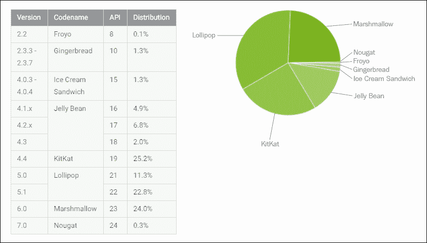
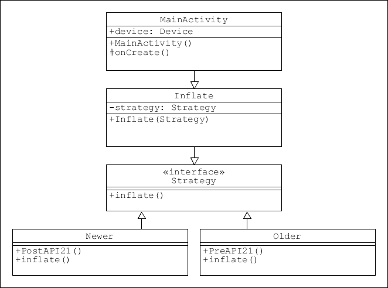
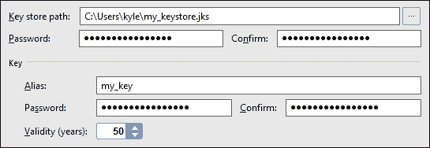
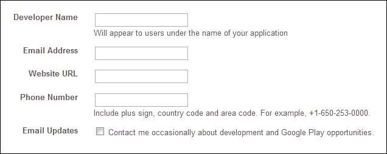
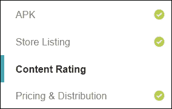
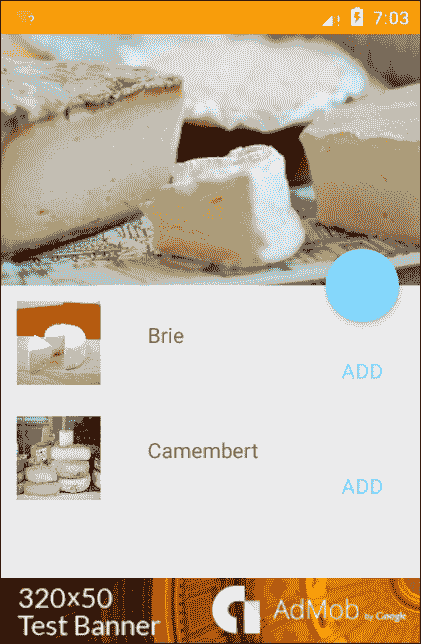

# 第十三章：分发模式

在覆盖了安卓开发的大部分重要方面之后，我们只需要处理部署和发布的过程。简单来说，将应用发布在谷歌应用商店并不是一个复杂的流程，但我们可以应用一些技巧和诀窍来最大化应用的可能覆盖范围，当然，我们应用获利的方式也在不断增加。

在本章中，我们将探讨如何在使用支持库提供的向后兼容性之外增加兼容性，然后继续了解注册和分发过程是如何工作的，接着我们将探索各种让我们的应用程序盈利的方式。

在本章中，你将学习如何进行以下操作：

+   准备应用分发

+   生成数字证书

+   注册成为谷歌开发者

+   准备宣传材料

+   在谷歌应用商店发布应用

+   加入应用内购

+   包含广告

# 扩展平台范围

我们在整个书中一直在使用的支持库在让应用在旧设备上可用方面做得非常出色，但它们并不适用于所有情况，许多新的创新在一些旧机器上根本无法实现。看看下面的设备仪表盘，很明显，我们希望将应用扩展回 API 级别 16：



我们已经看到 AppCompat 库是如何让我们的应用运行在比当前平台更旧的平台上，但我们不得不避免使用某些功能。例如，`view.setElevation()`方法（以及其他材料特性）在 API 级别 21 以下将不起作用，如果调用它会导致机器崩溃。

我们可能会很自然地认为，我们可以简单地为了吸引更广泛的受众而牺牲这些功能，但幸运的是，这并不必要，因为我们可以使用以下条件子句动态检测我们的应用正在运行的平台：

```kt
if (Build.VERSION.SDK_INT >= Build.VERSION_CODES.LOLLIPOP) { 
    someView.setElevation(someValue); 
} 

```

这总是取决于个别开发者，但这种轻微的质量下降通常值得潜在用户采用的大幅增加。

然而，前面的例子很简单，添加这种动态向后兼容性通常需要额外的编码工作。一个很好的例子是 camera2 API，它比其前身复杂得多，但只在携带 API 21 及更高版本的设备上可用。在这种情况下，我们可以应用完全相同的原理，但需要设置一个更复杂系统。该子句可能导致调用不同的方法，甚至启动不同的活动。

然而，无论我们选择如何实现这一点，当然可以采用设计模式。这里有几种可能被使用，但最适合的可能是在这里看到的策略模式：



这种方法可能经常需要额外的编码工作，但扩大的潜在市场往往使这些额外工作变得非常值得。一旦我们像这样设置了我们应用的范畴，它就可以发布了。

# 发布应用

不言而喻，你应该在各种各样的手机和模拟器上彻底测试你的应用，并可能准备好你的推广材料，查看 Google Play 的政策和协议。在发布之前有很多事情要考虑，比如内容分级和国家分布。从编程的角度来看，在我们继续之前，只需检查三件事情：

+   从项目中删除所有日志记录，例如以下内容：

```kt
    private static final String DEBUG_TAG = "tag"; 
    Log.d(DEBUG_TAG, "some info"); 

```

+   确保你的清单中声明了应用`label`和`icon`。以下是一个示例：

```kt
    android:icon="@mipmap/my_app_icon" 
    android:label="@string/my_app_name" 

```

+   确保在清单中声明了所有必要的权限。以下是一个示例：

```kt
    <uses-permission android:name="android.permission.INTERNET" /> 
    <uses-permission android:name="android.permission.ACCESS_NETWORK_STATE" /> 

```

现在我们只需三个步骤就能在 Google Play 商店上看到我们的应用。我们需要做的就是生成一个已签名的发布 APK，注册成为 Google Play 开发者，最后将应用上传到商店或发布在自己的网站上。还有一两种发布应用的其他方式，我们将在本节末尾了解它们是如何完成的。首先，我们将开始生成一个准备上传到 Google Play 商店的 APK。

## 生成签名的 APK

所有发布的 Android 应用都需要一个数字签名的证书。这用于证明应用程序的真实性。与其他许多数字证书不同，它没有权威机构，你持有签名的私钥，这显然需要被安全保护。为此，我们需要生成一个私钥，然后使用它来生成签名的 APK。GitHub 上有些工具可以方便地完成这个过程，但为了帮助理解，我们将遵循传统的方法。这可以在 Android Studio 中的“生成签名的 APK 向导”中完成。以下步骤将引导你完成：

1.  打开你想要发布的应用。

1.  从**构建 | 生成签名的 APK...**菜单启动生成签名的 APK 向导。

1.  在第一个屏幕上选择**创建新的...**。

1.  在下一个屏幕上，为你的密钥库提供一个路径和名称，以及一个强密码。

1.  对别名做同样的操作。

1.  选择一个有效期超过 27 年的选项，如下所示：

1.  至少填写一个证书字段。点击**确定**，你将被带回向导。

1.  选择**release**作为构建变体，然后点击**完成**。

1.  你现在有一个准备发布的已签名 APK。

密钥库（一个`.jks`文件）可以用来存储任意数量的密钥（别名）。对所有应用使用同一个密钥是完全可以的，而且在产生应用更新时也必须使用相同的密钥。谷歌要求证书有效期至少到 2033 年 10 月 22 日，任何超过这个日期的数字都足够。

### 提示

**重要**：至少保留一份密钥的安全备份。如果丢失了，你将无法开发这些应用程序的未来版本。

一旦我们有了数字签名，我们就可以注册成为 Google 的开发者。

## 注册为开发者

与签名 APK 一样，注册为开发者也同样简单。请注意，Google 收取一次性费用 25 美元，以及你的应用程序可能产生的任何收入的 30%。以下说明假设你已经有一个 Google 账户：

1.  查阅以下链接中的**支持的位置**：

    [support.google.com/googleplay/android-developer/table/3541286?hl=en&rd=1](http://support.google.com/googleplay/android-developer/table/3541286?hl=en&rd=1)

1.  前往开发者 Play 控制台：

    ```kt
    play.google.com/apps/publish/
    ```

1.  使用你的 Google 账户登录，并输入以下信息：

1.  阅读并接受**Google Play 开发者分发协议**。

1.  使用 Google Checkout 支付 25 美元，如有必要请创建一个账户，这样你就成为了注册的 Google 开发者。

如果你打算让你的应用程序在全球范围内可用，那么检查支持的位置页面总是值得的，因为它经常变化。剩下要做的就是上传我们的应用程序，我们接下来会做。

## 在 Google Play 商店上发布应用程序

将我们的应用程序上传并发布到 Play 商店是通过**开发者控制台**完成的。正如你将看到的，在这个过程中，我们可以提供大量关于我们应用程序的信息和推广材料。只要你按照本章前面的步骤操作，并且有一个准备好的已签名的`.apk`文件，那么就按照以下说明发布它。或者，你可能只是想看看此时涉及的内容以及推广材料的形式。在这种情况下，确保你有以下四张图片和一个已签名的 APK，并在最后选择**保存草稿**而不是**发布应用**：

1.  至少两张应用程序的截图。这些截图的任何一边不得短于 320 像素或长于 3840 像素。

1.  如果你希望你的应用程序在 Play 商店中对搜索设计用于平板电脑的应用程序的用户可见，那么你应该至少准备一张 7 英寸和一张 10 英寸的截图。

1.  一个 512 x 512 像素的高分辨率图标图像。

1.  一个 1024 x 500 像素的特色图形。

准备好这些图片和一个已签名的`.apk`文件后，我们就可以开始了。决定你希望为应用程序收取多少费用（如果有的话），然后按照以下说明操作：

1.  打开你的开发者控制台。

1.  填写**标题**并点击**上传 APK**按钮。

1.  点击**上传你的第一个 APK 到生产环境**。

1.  定位到你的已签名`app-release.apk`文件。它将在`AndroidStudioProjects\YourApp\app`目录中。

1.  将此内容拖放到建议的空间中。

1.  完成后，你将被带到应用程序页面。

1.  按照前四个部分进行操作：

1.  完成所有必填字段，直到“发布应用”按钮可以点击。

1.  如果您需要帮助，按钮上方的**为什么我不能发布？**链接将列出未完成的必填字段。

1.  当所有必填字段都填写完毕后，点击页面顶部的**发布应用**（或**保存草稿**）按钮。

1.  恭喜！您现在已成为一名已发布的安卓开发者。

我们现在知道如何将应用发布到 Play 商店。当然，还有许多其他的应用市场，它们都有各自的上传流程。然而，Google Play 提供了最广泛的受众群体，是发布应用的自然选择。

尽管 Play 商店是理想的市场，但仍然值得看看两种其他的分发方法。

## 通过电子邮件和网站进行分发

这两种方法中的第一种就像听起来一样简单。如果您将 APK 作为电子邮件附件发送，并在安卓设备上打开，用户在打开附件时会被邀请安装应用。在较新的设备上，他们可以直接在电子邮件中点击安装按钮。

### 提示

对于这两种方法，用户将必须在设备的 安全设置 中允许安装未知来源。

从您的网站分发应用几乎和通过电子邮件发送一样简单。您需要做的就是在网站上托管 APK 文件，并提供如下所示的下载链接：

```kt
<a href="download_button.jpg" download="your_apk">. 

```

当用户从安卓设备浏览您的网站时，点击您的链接将在他们的设备上安装您的应用。

### 提示

通过电子邮件分发无法防止盗版，因此只有在考虑到这一点时才应使用此方法。其他方法尽可能安全，但如果您想采取额外措施，谷歌提供了一项**许可服务**，可以在 developer.android.com/google/play/licensing 找到。

无论我们是发布付费应用还是免费应用，我们都希望能够触达尽可能多的用户。谷歌提供了几种工具来帮助我们实现这一点，以及我们接下来将看到的盈利方法。

# 推广和盈利应用

很少有应用在没有经过良好推广的情况下就能成功。有无数种推广方法，毫无疑问，您将遥遥领先于如何推广您的产品。为了帮助您触达更广泛的受众，谷歌提供了一些实用的工具来协助推广。

在了解了推广工具之后，我们将探索两种通过应用赚钱的方法：应用内支付和广告。

## 推广应用

谷歌提供了两种非常简单的方法，帮助引导人们从网站和我们的应用中关注 Play 商店上的产品：链接以及**谷歌 Play 徽章**，它为我们的链接提供官方品牌标识。

我们可以添加指向单个应用和我们发布商页面的链接，在发布商页面可以浏览我们所有的应用，并且我们可以在我们的应用和网站中包含这些链接：

+   如果要包含指向 Play 商店中特定应用页面的链接，请使用以下格式中的清单中找到的完整包名：

```kt
        http://play.google.com/store/apps/details?id=com.full.package.name 

```

+   要在 Android 应用中包含这个，请使用这个：

```kt
        market://details?id= com.full.package.name 

```

+   如果你想要一个指向你的发布者页面以及你所有产品的列表的链接，请使用这个：

```kt
        http://play.google.com/store/search?q=pub:my publisher name 

```

+   当从应用中链接时，请像之前一样进行相同的更改：

```kt
        Market://search?q=pub:my publisher name 

```

+   要链接到特定的搜索结果，请使用这个：

```kt
        search?q=my search query&c=apps. 

```

+   如果要使用官方 Google 徽章作为你的链接，请用下面突出显示的 HTML 替换前面元素之一：

```kt
        <a href="https://play.google.com/store/search?q=pub: publisher name"> 
         
        </a> 

```

徽章有两种尺寸，`60.png`和`45.png`，以及两种样式，Android 应用在 Google Play 上和在 Google Play 上获取。只需更改相关代码以选择最适合你目的的徽章：


随着我们的应用发布，并在合适的位置放置了指向我们 Play 商店页面的链接，现在是考虑如何从不可避免的下载中获利的时候了，因此我们来看看如何实现 Android 应用的盈利。

## 应用盈利

有很多方法可以从应用中赚钱，但最流行和有效的两种方法是**应用内购买**和**广告**。应用内购买可能会相当复杂，或许值得用一整章来讲述。这里，我们将看到一个有效的模板，你可以将其作为开发可能的应用内产品的基础。它将包括所有需要的库和包，以及一些非常有用的帮助类。

相比之下，现在我们在应用中包含 Google AdMob 广告对我们来说是一个非常熟悉的过程。实际上，广告只是另一个 View，并且可以像其他任何 Android 小部件一样被识别和引用。本章的最后一个练习，也是整本书的最后一个练习，将构建一个简单的 AdMob 演示。不过，首先让我们看看应用内购买。

## 应用内购买

用户可以从应用内购买大量产品，从升级和可解锁内容到游戏内物品和货币，这当然为我们在书中前面开发的那个三明治制作应用提供了一个支付选项。

无论用户购买什么，Google 结账流程都会确保他们以与其他 Play 商店产品相同的方式支付。从开发者的角度来看，每次购买都会归结为响应一个按钮的点击。我们需要安装 Google Play Billing Library，并向我们的项目中添加一个 AIDL 文件和一些帮助类。以下是方法：

1.  开始一个新的 Android 项目，或者打开一个你想要添加应用内购买功能的已有项目。

1.  打开 SDK 管理器。

1.  在 Extras 下，确保你已经安装了 Google Play Billing Library。

1.  打开清单并应用这个权限：

    ```kt
            <uses-permission 
                android:name="com.android.vending.BILLING" /> 

    ```

1.  在项目窗格中，右键点击 app 并选择**新建 | 文件夹 | AIDL 文件夹**。

1.  从这个 AIDL 文件夹中，创建一个**新建 | 包**，并将其命名为 com.android.vending.billing。

1.  在`sdk\extras\google\play_billing`目录中找到并复制`IinAppBillingService.aidl`文件。

1.  将文件粘贴到`com.android.vending.billing`包中。

1.  在 Java 文件夹中创建一个名为`com.`**你的包名**`.util`的**新包**，然后点击**完成**。

1.  从`play_billing`目录中找到并打开`TrivialDrive\src\com\example\android\trivialdrivesample\util`文件夹。

1.  将九个 Java 文件复制到你刚刚创建的 util 包中。

现在你已经拥有了一个适用于任何想要加入应用内购买功能的应用的模板。或者，你也可以在已经开发好应用内产品的项目中完成上述步骤。无论哪种方式，无疑你都将利用`IabHelper 类`，它极大地简化了编码工作，并为购买过程的每一步提供了监听器。相关文档可以在这里找到：

[`developer.android.com/google/play/billing/index.html`](https://developer.android.com/google/play/billing/index.html)

### 提示

在开始实现应用内购买之前，你需要为你的应用获取一个**许可密钥**。这可以在开发者控制台中的应用详情中找到。

付费应用和应用内产品只是从应用中赚钱的两种方式，很多人选择通过广告来获取收入，这通常是一种更有利可图的途径。**Google AdMob**提供了很大的灵活性以及熟悉的编程接口，我们将在下一节中看到。

## 包含广告

广告赚钱的方式有很多，但 AdMob 提供的方法最为简单。该服务不仅允许你选择想要推广的产品类型，还提供了优秀的分析工具，并能无缝地将收入转入你的 Checkout 账户。

此外，我们将会看到，**AdView**可以通过几乎与我们熟悉的方法一样的编程方式来处理，我们将在最后的练习中开发一个带有演示横幅 AdMob 广告的简单应用。

在开始这个练习之前，你需要先在 google.com/admob 上注册一个 AdMob 账户。

1.  打开你想要测试广告的项目，或者开始一个新的 Android 项目。

1.  确保你已经通过 SDK Manager 安装了 Google Repository。

1.  在`build.gradle`文件中，添加这个依赖项：

    ```kt
        compile 'com.google.android.gms:play-services:7.0.+' 

    ```

1.  重建项目。

1.  在清单文件中设置这两个权限：

    ```kt
        <uses-permission 
            android:name="android.permission.INTERNET" /> 
        <uses-permission android:name="android.permission.ACCESS_NETWORK_STATE" /> 

    ```

1.  在应用节点内，添加这个`meta-data`标签：

    ```kt
    <meta-data 
        android:name="com.google.android.gms.version" 
        android:value="@integer/google_play_services_version" /> 

    ```

1.  在清单文件中包含这个第二个 Activity。

    ```kt
    <activity 
        android:name="com.google.android.gms.ads.AdActivity" 
        android:configChanges=
        "keyboard|keyboardHidden|orientation|screenLayout|uiMode|screenSize|smallestScreenSize" 
        android:theme="@android:style/Theme.Translucent" /> 

    ```

1.  在`res/values/strings.xml`文件中添加以下字符串：

    ```kt
    <string name="ad_id">ca-app-pub-3940256099942544/6300978111</string> 

    ```

1.  打开`main_activity.xml`布局文件。

1.  在根布局中添加这个第二个命名空间：

1.  在`TextView`下方添加这个`AdView`：

    ```kt
    <com.google.android.gms.ads.AdView 
        android:id="@+id/ad_view" 
        android:layout_width="match_parent" 
        android:layout_height="wrap_content" 
        android:layout_alignParentBottom="true" 
        android:layout_centerHorizontal="true" 
        ads:adSize="BANNER" 
        ads:adUnitId="@string/ad_id"></com.google.android.gms.ads.AdView> 

    ```

1.  在`MainActivity`的`onCreate()`方法中，插入以下代码行：

    ```kt
    AdView adView = (AdView) findViewById(R.id.ad_view); 
    AdRequest adRequest = new AdRequest.Builder() 
            .addTestDevice(AdRequest.DEVICE_ID_EMULATOR) 
            .build(); 

    adView.loadAd(adRequest); 

    ```

1.  现在在设备上测试应用。

我们在这里所做的几乎与我们编程任何其他元素的方式相同，有一两个例外。使用`ACCESS_NETWORK_STATE`权限并不是严格必要的；它在这里用于在请求广告之前检查网络连接。

任何显示广告的活动都将需要一个单独的 ID，并在清单中声明。这里提供的 ID 仅用于测试目的，因为不允许使用实时 ID 进行测试。`android.gms.ads`包中只有六个类，它们的全部文档可以在[developer.android.com/reference/com/google/android/gms/ads/package-summary](http://developer.android.com/reference/com/google/android/gms/ads/package-summary)找到。

AdMob 广告有两种形式，我们在这里看到的横幅广告和插屏广告，或全屏广告。我们在这里只处理了横幅广告，但插屏广告的处理方式非常相似。了解了如何实现付费应用、应用内购买和 AdMob，我们现在有能力收获辛勤工作的回报，最大限度地利用我们的应用程序。

# 总结

本章概述了应用程序开发的最后阶段，尽管这些阶段只占工作量的很小一部分，但它们至关重要，当涉及到应用程序的成功时，它们可以起到决定性的作用。

在整本书中，我们大量依赖支持库来增加我们应用程序可以在其上运行的设备数量，但在这里，我们看到了如何通过动态确定平台并相应地运行适当的代码来进一步扩大这一范围。这个过程很好地展示了设计模式如何渗透到编程的所有方面。

一旦我们使用这些工具扩大了我们的影响范围，我们还可以通过谨慎的推广来进一步提高我们应用程序成功的可能性，并希望我们的工作能够得到回报，无论是直接向用户收取应用程序或其功能的费用，还是通过投放广告间接盈利。

在整本书中，我们探讨了设计模式如何在开发的许多方面帮助我们，但真正有用的是设计模式背后的思考方式，而不是任何一个单独的模式。设计模式提供了一种解决问题的方法和一条通往解决方案的清晰路径。这是一种旨在引导我们找到新的创造性解决方案的方法，设计模式不应被视为一成不变的，而应更多地视为一种指导，任何模式都可以根据其目的进行修改和调整。

本书中的模式和示例并非设计为可以直接复制粘贴到其他项目中，而是作为帮助我们发现解决自己原始情况的最优雅解决方案的方法论。如果这本书完成了它的任务，那么你接下来设计的模式将不是这里所概述的，而是你自己全新的原创作品。
