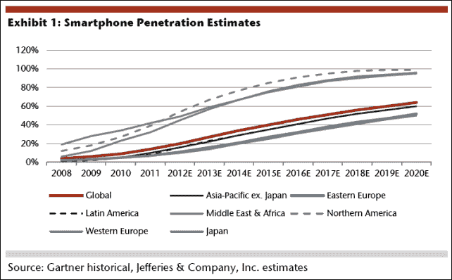

# 第一章。简介:为什么是高性能？

根据剑桥词典，表现的一个定义是“一个人、一台机器等有多好。做一件工作或一项活动。”如果我们把它和“高”放在一起，我们可以把它定义为完成任务的产出或效率。

软件中的高性能指的是开发人员用来创建能够高效执行流程的软件的策略。当我们开发移动软件时，这将影响但不限于布局开发、能源和电池管理、安全问题、高效多线程、编程模式和调试技术。

做事和把事情做对有很大的区别。在一个有截止日期、预算和经理的现实世界中，软件工程师经常陷入技术债务。当一个系统在没有完整或适当设计的情况下被开发出来时，技术债务被“收买”(如果我们可以使用这个动词的话)，将问题向前推进，而不是正确地解决它们。这就产生了滚雪球效应:在高级阶段，技术债务如此之高，以至于进一步开发的成本非常高，这导致了组织预算的死角或天文数字的损失。

虽然不能总是避免截止日期，但在任何软件开发中采用高效的开发流程对于以合理的成本交付高质量的软件至关重要。这也意味着开发人员的开发技能变得更加成熟，工程师可以开发出高效、健壮并且可以在未来进一步扩展的软件(我们称之为“可维护性”)，而不是完成满足需求的任务。

这本书介绍了为安卓设备构建高性能软件的技术。

# 为什么一个应用的性能对这么多人来说意义如此之大？

无论行业如何，软件系统性能或质量的下降都意味着巨大的损失。如今，软件系统控制着我们的财务，控制着照顾我们健康或公共交通的机器。在我们的生活中，几乎没有一个领域不是至少部分电脑化的。不仅仅是损失:在一个全球化和竞争激烈的世界里，一家生产低性能软件的公司将很快被更高效、更便宜的竞争吞噬。

有一段时间，软件开发中使用的唯一标准是“软件是正确的吗？它在做它应该做的事情吗？”。这在计算机系统时代的初期是有意义的，当时并不是每一个过程都是计算机化的，我们也没有开发出软件工程的文化或者质量控制、团队组织等等的好方法。现在，每个人都要求更多。

图形是显示信息的极好方式。我们来分析一下智能手机的渗透率:

数字很清楚。2008 年最后一个季度，全球几乎每个地区的智能手机普及率都低于 20%。如今，在 2015 年，大多数发达国家的渗透率接近 80%，而发展中国家接近 40%。2020 年，预计发达国家渗透率接近 100%，发展中国家超过 50%。有几个国家的手机比居民还多！

现在的移动用户不仅仅在手机上查看电子邮件。手机上执行的操作有很多:娱乐行业、银行和支付、旅游和旅游、游戏……这让我们得出一个结论:软件不仅要正确，还要高效。软件方面的失败会让客户感到恼火，他们可能会选择使用性能更好的产品与不同的竞争对手竞争。在极端情况下，不良软件会导致我们的业务损失收入，想象一下应用程序进行酒店预订，而您无法继续付款的情况。

# 手动测试和自动测试

自然产生的第一个想法之一是，测试在提高和改善应用程序性能方面起着核心作用。这是部分正确的，或者正如我们更喜欢说的:测试是对设计巧妙的应用程序的很好补充，但不是替代。

如果我们只专注于测试，主要有两种类型:手动测试和自动测试。和前面的例子一样，这两种类型的测试是相互包容的，一种测试不应该损害另一种测试。手动测试包括一个真实的用户在玩一个应用程序和一些定义好的用例场景，但也有更多的自由意志和离开预定义测试的道路并探索新路径的能力。

自动测试是由开发人员编写的测试，以确保应用程序在系统生命周期中的一致性。有几种不同的类型:单元测试、集成测试或用户界面测试，读者会很熟悉。当应用新的变更时，良好的测试覆盖为系统提供了健壮性，提高了对故障和性能问题的抵抗力。和前面的例子一样，我们不希望为了自动测试而排除手动测试，或者相反(至少在机器能够通过图灵测试之前！).

# ANR 和软件的延迟

**ANR** 代表代表**应用不响应**，是安卓开发者的几个噩梦之一。安卓操作系统分析应用程序和线程的状态，当满足某些条件时，它会触发 ANR 对话，阻止用户进行任何交互体验。对话框宣布应用程序停止响应，不再响应。用户可以选择他/她是想要关闭应用程序，还是继续等待直到应用程序再次响应(如果发生这种情况):

## 是什么触发了 ANRs，如何避免？

安卓系统在两种不同的情况下触发 ANRs:

*   当五秒钟内没有事件响应时
*   如果广播接收器在其执行 10 秒后仍在执行

这个大部分发生在 **UI 线程**正在执行操作的时候。一般来说，任何操作都应该在一个单独的线程中执行，保持用户界面线程可用于用户交互，并且只在操作完成时通知用户界面线程。在[第 5 章](05.html "Chapter 5. Multithreading")、*多线程*中，我们将展示一些多线程和线程通信的高级技术。也有不同的类可以用来在不同的线程中执行操作，每个类都有自己的优缺点。一般来说，在开发应用程序时，请记住:ANR 对话框的出现频率与用户满意度成反比。

# 安卓架构

和其他任何开发框架一样，安卓定义了自己的架构和模块。安卓是一个基于 Linux 的操作系统，尽管 SDK 提供的众多抽象层几乎完全隐藏了 Linux 内核，我们很少直接在内核级别编程:

# 达尔维克虚拟机

每个安卓应用程序都在一个名为达尔维克的虚拟机中运行自己的进程。正如我们所看到的，程序通常用 Java 编写，然后编译成字节码。从字节码(`.class`文件)中，它们随后被转换成 DEX 格式，通常使用安卓 SDK 提供的名为 **dx** 的特殊工具。由于移动设备缺乏桌面的计算能力，与普通的 Java `.class`文件相比，这种 DEX 格式更加优化，设计成具有更小的内存占用。这是通过压缩和合并/优化多个`.class`文件来实现的。

### 注

必须严格用 Java 进行编码并不完全准确。安卓也允许在我们的应用程序中使用本机代码。因此，我们之前使用的现有代码可以在这里重用。此外，在计算机视觉领域，有许多代码已经从 OpenCV 框架中重用。这是通过 **原生开发套件** ( **NDK** )实现的，在[第 9 章](09.html "Chapter 9. Native Coding in Android")、*安卓原生编码*和[第 10 章](10.html "Chapter 10. Performance Tips")、*性能提示*中进行了探讨。

达尔维克虚拟机还包括一些 **Java 虚拟机** ( **JVM** )功能，比如**垃圾收集** ( **GC** )。在那里由于其非世代性，通过 GC 受到了很多批评；它以让开发者疯狂而闻名。然而，自安卓 2.3 以来，一个改进的并发垃圾收集器使得一些开发变得更加容易。

在 Dalvik 上运行的每个应用至少总共有 16 MB 的可用堆内存。这对某些应用来说可能是一个真正的限制，因为我们可能需要处理大量的图像和音频资源。但是，较新的设备(如平板电脑或高端设备)具有更高的堆限制，允许使用高分辨率图形。由于移动硬件的快速发展，我们预计这种情况将在不久的将来得到改善。

# 内存管理

**内存** 顾名思义，在任何软件平台上都是稀缺资源。但是说到移动设备，这是一个更加受限的资源。移动设备的物理内存和处理器容量通常比大型设备少，有效的内存管理对于改善用户体验和软件稳定性至关重要。

Dalvik Virtual Machine 以类似于 Java 的方式定期触发垃圾收集，但这并不意味着我们可以完全忽略内存管理。初级程序员中一个非常常见的错误是造成内存泄漏。当一个对象存储在内存中，但运行的代码无法再访问它时，就会发生内存泄漏。大小可以变化很大(从一个整数到一个大位图或几兆字节的结构)，但一般来说，它们会影响软件的平滑度和完整性。我们可以使用自动化工具和框架来检测内存泄漏，还可以应用一些编程技术来避免不必要地分配对象(同样重要的是，在不再需要对象时释放它们)。

安卓应用程序可以管理的内存是最大的。每个设备都不一样(是的，系统碎片的另一个问题)，可以通过调用`ActivityManager`上的函数`getMemoryClass()`来特别检查。早期设备的每个应用上限为 16 MB。后来设备增加到 24 MB 或 32 MB，看到设备达到 48mb 或 64 MB 也就不足为奇了。有几个因素促成了这一事实，如屏幕尺寸。更大的屏幕通常意味着位图的分辨率更高；因此，随着它们的增加，内存需求也会增加。一些技术也可以绕过这个限制，例如使用 NDK 或者从系统请求更大的堆。然而，对于安卓应用程序来说，最后一个被认为是糟糕的形式。

当一个过程开始时，它从一个被称为 **合子**的现有或根过程分叉出来。每次系统启动并加载所有应用共有的资源时，合子都会启动。通过这样做，安卓试图在应用程序之间共享所有公共资源，避免相同框架重复使用内存。

# 能耗

移动设备的电池容量有限，并且它们不像标准计算机那样连接到永久电源。因此，电池和能量的有效利用是生存的重要因素。如果您持续执行耗尽电池或需要持续访问设备硬件的操作，将会影响用户体验，并可能导致应用程序被拒绝。

良好的能量管理需要对能量如何使用以及哪些操作会非常快地耗尽电池有很好的理解。有工具和基准框架来找出软件中能耗高于预期的能源瓶颈和部分。

移动消费电子设备，尤其是手机，是由电池供电的，电池的尺寸有限，因此容量有限。这意味着在这种设备中，管理好能源是最重要的。良好的能源管理需要对能源的使用地点和方式有很好的理解。为此，我们详细分析了最近的一款手机 Openmoko Neo Freerunner 的功耗。我们不仅测量整体系统功率，还测量设备主要硬件组件的功耗的精确细分。我们针对微基准测试和许多实际使用场景给出了这种功耗细分。这些结果通过另外两款设备的整体功耗测量得到了验证:HTC Dream 和谷歌 Nexus One。

# Java 语言

安卓大部分是用 Java 写的。尽管最近出现了一些替代语言(例如，我们可以提出 Kotlin 和 Android，这是一个很棒的组合)，Java 可能仍然是 Android 的首选语言。它非常成熟的环境，谷歌和其他公司的大量支持，以及充满活力的开发者场景，确保了它继续引领安卓的发展。

吸引开发者进入安卓生态系统的一个因素正是对现有语言的共享使用。Java 有一些特殊的特性和技术，我们需要学习才能有效地使用它。

# 原生开发套件或如何在需要时使用原生代码进行开发

使用 **本地开发工具包** ( **NDK** )有时可能意味着执行应用程序和只完成其工作的应用程序之间的区别。我们通常在以下情况下使用 NDK:

*   **使用现有的 C/C++库**:这是一个明显的优势，因为你可以访问强大的现有软件，比如 OpenCV1、音频编码器等等。
*   性能:对于一些关键的内部循环，C/C++相对于 Java 的边际性能优势，尤其是在**即时编译** ( **JIT** )在安卓编译器中可用之前，可能是一个决定因素。
*   **做一些 NDK 允许 Java API 不能管理的事情**:接近硬件的低级操作，特别是影响特定制造商的硬件，可能只有通过 C/C++才能实现。
*   **混淆**:编译后的代码在某种程度上比 Java 字节码更难逆向工程。然而，默默无闻的安全性并不是理想的解决方案，但它可以补充您现有的系统。

# 应用响应的三个极限

在任何软件系统中，有三种不同的阈值被认为是对用户体验的限制:

*   0.1 秒被用户感知为瞬时响应。在这种操作中，不需要向用户显示任何视觉反馈或通知，这包括正常情况下的大多数操作(例如，点击按钮和显示对话框之间的间隔，或者显示不同的活动)。
*   1.0 秒是用户流中断的时间。在 0.1 和 1.0 之间仍然不需要提供任何反馈，但是一秒钟后，用户已经失去了执行即时操作的感觉。
*   10 秒是最终极限，此时用户对应用程序失去了注意力和兴趣。操作超过 10 秒通常意味着用户将失去对系统的兴趣，并在操作过程中拖延。视觉反馈在这里至关重要；没有它，用户会感到沮丧并拒绝我们的系统。

谷歌建议将所有交互保持在 100 到 200 毫秒以内。超过这个阈值，用户将会感觉到应用程序的缓慢。虽然这并不总是可能的(考虑下载大量数据，如媒体等)，但我们将学习为用户提供最佳体验的技术。

# 软件质量的商业价值

开发人员经常需要向非技术同行证明为什么会做出一些不能带来即时价值的决定(考虑重构一个旧模块或者开发一些测试覆盖)。业务部门和工程部门之间存在明显的差距，需要进行协调。

当我们不得不与其他部门讨论为了软件质量而做出的决策的商业价值时，我总是喜欢提到“钱”这个词。从长远来看，做一些决定相当于省钱，并为软件提供直接价值。它们可能不会立即产生输出，也不会产生有形的项目(就像软件可能是有形的一样)，但它们肯定会在未来带来一些好处。我还记得在适当的时候重构一个软件的一些情况，这在拥有一个可扩展的可持续的工件和拥有一个整体之间产生了差异，这是许多糟糕的设计决策的结果，没有人能够维护，最终意味着金钱和财务成本。下图显示了由于软件质量差而导致的公司损失和后果:

这个图表取自大卫·沙佩尔的一份文件，它解释了当软件质量不好时会导致财务损失的一些例子。从失去的业务中失去价值可能会让我们想起索尼因网络攻击而关闭 PlayStation 网络的时候。如果软件设计和保护得当，网络可能会继续运行，但糟糕的设计导致公司损失了大量资金。每当一家公司因软件系统不良而出现问题，需要对客户进行赔偿时，就会发生客户赔偿造成的经济损失。当客户不想再获得一家臭名昭著的公司提供的任何服务时，就会发生明显的客户流失财务损失！在许多情况下，诉讼造成的经济损失是不可避免的，尤其是当涉及隐私问题或被盗数据时(它们可能非常昂贵！).

# 总结

在这一章之后，读者应该对我们将在本书中一起探索的不同领域有了更准确的了解。我们也希望我们的论点足够有说服力，我们将努力在整本书中进一步发展它们。

读者应该能够论证为什么性能在他/她的组织中很重要，并且应该知道高效安卓开发的一些关键词。不要紧张，这只是开始。