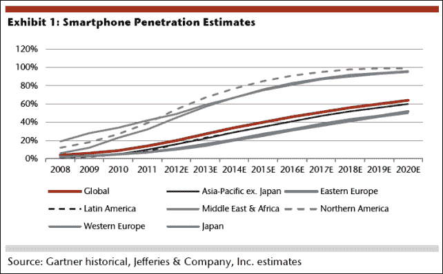
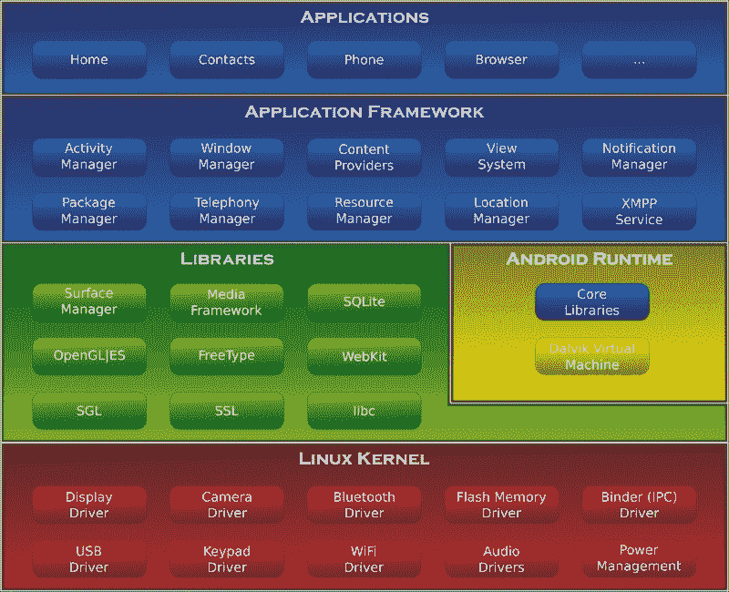
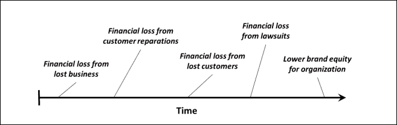

# 第一章：引言：为何要高绩效？

根据剑桥词典，性能的一个可接受的定义是：“一个人、机器等完成一项工作或活动的表现。”如果我们将其与“高”结合，可以定义为执行任务时的输出或效率。

软件中的高性能指的是开发者采用的策略，以创建能够高效执行流程的软件片段。当我们开发移动软件时，这影响到但不限于布局开发、能源和电池管理、安全问题、有效的多线程、编程模式和调试技术。

做事情与把事情做对之间存在很大差异。在一个有截止日期、预算和经理的现实世界中，软件工程师经常陷入技术债务。当系统在没有完整或不适当设计的情况下开发时，就会产生技术债务，将问题推向前而不是正确解决。这会产生滚雪球效应：在高级阶段，技术债务如此之高，以至于进一步开发成本非常高，这导致组织中的预算达到死点或天文数字的损失。

尽管截止日期有时无法避免，但在任何软件开发中采用有效的开发过程对于以合理的成本交付高质量产品至关重要。这也意味着开发技能在开发者中变得更加成熟，工程师可以开发的不仅仅是满足要求的软件，而是高效、健壮，并且可以在未来进一步扩展的软件（我们称之为“可维护性”）。

本书介绍了为安卓设备构建高性能软件的技术。

# 为何应用程序的性能对如此多人来说如此重要？

无论哪个行业，软件系统性能或质量的下降可能导致巨大的损失。今天的软件系统控制着我们的财务，控制着照顾我们健康或公共交通的机器。我们的生活几乎没有任何领域至少不是部分计算机化的。不仅是损失：在一个全球化和竞争激烈的世界中，生产低性能软件的公司很快就会被更高效和更便宜的竞争对手吞噬。

一段时间以来，软件开发中唯一使用的指标是“软件是否正确？它是否在执行它应该做的事情？”。在计算机系统时代的曙光时期，这种做法是有道理的，当时并不是每个流程都计算机化，我们还没有发展出软件工程的文化或质量控制的良好方法，以及团队组织等等。现在，每个人都要求更多。

图表是展示信息的绝佳方式。让我们分析一下智能手机的渗透率数据：

数据很明确。在 2008 年第四季度，世界上几乎所有地区的智能手机渗透率都低于 20%。如今，在 2015 年，大多数发达国家的渗透率接近 80%，而发展中国家接近 40%。预计到 2020 年，发达国家的渗透率将接近 100%，发展中国家的渗透率将超过 50%。有些国家的手机数量甚至超过了人口数量！

现在的移动用户不仅会在手机上检查电子邮件。有许多操作是在手机上完成的：娱乐业、银行业务和支付、旅游业和旅行、游戏……这让我们得出一个结论：软件不仅要正确无误，还必须是高效的。软件的失败将导致客户的不满，他们可能会选择使用性能更好的竞争对手产品。在极端情况下，性能不佳的软件可能导致我们的业务失去收入——想象一下一个无法进行支付流程的酒店预订应用程序。

# 手动测试和自动测试

自然会首先想到的一个问题是，测试在提高和改进应用程序性能方面起着核心作用。这在一定程度上是正确的，或者我们更愿意说：测试是一个为智能设计应用程序的好补充，但不是替代品。

如果我们只关注测试，主要有两种类型：手动测试和自动测试。与之前的情况一样，这两种测试是相互包含的，不应以牺牲另一种为代价来使用其中一种。手动测试涉及一个真实用户与一个应用程序及其一些定义的使用场景进行交互，但也有更多的自由意志和能力去离开预定义的测试路径，探索新的路径。

自动测试是开发者编写的，以确保应用程序在整个系统生命周期内的一致性。有几种不同类型：单元测试、集成测试或 UI 测试，读者对此应该很熟悉。良好的测试覆盖为新应用的变化提供了系统的健壮性，提高了对失败和性能问题的抵抗力。与之前的情况一样，我们不希望排除手动测试以支持自动测试，反之亦然（至少在机器能够通过图灵测试之前！）。

# ANR 和软件中的延迟

**ANR**代表**应用无响应**，是安卓开发者面临的一系列噩梦之一。安卓操作系统会分析应用程序和线程的状态，当满足某些条件时会触发 ANR 对话框，阻止用户进行任何交互式体验。该对话框宣布应用程序停止响应，且不再有反应。用户可以选择是否关闭应用程序，或者继续等待直到应用程序再次变得响应（如果这种情况真的会发生）：

## 什么原因会导致 ANR，我该如何避免它们？

Android 系统在两种不同情况下会触发 ANR：

+   当有事件在五秒内没有得到响应

+   如果一个 BroadcastReceiver 在执行后 10 秒仍在运行

这通常发生在**UI 线程**中执行操作时。通常，任何预期会耗时或操作消耗的操作都应该在单独的线程中执行，保持 UI 线程可用于用户交互，并且只在操作完成时通知 UI 线程。在第五章 *多线程*中，我们将展示一些多线程和线程通信的高级技术。也有不同的类可以在不同的线程中执行操作，每一个都有其自身的优缺点。通常，在开发应用程序时，请记住：ANR 对话框出现的频率与用户满意度成反比。

# Android 架构

与任何其他开发框架一样，Android 定义了自己的架构和模块。Android 是一个基于 Linux 的操作系统，尽管 SDK 提供的众多抽象层几乎完全隐藏了 Linux 内核，实际上我们很少会直接在内核级别编程：

# Dalvik 虚拟机

每个 Android 应用程序都在一个名为 Dalvik 的虚拟机中运行自己的进程。正如我们所见，程序通常是用 Java 编写的，然后编译成字节码。从字节码（`.class`文件）之后，它们会被转换成 DEX 格式，通常使用 Android SDK 提供的特殊工具，名为**dx**。这种 DEX 格式更优化，与普通的 Java `.class`文件相比，其内存占用更小，因为移动设备的计算能力不如桌面设备。这是通过对多个`.class`文件的压缩和合并/优化来实现的。

### 注意

编码严格来说并非必须使用 Java，Android 同样允许在我们的应用程序中使用原生代码。因此，之前使用过的现有代码可以在这里复用。同样，在计算机视觉领域，有大量从 OpenCV 框架复用的代码。这是通过**原生开发工具包**（**NDK**）实现的，在第九章 *Android 中的原生编码*和第十章 *性能优化技巧*中探讨了这一点。

Dalvik 虚拟机还包括一些**Java 虚拟机**（**JVM**）的特性，比如**垃圾回收**（**GC**）。由于 GC 的非分代性质，它曾受到很多批评；它以让开发者抓狂而闻名。然而，自从 Android 2.3 以来，改进的并发垃圾回收器使得开发变得更加容易。

在 Dalvik 上运行的应用程序至少有 16MB 的总可用堆内存。这对于某些应用程序来说可能是一个真正的限制，因为我们可能需要处理大量的图像和音频资源。然而，像平板电脑或高端设备这样的新型设备具有更高的堆限制，允许使用高分辨率图形。我们预计由于移动硬件的快速发展，这种情况将在不久的将来得到改善。

# 内存管理

按**内存**的定义，在任何软件平台上它都是一种稀缺资源。但说到移动设备，这更是一个受限的资源。移动设备通常具有比其更大的同行更少的物理内存和处理能力，因此高效的内存管理对于提升用户体验和软件稳定性至关重要。

Dalvik 虚拟机与 Java 类似，会定期触发垃圾回收，但这并不意味着我们可以完全忽视内存管理。初级程序员常犯的错误之一就是产生内存泄漏。当内存中的对象无法再被运行中的代码访问时，就会发生内存泄漏。这些对象的大小可能差异很大（从整数到一个大位图或几个兆字节的机构），但一般来说，它们会影响软件的流畅性和完整性。我们可以使用自动化工具和框架来检测内存泄漏，同时应用一些编程技术来避免不必要地分配对象（同样重要的是，在不再需要时释放它们）。

安卓应用有一个最大可管理的 RAM 内存量。它因每个设备而异（是的，系统分化的另一个问题），可以通过在`ActivityManager`上调用`getMemoryClass()`函数来特别检查。早期设备的每个应用上限为 16MB。后来设备将其增加到 24MB 或 32MB，看到高达 48 或 64MB 的设备并不会令人惊讶。有几个因素促成了这一事实，比如屏幕尺寸。较大的屏幕通常意味着位图的分辨率更高；因此，随着它们的增加，内存需求也会增长。一些技术也可以绕过这个限制，比如使用 NDK 或向系统请求更大的堆。然而，这对于安卓应用来说被认为是拙劣的形式。

当一个进程启动时，它是由一个现有的或根进程**Zygote**分叉出来的。Zygote 每次系统启动时都会启动，并加载所有应用程序共有的资源。通过这种方式，安卓试图在应用程序之间共享所有公共资源，避免为相同的框架重复使用内存。

# 能耗

移动设备的电池容量有限，且不像标准电脑那样连接到永久电源。因此，高效使用电池和能源是生存的关键因素。如果你持续执行耗电操作或需要持续访问设备硬件，这将会影响用户体验，甚至可能导致应用程序被拒绝。

良好的能源管理需要对能源如何使用以及哪些操作可能迅速耗电有很好的了解。有一些工具和基准测试框架可以找出能源瓶颈和软件中能源消耗高于预期的部分。

移动消费电子产品，尤其是手机，由有限容量的电池供电。这意味着在这样的设备中，良好的能源管理至关重要。良好的能源管理需要对能源的使用地点和使用方式有很好的了解。为此，我们详细分析了最近一款手机 Openmoko Neo Freerunner 的功耗。我们不仅测量了整个系统的功耗，还精确地测量了设备主要硬件组件的功耗分解。我们为微基准测试以及一些真实的使用场景提供了这种功耗分解。这些结果通过 HTC Dream 和 Google Nexus One 两款设备的整体功耗测量得到了验证。

# Java 语言

安卓大部分是用 Java 编写的。尽管最近出现了一些替代方案（例如，我们可以提到 Kotlin 和 Android，这是一个绝佳的组合），但 Java 可能仍将是安卓的首选语言。它成熟的环境、来自谷歌和其他公司的大量支持以及活跃的开发者社区，确保了它继续引领安卓开发。

正是这种对现有语言的共享使用吸引了开发者加入安卓生态系统。Java 有一些特定的特点和技巧，我们需要学习以有效地使用它。

# 原生开发工具包，或者在需要时如何使用原生代码进行开发

使用**原生开发工具包**（**NDK**）有时意味着应用程序的表现截然不同，有的只是完成任务而已。我们通常在以下情况下使用 NDK：

+   **使用现有的 C/C++库**：这是一个明显的优势，因为你能够使用强大的现有软件，如 OpenCV1、音频编码器等。

+   性能：对于一些关键的内循环，在 Android 编译器中**即时编译（JIT）**可用之前，C/C++相对于 Java 的边缘性能优势可能是决定性因素。

+   **使用 NDK 实现 Java API 无法处理的事情**：接近硬件的低级别操作，尤其是针对特定制造商硬件的影响，可能只能通过 C/C++实现。

+   **混淆**：编译后的代码在某种程度上比 Java 字节码更难以逆向工程。然而，安全性依赖于隐蔽性并不是理想的解决方案，但它可以补充您已有的系统。

# 应用程序响应性的三个限制

在任何软件系统中，有三个不同的阈值被认为是用户体验的限制：

+   0.1 秒被用户视为即时响应。在这种操作中，无需向用户显示任何视觉反馈或通知，这包括大多数正常场景中的操作（例如，点击按钮和显示对话框之间的间隔，或显示不同的活动）。

+   1.0 秒是用户流程中断的时间。在 0.1 到 1.0 秒之间，仍然无需提供任何反馈，但超过一秒后，用户会失去立即执行操作的感知。

+   10 秒是最终的限制，此时用户会失去对应用程序的集中精力和兴趣。在操作超过 10 秒的情况下，用户通常会失去对系统的兴趣，并在操作执行过程中拖延。这里的视觉反馈至关重要；如果没有它，用户会感到沮丧并拒绝我们的系统。

谷歌建议所有交互的响应时间保持在 100 到 200 毫秒以内。这是用户感知应用程序迟缓的阈值。尽管这并不总是可能的（考虑到下载大量数据，如媒体等），但我们将学习一些技术，以提供最佳用户体验。

# 软件质量商业价值

开发人员经常需要向非技术同行解释为什么做出某些决策，这些决策并不能立即带来价值（考虑到重构旧模块或开发一些测试覆盖率）。商业和工程部门之间存在明显的差距，需要调和。

当我们需要与其他部门讨论为了软件质量而做出的决策的商业价值时，我总是喜欢提到“金钱”这个词。从长远来看，做出某些决策等同于节省开支并直接为软件提供价值。它们可能不会立即产生结果，或者产生一个实体物品（尽管软件可以是实体），但它们将来肯定会带来一些好处。我可以想起几次在恰当的时刻重构软件使得可持续扩展的工件与因许多糟糕设计决策而产生的单体架构之间的区别，没有人能够维护最终意味着金钱和财务成本。以下图表揭示了因软件质量不佳随时间给公司带来的损失和后果：

这张图表摘自 David Chappell 的文档，它解释了软件质量不佳可能导致财务损失的一些例子。因业务流失而造成的价值损失可能让我们想起索尼因网络攻击而关闭 PlayStation 网络的事件。如果软件得到了恰当的设计和保护，网络可能还能够继续运行，但糟糕的设计导致公司损失了大量的金钱。每当公司需要为客户因软件系统糟糕导致的问题进行赔偿时，都会发生因客户赔偿而导致的财务损失。当客户不再愿意购买声名狼藉公司的服务时，明显的财务损失就会发生！因诉讼而导致的财务损失在很多情况下是不可避免的，特别是涉及到隐私问题或数据被盗时（这可能非常昂贵！）。

# 总结

在阅读了本章之后，读者应该对我们将在本书中一起探索的不同领域有一个更准确的认识。我们也希望我们的论点足够有说服力，并且我们将在整本书中进一步发展这些论点。

读者应该能够论证在自身组织环境中性能的重要性，并且应该了解一些关于高效 Android 开发的关键词。不要感到压力，这只是一个开始。
