# 第二章：高效调试

每个开发者在早期都会熟悉“bug”这个词，并且这种关系将贯穿他们的整个职业生涯。一个**bug**是软件系统中的一个错误或缺陷，会导致一个意外和不正确的结果。

关于这个词的词源有一些讨论。它最初是用来描述硬件系统中的技术故障，第一次使用这个词的引用来自托马斯·爱迪生。计算机先驱格蕾丝·霍珀（Grace Hopper）在 1946 年追踪到计算机 Mark II 的故障是由一只被困在继电器中的飞蛾引起的。这个物理 bug 最终不仅代表了困在机器内引起故障的物理 bug，也代表了逻辑 bug 或软件错误。

在这个背景下，**调试**是寻找软件系统中的 bug 或故障的过程。调试包括众多因素，如阅读日志、内存转储和分析、性能分析以及系统监控。在开发阶段，或者在生成系统中检测到 bug 时，开发者将调试软件应用程序以检测缺陷并继续修复它。

如果你是一个安卓开发者，谷歌提供了一套丰富的工具，我们可以用来调试我们的应用程序。本书将基于 Android Studio 套件和谷歌的官方 SDK 进行编写——尽管在过程中还有其他外部工具也可能很有帮助。

# 安卓调试桥

**安卓调试桥**，更广为人知的是**ADB**，是 Android 的一个核心工具。它包含在 Android SDK 的/platform-tools 文件夹中。如果你进入这个文件夹并调用`adb`命令，你将在屏幕上看到可用的选项列表。

### 提示

如果你现在还没有这样做，这是一个可以提高生产力的技巧，可能在你使用 ADB 的第一分钟就会得到回报。将你的 Android SDK 存储位置添加到你的`PATH`环境变量中。从这一刻起，你将能够从系统的任何部分调用该文件夹内包含的所有工具。

使用`adb`，我们可以执行多种操作，包括显示设备、截图或者连接和断开与不同设备的连接。本书的目的不是详尽地审查一个工具的每一项操作，但在这里，我们列出了一些`adb`最常见和有用的功能：

| # | 命令 | 描述 |
| --- | --- | --- |
| 1 | `adb logcat *:E&#124;D&#124;I` | 在控制台中启动`logcat`，通过错误、调试信息或信息消息进行过滤 |
| 2 | `adb devices` | 列出所有连接到`adb`的设备 |
| 3 | `adb kill-server``adb start-server` | 杀死并重启`adb`服务器。当`adb`出现卡顿或功能异常时，这是一个有用的消息 |
| 4 | `adb shell` | 在目标设备或模拟器上启动一个远程 shell |
| 5 | `adb bugreport` | 将`dumpsys`、`dumpstate`和`logcat`的所有内容打印到屏幕上 |
| 6 | `adb help` | 打印`adb`所有可执行命令的列表 |

`adb`一个有趣的事实是，作为一个命令行工具，它可以用于脚本编写并包含在如 Jenkins 等**持续集成**（**CI**）系统中。通过使用`adb` shell，我们可以执行设备上的任何命令。例如，考虑一个有用的脚本，它能够截取设备屏幕的截图：

```kt
adb shell screencap -p /sdcard/screenshot.png
adb pull /sdcard/screenshot.png
adb shell rm /sdcard/screen.png

```

在这本书中，我们将探索`adb`的许多可能性。

# Dalvik 调试监控服务器

**Dalvik 调试监控服务器**也称为**DDMS**。这个工具在`adb`之上运行，并提供了一个具有大量功能的图形界面，包括线程和堆信息、logcat、短信/电话模拟、位置数据等。以下是 DDMS 启动时的样子：

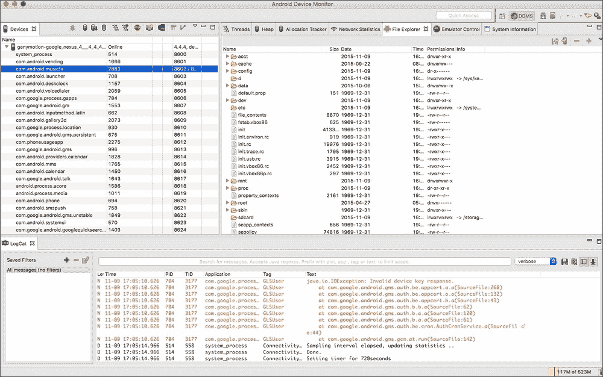

屏幕有不同的部分：

1.  左上部分显示了活动设备和设备上运行的不同进程。

1.  右上部分展示了各种选项，默认选项为文件资源管理器。在底部，显示了**LogCat**。

DDMS 中还有更多可用的选项，让我们详细探索它们。首先，我们之前看到的左上部分：

1.  图标开始调试选定的进程。

1.  图标将在每次为选定进程触发 GC 时更新堆。

1.  下一个图标，，将 HPROF 转储到文件中。**HPROF**是一种二进制格式，包含应用程序堆的快照。有一些工具可以可视化它们，例如 jhat。稍后，我们将展示如何转换此文件并将其可视化的示例。

1.  选项将触发我们应用程序的垃圾回收（对前一个条目很有用）。

1.  图标更新 DDMS 中的线程。在处理多线程应用程序时，这将非常方便。

1.  使用图标，我们可以开始分析线程并显示有关它们的准确信息。稍后将展示一个完整的示例。

1.  要停止正在运行的进程，我们可以使用图标。

1.  要对应用程序进行截图，可以使用图标来实现。

1.  使用，我们可以获取视图层次结构的快照并将其发送到 UI 自动化工具。

1.  选项利用 Android 的 systrace 捕获系统范围的跟踪。

1.   图标用于开始捕获 OpenGL 跟踪信息。

# 捕获和分析线程信息

现在我们来看看如何处理线程调试。传统的设置断点并等待线程被调用的方法在这里效果不佳，因为多线程应用程序可能有多个线程同时运行且相互独立。因此，我们希望能够独立地可视化和访问它们。

在列表左侧选择一个进程，并点击  图标。如果你现在点击右侧的线程部分，你会看到这个部分已经用当前进程的线程信息进行了更新：

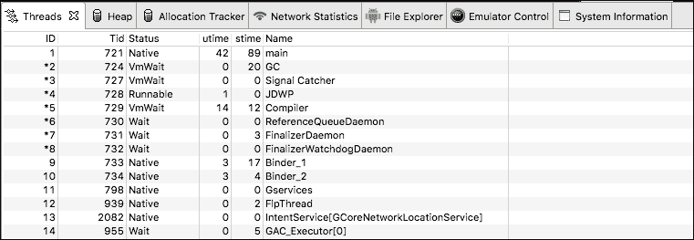

### 注意事项

一些开发者对于进程和线程是什么感到困惑，以防万一：进程提供了执行程序所需的资源（虚拟地址空间、可执行代码、安全上下文等）。进程是执行进程的实例（在某些上下文中也称为任务）。同一个程序可以有多个进程与之关联，且这些进程在机器重启时会消失。线程是进程的一个子集。一个进程可以由多个线程组成，多个线程在多处理器系统中利用并行性。同一进程中的所有线程共享一个地址空间和堆栈或文件描述符，以及其他内容。

我们可以在屏幕上看到每个线程的不同信息：它们都有一个 ID、线程 ID（Tid）、状态、utime（累计执行用户代码的时间，通常以“jiffies”，即 10 毫秒为单位）、stime（累计执行系统代码的时间，也是以 jiffies 为单位）以及一个名称。如果我们点击其中一个进程，我们将在紧随其下的部分可视化该进程的堆栈跟踪。

我们已经提到线程可以被分析。这通常用于调试内存泄漏。在开始分析之前，请记住以下几点：

+   API 级别低于 7（Android 2.1）的设备需要有一个 SD 卡，因为分析数据将保存在那里。

+   API 级别 7 以上的设备不需要有 SD 卡。

点击  图标。在 API 级别 19（Android 4.4）以上的 Android 设备上，如果你选择基于跟踪的分析，系统会提示你选择采样频率。激活后，DDMS 将捕获有关所选进程的信息，你只需与应用程序进行交互。准备好后，再次点击图标（此时图标将变为 ）以停止分析器并转储获取的信息。会出现如下屏幕：

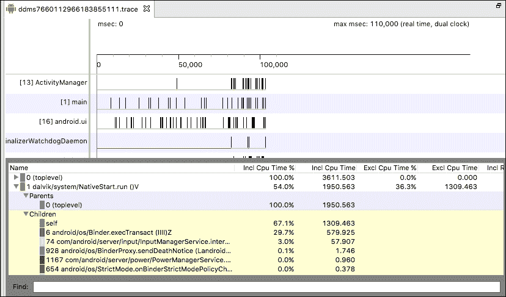

每行代表一个独立线程的执行，随着向右移动，时间增加。每个方法的执行以不同的颜色显示。

在这个新界面的底部部分是一个分析面板。这个表格显示了包括和排除 CPU 时间，以百分比和绝对值表示。排除时间是指我们在方法中花费的时间，而包括时间是我们在方法及其所有被调用函数中花费的时间。因此，调用方法被称为父方法，而方法被称为子方法。

### 注意

分析器有一个众所周知的问题：虚拟机复用线程 ID。如果一个线程停止而另一个开始，它们可能会得到相同的 ID。这可能导致混淆数据，因此在分析时请确保你正确处理线程。

# 堆分析和可视化

我们已经学会了如何使用 DDMS 来调试线程。现在我们将学习如何正确分析应用程序的内存堆：即已分配内存所在的内存部分。在调试内存泄漏时，这非常重要。

让我们使用堆转储来追踪问题。点击  图标来转储 HPROF 文件，并选择你想要保存文件的位置。现在对文件运行 `hprof-conv` 命令。`hprof-conv` 是一个 Android 实用工具，它将 `.hprof` 文件从 Dalvik 格式转换为 J2SE HPROF 格式，这样就可以使用标准工具打开它。你可以在 `/platform-tools` 目录下找到它。要运行它，你需要输入以下命令：

```kt
hprof-conv dump.hprof converted-dump.hprof

```

现在你将拥有一个可以被一些标准工具理解的文件。为了读取这个文件，我们将使用 MAT，这是一个可以从 [`www.eclipse.org/mat/downloads.php`](http://www.eclipse.org/mat/downloads.php) 下载的独立版本。

MAT 是一个非常复杂且强大的工具。点击 **文件** 并打开 **堆转储**。你将进入一个与以下类似的界面：

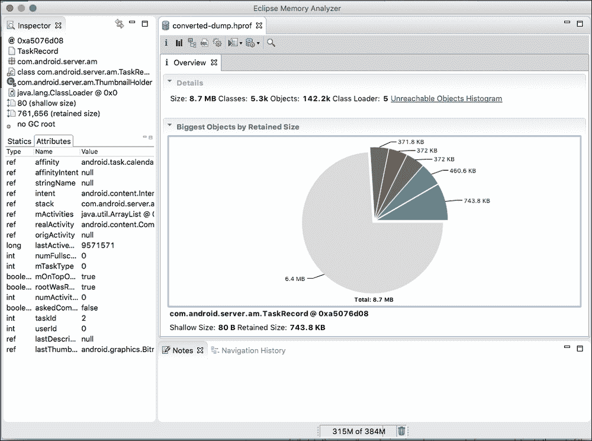

如果我们点击其中一个组，将显示一组选项。其中一个特别有趣的是 **直方图**。在直方图中，可以按实例数量、使用的总内存量或存活的总内存量过滤类。

如果我们右键点击其中一个类，并选择 **列出对象** 选项以及其引用，将在堆中生成一个类的列表。稍后可以根据使用情况进行排序。通过选择一个，我们可以显示保持对象存活的引用链。我们本身无法判断这是否意味着存在内存泄漏，但了解该领域的程序员可以确定其中某个值是否不应该再存活：

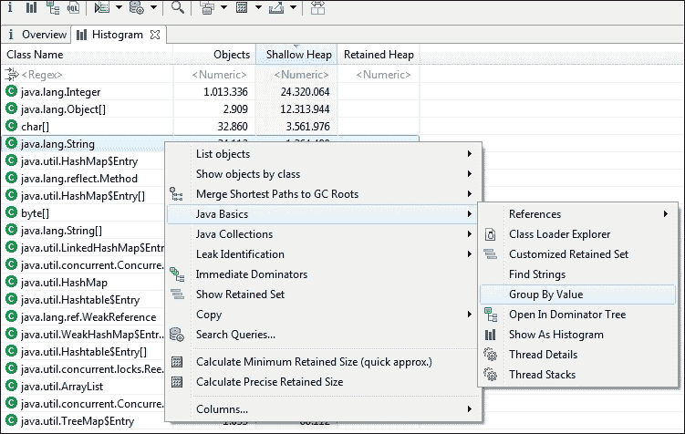

我们还可以在 DDMS 中可视化堆。如果我们选择一个进程并点击  图标，堆部分将更新有关应用程序当前所有存活的不同数据类型和对象的信息。还可以手动触发 GC，以便 DDMS 更新最新的信息。

在这里，我们可以看到每种类型的对象数量，它们的总大小（包括最小和最大对象的大小，这对于识别`OutOfMemoryExceptions`发生时非常有用），以及每个对象的中位数和平均大小：

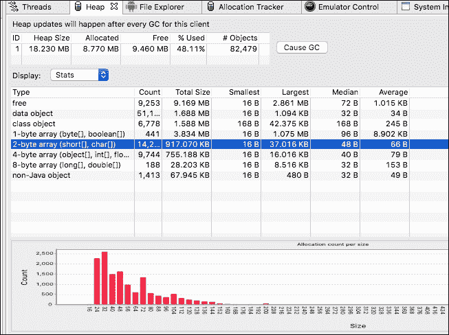

# 分配跟踪器

分配跟踪器是 Android 提供的一个工具，它记录应用程序的内存分配，并列出配置周期内所有已分配对象的调用堆栈、大小和分配代码。这比内存堆更进一步，允许我们识别正在创建的单独内存片段。它有助于识别可能低效分配内存的代码位置，以及在同一时间段内被分配和释放的相同类型的对象。

要开始使用分配跟踪器工具，请在左侧选择您的进程，在右侧窗格中选择**分配跟踪器**部分，然后点击**停止跟踪**按钮。将打开一个类似于以下窗口的界面：

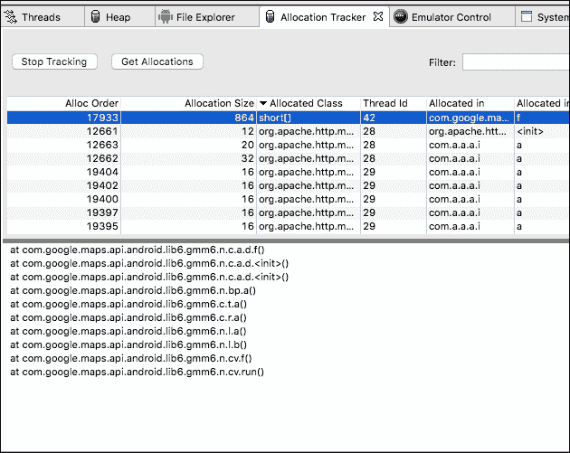

信息量可能非常大，因此底部有一个过滤器，您可以指定想要获取哪些信息。如果您点击其中一行，分配对象的位置将在屏幕上打印出来。请注意，在我们的特定情况下，我们显示的是关于 Google Maps API 中包含的对象的信息，类名以字母表示。这意味着代码已经被混淆。

使用 ProGuard 混淆代码是一种基本的安全机制。ProGuard 不仅优化代码，去除冗余，还使潜在的攻击者难以查看我们的代码，最终无法对其进行操作。此外，每一行代表一个内存分配事件。每一列代表有关分配的信息，例如对象类型、线程及其大小。

# 网络使用情况

在 Android 4.0 中，**设置**中的**数据使用情况**功能可以长期监控应用程序如何使用网络资源。从 Android 4.0.3 开始，可以实时监控应用程序的网络资源使用情况。还可以通过在使用前为网络套接字应用标签来区分流量来源。

要显示应用程序的网络使用情况，请从左侧选择一个进程。然后移至**网络统计**标签页，点击**开始**按钮。你可以选择跟踪速度：每 100、250 或 500 毫秒。然后，与你的应用程序进行交互。将显示与以下类似的屏幕：

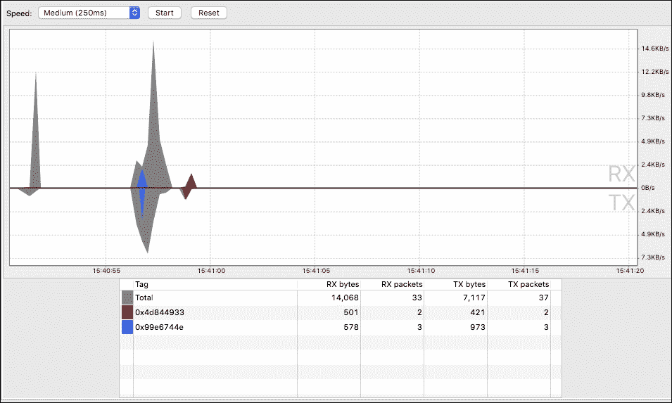

屏幕底部按**标签**显示网络信息，并通过**总计**收集。可以查看总共发送和接收的字节和包的数量，以及它们的图形表示。

如果你还没有这样做，建议使用`TrafficStats`类在每个线程上设置标签。`setThreadStatsTag()`函数将建立一个标签标识符。`tagSocket()`和`untagSocket()`函数将手动标记单个套接字。以下是一个典型的例子：

```kt
TrafficStats.setThreadStatsTag(0xF00000);
try {
  // make your network request
} finally {
  TrafficStats.clearThreadStatsTag();
}
```

# 模拟器控制

DDMS 的最后一个标签页是所谓的**模拟器控制**。通过选择我们的 adb 设备之一并启动它，将显示带有一些附加选项的标签页：

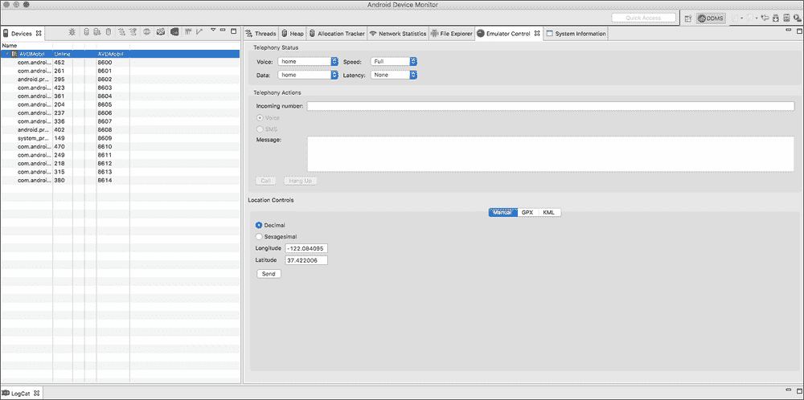

使用模拟器控制，我们可以以多种方式修改手机网络：

+   可以选择不同的数据与语音配置（如家庭网络、漫游、未找到、被拒绝等）

+   可以定义互联网连接的速度和延迟

+   可以模拟来自特定电话号码的来电或短信

+   我们可以向模拟器发送虚假位置信息。这可以手动完成，也可以通过上传 GPX/KML 文件完成

# 系统状态

DDMS 的最后部分是**系统信息**标签页。在这里，可以找到最多三个不同的信息类别：CPU 负载、当前时间的内存使用情况以及帧渲染时间（在进行游戏基准测试和调试时，这个尤其重要）：

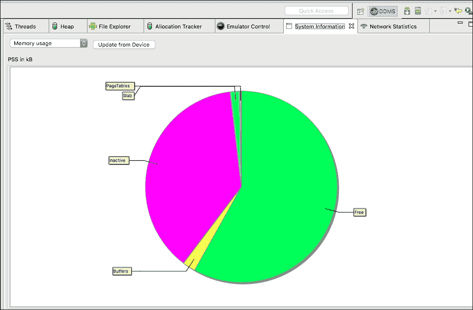

# UI 调试

我们到目前为止关注的是 Android 的内存、线程和系统方面。还有一个更直观的方面也可以显著提高我们应用程序的性能：即**用户界面**（**UI**）。Android 提供了一个名为**层次查看器**的工具，用于调试和优化为 Android 设计的任何 UI。**层次查看器**提供了应用程序布局层次的可视化表示，并带有关于可以在布局中找到的每个节点的性能信息。它提供了一个所谓的**像素完美**窗口，其中包含放大显示信息，以便在需要仔细查看像素时使用。

要运行**层次查看器**，我们首先需要连接我们的设备或模拟器。请注意，出于安全原因，只有运行开发版本 Android 系统的设备才能与**层次查看器**一起工作。连接后，从`/tools`目录启动`hierarchyviewer`程序。如果你还没有把这个目录作为系统`PATH`的一部分，现在是设置的好时机。

你将看到一个类似下面的屏幕。对于连接到系统的每个设备，你将看到一个附加的运行进程列表。选择一个进程，并点击**加载视图层次**：

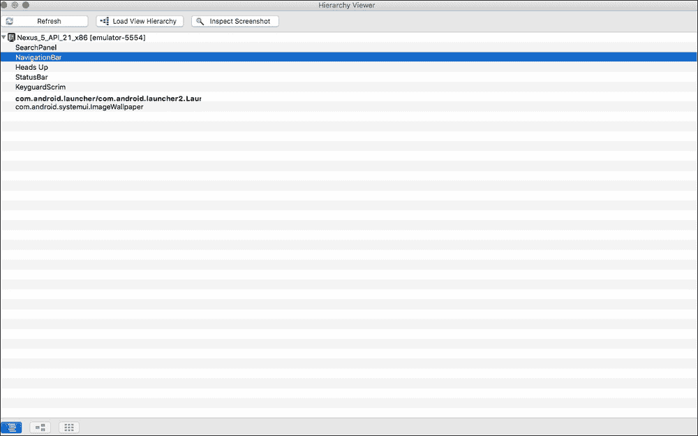

打开一个新的屏幕，显示实际的**层次查看器**。**层次查看器**如下所示：

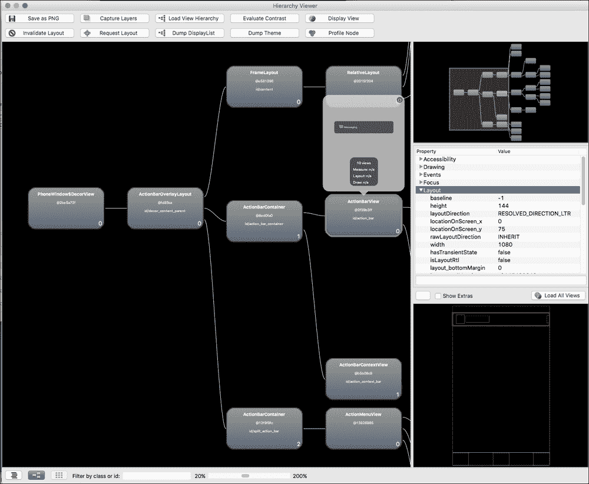

**层次查看器**包含以下元素：

+   在右上角，**树状图概览**提供了对`ViewHierarchy`应用的鸟瞰视角。

+   **树视图**可以通过鼠标拖动和缩放。当我们点击一个项目时，这个项目会被高亮显示，我们可以访问其属性。

+   在**树视图**下面的**属性**窗格，提供了视图所有属性的摘要。

+   **布局**视图显示了一个布局的线框图。当前选中的视图轮廓是红色的。如果我们点击一个轮廓，它将被选中，并且在**属性**窗格中可以访问其属性。

# 使用层次查看器进行性能分析

**层次查看器**提供了一个强大的分析器，用于分析和优化应用程序。要进行性能分析，请点击图标，选择**分析节点**。如果你的视图层次很大，可能需要一些时间才能初始化。

在这一点上，你的层次中的所有视图都将出现三个点：

+   左边的点代表渲染管道的**绘制**过程

+   中间的点代表**布局**阶段

+   右边的点代表**执行**阶段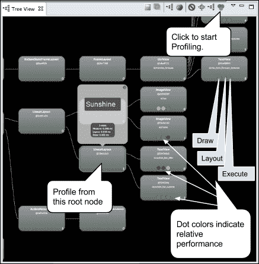

视图内的每个点颜色有不同的含义：

+   绿色点表示该视图的渲染速度至少比其他视图的一半快。通常，绿色可以被视为高性能视图。

+   黄色点表示该视图的渲染速度比层次中下半部分的视图快。这是相对的，但黄色可能需要我们查看这个视图。

+   红色意味着视图是层次中最慢的一半。通常，我们想要查看这些值。

应用**层次查看器**探查器后，我们如何解释结果？最重要的一点是，探查器总是在相对的条件下进行测量，即针对我们自己的布局。这意味着一个节点可能总是红色，但如果应用程序运行良好，它不一定就是慢的。相反的情况也适用：一个节点可能是绿色，但如果整个应用程序没有响应，性能可能就是灾难性的。

**层次查看器**应用了一个称为栅格化的过程来获取信息。对于有图形编程背景的开发者来说，如视频游戏开发，栅格化可能听起来很熟悉，它是将图形基元（例如，一个圆）转换为屏幕上的像素的过程。这通常由 GPU 完成，但在这个情况下，由于我们处理的是软件栅格化，所以由 CPU 完成。这也使得**层次查看器**的输入相对准确。

为了识别**层次查看器**的问题，需要应用一些规则：

+   叶子节点或只有少数子节点的视图组中的红点可能指向一个问题。

+   如果一个视图组有很多子节点，且在测量阶段有红点，请查看各个子节点。

+   具有红点的根视图不一定意味着有问题。这种情况经常发生，因为这是所有当前视图的父视图。

# Systrace

Systrace 是 Google SDK 中包含的一个工具，用于分析应用程序的性能。它从内核级别捕获并显示应用程序的执行时间（捕获的信息如 CPU 调度程序、应用程序线程和磁盘活动）。分析完成后，它会生成一个包含所有编译信息的 HTML 文件。

要使其工作，请点击 DDMS 视图中的**Systrace**按钮 ()。会出现如下屏幕：

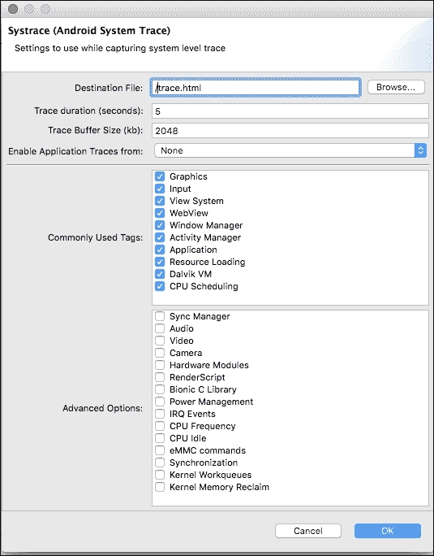

在这个屏幕上，我们可以为 Systrace 输入一些参数：

+   目标文件将存储为 HTML 文件的路径。

+   跟踪持续时间：默认值为 5 秒。30 秒是一个能获取足够信息的好值。

+   跟踪缓冲区大小：跟踪时缓冲区应该有多大。

+   我们可以选择将启用应用程序跟踪的进程，因此通常我们在这里选择自己的应用程序。

+   我们需要从列表中选择一些我们想要与之交互的标签。

当一切选择完毕后，按下**确定**按钮，与应用程序进行一段时间的交互。当 systracing 完成后，将在您提供的位置存储一个 HTML 文件。这个文件看起来如下：

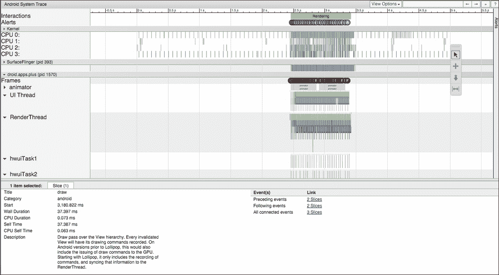

# 安卓设备调试选项

当我们调试 Android 设备时，需要激活开发者模式。默认情况下此模式是隐藏的，如果需要将设备连接到 ADB 或使用其某些选项，我们需要手动激活它。Android 的创造者们很好地隐藏了这个选项。

让我们看看如何激活这个选项以更好地了解 Android 调试，以及我们如何玩转不同的调试配置。

如前所述，设备中的开发者选项默认是隐藏的。这样做的原因很可能是为了使其仅供高级用户使用，而不是普通用户。普通用户无需访问此部分的功能；这样做可能会激活可能损坏设备的选项。

在标准 ROM 中，我们需要进入**关于**部分，向下滚动直到看到**版本号**条目，然后快速连续点击五次。会显示一个小对话框，告诉我们现在已成为开发者：

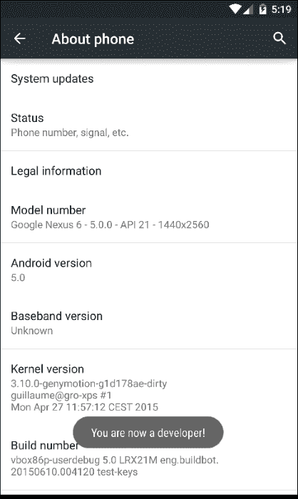

由于定制 ROM 的个性化，其他一些设备上的设置可能会有所不同。以下是一些知名制造商以及如何激活调试选项的说明：

+   **三星**：**设置** | **关于设备** | **版本号**

+   **LG**：**设置** | **关于手机** | **软件信息** | **版本号**

+   **HTC**：**设置** | **关于** | **软件信息** | **更多** | **版本号**

激活开发者选项后，我们将会看到（不同制造商可能会有所不同）在**系统**部分名为**开发者选项**的选项。如果我们点击它，将显示选项。我们需要激活**开发者选项**的开关，这样我们就可以访问整个设置：

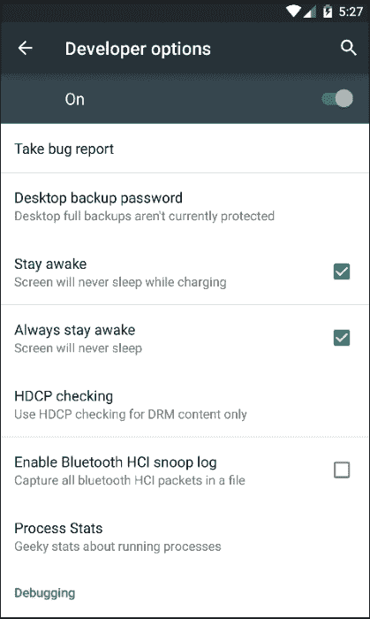

同样，每个制造商的选项可能会有所不同。然而，以下是 Android 中的默认选项的全面列表：

+   **获取错误报告**：此选项将收集关于设备当前状态的信息，并将其作为电子邮件发送。这可能需要一些时间，因为可能会收集大量信息。

+   **桌面备份密码**：这为完整的桌面备份设置一个密码，默认情况下这些备份是没有密码保护的。

+   **保持唤醒**：设备在充电时将一直保持唤醒状态，这对于调试来说非常方便。

+   **总是保持唤醒**：与上一个类似，但在这种情况下，无论设备是否在充电，设备都将保持唤醒状态。如果开发者忘记激活它，这可能会很危险，因为即使在开发后，设备也会保持唤醒状态。

+   **HDCP 检查**：**HDCP**代表**高带宽数字内容保护**。我们可以设置此选项为从不检查数字保护，总是检查数字保护，以及仅在 DRM 内容情况下检查。

+   **启用蓝牙 HCI 嗅探日志**：激活此选项后，所有 HCI 蓝牙包将被保存在一个文件中。

+   **进程统计**：此部分包含关于设备进程的极客统计数据。它显示了过去两小时一直在后台运行的应用程序，以及它们的一些特定信息（例如平均/最大 RAM 使用量、运行时间和运行中的服务）：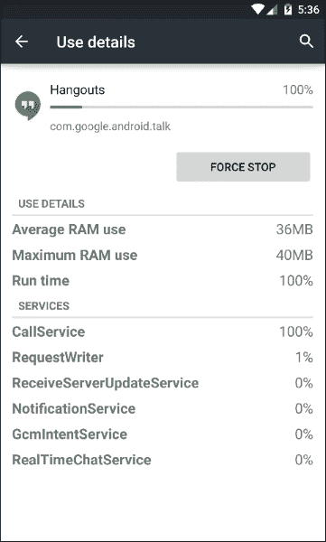

+   **USB 调试**：当连接 USB 时，此选项允许设备使用 ADB 调试应用程序。这应该是开发者首先激活的选项。

+   **错误报告快捷方式**：此选项在电源菜单中显示一个按钮，可以按此按钮来获取错误报告。

+   **允许模拟位置**：激活此选项后，可以模拟位置信息。

+   **启用视图属性检查**：激活此选项后，我们能够在 Android 系统管理器中查看属性检查。

+   **选择调试应用**：通过此选项，我们能够选择要调试的应用程序，无需输入冗长的`adb`命令。

+   **等待调试器**：此选项将正在调试的应用（在上一个选项中选择）附加到调试器。

+   **通过 USB 验证应用**：此选项默认是禁用的，除非 USB 调试选项处于激活状态。手动安装的任何内容都将被验证，以避免安装恶意软件。

+   **无线显示认证**：使用此选项帮助认证 Alliance Wi-Fi Display 规范。

+   **启用 Wi-Fi 详细日志记录**：此选项为所有 Wi-Fi 操作启用更全面的日志记录。

+   **积极的 Wi-Fi 到蜂窝网络切换**：此选项人为地降低 Wi-Fi 的**接收信号强度指示**（**RSSI**），以鼓励 Wi-Fi 状态机决定切换连接。

+   **始终允许 Wi-Fi 漫游扫描**：默认情况下，已经连接到 Wi-Fi 网络的 Android 设备在遇到更强的 SSID 时不会漫游。激活此选项后，设备将永久性地寻找新的 Wi-Fi。

+   **记录器缓冲区大小**：此选项改变每个记录器缓冲区的大小（默认为 256 K）。

+   **显示触摸**：如果激活此选项，每次与屏幕互动时都会有视觉反馈。

+   **指针位置**：这与上一个类似：指针将在屏幕上用两条垂直线标出。在屏幕顶部，将显示数字信息。

+   **显示表面更新**：当屏幕更新时，整个表面会闪烁（不建议癫痫患者使用）。

+   **显示布局边界**：在调试布局时，这是最有用的选项之一。激活后，你应该能看到所有视图边界的活泼蓝色和紫色显示：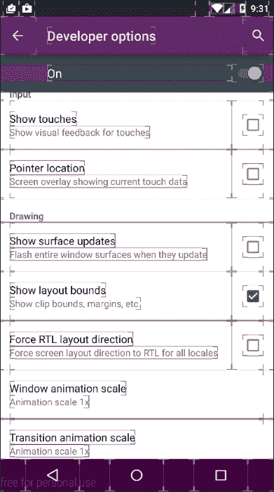

+   **强制 RTL 布局方向**：这将强制布局方向从右至左，而不是默认的左至右。一些用户可能喜欢从右至左的布局，但对于某些语言（如阿拉伯语或希伯来语），布局会自动设置为这种方式。我们可以使用此模式来测试应用程序在此配置下的行为是否正常。

+   **窗口动画缩放**：您可以设置每个窗口的动画速度（介于 0.5 倍和 10 倍之间）或取消激活。

+   **过渡动画缩放**：您可以设置每个过渡的动画速度（介于 0.5 倍和 10 倍之间）或取消激活。

+   **动画师动画缩放**：您可以设置每个动画师的动画速度（介于 0.5 倍和 10 倍之间）或取消激活。

+   **模拟辅助显示**：此设置允许开发人员模拟辅助显示的不同屏幕尺寸。

+   **强制 GPU 渲染**：使用硬件 2D 渲染。这可以使你的应用程序看起来很棒，也可能降低性能。仅用于调试目的。

+   **显示 GPU 视图更新**：每个使用 GPU 硬件绘制的元素都将被一个红色方块覆盖。

+   **显示硬件层更新**：此选项指示硬件层更新的任何时间。

+   **调试 GPU 过度绘制**：使用颜色代码可视化元素的过度绘制，具体取决于它们被绘制的频率：这可以用来研究应用程序可能进行不必要的渲染工作的地方。屏幕将开始显示大量颜色，但不要惊慌！我们可以轻松地读懂它们的含义：

    +   **真实色彩**：真实色彩意味着在执行过程中没有发生过度绘制。

    +   **蓝色**：发生了单次过度绘制。

    +   **绿色**：在应用程序的上下文中发生了两次过度绘制。

    +   **粉色**：过度绘制发生了三次。

    +   **红色**：发生了四次或更多次的过度绘制。

    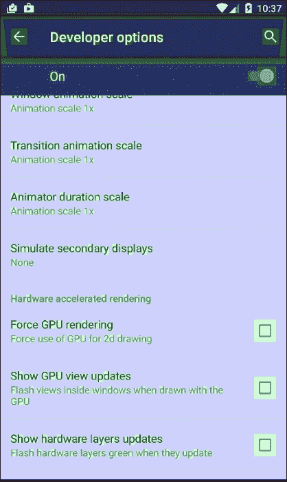

+   **强制 4x MSAA**：启用 4x **MSAA**（即**多采样抗锯齿**）。这将使你的应用程序运行更快，同时提高图像质量。

+   **禁用硬件覆盖**：使用硬件覆盖，每个应用程序都获得自己的视频内存部分，无需检查碰撞和剪辑。此选项将禁用硬件覆盖。

+   **模拟色彩空间**：使用此选项，我们可以强制 Android 仅模拟特定颜色组合的屏幕（例如，单色、红绿色、红黄色等）。

+   **使用 NuPlayer（实验性）**：NuPlayer 是一个支持在线视频内容的视频播放器。它有很多错误，因此默认情况下是禁用的。启用此选项后，NuPlayer 将被激活。

+   **禁用 USB 音频路由**：此选项禁用了 USB 音频路由自动重定向到外部外围设备。

+   **启用严格模式**：StrictMode 是一种开发者模式，它可以检测开发者可能遇到的问题，并通知他们以便修复。StrictMode 通常会捕获如在错误线程中进行网络访问等操作。

+   **显示 CPU 使用情况**：激活此选项后，会在屏幕顶部叠加有关 CPU 使用情况的信息。

+   **分析 GPU 渲染**：当激活这个工具时，它会提供 UI 帧的速度和节奏的视觉表示。这仅从 Android 4.1 开始可用。在下面的屏幕中，我们看到了一个 **分析 GPU 渲染** 工具的例子，这里有一些关于如何理解它的说明：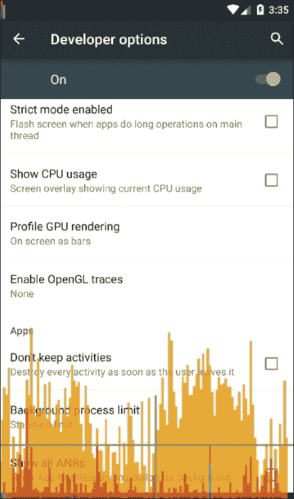

    +   水平轴表示经过的时间，垂直轴表示每帧的时间（以毫秒为单位）。

    +   每个垂直条形图对应一个渲染的帧。条形越高，渲染所需的时间就越长。

    +   绿色线条代表 16 毫秒。每次帧超过绿色线条，你的应用程序就会丢失一帧，这可能导致用户感觉到图像出现卡顿。

    +   每种颜色的线条都有其含义：条形图的蓝色部分表示用于创建和更新视图显示列表的时间。如果这部分条形很高，可能存在大量的自定义视图绘制或者在 `onDraw` 方法中有很多工作。

    +   紫色部分是花费在将资源传输到渲染线程上的时间（仅限 Android 4.1）。条形图的红色部分表示 Android 的 2D 渲染器发送命令到 OpenGL 以绘制和重绘显示列表所花费的时间。

    +   橙色部分表示 CPU 等待 GPU 完成的时间。如果这个条形太长，说明 GPU 在执行操作上花费了太多时间。

+   **启用 OpenGL 跟踪**：允许在您选择的日志文件中跟踪 OpenGL。

+   **不保留活动**：这个设置会在你离开主视图时立即关闭每个应用程序。不用说，必须小心使用这个设置，因为它会改变每个应用程序的状态。

+   **后台进程限制**：使用此选项，我们可以限制同时运行的后台进程的数量。

+   **显示所有 ANR**：当应用程序因 *应用程序无响应* 错误而受阻时，即使这在后台发生，也会显示每个 ANR。

# Android Instant Run

在撰写本文时，谷歌发布了 Android Studio 2.2 预览版。这（正如其名所示）是 Android Studio 的第二个主要版本，它包含了许多修复、性能改进以及一个名为 **Android Instant Run** 的强大工具。这个工具允许我们在代码中进行更改，并立即在我们的设备或模拟器中显示这些更改。当我们进行调试时，这是一个无价的功能，因为我们不需要重新编译应用程序，再次启动它，并重新连接到 `adb`。

要激活此选项，我们需要进入**首选项**，然后查找**构建、执行、部署** | **立即运行**。勾选**启用立即运行以在部署时热交换代码/资源更改（默认启用）**；如果你运行的是正确版本的 Gradle 插件，你将能够激活它：

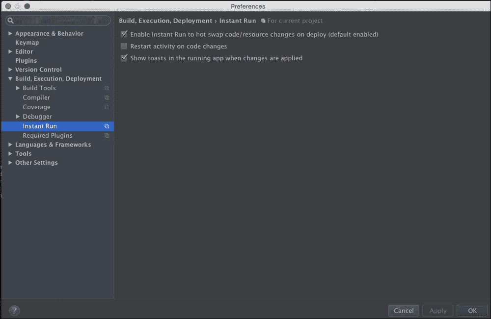

要运行应用程序，选择**运行**以使 Android Studio 正常运行。现在有趣的部分来了：在对源代码进行编辑或修改之后，再次点击**运行**将只将更改部署到设备或模拟器。

目前，**立即运行**不支持以下几项操作：

+   添加、移除或更改注解

+   添加、移除或更改实例字段

+   添加、移除或更改静态字段

+   添加或移除静态方法签名

+   更改静态方法签名

+   添加或移除实例方法

+   更改实例方法签名

+   更改当前类继承的父类

+   更改实现的接口列表

+   更改类的静态初始化器

+   添加、移除或更改字符串（允许，但需要重新启动宿主活动）

# GPU 分析工具

GPU 分析工具也是 Android Studio 2.0 中包含的一个实验性工具。这个工具旨在帮助我们理解导致渲染结果中特定问题的原因，并检查 GPU 的状态。

GPU 调试工具（其中包括 GPU 分析工具）默认情况下未安装。为此，我们需要从 SDK 管理器的 SDK 工具部分进行安装。

要在我们的应用程序中使用此分析工具，我们需要在应用程序中加载跟踪库。我们可以在 Java 代码或 C++ 代码中执行此操作（考虑到许多用于图形的代码因性能更佳而运行在 C++ 中，这是有意义的）。无论你使用哪种方法，都需要将库复制到项目中以便加载。库位于 `<sdkDir>/extras/android/gapid/android/<abi>/libgapii.so`。

我们还需要将一些其他相关文件夹复制到 `jniLibs` 目录中。可以在 `<projectDir>/app/src/main/jniLibs` 中找到它。如果它尚不存在，你应该创建它（在后续章节中会有介绍 NDK 以及如何处理本地代码的内容）。与 SDK 管理器文件夹一样，`jniLibs` 应该包含你计划支持的每个 ABI 的一个文件夹。如果你不知道你计划支持哪些 ABI，可以复制所有文件夹。最终的项目目录结构应该如下所示：`<projectDir>/app/src/main/jniLibs/<abi>/libgappii.so`。

为了在本地代码中加载库，我们需要创建一个类似于以下代码段的代码：

```kt
#include <android/log.h>
#include <dlfcn.h>

#define PACKAGE_NAME "" // Fill this in with the actual package // name
#define GAPII_SO_PATH "/data/data/" PACKAGE_NAME "/lib/libgapii.so"

struct GapiiLoader {
  GapiiLoader() {
    if (!dlopen(GAPII_SO_PATH, RTLD_LOCAL | RTLD_NOW)) {
      __android_log_print(ANDROID_LOG_ERROR, "GAPII", "Failed loading " GAPII_SO_PATH);
    }
  }
};

GapiiLoader __attribute__((used)) gGapiiLoader;
```

为了将其加载到主类中，必须使用以下代码段：

```kt
static {
  System.loadLibrary("gapii");
}
```

### 提示

**下载示例代码**

本书*前言*中提到了下载代码包的详细步骤。本书的代码包也托管在 GitHub 上，地址为[`github.com/PacktPublishing/Android-High-Performance-Programming`](https://github.com/PacktPublishing/Android-High-Performance-Programming)。我们还有其他丰富的书籍和视频代码包，可在[`github.com/PacktPublishing/`](https://github.com/PacktPublishing/)查看。请查看！

# 运行跟踪

当我们在应用程序中添加了跟踪库时，它将在启动时阻塞，直到能够连接到 Android Studio 的跟踪接收器。这意味着当你完成分析器的工作后，需要移除跟踪库，因为它会导致无用的渲染。

要开始跟踪，只需运行并部署你的应用程序。首先会提示一个空白屏幕，等待跟踪接收器连接。要启用它，请转到 DDMS 的 CPU/GPU 标签页，并点击 GPU 标签页左侧的红色跟踪按钮（）。

开始跟踪后，应用程序将解锁，我们可以与之交互。完成跟踪后，我们需要再次点击跟踪按钮以停止跟踪过程。文件写入后，它将被打开。

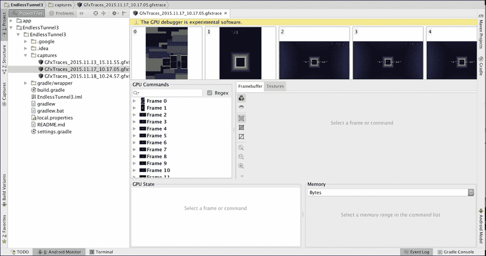

# ClassyShark

ClassyShark 是由谷歌的开发者倡导者 Boris Farber 开发的一款独立的 Android 诊断工具。ClassyShark 可以作为 Android 可执行文件浏览器，是浏览 Android 类及其内部结构（类接口和成员、依赖关系、dex 结构和计数等）的有价值工具。ClassyShark 已根据 Apache 2.0 许可发布，可以从[`github.com/google/android-classyshark`](https://github.com/google/android-classyshark)免费下载。

在分析 Android APK 内部内容时，ClassyShark 是一个有用的工具，它可以早期诊断由于多 dex 或 dexing 问题、添加的依赖关系和子库、循环依赖以及本地代码问题可能发生的问题。

# 开始使用

要开始使用 ClassyShark，最快的方法是从 GitHub 网站下载最新的`.jar`文件（在撰写本书时，可以从以下 URL 下载 6.6 版本：[`github.com/google/android-classyshark/releases`](https://github.com/google/android-classyshark/releases)）。下载最新版本，然后从控制台使用以下命令运行：

```kt
java –jar route/to/ClassyShark.jar

```

这将启动应用程序。你会看到一个如下面的屏幕：

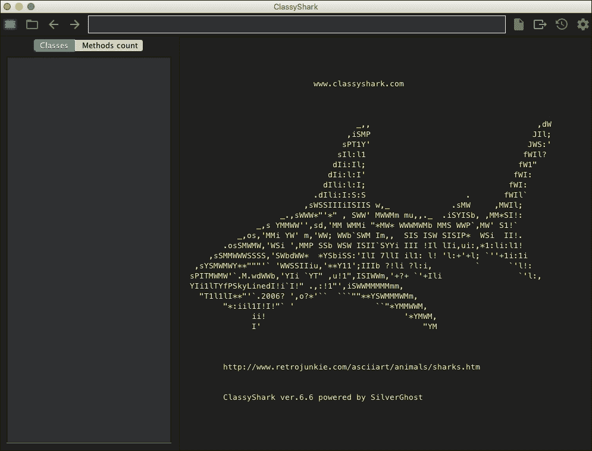

现在是打开一个示例 APK 来查看其组成并开始使用 ClassyShark 的时候了。点击图标，将显示一个选择 APK 的屏幕。从你的项目中选择一个 APK（如果你使用的是 Android Studio，它们通常在`build/output/apk`文件夹中）。为此，任何 APK 文件都是有效的。

### 注意

如果你想要自动化 ClassyShark，或者你更习惯于命令行，也可以通过运行以下命令直接打开 APK：

```kt
java –jar ClassyShark.jar –open nameOfApk.jar

```

打开文件后，你将能够看到类似于以下截图的内容：

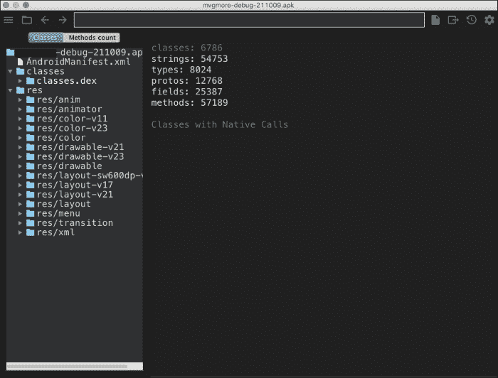

+   在左侧，我们可以看到一个包含 APK 文件文件夹和资源的树状结构（包括`classes.dex`内的所有文件）。

+   在右侧，我们可以看到 APK 源代码组成的摘要：

    +   类的数量

    +   字符串的数量

    +   APK 内声明了多少个字段

    +   APK 中的方法数量

### 注意

限制数量在应用程序开发时尤其是一个重要的上限。特别是，我们可以引用 APK 上的大量方法，但我们只能调用前 65,536 个。再也没有空间存放调用指令了。这个问题曾一度引发了争议和讨论，关于如何解决它，大多数解决方案都会影响应用程序的性能。

如果我们浏览`classes.dex`文件，将看到属于 APK 的所有源代码（请参考被 ProGuard 混淆的类），包括像 Android Support、第三方库等库的源代码。为了使它更有趣，尝试选择属于您自己应用程序的一个类，然后点击它。你应该能够显示一个类似于以下对话框：

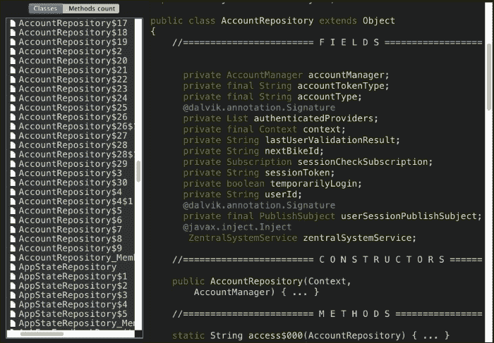

请注意，这里展示了所有文件的字段、方法和构造函数。对于所有图形和统计信息的爱好者，点击**方法计数**标签会显示一个交互式饼图。点击饼图上的任何部分，将展示一个子部分。我们还可以展开每个组的树状结构。这样，我们可以轻松地追踪 ClassyShark 中的许多问题，例如缺少库，引用来自其他子库的方法等。

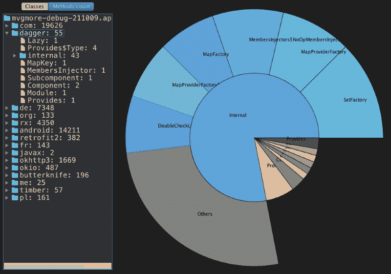

我们之前提到了 Android 的 65 K 限制。这个问题的常见解决方案之一是使用 multidexing：这意味着包含几个`.dex`文件，每个文件包含不超过 65 K 的方法。虽然这解决了限制问题，但它可能导致一些性能问题。

使用 ClassyShark，我们可以准确地确定一个方法被包含在哪个`.dex`文件中。当包含多个`.dex`文件时，它们都将被显示出来，如下面的截图（来自 I/O 调度应用程序）所示：

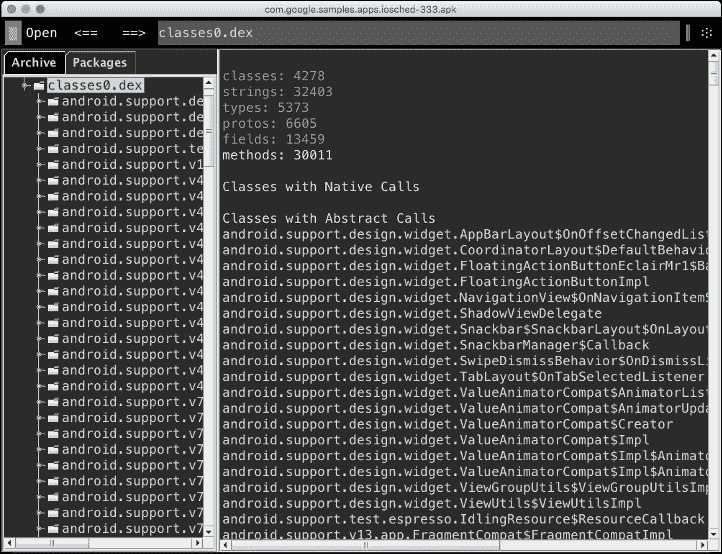

# 总结

调试 Android 应用程序是一门科学，开发者需要掌握。大多数调试工具都有一个学习曲线，以便能够有效地使用它们，并了解在特定情况下需要使用哪个工具。Android 提供了一套工具，需要一些时间来熟悉，由于 Android 作为一个移动平台的特殊性，一些工具需要具备特定的调试知识，如线程和内存管理。

阅读本章节后，用户将了解到在开发 Android 应用程序时可能遇到的全部问题（如 ANRs、内存泄漏、错误的线程处理等），以及必须使用哪些工具来进行分析并解决问题。使用高级技术，如性能分析，将帮助我们找到程序中的错误、内存泄漏和错误的线程处理；这些仅通过使用应用程序是无法轻易发现的。
