# 第三章：构建布局

应用的图形设计和导航定义了它的外观和感觉，这可能是成功的关键，但在处理目标用户的 Android 屏幕尺寸和 SDK 级别碎片化时，构建稳定、快速加载和高效的 UI 非常重要。无论外观如何，一个缓慢、无响应或无法使用的图形 UI 可能会导致差评。这就是为什么在每一个应用的开发过程中，你都必须牢记创建高效布局和视图的重要性。

在本章中，我们将详细介绍 UI 的优化细节，以及了解如何提高屏幕性能和效率的有用工具，以满足应用用户的期望。

# 演练

理解设备屏幕背后的关键概念和代码对提高开发 Android 应用时的稳定性和性能非常重要。让我们从了解设备如何刷新屏幕内容以及人眼如何感知它们开始。我们将探讨开发者可能面临的限制和常见问题，了解谷歌团队在 Android 发展过程中引入的解决方案，以及开发者可以使用哪些解决方案来最大化他们的开发成果。

## 渲染性能

让我们先了解一下人脑在观看我们的应用时的工作原理，以便更好地理解如何改善用户体验我们应用的性能。人脑接收来自眼睛的模拟连续图像以进行处理。但数字世界是由离散的帧数来模拟真实世界的。这一巧妙系统背后的基本机制基于一个主要的物理定律：单位时间内处理的帧数越多，人脑对运动的感知效率越高。人脑感知运动的最小帧数每秒在 10 到 12 帧之间。

设备要创建最流畅的应用，每秒最合适的帧数是多少？为了回答这个问题，我们来看看不同行业是如何处理这个问题的：

+   **电视和戏剧电影**：在这个领域，电视广播和电影使用了三种标准的帧率。它们分别是 24 FPS（美国 NTSC 和电影院使用）、25 FPS（欧洲 PAL/SECAM 使用）和 30 FPS（家用电影和摄像机使用）。使用这些帧率时，可能会出现运动模糊：即当大脑处理后续图像过快时，视觉清晰度会降低。

+   **慢动作与新电影制作人**：这类用途最常使用的帧率是 48 FPS——这是电影帧率的两倍。新电影制作人采用这种方法来提高动作电影的流畅性。这种帧率也用于放慢场景，因为以 24 FPS 播放的 48 FPS 录制的场景具有与电影相同的感知水平，但速度减半。

那么应用程序的帧率又如何呢？我们的目标是让应用程序在其整个生命周期内保持 60 FPS。这意味着屏幕应该每秒刷新 60 次，或者每 16.6667 毫秒刷新一次。

有很多因素可能导致这个 16 毫秒的截止时间不被遵守；例如，当视图层次结构被重绘太多次，占用了过多的 CPU 周期时，这种情况就可能发生。如果发生这种情况，帧就会被丢弃，UI 就不会刷新，用户将看到同样的画面，直到下一个帧被绘制。这正是你需要避免的，以提供流畅的用户体验给你的用户。

有一个技巧可以加快 UI 绘制并达到 60 FPS：当你构建布局并通过`Activity.setContentView()`方法将其添加到活动中时，为了创建所需的 UI，会有许多其他视图被添加到层次结构中。在*图 1*中，有一个完整的视图层次结构，但我们添加到活动 XML 布局文件中的视图只属于下面两层：

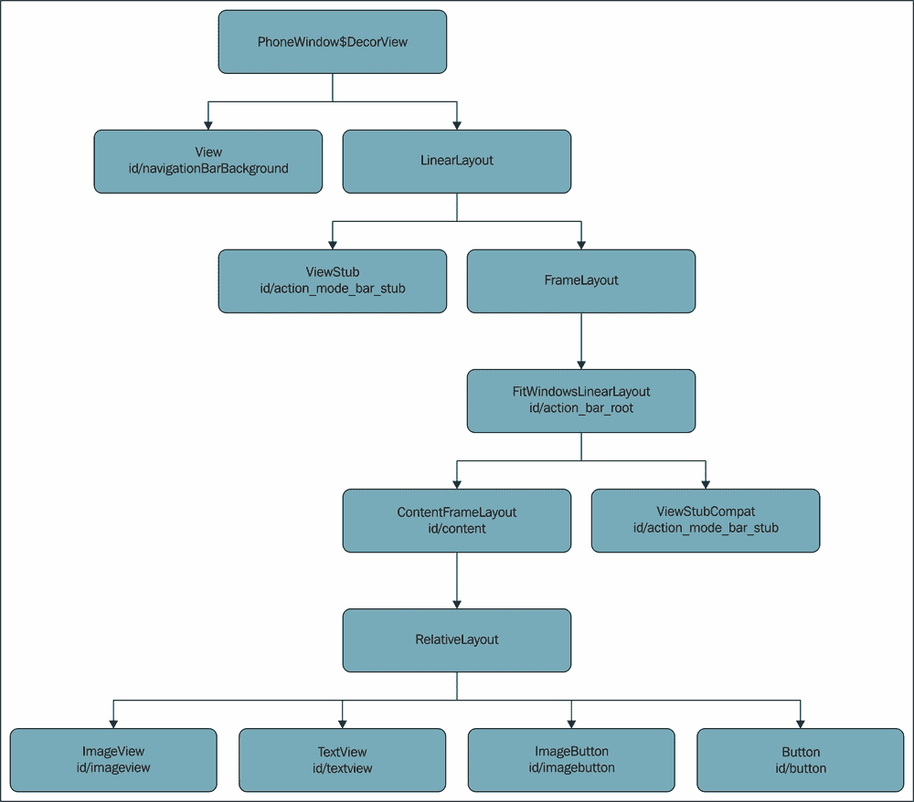

图 1：完整层次结构视图示例

目前我们关注的是层次结构顶层的视图；这个视图被称为**DecorView**，它包含了由主题定义的活动背景。然而，这个默认背景通常会被你的布局背景覆盖。这意味着它会影响 GPU 的工作量，降低渲染速度，从而降低帧率。因此，诀窍就是避免绘制这个背景，从而提高性能。

移除这个`drawable`背景的方法是在活动的主题中添加属性，或者使用以下主题（即使对于兼容主题，该属性也是可用的）：

```kt
<resources>
    <style name="Theme.NoBackground" parent="android:Theme">
      <item name="android:windowBackground">@null</item>
    </style>
</resources>
```

每当你处理全屏活动，用不透明的子视图覆盖整个 DecorView 屏幕时，这都很有帮助。不过，将活动布局背景移动到窗口 DecorView 是一个好习惯。这样做的主要原因是 DecorView 的背景是在任何其他布局之前绘制的：这意味着无论其他 UI 组件加载操作需要多长时间，用户都会立即看到背景，而不会错误地认为应用程序没有在加载。为此，只需将背景`drawable`作为先前主题 XML 文件中的`windowBackground`属性，并将其从活动根布局中移除：

```kt
<resources>
    <style name="Theme.NoBackground" parent="android:Theme">
      <item name="android:windowBackground"> 
        @drawable/background</item>
    </style>
</resources>
```

总的来说，这第二个变化并不是一个适当的改进，而只是一个让用户感觉应用程序更流畅的技巧；背景绘图与 GPU 消耗相对应，无论它是 DecorView 还是活动布局的根。

## 屏幕撕裂与 VSYNC

当我们谈论刷新时，需要考虑两个主要方面：

+   **帧率**：这是指设备 GPU 能够在屏幕上绘制一整帧的次数，以每秒帧数（frames per second）表示。我们的目标是保持 60 FPS，这是 Android 设备的标准，我们将会了解为什么。

+   **刷新率**：这指的是屏幕每秒更新的次数，以赫兹为单位。大多数 Android 设备屏幕的刷新率为 60 Hz。

虽然第二个是固定且不可更改的，但如前所述，第一个取决于许多因素，但首先取决于开发者的技能。

这些值可能不同步。因此，显示器即将更新，但决定要绘制的内容是由两个不同的后续帧在单个屏幕绘制中决定的，直到下一次屏幕绘制，这会导致屏幕上出现明显的割裂，如图*图 2*所示。这个事件也被称为**屏幕撕裂**，它会影响每个带有 GPU 系统的显示器。图像上的不连续线条称为**撕裂点**，它们是这种**屏幕撕裂**的结果：

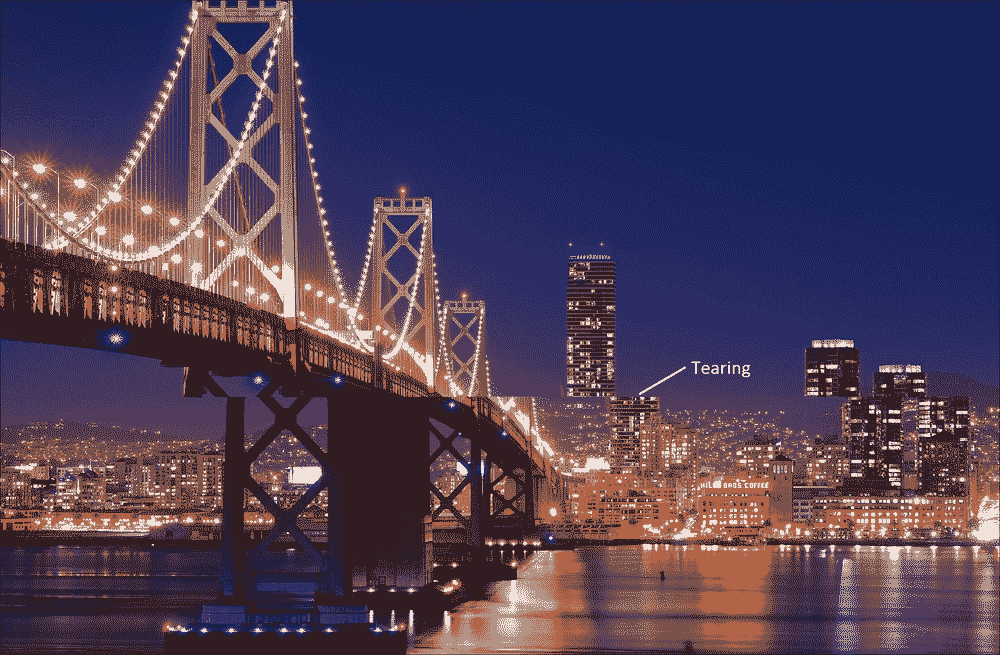

图 2：屏幕撕裂的一个示例

这种现象的主要成因可以追溯到用于绘制帧的单一流数据：每个新帧都以这样的方式覆盖前一个帧，以至于只有一个缓冲区可以读取以在屏幕上绘制。这样，当屏幕即将刷新时，它会从缓冲区读取要绘制的帧的状态，但它可能还在完成中并未完全完成。因此，如图*图 2*所示的撕裂屏幕。

解决这个问题的最常用方案是对帧进行双缓冲处理。这个解决方案有以下实现：

+   所有绘图操作都保存在后台缓冲区中

+   当这些操作完成后，整个后台缓冲区（back buffer）会被复制到另一个内存位置，称为前台缓冲区（front buffer）。

复制操作与屏幕速率同步。屏幕只从前台缓冲区读取以避免屏幕撕裂，所有后台绘图操作都可以在不影响屏幕操作的情况下执行。但是，在从后台缓冲区到前台缓冲区的复制操作过程中，是什么防止屏幕更新的呢？这称为**VSYNC**。这代表**垂直同步**，最早在 Android 4.1 Jelly Bean（API 级别 16）中引入。

VSYNC 并不是这个问题的解决方案：如果帧率至少等于刷新率，它工作得很好。看看*图 3*；帧率为 80 FPS，而刷新率为 60 Hz。总是有新帧可供绘制，因此屏幕上不会有延迟：

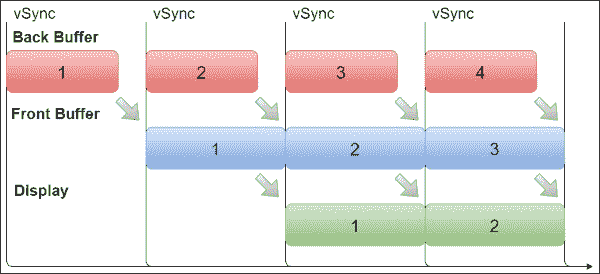

图 3：帧率高于刷新率的 VSYNC 示例

但是，如果帧率低于刷新率会发生什么呢？让我们看一下以下示例，逐步描述 40 FPS GPU 和 60 Hz 刷新率屏幕上发生的情况：即帧率是刷新率的 2/3，导致每 1.5 个屏幕刷新更新一次帧：

1.  在 0 时刻，屏幕第一次刷新，第一帧落入前景缓冲区，GPU 开始在后台缓冲区准备第二帧。

1.  在屏幕第二次刷新时，第一帧被绘制到屏幕上，而第二帧无法复制到前景缓冲区，因为 GPU 仍在完成它的绘图操作：它仍在这一操作的 2/3 处。

1.  在第三次刷新时，第二帧已被复制到前景缓冲区，因此它必须等待下一次刷新才能显示在屏幕上。GPU 开始准备第三帧。

1.  在第四步中，由于第二个帧在前景缓冲区，而 GPU 仍在准备第三个帧，因此会在屏幕上绘制第二个帧。

1.  第五次刷新与第二次相似：由于需要新的刷新，第三帧无法显示，因此第二个帧连续第二次显示。

这里所描述的内容在*图 4*中展示：

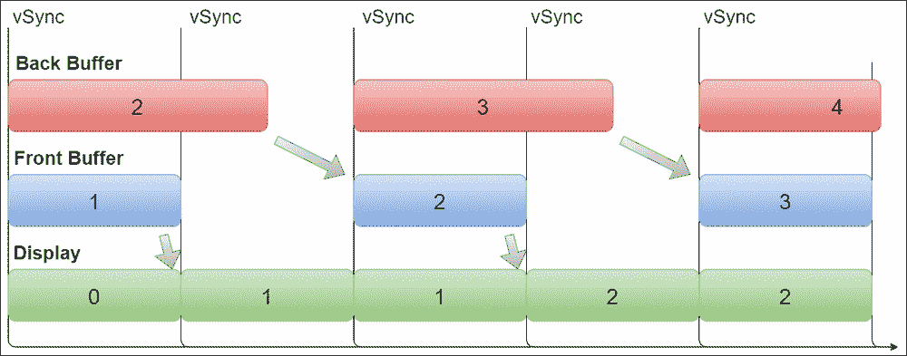

图 4：帧率低于刷新率的 VSYNC 示例

毕竟，在四个屏幕刷新中只绘制了两帧。但是，每当帧率低于刷新率时，这种情况就会发生：即使帧率是 59 FPS，实际每秒显示在屏幕上的帧数也只有 30，因为 GPU 需要等待新的刷新开始，然后才能在后台缓冲区开始新的绘图操作。这导致了滞后和抖动，并抵消了任何图形设计上的努力。这种行为对开发者来说是透明的，并且没有 API 可以控制或更改它，因此保持应用程序中的高帧率以及遵循性能技巧以达到 60 FPS 目标至关重要。

### 硬件加速

安卓平台的演变历史在图形渲染方面也有逐步的改进。这一领域最大的改进是在 Android 3.0 Honeycomb（API 级别 11）中引入了硬件加速。设备屏幕变得越来越大，平均设备像素密度在增长，因此 CPU 和软件已不再足以满足 UI 和性能需求的增长。随着平台行为的这一变化，由`Canvas`对象进行的视图及其所有绘图操作都开始使用 GPU 而不是 CPU。

硬件加速最初是可选的，应在清单文件中声明以启用，但从下一个主要版本（Android 4.0 Ice Cream Sandwich，API 级别 14）开始，默认启用。它在平台上的引入带来了一种新的绘图模型。基于软件的绘图模型基于以下两个步骤：

+   **失效**：当由于需要更新视图层次结构或仅更改视图属性而调用`View.invalidate()`方法时，失效会通过整个层次结构传播。这一步也可以由非主线程使用`View.postInvalidate()`方法调用，失效在下一个循环周期发生。

+   **重绘**：每个视图都会在 CPU 大量消耗的情况下重新绘制。

在新的硬件加速绘图模型中，由于视图被存储，重绘不会立即执行。因此，步骤变为以下：

+   **失效**：与基于软件的绘图模型一样，视图需要更新，因此`View.invalidate()`方法会传播到整个层次结构中。

+   **存储**：在这种情况下，仅重绘由失效影响的视图，并将其存储以供将来重用，从而减少运行时计算。

+   **重绘**：每个视图都使用存储的绘图进行更新，因此未受失效影响的视图使用其最后一次存储的绘图进行更新。

每个视图都可以被渲染并保存到离屏位图中以供将来使用。可以通过使用`Canvas.saveLayer()`方法来实现，然后使用`Canvas.restore()`将保存的位图绘制回画布。应谨慎使用，因为它会绘制一个不需要的位图，根据提供的边界尺寸增加计算绘图成本。

从 Android 3.0 Honeycomb（API 级别 11）开始，可以使用`View.setLayerType()`方法在为每个视图创建离屏位图时选择要使用的层类型。此方法期望以下内容作为第一个参数：

+   `View.LAYER_TYPE_NONE`：不应用任何层，因此视图不能被保存到离屏位图中。这是默认行为。

+   `View.LAYER_TYPE_SOFTWARE`：即使启用了硬件加速，这也会强制基于软件的绘图模型渲染所需的视图。在以下情况下可以使用它：

    +   如果需要对视图应用颜色滤镜、混合模式或透明度，并且应用不使用硬件加速

    +   启用了硬件加速，但它无法应用渲染绘图原语

+   `View.LAYER_TYPE_HARDWARE`：如果为视图层次结构启用了硬件加速，则硬件特定的管道会渲染层；否则，其行为将与`View.LAYER_TYPE_SOFTWARE`相同。

为了性能考虑，正确的层类型是硬件层：除非调用了视图的`View.invalidate()`方法，否则视图无需重绘；否则，将使用层位图，且无需额外成本。

我们在本节中讨论的内容对于在处理动画时保持 60 FPS 的目标非常有帮助；硬件加速层可以使用纹理来避免每次更改视图的一个属性时视图被无效并重绘。这是可能的，因为改变的不是视图的属性，而只是层的属性。以下是可以更改而不涉及整个层次结构无效的属性：

+   `alpha`

+   `x`

+   `y`

+   `translationX`

+   `translationY`

+   `scaleX`

+   `scaleY`

+   `rotation`

+   `rotationX`

+   `rotationY`

+   `pivotX`

+   `pivotY`

这些属性与谷歌在 Android 3.0 Honeycomb（API 级别 11）中发布的属性动画相同，包括对硬件加速的支持。

提高动画性能、减少不必要计算的一个好方法是，在动画开始前启用硬件层，并在动画结束后立即禁用它以释放使用的视频内存：

```kt
view.setLayerType(View.LAYER_TYPE_HARDWARE, null);
ObjectAnimator animator = ObjectAnimator.ofFloat(view, "rotationY", 
180);
animator.addListener(new AnimatorListenerAdapter() {
    @Override
    public void onAnimationEnd(Animator animation) {
        view.setLayerType(View.LAYER_TYPE_NONE, null);
    }
});
animator.start();
```

### 提示

每当你在动画化视图、改变其透明度或只是设置不同的透明度时，请考虑使用`View.LAYER_TYPE_HARDWARE`。这一点非常重要，谷歌从 Android 6.0 Marshmallow（API 级别 23）开始，自动应用硬件层，因此如果你的应用程序的目标 SDK 是 23 或更高，你就不需要手动操作。

### 过度绘制

满足 UI 要求的布局构建通常是一个容易误导的任务：完成布局后，仅仅检查我们所做的是否与图形设计师的想法一致是不够的。我们的目标是验证用户界面不会影响我们应用程序的性能。通常我们会忽略在布局内部如何构建视图，但有一个非常重要的点需要记住：系统不知道哪些视图对用户可见，哪些不可见。这意味着无论如何都会绘制每个视图，无论它是否被覆盖、隐藏或不可见。

### 注意

请记住，如果视图不可见、隐藏或被另一个视图或布局覆盖，视图的生命周期并没有结束：从计算和内存的角度来看，它的计算工作仍然会影响最终布局的性能，即使它没有显示。因此，一个良好的实践是在 UI 设计阶段限制使用的视图数量，以防止性能显著下降。

从系统角度来看，屏幕上的每一个像素都需要在每一帧更新时被更新多次，更新的次数等于重叠视图的数量。这种现象称为**过度绘制**。开发者的目标是尽可能限制过度绘制。

我们如何减少屏幕上绘制的视图数量？这个问题的答案取决于我们应用程序用户界面的设计方式。但为了实现这一目标，有一些简单的规则可以遵循：

+   窗口背景在每次更新时都会增加一个绘制层。移除背景可以减少一个过度绘制的层次。这可以通过本章前面讨论的 DecorView 来完成，直接在 XML 样式文件中删除我们活动使用的主题中的它。否则，也可以在运行时通过在活动代码中添加以下内容来完成： 

    ```kt
    @Override
    public void onWindowFocusChanged(boolean hasFocus) {
        if (hasFocus)
            getWindow().setBackgroundDrawable(null);
    }
    ```

    这可以应用于层次结构中的每个视图；这一想法是为了消除不必要的背景，以限制系统每次必须处理和绘制的层数。

+   展平视图层次结构是减少过度绘制风险的好方法；使用下面几页将要介绍的**层次查看器**和**设备上的 GPU 过度绘制**是达到此目标的关键步骤。在这种展平操作中，由于 RelativeLayout 管理，您可能会无意中遇到过度绘制问题：视图可能会重叠，使得这项任务效率低下。

+   Android 以不同的方式管理位图和 9-patches：9-patches 的一种特殊优化让系统避免绘制其透明像素，因此它们不会像每个位图像素那样继续过度绘制。因此，使用 9-patches 作为背景可以帮助限制过度绘制的面积。

## 多窗口模式

在新版本的 Android N 中，新增了一项功能，即在本书撰写时处于预览状态的**多窗口模式**。这是关于让用户在屏幕上同时并排显示两个活动。在分析其性能影响之前，我们先快速了解一下这个功能。

### 概览

这种分屏模式在竖屏和横屏模式下都可用。您可以在*图 5*中看到竖屏模式的样子，在*图 6*中看到横屏模式的样子：

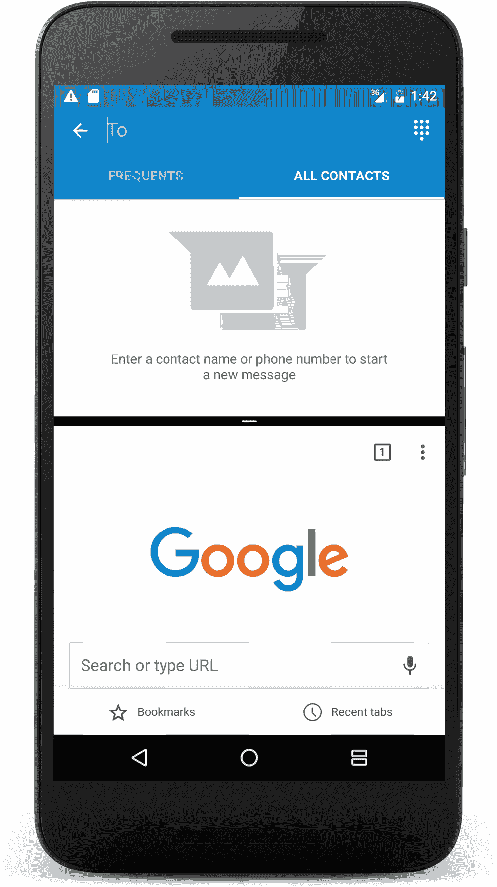

图 5：Android N 竖屏分屏模式

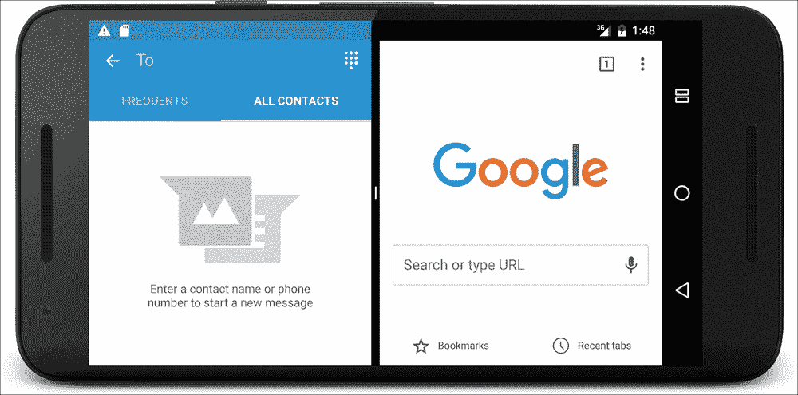

图 6：Android N 横屏分屏模式

从用户的角度来看，这种方式可以在不离开当前屏幕和打开最近应用屏幕的情况下与多个应用或活动进行交互。位于屏幕中央的分割条可以移动以关闭分屏模式。这种行为适用于智能手机，而制造商可以在更大的设备中启用**自由形态**模式，让用户通过简单的滑动手势为两个活动选择合适的屏幕比例。也可以将对象从一个活动拖放到另一个活动。

在电视设备上，这是通过使用**画中画**模式实现的，如图*图 7*所示。在这种情况下，视频内容继续播放，而用户可以浏览应用程序。然后，视频活动仍然可见，但只占用屏幕的一小部分：它是位于屏幕右上角的 240 x 135 dp 窗口：

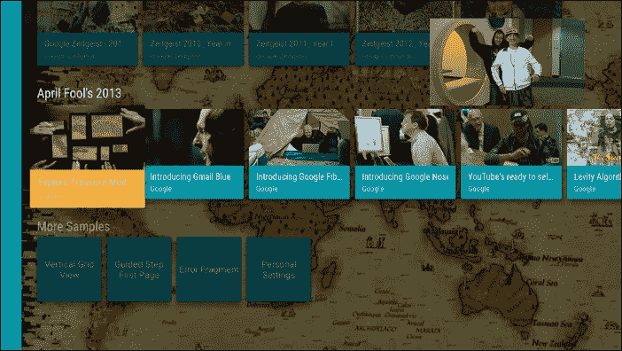

图 7：Android N 画中画模式

由于窗口尺寸较小，活动应该只显示视频内容，避免显示其他任何内容。此外，要确保画中画窗口不会遮挡后台活动的内容。

现在我们来检查与典型的活动生命周期有何不同，以及系统如何同时处理屏幕上的两个活动。在多窗口模式激活时，最近使用的活动处于恢复状态，而另一个活动处于暂停状态。当用户与第二个活动交互时，这将进入恢复状态，而第一个活动将进入暂停状态。这就是为什么无需修改活动生命周期，在新 SDK 中状态与之前相同的原因。但请记住，在多窗口模式开启时，处于暂停状态的活动应继续不限制用户体验。

### 配置

开发者可以选择通过在应用程序的清单文件中添加新的属性来设置活动支持多窗口或画中画模式。这些新属性包括以下内容：

```kt
android:resizeableActivity=["true" | "false"]
android:supportsPictureInPicture=["true" | "false"]
```

它们的默认值为 true，因此如果我们应用的目标是支持 Android N 的多窗口或画中画模式，则无需指定它们。画中画模式被视为多窗口模式的一个特例：此时，只有当`android:resizableActivity`设置为`true`时，才会考虑其属性。

这些属性可以放在清单文件中的`<activity>`或`<application>`节点内，如下面的代码片段所示：

```kt
<activity
    android:name=".BuildingLayoutActivity"
    android:label="@string/app_name"
    android:resizeableActivity="true"
    android:supportsPictureInPicture="true"
    android:theme="@style/AppTheme.NoActionBar">
    <intent-filter>
        <action android:name="android.intent.action.MAIN" />
        <category android:name="android.intent.category.LAUNCHER" 
        />
    </intent-filter>
</activity>
```

开发者还可以向清单文件中添加更多配置信息，以定义在这些特定新模式下的期望行为。为此，我们可以在`<activity>`节点中添加一个新节点，称为`<layout>`。这个新节点支持以下四个属性：

+   `defaultWidth`: 活动在自由形态模式下的默认宽度

+   `defaultHeight`：活动在自由形态模式下的默认高度

+   `gravity`: 活动在自由形态模式下首次放置在屏幕上时的对齐方式

+   `minimalSize`: 这指定了在分屏和自由形态模式下活动所需的最小高度或宽度

因此，清单文件内部的前一个活动声明变为以下内容：

```kt
<activity
    android:name=".MyActivity"
    android:label="@string/app_name"
    android:resizeableActivity="true"
    android:supportsPictureInPicture="true"
    android:theme="@style/AppTheme.NoActionBar">
    <layout
        android:defaultHeight="450dp"
        android:defaultWidth="550dp"
        android:gravity="top|end"
        android:minimalSize="400dp" />
    <intent-filter>
        <action android:name="android.intent.action.MAIN" />
        <category android:name="android.intent.category.LAUNCHER" 
        />
    </intent-filter>
</activity>
```

### 管理

新 SDK 为`Activity`类提供了新的方法，以了解是否启用了这些模式之一，以及处理不同状态之间的切换。这些方法如下所示：

+   `Activity.isMultiWindow()`: 这返回活动当前是否处于多窗口模式。

+   `Activity.inPictureInPicture()`: 这返回活动当前是否处于画中画模式。如前所述，这是多窗口模式的一个特例；因此，如果这返回`true`，则`Activity.isMultiWindow()`方法也会返回`true`。

+   `Activity.onMultiWindowChanged()`: 这是一个新回调，当活动进入或离开多窗口模式时调用。

+   `Activity.onPictureInPictureChanged()`: 这是一个新回调，当活动进入或离开画中画模式时调用。

对于`Fragment`类，也定义了具有相同签名的这些方法，以向此组件提供同样的灵活性。

开发者也可以在这些特定模式下启动一个新活动。这可以通过使用专门为此目的添加的新意图标志来实现；这是`Intent.FLAG_ACTIVITY_LAUNCH_TO_ADJACENT`，它可以以下列方式使用：

```kt
Intent intent = new Intent();
intent.setClass(this, MyActivity.class);
intent.setFlags(Intent.FLAG_ACTIVITY_LAUNCH_TO_ADJACENT);
// Other settings here...
startActivity(intent);
```

这种效果取决于屏幕上当前活动的状态：

+   **分屏模式激活**：活动被创建并放置在旧活动旁边，它们共享屏幕。如果除了启用多窗口模式（还启用了自由形式模式），我们可以使用`ActivityOptions.setLaunchBounds()`方法为两个定义的尺寸或全屏（传递 null 对象而不是`Rect`对象）指定初始尺寸，如下所示：

    ```kt
    Intent intent = new Intent();
    intent.setClass(this, MyActivity. class);
    intent.setFlags(Intent.FLAG_ACTIVITY_LAUNCH_TO_ADJACENT);
    // Other settings here...
    Rect bounds = new Rect(500, 300, 100, 0);
    ActivityOptions options = ActivityOptions.makeBasic();
    options.setLaunchBounds(bounds);
    startActivity(intent, options.toBundle());
    ```

+   **分屏模式未激活**：标志无效，活动以全屏方式打开。

### 拖放

如前所述，新的多窗口模式允许通过拖放功能在两个共享屏幕的活动之间传递视图。这是通过使用以下新方法实现的，这些方法是专门为这个功能而添加的。我们需要使用`Activity.requestDropPermissions()`方法请求开始拖放手势的权限，然后获取与想要传递的`DragEvent`相关的`DropPermission`对象。完成后，应调用`View.startDragAndDrop()`方法，并将`View.DRAG_FLAG_GLOBAL`标志作为参数传递，以启用多个应用程序之间的拖放功能。

### 性能影响

从性能的角度来看，这一切如何改变系统的行为？屏幕上暂停的活动与之前创建最终帧的过程相对应。考虑一个被对话框覆盖的可视活动：它仍然在屏幕上，当出现内存问题时系统不能杀死它。然而，在多窗口模式的情况下，如前所述，活动需要在与另一个活动交互之前继续它正在做的事情。因此，系统将不得不同时处理两个视图层次结构，这使得准备每一个单独的帧更加费力。如果我们计划启用这个新模式，那么在创建活动布局时，我们需要更加小心。因此，关注下一节*最佳实践*中表达的概念以及之后的一节将是非常好的。

# 最佳实践

我们将直接在代码中解释一些有用的方法，以尽可能限制应用程序滞后原因，探索如何减少我们视图的重叠绘制，如何简化我们的布局，以及如何提高用户体验——特别是常见情况，以及如何正确开发我们自己的自定义视图和布局，以构建高性能 UI。

## 提供的布局概览

每当调用`Activity.setContentView(int layoutRes)`方法或使用`LayoutInflater`对象膨胀视图时，相关的布局 XML 文件将被加载和解析，每个大写的 XML 节点对应一个`View`对象，系统必须实例化该对象，并且在整个`Activity`或`Fragment`生命周期中，它将是 UI 层次结构的一部分。这影响了应用程序使用期间的内存分配。让我们来了解 Android 平台 UI 系统的关键概念。

如前所述，布局资源中每个大写的 XML 节点将根据其名称和属性进行实例化。`ViewGroup`类定义了一种特殊的视图，可以作为容器管理其他`View`或`ViewGroup`类，描述如何测量和定位子视图。因此，我们将把扩展了`ViewGroup`类的每个类都称为布局。Android 平台提供了不同的`ViewGroup`子类，供我们在布局中使用。以下是主要直接子类的简要概述，通常在构建布局 XML 资源文件时使用，仅解释它们如何管理嵌套视图：

+   `LinearLayout`：每个子元素在水平或垂直方向上紧邻之前添加的元素绘制，分别对应行或列。

+   `RelativeLayout`：每个子元素相对于其他兄弟视图或父视图定位。

+   `FrameLayout`：这用于封锁屏幕区域，以管理以最近添加的视图为顶部的视图堆栈。

+   `AbsoluteLayout`：在 API 级别 3 中已弃用，因为其灵活性较差。实际上，你必须为所有子元素提供确切的位置（通过指定所有子元素的*x*或*y*坐标）。其唯一的直接子类是`WebView`。

+   `GridLayout`：这会将子元素放置在网格中，因此其使用限于将子元素放入单元格的特定情况。

## 分层布局管理

让我们了解一下每次系统被要求绘制布局时会发生什么。这个过程由两个相继的从上到下的步骤组成：

+   **测量**：

    +   根布局测量自身

    +   根布局请求所有子元素进行自我测量

    +   任何子布局都需要对其子元素递归执行相同的操作，直到层次结构的末尾

+   **定位**：

    +   当布局中的所有视图都有自己的测量存储时，根布局定位其所有子元素

    +   任何子布局都需要对其子元素递归执行相同的操作，直到层次结构的末尾

每当更改`View`属性（例如`ImageView`的图像或`TextView`的文本或外观）时，视图本身会调用`View.invalidate()`方法，该方法从下到上传播其请求，直到根布局：前面的过程可能需要一次又一次地重复，因为视图需要再次测量自己（例如，仅为了更改文本）。这会影响绘制 UI 的加载时间。你的层次结构越复杂，UI 加载越慢。因此，尽可能开发扁平的布局非常重要。

虽然`AbsoluteLayout`不再使用，而`FrameLayout`和`GridLayout`有其特定的用途，但`LinearLayout`和`RelativeLayout`是可以互换的：这意味着开发者可以选择使用其中之一。但两者都有优缺点。当你开发如图*8*所示的简单布局时，你可以选择使用不同类型的方 法来构建布局。

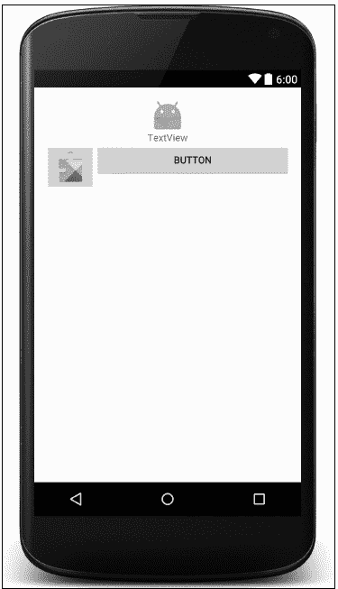

图 8：布局示例

+   第一种基于`LinearLayout`，它有利于提高可读性，但性能不佳，因为每次需要对子视图进行方向定位更改时，你都需要嵌套`LinearLayout`：

    ```kt
    <?xml version="1.0" encoding="utf-8"?>
    <LinearLayout 
        android:layout_width="match_parent"
        android:layout_height="match_parent"
        android:orientation="vertical">

        <ImageView
            android:layout_width="wrap_content"
            android:layout_height="wrap_content"
            android:layout_gravity="center_horizontal"
            android:src="img/ic_launcher" />

        <TextView
            android:layout_width="wrap_content"
            android:layout_height="wrap_content"
            android:layout_gravity="center_horizontal"
            android:text="TextView" />

        <LinearLayout
            android:layout_width="match_parent"
            android:layout_height="wrap_content"
            android:orientation="horizontal">

            <ImageButton
                android:id="@+id/imagebutton"
                android:layout_width="wrap_content"
                android:layout_height="wrap_content"
                android:src="@drawable/ 
                  common_ic_googleplayservices" />
            <Button
                android:layout_width="match_parent"
                android:layout_height="wrap_content"
                android:layout_weight="1"
                android:text="Button" />
        </LinearLayout>
    </LinearLayout>
    ```

    此布局的视图层次结构如图*9*所示：

    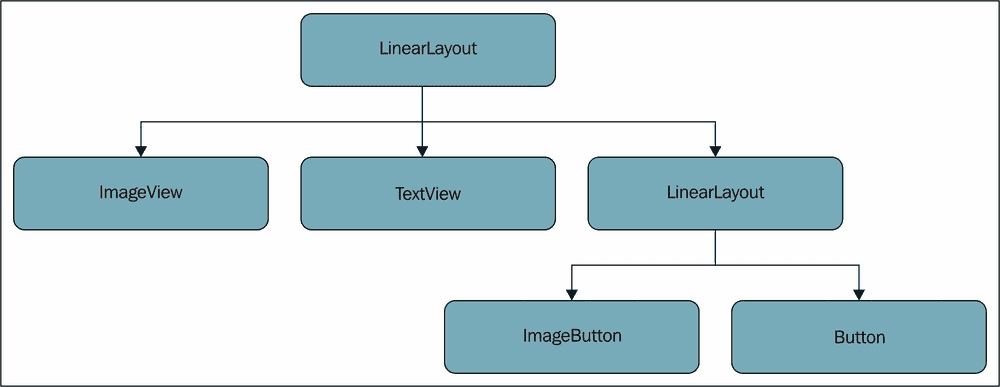

    图 9：使用 LinearLayout 构建的视图层次结构示例

+   第二种基于`RelativeLayout`，在这种情况下，你不需要嵌套任何其他`ViewGroup`，因为每个子视图的位置可以与其他视图或父视图相关：

    ```kt
    <?xml version="1.0" encoding="utf-8"?>
    <RelativeLayout 
        android:layout_width="match_parent"
        android:layout_height="match_parent"
        android:orientation="vertical">

        <ImageView 
            android:id="@+id/imageview"
            android:layout_width="wrap_content"
            android:layout_height="wrap_content"
            android:layout_centerHorizontal="true"
            android:src="img/ic_launcher" />

        <TextView 
            android:id="@+id/textview"
            android:layout_width="wrap_content"
            android:layout_height="wrap_content"
            android:layout_below="@id/imageview"
            android:layout_centerHorizontal="true"
            android:text="TextView" />

        <ImageButton 
            android:id="@+id/imagebutton"
            android:layout_width="wrap_content"
            android:layout_height="wrap_content"
            android:layout_below="@id/textview"
            android:layout_weight="1"
            android:src="@drawable 
              /common_ic_googleplayservices" />

        <Button 
            android:id="@+id/button"
            android:layout_width="wrap_content"
            android:layout_height="wrap_content"
            android:layout_alignParentRight="true"
            android:layout_below="@id/textview"
            android:layout_toRightOf="@id/imagebutton"
            android:text="Button" />
    </RelativeLayout>
    ```

    这个替代布局的层次结构如图*10*所示：

    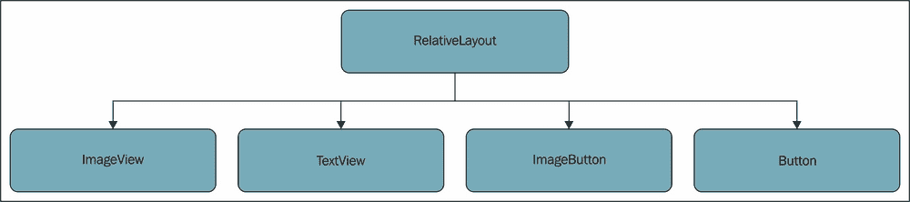

    图 10：使用 RelativeLayout 构建的视图层次结构示例

通过比较这两种方法，可以很容易看出，在第一种方法中有六个视图分布在三个层次级别中，而在第二种方法中，五个视图只分布在两个级别中。

通常的情况是采用混合方法，因为不可能总是相对于其他视图来定位视图。

### 注意

为了在创建各种布局时实现性能目标并避免过度绘制，视图层次结构应尽可能扁平，以便系统在需要时以最短的时间重新绘制每个视图。因此，建议在可能的情况下使用 RelativeLayout，而不是 LinearLayout。

在长期的应用开发过程中，一个常见的错误做法是在删除不再需要的视图后，在 XML 文件中留下多余的布局。这无谓地增加了视图层次结构的复杂性。正如在第二章高效调试以及本章后续页面中讨论的那样，通过使用 LINT 和层次结构查看器，可以方便地避免这一点。

不幸的是，最常用的 ViewGroup 是 LinearLayout，因为它相对简单易懂易管理。因此，新的 Android 开发者首先会接触它。出于这个原因，谷歌决定从 Android 4.0 冰淇淋三明治开始提供一个全新的 ViewGroup，如果使用得当，可以在处理网格时减少特定情况下的冗余。我们所说的是 GridLayout。显然，可以使用 LinearLayout 创建网格，但生成的布局至少有三层层次结构。也可以使用 RelativeLayout 仅两层层次结构创建，但生成的布局管理起来并不那么容易，视图之间的引用太多。GridLayout 只需定义自己的行和列以及单元格，就可以管理其空间。以下 XML 布局展示了如何使用 GridLayout 创建与 *图 11* 相同的布局：

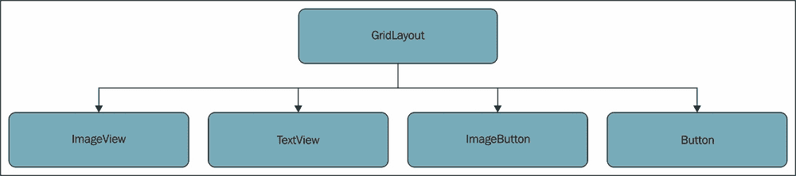

图 11：使用 GridLayout 构建视图层次结构示例

```kt
<?xml version="1.0" encoding="utf-8"?>
<GridLayout 
    android:layout_width="match_parent"
    android:layout_height="match_parent"
    android:columnCount="2"
    android:orientation="vertical">

    <ImageView android:id="@+id/imageview"
        android:layout_columnSpan="2"
        android:layout_gravity="center_horizontal"
        android:src="img/ic_launcher" />

    <TextView android:id="@+id/textview"
        android:layout_columnSpan="2"
        android:layout_gravity="center_horizontal"
        android:text="TextView" />

    <ImageButton android:id="@+id/imagebutton"
        android:layout_column="0"
        android:layout_row="2"
        android:src="img/common_ic_googleplayservices" />

    <Button android:id="@+id/button"
        android:layout_column="1"
        android:layout_row="2"
        android:text="Button" />
</GridLayout>
```

可以注意到，如果你希望 `android:layout_height` 和 `android:layout_width` 标签属性为 `LayoutParams.WRAP_CONTENT`，则无需指定，因为这正是它们的默认值。`GridLayout` 与 `LinearLayout` 非常相似，因此从后者转换过来相当简单。

## 重用布局

Android SDK 提供了一个有用的标签，在特定情况下使用，当你想在其他布局中重用 UI 的一部分，或者当你想在不同的设备配置中只更改 UI 的这一部分时。这个 `<include/>` 标签允许你添加另一个布局文件，只需指定其引用 ID。如果你想重用上一个示例的头部，只需创建如下可重用布局 XML 文件：

```kt
<LinearLayout 
    android:layout_width="match_parent"
    android:layout_height="wrap_content"
    android:orientation="vertical">

    <ImageView android:layout_width="wrap_content"
        android:layout_height="wrap_content"
        android:layout_gravity="center_horizontal"
        android:src="img/ic_launcher" />

    <TextView android:layout_width="wrap_content"
        android:layout_height="wrap_content"
        android:layout_gravity="center_horizontal"
        android:text="TextView" />
</LinearLayout>
```

然后将 `<include/>` 标签放置在你希望它出现的布局中，替换导出的视图：

```kt
<?xml version="1.0" encoding="utf-8"?>
<LinearLayout 
    android:layout_width="match_parent"
    android:layout_height="match_parent"
    android:orientation="vertical">

    <include layout="@layout/merge_layout" />

    <LinearLayout
        android:layout_width="match_parent"
        android:layout_height="wrap_content"
        android:orientation="horizontal">

        <ImageButton
            android:id="@+id/imagebutton"
            android:layout_width="wrap_content"
            android:layout_height="wrap_content"
            android:layout_below="@id/textview"
            android:src="img/common_ic_googleplayservices" />

        <Button
            android:layout_width="match_parent"
            android:layout_height="wrap_content"
            android:layout_weight="1"
            android:text="Button" />
    </LinearLayout>
</LinearLayout>
```

这样，你就不需要在不同的配置中为所有布局复制/粘贴相同的视图；你只需为所需配置定义 `@layout/content_building_layout` 文件，并且可以在每个需要的布局中这样做。但这样做，你可能会引入布局冗余，因为像前一个示例中那样将 `ViewGroup` 作为可重用布局的根节点。其视图层次结构与 *图 9* 相同，有三层和六个视图。这就是为什么 Android SDK 提供了另一个有用的标签 `<merge />`，它可以帮助移除冗余布局并保持更扁平的层次结构。只需用 `<merge />` 标签替换可重用的根布局。可重用布局将变成以下这样：

```kt
<?xml version="1.0" encoding="utf-8"?>
<merge >

    <ImageView
        android:layout_width="wrap_content"
        android:layout_height="wrap_content"
        android:layout_gravity="center_horizontal"
        android:src="img/ic_launcher" />

    <TextView
        android:layout_width="wrap_content"
        android:layout_height="wrap_content"
        android:layout_gravity="center_horizontal"
        android:text="TextView" />
</merge>
```

这样，整个最终布局就具有两层层次结构，没有多余的布局，因为系统将 `<merge />` 标签内的视图直接包含在其他视图内，替代 `<include />` 标签。实际上，相应的布局层次结构与 *图 10* 中的相同。

在处理这个标签时，你需要记住它有两个主要限制：

+   它只能作为 XML 布局文件中的根元素使用

+   每次调用`LayoutInflater.inflate()`方法时，你必须提供一个视图作为父视图并附加到它：

    ```kt
    LayoutInflater.from(parent.getContext()).inflate(R.layout. merge_layout, parent, true);
    ```

## `ViewStub`

`ViewStub`类可以作为布局层次结构中的节点添加，并指定一个布局引用，但在运行时使用`ViewStub.inflate()`或`View.setVisibility()`方法加载其布局之前，不会为它绘制任何视图：

```kt
<ViewStub 
    android:id="@+id/viewstub"
    android:layout_width="fill_parent"
    android:layout_height="wrap_content"
    android:layout_gravity="bottom"
    android:inflatedId="@+id/panel_import"
    android:layout="@layout/viewstub_layout" />
```

在运行时，以下方法被调用之前，`ViewStub`指向的布局不会被加载：

```kt
((ViewStub) findViewById(R.id.viewstub)).setVisibility(View.VISIBLE);
// or
View newView = ((ViewStub) findViewById(R.id.viewstub)).inflate();
```

加载的布局在层次结构中占据了`ViewStub`的位置，`ViewStub`不再可用。当以上方法之一调用后，`ViewStub`将无法再被访问；取而代之的是使用`android:inflatedId`属性中的 ID。

当你处理复杂的布局层次时，这个类特别有用，但你可以将某些视图的加载推迟到稍后的时间，并在需要时加载，从而减少首次加载时间并释放不必要的内存分配。

## `AdapterView`和视图回收

有一个特殊的`ViewGroup`子类，它需要一个`Adapter`类来管理其所有子项：这个类被称为`AdapterView`。`AdapterView`的常见专用类型包括：

+   `ListView`

+   `ExpandableListView`

+   `GridView`

+   `Gallery`

+   `Spinner`

+   `StackView`

`Adapter`类负责定义`AdapterView`的子项数量，并在其`Adapter.getView()`方法中加载每一个子视图，而`AdapterView`定义了子项在屏幕上的位置以及如何响应用户交互。

平台根据开发者选择处理模型的方式，提供了不同的`Adapter`实现：

+   `ArrayAdapter`：用于将`toString()`方法的结果映射到每一行

+   `CursorAdapter`：用于处理数据库中的数据

+   `SimpleAdapter`：用于绑定复选框、文本视图和图像视图

这些控件都扩展了`BaseAdapter`，后者也广泛用于创建自定义适配器。以下是`BaseAdapter`实现的一个示例：

```kt
public class SampleObjectAdapter extends BaseAdapter {
    private SampleObject[] sampleObjects;

    public SampleObjectAdapter(SampleObject[] sampleObjects) {
        this.sampleObjects = sampleObjects;
    }

    @Override
    public int getCount() {
        return sampleObjects.length;
    }

    @Override
    public SampleObject getItem(int position) {
        return sampleObjects[position];
    }

    @Override
    public long getItemId(int position) {
        return position;
    }

    @Override
    public View getView(int position, View convertView, ViewGroup parent) {
// Non optimized code: this executionis slow and we want it to be
//faster
        convertView = LayoutInflater.from(parent.getContext()) .inflate(R.layout.adapter_sampleobject, parent, false);
        SampleObject sampleObject = getItem(position);
        ImageView icon = (ImageView) convertView.findViewById(R.id.icon);
        TextView title = (TextView) convertView.findViewById(R.id.title);
        TextView description = (TextView) convertView.findViewById(R.id.description);
        icon.setImageResource(sampleObject.getIcon());
        title.setText(sampleObject.getTitle());
        description.setText(sampleObject.getDescription());
        return convertView;
    }
}
```

每一行的布局描述如下：

```kt
<?xml version="1.0" encoding="utf-8"?>
<RelativeLayout 
    android:layout_width="match_parent"
    android:layout_height="wrap_content"
    android:orientation="horizontal">

    <ImageView android:id="@+id/icon"
        android:layout_width="wrap_content"
        android:layout_height="wrap_content" />

    <TextView android:id="@+id/title"
        android:layout_width="match_parent"
        android:layout_height="wrap_content"
        android:layout_toRightOf="@id/icon" />

    <TextView android:id="@+id/description"
        android:layout_width="match_parent"
        android:layout_height="wrap_content"
        android:layout_below="@id/title"
        android:layout_toRightOf="@id/icon" />
</RelativeLayout>
```

要使用这个`Adapter`，只需按照以下方式将其设置到`ListView`中：

```kt
ListView listview = (ListView) findViewById(R.id.listview);
listview.setAdapter(new SampleObjectAdapter(sampleObjects));
```

这个控件最常见的用途就是用于`ListView`。让我们来了解一下用户滚动`ListView`时会发生什么；对于需要添加的每一个新行，都会调用`Adapter.getView()`方法。每次都会加载一个新的视图，并通过`View.findViewById()`方法引用行布局中的每一个视图。这些操作只能由主线程执行，因为它是唯一可以处理 UI 的线程。这会影响运行时的计算，经常导致滚动出现延迟，性能下降。此外，行布局层次的复杂性可能会加剧这种行为。

### `ViewHolder`模式

为了避免在`Adapter.getView()`内部对`View.findViewById()`方法的计算密集型调用，使用`ViewHolder`设计模式是一个好习惯。

`ViewHolder`是一个静态类，其目的是存储布局组件视图，以便在后续调用时可用；相同的视图被重复使用，无需为布局中的每个视图调用`View.findViewById()`方法。

之前的`SampleObjectAdapter`如下所示：

```kt
@Override
public View getView(int position, View convertView, ViewGroup parent)
{
    SampleObjectViewHolder viewHolder;
    if (convertView == null) {
        convertView = LayoutInflater.from(parent.getContext()) .inflate(R.layout.adapter_sampleobject, parent, false);
        viewHolder = new SampleObjectViewHolder();
        viewHolder.icon = (ImageView) convertView.findViewById(R.id.icon);
        viewHolder.title = (TextView) convertView.findViewById(R.id.title);
        viewHolder.description = (TextView) convertView.findViewById(R.id.description);
        convertView.setTag(viewHolder);
    } else {
        viewHolder = (SampleObjectViewHolder) convertView.getTag();
    }
    SampleObject sampleObject = getItem(position);
    viewHolder.icon.setImageResource(sampleObject.getIcon());
    viewHolder.title.setText(sampleObject.getTitle());
    viewHolder.description.setText(sampleObject.getDescription());
    return convertView;
}

static class SampleObjectViewHolder {
    TextView title;
    TextView description;
    ImageView icon;
}
```

这是因为`Adapter.getView()`方法提供了一个旧的引用视图作为`convertView`参数，以便重复使用。而其神奇之处在于：当`convertView`为空时，会填充一个视图，并将每个包含的视图存储在`ViewHolder`对象中以便后续重用，同时将`ViewHolder`对象设置为刚刚初始化的`convertView`的标签。这样，当`convertView`不为空时，`Adapter`类会给我们提供相同的实例，以便我们可以从`convertView`中检索`ViewHolder`并使用其属性视图。

### 提示

在使用`BaseAdapter`时，强烈建议使用`ViewHolder`模式，以避免频繁调用`View.findViewById()`方法，这可能会影响运行时的计算。

模式的使用由开发者自行决定；多年来，新的 Android 开发者往往不使用它，导致 Android 平台性能因在滚动`ListView`或`GridView`时出现延迟而声誉不佳。这正是谷歌引入一个名为`RecyclerView`的新视图来创建列表和网格，并自行管理子视图回收的原因之一；它可以从 Android 2.1 Éclair 开始使用，因为它包含在支持包库 v7 中。在使用这个高度灵活的新对象时，开发者不能跳过使用`ViewHolder`对象。

在这两种情况下，使用正确的尺寸显示行布局中`ImageView`的占位图像，而不是其原始尺寸，以避免 CPU 和 GPU 处理，这通常会导致`OutOfMemoryError`。

从计算的角度来看，这一模式还不足以创建一个流畅的应用程序；如前所述，只有主线程负责处理视图和 UI 交互。此外，每个处理任务都应该在工作线程中执行，以便主线程能够快速访问视图。关于这个话题，请阅读更多关于第五章，*多线程*的内容。

## 自定义视图和布局

在我们的 UI 应用开发中，我们经常遇到缺乏具有我们所需布局功能的视图，或者我们需要从头开始创建一个具有某些出色功能的视图。幸运的是，Android 平台允许我们开发各种类型的视图，以便构建所需的 UI。有很多自由度来做这件事，所以如果你在开发自定义视图时不够小心，你可能会损害内存和 GPU，造成灾难性的后果。根据我们目前所了解的内容，让我们了解在 Android 中视图是如何工作的，它是如何被测量和绘制的，以及如何优化这个过程。

尽管你可以根据需要为自定义视图添加尽可能多的属性来改善其外观，但最重要的是你如何在屏幕上绘制所有内容。有两种主要的方法可以实现这一点：

+   你可以包装一个包含所有所需视图的布局，以得到一个可重用的对象，其中每个持有的视图都由视图层次结构处理。无需指定要绘制的内容以及如何绘制，只需使用所需视图的经典布局按需排列。

+   你可以创建自己的视图，通过重写每次调用`View.invalidate()`方法使视图失效时执行的`View.onDraw()`方法，来指定要绘制的内容和方式。该方法通知系统视图需要重新绘制。

通过第二种方法，你将处理两个主要的绘图对象：

+   `Canvas`：这是用来绘制内容的对象。通过它，你可以指定绘制的内容；一个`Canvas`对象能够绘制的内容由其调用的方法决定。以下是主要的`Canvas`绘图方法：

    +   `drawARGB()`

    +   `drawArc()`

    +   `drawBitmap()`

    +   `drawCircle()`

    +   `drawColor()`

    +   `drawLine()`

    +   `drawOval()`

    +   `drawPaint()`

    +   `drawPath()`

    +   `drawPicture()`

    +   `drawPoints()`

    +   `drawRect()`

    +   `drawText()`

+   `Paint`：这是用来告诉`Canvas`如何绘制即将绘制的内容的对象。以下是用来改变对象属性的某些`Paint`方法：

    +   `setARGB()`

    +   `setAlpha()`

    +   `setColor()`

    +   `setLetterSpacing()`

    +   `setShader()`

    +   `setStrikeThruText()`

    +   `setTextAlign()`

    +   `setTextSize()`

    +   `setTypeFace()`

    +   `setUnderlineText()`

当你重写`View.onDraw()`方法时，你将需要使用作为方法参数提供的`Canvas`对象，让你的绘图显示在屏幕上（或视图边界内）。用于自定义绘图的`Paint`对象需要单独处理。

每个视图都需要能够被添加到`ViewGroups`中，这些`ViewGroups`负责在测量它们后放置其子视图。然后，告诉父视图视图大小的方法是`View.onMeasure()`。在自定义视图开发中，这是一个关键步骤，因为每个视图都必须有自己的宽度和高度；实际上，如果在`View.onMeasure()`中忘记调用`View.setMeasuredDimension()`，会导致抛出异常。

每当视图因为边界改变或需要比之前更多或更少的空间而需要重新测量时，你需要调用`View.requestLayout()`方法：它不是仅使视图本身无效，而是要求父视图重新计算所有子视图的位置并重新绘制它们。这相当于使整个视图层次结构无效。如前所述，这可能会非常昂贵，应尽可能避免。

幸亏平台的强大功能，自定义视图的创建可以带来非常有趣的结果，但所有这些自由都必须受到控制和衡量。检查视图的定时，通过查看仅包含视图的布局中的 GPU 性能，然后在一个更广泛的背景下，控制它在与其他视图一起时的行为，这是一种好习惯。

了解这一点后，让我们识别和分类开发者在开发自定义视图时可能犯的性能错误：

+   在不需要时刷新视图绘制

+   绘制不可见的像素：这是我们之前所说的过度绘制。

+   在绘制过程中通过进行不必要的操作消耗内存资源

每一个都可能导致 GPU 无法达到 60 FPS 的目标。让我们更深入地探讨它们：

+   视图无效化是新手广泛使用的方法，因为这是在任何时候刷新和更新视图的最快方式。

    ### 提示

    在开发自定义视图时，要小心不要调用那些会导致整个层次结构一次又一次重新绘制的非必要方法，这会消耗宝贵的帧绘制周期。一定要检查`View.invalidate()`和`View.requestLayout()`的调用时机和位置，因为这可能会影响整个 UI，减慢 GPU 和其帧率。

+   为了在自定义视图中避免过度绘制，你可以使用 Canvas API，它允许你只绘制自定义视图的所需部分。在设计堆叠视图或其他具有重叠部分的视图时，这会非常有帮助。我们指的是`Canvas.clipRect()`方法。例如，如果你的视图需要在屏幕上绘制多个重叠对象，我们的目标是要正确剪辑每个视图以避免不必要的过度绘制，只绘制每个对象的可见部分。

    例如，*图 12* 显示了一个堆叠视图，其中重叠的卡片不需要完全绘制：

    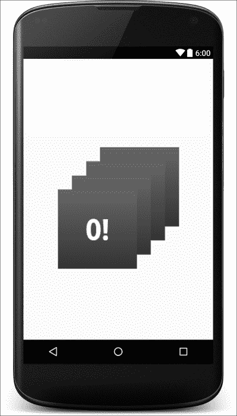

    图 12：具有重叠部分的自定义视图示例

    下面的代码片段展示了如何避免过度绘制：

    ```kt
    @Override
    protected void onDraw(Canvas canvas) {
        super.onDraw(canvas);
        for (int i = 0; i < cards.length; i++) {

            // Calculate the horizontal position of the beginning 
            // of the card
            left = calculateHorizontalSpacing(i, cards[i]);

            // Calculate the vertical position of the beginning of 
            // the card
            top = calculateVerticalSpacing(i, cards[i]);

            // Save the canvas
            canvas.save();

            // Specify what is the area to be drawn
            canvas.clipRect(left, top, visibleWidth, visibleHeight);

            // Draw the card: only the selected portion of the view // will be drawn
            drawCard(canvas, cards[i], left, top);

            //Resore the canvas to go on
            canvas.restore();
        }
    }
    ```

+   在我们的`View.onDraw()`方法实现中，我们不应该在任何由`View.onDraw()`调用的方法中放置任何分配。这是因为，当在该方法内部进行分配时，需要创建并初始化对象。然后，当`View.onDraw()`的执行结束时，垃圾回收器会释放内存，因为没有人在使用它。此外，如果视图是动画的，视图每秒会重绘 60 次。因此，避免在`View.onDraw()`方法中进行分配的重要性。

    ### 提示

    不要在`View.onDraw()`方法（或由它调用的其他方法）内部分配对象，以免增加此方法的执行负担，该方法在视图生命周期内可能会被多次调用；垃圾回收器可能会频繁释放内存，导致卡顿。更好的做法是在视图首次创建时实例化它们。

## 屏幕缩放

新的 Android N 预览版引入了一项特殊功能，如果我们不遵循之前介绍的最佳实践，可能会对我们的应用程序造成压力。我们所说的是**显示大小**，它可以在设备的**设置**中的**辅助功能**部分进行更改，如图*图 13*所示：

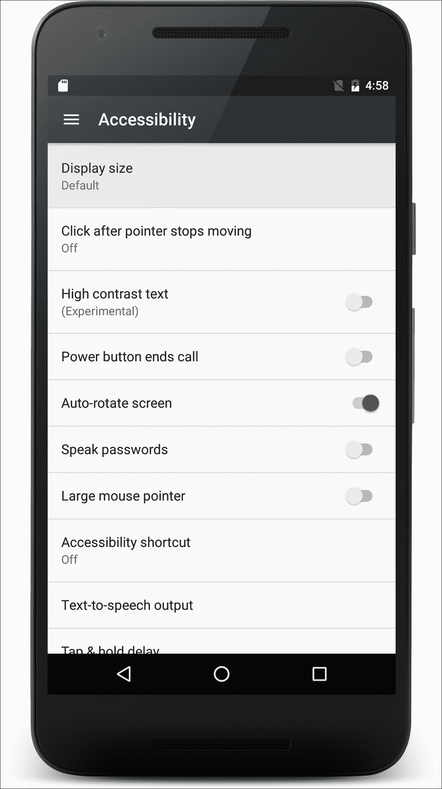

图 13：辅助功能中的显示大小设置

当用户更改设置时，会显示预览，看起来像*图 14*：

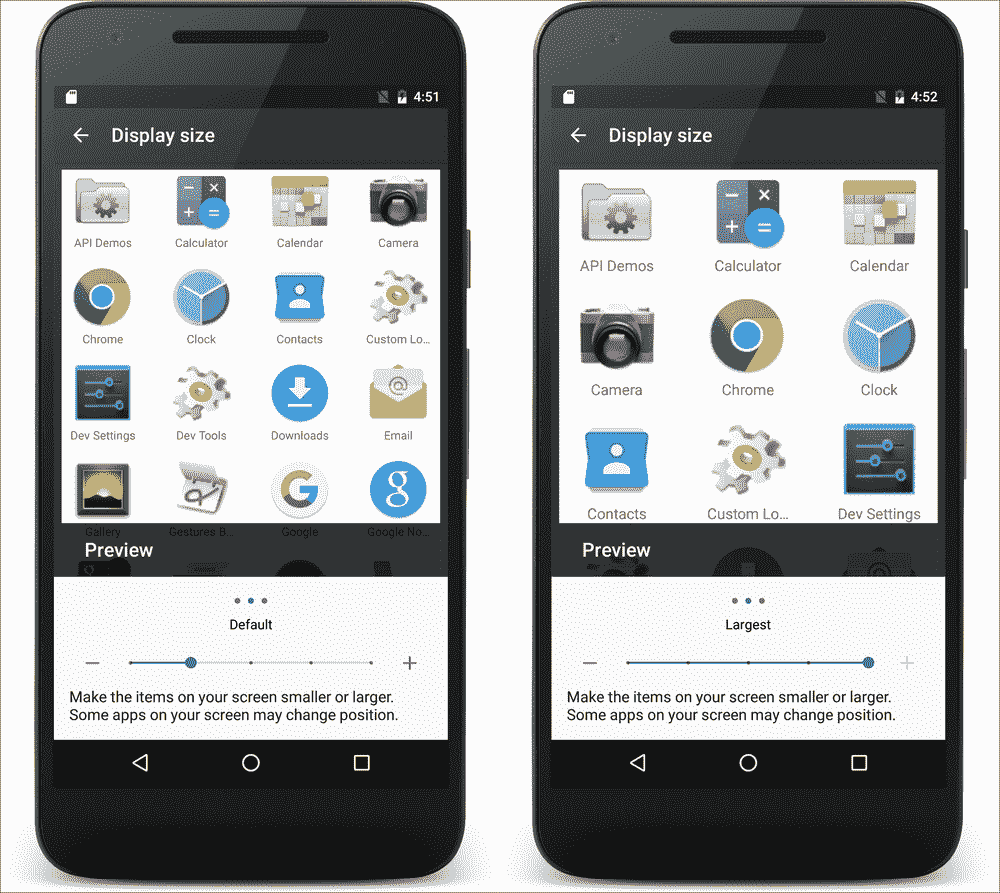

图 14：默认和最大尺寸的显示大小更改效果

现在我们快速了解一下用户在设备上设置此新功能时会发生什么。如果应用程序以新的 Android N 版本为目标进行编译，那么应用程序进程将通过典型的运行时更改框架得到通知。否则，所有进程将被杀死，活动将被重新创建，就像改变方向时一样。但这次重建会使用不同的屏幕宽度，以 dp 表示。因此，我们应该测试这个特定的用例，以确保我们的应用程序性能不受此新功能的影响。

这是我们不使用 px 测量单位，而选择更合适的 dp 单位的进一步原因。

此外，如第六章*网络通信*中所解释，我们应该改变应用程序的任何与密度相关的行为，比如图像格式缓存或对后端的服务请求。

# 调试工具

现在我们知道了创建灵活高效 UI 背后的问题以及如何解决它们。但是，我们如何知道我们做得好不好呢？此外，我们如何衡量我们辛勤工作的输出质量？让我们了解你可以使用各种工具来衡量我们的产品，同时发现并解决其他问题，以提高应用程序在整个生命周期内的性能。

## 设计视图

在开发过程中，创建 XML 布局文件是一个被低估的活动：如果在开发阶段布局设计得当，应用程序无需特别努力就能提升性能。在编写 XML 文件时，IDE 允许我们在布局编辑器中以预览模式查看我们所设计的内容。这包括**文本**和**设计**视图，如图*15*所示：

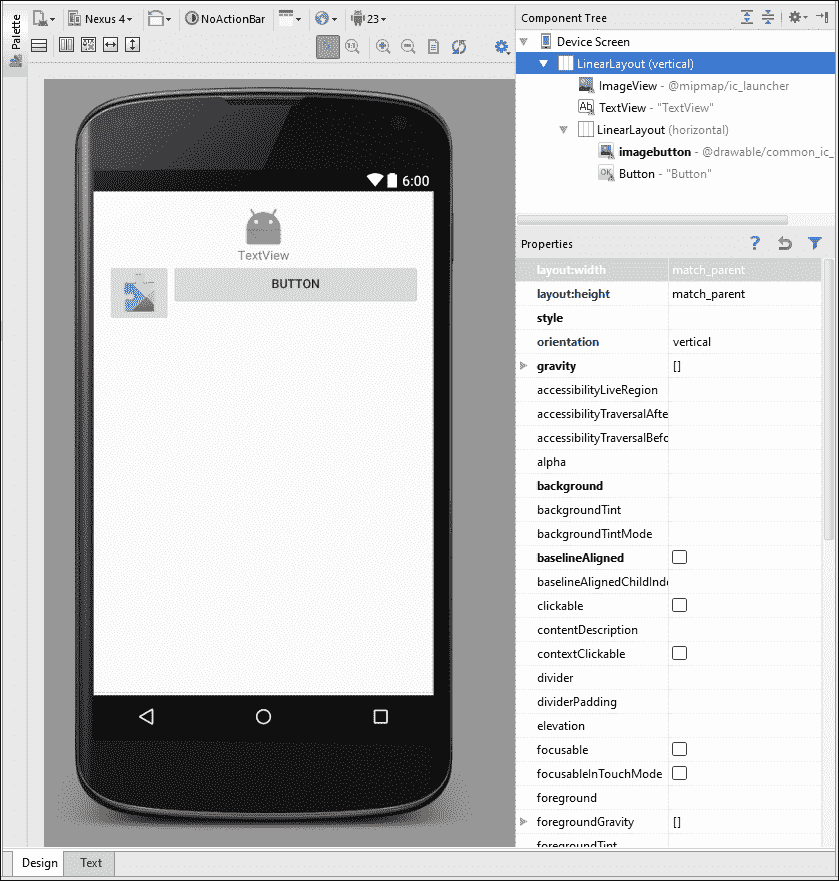

图 15：设计视图

设计视图包含一个名为**组件树**的特殊视图，它在我们构建视图层次时显示该层次。在*图 16*中，层次视图与*图 19*中的相同。这是一种实用的视觉方法，用于评估我们布局的深度：

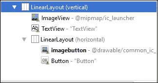

图 16：设计视图中的视图层次预览

如本章所讨论，我们的目标是扁平化层次深度，以限制计算并加速创建要在屏幕上尽可能快显示的视图。

### 注意

设计视图是在开发过程中限制层次深度的正确工具；如果在分析和开发过程中注意细节，我们可以显著减少恢复应用程序丢失性能所需的工作量。

## 层次查看器

分析视图层次、调试 UI 以及分析布局的主要工具是**层次查看器**。它位于 Android 设备监视器中，提供了一个完整的可视化工具。如图*17*所示，该工具包含许多视图，帮助我们分析 UI：

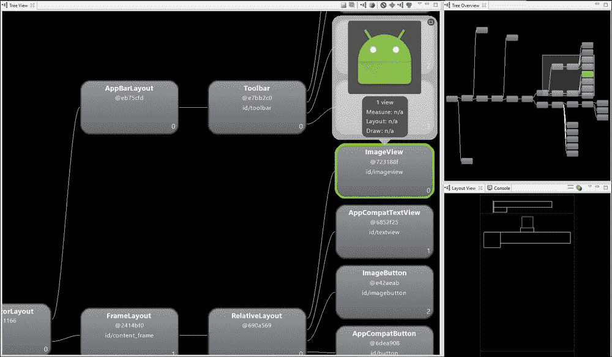

图 17：层次查看器

### 树状视图

中间面板包含带有视图层次结构缩放部分的**树状视图**。每个视图可以被选中，以打开与所选视图以及所有层次结构中较低视图相关的详细信息：

+   包含的视图数量

+   测量时间

+   布局时间

+   绘制时间

这意味着**树状视图**最左边的视图告诉我们整个 UI 创建过程所需的时间，因为它是我们布局的根。这是必须始终考虑的参数；正如前几页所讨论的，我们的目标是保持这个值低于 16 毫秒。*图 18*展示了一个选中了**ImageView**的**树状视图**示例：

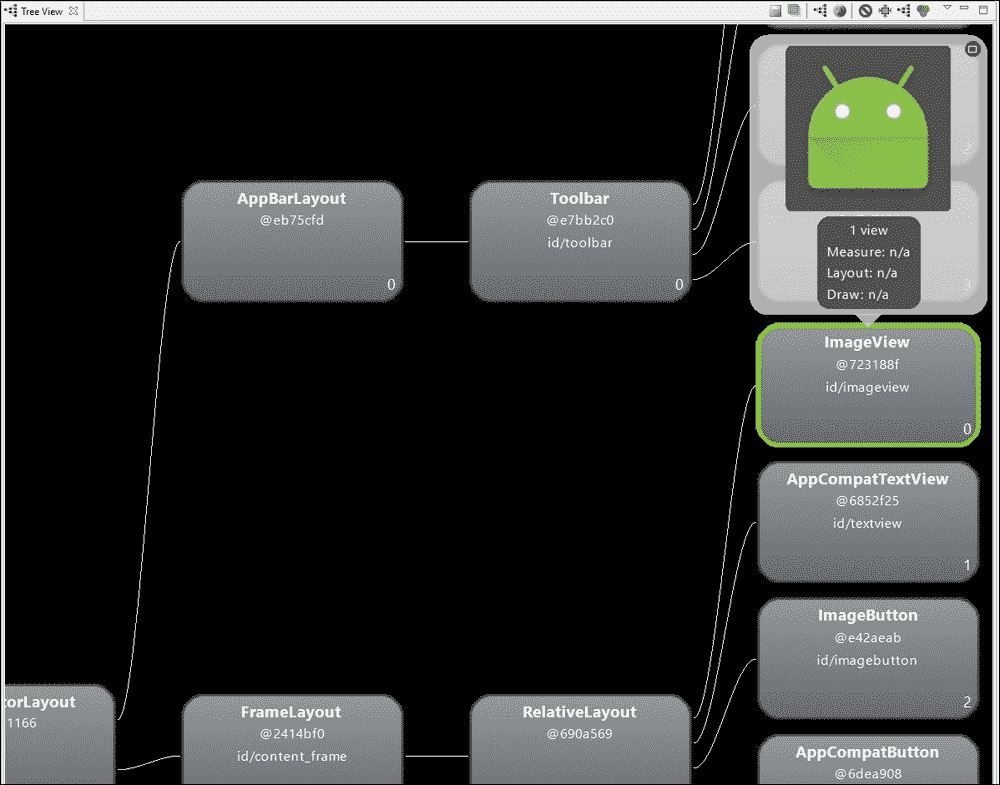

图 18：层次查看器中的树状视图

### 提示

每次测试过程都应检查布局创建时间。测量、布局和绘制步骤最多需要在 16.67 毫秒内完成。**层次查看器**中的**树状视图**可以帮助我们测量这些时间。

使用**树状视图**，我们布局的深度非常直观：这有助于我们了解在活动布局中过度设计的地方以及可能不小心添加的过度绘制。

### 视图属性

左侧面板包含两个视图：

+   **窗口**：在这里，你可以找到所有已连接设备和模拟器的列表以及所有可调试进程的子列表，选中的进程以粗体显示。可以选择其中一个，点击图标后，相关的视图将加载到树视图中，整个面板切换到**视图属性**。

+   **视图属性**：这包含了一系列用于调试视图的视图属性：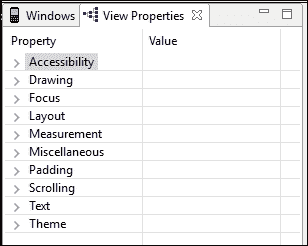

    图 19：层次查看器内的视图属性

### 树状图概览

在 Android 设备监视器的右侧，**树状图概览**显示了整个视图层次结构，而**树视图**中放大的部分被灰色处理以突出显示。这个视图向我们展示了我们构建的视图层次结构的复杂性。看*图 20*以了解**树状图概览**的外观：

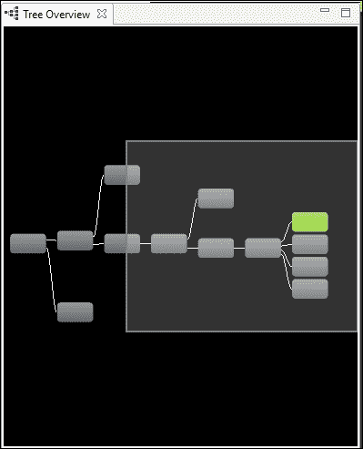

图 20：层次查看器内的树状图概览

### 布局视图

在**树状图概览**下方，有一个名为**布局视图**的视图，它显示了模拟设备屏幕上显示的布局中每个视图所覆盖的区域，这样你可以在**树视图**中选择一个特定的视图，简化在布局中查找单个视图的过程。*图 21*展示了本章示例所用的**布局视图**：

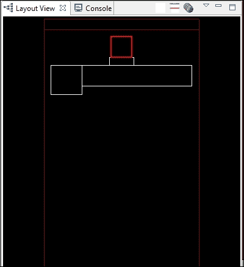

图 21：层次查看器内的布局视图

## 设备工具

当你想调试和评估你的用户界面时，在真实设备上进行操作是非常重要的。Android 系统在**开发者选项**设置中提供了许多灵活的工具，可以在设备上使用。

### 调试 GPU 过度绘制

为了在设备上调试过度绘制，Android 提供了一个有用的工具，可以在**开发者选项**内启用。在**硬件加速渲染**部分中，有**调试 GPU 过度绘制**的选项。启用后，屏幕会根据每个像素的过度绘制级别以不同的颜色显示，如果存在过度绘制，则通过添加覆盖颜色来指示：

+   **真彩色**：无过度绘制

+   **蓝色**：1 倍过度绘制

+   **绿色**：2 倍过度绘制

+   **粉色**：3 倍过度绘制

+   **红色**：4 倍以上过度绘制

例如，让我们看看*图 22*。左侧屏幕未经优化，而右侧屏幕则进行了优化。因此，这个工具对于查找我们布局中的过度绘制非常有帮助。作为开发者的我们的目标是尽可能减少叠加，以减少过度绘制并提高 GPU 计时和渲染速度。需要执行的主要操作是检查我们布局的背景和 RelativeLayouts 内部重叠的视图：

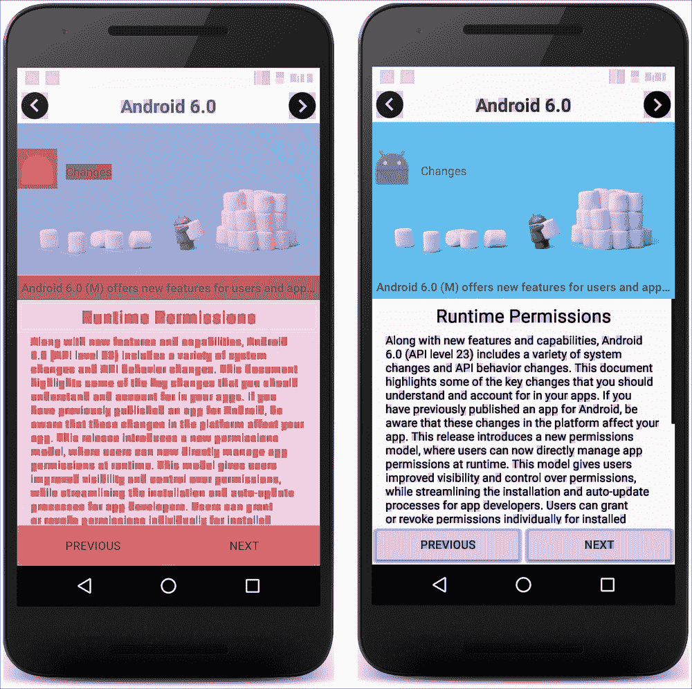

图 22：优化前后的过度绘制比较

### 分析 GPU 渲染

这个工具向开发者展示了帧渲染操作需要多长时间，并定义了这些操作是否在 16 毫秒限制内完成。从渲染的角度来看，这是评估我们应用程序性能的一个很好的方法。

尽管名字如此，所有观察到的过程都是由 CPU 执行的：GPU 以异步方式工作，在 CPU 提交渲染操作之后。

要启用它，只需在设备的**开发者设置**中的**监控部分**选择**分析 GPU 渲染**。有两个选项：

+   **以条形图显示在屏幕上**: 这显示了屏幕上的结果，有助于快速查看我们的应用程序针对每帧 16 毫秒目标的渲染性能。

+   **在 adb shell dumpsys gfxinfo 中**: 这会存储基准测试结果，以便使用`adb`命令读取

*图 23*展示了它在屏幕上的显示方式。每个垂直条对应于一帧在屏幕上渲染的时间。每新一行都在前一行的右侧。水平绿色线表示 16 毫秒的目标：如果超过这个时间，说明有东西在拖慢我们的帧渲染操作：

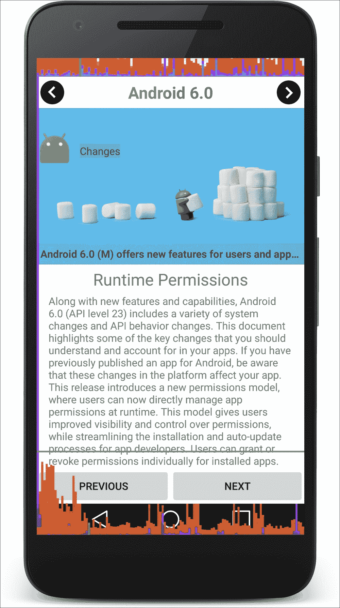

图 23：GPU 渲染工具

这个工具提供了关于每一帧渲染时发生情况的信息。垂直条被分为四个彩色段。从下到上，每一个都代表了完成不同子渲染操作所花费的时间：

+   **蓝色条——绘制**: 这表示绘制视图所花费的时间。当`View.onDraw()`方法需要做的工作太多时，这个时间会变长。

+   **紫色条——准备**: 这表示准备并将要在屏幕上显示的资源传输到渲染线程所花费的时间。

+   **红色条——处理**: 这是处理 OpenGL 操作所花费的时间。

+   **橙色条——执行**: 这是 CPU 等待 GPU 完成工作的时间。当 GPU 超负荷时，这个时间会变长。

`adb shell dumpsys`方法有助于比较我们的优化结果，以证明我们做得是否好。当使用以下命令调用时，结果会打印在终端中：

```kt
adb shell dumbsys gfxinfo <PACKAGE_NAME>

```

跟踪信息如下所示：

```kt
Applications Graphics Acceleration Info:
Uptime: 297209064 Realtime: 578485201

** Graphics info for pid 15111 [com.packtpub.androidhighperformanceprogramming] **

Recent DisplayList operations
 DrawRenderNode
 Save
 ClipRect
 DrawRoundRect
 RestoreToCount
 Save
 ClipRect
 Translate
 DrawText
 RestoreToCount
 DrawRenderNode
 Save
 ClipRect
 DrawRoundRect
 RestoreToCount
 Save
 ClipRect
 Translate
 DrawText
 RestoreToCount

Caches:
Current memory usage / total memory usage (bytes):
 TextureCache         30937728 / 75497472
 LayerCache                  0 / 50331648 (numLayers = 0)
 Garbage layers              0
 Active layers               0
 RenderBufferCache           0 /  8388608
 GradientCache               0 /  1048576
 PathCache                   0 / 33554432
 TessellationCache        2976 /  1048576
 TextDropShadowCache         0 /  6291456
 PatchCache                576 /   131072
 FontRenderer 0 A8     1048576 /  1048576
 FontRenderer 0 RGBA         0 /        0
 FontRenderer 0 total  1048576 /  1048576
Other:
 FboCache                    0 /        0
Total memory usage:
 31989856 bytes, 30.51 MB

Profile data in ms:
 com.packtpub.androidhighperformanceprogramming/com.packtpub.androidhighperformanceprogramming.BuildingLayoutActivity/android.view.ViewRootImpl@257c51f4 (visibility=0)
 Draw    Prepare Process Execute
 0.32    0.12    3.06    3.68
 0.37    0.45    2.64    0.42
 0.53    0.09    2.59    0.76
 0.33    0.22    2.59    0.42
 0.32    0.08    2.74    0.44
 0.34    0.20    2.58    0.40
 0.65    0.21    3.04    0.51
 0.36    0.61    2.80    0.41
 0.39    0.32    2.38    0.36
 0.45    0.11    2.78    0.37
 0.36    0.10    2.97    0.51
 0.48    0.49    6.95    0.75
 0.66    0.31    4.20    1.75
 0.30    0.17    2.84    1.22
 0.29    0.15    2.13    0.44
View hierarchy:
 com.packtpub.androidhighperformanceprogramming/com.packtpub.androidhighperformanceprogramming.BuildingLayoutActivity/android.view.ViewRootImpl@257c51f4
 26 views, 45.09 kB of display lists

Total ViewRootImpl: 1
Total Views:        26
Total DisplayList:  45.09 kB

```

这种渲染性能基准测试提供了比视觉测试更多的信息，如显示列表操作、内存使用情况、每个渲染操作的确切时间（这在视觉基准测试中会显示为一条条形图），以及关于视图层次结构的信息。

在 Android Marshmallow（API 级别 23）中，对先前的打印跟踪添加了新的有用信息：

```kt
Stats since: 133708285948ns
Total frames rendered: 18
Janky frames: 1 (5.55%)
90th percentile: 17ms
95th percentile: 19ms
99th percentile: 22ms
Number Missed Vsync: 0
Number High input latency: 0
Number Slow UI thread: 1
Number Slow bitmap uploads: 1
Number Slow issue draw commands: 2

```

这更有效地解释了我们的应用程序帧渲染的实际性能。

在 Android Marshmallow 中增加了一个有用的先进特性，称为**framestats**。它列出了详细的帧时序，并将数据添加到之前的打印输出（行数已减少以限制使用空间）。终端将列名作为第一行，然后列出所有其他列的值，这样第一个对应于第一个名称，第二个值对应于第二个名称，依此类推：

```kt
---PROFILEDATA---
Flags,IntendedVsync,Vsync,OldestInputEvent,NewestInputEvent,HandleInputStart,AnimationStart,PerformTraversalsStart,DrawStart,SyncQueued,SyncStart,IssueDrawCommandsStart,SwapBuffers,FrameCompleted,
0,133733327984,133849994646,9223372036854775807,0,133858052707,133858119755,133858280669,133858382079,133859178269,133859218497,133994699099,134289051517,134294121146,
1,133849994646,134283327962,9223372036854775807,0,134298506898,134298579812,134298753298,134301580193,134302094783,134302130821,134302130821,134307073077,134315631711,
0,135349994586,135349994586,9223372036854775807,0,135363372921,135363455055,135363522941,135363598369,135363991438,135364050104,135364221077,135367243259,135371662551,
---PROFILEDATA---

```

让我们解释一下这些值代表什么。每个时间戳都以纳秒为单位，新增的列如下所示：

+   `Flags`：如果是`0`，应考虑与该行相关的帧时序；否则，不考虑。如果帧的性能与正常性能有异常，它可以是非零值。

+   `IntendedVsync`：这是起点。如果 UI 线程被占用，它可能与`Vsync`值不同。

+   `Vsync`：VSYNC 的时间值。

+   `OldestInputEvent`：最老输入事件的时间戳。

+   `NewestInputEvent`：最新输入事件的时间戳。

+   `HandleInputStart`：将输入事件分派到应用程序的时间戳。

+   `AnimationStart`：动画开始的时间戳。

+   `PerformTrasversalsStart`：通过从`DrawStart`减去来获得布局和测量时序的时间戳。

+   `DrawStart`：开始绘图的时间戳。

+   `SyncQueued`：发送到`RenderThread`的同步请求的时间戳。

+   `SyncStart`：绘图同步开始的时间戳。

+   `IssueDrawCommandsStart`：GPU 开始绘图操作的时间戳。

+   `SwapBuffers`：前后缓冲区交换的时间。

+   `FrameCompleted`：帧完成的时间。

这些数据报告时间戳，因此需要通过减去两个时间戳来计算时序。结果可以向我们展示有关渲染性能的重要信息。例如，如果`IntendedVsync`与`Vsync`不同，则表示错过了一个帧，可能会出现卡顿。

可以通过在终端运行以下命令来执行这个新的`dumbsys`命令：

```kt
adb shell dumbsys gfxinfo <PACKAGE_NAME> framestats

```

## Systrace

Systrace 工具有助于分析渲染执行时序。它是 Android Device Monitor 的一部分，可以通过选择**设备**标签内的相关图标来访问。之后，将显示带有**Systrace**选项的对话框，如*图 24*所示：

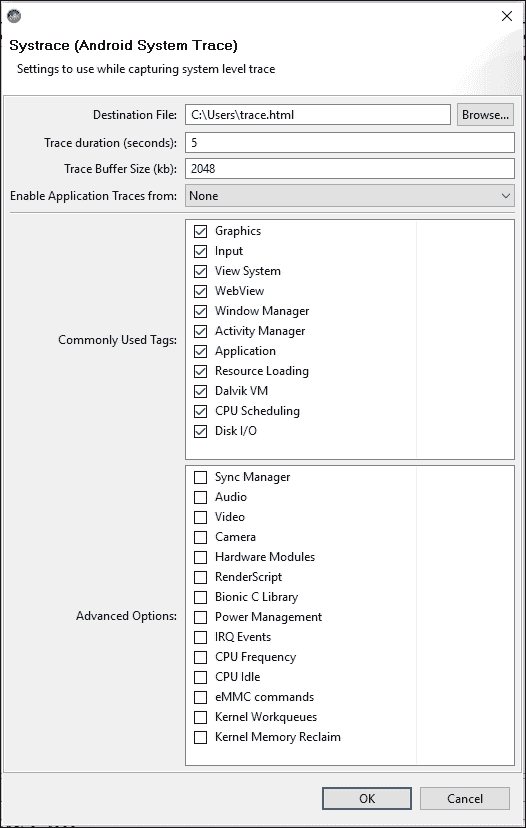

图 24：Systrace 选项

这个工具从设备上所有要跟踪的进程收集信息，并将跟踪保存到一个 HTML 文件中，图形用户界面突出显示观察到的的问题，提供关于如何修复的重要信息。

结果类似于*图 25*中的内容。视角分为三个主要视图：上部包含追踪本身，下部包含另一部分高亮对象的详细信息，而右侧视图，称为**警报区域**，包含当前追踪中报告的警报摘要。上部主要描述了关于内核的详细信息，包含所有 CPU 信息；关于**SurfaceFlinger**，即 Android 合成器进程；然后是收集信息期间每个活动进程的详细信息，即使该进程是系统进程。每个进程都包含评估期间每个运行线程的详细信息：

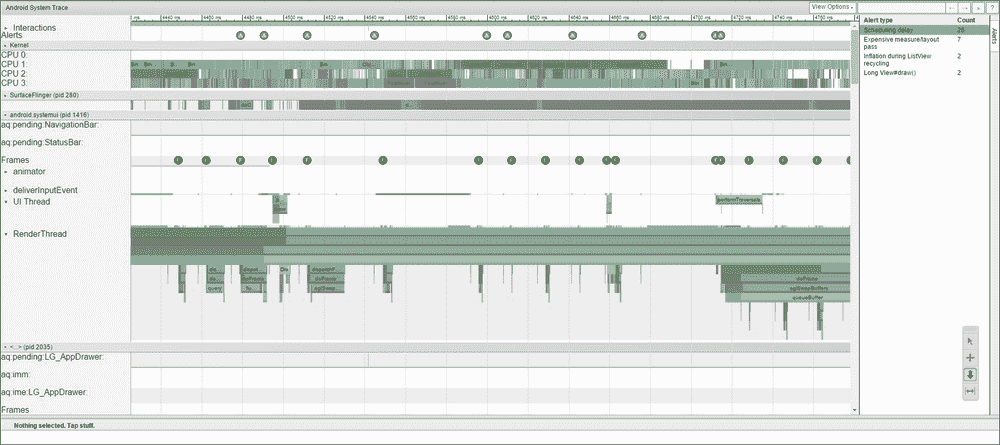

图 25：Systrace 示例

让我们了解如何分析追踪：每个单一进程的每个绘制帧在**Frames**行中以带圆圈的**F**表示，如图 26 所示：

+   绿色边框表示它们没有问题

+   黄色和红色边框表示绘图时间超过了 16 ms 的目标，产生了滞后：

    图 26：帧详情

每个错误的**F**都可以选择查看事件的详细描述。以下是 Systrace 针对红色帧报告的一个示例：

| 警报 | 调度延迟 |
| --- | --- |
| 运行 | 6.401 ms |
| 未调度，但可运行 | 16.546 ms |
| 不可中断睡眠 &#124; 唤醒 | 19.402 ms |
| 休眠 | 27.143 ms |
| 阻塞 I/O 延迟 | 1.165 ms |
| 帧 |   |
| 描述 | 制作此帧的工作被暂停了几毫秒，导致出现卡顿。确保 UI 线程上的代码不会阻塞其他线程正在进行的工作，并且后台线程（例如，进行网络或位图加载）应以`android.os.Process#THREAD_PRIORITY_BACKGROUND`或更低的优先级运行，这样它们就不太可能中断 UI 线程。这些后台线程在内核进程下的调度部分应显示优先级编号为 130 或更高。 |

如所述，此工具获取设备上每个进程和线程的信息，但如果我们想详细查看应用程序执行的部分以了解其在特定时间正在执行的工作，我们可以使用 API 告诉系统从哪里开始和结束追踪。这个 API 可以从 Android Jelly Bean（API 级别 18）开始使用，基于`Trace`类。只需调用静态方法开始和结束追踪，如下所示：

```kt
Trace.beginSection("Section name");
try {
    // your code
} finally {
    Trace.endSection();
}
```

这样，新的追踪将包含一个带有你的部分名称及其详细信息的全新行。

记得在同一线程上调用`Trace.beginSection()`和`Trace.endSection()`方法。

# 摘要

在当代移动设备的理念中，应用程序是让用户访问我们远程服务的主要方式，因此它应该是获取这些服务的最主要手段。那么，用户对我们的应用程序的感知是成功的基础，它的用户体验和用户界面是衡量这一点的关键指标。因此，确保我们的应用程序渲染过程中没有延迟是非常重要的。

在本章中，我们所做的是了解设备如何渲染我们的应用程序，定义了每帧 16 毫秒的目标，并概述了硬件加速作为 Android 系统中主要的性能渲染改进。然后我们分析了开发者在构建应用程序 UI 时可能犯的主要错误，更详细地探讨了如何通过扁平化视图层次结构、在`listview`中重用行视图以及定义开发自定义视图和布局的最佳实践来提高渲染速度。最后，我们介绍了平台提供的帮助我们发现改进优化和衡量应用渲染性能的有用工具。
