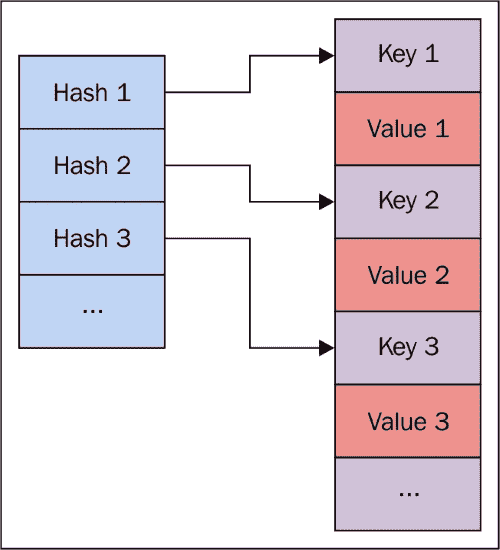
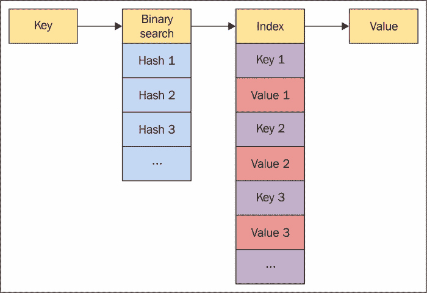
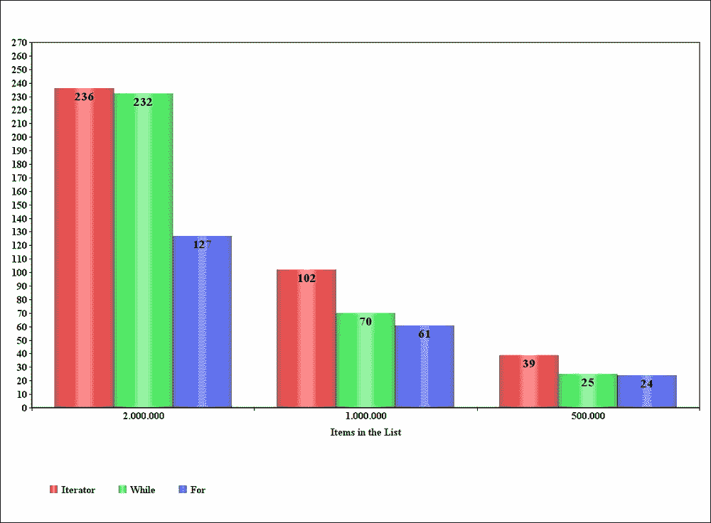
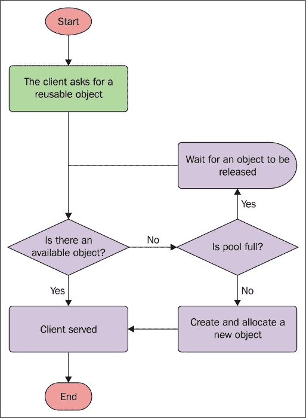
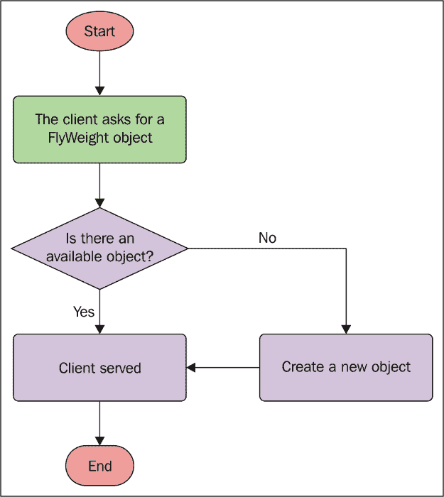
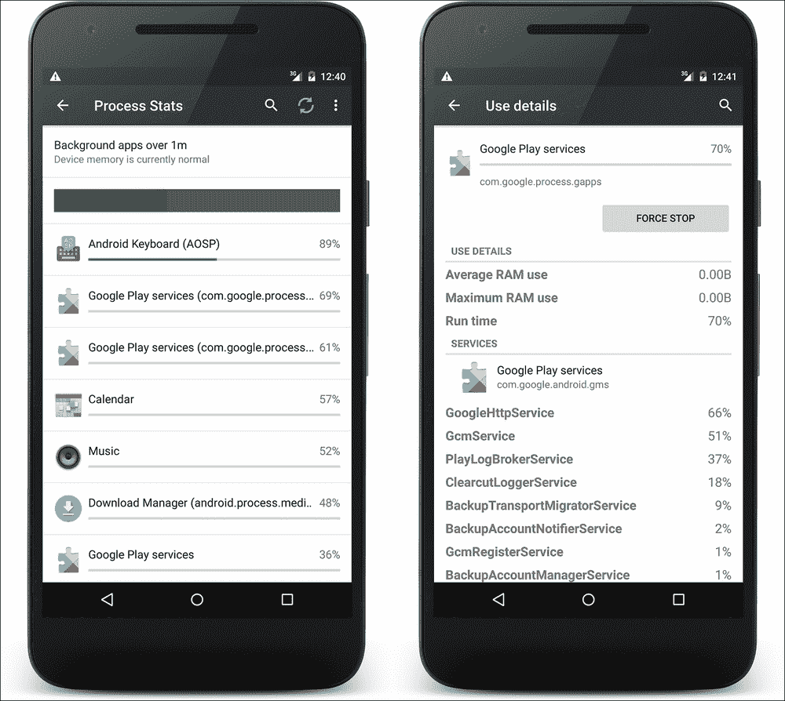

# 第四章：内存

当我们试图达到应用程序的性能目标时，内存是需要关注的问题：管理不善的应用程序内存可能会影响整个系统的行为。它还可能以同样的方式影响设备上安装的其他应用程序，正如其他应用程序可能影响我们的应用程序一样。众所周知，Android 在市场上拥有广泛的不同配置和内存量的设备。开发者需要解决如何应对这种碎片化的策略，开发时遵循哪种模式，以及使用哪些工具来分析代码。这正是本章的目标。我们将关注堆内存，而关于缓存的处理将在第十章“*性能提示*”中进行讨论。

我们将探讨设备如何处理内存，深化对垃圾回收的了解，以及它是如何工作的，从而理解如何避免常见的开发错误，并明确我们将要讨论的内容以定义最佳实践。我们还将通过模式定义，以大幅降低我们认为是内存泄漏和内存膨胀的风险。第四章将总结官方工具和 API，Android 提供这些工具和 API 来分析代码并找到可能导致内存泄漏的原因，这些内容在第二章“*高效调试*”中并未涉及。

# 演练

在讨论如何改进和分析我们的代码之前，了解 Android 设备如何处理内存是非常重要的。接下来，在以下几页中，我们将分析 Android 使用的运行时的差异，我们将更深入地了解垃圾回收，理解内存泄漏和内存膨胀，以及 Java 如何处理对象引用。 

## 内存的工作原理

你是否想过餐厅是如何运作的？让我们思考一下：当新的顾客群体进入餐厅时，有服务员会寻找地方为他们安排座位。但餐厅空间有限，因此需要尽可能释放桌子：这就是为什么当一个群体吃完后，另一个服务员会清理并准备桌子供其他群体使用。第一个服务员必须找到每个新群体合适座位的桌子。然后，第二个服务员的工作应该是迅速的，不应妨碍或阻碍其他人的任务。另一个重要方面是每组占用的座位数量：餐厅老板希望有尽可能多的空座位来安排新客户。因此，确保每个群体占用的座位数量正确，而不占用可能被其他新群体使用的桌子是非常重要的。

这与 Android 系统的情形类似：每次我们在代码中创建一个新对象，它都需要被保存在内存中。因此，它被分配为我们应用程序私有内存的一部分，以便在需要时访问。在整个应用程序生命周期内，系统会持续为我们分配内存。然而，系统可使用的内存是有限的，它不能无限期地分配内存。那么，系统如何保证应用程序始终有足够的内存呢？为什么 Android 开发者不需要手动释放内存？让我们来了解一下。

## 垃圾回收

垃圾回收是一个基于两个主要概念的老概念：

+   寻找不再被引用的对象

+   释放那些对象的引用内存

当不再有对该对象的引用时，可以清理并释放它的“表”。这就是为了提供未来对象分配的内存所做的事情。这些操作，包括新对象的分配和不再被引用的对象的释放，都由设备上使用的特定运行时执行，开发者无需做任何事情，因为这些都是自动管理的。与其他语言，如 C 和 C++发生的情况不同，开发者无需手动分配和释放内存。特别是，当需要时进行分配，当达到内存上限时执行垃圾回收任务。后台的这些自动操作并不意味着开发者可以忽视他们应用程序的内存管理：如果内存管理做得不好，应用程序可能会出现延迟、故障，甚至在抛出`OutOfMemoryError`时崩溃。

## 共享内存

在 Android 中，每个应用程序都有自己的进程，完全由运行时管理，目的是回收内存，以便在必要时为其他前台进程释放资源。我们应用程序可用的内存量完全位于 RAM 中，因为 Android 不使用交换内存。这种做法的主要后果是，除了取消引用不再使用的对象之外，我们的应用程序没有其他方式来获得更多内存。但 Android 使用分页和内存映射：第一种技术定义了相同大小的内存块，称为页，在辅助存储中；而第二种技术使用与辅助存储中相关文件关联的内存映射，作为主要使用。当系统需要为其他进程分配内存时，会使用它们，因此系统创建分页内存映射文件来保存 Dalvik 代码文件、应用程序资源或本地代码文件。这样，这些文件可以在多个进程之间共享。

实际上，Android 使用共享内存以更好地处理来自许多不同进程的资源。此外，每个要创建的新进程都是由一个已存在的名为**Zygote**的进程分叉出来的。这个特殊的进程包含常见的框架类和资源，以加快应用程序的首次启动。这意味着 Zygote 进程在进程和应用程序之间共享。这种大量使用共享内存使得分析我们应用程序的内存使用情况变得困难，因为在达到正确的内存使用分析之前需要考虑许多方面。

## 运行时

内存管理的某些功能和操作取决于所使用的运行时。这就是为什么我们要了解 Android 设备使用的两个主要运行时的一些特定特性。它们如下：

+   Dalvik

+   **Android 运行时** (**ART**)

ART 是后来添加的，用于从不同角度提升性能，替代 Dalvik。它在 Android KitKat（API 级别 19）中以开发者可启用的选项引入，并从 Android Lollipop（API 级别 21）开始成为主要的唯一运行时。除了在编译代码、文件格式和内部指令方面 Dalvik 和 ART 之间的差异之外，我们现在关注的是内存管理和垃圾回收。因此，让我们了解谷歌团队如何在运行时垃圾回收方面随时间提升性能，以及在我们开发应用程序时需要注意什么。

让我们退一步，回到餐厅的例子。如果所有员工，比如其他服务员和厨师，以及所有服务，比如洗碗工，在等待一个服务员空出桌子时停止他们的任务会发生什么？整个餐厅的成功与否都依赖于这个单一员工的表现在这种情况下拥有一个快速的服务员非常重要。但如果你负担不起他呢？店主希望他尽可能快地完成必须完成的工作，通过最大化他的生产力，然后合理分配所有顾客。这正是我们作为开发者需要做的：我们必须优化内存分配，以实现快速的垃圾回收，即使这会暂停所有其他操作。这里描述的就是运行时垃圾回收的工作原理：当达到内存上限时，垃圾回收开始执行任务，暂停所有其他方法、任务、线程和进程的执行。这些对象在垃圾回收任务完成之前不会恢复。因此，垃圾回收的速度足够快，以不影响我们在第三章，*构建布局*中讨论的每帧 16 毫秒的规则至关重要，否则会导致 UI 出现延迟和卡顿：垃圾回收占用的时间越多，系统准备要在屏幕上渲染的帧的时间就越少。

### 提示

请记住，自动垃圾收集并非没有代价：糟糕的内存管理可能导致 UI 性能变差，从而影响用户体验。没有任何运行时特性可以替代良好的内存管理。这就是为什么我们需要谨慎处理新对象的分配，尤其是引用。

显然，在 Dalvik 时代之后，ART 在这一过程中引入了许多改进，但背后的概念是相同的：它减少了收集步骤，为位图对象添加了特定的内存，使用了新的快速算法，还做了其他很酷的事情，这些将在未来变得更好，但如果我们想让应用程序有最佳性能，就没有办法逃避对我们的代码和内存使用进行剖析。

## Android N JIT 编译器

ART 运行时使用提前编译，顾名思义，在应用程序首次安装时执行编译。这种方法以不同的方式为整个系统带来优势，因为系统可以执行以下操作：

+   由于预编译，减少电池消耗，从而提高自主性

+   比 Dalvik 更快地执行应用程序

+   改进内存管理和垃圾收集

然而，这些优势与安装时间相关的成本有关：系统需要在那时编译应用程序，然后它比其他类型的编译器要慢。

因此，谷歌在新的 Android N 中为 ART 的提前编译器增加了一个即时编译器。这个编译器在需要时才激活，即在应用程序执行期间，然后它采用了与提前编译不同的方法。这个编译器使用代码剖析技术，它不是提前编译器的替代品，而是对它的补充。它是系统的一个很好的增强，因为它在性能方面带来了优势。

基于剖析的编译增加了预编译的可能性，然后根据使用情况或设备条件缓存并重用应用程序的方法。这个特性可以节省编译时间，提高各种系统的性能。因此，所有设备都能从这种新的内存管理中受益。主要优势如下：

+   使用更少的内存

+   减少 RAM 访问

+   对电池的影响更低

然而，在 Android N 中引入的所有这些优势，都不应该让我们避免在应用程序中进行良好的内存管理。为此，我们需要知道代码背后潜伏着哪些陷阱，更重要的是，如何在特定情况下改善系统的内存管理，让应用程序保持活跃。

## 内存泄漏

从内存性能的角度来看，开发者在开发 Android 应用程序时可能犯的主要错误是所谓的**内存泄漏**，它指的是一个不再使用的对象，但被另一个仍然活跃的对象引用。在这种情况下，垃圾收集器会跳过它，因为足够的引用会让这个对象留在内存中。

实际上，我们是在避免垃圾收集器为其他未来的分配释放内存。因此，由于这个原因，我们的堆内存会变小，导致垃圾回收被更频繁地调用，从而阻塞应用程序的其他执行。这可能导致没有更多内存来分配新对象的情况，然后系统会抛出`OutOfMemoryError`。考虑一个已使用对象引用不再使用的对象，而这些不再使用的对象又引用其他不再使用的对象，依此类推：由于根对象仍在使用，它们都不能被回收。

## 内存抖动

内存管理的另一个异常称为**内存抖动**，它指的是在很短时间内大量实例化的新对象造成的运行时无法承受的内存分配量。在这种情况下，许多垃圾回收事件会被多次调用，影响应用程序的整体内存和 UI 性能。

我们在第三章《构建布局》中讨论了避免在`View.onDraw()`方法中分配内存的必要性，这与内存抖动密切相关：我们知道，每次需要重新绘制视图和刷新屏幕时，大约每 16.6667 毫秒调用一次这个方法。如果我们在这个方法内部实例化对象，可能会引起内存抖动，因为那些对象在`View.onDraw()`方法中被实例化后很快不再使用，因此它们很快就会被回收。在某些情况下，这会导致每次在屏幕上绘制帧时执行一次或多次垃圾回收事件，根据回收事件的持续时间，可能会将可用于绘制的时间减少到 16.6667 毫秒以下。

## 引用

让我们快速了解一下 Java 提供的不同对象引用类型。通过这种方式，我们将了解何时可以使用它们，以及 Java 如何定义四种不同的引用强度：

+   **普通引用**：这是主要的引用类型。它对应于简单创建一个对象，当这个对象不再被使用和引用时，它将被回收，这就是传统的对象实例化方式：

    ```kt
    SampleObject sampleObject = new SampleObject();
    ```

+   **软引用**：这是一种在垃圾回收事件触发时不足以将对象保留在内存中的引用，因此它可以在执行期间的任何时间变为 null。使用这种引用，垃圾收集器会根据系统的内存需求来决定何时释放对象内存。要使用它，只需创建一个`SoftReference`对象，在构造函数中传递实际对象作为参数，并调用`SoftReference.get()`来获取对象：

    ```kt
    SoftReference<SampleObject> sampleObjectSoftRef = new SoftReference<SampleObject>(new SampleObject());
    SampleObject sampleObject = sampleObjectSoftRef.get();
    ```

+   **弱引用**：这类似于`SoftReferences`，但强度更弱：

    ```kt
    WeakReference<SampleObject> sampleObjectWeakRef = new WeakReference<SampleObject>(new SampleObject());
    ```

+   **Phantom**：这是最弱的引用；对象符合终结条件。这种引用很少使用，`PhantomReference.get()`方法总是返回 null。这是针对我们不感兴趣的引用队列，但有用的是，我们也提供了这种类型的引用。

如果我们知道哪些对象的优先级较低，可以在不导致应用程序正常执行问题的前提下被收集，那么这些类在开发时可能很有用。我们将在接下来的页面中看到它们如何帮助我们管理内存。

## 内存侧项目

在 Android 平台的发展过程中，谷歌一直在努力改进平台的内存管理系统，以保持与性能不断提高的设备和低资源设备的广泛兼容性。这是谷歌并行开发两个项目的主要目的，然后，每个新发布的 Android 版本都意味着对这些项目的改进和变化，以及它们对系统性能的影响。这些侧项目中的每一个都关注不同的问题：

+   **项目 Butter**：在 Android Jelly Bean 4.1（API 级别 16）中引入，并在 Android Jelly Bean 4.2（API 级别 17）中改进；它增加了与平台图形方面的特性（VSync 和缓冲是主要的增加内容），以提高设备在使用时的响应性。

+   **项目 Svelte**：在 Android KitKat 4.4（API 级别 19）中引入，它处理内存管理的改进，以支持低 RAM 设备。

+   **项目 Volta**：在 Android Lollipop（API 级别 21）中引入，它关注设备的电池寿命。然后，它添加了重要的 API 来处理批处理耗电操作，例如 JobScheduler，或者新的工具，如 Battery Historian。

### 项目 Svelte 和 Android N

当项目 Svelte 首次引入时，它减少了内存占用并改进了内存管理，以支持内存可用性低的入门级设备，然后扩大了支持设备的范围，这对平台有明显的好处。

随着 Android N 的发布，谷歌希望提供一种优化方式来在后台运行应用程序。我们知道，即使应用程序在屏幕上看不到，也没有运行的活动，但由于服务可能正在执行某些操作，应用程序的进程仍然在后台运行。这是内存管理的一个关键特性：后台进程的内存管理不当可能会影响整个系统的性能。

但是在新的 Android N 中，应用程序行为和 API 有哪些变化呢？为了改善内存管理，减少后台进程影响的策略是避免为以下操作发送应用程序广播：

+   `ConnectivityManager.CONNECTIVITY_ACTION`：从 Android N 开始，只有那些在前台并注册了此操作的`BroadcastReceiver`的应用程序才能接收到新的连接动作。任何在清单文件中声明了隐式意图的应用程序将不再接收到它。因此，应用程序需要改变其逻辑以实现之前的相同功能。第六章，*网络连接*，讨论了这一点，所以请参考那一章以了解更多关于这个特定主题的信息。

+   `Camera.ACTION_NEW_PICTURE`：这用于通知刚刚拍摄了一张照片并添加到媒体库中。此操作将不再可用，无论是接收还是发送，对于任何应用程序来说都是如此，不仅仅是那些针对新 Android N 的应用程序。

+   `Camera.ACTION_NEW_VIDEO`：这用于通知刚刚拍摄了一段视频并添加到媒体库中。与之前的操作一样，此操作已不再可用，对于任何应用程序来说也是如此。

在针对新 Android N 的应用程序时，请记住这些更改，以避免不希望或意外的行为。

所有列出的操作都已被谷歌更改，以强制开发者不要在应用程序中使用它们。通常情况下，我们不应使用隐式接收者也是出于同样的原因。因此，我们应该始终检查应用程序在后台运行时的行为，因为这可能导致意外的内存使用和电池耗电。隐式接收者可以启动我们的应用程序组件，而显式接收者在活动在前台时设置的时间有限，之后它们就不能影响后台进程了。

### 提示

开发应用程序时避免使用隐式广播是一个好习惯，这样可以减少对后台操作的影响，可能导致不希望的记忆浪费，进而导致电池耗电。

此外，Android N 在 ADB 中引入了一个新命令，用于测试应用程序忽略后台进程的行为。使用以下命令忽略后台服务和进程：

```kt
adb shell cmd appops set RUN_IN_BACKGROUND ignore

```

使用以下命令来恢复初始状态：

```kt
adb shell cmd appops set RUN_IN_BACKGROUND allow

```

请参考第五章，*多线程*，了解进程如何在 Android 设备上工作。

# 最佳实践

现在我们知道了应用程序在活跃时内存中可能发生的情况，让我们看看我们能做些什么来避免内存泄漏和内存翻滚，并优化我们的内存管理，以便达到性能目标，不仅仅是内存使用，还有垃圾回收的参与，因为正如我们所知，它会阻止任何其他操作运行。

在接下来的页面中，我们将采用自下而上的策略，通过大量的提示和技巧，从 Java 代码的低级巧妙方法到 Android 实践的高级方法进行讲解。

## 数据类型

我们不是在开玩笑：我们真的是在谈论 Java 原始类型，因为它们是所有应用程序的基础，了解如何处理它们非常重要，尽管这可能很显然。事实并非如此，我们很快就会明白为什么。

Java 提供了在用时需要保存在内存中的原始类型：系统会分配与该特定类型请求的内存量相关的内存量。以下是 Java 原始类型及其相关位数的列表：

+   `byte`：8 位

+   `short`：16 位

+   `int`：32 位

+   `long`：64 位

+   `float`：32 位

+   `double`：64 位

+   `boolean`：8 位，但取决于虚拟机

+   `char`：16 位

乍一看，很明显，每次使用时，你应该小心选择正确的原始类型。

### 提示

如果你不需要，不要使用更大的原始类型：如果可以用整数表示数字，就不要使用`long`、`float`或`double`。这将是一种浪费内存和计算，每次 CPU 需要处理它时。记住，为了计算一个表达式，系统需要对参与计算的最大原始类型进行拓宽的隐式转换。

### 自动装箱

“自动装箱”是指原始类型与其对应的包装类对象之间的自动转换。原始类型包装类如下：

+   `java.lang.Byte`

+   `java.lang.Short`

+   `java.lang.Integer`

+   `java.lang.Long`

+   `java.lang.Float`

+   `java.lang.Double`

+   `java.lang.Boolean`

+   `java.lang.Character`

可以使用赋值运算符实例化它们，就像原始类型一样，它们也可以被当作原始类型使用：

```kt
Integer i = 0;
```

这与以下内容完全相同：

```kt
Integer i = new Integer(0);
```

但使用自动装箱并不是提高应用程序性能的正确方法。它有很多相关成本：首先，包装对象比相应的原始类型大得多。例如，`Integer`对象在内存中需要 16 字节，而原始类型只需要 16 位。因此，处理它需要更多的内存。然后，当我们使用包装对象声明变量时，对该变量的任何操作至少意味着另一个对象的分配。看看以下代码段：

```kt
Integer integer = 0;
integer++;
```

每个 Java 开发者都知道这是什么，但这段简单的代码需要逐步解释发生了什么：

+   首先，从`Integer`值`integer`中取出整数值，并将其增加 1：

    ```kt
    int temp = integer.intValue() + 1;
    ```

+   然后，结果被赋值给整数，但这意味着需要执行一个新的自动装箱操作：

    ```kt
    i = temp;
    ```

毫无疑问，这些操作比我们使用包装类而不是原始类型时要慢：不需要自动装箱，因此，不再有糟糕的分配。在循环中，情况可能会变得更糟，因为前面的操作在每个周期都会重复。例如，以下代码段：

```kt
Integer sum = 0;
for (int i = 0; i < 500; i++) {
    sum += i;
}
```

在这种情况下，由于自动装箱导致了很多不适当的分配，如果我们将其与基本类型的`for`循环进行比较，我们会注意到没有分配：

```kt
int sum = 0;
for (int i = 0; i < 500; i++) {
    sum += i;
}
```

### 注意

应尽可能避免自动装箱：我们在应用执行时使用基本包装类代替基本类型的次数越多，浪费的内存就越多。这种浪费可能会在循环中使用自动装箱时传播，不仅影响内存，还影响 CPU 的定时。

### 稀疏数组家族

因此，在上一段中描述的所有情况下，我们可以使用基本类型代替对象对应物。然而，这并不总是那么简单。如果我们处理泛型时会发生什么？例如，考虑集合：我们无法将基本类型用作实现以下接口的对象的泛型。我们必须像这样使用包装类：

```kt
List<Integer> list;
Map<Integer, Object> map;
Set<Integer> set;
```

每当我们使用集合中的`Integer`对象时，至少会发生一次自动装箱，产生前面概述的浪费。我们都知道在日常工作开发中处理这类对象的频率。但在这些情况下有没有办法避免自动装箱呢？Android 提供了一系列有用的对象，用于替换`Map`对象并避免自动装箱，从而保护内存免受无谓的大分配：它们就是稀疏数组。

以下是稀疏数组列表，以及它们可以替换的相关类型的映射：

+   `SparseBooleanArray: HashMap<Integer, Boolean>`

+   `SparseLongArray: HashMap<Integer, Long>`

+   `SparseIntArray: HashMap<Integer, Integer>`

+   `SparseArray<E>: HashMap<Integer, E>`

+   `LongSparseArray<E>: HashMap<Long, E>`

在下一节中，我们将特别讨论`SparseArray`对象，但我们对所有之前提到的对象所说的都是正确的。

`SparseArray`对象使用两个不同的数组来存储散列和对象。第一个收集排序后的散列，而第二个根据*图 1*中的键散列数组排序存储键值对。



图 1：SparseArray 的散列结构

当你需要添加一个值时，你必须在`SparseArray.put()`方法中指定整数键和要添加的值，就像在`HashMap`中一样。如果多个键散列被添加到同一个位置，这可能会导致冲突。

需要值时，只需调用`SparseArray.get()`，并指定相关键：在内部，键对象用于二分查找散列的索引，然后获取相关键的值，如*图 2*所示：



图 2：SparseArray 的工作流程

当二分搜索产生的索引中的键与原始键不匹配时，发生了碰撞，因此搜索会继续在两个方向上进行，以找到相同的键并提供值（如果它仍然在数组内）。因此，如果数组包含大量对象，找到值所需的时间将显著增加。

相比之下，`HashMap`只包含一个数组来存储哈希、键和值，并且它使用大型数组作为一种避免碰撞的技术。这对于内存来说并不好，因为它分配的内存比实际需要的更多。所以`HashMap`之所以快速，是因为它实现了一种更好的避免碰撞的方法，但它不是内存效率高的。相反，`SparseArray`在内存使用上更高效，因为它使用正确数量的对象分配，执行时间的增加是可以接受的。

这些数组使用的内存是连续的，因此每次从`SparseArray`中删除键/值对时，它们可以被压缩或调整大小：

+   **压缩**：要删除的对象被移到末尾，所有其他对象都向左移动。包含要删除项的最后一个块可以重新用于将来的添加，以节省分配。

+   **调整大小**：数组的所有元素都被复制到其他数组，旧的数组被删除。另一方面，添加新元素会产生与将所有元素复制到新数组相同的效果。这是最慢的方法，但它完全保证了内存安全，因为没有无用的内存分配。

通常，在进行这些操作时，`HashMap`速度更快，因为它包含的块比实际需要的多，从而造成了内存浪费。

### 注意

使用`SparseArray`系列对象取决于内存管理和 CPU 性能模式的策略，因为与内存节省相比，计算性能成本较高。因此，在某些情况下使用它是正确的。在以下情况下考虑使用它：

+   你正在处理的对象数量不到一千，并且你不会进行大量的添加和删除操作。

+   你正在使用包含少量项目但有很多迭代的地图集合

这些对象的另一个有用特性是，它们允许你遍历索引，而不是使用更慢且内存效率低下的迭代器模式。以下代码段显示了迭代不涉及对象：

```kt
// SparseArray
for (int i = 0; i < map.size(); i++) {
    Object value = map.get(map.keyAt(i));
}
```

相反，需要`Iterator`对象来遍历`HashMap`：

```kt
// HashMap
for (Iterator iter = map.keySet().iterator(); iter.hasNext(); ) {
    Object value = iter.next();
}
```

一些开发者认为`HashMap`对象是更好的选择，因为它可以从 Android 应用程序导出到其他 Java 应用程序，而`SparseArray`家族的对象则不能。但我们在这里分析的内存管理收益适用于任何其他情况。作为开发者，我们应该努力在每个平台上达到性能目标，而不是在不同平台上重复使用相同的代码，因为从内存的角度来看，不同的平台可能会受到不同的影响。这就是为什么我们主要的建议是始终在每个我们工作的平台上分析代码，并根据结果做出关于最佳和最差方法的个人判断。

### ArrayMap

`ArrayMap`对象是 Android 平台上对`Map`接口的一种实现，它比`HashMap`更节省内存。这个类从 Android KitKat（API 级别 19）开始提供，但在支持包 v4 中也有另一种实现，因为其主要在老旧和低端设备上使用。

它的实现和用法与`SparseArray`对象类似，这涉及到内存使用和计算成本的所有含义，但其主要目的是允许你像`HashMap`一样使用`Objects`作为映射的键。因此，它提供了两者的最佳结合。

## 语法

有时，我们在日常的 Android 应用程序开发中对那些简单且常见的 Java 结构并不够小心。但我们确定那些基本的 Java 语法总是适合性能吗？让我们找出答案。

### 集合

在上一段中我们已经处理了集合。现在我们想要面对遍历集合的含义，以找出在集合内部迭代对象的最好选择，然后改善内存管理。让我们比较三种不同循环的时间结果：

+   `Iterator`循环

+   `while`循环

+   `for`循环

我们使用了以下代码片段来比较它们的时间：

```kt
public class CyclesTest {

    public void test() {
        List list = createArray(LENGTH);
        iteratorCycle(list);
        whileCycle(list);
        forCycle(list);
    }

    private void iteratorCycle(List<String> list) {
        Iterator<String> iterator = list.iterator();
        while (iterator.hasNext()) {
            String stemp = iterator.next();
        }
    }

    private void whileCycle(List<String> list) {
        int j = 0;
        while (j < list.size()) {
            String stemp = (String) list.get(j);
            j++;
        }
    }

    private void forCycle(List<String> list) {
        for (int i = 0; i < list.size(); i++) {
            String stemp = (String) list.get(i);
        }
    }

    private List createArray(int length) {
        String sArray[] = new String[length];
        for (int i = 0; i < length; i++)
            sArray[i] = "Array " + i;
        return Arrays.asList(sArray);
    }
}
```

我们使用不同数量的列表项测试了循环的性能十次，并平均了这些测量结果。《图 3》展示了这些测量的结果。



图 3：循环测量内存统计结果

结果可能会受到许多不同因素的影响：内存、CPU、设备上运行的应用程序等等。但我们感兴趣的是找到这些循环的平均性能。从图表中显而易见的是，`Iterator`循环类型是最慢的，而`for`循环在我们的测量中始终是最快的。

那么，创建`for`循环只有一种方法吗？不，有多种选择。让我们看看它们：

```kt
private void classicCycle(Dummy[] dummies) {
    int sum = 0;
    for (int i = 0; i < dummies.length; ++i) {
        sum += dummies[i].dummy;
    }
}

private void fasterCycle(Dummy[] dummies) {
    int sum = 0;
    int len = dummies.length;
    for (int i = 0; i < len; ++i) {
        sum += dummies[i].dummy;
    }
}

private void enhancedCycle(Dummy[] dummies) {
    int sum = 0;
    for (Dummy a : dummies) {
        sum += a.dummy;
    }
}
```

第一个案例是最慢的，因为在每个周期中都需要进行数组长度计算，这增加了额外的成本，因为即时编译每次都需要转换它。第二个案例通过只计算一次长度来避免这个成本，而最后一个案例是 Java 5 引入的增强的`for`循环语法，这是使用`for`循环进行索引的最快方式。

### 注意

增强的`for`循环语法是遍历数组的最快方式，即使设备具有即时编译，因此每次处理数组迭代时都应考虑使用它，并尽可能避免使用`iterator`对象的迭代，因为这是最慢的。

### 枚举

枚举对开发者来说非常方便：有限数量的元素、描述性的名称，从而提高了代码的可读性。它们还支持多态。因此，它们在我们的代码中被广泛使用。但从性能角度来看，它们真的好吗？枚举的主要替代品是声明公开可访问且静态的整数。例如，让我们看一下以下代码段：

```kt
public enum SHAPE {
    RECTANGLE, 
    TRIANGLE, 
    SQUARE, 
    CIRCLE
}
```

这可以被以下代码替换：

```kt
public class SHAPE {
    public static final int RECTANGLE = 0;
    public static final int TRIANGLE = 1;
    public static final int SQUARE = 2;
    public static final int CIRCLE = 3;
}
```

现在，从内存的角度来看，哪一个成本更高？这个问题的答案有两方面：我们可以检查为我们的应用程序生成的 DEX 大小，这会影响在执行时使用枚举或整数值时的堆内存使用情况。

我们的示例枚举被转换成四个对象分配，其中`String`表示名称，`integer`值作为序号，以及数组和一个包装类。相比之下，类的实现较轻量，因为它只需分配四个整数值，从而在内存上节省了大量空间。

更糟糕的是，枚举需要在应用程序使用的每个进程中复制，因此在多进程应用程序中，其成本会增加。

对于枚举的经典用法，需要使用`switch...case`语句，所以让我们使用我们的枚举来查看它：

```kt
public void calculateSurface(SHAPE shape) {
    switch (shape) {
        case RECTANGLE:
            //calculate rectangle surface
            break;
        case TRIANGLE:
            //calculate triangle surface
            break;
        case SQUARE:
            //calculate square surface
            break;
        case CIRCLE:
            //calculate circle surface
            break;
    }
}
```

现在，让我们使用整数值更改之前的代码：

```kt
public void calculateSurface(int shape) {
    switch (shape) {
        case RECTANGLE:
            //calculate rectangle surface
            break;
        case TRIANGLE:
            //calculate triangle surface
            break;
        case SQUARE:
            //calculate square surface
            break;
        case CIRCLE:
            //calculate circle surface
            break;
    }
}
```

这种代码更改非常简单。因此，我们应该考虑计划重新格式化我们的代码，以减少或移除使用的枚举，这是基于我们之前的推理。

安卓提供了一个有用的注解，以简化从枚举到整数值的过渡：`@IntDef`。这个注解可以用来通过以下方式使用`flag`属性启用多个常量：

```kt
@IntDef(flag = true, 
        value = {VALUE1, VALUE2, VALUE3})
public @interface MODE {
}
```

这个注解表示可能的值是注解内部指定的那些值。例如，让我们将整数值更改为使用注解，并将这些值转换为类似枚举的东西，同时避免所有内存性能问题：

```kt
public static final int RECTANGLE = 0;
public static final int TRIANGLE = 1;
public static final int SQUARE = 2;
public static final int CIRCLE = 3;

@IntDef({RECTANGLE, TRIANGLE, SQUARE, CIRCLE})
public @interface Shape {
}
```

现在，要在我们的代码中使用它，只需在你期望有`Shape`值的地方指定新的注解：

```kt
public abstract void setShape(@Shape int mode);

@Shape
public abstract int getShape();
```

### 提示

枚举由于它们不必要的分配，影响整体内存性能。因此，尽量避免使用它们，尽可能用 static final 整数替换。然后创建自己的注解，像使用枚举一样使用这些整数值，以限制值的数量。

在某些情况下，你可能无法移除枚举。然而，可以通过增强 Proguard 来减少枚举对应用程序内存性能的影响。参考第十章，*性能技巧*，了解更多关于这个话题的信息。

## 常量

通常，我们需要一个与类特定实例无关的变量，但它被整个应用程序使用。是的，我们说的是静态变量。它们在许多情况下都很有用。但系统是如何管理它们的呢？这背后有什么内存影响？让我们退一步，谈谈编译器在执行期间如何处理静态变量。Java 编译器中有一个特殊的方法叫做`<clinit>`。顾名思义，它处理类的初始化，但它只用于变量和静态代码块，并按照它们在类中的顺序进行初始化。它从类的超类和接口开始执行，一直到类本身。因此，我们的静态变量在应用程序启动时就被初始化了。

如果静态变量也是 final 的，那就另当别论了：在这种情况下，它们不是由`<clinit>`方法初始化的，而是存储在 DEX 文件中，具有双重好处。它们既不需要更多的内存分配，也不需要分配内存的操作。这只适用于基本类型和字符串常量，所以对于对象来说没有必要这样做。

### 提示

代码中的常量应该是 static 和 final 的，以便利用内存节省，并避免在 Java 编译器的`<clinit>`方法中进行初始化。

## 对象管理

让我们探讨一个更高阶的 Java 话题，涵盖正确管理对象和一些避免内存陷阱的做法。

让我们从一些看似平凡却并不简单的事情开始：注意不要实例化不必要的对象。我们对此从不厌倦重复。内存分配是昂贵的，同样，释放内存也是：系统为其分配内存，垃圾收集的界限会更快达到，众所周知，这将从内存可用性到用户体验的延迟，整体降低应用程序的性能。

### 提示

每个开发者都应该知道并完成代码中清理不必要对象的任务。这方面没有绝对的规定：只要记住，几个有用的对象比大量很少使用的对象在内存上更安全。

尽量创建较少的临时对象，因为它们经常被垃圾收集，避免实例化不必要的对象，因为它们对内存和计算性能来说是昂贵的。

以下几页内容提供了简单实践，以尽可能限制我们应用程序的内存消耗，避免出现延迟。接下来几段，我们将讨论 Java 的对象管理技术，稍后我们会介绍与 Android 相关的方法论。不过，这些内容与 Android 开发者的常见情况有关。

### 字符串

`String`对象是不可变的。以这种方式实例化字符串，你将强制分配两个不同的对象：

```kt
String string = new String("example");
```

这两个对象如下所示：

+   `String` `"example"`本身就是一个对象，其内存必须被分配

+   新的`String string`

因此，另一种初始化`String`对象的方式对内存性能来说更为合适：

```kt
String string = "example";
```

### 字符串拼接

通常，我们在操作字符串时，不会考虑内存使用后果。有人可能会认为，当我们需要拼接两个或更多字符串时，以下代码片段对内存性能是有好处的，因为它没有使用更多的对象分配：

```kt
String string = "This is ";
string += "a string";
```

然而，对于这类操作，`StringBuffer`和`StringBuilder`比`String`类更有效率，因为它们是基于字符数组工作的。因此，为了更好的执行效率，前面的代码片段应该改为如下形式：

```kt
StringBuffer stringBuffer = new StringBuffer("This is ");
stringBuffer.append("a string");
```

如果你经常进行字符串拼接操作，这种方式是可取的，但也可以作为一项始终遵循的好习惯，因为与字符串拼接相比，`StringBuffer`和`StringBuilder`的效率更高。记住`StringBuffer`和`StringBuilder`之间的区别：前者是线程安全的，因此速度较慢，但可以在多线程环境中使用；而`StringBuilder`不是线程安全的，因此速度更快，但只能在单线程中使用。

另外需要注意的是，`StringBuilder`和`StringBuffer`的初始容量都是 16 个字符，当它们因容量满而需要增加时，会实例化并分配一个容量加倍的新对象，而旧对象则等待下一次垃圾回收。为了避免这种不必要的内存浪费，如果你知道自己要处理的字符串容量的估计值，可以通过指定不同的初始容量来实例化`StringBuffer`或`StringBuilder`：

```kt
StringBuffer stringBuffer = new StringBuffer(64);
stringBuffer.append("This is ");
stringBuffer.append("a string");
stringBuffer.append…
```

这样，如果字符串容量低于 64 个字符，就不需要重新创建对象，且在它不再被引用之前不会被回收。

### 局部变量

查看我们的代码，有时我们会注意到，在方法的整个执行过程中，一个对象没有被修改就被使用了。这意味着它可以被移出方法外部，这样它只需分配一次且不会被回收，从而改善内存管理。例如，下面的代码就建议这样做：

```kt
public String format(Date date) {
    DateFormat dateFormat = new SimpleDateFormat("yyyy-MM- dd'T'HH:mm:ss.SSSZ");
    return dateFormat.format(date);
}
```

在此情况下，`DateFormat`对象无需在每次方法执行时都进行实例化。此外，每次都会分配一个新对象，并且在垃圾收集器达到限制之前不会被收集，这期间会不必要的占用内存。将这个对象从方法中提取出来，并使其可以从外部访问，这样它只需实例化一次，并且在`class`对象的生命周期内都可以使用，这将好得多。整体性能的提升将来自于在需要`DateFormat.format()`方法调用的多个地方重用一个单一对象。然后，可以使用以下解决方案：

```kt
private DateFormat dateFormat = new SimpleDateFormat("yyyy-MM- dd'T'HH:mm:ss.SSSZ");

public String format(Date date) {
    return dateFormat.format(date);
}
```

通常，有许多不同的场合需要处理可以提取的局部变量，并且有许多不同的解决方案：由你决定哪个最适合你的代码。

### 数组与集合

集合可以根据需要自动扩大或缩小，并提供许多有用的方法来添加、移除、获取、更改和移动对象，以及其他很酷的功能。这是有高昂代价的。如果你处理的对象数量是固定的，原始数组比集合在内存上更有效率。[`bigocheatsheet.com`](http://bigocheatsheet.com)网站对数组和集合之间的成本比较进行了更深入的分析。为此，使用了大 O 表示法：它描述了算法与数组/集合元素数量增长的趋势。

### 流

在处理 Java 的 I/O 流对象时，一个常见的错误是没有适当地释放和回收它们，或者根本不释放，这显然会导致内存泄漏。请记住，每次都要释放它们，因为这个错误可能会影响整体性能。让我们看看以下示例代码：

```kt
InputStream is = null;
OutputStream os = null;
try {
    is = new FileInputStream("../inputFile.txt");
    os = new FileOutputStream("../outputFile.txt");
} catch (FileNotFoundException e) {
    e.printStackTrace();
} finally {
    try {
        if (is != null)
            is.close();
        if (os != null)
            os.close();
    } catch (IOException e) {
    }
}
```

前述的释放代码是错误的。许多开发者使用它，但仍然存在内存泄漏的源头。如果在关闭`InputStream`时抛出异常，`OutputStream`将不会被关闭并且仍然被引用，导致前面提到的内存泄漏。以下代码段展示了如何正确处理它：

```kt
InputStream is = null;
OutputStream os = null;
try {
    is = new FileInputStream("../inputFile.txt");
    os = new FileOutputStream("../outputFile.txt");
} catch (FileNotFoundException e) {
    e.printStackTrace();
} finally {
    try {
        if (is != null)
            is.close();
    } catch (IOException e) {
         e.printStackTrace();
    }
    try {
        if (os != null)
            os.close();
    } catch (IOException e) { 
         e.printStackTrace();
    }
}
```

通常，你应该在`try...catch`语句中使用`finally`关键字来释放资源和内存，并且分别关闭每个可关闭的对象。

## 内存模式

在本节中，我们将看看一些有用的设计模式，如果妥善处理，它们可以减少内存抖动（churn）的风险，或者限制用于对象的内存。它们的目的是减少如果大量使用对象时的内存分配。它们也减少了垃圾收集器的调用。是否使用它们取决于具体情况、需求和开发者的专业知识。它们可能非常有用，但如果你使用它们，你一定要注意可能引入的内存泄漏，这可能会抵消它们使用的效果。

### 对象池模式

在创建型设计模式中，对象池模式对于重用已分配的对象非常有帮助，从而避免内存抖动及其可能对应用程序性能造成的影响。当我们处理昂贵的创建对象并且需要创建很多这样的对象时，它特别有用。

这背后的想法是为了避免对将来可能需要重用的对象进行垃圾回收，以及节省创建它的时间。为此，一个名为`ObjectPool`的对象管理许多可重用对象，使它们对请求者可用。这些请求对象被称为**客户端**。因此，这个模式处理三种类型的对象：

+   `可重用对象`：这些是可供客户端使用并由池管理的对象。

+   `客户端`：这是需要一个可重用对象来完成某些操作的对象，因此它必须向池请求，并在操作完成后返回它。

+   `对象池`：这保存了每个可重用对象，以便提供和回收每一个。

`对象池`应该是单例对象，以便集中管理所有可重用对象，避免不同池之间的混乱交换，并确保每个可重用对象的创建都有正确且一致的政策方法。

池可以对其包含的对象数量设置上限。这意味着，如果客户端请求一个可重用对象而池已满且没有空闲的可重用对象，服务请求将被延迟，直到另一个对象从另一个客户端释放出来。*图 4*展示了一个流程图，解释了当客户端需要一个对象时会发生什么：



图 4：对象池流程图

暂停一下查看图表，我们可以看到每个客户端在不再需要时立即返回对象是多么重要：当达到限制时，池无法创建新的可重用对象，客户端将无限期等待，阻塞所有执行。因此，我们需要确保每个客户端都有这种行为。从客户端的角度来看，使用池只是通过添加返回已使用对象的这一特定行为来改变其行为。同时，它还需要意识到有时候池无法返回对象，因为那一刻没有任何对象可用：这时，它需要处理这种特定异常情况。

另外需要注意的一点是，刚刚使用过的对象在传递给另一个请求的客户端之前，应该恢复到一个特定的稳定状态，以保持对象的清洁管理：客户端不知道获取到的对象已经被另一个客户端使用过，不能以可能导致意外行为的状态接收对象。这也可能导致内存泄漏，如果可重用对象引用了在客户端释放后仍然被引用的其他对象。因此，在大多数情况下，可重用对象应该被恢复到就像刚刚创建时的状态。

如果这种模式需要在多线程环境中使用，那么必须以线程安全的方式进行实现，以避免对池中对象的并发修改。

当首次使用对象池时，它是空的，每次客户端需要一个可重用对象时，都会从头开始创建。因此，对于新创建的对象，在分配上会有延迟。在某些情况下，如果这符合你的策略，可以在创建池的时候预先分配一定数量的对象，以节省未来访问的时间。

让我们快速了解一下这种模式的简单代码实现。以下是`ObjectPool`的代码：

```kt
public abstract class ObjectPool<T> {
    private SparseArray<T> freePool;
    private SparseArray<T> lentPool;
    private int maxCapacity;

    public ObjectPool(int initialCapacity, int maxCapacity) {
        initialize(initialCapacity);
        this.maxCapacity = maxCapacity;
    }

    public ObjectPool(int maxCapacity) {
        this(maxCapacity / 2, maxCapacity);
    }

    public T acquire() {
        T t = null;
        synchronized (freePool) {
            int freeSize = freePool.size();
            for (int i = 0; i < freeSize; i++) {
                int key = freePool.keyAt(i);
                t = freePool.get(key);
                if (t != null) {
                    this.lentPool.put(key, t);
                    this.freePool.remove(key);
                    return t;
                }
            }
            if (t == null && lentPool.size() + freeSize < maxCapacity) {
                t = create();
                lentPool.put(lentPool.size() + freeSize, t);
            }
        }
        return t;
    }

    public void release(T t) {
        if (t == null) {
            return;
        }
        int key = lentPool.indexOfValue(t);
        restore(t);
        this.freePool.put(key, t);
        this.lentPool.remove(key);
    }

    protected abstract T create();

    protected void restore(T t) {

    }

    private void initialize(final int initialCapacity) {
        lentPool = new SparseArray<>();
        freePool = new SparseArray<>();
        for (int i = 0; i < initialCapacity; i++) {
            freePool.put(i, create());
        }
    }
}
```

我们使用了两个稀疏数组来保存对象集合，并防止这些对象在借出时被回收。我们为池定义了初始容量和最大容量：这样，如果有太多的请求需要处理，可以创建新对象直到达到最大容量或满足所有请求。我们将对象的创建委托给具体类或直接实现，以使其具有更大的灵活性。两个公共方法是`ObjectPool.acquire()`和`ObjectPool.release()`：客户端可以使用它们来请求预先分配的对象，并将对象返回给池。

Apache Commons 内部有一个`ObjectPool`接口，其中包含一些有用的实现。这个类为客户端使用的方法使用了不同的名称：它们是`ObjectPool.borrowObject()`和`ObjectPool.returnObject()`，并且增加了一个特殊的方法`ObjectPool.close()`，在完成使用后释放池的内存。

也许不是每个人都了解这种模式，但在日常开发中它被广泛使用：`AsyncTask`工作线程的执行和`RecyclerView`的回收视图都是这种模式使用的例子。这并不意味着我们应在任何情况下都使用它。由于其陷阱，应该谨慎使用，但在某些情况下它确实非常有帮助。

### 注意

当我们的代码需要分配很多昂贵的实例对象时，我们可以使用`ObjectPool`来限制垃圾回收并避免内存波动。在所有其他情况下，经典的垃圾回收足以处理我们对象的生命周期。如果我们决定使用这种模式，我们需要谨慎使用，因为我们有责任从客户端释放每个对象，并恢复重用对象的起始状态以避免内存泄漏。如果是在多线程环境中，我们也需要确保以线程安全的方式进行。

### FlyWeight 模式。

许多开发者将对象池模式与 FlyWeight 模式混淆，但它们有不同的范围：对象池的目标是减少在有很多非常昂贵的对象的环境中分配和垃圾回收的影响，而 FlyWeight 模式的目标是通过保存所有对象共享的状态来减少内存负载。因此，我们将考虑客户端请求的对象的两种状态：

+   **内部状态**：这是由标识对象的字段组成，并且不与其他对象共享。

+   **外部状态**：这是在所有交换对象之间共享的字段集合。

所以，FlyWeight 模式所做的就是通过为所有对象创建一个实例来重用它们的内部状态，从而节省了复制它的成本。

*图 5*展示了这种模式的流程图：



图 5：FlyWeight 模式的流程图

在这个模式中，有三个参与者：

+   `FlyWeightObjects`：它们可以改变内部状态并访问内部对象。

+   `FlyWeightFactory`：当客户端请求时，它创建`FlyWeightObjects`，并管理它们的内部状态。它还可以负责存储一个`FlyWeightObject`池，以便借给客户端使用。

+   `Clients`：它们请求`FlyWeightObjects`并可以改变它们的内部状态。

然后，有一个`FlyWeightObjects`池，但这次没有借用。当不再引用`FlyWeight`对象时，与`FlyWeight`对象相关的内存将被垃圾回收释放，就像在经典的 Java 案例中一样。

让我们看看这个模式的代码。我们需要一个接口来定义`FlyWeightObjects`的方法：

```kt
public interface Courier<T> {
    void equip(T param);
}
```

然后，我们需要至少实现一次我们的接口：

```kt
public class PackCourier implements Courier<Pack> {
    private Van van;

    public PackCourier(int id) {
        super(id);
        van = new Van(id);
    }

    public void equip(Pack pack) {
        van.load(pack);
    }
}
```

这次的客户端是一个对象，它将接口的实现作为其状态的一部分：

```kt
public class Delivery extends Id {
    private Courier<Pack> courier;

    public Delivery(int id) {
        super(id);
        courier = new Factory().getCourier(0); 
    }

    public void deliver(Pack pack, Destination destination) {
        courier.equip(pack);
    }
}
```

如你所见，`Delivery`向`Factory`请求`Courier`并加入了对象状态。但让我们看看`Factory`：

```kt
public class Factory {
    private static SparseArray<Courier> pool;

    public Factory() {
        if (pool == null)
            pool = new SparseArray<>();
    }

    public Courier getCourier(int type) {
        Courier courier = pool.get(type);
        if (courier == null) {
            courier = create(type);
            pool.put(type, courier);
        }
        return courier;
    }

    private Courier create(int type) {
        Courier courier = null;
        switch (type) {
            case 0:
                courier = new PackCourier(0);
        }
        return courier;
    }
}
```

`Factory`持有已定义的快递员稀疏数组。请注意，每种类型的实例不会超过一个。然后每次创建新的`Delivery`时，`Factory`会为它提供相同的`Courier`对象。因此，它将被共享，在这种情况下，每个`Delivery`都将由同一个`Courier`完成，如下面的代码段所示：

```kt
for (int i = 0; i < DEFAULT_COURIER_NUMBER; i++) {
    new Delivery(i).deliver(new Pack(i), new Destination(i));
}
```

## 安卓组件泄漏

在下一节中，我们将关注一些特别讨厌的内存泄漏，而我们经常没有意识到它们。在处理主要组件时，内存泄漏对应用程序的整体性能有着重要影响：如果我们了解如何避免它们，并且对这些细节非常小心，我们将看到应用程序响应性的显著提高。

### 活动

活动是 Android 应用程序中最常用的组件，并且是唯一具有用户界面的组件。活动和每个包含的视图之间存在强引用。这使得它们特别容易受到内存泄漏的影响。

活动相关的内存泄漏有很多种，让我们一一对付它们，记住我们必须避免所有这些情况，以使我们的应用程序有一个快速的环境。

当不再有引用时，保留活动在内存中是非常昂贵的。它引用了很多其他对象，如果活动本身不能被回收，这些对象也不能被回收。此外，活动在应用程序的生命周期中可能会被销毁和重新创建多次，这可能是由于配置更改或内存回收。如果活动被泄漏，它的每个实例可能会无限期地存储在内存中，这对内存的影响是极其昂贵的。因此，这是我们在代码中可能犯的最严重的错误：永远不要泄漏活动。但活动是如何被泄漏的呢？你会惊讶于这是多么容易。请记住，当特定事件发生时，系统会为你销毁和创建活动，比如配置更改。在了解如何避免常见错误之前，先来看一些简单的提示：

### 提示

寻找内存泄漏要比找出其原因容易得多。但它们大多数都与静态类有关，既有带有活动依赖的静态字段，也有单例模式。当你寻找活动的内存泄漏时，首先检查静态字段是否对活动本身有引用。然后，如果这还不够，找出你在活动代码中所有使用`this`关键字的地方，因为实例可以用不同的方式使用，可能会对生命周期更长的对象的强引用。

为了避免活动泄漏，通常的一个规则是，当我们不需要特定的活动方法时，可以通过调用`Context.getApplicationContext()`方法来使用应用上下文而不是活动本身：这使用的是一个肯定在应用程序结束前不需要被回收的对象，因为它就是应用程序本身。

#### 静态字段

静态字段真的很危险：它们可以引用活动或/和其他对象，导致我们大多数的内存问题。众所周知，静态对象的寿命与应用程序的寿命相匹配，这意味着它只有在最后才能被回收。例如，如果我们在代码中声明一个静态`View`，只要它不为 null，它就会泄漏其活动，因为每个视图都持有对其自身活动的引用。以下代码显示了一个典型的情况：

```kt
public class MainActivity extends Activity {
private static View view;

@Override
protected void onCreate(Bundle savedInstanceState) {
    super.onCreate(savedInstanceState);
    setContentView(R.layout.main);
    view = findViewById(R.id.textView);
}
}
```

当调用`Activity.setContentView()`方法时，布局 XML 文件中的每个`View`都使用`Activity`类作为`Context`的引用来实例化。看看它的构造函数：

```kt
public View(Context context) {
    super(context);
}

public View(Context context, AttributeSet attrs) {
    super(context, attrs);
}

public View(Context context, AttributeSet attrs, int defStyleAttr) {
    super(context, attrs, defStyleAttr);
}

public View(Context context, AttributeSet attrs, int defStyleAttr, int defStyleRes) {
    super(context, attrs, defStyleAttr, defStyleRes);
}
```

无论`View`是如何实例化的：它都需要引用`Activity`类，因此如果将`View`声明为`static`字段，就会发生内存泄漏。这不仅仅与视图有关，任何引用`Activity`的对象都可能发生这种情况。此外，这可以扩展到被视图引用的对象：背景`Drawable`强引用它的`View`，而`View`又强引用`Activity`。这意味着以下代码与之前的代码有同样的副作用，即使这次`View`是非静态的，活动泄漏仍然会发生：

```kt
public class MainActivity extends Activity {
private static Drawable drawable;

@Override
protected void onCreate(Bundle savedInstanceState) {
    super.onCreate(savedInstanceState);
    setContentView(R.layout.main);
    View view = findViewById(R.id.textView);
    view.setBackground(drawable);
}
}
```

有人可能会认为，在活动生命周期即将结束时，例如在`Activity.onStop()`或者在`Activity.onDestroy()`回调中，将视图设置为 null 可以更容易地解决这个问题，但这可能导致如果创建时的实例化处理不当，会引发`NullPointerException`，使得这个解决方案变得危险。简单来说，避免使用静态变量以避免前面提到的内存泄漏。

#### 非静态内部类

非静态内部类在 Android 中被广泛使用，因为它们允许我们访问外部类的字段，而无需直接传递其引用。然后，很多时候 Android 开发者为了节省时间，不考虑对内存性能的影响而添加内部类。让我们创建一个内部类来说明在这种情况下会发生什么：

```kt
public class MainActivity extends Activity {

    @Override
    protected void onCreate(Bundle savedInstanceState) {
        super.onCreate(savedInstanceState);
        setContentView(R.layout.main);
        new MyAsyncTask().execute();
    }

    private class MyAsyncTask extends AsyncTask {

        @Override
        protected Object doInBackground(Object[] params) {
            return doSomeStuff();
        }

        private Object doSomeStuff() {
            //do something to get result
            return new Object();
        }
    }
}
```

一个简单的`AsyncTask`在`Activity`启动时创建并执行。但内部类需要在其整个生命周期内访问外部类，因此每次`Activity`被销毁，但`AsyncTask`仍在工作时，都会发生内存泄漏。这不仅仅是在调用`Activity.finish()`方法时发生，即使`Activity`由于配置更改或内存需求被系统强制销毁后再次创建时也会发生。`AsyncTask`持有对每个`Activity`的引用，在它被销毁时使其不能被垃圾回收。

考虑一下如果用户在任务运行时旋转设备会发生什么：整个`Activity`实例需要一直可用，直到`AsyncTask`完成。此外，大多数时候我们希望`AsyncTask`通过`AsyncTask.onPostExecute()`方法将结果显示在屏幕上。这可能导致崩溃，因为当任务仍在运行时`Activity`被销毁，视图引用可能为空。

那么这个问题的解决方案是什么呢？如果我们把内部类设置为`static`，我们就无法访问外部类，因此我们需要提供对该外部类的引用。为了增加两个实例之间的分离，并让垃圾收集器正确处理`Activity`，我们使用弱引用来实现更干净的内存管理。之前的代码改为如下形式：

```kt
public class MainActivity extends Activity {

    @Override
    protected void onCreate(Bundle savedInstanceState) {
        super.onCreate(savedInstanceState); 
        new MyAsyncTask(this).execute();
    }

    private static class MyAsyncTask extends AsyncTask {
        private WeakReference<MainActivity> mainActivity;

        public MyAsyncTask(MainActivity mainActivity) {
            this.mainActivity = new WeakReference<>(mainActivity);
        }

        @Override
        protected Object doInBackground(Object[] params) {
            return doSomeStuff();
        }

        private Object doSomeStuff() {
            //do something to get result
            return new Object();
        }

        @Override
        protected void onPostExecute(Object o) {
            super.onPostExecute(o);
            if (mainActivity.get() != null){
                //adapt contents
            }
        }
    }
}
```

这样，类被分离，一旦不再使用`Activity`就可以立即回收，`AsyncTask`对象在`WeakReference`对象中找不到`Activity`实例，也就不会执行`AsyncTask.onPostExecute()`方法的代码。

我们在示例中使用了`AsyncTask`，但我们可以在`Activity.onDestroy()`方法中取消它，但这只是使用非静态内部类可能发生的情况的一个例子。例如，以下代码将因内部类非静态且对`MainActivity`持有强引用而导致同样的问题：

```kt
public class MainActivity extends Activity {
    private TextView textView;

    @Override
    protected void onCreate(Bundle savedInstanceState) {
        super.onCreate(savedInstanceState); 
        new MyTask(this).run();
    }

    private class MyTask {
        private MainActivity mainActivity;

        public MyAsyncTask(MainActivity mainActivityOld) {
            this.mainActivity = mainActivityOld;
        }

        protected void run() {
            new Thread(new Runnable() {
                @Override
                public void run() {
                    try {
                        wait(2000);
                    } catch (InterruptedException e) {
                        e.printStackTrace();
                    }
                    mainActivity.runOnUiThread(new Runnable() {
                        @Override
                        public void run() {
                            textView.setText("Done!");
                        }
                    });
                }
            }).run();
        }
    }
}
```

作为一种通用良好的实践，当处理线程时，即使线程不是一个内部类，也请使用比`Activity`更弱的引用。

#### 单例模式

众所周知，`singleton`是在整个应用程序生命周期内只能实例化一次的对象。这有助于避免数据重复，与代码中的多个对象共享数据，以及全局访问。但是，我们需要注意`singleton`所引用的内容，因为它的生命周期很长。如果在`singleton`中使用`Activity`的引用并且不释放它，那么它将在应用程序结束时泄漏。这可以应用于任何其他类型的对象，但众所周知，`Activity`泄漏特别可怕，我们想先关注这个问题。

让我们看一下以下代码，它代表了一个带有接口的`Singleton`类：

```kt
public class Singleton {
    private static Singleton singleton;
    private Callback callback;

    public static Singleton getInstance() {
        if (singleton == null)
            singleton = new Singleton();
        return singleton;
    }

    public Callback getCallback() {
        return callback;
    }

    public void setCallback(Callback callback) {
        this.callback = callback;
    }

    public interface Callback {
        void callback();
    }
}
```

现在，让我们看看`Activity`的代码：

```kt
public class MainActivity extends Activity implements Singleton.Callback {

    @Override
    protected void onCreate(Bundle savedInstanceState) {
        super.onCreate(savedInstanceState);
        Singleton.getInstance().setCallback(this);
    }

    @Override
    public void callback() {
        //doSomething
    }
}
```

在这种情况下，`Singleton`对象将持有对`MainActivity`的引用，直到它被销毁，然后直到应用程序被销毁。在这种情况下，当需要释放`MainActivity`时，移除引用非常重要。然后，之前的`MainActivity`代码可以改为如下形式：

```kt
public class MainActivity extends Activity implements Singleton.Callback {

    @Override
    protected void onCreate(Bundle savedInstanceState) {
        super.onCreate(savedInstanceState);
        Singleton.getInstance().setCallback(this);
    }

    @Override
    protected void onDestroy() {
        super.onDestroy();
        Singleton.getInstance().setCallback(null);
    }

    @Override
    public void callback() {
        //doSomething
    }
}
```

否则，我们可以采用上一个示例中的同样解决方案：如果在`singleton`中的回调使用`WeakReference`，那么在需要时可以回收`Activity`。这个解决方案将代码改为如下形式：

```kt
public class Singleton {
    private static Singleton singleton;
    private WeakReference<Callback> callback;

    public static Singleton getInstance() {
        if (singleton == null)
            singleton = new Singleton();
        return singleton;
    }

    public Callback getCallback() {
        return callback.get();
    }

    public void setCallback(Callback callback) {
        this.callback = new WeakReference<Callback>(callback);
    }

    public interface Callback {
        void callback();
    }
}
```

#### 匿名内部类

类或接口在类中的特化遇到了与非静态内部类和单例情况相同的问题：匿名内部类需要保存外部类，然后会泄露它。让我们看看以下代码段：

```kt
public class MainActivity extends Activity {

    @Override
    protected void onCreate(Bundle savedInstanceState) {
        super.onCreate(savedInstanceState);
        Singleton.getInstance().setCallback(new Singleton.Callback() {

            @Override
            public void callback() {
                //doSomething
            }
        });
    }

    @Override
    protected void onDestroy() {
        super.onDestroy();
    }
}
```

这段代码与之前的单例示例相同，但`Activity`没有实现`Callback`接口，而是作为匿名内部类实例化。正如所提到的，这仍然是一个问题，之前讨论的解决方案仍然有效。

#### 处理器（Handlers）

与迄今为止讨论的所有泄露相关的一个问题是`Handler`泄露。这很隐蔽，因为不是那么明显。幸运的是，Lint 检查会对此发出警告。所以，检查你的代码来找出这个问题。`Handler`对象可以使用`Handler.postDelayed()`方法执行延迟代码，这就是问题所在。看看以下代码段：

```kt
public class MainActivity extends Activity {
    private Handler handler = new Handler();
    private TextView textView;

    @Override
    protected void onCreate(Bundle savedInstanceState) {
        super.onCreate(savedInstanceState);
        setContentView(R.layout.main);
        textView = (TextView) findViewById(R.id.textView);
        handler.postDelayed(new Runnable() {

            @Override
            public void run() {
                textView.setText("Done!");
            }
        }, 10000);
    }
}
```

`Handler`对象将其`Runnable`接口发送给`LooperThread`直到执行完毕。我们知道，匿名内部类持有对外部类的引用，在我们的例子中就是`Activity`，因此会导致活动泄露。但`LooperThread`有一个消息队列用来执行`Runnable`。即使我们的 Handler 没有发送延迟消息，仅仅是因为需要更改 UI（我们知道只有主线程才能执行这些更改，因此我们使用`Handler`对象在主线程上执行它们），如果队列很大，也可能会发生内存泄露。因此，像匿名内部类一样，我们将这个类导出为`static`，并将对`TextView`的引用传递进去，因为它是`static`的，所以无法再访问它了：

```kt
public class MainActivity extends Activity {
    private Handler handler = new Handler();
    private TextView textView;

    @Override
    protected void onCreate(Bundle savedInstanceState) {
        super.onCreate(savedInstanceState); 
        handler.postDelayed(new MyRunnable(textView), 10000);
    }

    private static class MyRunnable implements Runnable {
        private TextView textView;

        public MyRunnable(TextView textView) {
            this.textView = textView;
        }

        @Override
        public void run() {
            textView.setText("Done!");
        }
    }
}
```

我们摆脱泄露了吗？不幸的是，没有。`TextView`仍然持有对容器`Activity`的引用，因为它是视图并且仍然被引用。因此，让我们对内部类使用找到的第二个解决方案，使用`WeakReference`来存储`TextView`：

```kt
public class MainActivity extends Activity {
    private Handler handler = new Handler();
    private TextView textView;

    @Override
    protected void onCreate(Bundle savedInstanceState) {
        super.onCreate(savedInstanceState); 
        handler.postDelayed(new MyRunnable(textView), 10000);
    }

    private static class MyRunnable implements Runnable {
        private WeakReference<TextView> textViewRef;

        public MyRunnable(TextView textView) {
            this.textViewRef = new WeakReference<TextView>(textView);
        }

        @Override
        public void run() {
            if (textViewRef.get() != null)
                textViewRef.get().setText("Done!");
        }
    }
}
```

这样，当需要时，活动可以被正确地回收，不会发生泄露。但对于这段代码还有一个改进点：可能有助于从队列中移除每条消息。这样，我们可以确保队列被清理，`Activity`可以被销毁，当`Activity`不再可用时，`Runnable`对象中的代码不会被执行：

```kt
@Override
protected void onDestroy() {
    super.onDestroy();
    handler.removeCallbacksAndMessages(null);
}
```

### 服务（Services）

服务在第五章 *多线程* 中有深入讨论，但我们要了解服务在应用程序正常生命周期中如何影响内存性能。系统使用具有**最近最少使用**（**LRU**）模式的缓存来存储活动进程，这意味着它可以强制关闭之前使用的进程，保留最新的进程。那么，每次我们保持一个不再使用的服务活动时，我们不仅与服务产生了内存泄漏，还阻止了系统清理堆栈以插入新进程。因此，适当关注刚完成后台工作服务的关闭和释放非常重要。

正如我们将在下一章看到的，如果内部调用可以使用`Service.stopSelf()`停止服务，如果外部调用可以使用`Context.stopService()`。每次不再工作时都必须这样做，因为`Service`对象不会自行结束。但为了改善我们应用程序的内存和进程管理，我们应该尽可能使用`IntentService`而不是简单的`Service`，因为这种类型的服务在后台工作完成后会自动结束。

### 提示

尽可能使用`IntentService`，因为它能自动结束并避免因服务产生的内存泄漏。这是我们能犯的最糟糕的内存错误之一。如果你不能使用`IntentService`，请确保`Service`在完成任务后立即结束。

## 进程

一些应用程序使用特殊技术通过不同的进程分离内存负载。正如我们将在第五章 *多线程* 中看到的，Android 中的每个组件默认都在主进程中执行，但通过在清单文件中为每个希望单独执行的组件定义进程名称，它们也可以在单独的进程中执行。

```kt
<service
    android:name=".MainService"
    android:process=":MainService"></service>
```

这样做有利于代码剖析，因为你可以在不影响其他进程的情况下分析单个进程。此外，它简化了 Android 系统进程管理。但我们必须注意适当管理内存，否则我们可能会产生相反的效果，不仅没有减少内存分配，反而增加了它。因此，创建多进程应用程序的一些简单建议如下：

+   每个进程中的常见实现都是重复的，因此尽量减少它们。进程之间的分离应该是清晰的，共同的对象应尽可能减少。

+   UI 应由一个进程处理，因为为其分配的内存取决于许多因素，如位图和资源分配。无论如何，应用程序一次只能显示一个活动。

+   进程间的关系非常重要，因为如果一个进程依赖于另一个进程，系统就无法删除它。这意味着我们需要注意使用那些可以访问更多进程的组件，因为在这种情况下，内存性能的优势会被抵消。因此，在使用诸如`ContentProvider`和`Service`这类可能被多个进程访问的组件时要特别小心。分析这种情况下的影响，以改进解决方案的架构。

## 内存 API

如果我们的应用程序处于低内存状态，我们该怎么办？如果我们的应用程序需要分配过多内存又该如何？让我们看看平台提供的内容是否真的有帮助。

不同的设备意味着分配内存的不同 RAM 量。那么，我们的应用程序将必须响应这一特定要求。Android 提供了一种特定方式，允许我们在应用程序中请求大堆内存。这可以通过在清单文件的`application`节点中添加属性来实现，如下例所示：

```kt
<application
    …
    android:largeHeap="true">
    …
</application>
```

但是，这一大块内存是针对应用程序创建的每个进程请求的。这仅仅是向系统提出的一个请求，我们不确定我们的进程是否会比正常情况下有更大的堆内存。请记住，如果我们无法在应用程序中进行自由的内存管理，或者面临`OutOfMemoryError`，则不应使用此功能。如果你遇到这样的错误，那么请分析你的代码，捕捉任何可能的内存异常，并减少内存泄漏。只有少数应用程序应该能够请求大堆内存：那些对内存有极端正当需求的应用程序。一般来说，它们是处理高级照片、视频和多媒体编辑的应用程序。然后这个技巧可能避免`OutOfMemoryError`，但也可能产生与垃圾收集时间相关的效果：可用堆越高，收集限制越高，收集器需要的时间就越长。因此，收集时间的增加可能会影响我们 16 毫秒的目标，导致 UI 卡顿。

### 提示

切勿在 Android 清单文件中使用`largeHeap`属性以避免`OutOfMemoryError`：这并非解决方案，也不是技巧。相反，它可能导致用户体验问题，并可能影响设备的整体性能。

有一个有用的类叫做`ActivityManager`，它提供了请求内存消耗和可用性信息的方法。其中一些如下：

+   `getMemoryClass`：这返回了分配给应用程序的兆字节。这可以用来估计我们将使用的内存量或应用程序中使用的图片质量。

+   `getLargeMemoryClass`：这与`getMemoryClass()`方法相同，但适用于请求大堆内存的情况。

+   `getMemoryInfo`：这会返回一个包含有关内存系统相关状态有用信息的`MemoryInfo`对象：

    +   `availMem`：可用的系统内存。

    +   `lowMemory`：一个布尔值，表示系统是否处于低内存状态。

    +   `threshold`：系统处于低内存状态并可以开始移除进程的内存阈值。

+   `getMyMemoryState`：这将返回包含有关调用进程有用信息的`RunningAppProcessInfo`：

    +   `lastTrimLevel`：这是进程的最后修剪级别。

    +   `importance`：进程的重要性。正如我们将在第五章 *多线程* 中看到的，每个进程都有自己的优先级，系统会根据其级别决定是否移除它。

+   `isLowRamDevice`：这将返回设备是否需要被视为低内存设备。根据我们需要的内存，这可以用来启用或禁用功能。

例如，请看以下代码段：

```kt
ActivityManager activityManager = (ActivityManager) getSystemService(ACTIVITY_SERVICE);
int capacity = 20;
if (activityManager.isLowRamDevice()) {
    capacity = 10;
}
…
```

这个特别的方法是从 Android KitKat（API 级别 19）开始添加到平台的，但有一个兼容类执行相同的操作：

```kt
int capacity = 20;
if (ActivityManagerCompat.isLowRamDevice()) {
    capacity = 10;
}
…
```

最后一个，让我们谈谈`System.gc()`方法，它强制请求触发垃圾收集器。它可以在任何地方使用，但不能保证垃圾收集器何时会被触发。此外，我们更应该遵循一致的策略来管理应用程序生命周期中的内存，并分析我们的代码以找到内存泄漏和内存波动。

## 主要组件和内存管理

在 Android 提供的四个主要组件中，`BroadcastReceivers`是唯一不需要特定内存管理策略的组件：它们的生命周期与唯一的`BroadcastReceiver.onReceive()`方法相关，执行完毕后就会被销毁。显然，这对于其他三个主要组件并不适用，因为它们会一直存在，直到我们销毁它们或系统在需要内存时销毁它们。

因此，它们都实现了`ComponentCallback`接口。我们特别关注一个方法：`ComponentCallback.onLowMemory()`方法。每次系统在低内存状态下运行并开始杀死进程之前，都会执行其实现。因此，这是一个释放我们应用程序部分内存的好机会。这里我们不是在谈论内存泄漏，而是其他类型的内存保持，比如堆缓存对象。然后，重写该方法以释放持有的对象。

不幸的是，这个`ComponentCallback.onLowMemory()`方法是在系统已经开始杀死其他进程之后被调用的。这不好，因为从零开始重新创建应用比从后台恢复要昂贵得多。这就是为什么在 Android 平台开发过程中，上面描述的回调被改进了，通过定义一个名为`ComponentCallback2`的`ComponentCallback`的子接口。它引入了一个更具体的方法，并继承了`ComponentCallback.onLowMemory()`方法。它从 Android Ice Cream Sandwich（API 级别 14）开始可用。这意味着从 Android 14 开始，Android 的主要组件实现这个接口，而不是`ComponentCallback`接口，因此早期版本中没有`ComponentCallback`方法。

我们正在讨论的方法是`ComponentCallback2.onTrimMemory()`。它背后的想法与`ComponentCallback.onLowMemory()`方法相同，但在这里，系统为我们提供了系统中内存消耗紧急程度的级别。我们的应用可以处于两种不同的状态，与它的可见性相关，每个状态可以接收不同级别的内存。如前所述，系统中的所有进程都使用 LRU 策略进行管理，定义了一个从当前进程到更老进程的列表。位于底部的进程是首先被删除以回收内存的。

让我们看看应用的可视性和它们的 LRU 位置：

+   **Visible**：应用当前正在运行，位于 LRU 的顶部

+   **Invisible**：应用不再可见，开始从列表中下降，直到到达尾部被销毁，或者再次变得可见时移到顶部。

`ComponentCallback.onTrimMemory()`方法传递一个整数值作为参数。根据这个参数，我们可以采取不同的行动，以防止进程到达底部并被销毁。在这种情况下，需要重新初始化应用程序：这比恢复缓存的前一个状态获取数据要昂贵得多。

这些方法中用作参数的常量如下：

+   `TRIM_MEMORY_RUNNING_MODERATE`：应用可见，系统开始进入低内存状态。

+   `TRIM_MEMORY_RUNNING_LOW`：应用可见，内存设备正在变低。

+   `TRIM_MEMORY_RUNNING_CRITICAL`：应用可见，内存设备处于临界状态，可能需要销毁其他进程以释放内存。

+   `TRIM_MEMORY_UI_HIDDEN`：应用不可见。这只是通知应用不再可见，你应该释放一些内存的回调。

+   `TRIM_MEMORY_BACKGROUND`：应用不可见，并且已在 LRU 列表中开始下降，且设备内存不足。

+   `TRIM_MEMORY_MODERATE`：应用不可见，已达到 LRU 列表的中间位置，且设备内存不足。

+   `TRIM_MEMORY_COMPLETE`：应用不可见，已达到 LRU 列表的底部，且设备内存不足，因此应用程序即将被杀死。

当系统开始杀死进程时，它会通过分析内存消耗来决定杀死哪个进程。这意味着我们的应用程序消耗的内存越少，被杀死的可能性就越小，恢复速度也就越快。

如果应用程序在内存管理上结构良好，那么在触发此类事件时释放内存的一个好做法可能是：

```kt
@Override
public void onTrimMemory(int level) {
    switch (level) {
        case TRIM_MEMORY_COMPLETE:
            //app invisible - mem low - lru bottom
        case TRIM_MEMORY_MODERATE:
            //app invisible - mem low - lru medium
        case TRIM_MEMORY_BACKGROUND:
            //app invisible - mem low - lru top
        case TRIM_MEMORY_UI_HIDDEN:
            //app invisible - lru top
        case TRIM_MEMORY_RUNNING_CRITICAL:
            //app visible - mem critical - lru top
        case TRIM_MEMORY_RUNNING_LOW:
            //app visible - mem low - lru top
        case TRIM_MEMORY_RUNNING_MODERATE:
            //app visible - mem moderate - lru top
            break;
    }
}
```

如果你从不同的缓存或级别释放对象，移除`switch`语句中的断点，每个案例都会再次执行，以在更关键的状态下释放内存。

除了主要组件外，此接口还由`Application`和`Fragment`类实现。这样我们也可以在单个片段内部释放内存，使用`onTrimMemory()`方法。

# 调试工具

了解内存泄漏和内存碎片是什么，以及我们可以采取哪些策略来避免它们，现在我们需要知道如何找到它们，以及如何从内存角度分析我们的代码。

正如本章多次提到的，我们必须始终关注应用程序进程使用的堆内存量，尽量保持其尽可能低，并在检查垃圾收集器行为的同时尽可能释放资源。我们的应用程序需要能够与具有各种不同 RAM 量的设备上的其他应用程序共存。因此，考虑到这一点，我们将关注有助于分析内存使用的工具，并了解如何读取与垃圾回收相关的常见日志。

## LogCat

最简单的工具无疑是 LogCat，它用于打印通知我们关于内存趋势和垃圾回收事件的消息。LogCat 中与内存相关的每条消息根据设备运行时都有相同的格式。因此，我们将检查两个 Android 运行时，先从 Dalvik 开始，然后是 ART。通常，开发者没有花足够的时间分析这些日志。如果我们想要了解应用程序的行为是否正确，这些日志非常重要。

### Dalvik

在 LogCat 中，Dalvik 内存日志打印的格式如下：

```kt
D/dalvikvm: <GcReason> <AmountFreed>, <HeapStats>, <ExternalMemoryStats>, <PauseTime> 
```

让我们了解日志中每个元素的含义：

+   `GcReason`：这是触发垃圾收集的原因。所有应用程序线程都被阻塞，等待收集完成。可能的值如下：

    +   `GC_CONCURRENT`：当堆需要清理时，它跟随 GC 事件。

    +   `GC_FOR_MALLOC`：跟随新内存分配的请求，但没有足够的空间进行分配。

    +   `GC_HPROF_DUMP_HEAP`：跟随一个调试请求，对堆进行剖析。我们将在接下来的页面中了解这意味着什么。

    +   `GC_EXPLICIT`：跟随强制明确的`System.gc()`请求，正如我们提到的，应该避免这样做。

    +   `GC_EXTERNAL_ALLOC`：跟随外部内存的请求。这只能在 Android Gingerbread（API 级别 10）或更低版本的设备上发生，因为那些设备内存有不同的条目，但对于后来的设备，内存作为一个整体在堆中处理。

+   `AmountFreed`：这是垃圾收集器能够释放的内存量。

+   `HeapStats`：这是指内部堆，由以下内容组成：

    +   自由堆占总额的百分比

    +   分配的堆大小

    +   总堆大小

+   `ExternalMemoryStats`：这是指 Android Gingerbread（API 级别 10）或更低版本的设备的外部内存。它包含以下内容：

    +   分配的外部内存大小

    +   总外部内存大小

+   `PauseTime`：这是垃圾收集的暂停持续时间。

以下是 Dalvik 日志的一个示例，以展示它在 LogCat 中可能的样子：

```kt
D/dalvikvm(9932): GC_CONCURRENT freed 1394K, 14% free 32193K/37262K, external 18524K/24185K, paused 2ms
```

### ART

ART 内存日志格式相当不同，但仍然可读。然而，ART 与 Dalvik 运行时的行为不同：并非每个垃圾收集器事件都会记录在 LogCat 中。ART 仅记录强制事件以及垃圾收集器暂停时间超过 5 毫秒或持续时间超过 100 毫秒的事件。

这是其格式：

```kt
I/art: <GcReason> <GcName> <ObjectsFreed>(<SizeFreed>) AllocSpace Objects, <LargeObjectsFreed>(<LargeObjectSizeFreed>) <HeapStats> LOS objects, <PauseTimes>
```

这一次，日志中的元素如下：

+   `GcReason`：这是触发垃圾收集的原因。可能的值如下：

    +   `Concurrent`：跟随并发 GC 事件。这种事件在不同于分配线程的不同线程中执行，因此它不会强制其他应用程序线程停止，包括 UI 线程。

    +   `Alloc`：跟随新内存分配的请求，但没有足够的空间进行分配。这时，所有应用程序线程都会被阻塞，直到垃圾回收结束。

    +   `Explicit`：跟随强制明确的`System.gc()`请求，对于 ART 和 Dalvik 都应该避免这样做。

    +   `NativeAlloc`：跟随本地分配的内存请求。

    +   `CollectorTransition`：在低内存设备上跟随垃圾收集器切换。

    +   `HomogenousSpaceCompact`：跟随系统减少内存使用和堆碎片整理的需要。

    +   `DisableMovingGc`：在调用特定内部方法`GetPrimitiveArrayCritical`之后，跟随收集块。

    +   `HeapTrim`：因为堆修剪未完成，跟随收集块。

+   `GcName`：ART 使用不同的垃圾收集器来释放内存，它们有不同的行为，但我们对此没有选择，而且这些信息对我们的分析并不非常有用。无论如何，名称的可能值如下：

    +   `并发标记清除（CMS）`

    +   `并发部分标记清除`

    +   `并发粘性标记清除`

    +   `标记清除 + 半空间`

+   `ObjectFreed`：释放的对象数量。

+   `SizeFreed`：释放对象的总大小。

+   `LargeObjectFreed`：从大空间释放的对象数量。

+   `LargeObjectSizeFreed`：从大空间释放的对象总大小。

+   `HeapStats`：这类似于 Dalvik 的功能。它包含自由堆空间的百分比、已分配堆的大小和总堆大小。

+   `PauseTimes`：这是垃圾回收暂停的持续时间。

让我们看一个 ART 日志的例子：

```kt
I/art : Explicit concurrent mark sweep GC freed 125742(6MB) AllocSpace objects, 34(576KB) LOS objects, 22% free, 25MB/32MB, paused 1.621ms total 73.285ms
```

## ActivityManager API

我们之前已经讨论过这个类，但这次我们想要展示其他在从内存角度分析应用程序时可能有所帮助的方法。有两种方法可以帮助我们在调试时找到与内存相关的问题，但只有在应用程序可调试的情况下才能使用。我们讨论的是以下方法：

+   `setWatchHeapLimit`

+   `clearWatchHeapLimit`

第一个方法特别允许我们对堆内存设置一个警报：当达到设定的堆内存量时，设备会自动进行堆转储，我们可以分析结果以了解是否发生了内存泄漏。第二个方法旨在移除设定的限制。此外，这个类提供了一个由`Activity`或`BroadcastReceiver`处理的行为，以通知我们已达到限制并已进行堆转储。这个行为如下：

```kt
ActivityManager.ACTION_REPORT_HEAP_LIMIT
```

不幸的是，这些方法仅在 Android Marshmallow（API 级别 23）及以上版本可用，但这样我们可以在系统对内存进行分析以供后续分析时继续测试。

## StrictMode

平台提供的另一个非常有用的 API 是`StrictMode`。这个类用于查找内存和网络问题。在这里我们只处理内存部分，而在第六章*网络*中，我们将处理网络方面的问题。

如果启用，它将在后台运行，并通知我们存在问题以及发生的时间，这取决于我们选择的政策。然后，在使用这个功能时需要定义两件事：跟踪什么以及如何跟踪。为此，我们可以使用`StrictMode.VmPolicy`类和`StrictMode.VmPolicy.Build`类，如下所示：

```kt
if (BuildConfig.DEBUG) {
    StrictMode.VmPolicy policy = new StrictMode.VmPolicy.Builder()
            .detectAll()
            .penaltyLog()
            .build();
    StrictMode.setVmPolicy(policy);
}
```

让我们看看我们可以观察到什么：

+   `detectActivityLeaks`：它会检测活动泄漏。

+   `detectLeakedClosableObjects`：它会检测`Closable`对象是否被终结，但未被关闭。

+   `detectLeakedRegistrationObjects`：当`Context`被销毁时，它会检测是否泄漏了`ServiceConnection`或`BroadcastReceiver`。

+   `detectSqlLiteObjects`：它会检测 SQLite 对象是否被终结，但未被关闭。

+   `detectAll`：它会检测所有可疑行为。

它们可以一起使用来检测多个事件。现在，让我们看看它是如何通知开发者的：

+   `penaltyDeath`：当检测到问题时，进程将被杀死，应用将崩溃。

+   `penaltyDropBox`：当检测到问题时，相关的日志会被发送到`DropBoxManager`，后者会收集它们以供调试。

+   `penaltyLog`：当检测到问题时，它会记录日志。

通过指定类名及其出现的次数，可以很有效地了解哪个类没有遵守限制。以下是日志的一个示例：

```kt
E/StrictMode: class com.packtpub.androidhighperformanceprogramming.TestActivity; instances=2; limit=1 android.os.StrictMode$InstanceCountViolation: class com.packtpub.androidhighperformanceprogramming.TestActivity; instances=2; limit=1
at android.os.StrictMode.setClassInstanceLimit(StrictMode.java:1)
```

### 注意

在调试和测试环境中启用`StrictMode`，以检测任何内存问题，最重要的是，正如我们在本章前面所讨论的，活动泄漏。记得在发布版本中禁用它，因为它可能会在将来 Android 版本中用于不同的检测，并且即使它不发声，在后台也是活跃的，消耗我们可能需要的达到性能目标的资源。

## Dumpsys

Dumpsys 工具在每一部 Android 设备中都有，它让我们能够获取关于设备内每个服务的令人印象深刻的信息量。它可以通过在终端调用以下命令来使用：

```kt
adb shell dumpsys <SERVICE>

```

该服务是可选的，但如果你不指定你感兴趣的是哪个服务，那么所有服务的结果都会被打印出来，这可能会有些混淆。服务的可用性取决于设备上安装的特定 Android 版本。然后，为了获取设备上可用的服务完整列表，请调用以下命令：

```kt
adb shell service list

```

对于它们中的每一个，你可以通过简单地像之前一样调用并最后加上`–h`参数，来查看可以添加的可能参数：

```kt
adb shell dumpsys <SERVICE> -h

```

在接下来的页面中，我们将展示两个特别有用的`dumpsys`服务，从内存的角度来分析我们的代码。

### Meminfo

Meminfo 工具显示了关于设备上内存使用情况的重要信息。调用它的命令如下：

```kt
adb shell dumpsys meminfo

```

让我们看看以下打印内容：

```kt
Applications Memory Usage (kB):
Uptime: 239111 Realtime: 239111

Total PSS by process:
 64798 kB: system (pid 1299)
 33811 kB: com.android.systemui (pid 1528)
 30001 kB: com.google.android.gms (pid 2006)
 29371 kB: com.android.launcher3 (pid 2388 / activities)
 25394 kB: com.google.process.gapps (pid 1923)
 21991 kB: com.google.android.gms.persistent (pid 1815)
 21069 kB: com.google.android.apps.maps (pid 2075)
 20067 kB: com.google.android.apps.messaging (pid 2245)
 17678 kB: zygote (pid 966)
 17176 kB: com.android.phone (pid 1750)
 15637 kB: com.google.android.gms.unstable (pid 2576)
 10041 kB: android.process.acore (pid 1555)
 9961 kB: com.android.inputmethod.latin (pid 1744)
 9692 kB: android.process.media (pid 1879)
 9333 kB: com.google.android.gms.wearable (pid 2112)
 8748 kB: com.android.email (pid 2054)

```

**PSS**是 Linux 的**比例集大小**指标。它指的是应用程序使用的总内存量。

我们可以通过询问有关特定进程的详细信息的 pid 来进一步了解：

```kt
adb shell dumpsys meminfo <PID>

```

然后，我们将在屏幕上看到如下内容：

```kt
Applications Memory Usage (kB):
Uptime: 6489195 Realtime: 6489195

** MEMINFO in pid 2693 [com.packtpub.androidhighperformanceprogramming.chap4] **
 Pss  Private  Private  Swapped     Heap 
 Total    Dirty    Clean    Dirty     Size 
 ------   ------   ------   ------   ------
 Native Heap     3150     3060        0        0    16384 
 Dalvik Heap     2165     2088        0        0     2274 
 Dalvik Other      292      280        0        0
 Stack      128      128        0        0
 Other dev        4        0        4        0
 .so mmap      862      100        8        0
 .apk mmap      218        0       52        0
 .ttf mmap       20        0        0        0
 .dex mmap     3848        0     3844        0
 .oat mmap     1134        0       40        0
 .art mmap     1015      520        0        0
 Other mmap        7        4        0        0
 Unknown       77       76        0        0
 TOTAL    12920     6256     3948        0    18658 

 Objects
 Views:       36         ViewRootImpl:        1
 AppContexts:        3           Activities:        1
 Assets:        2        AssetManagers:        2
 Local Binders:        8        Proxy Binders:       13
 Parcel memory:        3         Parcel count:       12
 Death Recipients:        0      OpenSSL Sockets:        0

 SQL
 MEMORY_USED:        0
 PAGECACHE_OVERFLOW:        0          MALLOC_SIZE:        0

```

它包含了我们应用程序在前台的内存使用情况。表的前两列指的是我们应该监控的已分配内存：那里的意外值可能意味着内存泄漏。

### ProcStats

Android KitKat（API 级别 19）引入了 ProcStats 工具，它能够提供关于进程及其内存的重要信息。它可以分析与应用程序相关的所有进程的使用情况，跟踪后台或前台进程，它们的内存使用情况以及运行时间。

用来查看整个系统的一般统计信息的命令如下：

```kt
adb shell dumpsys procstats –hours 3

```

这将输出一个按运行时间排序的进程列表。让我们看一个例子，以了解如何阅读它：

```kt
AGGREGATED OVER LAST 3 HOURS:
 * system / 1000 / v23:
 TOTAL: 100% (62MB-64MB-67MB/55MB-57MB-59MB over 16)
 Persistent: 100% (62MB-64MB-67MB/55MB-57MB-59MB over 16)
 * com.android.systemui / u0a14 / v23:
 TOTAL: 100% (35MB-36MB-36MB/29MB-30MB-31MB over 16)
 Persistent: 100% (35MB-36MB-36MB/29MB-30MB-31MB over 16)
 Service: 0.01%
 * com.android.inputmethod.latin / u0a33 / v23:
 TOTAL: 100% (11MB-11MB-11MB/8.2MB-8.2MB-8.2MB over 16)
 Imp Bg: 100% (11MB-11MB-11MB/8.2MB-8.2MB-8.2MB over 16)
 * com.google.android.gms.persistent / u0a7 / v8185470:
 TOTAL: 100% (22MB-22MB-23MB/17MB-17MB-17MB over 16)
 Imp Fg: 100% (22MB-22MB-23MB/17MB-17MB-17MB over 16)
 * com.android.phone / 1001 / v23:
 TOTAL: 100% (18MB-18MB-19MB/14MB-15MB-16MB over 16)
 Persistent: 100% (18MB-18MB-19MB/14MB-15MB-16MB over 16)
 * com.android.launcher3 / u0a8 / v23:
 TOTAL: 100% (28MB-29MB-32MB/23MB-24MB-28MB over 119)
 Top: 100% (28MB-29MB-32MB/23MB-24MB-28MB over 119)

Run time Stats:
 SOff/Norm: +1s478ms
 SOn /Norm: +4h1m17s720ms
 TOTAL: +4h1m19s198ms

Memory usage:
 Persist: 117MB (96 samples)
 Top    : 29MB (238 samples)
 ImpFg  : 23MB (198 samples)
 ImpBg  : 11MB (40 samples)
 Service: 56MB (127 samples)
 Receivr: 1.1KB (69 samples)
 CchEmty: 76MB (146 samples)
 TOTAL  : 312MB
 ServRst: 18 (11 samples)

 Start time: 2015-11-29 07:19:00
 Total elapsed time: +4h1m21s462ms (partial) libart.so 

```

列表中显示的每个进程都包含过去三小时的内存状态，格式如下：

```kt
percent (minPss-avgPss-maxPss / minUss-avgUss-maxUss)

```

虽然我们已经了解了 PSS 是什么，但**USS**代表**单元集大小**，它是私有内存。那么，让我们看看这些值的含义：

+   `percent:` 是进程执行三小时内的百分比时间

+   `minPss`：最小总内存

+   `avgPss`：平均总内存

+   `maxPss`：最大总内存

+   `minUss`：最小私有内存

+   `avgUss`：平均私有内存

+   `maxUss`：最大私有内存

当我们想要查看有关特定应用程序的详细信息时，可以使用以下方法，这与前一个相同，但这次我们添加了要分析的应用程序的包名：

```kt
adb shell dumpsys procstats com.packtpub.androidhighperformanceprogramming --hours 3

```

对此的打印结果如下所示：

```kt
AGGREGATED OVER LAST 3 HOURS:
System memory usage:
 SOn /Norm: 1 samples:
 Cached: 260MB min, 260MB avg, 260MB max
 Free: 185MB min, 185MB avg, 185MB max
 ZRam: 0.00 min, 0.00 avg, 0.00 max
 Kernel: 43MB min, 43MB avg, 43MB max
 Native: 39MB min, 39MB avg, 39MB max
 Mod: 1 samples:
 Cached: 240MB min, 240MB avg, 240MB max
 Free: 18MB min, 18MB avg, 18MB max
 ZRam: 0.00 min, 0.00 avg, 0.00 max
 Kernel: 43MB min, 43MB avg, 43MB max
 Native: 39MB min, 39MB avg, 39MB max
 Low: 1 samples:
 Cached: 232MB min, 232MB avg, 232MB max
 Free: 15MB min, 15MB avg, 15MB max
 ZRam: 0.00 min, 0.00 avg, 0.00 max
 Kernel: 43MB min, 43MB avg, 43MB max
 Native: 39MB min, 39MB avg, 39MB max
 Crit: 1 samples:
 Cached: 211MB min, 211MB avg, 211MB max
 Free: 12MB min, 12MB avg, 12MB max
 ZRam: 0.00 min, 0.00 avg, 0.00 max
 Kernel: 43MB min, 43MB avg, 43MB max
 Native: 39MB min, 39MB avg, 39MB max

Summary:

Run time Stats:
 SOff/Norm: +1s478ms
 SOn /Norm: +4h25m22s212ms
 Mod:  +5m2s547ms
 Low:  +1m21s22ms
 Crit: +2m54s947ms
 TOTAL: +4h34m42s206ms

```

在此情况下，我们可以分析在不同系统内存相关状态下的内存使用情况。上述输出意味着设备状态从正常变为中等，或低内存，或临界状态。我们的应用程序释放了资源，因此总内存量也因此下降。我们还知道，在那些特定状态下所花费的时间，是基于**摘要**中的**运行时间统计**内部的内容。

这对于理解当系统触发`onTrimMemory()`事件时所使用的策略是否正确，或者是否可以通过释放更多对象来改进非常有用。

ProcStats 工具也可以直接在设备内部使用：打开**开发者设置**，然后选择**进程统计**。你会看到类似*图 6*展示的内容，左屏显示了后台进程及其随时间变化的百分比，而右屏则展示了进程的详细信息：



图 6：设备上的 ProcStats

使用菜单，可以更改以下进程的持续时间和切换类型：

+   后台进程

+   前台进程

+   缓存进程

在**进程统计**屏幕中的进度条可以根据内存状态改变颜色：

+   当内存状态正常时显示绿色

+   当内存状态为中等时显示黄色

+   当内存状态低或为临界时显示红色

# 摘要

在研究如何提高 Android 应用程序性能的过程中，内存至关重要，它是用户对我们应用程序感知的核心，尽管在开发过程中开发者往往最容易忽视这一方面。每位开发者都应该花时间检查他们正在开发的应用的内存管理：存在许多内存泄漏的可能性。因此，我们重点关注了 Android 垃圾回收的运作机制、内存泄漏的主要原因以及内存波动是什么。

我们定义了许多最佳实践，以帮助保持良好的内存管理，引入了有帮助的设计模式，并在开发过程中分析了最佳选择，这些选择实际上可以影响内存和性能。然后，我们查看了 Android 中最严重的泄漏的主要原因：与活动和服务等主要组件相关的原因。作为实践的结论，我们介绍了应该使用和不使用的 API，然后是其他能够为与系统和应用程序外部相关的事件定义策略的 API。

本章节最后一部分的目标是让开发者能够阅读内存日志，并使他们能够在调试阶段寻找内存异常的正确工具，并收集数据分析以对应用程序进行剖析。这样一来，他们可以轻松找到内存泄漏，进而搜索触发代码，并最终按照既定最佳实践应用修复，或改进他们应用程序的内存管理。
