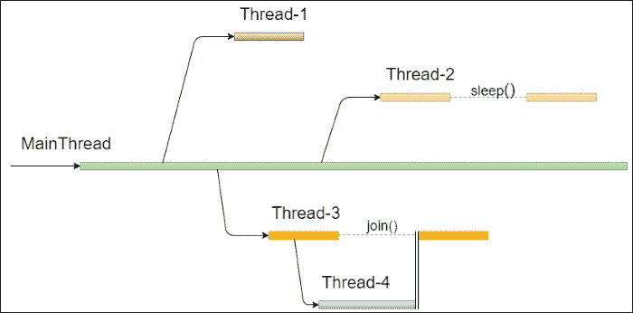
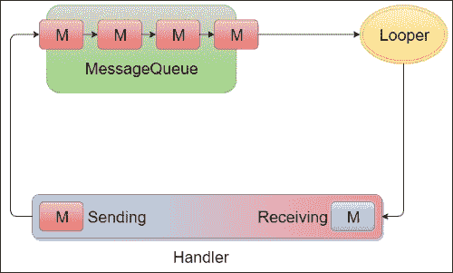
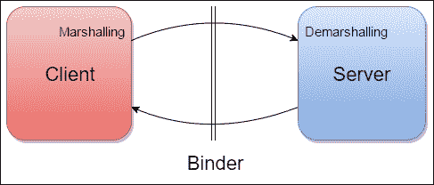
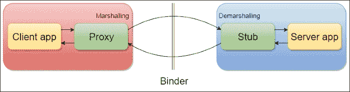

# 第五章：多线程

当手机市场开始下滑，智能手机市场兴起时，用户显然需要在移动设备上拥有强大的计算能力。对计算能力的不断增长的需求以及合适硬件的可用性导致了设备上的多核 CPU，允许并行执行多个任务。Android 工程师在这一切发生之前就已经知道了这一点。此外，这就是为什么我们有多种选项可以同时执行不同的任务，具有很大的灵活性，以及许多不同的组件可供选择以应用于我们的多线程策略。然而，我们做得好吗？为了回答这个问题，我们将了解线程的所有方面，从 Android 平台继承的 Java 框架线程基础到 Android 为此目的提供的所有类。我们还将了解 Android 如何处理其进程，以及我们如何在不同情况下正确选择合适的组件，因为并非所有组件都是可互换的。

处理多线程看似简单，但在多个线程之间的通信中存在许多陷阱。因此，我们将了解 Android 平台如何帮助我们处理这类问题，提供了一些有用的类，我们将在许多情况下使用它们。我们的目标是了解如何正确使用它们以及如何处理它们，以提高我们应用程序的性能。

作为开发者，我们的目标是衡量应用程序的性能。因此，在本章的最后部分，我们将介绍一个工具，用于检测某些代码是否在主线程中执行，从而降低了应用程序的响应性。

# 演练

我们将在这里定义所有需要了解的内容，以便处理像 Android 这样的多线程环境。理解线程是什么以及处理线程时可能遇到的问题至关重要。因此，我们会暂时聚焦于 Java 框架，因为每位 Android 开发者都应该了解这些概念，然后我们将关注该平台在 Android 中的定义以及与更多对象的集成。这为从应用程序内的多线程到不同进程间通信的所有级别提供了多种分离执行的方式，定义了一种特定的语言以实现目标。那么，让我们看看我们讨论的是什么。

## 线程基础

我们可以将线程视为一系列按顺序执行的指令。这些指令被翻译成由设备硬件执行的指令。当有多个部分指令需要执行时，环境就被称为**多线程**。这种技术有助于加速任何系统，因为并行执行总是比串行执行快。此外，这提高了具有用户界面的应用程序的响应性，并可能导致更好的资源管理和整个系统的管理。

Java 提供了`java.lang.Thread`包，其中包含许多用于处理多个线程间并发性的类。这是对实际后台执行的包装，对开发者不可见。因此，在深入理解 Android 框架之前，我们需要先了解 Java 框架。

### 多核 CPU

几年前，处理器一次只能执行一条指令。然而，线程框架已经存在。然后，使用时间分片技术按顺序执行来自多个线程的代码，而多线程只是一个虚构的概念。在这种情况下，我们无法知道虚拟机将按照什么顺序执行来自多个线程的代码。但是，具有多核技术的处理器已经存在了好几年。它们可以同时执行多个代码，使多线程成为现实。

### 线程

要创建一个线程，你可以使用`Thread`对象，然后调用`Thread.start()`方法以与当前线程并行启动其执行。这样，调用线程通知虚拟机需要一个新线程，然后虚拟机创建一个新线程并执行与`Thread.run()`方法内部代码相关的字节码。然而，该方法默认实现什么都不做。必须指出的是，直接调用`Thread.run()`方法而不是`Thread.start()`将在不创建新线程的情况下调用该方法，因此这是启动新线程的错误方式。有两种方法可以向线程的执行中添加代码：

+   **扩展** `Thread` **类**：这种方式是创建一个扩展了`Thread`类的类，然后需要重写`Thread.run()`方法，以指定当调用`Thread.start()`时要执行的操作：

    ```kt
    public class ThreadActivity extends Activity {

        @Override
        protected void onCreate(Bundle savedInstanceState) {
            super.onCreate(savedInstanceState);
            MyThread thread = new MyThread();
            thread.start();
        }

        private class MyThread extends Thread {
            @Override
            public void run() {
                //code...
            }
        }
    }
    ```

+   **实现** `Runnable` **接口**：这种方式，当调用`Thread.start()`时，要执行的代码将是`Runnable.run()`方法中的代码：

    ```kt
    public class ThreadActivity extends Activity implements Runnable {

        @Override
        protected void onCreate(Bundle savedInstanceState) {
            super.onCreate(savedInstanceState);
            Thread thread = new Thread(this);
            thread.start();
        }

        @Override
        public void run() {
            //code...
        }
    }
    ```

线程总是由另一个线程启动，因此总有一个特殊的线程称为主线程，它是应用程序首次启动和执行的地方。每次我们启动一个新线程时，主线程的执行都会分成两个独立的线路，如图 1*所示：



图 1：线程操作

在*图 1*中，展示了线程的不同操作：

+   **线程 1**只是被创建和执行。它结束后就会被销毁，因为没有更多的执行在队列中。

+   **线程 2**像**线程 1**一样被创建和执行，但在其生命周期内会被暂停一段时间。这可以通过使用`Thread.sleep()`方法实现，指定要等待的毫秒数。在这段时间内，线程停止等待，直到达到超时时间，然后恢复运行操作。

+   **线程-3** 被创建并执行，在其生命周期内，它启动了一个新线程并等待它。这意味着它不知道应该等待多久。这就是为什么，如果你不知道需要等待的时间，但需要等待另一个线程完成工作，你可以调用 `Thread.join()` 方法。当创建的线程完成其任务后，**线程-3** 可以继续执行直到结束。还可以为等待指定一个超时时间；当达到这个时间，**线程-3** 无论如何都会继续执行。

Java 为线程提供了优先级系统。这意味着我们可以改变线程的优先级，让它相对于其他线程执行得更快或更慢。有 10 个优先级级别。Java 还定义了最大、最小或正常优先级的三个常量。我们可以使用以下方法来改变线程优先级：

```kt
thread.setPriority(Thread.MAX_PRIORITY);
thread.setPriority(Thread.NORM_PRIORITY);
thread.setPriority(Thread.MIN_PRIORITY);
```

### 多线程应用程序

使用多线程的应用程序和系统需要面对一些问题，这些问题涉及到开发者，并迫使他们小心处理不同线程如何访问对象的问题。

应用程序中多个线程的执行顺序是不可预测的。无法保证哪个线程会先执行或先完成。而且，这里所指的不仅仅是代码块，还包括单行代码。在一些需要按预定顺序访问单一对象的临界情况下，这可能会引起担忧。想象一下，如果洗衣店的洗衣机和干衣机可以随意顺序地处理衣物，会出现什么情况。如果洗衣机先开始工作当然没问题，但如果干衣机先工作呢？或者更糟的是，如果它们交替进行短期工作会怎样？我们希望衣物先被洗净再烘干。也就是说，应该依次并按正确顺序访问这些负载。换句话说，我们需要防止当一个线程正在访问对象时，另一个线程也尝试访问。这意味着对负载的访问需要是同步的。

### 线程安全

线程安全的概念与多线程环境紧密相关。它指的是代码的安全执行，这种执行不会以并发方式改变共享数据。虽然对对象的读取访问可能不会对安全性构成问题，但写入访问却可能。如果一个多线程应用程序在共享对象上没有并发操作，那么它是线程安全的。

让我们看看这在 Java 框架中意味着什么。Java 使用监视器的概念：每个对象都有一个监视器，线程可以锁定和解锁它。监视器确保一次只有一个锁定。任何其他锁定尝试都会被排队。这些操作在低级代码中，可以使用特殊类来显式调用对象的锁定或解锁，但 Java 提供了一个特殊的关键字来完成同样的操作：`synchronized`。它可以作为语句使用，也可以用来声明同步方法的签名。在第一种情况下，你需要指定需要锁定哪个对象以及哪些代码受到锁的影响：

```kt
synchronized (object) {
    //code...
}
```

这样，在括号内的代码执行完毕之前，其他线程无法访问该对象。开发者必须了解所谓的死锁。当两个或更多线程相互锁定等待对方时，这种情况就会发生，然后这些线程将永远被阻塞。当使用带有交叉引用锁定的`synchronized`关键字时，可能会发生这种情况；这种条件必须被避免。

同步方法的目标是锁定该方法引用的对象：

```kt
public synchronized void update() {
    //code...
}
```

## Android 多线程环境

Android 平台从 Linux 继承了进程和线程系统。系统至少为不同的应用程序生成一个进程，每个进程都有其线程。在处理内存时我们已经讨论过进程。让我们分析它们是什么以及如何管理它们：这有助于理解如何处理应用程序的线程和组件。

### 进程

在 Android 中，**进程**是主要组件（如活动、服务、广播接收器和内容提供者）的容器。因此，每个进程都会影响内存，如果系统在这方面处于关键状态，它会开始销毁这些进程。系统通过使用**最近最少使用**（**LRU**）策略来完成这个操作：在需要时，首先销毁最近最少使用的对象以释放内存。为此设计了一个优先级系统：在其生命周期中，进程可以是以下几种状态之一：

+   **前台**：如果一个进程正在托管用户正在与之交互的组件，那么它是前台进程。此时，该进程位于堆栈顶部。

+   **可见**：如果一个进程不是前台进程，但它仍然可以被用户看到，那么它是可见的。

+   **服务**：这是一个仅包含刚刚启动的服务进程。

+   **后台**：这包含不再对用户可见的组件。

+   **空**：这样的进程不包括任何组件。它用于缓存目的，以加快未来应用程序的恢复速度。它位于堆栈底部；当系统回收内存时，它会首先被丢弃。

当应用程序首次启动时，会创建一个默认进程，并且其所有组件都在该进程中执行。然而，我们可以通过在清单文件中使用特定属性来处理应用程序的组件，为每个组件强制创建新进程，或者让它们加入同一个自定义进程。

```kt
<service
    android:name=".MyService"
    android:process=".MyProcess">
</service>
```

只需要指定进程的名称。当名称以冒号开头时，该进程是应用程序私有的。当以小写字母开头时，该进程可以与其他应用程序共享。

## 安卓应用程序线程

本章前面讨论的关于线程的内容在 Android 系统中同样适用：当应用程序启动时，会创建一个新的主线程，并且其代码按顺序执行。从该线程，我们可以启动新线程来进行后台操作。为应用程序创建的任何其他线程都被称为**后台线程**或**工作线程**。另一种类型的线程是 Binder 线程，用于进程间的通信。

### UI 线程

了解主线程是唯一可以管理用户界面的线程至关重要。这就是它也被称作 UI 线程的原因。UI 线程的生命周期与应用程序和进程的生命周期相同，因为需要有一个线程能够随时让用户进行交互。然而，为什么会有这样一个严格的要求？为什么不能在 UI 线程外部访问视图呢？因为 Android UI 不是线程安全的，如果视图可以被不同的线程访问和修改，那么在应用程序执行期间可能会出现不可预期的行为和并发错误。

这一选择是为了加快 UI 的响应速度，因为对对象进行加锁和解锁操作是昂贵的，这会影响到 Android 的用户体验，仅仅是为了让开发者能够从多个线程访问视图。因此，平台强制要求只能从主线程访问 UI。这意味着无需同步视图，因为它们只能由 UI 线程访问。所以，在代码结构中加入同步是多余的。实际上，每当后台线程尝试访问视图实例时，都会抛出以下异常：

```kt
CalledFromWrongThreadException: Only the original thread that created a view hierarchy can touch its views
```

### 工作线程

在 Android 平台中另一个需要注意的方面是，主线程不仅负责 UI，而且应当只做这件事：任何不必要的 UI 操作都应该在不同的线程中完成，以保持 UI 的流畅，进而提供良好的用户体验，这是工作线程的主要目标。它们用于执行可能影响 UI 的长时间运行的操作。更重要的是，如果这些操作在 UI 线程中执行，它们可能会让 UI 冻结直到操作结束。这可能导致所谓的*应用无响应*对话框的出现。当 UI 被阻塞时，系统会向用户显示这个对话框，告知应用无响应，并询问用户是否关闭应用。这对用户体验来说非常糟糕，对性能来说则是灾难。我们将了解 Android 提供了哪些结构来达到我们希望应用拥有的响应性。

### Binder 线程

当我们需要来自不同进程的不同线程进行通信时，我们不能使用标准代码，而需要一些更高级的技术来实现。Android 平台使用 Binder 线程让来自不同进程的线程进行通信。这种线程简化了进程间通信，我们将在后续页面中看到这一点。不过，我们不需要直接处理 Binder 线程。有一种特定的语言允许我们在进程间交换数据，称为**Android 接口定义语言**（**AIDL**）。

## Android 线程消息传递

让我们来看看处理应用中线程间通信的框架。一些对象参与了消息传递操作，它们如下：

+   `Message`或`Runnable`对象：它们是用于线程间通信和发送的对象。

+   `MessageQueue`：这是一个待处理的有序消息和可运行对象的容器。

+   `Looper`：这是将`Message`和`Runnable`对象分派给正确`Handler`对象的对象。

+   `Handler`：这是`Message`和`Runnable`对象的来源，也是`Looper`的接收者。因此，它具有双重责任，即将消息和可运行对象放入`MessageQueue`，并在`Looper`将它们送回时执行它们。这里的奥秘在于：发送操作是在发送线程上进行的，而执行操作是在接收线程上进行的。因此，实现了不同线程之间的通信。

*图 2*展示了这些对象之间主要的关系：



图 2：两个线程之间的消息传递过程

并非所有线程都有`Looper`。相反，只有主线程有自己的`Looper`。这意味着如果你想让两个线程进行通信，需要为该通信分配一个`Looper`对象并创建`MessageQueue`。这可以通过在`Thread.run()`中调用静态的`Looper.prepare()`方法来完成。现在我们有了`MessageQueue`和`Looper`，我们需要这个`Looper`开始向`Handler`分派消息和可运行对象。这可以通过调用静态的`Looper.loop()`方法来完成。以下是展示所说内容的代码片段：

```kt
public class LooperThread extends Thread {
    public Handler mHandler;

    public void run() {
        Looper.prepare();
        mHandler = new Handler() {
            public void handleMessage(Message msg) {
                // code…
            }
        };
        Looper.loop();
    }
}
```

现在，让我们看看`Handler`对象是如何工作的，以及它可以如何发送消息和可运行对象。`Handler`对象在构造时需要与一个`Looper`相关联。然后空的`Handler`构造函数将与创建它的线程的`Looper`关联。以下只有在主线程中或调用后台线程的`Looper.prepare()`方法之后，才能实例化处理器：

```kt
Handler mHandler = new Handler();
```

这就是为什么如果不这样做，将会抛出`RuntimeException`，应用程序将在堆栈跟踪中显示以下消息后崩溃：

```kt
java.lang.RuntimeException: Can't create handler inside thread that has not called Looper.prepare()
```

从操作的角度来看，`Handler`通过以下方法将消息和可运行对象发送到`MessageQueue`：

+   `post(Runnable r)`

+   `sendEmptyMessage(int what)`

+   `sendMessage(Message m)`

这三个都有指定特定执行时间或延迟的可能性，而`Handler`可以使用以下方法从`MessageQueue`中移除它们：

+   `removeCallbacks(Runnable r)`

+   `removeMessages(int what)`

+   `removeCallbacksAndMessages(Object token)`

当`Runnable`对象包含要执行的代码时，消息应该由`Handler`使用`Handler.handleMessage()`方法处理，该方法提供了`Message`本身。

# 最佳实践

携带线程概念，让我们通过代码了解谷歌是如何改进从 Java 继承的多线程框架的，以及 Android 平台为开发者提供了哪些 API 来处理 UI 线程与工作线程之间的主要问题。我们还将看到由此可能产生的问题以及 Android 在其开发过程中引入的解决方案。

然后，我们将处理高级技术以管理主要组件和 AIDL 以及跨进程通信的 Messenger。

## 线程

标准的 Java 线程是我们将在以下页面中看到的其他框架的基础。它们包装线程或可运行对象以实现一些平台要求，如与 UI 线程的通信。对于不需要通知 UI 线程的简短后台操作，它们仍然是轻量级的解决方案。

### 提示

作为使用线程时需要遵守的一般规则，避免在循环内进行同步，因为获取和释放锁是一个昂贵的操作。然后，这可能导致时间增加和资源的无谓消耗。

## HandlerThread

在典型的应用程序开发中，我们处理线程和处理器，有时我们会忘记准备在后台线程上处理消息所需的内容。这就是为什么 Android 提供了一个有用的`Thread`子类，它包装了线程本身、`Looper`和`MessageQueue`。这就是`HandlerThread`，它会自行准备`Looper`。这样开发者就不需要手动准备。此外，如果需要更多的初始化，我们可以在`HandlerThread.onLooperPrepared()`方法中进行：这样我们就知道`Looper.prepare()`已经被调用，且`HandlerThread.getLooper()`的返回结果不会为 null。

让我们来看以下代码片段：

```kt
public class HandlerThreadActivity extends Activity {

    @Override
    protected void onCreate(Bundle savedInstanceState) {
        super.onCreate(savedInstanceState);
        MyHandlerThread handlerThread = new MyHandlerThread("HandlerThread");
        handlerThread.start();
    }

    private class MyHandlerThread extends HandlerThread {
        private Handler handler;

        public MyHandlerThread(String name) {
            super(name);
        }

        @Override
        protected void onLooperPrepared() {
            handler = new Handler(getLooper()) {
                @Override
                public void handleMessage(Message msg) {
                    //code...
                }
            };
        }

        public void post(Runnable r) {
            handler.post(r);
        }
    }
}
```

与经典线程不同，`HandlerThread`可以被复用，因为它会保持活动状态，直到调用`HandlerThread.quit()`方法。这个特殊的方法会终止`Looper`，使其无法再处理消息和可运行对象。之后发送的任何`Message`或`Runnable`都会失败，`MessageQueue`会被清空。该方法将强制挂起的消息和可运行对象退出，它们不会再被分派给`Handler`。为确保没有挂起的消息被终止和分派，请使用`HandlerThread.quitSafely()`方法。当调用这些方法之一时，`HandlerThread`对象将不能再使用，因为线程已经执行完毕。

### 何时使用

`HandlerThread`通过`Looper`和`MessageQueue`保持线程存活，并提供可控的消息处理。因此，当我们需要一个始终可用的线程时，使用它是很好的选择。

### 提示

当处理多个线程之间的消息传递时，`HandlerThread`是一个很好的选择，可以将`Looper`的管理委托给它。它还可以被复用于多个消息和可运行对象。但是，请记住，在不再需要时退出，以释放资源。

## AsyncTask

如先前讨论的，从多线程的角度来看，开发者主要的目标是尽可能让 UI 线程从可以在并行线程中执行的操作中解脱出来，以保持用户界面的流畅。从一开始，开发者可以使用的主要工具就是`AsyncTask`。它不是一个线程框架，只是一个辅助类，用于让工作线程与 UI 线程通信。

`AsyncTask`对象只能启动一次，就像`Thread`一样。它可以在 UI 线程中创建、加载和启动。`AsyncTask`的子类可以覆盖以下方法：

```kt
public class MyAsyncTask extends AsyncTask<Params, Progress, Result> {
    @Override
    protected void onPreExecute() {}

    @Override
    protected Result doInBackground(Params... p) {return result;}

    @Override
    protected void onProgressUpdate(Progress... values) {}

    @Override
    protected void onPostExecute(Result result) {}

    @Override
    protected void onCancelled() {}
}
```

考虑到这一点，让我们了解这意味着什么。

### 方法

在前面提到的方法中，只有`AsyncTask.doInBackground()`是抽象的，并在工作线程中执行。其他方法如果需要可以覆盖，并具有以下目的：

+   `onPreExecute()`: 在开始后台工作之前调用。它用于通知用户后台正在发生某些操作。

+   `onProgressUpdate()`: 这用于在从工作线程收到一些更新后更新 UI。

+   `onPostExecute()`: 这处理来自工作线程的结果。

+   `onCancelled()`: 这用于在 UI 线程上处理`AsyncTask`的取消。

### 泛型参数

类签名中的泛型是为了指定以下内容：

+   `Params`: 这是`AsyncTask.doInBackground()`期望的输入类型。

+   `Progress`: 这是用来通知`AsyncTask.onProgressUpdate()`更新的类型。

+   `Result`: 这是`AsyncTask`的`doInBackground()`方法的返回结果，也是`AsyncTask.onPostExecute()`的输入。

### 状态管理

一个`AsyncTask`对象可以经历三个连续的`AsyncTask.Status`：

+   `PENDING`: 开始前

+   `RUNNING`: 执行中

+   `FINISHED`: 在`AsyncTask.onPostExecute()`完成之后

### Executor

每当需要执行`AsyncTask`时，都必须提供一个`Executor`对象。`AsyncTask`有两种默认执行方式。如下所示：

+   `SERIAL_EXECUTOR`: 这会一次完成所有任务，并按照顺序执行。

+   `THREAD_POOL_EXECUTOR`: 这会并行执行任务。

有三种方法可以启动`AsyncTask`的执行：

+   `execute(Params)`: 这会将任务添加到`SERIAL_EXECUTOR`的队列中。

+   `execute(Runnable)`: 这是一个静态方法，用于使用`SERIAL_EXECUTOR`执行`Runnable`对象。

+   `executeOnExecutor(Executor, Params)`: 这允许你指定想要使用的`Executor`对象。

这是性能的关键部分，因为工作线程的执行取决于所使用的特定执行器；如果队列已满且任务运行时间较长，串行执行可能会导致意外的延迟。另一方面，默认的并行执行是全局的：因此，线程池中的线程在多个应用程序之间共享。作为替代方案，我们可以创建自己的执行器，以在`AsyncTask.executeOnExecutor()`方法中使用。为此，有一个`Factory`类可以创建执行器。这个类叫做`Executors`，其方法如下：

+   `newCachedThreadPool()`: 这首先检查是否有可用的线程，如果没有，它会创建一个新的线程并将其缓存以供未来请求使用。

+   `newFixedThreadPool()`: 这与缓存情况相同，但线程数量是固定的。

+   `newScheduledThreadPool()`: 这会创建一个可以安排线程在定义的时间执行任务的执行器。

+   `newSingleThreadExecutor()`: 这会创建一个单线程执行器

+   `newSingleThreadScheduledExecutor()`: 这会创建一个具有单个线程的执行器，可以安排在定义的时间执行。

这样，我们可以创建并重用私有的线程池，作为单例或者在`Application`类中使用。例如：

```kt
public class ApplicationExecutor extends Application {
    private Executor executor;

    public static Executor getExecutor() {
        if (executor == null)
            executor = Executors.newCachedThreadPool();
        return executor;
    }
}
```

### 使用时机

`AsyncTask`的目标是让工作线程与 UI 线程通信。那么，如果我们的后台操作不需要通知用户，或者一般而言，不需要更新 UI，那么就没有必要使用`AsyncTask`：一个线程就足够了，而且比`AsyncTask`性能更好。

### 提示

如果你使用的是带有所有 void 参数的`AsyncTask`，或者只实现了`AsyncTask.doInBackground()`方法，那么你不需要`AsyncTask`。将实现更改为经典线程，因为 UI 不会通过`AsyncTask`改变。

除了这种情况，`AsyncTask`实现由于`Activity`生命周期面临一些问题。它经常作为`Activity`内的内部类使用。然后，如第四章 *Memory* 所讨论的，内存泄漏很容易发生。除此之外，它在`Activity`内部使用，当由于配置更改而销毁`Activity`的实例时，`AsyncTask`仍然活跃并运行，但 UI 引用不再可用。然后，当`Activity`被销毁并重新创建时，需要将`AsyncTask`的结果数据缓存到某处。否则，必须再次执行`AsyncTask`。

## Loaders

了解到`AsyncTask`的限制，Android 开始提供加载器框架，在某些情况下作为`AsyncTask`的有效替代。让我们看看加载器提供了什么。

它们处理异步操作，例如从远程服务器检索数据，然后触发回调通知调用者有新数据可用。调用者可能是活动或片段。加载器与生命周期无关：无论`Activity`或`Fragment`在配置更改后是否被销毁并重新创建，它仍然在后台运行并通知新创建的`Activity`或`Fragment`实例。此外，如果在配置更改之前后台工作已完成，加载器将缓存后台产生的数据，无论如何通知新实例。这种与活动生命周期无关的特殊功能意味着加载器与活动本身之间没有连接：因此，加载器使用应用程序上下文，降低了活动泄漏的风险。

### LoaderManager

每个`Activity`或`Fragment`都有一个且仅有一个`LoaderManager`。可以通过以下`Activity`和`Fragment`的方法来获取：

```kt
getLoaderManager();
```

`LoaderManager`类处理一些关于加载器的操作，如下方法所述：

+   `initLoader(int id, Bundle args, LoaderCallbacks<D> cb)`：这初始化一个加载器，为其分配一个 ID，传递额外的参数，并指定如何处理回调。如果已经存在具有相同 ID 的加载器，它将被使用，而不是创建另一个。

+   `restartLoader(int id, Bundle args, LoaderCallbacks<D> cb)`：这将会重新启动一个加载器，如果指定的 ID 没有关联的加载器，则创建一个新的加载器，传递额外的参数和回调实例以处理响应。

+   `getLoader(int id)`：这返回具有指定 ID 的加载器。

+   `destroyLoader(int id)`：这停止具有指定 ID 的加载器。

### LoaderCallbacks<D>

用于处理加载器操作结果的回调接口是由以下方法组成的：

+   `onCreateLoader(int id, Bundle args)`：这返回一个新的加载器。

+   `onLoadFinished(Loader<D> loader, D data)`：这通知加载器完成了后台操作，并将结果传递出去。

+   `onLoaderReset(Loader<D> loader)`：这通知加载器已被重置，数据不再可用。

### 提供的加载器

使用加载器时，我们需要使用`CursorLoader`或创建加载器的子类或其他一些加载器专业化，如`AsyncTaskLoader`。让我们看看这些选项和区别。

#### AsyncTaskLoader

这个加载器用于使用包装的`AsyncTask`进行后台工作，我们知道，它处理通过工作者线程和 UI 线程的数据传递。然而，它是一个抽象类，因为我们需要覆盖`AsyncTaskLoader.loadInBackground()`方法，告诉类哪些操作必须在工作者线程内执行：

```kt
public class MyAsyncTaskLoader extends AsyncTaskLoader<Result>{

    @Override
    public Result loadInBackground() {
        //code...
        return result;
    }
}
```

因此，`AsyncTaskLoader`可以用于`Activity`或`Fragment`类所需的每个后台操作。

#### CursorLoader

CursorLoader 是一个专门用于从`ContentProvider`检索数据的工具，因此，如果没有`ContentProvider`来存储数据，这不是使用加载器的正确选择。然而，它是`AsyncTaskLoader<Cursor>`的一个实现。那么，它有助于在工作者线程中查询`ContentProvider`，而不会影响 UI。它旨在与`CursorAdapter`或`SimpleCursorAdapter`一起使用，以简化活动开发：例如，看看以下代码段：

```kt
public class CursorLoaderActivity extends ListActivity implements LoaderManager.LoaderCallbacks<Cursor>{
    private static final int CURSOR_LOADER_ID = 0;
    private SimpleCursorAdapter simpleCursorAdapter;

    public void onCreate(Bundle savedInstanceState) {
        super.onCreate(savedInstanceState);
        simpleCursorAdapter = new SimpleCursorAdapter(this,
                android.R.layout.simple_list_item_1, null,
                new String[] { "name" },
                new int[] { android.R.id.text1}, 0);
        setListAdapter(simpleCursorAdapter);
        getLoaderManager().initLoader(CURSOR_LOADER_ID, null, this);
    }

    @Override
    public Loader<Cursor> onCreateLoader(int id, Bundle args) {
        return new CursorLoader(this, URI, null, null, null, "name ASC");
    }

    @Override
    public void onLoadFinished(Loader<Cursor> loader, Cursor c) {
        simpleCursorAdapter.swapCursor(c);
    }

    @Override
    public void onLoaderReset(Loader<Cursor> loader) {
        simpleCursorAdapter.swapCursor(null);
    }
}
```

### 使用时机

加载器框架增强了`AsyncTask`的功能，使我们不必担心活动或片段的生命周期，并为我们缓存数据。因此，它是使用`AsyncTask`的有效替代方案。然而，加载器的管理比`AsyncTask`更容易。在光标情况下的专业化也易于使用。

### 注意

当我们需要获取数据时，`AsyncTaskLoader`是一个正确的选择：它提供了`AsyncTask`的相同功能，加上活动生命周期的独立性和数据缓存。因此，在应用程序的响应性和稳定性方面有性能提升。

## 服务

服务是 Android 平台提供的主要组件之一，因此您需要在清单文件中声明它。与活动不同，服务没有 UI 要处理。然后，其主要目的是在后台执行长时间运行的操作。但是，我们需要另一种创建和控制工作线程的方法吗？

想想我们在前面几页看到的所有其他方式：它们依赖于 UI 更新的活动生命周期。而且，这里出现了服务。它是一个独立的对象，可以在没有限制和用户交互的情况下在后台使用，然后，不需要用户界面。因此，不需要与用户交互的大量操作可以在服务中执行。

### 提示

在处理服务时需要记住的最重要的事情是，它们不是线程，相反，它们默认在 UI 线程上执行。因此，在创建新线程之前，永远不要在服务中启动长时间运行的操作：它会影响应用程序的所有 UI。然后，当用户在 UI 上执行其他操作时，可能会显示一个*应用程序无响应*对话框。

### 生命周期

作为活动，服务有两个方法来标识其创建和销毁。此外，这些方法与活动的名称相同：

```kt
public class LocalService extends Service {

    @Override
    public void onCreate() {
        super.onCreate();
    }

    @Override
    public IBinder onBind(Intent intent) {
        return null;
    }

    @Override
    public int onStartCommand(Intent intent, int flags, int startId) {
        return super.onStartCommand(intent, flags, startId);
    }

    @Override
    public boolean onUnbind(Intent intent) {
        return super.onUnbind(intent);
    }

    @Override
    public void onDestroy() {
        super.onDestroy();
    }
}
```

`Service`类是抽象的，唯一需要覆盖的方法是`Service.onBind()`。但是，它是用来做什么的呢？让我们从生命周期的角度定义两种类型的服务：

+   **启动服务**：使用`Context.startService()`方法或`Intent`启动服务，并且它将一直保持活跃状态，直到调用了`Context.stopService()`或`Service.stopSelf()`方法。

+   **绑定服务**：当另一个组件请求与它绑定时，服务开始启动，并且只要至少有一个外部组件与之绑定，它就会保持活跃状态。当不再绑定到其他组件时，它将被销毁。

由于启动的服务在其生命周期中的任何时刻都可能被绑定，因此两者之间没有明确的界限。然而，即使所有其他绑定的组件都消失了，它仍然会保持活跃状态。

### 启动服务

当我们想要创建一个启动服务时，无论如何都必须覆盖`Service.onBind()`方法，因为它是一个抽象方法。因此，如果我们不希望它被绑定，可以将其留空，返回 null。接下来我们将看到如何绑定服务。相反，我们需要覆盖的是`Service.onStartCommand()`方法。这个方法有三个参数：

+   `Intent intent`：这是在调用`Context.startService()`方法时向服务提供额外信息的方式。

+   `int flags`：用于确定传递的意图类型。我们将在本节后面看到它。

+   `int startId`：这是调用者的 ID。它可以用来判断是否从同一组件重新启动或终止后重新启动。

我们已经知道系统可以根据进程优先级基于策略开始销毁进程。在这种情况下，我们的服务可能会被终止，它正在执行的背景操作可能不会完成。这就是为什么`Service.onStartCommand()`方法需要返回一个整数值的原因。这样我们可以指定我们希望系统处理服务本身意外终止的方式。该方法可能返回的值如下：

+   `START_STICKY`：使用此标志，在终止后服务将被重新创建。为了重新创建，系统会发送一个 null `Intent`。在`Service.onStartCommand()`方法中使用它之前，检查是否为 null。当服务在意外终止后需要重新启动以完成一些工作时，考虑使用它。

+   `START_NOT_STICKY`：除非通过正常的`Context.startService()`方法调用新的`Intent`类或新的`Intent`与`Service IntentFilter`匹配，否则服务在意外终止后不会被重新创建。然后，不会有 null 意图被触发到方法中。当服务在意外终止时不需要重新启动以完成某些工作时使用。

+   `START_REDELIVER_INTENT`：当服务因调用`Service.stopSelf()`方法或`Context.stopService()`以外的其他原因而终止时，服务将使用最后一次调用`Service.onStartCommand()`方法的意图重新启动。当我们需要知道哪个操作因终止而中断时使用。

根据采用重启服务的策略使用前面的常量，作为`Service.onStartCommand()`参数传递的`Intent`可能有不同的含义。让我们看看可能的值：

+   `0`：这是默认值，意图通常像第一次一样传递。

+   `START_FLAG_REDELIVERY`：由于重传策略，`Intent`类已被重新传递。它之前已经被赋予过，但在处理之后，服务意外停止了。因此，意图再次传递，此标志有助于了解这一事实。

+   `START_FLAG_RETRY`：意图即将传递给服务，但已被终止，然后再次传递此标志的意图。这一次，我们可以知道服务从未处理过意图，与之前的情况相反。

让我们看看一个启动服务的实现示例。记住它是在 UI 线程上执行的，然后我们需要创建必要的线程来运行长时间运行的操作，以不影响 UI，并且不要忘记从第四章，*内存*关于内部类和内存影响的教训：

```kt
public class MyService extends Service {
    private Thread thread;

    @Nullable
    @Override
    public IBinder onBind(Intent intent) {
        return null;
    }

    @Override
    public int onStartCommand(Intent intent, int flags, int startId) {
        switch (intent.getAction()) {
            case "action1":
                handleAction1();
                break;
        }
        return START_NOT_STICKY;
    }

    private void handleAction1() {
        thread = new Thread(new MyRunnable());
        thread.start();
    }

    private static class MyRunnable implements Runnable {

        @Override
        public void run() {
            //code...
        }
    }
}
```

在这个例子中，我们使用了经典线程，但对于不同线程之间的通信，我们可以根据需要使用`Handler`或`HandlerThread`对象或`Executor`框架或`AsyncTask`。

#### 何时使用

启动的服务有助于处理多个同时请求。你将不得不设计你的多线程策略，因为它是在 UI 线程中执行的，但从线程的角度来看，这是最灵活的组件。

### 绑定服务

在谈到绑定服务时，我们需要定义一个客户端和一个服务器端。服务是这种客户端服务器架构中的服务器，而活动或其他服务则是客户端。因此，我们需要一个接口来让它们正确地通信。平台提供了`Context.bindService()`方法。

如前所述，绑定服务持有对客户端的引用，当不再有客户端被引用时，服务会自动终止。当我们需要在多个活动之间共享后台操作，而无需关闭服务时，这种行为非常有用，因为它会自动终止。

从服务器客户端的角度来看，绑定服务生命周期仅由两个方法组成：

+   `Service.onBind()`

+   `Service.onUnbind()`

与普遍看法相反，这些方法并不是每次服务绑定到客户端或从同一客户端解绑时都会被调用；`Service.onBind()`方法只在第一个客户端时被调用，而`Service.onUnbind()`方法在最后一个客户端解绑时被调用。因此，这些方法用于初始化和释放`Service`对象或变量。

为了让客户端和服务器端进行通信而创建的接口，在客户端使用了`ServiceConnection`接口的一个实例，在服务器端使用了绑定器。让我们看看这在两者的代码中意味着什么。以下是`Service`类的代码：

```kt
public class MyService extends Service {
    private final ServiceBinder binder = new ServiceBinder();

    public class ServiceBinder extends Binder {

        public MyService getService() {
            return MyService.this;
        }
    }

    @Nullable
    @Override
    public IBinder onBind(Intent intent) {
        return binder;
    }
}
```

返回我们的`ServiceBinder`对象，它有一个获取对`Service`类本身引用的方法，我们允许客户端获取对该引用的引用，然后调用其方法。现在让我们看看客户端的代码：

```kt
public class ClientActivity extends Activity {
    private MyService myService;
    private ServerServiceConnection serverServiceConnection = new ServerServiceConnection();
    private boolean isBound = false;

    private class ServerServiceConnection implements ServiceConnection {

        @Override
        public void onServiceConnected(ComponentName name, IBinder service) {
            myService = ((MyService.ServiceBinder) service).getService();
            isBound = true;
        }

        @Override
        public void onServiceDisconnected(ComponentName name) {
            myService = null;
            isBound = false;
        }
    }

    @Override
    protected void onCreate(Bundle savedInstanceState) {
        super.onCreate(savedInstanceState);
        Intent intent = new Intent(this, MyService.class);
        bindService(intent, serverServiceConnection, Service.BIND_AUTO_CREATE);
    }

    @Override
    protected void onDestroy() {
        super.onDestroy();
        if (isBound) {
            unbindService(serverServiceConnection);
        }
    }
}
```

`ServiceConnection.onServiceConnected()`方法有一个`IBinder`作为参数，然后，我们可以将其转换为在`Service`类中定义的`ServiceBinder`，并通过我们定义的`ServiceBinder.getService()`方法来获取服务本身。

这样我们就可以在活动中使用`myService`对象来调用服务的方法。当不再需要该引用时，记得调用`Context.unbindService()`方法。

#### 何时使用

如果你需要一个组件与服务之间的直接通信，绑定服务是正确的选择，因为它将启动服务的灵活性扩展到另一个组件，同时保持两个绑定组件实现的分离。

### IntentService

平台提供的一个特定服务实现是`IntentService`类。在某些情况下它非常有用，原因我们将会了解到。这个类包装了一个后台线程，以执行与其队列中与意图相关的不同请求。当队列变空时，`IntentService`类会自动销毁。因此，它具有与`Service`类不同的生命周期。它仅在后台线程中运行时处于活动状态。了解了这一点，让我们看看`Service`和`IntentService`之间的区别：

+   `Service.onStartCommand()`方法的默认实现返回`Service.START_NOT_STICKY`。因此，如果服务意外终止，将不会重新传递意图。不过，我们可以使用`Service.setIntentRedelivery()`方法来更改此行为。

+   由于其生命周期，不可能绑定这样的服务。因此，没有可能为此创建 Binder，并且`Service.onBind()`方法的默认实现是返回 null。

+   与其使用`System.onStartCommand()`方法来处理传入的意图，该类提供了`IntentService.handleIntent()`方法。这个方法在后台线程中执行；因此，在这种情况下，无需创建工作线程。该类为我们处理线程的创建和管理。这种线程管理是使用`HandlerThread`完成的；这就是为什么会有一个顺序执行消息和 runnables 的队列。

+   如前所述，`IntentService`类不能被绑定，因此启动它的方式只能是使用`Context.startService()`方法。

`IntentService`类的代码如下所示：

```kt
public class MyService extends IntentService {

    public MyService() {
        super("MyService");
    }

    @Override
    protected void onHandleIntent(Intent intent) {
        switch (intent.getAction()) {
            case "action1":
                handleAction1();
                break;
        }
    }

    private void handleAction1() {
        //code...
    }
}
```

#### 何时使用

当你需要在一个单独的线程中在后台执行顺序操作，并且不需要处理`Service`的生命周期时，`IntentService`类是正确的选择：它提供了进行异步操作所需的一切，而不会影响 UI。

## 进程间通信

两个来自不同进程的线程之间的通信并不像前一个案例那么简单，因为两个独立的进程不能共享内存，因此`Handler`对象无法在两个线程上执行。在这种情况下，我们之前讨论的 Binder 线程帮助我们让在不同进程中的线程进行通信。

### 远程过程调用

框架让我们定义**远程过程调用**（**RPC**），它允许本地进程中的客户端线程像调用本地方法一样调用远程方法。*图 3*展示了这意味着什么：



图 3：远程过程调用方案

适当的流程如下：

1.  客户端调用服务器方法。

1.  数据和方法被转换成适合传输的格式。这项操作也被称为**编组**（marshaling）。

1.  通过 Binder 线程，传输数据和方法。

1.  数据和方法通过解编（demarshaling）转换回原始格式。

1.  服务器端用数据执行方法，并为客户端原路返回准备结果。

需要在进程间传递的数据必须实现 Parcelable 接口。

### AIDL

RPC 可以使用一种特殊的语言定义，称为**Android 接口定义语言**（**AIDL**）。客户端和服务器之间的接口在`.aidl`文件中定义，其内容在客户端和服务器进程中被复制。编组（marshaling）和解编组（demarshaling）操作被委托给两个特殊的内部类，客户端侧称为**Proxy**，服务器侧称为**Stub**。在这种情况下，*图 3*的方案变成了*图 4*的方案：



图 4：Android 接口定义语言方案

要使用这种语言，你需要在`.aidl`文件中定义带有方法签名的接口。例如，查看以下在`.aidl`文件中的声明：

```kt
interface IRemoteInterface {
    boolean sendResult(in Result result);
}
```

然后，这将转换成一个`.java`文件，并在进程间共享。因此，`RemoteService`类可以以这种方式拥有其存根的实例：

```kt
public class RemoteService extends Service {
    private final IRemoteInterface.Stub binder = new IRemoteInterface.Stub() {
        @Override
        public boolean sendResult(Result result) throws RemoteException {
            return false;
        }
    };

    public RemoteService() {
    }

    @Override
    public IBinder onBind(Intent intent) {
        return binder;
    }
}
```

此外，最后，客户端活动可以绑定远程服务，并按以下方式调用接口的方法：

```kt
public class AidlActivity extends Activity implements View.OnClickListener{
    private boolean bound = false;
    private IRemoteInterface mIRemoteService;
    private ServiceConnection mConnection = new ServiceConnection() {
        public void onServiceConnected(ComponentName className, IBinder service) {
            mIRemoteService = IRemoteInterface.Stub.asInterface(service);
            bound = true;
        }

        public void onServiceDisconnected(ComponentName className)
{
            mIRemoteService = null;
            bound = false;
        }
    };

    @Override
    protected void onStart() {
        super.onStart();
        Intent intent = new Intent(AidlActivity.this, RemoteService.class);
        intent.setAction(IRemoteInterface.class.getName());
        bindService(intent, mConnection, Context.BIND_AUTO_CREATE);
    }

    @Override
    public void onClick(View v) {
        if (bound) {
            try {
                mIRemoteService.sendResult(result);
            } catch (RemoteException e) {
                e.printStackTrace();
            }
        }
    }
}
```

### Messenger

另一种将方法和数据发送到远程进程的方法是使用`Messenger`对象。它更简单，但是单线程的，因此较慢。`Messenger`对象有一个指向一个进程中`Handler`对象的引用，然后另一个进程处理它。让我们从远程服务的代码开始：

```kt
public class RemoteService extends Service {
    MyThread thread;
    Messenger messenger;

    @Override
    public void onCreate() {
        super.onCreate();
        thread.start();
    }

    private void onThreadPrepared() {
        messenger = new Messenger(thread.handler);
    }

    public IBinder onBind(Intent intent) {
        return messenger.getBinder();
    }

    @Override
    public void onDestroy() {
        super.onDestroy();
        thread.quit();
    }

    private class MyThread extends Thread {
        Handler handler;

        @Override
        public void run() {
            Looper.prepare();
            handler = new Handler() {

                @Override
                public void handleMessage(Message msg) {
                    // Implement message processing
                }
            };
            onThreadPrepared();
            Looper.loop();
        }

        public void quit() {
            handler.getLooper().quit();
        }
    }
}
```

然后，客户端`Activity`使用`Messenger`对象来发送消息：

```kt
public class MessengerActivity extends Activity implements View.OnClickListener {
    private boolean bound = false;
    private Messenger remoteService = null;
    private ServiceConnection connection = new ServiceConnection()
{

        public void onServiceConnected(ComponentName className, IBinder service) {
            remoteService = new Messenger(service);
            bound = true;
        }

        public void onServiceDisconnected(ComponentName className)
{
            remoteService = null;
            bound = false;
        }
    };

    public void onCreate(Bundle savedInstanceState) {
        super.onCreate(savedInstanceState);
        Intent intent = new Intent(action);
        bindService(intent, connection, Context.BIND_AUTO_CREATE);
    }

    @Override
    public void onClick(View v) {
        if (bound) {
            try {
                remoteService.send(message);
            } catch (RemoteException e) {
                e.printStackTrace();
            }
        }
    }
}
```

## 高级技术

我们到此为止了解了在 Android 应用程序中处理多线程的主要技术概览。现在我们想要看看有助于提高性能的高级技术，特别是在开发者不一定清楚多线程策略如何工作的情况下，将昂贵的操作从 UI 线程移动到工作线程。

### `BroadcastReceiver`异步技术

`BroadcastReceiver`类是 Android 平台另一个主要组件。它与其他主要组件的区别在于其生命周期短暂。`BroadcastReceiver`类仅在执行`BroadcastReceiver.onReceive()`方法时处于活动状态。其主要用途是接收消息。因此，其生命周期短暂。然后，这个组件并非用于执行长时间运行的操作。然而，它非常适合用于启动后台任务，例如启动`IntentService`：

```kt
public class MyReceiver extends BroadcastReceiver {

    @Override
    public void onReceive(Context context, Intent intent) {
        Intent sericeIntent = new Intent();
        sericeIntent.setClass(context, MyService.class);
        sericeIntent.setAction(MyService.ACTION);
        context.startService(sericeIntent);
    }
}
```

从 Android Honeycomb（API 级别 11）开始，平台提供了一种特殊的方法来扩展 `BroadcastReceiver` 类的生命周期，并等待后台线程结束：调用 `BroadcastReceiver.goAsync()` 方法，会返回一个 `PendingResult` 对象。这个对象用于处理后台线程的状态。直到调用了 `PendingResult.finish()` 方法，接收器的生命周期才会结束。这是至关重要的：如果你打算在线程完成任务时使用这种特殊技术，请调用 `PendingResult.finish()` 方法来释放 `BroadcastReceiver` 类。否则，接收器将不会被关闭，导致内存泄漏，并在下一次接收广播事件时产生预期之外的结果。让我们看看使用这种技术的代码：

```kt
public class AsyncReceiver extends BroadcastReceiver {

    @Override
    public void onReceive(Context context, Intent intent) {
        switch (intent.getAction()) {
            case "myAction":
                final PendingResult pendingResult = goAsync();
                new Thread() {

                    public void run() {
                        // Do background work
                        pendingResult.finish();
                    }
                }.start();
                break;
        }
    }
}
```

### ContentProvider 异步技术

`ContentProvider` 类是另一个主要组件，用于跨其他主要组件、进程和应用共享数据。其主要目的是持有数据库以共享信息。大多数时候，提供者是不同进程中的远程对象。因此，不直接访问提供者，而是使用 `ContentResolver` 对象来查询、插入、删除和更新提供者。这种方式处理了进程间通信。

`ContentProvider` 类无法知晓同一时间发生多少并发修改。因此，需要线程安全，因为需要查询数据的连贯性。幸运的是，SQLite 数据库是锁定的，因此它是线程安全的。此外，SQLiteDatabase 类有一个名为 `SQLiteDatabase.setLockingEnabled()` 的方法，可以改变数据库的线程安全行为。其默认值为 `true`，并且已经被弃用，从 Android JellyBean（API 级别 16）开始甚至被禁用，因此你不能从数据库访问中移除锁和线程安全。不过，你可以使用 `SQLiteDatabase.enableWriteAheadLogging()` 方法来启用 SQLiteDatabase 的并行数据写入。这样，写入操作在与读取操作在不同的日志文件中执行时进行，以实现并行读写执行。因此，读者将读取到的值是在写入操作开始前的状态。这种同时让多个线程访问的方式从内存角度来看是昂贵的，因为后台在写入时会复制数据。因此，只有在你严格需要多个线程访问数据库时才使用它。在所有其他用例中，数据库访问的默认锁实现就足够了。

当我们需要对`ContentProvider`进行操作时，应避免在 UI 线程上执行，这些操作可能会很耗时并阻塞 UI。我们在讨论`CursorLoader`时已经涉及了后台数据库查询：`CursorLoader`对象仅用于从数据库中读取。然而，现在我们要处理`ContentProvider`，并且没有直接访问权限。此外，我们还希望对其进行写入以及读取操作。Android 提供了一个特定的 API 来完成这项工作：我们讨论的是`AsyncQueryHandler`类。它包装了`ContentResolver`，以在`ContentProvider`上启动异步操作。

`AsyncQueryHandler`是`Handler`的抽象子类。它没有抽象方法，但我们可以定义如何处理不同的读写操作完成。以下是`AsyncQueryHandler`的回调：

```kt
public class MyAsyncQueryHandler extends AsyncQueryHandler {

    public MyAsyncQueryHandler(ContentResolver cr) {
        super(cr);
    }

    @Override
    protected void onQueryComplete(int token, Object cookie, Cursor cursor) {
    }

    @Override
    protected void onInsertComplete(int token, Object cookie, Uri uri) {
    }

    @Override
    protected void onUpdateComplete(int token, Object cookie, int result) {
    }

    @Override
    protected void onDeleteComplete(int token, Object cookie, int result) {
    }
}
```

启动对`ContentResolver`对象特定请求执行的方法如下所示。操作完成后，将调用上面指定的相应回调方法：

+   `startQuery(int token, Object cookie, Uri uri, String[]projection, String selection, String[] selectionArgs, String orderBy)`

+   `startInsert(int token, Object cookie, Uri uri, ContentValues initialValues)`

+   `startUpdate(int token, Object cookie, Uri uri, ContentValues values, String selection, String[] selectionArgs)`

+   `startDelete(int token, Object cookie, Uri uri, String selection, String[] selectionArgs)`

传递给前面方法的是与相关回调方法中作为参数传递的相同 token。这样我们可以知道调用者是谁，然后执行特定的操作而不是其他操作。如果我们想取消一个特定的操作，这很有用：我们可以通过调用`AsyncQueryHandler.cancelOperation()`方法来实现。现在让我们看看如何在`Activity`中使用它：

```kt
public class MyAsyncQueryHandler extends Activity {

    @Override
    protected void onCreate(Bundle savedInstanceState) {
        super.onCreate(savedInstanceState);
        AsyncQueryHandler asyncQueryHandler = new AsyncQueryHandler(getContentResolver()) {
            @Override
            protected void onDeleteComplete(int token, Object cookie, int result) {
                //code to handle the delete operation...
            }

            @Override
            protected void onUpdateComplete(int token, Object cookie, int result) {
                //code to handle the update operation...
            }

            @Override
            protected void onInsertComplete(int token, Object cookie, Uri uri) {
                //code to handle the insert operation...
            }

            @Override
            protected void onQueryComplete(int token, Object cookie, Cursor cursor) {
                //code to handle the query operation...
            }
        };
        asyncQueryHandler.startQuery(1, null,
                contentUri,
                projection,
                selectionClause,
                selectionArgs,
                sortOrder);
    }
}
```

`AsyncQueryHandler`类只是一个处理器，其回调方法是从创建`AsyncQueryHandler`对象的线程中调用的，而操作是在工作线程中完成的。

### 提示

每当处理`ContentProvider`时，选择`AsyncQueryHandler`是正确的，它可以释放 UI 线程不必要的操作，并将工作线程委托给`ContentResolver`处理。这样，你可以提高应用程序的 UI 性能。此外，它易于使用，让我们无需处理`Looper`和`MessageQueue`。

### 重复任务

在我们的开发经验中，很多时候我们需要启动一个周期性任务。但是，采用的战略是正确的吗？从性能角度来看，它可以改进吗？让我们检查一下，我们有哪些选项来创建一个周期性定时器，以启动后台操作而不影响 UI 线程。

#### 定时器

`Timer`类是创建周期性任务最常用的方法：

```kt
Timer timer = new Timer();
timer.scheduleAtFixedRate(new TimerTask() {

    @Override
    public void run() {
        //code...
    }
}, delay, period);
```

`Timer`对象创建了一个线程，用于执行周期性任务的代码。因此，`TimerTask`不是在主线程上执行的。

完成后，必须使用`Timer.cancel()`方法取消`Timer`，以释放资源，否则可能会无限期地占用这些资源。这个 API 可以用于短周期的周期性任务。

#### ScheduledExecutorService

`Executor`框架的这种特定实现允许我们按固定间隔安排重复任务。可以以下列方式完成：

```kt
ScheduledExecutorService executorService = Executors.newSingleThreadScheduledExecutor();
executorService.scheduleAtFixedRate(new Runnable() {

    @Override
    public void run() {
        //code...
    }
}, delay, period, TimeUnit.SECONDS);
```

当不再需要执行时，调用`ScheduledExecutorService.shutdown()`或`ScheduledExecutorService.shutdownNow()`。

这个比`Timer` API 更灵活且功能强大。因此，对于短周期的周期性任务，应该优先考虑使用它。

#### AlarmManager

`AlarmManager`对象可以用来在特定时间启动新的组件，以开始重复操作：

```kt
AlarmManager alarmManager = (AlarmManager) getSystemService(Activity.ALARM_SERVICE);
Intent intent = new Intent();
//intent preparation...
PendingIntent pendingIntent = PendingIntent.getBroadcast(this, 0, intent, 0);
alarmManager.setInexactRepeating(AlarmManager.ELAPSED_REALTIME, intervalMillis, pendingIntent);
```

我们可以使用两种方法来启动新的重复闹钟：

+   `setRepeating()`

+   `setInexactRepeating()`

`AlarmManager`类由于其内部检查系统状态，比其他类更高效，但它不适合短周期任务。因此，在可能的情况下，用它代替`Timer`和`Executor`框架，考虑到它的限制。记得在重新启动完成后恢复闹钟：你可以使用与`Intent.ACTION_BOOT_COMPLETED`一起使用的`BroadcastReceiver`来通知此事件。

# 调试工具

我们已经了解了创建多线程应用程序的不同技术以及何时使用它们。使用正确的结构取决于许多不同因素；这需要开发者珍惜我们所讲的，并在每种情况下应用适当的框架。然而，我们的主要目标是向用户提供流畅的 UI，避免出现*应用程序无响应*对话框、延迟以及 UI 线程正确执行过程中的任何障碍。为此，Android 提供了一些工具，我们将在接下来的页面中看到。

## StrictMode

在第四章 *内存* 中讨论内存泄漏时，我们已经处理过这个工具。然而，这个工具还可以帮助我们查找并通知线程问题。

要使用它，我们需要知道我们在寻找什么以及如何获知正在发生的线程问题。为此，我们需要将`ThreadPolicy`设置为`StrictMode`类，使用`ThreadPolicy.Builder`类。这样，我们可以获知以下发生的问题：

+   `detectCustomSlowCalls()`

+   `detectDiskReads()`

+   `detectDiskWrites()`

+   `detectNetwork()`

+   `detectResourceMismatches()`

+   `detectAll()`

我们获知的方式取决于我们调用的方法。我们可以从以下选项中选择：

+   `penaltyDeath()`

+   `penaltyDeathOnNetwork()`

+   `penaltyDialog()`

+   `penaltyDropBox()`

+   `penaltyFlashScreen()
`

+   `penaltyLog()`

因此，以下代码段是我们应该执行的检查任何线程问题的好例子：

```kt
if (BuildConfig.DEBUG) {
    StrictMode.VmPolicy policy = new StrictMode.VmPolicy.Builder()
            .detectAll()
            .penaltyLog()
            .build();
    StrictMode.setVmPolicy(policy);
}
```

# 概要

从线程的基本定义出发，我们通过 Java 线程框架，谈及了 Android 进程管理、线程类型以及消息框架。我们分析了多线程环境中的陷阱，定义了线程安全。指出了在一个应用程序中我们可以用多个线程做什么，从多线程性能的角度描述了 Android 开发者追求的主要目标。UI 线程只需处理 UI，任何其他操作都应该在后台使用工作线程执行。因此，我们评估了平台为各种情况提供的许多不同解决方案，定义了何时应该或不应使用它们。总之，选择正确的框架取决于开发者所面对的具体情况，但是，了解了所有可能性后，他更有机会提升应用程序的性能。在本章的最后，我们了解了有哪些工具可以帮助我们检测线程异常，以保持应用程序的响应性。
