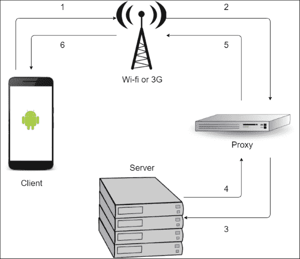
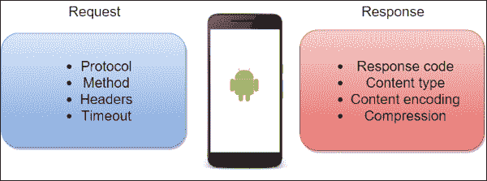
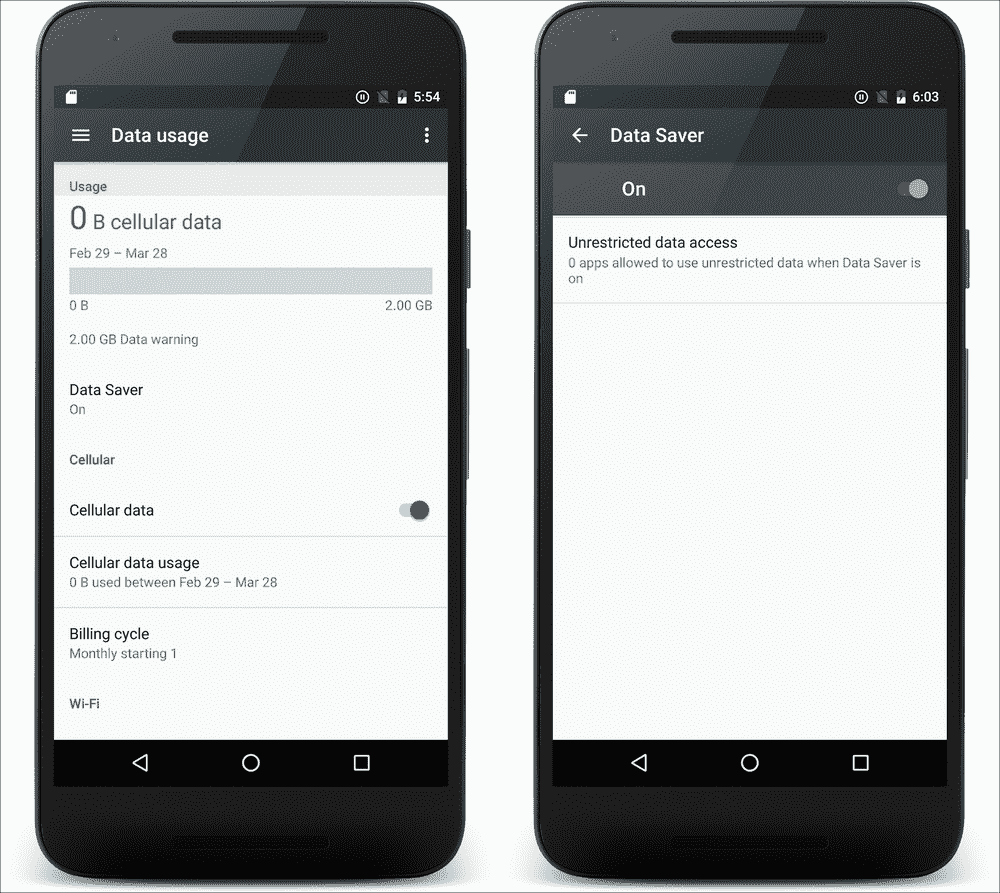
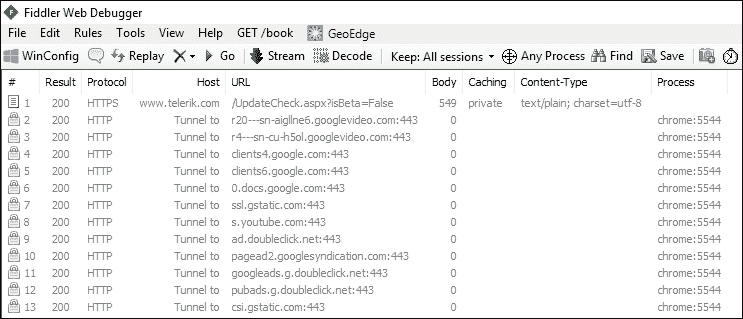
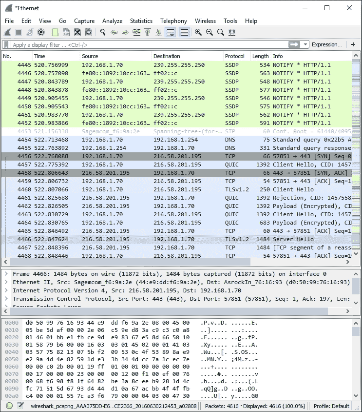
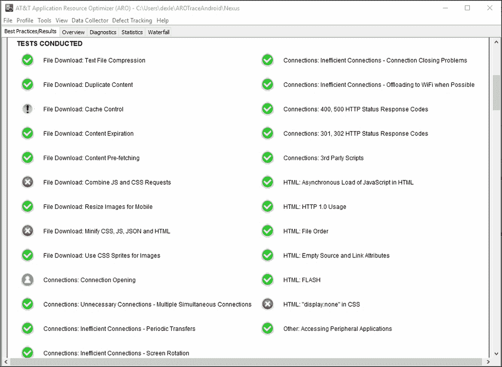
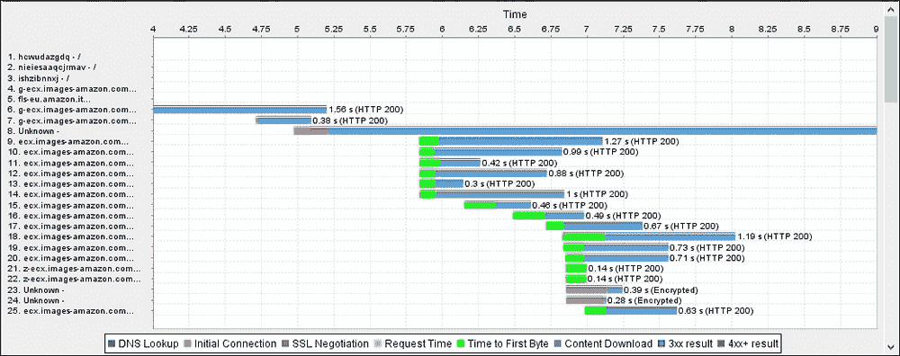
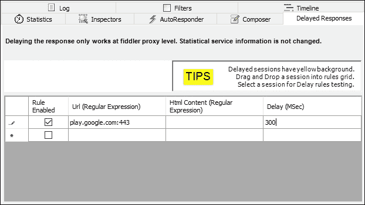
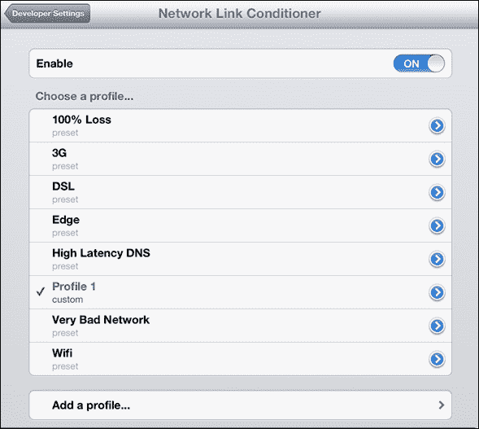
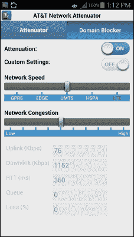

# 第六章：网络

在谈论移动应用程序的性能时，主要关注的是我们的应用程序在连接条件差的情况下的表现。没有开发者希望他的用户因为应用程序在上传或下载数据时太慢，或者与其他平台相同应用程序版本不同步而给出负面反馈。我们有多少次因为客户端或用户说应用程序太慢而改变应用程序的网络策略？网络并不是完全可以从客户端控制的，因为在这个过程中涉及到太多的外部因素：代理、网页服务器、服务提供商、DNS 等。我们无法知道是否有一个或多个元素链中存在问题。

此外，用户并不知道问题出在哪里，但他会认为应用程序不好。然后他会卸载它。然而，我们可以通过使用一些高级技术来减少网络负载，特别是在特定情况下使用一些网络模式，以及识别一些简化我们开发的库来控制应用程序行为并提高用户感知的应用程序性能。像往常一样，我们将通过一些理论知识来掌握这个主题，了解提高应用程序网络方法的最佳实践，然后我们将看看一些不同的，但都有帮助的，官方和第三方的工具，来分析我们的代码，并检查应用程序在不同连接条件下的表现。

# 演练

在我们深入代码学习不同的技术来改进我们的策略之前，我们希望对网络以及 Android 平台提供可能性有一个总体了解。那么，让我们考虑一下客户端在从服务器实例获取预期响应之前需要做些什么。当客户端需要服务器响应时，它在一个高层架构中被路由，这个架构包含许多参与者，如 Wi-Fi 接入点、局域网、代理、服务器和 DNS 服务器，它们有多个实例，需要完成多个请求才能得到所需的响应。然后，当服务器接收到请求时，它需要处理响应，并将其路由回客户端。完成所有这些操作所需的时间对用户来说必须是合理的。此外，链中任意两个参与者之间的链接可能会中断，然后无法向客户端返回响应。与此同时，用户正在应用程序上等待结果，但应用程序却无法接收它，当达到超时时，它将显示错误。

*图 1* 显示了一个可能的流程示例：



图 1：外部网络架构示例

我们不希望这种情况发生在我们的用户身上，但我们无法预测在这种高复杂性架构中会发生什么。相反，我们可以做的是，在处理应用程序外部通信的方式上应用一些增强措施。

无论如何，在开始之前，让我们检查一下外部请求是如何工作的，以更好地了解如何提高网络性能。让我们分解一下客户端在发起请求和处理服务器响应时发生的情况。为此，请查看*图 2*。它展示了从客户端角度的请求和响应，忽略了可能的错误或延迟：它们只是可能在请求中设置的参数以及与响应相关的信息和操作。



图 2：请求和响应客户端项概览

为了处理这些问题，Android 提供了两个主要的 API：

+   `HttpClient`：`DefaultHttpClient`和`AndroidHttpClient`类是用于这种 HTTP 实现的主要类。

+   `URLConnection`：这是一个更灵活、性能更高的 API，用于连接到 URL。它可以使用不同的协议。

`URLConnection` API 比`HttpClient` API 更受欢迎，以至于后者首先被弃用，然后从 Android MarshMallow（API 级别 23）开始被移除。因此，除非特别说明，否则我们将只参考`URLConnection` API。

有一些外部库可以导入到我们的项目中，以使用不同的 API，但特别值得一提的是，除了整合我们将在以下部分看到的某些模式外，还可以在工作者线程中处理请求，从而免去了我们为此创建后台线程的麻烦。我们所说的是谷歌的 Java HTTP 客户端库。在以下部分特别说明时，我们也会提到这一点。

当我们处理互联网访问时，我们必须始终请求用户的许可。然后，我们需要在清单文件中添加以下内容：

```kt
<uses-permission android:name="android.permission.INTERNET" />
```

让我们从 Android 的角度更详细地看看*图 2*中每个项目的具体内容。这将让我们在进入*最佳实践*部分之前，对它们有更好的了解。

## 协议

我们感兴趣的是使用 HTTP 协议进行通信。`URLConnection`子类支持的联网协议包括以下几种：

+   **HTTP 和 HTTPS**：`HttpUrlConnection`是主要的类，也是我们将在本章剩余部分处理的内容。

+   **FTP**：没有特定的类用于**文件传输协议**（**FTP**）通信。你可以简单地使用默认的`URLConnection`类，因为它提供了你需要的一切。

+   **File**：可以使用`URLConnection`类从文件系统中检索本地文件。它基于文件的 URI；因此，你需要调用以 file 开头的 URL。

+   **JAR**：此协议用于处理 JAR 文件。`JarUrlConnection`是获取这类文件的合适类。

该类还允许开发人员使用`URLStreamHandlerFactory`对象添加额外的协议。

## 方法

`HttpURLConnection`类提供的主要请求方法如下：

+   `GET`：这是默认使用的方法，因此你不需要设置其他内容即可使用它。

+   `POST`：可以通过调用`URLConnection.setDoInput()`方法来使用。

其他方法可以通过使用`URLConnection.setRequestMethod()`方法来设置它们。

## 头部

在准备请求时，可能需要添加一些额外的元数据，以使服务器了解应用程序的特定状态，或者关于用户和会话的信息等。头部是添加到请求中的键/值对。它们还用于更改，例如，响应格式，启用压缩，或者请求特定的 HTTP 特性。

有两种特殊的方法用于向请求添加头部和从响应获取头部：

+   `URLConnection.setRequestProperty()`

+   `URLConnection.getHeaderFields()`

在接下来的页面中，我们将更详细地了解一些标题。

## 超时

`URLConnection`类支持两种类型的超时：

+   **连接超时**：可以使用`URLConnection.setConnectTimeout()`方法设置。客户端将等待与服务器建立成功的连接，等待时间由设置的值决定。如果在设定的时间量后没有建立连接，将抛出`SocketTimeoutException`。

+   **读取超时**：这是等待输入流完全读取的最大时间，否则将抛出`SocketTimeoutException`。要设置它，请使用`URLConnection.setReadTimeout()`方法。

对于这两者，默认值是`0`，即客户端没有超时。因此，超时由 TCP 传输层处理。我们无法控制这一点。

## 内容

当我们与服务器开始新的连接时，我们希望得到一个响应；我们可以通过使用`URLConnection.getContent()`方法，将响应内容作为`InputStream`获取。内容有一些参数需要读取，响应中有三个头部控制如何读取它：

+   **内容长度**：这是响应的字节长度，由相关头部指定，并通过`URLConnection.getContentLength()`方法获取。

+   **内容类型**：这是来自`URLConnection.getContentType()`方法的内容的 MIME 类型。

+   **内容编码**：这是用于响应内容编码的类型。使用`URLConnection.getContentEncoding()`方法来确定使用哪种编码。

### 压缩

内容编码值用于指定响应内容内部的压缩类型。客户端可以通过使用`Accept-Encoding`头并指定以下之一来请求响应的特定编码：

+   `null`或`identity`：这些用于请求响应内容不进行编码。

+   `gzip`：这是默认值；客户端将始终请求 gzip 压缩的内容。

尽管客户端请求压缩内容，但服务器可能未启用 gzip 压缩。我们可以通过检查 `URLConnection.getContentEncoding()` 方法的结果来确定内容是否被压缩。

需要了解的是，每次我们在请求中添加 `Accept-Encoding` 头信息时，响应的自动解压缩功能会被禁用。如果响应内容被压缩，我们需要使用 `GZIPInputStream` 而不是传统的 `InputStream`。

## 响应代码

响应对于创建我们的策略至关重要，因为应用程序需要根据响应代码以不同的方式行事。`HttpURLConnection.getResponseCode()` 方法返回响应代码，我们可以使用它来切换应用程序的行为。下面是它们的宏观分组：

+   `2xx: 成功`：服务器已接收请求并返回响应。

+   `3xx: 重定向`：客户端需要采取行动以继续请求。这通常是自动完成的；大多数情况下我们不需要处理这些动作。

+   `4xx: 客户端错误`：这种响应代码表示请求存在问题。可能是请求中的语法错误，请求前需要授权，请求的资源找不到等等。

+   `5xx: 服务器错误`：如果服务器内部出现问题或某些服务超载，服务器可能会发送带有此代码的响应。

## 连接类型

除了请求和响应参数外，从客户端的角度来看，我们可以根据启用的连接类型在需要请求时改变应用程序的行为。可以使用 `ConnectionManager` API 来确定在特定时间哪个连接是活跃的。调用 `ConnectionManager.getActiveNetworkInfo()` 来检索 `NetworkInfo` 数据。了解哪个连接是活跃的以及是否已连接很有帮助。调用 `NetworkInfo.getType()` 方法来获取 `ConnectionManager` 的常量值，并比较以下类型：

+   `TYPE_MOBILE`

+   `TYPE_WIFI`

+   `TYPE_WIMAX`

+   `TYPE_ETHERNET`

+   `TYPE_BLUETOOTH`

如果需要用户下载大文件，我们应避免在移动网络激活时这样做，因为其速度可能比 Wi-Fi 连接慢得多，并且可能导致用户产生意外的费用。

检查活跃网络不足以知道我们是否可以开始新的网络请求：我们还应该调用 `NetworkInfo.isConnected()` 方法来接收响应。

我们甚至可以通过使用 `BroadcastReceiver` 并为其注册 `ConnectivityManager.CONNECTIVITY_ACTION` 事件来监听网络变化。这样，我们就可以知道活跃网络发生更改时的情况，然后例如，如果 Wi-Fi 已开启，就可以开始新的请求。

要访问网络状态的所有这些操作，我们需要得到用户的进一步许可，并在清单文件中添加以下内容：

```kt
<uses-permission 
android:name="android.permission.ACCESS_NETWORK_STATE" />
```

# 最佳实践

我们在前一节讨论的网络理论是我们将要概述的最佳实践的起点。我们将研究网络软件架构和要遵循的模式，以改善应用程序的客户端-服务器通信，从而增强用户对我们应用程序速度的理解。

## 延迟评估

我们最初说过，没有办法预测到服务器远程请求的时间。这通常是正确的，但我们可以通过追踪请求的时间并计算平均值来大致估计其持续时间。这种特定的过程有助于根据延迟定义不同的策略。例如，如果对特定远程资源的响应速度很快，我们可以预期在相同的连接条件下，它仍然会很快。

此外，我们然后可以更改请求，在响应较慢的情况下请求更多信息。典型的例子是图像分辨率：如果响应足够快，我们可以向服务器请求更高分辨率的图像。另一方面，如果我们预期响应较慢，最好请求较低分辨率的图像。这样，我们可以平衡时间并获得相同的响应性。

因此，需要设置特定的延迟量，考虑响应是快还是慢。我们甚至可以考虑不止一个延迟级别来创建我们的策略。这样，响应时间的估计将更准确，这种模式的实现也会更好。

例如，考虑具有三个延迟级别的案例：Wi-Fi 连接的标准延迟，LTE 的较高延迟和 GPRS 的较低延迟。以下代码段显示了如何检查连接并应用策略：

```kt
ConnectivityManager cm = (ConnectivityManager) getSystemService(Context.CONNECTIVITY_SERVICE);
TelephonyManager tm = (TelephonyManager) getSystemService(Context.TELEPHONY_SERVICE);
NetworkInfo activeNetwork = cm.getActiveNetworkInfo();

switch (activeNetwork.getType()) {
    case (ConnectivityManager.TYPE_WIFI):
        // apply standard latency strategy
        break;
    case (ConnectivityManager.TYPE_MOBILE): {
        switch (tm.getNetworkType()) {
            case (TelephonyManager.NETWORK_TYPE_LTE):
                // apply higher latency strategy
                break;
            case (TelephonyManager.NETWORK_TYPE_GPRS):
                // apply lower latency strategy
                break;
            default:
                break;
        }
        break;
    }
    default:
        break;
}
```

## 批处理连接

每次打开无线电进行连接时，它大约会消耗 20 秒的电力，这会导致从用户的角度来看电池耗电量大，性能感知低。因此，尽可能减少连接次数非常重要。

我们可以在应用程序中应用的可能策略之一是收集客户端和服务器之间所有要交换的数据，并在数据传输量足够时为将来的连接保留。这个想法是减少连接次数，并增加每次连接时传输的数据量。

一个典型的例子是经典的分析库。它可以在发生需要追踪的事件时执行连接，或者在达到某些事件数量或过了一定时间后，收集事件以便传输到服务器。第二个选择更为可取，因为它减少了通信次数并增加了单个连接传输的数据量。

### 提示

在设计客户端/服务器架构时，减少通信量应始终是一个关键点。牢记这一点可能会使应用程序性能超出预期，因为如果设计得当，这种架构可以导致屏幕内容丰富且通信量减少。

在我们的应用程序中使用这种模式主要有两个方面：我们可以执行一个请求来获取更多数据，要求服务器提供有关我们应用程序多个部分的信息以减少请求，或者我们可以批量处理多个连接以避免不必要的无线电操作，这可能会耗尽电池电量。下面几页将详细介绍它们。

### 预取

一种特殊的减少连接并避免应用程序出现空白屏幕的技术是**预取**。这个想法是，在连接可用时尽可能多地下载数据，用于我们应用程序的不同请求和部分。因此，在可能的情况下，我们应该让应用程序在后台下载数据，以填充部分内容并预测可能导致性能感知下降的用户请求。

这必须设计好，因为如果使用不当，它可能导致电池耗电和带宽过大，仅仅因为下载了未使用的数据。因此，一个好的策略是结合延迟评估来使用这种模式。一旦我们估计了延迟，如*延迟评估*部分所述，我们可以使用不同的预取策略和不同级别的资源向服务器请求，为未来更好的连接机会要求更高的预取策略。

### 排队连接

在开启无线电的情况下减少时间有一个特殊情况：如果请求不会立即执行，它们可以排队等待未来的批量连接。以下代码就是这种情况的一个例子：

```kt
public class TransferQueue {
    private Queue<Request> queue;

    public void addRequest(Request request) {
        queue.add(request);
    }

    public void execute() {
        //Iteration over the queue for executions
    }
}
```

## 缓存响应

如前所述，节省时间、带宽和电池电量的最佳方法是不执行任何网络请求。这并不总是可能的，但我们可以使用缓存技术来减少这些请求。为此，在策略应用方面有几个选择。

有关文件和位图缓存的更深入技术，请参考第十章，*性能技巧*。

### 缓存控制

安卓冰淇淋三明治（API 级别 14）提供了一个有用的 API，将响应保存到文件系统中作为缓存。我们所说的是`HttpResponseCache`类。当使用`HttpURLConnection`和`HttpsURLConnection`类时，它可以用来保存和重用响应。

使用它的第一件事是设计合适的缓存大小：它需要有一个上限，以便开始删除不必要的条目来释放磁盘空间。然后，我们需要找到合适的数量，以便在不过分占用磁盘空间的情况下进行少量删除。这取决于应用程序执行请求的类型以及每个请求下载数据的量。选择缓存大小后，需要在应用程序开始时按以下方式安装缓存：

```kt
protected void onCreate(Bundle savedInstanceState) {
    super.onCreate(savedInstanceState);
    try {
        File httpCacheDir = new File(getCacheDir(), "http");
        long httpCacheSize = 0;
        HttpResponseCache.install(httpCacheDir, httpCacheSize);
    } catch (IOException e) {
        Log.i(getClass().getName(), "HTTP response cache installation failed:" + e);
    }
}
```

这样，每个网络请求的响应将被缓存在应用程序内存中，以供将来需要。我们还需要在`Activity.onStop()`方法中刷新缓存，以便在下次应用程序启动时可用：

```kt
protected void onStop() {
    super.onStop();
    HttpResponseCache cache = HttpResponseCache.getInstalled();
    if (cache != null) {
        cache.flush();
    }
}
```

下一步是决定是否必须缓存每个请求。根据我们对每个请求的需求，我们将不得不在请求头中使用以下内容指定预期行为：

```kt
connection.addRequestProperty("Cache-Control", POLICY);
```

`POLICY`的值可以是以下之一：

+   `no-cache`：这种方式请求完整的刷新。整个数据将被下载。

+   `max-age=SECONDS`：如果响应的年龄小于由`SECONDS`指定的值，客户端将接受该响应。

+   `max-stale=SECONDS`：如果响应的过期时间不超过指定的`SECONDS`，客户端将接受该响应。

+   `only-if-cached`：强制客户端使用缓存响应。如果没有任何缓存响应可用，`URLConnection.getInputStream()`方法可能会抛出`FileNotFoundException`。

### 提示

网络请求缓存默认是禁用的。我们可以使用`HttpResponseCache` API 来启用它。一旦启用了`HttpResponseCache` API，它将被用于我们应用程序的每个网络请求。然后，由我们决定如何处理每个请求缓存。

当你可以访问服务器实现时，最佳选择是将服务器端处理请求过期时间的任务委托给响应的`cache-control`头部。这样，你可以从远程简单修改响应头部来改变策略。相反，如果你无法访问服务器端代码，就需要一个策略来处理缓存响应的过期日期，这取决于服务器端实际的响应头部。

### Last-Modified

在处理静态远程资源时，我们可以获取特定资源的最后修改日期。这可以通过读取响应中的`Last-Modified`头部来实现。此外，我们还可以读取`Expire`头部来了解内容是否仍然有效。一个好的做法是连同最后修改日期一起缓存资源，并将这个日期与服务器端的日期进行比较。因此，我们可以应用缓存策略来更新缓存资源以及图形布局。

以下代码段是此头部使用的一个示例：

```kt
HttpURLConnection conn = (HttpURLConnection) url.openConnection();
long lastModified = conn.getHeaderFieldDate("Last-Modified", currentTime);

if (lastModified < lastUpdateTime) {
    // Skip
} else {
    // Update
}
```

在这种情况下，必须单独选择并实现缓存策略。

### If-Modified-Since

还有一种巧妙的方法可以达到与`Last-Modified`头部案例相同的结果：那就是`If-Modified-Since`头部。如果请求包含有`If-Modified-Since`头部，其中带有客户端上次检查资源的日期，服务器将根据`Last-Modified`头部的不同返回不同的状态码：

+   `200`：自上次客户端检查以来，远程资源已被修改。响应包含预期的资源。

+   `304`：远程资源未修改。响应不包含内容。

这里聪明的地方在于，如果内容没有被更新，它就不会在响应中，从而减少了负载，加快了这种客户端/服务器通信的速度。而且更重要的是，如果服务器没有实现这个 HTTP 1.1 策略，客户端仍然可以请求它，总是收到一个`200 OK`的响应。因此，我们可以在客户端实现这个逻辑，以便将来接收我们后端服务的`If-Modified-Since`头部。

让我们看看如何使用这个头部。它可以像以下代码所示的那样显式使用：

```kt
HttpURLConnection conn = (HttpURLConnection) url.openConnection();
conn.addRequestProperty("If-Modified-Since", lastCheckTime);

try {
    int statusCode = conn.getResponseCode();
    switch (statusCode) {
        case 200:
            // Content has been modified
            // Update cached content
            // Update cached lastCheckedTime in cache
            break;
        case 304:
            // Content has not been modified
            // Get cached content
            break;
    }
} catch (IOException e) {
    e.printStackTrace();
}
```

否则，`HttpURLConnection`类有一个特别的方法可以用来启用请求中的`If-Modified-Since`头部。它包含在以下代码片段中：

```kt
HttpURLConnection conn = (HttpURLConnection) url.openConnection();
conn.setIfModifiedSince(lastCheckTime);

// status code check...
```

## 指数退避

有时我们无法避免轮询。在这些情况下，我们应该在出现问题时处理服务器问题，并使用不同的策略。当服务器因过多的请求或网络流量过大而无法处理时，它开始返回错误。对于这些情况，指数退避策略是正确的选择，可以减轻服务器因大量无用的请求而拒绝服务的压力。这种模式包括如果服务器用错误响应，则在后续请求之间增加暂停时间。这样，我们给服务器一个处理过多请求并恢复正常状态的机会。然后，当服务器恢复正常时，我们可以恢复正确的轮询间隔。

让我们通过一些代码来更好地理解如何实现这样的网络模式：

```kt
public class Backoff {
    private static final int BASE_DURATION = 1000;
    private static final int[] BACK_OFF = new int[]{1, 2, 4, 8, 16, 32, 64};

    public static InputStream execute(String urlString) {
        for (int attempt = 0; attempt < BACK_OFF.length; attempt++) {
            try {
                URL url = new URL(urlString);
                HttpURLConnection connection = (HttpURLConnection) url.openConnection();
                connection.connect();
                return connection.getInputStream();
            } catch (SocketTimeoutException | SSLHandshakeException e) {
                try {
                    Thread.sleep(BACK_OFF[attempt] * BASE_DURATION);
                } catch (InterruptedException ex) {
                    throw new RuntimeException(ex);
                }
            } catch (Exception e) {
                return null;
            }
        }
        return null;
    }
}
```

谷歌为 Java 提供的 HTTP 客户端库中也有这种模式的实现。我们可以向`HttpRequest`对象添加一个`UnsuccesfulResponseHandler`，传递一个`HttpBackOffUnsuccessfulResponseHandler`对象。此外，可以在执行前实现一个`ExponentialBackOff`对象，如下所示：

```kt
HttpRequest request = null;
//request initialization...
ExponentialBackOff backoff = ExponentialBackOff.builder()
        .setInitialIntervalMillis(1000)
        .setMaxElapsedTimeMillis(10000)
        .setMaxIntervalMillis(10000)
        .setMultiplier(1.5)
        .setRandomizationFactor(0.5)
        .build();
request.setUnsuccessfulResponseHandler(new HttpBackOffUnsuccessfulResponseHandler(backoff));
HttpResponse httpResponse = request.execute();
//response handling...
```

请记住，不要将此模式用于表示开发错误的服务器响应码。对于`400 (InvalidParameters)`或`404 (NotFound)`响应码，应用它是没有意义的。

## 轮询与推送

我们讨论了减少连接次数的重要性，因为它们对电池和应用的整体性能有影响。有许多情况我们需要从服务器同步数据，我们首先想到的是创建一个轮询系统以保持应用程序始终更新。然后，客户、产品所有者、项目经理等要求我们改善用户体验，我们减少了轮询间隔，导致应用程序不断向服务器请求更新，尤其是从不关闭连接，从而持续增加 CPU 的负担。此外，如果我们不关心用户使用的连接类型，我们可能会让他用完合同中可用的带宽，只是为了检查服务器上是否有新数据可用。

相反的情况是最佳情况：当服务器端发生更改时，它会联系客户端告知发生了什么。这种方式不会建立不必要的连接，并且客户端始终保持最新。为此，谷歌提供了谷歌云消息传递框架。

然而，有时我们无法更改服务器实现，因为我们无法访问后端代码。无论如何，我们可以通过使用一些巧妙的技巧来改进我们设计的轮询机制：

+   让用户决定使用哪个间隔：这样用户就能了解应用程序的行为，并在它耗电过多或需要更准确的更新时更改该值。

+   使用`AlarmManager`时，使用非精确重复闹钟来执行网络操作。系统会自动批量处理多个连接，减少无线电的活动时间。

+   当轮询处于激活状态时，我们可以检查服务器上新数据的频率，并应用指数退避模式等待服务器上的新数据，从而减少不必要的连接数量。例如，如果我们的应用程序请求更新，而没有任何更新可用，我们可以让下一个请求在执行前等待两倍的时间，以此类推，直到达到最大值。当有新数据可用时，我们可以恢复默认值并继续这种方式。

## 提供的 API

在以下页面中，我们希望介绍谷歌提供的一些 API，以改善应用程序的网络部分，并帮助我们以更好的方式开发之前讨论的内容。

### 同步管理器

`SyncManager` API 是为了帮助开发者在客户端和服务器之间设计良好的双向同步系统而提供的。在那些我们希望从客户端传输数据到服务器或反之，但不需要立即执行的情况中，它非常有用。在设计我们的应用程序时，框架提供了许多我们必须考虑的优势，因为它可能是正确的选择，并使我们从开发完成所有必要代码中解放出来。框架期望你的应用程序使用`ContentProvider`在本地存储数据，以便与服务器同步。

它可以将我们的任务添加到队列中，并在满足我们想要的条件时执行它们，例如延迟或在数据更改时等。它可以检查连接性是否可用，并批量连接以减少无线活动时间。它还处理用户的登录信息，以便使用登录凭据将数据同步到服务器。这不是强制性的，因为你可以自己处理登录管理，但你需要定义处理认证的对象。

一旦在我们的应用程序中实现了框架，就可以通过多种方式执行同步操作：

+   当服务器通知客户端某些内容已更改。这是避免轮询方法的最佳方式，如之前讨论的。最好的方法是使用 Google Cloud Messaging：当收到消息时，只需调用`ContentResolver.performSync()`方法来开始新的同步。

+   当客户端发生某些变化，需要同步以使远程服务中的信息保持更新。与前面的情况一样，调用`ContentResolver.performSync()`方法。

+   当系统通知现在是合适的时间去做这件事，因为有一个为许多其他连接打开的连接。这时，我们需要使用`ContentResolver.setSyncAutomatically()`方法。

+   当由于需要定期同步操作而间隔时间到期时。使用`ContentResolver.addPeriodicSync()`方法，指定间隔。

+   当我们希望在没有任何特定条件的情况下开始新的同步时。在这种情况下，调用`ContentResolver.performSync()`方法。

让我们在以下段落中了解框架的实现。

#### 认证器

`Authenticator`类可以通过继承`AbstractAccountAuthenticator`类并实现需要提供服务器上正确认证的每个抽象方法来创建。下面的代码段显示了我们需要实现的方法（如果没有认证，你可以使用这个默认实现并将其作为模拟）：

```kt
public class Authenticator extends AbstractAccountAuthenticator {

    public Authenticator(Context context) {
        super(context);
    }

    @Override
    public Bundle editProperties(AccountAuthenticatorResponse response, String accountType){return null;}

    @Override
    public Bundle addAccount(AccountAuthenticatorResponse response, String accountType, String authTokenType, String[] requiredFeatures, Bundle options){return null;}

    @Override
    public Bundle confirmCredentials(AccountAuthenticatorResponse response, Account account, Bundle options){return null;}

    @Override
    public Bundle getAuthToken(AccountAuthenticatorResponse response, Account account, String authTokenType, Bundle options){return null;}

    @Override
    public String getAuthTokenLabel(String authTokenType) {return null;}

    @Override
    public Bundle updateCredentials(AccountAuthenticatorResponse response, Account account, String authTokenType, Bundle options){return null;}

    @Override
    public Bundle hasFeatures(AccountAuthenticatorResponse response, Account account, String[] features){return null;}
}
```

为了使我们的`Authenticator`工作，我们需要创建一个绑定服务以提供对`Authenticator`的访问。它可以像下面代码段中的简单服务：

```kt
public class AuthenticatorService extends Service {

    private Authenticator mAuthenticator;
    @Override
    public void onCreate() {
        mAuthenticator = new Authenticator(this);
    }

    @Override
    public IBinder onBind(Intent intent) {
        return mAuthenticator.getIBinder();
    }
}
```

身份验证器的参数需要在 XML 文件中以以下方式声明：

```kt
<account-authenticator

    android:accountType="accountExample"
    android:icon="@mipmap/ic_launcher"
    android:smallIcon="@mipmap/ic_launcher"
    android:label="@string/app_name"/>
```

最后，我们需要在清单文件中添加`service`，并指定最近创建的身份验证器：

```kt
<service
    android:name=".syncmanager.AuthenticatorService">
    <intent-filter>
        <action android:name="android.accounts.AccountAuthenticator"/>
    </intent-filter>
    <meta-data
        android:name="android.accounts.AccountAuthenticator"
        android:resource="@xml/authenticator" />
</service>
```

#### 同步适配器

`SyncAdapter`类负责在服务器和客户端之间执行同步。可以通过以下方式扩展`AbstractThreadedSyncAdapter`类来创建：

```kt
public class SyncAdapter extends AbstractThreadedSyncAdapter {
    ContentResolver contentResolver;

    public SyncAdapter(Context context, boolean autoInitialize) {
        super(context, autoInitialize);
        contentResolver = context.getContentResolver();
    }

    public SyncAdapter(Context context, boolean autoInitialize, boolean allowParallelSyncs) {
        super(context, autoInitialize, allowParallelSyncs);
        contentResolver = context.getContentResolver();
    }

    @Override
    public void onPerformSync(Account account, Bundle extras, String authority, ContentProviderClient provider, SyncResult syncResult) {
        // code to execute the transfer...
    }
}
```

`ContentResolver`类用于在`SyncAdapter.onPerformSync()`方法中查询`ContentProvider`。框架不下载或上传数据，也不处理`ContentProvider`。我们需要根据需要自行处理，但`SyncAdapter.onPerformSync()`方法在后台线程中执行，因此我们无需为此目的创建新的线程。

对于`Authenticator`类，我们需要为这个`SyncAdapter`也提供一个绑定的服务：这样我们就可以从绑定组件中引用`SyncAdapter`，以便在我们想要时启动新的同步。为此，我们可以创建以下服务，并小心地在`Service.onCreate()`方法中实例化`SyncAdapter`以作为单例使用：

```kt
public class SyncAdapterService extends Service {
    private static SyncAdapter syncAdapter = null;
    private static final Object lock = new Object();

    @Override
    public void onCreate() {
        synchronized (lock) {
            if (syncAdapter == null) {
                syncAdapter = new SyncAdapter(getApplicationContext(), true);
            }
        }
    }

    @Override
    public IBinder onBind(Intent intent) {
        return syncAdapter.getSyncAdapterBinder();
    }
}
```

`SyncAdapter`的参数必须在 XML 文件中以下列方式声明：

```kt
<sync-adapter

    android:contentAuthority="authorityExample"
    android:accountType="accountExample"
    android:userVisible="false"
    android:supportsUploading="false"
    android:allowParallelSyncs="false"
    android:isAlwaysSyncable="true"/>
```

最后，我们需要在清单文件中声明服务，并提供有关提供的`SyncAdapter`的信息：

```kt
<service
    android:name=".syncmanager.SyncAdapterService"
    android:exported="true"
    android:process=":sync">
    <intent-filter>
        <action android:name="android.content.SyncAdapter"/>
    </intent-filter>
    <meta-data android:name="android.content.SyncAdapter"
        android:resource="@xml/syncadapter" />
</service>
```

## Android N 的变化

从网络的角度来看，Android N 在系统行为中引入了一些变化。我们需要了解这些变化，因为如果不理解清楚，它们可能导致不想要的结果。以下是这些变化：

+   **数据节省器**：这是一个新模式，用户可以启用它以在后台节省昂贵的数据使用，`ConnectivityManager`类提供了一种新的方式来访问这些设置

+   **后台优化**：不再发送通知应用程序连接性已发生变化的广播

在接下来的几页中，我们将通过这些变化来了解如果我们针对新的 Android N SDK 的应用程序，我们能做什么。

### 数据节省器

在 Android N 中引入的新**数据节省器**功能，用户可以通过防止数据计划中的意外费用来节省数据流量。用户如何应用这些策略？在**设备设置**选项中，用户可以检查单个应用程序在后台时访问数据。不允许在后台接收数据的应用程序可以读取用户偏好及其更改。*图 3*展示了在搭载新 Android N 的设备上，新的**数据节省器**功能的外观：



图 3：设备设置内的数据节省器功能及其详情

让我们看看它是如何工作的。Android N SDK 在`ConnectionManager` API 中提供了新的方法来检查用户偏好。主要方法是：

```kt
ConnectionManager.getRestrictedBackgroundStatus()
```

它返回以下之一：

+   `RESTRICT_BACKGROUND_STATUS_DISABLED`：当**数据节省器**被禁用时返回。

+   `RESTRICT_BACKGROUND_STATUS_ENABLED`：当启用 **数据节省** 时返回；现在应用程序不应当在后台使用网络。

+   `RESTRICT_BACKGROUND_STATUS_WHITELISTED`：当启用 **数据节省** 但应用程序被列入白名单时返回。即使应用程序被列入白名单，在启用 **数据节省** 时，应用程序也应限制网络请求。

应用程序应在每种情境下都满足用户的性能预期。这就是为什么我们应该使用此 API 来检查用户偏好，然后根据这些偏好来改变应用程序行为的原因。

一旦我们检查了用户对 **数据节省** 的偏好，我们就应该检查当前连接类型是否为计量的。一个 **计量连接** 是指由于费用和数据计划问题，不应用来下载大量数据的连接。要了解当前连接是否为计量连接，我们可以使用 `ConnectivityManager.isActiveNetworkMetered()` 方法。

检查以下代码，了解如何同时处理 **数据节省** 设置和计量网络的情况：

```kt
ConnectivityManager connectionManager = (ConnectivityManager)
        getSystemService(Context.CONNECTIVITY_SERVICE);
// Checks if the active network is a metered one
if (connectionManager.isActiveNetworkMetered()) {
    // Checks user's Data Saver preference.
    switch (connectionManager.getRestrictBackgroundStatus()) {
        case RESTRICT_BACKGROUND_STATUS_ENABLED:
            // Data Saver is enabled and, then, the application shouldn't use the network in background
            break;
        case RESTRICT_BACKGROUND_STATUS_WHITELISTED:
            // Data Saver is enabled, but the application is //whitelisted. The application should limit //the network request while the Data Saver //is enabled even if the application is whitelisted
            break;
        case RESTRICT_BACKGROUND_STATUS_DISABLED:
            // Data Saver is disabled
            break;
    }
} else {
    // The active network is not a metered one.
    // Any network request can be done
}
```

新 API 还提供了一种监听与 **数据节省** 相关的用户偏好变化的方法。为此，我们只需注册 `BroadcastReceiver` 来监听新添加的 `ConnectionManager.ACTION_RESTRICT_BACKGROUND_CHANGE` 动作。

当我们的 `BroadcastReceiver` 收到此类动作时，我们应该检查活动网络和 **数据节省** 选项的新偏好，如前一段所述，然后相应地操作，以便应用程序能够展现出用户预期的适当行为：

```kt
public class DataSaverActivity extends Activity  {
    private BroadcastReceiver dataSaverPreferenceReceiver = new BroadcastReceiver() {
        @Override
        public void onReceive(Context context, Intent intent) {
            ConnectivityManager connectionManager = (ConnectivityManager)
                    getSystemService (Context.CONNECTIVITY_SERVICE);
            // Checks if the active network is a metered one
            if (connectionManager.isActiveNetworkMetered()) {
                // Checks user's Data Saver preference.
                switch (connectionManager. getRestrictBackgroundStatus()) {
                    case RESTRICT_BACKGROUND_STATUS_ENABLED:
                        // Data Saver is enabled and, then, the //application shouldn't use the //network in background
                        break;
                    case RESTRICT_BACKGROUND_STATUS_WHITELISTED:
                        // Data Saver is enabled, but the //application is whitelisted. The //application should limit the network //request while the Data Saver //is enabled even if the application //is whitelisted
                        break;
                    case RESTRICT_BACKGROUND_STATUS_DISABLED:
                        // Data Saver is disabled
                        break;
                }
            } else {
                // The active network is not a metered one.
                // Any network request can be done
            }
        }
    };

    @Override
    protected void onStart() {
        super.onStart();
        IntentFilter filter = new IntentFilter(ConnectivityManager. ACTION_RESTRICT_BACKGROUND_CHANGE);
        registerReceiver(dataSaverPreferenceReceiver, filter);
    }

    ...

}
```

此特定事件不会传递给声明了隐式 `BroadcastReceiver` 来监听它的应用程序。这一特定政策限制了后台工作；我们将在后续页面中进行解释。

### 后台优化

我们在第四章 *内存* 中探讨了这一主题，当时讨论了连接变化对后台进程内存的影响。我们希望从网络的角度再次审视这个问题，以了解如何改变应用程序在后台的工作方式。

安卓 N 真正改变了什么？有一个特定的动作可以通过使用 Android `BroadcastReceiver` 类的主要组件传递给应用程序。我们知道，`BroadcastReceiver` 可以通过意图以两种主要方式进行注册：

+   **隐式地**：你可以在清单文件中为组件声明一个意图过滤器对象。

+   **显式地**：你可以在组件内部使用 `Context.registerReceiver()` 方法注册 `BroadcastReceiver`。

从组件状态的角度来看，它们之间的区别在于，如果你使用显式方法，组件已经被创建，而使用隐式方法，则会启动组件的新实例。这种行为导致后台操作被执行，然后系统需要额外的努力；这影响了资源、内存和电池。

因此，谷歌决定改变这一行为，针对特定的动作：`ConnectionManager.CONNECTIVITY_ACTION`。因此，如果应用程序针对的是 Android N，这个动作将只由注册了接收器的组件以显式方式接收到；然而，如果使用隐式方式，组件将不再接收它。

正如我们将在以下页面看到的，这可以非常有助于了解设备上何时激活了新的连接状态，以便在后台启动新请求，然后更新一些数据以预取内容。从 Android N 开始，这将不再可能，但谷歌提供了一些替代方案，以其他方式达到这一目标：

+   `JobScheduler`

+   `GcmNetworkManager`

这些框架使用特定的机制来检查在开始与外部资源的新通信之前是否满足所需的网络条件。然后，我们可以像以前一样安排操作来预取数据，而无需注意某些条件。

### GcmNetworkManager

谷歌提供了一个有用的 API，名为`GcmNetworkManager`。它位于谷歌服务 API 的 Google Cloud Messaging 包内。它封装了前面讨论的模式，并增加了更多功能。它提供了以下功能：

+   调度一次性任务

+   调度周期性任务

+   指数退避重试实现：在出现错误的情况下，可以使用指数退避重试策略再次安排任务

+   服务实现：任务的状态与应用程序实现无关，可以在重启和重新启动后保持持久化

+   网络状态依赖的任务调度：可以根据特定的网络状态来安排任务的执行

+   设备充电状态任务调度：只有当设备处于充电模式时，才能安排任务的执行

#### 服务的实现

这是一个易于使用的 API，其灵活性使得我们可以在许多不同的情况下使用它。让我们通过以下代码来了解其实现方法。首先，我们需要通过继承`GcmTaskService`类来创建我们的服务：

```kt
public class MyGcmTaskService extends GcmTaskService {
    public static final String MY_TASK = "myTask";

    @Override
    public int onRunTask(TaskParams taskParams) {
        switch (taskParams.getTag()) {
            case MY_TASK:
                //task code...
                if (success)
                    return GcmNetworkManager.RESULT_SUCCESS;
                else
                    return GcmNetworkManager.RESULT_RESCHEDULE;
        }
        return GcmNetworkManager.RESULT_SUCCESS;
    }
}
```

`GcmTaskService.onRunTask()`方法是我们要开发请求的地方。作为参数使用的`TaskParameter`对象有助于在`TaskParams.getTag()`方法中识别已请求的哪个请求，并在`TaskParams.getExtras()`方法中可选地识别其他参数。每个新请求都会创建一个新线程：因此，`GcmTaskService.onRunTask()`方法在工作者线程中执行，我们无需为此目的担心创建新线程。

当执行请求代码时，我们需要返回一个整数值，指示接下来要做什么：

+   `GcmNetworkManager.RESULT_SUCCESS`：任务已无错误执行，可以从队列中移除

+   `GcmNetworkManager.RESULT_FAILURE`：任务遇到一些错误并失败，但必须从队列中移除

+   `GcmNetworkManager.RESULT_RESCHEDULE`：任务失败，但我们希望稍后使用退避策略再次执行

由于它是一个`service`，我们必须在清单文件中声明它：

```kt
<service
    android:name=".MyGcmTaskService"
    android:exported="true"
    android:permission="com.google.android.gms.permission. BIND_NETWORK_TASK_SERVICE">
    <intent-filter>
        <action android:name="com.google.android.gms.gcm. ACTION_TASK_READY" />
    </intent-filter>
</service>
```

#### 任务调度

让我们看看如何调度一个任务。首先，我们需要获取`GcmNetworkManager`实例：

```kt
GcmNetworkManager mGcmNetworkManager = GcmNetworkManager.getInstance(getApplicationContext());
```

然后，我们需要使用`Task`的其中一个子类来创建一个任务：

+   `OneoffTask`：

    ```kt
    OneoffTask task = new OneoffTask.Builder()
            .setService(MyGcmTaskService.class)
            .setTag(MyGcmTaskService.MY_TASK)
            .setExecutionWindow(0, 1000L)
            .build();
    ```

+   `PeriodicTask`：

    ```kt
    PeriodicTask task = new PeriodicTask.Builder()
            .setService(MyGcmTaskService.class)
            .setTag(MyGcmTaskService.MY_TASK)
            .setPeriod(5L)
            .build();
    ```

最后，我们需要使用`GcmNetworkManager`实例以以下方式调度任务：

```kt
mGcmNetworkManager.schedule(task);
```

#### 任务特性

这两种`Task`类型都有一些特定的参数需要更仔细地查看，因为此 API 的大部分灵活性在于这些参数。它们从`Task`类继承了公共参数：因此，我们将在以下页面中查看它们。

#### 任务

每个`Task`都包含以下参数：

+   `string tag`：这是用于启动`GcmTaskService`实现内部正确执行的代码的任务标识符。

+   `bundle extras`：这用于传递额外信息到`Service`，以便正确执行任务。

+   `class service`：这是用于处理调度的`GcmTaskService`的标识符。

+   `boolean isPersisted`：如果设置为`true`，则任务将被持久化并在重启后执行。只有当调用者持有接收启动完成事件的正确权限时，它才会工作：

    ```kt
    <uses-permission android:name="android.permission.RECEIVE_BOOT_COMPLETED" />
    ```

+   `int requiredNetworkState`：这用于根据执行时的网络连接状态指定所需的行为。这意味着在开始执行之前会检查连接，但根据网络状态，连接可能会很快丢失。因此，无论我们选择什么值，我们都应该始终处理连接不可用的情况。可能的值如下：

    +   `Task.NETWORK_STATE_ANY`：无论连接状态如何，任务都会执行。

    +   `Task.NETWORK_STATE_CONNECTED`：只有在活动数据连接的情况下才会执行任务。否则，任务将延迟到连接可用。这是默认值。

    +   `Task.NETWORK_STATE_UNMETERED`：只有在不受限制的连接可用时才会执行任务。否则，任务将挂起，直到有不受限制的连接可用。

+   `boolean requiresCharging`：这用于指定执行任务所需的设备充电状态。在执行特别耗资源的操作时，等待充电操作可能很有用。至于网络状态，如果设置的值为`true`且不在充电状态，那么在开启充电之前任务将不会执行。

+   `boolean updateCurrent`：这有助于修正较旧的计划任务，并用新任务覆盖它。默认为`false`；因此，每次都会计划一个新任务。

#### OneoffTask

`OneoffTask`允许我们指定一个执行窗口来计划任务。它有以下参数：

+   `long windowStartDelay`：这表示任务的执行起点。这意味着它可以在将来延迟。

+   `long windowEndDelay`：这指定了任务的执行结束点。

#### PeriodicTask

`PeriodicTask`为任务添加以下参数：

+   `long flex`：这设置在计算执行任务的最佳时机时的灵活性。例如，如果周期是 60 秒，而 flex 值为 10 秒，那么任务执行的正确时刻将由调度程序设置为 50 到 60 秒之间。这有助于让调度程序选择执行任务的最佳网络条件。

+   `long period`：这指定了将来执行任务的周期性周期。

# 调试工具

在调试阶段，从网络的角度来看，我们需要灵活的工具来让我们在不同的连接条件下测试我们的应用程序，检查我们在网络上传输的内容，我们是如何做到的，我们如何处理和缓存响应，以及通信是否安全和可靠。

在以下章节中，我们想要讨论的是为了支持新 Android N SDK 内部变化而引入的新`adb`命令。而且，除了之前在第二章 *高效调试* 中讨论的 Android 工具，如网络统计工具和`TrafficStats` API，我们还想简要介绍一些有帮助的工具。这些工具可以让我们分析应用程序的网络性能，并拦截网络通信以便进行详细分析，从而使用本章前面讨论的模式来改进它。

## Android N 网络 ADB 工具

如前所述，Android N 对数据网络后台使用引入了新的限制。因此，它在`adb`内提供了命令，以正确调试和检查我们的实现。

新的命令如下：

+   `adb shell dumpsys netpolicy`：这用于生成关于网络限制设置的报告。

+   `adb shell cmd netpolicy`：这用于检查与 netpolicy 相关的所有命令。

+   `adb shell cmd netpolicy set restrict-background <boolean>`：用于启用或禁用**数据节省**功能。

+   `adb shell cmd netpolicy add restrict-background-whitelist <UID>`：用于将特定包添加到白名单应用程序中。

+   `adb shell cmd netpolicy remove restrict-background-whitelist <UID>`：用于从白名单中移除特定的应用程序包。

## Fiddler

Fiddler 是一个用作代理服务器的调试工具，它能够捕获网络上的 HTTP 和 HTTPS 请求，充当**中间人**（**MITM**）。除此之外，它还可以拦截请求并更改响应，以测试我们应用程序的不同使用场景。

这个工具在许多不同的环境中被使用，但对于我们的 Android 应用程序，我们需要配置设备以通过 Fiddler 网络，并将其作为代理服务器：因此，按照这里给出的步骤配置代理：

+   打开设备的 Wi-Fi 设置。

+   在 Fiddler 所在的网络上长按。

+   在对话框上点击**修改网络**。

+   通过勾选**显示高级选项**复选框来启用高级选项。

+   将**代理设置**设置为**手动**。

+   在**代理主机名**中输入 Fiddler 电脑的 IP 地址。

+   输入 Fiddler 端口**代理端口**。

Fiddler 的图形界面在*图 3*中说明：



图 3：Fiddler 界面

使用这个工具，我们可以访问许多功能来调试我们的应用程序通信，并添加许多扩展来增强其功能，从而提高我们的网络调试技能。

## Wireshark

Wireshark 是一个免费的多平台工具，旨在分析从连接中收集的数据包。它像一个中间人一样工作。你需要将你的设备连接到桌面网络以获取信息。你可以通过 USB 端口、蓝牙或创建 Wi-Fi 热点来连接设备。有很多不同的工具可以做到这一点，甚至在 Wireshark 软件包内部也有。

WireShark 捕获的每个单独数据包在*图 4*中显示：



图 4：Wireshark 中收集的数据包。

捕获的内容可以通过多种方式过滤，以找到我们感兴趣的特殊数据包类型。因此，这个工具是最灵活和受欢迎的数据包分析器之一。

## 应用程序资源优化器

AT&T 的**应用程序资源优化器**（在以下页面中称为**ARO**）是一个用于在桌面查找网络策略改进的好工具。它检查一系列定义的改进点，并给出建议。无需 root 权限。它可以在每个设备上使用，并采用两个连续的步骤：

+   **数据收集**：通过注册视频和追踪网络请求来收集数据。

+   **数据分析**：通过检查 25 项最佳实践来分析应用程序的网络连接。

收集数据需要 VPN，但应用程序将自动安装创建 VPN 所需的设备。然后，要开始收集，请点击**数据收集器**，然后点击**开始收集器**。在设备上导航应用程序，完成后，在桌面上的 ARO 应用程序中点击**数据收集器**和**停止收集器**。ARO 将分析数据，并以图形方式显示结果，如图*图 5*所示：



图 5：AT&T 应用程序资源优化器结果

ARO 为每个分析的最佳实践显示结果，我们可以详细检查每一个，以了解哪里出了问题以及如何修复。

它的瀑布视图还可以用来了解每个单独连接的时间，并检查是什么降低了响应速度，如图*图 6*所示：



图 7：ARO 瀑布视图

## 网络衰减

我们想在应用程序中执行的主要测试与设备的网络条件有关。这并不简单，因为只有少数工具可以做到这一点，尤其是在真实设备上。然而，我们想探索一些选择。这就是为什么下面我们将使用允许我们为本地连接的设备更改这些值的工具，然后我们将处理模拟器速度和延迟的高级管理。

## 速度和延迟模拟

图形化模拟器控制器允许我们为速度和延迟设置预设值。尽管如此，命令行模拟器控制器可以在模拟器运行时使用自定义值设置和更改它们。

要设置速度并启动模拟器，我们可以运行以下命令：

```kt
emulator -netspeed <speed>

```

其中`<speed>`可以是以下之一：

+   `gsm`: 上传速度：14.4 kbps，下载速度：14.4 kbps

+   `hscsd`: 上传速度：14.4 kbps，下载速度：43.2 kbps

+   `gprs`: 上传速度：40.0 kbps，下载速度：80.0 kbps

+   `edge`: 上传速度：118.4 kbps，下载速度：236.8 kbps

+   `umts`: 上传速度：128.0 kbps，下载速度：1920.0 kbps

+   `hsdpa`: 上传速度：348.0 kbps，下载速度：14400.0 kbps

+   `full`: 最大上传速度，最大下载速度

+   `<link>`: 上传速度：链路值 kbps，下载速度：链路值 kbps

+   `<up>:<down>`: 上传速度：up 值 kbps，下载速度：down 值 kbps

特别是最后两个值，让我们可以决定任何网络速度的值。然后，如果我们想在模拟器运行时改变速度，我们可以使用以下命令，并使用之前提到的相同值：

```kt
network speed <speed>

```

它类似于延迟值。启动具有选定延迟的模拟器的命令如下：

```kt
emulator -netdelay <delay>

```

其中`<delay>`可以是以下之一：

+   `gprs`: 最小延迟：150 ms，最大延迟：550 ms

+   `edge`: 最小延迟：80 ms，最大延迟：400 ms

+   `umts`: 最小延迟：35 ms，最大延迟：200 ms

+   `none`: 最小延迟：0 ms，最大延迟：0 ms

+   `<latency>`：最小延迟：ms 中的延迟值，最大延迟：ms 中的延迟值

+   `<min>:<max>`：最小延迟：ms 中的最小值，最大延迟：ms 中的最大值

至于速度，我们可以改变运行模拟器的网络延迟。只需使用上面列出的特定延迟值执行以下命令：

```kt
network delay <delay>

```

### Fiddler

我们在本章前面已经介绍了这个工具，但这里我们想要了解的是，Fiddler 允许我们通过添加一个特定的插件来改变网络的延迟。这就是 Fiddler 延迟响应扩展，它看起来像*图 7*中的截图：



图 8：Fiddler 延迟响应扩展

众所周知，Fiddler 作为代理工作，每个请求都会通过它。因此，我们可以将每个与特定远程资源的会话添加到*图 7*中截图所示的插件中，并为它设置特定的延迟（毫秒）。

### 网络链接调节器

苹果设备有一个名为**网络链接调节器**的服务，它有助于在设备上设置特定的网络配置文件。因此，我们可以将其用于网络共享，利用这个工具在真实设备上测试我们的应用程序。它看起来像*图 8*中的截图：



图 9：网络链接调节器

### 网络衰减器

AT&T 网络衰减器是一个 Android 应用程序，可以改变设备的连接条件，以在实际场景中测试我们的应用程序。该项目仍处于测试阶段，只能在获得 root 权限的三星 Galaxy S3 上使用，但希望将来能改进以支持更多设备。让我们简要了解一下它，以理解它如何提供帮助：

当安装在设备上时，网络衰减器可以执行以下操作：

+   改变上传和下载的网络速度

+   通过设置数据包丢失百分比来改变网络效率

+   通过域名或 IP 地址阻止远程资源访问

使用这个工具，无需将设备连接到由其他应用程序控制和限制的特定网络。它看起来像*图 9*中的截图：



图 10：AT&T 网络衰减器

# 概述

应用程序的网络方面是最具挑战性的问题。从应用程序的网络策略来看，你可以从这个角度找到可以优化的东西。为此，我们处理了 Android 上的`UrlConnection` API，以便更好地理解我们可以用它做什么，分析如何使用不同的网络协议，设置不同的请求方法类型，向请求中添加额外的参数，如头部和 cookies，以及处理通信中的压缩。然后，我们概述了平台上可用的连接类型，以了解我们的应用程序在网络传输中可以达到的速度。

然后，在*最佳实践*部分讨论的模式在提高网络性能方面非常有用。需要遵循的一般原则是：

+   根据连接速度改变要传输的内容，以加快应用程序速度。

+   预取数据以加快导航速度并减少远程请求。甚至更好的是，测量延迟以确定预取的正确策略，以在速度和传输节省之间达到正确的平衡。

+   启用响应缓存以保存单个连接上传输的数据。考虑使用`If-Modified-Since`头部，当需要已缓存的静态远程资源且服务器上未修改时，减少请求的负载。

+   在可能的情况下，考虑使用推送模式而不是轮询模式，以节省带宽和电池，并在不需要时避免激活无线电。

+   当后端出现暂时性错误时，限制请求可能很有帮助。为此，指数退避模式是让服务器在过载时恢复时间和资源的正确选择。

在定义了最佳实践之后，我们通过平台提供的几个有用的 API 来实践本章所讨论的内容。以下是一些 API：

+   `SyncManager` API

+   `GCMNetworkManager` API

为了验证我们所学的内容是否应用得当，我们在*调试工具*部分讨论了正确的工具来检查三个主要目标：

+   在不同的网络条件下测试应用程序，改变速度和延迟。

+   从外部检查请求属性，以确保它们符合我们的需求

+   检查在应用程序生命周期中是否有执行不必要的传输

为了这些目标，我们引入了 Fiddler、WireShark 和 ARO：这三种工具用于分析我们的应用程序，并让我们知道如何改进它。最后，我们讨论了几种方法，用于在模拟器和真实设备上模拟连接条件不佳的情况。

在这里，我们处理了与网络架构和策略有关的一切，以改善连接时间并减少由于使用无线电导致的电池耗电，但我们还没有讨论缓存。请参考第十章，*性能技巧*，详细了解如何正确缓存数据以便将来重用，使用序列化技术，然后从 CPU 和网络性能的角度提高性能，加快应用程序的整体响应速度。
