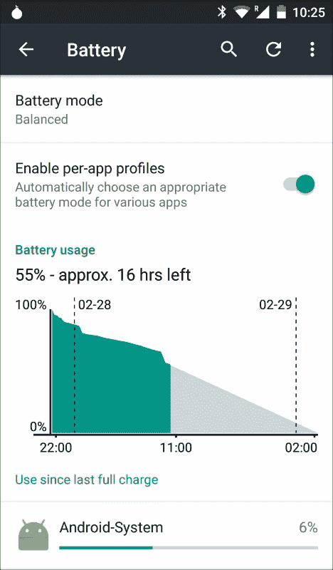
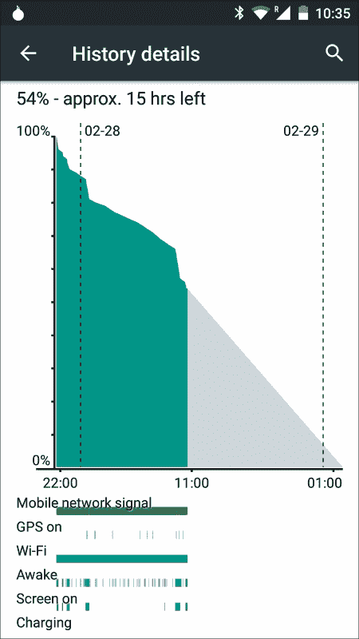
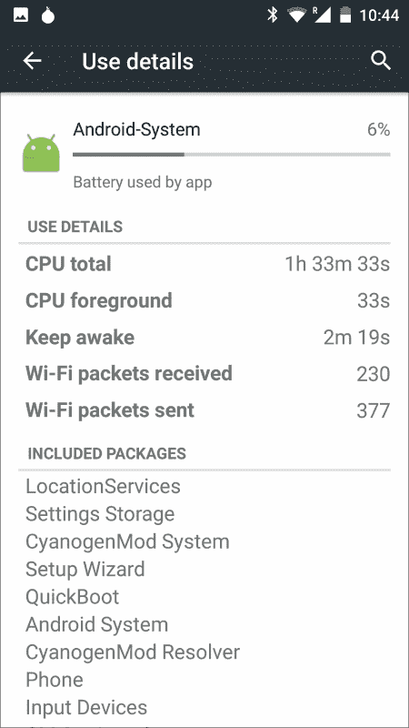
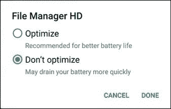

# 第八章：优化电池消耗

电池消耗和使用是开发高性能移动平台应用程序的关键部分。在桌面上，我们不需要特别关心使用的能量量，因为有一个永久的能源连接，但在移动设备上情况不同，我们需要关注这一点。

在移动设备上，电池平均可以使用高达 36 小时，而这个时间随着手机变旧而减少。这是一个特别短的时间，使得我们的设备依赖于接近电源。尽管摩尔定律几乎仍然在实现中，处理能力/单位成本的关系大约每 18 个月翻一番，但电池技术的改进速度每年大约提高 5%。目前有一些关于超级电容器的持续研究，这是近期最有望的希望，但我们正在接近电化学的理论极限。无论如何，电池限制似乎将与我们同在，学习如何处理和操作它们似乎是最明智的做法。

电池耗尽是用户不满的常见原因，通常会导致我们的应用程序在谷歌 Play 商店得到差评。据说“好事写在沙子上，而坏事刻在石头上。”如果你的应用程序持续耗尽设备资源，最终会被卸载，导致不良的在线印象。我们不知道用户是否会通过负责任地使用电池和能源，在沙子上留下好的印象，但我们知道，通过遵循本章关于电池使用的指示，用户会更快乐，你将为更健康的应用程序生态系统做出贡献。

# 分析

在我们开始寻找问题的解决方案之前，需要进行一步分析。在你的安卓设备上，前往**设置**，然后点击**电池**。会出现一个类似下图的界面：



这是一个有用的分析工具，用于确定哪个应用程序正在错误或过度地使用电池。第一部分，**电池模式**，包含三种不同的电池使用模式：

+   **省电模式**：此模式理解你的设备没有迫切需要节省电池使用。因此，其使用量不会减少。

+   **平衡**：默认激活的中间级别。

+   **性能**：此级别在你的设备上激活一种稀缺模式。电池的使用时间会更短，以牺牲能源性能为代价。

下一个部分，电池使用情况，可以帮助我们确定设备在过去 24 小时的状态。让我们点击它以显示下一个屏幕：



这个屏幕已经包含了一些非常有用的信息。我们可以看到过去 24 小时内电池电量的变化图表以及根据之前性能预测的接下来几小时的情况。更有趣的是图表底部的彩色条：它们以图形方式表示设备在那一刻哪些组件是活跃的：移动网络信号、GPS、Wi-Fi、设备是否唤醒、屏幕是否开启以及设备是否在充电。这对于调试我们没有源代码访问权限的第三方应用程序特别有用，分析它们是否经常启动我们不需要的组件。

上一部分展示了设备上安装的应用程序的全面列表。如果我们点击一个具体的应用程序，将会显示一个带有详细信息的新屏幕：



这个屏幕包含了应用程序的所有详细使用情况，这为我们分析提供了有用的信息。应用程序是否消耗大量数据？它是否让设备长时间保持唤醒状态？执行了多少 CPU 计算？根据这些信息，我们可以确定行动点。

## 监测电池电量和充电状态

我们的设备执行持续的后台操作，这些操作耗电量大：网络更新、GPS 请求或计算密集型数据操作。根据电池状态，我们可能想在电池快耗尽时避免昂贵的操作。检查电池当前状态始终是一个好的起点。

为了检查电池的当前状态，我们需要捕获由`BatteryManager`类定期发送的`Intent`：

```kt
IntentFilter ifilter = new IntentFilter(Intent.ACTION_BATTERY_CHANGED);
Intent intentBatteryStatus = context.registerReceiver(null, ifilter);
```

当获取到这个意图后，我们可以查询设备是否正在充电：

```kt
int status = intentBatteryStatus.getIntExtra(BatteryManager.EXTRA_STATUS, -1);
boolean isCharging = status == BatteryManager.BATTERY_STATUS_CHARGING ||
                     status == BatteryManager.BATTERY_STATUS_FULL;
```

如果设备正在充电，还可以确定充电是通过 USB 还是通过交流充电器进行的：

```kt
int chargePlug = batteryStatus.getIntExtra(BatteryManager.EXTRA_PLUGGED, -1);
boolean isUSBCharging = chargePlug == BatteryManager.BATTERY_PLUGGED_USB;
boolean isACCharging = chargePlug == BatteryManager.BATTERY_PLUGGED_AC;
```

作为一条经验法则：如果设备正在充电，我们应该最大化所有要执行的操作，因为这不会对用户体验产生重大负面影响。如果设备电池电量低且未在充电，我们应考虑停用耗计算资源昂贵的操作。

## 如何识别充电状态的变化

我们已经了解了如何分析当前的充电状态，但如何对变化做出反应呢？前面提到的`BatteryManager`类会在设备连接或断开充电源时进行广播。为了识别它，我们需要在清单文件中注册一个`BroadcastReceiver`：

```kt
<receiver android:name=".PowerConnectionBroadcastReceiver">
  <intent-filter>
    <action android:name="android.intent.action. ACTION_POWER_CONNECTED"/>
    <action android:name="android.intent.action. ACTION_POWER_DISCONNECTED"/>
  </intent-filter>
</receiver>
```

使用我们之前创建的方法，现在可以轻松识别并响应充电状态的任何变化：

```kt
public class PowerConnectionReceiver extends BroadcastReceiver {
    @Override
    public void onReceive(Context context, Intent intent) {
        int status = intentBatteryStatus.getIntExtra (BatteryManager.EXTRA_STATUS, -1);
        boolean isCharging = status == BatteryManager.BATTERY_STATUS_CHARGING ||
                     status == BatteryManager.BATTERY_STATUS_FULL;

        int chargePlug = batteryStatus.getIntExtra (BatteryManager.EXTRA_PLUGGED, -1);
          boolean isUSBCharging = chargePlug == BatteryManager.BATTERY_PLUGGED_USB;
          boolean isACCharging = chargePlug == BatteryManager.BATTERY_PLUGGED_AC;
    }
}
```

## 确定并响应电池电量的变化

类似于之前确定充电状态的方法，访问设备在特定时刻的电池电量将有助于确定要在我们的设备上执行的操作。

访问我们之前收集的`intentBatteryStatus`元素，我们可以用以下几行来查询我们的电池电量：

```kt
int level = intentBatteryStatus.getIntExtra(BatteryManager.EXTRA_LEVEL, -1);
int scale = intentBatteryStatus.getIntExtra(BatteryManager.EXTRA_SCALE, -1);

float batteryPercentage = level / (float)scale;
```

变量`batteryPercentage`包含设备上剩余的电池百分比，尽可能准确。请注意，实际值可能会有小的偏差。

与之前的情况类似，我们可以通知我们的应用程序当设备电量不足时。为此，我们需要在 Android 清单中注册以下`BroadcastReceiver`：

```kt
<receiver android:name=".BatteryLevelBroadcastReceiver">
<intent-filter>
  <action android:name="android.intent.action.ACTION_BATTERY_LOW"/>
  <action android:name="android.intent.action.ACTION_BATTERY_OKAY"/>
  </intent-filter>
</receiver>
```

这个`BroadcastReceiver`将在设备每次进入低电量模式（或因为充电而退出）时触发。

当电池电量危急时，具体要采取的策略由读者决定。通常，本书的作者建议在电池电量危急时关闭非必要操作。

# Doze 模式和 App 待机

安卓 6.0 棉花糖（API 版本 23）首次引入了两项强大的功能，以节省我们设备上的电池电量：Doze 模式和 App 待机。前者在设备长时间未使用时减少电池消耗，后者在特定应用长时间未使用时对网络请求做同样处理。

## 了解 Doze 模式

Doze 模式在 API 级别高于 23 的设备上默认激活。当设备在一段时间内未插电且无活动时，它将进入 Doze 模式。进入 Doze 模式对你的设备有一些重大影响：

+   你的设备将不会有网络操作，除非接收到来自**Google Cloud Messaging（GCM）**的高优先级消息

+   WakeLocks 将被忽略

+   使用`AlarmManager`类设置的闹钟计划将被忽略

+   你的应用程序将不会执行 Wi-Fi 扫描

+   不允许运行 Sync 适配器或作业调度程序

阅读完第一点后，你可能会想“那么，如果大家都遵循这种模式，没有什么能阻止我持续使用 GCM 消息，实现一个具有高优先级的应用程序？”坏消息是：谷歌已经考虑到了这一点。Dianne Hackborne 在她的官方 Google Plus 个人资料中已经声明，所有高优先级的消息都是通过谷歌 GCM 服务器发送的，它们可能会受到监控。如果谷歌发现某个特定平台正在滥用系统，可能会停止 GCM 高优先级消息，而无需修改设备上的任何软件。我们的建议是：如果你正在实现一个带有高优先级 GCM 消息的系统，请按照谷歌推荐的方式保持功能；只发送和通知重要和相关信息。

可以为应用程序关闭休眠模式。为此，你需要进入**设置**菜单，选择**电池**，然后在屏幕右上角选择**电池优化**。选择你是否想要优化应用程序：



我们之前提到过，在休眠模式下闹钟不会被触发。为了帮助我们的应用程序适应，Android 6.0 为我们提供了一些额外的功能：`setAndAllowWhileIdle()`和`setExactAndAllowWhileIdle()`函数。使用这些方法，我们可以决定特定的闹钟是否也应在休眠模式下触发。然而，我们鼓励你很少使用这些方法，主要用于调试目的。休眠模式试图建立一种低电池消耗的模式，我们应该以此为主要指导原则。请注意，即使使用这种方法，闹钟也不能每 15 分钟触发一次以上。

# 避免无用的网络请求

在现实世界中，开发者几乎不会检查网络状态。我们执行的许多闹钟、广播和重复性任务都与互联网连接有关。但是如果没有活跃的互联网连接，执行所有这些操作的意义何在？在互联网连接恢复正常工作之前，忽略所有这些操作将更为高效。

使用以下代码段可以轻松确定当前的互联网连接：

```kt
ConnectivityManager connectivityManager =
        (ConnectivityManager)context.getSystemService (Context.CONNECTIVITY_SERVICE);

NetworkInfo activeNetwork = connectivityManager.getActiveNetworkInfo();
boolean isConnected = activeNetwork != null &&
                      activeNetwork.isConnectedOrConnecting();
```

在执行任何请求之前，我们应该使应用程序能够检查互联网连接是否活跃。这不仅是一个有助于降低电池消耗的应用措施，而且也有利于我们应用程序的良好架构和错误处理：阻止执行 HTTP 请求比触发请求后不得不处理因缺乏活跃互联网连接而导致的超时或任何异常要容易得多。在设备上出现这种情况时，任何网络请求应默认被禁用。

另一个有用的技巧是在互联网连接不是使用 Wi-Fi 时避免下载大量数据。以下代码段将让我们知道当前的连接类型：

```kt
boolean isWiFi = activeNetwork.getType() == ConnectivityManager.TYPE_WIFI;
```

我们通常可以假设 Wi-Fi 网络将始终比 3G/4G 连接快。这不是绝对的真理，我们可能会发现相反的情况是真实的。但作为经验法则，这在大多数情况下是有效的。此外，大多数国家的大多数网络运营商都会限制其网络连接每月使用一定量的数据，超出此限制将产生额外费用或降低速度。如果仅在 Wi-Fi 下执行昂贵的网络操作，你通常会处于安全的一方。

此外，可以轻松执行当前 Wi-Fi 速度的检查，以确定速度是否足以下载大量数据：

```kt
WifiInfo wifiInfo = wifiManager.getConnectionInfo();
int speedMbps = wifiInfo.getLinkSpeed();
```

不幸的是，Android 原生没有直接的方法来检查 3G/4G 的速度。从互联网上下载一些数据，然后建立下载所需时间和下载数据量之间的关系，可以给出一个近似值。然而，这将是一种间接的方法，也需要使用一些带宽。

类似于本章前面部分所解释的内容，我们也可以通过注册`BroadcastReceiver`来通知应用程序设备连接性的突然变化。接收器如下所示：

```kt
  <receiver android:name=".NetworkChangeReceiver" >
            <intent-filter>
                <action android:name="android.net.conn. CONNECTIVITY_CHANGE" />
</intent-filter>
        </receiver>
```

我们的定制`BroadcastReceiver`将按以下方式操作：

```kt
public class NetworkChangeReceiver extends BroadcastReceiver {

    @Override
    public void onReceive(final Context context, final Intent intent) {
        final ConnectivityManager connectionManager = (ConnectivityManager) context
                .getSystemService(Context.CONNECTIVITY_SERVICE);

        final NetworkInfo wifi = connectionManager
                .getNetworkInfo(ConnectivityManager.TYPE_WIFI);

        final NetworkInfo mobile = connectionManager
                .getNetworkInfo(ConnectivityManager.TYPE_MOBILE);

        if (wifi.isAvailable() || mobile.isAvailable()) {
            //perform operation

        }
    }
}
```

# 按需处理 BroadcastReceivers

使用 BroadcastReceivers 的一个副作用是，每次事件实际发生时，设备都会唤醒。这意味着如果我们从长远考虑，那么少量的能源也是不容忽视的。

我们可以使用一种辅助技术来提高应用程序的效率：根据手机当前状态按需激活或停用 BroadcastReceivers。这意味着：例如，如果互联网连接已丢失，我们可能只需等待互联网连接激活，并忽略其他 BroadcastReceivers，因为它们将不再有用。

下面的代码片段展示了如何以编程方式激活或停用在`PackageManager`类中定义的组件：

```kt
ComponentName myReceiver = new ComponentName(context, Receiver.class);

PackageManager packageManager = getPackageManager();

packageManager.setComponentEnabledSetting(myReceiver,
        PackageManager.COMPONENT_ENABLED_STATE_ENABLED,
        PackageManager.DONT_KILL_APP)
```

# 网络连接

在第二章《*高效调试》中，我们引入了网络工具，这是一个可以用来执行设备网络流量的分析的实用工具。我们解释了如何标记网络连接，以确保可以轻松进行数据分析。

如何执行网络工具中数据的解释没有一个单一答案，因为这种解释取决于应用程序根据其功能和目的可能具有的不同要求。但是，如果执行得当，以下几条黄金规则通常会对我们的应用程序产生价值：

+   **预取数据**：我们倾向于按需预取信息，这可能是更简单的解决方案。但从长远来看，预取信息可能是有益的。进行网络分析，如果你发现可以在之前的情况中获取数据，而这对于应用程序有益（例如，在 Wi-Fi 连接时或应用程序空闲时下载一些用户相关信息），那么不妨尝试一下。这对用户体验也有影响，因为信息将更快加载，而不会影响体验。

+   **减少连接数**：通常，相比于进行多次连接以下载小块数据，执行单次连接以下载大量数据更为优化。每个建立的连接都会产生额外的流量费用，并且在连接池中处理不同连接可能会使你的应用程序复杂性呈指数级增长。这并不是每次都能执行的操作，特别是如果你无法访问你的应用程序所使用的网络服务时。但如果你有机会，值得一试，并在修改前后进行网络测试。

+   **批量处理和计划**：如前所述，单独处理请求会更快耗尽你的电池。相反，尽可能使用最少的连接，你可以利用 Android 提供的批量处理/计划 API 之一。这些 API 会创建一个包含你所有可用请求的计划，并一次性执行，从而节省宝贵的时间和能源。

    ### **注意**

    正式来说，有三个可用的批量处理和计划 API：GCM 网络管理器、作业调度器和同步适配器。它们各有几项要求，且每个的实现都比较复杂。然而，谷歌和本书的作者建议使用前两个而不是同步适配器。同步适配器自 Android 2.0 起可用，其实现属于不同的时代；而且，它的实现也较为复杂。

+   **使用 GCM**：这是一个众所周知的真理，但并不经常发生：应为你的应用程序使用如 GCM 这样的推送系统，而不是轮询系统。从服务器拉取数据是完美的电池杀手，对你的应用程序没有任何好处。实现推送解决方案的复杂性将立即得到回报，远胜于拉取数据。

+   **使用缓存机制**：Android 中有多项机制和库可以缓存 HTTP 请求。Spice 提供了一个优秀且全面的库，本书的作者可以明确推荐它。然而，每年都有新的库和方法兴起和淘汰。关注最新的缓存信息机制，并且尽可能地应用它们。

+   **压缩信息**：在发送前可以压缩信息，这样可以节省大量带宽和能源。从 Android Gingerbread 版本开始，`HttpUrlConnection`对象会自动为通过`HttpUrlConnection`对象发送的 JSON 添加压缩。请记住，在客户端压缩信息，发送到服务器后再解压处理，通常比不压缩直接发送信息更为高效。

# **总结**

电池性能是一个令人兴奋的领域，它可以为我们的应用程序提供许多改进。这个领域被广泛忽视，即使是经验最丰富的开发者也常常忽视它，没有加以重视。本书的作者强烈鼓励任何开发者尽可能采取本书中描述的行动，并持续检查应用程序在性能和用户体验方面的改进。我们不能经常和强烈地强调：这样做是值得的。

谷歌承诺将全力以赴提供更好的电池和能源体验，并为开发者提供扩展的 API。如果未来的 Android 版本开始提供新技术以增加电池寿命和改善能源消耗，这并不会令人惊讶。我们建议读者关注未来 Android 版本的发展（在撰写本文时，即 2016 年第一季度，Android N 还没有固定的发布日期）。

阅读本章节后，读者应该能够清楚地了解 Android 开发中主要的电池和能源漏洞。如果这里提供的任何建议被应用，我们建议随着时间的推移跟踪改进的发展情况。这最终可以用来作为向其他开发者解释为什么这些措施重要的有力论据。
