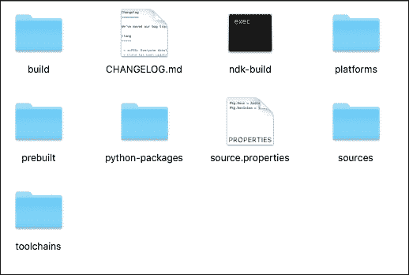
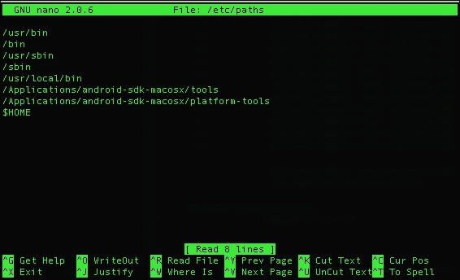
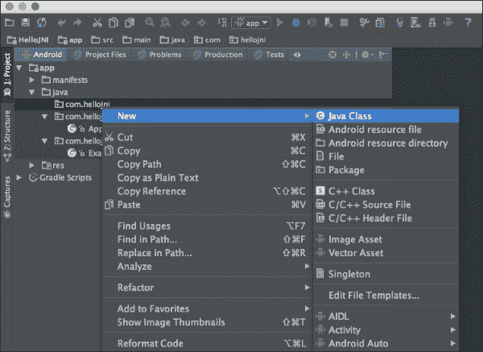
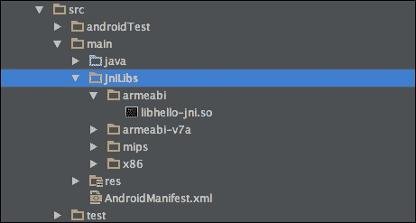
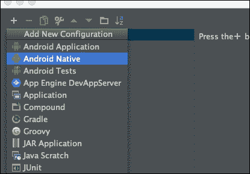
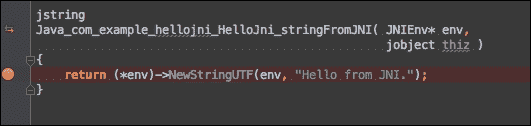
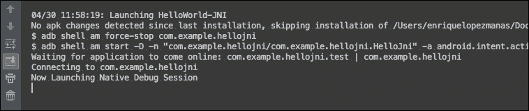
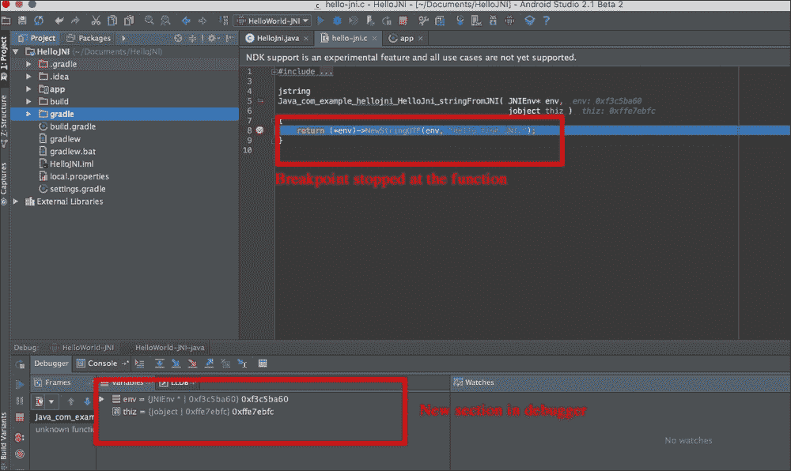

# 第九章：Android 中的本地编码

**本地开发工具包**（从现在开始，**NDK**）是谷歌提供的一套工具，允许开发者使用本地代码语言（通常是 C 和 C++）在应用程序上。这可以让我们使用更优化的语言执行计算密集型任务，或者访问第三方库以更好地执行某些任务（例如，我们可以使用 OpenCV 来访问和操作图像，而不是本地效率不高的 Java API）。

### 注意

NDK 可能是一个强大的工具，但我们建议读者评估它是否会为你的项目带来好处。在许多情况下，并不需要 NDK，开发者不应仅仅因为自己更熟悉就选择这个工具集。此外，使用 NDK 无疑会增加我们项目在结构和需要处理的文件方面的复杂性。

在 Android 中使用 NDK 确实能带来好处，但也必须考虑一些陷阱：

+   代码复杂性增加。除了我们的 Java（或 Kotlin，或选择的任何语言）框架外，现在我们还需要调试另一种语言。

+   使用 NDK 时不再有自动垃圾收集器。执行所有内存管理的责任现在完全依赖于本地代码。

+   如果我们开发的 Java 代码需要移植到其他平台，使用 NDK 将更加困难。正在使用的一个解决方案是将文件编译到所有可能的操作系统，然后在编译时选择它们。可以想象，这大大增加了我们代码的复杂性。

# 入门——在系统中设置 NDK

从 1.3 RC1 版本开始，Android Studio 支持本地开发工具包（NDK）。尽管仍然有限制，但它仍然可用，并将为大多数用户提供足够的功能和稳定性以继续使用。

要设置 NDK，我们首先需要将其下载到我们的系统中。在撰写本书时，最新版本的 NDK 可以从[`developer.android.com/ndk/downloads/index.html`](http://developer.android.com/ndk/downloads/index.html)下载。如果潜在读者在这个位置找不到 NDK，我们鼓励他们通过 Google 搜索其最新版本的位置。

下载完 NDK 后，解压 ZIP 文件并将其移动到你选择的位置。该文件夹将包含类似于以下内容的东西：



这里的每个包都包含一些不同的数据文件：

+   `build`文件夹包含使用 NDK 工具集实际构建所需的所有工具和包。

+   `ndk-build`是我们将调用来使用 NDK 的脚本。

+   `platforms`包含我们将用于每个不同版本的 Android SDK 的必要工具。

+   `python-packages`包含 Python 脚本中的源代码。

+   `sources`文件夹包含源文件。

+   在 `toolchains` 中，我们将找到构建现有程序所需的工具链。关于这方面的更多信息将在本章后面介绍。

通常建议将 NDK 文件夹的位置添加到 `PATH` 环境变量中，以便稍后可以轻松访问。根据操作系统，这可以轻松完成。

在 Mac 上，在控制台中输入 `sudo nano /etc/paths`。你会看到类似于下面截图所示的内容：



你需要在这个屏幕上添加 NDK 下载位置。添加后，关闭控制台并重新打开。如果你输入 `echo $PATH`，除了之前存在的行内容外，你添加的行内容也会被显示。

在 Windows 中，你需要通过控制面板或系统设置来添加它。此外，也可以直接从控制台通过输入 `set PATH=%PATH%;C:\new\folder` 来添加。

为了使用 NDK，我们还需要标准的 Android SDK。如果读者已经阅读到这一章，我们假设这一点已经就绪，并且 Android SDK 已经成功安装。

# JNI

**JNI** 代表 **Java Native Interface**。JNI 允许用其他语言编写的库和软件访问在 **Java Virtual Machine** (**JVM**) 中运行的 Java 代码。这不是与 Android 相关的内容，而是在 Java 世界中已经存在并使用过的编程框架。

JNI 需要将文件声明为 C 或 C++——它甚至可以连接到 Objective-C 文件。下面是 C 语言的一个示例：

```kt
jstring
Java_com_my_package_HelloJni_stringFromJNI( JNIEnv* env,
                                                  jobject thiz )
{
    return (*env)->NewStringUTF(env, "Hello World");
}
```

观察文件，我们可以看到在返回类型 `jstring`（相当于字符串）之后，有一个以单词 `Java` 开头的结构，包括包名、类名和方法名。`JNIEnv` 对象始终作为参数传递，以及 `jobject` ——这是使框架与 Java 接口的必要条件。用 C 编写的函数只返回一个字符串。这对于存储我们希望从潜在破解者眼中隐藏的令牌或密钥将非常有用。

# 初始概念

在我们开始创建第一个本地应用程序之前，我们希望向读者介绍一些初始概念，以便更容易理解：

+   **ndk-build**：这个文件是负责调用 NDK 构建的 shell 脚本。自动地，这个脚本检查系统和应用程序是否正确，生成将被使用的二进制文件，并将它们复制到我们的项目结构中。作为一个 shell 脚本，它可以带有一些额外的参数：

    +   `clean`：这个参数会让脚本清除之前生成的所有二进制文件

    +   `–B`：使用 `–B` 选项，我们强制系统进行重新构建

    +   `V=1`：这会释放构建并显示构建命令

    +   `NDK_DEBUG=X`：如果我们使用 `1`，构建将是可调试的；如果我们使用 `0`，我们将强制进行发布构建

    +   `NDK_LOG=X`：使用`1`，NDK 将记录构建过程中产生的所有消息。

    请记住，所有参数都可以部分组合（例如，如果您想强制重建并显示所有构建命令，可以使用`B V=1`）。当我们自动化构建以从 CI 服务器完成时，这种脚本非常有用，因为我们不再需要手动指定任何构建类型。

+   **应用程序二进制接口**（**ABI**）：ABI 定义指定了代码如何与系统交互。当编译生成的文件时，您会看到针对每种架构都创建了不同的文件。每个文件都是根据这些定义之一创建的。

# 创建我们的第一个 HelloWorld-JNI

让我们使用 Android Studio 创建一个最小配置的项目。为此，导航到**Project** | **New** | **New Project**。创建可用的最简约配置——通常只是一个项目；一开始不要添加`Activity`。这会添加很多我们此刻不需要的样板代码。创建项目后，通过在源文件夹上右键点击，选择**New** | **Java Class**来添加一个新的`Activity`。将类命名为`MainActivity`：



当文件创建完成后，为`Activity`添加以下基础代码：

```kt
public class MainActivity extends Activity { 
    @Override
    protected void onCreate(Bundle savedInstanceState) {
        super.onCreate(savedInstanceState);
    }    
}
```

并记得将其添加到`AndroidManifest.xml`以及您的默认活动中：

```kt
<activity 
    android:name="com.hellojni.MainActivity">
    <intent-filter>
      <action android:name="android.intent.action.MAIN" />
        <category android:name="android.intent. category.LAUNCHER" />
    </intent-filter>
</activity>
```

下一步是创建 JNI 文件。这包括两个主要文件。在应用程序的根目录下创建一个名为`jni`的文件夹。我们将添加以下文件：

### 注意

活动名称与本地方法名称相匹配非常重要。相反的情况可能导致在使用 NDK 时出现问题。

+   `HelloWorld-jni.c`：

    ```kt
    jstring
    Java_com_my_package_HelloJni_stringFromJNI( JNIEnv* env,
                                                jobject thiz )
    {
        return (*env)->NewStringUTF(env, "Hello World");
    }
    ```

+   `Android.mk`：

    ```kt
    LOCAL_PATH := $(call my-dir)

    include $(CLEAR_VARS)

    LOCAL_MODULE    := HelloWorld-jni
    LOCAL_SRC_FILES := HelloWorld-jni.c

    include $(BUILD_SHARED_LIBRARY)
    ```

    `Android.mk`文件是什么？这个文件告诉 Android 我们的资源的定位和命名。在这里，我们指定了将要使用的模块和文件，以及它们的存放位置。在使用 NDK 的所有项目中都必须有这个文件才能正常工作。

+   `Application.mk`：

    ```kt
    APP_ABI := all
    ```

    此文件指定了我们正在构建的目标架构。在这个例子中，我们为所有架构构建，但我们也可以决定只针对特定的架构（armeabi, armeabi-v7a, mips, x86 等）构建。我们最终还可以添加我们正在使用的 API 级别：

    ```kt
    APP_PLATFORM := android-9
    ```

正如预期的读者可能已经开始猜测的那样，我们的目的是读取由 C 文件提供的信息，并通过使用 NDK 和 JNI 将其渲染到屏幕上。完成所有设置后，让我们在`MainActivity`类中进行一些更改。

首先，让我们添加以下几行：

```kt
static {
        System.loadLibrary("HelloWorld-jni");
}
```

这将静态加载我们在`loadLibrary()`函数中指定的库，必须与`Android.mk`文件中提供的完全一致。

现在我们需要创建在我们的`.c`文件中定义的本地方法。这需要在`Activity`中声明一个公共方法：

```kt
public native String stringFromJNI();
```

作为最后一步，为了显示使用 JNI 读取的值，我们将创建一个简单的`TextView`并在我们的应用程序中填充它。这个`TextView`字段将使用`stringFromJNI()`函数读取值并将其显示出来：

```kt
  TextView  textView = new TextView(this);
  textView.setText( stringFromJNI() );
  setContentView(textView);
```

完成所有这些步骤后，进入项目的根目录并输入`ndk-build`。你应该得到类似于以下的输出：

```kt
Compile thumb  : hello-jni <= hello-jni.c
SharedLibrary  : libhello-jni.so
Install        : libhello-jni.so => libs/armeabi-v7a/libhello-jni.so
Compile thumb  : hello-jni <= hello-jni.c
SharedLibrary  : libhello-jni.so
Install        : libhello-jni.so => libs/armeabi/libhello-jni.so
Compile x86    : hello-jni <= hello-jni.c
SharedLibrary  : libhello-jni.so
Install        : libhello-jni.so => libs/x86/libhello-jni.so
Compile mips   : hello-jni <= hello-jni.c
SharedLibrary  : libhello-jni.so
Install        : libhello-jni.so => libs/mips/libhello-jni.so

```

### 注意

使用 NDK 时有一个常见问题，就是类似`Android NDK: Your APP_BUILD_SCRIPT points to an unknown file: /route/to/Android.mk`的消息。通过将你的项目所在路径导出到环境变量`NDK_PROJECT_PATH`中，可以轻松解决这个问题：

```kt
export NDK_PROJECT_PATH=~/Location/HelloJNI/
```

如果你需要以编程方式完成这个操作，请记住这一点。

还需要执行最后一步：当`ndk-build`完成后，在根目录下会创建一个名为`libs`的文件夹。你需要手动将这个文件夹的内容移动到应用模块中的新目录`src/main/jniLibs`。你也可以通过在 Gradle 文件中使用一些脚本轻松完成这一操作：



如果你按照本章的步骤正确操作，并且编译了应用程序，你应该能够显示一个类似于以下的屏幕：


恭喜你！你已经使用 JNI 和 NDK 创建了你的第一个应用程序。

# 使用 Android NDK 创建本地活动

在下一节中，我们将学习如何完全使用本地 C 代码来完成一个应用程序，无需任何 Java 代码。请注意，这样做更多的是为了学习目的，因为完全使用本地应用程序开发的实际案例并不多。然而，这将作为一个不同层次之间以及与 Android 操作系统交互的好例子。

由于我们不使用 Java 代码，我们需要在`AndroidManifest.xml`文件中指定我们的项目将不包含 Java 代码。这是通过使用以下几行来完成的：

```kt
<application android:label="@string/app_name"
android:hasCode="false">
```

从 API 级别 9 开始，仅使用本地代码的应用程序首次得到支持。在撰写这本书的时候，这应该不是问题，因为低于 API 级别 9 的版本占总量的 0.1%以下。然而，由于 NDK 的性质，你可能只会将其用于遗留或旧设备：

```kt
<uses-sdk android:minSdkVersion="9" />
```

最后，我们需要在`AndroidManifest.xml`文件中包含一个名为`android.app.lib_name`的元数据值。这个值需要与你包含在`Android.mk`文件中的`LOCAL MODULE`值相等：

```kt
<meta-data android:name="android.app.lib_name"
android:value="native-activity-example" />
```

`Android.mk`文件看起来可能像这样：

```kt
LOCAL_PATH := $(call my-dir)

include $(CLEAR_VARS)

LOCAL_MODULE    := native-activity
LOCAL_SRC_FILES := main.c
LOCAL_LDLIBS    := -llog -landroid -lEGL -lGLESv1_CM
LOCAL_STATIC_LIBRARIES := android_native_app_glue

include $(BUILD_SHARED_LIBRARY)

$(call import-module,android/native_app_glue)
```

与我们之前版本中使用的文件相比，这个文件中的`Android.mk`已经扩展了。请注意以下字段：

+   `LOCAL_LDLIBS`：这是当前 NDK 应用程序中要使用的附加链接器标志列表。

+   `LOCAL_STATIC_LIBRARIES`：这是需要调用的本地静态库列表。在这种情况下，我们将调用 `android_native_app_glue`。每次尝试创建原生活动以管理其生命周期和其他属性时，都需要这个特殊的库。

在这个例子中，我们将使用的 `.c` 文件比之前使用的要复杂一些。首先，需要向应用程序添加一些额外的包含指令：

```kt
#include <jni.h>
#include <errno.h>

#include <EGL/egl.h>
#include <GLES/gl.h>

#include <android/sensor.h>
#include <android/log.h>
#include <android_native_app_glue.h>

#define LOGI(...) ((void)__android_log_print(ANDROID_LOG_INFO, "native-activity", __VA_ARGS__))
#define LOGW(...) ((void)__android_log_print(ANDROID_LOG_WARN, "native-activity", __VA_ARGS__))
```

有一个主函数，作为进入原生应用程序的入口点。这个函数默认接收一个 `android_app` 类型的对象，它反映了应用程序在给定时刻的状态。基于这个状态，应用程序如下处理：

```kt
void android_main(struct android_app* state) {
    struct engine engine;

    app_dummy();

    memset(&engine, 0, sizeof(engine));
    state->userData = &engine;
    state->onAppCmd = engine_handle_cmd;
    state->onInputEvent = engine_handle_input;
    engine.app = state;

    engine.sensorManager = ASensorManager_getInstance();
    engine.accelerometerSensor = ASensorManager_getDefaultSensor(engine.sensorManager,
            ASENSOR_TYPE_ACCELEROMETER);
    engine.sensorEventQueue = ASensorManager_createEventQueue(engine.sensorManager,
            state->looper, LOOPER_ID_USER, NULL, NULL);

    if (state->savedState != NULL) {
        engine.state = *(struct saved_state*)state->savedState;
    }
```

应用程序还提供了一个主循环。它将检查当前和之前的状态以及传感器的输出，并在屏幕上绘制：

```kt
    while (1) {
        int ident;
        int events;
        struct android_poll_source* source;

        while ((ident=ALooper_pollAll(engine.animating ? 0 : -1, NULL, &events,
                (void**)&source)) >= 0) {

            if (source != NULL) {
                source->process(state, source);
            }

            if (ident == LOOPER_ID_USER) {
                if (engine.accelerometerSensor != NULL) {
                    ASensorEvent event;
                    while (ASensorEventQueue_getEvents (engine.sensorEventQueue,
                            &event, 1) > 0) {
                        LOGI("accelerometer: x=%f y=%f z=%f",
                                event.acceleration.x, event.acceleration.y,
                                event.acceleration.z);
                    }
                }
            }

            if (state->destroyRequested != 0) {
                engine_term_display(&engine);
                return;
            }
        }

        if (engine.animating) {
            engine.state.angle += .01f;
            if (engine.state.angle > 1) {
                engine.state.angle = 0;
            }

            engine_draw_frame(&engine);
        }
    }
}
```

如果你编译，你将在屏幕上绘制一个纯粹的原生活动。

# 调试 NDK

使用 NDK 开发的源代码的调试并不像使用标准的 Android Java DK 开发的代码那样直接，但这个平台上有可用的工具。从 1.3 版本开始，Android Studio 提供了一些内置工具来调试带有 JNI 的应用程序。

为了准备一个要被调试的应用程序，我们需要修改我们的 `build.gradle` 脚本。以我们之前编写的 `HelloWorldJNI` 为例。打开 `app` 模块的 `build.gradle` 文件，并添加以下几行：

```kt
buildTypes {
        release {
            minifyEnabled false
            {…}
            ndk {
                debuggable = true
            }

        }
        debug {
            debuggable = true
            jniDebuggable = true
        }
    }
```

需要创建一个新的调试配置。为了实现它，请导航到 **编辑配置**，并在下拉菜单中选择 **新建 Android 原生**：



当在 Android 原生设置中发布配置时，Android Studio 会自动识别应用程序为原生（或混合）应用程序，并自动启动原生调试器。要查看这一点，请转到你用来在屏幕上绘制内容的 C 文件，并在该函数中设置一个断点：



这将在内容即将被绘制时停止应用程序。现在通过点击 **调试** 图标，，而不是启动图标来执行应用程序。现在与普通应用程序的执行相比，会有一些不同之处。首先，你会看到环境正在尝试连接原生调试器，而不是标准的调试器：



当应用程序最终启动后，执行将在断点处停止，调试部分将出现一个新的屏幕：



新的调试屏幕非常有趣。在这里，我们可以访问所有正在声明或实例化的本地变量（例如，我们在函数中使用的`JNIEnv`变量包含了很多关于我们的环境和可用的调试部分的信息）。

# Android.mk

我们已经了解了`Android.mk`文件提供的一些基本可能性。实际上，这个文件类似于 GNU makefile：它向构建系统描述了源文件和共享库。

在`Android.mk`文件中，我们可以将所有资源分组到模块中。模块可以是静态库、独立可执行文件或共享库。这个概念与 Android Studio 中的模块相似，读者现在应该已经熟悉了。相同的源代码可以用于不同的模块。

我们在前一个脚本中看到了以下这行内容：

```kt
include $(CLEAR_VARS)
```

这个值由构建系统自动提供。它指向一个负责清理许多本地变量的内部 makefile。

我们稍后需要添加这些模块：

```kt
LOCAL_MODULE := example-module
```

为了使文件正常工作，模块需要具有唯一的名称，并且不能有特殊字符或空格。

### 注意

当编译时，NDK 会自动为你的模块添加前缀`lib`，并添加后缀`.so`。在所提供的示例中，生成的文件将是`libexample-module.so`。但是，如果你在`Android.mk`文件中添加了前缀`lib`，那么在生成`.so`文件时将不会添加此前缀。

指定要在模块中包含的文件始终使用以下这行：

```kt
LOCAL_SRC_FILES := example.c
```

如果需要在同一模块中包含不同的文件，你应该使用空格分隔它们，如下所示：

```kt
LOCAL_SRC_FILES := example.c anotherexample.c
```

# NDK 中的更多变量

NDK 定义了一些可以在`Android.mk`文件中自动使用的变量。

## TARGET_PLATFORM

这个变量定义了构建系统要使用的目标平台：

```kt
TARGET_PLATFORM := android-21
```

目标始终以`android-xx`的格式使用。NDK 并不支持所有的平台类型。最好检查 NDK 网站以了解哪些平台是受支持的。在撰写本书时（2016 年第一季度），以下是受支持的平台列表：

| 支持的 NDK API 级别 | 相当于的 Android 版本 |
| --- | --- |
| 3 | 1.5 |
| 4 | 1.6 |
| 5 | 2.0 |
| 8 | 2.2 |
| 9 | 2.3 至 3.0.x |
| 12 | 3.1.x |
| 13 | 3.2 |
| 14 | 4.0 至 4.0.2 |
| 15 | 4.0.3 至 4.0.4 |
| 16 | 4.1 和 4.1.1 |
| 17 | 4.2 和 4.2.2 |
| 18 | 4.3 |
| 19 | 4.4 |
| 21 | 4.4W 和 5.0 |

## TARGET_ARCH

这个变量指定了用于构建 NDK 的架构。它可能包含如`x86`或`arm`等值。此变量的值取自`APP_ABI`文件，该文件在`Android.mk`文件中指定。在撰写本书时，以下是支持的架构及其名称列表：

| 架构 | 要使用的名称 |
| --- | --- |
| ARMv5TE | armeabi |
| ARMv7 | armeabi-v7a |
| ARMv8 AArch64 | arm64-v8a |
| i686 | x86 |
| x86-64 | x86_64 |
| mips32 (r1) | mips |
| mips64 (r6) | mips64 |
| All of them | 所有 |

## TARGET_ABI

当我们想要同时指定 Android API 级别和 ABI 时，这个变量会非常有用。我们可以轻松地这样做，例如：

```kt
TARGET_ABI := android-21-x86
```

# NDK 宏

宏是包含特定功能的小型函数。其中一些默认由 NDK 定义。要调用它们，你必须使用以下语法：

```kt
$(call <function-name>)

```

以下是 NDK 中指定的几个默认宏：

+   `my-dir`：这个宏返回`Android.mk`文件的当前路径。当你最初想在脚本中设置`LOCAL_PATH`时，它非常有用：

    ```kt
    LOCAL_PATH := $(call my-dir)
    all-subdir-makefiles
    ```

    当执行此宏时，它会以列表形式返回找到的所有`Android.mk` makefile，这些文件位于`my-dir`返回的文件夹中。

    使用此命令，我们可以提供更好的子层次结构行和包结构的更好组织。

+   `parent-makefile`：这返回父 makefile 可以找到的路径。

    ### 提示

    `grand-parent-makefile`命令也存在，它返回，顾名思义，是祖父路径。

+   `this-makefile`：这个宏返回当前 makefile 的路径。

# Application.mk

`Application.mk`文件也是我们示例项目中存在的文件。它描述了应用程序所需的本地模块，通常位于`yourProject/jni`文件夹下。与`Android.mk`文件一样，这里我们可以包含一些变量，这将增加此文件的功能性：

+   `APP_OPTIM`：这是一个非常有用的变量，可以用来决定在构建应用程序模块时的优化级别。它可以被定义为`release`或`debug`。

    基本上，当模块在`release`模式下编译时，它们非常高效，提供的调试信息很少。另一方面，`debug`模式包含了一堆有用的调试信息，但不适合分发。默认模式是`release`。

    在发布模式下进行的某些优化包括变量的命名。它们可以被重命名和缩短（你可以想到在应用 ProGuard 时也会进行相同的优化），但显然，在应用程序运行时，将无法对它们进行调试。此外，还有一些代码重排和重组织会使代码更高效，但在调试应用程序时会提供错误的信息。

    ### 提示

    如果你在`AndroidManifest.xml`中包含了`android:debuggable`标签，这个变量的默认值将被设置为`debug`而不是`release`。你需要重写这个值以改变其默认设置。

+   `APP_CFLAGS`：C/C++编译器在编译应用程序时可以使用特殊值，以改变程序或指定应用程序中需要考虑的特定值。这可以在 NDK 中使用此变量处理。例如，请看以下行：

    ```kt
    APP_CFLAGS := -mcpu=cortex-a9
    ```

    这将在模块编译时添加 `mcpu` 标志，值为 `cortex-a9`。

+   `APP_CPPFLAGS:` 这个值仅针对 C++文件指定。前一个值 `APP_CFLAGS` 适用于两种语言。

+   `APP_LDFLAGS`: 这个变量包含一组链接器标志，每次执行时都会传递给链接器。这显然只有在每次执行链接器时才有意义，因此它只会影响共享库。

+   `APP_BUILD_SCRIPT:` 我们已经看到，默认情况下，使用的构建脚本是在 `/jni` 文件夹中的 `Android.mk` 文件。通过定义这个变量来指向正确的构建脚本的位置，可以更改此设置。这始终被视为相对于绝对 NDK 路径的相对位置。

+   `APP_PLATFORM`: 通过这个变量，我们可以指定要使用的 Android 版本，格式为 `android-n`（类似于之前为 `Android.mk` 文件介绍过的表格）。

+   `APP_ABI:` 在这个变量中，我们指定应用程序构建的 ABI。默认情况下，NDK 将构建我们的应用程序针对 `armeabi`。但这可以更改为以下表格中的另一个值：

    | 指令集 | 值 |
    | --- | --- |
    | 基于 ARMv7 的设备 | `APP_ABI := armeabi-v7a` |
    | ARMv8 64 位架构 | `APP_ABI := armeabi-v7a` |
    | Intel-32 | `APP_ABI := x86` |
    | Intel64 | `APP_ABI := x86_64` |
    | MIPS32 | `APP_ABI := mips` |
    | MIPS64 | `APP_ABI := mips64` |
    | 所有支持的集合 | `APP_ABI := all` |

    ### 注意

    包括所有不同架构的值仅在 NDK 版本 7 及以后支持。

    在需要时，这也可能结合使用。例如，以下命令将结合不同的指令集：

    ```kt
    APP_ABI := mips x86

    ```

# 包含现有库

NDK 被广泛使用的主要原因之一是为了包含其他已经存在的库，这些库在 C/C++中提供一组功能。最明显的例子可能是 OpenCV，它最初是用 C/C++编写的。用 Java 重写它不仅会花费时间，而且效率不会像它的本地对应物那样高。

或者，你可能想要创建自己的库并将其分发给第三方开发者。甚至可能创建一个预构建的库版本，可以直接包含在我们的项目中，这样我们就可以加快构建时间，而不是每次构建都编译库。

为了实现这一点，我们必须遵循一系列步骤。首先，每个正在使用的预构建库必须被声明为一个单独的独立模块。这就是我们如何实现它的方法。

模块必须有一个名称。它不一定要与预构建库相同，但需要包含一个名称：

1.  转到 `Android.mk` 文件，将 `LOCAL_SRC_FILES` 设置为指向你将要交付的库的路径。

1.  确保预构建库的版本适合你将要使用的 ABI。

1.  如果你使用的是`.so`文件，你将需要包含`PREBUILT_SHARED_LIBRARY`。如果你使用的是`.a`文件，你将需要包含`PREBUILT_STATIC_LIBRARY`。

    为了把所有内容整合在一起，让我们看看这个文件的样子：

    ```kt
    LOCAL_PATH := $(call my-dir)
    include $(CLEAR_VARS)
    LOCAL_MODULE := mylibrary-prebuilt
    LOCAL_SRC_FILES := libmylibrary.so
    include $(PREBUILT_STATIC_LIBRARY)
    ```

就这样。这个过程相当简单，从现在起你可以将你的应用程序作为库传递。

你可能想知道这个库一旦被导出，如何从另一个项目中引用。这个过程也相当简单：只需要将其指定为`LOCAL_STATIC_LIBRARIES`或`LOCAL_SHARED_LIBRARIES`的值。例如，假设我们想在另一个项目中包含`libmylibrary.so`。我们需要使用以下`Android.mk`文件：

```kt
include $(CLEAR_VARS)
LOCAL_MODULE := library-user
LOCAL_SRC_FILES := library-user.c
LOCAL_SHARED_LIBRARIES := mylibrary-prebuilt
include $(BUILD_SHARED_LIBRARY)
```

# 导出头文件

在处理第三方本地库时，通常能够访问头文件。例如，在使用我们共享库的文件中，我们会发现需要访问我们头文件的包含指令：

```kt
#include <file.h>
```

在这种情况下，我们需要向所有模块提供头文件。实现这一点的最简单方法可能是在`Android.mk`文件中使用 exports。看看下面的代码示例，取自一个需要一些头文件的`Android.mk`文件。只要前一行中的`file.h`文件位于`include`文件夹内，模块就能正常工作：

```kt
include $(CLEAR_VARS)
LOCAL_MODULE := library-user
LOCAL_SRC_FILES := library-user.c
LOCAL_EXPORT_C_INCLUDES := $(LOCAL_PATH)/include
include $(PREBUILT_SHARED_LIBRARY)
```

# 总结

阅读本章节后，读者将能够使用 NDK 本地或在 Android 应用程序中以混合方式构建应用程序。此外，我们建议读者查看一些其他框架，特别是 OpenCV。学习 OpenCV 本身可以成为一本书的主题。然而，如果读者正在处理繁重的图像处理，他/她会发现这个框架非常有用。

使用 NDK 时的一个关键点是确定复杂性与性能之间的正确权衡。使用 NDK 解决复杂的计算问题可能很有诱惑力，而且当涉及到图像处理、OpenGL、计算机图形学或动画时，应该明确作出决定。实际上，已经证明 NDK 学习者往往过度使用它，并将其包含在大多数单一任务中。从效率的角度来看，这似乎是一个很好的想法，但软件工程更多的是关于处理不断增长的复杂性。如果软件不断增长而没有任何控制，未来将出现可扩展性和软件效率的问题。

请记住，不是每个人都熟悉 NDK，因此你也在迫使开发者学习相对复杂的技术来解决平凡的问题。在这种情况下，获取 NDK 所需的知识和权衡的唯一方式是经验，因为每个案例都是独一无二的，只能从先前的错误和失败中学习。因此，我们鼓励你尝试一下——我们相信你会满意的。
