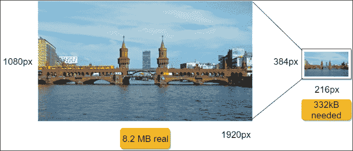
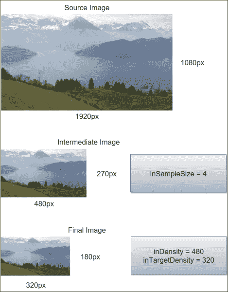
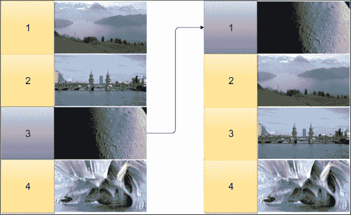
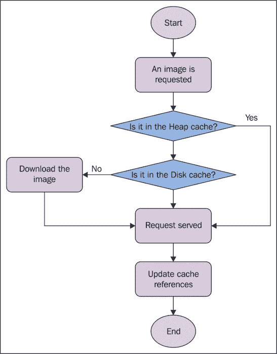
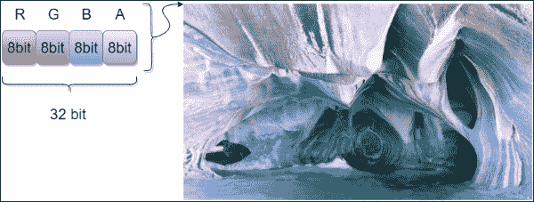
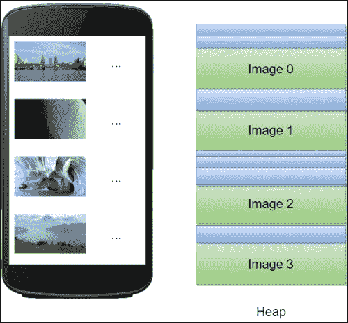
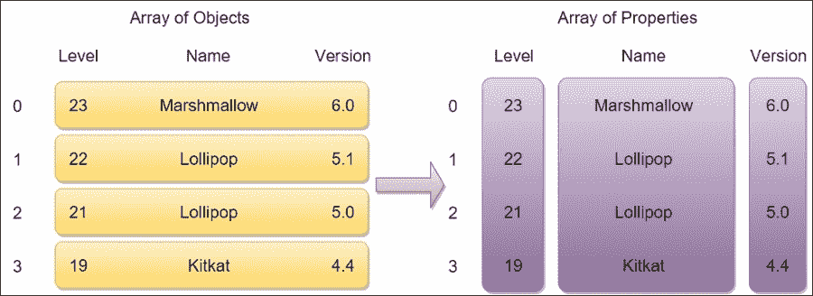
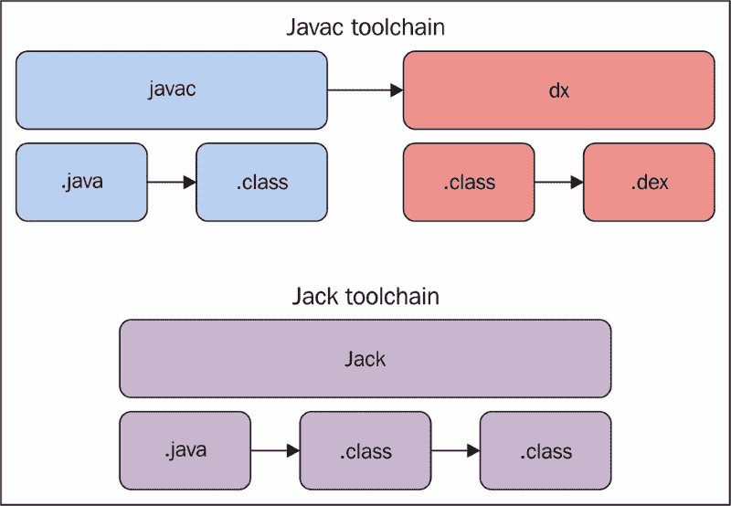

# 第十章：性能提示

本章是关于技术、提示和技巧，涉及前几章未涵盖的主题。

因此，我们希望在这里定义图像处理的最佳实践：图像在商店中的许多应用程序中被广泛使用。为此，我们希望了解如何在 Android 应用程序中管理图像，以提高整体性能。对于这个主题，需要来自之前各章的概念。

除了位图管理，我们还将探讨广泛使用但性能不佳的序列化格式（如 XML 和 JSON）的替代方案，以找到加快客户端/服务器通信并限制编码/解码时间和资源消耗的更好方法。

最后，本章的最后一部分将讨论在构建过程之前改进应用程序的一些措施。这些措施包括减少资源以及如何清理 APK，以便拥有一个较小的 APK 文件通过商店分发，以满足商店限制和用户的期望。

# 位图

我们应用程序面临的最大挑战之一是以高效的方式处理图像，因为有很多不同的视角会影响最终的应用程序。这是一个涵盖几乎所有前述章节内容的特殊主题：

+   为了正确显示位图，它们需要处于一个布局中。因此，我们在第二章，*高效调试*中讨论的内容在这里尤为重要。

+   不当的位图处理可能导致内存问题，由于泄漏或是因为位图被错误地作为变量使用，而不是在需要时读取。因此，记住第四章，*内存*中的关键概念，在保存和读取大图像时可能会有所帮助。

+   我们经常会尝试在主线程上处理来自图像的大量数据；我们将使用在第五章，*多线程*中讨论的主题，来了解如何高效处理位图，同时不影响用户体验。

+   大多数情况下，图像来自远程资源。我们将讨论如何从服务器检索图像，以及如何为将来重用缓存它们，以限制网络请求并节省电量，这在第六章，*网络通信*中有所探讨。

位图在许多应用程序中被处理。我们将更详细地讨论这个问题的各个方面，尝试通过使用前述章节引入的最佳实践来定义如何处理它们。

## 加载

无论屏幕分辨率如何，或者图像是否隐藏或不可见，显示的图像总是被整体读取；其在内存中的权重是最大的。正如我们接下来将看到的，图像的每一个像素默认占用 32 位内存。因此，将图像的分辨率乘以 32，我们可以得到图像在内存中使用的位数。这种做法的主要问题当然是由于应用程序可用内存饱和而导致的高概率出现`OutOfMemoryException`异常。

通常，我们直接使用图像，而不考虑可能出现的性能问题。然而，例如，如果我们在一个**384x216**像素的占位符中显示**1920x1080**像素的图像，我们实际上向内存中添加了 8.2 MB，而实际上只需要 332 KB。查看*图 1*以了解未缩放图像与所需图像的开销比较：



图 1：未缩放的图像在较小占位符中的开销示例

如果我们处理的是列表、图库或其他一次显示更多图像的小部件，情况会更糟。此外，Android 在屏幕分辨率和内存可用性方面存在高度碎片化。因此，无法回避这个问题：读取图像时需要预先缩放位图。那么，我们如何有效地预先缩放它们呢？让我们在以下段落中找到答案。

Bitmap 类并不那么有用；`Bitmap.createScaledBitmap()`方法需要一个`Bitmap`对象作为输入来进行缩放。因此，它迫使我们无论如何都要在创建新的小图像之前读取整个图像，这显然会导致为整个源图像分配不必要的过多内存。然而，有一种方法可以在读取图像时减少对图像内存的负担。这就是`BitmapFactory` API 的目标。一旦我们知道适合我们图像缩放的适当分辨率，我们可以使用`BitmapFactory.Options`类来设置正确的参数，从而从内存的角度有效地缩放图像。让我们看看我们可以使用哪些参数来达到正确的结果。`BitmapFactory`类提供了根据不同来源加载图像的不同方法：

+   `decodeByteArray()`

+   `decodeFile()`

+   `decodeFileDescriptor()`

+   `decodeResource()`

+   `decodeStream()`

它们每一个都有相应的方法重载，除了需要的基本参数外，还接受一个`BitmapFactory.Options`对象。这样，我们就可以在读取图像时使用这个类来定义我们的缩放策略。如果我们处理的是非常大的图像，我们可以使用特殊的 API 来解码图像的小部分：这就是`BitmapRegionDecoder`。`BitmapRegionDecoder.decodeRegion()`方法接受一个`Rect`和一个`BitmapFactory.Options`对象作为参数，以解码在`BitmapRegionDecoder.newInstance()`方法中传递的图像的`Rect`区域。

首先，我们需要知道图像的分辨率。为了找出，我们希望在不读取整个源位图的情况下获取图像尺寸。这会导致不必要的内存分配增加。API 提供了一种通过设置`BitmapFactory.Options`对象的一个特定属性`BitmapFactory.Options.inJustDecodeBounds`来获取源图像尺寸的方法。`BitmapFactory.Options.inJustDecodeBounds`属性用于定义解码方法是否应返回`Bitmap`对象。因此，我们可以将其设置为`true`以在读取图像分辨率时禁用位图处理，然后再将其设置为`false`以启用完全读取图像并获得所需的图像。这样可以确保不会无谓地分配位图内存。

当我们知道我们想要的图像分辨率时，我们需要在处理之前将新设置应用到选项中。为此，我们需要使用`BitmapFactory.Options.inSampleSize`。这是一个整数，指定将图像的每个维度分别除以多少以到达请求的大小。它也被强制为 2 的幂。因此，如果我们设置不同的值，它将在处理步骤之前缩小到最接近的 2 的幂。然后，如果我们设置`BitmapFactory.Options.inSampleSize`为`4`，最终的宽度和高度将是原始尺寸的 1/4。因此，生成的图像将由源位图的 1/16 的像素组成。

让我们看一下以下代码片段，了解如何应用这些有用的属性：

```kt
public Bitmap scale(){
  //Options creation
  BitmapFactory.Options bmpFactoryOptions = new BitmapFactory.Options();

  //Reading source resolution
  bmpFactoryOptions.inJustDecodeBounds = true;
  BitmapFactory.decodeFile(url, bmpFactoryOptions);

  int heightRatio = (int) Math.ceil(bmpFactoryOptions.outHeight / (float) desiredHeight);
  int widthRatio = (int) Math.ceil(bmpFactoryOptions.outWidth / (float) desiredWidth);

  //Setting properties to obtain the desired result
  if (heightRatio > 1 || widthRatio > 1) {
      if (heightRatio > widthRatio) {
          bmpFactoryOptions.inSampleSize = heightRatio;
      } else {
          bmpFactoryOptions.inSampleSize = widthRatio;
      }
}

//Restoring the Options
bmpFactoryOptions.inJustDecodeBounds = false;

//Loading Bitmap
return BitmapFactory.decodeFile(url, bmpFactoryOptions);
}
```

为什么采样属性要如此严格地限制为 2 的幂？因为这样，处理后的图像将由源图像中的四像素取一像素组成。此外，这个过程非常快。优点是计算速度快，而缺点是我们不能精确地将图像缩放到期望的大小。

我们还可以使用其他属性以不同的方法来缩放图像。除了`BitmapFactory.Options.inJustDecodeBounds`属性之外，我们还可以使用以下属性：

+   `inScaled`：这使基于此列表中的其他值启用密度检查来缩放图像。

+   `inDensity`：这是位图的密度。如果它与下面的`inTargetSize`不同，那么图像将被处理以缩放并达到`inTargetDensity`。

+   `inTargetDensity`：这是如果与`inDensity`属性不同，所需结果的图像密度。

缩放比例将使用公式*scale = inTargetDensity / inDensity*来计算。

然后，我们可以使用图像实际和期望尺寸（以像素为单位）之间的比例来计算缩放值。因此，前面的代码片段变成了以下内容：

```kt
public Bitmap scale(){
  //Options creation
  BitmapFactory.Options bmpFactoryOptions = new BitmapFactory.Options();

  //Reading source resolution
  bmpFactoryOptions.inJustDecodeBounds = true;
  BitmapFactory.decodeFile(url, bmpFactoryOptions);

  //Setting properties to obtain the desired result
  bmpFactoryOptions.inScaled = true;
  bmpFactoryOptions.inDensity = desiredWidth;
  bmpFactoryOptions.inTargetDensity =  bmpFactoryOptions.outWidth;

  //Restoring the Options
  bmpFactoryOptions.inJustDecodeBounds = false;

  //Loading Bitmap
  return BitmapFactory.decodeFile(url, bmpFactoryOptions);
}
```

这使用了一种不同的计算方法来在特定尺寸下缩放图像。精度在速度方面是有代价的。因此，这个解决方案用前一个方案的速度与创建所需分辨率的图像的精度进行了交换。因此，正如谷歌建议的那样，通过结合两种前方案，可以得到最佳结果。第一步是确定最精确的 2 的幂作为`BitmapFactory.Options.inSampleSize`以加快粗略缩放（如果需要）。然后，将图像从这个中间图像转换为精确的所需缩放图像。如果我们的源图像是**1920x1080**像素，而我们需要最终图像是**320x180**像素，那么将会有一个例如**480x270**像素的中间图像，如图*图 2*所示：



图 2：缩放步骤

刚才讨论的内容可以通过之前引入的所有属性来实现，如下面的代码示例所示：

```kt
public Bitmap scale(){
  //Options creation
  BitmapFactory.Options bmpFactoryOption = new BitmapFactory.Options();

  //Reading source resolution
  bmpFactoryOption.inJustDecodeBounds = true;
  BitmapFactory.decodeFile(url, bmpFactoryOption);

  int heightRatio = (int) Math.ceil(bmpFactoryOption.outHeight / (float) desiredHeight);
  int widthRatio = (int) Math.ceil(bmpFactoryOption.outWidth / (float) desiredWidth);

  //Setting properties to obtain the desired result
  if (heightRatio > 1 || widthRatio > 1) {
      if (heightRatio > widthRatio) {
          bmpFactoryOption.inSampleSize = heightRatio;
      } else {
          bmpFactoryOption.inSampleSize = widthRatio;
      }
  }
  bmpFactoryOption.inScaled = true;
  bmpFactoryOption.inDensity = desiredWidth;
  bmpFactoryOption.inTargetDensity =  desiredWidth * bmpFactoryOption.inSampleSize;

  //Restoring the Options
  bmpFactoryOption.inJustDecodeBounds = false;

  //Loading Bitmap
  return BitmapFactory.decodeFile(url, bmpFactoryOption);
}
```

这个解决方案结合了第一个方案的速度和第二个方案的精度。

## 处理

前一节描述的操作从时间角度来看是不可预测的，但它们肯定会影响 CPU。不管图像大小如何，或者操作是否快速，所有这些操作都必须在工作线程中执行，正如我们在第五章《多线程》中讨论的那样，以避免阻塞用户界面并降低因响应性不足而感知的应用程序性能。

使用缩放的主要操作是为`ImageView`设置位图以创建布局。因此，我们需要一个带有视图引用的`AsyncTask`子类。我们在第四章《内存》中讨论了这种对象组合，我们发现这会导致活动泄露。因此，记得使用`WeakReference`来持有`ImageView`，以便在`Activity`被销毁时进行回收。然后，不要忘记验证`ImageView`是否仍然在`WeakReference`中被引用，否则会发生`NullPoionterException`。

这样的`AsyncTask`子类可以像下面代码片段中的代码一样：

```kt
public class BitmapTask extends AsyncTask<String, Void, Bitmap> {
    private WeakReference<ImageView> imageView;
    private int desiredWidth;
    private int desiredHeight;

    public BitmapTask(ImageView imageView, int desiredWidth, int desiredHeight) {
        this.imageView = new WeakReference<>(imageView);
        this.desiredHeight = desiredHeight;
        this.desiredWidth = desiredWidth;
    }

    @Override
    protected Bitmap doInBackground(String... params) {
        return new BitmapScaler().scaleUsingCombinedTechniques(params[0], desiredWidth, desiredHeight);
    }

    @Override
    protected void onPostExecute(Bitmap bitmap) {
        super.onPostExecute(bitmap);
        if (imageView != null && imageView.get() != null && bitmap != null)
            imageView.get().setImageBitmap(bitmap);
    }
}
```

## 缓存

让我们讨论一下这些位图存储在哪里以及如何本地处理它们。大多数时候，位图存储在远程资源中，这迫使我们创建相应的代码来下载它们，然后才能在屏幕上显示。然而，我们不想在屏幕上每次需要显示它们时都重新下载。因此，我们需要一种简单且快速的方式来存储图像，并在请求时使它们可用。

然而，我们必须小心，确保在某些时候删除图像。否则，设备的内部存储将被占满，因为应用程序中的图像可能是不受限制的。因此，我们需要一个有限的空间来存储图像。这个空间被称为**缓存**。

接下来问题是：哪种算法是删除图像的正确选择？Android 使用的主体算法是 LRU。它使用一个对象栈来确定哪些对象具有更高优先级，将它们放在顶部，低优先级的放在底部。然后，当一个对象被使用时，它会被移到顶部以获得更高的优先级，其他所有对象则向下移动。在这种情况下，优先级是单个对象的请求次数；栈将是一个从最常用到最不常用的对象排名，如图*图 3*所示，位置 3 的图像再次被使用，它移动到了栈的顶部：



图 3：LRU 栈的示例

通过这种推理，当一个新对象需要被添加到一个已满的栈时，选择很简单：它将取代最少使用的对象，因为它再次被请求的可能性最小。

所有这些逻辑都由 Android 在`LRUCache`对象中实现并提供。这个实现是在内存中工作，而不是在磁盘上，以提供更快、更可靠的缓存，随时可供查询。这意味着栈底部的任何对象，在因新添加而逐出时，都有可能被垃圾收集。此外，这个类允许定义要使用的键和值类型，因为它使用了泛型。因此，它不仅可以用于位图，还可以用于我们需要的各种对象。`LRUCache`对象甚至是线程安全的。

在选择了键和值类型之后，需要做的是定义缓存的大小。这一步没有固定的规则，但需要记住，缓存太小会导致栈内变化过多，使得使用缓存变得没有意义；而缓存太大则可能导致在使用应用程序时出现`OutOfMemoryErrors`。在这种情况下，正确的做法是为缓存分配应用程序可用内存的一部分。在以下代码中，`LRUCache`对象是使用字符串作为键创建的，并且将可用内存除以 8：

```kt
public class BitmapCache {
    private LruCache<String, Bitmap> lruCache;

    public BitmapCache() {
        final int maxMemory = (int) (Runtime.getRuntime().maxMemory() / 1024);
        final int cacheSize = maxMemory / 8;
        lruCache = new LruCache<String, Bitmap>(cacheSize);
    }

    public void add(String key, Bitmap bitmap) {
        if (get(key) == null) {
            lruCache.put(key, bitmap);
        }
    }

    public Bitmap get(String key) {
        return lruCache.get(key);
    }
}
```

接下来，我们需要定义缓存中单个条目的大小。这可以通过重写`LRUCache.sizeOf()`方法，在实例化时返回位图正确的字节数量来实现：

```kt
lruCache = new LruCache<String, Bitmap>(cacheSize){
    @Override
    protected int sizeOf(String key, Bitmap value) {
        return value.getByteCount();
    }
};
```

最后，当需要显示`ImageView`中的图像时，我们可以使用这个缓存对象，如下面的代码所示：

```kt
public void loadBitmap(int resId, final ImageView imageView, String url) {
    String imageKey = String.valueOf(resId);
    Bitmap bitmap = bitmapCache.get(imageKey);
    if (bitmap != null) {
        imageView.setImageBitmap(bitmap);
    } else {
        imageView.setImageResource(R.drawable.placeholder);
        BitmapDownloaderTask task = new BitmapDownloaderTask(bitmapCache, new BitmapDownloaderTask.OnImageReady() {
            @Override
            public void onImageReady(Bitmap bitmap) {
                imageView.setImageBitmap(bitmap);
            }
        });
        task.execute(url);
    }
}
```

如前所述，这种类型的缓存位于堆内存中；当用户更改活动然后返回时，必须重新下载、缩放并将每个项目添加到缓存中。然后，我们想要一种可以在多次访问尝试和重启之间持久化的缓存类型。为此，官方存储库中有一个来自官方 Android 示例的有用类，名为`DiskLRUCache`。这不是线程安全的，因此我们在访问它时需要加锁。此外，它的初始化可能需要较长时间，我们必须在工作者线程中执行它，以避免阻塞主线程。下面我们使用`AsyncTask`类来完成这个任务：

```kt
class InitDiskCacheTask extends AsyncTask<File, Void, Void> {
    @Override
    protected Void doInBackground(File... params) {
        synchronized (mDiskCacheLock) {
            File cacheDir = params[0];
            mDiskLruCache = DiskLruCache.open(cacheDir, DISK_CACHE_SIZE);
            mDiskCacheStarting = false;
            mDiskCacheLock.notifyAll();
        }
        return null;
    }
}
```

通过添加这个类，我们可以使用两个级别的缓存：

+   **堆级缓存**：如前所述，速度快但不持久的缓存。当需要图像时，其目标是首先被检查。

+   **磁盘级缓存**：速度较慢但持久化的缓存，如果另一个缓存不包含请求的图像，则第二个检查它。

因此，图像请求背后的逻辑应该类似于*图 4*所示：



图 4：使用两级缓存的图像请求流程图

当我们想要将图像放入缓存时，我们需要将它添加到两者中，如下面的代码段所示：

```kt
public void addBitmapToCache(String key, Bitmap bitmap) throws IOException {
    if (bitmapCache.get(key) == null) {
        bitmapCache.add(key, bitmap);
    }
    synchronized (mDiskCacheLock) {
        if (mDiskLruCache != null && mDiskLruCache.get(key) == null) {
            mDiskLruCache.put(key, bitmap);
        }
    }
}
```

## 显示

如前所述，当图像在屏幕上显示时，它由 32 位像素描述，每个颜色 8 位，如图*图 5*所示：



图 5：位图像素压缩

不幸的是，没有办法在不忽略透明度部分的情况下使用 24 位；相反，当图像不包含像素的 alpha 字节时，Android 无论如何都会添加它，将 24 位图像转换为 32 位图像。显然，这在应用程序的日常使用中会有很多副作用。

首先，堆内存中存储位图所需的内存量更大，导致垃圾回收事件更多，因为分配较大的连续内存块比分配较小的内存块更困难。此外，分配和收集这些较大的内存块需要更长的时间。而且，分配的内存没有压缩。解码和显示它们的时间会更长，影响 CPU 和 GPU。这个问题的解决方案是什么？

Android 提供了四种不同的像素格式，用于处理图像时使用。这意味着图像的每一个像素可以用较少的位描述，因此在内存、垃圾回收、CPU 和 GPU 方面可以更轻便。这需要付出代价：质量将不再相同。因此，这种使用应该是根据设计来决定的，因为它并不适用于我们应用程序中的每一张图像。然而，我们可以考虑一种更智能的方法，例如，我们可以根据设备的性能选择不同的像素格式。

### 提示

如果你在处理处理图像的应用程序，非常重要的一点是要检查，根据需求，是否可以使用不同的像素格式来减少大内存块（即位图）的影响，并从不同的角度提高性能：内存、速度和电池充电持续时间。

安卓平台目前为`Bitmap`对象处理的像素格式如下：

+   `ARGB_8888`：这是默认讨论的值，它使用 32 位来表示像素，因为所有通道都使用 8 位。

+   `ARGB_4444`：这保留了四个通道，与前面的格式一样，但每个通道只使用 4 位，对于一个 16 位的像素。尽管它节省了一半的图像内存，但其屏幕显示的较差质量导致谷歌不推荐这个值，转而推荐默认值，尽管它在内存管理上有优势。

+   `RGB_565`：这个特定的值只保留颜色通道，移除了 alpha 通道。红色和蓝色通道使用 5 位描述，绿色通道使用 6 位描述。每个像素使用 16 位，与之前的格式一样，但忽略 alpha 透明度，提高颜色质量。因此，在处理没有透明度的图像时使用这个格式是很好的选择。

+   `ALPHA_8`：这仅用于存储 alpha 透明度信息，没有颜色通道。

然而，我们如何使用它们呢？这也是一个解码选项。`BitmapFactory.Options.inPreferredConfig`用于定义在图像即将被解码时要使用的像素格式。那么，让我们检查以下代码段：

```kt
public Bitmap decode(String url) {
    //Options creation
    BitmapFactory.Options bmpFactoryOptions = new BitmapFactory.Options();

    bmpFactoryOptions.inPreferredConfig = Bitmap.Config.RGB_565;

    //Loading Bitmap
    return BitmapFactory.decodeFile(url, bmpFactoryOptions);
}
```

这显然是昂贵的，因为它导致了更多的计算时间和 CPU 使用。然而，其成本小于内存中的整个位图，如果我们意识到重用图像，不仅可以节省时间，还能节约关键的系统资源。那么，让我们看看如何重用图像以进一步改善我们应用程序的内存使用，如下面几页所述。

## 管理内存

到现在为止我们所讨论的内容与从堆和磁盘角度进行内存管理有关。然而，在处理位图时，我们可以使用更高级别的抽象来改进堆内存管理。在第四章《内存》中，我们介绍了一个特别的设计模式，以避免我们所说的内存翻滚；这就是对象池模式。使用这种模式，可以在对象不再被引用时重用内存分配，以避免垃圾回收。

当需要处理大量位图对象时，如在列表或网格中，会有许多新的实例化和删除操作，伴随着多次垃圾回收事件的发生。这会降低应用程序的整体内存性能，因为众所周知，回收事件会阻塞其他任何线程，而且这些对象的内存占用也很大。因此，如果我们能为位图使用对象池模式，就可以限制垃圾收集器的操作，而不会影响我们之前讨论的缓存技术，实际上还能加快其速度。

实际上，我们希望重用已分配的内存来处理要显示的新图像。如*图 6*所示，如果用户滚动后屏幕上显示四个图像，内存分配应该保持不变。



图 6：使用对象池的堆内存管理

为了实现这样一个有用的机制，我们需要引入一个特定的`BitmapFactory.Options`属性，名为`BitmapFactory.Options.inBitmap`。如果我们使用这个属性，就必须提供一个现有的`Bitmap`对象，让解码器重用其内存分配。这样，原来的对象不会被销毁，新对象也不会被创建，也就无需进行垃圾回收。

然而，这个有用的属性也有其局限性，正如官方文档所述：

+   在 Android Jelly Bean（API 级别 18）之前，提供的对象和新的对象必须有完全相同的尺寸。从 Android KitKat（API 级别 19）开始，提供的位图可以大于或等于新的位图，但不能小于。

+   第一点意味着具有不同像素格式的图像不适用于此类操作。

记住这一点，让我们快速了解一下创建此类逻辑的代码。首先，让我们创建满足这些要求的控件：

```kt
private boolean canBitmapBeReused(
        Bitmap bitmap, BitmapFactory.Options options) {
    if (Build.VERSION.SDK_INT >= Build.VERSION_CODES.KITKAT) {
        int width = options.outWidth / options.inSampleSize;
        int height = options.outHeight / options.inSampleSize;
        int byteCount = width * height * getBytesPerPixel(bitmap.getConfig());
        return byteCount <= bitmap.getAllocationByteCount();
    }
    return bitmap.getWidth() == options.outWidth
            && bitmap.getHeight() == options.outHeight
            && options.inSampleSize == 1;
}

private int getBytesPerPixel(Bitmap.Config config) {
    switch (config) {
        case ARGB_8888:
            return 4;
        case RGB_565:
        case ARGB_4444:
            return 2;
        default:
        case ALPHA_8:
            return 1;
    }
}
```

接下来，让我们编写代码来从池中获取（如果有的话）可重用的`Bitmap`对象：

```kt
private Bitmap getBitmapFromPool(BitmapFactory.Options options, Set<SoftReference<Bitmap>> bitmapsPool) {
    Bitmap bitmap = null;
    if (bitmapsPool != null && !bitmapsPool.isEmpty()) {
        synchronized (bitmapsPool) {
            final Iterator<SoftReference<Bitmap>> iterator
                    = bitmapsPool.iterator();
            Bitmap item;
            while (iterator.hasNext()) {
                item = iterator.next().get();
                if (null != item && item.isMutable()) {
                    if (canBitmapBeReused(item, options)) {
                        bitmap = item;
                        iterator.remove();
                        break;
                    }
                } else {
                    iterator.remove();
                }
            }
        }
    }
    return bitmap;
}
```

最后，让我们创建一个方法，在解码过程之前添加这些`BitmapFactory.Options`，以使用可重用对象而不是创建新对象：

```kt
public Bitmap decodeBitmap(String filename, int reqWidth, int reqHeight) {
    BitmapFactory.Options options = new BitmapFactory.Options();
    addOptions(options);
    return BitmapFactory.decodeFile(filename, options);
}

private void addOptions(BitmapFactory.Options options) {
    options.inMutable = true;
    Bitmap inBitmap = getBitmapFromPool(options);
    if (inBitmap != null) {
        options.inBitmap = inBitmap;
    }
}
```

当你需要的时候，别忘了创建一组可重用的位图来搜索。因此，让我们定义一个位图池，作为一组`SoftReference`对象来存储我们的图像。我们的`BitmapCache`类应该如下所示：

```kt
public class BitmapCache {
    private Set<SoftReference<Bitmap>> bitmapsPool;
    private LruCache<String, Bitmap> lruCache;

    public BitmapCache() {
        final int maxMemory = (int) (Runtime.getRuntime().maxMemory() / 1024);
        final int cacheSize = maxMemory / 8;
        lruCache = new LruCache<String, Bitmap>(cacheSize) {
            @Override
            protected int sizeOf(String key, Bitmap value) {
                return value.getByteCount();
            }

            @Override
            protected void entryRemoved(boolean evicted, String key,
              Bitmap oldValue, Bitmap newValue) {
                bitmapsPool.add(new SoftReference<>(oldValue));
            }
        };
        bitmapsPool = Collections.synchronizedSet(new HashSet<SoftReference<Bitmap>>());
    }

    public void add(String key, Bitmap bitmap) {
        if (get(key) == null) {
            lruCache.put(key, bitmap);
        }
    }

    public Bitmap get(String key) {
        return lruCache.get(key);
    }
}
```

# 图像优化

在本章的前几页中，我们讨论了当图片准备好加载和显示时如何处理它们。现在我们想要探讨的是图片如何传入设备以及如何改进这一过程。现在很清楚，图片是占用内存的大块头，如果我们不妥善处理它们，它们可能会破坏我们应用的用户体验，而不是提升它。因此，我们可以设计出最佳的框架从远程服务器下载图片，但如果它们体积过大，或者压缩程度不够高，我们的应用仍然会被认为运行缓慢且耗资源。图片需要时间和带宽来下载。因此，我们的目标是尽可能减少它们的体积，同时不损害其质量。

### 提示

显示图片的应用程序总是需要一个良好的设计，以确保下载过程快速。为此，图片在字节使用上必须尽可能小，以便更容易将它们从远程服务器传输到可能使用较差连接的设备上。

正如在第六章*网络通信*中所分析的，设备访问服务器的条件有很多种，且这是不可预测的。然而，不管用户的设备使用哪种连接，我们都希望提供尽可能最佳的用户体验。那么，我们能做什么来减小图片的大小呢？对此有两个主要方面需要考虑：**分辨率**和**压缩**。让我们更详细地讨论它们。

## 分辨率

在开发显示图片的应用程序时，分辨率方面往往被低估。然而，让我们思考一下：如果我们确定图片最多以 480x270 像素显示，为什么我们要下载更大的图片呢？此外，考虑到 Android 平台所遭受的屏幕分辨率和密度的巨大碎片化，为什么我们要在 480x800 像素的设备和 1920x1080 像素的设备上下载相同分辨率的图片呢？

最佳的做法是提供与特定设备上占位符相同分辨率的图片。然后，如果占位符是 480x270 像素，我们最多应该下载 270 像素或 480 像素的图片，或者与占位符相同的分辨率；无论如何，额外的开销都会被浪费。不幸的是，只有在我们可以访问服务器实现的情况下，这种方法才能付诸实践。

如果我们无法更改服务器设置，有许多实时图像处理服务可以完成这项工作。我们可以决定在特定条件或连接下使用它们，或者仅用于特定类型的图片或应用的部分区域。无论如何，这样做都是有利的。

当需要在应用程序的多个部分显示内容相同的图像，可能使用不同的分辨率时，诀窍是下载最高分辨率的图像，然后使用前面讨论的技术将其缩小，以在不同的占位符中使用。这样我们就能节省时间、电池电量以及带宽。这并不是每次都需要遵循的规则；你应该根据应用程序的需求，设计最佳的方法来减少要传输到设备的图像大小。

## 压缩

当谈到压缩时，事情变得有趣：最常使用的图像格式是 PNG。它是一种无损压缩类型，能保证图像的完整质量。不幸的是，其压缩能力可能导致更大的文件，从而造成前面讨论过的传输效果差和其他副作用。

JPEG 格式是一种更轻的格式；它使用有损压缩来减小图像大小，同时用户几乎无法感知到差异。这对于来自远程资源的图像来说是一个更好的格式选择。不幸的是，它不支持透明度。此外，还有一种由谷歌提出的甚至更轻的格式，称为**WebP**；它可以使用有损或无损压缩，并且可以选择是否包含透明度和动画。这种格式分析像素并预测邻近像素，从而减少图像所需的数据量（以比特为单位）。从 Android Jelly Bean（API 级别 17）开始，这种格式得到了完全支持。

无论如何，如果我们需要使用 PNG 文件，有许多工具可以应用有损图像压缩，大幅减小文件大小。这些工具允许我们更改颜色配置文件，应用滤镜以及其他有用的操作来减少图像大小。我们需要找到适合我们图像的正确损失程度。由图形编辑程序刚刚导出的图像通常比实际需要的大；我们应该始终清理图像，查找其中未使用的数据，然后应用所需的任何压缩改进，以减少图像传输中的开销。

# 序列化

我们同样可以将降低图像大小以加快传输速度的考虑应用于文本文件。那么，让我们快速了解一下在客户端/服务器架构中传输数据的典型格式。在几年前，XML 格式是最常使用的。后来开发者将其改为 JSON 格式。这两种格式都是可读的，但由于 JSON 的语法更简单，不需要标签和属性，因此它更轻便，也更受欢迎和使用，胜过 XML。

## JSON 改进

谷歌提供了一个易于使用的库来处理 JSON 序列化和反序列化，称为 GSON。原则上，它使用反射来查找 Java bean 的 getter 和 setter；然后，如果 bean 内部的一切都在正确的位置，只需提供所需的类，就可以反序列化，创建一个填充了 JSON 文件内所有数据的新对象。

为了提高序列化/反序列化性能和传输时间，我们需要改进 JSON 文件设计；我们的目标是减少 JSON 文件的大小。这里的主要且明显的提示是避免在 JSON 结构中包含不必要的数据。因此，不要序列化客户端不使用的数据。

使用 JSON 进行数据序列化的典型方法是创建一个要传输的对象数组。然而，JSON 格式需要为每个属性指定一个名称，以便在反序列化过程中正确识别。这种方式增加了许多重复字符串的字符，导致文件大小产生额外开销。以下 JSON 文件示例显示了一组带有相关重复键字符的对象列表：

```kt
[
{
    "level": 23,
    "name": "Marshmallow",
    "version": "6.0"
}, {
    "level": 22,
    "name": "Lollipop",
    "version": "5.1"
}, {
    "level": 21,
    "name": "Lollipop",
    "version": "5.0"
}, {
    "level": 19,
    "name": "KitKat",
    "version": "4.4"
}
]
```

这个文件的内容可以通过定义属性数组而非对象数组来序列化到一个更小的文件中。《图 7》展示了这里要应用的结构变更概念：



图 7：从对象数组到属性数组的结构变更，应用于 JSON 文件中

应用这种重塑方式，以下文件将是新的格式，包含第一个 JSON 文件中的相同内容：

```kt
{
  "level": [23, 22, 21, 19],
  "name": ["Marshmallow", "Lollipop", "Lollipop", "Kitkat"],
  "version": ["6.0", "5.1", "5.0", "4.4"]
}
```

第一个文件的实际大小约为 250 字节，而第二个文件为 140 字节。但是，单个文件中的对象越多，整个 JSON 文件将应用越多的节省。

## JSON 的替代品

然而，XML 和 JSON 格式都过于冗余；它们在可读性方面显得累赘，服务器编码较慢，而且一旦客户端接收它们，解码速度也会比其他轻量级格式慢。通常，出于调试目的，开发者更偏好可读性更强而非性能的格式。

实际上，还有其他格式可以让客户端和服务器以更快的速度进行通信。这些都是谷歌推出的；让我们简要了解一下这些。

### 协议缓冲区

第一个开发的序列化方法被称为**协议缓冲区**。与 XML 类似，它提供了一种定义数据结构的方法，但它更快且更小。它使用`.proto`扩展名的文件来设置后来创建和传输的不可读二进制文件的语法。它类似于以下内容：

```kt
message Person {
    required string name = 1;
    required int32 id = 2;
    optional string email = 3;

    enum PhoneType {
        MOBILE = 0;
        HOME = 1;
        WORK = 2;
    }

    message PhoneNumber {
        required string number = 1;
        optional PhoneType type = 2 [default = HOME];
    }

    repeated PhoneNumber phone = 4;
}
```

每个消息都是一系列键/值对。定义之后，我们待传输的数据看起来就像一个二进制流。这是这种方法的主要优势：它比含有相同数据的 XML 文件小 10 倍，快 100 倍。

这个方法是平台无关的，可以在多个环境中使用。然而，并非每种开发语言都受到支持；目前发布的版本包括 Java、C++和 Python 编译器。

不幸的是，协议缓冲区实现需要大量的内存和代码才能使用。这对于移动设备来说并不合适，因为正如我们所知，需要尽可能节省内存以达到性能目标。因此，创建了一个特殊的协议缓冲区版本，以最小化代码和内存使用。

### 平铺缓冲区

平铺缓冲区是谷歌创建的一种高级序列化方法。平铺缓冲区是由无需解析的平铺二进制缓冲区构成的。这里的内存分配极低，同时在定义字段时提供高度灵活性。代码开销最小。此外，解析 JSON 文本的速度比其他解析器更快、更高效。

这个方法是开源的，并且每种支持的语言都有不同的实现和不同的功能，因为它们依赖于社区贡献。

平铺缓冲区不需要解析中间表示数据；因此，它们在提供数据方面比协议缓冲区要快。让我们快速了解一下它们在 Android 应用程序中的集成，以了解它们的优势以及集成时间是否值得。

首先要做的就是定义一个架构文件，用来界定数据结构，或者如果我们是从那种序列化方法迁移过来的，可以转换原始的 JSON。那么，让我们看一下以下要转换的 JSON 文件：

```kt
{
  "user": {
      "username": "username",
      "name": "Name",
      "height": 185,
      "enabled": true,
      "purchases": [
{
              "id": "purchaseId1",
              "name": "purchaseName1",
              "quantity": 2,
              "price": 120
          }, {
              "id": "purchaseId2",
              "name": "purchaseName2",
              "quantity": 1,
              "price": 10
          }
]
  }
}
```

架构声明文件应该包含文件中每个对象的表，指定每个属性的类型。以下是相应的架构文件内容：

```kt
namespace com.flatbuffer.example;

table User {
    username: string;
    name: string;
    height: int;
    enabled: bool;
    purchases: [Purchase];
}

table Purchase {
    id: string;
    name: string;
    quantity: int;
    price: int;
}

root_type User;
```

完成后，我们需要创建 Java 模型以及要在我们的应用程序中使用的类。为此，提供了平铺编译器，我们可以使用它来生成所有 Java 类文件，通过调用以下命令行：

```kt
flatc --java

```

有关正确使用提供资源的更多信息，请参考官方文档。为上一个示例的模型创建的`User`类的最终文件如下：

```kt
public final class User extends Table {
    public static User getRootAsUser(ByteBuffer _bb) {
        return getRootAsUser(_bb, new User());
    }

    public static User getRootAsUser(ByteBuffer _bb, User obj) {
        _bb.order(ByteOrder.LITTLE_ENDIAN);
        return (obj.__init(_bb.getInt(_bb.position()) + _bb.position(), _bb));
    }

    public User __init(int _i, ByteBuffer _bb) {
        bb_pos = _i;
        bb = _bb;
        return this;
    }

    public String username() {
        int o = __offset(4);
        return o != 0 ? __string(o + bb_pos) : null;
    }

    public ByteBuffer usernameAsByteBuffer() {
        return __vector_as_bytebuffer(4, 1);
    }

    public String name() {
        int o = __offset(6);
        return o != 0 ? __string(o + bb_pos) : null;
    }

    public ByteBuffer nameAsByteBuffer() {
        return __vector_as_bytebuffer(6, 1);
    }

    public int height() {
        int o = __offset(8);
        return o != 0 ? bb.getInt(o + bb_pos) : 0;
    }

    public boolean enabled() {
        int o = __offset(10);
        return o != 0 ? 0 != bb.get(o + bb_pos) : false;
    }

    public Purchase purchases(int j) {
        return purchases(new Purchase(), j);
    }

    public Purchase purchases(Purchase obj, int j) {
        int o = __offset(12);
        return o != 0 ? obj.__init(__indirect (__vector(o) + j * 4), bb) : null;
    }

    public int purchasesLength() {
        int o = __offset(12);
        return o != 0 ? __vector_len(o) : 0;
    }

    public static int createUser(FlatBufferBuilder builder,
                                 int usernameOffset,
                                 int nameOffset,
                                 int height,
                                 boolean enabled,
                                 int purchasesOffset) {
        builder.startObject(5);
        User.addPurchases(builder, purchasesOffset);
        User.addHeight(builder, height);
        User.addName(builder, nameOffset);
        User.addUsername(builder, usernameOffset);
        User.addEnabled(builder, enabled);
        return User.endUser(builder);
    }

    public static void startUser(FlatBufferBuilder builder) {
        builder.startObject(5);
    }

    public static void addUsername(FlatBufferBuilder builder, int usernameOffset) {
        builder.addOffset(0, usernameOffset, 0);
    }

    public static void addName(FlatBufferBuilder builder, int nameOffset) {
        builder.addOffset(1, nameOffset, 0);
    }

    public static void addHeight(FlatBufferBuilder builder, int height) {
        builder.addInt(2, height, 0);
    }

    public static void addEnabled(FlatBufferBuilder builder, boolean enabled) {
        builder.addBoolean(3, enabled, false);
    }

    public static void addPurchases(FlatBufferBuilder builder, int purchasesOffset) {
        builder.addOffset(4, purchasesOffset, 0);
    }

    public static int createPurchasesVector(FlatBufferBuilder builder, int[] data) {
        builder.startVector(4, data.length, 4);
        for (int i = data.length - 1; i >= 0; i--) builder.addOffset(data[i]);
        return builder.endVector();
    }

    public static void startPurchasesVector(FlatBufferBuilder builder, int numElems) {
        builder.startVector(4, numElems, 4);
    }

    public static int endUser(FlatBufferBuilder builder) {
        int o = builder.endObject();
        return o;
    }

    public static void finishUserBuffer(FlatBufferBuilder builder, int offset) {
        builder.finish(offset);
    }
}
```

只需调用`User.getRootAsUser()`方法就可以使用这个类；在源代码之后，它被转换成字节数组，然后是`ByteBuffer`对象，如下面的代码段所示：

```kt
private User loadFlatBuffer(byte[] bytes) {
    ByteBuffer bb = ByteBuffer.wrap(bytes);
    return User.getRootAsUser(bb);
}
```

对于 Android 实现，这个解决方案显著减少了传输大小，并且序列化和反序列化时间比 JSON 情况要低得多。这意味着平铺缓冲区效率更高，我们应该考虑用基于平铺缓冲区的策略来替换我们的 JSON 策略。

## 本地序列化

序列化在通信方面是值得的，因为其主要目的是提供一种在不同环境中传输结构化对象的轻量级方法。然而，序列化和反序列化过程需要执行的时间开销。因此，尽管它适合网络传输，但不应该在客户端本地使用，以节省序列化和反序列化操作所需的时间，例如存储数据。

一个典型的例子是将 JSON 文件存储在缓存内存中。每次访问其数据前都必须进行反序列化。此外，如果你需要更改文件内的内容，必须在将新内容序列化后，再保存到缓存内存中。这比使用带有结构化数据的本地数据库成本要高得多，即使这是在 Android 应用程序内部开发此类数据管理系统最快的方法。

### 提示

当你需要保存数据时，处理本地数据时避免序列化。选择 SQLite 数据库来保存数据，而不是序列化方法，因为数据库访问比序列化和反序列化操作要快得多。

# 代码改进

在接下来的几页中，我们想讨论一些与特定编码情况和常见模式相关的优化。这些技巧是实际日常开发工作中常见习惯可能导致性能故障的例子。

## 访问器与修改器（Getters and setters）

面向对象编程中使用的一个核心概念是**封装**；正如你所知，这意味着其他对象不应直接访问对象的字段。因此，你可以在 Java 中使用 private 修饰符来封装对象的字段，并创建访问器和修改器方法，让其他对象可以访问它们。这保证了类本身对其字段拥有完全控制权，其他人无法使用。然后，你可以自由地创建只读或只写字段，只需定义相关方法，避免定义另一个。

封装的好处是毋庸置疑的，但它们是有代价的。如果不存在 JIT，直接访问字段比使用访问器快三倍，如果存在 JIT，则快七倍。这意味着我们应该继续封装我们的字段，但在没有必要的情况下应避免调用访问器和修改器。例如，在类内部不要调用访问器和修改器，因为这更耗时，而且你不需要这样做，因为类可以直接访问自己的字段。举个例子；以下代码在实例化期间调用了一个内部方法：

```kt
public class ExampleObject {
    private int id;

    public ExampleObject(int id) {
        this.setId(id);
    }

    public void setId(int id) {
        this.id = id;
    }

    public int getId() {
        return id;
    }
}
```

尽管这样做没有错，但通过移除内部对修改器的调用，可以在执行期间提高代码速度：

```kt
public class ExampleObject {
    private int id;

    public ExampleObject(int id) {
        this.id = id;
    }

    public void setId(int id) {
        this.id = id;
    }

    public int getId() {
        return id;
    }
}
```

这只是一个例子，但这里的主要建议是，在任何情况下都应避免在内部调用访问器和修改器。

## 内部类

我们在第四章中讨论内存泄漏问题时已经谈过内部类，*Memory*。在 Android 中嵌套类是一种非常常见的做法，因为很多时候我们需要在内部类中持有对包装类的引用。然而，这种优势隐藏着代价。让我们通过一个例子来明确我们讨论的问题：

```kt
public class OuterClass {
    private int id;

    public OuterClass() {
    }

    private void doSomeStuff() {
        InnerClass innerObject = new InnerClass();
        innerObject.doSomeOtherStuff();
    }

    private class InnerClass {
        private InnerClass() {
        }

        private void doSomeOtherStuff() {
            OuterClass.this.doSomeStuff();
        }
    }
}
```

我们正在处理的两类将会被分离。这意味着编译器将在外部类中创建方法，让内部类访问被引用包装类的变量和方法。让我们来看一下前述类的字节码：

```kt
class OuterClass {
    private int id;

    private void doSomeStuff() {
        OuterClass$InnerClass innerObject = new OuterClass$InnerClass();
        innerObject.doSomeStuff();
    }

    int access$0() {
        return id;
    }
}
```

`OuterClass`类为每个变量创建了一个方法，让`InnerClass`类在包保护级别环境中访问它：

```kt
class InnerClass {
OuterClass this$0;

    void doSomeOtherStuff() {
        InnerClass.access$100(this$0);
    }

 static void access$100(OuterClass outerClass) {
        outerClass.doSomeStuff(); 
    }

    static int access$0(OuterClass outerClass) {
        return outerClass.id;
    }
}
```

创建的静态方法是让`InnerClass`访问`OuterClass`的相关方法。如前所述，这会导致访问变慢，从而执行更慢的代码。如果声明包保护的变量和方法，可以避免这种情况，允许`InnerClass`在不生成字节码中的静态方法的情况下访问它们。这将允许同一包中的任何其他类访问，但也可能加快代码速度。所以，我们需要知道是否可以这样做。如果可以，`OuterClass`应该变成以下形式：

```kt
public class OuterClass {
    int id;

    void doSomeStuff() {
        InnerClass innerObject = new InnerClass();
        innerObject.doSomeOtherStuff();
    }

    private class InnerClass {

        private void doSomeOtherStuff() {
            OuterClass.this.doSomeStuff();
        }
    }
}
```

# Android N 中的 Java 8

新的 Android N SDK 在发布时提供了对 Java 8 引入的新特性的支持。在接下来的页面中，我们将通过它们了解如何在开发应用程序时提供帮助，并了解新的工具链以改善构建 APK 文件时的时序。

## 设置

为了使用新的 Java 8 特性，我们需要面向新的 Android N，并使用支持 Android N 的新 Android Studio 2.1，否则，这些特性将不可用。在撰写本书时，新的 Android Studio 2.1 仍处于预览版本。然而，我们可以使用它来更好地了解在项目中使用 Java 8 及其新特性的步骤。这是因为新的 Jack 工具链，在 Android MarshMallow（API 级别 23）中引入，我们将在接下来的页面中详细讨论，以及新的 Gradle 插件，是编译 Java 8 并使用我们将在下一节中介绍的特性唯一方式。

目前，我们需要按照以下方式更改`build.gradle`文件：

```kt
android {
    ...
    defaultConfig {
        ...
        jackOptions {
            enabled true
        }
    }
    compileOptions {
        sourceCompatibility JavaVersion.VERSION_1_8
        targetCompatibility JavaVersion.VERSION_1_8
    }
}
```

这样，我们为项目启用了 Jack 工具链和 Java 8 兼容性。

## 特性

如果我们的项目面向 Android N，可以在项目中使用 Java 8 的主要新特性如下：

+   接口内的默认和静态方法

+   Lambda 表达式

+   重复注解

+   改进的反射 API

让我们在接下来的页面中了解它们。

### 默认接口方法

假设你正在为其他项目开发一个库。你想要编写一个接口，用于定义实现该接口的所有类的行为。例如，让我们看看以下接口内部的内容：

```kt
public interface OnNewsSelected {
    void onNewsClick(News news);
}
```

以下是`Activity`对接口的实现：

```kt
public class MainActivity extends Activity implements OnNewsSelected
{

    @Override
    protected void onCreate(Bundle savedInstanceState) {
        super.onCreate(savedInstanceState);
        setContentView(R.layout.activity_main);
    }

    @Override
    public void onNewsClick(News news) {
        // code to handle the click on a news
    }
}
```

如果现在我们想要在接口中添加一个特性来改进它，我们需要改变所有实现该接口的类。比方说，我们想要处理新闻的长按以及正常点击。接口将变成如下形式：

```kt
public interface OnNewsSelected {
    void onNewsClick(News news);

    void onNewsLongClick(News news);
}
```

然后，Android Studio 会在`MainActivity`类以及任何实现`OnNewsSelected`接口的其他类中通知我们编译错误。神奇的地方来了：使用 Java 8 及其新特性，我们可以在接口本身内部直接定义新方法的默认实现。以下代码段展示了如何为我们的接口完成这一操作：

```kt
public interface OnNewsSelected {
    void onNewsClick(News news);

    default void onNewsLongClick(Context context, News news) {
        Intent intent = new Intent(context, NewsDetailActivity.class);
        intent.putExtra(NEWS_KEY, news);
        context.startActivity(intent);
    }
}
```

使用这个特性，无需在每个实现接口的类中实现新方法，只有在需要与接口内部定义的默认实现不同的实现时才需要。

### 静态接口方法

静态方法与默认方法相似，但它们不能被子类覆盖。可以通过使用类的静态引用来调用它们，也可以通过对象调用来调用。那么，我们的`OnNewsSelected`接口示例将变成如下形式：

```kt
public interface OnNewsSelected {
    void onNewsClick(News news);

    static void onNewsLongClick(Context context, News news) {
        Intent intent = new Intent(context, NewsDetailActivity.class);
        intent.putExtra(NEWS_KEY, news);
        context.startActivity(intent);
    }
}
```

这样，我们只定义了长按新闻的一种可能行为，没有任何子类能够定义它自己的方法实现。

### Lambda 表达式

当我们开发只定义一个方法的接口时，我们创建了一个所谓的**函数式接口**。在使用这些函数式接口时创建匿名内部类，代码的可读性不是很清晰。然后，从 Java 8 开始，我们可以使用 Lambda 表达式将简单代码作为参数传递，而不是匿名内部类。

例如，让我们创建以下`Adder`函数式接口：

```kt
public interface Adder {
    int add(int a, int b);
}
```

Lambda 表达式由以下部分组成：

+   由逗号分隔的参数列表：`(int a, int b)`

+   箭头符号：`->`

+   带有声明块的代码体：`a + b`

然后，当我们需要我们定义的功能接口的实现时，我们可以使用以下代码：

```kt
Adder adder = (int a, int b) -> a + b;
```

然后，我们可以使用对象`adder`作为`Adder`接口的实现。我们也可以用匿名类来做同样的事情：

```kt
setAdder((a, b) -> a + b);
```

之前的代码片段将替换以下代码，明显提高了可读性：

```kt
setAdder(new Adder() {

    @Override
    public int add(int a, int b) {
        return a + b;
    }
});
```

### 重复注解

使用 Java 8 编译时，我们可以设置一个特定的注解特性，允许我们在类或变量上多次添加相同的注解。这是要在注解声明上设置的 `@Repeatable` 注解。让我们看以下示例，我们想为单一设备定义多个制造商。然后，在定义顶部添加 `@Repeatable` 注解，如下面的代码片段所示：

```kt
@Retention( RetentionPolicy.RUNTIME )
public @interface Devices {
    Manufacturer[] value() default{};
}

@Repeatable( value = Device.class )
public @interface Manufacturer {
    String value();
}
```

然后，我们可以使用以下方法为同一设备设置多个制造商：

```kt
@Manufacturer("Samsung")
@Manufacturer("LG")
@Manufacturer("HTC")
@Manufacturer("Motorola")
public interface Device {

}
```

## Jack 工具链

工具链是一系列特定的步骤，用于编译我们的代码并创建包含 `.dex` 字节码的 APK 文件作为输出。《图 8》展示了旧的 Javac 工具链与新的 Jack 工具链之间的主要区别：



图 8：Javac 与 Jack 工具链之间的区别

Jack 工具链在构建过程中带来了新的改进：

+   更快的编译时间

+   代码和资源的缩减

+   代码混淆

+   重新打包

+   多 DEX 编译

为了使用新的工具链，我们无需更改代码或配置中的任何内容，只需处理 *设置* 部分中提到的 `build.gradle` 文件的配置。

在撰写本书时，新的 Jack 工具链与 Android Studio 2.0 的新 **Instant Run** 功能不兼容。这意味着在使用 Jack 工具链时，**Instant Run** 将被禁用。

# APK 优化

当一切准备就绪，代码开发并测试完成，用户正等待我们应用程序的更新时，我们使用它来构建一个 APK 文件，通过 Google Play 商店或其他途径进行分发。然而，由于多种因素，生成的 APK 文件体积不断增大：新功能的实现、需要支持的新不同配置、新的 Android 版本、应用程序中使用的更多库等等。这样，我们迫使用户使用更多带宽来更新它，以及更多存储空间来保存它。此外，通过商店上传和分发的 APK 文件大小是有限制的。那么，我们确信我们做得好吗？我们可以做些什么来减小文件大小？在接下来的几页中，让我们尝试从不同的角度来回答这些问题。

## 移除未使用的代码

高级语言考虑代码的可重用性以缩短开发时间和减少调试。这也有助于最小化 APK 文件的大小，同时保持代码的清洁和更好的组织。尽可能保持代码清洁应成为日常活动。然而，即使我们每天都在这样做，我们仍然可以通过在第七章中讨论的安全工具来提高最终构建中代码的清洁度。我们讨论的是 ProGuard。它不仅混淆代码以提高安全级别，还可以在启用时搜索并移除应用程序中未使用的代码：

```kt
buildTypes {
    debug {
        debuggable true
    }
    release {
        minifyEnabled true 
        proguardFiles getDefaultProguardFile('proguard-android.txt'), 'proguard-rules.pro'
    }
}
```

## 移除未使用的资源

我们已经讨论过图像及其大小对通信的影响，但这里同样的考虑也可以用来减小 APK 文件的大小。因此，检查我们的图像是否可以通过在线工具更改压缩率和/或分辨率来减小大小，如前一部分所述，这可能是一个好主意。

作为一条更通用的规则，我们应该始终检查项目中是否有未使用的资源并删除它们，无论它们是图片还是其他类型的资源。这对于保持项目清洁也很有帮助。在此操作中，Lint 非常有用，它可以搜索项目中的任何未使用资源。

如果这些操作不足以从最终 APK 文件中移除项目的所有未使用资源，Gradle 会在最终构建之前分析项目的所有资源来帮助我们。我们只需在`build.gradle`文件中启用它，如下面的示例所示：

```kt
buildTypes {
    debug {
        debuggable true
    }
    release {
        minifyEnabled true
        shrinkResources true
        proguardFiles getDefaultProguardFile('proguard-android.txt'), 'proguard-rules.pro'
    }
}
```

记得启用代码压缩。否则，资源缩减功能将无法工作。这对于我们使用外部库但并非所有资源都被使用的情况非常有用。例如，如果我们向项目中添加了 Google Play 服务库，但我们没有使用 Google+登录或 Google Cast API，那么 Gradle 将移除结果文件中相关的未使用资源。

对于应用程序支持的不同配置，我们也应该考虑同样的场景；例如，如果我们的应用程序只支持英语和法语，但链接的库支持的语言比我们的应用程序多，如果我们不告诉 Gradle 我们想要哪些配置，那么所有其他配置仍然会在最终构建中。为此，我们可以在`build.gradle`文件中的构建配置中添加`resConfig`属性，如下面的代码所示：

```kt
defaultConfig {
    applicationId "applicationId"
    minSdkVersion 18
    targetSdkVersion 23
    versionCode 1
    versionName "1.0"
    resConfigs "en", "fr"
}
```

`resConfig`属性接受我们希望支持的每一种配置类型，从应用程序和链接的库中过滤掉所有其他的配置。因此，这可以用于所有 Android 提供的配置，如密度、方向、语言、Android 版本等。

# 总结

我们从不同的角度讨论了图像管理的重要性，因为这对于处理它们的每个应用程序都是至关重要的：

+   **加载**：图片是内存中最大的负担。很多时候，我们直接使用它们，而没有适当地处理以减轻对整个系统性能的压力。因此，在像 Android 设备这样的碎片化市场中，缩放操作总是必需的。因此，我们讨论了如何在使用 Android API 进行缩放时提高性能的正确方法。

+   **处理**：图像操作成本高昂，需要在一个工作线程中执行，以释放主线程不必要的计算。我们从响应性的角度研究了如何安全地处理图像。

+   **缓存**：节省外部通信的最佳方式是保存数据以供未来重用。这就是为什么我们改进了缓存图片的方法和算法，最大限度地重用它们，引入了 LRU 缓存架构，用于堆内存和磁盘缓存内存级别，以提高持久性并避免应用程序使用过程中出现`OutOfMemoryErrors`。

+   **显示**：我们介绍了待显示图片的像素格式配置，以加快应用程序的响应速度并改善压缩。

+   **内存管理**：当许多图片即将被处理时，如在`ListView`或其他类似的带有`Adapter`类的`ViewGroup`中，可能会发生内存波动，导致随着时间的推移出现过多的垃圾回收。为此，我们讨论了如何重用多次图片处理中的内存分配方法，以减少垃圾收集器的干预。

除了代码，我们还讨论了对于越来越大的高密度屏幕来说，哪些压缩和分辨率最适合显示图片。

在继续网络数据交换的讨论中，我们考虑并分析了文本通过网络传输的方式，为类似 JSON 的结构化文件定义了最佳实践，并介绍了多种序列化技术，如谷歌提供的协议缓冲区和扁平缓冲区，以减少本地序列化/反序列化操作的开销，并加快数据传输速度。

然后，我们找到了一些在处理 Java 豆和内部类时开发者应该养成的习惯；即使我们遵循了使用通用语言的指导方针，也可能会出现性能下降。

最后，在本章的结尾，我们讨论了减少 APK 文件大小的技巧，以便通过商店进行分发。这对于遵守商店限制并保持项目清洁以便未来实现新的功能来说非常重要。
