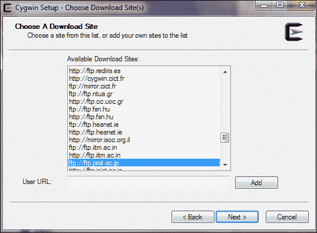
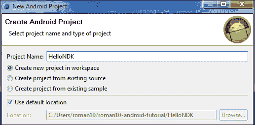
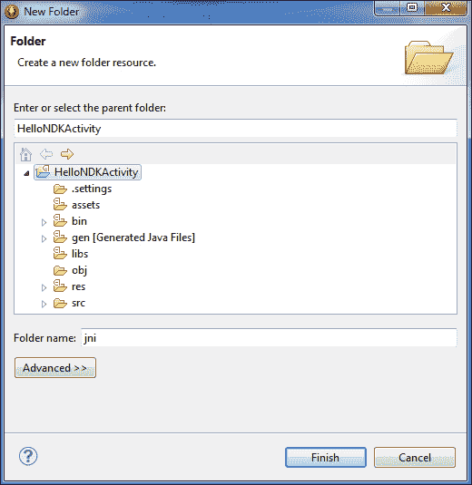

# 第一章。你好，NDK

在本章中，我们将介绍以下食谱:

*   在视窗环境下建立安卓 NDK 开发环境
*   在 Ubuntu Linux 中建立安卓 NDK 开发环境
*   在苹果操作系统中建立安卓 NDK 开发环境
*   更新安卓 NDK
*   写一个你好 NDK 的节目

# 简介

安卓 NDK 是一个工具集，允许开发者用一种本地语言，比如 C、C++和汇编语言，实现安卓应用的一部分或整个应用。在我们开始 NDK 之旅之前，了解 NDK 的优势是很重要的。

首先，NDK 可能会提高应用程序性能。对于许多受处理器限制的应用程序来说，这通常是正确的。许多多媒体应用程序和视频游戏使用本机代码来执行处理器密集型任务。

性能提升可以来自三个方面。首先将原生代码编译成二进制代码，直接在 OS 上运行，而 Java 代码则翻译成 Java 字节码，由 Dalvik **虚拟机** ( **VM** )进行解释。在 Android 2.2 或更高版本中，Dalvik VM 增加了一个**准时制** ( **JIT** ) 编译器，用于在程序运行时分析和优化 Java 字节码(例如，JIT 可以在执行之前将部分字节码编译为二进制码)。但是在许多情况下，本机代码仍然比 Java 代码运行得更快。

### 类型

Java 代码由 Dalvik VM 在 Android 上运行。Dalvik VM 是专门为硬件资源(内存空间、处理器速度等)受限的系统设计的。

NDK 性能提升的第二个来源是原生代码允许开发人员利用安卓 SDK 无法访问的一些处理器功能，比如 NEON，一种 **单指令多数据** ( **SIMD** )技术，允许多个数据元素并行处理。一个特定的编码任务示例是视频帧或照片的颜色转换。假设我们要将一张 1920x1280 像素的照片从 RGB 颜色空间转换到 YCbCr 颜色空间。天真的方法是将转换公式应用于每个像素(即超过 200 万像素)。有了 NEON，我们可以一次处理多个像素，减少处理时间。

第三个方面是我们可以在程序集级别优化关键代码，这是桌面软件开发中的一种常见做法。

### 类型

使用本机代码的优势并不是免费的。调用 JNI 方法会给达尔维克虚拟机带来额外的工作，并且由于代码是编译的，因此无法应用运行时优化。事实上，在 NDK 发展并不能保证性能的提高，有时甚至会损害性能。因此，我们只声明它可能会提高应用程序的性能。

NDK 的第二个优势是它允许将现有的 C 和 C++代码移植到安卓系统。这不仅大大加快了开发速度，还让我们可以在安卓和非安卓项目之间共享代码。

在我们决定将 NDK 用于安卓应用之前，很高兴知道 NDK 不会让大多数安卓应用受益。不建议在 NDK 工作，仅仅因为比起 Java，人们更喜欢用 C 或 C++编程。NDK 不能直接访问安卓软件开发工具包中的大量应用编程接口，在 NDK 开发总是会给你的应用程序带来额外的复杂性。

了解了 NDK 的利弊，我们就可以开始安卓 NDK 之旅了。本章将介绍如何在 Windows、Ubuntu Linux 和 Mac OS 中设置 Android NDK 开发。对于之前设置过安卓 NDK 开发环境的开发者，提供了一个如何更新 NDK 开发环境的详细步骤。在本章的最后，我们将编写一个带有环境设置的 Hello NDK 程序。

# 在 Windows 环境下搭建安卓 NDK 开发环境

在这个食谱中，我们将探索如何在 Windows 中设置 Android NDK 开发环境。

## 做好准备

检查 Windows 版本和系统类型。一个安卓开发 环境可以在 Windows XP 32 位、Windows Vista 32 位或 64 位、Windows 7 32 位或 64 位上设置。

安卓开发需要安装 Java JDK 6 或者上面的 。按照以下步骤安装和配置 Java JDK:

1.  进入[http://www . Oracle . com/technetwork/Java/javase/downloads/index . html](http://www.oracle.com/technetwork/java/javase/downloads/index.html)的 Oracle Java JDK 网页，选择 JDK6 或以上供你的平台下载。
2.  双击下载的可执行文件，然后单击安装向导完成安装。
3.  进入**控制面板** | **系统和安全** | **系统** | **高级系统设置**。将弹出 **系统属性**窗口。
4.  点击**高级**选项卡中的 **环境变量**按钮；另一个**环境变量**窗口将弹出。
5.  Under **System variables**, click on **New** to add a variable with the name as `JAVA_HOME` and value as the path of the JDK installation root directory. This is shown as follows:

    

6.  在**系统变量**下，滚动找到`PATH`(或`Path`)环境变量。在值的开头插入`%JAVA_HOME%\bin;`。如果不存在`PATH`或`Path`变量，用设置为`%JAVA_HOME%\bin`的值创建一个新变量。一路点击**确定**关闭所有窗口。
7.  To verify whether JDK is installed and configured correctly, start a new command-line console, and enter `javac -version`. If JDK is configured correctly, you will get the Java version in the output.

    

**Cygwin** 是一个类似 Linux 的环境，供 Windows 运行 Linux 上可用的软件。安卓 NDK 开发需要安装 Cygwin 1.7 或更高版本来执行一些 Linux 程序；例如，GNU 使。

自从 NDK r7 之后，Windows NDK 有了一个新的`ndk-build.cmd`构建脚本，它使用 NDK 为 GNU make、awk 和其他工具预构建的二进制文件。因此用`ndk-build.cmd`构建 NDK 程序不需要 Cygwin。不过还是建议你安装 Cygwin，因为`ndk-build.cmd`是一个实验特性，调试脚本`ndk-gdb`还是需要 Cygwin 的。

按照以下步骤安装 Cygwin:

1.  去[http://cygwin.com/install.html](http://cygwin.com/install.html)下载`setup.exe`找 Cygwin。下载完成后双击即可开始安装。
2.  Click on **Next**, then select **Install from Internet**. Keep clicking on **Next** until you see the **Available Download Sites** list. Select the site that is close to your location, then click on **Next**:

    

3.  Look for GNU **make** under **Devel**, ensure it is version 3.81 or later, and **gawk** under **Base**. Alternatively, you can search for make and gawk using the **Search** box. Make sure both GNU make and gawk are selected to install, then click on **Next**. The installation can take a while to finish:

    

Eclipse 是一个功能强大的软件**集成开发环境** ( **IDE** )具有可扩展插件系统。是开发安卓应用的推荐 IDE。前往[http://www.eclipse.org/downloads/](http://www.eclipse.org/downloads/)，为 Java 开发者下载 Eclipse Classic 或 Eclipse IDE。提取压缩文件，它 将准备使用。请注意，安卓开发需要 Eclipse 3.6.2 (Helios)或更高版本。

### 类型

安卓开发者网站在[http://developer.android.com/sdk/index.html](http://developer.android.com/sdk/index.html)提供安卓 开发者工具包。它包括带有 ADT 插件的 Eclipse 集成开发环境和安卓软件开发工具包。我们可以下载该软件包，并跳过以下*步骤 1 至 10 中描述的 SDK 安装...*段。

## 怎么做…

以下步骤向您展示了如何在 Windows 中设置 Android NDK 开发环境。我们将首先建立一个 SDK 开发环境。如果已经设置了 SDK，可以跳过步骤 1 到 10。

1.  启动 Eclipse。选择**帮助** | **安装新软件**，弹出**安装**窗口。
2.  点击右上角 的**添加…** 按钮会出现角，会弹出另一个标题为**添加存储库**的窗口。
3.  在**添加存储库**窗口中，输入`ADT`作为**名称**，输入[https://dl-ssl.google.com/android/eclipse/](https://dl-ssl.google.com/android/eclipse/)作为**位置**。然后点击**确定**。
4.  It may take a few seconds for Eclipse to load the software items from the ADT website. After loading, select **Developer Tools** and **NDK Plugins**, then click on **Next** to proceed:

    

5.  在下一个窗口中，将显示要安装的工具列表。只需点击**下一步**。阅读并接受所有许可协议，然后点击**完成**。
6.  安装完成后，根据提示重新启动 **Eclipse** 。
7.  从[http://developer.android.com/sdk/index.html](http://developer.android.com/sdk/index.html)下载安卓 SDK 。
8.  双击安装程序开始安装。按照向导完成安装。
9.  In Eclipse, select **Window** | **Preferences** to open the **Preferences** window. Select **Android** from the left panel, then click on **Browse** to locate the Android SDK root directory. Click on **Apply**, and then **OK**.

    

10.  Start **Android SDK Manager** at the Android SDK installation root directory. Select **Android SDK Tools**, **Android SDK Platform-tools**, at least one Android platform (the latest is preferred), **System Image**, **SDK Samples**, and **Android Support**. Then click on **Install**. in the next window, read and accept all the license agreements, then click on **Install**:

    

11.  Go to [http://developer.android.com/tools/sdk/ndk/index.html](http://developer.android.com/tools/sdk/ndk/index.html) to download the latest version of Android NDK. Unzip the downloaded file.

    ### 类型

    **下载示例代码**

    您可以从您在[http://www.packtpub.com](http://www.packtpub.com)的账户中下载您购买的所有 Packt 书籍的示例代码文件。如果您在其他地方购买了这本书，您可以访问[http://www.packtpub.com/support](http://www.packtpub.com/support)并注册，以便将文件直接通过电子邮件发送给您。

12.  打开 `cygwin`根目录下的 `Cygwin.bat`。默认包含以下内容:

    ```cpp
    @echo off
    C:
    chdir C:\cygwin\bin
    bash --login -i
    ```

13.  Add the following content after `@echo off` before `C`:

    ```cpp
    set IS_UNIX=
    set JAVA_HOME=<JDK path>
    set PATH=<SDK path>\tools;<NDK path>
    set ANDROID_NDK_ROOT=/cygdrive/<NDK path>
    ```

    举个例子，我机器上的文件内容如下；注意`Progra~1`是`Program Files`文件夹的简称:

    ```cpp
    set IS_UNIX=set JAVA_HOME=c:/Progra~1/Java/jdk1.7.0_05
    set PATH=C:/Users/Administrator/AppData/Local/Android/android-sdk/tools;C:/Users/Administrator/Downloads/android-ndk-r8-windows/android-ndk-r8
    set ANDROID_NDK_ROOT=/cygdrive/c/Users/Administrator/Downloads/android-ndk-r8-windows/android-ndk-r8
    ```

14.  Start Cygwin by double-clicking on `cygwin.bat`, then go to the `samples/hello-jni` directory in NDK. Type the command `ndk-build`. If the build is successful, it proves that the NDK environment is set up correctly:

    

15.  In Eclipse, select **Window** | **Preferences** to open the **Preferences** window. Click on **Android** from the left panel, and select **NDK** from the drop-down list. Click on **Browse** to locate the Android NDK root directory. Click on **OK** to dismiss the pop-up window. This enables us to build and debug Android NDK applications with the Eclipse NDK plugin:

    

## 它是如何工作的…

在这个食谱中，我们首先建立了一个安卓软件开发工具包开发环境，然后是 NDK 开发环境。

安卓 NDK 不需要安装。我们下载了 NDK，并配置了路径，使其更方便使用。

安卓 SDK 开发不需要 Cygwin，但是对于 NDK 开发来说是必不可少的，因为 NDK 使用了一些依赖于 Cygwin 的 Linux 工具。

ADT 中的 **NDK 插件:【Eclipse 的 NDK 插件在 **安卓开发工具** ( **ADT** 中有，可以让我们轻松构建和调试安卓 NDK 应用。**

### 类型

NDK 插件仅适用于 2012 年 6 月发布的 ADT 20.0.0 或更高版本 。您可能想要更新您的 Eclipse ADT 以便使用 NDK 插件。

## 还有更多…

我们安装了 Eclipse IDE 作为开发环境的一部分。Eclipse 是开发安卓应用程序的推荐 IDE，它附带了许多有用的工具和实用程序来帮助我们的开发。然而，它不是开发环境的强制组成部分。

# 在 Ubuntu Linux 中搭建安卓 NDK 开发环境

这个食谱描述了如何在 Ubuntu Linux 中设置一个 Android NDK 开发环境。

## 做好准备

检查你的 Ubuntu 版本，确保是 8.04 版或更高版本。

需要 GNU C 库(`glibc` ) 2.7 或以上的。默认情况下，它通常与 Linux 一起安装。两个简单的方法可以查看`glibc`的版本:

1.  Start a terminal, and enter `ldd --version`. This will print the version of `ldd` and `glibc`:

    

2.  We can execute the library as an application. Start a terminal, locate the library location, and then enter the following command:

    ```cpp
    <glibc library location>/<glibc library>. 

    ```

    将显示以下输出:

    

3.  如果我们使用 64 位机器，我们需要启用 32 位应用程序执行。启动一个终端，输入以下命令:

    ```cpp
    sudo apt-get install ia32-libs

    ```

4.  安装 JDK 6 或更高版本。在终端，输入命令`sudo apt-get install openjdk-6-jdk`，或者我们可以输入`sudo apt-get install sun-java6-jdk`。安装后，我们需要通过在`~/.bashrc`中添加以下行来将 JDK 路径添加到`PATH`环境变量中:

    ```cpp
    export JDK_PATH=/usr/local/jdk1.7.0/bin
    export PATH=$PATH:$JDK_PATH
    ```

我们将使用 Eclipse 作为我们的集成开发环境。请参考*在 Windows* 中设置安卓 NDK 开发环境的菜谱进行说明。

## 怎么做…

以下步骤说明了在 Ubuntu Linux 上设置 Android NDK 开发环境的过程:

1.  按照*步骤 1 到 6，在 Windows* 中设置安卓 NDK 开发环境，为 Eclipse 安装 ADT 插件。
2.  从[http://developer.android.com/sdk/index.html](http://developer.android.com/sdk/index.html)下载安卓 SDK，然后解压下载的包。
3.  在`~/.bashrc`后面加上以下几行:

    ```cpp
    export ANDROID_SDK=<path to Android SDK directory>
    export PATH=$PATH:$ ANDROID_SDK/tools:$ANDROID_SDK/platform-tools
    ```

4.  按照*步骤 9 和步骤 10，在 Windows* 中设置安卓 NDK 开发环境，在 Eclipse 中配置 SDK 路径，并下载额外的包。
5.  从[http://developer.android.com/tools/sdk/ndk/index.html](http://developer.android.com/tools/sdk/ndk/index.html)下载最新版本的安卓 NDK ，然后解压下载的文件。
6.  更改您在步骤 3 中添加到`~/.bashrc`的行:

    ```cpp
    export ANDROID_SDK=<path to Android SDK directory>
    export ANDROID_NDK=<path to Android NDK directory> 
    export PATH=$PATH:$ANDROID_SDK/tools:$ANDROID_SDK/platform-tools:$ANDROID_NDK
    ```

7.  Start a new terminal, then go to the `samples/hello-jni` directory in NDK. Type the command `ndk-build`. If the build is successful, it proves that the NDK environment is set up correctly:

    

## 它是如何工作的…

我们首先建立了安卓软件开发工具包，然后是安卓 NDK。请确保路径设置正确，以便无需参考 SDK 和 NDK 目录即可访问工具。

`.bashrc`文件是启动新终端时由 bash shell 读取的启动文件。导出命令将安卓软件开发工具包和 NDK 目录位置附加到环境变量`PATH`中。因此，每次新的 bash shell 启动时，都会为 SDK 和 NDK 工具正确设置`PATH`。

## 还有更多…

以下是关于建立 NDK 发展环境的一些提示:

*   **在启动文件**中配置路径:我们在`~/.bashrc`文件中将 SDK 和 NDK 路径追加到`PATH`环境变量中。这假设我们的 Linux 系统使用 bash shell。但是，如果您的系统使用另一个 shell，则使用的启动文件可能会有所不同。一些常用 shells 使用的启动文件如下所示:
    *   对于 C shell ( `csh`)，使用的启动文件是`~/.cshrc`。
    *   对于`ksh`，可以使用`echo $ENV`命令获得要使用的启动文件。
    *   对于`sh`，使用的启动文件是`~/.profile`。用户需要退出当前会话并再次登录才能生效。
*   **Switch JDK**: In Android development, we can either use Oracle Java JDK or OpenJDK. In case we run into issues with any one of the JDKs, we can switch to another Java JDK, if we have installed both of them.
    *   要检查系统当前使用的是哪个 JDK，请使用以下命令:

        ```cpp
         $update-java-alternatives -l

        ```

    *   要在两个 JDK 之间切换，请使用以下命令:

        ```cpp
         $sudo update-java-alternatives -s <java name>

        ```

    以下是切换到 Oracle JDK 1.6.0 的示例:

    ```cpp
    $sudo update-java-alternatives -s java-1.6.0-sun 

    ```

# 在 Mac OS 中搭建安卓 NDK 开发环境

这个菜谱描述了如何在 Mac OS 中设置 一个安卓 NDK 开发环境。

## 做好准备

安卓开发需要 Mac OS X 10.5.8 或更高版本，并且只能在 x86 架构上运行。开始之前，请确保您的机器符合这些要求。

注册一个苹果开发者账号，然后去[https://developer.apple.com/xcode/](https://developer.apple.com/xcode/)下载 Xcode，里面包含了很多开发者工具，包括安卓 NDK 开发所需的`make`实用程序。下载完成后，运行安装包，确保选择 **UNIX 开发**选项进行安装。

像往常一样，需要 Java JDK 6 或更高版本。麦克·OS X 号通常搭载一艘完整的 JDK 号。我们可以使用以下命令验证您的计算机是否具有所需的版本:

```cpp
$javac -version
```

## 怎么做…

在 Mac OS X 上设置安卓 NDK 开发环境类似于在 Ubuntu Linux 上设置。以下步骤解释了我们如何做到这一点:

1.  按照*步骤 1 到 6，在 Windows* 中设置安卓 NDK 开发环境，为 Eclipse 安装 ADT 插件。
2.  从[http://developer.android.com/sdk/index.html](http://developer.android.com/sdk/index.html)下载安卓 SDK，然后解压下载的包。
3.  在`~/.profile`后附加以下几行。如果文件不存在，请创建一个新文件。保存更改并记录 退出当前会话:

    ```cpp
    export ANDROID_SDK=<path to Android SDK directory>
    export PATH=$PATH:$ ANDROID_SDK/tools:$ANDROID_SDK/platform-tools
    ```

4.  在 Eclipse 中，选择 **Eclipse** | **偏好设置**打开**偏好设置**窗口。从左侧面板选择**安卓**，然后点击**浏览**找到安卓 SDK 根目录。点击**应用**，然后**确定**。
5.  在终端中，通过键入命令`android`，在`tools`目录下启动安卓软件开发工具包管理器。选择**安卓 SDK 工具**、**安卓 SDK 平台-工具**，至少一个安卓平台(最好是最新的)、**系统镜像**、 **SDK 样例**、**安卓支持**。然后点击**安装**。在下一个窗口中，阅读并接受所有许可协议，然后点击**安装**。
6.  从[http://developer.android.com/sdk/index.html](http://developer.android.com/sdk/index.html)下载安卓 SDK，然后解压下载的包。
7.  更改您在步骤 3 中添加到`~/.profile`的行:

    ```cpp
    export ANDROID_SDK=<path to Android SDK directory>
    export ANDROID_NDK=<path to Android NDK directory> 
    export PATH=$PATH:$ANDROID_SDK/tools:$ANDROID_SDK/platform-tools:$ANDROID_NDK
    ```

8.  启动一个新的终端，然后转到 NDK 的`samples/hello-jni`目录。键入命令`ndk-build`。如果构建成功，则证明 NDK 环境设置正确。

## 它是如何工作的…

在 Mac OS X 上建立安卓 NDK 开发环境的步骤与 Ubuntu Linux 类似，因为两者都是类似 Unix 的操作系统。我们首先安装了安卓软件开发工具包，然后是安卓 NDK。

# 更新安卓 NDK

当有新版本的 NDK 时，我们可能希望更新 NDK，以便利用新版本的新功能或错误修复。这个食谱讲的是如何在 Windows、Ubuntu Linux 和 Mac OS 中更新安卓 NDK。

## 做好准备

请阅读本章前面的食谱，这取决于您选择的平台。

## 怎么做…

在 Windows 中，按照以下说明更新安卓 NDK:

1.  前往[http://developer.android.com/tools/sdk/ndk/index.html](http://developer.android.com/tools/sdk/ndk/index.html)下载安卓 NDK 最新版本。解压缩下载的文件。
2.  打开`cygwin`根目录下的`Cygwin.bat`。如果您以前在系统上配置过 NDK，内容应该类似于下面的代码片段:

    ```cpp
    @echo off
    set IS_UNIX=
    set JAVA_HOME=<JDK path>
    set PATH=<SDK path>\tools;<NDK path>
    set ANDROID_NDK_ROOT=/cygdrive/<NDK path>
    C:
    chdir C:\cygwin\bin
    bash --login -i
    ```

3.  将`<NDK path>`从旧的 NDK 路径更新到新下载解压缩的位置。

在 Ubuntu Linux 中，按照以下说明更新 安卓 NDK:

1.  从[http://developer.android.com/tools/sdk/ndk/index.html](http://developer.android.com/tools/sdk/ndk/index.html)下载安卓 NDK 最新版本，然后解压下载的文件。
2.  如果我们按照*在 Ubuntu Linux* 中设置安卓 NDK 开发环境的食谱，下面的内容应该会出现在`~/.bashrc`的末尾:

    ```cpp
    export ANDROID_SDK=<path to Android SDK directory>
    export ANDROID_NDK=<path to Android NDK directory>
    export PATH=$PATH:$ANDROID_SDK/tools:$ANDROID_SDK/platform-tools:$ANDROID_NDK
    ```

3.  将`ANDROID_NDK`路径更新到新下载提取的安卓 NDK 文件夹。

在苹果操作系统中，除了我们需要将路径附加到`~/.profile`而不是`~/.bashrc`之外，步骤几乎与 Ubuntu Linux 相同。

## 它是如何工作的…

只需下载并提取 NDK 文件，并正确配置路径，即可完成 NDK 安装。因此，更新 NDK 就像更新新 NDK 文件夹的配置路径一样简单。

## 还有更多…

有时候，更新 NDK 需要先更新 SDK。由于这本书的重点是安卓 NDK，解释如何更新 SDK 超出了本书的范围。具体操作方法可以参考【http://developer.android.com/sdk/index.html】安卓开发者网站。

有时，由于兼容性问题，我们可能会觉得需要使用旧版本的 NDK 来构建某些应用程序。因此，保留安卓 NDK 的多个版本并通过更改路径或简单地使用完整路径来引用 NDK 的特定版本来在它们之间切换可能会很有用。

# 写一个你好 NDK 的节目

设置好环境后，让我们开始在 NDK 编写代码。这个食谱通过一个你好 NDK 节目。

## 做好准备

在开始编写 Hello NDK 程序之前，需要正确设置 NDK 开发环境。根据您选择的平台，请参考本章前面的食谱。

## 怎么做…

按照以下步骤编写、编译和运行你好 NDK 程序:

1.  Start Eclipse, and select **File** | **New** | **Android Project**. Enter `HelloNDK` as the value for **Project Name**. Select **Create new project in workspace**. Then click on **Next**:

    

2.  在下一个窗口中，选择一个你想要瞄准的安卓版本。通常推荐最新版本。然后点击**下一步**。
3.  In the next window, specify your package name as `cookbook.chapter1`. Select the **Create Activity** box, and specify the name as `HelloNDKActivity`. Set the value for **Minimum SDK** as `5 (Android 2.0)`. Click on **Finish**:

    

4.  In the Eclipse package explorer, right-click on the `HelloNDK` project, and select **New** | **Folder**. Enter the name `jni` in the pop-up window, then click on **Finish**:

    

5.  右键单击`HelloNDK`项目下新创建的`jni`文件夹。选择**新建** | **文件**，输入`hello.c`作为**文件名**的值，然后点击**完成**。在`hello.c`文件中输入以下代码:

    ```cpp
    #include <string.h>
    #include <jni.h>

    jstring 
    Java_cookbook_chapter1_HelloNDKActivity_naGetHelloNDKStr(JNIEnv* pEnv,  jobject pObj)
    {
        return (*pEnv)->NewStringUTF(pEnv, "Hello NDK!");
    }
    ```

6.  右键点击`jni`文件夹。选择**新建** | **文件**，输入`Android.mk`作为**文件名**的值，然后点击**完成**。在`Android.mk`文件中输入以下代码:

    ```cpp
    LOCAL_PATH := $(call my-dir)
    include $(CLEAR_VARS)
    LOCAL_MODULE    := hello
    LOCAL_SRC_FILES := hello.c
    include $(BUILD_SHARED_LIBRARY)
    ```

7.  启动终端，进入`jni`文件夹，输入`ndk-build`将`hello.c`程序作为原生库构建。
8.  编辑`HelloNDKActivity.java`文件。文件应包含以下内容:

    ```cpp
    public class HelloNDKActivity extends Activity {
        @Override
        public void onCreate(Bundle savedInstanceState) {
            super.onCreate(savedInstanceState);
            TextView tv = new TextView(this);
            tv.setTextSize(30);
            tv.setText(naGetHelloNDKStr());
            this.setContentView(tv);
        }
        public native String naGetHelloNDKStr();
        static {
            System.loadLibrary("hello");
        }
    }
    ```

9.  Right-click on the `HelloNDK` project in Eclipse. Select **Run As** | **Android Application**. Your Android phone or emulator will be displayed with something similar to the following screenshot:

    

## 它是如何工作的…

这个食谱演示了如何在安卓系统上编写一个你好 NDK 程序。

*   **Native code**: The Hello NDK program consists of both the native C code and Java code. The native function `naGetHelloNDKStr` returns the `Hello NDK` string to the caller, as indicated in both the native code function definition and Java code method declaration. The native function name must follow a specific pattern for a package name, class name, and method name. The package and class name must agree with the package and class name of the Java class from which the native method is called, while the method name must be the same as the method name declared in that Java class.

    这有助于达尔维克虚拟机在运行时定位本机函数。不遵守规则将导致运行时出现`UnsatisfiedLinkError`。

    本机函数有两个参数，这是所有本机函数的标准参数。可以根据需要定义附加参数。第一个参数是`JNIEnv` 的指针，是访问各种 JNI 功能的网关。第二个参数的含义取决于本机方法是静态方法还是实例方法。如果是静态方法，第二个参数是对定义该方法的类的引用。如果是实例方法，第二个参数是对调用本机方法的对象的引用。我们将在[第 2 章](02.html "Chapter 2. Java Native Interface")、 *Java 原生接口*中详细讨论 JNI。

*   **Compilation of the native code**: The Android NDK build system frees developers from writing `makefile`. The build system accepts an `Android.mk` file, which simply describes the sources. It will parse the file to generate `makefile` and do all the heavy lifting for us.

    我们将在[第 3 章](03.html "Chapter 3. Build and Debug NDK Applications")、*构建和调试 NDK 应用程序*中详细介绍如何编写`Android.mk`文件，甚至编写我们自己的`makefile`。

    一旦我们编译了本机代码，一个名为`libs`的文件夹将在我们的项目下创建，一个`libhello.so`库将在`armeabi`子目录下生成。

*   **Java 代码**:调用本机方法需要遵循三个步骤:
    1.  **加载原生库**:通过调用`System.loadLibrary("hello")`完成。注意不要用`libhello`，要用`hello`。如果指定了`libhello`，达尔维克虚拟机将无法定位库。
    2.  **声明方法**:我们用一个 native 关键字声明方法，表示它是一个 native 方法。
    3.  **调用方法**:我们调用方法就像任何普通的 Java 方法一样。

## 还有更多…

本机方法的名称很长，手动编写容易出错。幸运的是，来自 JDK 的`javah`程序可以帮助我们生成头文件，其中包括方法名。使用`javah`应遵循以下步骤:

1.  编写 Java 代码，包括本机方法定义。
2.  编译 Java 代码，确保类文件出现在我们项目的`bin/classes` /文件夹下。
3.  Start a terminal and go to the `jni` folder, and enter the following command:

    ```cpp
    $ javah -classpath ../bin/classes –o <output file name> <java package name>.<java class anme>

    ```

    在我们的`HelloNDK`示例中，命令应该如下:

    ```cpp
    $ javah -classpath ../bin/classes –o hello.h cookbook.chapter1.HelloNDKActivity

    ```

    这将生成一个名为`hello.h`的文件，其功能定义如下:

    ```cpp
    JNIEXPORT jstring JNICALL Java_cookbook_chapter1_HelloNDKActivity_naGetHelloNDKStr
      (JNIEnv *, jobject);
    ```