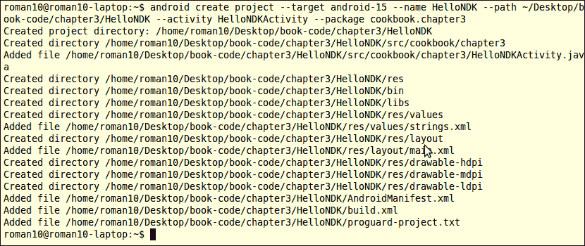
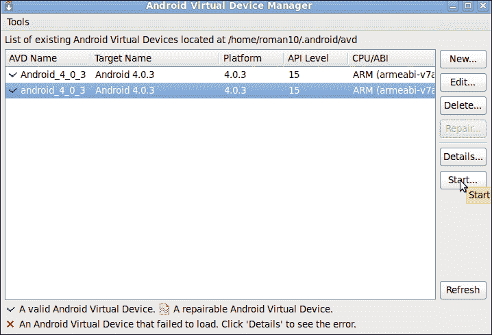
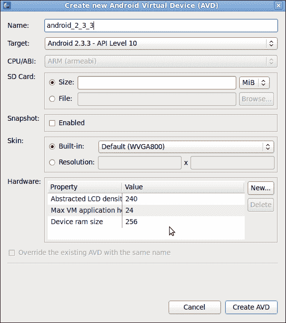
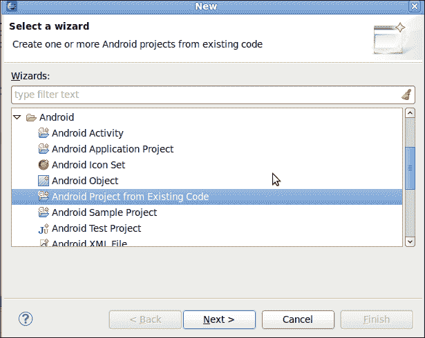
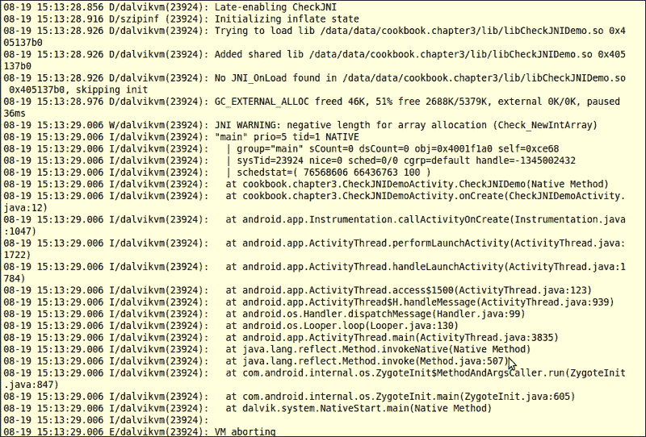
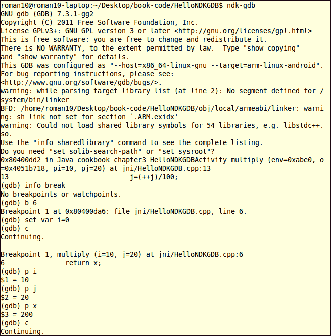
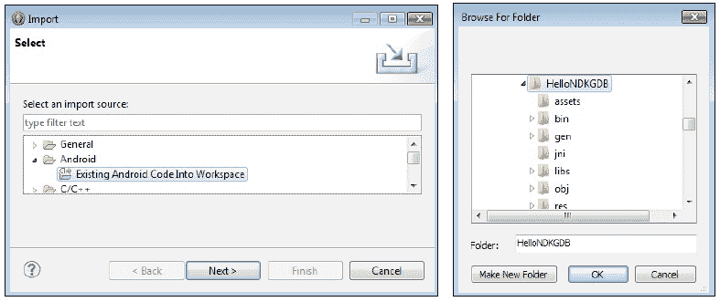
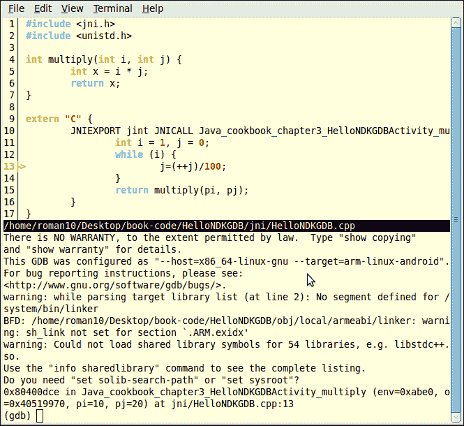

# 三、构建和调试 NDK 应用

在这一章中，我们将涵盖以下食谱:

*   在命令行上构建安卓 NDK 应用
*   在 Eclipse 中构建一个安卓 NDK 应用
*   为不同的 ABIs 构建安卓 NDK 应用
*   为不同的中央处理器特性构建安卓 NDK 应用
*   使用日志消息调试安卓 NDK 应用
*   通过检查调试 android ndk 应用
*   用 NDK·GDB 调试安卓 NDK 应用
*   用 CGDB 调试安卓 NDK 应用
*   在 Eclipse 中调试安卓 NDK 应用

# 简介

我们介绍了在[第 1 章](01.html "Chapter 1. Hello NDK")、*你好 NDK* 中设置的环境，以及在[第 2 章](02.html "Chapter 2. Java Native Interface")、 *Java 原生接口*中的 JNI 编程。要构建安卓 NDK 应用，我们还需要为安卓 NDK 使用**构建**和**调试**工具。

安卓 NDK 自带 `ndk-build`脚本，方便任何安卓 NDK 应用的轻松构建。这个脚本向开发人员隐藏了调用交叉编译器、交叉链接器等的复杂性。我们将从介绍`ndk-build`命令的用法开始。

最近发布的**安卓开发工具** ( **ADT** )插件支持从 Eclipse 构建安卓 NDK 应用。我们将演示如何使用它。

我们将探索为不同的**应用二进制接口** ( **ABIs** ) 构建 NDK 应用，并利用可选的 CPU 特性。这对于在不同的安卓设备上实现最佳性能至关重要。

除了构建，我们还将介绍安卓 NDK 应用的各种调试工具和技术。从简单但强大的日志记录技术开始，我们将展示如何从命令行和 Eclipse IDE 调试 NDK 应用。`CheckJNI`模式也将推出，可以帮助我们捕捉 JNI 虫子。

# 在命令行上构建安卓 NDK 应用

虽然 Eclipse 是推荐用于 安卓开发的 IDE，但有时我们希望在命令行中构建一个安卓应用，以便该过程可以轻松自动化，并成为持续集成过程的一部分。这个食谱着重于如何在命令行上构建一个安卓 DNK 应用。

## 做好准备

Apache Ant 是一个主要用于构建 Java 应用的工具。它接受一个 XML 文件来描述构建、部署和测试过程，管理过程，并自动跟踪依赖关系。

我们将使用 Apache Ant 来构建和部署我们的示例项目。如果您还没有安装它，您可以按照以下命令安装它:

*   如果您在 Ubuntu Linux 上，请使用以下命令:

    ```cpp
    $ sudo apt-get install ant1.8

    ```

*   如果您使用的是苹果电脑，请使用以下命令:

    ```cpp
    $ sudo port install apache-ant

    ```

*   如果你用的是 Windows，可以从[http://code.google.com/p/winant/downloads/list](http://code.google.com/p/winant/downloads/list)下载 `winant`安装程序，然后安装。

读者应该已经建立了 NDK 开发环境，并在阅读本书之前阅读了[第一章](01.html "Chapter 1. Hello NDK")、*你好 NDK* 中的*编写你好 NDK 程序*的食谱。

## 怎么做…

以下步骤创建并构建一个示例 `HelloNDK`应用:

1.  Create the project. Start a command-line console and enter the following command:

    ```cpp
    $ android create project \
    --target android-15 \
    --name HelloNDK \
    --path ~/Desktop/book-code/chapter3/HelloNDK \
    --activity HelloNDKActivity \
    --package cookbook.chapter3

    ```

    ### 类型

    `android`工具可以在 Android SDK 文件夹的`tools/`目录下找到。如果你已经按照[第 1 章](01.html "Chapter 1. Hello NDK")、*你好 NDK* 设置了 SDK 和 NDK 开发，并且`PATH`配置正确，你可以直接从命令行执行`android`命令。否则，您需要输入`android`程序的相对路径或完整路径。这也适用于书中使用的其他 SDK 和 NDK 工具。

    以下是 命令输出的截图:

    

2.  转到`HelloNDK`项目文件夹，使用以下命令创建一个名为`jni`的文件夹:

    ```cpp
    $ cd ~/Desktop/book-code/chapter3/HelloNDK
    $ mkdir jni

    ```

3.  在`jni`文件夹下 创建一个名为`hello.c`的文件，并添加以下内容:

    ```cpp
    #include <string.h>
    #include <jni.h>

    jstring Java_cookbook_chapter3_HelloNDKActivity_naGetHelloNDKStr(JNIEnv* pEnv, jobject pObj)
    {
       return (*pEnv)->NewStringUTF(pEnv, "Hello NDK!");
    }
    ```

4.  在`jni`文件夹下创建一个名为`Android.mk`的文件，内容如下:

    ```cpp
    LOCAL_PATH := $(call my-dir)
    include $(CLEAR_VARS)
    LOCAL_MODULE    := hello
    LOCAL_SRC_FILES := hello.c
    include $(BUILD_SHARED_LIBRARY)
    ```

5.  使用以下命令构建本机库:

    ```cpp
    $ ndk-build

    ```

6.  将`HelloNDKActivity.java`文件 修改为以下内容:

    ```cpp
    package cookbook.chapter3;
    import android.app.Activity;
    import android.os.Bundle;
    import android.widget.TextView;
    public class HelloNDKActivity extends Activity {
       @Override
       public void onCreate(Bundle savedInstanceState) {
           super.onCreate(savedInstanceState);
           TextView tv = new TextView(this);
           tv.setTextSize(30);
           tv.setText(naGetHelloNDKStr());
           this.setContentView(tv);
       }
       public native String naGetHelloNDKStr();
       static {
           System.loadLibrary("hello");
       }
    }
    ```

7.  Update the project. We have added a native library, so we need to update the project with the following command. Note that this command is only needed once unless we change the project settings, while the previous `ndk-build` command needs to be executed every time we update the native code:

    ```cpp
    $ android update project --target android-15 --name HelloNDK \
    --path ~/Desktop/book-code/chapter3/HelloNDK

    ```

    以下是命令输出的屏幕截图:

    

8.  Go to the project `root` folder, and build our project in the debug mode using the following command:

    ```cpp
    $ ant debug

    ```

    在下面的截图中，我们显示了输出的最后几行，这表明成功的构建是:

    

    输出`apk`将在`bin/HelloNDK-debug.apk`产生。

9.  Create an emulator using the following command:

    ```cpp
    $ android --verbose create avd --name android_4_0_3 \
    --target android-15 --sdcard 32M

    ```

    以下是 命令输出的截图:

    

10.  Start the emulator, using the following command:

    ```cpp
    $ emulator -wipe-data -avd android_4_0_3

    ```

    或者，我们可以使用命令“`android avd`”启动**安卓虚拟设备管理器**窗口，然后选择一个仿真器启动，如下所示:

    

11.  Install the app on the emulator. We first check the device serial number by using the following command:

    ```cpp
    $ adb devices

    ```

    以下是 命令输出的截图:

    

12.  We then install the `debug.apk` file to the emulator by using the following command:

    ```cpp
    $ adb -s emulator-5554 install bin/HelloNDK-debug.apk

    ```

    

    ### 类型

    如果只有一台设备连接到计算机，则无需指定设备序列号。在前面的命令中，我们可以删除“- `s emulator-5554`”。

13.  Start the `HelloNDK` app on the emulator using the command in the following format:

    ```cpp
    $ adb shell am start -n com.package.name/com.package.name.ActivityName

    ```

    在我们的示例中，我们使用以下命令:

    ```cpp
    $ adb -s emulator-5554 shell am start -n cookbook.chapter3/cookbook.chapter3.HelloNDKActivity

    ```

    

14.  Run the app on a device.

    假设设备序列号为`HT21HTD09025`，那么我们可以使用以下命令在 安卓设备上安装该应用。

    ```cpp
    $ adb -s HT21HTD09025 install bin/HelloNDK-debug.apk

    ```

    在我们的示例中，我们使用以下命令启动应用:

    ```cpp
    $ adb -s HT21HTD09025 shell am start -n cookbook.chapter3/cookbook.chapter3.HelloNDKActivity

    ```

15.  创建发布包。

一旦我们确认我们的应用可以成功运行，我们可能想要创建一个发布包来上传到安卓市场。您可以执行以下步骤来实现这一点:

1.  Create a keystore. An Android app must be signed using a key from a keystore. A **keystore** is a collection of private keys. We can use the following command to create a keystore with a private key:

    ```cpp
    $ keytool -genkey -v -keystore release_key.keystore \
    -alias androidkey \
    -keyalg RSA -keysize 2048 -validity 10000 \
    -dname "CN=MyCompany, OU=MyAndroidDev, O=MyOrg, L=Singapore, S=Singapore, C=65" \
    -storepass testkspw -keypass testkpw

    ```

    以下是命令输出的屏幕截图:

    

    如图所示，创建了一个密码为`testkwpw`的密钥库，并将密码为`testkpw`的 RSA 密钥对添加到密钥库中。

2.  键入命令“`ant release`”为应用构建一个`apk`。输出可以在 b `i` n 文件夹中找到作为`HelloNDK-release-unsigned.apk`。
3.  Sign the `apk` by using the following command:

    ```cpp
    $ jarsigner -verbose -keystore <keystore name> -storepass <store password> -keypass <key password> -signedjar <name of the signed output> <unsigned input file name> <alias>

    ```

    对于我们的示例应用，命令 和输出如下:

    

4.  Zip-align the `apk` file. The `zipalign` tool aligns the data inside an `apk` file for performance optimization. The following command can be used to align a signed `apk`:

    ```cpp
    $ zipalign -v 4 <app apk file name>  <aligned apk file name>

    ```

    对于我们的示例应用，命令和输出如下:

    

## 它是如何工作的…

这个食谱讨论了如何从命令行构建一个安卓 NDK 应用。

安卓 NDK 提供了一个构建系统，目标如下:

*   **简单性**:它为开发人员处理了大部分繁重的工作，我们只需要编写简短的构建文件(`Android.mk`和`Application.mk`)来描述需要编译的源代码。
*   **兼容性**:在未来的版本中，NDK 可能会增加更多的构建工具、平台等，但是构建文件不需要任何更改。

安卓 NDK 自带一套交叉工具链，包括交叉编译器、交叉链接器、交叉汇编器等等。这些工具可以在 NDK `root`目录的`toolchains`文件夹下找到。它们可以用来在 Linux、Mac OS 或 Windows 上的不同 Android 平台(ARM、x86 或 MIPS)上生成二进制文件。虽然可以直接使用工具链为安卓系统构建本机代码，但不建议这样做，除非我们正在移植一个带有自己构建脚本的项目。在这种情况下，我们可能只需要将原始编译器更改为 NDK 交叉编译器，就可以为安卓构建它。

大多数情况下，我们会在`Android.mk`中描述来源，并在`Application.mk`中指定 ABIs。安卓 NDK 的`ndk-build`脚本将在内部调用交叉工具链为我们构建本机代码。以下是常用的`ndk-build`选项列表:

*   `ndk-build`:用来建造 双星。
*   `ndk-build clean`:清除 生成的二进制文件。
*   `ndk-build V=1`:这会构建二进制文件， 会显示构建命令。当我们想要发现事物是如何构建的或者检查构建错误时，这是很方便的。
*   `ndk-build -B`:这个命令 部队进行重建。
*   `ndk-build NDK_DEBUG=1`:生成 可调试版本。
*   `ndk-build NDK_DEBUG=0`:它 生成一个发布版本。

## 还有更多...

这个食谱在安卓软件开发工具包中使用了很多命令行工具。这使我们能够展示如何创建、构建和部署安卓 NDK 项目的完整说明。然而，由于本书是专门针对安卓 NDK 的，所以我们不会在本书中提供这些 工具的细节。你可以在[http://developer.android.com/tools/help/index.html](http://developer.android.com/tools/help/index.html)阅读更多关于这些工具的信息。

### 从命令行截图

从命令行截图可以方便地记录自动测试的显示结果。然而，安卓目前并没有提供一个命令行工具来截图。

在安卓源代码的`\development\tools\screenshot\src\com\android\screenshot\`找到的一个 Java 程序可以用来截图。代码使用了与 Eclipse DDMS 插件类似的方法来截图，但是是从命令行。我们将前面的代码合并到一个名为`screenshot`的 Eclipse Java 项目中，该项目可以从网站上下载。

可以导入项目并导出一个可执行的 JAR 文件来使用该工具。假设导出的 JAR 文件名为`screenshot.jar`，那么下面的示例命令使用它从模拟器中获取一个截图:


# 在 Eclipse 中构建安卓 NDK 应用

前面的食谱讨论了如何在命令行中构建一个 安卓 NDK 应用。这个食谱演示了如何在 Eclipse 集成开发环境中实现它。

## 做好准备

添加 NDK 首选项。开始 Eclipse，然后点击**窗口** | **首选项**。在**偏好设置**窗口中，选择**安卓**下的 **NDK** 。点击**浏览**，选择 NDK `root`文件夹。点击**确定**。


## 怎么做…

以下步骤使用 Eclipse 创建了一个 NDK 项目:

1.  创建一个名为`HelloNDKEclipse`的安卓应用。将包名设置为`cookbook.chapter3`。创建一个名为`HelloNDKEclipseActivity`的活动。如需更多详细说明，请参考[第二章](02.html "Chapter 2. Java Native Interface")、 *Java 原生接口*的*加载原生库和注册原生方法*食谱。
2.  Right-click on the project `HelloNDKEclipse`, select **Android Tools** | **Add Native Support**. A window similar to the following screenshot will appear. Click on **Finish** to dismiss it:

    

    这将添加一个里面有两个文件(`HelloNDKEclipse.cpp`和`Android.mk`)的`jni`文件夹，并将 Eclipse 切换到 C/C++透视图。

3.  在`HelloNDKEclipse.cpp`中增加以下 内容:

    ```cpp
    #include <jni.h>

    jstring getString(JNIEnv* env) {
      return env->NewStringUTF("Hello NDK");
    }

    extern "C" {
      JNIEXPORT jstring JNICALL Java_cookbook_chapter3_HelloNDKEclipseActivity_getString(JNIEnv* env, jobject o){
        return getString(env);
      }
    }
    ```

4.  将 HelloNDKEclipseActivity.java 的内容更改为以下内容。

    ```cpp
    package cookbook.chapter3;

    import android.os.Bundle;
    import android.app.Activity;
    import android.widget.TextView;

    public class HelloNDKEclipseActivity extends Activity {
      @Override
       public void onCreate(Bundle savedInstanceState) {
           super.onCreate(savedInstanceState);
           TextView tv = new TextView(this);
           tv.setTextSize(30);
           tv.setText(getString());
           this.setContentView(tv);
       }
       public native String getString();
       static {
           System.loadLibrary("HelloNDKEclipse");
       }
    }
    ```

5.  右键点击`HelloNDKEclipse`项目，选择**建设项目**。这将为我们建立原生库。
6.  Right-click on the project, go to **Run As**, and select **Android Application**. The phone screen will display something similar to the following screenshot:

    

## 它是如何工作的...

这个食谱讨论了在 Eclipse 中构建安卓 NDK 应用。

我们在之前的所有食谱中都使用了 C。从这个食谱开始，我们将使用 C++编写代码。

默认情况下，安卓提供最少的 C++支持。没有**运行时类型信息** ( **RTTI** )和 C++异常支持，甚至连 C++标准库支持都是偏的。以下是安卓 NDK 默认支持的 C++头文件列表:

```cpp
cassert, cctype, cerrno, cfloat, climits, cmath, csetjmp, csignal, cstddef, cstdint, cstdio, cstdlib, cstring, ctime, cwchar, new, stl_pair.h, typeinfo, utility
```

通过使用不同的 C++库，可以增加更多的 C++支持。除了系统默认库之外，NDK 还附带了`gabi++`、`stlport`和`gnustl` C++库。

在我们的示例代码中，我们使用了一个外部“C”来包装 C++方法。这是为了避免 C++篡改 JNI 函数的名称。C++名称管理可以更改函数名称，以包括关于参数的类型信息，函数是否是虚拟的，等等。虽然这使得 C++能够链接重载的 函数，但它打破了 JNI 函数发现机制。

我们也可以使用[第二章](02.html "Chapter 2. Java Native Interface")、 *Java 原生接口*的*加载原生库和注册原生方法*配方中所涵盖的显式函数注册方法，来摆脱包装。

# 为不同的 ABI 构建安卓 NDK 应用

本机代码被编译成二进制文件。因此，一组二进制文件只能在特定的架构上运行。安卓 NDK 自带技术 和工具，让开发者可以轻松地为多种架构编译相同的源代码。

## 做好准备

一个**应用二进制接口** ( **ABI** ) 定义了安卓应用的机器代码在运行时应该如何与系统交互，包括中央处理器指令集、字符顺序、内存对齐等等。ABI 基本上定义了一种建筑类型。

下表简要总结了安卓支持的四种 ABI:

<colgroup><col style="text-align: left"> <col style="text-align: left"> <col style="text-align: left"> <col style="text-align: left"></colgroup> 
| 

ABI 名字

 | 

支持

 | 

不支持

 | 

可选择的

 |
| --- | --- | --- | --- |
| `armeabi` | 

*   ARMv5TE instruction set
*   Thumb (also known as Thumb-1) instruction

 | 硬件辅助浮点计算 |   |
| `armeabi-v7a` | 

*   `armeabi`
*   VFP hardware FPU instruction
*   Use Thumb-2 instruction set
*   VFPv3-D16。

 |   | 

*   Advanced SIMD (NEON)

 |
| `x86` | 

*   The instruction set is commonly called "x86" or "IA-32".
*   MMX, SSE, SSE2 and SSE3 instruction set extensions

 |   | 

*   MOVBE instruction

 |
| `mips` | 

*   MIPS32r1 instruction set
*   Hard floating
*   O32

 | 

*   DSP application specific extension

 |   |

armeabi 和 armeabi-v7a 是安卓设备最常用的两种 abi。ABI armeabi-v7a 与 armeabi 兼容，这意味着为 armeabi 编译的应用也可以在 armeabi-v7a 上运行。但事实并非如此，因为 armeabi-v7a 包含了额外的功能。在下一节中，我们将简要介绍 armeabi 和 armeabi-v7a 中经常提到的一些技术术语:

*   **Thumb**: This instruction set consists of 16-bit instructions, which is a subset of the 32-bit instruction set of the standard ARM. Some instructions in the 32-bit instruction set are not available for Thumb, but can be simulated with several Thumb instructions. The narrower 16-bit instruction set can offer memory advantages.

    Thumb-2 通过添加一些 32 位指令来扩展 Thumb-1，这导致了一个可变长度的指令集。Thumb-2 的目标是在 32 位内存上获得类似于 Thumb-1 的代码密度和类似于标准 ARM 指令集的 性能。

    安卓 NDK 默认生成拇指代码，除非`Android.mk`文件中定义了`LOCAL_ARM_MODE`。

*   **向量浮点(VFP)** :是 ARM 处理器的扩展，提供低成本浮点计算。
*   **VFPv3-D16 和 VFPV3-D32**:VFPV3-D16 指 16 个专用 64 位浮点寄存器。类似地，VFPv3-D32 意味着有 32 个 64 位浮点寄存器。这些寄存器加速浮点计算。
*   **NEON** : NEON 是 ARM **高级单指令多数据** ( **SIMD** ) 指令集扩展的昵称。它需要 VFPv3-D32，这意味着将使用 32 个硬件 FPU 64 位寄存器。它提供了一套标量/矢量指令和寄存器，可与 MMX/上交所/SDNow 相媲美！在 x86 世界中。并不是所有安卓设备都支持，但是很多新设备都有 NEON 支持。 NEON 通过同时执行多达 16 个操作，可以显著加速媒体和信号处理应用。

可以参考 ARM 文档网站的[http://infocenter.arm.com/help/index.jsp](http://infocenter.arm.com/help/index.jsp)了解更多详细信息。我们在这里不讨论 x86 和 mips ABI，因为很少有安卓设备运行在这些架构上。

阅读*在 Eclipse 中构建安卓 NDK 应用*的方法，然后再看这一个。

## 怎么做...

以下步骤为不同的 ABIs 构建一个安卓项目:

1.  创建一个名为`HelloNDKMultipleABI`的安卓应用。将包名设置为`cookbook.chapter3`。创建一个名为`HelloNDKMultipleABIActivity`的活动。
2.  右键点击`HelloNDKMultipleABI`项目，选择**安卓工具** | **添加原生支持**。出现一个窗口，点击**完成**关闭。这将在里面添加一个带有两个文件(`HelloNDKMultipleABI.cpp`和`Android.mk`)的`jni`文件夹，并将 Eclipse 切换到 C/C++视角。
3.  在`HelloNDKMultipleABI.cpp`文件中增加以下内容:

    ```cpp
    #include <jni.h>

    jstring getString(JNIEnv* env) {
      return env->NewStringUTF("Hello NDK");
    }

    extern "C" {
      JNIEXPORT jstring JNICALL Java_cookbook_chapter3_HelloNDKMultipleABIActivity_getString(JNIEnv* env, jobject o){
        return getString(env);
      }
    }
    ```

4.  将`HelloNDKMultipleABIActivity.java`文件更改为以下内容:

    ```cpp
    package cookbook.chapter3;

    import android.os.Bundle;
    import android.app.Activity;
    import android.widget.TextView;

    public class HelloNDKMultipleABIActivity extends Activity {

       @Override
       public void onCreate(Bundle savedInstanceState) {
           super.onCreate(savedInstanceState);
           TextView tv = new TextView(this);
           tv.setTextSize(30);
           tv.setText(getString());
           this.setContentView(tv);
       }
       public native String getString();
       static {
           System.loadLibrary("HelloNDKMultipleABI");
       }
    }
    ```

5.  在 项目的`jni`文件夹下添加一个名为`Application.mk`的新文件，内容如下:

    ```cpp
    APP_ABI := armeabi armeabi-v7a
    ```

6.  右键点击`HelloNDKMultipleABIActivity`项目，选择**建设项目**。这将为我们建立原生库。
7.  Create two emulators, with ABI set to `armeabi` and `armeabi-v7a` respectively. The following screenshot depicts how an emulator is created with the `armeabi` ABI:

    

8.  Run the sample Android application on the two emulators. The same result is shown on both of them:

    

9.  将`Application.mk`的内容更改为以下代码片段，并在两个 仿真器上运行示例应用。应用仍然可以在两个模拟器上工作:

    ```cpp
    #APP_ABI := armeabi armeabi-v7a
    APP_ABI := armeabi
    ```

10.  将`Application.mk`的内容修改如下:

    ```cpp
    #APP_ABI := armeabi armeabi-v7a
    #APP_ABI := armeabi
    APP_ABI := armeabi-v7a
    ```

11.  Run the sample application on the two emulators. The application works on the `armeabi-v7a` emulator, but crashes on `armeabi` emulator, as shown in the following screenshot:

    

## 它是如何工作的…

一个安卓设备可以定义一个或两个 ABI。对于典型的基于 x86、MIPS、ARMv5 和 ARMv6 的设备，只有一个主 ABI。基于平台，可以是 x86、mips 或 armeabi。对于一个典型的基于 ARMv7 的设备，主 abi 通常是 armeabi-v7a，它还有一个作为 armeabi 的辅助 ABI。这使得为 armeabi 或 armeabi-v7a 编译的二进制文件能够在 ARMv7 设备上运行。在我们的示例中，我们演示了当仅针对 armeabi 构建时，该应用可以在 armeabi 和 armeabi-v7a 仿真器上工作。

安装时，安卓包管理器搜索为主 ABI 构建的本机库，并将它们复制到应用的数据目录中。如果没有找到，它将搜索为二级 ABI 构建的本地库。这确保只安装正确的本机库。

在我们的示例中，当我们仅针对 armeabi-v7a 编译二进制文件时，本机库不会安装在 armeabi 仿真器上，随后本机库无法加载，并且将显示崩溃。

# 为不同的 CPU 特性构建安卓 NDK 应用

许多项目使用本机代码来提高性能。在 NDK 开发相对于 SDK 的一个 优势是我们可以为不同的 CPU 构建不同的包，这也是本食谱的主题。

## 做好准备

请先阅读*为不同的 ABIs* 配方构建安卓 NDK 应用，然后再进行此操作。

## 怎么做…

以下步骤为不同的中央处理器功能构建安卓 NDK 应用。

1.  At Eclipse, click on **File** | **New** | **Other**. Select **Android Project** from **Existing Code** under **Android** as shown in the following screenshot. Then click on **Next**:

    

2.  浏览至安卓 NDK 文件夹的`samples/hello-neon`文件夹。然后点击**完成**。
3.  启动一个终端，然后进入`samples/hello-neon/jni`文件夹。键入命令“`ndk-build`”来构建二进制文件。
4.  Run the Android project on different devices and emulators. Based on your device/emulator ABI and availability of the NEON feature, you should be able to see the results as follows:
    *   For Android device with armeabi ABI, the result is as follows:

        

    *   对于搭载 armeabi-v7a ABI 和 NEON 的安卓设备，结果如下:

    

## 它是如何工作的…

安卓设备大致按 ABIs 划分。但是，具有相同 ABI 的不同设备可以有不同的 CPU 扩展和功能。这些扩展和特性是可选的，因此我们直到运行时才知道用户的设备是否拥有它们。检测和利用这些功能有时可以显著提高某些设备上的应用性能。

安卓 NDK 包含一个名为`cpufeatures`、 的库，可以用来在运行时检测 CPU 家族和可选特性。如示例代码所示，以下步骤说明了如何使用该库:

1.  在`Android.mk`的静态库列表中添加如下:

    ```cpp
    LOCAL_STATIC_LIBRARIES := cpufeatures
    ```

2.  在`Android.mk`文件的末尾，导入`cpufeatures`模块:

    ```cpp
    $(call import-module,cpufeatures)
    ```

3.  在代码中，包含头文件`<cpu-features.h>`。
4.  呼叫检测功能；目前`cpufeatures`只提供三个功能:
5.  Get the CPU family. The function prototype is as follows:

    ```cpp
    AndroidCpuFamily   android_getCpuFamily(); 
    ```

    它返回一个枚举。受支持的 CPU 系列在下面的部分列出。

    ```cpp
    ANDROID_CPU_FAMILY_MIPS 
    ANDROID_CPU_FAMILY_MIPS 
    ANDROID_CPU_FAMILY_ARM 
    ```

6.  获得可选的中央处理器功能。每个中央处理器功能由一个位标志表示，如果该功能可用，该位将被设置为`1`。功能原型如下:

    ```cpp
    uint64_t   android_getCpuFeatures();
    ```

对于 ARM CPU 系列，支持的 CPU 特性检测如下:

*   `ANDROID_CPU_ARM_FEATURE_ARMv7` : 表示支持 ARMv7-a 指令。
*   `ANDROID_CPU_ARM_FEATURE_VFPv3`:表示 支持 VFPv3 硬件 FPU 指令集扩展。注意这里指的是 VFPv3-D16，提供 16 个硬件 FP 寄存器。
*   `ANDROID_CPU_ARM_FEATURE_NEON`:表示支持 ARM 高级 SIMD(也叫 NEON)矢量指令 设置扩展。请注意，这种 CPU 还支持 VFPv3-D32，它提供 32 个硬件 FP 寄存器。

对于 x86 CPU 系列，支持的 CPU 功能检测 如下:

*   `ANDROID_CPU_X86_FEATURE_SSSE3`:表示支持`SSSE3`指令扩展集 。
*   `ANDROID_CPU_X86_FEATURE_POPCNT`:表示支持`POPCNT`指令的表示 。
*   `ANDROID_CPU_X86_FEATURE_MOVBE`:表示支持`MOVBE`指令。

我们可以执行“`&`”操作来检测某个功能是否可用，如下所示:

```cpp
uint64_t features = android_getCpuFeatures();
if ((features & ANDROID_CPU_ARM_FEATURE_NEON) == 0) {
  //NEON is not available
} else {
  //NEON is available
}
```

获取设备上的 CPU 内核数量:

```cpp
int         android_getCpuCount(void);
```

### 类型

自 NDK r8c 以来，更多的中央处理器功能检测可用。详见`sources/android/cpufeatures/cpu-features.c`。

## 还有更多…

关于 安卓上的 CPU 特性，还有几点比较值得注意。

### 更多关于 CPU 特征检测

`cpufeatures`库只能检测有限的一组 CPU 特性。实现我们自己的 CPU 检测机制是可能的。通过查看`/sources/android/cpufeatures/`中的 NDK 源代码，可以发现`cpufeatures`库本质上是查看`/proc/cpuinfo`文件。我们可以读取这个文件，并在我们的应用中解析内容。以下是文件内容的截图:


如何编程实现，请参考本书网站上的安卓项目`cpuinfo`。

### 针对不同 cpu 特性的不同构建方法

有几种方法可以为不同的 CPU 特性构建本机代码:

*   **单个库，构建时不同的二进制文件**:这在示例项目中进行了演示。`helloneon-intrinsics.c`文件仅针对 armeabi-v7a ABI 编译。
*   **单个库，运行时不同的执行路径**:这在样例项目中也有体现。该代码在运行时检测 NEON 功能是否可用，并执行不同的代码块。
*   **不同的库，运行时加载合适的库**:有时候，我们可能会想把源代码编译成不同的库，用名字来区分。比如我们可能有`libmylib-neon.so`和`libmylib-vfpv3.so`。我们在运行时检测 CPU 特性，并加载适当的库。
*   **不同的包，在运行时加载合适的库**:如果库比较大的话，最好是针对不同的 CPU 部署不同的二进制作为单独的包。这是由 GooglePlay(例如 MX Player)上的许多视频播放器完成的。

# 使用日志消息调试安卓 NDK 应用

安卓日志系统提供了一种将各种应用的日志收集到一系列循环缓冲区的方法。`logcat`命令是 用来查看日志的。日志消息是调试程序最简单的方法，也是最强大的方法之一。这个食谱专注于 NDK 的信息记录。

## 怎么做…

以下步骤创建了我们的示例安卓项目:

1.  创建一个名为`NDKLoggingDemo`的安卓应用。将包名设置为`cookbook.chapter3`。创建一个名为`NDKLoggingDemoActivity`的活动。如需更多详细说明，请参考[第二章](02.html "Chapter 2. Java Native Interface")、 *Java 原生接口*的*加载原生库和注册原生方法*食谱。
2.  右键点击项目`NDKLoggingDemo`，选择**安卓工具** | **添加原生支持**。出现一个窗口，点击**完成**关闭。
3.  在`jni`文件夹下添加一个名为`mylog.h`的新文件，并添加以下内容:

    ```cpp
    #ifndef COOKBOOK_LOG_H
    #define COOKBOOK_LOG_H

    #include <android/log.h>

    #define LOG_LEVEL 9
    #define LOG_TAG "NDKLoggingDemo"

    #define LOGU(level, ...) if (level <= LOG_LEVEL) {__android_log_print(ANDROID_LOG_UNKNOWN, LOG_TAG, __VA_ARGS__);}
    #define LOGD(level, ...) if (level <= LOG_LEVEL) {__android_log_print(ANDROID_LOG_DEFAULT, LOG_TAG, __VA_ARGS__);}
    #define LOGV(level, ...) if (level <= LOG_LEVEL) {__android_log_print(ANDROID_LOG_VERBOSE, LOG_TAG, __VA_ARGS__);}
    #define LOGDE(level, ...) if (level <= LOG_LEVEL) {__android_log_print(ANDROID_LOG_DEBUG, LOG_TAG, __VA_ARGS__);}
    #define LOGI(level, ...) if (level <= LOG_LEVEL) {__android_log_print(ANDROID_LOG_INFO, LOG_TAG, __VA_ARGS__);}
    #define LOGW(level, ...) if (level <= LOG_LEVEL) {__android_log_print(ANDROID_LOG_WARN, LOG_TAG, __VA_ARGS__);}
    #define LOGE(level, ...) if (level <= LOG_LEVEL) {__android_log_print(ANDROID_LOG_ERROR, LOG_TAG, __VA_ARGS__);}
    #define LOGF(level, ...) if (level <= LOG_LEVEL) {__android_log_print(ANDROID_LOG_FATAL, LOG_TAG, __VA_ARGS__);}
    #define LOGS(level, ...) if (level <= LOG_LEVEL) {__android_log_print(ANDROID_LOG_SILENT, LOG_TAG, __VA_ARGS__);}

    #endif
    ```

4.  在`NDKLoggingDemo.cpp`中增加以下 内容:

    ```cpp
    #include <jni.h>
    #include "mylog.h"

    void outputLogs() {
      LOGU(9, "unknown log message");
      LOGD(8, "default log message");
      LOGV(7, "verbose log message");
      LOGDE(6, "debug log message");
      LOGI(5, "information log message");
      LOGW(4, "warning log message");
      LOGE(3, "error log message");
      LOGF(2, "fatal error log message");
      LOGS(1, "silent log message");
    }

    extern "C" {
      JNIEXPORT void JNICALL Java_cookbook_chapter3_NDKLoggingDemoActivity_LoggingDemo(JNIEnv* env, jobject o){
        outputLogs();
      }
    }
    ```

5.  将`NDKLoggingDemoActivity.java`的 内容改为如下:

    ```cpp
    package cookbook.chapter3;

    import android.os.Bundle;
    import android.app.Activity;

    public class NDKLoggingDemoActivity extends Activity {
       @Override
       public void onCreate(Bundle savedInstanceState) {
           super.onCreate(savedInstanceState);
           LoggingDemo();
       }
       public native void LoggingDemo();
       static {
           System.loadLibrary("NDKLoggingDemo");
       }
    }
    ```

6.  将`Android.mk`文件更改为包含安卓日志库，如下所示:

    ```cpp
    LOCAL_PATH := $(call my-dir)

    include $(CLEAR_VARS)

    LOCAL_MODULE    := NDKLoggingDemo
    LOCAL_SRC_FILES := NDKLoggingDemo.cpp
    LOCAL_LDLIBS := -llog
    include $(BUILD_SHARED_LIBRARY)
    ```

7.  右键点击`NDKLoggingDemo`项目，选择**建设项目**。
8.  Start the monitor logcat output by entering the following command. Then, start the sample Android app on an Android device:

    ```cpp
    $ adb logcat -c
    $ adb logcat NDKLoggingDemo:I *:S -v time

    ```

    以下是 logcat 输出的屏幕截图:

    

9.  Start another command line terminal, and enter the following command in it:

    ```cpp
    $ adb logcat NDKLoggingDemo:V *:S -v time

    ```

    这将导致以下输出:

    

10.  将`mylog.h`中的线路从`#define LOG_LEVEL 9`改为`#define LOG_LEVEL 4`。重建应用，然后重新启动应用。
11.  The outputs of the two terminals we started earlier are the same.

    

## 它是如何工作的...

这个食谱展示了如何使用安卓日志消息。Android 中的每个日志消息由以下三部分组成:

*   **Priority**: It is usually used to filter log messages. In our project, we can control the log by changing the following code:

    ```cpp
    #define LOG_LEVEL 4 
    ```

    或者，我们可以使用`logcat`选择性地显示日志输出。

*   **日志标签**:通常用于识别日志来源。
*   **日志消息**:提供详细的日志消息。

### 类型

在 Android 上发送日志消息会消耗 CPU 资源，频繁的日志消息会影响应用性能。此外，日志存储在循环缓冲区中。过多的日志会覆盖一些早期的日志，这可能是不可取的。由于这些事实，建议我们在发布构建时只记录错误和异常。

`logcat`是查看安卓日志的命令行工具。它允许用户根据日志标签和优先级过滤日志。它还能够 显示不同格式的日志。

例如，我们在前面*的第 8 步中使用了下面的`logcat`命令...*节。

```cpp
adb logcat NDKLoggingDemo:I *:S -v time
```

该命令过滤掉除了那些带有 `NDKLoggingDemo`标签和优先级`I`(信息)或更高的日志。过滤器以`tag:priority`格式给出。`NDKLoggingDemo:I`表示将显示带有`NDKLoggingDemo`标签和优先级信息或更高的日志。`*:S`将所有其他标签的优先级设置为“静音”。

更多关于 logcat 过滤和格式的详细信息可以在[http://developer.android.com/tools/help/logcat.html](http://developer.android.com/tools/help/logcat.html)和[上找到。](http://developer.android.com/tools/debugging/debugging-log.html#outputFormat)

# 用 CheckJNI 调试安卓 NDK 应用

为了获得更好的性能，JNI 几乎不做错误检查。 因此，失误通常会导致崩盘。安卓提供了一种叫做`CheckJNI`的模式。在这种模式下，调用一组具有扩展检查的 JNI 函数，而不是正常的 JNI 函数。这个食谱讨论了如何启用 CheckJNI 模式来调试安卓 NDK 应用。

## 怎么做...

以下步骤创建一个示例安卓项目并启用`CheckJNI`模式:

1.  创建一个名为`CheckJNIDemo`的安卓应用。将包名设置为`cookbook.chapter3`。创建一个名为`CheckJNIDemoActivity`的活动。如需更多详细说明，请参考[第二章](02.html "Chapter 2. Java Native Interface")、 *Java 原生接口*的*加载原生库和注册原生方法*食谱。
2.  右键点击项目`CheckJNIDemo`，选择**安卓工具** | **添加原生支持**。出现一个窗口；点击**完成**解除。
3.  `CheckJNIDemo.cpp`增加以下内容。
4.  将`CheckJNIDemoActivity.java`改为如下:

    ```cpp
    package cookbook.chapter3;
    import android.os.Bundle;
    import android.app.Activity;

    public class CheckJNIDemoActivity extends Activity {
       @Override
       public void onCreate(Bundle savedInstanceState) {
           super.onCreate(savedInstanceState);
           setContentView(R.layout.activity_check_jnidemo);
           CheckJNIDemo();
       }
       public native int[] CheckJNIDemo();
       static {
           System.loadLibrary("CheckJNIDemo");
       }
    }
    ```

5.  右键点击`CheckJNIDemo`项目，选择**建设项目**。
6.  Start the monitor logcat output by entering "`adb logcat -v time`" on a command-line console. Then, start the sample Android app on an Android device. The application will crash, and the logcat output will be displayed as follows:

    

7.  启用 CheckJNI。
    *   当您正在使用模拟器时，默认情况下 CheckJNI 是打开的。
    *   如果您使用的是根设备，以下命令序列可用于在启用 CheckJNI 的情况下重启 运行时。这些命令停止正在运行的 Android 实例，更改系统属性以启用 CheckJNI，然后重新启动 Android。

        ```cpp
        $ adb shell stop
        $ adb shell setprop dalvik.vm.checkjni true
        $ adb shell start

        ```

    *   如果您有常规设备，可以使用以下命令:

        ```cpp
        $ adb shell setprop debug.checkjni 1

        ```

8.  Run the Android application again. The logcat output will be displayed as follows:

    

## 它是如何工作的...

CheckJNI 模式使用一组 JNI 函数，这些函数比默认函数有更多的错误检查。这使得更容易发现 JNI 编程错误。 检查模式当前检查以下错误:

*   **负大小阵**:试图分配一个负大小的 阵。
*   **不良引用**:将不良 引用`jarray` / `jclass` / `jobject` / `jstring`传递给 JNI 函数。将`NULL`传递给 JNI 函数，需要一个非空参数。
*   **类名**:将 无效样式的类名传递给 JNI 函数。有效的类名用“`/`”分隔，如“`java` / `lang` / `String`”。
*   **Critical 调用**:它在“Critical”get 函数与其对应的 release 之间调用一个 JNI 函数 。
*   **异常**:当有一个待处理的异常时，它调用一个 JNI 函数 。
*   **jfieldds**:使`jfieldIDs`或 T5】无效，将`jfieldIDs`从一种类型分配给另一种类型。
*   **jmethodds**:类似于 jfieldds。
*   **引用**:对错误类型的引用使用`DeleteGlobalRef` / `DeleteLocalRef` 。
*   **释放模式**:将`0`、`JNI_ABORT`、`JNI_COMMIT`以外的释放、模式传递给释放呼叫。
*   **类型安全**:从原生方法返回 不兼容类型。
*   **UTF-8** :将无效修改的 UTF-8 字符串传递给 JNI 函数。

随着 安卓的发展，CheckJNI 可能会增加更多的错误检查。目前，不支持以下检查:

*   本地参考文献的误用

# 用 NDK·GDB 调试安卓 NDK 应用

安卓 NDK 引入了名为`ndk-gdb`的 shell 脚本来帮助 one 启动调试会话来调试本机代码。

## 做好准备

项目必须满足以下要求才能使用`ndk-gdb`进行调试:

*   应用是用`ndk-build`命令构建的。
*   `AndroidManifest.xml`将`<application>`元素的`android:debuggable`属性设置为`true`。这表明应用即使在用户模式下运行在设备上也是可调试的。
*   该应用应该运行在安卓 2.2 或更高版本上。

请先阅读*在 Eclipse 中构建安卓 NDK 应用*的食谱，然后再看这一个。

## 怎么做...

以下步骤创建一个示例安卓项目并使用 NDK·GDB 进行调试。

1.  创建一个名为`HelloNDKGDB`的安卓应用。将包名设置为`cookbook.chapter3`。创建一个名为`HelloNDKGDBActivity`的活动。如需更多详细说明，请参考[第二章](02.html "Chapter 2. Java Native Interface")、 *Java 原生接口*的*加载原生库和注册原生方法*食谱。
2.  右键点击项目`HelloNDKGDB`，选择**安卓工具** | **添加原生支持**。出现一个窗口；点击**完成**解除。
3.  将以下代码添加到`HelloNDKGDB.cpp` :

    ```cpp
    #include <jni.h>
    #include <unistd.h>

    int multiply(int i, int j) {
      int x = i * j;
      return x;
    }

    extern "C" {
      JNIEXPORT jint JNICALL Java_cookbook_chapter3_HelloNDKGDBActivity_multiply(JNIEnv* env, jobject o, jint pi, jint pj){
        int i = 1, j = 0;
        while (i) {
          j=(++j)/100; 

        }
        return multiply(pi, pj);
      }
    }
    ```

4.  将`HelloNDKGDBActivity.java` 的内容改为如下:

    ```cpp
    package cookbook.chapter3;

    import android.os.Bundle;
    import android.widget.TextView;
    import android.app.Activity;

    public class HelloNDKGDBActivity extends Activity {

       @Overridepublic void onCreate(Bundle savedInstanceState) {
           super.onCreate(savedInstanceState);
           TextView tv = new TextView(this);
           tv.setTextSize(30);
           tv.setText("10 x 20 = " + multiply(10, 20));
           this.setContentView(tv);
       }
       public native int multiply(int a, int b);
       static {
           System.loadLibrary("HelloNDKGDB");
       }
    }
    ```

5.  确保`AndroidManifest.xml`中的`debuggable` 属性设置为`true`。以下代码片段是从我们的示例项目`AndroidManifest.xml`中提取的应用元素的一部分:

    ```cpp
    <application
           android:icon="@drawable/ic_launcher"
           android:label="@string/app_name"
           android:theme="@style/AppTheme"
           android:debuggable="true"
           >
    ```

6.  使用命令“`ndk-build NDK_DEBUG=1`”构建本机库。或者，我们可以在项目**属性**的 **C/C++ Build** 下的 Eclipse 中配置`build`命令。这在 Eclipse 的*调试安卓 NDK 应用*食谱中有所展示。
7.  在安卓设备上运行应用。然后，启动一个终端，输入以下命令:

    ```cpp
    $ ndk-gdb

    ```

8.  Once the debugger is attached to the remote process, we can issue GDB commands to start debugging the app. This is shown as follows:

    

## 它是如何工作的...

除了 Android NDK 之外，还有一个名为`ndk-gdb`的 shell 脚本，用于启动带有本机代码的本机调试会话。为了使用`ndk-gdb`，我们必须在调试模式下构建本机代码。这将产生一个`gdbserver`二进制文件和一个`gdb.setup`文件以及原生库。安装时，将在安卓设备上安装`gdbserver`并启动`ndk-gdb``gdbserver`。

默认情况下，`ndk-gdb`搜索正在运行的应用， 将`gdbserver`附加到该应用。还有一些选项可以在开始调试之前自动启动应用。因为应用在附加`gdbserver`之前首先启动，所以在调试之前会执行一些代码。如果我们想调试在应用启动时执行的代码，我们可以插入一个`while(true)`块。调试会话开始后，我们更改标志值以退出`while(true)`块。这在我们的示例项目中得到了演示。

一旦调试会话开始，我们可以使用`gdb` 命令来调试我们的代码。

# 用 CGDB 调试安卓 NDK 应用

CGDB 是一个基于终端的轻量级接口，连接到 GNU 调试器`gdb`。它提供了一个分屏视图，显示源代码和调试信息。本食谱讨论如何用`cgdb`调试安卓应用。

## 做好准备

以下说明将`cgdb`安装在不同的操作系统上:

*   If you're using Ubuntu, you can use the following command to install `cgdb`:

    ```cpp
    $ sudo apt-get install cgdb

    ```

    也可以从[http://cgdb.github.com/](http://cgdb.github.com/)下载源代码，按照以下说明安装`cgdb`:

    ```cpp
    $ ./configure --prefix=/usr/local
    $ make
    $ sudo make install

    ```

    注意`cgdb`需要`libreadline`和`ncurses`开发库。

*   如果你使用的是视窗系统，一个视窗二进制文件可以在 http://cgdb.sourceforge.net/download.php 获得。
*   如果您正在使用 MacOS，您可以使用 MacPorts 安装命令，如下所示:

    ```cpp
    $ sudo port install cgdb

    ```

请先阅读*使用 NDK GDB* 配方调试安卓 NDK 应用，然后再进行此操作。

## 怎么做...

以下步骤启用`cgdb`进行安卓 NDK 应用调试:

1.  Make a copy of the `ndk-gdb` script under the Android NDK `root` directory. This can be done with the following command:

    ```cpp
    $ cp $ANDROID_NDK/ndk-gdb $ANDROID_NDK/ndk-cgdb

    ```

    这里，`$ANDROID_NDK`指的是安卓 NDK `root`目录。

2.  Change the following line in the `ndk-cgdb` script from:

    ```cpp
    GDBCLIENT=${TOOLCHAIN_PREFIX}gdb

    ```

    致:

    ```cpp
    GDBCLIENT="cgdb -d ${TOOLCHAIN_PREFIX}gdb --"

    ```

3.  We'll use the project created in the *Debugging Android NDK application with NDK GDB* recipe. If you don't have the project open in your Eclipse IDE, click on **File** | **Import**. Select **Existing Projects into Workspace** under **General**, then click on **Next**. In the import window, check **Select root directory**, and browse to the `HelloNDKGDB` project. Click on **Finish** to import the project:

    

4.  Run the application on an Android device. Then, start a termina, and enter the following command:

    ```cpp
    ndk-cgdb

    ```

    以下为`cgdb`界面截图:

    

5.  我们可以发出`gdb`命令。注意，窗口上半部分会用箭头标记当前执行行，所有断点用红色标记。

## 它是如何工作的...

如上图截图所示，`cgdb`为安卓系统中的原生代码调试提供了更直观的界面。当我们输入`gdb`命令时，我们可以查看源 代码。这个配方演示了`cgdb`调试本机代码的基本设置。如何使用`cgdb`的详细信息可以在[http://cgdb.github.com/docs/cgdb.html](http://cgdb.github.com/docs/cgdb.html)的文档中找到。

# 在 Eclipse 中调试安卓 NDK 应用

对于习惯于图形开发工具的 开发人员来说，在 GDB 或 CGDB 的终端进行调试是很麻烦的。有了**安卓开发工具** ( **ADT** ) 20.0.0 或更高版本，在 Eclipse 中调试 NDK 应用相当容易。

## 做好准备

确保您安装了 ADT 20.0.0 或更高版本。如果没有，请参考[第 1 章](01.html "Chapter 1. Hello NDK")、*你好 NDK* 中的食谱，解释如何设置你的环境。

确保您已经在 Eclipse 中配置了 NDK 路径。此外，在阅读本食谱之前，您应该已经构建并运行了至少一个安卓 NDK 应用。如果没有，请通过*在 Eclipse 中构建安卓 NDK 应用*食谱。

## 怎么做...

以下步骤创建一个示例安卓项目，并使用 Eclipse 对其进行调试:

1.  We'll use the project created in the *Building Android NDK application at Eclipse* recipe. If you don't have the project open in your Eclipse IDE, click on **File** | **Import**. Select **Existing Projects into Workspace** under **General**, then click on **Next**. In the **import** window, check **Select root directory**, and browse to the `HelloNDKEclipse` project. Click on **Finish** to import the project:

    

2.  右键点击`HelloNDKEclipse`项目，选择**属性**。在**属性**窗口中，选择 **C/C++构建**。取消选中**使用默认构建命令**，将**构建**命令更改为`ndk-build NDK_DEBUG=1`。
3.  Click on **OK** to dismiss the window:

    

4.  Add the following code before the native method is called at `HelloNDKEclipseActivity.java`.

    在`HelloNDKEclipse.cpp`中设置两个断点:

    

5.  Right-click on your project and then select **Debug As** | **Android Native Application**. We'll see if the breakpoints are hit.

    

## 它是如何工作的...

因为应用启动和调试会话启动之间有几秒钟的延迟，所以设置断点的源代码可能在调试之前就已经执行了。在这种情况下，断点永远不会被命中。在使用 NDK·GDB 配方调试安卓 NDK 应用时，我们演示了使用`while(true)`循环来克服这个问题。我们在这里展示了另一种方法， ，它在应用启动时发送代码休眠几秒钟。这为调试器提供了足够的启动时间。一旦调试开始，我们就可以使用正常的 Eclipse 调试界面来调试我们的代码。

## 还有更多...

还有一些调试器可用于调试安卓 NDK 应用。

**数据显示调试器** ( **DDD** )是 GDB 的图形前端。可以设置 DDD 来调试安卓应用。详细说明见[http://omappedia . org/wiki/Android _ debug # debug _ with _ GDB _ 和 _DDD](http://omappedia.org/wiki/Android_Debugging#Debugging_with_GDB_and_DDD) 。

**NVIDIA 调试管理器**是一个 Eclipse 插件，帮助在基于 NVIDIA 的 Tegra 平台的设备上调试 Android NDK 应用。关于这个工具的更多信息可以在[https://developer . NVIDIA . com/NVIDIA-debug-manager-Android-ndk](https://developer.nvidia.com/nvidia-debug-manager-android-ndk)找到。