# 第一章：NDK 你好

在本章中，我们将涵盖以下内容：

+   在 Windows 上搭建 Android NDK 开发环境

+   在 Ubuntu Linux 上搭建 Android NDK 开发环境

+   在 Mac OS 上搭建 Android NDK 开发环境

+   更新 Android NDK

+   编写一个 Hello NDK 程序

# 引言

Android NDK 是一个工具集，允许开发者在原生语言（如 C、C++和汇编）中实现部分或整个 Android 应用程序。在我们开始 NDK 之旅之前，理解 NDK 的优势很重要。

首先，NDK 可能提高应用程序性能。这对于许多处理器受限的应用程序通常是正确的。许多多媒体应用程序和视频游戏使用原生代码处理处理器密集型任务。

性能提升可以来自三个源头。首先，原生代码被编译成二进制代码，直接在操作系统上运行，而 Java 代码则被翻译成 Java 字节码，由 Dalvik **虚拟机**（**VM**）解释执行。在 Android 2.2 或更高版本中，Dalvik VM 加入了一个**即时编译器**（**JIT**）来分析优化 Java 字节码（例如，JIT 可以在执行前将部分字节码编译成二进制代码）。但在许多情况下，原生代码的运行速度仍然快于 Java 代码。

### 提示

Java 代码在 Android 上的 Dalvik VM 中运行。Dalvik VM 是专门为硬件资源受限的系统（如内存空间、处理器速度等）设计的。

NDK 性能提升的第二个来源是原生代码允许开发者使用 Android SDK 无法访问的一些处理器特性，例如 NEON，这是一种**单指令多数据**（**SIMD**）技术，可以同时处理多个数据元素。一个特定的编码任务示例是对视频帧或照片的颜色转换。假设我们要将一个 1920x1280 像素的照片从 RGB 颜色空间转换为 YCbCr 颜色空间。最简单的方法是对每个像素应用转换公式（即超过两百万个像素）。使用 NEON，我们可以一次处理多个像素，以减少处理时间。

第三点是，我们可以从汇编层面优化关键代码，这在桌面软件开发中是一种常见做法。

### 提示

使用原生代码的优势并非没有代价。调用 JNI 方法为 Dalvik VM 引入了额外的工作，并且由于代码是编译过的，无法应用运行时优化。实际上，使用 NDK 开发并不保证性能提升，有时甚至可能损害性能。因此，我们只是说它可能提高应用程序的性能。

NDK 的第二个优势是它允许将现有的 C 和 C++代码移植到 Android。这不仅显著加快了开发速度，还允许我们在 Android 和非 Android 项目之间共享代码。

在我们决定为 Android 应用使用 NDK 之前，需要了解的是 NDK 并不会让大多数 Android 应用受益。仅仅因为个人偏好 C 或 C++编程而非 Java，并不建议使用 NDK。NDK 不能直接访问 Android SDK 中提供的许多 API，而且使用 NDK 进行开发总会为你的应用引入额外的复杂性。

了解 NDK 的优缺点后，我们可以开始 Android NDK 的旅程。本章将介绍如何在 Windows、Ubuntu Linux 和 Mac OS 中设置 Android NDK 开发。对于之前设置过 Android NDK 开发环境的开发者，提供了一个详细步骤的食谱，介绍如何更新 NDK 开发环境。在章节的最后，我们将使用设置好的环境编写一个 Hello NDK 程序。

# 在 Windows 中设置 Android NDK 开发环境

在本节中，我们将探讨如何在 Windows 中设置 Android NDK 开发环境。

## 准备就绪

检查 Windows 版本和系统类型。Android 开发环境可以在 Windows XP 32 位、Windows Vista 32 位或 64 位以及 Windows 7 32 位或 64 位上设置。

Android 开发需要安装 Java JDK 6 或更高版本。按照以下步骤安装和配置 Java JDK：

1.  访问 Oracle Java JDK 网页 [`www.oracle.com/technetwork/java/javase/downloads/index.html`](http://www.oracle.com/technetwork/java/javase/downloads/index.html)，选择适合你平台的 JDK6 或更高版本进行下载。

1.  双击下载的可执行文件，按照安装向导点击以完成安装。

1.  前往**控制面板** | **系统和安全** | **系统** | **高级系统设置**。将会弹出一个**系统属性**窗口。

1.  在**高级**选项卡中点击**环境变量**按钮；另一个**环境变量**窗口将会弹出。

1.  在**系统变量**下，点击**新建**，添加一个名为`JAVA_HOME`的变量，其值为 JDK 安装根目录的路径。如下所示：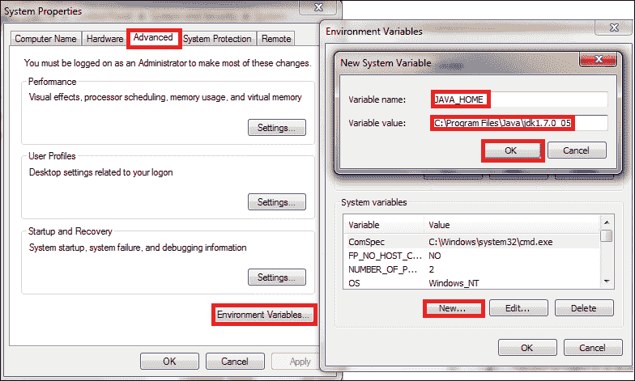

1.  在**系统变量**下，滚动到`PATH`（或`Path`）环境变量。在值的开头插入`%JAVA_HOME%\bin;`。如果不存在`PATH`或`Path`变量，创建一个新变量，其值为`%JAVA_HOME%\bin`。一路点击**确定**，关闭所有窗口。

1.  要验证 JDK 是否已正确安装和配置，请启动一个新的命令行控制台，并输入`javac -version`。如果 JDK 配置正确，你将在输出中得到 Java 版本。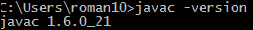

**Cygwin**是 Windows 上的一个类 Linux 环境，用于运行 Linux 上可用的软件。Android NDK 开发需要安装 Cygwin 1.7 或更高版本，以便执行某些 Linux 程序，例如 GNU make。

自 NDK r7 起，Windows NDK 附带了一个新的`ndk-build.cmd`构建脚本，该脚本使用 NDK 预构建的 GNU make、awk 和其他工具的二进制文件。因此，使用`ndk-build.cmd`构建 NDK 程序时不需要 Cygwin。但是，建议您仍然安装 Cygwin，因为`ndk-build.cmd`是一项实验性功能，调试脚本`ndk-gdb`仍然需要 Cygwin。

按照以下步骤安装 Cygwin：

1.  前往[`cygwin.com/install.html`](http://cygwin.com/install.html)下载 Cygwin 的`setup.exe`。下载完成后双击它以开始安装。

1.  点击**下一步**，然后选择**从互联网安装**。继续点击**下一步**，直到你看到**可用的下载站点**列表。选择离你位置最近的站点，然后点击**下一步**：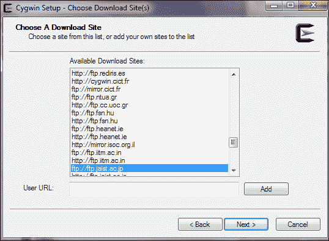

1.  在**开发**下查找 GNU **make**，确保它是 3.81 或更高版本，以及在**基础**下的**gawk**。或者，您也可以使用**搜索**框搜索 make 和 gawk。确保 GNU make 和 gawk 都被选中安装，然后点击**下一步**。安装可能需要一段时间才能完成：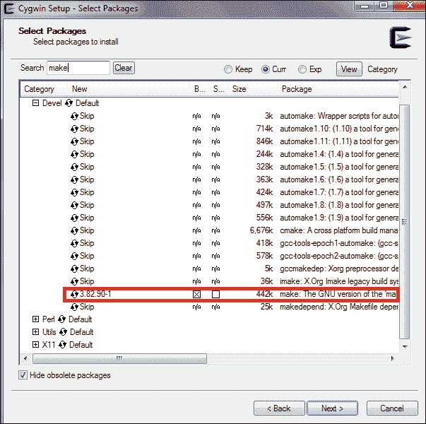

Eclipse 是一个功能强大的软件**集成开发环境**（**IDE**），具有可扩展的插件系统。它是开发 Android 应用的推荐 IDE。前往[`www.eclipse.org/downloads/`](http://www.eclipse.org/downloads/)，下载 Eclipse Classic 或适用于 Java 开发者的 Eclipse IDE。解压压缩文件后即可使用。请注意，Android 开发需要 Eclipse 3.6.2（Helios）或更高版本。

### 提示

Android 开发者网站在[`developer.android.com/sdk/index.html`](http://developer.android.com/sdk/index.html)提供了一个 Android Developer Tools 捆绑包。它包括带有 ADT 插件的 Eclipse IDE 和 Android SDK。我们可以下载这个捆绑包，并跳过以下*如何操作…*部分 1 到 10 步的 SDK 安装。

## 如何操作…

以下步骤将展示如何在 Windows 中设置 Android NDK 开发环境。我们首先将设置一个 SDK 开发环境。如果已经设置好了 SDK，可以跳过 1 到 10 步。

1.  启动 Eclipse。选择**帮助** | **安装新软件**，会弹出一个名为**安装**的窗口。

1.  点击位于右上角的**添加…**按钮，会弹出一个名为**添加仓库**的窗口。

1.  在**添加仓库**窗口中，为**名称**输入`ADT`，为**位置**输入[`dl-ssl.google.com/android/eclipse/`](https://dl-ssl.google.com/android/eclipse/)。然后点击**确定**。

1.  Eclipse 可能需要几秒钟从 ADT 网站加载软件项。加载后，选择**开发者工具**和**NDK 插件**，然后点击**下一步**继续操作：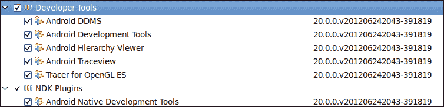

1.  在下一个窗口中，将显示要安装的工具列表。只需点击 **下一步**。阅读并接受所有许可协议，然后点击 **完成**。

1.  安装完成后，按照提示重启 **Eclipse**。

1.  从 [`developer.android.com/sdk/index.html`](http://developer.android.com/sdk/index.html) 下载 Android SDK。

1.  双击安装程序以开始安装。按照向导完成安装。

1.  在 Eclipse 中，选择 **窗口** | **首选项** 打开 **首选项** 窗口。从左侧面板中选择 **Android**，然后点击 **浏览** 以定位 Android SDK 根目录。点击 **应用**，然后点击 **确定**。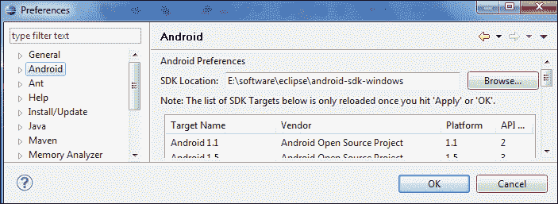

1.  在 Android SDK 安装根目录下启动 **Android SDK 管理器**。选择 **Android SDK 工具**，**Android SDK Platform-tools**，至少一个 Android 平台（最新版本为佳），**系统映像**，**SDK 示例** 和 **Android 支持**。然后点击 **安装**。在下一个窗口中，阅读并接受所有许可协议，然后点击 **安装**：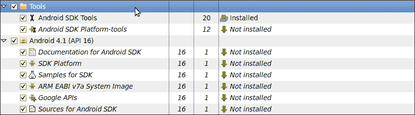

1.  访问 [`developer.android.com/tools/sdk/ndk/index.html`](http://developer.android.com/tools/sdk/ndk/index.html) 下载最新版本的 Android NDK。解压下载的文件。

    ### 提示

    **下载示例代码**

    您可以从您在 [`www.packtpub.com`](http://www.packtpub.com) 的账户中下载您购买的所有 Packt 图书的示例代码文件。如果您在别处购买了这本书，可以访问 [`www.packtpub.com/support`](http://www.packtpub.com/support) 注册，我们会直接将文件通过电子邮件发送给您。

1.  在`cygwin`根目录下打开`Cygwin.bat`文件。默认情况下，它包含以下内容：

    ```kt
    @echo off
    C:
    chdir C:\cygwin\bin
    bash --login -i
    ```

1.  在 `@echo off` 之后，`C` 之前添加以下内容：

    ```kt
    set IS_UNIX=
    set JAVA_HOME=<JDK path>
    set PATH=<SDK path>\tools;<NDK path>
    set ANDROID_NDK_ROOT=/cygdrive/<NDK path>
    ```

    作为一个例子，我的机器上的文件内容如下；注意 `Progra~1` 是 `Program Files` 文件夹的短名称：

    ```kt
    set IS_UNIX=set JAVA_HOME=c:/Progra~1/Java/jdk1.7.0_05
    set PATH=C:/Users/Administrator/AppData/Local/Android/android-sdk/tools;C:/Users/Administrator/Downloads/android-ndk-r8-windows/android-ndk-r8
    set ANDROID_NDK_ROOT=/cygdrive/c/Users/Administrator/Downloads/android-ndk-r8-windows/android-ndk-r8
    ```

1.  通过双击 `cygwin.bat` 启动 Cygwin，然后进入 NDK 中的 `samples/hello-jni` 目录。输入命令 `ndk-build`。如果构建成功，这证明 NDK 环境已正确设置：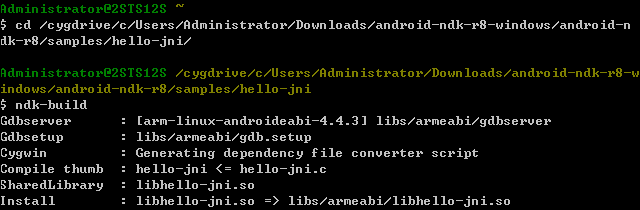

1.  在 Eclipse 中，选择 **窗口** | **首选项** 打开 **首选项** 窗口。从左侧面板中选择 **Android**，然后从下拉列表中选择 **NDK**。点击 **浏览** 以定位 Android NDK 根目录。点击 **确定** 关闭弹窗。这样我们就可以使用 Eclipse NDK 插件构建和调试 Android NDK 应用程序了：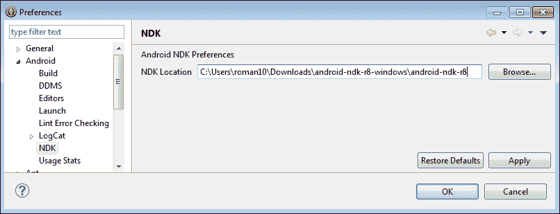

## 工作原理…

在本教程中，我们首先设置 Android SDK 开发环境，然后是 NDK 开发环境。

Android NDK 不需要安装。我们下载了 NDK，并配置了路径以便更方便地使用。

Android SDK 开发不需要 Cygwin，但对于 NDK 开发来说却是必不可少的，因为 NDK 使用了一些依赖 Cygwin 的 Linux 工具。

**ADT 中的 NDK 插件：**Eclipse 的 NDK 插件在**Android Development Tools** (**ADT**) 中可用，它使我们能够轻松构建和调试 Android NDK 应用程序。

### 提示

NDK 插件仅在 ADT 20.0.0 或更高版本中可用，该版本于 2012 年 6 月发布。您可能需要更新 Eclipse ADT 以使用 NDK 插件。

## 还有更多…

我们将 Eclipse IDE 作为开发环境的一部分安装。Eclipse 是开发 Android 应用程序推荐的 IDE，它附带了许多有用的工具和实用程序以帮助我们的开发。然而，它并非开发环境的必需要素。

# 在 Ubuntu Linux 中设置 Android NDK 开发环境

本文档描述如何在 Ubuntu Linux 中设置 Android NDK 开发环境。

## 准备工作

检查您的 Ubuntu 版本，确保它是 8.04 或更高版本。

需要 GNU C 库 (`glibc`) 2.7 或更高版本。它通常随 Linux 默认安装。有两种简单的方法可以检查 `glibc` 的版本：

1.  启动一个终端，并输入 `ldd --version`。这将打印出 `ldd` 和 `glibc` 的版本：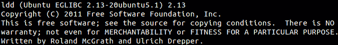

1.  我们可以将库作为应用程序执行。启动一个终端，找到库的位置，然后输入以下命令：

    ```kt
    <glibc library location>/<glibc library>. 

    ```

    将显示以下输出：

    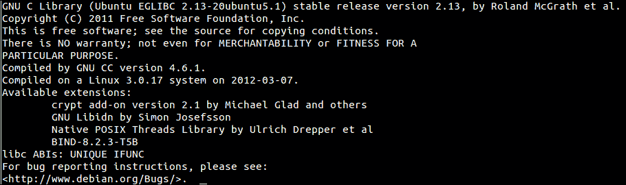

1.  如果我们使用的是 64 位机器，需要启用 32 位应用程序执行。启动一个终端，并输入以下命令：

    ```kt
    sudo apt-get install ia32-libs

    ```

1.  安装 JDK 6 或更高版本。在终端中，输入命令 `sudo apt-get install openjdk-6-jdk`，或者也可以输入 `sudo apt-get install sun-java6-jdk`。安装完成后，我们需要将 JDK 路径添加到 `PATH` 环境变量中，通过向 `~/.bashrc` 添加以下行来实现：

    ```kt
    export JDK_PATH=/usr/local/jdk1.7.0/bin
    export PATH=$PATH:$JDK_PATH
    ```

我们将使用 Eclipse 作为我们的 IDE。请参考在 Windows 中设置 Android NDK 开发环境的食谱获取指导。

## 如何操作…

以下步骤说明了在 Ubuntu Linux 上设置 Android NDK 开发环境的程序：

1.  按照在 Windows 中设置 Android NDK 开发环境的食谱中的步骤 1 到 6 来为 Eclipse 安装 ADT 插件。

1.  从[`developer.android.com/sdk/index.html`](http://developer.android.com/sdk/index.html)下载 Android SDK，然后解压下载的包。

1.  将以下行追加到 `~/.bashrc`：

    ```kt
    export ANDROID_SDK=<path to Android SDK directory>
    export PATH=$PATH:$ ANDROID_SDK/tools:$ANDROID_SDK/platform-tools
    ```

1.  按照在 Windows 中设置 Android NDK 开发环境的食谱中的步骤 9 和 10 来配置 Eclipse 中的 SDK 路径，并下载额外的包。

1.  从[`developer.android.com/tools/sdk/ndk/index.html`](http://developer.android.com/tools/sdk/ndk/index.html)下载最新的 Android NDK 版本，然后解压下载的文件。

1.  更改在第 3 步中添加到 `~/.bashrc` 的行：

    ```kt
    export ANDROID_SDK=<path to Android SDK directory>
    export ANDROID_NDK=<path to Android NDK directory> 
    export PATH=$PATH:$ANDROID_SDK/tools:$ANDROID_SDK/platform-tools:$ANDROID_NDK
    ```

1.  启动一个新的终端，然后进入 NDK 中的`samples/hello-jni`目录。输入命令`ndk-build`。如果构建成功，这证明 NDK 环境设置正确：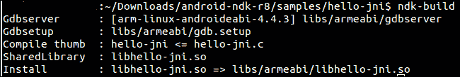

## 工作原理...

我们首先设置安卓 SDK，然后是安卓 NDK。确保路径设置正确，这样就可以在不引用 SDK 和 NDK 目录的情况下访问工具。

`.bashrc`文件是 bash shell 在启动新终端时读取的启动文件。export 命令将安卓 SDK 和 NDK 目录位置追加到环境变量`PATH`中。因此，每次新的 bash shell 启动时，都会正确设置 SDK 和 NDK 工具的`PATH`。

## 还有更多内容...

以下是一些关于设置 NDK 开发环境的额外技巧：

+   **在启动文件中配置路径**：我们在`~/.bashrc`文件中向`PATH`环境变量追加 SDK 和 NDK 的路径。这假设我们的 Linux 系统使用 bash shell。然而，如果你的系统使用其他 shell，所使用的启动文件可能会有所不同。一些常用 shell 的启动文件如下所示：

    +   对于 C shell (`csh`)，要使用的启动文件是`~/.cshrc`。

    +   对于`ksh`，要使用的启动文件可以通过命令`echo $ENV`获得。

    +   对于`sh`，要使用的启动文件是`~/.profile`。用户需要退出当前会话并重新登录，才能使其生效。

+   **切换 JDK**：在安卓开发中，我们可以使用 Oracle Java JDK 或 OpenJDK。如果我们遇到任何一个 JDK 的问题，如果我们安装了这两个 JDK，我们可以切换到另一个 Java JDK。

    +   要检查系统当前使用的 JDK，请使用以下命令：

        ```kt
         $update-java-alternatives -l

        ```

    +   要在两个 JDK 之间切换，请使用以下命令：

        ```kt
         $sudo update-java-alternatives -s <java name>

        ```

    下面是一个切换到 Oracle JDK 1.6.0 的例子：

    ```kt
    $sudo update-java-alternatives -s java-1.6.0-sun 

    ```

# 在 Mac OS 上设置安卓 NDK 开发环境

本文档介绍了如何在 Mac OS 上设置安卓 NDK 开发环境。

## 准备工作

安卓开发需要 Mac OS X 10.5.8 或更高版本，并且只在 x86 架构上运行。在开始之前，请确保你的机器满足这些要求。

注册一个 Apple 开发者账户，然后访问[`developer.apple.com/xcode/`](https://developer.apple.com/xcode/)下载 Xcode，其中包含许多开发工具，包括安卓 NDK 开发所需的`make`工具。下载完成后，运行安装包并确保选择安装**UNIX Development**选项。

与往常一样，需要 Java JDK 6 或更高版本。Mac OS X 通常会附带完整的 JDK。我们可以使用以下命令来验证你的机器是否拥有所需的版本：

```kt
$javac -version
```

## 如何操作...

在 Mac OS X 上设置安卓 NDK 开发环境与在 Ubuntu Linux 上设置类似。以下步骤说明我们如何进行操作：

1.  按照在 Windows 中设置 Android NDK 开发环境的*第 1 至 6 步*的食谱来安装 Eclipse 的 ADT 插件。

1.  从[`developer.android.com/sdk/index.html`](http://developer.android.com/sdk/index.html)下载 Android SDK，然后解压下载的包。

1.  将以下行追加到`~/.profile`。如果文件不存在，请创建一个新的。保存更改并退出当前会话：

    ```kt
    export ANDROID_SDK=<path to Android SDK directory>
    export PATH=$PATH:$ ANDROID_SDK/tools:$ANDROID_SDK/platform-tools
    ```

1.  在 Eclipse 中，选择**Eclipse** | **Preferences**打开**Preferences**窗口。从左侧面板中选择**Android**，然后点击**Browse**定位到 Android SDK 的根目录。点击**Apply**，然后点击**OK**。

1.  在终端中，通过在`tools`目录下输入命令`android`启动 Android SDK Manager。选择**Android SDK Tools**、**Android SDK Platform-tools**、至少一个 Android 平台（最好是最新版本）、**System Image**、**SDK Samples**和**Android Support**。然后点击**Install**。在下一个窗口中，阅读并接受所有许可协议，然后点击**Install**。

1.  从[`developer.android.com/sdk/index.html`](http://developer.android.com/sdk/index.html)下载 Android SDK，然后解压下载的包。

1.  更改你在第 3 步添加到`~/.profile`的行：

    ```kt
    export ANDROID_SDK=<path to Android SDK directory>
    export ANDROID_NDK=<path to Android NDK directory> 
    export PATH=$PATH:$ANDROID_SDK/tools:$ANDROID_SDK/platform-tools:$ANDROID_NDK
    ```

1.  启动一个新的终端，然后进入 NDK 中的`samples/hello-jni`目录。输入命令`ndk-build`。如果构建成功，这证明 NDK 环境设置正确。

## 工作原理…

在 Mac OS X 上设置 Android NDK 开发环境的步骤与 Ubuntu Linux 类似，因为它们都是类 Unix 操作系统。我们首先安装了 Android SDK，然后安装了 Android NDK。

# 更新 Android NDK

当 NDK 有新版本发布时，我们可能想要更新 NDK，以便利用新版本的新功能或错误修复。本食谱讲述如何在 Windows、Ubuntu Linux 和 Mac OS 中更新 Android NDK。

## 准备工作

根据你选择的平台，请阅读本章之前的食谱。

## 如何操作…

在 Windows 中，按照以下说明更新 Android NDK：

1.  访问[`developer.android.com/tools/sdk/ndk/index.html`](http://developer.android.com/tools/sdk/ndk/index.html)下载最新版本的 Android NDK。解压下载的文件。

1.  打开`cygwin`根目录下的`Cygwin.bat`。如果之前在系统上配置过 NDK，内容应该与以下代码片段类似：

    ```kt
    @echo off
    set IS_UNIX=
    set JAVA_HOME=<JDK path>
    set PATH=<SDK path>\tools;<NDK path>
    set ANDROID_NDK_ROOT=/cygdrive/<NDK path>
    C:
    chdir C:\cygwin\bin
    bash --login -i
    ```

1.  将`<NDK path>`从旧的 NDK 路径更新到新下载和解压的位置。

在 Ubuntu Linux 中，按照以下说明更新 Android NDK：

1.  从[`developer.android.com/tools/sdk/ndk/index.html`](http://developer.android.com/tools/sdk/ndk/index.html)下载最新版本的 Android NDK，然后解压下载的文件。

1.  如果我们遵循了*在 Ubuntu Linux 中设置 Android NDK 开发环境*的食谱，以下内容应该出现在`~/.bashrc`的末尾：

    ```kt
    export ANDROID_SDK=<path to Android SDK directory>
    export ANDROID_NDK=<path to Android NDK directory>
    export PATH=$PATH:$ANDROID_SDK/tools:$ANDROID_SDK/platform-tools:$ANDROID_NDK
    ```

1.  更新 `ANDROID_NDK` 路径到新下载并解压的 Android NDK 文件夹。

在 Mac OS 中，步骤几乎与 Ubuntu Linux 完全相同，除了我们需要将路径追加到 `~/.profile` 而不是 `~/.bashrc`。

## 工作原理…

通过简单下载并解压 NDK 文件，并正确配置路径，完成 NDK 安装。因此，更新 NDK 就像将配置的路径更新到新的 NDK 文件夹一样简单。

## 还有更多…

有时，更新 NDK 需要先更新 SDK。由于本书专注于 Android NDK，因此解释如何更新 SDK 超出了本书的范围。你可以访问 [`developer.android.com/sdk/index.html`](http://developer.android.com/sdk/index.html) 的 Android 开发者网站，了解如何操作的详细信息。

有时，由于兼容性问题，我们可能需要使用旧版本的 NDK 来构建某些应用程序。因此，保留多个版本的 Android NDK 并通过更改路径或在引用特定版本的 NDK 时使用完整路径之间切换可能很有用。

# 编写一个 Hello NDK 程序

环境设置好后，让我们开始编写 NDK 中的代码。本食谱将带你完成一个 Hello NDK 程序的编写。

## 准备就绪

在开始编写 Hello NDK 程序之前，需要正确设置 NDK 开发环境。请根据你选择的平台参考本章前面的内容。

## 如何操作…

按照以下步骤编写、编译并运行 Hello NDK 程序：

1.  启动 Eclipse，选择 **文件** | **新建** | **Android 项目**。将 `HelloNDK` 作为 **项目名称** 的值。选择 **在 workspace 中创建新项目**。然后点击 **下一步**：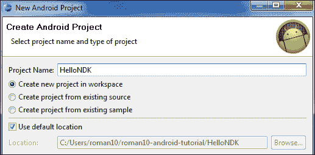

1.  在下一个窗口中，选择你想要定位的 Android 版本。通常推荐使用最新版本。然后点击 **下一步**。

1.  在下一个窗口中，将你的包名指定为 `cookbook.chapter1`。勾选 **创建 Activity** 的复选框，并将名称指定为 `HelloNDKActivity`。将 **最低 SDK** 的值设置为 `5 (Android 2.0)`。点击 **完成**：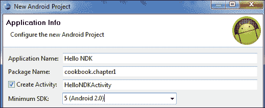

1.  在 Eclipse 包资源管理器中，右键点击 `HelloNDK` 项目，选择 **新建** | **文件夹**。在弹出的窗口中输入名称 `jni`，然后点击 **完成**：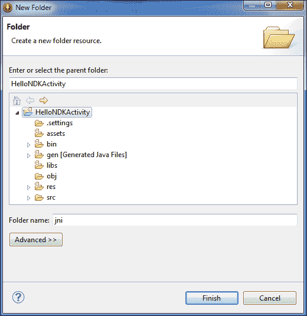

1.  在 `HelloNDK` 项目下新创建的 `jni` 文件夹上右键点击。选择 **新建** | **文件**，输入 `hello.c` 作为 **文件名** 的值，然后点击 **完成**。在 `hello.c` 文件中输入以下代码：

    ```kt
    #include <string.h>
    #include <jni.h>

    jstring 
    Java_cookbook_chapter1_HelloNDKActivity_naGetHelloNDKStr(JNIEnv* pEnv,  jobject pObj)
    {
        return (*pEnv)->NewStringUTF(pEnv, "Hello NDK!");
    }
    ```

1.  在 `jni` 文件夹上右键点击。选择 **新建** | **文件**，输入 `Android.mk` 作为 **文件名** 的值，然后点击 **完成**。在 `Android.mk` 文件中输入以下代码：

    ```kt
    LOCAL_PATH := $(call my-dir)
    include $(CLEAR_VARS)
    LOCAL_MODULE    := hello
    LOCAL_SRC_FILES := hello.c
    include $(BUILD_SHARED_LIBRARY)
    ```

1.  启动终端，进入 `jni` 文件夹，并输入 `ndk-build` 以构建 `hello.c` 程序为本地库。

1.  编辑 `HelloNDKActivity.java` 文件。该文件应包含以下内容：

    ```kt
    public class HelloNDKActivity extends Activity {
        @Override
        public void onCreate(Bundle savedInstanceState) {
            super.onCreate(savedInstanceState);
            TextView tv = new TextView(this);
            tv.setTextSize(30);
            tv.setText(naGetHelloNDKStr());
            this.setContentView(tv);
        }
        public native String naGetHelloNDKStr();
        static {
            System.loadLibrary("hello");
        }
    }
    ```

1.  在 Eclipse 中右键点击`HelloNDK`项目。选择**运行方式** | **Android 应用程序**。你的 Android 手机或模拟器将显示类似于以下截图的内容：

## 工作原理…

本文档展示了如何在 Android 上编写一个 Hello NDK 程序。

+   **原生代码**：Hello NDK 程序由原生 C 代码和 Java 代码组成。原生函数`naGetHelloNDKStr`将`Hello NDK`字符串返回给调用者，这一点在原生代码函数定义和 Java 代码方法声明中都有体现。原生函数名称必须遵循特定的模式，包括包名、类名和方法名。包和类名必须与调用原生方法的 Java 类的包和类名一致，而方法名必须与该 Java 类中声明的方法名相同。

    这有助于 Dalvik VM 在运行时定位原生函数。如果不遵循该规则，将在运行时导致`UnsatisfiedLinkError`。

    原生函数有两个参数，这是所有原生函数的标准。可以根据需要定义额外的参数。第一个参数是指向`JNIEnv`的指针，这是访问各种 JNI 函数的门户。第二个参数的含义取决于原生方法是静态方法还是实例方法。如果是静态方法，第二个参数是对定义方法的类的引用。如果是实例方法，第二个参数是对调用原生方法的对象的引用。我们将在第二章，*Java Native Interface*中详细讨论 JNI。

+   **原生代码编译**：Android NDK 构建系统让开发者无需编写`makefile`。该构建系统接受一个`Android.mk`文件，该文件简单描述了源代码。它会解析该文件以生成`makefile`，并为我们完成所有繁重的工作。

    我们将在第三章，*构建和调试 NDK 应用程序*中详细介绍如何编写`Android.mk`文件，甚至编写我们自己的`makefile`。

    一旦我们编译了原生代码，项目下将会创建一个名为`libs`的文件夹，并在`armeabi`子目录下生成一个`libhello.so`库。

+   **Java 代码**：调用原生方法遵循三个步骤：

    1.  **加载原生库**：这是通过调用`System.loadLibrary("hello")`完成的。请注意，我们应该使用`hello`而不是`libhello`。如果指定了`libhello`，Dalvik VM 将无法定位库。

    1.  **声明方法**：我们使用 native 关键字声明方法，以指示它是一个原生方法。

    1.  **调用方法**：我们像调用任何普通的 Java 方法一样调用该方法。

## 还有更多内容...

原生方法的名称较长，手动编写容易出错。幸运的是，JDK 中的`javah`程序可以帮助我们生成包含方法名称的头文件。要使用`javah`，应遵循以下步骤：

1.  编写 Java 代码，包括原生方法定义。

1.  编译 Java 代码，并确保类文件出现在我们项目的`bin/classes`/文件夹下。

1.  打开一个终端，进入`jni`文件夹，并输入以下命令：

    ```kt
    $ javah -classpath ../bin/classes –o <output file name> <java package name>.<java class anme>

    ```

    在我们的`HelloNDK`示例中，命令应如下所示：

    ```kt
    $ javah -classpath ../bin/classes –o hello.h cookbook.chapter1.HelloNDKActivity

    ```

    这将生成一个名为`hello.h`的文件，其函数定义如下：

    ```kt
    JNIEXPORT jstring JNICALL Java_cookbook_chapter1_HelloNDKActivity_naGetHelloNDKStr
      (JNIEnv *, jobject);
    ```
