# 第二章：Java Native Interface

在本章中，我们将介绍以下食谱：

+   加载原生库和注册原生方法

+   使用基本类型传递参数和接收返回值

+   在 JNI 中操作字符串

+   在 JNI 中管理引用

+   在 JNI 中操作类

+   在 JNI 中操作对象

+   在 JNI 中操作数组

+   在原生代码中访问 Java 的静态字段和实例字段

+   在原生代码中调用静态方法和实例方法

+   缓存 jfieldID、jmethodID 和引用数据以提高性能

+   在 JNI 中检查错误和处理异常

+   在 JNI 中集成汇编代码

# 介绍

使用 Android NDK 编程本质上是同时用 Java 和 C、C++、汇编等原生语言编写代码。Java 代码在 Dalvik **虚拟机** (**VM**) 上运行，而原生代码编译为直接在操作系统上运行的二进制文件。**Java Native Interface** (**JNI**) 像一座桥梁，将这两个世界连接起来。Java 代码、Dalvik VM、原生代码和 Android 系统之间的关系可以用以下图表来说明：

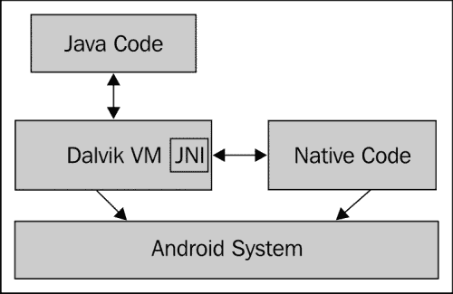

图表中的箭头表示哪个方面发起交互。**Dalvik VM** 和 **原生代码** 都在 **Android 系统** 之上运行（Android 是基于 Linux 的操作系统）。它们需要系统提供执行环境。**JNI** 是 **Dalvik VM** 的一部分，它允许 **原生代码** 访问 Java 代码的字段和方法。**JNI** 还允许 **Java 代码** 调用 **原生代码** 中实现的原生方法。因此，**JNI** 促进了 **原生代码** 与 **Java 代码** 之间的双向通信。

如果你熟悉 Java 编程以及 C 或 C++或汇编编程，那么学习使用 Android NDK 编程主要是学习 JNI。JNI 包含基本类型和引用类型。这些数据类型在 Java 中有相应的映射数据类型。操作基本类型通常可以直接进行，因为一个数据类型通常等同于一个原生的 C/C++数据类型。然而，引用数据操作通常需要借助预定义的 JNI 函数。

在本章中，我们首先介绍 JNI 中的各种数据类型，并演示如何从 Java 调用原生方法。然后描述如何从原生代码访问 Java 字段和调用 Java 方法。最后，我们将讨论如何缓存数据以实现更好的性能，如何处理错误和异常，以及如何在原生方法实现中使用汇编。

本章节的每个食谱都附带一个示例 Android 项目，展示了主题及相关 JNI 函数。由于篇幅限制，书中无法列出所有源代码。代码是本章非常重要的部分，强烈建议你在阅读食谱时下载源代码并参考。

### 提示

JNI 是一个复杂的话题，我们尝试在 Android NDK 编程的背景下覆盖它最基本的部分。然而，一个章节并不足以提供所有的细节。读者可能需要参考 Java JNI 规范，在[`docs.oracle.com/javase/6/docs/technotes/guides/jni/`](http://docs.oracle.com/javase/6/docs/technotes/guides/jni/)或者《Java Native Interface: Programmer's Guide and Specification》一书，在[`java.sun.com/docs/books/jni/`](http://java.sun.com/docs/books/jni/)中查找更多信息。对于 Android 特定的信息，你可以参考 JNI 小贴士，在[`developer.android.com/guide/practices/jni.html`](https://developer.android.com/guide/practices/jni.html)。

# 加载本地库和注册本地方法

本地代码通常被编译成共享库，并在本地方法被调用之前加载。这个食谱涵盖了如何加载本地库和注册本地方法。

## 准备就绪

如果还没有这样做，请阅读 第一章，*Hello NDK* 的食谱，以设置 Android NDK 开发环境。

## 如何操作…

以下步骤将向你展示如何构建一个演示加载本地库和注册本地方法的 Android 应用程序：

1.  启动 Eclipse，选择 **文件** | **新建** | **Android 项目**。将 **项目名称** 的值设置为 `NativeMethodsRegister`。选择 **在工作区中创建新项目**。然后点击 **下一步**。

1.  在下一个窗口中，选择最新的 Android SDK 版本，然后点击 **下一步** 进入下一个窗口。

1.  将包名指定为 `cookbook.chapter2`。选中 **创建活动** 复选框，并将名称指定为 `NativeMethodsRegisterActivity`。将 **最低 SDK** 的值设置为 **5 (Android 2.0)**。然后点击 **完成**。

1.  在 **Eclipse 包浏览器** 中，右键点击 `NativeMethodsRegister` 项目，然后选择 **新建** | **文件夹**。在弹出的窗口中输入名称 `jni`，然后点击 **完成**。

1.  在 `NativeMethodsRegister` 项目下新创建的 `jni` 文件夹上右键点击，然后选择 **新建** | **文件**。将 **文件名** 的值设置为 `nativetest.c`，然后点击 **完成**。

1.  将以下代码添加到 `nativetest.c` 文件中：

    ```kt
    #include <android/log.h>
    #include <stdio.h>

    jint NativeAddition(JNIEnv *pEnv, jobject pObj, jint pa, jint pb) {
      return pa+pb;
    }

    jint NativeMultiplication(JNIEnv *pEnv, jobject pObj, jint pa, jint pb) {
      return pa*pb;
    }

    JNIEXPORT jint JNICALL JNI_OnLoad(JavaVM* pVm, void* reserved)
    {
        JNIEnv* env;
        if ((*pVm)->GetEnv(pVm, (void **)&env, JNI_VERSION_1_6)) {
         return -1;
      }
        JNINativeMethod nm[2];
        nm[0].name = "NativeAddition";
        nm[0].signature = "(II)I";
        nm[0].fnPtr = NativeAddition;
        nm[1].name = "NativeMultiplication";
        nm[1].signature = "(II)I";
        nm[1].fnPtr = NativeMultiplication;
        jclass cls = (*env)->FindClass(env, "cookbook/chapter2/NativeMethodRegisterActivity");
        // Register methods with env->RegisterNatives.
        (*env)->RegisterNatives(env, cls, nm, 2);
        return JNI_VERSION_1_6;
    }
    ```

1.  向 `NativeMethodRegisterActivity.java` 添加以下代码以加载本地共享库并定义本地方法：

    ```kt
    public class NativeMethodRegisterActivity extends Activity {
        … …
          private void callNativeMethods() {
            int a = 10, b = 100;
              int c = NativeAddition(a, b);
              tv.setText(a + "+" + b + "=" + c);
              c = NativeMultiplication(a, b);
              tv.append("\n" + a + "x" + b + "=" + c);
          }
          private native int NativeAddition(int a, int b);
          private native int NativeMultiplication(int a, int b);
          static {
            //use either of the two methods below
    //System.loadLibrary("NativeRegister");
              System.load("/data/data/cookbook.chapter2/lib/libNativeRegister.so");
          }
    }
    ```

1.  修改 `res/layout/activity_native_method_register.xml` 文件中的 `TextView`，如下所示：

    ```kt
    <TextView
            android:id="@+id/display_res"
            android:layout_width="wrap_content"
            android:layout_height="wrap_content"
            android:layout_centerHorizontal="true"
            android:padding="@dimen/padding_medium"
            android:text="@string/hello_world"
            tools:context=".NativeMethodRegisterActivity" />
    ```

1.  在 `jni` 文件夹下创建一个名为 `Android.mk` 的文件，内容如下：

    ```kt
    LOCAL_PATH := $(call my-dir)
    include $(CLEAR_VARS)
    LOCAL_MODULE    := NativeRegister
    LOCAL_SRC_FILES := nativetest.c
    LOCAL_LDLIBS := -llog
    include $(BUILD_SHARED_LIBRARY)
    ```

1.  启动终端，进入项目的 `jni` 文件夹，并输入 `ndk-build` 以构建本地库。

1.  在 Android 设备或模拟器上运行项目。你应该会看到类似于以下截图的内容：

## 工作原理…

这个食谱描述了如何加载本地库和注册本地方法：

+   **加载本地库**：`java.lang.System`类提供了两种加载本地库的方法，即`loadLibrary`和`load`。`loadLibrary`接受不带前缀和文件扩展名的库名。例如，如果我们想要加载在示例项目中编译为`libNativeRegister.so`的 Android 本地库，我们使用`System.loadLibrary("NativeRegister")`。`System.load`方法不同，它需要本地库的完整路径。在我们的示例项目中，我们可以使用`System.load("/data/data/cookbook.chapter2/lib/libNativeRegister.so")`来加载本地库。当我们想要在不同版本的本地库之间切换时，`System.load`方法很有用，因为它允许我们指定完整的库路径。

    我们在`NativeMethodRegisterActivity.java`类的静态初始化器中演示了这两种方法的用法。请注意，在构建和运行示例应用程序时，只应启用一种方法。

+   **JNIEnv 接口指针**：在 JNI 中，本地代码中定义的每个本地方法都必须接受两个输入参数，第一个是指向`JNIEnv`的指针。`JNIEnv`接口指针指向线程局部数据，进而指向所有线程共享的 JNI 函数表。以下图可以说明这一点：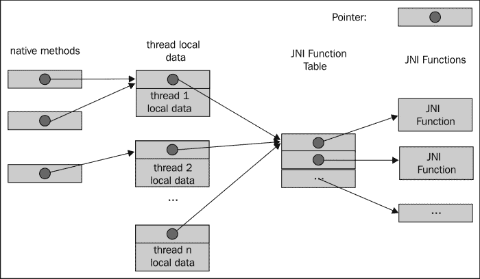

    `JNIEnv`接口指针是访问所有预定义 JNI 函数的网关，包括使本地代码能够处理 Java 对象、访问 Java 字段、调用 Java 方法的函数等。我们接下来将要讨论的`RegisterNatives`本地函数也是其中之一。

    ### 提示

    `JNIEnv`接口指针指向线程局部数据，因此不能在多个线程之间共享。此外，`JNIEnv`仅可由 Java 线程访问。本地线程必须调用 JNI 函数`AttachCurrentThread`将自己附加到虚拟机，以获取`JNIEnv`接口指针。我们将在本章的*在 JNI 中操作类*的菜谱中看到一个例子。

+   **注册本地方法**：如果本地方法实现的函数名遵循第一章中提到的特定命名约定，JNI 可以自动发现本地方法实现。这不是唯一的方法。在我们的示例项目中，我们显式调用了`RegisterNatives` JNI 函数来注册本地方法。`RegisterNatives`函数具有以下原型：

    ```kt
    jint RegisterNatives(JNIEnv *env, jclass clazz, const JNINativeMethod *methods, jint nMethods);
    ```

    `clazz`参数是对注册本地方法的类的引用。`methods`参数是`JNINativeMethod`数据结构的数组。`JNINativeMethod`定义如下：

    ```kt
    typedef struct {
      char *name;
      char *signature;
      void *fnPtr;
    } JNINativeMethod;
    ```

    `name`表示本地方法名称，`signature`是方法的输入参数数据类型和返回值数据类型的描述符，`fnPtr`是指向本地方法的函数指针。`RegisterNatives`的最后一个参数`nMethods`表示要注册的方法数量。函数返回零表示成功，否则返回负值。

    `RegisterNatives`方便注册不同类的本地方法实现。此外，它还可以简化本地方法名称，以避免粗心大意。

    使用`RegisterNatives`的典型方式是在`JNI_OnLoad`方法中，如下面的模板所示。当加载本地库时，会调用`JNI_OnLoad`，因此我们可以确保在调用本地方法之前注册它们：

    ```kt
    JNIEXPORT jint JNICALL JNI_OnLoad(JavaVM* pVm, void* reserved)
    {
        JNIEnv* env;
        if ((*pVm)->GetEnv(pVm, (void **)&env, JNI_VERSION_1_6)) {
        return -1;
      }

      // Get jclass with env->FindClass.
      // Register methods with env->RegisterNatives.

      return JNI_VERSION_1_6;
    }
    ```

我们在示例代码的`JNI_OnLoad`方法中演示了前面模板的使用，在那里我们注册了两个本地方法，分别用于对两个输入整数进行加法和乘法。前面显示的执行结果证明 Java 代码可以成功调用这两个注册的本地方法。

请注意，此示例使用了一些 JNI 功能，我们将在后面的菜谱中介绍，包括`FindClass`函数和字段描述符。如果目前你不完全理解代码，这是正常的。在学习了这些主题后，你可以随时回来复习。

# 以原始类型传递参数和接收返回值

Java 代码可以将参数传递给本地方法，并接收返回的处理结果。这个菜谱将介绍如何以原始类型传递参数和接收返回值。

## 准备工作

在阅读这个菜谱之前，你应该至少构建过一个带有本地代码的 Android 应用程序。如果你还没有这样做，请先阅读第一章中的*编写 Hello NDK 程序*菜谱，*Hello NDK*。

## 如何操作…

以下步骤将创建一个示例 Android 应用程序，其中本地方法接收来自 Java 代码的输入参数，并返回处理结果：

1.  创建一个名为`PassingPrimitive`的项目。将包名设置为`cookbook.chapter2`。创建一个名为`PassingPrimitiveActivity`的活动。在此项目下，创建一个名为`jni`的文件夹。如果你需要更详细的说明，请参考本章中的*加载本地库和注册本地方法*菜谱。

1.  在`jni`文件夹下添加一个名为`primitive.c`的文件，并实现本地方法。在我们的示例项目中，我们为八种原始数据类型中的每一种都实现了一个本地方法。以下是`jboolean`、`jint`和`jdouble`的代码。请参考下载的代码以获取完整的方法列表：

    ```kt
    #include <jni.h>
    #include <android/log.h>

    JNIEXPORT jboolean JNICALL Java_cookbook_chapter2_PassingPrimitiveActivity_passBooleanReturnBoolean(JNIEnv *pEnv, jobject pObj, jboolean pBooleanP){
      __android_log_print(ANDROID_LOG_INFO, "native", "%d in %d bytes", pBooleanP, sizeof(jboolean));
      return (!pBooleanP);
    }

    JNIEXPORT jint JNICALL Java_cookbook_chapter2_PassingPrimitiveActivity_passIntReturnInt(JNIEnv *pEnv, jobject pObj, jint pIntP) {
      __android_log_print(ANDROID_LOG_INFO, "native", "%d in %d bytes", pIntP, sizeof(jint));
      return pIntP + 1;
    }

    JNIEXPORT jdouble JNICALL Java_cookbook_chapter2_PassingPrimitiveActivity_passDoubleReturnDouble(JNIEnv *pEnv, jobject pObj, jdouble pDoubleP) {
      __android_log_print(ANDROID_LOG_INFO, "native", "%f in %d bytes", pDoubleP, sizeof(jdouble));
      return pDoubleP + 0.5;
    }
    ```

1.  在`PassingPrimitiveActivity.java` Java 代码中，我们添加了加载本地库、声明本地方法并调用本地方法的代码。以下是代码的部分内容。"`…`"表示未显示的部分。请参考从网站下载的源文件以获取完整代码：

    ```kt
    @Override
        public void onCreate(Bundle savedInstanceState) {
            super.onCreate(savedInstanceState);
            setContentView(R.layout.activity_passing_primitive);
            StringBuilder strBuilder = new StringBuilder();
            strBuilder.append("boolean: ").append(passBooleanReturnBoolean(false)).append(System.getProperty("line.separator"))
             ......

              .append("double: ").append(passDoubleReturnDouble(11.11)).append(System.getProperty("line.separator"));
            TextView tv = (TextView) findViewById(R.id.display_res);
            tv.setText(strBuilder.toString());
        }
        private native boolean passBooleanReturnBoolean(boolean p);
        private native byte passByteReturnByte(byte p);
        private native char passCharReturnChar(char p);
        private native short passShortReturnShort(short p);
        ......
        static {
            System.loadLibrary("PassingPrimitive");
        }
    ```

1.  根据本章的“加载本地库和注册本地方法”的步骤 8 或下载的项目代码，修改`res/layout/activity_passing_primitive.xml`文件。

1.  在`jni`文件夹下创建一个名为`Android.mk`的文件，并向其中添加以下内容：

    ```kt
    LOCAL_PATH := $(call my-dir)
    include $(CLEAR_VARS)
    LOCAL_MODULE    := PassingPrimitive
    LOCAL_SRC_FILES := primitive.c
    LOCAL_LDLIBS := -llog
    include $(BUILD_SHARED_LIBRARY)
    ```

1.  启动终端，进入`jni`文件夹，并输入`ndk-build`以构建本地库`PassingPrimitive`。

1.  在 Eclipse 中，选择**窗口** | **显示视图** | **LogCat**以显示 logcat 控制台。或者，启动终端并在终端中输入以下命令以在终端上显示`logcat`输出：

    ```kt
    $adb logcat -v time
    ```

1.  在 Android 设备或模拟器上运行项目。你应该会看到类似以下截图的内容：

    logcat 输出如下：

    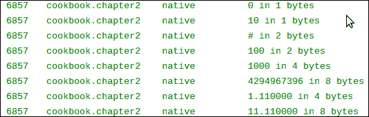

## 工作原理…

代码说明了如何从本地方法中以基本类型传递参数和接收返回值。我们为每种基本类型创建了一个方法。在本地代码中，我们将接收到的值打印到`logcat`，修改了值，并将其返回。

+   **JNI 基本类型与 Java 基本类型映射**：JNI 和 Java 中的基本类型有以下映射：

    | Java 类型 | JNI 类型 | 字节数 | 符号 |
    | --- | --- | --- | --- |
    | `boolean` | `jboolean` | 1 | 无符号 |
    | `byte` | `jbyte` | 1 | 有符号 |
    | `char` | `jchar` | 2 | 无符号 |
    | `short` | `jshort` | 2 | 有符号 |
    | `int` | `jint` | 4 | 有符号 |
    | `long` | `jlong` | 8 | 有符号 |
    | `float` | `jfloat` | 4 | - |
    | `double` | `jdouble` | 8 | - |

    请注意，Java 中的`char`和 JNI 中的`jchar`都是两个字节，而 C/C++中的`char`类型只有一个字节长。实际上，在 JNI 编程中，C/C++的`char`可以与`jbyte`互换，而不是`jchar`。

+   **Android 日志库**：我们通过以下代码在本地方法中使用 Android 日志系统输出接收到的值：

    ```kt
    __android_log_print(ANDROID_LOG_INFO, LOG_TAG, __VA_ARGS__);
    ```

    `ANDROID_LOG_INFO`是在`android/log.h`中定义的`enum`值，表示我们正在使用信息级别的日志。`LOG_TAG`可以是任何字符串，`__VA_ARGS__`被传递给 API 的参数替换，格式类似于 C 中的`printf`方法。

    我们必须在本地代码中包含`android/log.h`头文件以使用日志功能：

    ```kt
    #include <android/log.h>
    ```

    此外，为了使用 API，我们还需要在`Android.mk`文件中包含 NDK 日志库：

    ```kt
    LOCAL_LDLIBS := -llog
    ```

我们将在第三章中详细介绍 Android 日志 API 的更多细节，同时利用日志 API 进行调试。

# 在 JNI 中操作字符串

在 JNI 中，字符串有点复杂，主要是因为 Java 字符串和 C 字符串在内部表示上是不同的。本指南将涵盖最常使用的 JNI 字符串特性。

## 准备就绪

了解编码的基础知识对于理解 Java 字符串和 C 字符串之间的区别至关重要。我们将简要介绍 Unicode。

根据统一码联盟的定义，统一码标准如下所述：

> *统一码标准是一个字符编码系统，旨在支持现代世界各种语言和技术学科书面文本的全球交换、处理和显示。此外，它还支持许多书面语言的古典和历史文本。*

Unicode 为其定义的每个字符分配了一个唯一的数字，称为**码点**。主要有两类编码方法支持整个 Unicode 字符集或其子集。

第一种是**统一码转换格式**（**UTF**），它将统一码码点编码为不同数量的代码值。UTF-8、UTF-16、UTF-32 及其他几种格式都属于这一类。数字 8、16 和 32 指的是一个代码值的位数。第二种是**通用字符集**（**UCS**）编码，它将统一码码点编码为一个单一的代码值。UCS2 和 UCS4 属于这一类。数字 2 和 4 指的是一个代码值的字节数。

### 注意

Unicode 定义的字符比两个字节能表示的要多，因此 UCS2 只能表示 Unicode 字符的一个子集。由于 Unicode 定义的字符比四个字节能表示的要少，UTF-32 的多个代码值从未被需要。因此，UTF-32 和 UCS4 在功能上是相同的。

Java 编程语言使用 UTF-16 来表示字符串。如果一个字符无法适应 16 位的代码值，就会使用一对名为**代理对**的代码值。C 字符串只是一个以空字符终止的字节数组。实际的编码/解码几乎完全由开发人员和底层系统来处理。JNI 使用修改后的 UTF-8 版本来表示字符串，包括本地代码中的类、字段和方法名称。修改后的 UTF-8 与标准 UTF-8 有两个区别。首先，空字符使用两个字节进行编码。其次，JNI 只支持标准 UTF-8 的一字节、两字节和三字节的格式，而较长的格式无法被正确识别。JNI 使用自己的格式来表示无法适应三个字节的 Unicode。

## 如何操作

以下步骤将指导您如何创建一个示例 Android 项目，该项目展示了 JNI 中的字符串操作：

1.  创建一个名为`StringManipulation`的项目。将包名设置为`cookbook.chapter2`。创建一个名为`StringManipulationActivity`的活动。在项目下，创建一个名为`jni`的文件夹。如果你需要更详细的说明，请参考本章中的*加载本地库和注册本地方法*的菜谱。

1.  在`jni`文件夹下创建一个名为`stringtest.c`的文件，然后按照以下方式实现`passStringReturnString`方法：

    ```kt
    JNIEXPORT jstring JNICALL Java_cookbook_chapter2_StringManipulationActivity_passStringReturnString(JNIEnv *pEnv, jobject pObj, jstring pStringP){

        __android_log_print(ANDROID_LOG_INFO, "native", "print jstring: %s", pStringP);
      const jbyte *str;
      jboolean *isCopy;
      str = (*pEnv)->GetStringUTFChars(pEnv, pStringP, isCopy);
      __android_log_print(ANDROID_LOG_INFO, "native", "print UTF-8 string: %s, %d", str, isCopy);

        jsize length = (*pEnv)->GetStringUTFLength(pEnv, pStringP);
      __android_log_print(ANDROID_LOG_INFO, "native", "UTF-8 string length (number of bytes): %d == %d", length, strlen(str));
      __android_log_print(ANDROID_LOG_INFO, "native", "UTF-8 string ends with: %d %d", str[length], str[length+1]);
      (*pEnv)->ReleaseStringUTFChars(pEnv, pStringP, str);

      char nativeStr[100];
      (*pEnv)->GetStringUTFRegion(pEnv, pStringP, 0, length, nativeStr);
      __android_log_print(ANDROID_LOG_INFO, "native", "jstring converted to UTF-8 string and copied to native buffer: %s", nativeStr);

      const char* newStr = "hello 安卓";
      jstring ret = (*pEnv)->NewStringUTF(pEnv, newStr);
      jsize newStrLen = (*pEnv)->GetStringUTFLength(pEnv, ret);
      __android_log_print(ANDROID_LOG_INFO, "native", "UTF-8 string with Chinese characters: %s, string length (number of bytes) %d=%d", newStr, newStrLen, strlen(newStr));
      return ret;
    }
    ```

1.  在`StringManipulationActivity.java`的 Java 代码中，添加加载本地库、声明本地方法并调用本地方法的代码。源代码详情请参考下载的代码。

1.  根据本章中*加载本地库和注册本地方法*的步骤 8 或下载的项目代码，修改`res/layout/activity_passing_primitive.xml`文件。

1.  在`jni`文件夹下创建一个名为`Android.mk`的文件。具体细节请参考本章中*加载本地库和注册本地方法*的步骤 9 或下载的代码。

1.  启动终端，进入`jni`文件夹，并输入`ndk-build`以构建本地库。

1.  在 Android 设备或模拟器上运行项目。我们应该看到类似于以下截图的内容：

    在 logcat 输出中应该看到以下内容：

    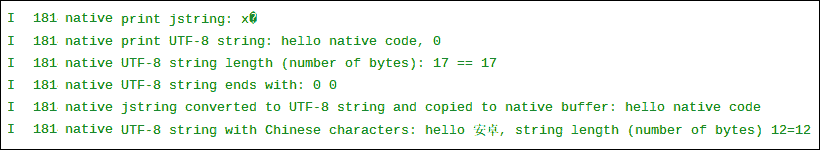

## 工作原理…

本菜谱讨论了 JNI 中的字符串操作。

+   **字符编码**：Android 使用 UTF-8 作为其默认字符集，通过执行`Charset.defaultCharset().name()`方法在我们的程序中显示。这意味着在本地代码中的默认编码是 UTF-8。如前所述，Java 使用 UTF-16 字符集。这意味着当我们从 Java 传递字符串到本地代码，反之亦然时，需要进行编码转换。如果不这样做，会导致不想要的结果。在我们的例子中，我们尝试在本地代码中直接打印`jstring`，但结果是一些无法识别的字符。

    幸运的是，JNI 附带了一些预定义的函数来进行转换。

+   **Java 字符串到本地字符串**：当本地方法被调用并带有字符串类型的输入参数时，首先需要将接收到的字符串转换为本地字符串。对于不同的情况可以使用两个 JNI 函数。

    第一个函数是`GetStringUTFChars`，其原型如下：

    ```kt
    const jbyte * GetStringUTFChars(JNIEnv *env, jstring string, jboolean *isCopy);
    ```

    这个函数将 Java 字符串转换为 UTF-8 字符数组。如果创建了 Java 字符串内容的新副本，当函数返回时`isCopy`被设置为`true`；否则`isCopy`被设置为`false`，返回的指针指向与原始 Java 字符串相同的字符。

    ### 提示

    我们无法预测虚拟机是否会返回 Java 字符串的新副本。因此，在转换大字符串时我们必须小心，因为可能的内存分配和复制可能会影响性能，甚至可能导致“内存不足”的问题。还要注意，如果将`isCopy`设置为`false`，我们不能修改返回的 UTF-8 本地字符串，因为这会修改 Java 字符串内容，破坏 Java 字符串的不可变性属性。

    当我们完成了所有转换后的本地字符串的操作后，应该调用`ReleaseStringUTFChars`来通知虚拟机我们不再需要访问 UTF-8 本地字符串了。该函数的原型如下，第二个参数是 Java 字符串，第三个参数是 UTF-8 本地字符串：

    ```kt
    void ReleaseStringUTFChars(JNIEnv *env, jstring string, const char *utf);
    ```

    第二个转换函数是`GetStringUTFRegion`，其原型如下：

    ```kt
    void GetStringUTFRegion(JNIEnv *env, jstring str, jsize start, jsize len, char *buf);
    ```

    `start`和`len`参数表示 Java UTF-16 字符串的起始位置和需要转换的 UTF-16 字符数量。`buf`参数指向存储转换后的本地 UTF-8 字符数组的位置。

    让我们比较一下这两种方法。第一种方法可能需要也可能不需要为转换后的 UTF-8 字符串分配新内存，这取决于虚拟机是否决定创建新副本；而第二种方法使用了预分配的缓冲区来存储转换后的内容。此外，第二种方法允许我们指定转换源的位置和长度。因此，可以遵循以下规则：

    +   要修改转换后的 UTF-8 本地字符串，应该使用 JNI 方法`GetStringUTFRegion`。

    +   如果我们只需要原始 Java 字符串的一个子串，并且这个子串不大，应该使用`GetStringUTFRegion`。

    +   如果我们处理的是一个大字符串，并且我们不打算修改转换后的 UTF-8 本地字符串，应该使用`GetStringUTFChars`。

        ### 提示

        在我们的示例中，调用`GetStringUTFRegion`函数时使用了固定长度的缓冲区。我们应该确保它足以容纳字符串，否则应该使用动态分配的数组。

+   **字符串长度**：可以使用 JNI 函数`GetStringUTFLength`来获取 UTF-8 编码的`jstring`的字符串长度。注意，它返回的是字节数量，而不是 UTF-8 字符的数量，正如我们的示例所示。

+   **本地字符串到 Java 字符串**：有时我们也需要从本地代码向 Java 代码返回字符串数据。返回的字符串应该是 UTF-16 编码的。JNI 函数`NewStringUTF`从 UTF-8 本地字符串构造一个`jstring`。它具有以下原型：

    ```kt
    jstring NewStringUTF(JNIEnv *env, const char *bytes);
    ```

+   **转换失败**：`GetStringUTFChars`和`NewStringUTF`需要分配内存空间来存储转换后的字符串。如果内存不足，这些方法将抛出`OutOfMemoryError`异常并返回`NULL`。我们将在*JNI 中的检查错误和处理异常*的菜谱中详细介绍异常处理。

## 还有更多…

**关于 JNI 字符编码的更多内容**：JNI 字符编码比我们这里介绍的更为复杂。除了 UTF-8，它还支持 UTF-16 转换函数。也可以在本地代码中调用 Java 字符串方法以编码/解码其他格式的字符。由于 Android 使用 UTF-8 作为其平台字符集，我们这里只介绍如何处理 Java UTF-16 和 UTF-8 本地字符串之间的转换。

# 在 JNI 中管理引用

JNI 将字符串、类、实例对象和数组作为引用类型暴露。上一个菜谱介绍了字符串类型。这个菜谱将涵盖引用管理，接下来的三个菜谱将分别讨论类、对象和数组。

## 如何操作…

以下步骤创建了一个示例 Android 项目，说明了 JNI 中的引用管理：

1.  创建一个名为 `ManagingReference` 的项目。将包名设置为 `cookbook.chapter2`。创建一个名为 `ManagingReferenceActivity` 的活动。在项目下，创建一个名为 `jni` 的文件夹。如果你需要更详细的说明，请参考本章中的*加载本地库和注册本地方法*的菜谱。

1.  在 `jni` 文件夹下创建一个名为 `referencetest.c` 的文件，然后实现 `localReference`、`globalReference`、`weakReference` 和 `referenceAssignmentAndNew` 方法。以下代码片段展示了这一点：

    ```kt
    JNIEXPORT void JNICALL Java_cookbook_chapter2_ManagingReferenceActivity_localReference(JNIEnv *pEnv, jobject pObj, jstring pStringP, jboolean pDelete){
        jstring stStr;
      int i;
      for (i = 0; i < 10000; ++i) {
        stStr = (*pEnv)->NewLocalRef(pEnv, pStringP);
        if (pDelete) {
          (*pEnv)->DeleteLocalRef(pEnv, stStr);
        }
      }
    }

    JNIEXPORT void JNICALL Java_cookbook_chapter2_ManagingReferenceActivity_globalReference(JNIEnv *pEnv, jobject pObj, jstring pStringP, jboolean pDelete){
      static jstring stStr;
      const jbyte *str;
      jboolean *isCopy;
      if (NULL == stStr) {
        stStr = (*pEnv)->NewGlobalRef(pEnv, pStringP);
      }
      str = (*pEnv)->GetStringUTFChars(pEnv, stStr, isCopy);
      if (pDelete) {
        (*pEnv)->DeleteGlobalRef(pEnv, stStr);
        stStr = NULL;
      }
    }

    JNIEXPORT void JNICALL Java_cookbook_chapter2_ManagingReferenceActivity_weakReference(JNIEnv *pEnv, jobject pObj, jstring pStringP, jboolean pDelete){
      static jstring stStr;
      const jbyte *str;
      jboolean *isCopy;
      if (NULL == stStr) {
        stStr = (*pEnv)->NewWeakGlobalRef(pEnv, pStringP);
      }
      str = (*pEnv)->GetStringUTFChars(pEnv, stStr, isCopy);
      if (pDelete) {
        (*pEnv)->DeleteWeakGlobalRef(pEnv, stStr);
        stStr = NULL;
      }
    }
    ```

1.  修改 `ManagingReferenceActivity.java` 文件，添加加载本地库的代码，然后声明并调用本地方法。

1.  根据本章中*加载本地库和注册本地方法*的步骤 8，修改 `res/layout/activity_managing_reference.xml` 文件，或者下载的项目代码。

1.  在 `jni` 文件夹下创建一个名为 `Android.mk` 的文件。参考本章中*加载本地库和注册本地方法*的步骤 9，或下载的代码以获取详细信息。

1.  启动终端，进入 `jni` 文件夹，并输入 `ndk-build` 以构建本地库。

1.  在 Android 设备或模拟器上运行项目，并使用 eclipse 或终端中的 `adb logcat -v time` 命令监控 logcat 输出。在下一节详细介绍时，我们将展示每个本地方法的样本结果。

## 工作原理…

这个菜谱涵盖了 JNI 中的引用管理：

+   **JNI 引用**：JNI 将字符串、类、实例对象和数组作为引用暴露。引用的基本思想可以用以下图表说明：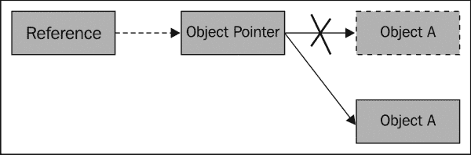

    引用为对象（可以是类、实例对象、字符串或数组）访问增加了一层间接寻址。对象由对象指针指向，引用用于定位对象指针。尽管这种间接寻址为对象操作引入了开销，但它允许虚拟机（VM）将对象指针从开发者面前隐藏起来。因此，VM 可以在运行时内存管理中移动底层对象，并相应地更新对象指针值，而不会影响引用。

    请注意，虚拟机中的垃圾收集器移动对象以实现廉价的内存分配、批量释放、减少堆碎片、提高局部性等。

    ### 提示

    引用不一定是指针。引用如何用于定位对象指针的具体细节对开发者是隐藏的。

+   **局部引用、全局引用与弱引用**：为了指向同一数据，可以创建三种不同类型的引用，即局部引用、全局引用和弱引用。除非我们明确创建全局引用或弱引用，否则 JNI 默认使用局部引用。下表总结了这三种不同类型引用之间的区别：

|   | 创建 | 生命周期 | 可见性 | 对被引用对象的垃圾收集器（GC）行为 | 释放 |
| --- | --- | --- | --- | --- | --- |
| **局部引用** | `Default` 或 `NewLocalRef` | 本地方法调用期间有效。本地方法返回后无效 | 在创建它的线程内有效 | GC 不会回收被引用对象 | 自动释放或调用 `DeleteLocalRef` |
| **全局引用** | `NewGlobalRef` | 明确释放前有效 | 多个线程间有效 | GC 不会回收被引用对象 | `DeleteGlobalRef` |
| **弱引用** | `NewGlobalWeakRef` | 明确释放前有效 | 多个线程间有效 | GC 可以回收被引用对象 | `DeleteWeakGlobalRef` |

现在，我们将逐一查看引用类型，同时参考示例源代码：

+   **局部引用**：本地方法 `localReference` 展示了两个基本的 JNI 函数，即 `NewLocalRef` 和 `DeleteLocalRef`。第一个函数创建局部引用，而第二个释放它。请注意，通常我们不需要显式释放局部引用，因为它会在本地方法返回后自动释放。然而，有两种例外情况。首先，如果在本地方法调用中创建大量局部引用，我们可能会引起溢出。当我们将 `false` 传递给 `pDelete` 输入参数时，我们的示例方法展示了这种情况。以下截图是此类场景的一个示例：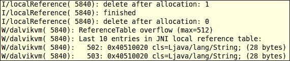

    第一次执行在用完后立即删除了局部引用，所以它顺利完成，而第二次没有删除局部引用，最终导致 `ReferenceTable` 溢出。

    其次，当我们实现一个由其他本地函数调用的实用函数时，我们不应该泄露除返回值以外的任何引用。否则，如果该实用函数被本地方法多次调用，它也将导致溢出问题。

    ### 提示

    在安卓 4.0 之前，局部引用是通过直接指向对象的指针实现的。此外，即使调用了`DeleteLocalRef`，这些直接指针也从未失效。因此，程序员可以在引用声称被删除后，仍然使用局部引用作为直接指针。由于这种设计，很多不符合 JNI 规范的代码也能工作。然而，从安卓 4.0 开始，局部引用已经改为使用间接机制。因此，在安卓 4.0 及以后版本中，使用局部引用作为直接指针的 buggy 代码将会出错。强烈建议您始终遵循 JNI 规范。

+   **全局引用**：本地方法`globalReference`展示了全局引用的一个典型用法。当向`pDelete`输入参数传递`false`时，会保留全局引用，因为这是一个静态变量。下次调用该方法时，静态全局引用仍然会引用同一个对象。因此，我们不需要再次调用`NewGlobalRef`。这种技术可以让我们避免在每次调用全局引用时执行相同的操作。

    我们在 Java 代码中三次调用`globalReference`，如下所示：

    ```kt
    globalReference("hello global ref", false); 
    globalReference("hello global ref 2", true);
    globalReference("hello global ref 3", true);
    ```

    结果应该类似于以下内容：

    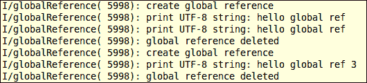

    伴随第一次方法调用的字符串被保留，因此前两次调用显示相同的字符串。在我们第二次调用结束时删除全局引用后，第三次调用显示的是伴随其调用的字符串。

    请注意，尽管`DeleteGlobalRef`释放了全局引用，但它并没有将其设置为`NULL`。我们在删除操作之后明确地将全局引用设置为`NULL`。

+   **弱引用**：弱引用与全局引用类似，不同之处在于它不会阻止**垃圾收集器**（**GC**）收集它所引用的底层对象。弱引用不如局部引用和全局引用常用。一个典型的用例是，当我们引用大量非关键对象，并且我们不希望当 GC 认为有必要时，阻止 GC 收集其中一些对象。

    ### 提示

    安卓对弱引用的支持取决于版本。在安卓 2.2 之前，弱引用根本没有实现。在安卓 4.0 之前，它只能传递给`NewLocalRef`、`NewGlobalRef`和`DeleteWeakGlobalRef`。从安卓 4.0 开始，安卓完全支持弱引用。

+   **赋值与 New<ReferenceType>Ref 的区别**：在`referencetest.c`源代码中，我们实现了本地`ReferenceAssignmentAndNew`方法。这个方法展示了赋值与分配新引用之间的区别。

    我们将输入的 jstring `pStringP` 两次传递给 JNI 函数 `NewGlobalRef`，以创建两个全局引用（`globalRefNew` 和 `globalRefNew2`），并将其中一个全局引用赋值给变量 `globalRefAssignment`。然后我们测试它们是否都引用了同一个对象。

    由于`jobject`和`jstring`实际上是 void 数据类型的指针，我们可以将它们的值作为整数打印出来。最后，我们调用了三次`DeleteGlobalRef`。以下是 Android logcat 输出的截图：

    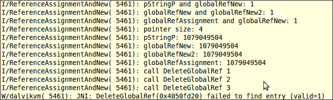

    前三行表明，输入的 jstring `pStringP`，两个全局引用 `globalRefNew` 和 `globalRefNew2`，以及赋值的 jstring `globalRefAssignment` 都引用了同一个对象。输出的第五到八行显示了相同的值，这意味着所有引用本身都是等价的。最后，前两次`DeleteGlobalRef`调用成功，而最后一次失败。

    `New<ReferenceType>Ref JNI`函数实际上会找到底层对象，然后为该对象添加一个引用。它允许为同一个对象添加多个引用。请注意，尽管我们的示例执行显示由`New<ReferenceType>Ref`创建的引用值相同，但这并不保证。两个指向同一对象的对象指针和引用同一对象的引用与两个不同的指针相关联是有可能的。

    建议您永远不要依赖引用的值；你应该使用 JNI 函数。例如，使用`IsSameObject`，永远不要使用"`==`"来测试两个引用是否指向同一个底层对象，除非是与`NULL`进行比较。

    `Delete<ReferenceType>Ref`的调用次数必须与`New<ReferenceType>Ref`的调用次数相匹配。较少的调用可能会潜在地导致内存泄漏，而更多的调用则会失败，正如前面的结果所示。

    赋值操作不会通过虚拟机，因此它不会导致虚拟机添加新的引用。

    请注意，虽然我们使用了全局引用来示例，但这些原则同样适用于局部引用和弱引用。

## 还有更多内容...

另外一种管理局部引用的方法是使用 JNI 函数 `PushLocalFrame` 和 `PopLocalFrame`。感兴趣的读者可以参考 JNI 规范以获取更多信息。

在使用`AttachCurrentThread`将本地线程附加到原生线程后，线程中运行的代码在未分离线程之前不会释放局部引用。局部引用应该明确释放。通常，只要我们不再需要它，明确释放局部引用是一个好习惯。

# 在 JNI 中操作类

之前的食谱讨论了 Android JNI 支持三种不同的引用。这些引用用于访问引用数据类型，包括字符串、类、实例对象和数组。这个食谱专注于 Android JNI 中的类操作。

## 准备工作

在阅读这个食谱之前，应该先阅读*在 NDK 中管理引用*的食谱。

## 如何操作…

以下步骤描述了如何构建一个示例 Android 应用程序，演示 JNI 中的类操作：

1.  创建一个名为`ClassManipulation`的项目。将包名设置为`cookbook.chapter2`。创建一个名为`ClassManipulationActivity`的活动。在项目下，创建一个名为`jni`的文件夹。如果你需要更详细的说明，请参考本章中*加载本地库和注册本地方法*的食谱。

1.  在`jni`文件夹下创建一个名为`classtest.c`的文件，然后实现`findClassDemo`、`findClassDemo2`、`GetSuperclassDemo`和`IsAssignableFromDemo`方法。我们可以参考下载的`ClassManipulation`项目源代码。

1.  修改`ClassManipulationActivity.java`文件，添加代码以加载本地库，声明本地方法，并调用本地方法。

1.  创建一个`Dummy`类和一个继承`Dummy`类的`DummySubClass`子类。创建一个`DummyInterface`接口和一个继承`DummyInterface`的`DummySubInterface`子接口。

1.  修改`layout` XML 文件，添加`Android.mk`构建文件，并构建本地库。具体细节请参考本章中*加载本地库和注册本地方法*的步骤 8 至 10。

1.  我们现在准备运行项目。在下一节中讨论每个本地方法时，我们将展示输出结果。

## 它是如何工作的…

这个食谱演示了 JNI 中的类操作。我们突出以下几点：

+   **类描述符**：类描述符指的是类或接口的名称。它可以通过在 JNI 编程中将 Java 中的"`.`"字符替换为"`/`"来得到。例如，类`java.lang.String`的描述符是`java/lang/String`。

+   **FindClass 和类加载器**：JNI 函数`FindClass`具有以下原型：

    ```kt
    jclass FindClass(JNIEnv *env, const char *name);
    ```

    它接受一个`JNIEnv`指针和一个类描述符，然后定位到一个类加载器来加载相应的类。它返回一个初始化后的类的局部引用，如果失败则返回`NULL`。`FindClass`使用调用堆栈最顶层方法关联的类加载器。如果找不到，它会使用"系统"类加载器。一个典型的例子是，在我们创建一个线程并将其附加到虚拟机之后，调用堆栈的最顶层方法将是如下所示：

    ```kt
    dalvik.system.NativeStart.run(Native method)
    ```

    这个方法不是我们应用程序代码的一部分。因此，使用的是"系统"类加载器。

    ### 提示

    线程可以在 Java 中创建（称为托管线程或 Java 线程），也可以在本地代码中创建（称为本地线程或非虚拟机线程）。通过调用 JNI 函数`AttachCurrentThread`，本地线程可以附加到虚拟机。一旦附加，本地线程就像 Java 线程一样运行，在本地方法内部工作。它将保持连接状态，直到调用 JNI 函数`DetachCurrentThread`。

    在我们的`ClassManipulation`项目中，我们用本地方法`findClassDemo`和`findClassDemo2`说明了`FindClass`。`findClassDemo`方法在虚拟机创建的线程中运行。`FindClass`调用将正确找到类加载器。`findClassDemo2`方法创建了一个非虚拟机线程并将该线程附加到虚拟机。它说明了我们在上一节中描述的情况。调用这两个本地方法的 logcat 输出如下：

    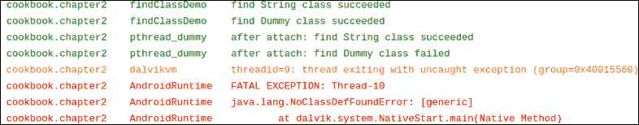

    如输出所示，非虚拟机线程成功加载了`String`类，但未能加载我们定义的`Dummy`类。解决此问题的方法是在`JNI_OnLoad`方法中缓存对`Dummy`类的引用。我们将在*缓存 jfieldID、jmethodID 和引用数据以提高性能*的菜谱中提供一个详细的例子。

+   `GetSuperclass`：JNI 函数`GetSuperclass`具有以下原型：

    ```kt
    jclass GetSuperclass(JNIEnv *env, jclass clazz);
    ```

    它可以帮助我们查找给定类的超类。如果`clazz`是`java.lang.Object`，这个函数返回`NULL`；如果是接口，它返回对`java.lang.Object`的本地引用；如果是其他任何类，它返回对其超类的本地引用。

    在我们的`ClassManipulation`项目中，我们用本地方法`GetSuperclassDemo`说明了`GetSuperclass`。我们在 Java 代码中创建了一个`Dummy`类和一个`DummyInterface`接口，其中`DummySubClass`扩展了`Dummy`，而`DummySubInterface`扩展了`DummyInterface`。在本地方法中，我们分别对`java.lang.Object`、`DummySubClass`和`DummySubInterface`调用`GetSuperclass`。以下是 logcat 输出的截图：

    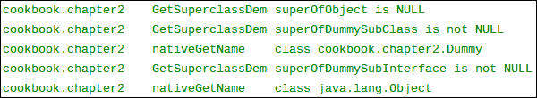

    如截图所示，`GetSuperclass`可以成功找到`DummySubClass`的超类。在这个本地方法中，我们使用了实用函数`nativeGetClassName`，在那里我们调用了`toString`方法。我们将在*在 JNI 中调用实例和静态方法*的菜谱中介绍如何进行此类方法调用。

+   `IsAssignableFrom`：JNI 函数`IsAssignableFrom`具有以下原型：

    ```kt
    jboolean IsAssignableFrom(JNIEnv *env, jclass cls1, jclass cls2);
    ```

    如果`cls1`可以安全地转换为`cls2`，此函数返回`JNI_TRUE`，否则返回`JNI_FALSE`。我们在本地方法`IsAssignableFromDemo`中演示了其用法。我们获得了对`DummySubClass`的本地引用，并调用`GetSuperclass`获取对`Dummy`的本地引用。然后，我们调用`IsAssignableFrom`来测试是否可以将`DummySubClass`转换为`Dummy`以及反之。以下是 logcat 输出的截图：

    

    如预期的那样，子类可以安全地转换为超类，但反之则不行。

### 提示

Android 上不支持 JNI 函数`DefineClass`。这是因为该函数需要原始类数据作为输入，而 Android 上的 Dalvik VM 不使用 Java 字节码或类文件。

# 在 JNI 中操作对象

上一个菜谱展示了如何在 Android JNI 中操作类。这个菜谱描述了如何在 Android NDK 编程中操作实例对象。

## 准备就绪

在阅读这个菜谱之前，应该先阅读以下菜谱：

+   *在 JNI 中管理引用*

+   *在 JNI 中操作类*

## 如何操作…

现在，我们将创建一个带有本地方法的 Android 项目，演示与实例对象相关的 JNI 函数的使用。执行以下步骤：

1.  创建一个名为`ObjectManipulation`的项目。将包名设置为`cookbook.chapter2`。创建一个名为`ObjectManipulationActivity`的活动。在项目下，创建一个名为`jni`的文件夹。如果你需要更详细的说明，请参考本章中的*加载本地库和注册本地方法*的菜谱。

1.  在`jni`文件夹下创建一个名为`objecttest.c`的文件，然后实现`AllocObjectDemo`、`NewObjectDemo`、`NewObjectADemo`、`NewObjectVDemo`、`GetObjectClassDemo`和`IsInstanceOfDemo`方法。你可以参考下载的`ObjectManipulation`项目源代码。

1.  修改`ObjectManipulationActivity.java`，添加加载本地库、声明本地方法并调用它们的代码。

1.  创建一个`Dummy`类，以及一个继承自`Dummy`的`DummySub`类。创建一个具有两个字段`name`和`age`、一个构造函数以及一个`getContactStr`方法的`Contact`类。

1.  修改`layout` XML 文件，添加`Android.mk`构建文件，并构建本地库。更多详细信息，请参考本章中*加载本地库和注册本地方法*的步骤 8 至 10。

1.  我们现在准备运行项目。在下一节讨论每个本地方法时，我们将展示输出结果。

## 工作原理…

这个菜谱介绍了在 JNI 中操作对象的多种方法：

+   **在本地代码中创建实例对象**：可以使用四个 JNI 函数在本地代码中创建 Java 类的实例对象，它们分别是`AllocObject`、`NewObject`、`NewObjectA`和`NewObjectV`。`AllocObject`函数创建一个未初始化的对象，而其他三种方法则将构造函数作为输入参数来创建对象。这四个函数的原型如下：

    ```kt
    jobject AllocObject(JNIEnv *env, jclass clazz);

    jobject NewObject(JNIEnv *env, jclass clazz,jmethodID methodID, ...);

    jobject NewObjectA(JNIEnv *env, jclass clazz,jmethodID methodID, jvalue *args);
    jobject NewObjectV(JNIEnv *env, jclass clazz,jmethodID methodID, va_list args);
    ```

    `clazz`参数是我们想要创建实例对象的 Java 类的引用。它不能是一个数组类，数组类有其自己的 JNI 函数集。`methodID`是构造函数方法 ID，可以通过使用`GetMethodID` JNI 函数获得。

    对于`NewObject`，在`methodID`之后可以传递可变数量的参数，函数会将它们传递给构造函数以创建实例对象。`NewObjectA`接受类型为`jvalue`的数组，并将其传递给构造函数。`jvalue`是一个联合类型，定义如下：

    ```kt
    typedef union jvalue {
       jboolean z;
       jbyte    b;
       jchar    c;
       jshort   s;
       jint     i;
       jlong    j;
       jfloat   f;
       jdouble  d;
       jobject  l;
    } jvalue;
    ```

    `NewObjectV`将存储在`va_list`中的参数传递给构造函数。`va_list`与`va_start`、`va_end`和`va_arg`一起，使我们能够访问函数的可变数量的输入参数。具体的细节超出了本书的范围。但是，你可以从提供的示例代码中了解到它的工作原理。

    在 Java 代码中，我们调用了所有四个本地方法，这些方法分别使用不同的 JNI 函数来创建我们定义的`Contact`类的实例对象。然后我们将显示所有四个`Contact`对象的名称和年龄字段的值。以下是样本运行的截图：

    

    如所示，由`AllocObject`创建的实例对象未初始化，因此所有字段都包含 Java 赋予的默认值，而其他三种方法则创建了我们传递初始值的对象。

+   `GetObjectClass`：这个 JNI 函数具有以下原型：

    ```kt
    jclass GetObjectClass(JNIEnv *env, jobject obj);
    ```

    它返回对实例对象`obj`的类的本地引用。`obj`参数不能为`NULL`，否则会导致虚拟机崩溃。

    在我们的`GetObjectClassDemo`本地方法实现中，我们获得了对`Contact`类的引用，然后调用`AllocObject`创建未初始化的对象实例。在 Java 代码中，我们以下列方式显示创建的对象实例的字段：

    

    正如预期的那样，未初始化的`Contact`对象实例的字段值是由 Java 赋予的默认值。

+   `IsInstanceOf`：这个 JNI 函数调用的原型如下：

    ```kt
    jboolean IsInstanceOf(JNIEnv *env, jobject obj, jclass clazz);
    ```

    它判断实例对象`obj`是否是类`clazz`的实例。我们在`IsInstanceOfDemo`本地方法中说明了这个函数的使用。该方法创建了对`Dummy`类的本地引用和对`DummySub`类的本地引用，`DummySub`是`Dummy`的子类。然后它创建了两个对象，每个类一个。然后代码针对每个对象引用和每个类引用调用`IsInstanceOf`，总共进行了四次检查。我们将输出发送到 logcat。此方法的样本执行给出了以下结果：

    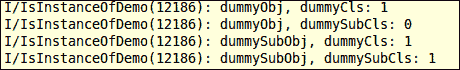

    结果显示，`Dummy`实例对象是`Dummy`类的实例但不是`DummySub`类的实例，而`DummySub`实例对象既是`Dummy`类的实例也是`DummySub`类的实例。

# 在 JNI 中操作数组

JNI 将字符串、类、实例对象和数组作为引用类型暴露出来。本节将讨论 JNI 中的数组。

## 准备工作

在阅读本节之前，你应当确保已经阅读了以下内容：

+   *在 JNI 中管理引用*

+   *在 JNI 中操作类*

## 如何操作…

在这一节中，我们将创建一个示例 Android 项目，演示如何在 JNI 中操作数组。

1.  创建一个名为`ArrayManipulation`的项目。将包名设置为`cookbook.chapter2`。创建一个名为`ArrayManipulationActivity`的活动。在项目下，创建一个名为`jni`的文件夹。更多详细说明请参考本章中关于*加载本地库和注册本地方法*的菜谱。

1.  在`jni`文件夹下创建一个名为`arraytest.c`的文件，然后实现`GetArrayLengthDemo`、`NewObjectArrayDemo`、`NewIntArrayDemo`、`GetSetObjectArrayDemo`、`GetReleaseIntArrayDemo`、`GetSetIntArrayRegionDemo`和`GetReleasePrimitiveArrayCriticalDemo`本地方法。

1.  修改`ArrayManipulationActivity.java`，添加加载本地库、声明本地方法并调用它们的代码。

1.  创建一个名为`Dummy`的类，它有一个名为`value`的整数字段。

1.  修改布局 XML 文件，添加`Android.mk`构建文件，并构建本地库。更多细节请参考本章中关于*加载本地库和注册本地方法*的步骤 8 至 10。

1.  我们现在准备运行这个项目。在下一节中，我们将展示输出结果，同时讨论每个本地方法。

## 它是如何工作的…

数组由`jarray`或其子类型如`jobjectArray`和`jbooleanArray`表示。与`jstring`类似，它们不能像 C 数组那样直接被本地代码访问。JNI 提供了各种访问数组的函数：

+   **创建新数组**：JNI 提供了`NewObjectArray`和`New<Type>Array`函数来创建对象和基本类型的数组。它们的函数原型如下：

    ```kt
    jarray NewObjectArray(JNIEnv *env, jsize length, jclass elementType, jobject initialElement);
    <ArrayType> New<Type>Array(JNIEnv *env, jsize length);
    ```

    我们在本地方法`NewObjectArrayDemo`中展示了`NewObjectArray`的使用，在这里我们创建了 10 个`Dummy`类的实例。该函数的`length`参数表示要创建的对象数量，`elementType`是对类的引用，`initialElement`是将为所有创建的对象实例在数组中设置的初始化值。在 Java 代码中，我们实现了`callNewObjectArrayDemo`方法，该方法调用`NewObjectArrayDemo`本地方法来创建一个包含 10 个`Dummy`对象的数组，所有对象的`value`字段都设置为`5`。执行结果应类似于以下截图：

    

    如预期的那样，由`NewObjectArray`创建的所有对象的`value`字段都是`5`。

    `New<Type>Array`的用法在原生方法`NewIntArrayDemo`中展示，我们使用 JNI 函数`NewIntArray`创建一个包含 10 个整数的数组，然后为每个整数分配一个值。JNI 的所有八种基本类型（`jboolean`、`jbyte`、`jchar`、`jshort`、`jint`、`jlong`、`jfloat`和`jdouble`）都有一个对应的`New<Type>Array`函数来创建其类型的数组。请注意，`NewIntArrayDemo`调用了`GetIntArrayElements`和`ReleaseIntArrayElements` JNI 函数，我们将在本食谱后面的内容中讨论。在 Java 代码中，我们实现了一个`callNewIntArrayDemo`方法来调用`NewIntArrayDemo`并在屏幕上显示整数数组元素。`callNewIntArrayDemo`的执行给出了以下结果：

    

    如截图所示，整数数组被分配了从`0`到`9`的值。

+   `GetArrayLength`：这个原生函数具有以下原型：

    ```kt
    jsize GetArrayLength(JNIEnv *env, jarray array);
    ```

    它接受对`jarray`的引用并返回其长度。我们在原生方法`GetArrayLengthDemo`中演示了其用法。在 Java 代码中，我们实现了`callGetArrayLengthDemo`方法，该方法创建了三个数组，包括一个`double`数组、一个`Dummy`对象数组和一个二维整数数组。该方法调用`GetArrayLengthDemo`原生方法来获取这三个数组的长度。我们在原生方法中将数组长度输出到 logcat。示例执行输出应与以下截图类似：

    

+   **访问对象数组**：JNI 提供了两个访问对象数组的函数，分别是`GetObjectArrayElement`和`SetObjectArrayElement`。顾名思义，第一个函数获取数组中对象元素的引用，而第二个函数设置对象数组的元素。这两个函数具有以下原型：

    ```kt
    jobject GetObjectArrayElement(JNIEnv *env,jobjectArray array, jsize index);
    void SetObjectArrayElement(JNIEnv *env, jobjectArray array, jsize index, jobject value);
    ```

    在这两个函数中，参数`array`指的是对象数组，而`index`是元素的位置。`get`函数返回对对象元素的引用，而`set`函数根据`value`参数设置元素。

    我们在原生方法`GetSetObjectArrayDemo`中展示了这两个函数的用法。该方法接受一个对象数组和另一个对象。它将索引为 1 的对象替换为接收到的对象，然后返回索引为 1 的原始对象。在 Java 代码中，我们调用了`callGetSetObjectArrayDemo`方法，传递一个包含三个值为`0`、`1`、`2`的`Dummy`对象数组，以及另一个值为`100`的`Dummy`对象给原生方法。执行结果应与以下截图类似：

    

    如所示，索引为`1`的对象被值为`100`的对象替换，而值为`1`的原始对象被返回。

+   **访问基本类型数组**：JNI 提供了三组函数来访问基本类型数组。我们分别用三种不同的本地方法演示它们，都以`jintarray`为例。其他基本类型数组的操作与整数类似。

    首先，如果我们想在本地缓冲区创建`jintarray`的独立副本，或者只访问大型数组的一小部分，`GetIntArrayRegion`/ `SetIntArrayRegion`函数是合适的选择。这两个函数具有以下原型：

    ```kt
    void GetIntArrayRegion(JNIEnv *env, jintArray array, jsize start, jsize len, jint* buf);
    void SetIntArrayRegion(JNIEnv *env, jintArray array, jsize start, jsize len, jint* buf);
    ```

    这两个函数接受相同的输入参数集。参数`array`指的是我们操作的`jintArray`，`start`是起始元素位置，`len`表示要获取或设置的元素数量，`buf`是本地整数缓冲区。我们在名为`GetSetIntArrayRegionDemo`的本地方法中展示了这两个函数的用法。该方法接受一个输入`jintArray`，将数组中索引 1 到 3 的三个元素复制到本地缓冲区，在本地缓冲区将它们的值乘以`2`，然后将值复制回索引`0`到`2`。

    在 Java 代码中，我们实现了`callGetSetIntArrayRegionDemo`方法来初始化整数数组，将数组传递给本地方法`GetSetIntArrayRegionDemo`，并显示所有元素调用前后的值。你应该会看到类似于以下截图的输出：

    

    这五个元素的初始值是`0`，`1`，`2`，`3`和`4`。我们从索引一复制三个元素（`1`，`2`，`3`）到本地缓冲区`buf`。然后我们在本地缓冲区将值乘以`2`，使得本地缓冲区的前三个元素变成了`2`，`4`和`6`。我们将这三个值从本地缓冲区复制回整数数组，从索引`0`开始。因此，这三个元素的最终值是`2`，`4`和`6`，最后两个元素保持不变，为`3`和`4`。

    其次，如果我们想要访问大型数组，那么`GetIntArrayElements`和`ReleaseIntArrayElements`就是为我们准备的 JNI 函数。它们具有以下原型：

    ```kt
    jint *GetIntArrayElements(JNIEnv *env, jintArray array, jboolean *isCopy);
    void ReleaseIntArrayElements(JNIEnv *env, jintArray array, jint *elems, jint mode);
    ```

    `GetIntArrayElements`返回指向数组元素的指针，如果失败则返回`NULL`。数组输入参数指的是我们想要访问的数组，`isCopy`在函数调用结束后如果创建了新副本，则设置为`true`。返回的指针在调用`ReleaseIntArrayElements`之前都是有效的。

    `ReleaseIntArrayElements`通知虚拟机我们不再需要访问数组元素。输入参数`array`指的是我们操作的数组，`elems`是`GetIntArrayElements`返回的指针，`mode`指示释放模式。当`GetIntArrayElements`中的`isCopy`设置为`JNI_TRUE`时，我们通过返回的指针所做的更改将反映在`jintArray`上，因为我们操作的是同一份副本。当`isCopy`设置为`JNI_FALSE`时，`mode`参数决定数据释放的方式。根据我们是否需要从原生缓冲区将值复制回原数组，以及是否需要释放`elems`原生缓冲区，`mode`参数可以是`0`，`JNI_COMMIT`或`JNI_ABORT`，如下所示：

    | 复制值回原数组 | 是 | 否 |
    | --- | --- | --- |
    | 自由原生缓冲区 |
    | --- |
    | 是 | `0` | `JNI_ABORT` |
    | 否 | `COMMIT` | - |

    我们通过本地方法`GetReleaseIntArrayDemo`说明这两个 JNI 函数。该方法接受一个输入整数数组，通过`GetIntArrayElements`获取原生指针，将每个元素乘以`2`，最后通过将`mode`设置为`0`的`ReleaseIntArrayElements`提交更改。在 Java 代码中，我们实现了`callGetReleaseIntArrayDemo`方法来初始化输入数组并调用`GetReleaseIntArrayDemo`本地方法。以下是执行`callGetReleaseIntArrayDemo`方法后手机屏幕显示的截图：

    

    如预期的那样，原始数组中的所有整数元素都乘以了`2`。

    第三组 JNI 函数是`GetPrimitiveArrayCritical`和`ReleasePrimitiveArrayCritical`。这两个函数的使用与`Get<Type>ArrayElements`和`Release<Type>ArrayElements`类似，但有一个重要的区别——`Get`和`Release`方法之间的代码块是关键区域。在同一个虚拟机中，当前线程等待其他线程的任何其他 JNI 函数或函数调用都不应该发生。这两个方法本质上是增加了获取原始原始数组的未复制版本的可能性，从而提高了性能。我们在本地方法`GetReleasePrimitiveArrayCriticalDemo`中演示了这些函数的使用，以及 Java 方法`callGetReleasePrimitiveArrayCriticalDemo`。实现与第二组函数调用相似，显示结果相同。

# 在原生代码中访问 Java 的静态和实例字段

我们已经演示了如何将不同类型的参数传递给本地方法并将数据返回给 Java。这不是原生代码和 Java 代码之间共享数据的唯一方式。这个方法涵盖了另一种方式——从原生代码访问 Java 字段。

## 准备就绪

我们将介绍如何访问不同类型的 Java 字段，包括基本类型、字符串、实例对象和数组。在阅读这个食谱之前，应先阅读以下食谱：

+   *在基本类型中传递参数和接收返回值*

+   *在 JNI 中操作字符串*

+   *在 JNI 中操作类*

+   *在 JNI 中操作对象*

+   *在 JNI 中操作数组*

读者还应该熟悉 Java 反射 API。

## 如何操作…

按照以下步骤创建一个示例 Android 项目，演示如何从本地代码访问 Java 的静态和实例字段：

1.  创建一个名为`AccessingFields`的项目。将包名设置为`cookbook.chapter2`。创建一个名为`AccessingFieldsActivity`的活动。在项目下，创建一个名为`jni`的文件夹。更多详细说明请参考本章的*加载本地库和注册本地方法*食谱。

1.  在`jni`文件夹下创建一个名为`accessfield.c`的文件，然后实现`AccessStaticFieldDemo`、`AccessInstanceFieldDemo`和`FieldReflectionDemo`本地方法。

1.  修改`AccessingFieldsActivity.java`，添加加载本地库、声明本地方法并调用它们的代码。此外，添加四个实例字段和四个静态字段。

1.  创建一个`Dummy`类，包含一个名为`value`的整数实例字段和一个名为`value2`的整数静态字段。

1.  修改布局 XML 文件，添加`Android.mk`构建文件，并构建本地库。更多细节请参考本章的*加载本地库和注册本地方法*食谱中的步骤 8 至 10。

1.  我们现在准备运行项目。在下一节中，我们将展示每个本地方法的输出。

## 工作原理…

本食谱讨论了从本地代码访问 Java 中的字段（包括静态和实例字段）：

+   **`jfieldID`数据类型**：`jfieldID`是一个常规的 C 指针，指向一个对开发者隐藏详细信息的结构体。我们不应将其与`jobject`或其子类型混淆。`jobject`是对应于 Java 中`Object`的引用类型，而`jfieldID`在 Java 中没有这样的对应类型。然而，JNI 提供了将`java.lang.reflect.Field`实例转换为`jfieldID`以及反之的函数。

+   **字段描述符**：它指的是用来表示字段数据类型的修改后的 UTF-8 字符串。下表总结了 Java 字段类型及其对应的字段描述符：

    | Java 字段类型 | 字段描述符 |
    | --- | --- |
    | `boolean` | `Z` |
    | `byte` | `B` |
    | `char` | `C` |
    | `short` | `S` |
    | `int` | `I` |
    | `long` | `J` |
    | `float` | `F` |
    | `double` | `D` |
    | `String` | `Ljava/lang/String;` |
    | `Object` | `Ljava/lang/Object;` |
    | `int[]` | `[I` |
    | `Dummy[]` | `[Lcookbook/chapter2/Dummy;` |
    | `Dummy[][]` | `[Lcookbook/chapter2/Dummy;` |

    如表所示，八种原始类型每种都有一个字符字符串作为其字段描述符。对于对象，字段描述符以`"L"`开头，后跟类描述符（详细内容请参阅*在 JNI 中操作类*的菜谱），并以"`;`"结束。对于数组，字段描述符以"`[`"开头，后跟元素类型的描述符。

+   **访问静态字段**：JNI 提供了三个函数来访问 Java 类的静态字段。它们具有以下原型：

    ```kt
    jfieldID GetStaticFieldID(JNIEnv *env, jclass clazz, const char *name, const char *sig);
    <NativeType> GetStatic<Type>Field(JNIEnv *env,jclass clazz, jfieldID fieldID);
    void SetStatic<Type>Field(JNIEnv *env, jclass clazz, jfieldID fieldID,<NativeType> value);
    ```

    要访问静态字段，第一步是获取字段 ID，这是这里列出的第一个功能完成的。在方法原型中，`clazz`参数指的是定义静态字段的 Java 类，`name`表示字段名称，`sig`是字段描述符。

    获取到方法 ID 后，我们可以通过调用第二个或第三个函数来获取或设置字段值。在函数原型中，`<Type>`可以指代八种 Java 原始类型中的任意一种或`Object`，`fieldID`是由第一个方法返回的`jfieldID`。对于`set`函数，`value`是我们想要分配给字段的新值。

    前述三个 JNI 函数的使用在本地方法`AccessStaticFieldDemo`中进行了演示，我们为整数字段、字符串字段、数组字段和一个`Dummy`对象字段设置和获取值。这四个字段在 Java 类`AccessingFieldsActivity`中定义。在本地代码中，我们将获取的值输出到 Android logcat，而在 Java 代码中，我们将本地代码设置的值显示在手机屏幕上。以下截图显示了 logcat 输出：

    

    如所示，我们在 Java 代码中为字段设置的值可以通过本地代码获取；而本地方法设置的值也反映在 Java 代码中。

+   **访问实例字段**：访问实例字段与访问静态字段类似。JNI 也为我们提供了以下三个函数：

    ```kt
    jfieldID GetFieldID(JNIEnv *env, jclass clazz, const char *name, const char *sig);
    <NativeType> Get<Type>Field(JNIEnv *env,jobject obj, jfieldID fieldID);
    void Set<Type>Field(JNIEnv *env, jobject obj, jfieldID fieldID, <NativeType> value);
    ```

    同样，我们需要首先获取字段 ID，然后才能为字段获取和设置值。在调用`get`和`set`函数时，我们应该传递对象引用，而不是传递类引用。

    使用方法在本地方法`AccessInstanceFieldDemo`中展示。同样，我们在本地代码中将`get`的值打印到 logcat，并在手机屏幕上显示修改后的字段值。以下截图显示了 logcat 输出：

    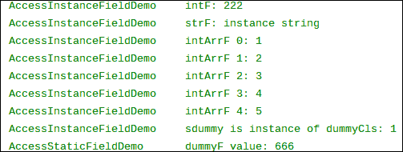

    手机显示将与以下截图类似：

    

    对于访问静态字段的解释也可以类似地应用于结果。

+   **字段反射支持**：JNI 提供了两个函数以支持与 Java Reflection API 中的`Field`进行互操作。它们具有以下原型：

    ```kt
    jfieldID FromReflectedField(JNIEnv *env, jobject field);
    jobject ToReflectedField(JNIEnv *env, jclass cls, jfieldID fieldID, jboolean isStatic);
    ```

    第一个函数将 `java.lang.reflect.Field` 转换为 `jfieldID`，然后我们可以使用前面描述的 `set` 和 `get` JNI 函数。参数字段是 `java.lang.reflect.Field` 的一个实例。

    第二个函数则相反。它接受一个类引用，一个 `jfieldID`，以及一个表示是静态字段还是实例字段的 `jboolean` 变量。函数返回一个指向 `java.lang.reflect.Field` 对象的引用。

    这两个函数的用法在本地方法 `FieldReflectionDemo` 中得到了演示。我们使用调用者传递的 `Field` 实例来访问字段值，然后为另一个字段返回一个 `Field` 实例。在 Java 方法 `callFieldReflectionDemo` 中，我们将 `Field` 实例传递给本地代码，并使用返回的 `Field` 实例获取 `field` 值。本地代码将字段值输出到 logcat，如下所示：

    

    Java 代码如下所示，在手机屏幕上显示另一个字段的值：

    

# 从本地代码调用静态和实例方法

上一个食谱涵盖了如何在 NDK 中访问 Java 字段。除了字段，Java 类还有方法。这个食谱重点介绍如何从 JNI 调用静态和实例方法。

## 准备就绪

代码示例需要了解 JNI 基本类型、字符串、类和实例对象的基础知识。在阅读这个食谱之前，最好确保你已经阅读了以下食谱：

+   *在基本类型中传递参数和接收返回值*

+   *在 JNI 中操作字符串*

+   *在 JNI 中操作类*

+   *在 JNI 中操作对象*

+   *在本地代码中访问 Java 的静态和实例字段*

期望读者也熟悉 Java 反射 API。

## 如何操作…

可以按照以下步骤创建一个示例 Android 项目，说明如何从本地代码调用静态和实例方法：

1.  创建一个名为 `CallingMethods` 的项目。将包名设置为 `cookbook.chapter2`。创建一个名为 `CallingMethodsActivity` 的活动。在项目下，创建一个名为 `jni` 的文件夹。更多详细说明请参考本章的*加载本地库和注册本地方法*食谱。

1.  在 `jni` 文件夹下创建一个名为 `callmethod.c` 的文件，然后实现本地方法 `AccessStaticMethodDemo`、`AccessInstanceMethodDemo` 和 `MethodReflectionDemo`。

1.  修改 `CallingMethodsActivity.java`，添加加载本地库、声明本地方法并调用它们的代码。

1.  创建一个名为 `Dummy` 的类，其中有一个名为 `value` 的整数实例字段和一个名为 `value2` 的整数静态字段。此外，创建一个名为 `DummySub` 的 `Dummy` 子类，并添加一个名为 `name` 的 String 字段。

1.  修改布局 XML 文件，添加`Android.mk`构建文件，并构建本地库。更多详细信息请参考本章中*加载本地库和注册本地方法*的步骤 8 至 10。

1.  现在我们准备运行项目。在下一节讨论每个本地方法时，我们将展示输出。

## 工作原理…

本节将说明如何从本地代码调用 Java 的静态和实例方法：

+   **`jmethodID`数据类型**：与`jfieldID`类似，`jmethodID`是一个常规的 C 指针，指向一个从开发者那里隐藏详细信息的结构体。JNI 提供了将`java.lang.reflect.Method`实例转换为`jmethodID`以及反向转换的函数。

+   **方法描述符**：这是一个修改后的 UTF-8 字符串，用于表示方法的输入（输入参数）数据类型和输出（返回类型）数据类型。方法描述符通过将所有输入参数的字段描述符组合在"`()`"内，并在后面追加返回类型的字段描述符来形成。如果返回类型是`void`，我们应该使用"`V`"。如果没有输入参数，我们只需使用"`()`"，然后是返回类型的字段描述符。对于构造函数，应使用"`V`"来表示返回类型。下表列出了一些 Java 方法及其对应的方法描述符：

    | Java 方法 | 方法描述符 |
    | --- | --- |
    | `Dummy(int pValue)` | `(I)V` |
    | `String getName()` | `()Ljava/lang/String;` |
    | `void setName(String pName)` | `(Ljava/lang/String;)V` |
    | `long f(byte[] bytes, Dummy dummy)` | `(BLcookbook/chapter2/Dummy;)J` |

+   **调用静态方法**：JNI 为本地代码调用 Java 方法提供了四组函数。它们的原型如下：

    ```kt
    jmethodID GetStaticMethodID(JNIEnv *env, jclass clazz, const char *name, const char *sig);

    <NativeType> CallStatic<Type>Method(JNIEnv *env, jclass clazz, jmethodID methodID, ...);

    <NativeType> CallStatic<Type>MethodA(JNIEnv *env, jclass clazz, jmethodID methodID, jvalue *args);

    <NativeType> CallStatic<Type>MethodV(JNIEnv *env, jclass clazz,jmethodID methodID, va_list args);
    ```

    第一个函数获取方法 ID。它接受指向 Java 类的引用`clazz`，以修改后的 UTF-8 字符串格式的方法名和方法描述符`sig`。其他三组函数用于调用静态方法。`<Type>`可以是八种原始类型中的任意一种，`Void`或`Object`。它表示被调用方法的返回类型。`methodID`参数是`GetStaticMethodID`函数返回的`jmethodID`。Java 方法的参数在`CallStatic<Type>Method`中逐个传递，或者放入`jvalue`数组作为`CallStatic<Type>MethodA`，或者放入`va_list`结构作为`CallStatic<Type>MethodV`。

    我们在本地方法 `AccessStaticMethodDemo` 中展示了所有四组 JNI 函数的用法。该方法获取 `Dummy` 类的 `getValue2` 和 `setValue2` 静态方法的方法 ID，并使用三种不同的方式传递参数来调用这两个方法。在 `CallingMethodsActivity.java` 中，我们实现了 `callAccessStaticMethodDemo`，它将 `value2` 静态字段初始化为 `100`，调用本地方法 `AccessStaticMethodDemo`，并在手机屏幕上打印最终的 `value2` 值。以下截图展示了 logcat 输出：

    

    如所示，本地方法首先获取 `value2` 为 `100`，然后使用三种不同的 JNI 函数调用 `set` 方法来修改值。最终，手机屏幕显示最终修改的值反映在 Java 代码中。

+   *调用实例方法*：从本地代码调用实例方法与调用静态方法类似。JNI 也提供了以下四组函数：

    ```kt
    jmethodID GetMethodID(JNIEnv *env, jclass clazz, const char *name, const char *sig);

    <NativeType> Call<Type>Method(JNIEnv *env, jobject obj, jmethodID methodID, ...);

    <NativeType> Call<Type>MethodA(JNIEnv *env,jobject obj, jmethodID methodID, jvalue *args);

    <NativeType> Call<Type>MethodV(JNIEnv *env, jobject obj, jmethodID methodID, va_list args);
    ```

    这四组函数的用法与调用静态方法的 JNI 函数类似，不同之处在于我们需要传递实例对象的引用而不是类。此外，JNI 还提供了另外三组用于调用实例方法的函数，如下所示：

    ```kt
    <NativeType> CallNonvirtual<Type>Method(JNIEnv *env, jobject obj, jclass clazz, jmethodID methodID, ...);

    <NativeType> CallNonvirtual<Type>MethodA(JNIEnv *env, jobject obj, jclass clazz, jmethodID methodID, jvalue *args);

    <NativeType> CallNonvirtual<Type>MethodV(JNIEnv *env, jobject obj, jclass clazz, jmethodID methodID, va_list args);
    ```

    与之前的三组函数相比，这三组方法接受一个额外的参数 `clazz`。`clazz` 参数可以是 `obj` 实例化自的类的引用，或者是 `obj` 的超类。一个典型的用例是在类上调用 `GetMethodID` 以获取 `jmethodID`。我们有一个该类子类的对象的引用，然后我们可以使用前面的函数通过对象引用调用与 `jmethodID` 相关联的 Java 方法。

    在本地方法 `AccessInstanceMethodDemo` 中展示了所有七组函数的用法。我们使用前四组函数通过 `DummySub` 类的对象调用了该类的 `getName` 和 `setName` 方法。然后，我们使用 `CallNonvirtual<Type>Method` 来调用在 `Dummy` 超类中定义的 `getValue` 和 `setValue` 方法。在 `CallingMethodsActivity.java` 中，我们实现了 `callAccessInstanceMethodDemo` 方法来调用 `AccessInstanceMethodDemo` 本地方法。以下截图展示了 logcat 输出：

    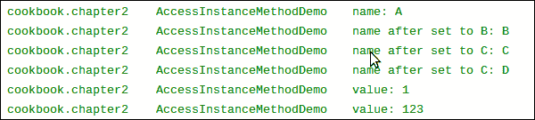

    结果显示，`getName`、`setName`、`getValue` 和 `setValue` 方法已成功执行。

+   **方法反射支持**：与字段类似，JNI 也提供了以下两个函数来支持反射：

    ```kt
    jmethodID FromReflectedMethod(JNIEnv *env, jobject method);

    jobject ToReflectedMethod(JNIEnv *env, jclass cls, jmethodID methodID, jboolean isStatic);
    ```

    第一个函数接受对`java.lang.reflect.Method`实例的引用，并返回其对应的`jmethodID`。返回的`jmethodID`值随后可用于调用相关的 Java 方法。第二个函数则相反。它接受对 Java 类、`jmethodID`以及指示是否为静态方法的`jboolean`的引用，并返回对`java.lang.reflect.Method`的引用。返回值可以在 Java 代码中使用，以访问相应的方法。

    我们在本地方法`MethodReflectionDemo`中说明了这两个 JNI 函数。在`CallingMethodsActivity.java`中，我们实现了`callMethodReflectionDemo`方法，以将`getValue`的`java.lang.reflect.Method`对象传递给本地代码，获取返回的`setValue java.lang.reflect.Method`对象，并用返回的对象调用`setValue`方法。

    本地方法将`getValue`方法的返回值输出到 logcat，如下所示：

    

    Java 代码在手机屏幕上显示调用`setValue`前后的`getValue`方法返回值，如下所示：

    

    如预期的那样，本地代码可以通过从 Java 代码传递来的`Method`对象访问`getValue`方法，而 Java 代码也可以通过从本地方法返回的`Method`对象调用`setValue`方法。

# 缓存`jfieldID`、`jmethodID`以及引用数据以提高性能

本教程涵盖了 Android JNI 中的缓存，这可以提高我们的本地代码性能。

## 准备就绪

在进行本教程之前，您应该确保已经阅读了以下教程：

+   *在本地代码中访问 Java 的静态字段和实例字段*

+   *从本地代码调用静态方法和实例方法*

## 如何操作…

以下步骤详细介绍了如何构建一个示例 Android 应用程序，演示 JNI 中的缓存：

1.  创建一个名为`Caching`的项目。将包名设置为`cookbook.chapter2`。创建一个名为`CachingActivity`的活动。在项目下，创建一个名为`jni`的文件夹。更多详细说明请参考本章中的*加载本地库和注册本地方法*。

1.  在`jni`文件夹下创建一个名为`cachingtest.c`的文件，然后实现`InitIDs`、`CachingFieldMethodIDDemo1`、`CachingFieldMethodIDDemo2`和`CachingReferencesDemo`方法。

1.  修改`CachingActivity.java`文件，添加加载本地库的代码，然后声明并调用本地方法。

1.  修改布局 XML 文件，添加`Android.mk`构建文件，并构建本地库。具体细节请参考本章中*加载本地库和注册本地方法*的步骤 8 至 10。

1.  在 Android 设备或模拟器上运行项目，并使用 eclipse 或终端中的`adb logcat -v time`命令监控 logcat 输出。

1.  在`CachingActivity.java`的`onCreate`方法中，启用`callCachingFieldMethodIDDemo1`方法，并禁用其他演示方法。启动 Android 应用程序，你应该能在 logcat 中看到以下内容：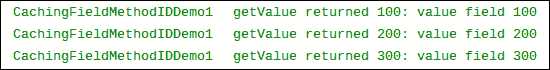

1.  在`CachingActivity.java`中启用`callCachingFieldMethodIDDemo2`，同时禁用其他演示方法以及`InitIDs`方法（在静态初始化器中）。启动 Android 应用程序，你应该能在 logcat 中看到以下内容：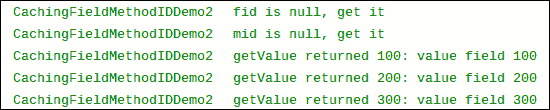

1.  在`CachingActivity.java`中启用`callCachingReferencesDemo`，同时注释掉其他演示方法。启动 Android 应用程序，你应该能在 logcat 中看到以下内容：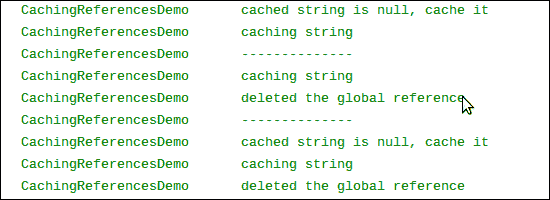

## 工作原理…

本食谱讨论了在 JNI 中使用缓存的方法：

+   **缓存字段和方法 ID**：字段和方法 ID 是内部指针。它们用于访问 Java 字段或进行本地到 Java 方法调用。获取字段或方法 ID 需要调用预定义的 JNI 函数，根据名称和描述符进行符号查找。查找过程通常需要多次字符串比较，相对耗时。

    一旦获得了字段或方法 ID，访问字段或进行本地到 Java 的调用相对较快。因此，一个好的实践是只执行一次查找并缓存字段或方法 ID。

    缓存字段和方法 ID 有两种方法。第一种方法在类初始化器中缓存。在 Java 中，我们可以有类似于以下的内容：

    ```kt
    private native static void InitIDs();
    static {
        System.loadLibrary(<native lib>);
        InitIDs();
    }
    ```

    静态初始化器在类的方法之前执行是有保障的。因此，我们可以确保在调用本地方法时所需的 ID 是有效的。这种方法的使用在`InitIDs`和`CachingFieldMethodIDDemo1`本地方法以及`CachingActivity.java`中有所展示。

    第二种方法在使用的时刻缓存 ID。我们将字段或方法 ID 存储在静态变量中，这样下次调用本地方法时 ID 仍然有效。这种方法的使用在本地方法`CachingFieldMethodIDDemo2`和`CachingActivity.java`中有所展示。

    对比这两种方法，第一种更为推荐。首先，第一种方法在使用 ID 之前不需要进行有效性检查，因为静态初始化器总是首先被调用，因此在调用本地方法之前 ID 始终有效。其次，如果类被卸载，缓存的 ID 将无效。如果使用第二种方法，我们需要确保类不会被卸载并重新加载。如果使用第一种方法，当类重新加载时静态初始化器会自动被调用，因此我们永远不需要担心类被卸载和重新加载。

+   **缓存引用**：JNI 将类、实例对象、字符串和数组作为引用暴露出来。我们在*在 JNI 中管理引用*的菜谱中介绍了如何管理引用。有时，缓存引用也可以提高性能。与直接指针的字段和方法 ID 不同，引用是通过开发者不可见的间接机制实现的。因此，我们需要依赖 JNI 函数来缓存它们。

    为了缓存引用数据，我们需要将其设置为全局引用或弱全局引用。**全局引用**保证在显式删除之前引用始终有效。而**弱全局**引用允许底层的对象被垃圾回收。因此，在使用它之前我们需要进行有效性检查。

    原生方法`CachingReferencesDemo`演示了如何缓存字符串引用。注意，虽然`DeleteGlobalRef`使全局引用无效，但它不会将引用赋值为`NULL`。我们需要手动进行这一操作。

# 检查错误和在 JNI 中处理异常

JNI 函数可能会因为系统限制（例如，内存不足）或无效的参数（例如，函数期望得到 UTF-16 字符串时却传递了原生 UTF-8 字符串）而失败。这个菜谱讨论了如何在 JNI 编程中处理错误和异常。

## 准备工作

在继续本菜谱之前，应先阅读以下菜谱：

+   *在 JNI 中操作字符串*

+   *在 JNI 中管理引用*

+   *在原生代码中访问 Java 的静态和实例字段*

+   *从原生代码中调用静态方法和实例方法*

## 如何操作…

按照以下步骤创建一个示例 Android 项目，说明在 JNI 中的错误和异常处理：

1.  创建一个名为`ExceptionHandling`的项目。将包名设置为`cookbook.chapter2`。创建一个名为`ExceptionHandlingActivity`的活动。在项目下，创建一个名为`jni`的文件夹。更多详细说明请参考本章中的*加载原生库和注册原生方法*的菜谱。

1.  在`jni`文件夹下创建一个名为`exceptiontest.c`的文件，然后实现`ExceptionDemo`和`FatalErrorDemo`方法。

1.  修改`ExceptionHandlingActivity.java`文件，添加加载原生库的代码，然后声明并调用原生方法。

1.  修改布局 XML 文件，添加`Android.mk`构建文件，并构建原生库。更多详细信息请参考本章中*加载原生库和注册原生方法*菜谱的步骤 8 至 10。

1.  我们现在准备运行项目。在下一节中，我们将展示每个原生方法的输出。

## 工作原理…

本菜谱讨论了在 JNI 中的错误检查和异常处理：

+   **检查错误和异常**：许多 JNI 函数返回一个特殊值来表示失败。例如，`FindClass`函数返回`NULL`表示未能加载类。许多其他函数不使用返回值来表示失败；而是抛出异常。

    ### 提示

    除了 JNI 函数之外，本地代码调用的 Java 代码也可能抛出异常。我们应该确保检查这些情况，以编写健壮的本地代码。

    对于第一组函数，我们可以简单地检查返回值以查看是否发生错误。对于第二组函数，JNI 定义了两个函数来检查异常，如下所示：

    ```kt
    jboolean ExceptionCheck(JNIEnv *env);
    jthrowable ExceptionOccurred(JNIEnv *env);
    ```

    第一个函数返回`JNI_TRUE`表示发生异常，否则返回`JNI_FALSE`。第二个函数返回异常的本地引用。当使用第二个函数时，可以调用附加的 JNI 函数来检查异常的详细信息：

    ```kt
    void ExceptionDescribe(JNIEnv *env);
    ```

    该函数将异常和堆栈的回溯打印到 logcat 中。

    在本地方法`ExceptionDemo`中，我们使用了两种方法来检查异常的发生，并使用`ExceptionDescribe`打印异常详情。

+   **处理错误和异常**：JNI 的异常与 Java 异常不同。在 Java 中，当发生错误时，会创建一个异常对象并将其交给运行时。然后运行时搜索调用堆栈以找到一个可以处理异常的异常处理器。搜索从发生异常的方法开始，按照方法被调用的相反顺序进行。当找到这样的代码块时，运行时将控制权交给异常处理器。因此，正常的控制流程被打断。相比之下，JNI 异常不会改变控制流程，我们需要显式检查异常并正确处理。

    通常有两种处理异常的方法。第一种方法是释放 JNI 中分配的资源并返回。这将把处理异常的责任留给本地方法的调用者。

    第二种实践是清除异常并继续执行。这是通过以下 JNI 函数调用来完成的：

    ```kt
    void ExceptionClear(JNIEnv *env);
    ```

    在本地方法`ExceptionDemo`中，我们使用了第二种方法来清除`java.lang.NullPointerException`，并使用第一种方法将`java.lang.RuntimeException`返回给调用者，即`ExceptionHandlingActivity.java`中的 Java 方法`callExceptionDemo`。

    当有异常待处理时，并不是所有的 JNI 函数都可以安全调用。以下函数在有挂起异常时是可以被允许的：

    +   `DeleteGlobalRef`

    +   `DeleteLocalRef`

    +   `DeleteWeakGlobalRef`

    +   `ExceptionCheck`

    +   `ExceptionClear`

    +   `ExceptionDescribe`

    +   `ExceptionOccurred`

    +   `MonitorExit`

    +   `PopLocalFrame`

    +   `PushLocalFrame`

    +   `Release<PrimitiveType>ArrayElements`

    +   `ReleasePrimitiveArrayCritical`

    +   `ReleaseStringChars`

    +   `ReleaseStringCritical`

    +   `ReleaseStringUTFChars`

    它们基本上是异常检查和处理函数，或者是用于在本地代码中清除已分配资源的函数。

    ### 注意

    当有异常悬而未决时，调用这里未列出的 JNI 函数可能会导致意外的结果。我们应该正确处理待处理的异常，然后继续。

+   **在本地代码中抛出异常**：JNI 提供了两个函数从本地代码抛出异常。它们的原型如下：

    ```kt
    jint Throw(JNIEnv *env, jthrowable obj);
    jint ThrowNew(JNIEnv *env, jclass clazz, const char *message);
    ```

    第一个函数接受对`jthrowable`对象的引用并抛出异常，而第二个函数接受对异常类的引用。它将创建一个`clazz`类的异常对象，带有消息参数，并抛出它。

    在`ExceptionDemo`本地方法中，我们使用了`ThrowNew`函数来抛出`java.lang.NullPointerException`，以及一个`Throw`函数来抛出`java.lang.RuntimeException`。

    下面的 logcat 输出显示了如何检查、清除和抛出异常：

    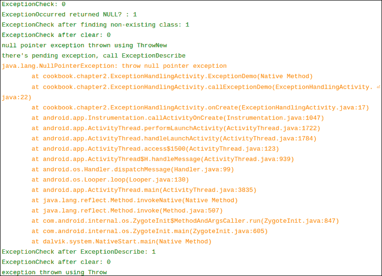

    最后一个异常在本地方法中没有清除。在 Java 代码中，我们捕获了异常并在手机屏幕上显示消息：

    

+   **致命错误**：一种特殊的、不可恢复的错误是致命错误。JNI 定义了一个函数`FatalError`，如下所示，用于引发致命错误：

    ```kt
    void FatalError(JNIEnv *env, const char *msg);
    ```

    这个函数接受一条消息并将其打印到 logcat。之后，应用程序的虚拟机实例将被终止。我们在本地方法`FatalErrorDemo`和 Java 方法`callFatalErrorDemo`中演示了此函数的用法。以下是在 logcat 捕获的输出：

    

    请注意，`FatalError`函数之后的代码永远不会执行，无论是在本地代码还是 Java 代码中，因为`FatalError`永远不会返回，虚拟机实例会被终止。在我的 Android 设备上，这不会导致 Android 应用程序崩溃，但会导致应用程序冻结。

## 还有更多内容...

当前在 Android JNI 编程中不支持 C++异常。换句话说，本地 C++异常不会通过 JNI 传播到 Java 世界。因此，我们应在 C++代码内处理 C++异常。或者，我们可以编写一个 C 包装器来抛出异常或返回错误代码给 Java。

# 在 JNI 中集成汇编代码

Android NDK 允许你在 JNI 编程中编写汇编代码。汇编代码有时用于优化代码的关键部分以获得最佳性能。本指南无意讨论如何在汇编中编程。它描述了如何在 JNI 编程中集成汇编代码。

## 准备就绪

在继续之前，请阅读*在基本类型中传递参数和接收返回值*的指南。

## 如何操作…

以下步骤创建了一个集成汇编代码的示例 Android 项目：

1.  创建一个名为`AssemblyInJNI`的项目。设置包名为`cookbook.chapter2`。创建一个名为`AssemblyInJNIActivity`的活动。在项目下，创建一个名为`jni`的文件夹。有关更详细的说明，请参考本章中的*加载本地库和注册本地方法*的教程。

1.  在`jni`文件夹下创建一个名为`assemblyinjni.c`的文件，然后实现`InlineAssemblyAddDemo`方法。

1.  在`jni`文件夹下创建一个名为`tmp.c`的文件，并实现本地方法`AssemblyMultiplyDemo`。使用以下命令将`tmp.c`代码编译成名为`AssemblyMultiplyDemo.s`的汇编源文件：

    ```kt
    $ $ANDROID_NDK/toolchains/arm-linux-androideabi-4.4.3/prebuilt/linux-x86/bin/arm-linux-androideabi-gcc -S tmp.c -o AssemblyMultiplyDemo.s --sysroot=$ANDROID_NDK/platforms/android-14/arch-arm/
    ```

1.  修改`AssemblyInJNIActivity.java`文件，添加加载本地库的代码，然后声明并调用本地方法。

1.  修改布局 XML 文件，添加`Android.mk`构建文件，并构建本地库。具体步骤请参考本章中*加载本地库和注册本地方法*教程的第 8 至第 10 步。

1.  在`AssemblyInJNIActivity.java`文件中，启用`callInlineAssemblyAddDemo`本地方法，禁用`callAssemblyMultiplyDemo`方法。在 Android 设备或模拟器上运行项目。手机显示应与以下截图相似：

1.  在`AssemblyInJNIActivity.java`中，启用`callAssemblyMultiplyDemo`本地方法，禁用`callInlineAssemblyAddDemo`方法。在 Android 设备或模拟器上运行项目。手机显示应与以下截图相似：

## 工作原理…

本教程演示了如何使用汇编代码实现本地方法：

+   **C 代码中的内联汇编**：我们可以为 Android NDK 开发编写内联汇编代码。这可以在本地方法`InlineAssemblyAddDemo`中看到。

+   **生成单独的汇编代码**：编写汇编代码的一种方法是先用 C 或 C++编写代码，并使用编译器将代码编译成汇编代码。然后，我们根据自动生成的汇编代码进行优化。由于本教程不是关于用汇编语言编写代码，我们使用 Android NDK 交叉编译器生成本地方法`AssemblyMultiplyDemo`，并从 Java 方法`callAssemblyMultiplyDemo`中调用它。

    我们首先在`AssemblyMultiplyDemo.c`中编写本地方法`AssemblyMultiplyDemo`，然后使用 Android NDK 的编译器进行交叉编译，使用以下命令：

    ```kt
    $ $ANDROID_NDK/toolchains/arm-linux-androideabi-4.4.3/prebuilt/linux-x86/bin/arm-linux-androideabi-gcc -S <c_file_name>.c -o <output_file_name>.s --sysroot=$ANDROID_NDK/platforms/android-<level>/arch-<arch>/
    ```

    在前面的命令中，`$ANDROID_NDK` 是一个指向 Android NDK 安装位置的环境变量。如果你按照第一章中的步骤操作过，*Hello NDK*，那么它应该已经被正确配置。否则，你可以将其替换为你的 Android NDK 完整路径（例如，在我的电脑上，路径是`/home/roman10/Desktop/android/android-ndk-r8`）。`<level>`表示目标 Android 版本。在我们的例子中，我们使用了`14`。`<arch>`表示架构；我们使用了`arm`。如果我们为其他架构（比如 x86）构建应用，那么这里应该是`x86`。`-S`选项告诉交叉编译器将`<c_file_name>.c`文件编译成汇编代码，但不要进行汇编或链接。`-o`选项告诉编译器将汇编代码输出到文件`<output_file_name>.s`中。如果没有指定这个选项，编译器会输出到名为`<c_file_name>.s`的文件中。

+   **编译汇编代码**：编译汇编代码与编译 C/C++ 源代码类似。正如在`Android.mk`文件中所示，我们只需像下面这样将汇编文件列为源文件：

    ```kt
    LOCAL_SRC_FILES := AssemblyMultiplyDemo.s assemblyinjni.c
    ```
