# 第三章：构建和调试 NDK 应用程序

在本章中，我们将介绍以下食谱：

+   在命令行构建 Android NDK 应用程序

+   在 Eclipse 中构建 Android NDK 应用程序

+   为不同的 ABI 构建 Android NDK 应用程序

+   为不同的 CPU 特性构建 Android NDK 应用程序

+   使用日志消息调试 Android NDK 应用程序

+   使用 CheckJNI 调试 Android NDK 应用程序

+   使用 NDK GDB 调试 Android NDK 应用程序

+   使用 CGDB 调试 Android NDK 应用程序

+   在 Eclipse 中调试 Android NDK 应用程序

# 引言

我们在第一章 *Hello NDK*中介绍了环境设置，以及第二章 *Java Native Interface*中的 JNI 编程。为了构建 Android NDK 应用程序，我们还需要使用 Android NDK 的**构建**和**调试**工具。

Android NDK 附带了 `ndk-build` 脚本，以方便构建任何 Android NDK 应用程序。这个脚本隐藏了调用交叉编译器、交叉链接器等的复杂性，让开发者无需处理。我们将从介绍 `ndk-build` 命令的用法开始。

**Android Development Tools** (**ADT**) 插件的最近一次发布支持从 Eclipse 构建 Android NDK 应用程序。我们将演示如何使用它。

我们将探讨为不同的**应用程序二进制接口** (**ABIs**) 构建 NDK 应用程序，并利用可选的 CPU 特性。这对于在不同 Android 设备上实现最佳性能至关重要。

除了构建，我们还将介绍各种用于 Android NDK 应用程序的调试工具和技术。从简单但强大的日志技术开始，我们将展示如何从命令行和 Eclipse IDE 中调试 NDK 应用程序。还将介绍 `CheckJNI` 模式，它可以帮助我们捕获 JNI 错误。

# 在命令行构建 Android NDK 应用程序

尽管 Eclipse 是推荐用于 Android 开发的 IDE，但有时我们希望在命令行中构建 Android 应用程序，以便可以轻松地自动化该过程并成为持续集成过程的一部分。本食谱重点介绍如何在命令行中构建 Android NDK 应用程序。

## 准备工作

Apache Ant 主要是一个用于构建 Java 应用程序的工具。它接受一个 XML 文件来描述构建、部署和测试过程，管理这些过程，并自动跟踪依赖关系。

我们将使用 Apache Ant 来构建和部署我们的示例项目。如果你还没有安装它，可以按照以下命令进行安装：

+   如果你使用的是 Ubuntu Linux，请使用以下命令：

    ```kt
    $ sudo apt-get install ant1.8

    ```

+   如果你使用的是 Mac，请使用以下命令：

    ```kt
    $ sudo port install apache-ant

    ```

+   如果你使用的是 Windows，可以从[`code.google.com/p/winant/downloads/list`](http://code.google.com/p/winant/downloads/list)下载 `winant` 安装程序，并进行安装。

读者在阅读本节之前，应该已经设置好了 NDK 开发环境，并阅读了第一章中的*编写 Hello NDK 程序*部分，*Hello NDK*。

## 如何操作…

以下步骤创建并构建一个示例`HelloNDK`应用：

1.  创建项目。启动命令行控制台并输入以下命令：

    ```kt
    $ android create project \
    --target android-15 \
    --name HelloNDK \
    --path ~/Desktop/book-code/chapter3/HelloNDK \
    --activity HelloNDKActivity \
    --package cookbook.chapter3

    ```

    ### 提示

    `android`工具可以在 Android SDK 文件夹的`tools/`目录下找到。如果你按照第一章设置了 SDK 和 NDK 开发环境，并正确配置了`PATH`，那么可以直接从命令行执行`android`命令。否则，你需要输入到`android`程序的相关路径或完整路径。这也适用于本书中使用的其他 SDK 和 NDK 工具。

    以下是命令输出的截图：

    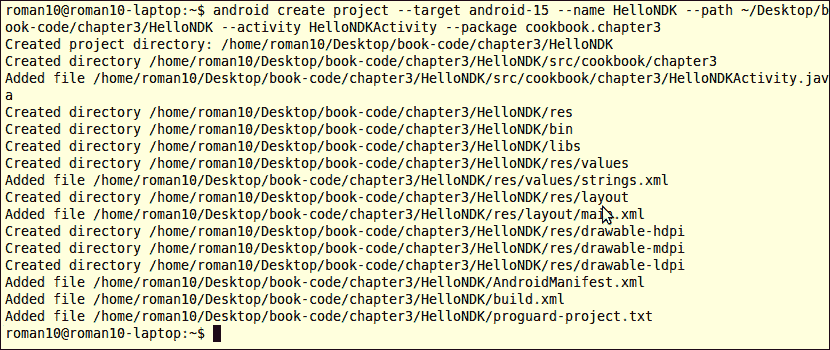

1.  转到`HelloNDK`项目文件夹，并使用以下命令创建一个名为`jni`的文件夹：

    ```kt
    $ cd ~/Desktop/book-code/chapter3/HelloNDK
    $ mkdir jni

    ```

1.  在`jni`文件夹下创建一个名为`hello.c`的文件，并添加以下内容：

    ```kt
    #include <string.h>
    #include <jni.h>

    jstring Java_cookbook_chapter3_HelloNDKActivity_naGetHelloNDKStr(JNIEnv* pEnv, jobject pObj)
    {
       return (*pEnv)->NewStringUTF(pEnv, "Hello NDK!");
    }
    ```

1.  在`jni`文件夹下创建一个名为`Android.mk`的文件，内容如下：

    ```kt
    LOCAL_PATH := $(call my-dir)
    include $(CLEAR_VARS)
    LOCAL_MODULE    := hello
    LOCAL_SRC_FILES := hello.c
    include $(BUILD_SHARED_LIBRARY)
    ```

1.  使用以下命令构建本地库：

    ```kt
    $ ndk-build

    ```

1.  修改`HelloNDKActivity.java`文件为以下内容：

    ```kt
    package cookbook.chapter3;
    import android.app.Activity;
    import android.os.Bundle;
    import android.widget.TextView;
    public class HelloNDKActivity extends Activity {
       @Override
       public void onCreate(Bundle savedInstanceState) {
           super.onCreate(savedInstanceState);
           TextView tv = new TextView(this);
           tv.setTextSize(30);
           tv.setText(naGetHelloNDKStr());
           this.setContentView(tv);
       }
       public native String naGetHelloNDKStr();
       static {
           System.loadLibrary("hello");
       }
    }
    ```

1.  更新项目。我们添加了一个本地库，因此需要使用以下命令更新项目。注意，除非我们更改项目设置，否则此命令只需执行一次，而之前的`ndk-build`命令每次更新本地代码都需要执行：

    ```kt
    $ android update project --target android-15 --name HelloNDK \
    --path ~/Desktop/book-code/chapter3/HelloNDK

    ```

    以下是命令输出的截图：

    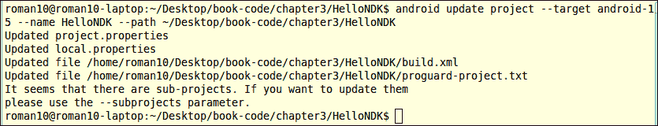

1.  转到项目根文件夹，并使用以下命令以调试模式构建我们的项目：

    ```kt
    $ ant debug

    ```

    在以下截图中，我们展示了输出的最后几行，这表示构建成功的是：

    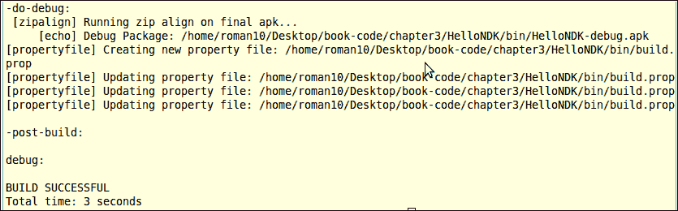

    输出的`apk`文件将生成在`bin/HelloNDK-debug.apk`。

1.  使用以下命令创建一个模拟器：

    ```kt
    $ android --verbose create avd --name android_4_0_3 \
    --target android-15 --sdcard 32M

    ```

    以下是命令输出的截图：

    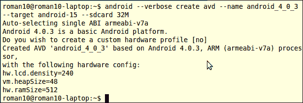

1.  使用以下命令启动模拟器：

    ```kt
    $ emulator -wipe-data -avd android_4_0_3

    ```

    或者，我们可以使用"`android avd`"命令打开**Android 虚拟设备管理器**窗口，然后选择一个模拟器启动，如下所示：

    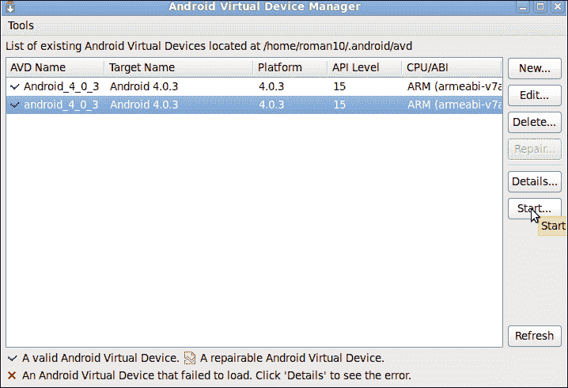

1.  在模拟器上安装应用。我们首先通过以下命令检查设备序列号：

    ```kt
    $ adb devices

    ```

    以下是命令输出的截图：

    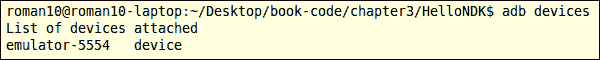

1.  然后，我们使用以下命令将`debug.apk`文件安装到模拟器上：

    ```kt
    $ adb -s emulator-5554 install bin/HelloNDK-debug.apk

    ```

    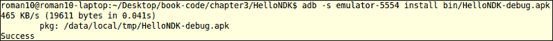

    ### 提示

    如果只有一个设备连接到电脑，那么无需指定设备序列号。在上述命令中，我们可以移除"-`s emulator-5554`"。

1.  使用以下格式的命令在模拟器上启动`HelloNDK`应用：

    ```kt
    $ adb shell am start -n com.package.name/com.package.name.ActivityName

    ```

    在我们的示例中，我们使用以下命令： 

    ```kt
    $ adb -s emulator-5554 shell am start -n cookbook.chapter3/cookbook.chapter3.HelloNDKActivity

    ```

    

1.  在设备上运行应用。

    假设设备序列号为 `HT21HTD09025`，那么我们可以使用以下命令在 Android 设备上安装应用。

    ```kt
    $ adb -s HT21HTD09025 install bin/HelloNDK-debug.apk

    ```

    在我们的示例中，我们使用以下命令来启动应用：

    ```kt
    $ adb -s HT21HTD09025 shell am start -n cookbook.chapter3/cookbook.chapter3.HelloNDKActivity

    ```

1.  创建一个发布包。

一旦我们确认应用程序可以成功运行，我们可能想要创建一个发布包以便上传到 Android 市场。你可以执行以下步骤来实现这一点：

1.  创建一个密钥库。Android 应用必须使用密钥库中的密钥进行签名。一个 **密钥库** 是私钥的集合。我们可以使用以下命令创建带有私钥的密钥库：

    ```kt
    $ keytool -genkey -v -keystore release_key.keystore \
    -alias androidkey \
    -keyalg RSA -keysize 2048 -validity 10000 \
    -dname "CN=MyCompany, OU=MyAndroidDev, O=MyOrg, L=Singapore, S=Singapore, C=65" \
    -storepass testkspw -keypass testkpw

    ```

    以下是命令输出的截图：

    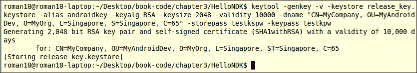

    如所示，创建了一个带有密码为 `testkwpw` 的密钥库，并在其中添加了一个带有密码为 `testkpw` 的 RSA 密钥对。

1.  输入命令 "`ant release`" 为应用构建一个 `apk`。输出可以在 b`i`n 文件夹中找到，文件名为 `HelloNDK-release-unsigned.apk`。

1.  使用以下命令对 `apk` 进行签名：

    ```kt
    $ jarsigner -verbose -keystore <keystore name> -storepass <store password> -keypass <key password> -signedjar <name of the signed output> <unsigned input file name> <alias>

    ```

    对于我们的示例应用程序，命令和输出如下：

    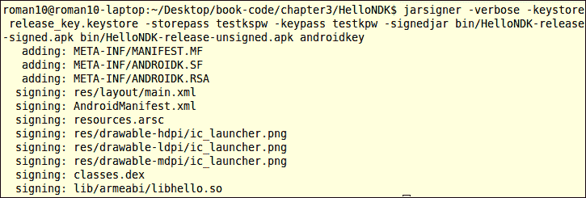

1.  对 `apk` 文件进行 zip 对齐。`zipalign` 工具对 `apk` 文件内的数据进行对齐，以优化性能。以下命令可用于对齐已签名的 `apk`：

    ```kt
    $ zipalign -v 4 <app apk file name>  <aligned apk file name>

    ```

    对于我们的示例应用程序，命令和输出如下：

    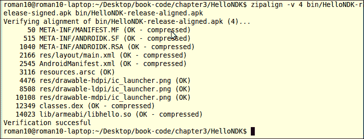

## 工作原理…

本教程介绍如何从命令行构建 Android NDK 应用程序。

Android NDK 提供了一个具有以下目标的构建系统：

+   **简单性**：它为开发者处理了大部分繁重的工作，我们只需要编写简短的构建文件（`Android.mk` 和 `Application.mk`）来描述需要编译的源代码。

+   **兼容性**：未来的版本可能会向 NDK 添加更多构建工具、平台等，但构建文件不需要更改。

Android NDK 提供了一套交叉工具链，包括交叉编译器、交叉链接器、交叉汇编器等。这些工具可以在 NDK `root` 目录下的 `toolchains` 文件夹中找到。它们可用于在 Linux、Mac OS 或 Windows 上为不同的 Android 平台（ARM、x86 或 MIPS）生成二进制文件。尽管可以直接使用工具链来为 Android 构建本地代码，但除非我们正在移植带有自己的构建脚本的项目，否则不推荐这样做。在这种情况下，我们可能只需要将原始编译器更改为 NDK 交叉编译器，以构建适用于 Android 的版本。

在大多数情况下，我们将在 `Android.mk` 中描述源代码，并在 `Application.mk` 上指定 ABIs。Android NDK 的 `ndk-build` 脚本将在内部调用交叉工具链为我们构建本地代码。以下是一些常用的 `ndk-build` 选项列表：

+   `ndk-build`：它用于构建二进制文件。

+   `ndk-build clean`：它清理生成的二进制文件。

+   `ndk-build V=1`：构建二进制文件并显示构建命令。当我们想要了解构建过程或检查构建错误时，这很方便。

+   `ndk-build -B`：此命令强制重新构建。

+   `ndk-build NDK_DEBUG=1`：生成可调试的构建。

+   `ndk-build NDK_DEBUG=0`：生成发布版本。

## 还有更多内容...

本教程使用了许多 Android SDK 的命令行工具。这允许我们提供如何创建、构建和部署 Android NDK 项目的完整说明。然而，由于本书专注于 Android NDK，因此不会详细介绍这些工具。你可以访问[`developer.android.com/tools/help/index.html`](http://developer.android.com/tools/help/index.html)了解更多关于这些工具的信息。

### 从命令行截取屏幕截图

从命令行截取屏幕截图对于记录自动化测试的显示结果很有帮助。然而，目前 Android 没有提供用于截屏的命令行工具。

可以使用位于 Android 源代码`\development\tools\screenshot\src\com\android\screenshot\`的 Java 程序来截取屏幕截图。该代码使用了与 Eclipse DDMS 插件类似的方法从命令行截取屏幕截图。我们将前面的代码整合到一个名为`screenshot`的 Eclipse Java 项目中，可以从网站下载。

用户可以导入项目并导出一个可执行的 JAR 文件来使用该工具。假设导出的 JAR 文件名为`screenshot.jar`，那么以下示例命令使用它从模拟器中截取屏幕：

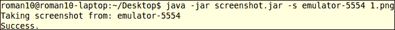

# 在 Eclipse 中构建 Android NDK 应用程序

上一教程讨论了如何在命令行中构建 Android NDK 应用程序。本教程演示如何在 Eclipse IDE 中完成此操作。

## 准备就绪

添加 NDK 首选项。启动 Eclipse，然后点击**窗口** | **首选项**。在**首选项**窗口中，选择**Android**下的**NDK**。点击**浏览**并选择 NDK 的`根`文件夹。点击**确定**。

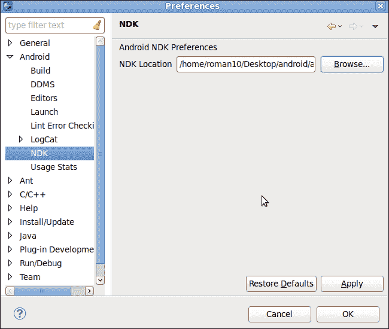

## 如何操作…

以下步骤使用 Eclipse 创建一个 NDK 项目：

1.  创建一个名为`HelloNDKEclipse`的 Android 应用程序。将包名设置为`cookbook.chapter3`。创建一个名为`HelloNDKEclipseActivity`的活动。如果你需要更详细的说明，请参考第二章，*Java Native Interface*中的*加载本地库和注册本地方法*教程。

1.  右键点击项目`HelloNDKEclipse`，选择**Android Tools** | **添加本地支持**。会出现一个类似以下截图的窗口。点击**完成**以关闭它：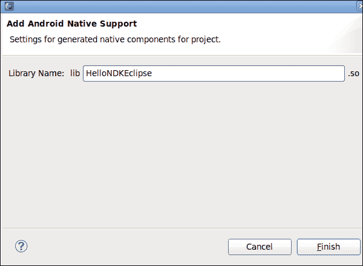

    这将在内部添加一个包含两个文件（`HelloNDKEclipse.cpp`和`Android.mk`）的`jni`文件夹，并将 Eclipse 切换到 C/C++透视图。

1.  向`HelloNDKEclipse.cpp`中添加以下内容：

    ```kt
    #include <jni.h>

    jstring getString(JNIEnv* env) {
      return env->NewStringUTF("Hello NDK");
    }

    extern "C" {
      JNIEXPORT jstring JNICALL Java_cookbook_chapter3_HelloNDKEclipseActivity_getString(JNIEnv* env, jobject o){
        return getString(env);
      }
    }
    ```

1.  将 HelloNDKEclipseActivity.java 的内容更改为以下内容。

    ```kt
    package cookbook.chapter3;

    import android.os.Bundle;
    import android.app.Activity;
    import android.widget.TextView;

    public class HelloNDKEclipseActivity extends Activity {
      @Override
       public void onCreate(Bundle savedInstanceState) {
           super.onCreate(savedInstanceState);
           TextView tv = new TextView(this);
           tv.setTextSize(30);
           tv.setText(getString());
           this.setContentView(tv);
       }
       public native String getString();
       static {
           System.loadLibrary("HelloNDKEclipse");
       }
    }
    ```

1.  右键点击 `HelloNDKEclipse` 项目，选择 **构建项目**。这将为我们构建本地库。

1.  右键点击项目，选择 **运行方式**，然后选择 **Android 应用程序**。手机屏幕将显示类似于以下截图的内容：

## 它是如何工作的...

本食谱讨论在 Eclipse 中构建 Android NDK 应用程序。

在所有之前的食谱中我们一直在使用 C。从本食谱开始，我们将用 C++ 编写代码。

默认情况下，Android 提供了最小的 C++ 支持。没有 **运行时类型信息** (**RTTI**) 和 C++ 异常支持，甚至 C++ 标准库支持也是部分的。以下是 Android NDK 默认支持的 C++ 头文件列表：

```kt
cassert, cctype, cerrno, cfloat, climits, cmath, csetjmp, csignal, cstddef, cstdint, cstdio, cstdlib, cstring, ctime, cwchar, new, stl_pair.h, typeinfo, utility
```

通过使用不同的 C++ 库，有可能增加对 C++ 的支持。NDK 除了系统默认库之外，还提供了 `gabi++`、`stlport` 和 `gnustl` C++ 库。

在我们的示例代码中，我们使用了外部 "C" 来包装 C++ 方法。这样做是为了避免 JNI 函数名被 C++ 糟蹋。C++ 名称糟蹋可能会改变函数名以包含关于参数的类型信息，函数是否为虚函数等。虽然这使得 C++ 能够链接重载函数，但它破坏了 JNI 函数发现机制。

我们还可以使用 第二章 *Java Native Interface* 中 *加载本地库和注册本地方法* 食谱中涵盖的显式函数注册方法来摆脱包装。

# 为不同的 ABI 构建一个 Android NDK 应用程序

本地代码被编译成二进制文件。因此，一组二进制文件只能在一个特定的架构上运行。Android NDK 提供了技术和工具，使开发者能够轻松地为多个架构编译相同的源代码。

## 准备就绪

一个 **应用程序二进制接口** (**ABI**) 定义了 Android 应用程序的机器代码如何在运行时与系统交互，包括 CPU 指令集、字节序、内存对齐等。ABI 基本上定义了一种架构类型。

下表简要总结了 Android 支持的四个 ABI：

| ABI 名称 | 支持 | 不支持 | 可选 |
| --- | --- | --- | --- |
| `armeabi` |

+   ARMv5TE 指令集

+   Thumb（也称为 Thumb-1）指令

| 硬件辅助浮点计算 |   |
| --- | --- |
| `armeabi-v7a` |

+   `armeabi` 支持的所有内容

+   VFP 硬件 FPU 指令

+   Thumb-2 指令集

+   VFPv3-D16 被使用。

|   |
| --- |

+   高级 SIMD（也称为 NEON）

+   VFPv3-D32

+   ThumbEE

|

| `x86` |
| --- |

+   通常称为 "x86" 或 "IA-32" 的指令集。

+   MMX、SSE、SSE2 和 SSE3 指令集扩展

|   |
| --- |

+   MOVBE 指令

+   SSSE3 "补充 SSE3" 扩展

+   任何 "SSE4" 的变体

|

| `mips` |
| --- |

+   MIPS32r1 指令集

+   硬浮点

+   O32

|

+   DSP 应用特定扩展

+   MIPS16

+   micromips

|   |
| --- |

armeabi 和 armeabi-v7a 是 Android 设备最常用的两种 ABI。ABI armeabi-v7a 与 armeabi 兼容，这意味着为 armeabi 编译的应用程序也可以在 armeabi-v7a 上运行。但反之则不成立，因为 armeabi-v7a 包含额外的功能。在以下部分中，我们将简要介绍在 armeabi 和 armeabi-v7a 中经常提到的一些技术术语。

+   **Thumb**：这个指令集由 16 位指令组成，是标准 ARM 32 位指令集的一个子集。某些 32 位指令集中的指令在 Thumb 中不可用，但可以用几个 Thumb 指令来模拟。更窄的 16 位指令集可以提供内存优势。

    Thumb-2 通过添加一些 32 位指令扩展了 Thumb-1，从而形成了一种可变长度指令集。Thumb-2 旨在像 Thumb-1 一样实现代码密度，并在 32 位内存上实现与标准 ARM 指令集相似的性能。

    Android NDK 默认生成 thumb 代码，除非在 `Android.mk` 文件中定义了 `LOCAL_ARM_MODE`。

+   **向量浮点（VFP）**：它是 ARM 处理器的扩展，提供了低成本的浮点计算功能。

+   **VFPv3-D16 和 VFPv3-D32**：VFPv3-D16 指的是 16 个专用的 64 位浮点寄存器。同样，VFPv3-D32 意味着有 32 个 64 位浮点寄存器。这些寄存器加速了浮点计算。

+   **NEON**：NEON 是 ARM **高级单指令多数据（SIMD）** 指令集扩展的昵称。它需要 VFPv3-D32 支持，这意味着将使用 32 个硬件浮点单元 64 位寄存器。它提供了一系列标量/向量指令和寄存器，这些在 x86 世界中与 MMX/SSE/SDNow!相当。并非所有 Android 设备都支持 NEON，但许多新设备已经具备 NEON 支持。NEON 可以通过同时执行多达 16 个操作，显著加速媒体和信号处理应用程序。

有关更详细信息，可以参考 ARM 文档网站 [`infocenter.arm.com/help/index.jsp`](http://infocenter.arm.com/help/index.jsp)。这里我们不讨论 x86 和 mips ABI，因为很少有 Android 设备运行在这些架构上。

在进行这一步之前，请阅读 *在 Eclipse 中构建 Android NDK 应用程序* 的菜谱。

## 如何进行操作...

以下步骤为不同的 ABI 构建 Android 项目：

1.  创建一个名为 `HelloNDKMultipleABI` 的 Android 应用程序。将包名设置为 `cookbook.chapter3`。创建一个名为 `HelloNDKMultipleABIActivity` 的活动。

1.  右键点击 `HelloNDKMultipleABI` 项目，选择 **Android Tools** | **Add Native Support**。出现一个窗口，点击 **Finish** 关闭它。这将添加一个包含两个文件（`HelloNDKMultipleABI.cpp` 和 `Android.mk`）的 `jni` 文件夹，并将 Eclipse 切换到 C/C++视角。

1.  在 `HelloNDKMultipleABI.cpp` 文件中添加以下内容：

    ```kt
    #include <jni.h>

    jstring getString(JNIEnv* env) {
      return env->NewStringUTF("Hello NDK");
    }

    extern "C" {
      JNIEXPORT jstring JNICALL Java_cookbook_chapter3_HelloNDKMultipleABIActivity_getString(JNIEnv* env, jobject o){
        return getString(env);
      }
    }
    ```

1.  将 `HelloNDKMultipleABIActivity.java` 文件更改为以下内容：

    ```kt
    package cookbook.chapter3;

    import android.os.Bundle;
    import android.app.Activity;
    import android.widget.TextView;

    public class HelloNDKMultipleABIActivity extends Activity {

       @Override
       public void onCreate(Bundle savedInstanceState) {
           super.onCreate(savedInstanceState);
           TextView tv = new TextView(this);
           tv.setTextSize(30);
           tv.setText(getString());
           this.setContentView(tv);
       }
       public native String getString();
       static {
           System.loadLibrary("HelloNDKMultipleABI");
       }
    }
    ```

1.  在项目的`jni`文件夹下添加一个名为`Application.mk`的新文件，内容如下：

    ```kt
    APP_ABI := armeabi armeabi-v7a
    ```

1.  右键点击`HelloNDKMultipleABIActivity`项目，选择**构建项目**。这将为我们构建原生库。

1.  创建两个模拟器，分别将 ABI 设置为`armeabi`和`armeabi-v7a`。以下截图展示了如何创建一个 ABI 为`armeabi`的模拟器：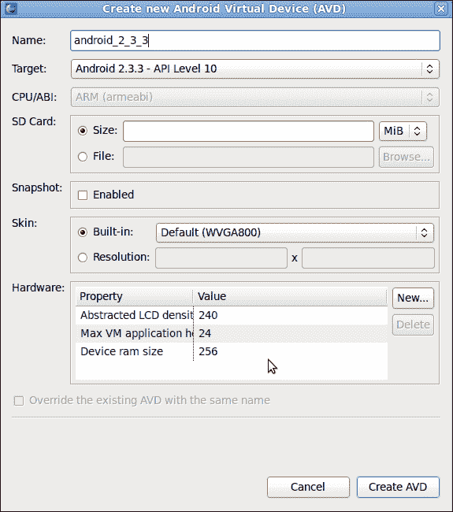

1.  在两个模拟器上运行示例 Android 应用程序。在它们上面显示的结果相同：

1.  将`Application.mk`的内容更改为以下代码片段，并在两个模拟器上运行示例应用程序。应用程序仍然可以在两个模拟器上运行：

    ```kt
    #APP_ABI := armeabi armeabi-v7a
    APP_ABI := armeabi
    ```

1.  将`Application.mk`的内容更改如下：

    ```kt
    #APP_ABI := armeabi armeabi-v7a
    #APP_ABI := armeabi
    APP_ABI := armeabi-v7a
    ```

1.  在两个模拟器上运行示例应用程序。应用程序在`armeabi-v7a`模拟器上运行，但在`armeabi`模拟器上会崩溃，如下面的截图所示：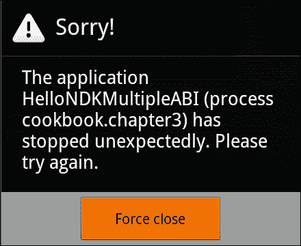

## 工作原理…

一个 Android 设备可以定义一个或两个 ABI。对于基于 x86、MIPS、ARMv5 和 ARMv6 的典型设备，只有一个首要 ABI。根据平台，它可以是 x86、mips 或 armeabi。对于基于典型 ARMv7 的设备，首要 ABI 通常是 armeabi-v7a，它还有一个次要 ABI 为 armeabi。这使得编译为 armeabi 或 armeabi-v7a 的二进制文件可以在 ARMv7 设备上运行。在我们的示例中，我们证明了当只针对 armeabi 构建时，应用程序可以在 armeabi 和 armeabi-v7a 模拟器上运行。

在安装时，Android 包管理器会搜索为首要 ABI 构建的原生库，并将其复制到应用程序的数据目录中。如果没有找到，它会搜索为次要 ABI 构建的原生库。这确保只有正确的原生库被安装。

在我们的示例中，当我们只针对 armeabi-v7a 编译二进制文件时，原生库将不会安装在 armeabi 模拟器上，因此无法加载原生库，并且会显示崩溃。

# 为不同的 CPU 特性构建 Android NDK 应用程序

许多项目使用原生代码以提高性能。与 SDK 开发相比，在 NDK 中开发的一个优点是我们可以为不同的 CPU 构建不同的包，这正是本食谱的主题。

## 准备就绪

在继续本食谱之前，请阅读《为不同 ABI 构建 Android NDK 应用程序》的食谱。

## 如何操作…

以下步骤为不同的 CPU 特性构建 Android NDK 应用程序。

1.  在 Eclipse 中，点击**文件** | **新建** | **其他**。在**Android**下选择**现有代码**中的**Android 项目**，如下面的截图所示。然后点击**下一步**：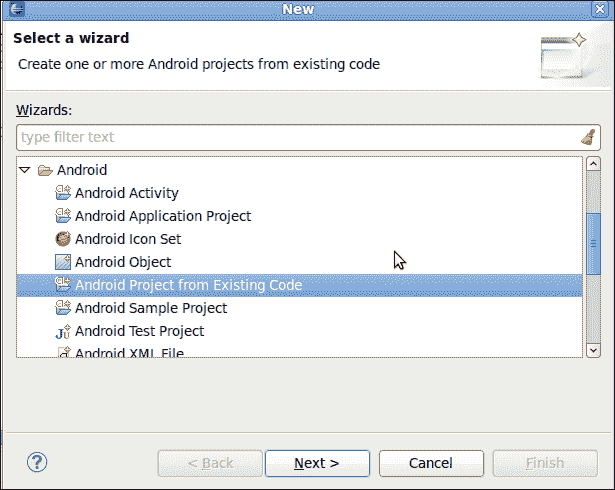

1.  浏览到 Android NDK 文件夹中的`samples/hello-neon`文件夹。然后点击**完成**。

1.  启动终端，然后进入`samples/hello-neon/jni`文件夹。输入命令"`ndk-build`"以构建二进制文件。

1.  在不同的设备和模拟器上运行安卓项目。根据你的设备/模拟器 ABI 和 NEON 特性的可用性，你应该能够看到如下结果：

    +   对于具有 armeabi ABI 的安卓设备，结果如下：

    +   对于具有 armeabi-v7a ABI 和 NEON 的安卓设备，结果如下：

    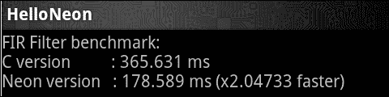

## 工作原理…

安卓设备大致可以通过 ABIs 来划分。然而，具有相同 ABI 的不同设备可能有不同的 CPU 扩展和特性。这些扩展和特性是可选的，因此我们在运行时之前无法知道用户的设备是否具备这些特性。在某些设备上，检测并利用这些特性有时可以显著提高应用性能。

安卓 NDK 包含一个名为`cpufeatures`的库，可以在运行时用来检测 CPU 家族和可选特性。正如示例代码所示，以下步骤指示如何使用这个库：

1.  在`Android.mk`的静态库列表中添加，如下所示：

    ```kt
    LOCAL_STATIC_LIBRARIES := cpufeatures
    ```

1.  在`Android.mk`文件的末尾，导入`cpufeatures`模块：

    ```kt
    $(call import-module,cpufeatures)
    ```

1.  在代码中，包含头文件`<cpu-features.h>`。

1.  调用检测函数；目前`cpufeatures`只提供三个函数：

1.  获取 CPU 家族。函数原型如下：

    ```kt
    AndroidCpuFamily   android_getCpuFamily(); 
    ```

    它返回一个枚举。支持的 CPU 系列在下面的章节中列出。

    ```kt
    ANDROID_CPU_FAMILY_MIPS 
    ANDROID_CPU_FAMILY_MIPS 
    ANDROID_CPU_FAMILY_ARM 
    ```

1.  获取可选的 CPU 特性。每个 CPU 特性由一个位标志表示，如果特性可用，该位设置为`1`。函数原型如下：

    ```kt
    uint64_t   android_getCpuFeatures();
    ```

对于 ARM CPU 家族，支持的 CPU 特性检测如下：

+   `ANDROID_CPU_ARM_FEATURE_ARMv7`：这意味着支持 ARMv7-a 指令。

+   `ANDROID_CPU_ARM_FEATURE_VFPv3`：这意味着支持 VFPv3 硬件 FPU 指令集扩展。请注意，这里指的是 VFPv3-D16，它提供 16 个硬件浮点寄存器。

+   `ANDROID_CPU_ARM_FEATURE_NEON`：这意味着支持 ARM 高级 SIMD（也称为 NEON）向量指令集扩展。请注意，这样的 CPU 也支持 VFPv3-D32，它提供 32 个硬件浮点寄存器。

对于 x86 CPU 家族，支持的 CPU 特性检测如下：

+   `ANDROID_CPU_X86_FEATURE_SSSE3`：这意味着支持`SSSE3`指令扩展集。

+   `ANDROID_CPU_X86_FEATURE_POPCNT`：这意味着支持`POPCNT`指令。

+   `ANDROID_CPU_X86_FEATURE_MOVBE`：这意味着支持`MOVBE`指令。

我们可以进行"`&`"操作来检测一个特性是否可用，如下所示：

```kt
uint64_t features = android_getCpuFeatures();
if ((features & ANDROID_CPU_ARM_FEATURE_NEON) == 0) {
  //NEON is not available
} else {
  //NEON is available
}
```

获取设备上的 CPU 核心数：

```kt
int         android_getCpuCount(void);
```

### 提示

自从 NDK r8c 以来，更多的 CPU 特性检测可用。更多详情请参考`sources/android/cpufeatures/cpu-features.c`。

## 还有更多…

关于安卓上的 CPU 特性还有几个值得注意的点。

### 关于 CPU 特性检测的更多信息

`cpufeatures`库只能检测有限的 CPU 特性集。我们可以实现自己的 CPU 检测机制。通过查看 NDK 源代码在`/sources/android/cpufeatures/`，可以发现`cpufeatures`库本质上查看的是`/proc/cpuinfo`文件。我们可以读取这个文件，并在我们的应用程序中解析内容。以下是文件内容的截图：

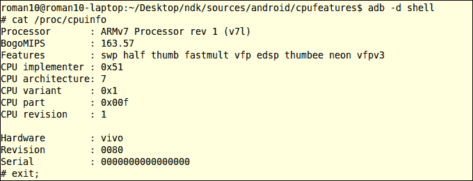

请参考本书网站上的 Android 项目`cpuinfo`，了解如何通过编程方式实现这一点。

### 为不同的 CPU 特性构建的不同方法

为不同的 CPU 特性构建本地代码有几种方法：

+   **单一库，构建时不同的二进制文件**：这也在示例项目中演示。`helloneon-intrinsics.c`文件仅针对 armeabi-v7a ABI 编译。

+   **单一库，运行时不同的执行路径**：这也在示例项目中展示。代码在运行时检测 NEON 特性是否可用，并执行不同的代码块。

+   **不同库，运行时加载适当的库**：有时，我们可能希望将源代码编译成不同的库，并通过名称区分它们。例如，我们可能有`libmylib-neon.so`和`libmylib-vfpv3.so`。我们在运行时检测 CPU 特性并加载适当的库。

+   **不同包，运行时加载适当的库**：如果库很大，最好为不同的 CPU 部署不同的二进制文件作为单独的包。这是 Google Play 上许多视频播放器（例如 MX Player）的做法。

# 使用日志消息调试 Android NDK 应用程序

Android 日志系统提供了一种从各种应用程序收集日志到一系列循环缓冲区的方法。使用`logcat`命令查看日志。日志消息是调试程序最简单的方法之一，也是最强大的方法之一。本食谱重点关注 NDK 中的消息日志记录。

## 如何实现…

以下步骤创建我们的示例 Android 项目：

1.  创建一个名为`NDKLoggingDemo`的 Android 应用程序。将包名设置为`cookbook.chapter3`。创建一个名为`NDKLoggingDemoActivity`的活动。如果你需要更详细的说明，请参考第二章，*Java Native Interface*中的*加载本地库和注册本地方法*食谱。

1.  右键点击项目`NDKLoggingDemo`，选择**Android Tools** | **Add Native Support**。出现一个窗口，点击**Finish**关闭它。

1.  在`jni`文件夹下添加一个名为`mylog.h`的新文件，并向其中添加以下内容：

    ```kt
    #ifndef COOKBOOK_LOG_H
    #define COOKBOOK_LOG_H

    #include <android/log.h>

    #define LOG_LEVEL 9
    #define LOG_TAG "NDKLoggingDemo"

    #define LOGU(level, ...) if (level <= LOG_LEVEL) {__android_log_print(ANDROID_LOG_UNKNOWN, LOG_TAG, __VA_ARGS__);}
    #define LOGD(level, ...) if (level <= LOG_LEVEL) {__android_log_print(ANDROID_LOG_DEFAULT, LOG_TAG, __VA_ARGS__);}
    #define LOGV(level, ...) if (level <= LOG_LEVEL) {__android_log_print(ANDROID_LOG_VERBOSE, LOG_TAG, __VA_ARGS__);}
    #define LOGDE(level, ...) if (level <= LOG_LEVEL) {__android_log_print(ANDROID_LOG_DEBUG, LOG_TAG, __VA_ARGS__);}
    #define LOGI(level, ...) if (level <= LOG_LEVEL) {__android_log_print(ANDROID_LOG_INFO, LOG_TAG, __VA_ARGS__);}
    #define LOGW(level, ...) if (level <= LOG_LEVEL) {__android_log_print(ANDROID_LOG_WARN, LOG_TAG, __VA_ARGS__);}
    #define LOGE(level, ...) if (level <= LOG_LEVEL) {__android_log_print(ANDROID_LOG_ERROR, LOG_TAG, __VA_ARGS__);}
    #define LOGF(level, ...) if (level <= LOG_LEVEL) {__android_log_print(ANDROID_LOG_FATAL, LOG_TAG, __VA_ARGS__);}
    #define LOGS(level, ...) if (level <= LOG_LEVEL) {__android_log_print(ANDROID_LOG_SILENT, LOG_TAG, __VA_ARGS__);}

    #endif
    ```

1.  向`NDKLoggingDemo.cpp`添加以下内容：

    ```kt
    #include <jni.h>
    #include "mylog.h"

    void outputLogs() {
      LOGU(9, "unknown log message");
      LOGD(8, "default log message");
      LOGV(7, "verbose log message");
      LOGDE(6, "debug log message");
      LOGI(5, "information log message");
      LOGW(4, "warning log message");
      LOGE(3, "error log message");
      LOGF(2, "fatal error log message");
      LOGS(1, "silent log message");
    }

    extern "C" {
      JNIEXPORT void JNICALL Java_cookbook_chapter3_NDKLoggingDemoActivity_LoggingDemo(JNIEnv* env, jobject o){
        outputLogs();
      }
    }
    ```

1.  更改`NDKLoggingDemoActivity.java`的内容为以下：

    ```kt
    package cookbook.chapter3;

    import android.os.Bundle;
    import android.app.Activity;

    public class NDKLoggingDemoActivity extends Activity {
       @Override
       public void onCreate(Bundle savedInstanceState) {
           super.onCreate(savedInstanceState);
           LoggingDemo();
       }
       public native void LoggingDemo();
       static {
           System.loadLibrary("NDKLoggingDemo");
       }
    }
    ```

1.  更改`Android.mk`文件，如下包含 Android 日志库：

    ```kt
    LOCAL_PATH := $(call my-dir)

    include $(CLEAR_VARS)

    LOCAL_MODULE    := NDKLoggingDemo
    LOCAL_SRC_FILES := NDKLoggingDemo.cpp
    LOCAL_LDLIBS := -llog
    include $(BUILD_SHARED_LIBRARY)
    ```

1.  右键点击`NDKLoggingDemo`项目，并选择**Build Project**。

1.  输入以下命令开始监控`logcat`输出。然后，在 Android 设备上启动示例 Android 应用：

    ```kt
    $ adb logcat -c
    $ adb logcat NDKLoggingDemo:I *:S -v time

    ```

    以下是`logcat`输出的屏幕截图：

    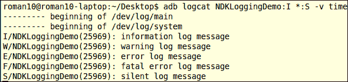

1.  启动另一个命令行终端，并在其中输入以下命令：

    ```kt
    $ adb logcat NDKLoggingDemo:V *:S -v time

    ```

    这将导致以下输出：

    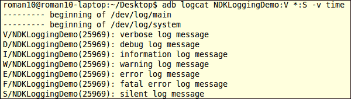

1.  将`mylog.h`中的行从`#define LOG_LEVEL 9`更改为`#define LOG_LEVEL 4`。重新构建应用程序，然后重新启动应用程序。

1.  我们之前启动的两个终端的输出是相同的。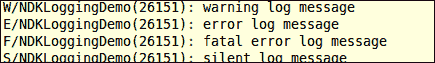

## 它是如何工作的...

本食谱展示了如何使用 Android 日志消息。Android 中的每个日志消息由以下三部分组成：

+   **优先级**：通常用于过滤日志消息。在我们的项目中，我们可以通过更改以下代码来控制日志：

    ```kt
    #define LOG_LEVEL 4 
    ```

    另外，我们可以使用`logcat`有选择性地显示日志输出。

+   **日志标签**：通常用于标识日志来源。

+   **日志信息**：它提供了详细的日志信息。

### 提示

在 Android 上发送日志消息会消耗 CPU 资源，频繁的日志消息可能会影响应用程序性能。此外，日志存储在一个循环缓冲区中。过多的日志会覆盖一些早期的日志，这可能是我们不希望看到的。由于这些原因，建议我们在发布版本中只记录错误和异常。

`logcat`是查看 Android 日志的命令行工具。它可以根据日志标签和优先级过滤日志，并能够以不同的格式显示日志。

例如，在前面*如何操作…*部分的步骤 8 中，我们使用了以下`logcat`命令。

```kt
adb logcat NDKLoggingDemo:I *:S -v time
```

该命令过滤除了具有`NDKLoggingDemo`标签和优先级`I`（信息）或更高优先级的日志。过滤器以`tag:priority`格式给出。`NDKLoggingDemo:I`表示将显示具有`NDKLoggingDemo`标签和优先级信息或更高的日志。`*:S`将所有其他标签的优先级设置为“静默”。

关于`logcat`过滤和格式的更多详细信息可以在[`developer.android.com/tools/help/logcat.html`](http://developer.android.com/tools/help/logcat.html)和[`developer.android.com/tools/debugging/debugging-log.html#outputFormat`](http://developer.android.com/tools/debugging/debugging-log.html#outputFormat)找到。

# 使用`CheckJNI`调试 Android NDK 应用程序

JNI 为了更好的性能，错误检查很少。因此，错误通常会导致崩溃。Android 提供了一个名为`CheckJNI`的模式。在这个模式下，将调用具有扩展检查的 JNI 函数集，而不是正常的 JNI 函数。本食谱讨论如何启用`CheckJNI`模式以调试 Android NDK 应用程序。

## 如何操作...

以下步骤创建一个示例 Android 项目并启用`CheckJNI`模式：

1.  创建一个名为`CheckJNIDemo`的 Android 应用程序。将包名设置为`cookbook.chapter3`。创建一个名为`CheckJNIDemoActivity`的活动。如果你想获得更详细的说明，请参考第二章中的*加载本地库和注册本地方法*菜谱。

1.  右键点击项目`CheckJNIDemo`，选择**Android Tools** | **添加本地支持**。会出现一个窗口；点击**完成**以关闭它。

1.  向`CheckJNIDemo.cpp`添加以下内容。

1.  将`CheckJNIDemoActivity.java`更改为以下内容：

    ```kt
    package cookbook.chapter3;
    import android.os.Bundle;
    import android.app.Activity;

    public class CheckJNIDemoActivity extends Activity {
       @Override
       public void onCreate(Bundle savedInstanceState) {
           super.onCreate(savedInstanceState);
           setContentView(R.layout.activity_check_jnidemo);
           CheckJNIDemo();
       }
       public native int[] CheckJNIDemo();
       static {
           System.loadLibrary("CheckJNIDemo");
       }
    }
    ```

1.  右键点击`CheckJNIDemo`项目，并选择**构建项目**。

1.  在命令行控制台输入"`adb logcat -v time`"启动 monitor logcat 输出。然后在 Android 设备上启动示例 Android 应用。应用程序将崩溃，logcat 输出将如下显示：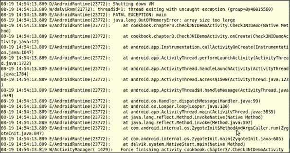

1.  启用 CheckJNI。

    +   当你使用模拟器时，CheckJNI 默认是开启的。

    +   如果你使用的是已获得 root 权限的设备，可以使用以下命令序列重新启动启用了 CheckJNI 的运行时。这些命令停止正在运行的 Android 实例，更改系统属性以启用 CheckJNI，然后重新启动 Android。

        ```kt
        $ adb shell stop
        $ adb shell setprop dalvik.vm.checkjni true
        $ adb shell start

        ```

    +   如果你有一个常规设备，你可以使用以下命令：

        ```kt
        $ adb shell setprop debug.checkjni 1

        ```

1.  再次运行 Android 应用程序。logcat 输出将如下显示：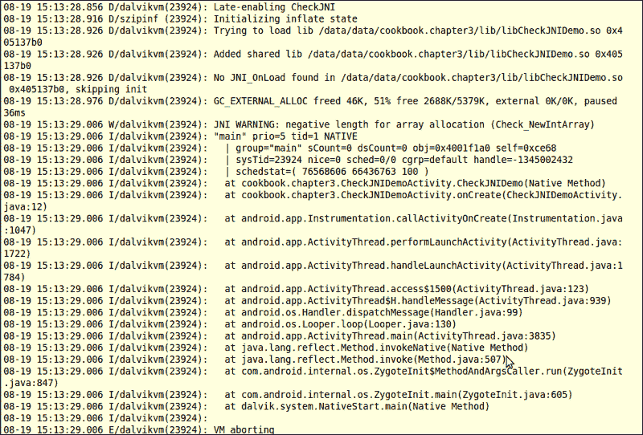

## 工作原理...

CheckJNI 模式使用一组 JNI 函数，这些函数比默认的具有更多的错误检查。这使得查找 JNI 编程错误变得更加容易。目前，CheckJNI 模式检查以下错误：

+   **负尺寸数组**：它尝试分配一个负尺寸的数组。

+   **错误引用**：它向 JNI 函数传递了错误的引用`jarray`/`jclass`/`jobject`/`jstring`。向期望非`NULL`参数的 JNI 函数传递`NULL`。

+   **类名**：它向 JNI 函数传递了无效样式的类名。有效的类名由"`/`"分隔，例如"`java`/`lang`/`String`"。

+   **关键调用**：它在“关键”get 函数及其相应的释放之间调用一个 JNI 函数。

+   **异常**：它在有挂起异常时调用 JNI 函数。

+   **jfieldIDs**：它会无效化`jfieldIDs`或将`jfieldIDs`从一个类型赋值给另一个类型。

+   **jmethodIDs**：它与 jfieldIDs 类似。

+   **引用**：它对错误类型的引用使用`DeleteGlobalRef`/`DeleteLocalRef`。

+   **释放模式**：它向释放调用传递了除了`0`、`JNI_ABORT`和`JNI_COMMIT`之外的释放模式。

+   **类型安全**：它从一个本地方法返回了不兼容的类型。

+   **UTF-8**：它向 JNI 函数传递了无效的修改后的 UTF-8 字符串。

随着 Android 的发展，可能会向 CheckJNI 中添加更多的错误检查。目前，以下检查还不受支持：

+   本地引用的误用

# 使用 NDK GDB 调试 Android NDK 应用程序

Android NDK 引入了一个名为`ndk-gdb`的 shell 脚本，帮助启动一个调试会话来调试本地代码。

## 准备工作

要使用`ndk-gdb`调试项目，项目必须满足以下要求：

+   应用程序是通过`ndk-build`命令构建的。

+   `AndroidManifest.xml`中的`<application>`元素的`android:debuggable`属性设置为`true`。这表示即使应用程序在用户模式下运行在设备上，应用程序也是可调试的。

+   应用程序应该在 Android 2.2 或更高版本上运行。

在进行这一步之前，请阅读*在 Eclipse 中构建 Android NDK 应用程序*的菜谱。

## 如何操作...

以下步骤创建一个示例 Android 项目，并使用 NDK GDB 进行调试。

1.  创建一个名为`HelloNDKGDB`的 Android 应用程序。将包名设置为`cookbook.chapter3`。创建一个名为`HelloNDKGDBActivity`的活动。如果你需要更详细的说明，请参考第二章，*Java Native Interface*中的*加载本地库和注册本地方法*的菜谱。

1.  右键点击项目`HelloNDKGDB`，选择**Android Tools** | **添加本地支持**。会出现一个窗口；点击**完成**关闭它。

1.  向`HelloNDKGDB.cpp`文件中添加以下代码：

    ```kt
    #include <jni.h>
    #include <unistd.h>

    int multiply(int i, int j) {
      int x = i * j;
      return x;
    }

    extern "C" {
      JNIEXPORT jint JNICALL Java_cookbook_chapter3_HelloNDKGDBActivity_multiply(JNIEnv* env, jobject o, jint pi, jint pj){
        int i = 1, j = 0;
        while (i) {
          j=(++j)/100; 

        }
        return multiply(pi, pj);
      }
    }
    ```

1.  将`HelloNDKGDBActivity.java`的内容更改为以下内容：

    ```kt
    package cookbook.chapter3;

    import android.os.Bundle;
    import android.widget.TextView;
    import android.app.Activity;

    public class HelloNDKGDBActivity extends Activity {

       @Overridepublic void onCreate(Bundle savedInstanceState) {
           super.onCreate(savedInstanceState);
           TextView tv = new TextView(this);
           tv.setTextSize(30);
           tv.setText("10 x 20 = " + multiply(10, 20));
           this.setContentView(tv);
       }
       public native int multiply(int a, int b);
       static {
           System.loadLibrary("HelloNDKGDB");
       }
    }
    ```

1.  确保在`AndroidManifest.xml`中的`debuggable`属性设置为`true`。以下代码段是从我们示例项目的`AndroidManifest.xml`中的应用程序元素中提取的一部分：

    ```kt
    <application
           android:icon="@drawable/ic_launcher"
           android:label="@string/app_name"
           android:theme="@style/AppTheme"
           android:debuggable="true"
           >
    ```

1.  使用命令"`ndk-build NDK_DEBUG=1`"构建本地库。或者，我们可以在 Eclipse 中配置项目的**属性**下的**C/C++ Build**中的`build`命令。这在*在 Eclipse 中调试 Android NDK 应用程序*的菜谱中有演示。

1.  在 Android 设备上运行应用程序。然后，启动一个终端并输入以下命令：

    ```kt
    $ ndk-gdb

    ```

1.  一旦调试器连接到远程进程，我们就可以发出 GDB 命令开始调试应用程序。如下所示：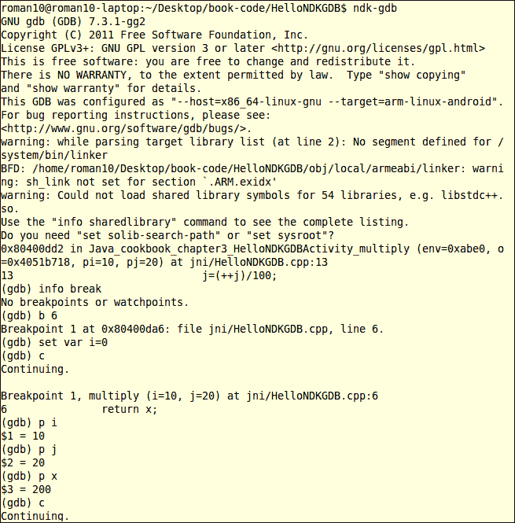

## 工作原理...

随 Android NDK 附带的名为`ndk-gdb`的 shell 脚本可以启动本地调试会话与本地代码。为了使用`ndk-gdb`，我们必须以调试模式构建本地代码。这将生成一个`gdbserver`二进制文件和一个`gdb.setup`文件以及本地库。在安装时，`gdbserver`将被安装并在 Android 设备上启动`gdbserver`。

默认情况下，`ndk-gdb`会搜索正在运行的应用程序，并将`gdbserver`附加到它上面。也有选项可以在开始调试之前自动启动应用程序。因为应用程序在`gdbserver`附加之前首先启动，所以在调试之前会执行一些代码。如果我们想调试在应用程序启动时执行的代码，可以插入一个`while(true)`块。调试会话开始后，我们改变标志值以跳出`while(true)`块。这在我们示例项目中得到了演示。

调试会话开始后，我们可以使用`gdb`命令来调试我们的代码。

# 使用 CGDB 调试 Android NDK 应用程序

CGDB 是基于终端的轻量级 GNU 调试器`gdb`的界面。它提供了一个分割屏幕视图，同时显示源代码和调试信息。本教程将讨论如何使用`cgdb`调试 Android 应用程序。

## 准备工作

以下是在不同操作系统上安装`cgdb`的说明：

+   如果您使用的是 Ubuntu，可以使用以下命令安装`cgdb`：

    ```kt
    $ sudo apt-get install cgdb

    ```

    或者，您可以从[`cgdb.github.com/`](http://cgdb.github.com/)下载源代码，并按照以下说明安装`cgdb`：

    ```kt
    $ ./configure --prefix=/usr/local
    $ make
    $ sudo make install

    ```

    注意，`cgdb`需要`libreadline`和`ncurses`开发库。

+   如果您使用的是 Windows 系统，可以在[`cgdb.sourceforge.net/download.php`](http://cgdb.sourceforge.net/download.php)找到 Windows 二进制文件。

+   如果您使用的是 MacOS，可以使用以下 MacPorts 安装命令：

    ```kt
    $ sudo port install cgdb

    ```

在阅读本篇内容之前，请先阅读《使用 NDK GDB 调试 Android NDK 应用程序》的教程。

## 如何操作...

以下步骤为 Android NDK 应用程序调试启用`cgdb`：

1.  在 Android NDK 的`根`目录下复制`ndk-gdb`脚本。这可以通过以下命令完成：

    ```kt
    $ cp $ANDROID_NDK/ndk-gdb $ANDROID_NDK/ndk-cgdb

    ```

    这里，`$ANDROID_NDK`指的是 Android NDK 的`根`目录。

1.  将`ndk-cgdb`脚本中的以下行更改为：

    ```kt
    GDBCLIENT=${TOOLCHAIN_PREFIX}gdb

    ```

    更改为以下内容：

    ```kt
    GDBCLIENT="cgdb -d ${TOOLCHAIN_PREFIX}gdb --"

    ```

1.  我们将使用在《使用 NDK GDB 调试 Android NDK 应用程序》教程中创建的项目。如果您在 Eclipse IDE 中没有打开项目，点击**文件** | **导入**。在**常规**下选择**现有项目到工作空间**，然后点击**下一步**。在导入窗口中，勾选**选择根目录**，并浏览到`HelloNDKGDB`项目。点击**完成**以导入项目：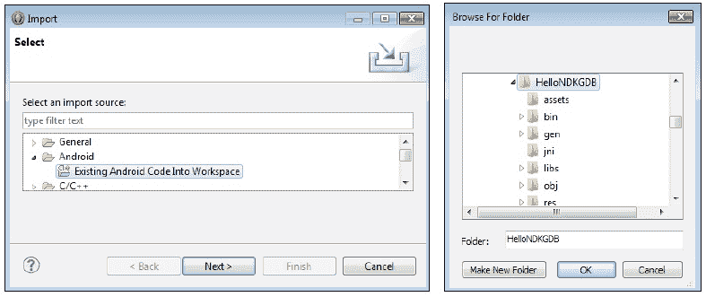

1.  在 Android 设备上运行应用程序。然后，启动一个终端，输入以下命令：

    ```kt
    ndk-cgdb

    ```

    下面是`cgdb`界面的截图：

    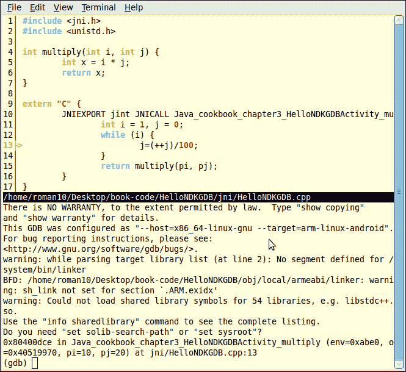

1.  我们可以输入`gdb`命令。注意，窗口上半部分会用箭头标记当前执行行，并用红色标记所有断点。

## 工作原理...

如前一个屏幕截图所示，`cgdb`为在 Android 中调试本地代码提供了一个更直观的界面。我们可以输入`gdb`命令时查看源代码。这个食谱演示了使用`cgdb`调试本地代码的基本设置。有关如何使用`cgdb`的详细信息，请参阅其文档，地址为[`cgdb.github.com/docs/cgdb.html`](http://cgdb.github.com/docs/cgdb.html)。

# 在 Eclipse 中调试 Android NDK 应用程序

对于习惯于图形化开发工具的开发者来说，在终端中使用 GDB 或 CGDB 进行调试是很麻烦的。使用**Android 开发工具**（**ADT**）20.0.0 或更高版本，在 Eclipse 中调试 NDK 应用程序相当简单。

## 准备就绪

确保您已安装 ADT 20.0.0 或更高版本。如果没有，请参考第一章中的食谱，*你好 NDK*，了解如何设置您的环境。

确保您已在 Eclipse 中配置了 NDK 路径。此外，在阅读这个食谱之前，您应该至少构建和运行过一个 Android NDK 应用程序。如果没有，请阅读*在 Eclipse 中构建 Android NDK 应用程序*的食谱。

## 如何操作...

以下步骤将创建一个示例 Android 项目，并使用 Eclipse 进行调试：

1.  我们将使用在*在 Eclipse 中构建 Android NDK 应用程序*的食谱中创建的项目。如果您在 Eclipse IDE 中没有打开项目，请点击**文件** | **导入**。在**常规**下选择**现有项目到工作空间**，然后点击**下一步**。在**导入**窗口中，勾选**选择根目录**，并浏览到`HelloNDKEclipse`项目。点击**完成**以导入项目：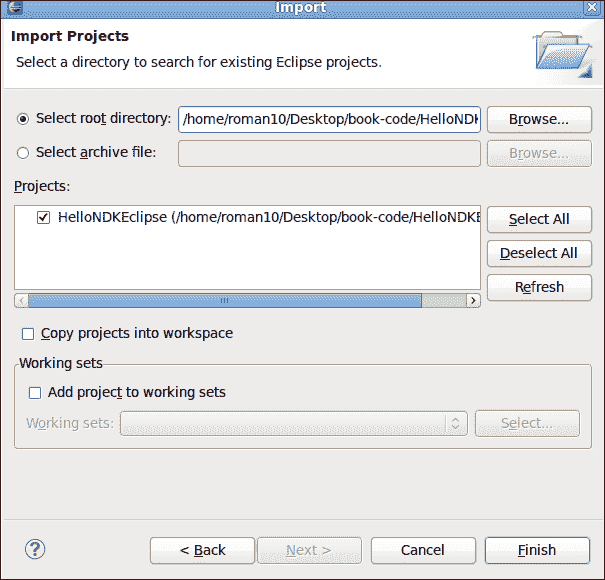

1.  在`HelloNDKEclipse`项目上右键点击，选择**属性**。在**属性**窗口中，选择**C/C++ 构建器**。取消勾选**使用默认构建命令**，并将**构建**命令更改为`ndk-build NDK_DEBUG=1`。

1.  点击**确定**关闭窗口：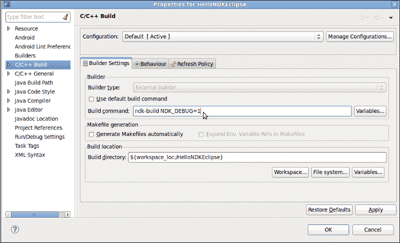

1.  在`HelloNDKEclipseActivity.java`中调用本地方法之前添加以下代码。

    在`HelloNDKEclipse.cpp`中设置两个断点：

    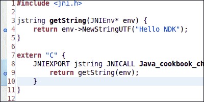

1.  在您的项目上右键点击，然后选择**调试为** | **Android 原生应用程序**。我们将看看是否触发了断点。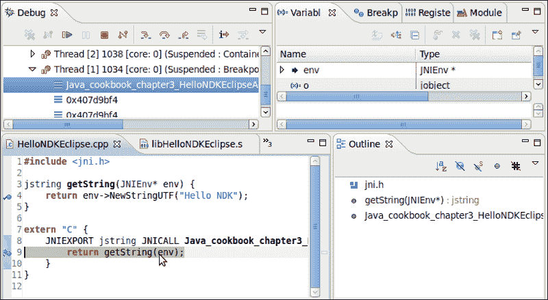

## 它的工作原理...

由于应用程序启动和调试会话启动之间存在几秒钟的延迟，设置断点的源代码可能在调试开始之前就已经执行了。在这种情况下，断点永远不会被触发。在*使用 NDK GDB 调试 Android NDK 应用程序*的食谱中，我们演示了使用`while(true)`循环来解决这个问题。这里我们展示了另一种方法，在应用程序启动时让代码休眠几秒钟。这为调试器提供了足够的时间来启动。一旦开始调试，我们可以使用正常的 Eclipse 调试界面来调试我们的代码。

## 还有更多...

还有其他一些调试器可用于调试 Android NDK 应用程序。

**数据显示调试器**（**DDD**）是 GDB 的图形前端。可以设置 DDD 来调试 Android 应用程序。详细的操作指南可以在[`omappedia.org/wiki/Android_Debugging#Debugging_with_GDB_and_DDD`](http://omappedia.org/wiki/Android_Debugging#Debugging_with_GDB_and_DDD)找到。

**NVIDIA 调试管理器**是一个 Eclipse 插件，用于协助在基于 NVIDIA Tegra 平台的设备上调试 Android NDK 应用程序。关于此工具的更多信息可以在[`developer.nvidia.com/nvidia-debug-manager-android-ndk`](https://developer.nvidia.com/nvidia-debug-manager-android-ndk)找到。
