# 第四章．Android NDK OpenGL ES API

在本章中，我们将涵盖以下内容：

+   使用 OpenGL ES 1.x API 绘制 2D 图形并应用变换

+   使用 OpenGL ES 1.x API 绘制 3D 图形并照亮场景

+   使用 OpenGL ES 1.x API 将纹理映射到 3D 对象

+   使用 OpenGL ES 2.0 API 绘制 3D 图形

+   使用 EGL 显示图形

# 引言

**开放图形库**（**OpenGL**）是一个跨平台的工业标准 API，用于生成 2D 和 3D 图形。它定义了一个与语言无关的软件接口，用于图形硬件或软件图形引擎。**OpenGL ES**是针对嵌入式设备的 OpenGL 版本。它由 OpenGL 规范的一个子集和一些特定于 OpenGL ES 的附加扩展组成。

OpenGL ES 不需要专用的图形硬件来工作。不同的设备可以配备具有不同处理能力的图形硬件。OpenGL ES 的调用工作负载在 CPU 和图形硬件之间分配。完全从 CPU 支持 OpenGL ES 是可能的。然而，根据其处理能力，图形硬件可以在不同级别上提高性能。

在深入探讨 Android NDK OpenGL ES 之前，有必要简要介绍一下 OpenGL 上下文中的**图形渲染管线**（**GRP**）。GRP 指的是一系列处理阶段，图形硬件通过这些阶段来生成图形。它以图元（**图元**指的是简单的几何形状，如点、线和三角形）的顶点形式接受对象描述，并为显示上的像素输出颜色值。它可以大致分为以下四个主要阶段：

1.  **顶点处理**：它接受图形模型描述，处理并转换各个顶点以将它们投影到屏幕上，并将它们的信息组合起来进行**图元**的进一步处理。

1.  **光栅化**：它将图元转换为片段。一个**片段**包含生成帧缓冲区中像素数据所必需的数据。请注意，只有受到一个或多个图元影响的像素才会有片段。一个片段包含信息，如光栅位置、深度、插值颜色和纹理坐标。

1.  **片段处理**：它处理每个片段。一系列操作被应用于每个片段，包括 alpha 测试、纹理映射等。

1.  **输出合并**：它将所有片段结合起来，为 2D 显示产生颜色值（包括 alpha）。

在现代计算机图形硬件中，顶点处理和片段处理是可编程的。我们可以编写程序来执行自定义的顶点和片段转换和处理。相比之下，光栅化和输出合并是可配置的，但不可编程。

前述每个阶段可以包含一个或多个步骤。OpenGL ES 1.x 和 OpenGL ES 2.0 提供了不同的 GRP。具体来说，OpenGL ES 1.x 提供了一个固定功能管线，我们输入原始数据和纹理数据，设置光照，剩下的由 OpenGL ES 处理。相比之下，OpenGL ES 2.0 提供了一个可编程管线，允许我们用**OpenGL ES 着色语言**（**GLSL**）编写顶点和片段着色器来处理具体细节。

下图指示了 OpenGL ES 1.x 的固定功能管线：

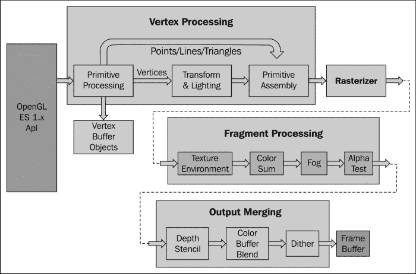

下图是另一个说明 OpenGL ES 2.0 可编程管线的图：

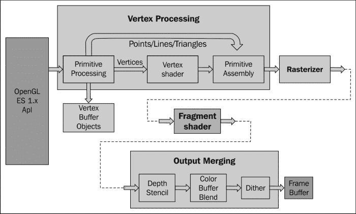

如前图所示，OpenGL ES 1.x 中的固定管线已经被 OpenGL ES 2.0 中的可编程着色器所取代。

通过这篇计算机图形学的介绍，我们现在准备开始学习 Android NDK OpenGL ES 编程的旅程。Android NDK 提供了 OpenGL ES 1.x（版本 1.0 和版本 1.1）和 OpenGL ES 2.0 库，它们之间有显著差异。以下表格概述了在选择 Android 应用程序中使用的 OpenGL ES 版本时需要考虑的因素：

|   | OpenGL 1.x | OpenGL 2.0 |
| --- | --- | --- |
| **性能** | 快速的 2D 和 3D 图形。 | 根据 Android 设备而定，但通常提供更快的 2D 和 3D 图形。 |
| **设备兼容性** | 几乎所有的 Android 设备。 | 大多数 Android 设备，且在增加中。 |
| **编码便利性** | 固定管线，方便的功能。对于简单的 3D 应用来说容易使用。 | 没有内置的基本功能，对于简单的 3-D 应用可能需要更多努力。 |
| **图形控制** | 固定管线。创建某些效果（例如，卡通着色）困难或不可能。 | 可编程管线。更直接地控制图形处理管线以创建特定效果。 |

### 提示

所有 Android 设备都支持 OpenGL ES 1.0，因为 Android 附带了一个 1.0 能力的软件图形引擎，可以在没有相应图形硬件的设备上使用。只有配备相应**图形处理单元**（**GPU**）的设备支持 OpenGL ES 1.1 和 OpenGL ES 2.0。

本章将介绍 Android NDK 中的 OpenGL 1.x 和 OpenGL ES 2.0 API。我们首先展示了如何使用 OpenGL 1.x API 绘制 2D 和 3D 图形。涵盖了变换、光照和纹理映射。然后我们介绍 NDK 中的 OpenGL 2.0 API。最后，我们描述如何使用 EGL 显示图形。本章介绍了一些计算机图形学的基础知识和 OpenGL 的原则。已经熟悉 OpenGL ES 的读者可以跳过这些部分，专注于如何从 Android NDK 调用 OpenGL ES API。

我们将为本章介绍的每个教程提供一个示例 Android 应用程序。由于篇幅限制，书中无法展示所有源代码。强烈建议读者下载代码并在阅读本章时参考。

# 使用 OpenGL ES 1.x API 绘制 2D 图形并应用变换

本教程通过示例介绍了 OpenGL ES 1.x 中的 2D 绘图。为了绘制 2D 对象，我们还将描述通过`GLSurfaceView`的 OpenGL 渲染显示，为它们添加颜色以及变换。

## 准备就绪

推荐读者阅读本章的介绍，这对于理解本教程中的一些内容至关重要。

## 如何操作...

以下步骤将创建我们的示例 Android NDK 项目：

1.  创建一个名为`TwoDG1`的 Android 应用程序。将包名设置为`cookbook.chapter4.gl1x`。如果你需要更详细的说明，请参考第二章中的*加载本地库和注册本地方法*教程，*Java 本地接口*。

1.  在 Eclipse 中右键点击`TwoDG1`项目，选择**Android Tools** | **Add Native Support**。

1.  在`cookbook.chapter4.gl1x`包下添加以下三个 Java 文件：

    +   `MyActivity.java`：它创建了此项目的活动：

        ```kt
        import android.opengl.GLSurfaceView;
        ……
        public class MyActivity extends Activity {
          private GLSurfaceView mGLView;
          @Override
          public void onCreate(Bundle savedInstanceState) {
            super.onCreate(savedInstanceState);
            mGLView = new MySurfaceView(this);
                   setContentView(mGLView);
          }
        }
        ```

    +   `MySurfaceView.java`：它扩展了`GLSurfaceView`，后者提供了一个专用的表面来显示 OpenGL 渲染：

        ```kt
        public class MySurfaceView extends GLSurfaceView {
          private MyRenderer mRenderer;
          public MySurfaceView(Context context) {
            super(context);
            mRenderer = new MyRenderer();
            this.setRenderer(mRenderer);
            this.setRenderMode(GLSurfaceView.RENDERMODE_WHEN_DIRTY);
          }
        }
        ```

    +   `MyRenderer.java`：它实现了`Renderer`并调用本地方法：

        ```kt
        public class MyRenderer implements GLSurfaceView.Renderer{
          @Override
          public void onSurfaceCreated(GL10 gl, EGLConfig config) {
            naInitGL1x();
          }
          @Override
          public void onDrawFrame(GL10 gl) {
            naDrawGraphics();
          }
          @Override
          public void onSurfaceChanged(GL10 gl, int width, int height) {
            naSurfaceChanged(width, height);
          }
          ......
        }
        ```

1.  在`jni`文件夹下添加`TwoDG1.cpp`、`Triangle.cpp`、`Square.cpp`、`Triangle.h`和`Square.h`文件。请参考下载的项目以获取完整的代码内容。这里，我们只列出代码中的一些重要部分：

    `TwoDG1.cpp`：它包含了设置 OpenGL ES 1.x 环境并执行变换的代码：

    ```kt
    void naInitGL1x(JNIEnv* env, jclass clazz) {
      glDisable(GL_DITHER);  
      glHint(GL_PERSPECTIVE_CORRECTION_HINT, GL_FASTEST);
      glClearColor(0.0f, 0.0f, 0.0f, 1.0f);    glShadeModel(GL_SMOOTH);    }

    void naSurfaceChanged(JNIEnv* env, jclass clazz, int width, int height) {
      glViewport(0, 0, width, height);
      float ratio = (float) width / (float)height;
      glMatrixMode(GL_PROJECTION);
      glLoadIdentity();
      glOrthof(-ratio, ratio, -1, 1, 0, 1);  }

    void naDrawGraphics(JNIEnv* env, jclass clazz) {
      glClear(GL_COLOR_BUFFER_BIT);
      glMatrixMode(GL_MODELVIEW);
      glLoadIdentity();
      glTranslatef(0.3f, 0.0f, 0.0f);    //move to the right
      glScalef(0.2f, 0.2f, 0.2f);        // Scale down
      mTriangle.draw();
      glLoadIdentity();
      glTranslatef(-0.3f, 0.0f, 0.0f);    //move to the left
      glScalef(0.2f, 0.2f, 0.2f);      // Scale down
    glRotatef(45.0, 0.0, 0.0, 1.0);  //rotate
      mSquare.draw();
    }
    ```

    `Triangle.cpp`：它绘制一个 2D 三角形：

    ```kt
    void Triangle::draw() {
      glEnableClientState(GL_VERTEX_ARRAY);
      glVertexPointer(3, GL_FLOAT, 0, vertices);
      glColor4f(0.5f, 0.5f, 0.5f, 0.5f);      //set the current color
      glDrawArrays(GL_TRIANGLES, 0, 9/3);
      glDisableClientState(GL_VERTEX_ARRAY);
    }
    ```

    `Square.cpp`：它绘制一个 2D 正方形：

    ```kt
    void Square::draw() {
      glEnableClientState(GL_VERTEX_ARRAY);
      glEnableClientState(GL_COLOR_ARRAY);
      glVertexPointer(3, GL_FLOAT, 0, vertices);
      glColorPointer(4, GL_FLOAT, 0, colors);
      glDrawElements(GL_TRIANGLES, 6, GL_UNSIGNED_BYTE, indices);
      glDisableClientState(GL_VERTEX_ARRAY);
      glDisableClientState(GL_COLOR_ARRAY);
    }
    ```

1.  在`jni`文件夹下添加`Android.mk`文件，内容如下：

    ```kt
    LOCAL_PATH := $(call my-dir)
    include $(CLEAR_VARS)
    LOCAL_MODULE    := TwoDG1
    LOCAL_SRC_FILES := Triangle.cpp Square.cpp TwoDG1.cpp
    LOCAL_LDLIBS := -lGLESv1_CM -llog
    include $(BUILD_SHARED_LIBRARY)
    ```

1.  构建 Android NDK 应用程序并在 Android 设备上运行。以下是显示的截图：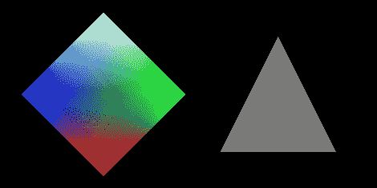

## 工作原理...

本教程演示了使用 OpenGL ES 的基本 2D 绘图。

### 通过 GLSurfaceView 显示 OpenGL ES 渲染

`GLSurfaceView`和`GLSurfaceView.Renderer`是 Android SDK 提供的两个基础类，用于显示 OpenGL ES 图形。

`GLSurfaceView`接受一个用户定义的`Renderer`对象，该对象实际执行渲染。它通常被扩展以处理触摸事件，这将在下一个教程中说明。它支持按需和连续渲染。在我们的示例代码中，我们只需设置`Renderer`对象并将渲染模式配置为按需。

`GLSurfaceView.Renderer`是渲染器的接口。需要实现它的三个方法：

+   `onSurfaceCreated`：在设置 OpenGL ES 环境时被调用一次。

+   `onSurfaceChanged`：如果视图的几何形状发生变化，它会被调用；最常见的例子是设备屏幕方向的变化。

+   `onDrawFrame`：每次重绘视图时都会调用它。

在我们的示例项目中，`MyRenderer.java`是一个简单的包装器，实际工作是在本地 C++代码中完成的。

### 在 OpenGL ES 中绘制物体

在 OpenGL ES 中绘制物体通常使用两种方法，包括`glDrawArrays`和`glDrawElements`。我们分别在`Triangle.cpp`和`Square.cpp`中演示了这两种方法的用法。请注意，这两种方法都需要启用`GL_VERTEX_ARRAY`。

第一个参数是绘制模式，指明了要使用的图元。在我们的示例代码中，我们使用了`GL_TRIANGLES`，这意味着我们实际上绘制了两个三角形来形成正方形。在 Android NDK OpenGL ES 中还有其他有效值，包括`GL_POINTS`、`GL_LINES`、`GL_LINE_LOOP`、`GL_LINE_STRIP`、`GL_TRIANGLE_STRIP`和`GL_TRIANGLE_FAN`。

### 在 OpenGL ES 中的颜色

我们还展示了两种给物体添加颜色的方法。在`Triangle.cpp`中，我们通过`glColor4f` API 调用设置当前颜色。在`Square.cpp`中，我们启用了`GL_COLOR_ARRAY`，并使用`glColorPointer`定义了一个颜色数组。该颜色数组将由`glDrawElements`（使用`glDrawArrays`也行）API 调用使用。

### OpenGL ES 转换

下图展示了 OpenGL ES 1.0 中的不同转换阶段：

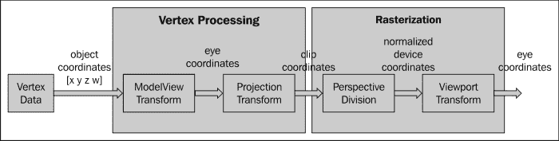

如图中所示，顶点数据在光栅化之前进行转换。这些转换类似于用相机拍照：

+   **模型视图转换**：安排场景并放置相机

+   **投影转换**：选择一个相机镜头并调整缩放因子

+   **视点转换**：确定最终照片的大小

**模型视图转换**实际上指的是两种不同的转换，即模型转换和视图转换。**模型转换**是指将所有物体从其对象空间（也称为局部空间或模型空间）转换到世界空间的过程，该空间被所有物体共享。这个转换通过一系列缩放（`glScalef`）、旋转（`glRotatef`）和平移（`glTranslatef`）来完成。

+   `glScalef`：它拉伸、缩小或反射物体。x、y 和 z 轴的值分别乘以相应的 x、y 和 z 缩放因子。在我们的示例代码中，我们调用了`glScalef(0.2f, 0.2f, 0.2f)`，以缩小三角形和正方形，使它们能够适应屏幕。

+   `glRotatef`：它以从原点通过指定点（x, y, z）的方向逆时针旋转物体。旋转角度以度为单位测量。在我们的示例代码中，我们调用了`glRotatef(45.0, 0.0, 0.0, 1.0)`，使正方形绕 z 轴旋转 45 度。

+   `glTranslatef`：该函数根据给定的值沿着每个轴移动对象。在我们的示例代码中，我们调用了`glTranslatef(0.3f, 0.0f, 0.0f)`将三角形向右移动，以及`glTranslatef(-0.3f, 0.0f, 0.0f)`将正方形向左移动，以防止它们重叠。

模型变换在场景中安排对象，而视图变换改变观察相机的位置。为了产生特定的图像，我们可以移动对象或改变相机位置。因此，OpenGL ES 内部使用单一的矩阵——`GL_MODELVIEW`矩阵执行这两种变换。

### 提示

OpenGL ES 定义了相机默认位于眼睛坐标空间的原点（0, 0, 0），并指向负 z 轴。可以通过 Android SDK 中的`GLU.gluLookAt`改变位置。然而，在 Android NDK 中不提供相应的 API。

**投影变换**决定了可以看到什么（类似于选择相机镜头和缩放因子）以及顶点数据如何投影到屏幕上。OpenGL ES 支持两种投影模式，分别是透视投影（`glFrustum`）和正交投影（`glOrtho`）。**透视投影**使得远离的物体显得更小，这与普通相机相匹配。另一方面，**正交投影**类似于望远镜，直接映射物体而不影响其大小。OpenGL ES 通过`GL_PROJECTION`矩阵操纵变换。在投影变换后，位于裁剪体积外的物体将被裁剪掉，在最终场景中不绘制。在我们的示例项目中，我们调用了`glOrthof(-ratio, ratio, -1, 1, 0, 10)`来指定视景体，其中`ratio`指的是屏幕的宽高比。

投影变换后，通过将裁剪坐标除以输入顶点的变换后的`w`值来进行透视除法。x 轴、y 轴和 z 轴的值将被归一化到`-1.0`到`1.0`的范围内。

OpenGL ES 变换管道的最终阶段是视口变换，它将归一化设备坐标映射到窗口坐标（以像素为单位，原点在左上角）。请注意，视点还包括一个 z 分量，这在例如两个重叠的 OpenGL 场景的排序等情况下是需要的，可以通过`glDepthRange` API 调用设置。当显示尺寸发生变化时，应用程序通常需要通过`glViewport` API 调用设置视口。在我们的示例中，我们通过调用`glViewport(0, 0, width, height)`将视口设置为整个屏幕。这个设置与`glOrthof`调用一起，将保持投影变换后的对象比例，如下图所示：

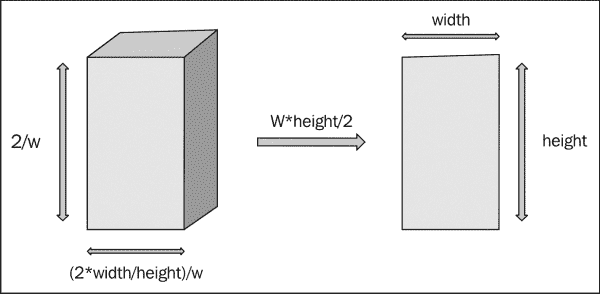

如图表所示，裁剪体积设置为（-width/height, width/height, -1, 1, 0, 1）。在透视除法中，顶点被`w`除。在视点变换中，x 和 y 坐标范围都被`w*height/2`放大。因此，对象将如本食谱的*如何操作...*部分所示成比例显示。以下屏幕截图的左侧显示了如果我们通过调用`glOrthof(-1, 1, -1, 1, 0, 1)`设置裁剪体积的输出，右侧表示如果通过调用`glViewport(0, 0, width/2, height/5)`设置视口，图形将呈现什么样子：

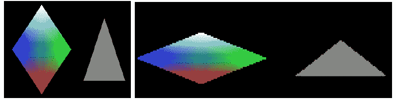

# 使用 OpenGL ES 1.x API 绘制 3D 图形并点亮场景

本食谱涵盖了如何在 OpenGL ES 中绘制 3D 对象、处理触摸事件以及点亮对象。

## 准备就绪

建议读者在阅读本食谱之前，先阅读引言和下面的*使用 OpenGL ES 1.x API 绘制 2D 图形和应用变换*的食谱。

## 如何操作...

以下步骤展示了如何开发我们的示例 Android 项目：

1.  创建一个名为`CubeG1`的 Android 应用程序。将包名设置为`cookbook.chapter4.gl1x`。如果你需要更详细的说明，请参考第二章中的*加载本地库和注册本地方法*食谱，*Java Native Interface*。

1.  右键点击项目 CubeG1，选择**Android Tools** | **添加本地支持**。

1.  在`cookbook.chapter4.gl1x`包下添加三个 Java 文件，分别为`MyActivity.java`，`MySurfaceView`和`MyRenderer.java`。`MyActivity.java`与上一个食谱中使用的一致。

    `MySurfaceView.java`扩展了`GLSurfaceView`，包含处理触摸事件的代码：

    ```kt
    public class MySurfaceView extends GLSurfaceView {
      private MyRenderer mRenderer;
      private float mPreviousX;
       private float mPreviousY;
       private final float TOUCH_SCALE_FACTOR = 180.0f / 320;
      public MySurfaceView(Context context) {
        super(context);
        mRenderer = new MyRenderer();
        this.setRenderer(mRenderer);
        //control whether continuously drawing or on-demand
        this.setRenderMode(GLSurfaceView.RENDERMODE_WHEN_DIRTY);
      }

      public boolean onTouchEvent(final MotionEvent event) {
        float x = event.getX();
           float y = event.getY();
           switch (event.getAction()) {
           case MotionEvent.ACTION_MOVE:
               float dx = x - mPreviousX;
               float dy = y - mPreviousY;
               mRenderer.mAngleX += dx * TOUCH_SCALE_FACTOR;
               mRenderer.mAngleY += dy * TOUCH_SCALE_FACTOR;
               requestRender();
           }
           mPreviousX = x;
           mPreviousY = y;
           return true;
       }
    }
    ```

    `MyRenderer.java`实现了一个渲染器，以调用本地方法渲染图形：

    ```kt
    public class MyRenderer implements GLSurfaceView.Renderer{
       public float mAngleX;
       public float mAngleY;
      @Override
      public void onSurfaceCreated(GL10 gl, EGLConfig config) {
        naInitGL1x();
      }
      @Override
      public void onDrawFrame(GL10 gl) {
        naDrawGraphics(mAngleX, mAngleY);
      }
      @Override
      public void onSurfaceChanged(GL10 gl, int width, int height) {
        naSurfaceChanged(width, height);
      }
    }
    ```

1.  在`jni`文件夹下添加`CubeG1.cpp`、`Cube.cpp`和`Cube.h`文件。请参考下载的项目以获取完整内容。让我们列出`CubeG1.cpp`中的`naInitGL1x`、`naSurfaceChanged`和`naDrawGraphics`本地方法以及`Cube.cpp`中的绘制和光照方法的代码：

    `CubeG1.cpp`设置 OpenGL ES 环境和光照：

    ```kt
    void naInitGL1x(JNIEnv* env, jclass clazz) {
      glDisable(GL_DITHER);
      glHint(GL_PERSPECTIVE_CORRECTION_HINT, GL_NICEST);
      glClearColor(0.0f, 0.0f, 0.0f, 1.0f);    glEnable(GL_CULL_FACE);    
      glClearDepthf(1.0f);  glEnable(GL_DEPTH_TEST);  
      glDepthFunc(GL_LEQUAL);    //type of depth test
      glShadeModel(GL_SMOOTH);    
      glLightModelx(GL_LIGHT_MODEL_TWO_SIDE, 0);
      float globalAmbientLight[4] = {0.5, 0.5, 0.5, 1.0};
      glLightModelfv(GL_LIGHT_MODEL_AMBIENT, globalAmbientLight);
      GLfloat lightOneDiffuseLight[4] = {1.0, 1.0, 1.0, 1.0};
      GLfloat lightOneSpecularLight[4] = {1.0, 1.0, 1.0, 1.0};
      glLightfv(GL_LIGHT0, GL_DIFFUSE, lightOneDiffuseLight);
      glLightfv(GL_LIGHT0, GL_SPECULAR, lightOneSpecularLight);
      glEnable(GL_LIGHTING);
      glEnable(GL_LIGHT0);
    }
    void naSurfaceChanged(JNIEnv* env, jclass clazz, int width, int height) {
      glViewport(0, 0, width, height);
       float ratio = (float) width / height;
       glMatrixMode(GL_PROJECTION);
       glLoadIdentity();
       glOrthof(-ratio, ratio, -1, 1, -10, 10);
    }
    void naDrawGraphics(JNIEnv* env, jclass clazz, float pAngleX, float pAngleY) {
      glClear(GL_COLOR_BUFFER_BIT | GL_DEPTH_BUFFER_BIT);
       glMatrixMode(GL_MODELVIEW);
       glLoadIdentity();
       glRotatef(pAngleX, 0, 1, 0);  //rotate around y-axis
       glRotatef(pAngleY, 1, 0, 0);  //rotate around x-axis
      glScalef(0.3f, 0.3f, 0.3f);      // Scale down
    mCube.lighting();
      mCube.draw();
      float lightOnePosition[4] = {0.0, 0.0, 1.0, 0.0};  
      glLightfv(GL_LIGHT0, GL_POSITION, lightOnePosition);
    }
    ```

    `Cube.cpp`绘制一个 3D 立方体并点亮它：

    ```kt
    void Cube::draw() {
      glEnableClientState(GL_VERTEX_ARRAY);
      glVertexPointer(3, GL_FLOAT, 0, vertices);
      glDrawElements(GL_TRIANGLES, 36, GL_UNSIGNED_BYTE, indices);
      glDisableClientState(GL_VERTEX_ARRAY);
    }
    void Cube::lighting() {
      GLfloat cubeOneAmbientFraction[4] = {0.0, 0.5, 0.5, 1.0};
      GLfloat cubeOneDiffuseFraction[4] = {0.8, 0.0, 0.0, 1.0};
      GLfloat cubeSpecularFraction[4] = {0.0, 0.0, 0.0, 1.0};
      GLfloat cubeEmissionFraction[4] = {0.0, 0.0, 0.0, 1.0};
      glMaterialfv(GL_FRONT_AND_BACK, GL_AMBIENT, cubeOneAmbientFraction);
      glMaterialfv(GL_FRONT_AND_BACK, GL_DIFFUSE, cubeOneDiffuseFraction);
      glMaterialfv(GL_FRONT_AND_BACK, GL_SPECULAR, cubeSpecularFraction);
      glMaterialfv(GL_FRONT_AND_BACK, GL_EMISSION, cubeEmissionFraction);
      glMaterialf(GL_FRONT_AND_BACK, GL_SHININESS, 60.0);
    }
    ```

1.  在`jni`文件夹下添加`Android.mk`文件，内容如下：

    ```kt
    LOCAL_PATH := $(call my-dir)
    include $(CLEAR_VARS)
    LOCAL_MODULE    := CubeG1
    LOCAL_SRC_FILES := Cube.cpp CubeG1.cpp
    LOCAL_LDLIBS := -lGLESv1_CM -llog
    include $(BUILD_SHARED_LIBRARY)
    ```

1.  构建 Android NDK 应用程序并在 Android 设备上运行。应用程序将显示一个立方体，我们可以触摸它使其旋转：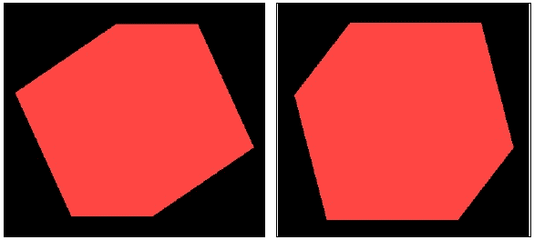

## 工作原理...

本食谱讨论了如何使用 OpenGL ES 1.x API 绘制 3D 图形。注意，我们将在`Andorid.mk`文件中需要加载 OpenGL ES 库`GLESv1_CM`，并在本地源代码中包含头文件`GLES/gl.h`。

+   **在 OpenGL ES 中绘制 3D 对象**：绘制 3D 对象与绘制 2D 对象类似。在`Cube::draw`方法中，我们首先设置顶点缓冲区，然后调用`glDrawElements`来绘制立方体的六个面。我们使用`GL_TRIANGLES`作为图元。因为每个面包含两个三角形，所以有 12 个三角形和 36 个顶点。

+   **触摸事件处理**：在`MySurfaceView.java`中，我们重写`onTouchEvent`方法以检测屏幕上的图形移动，并改变`MyRenderer`的旋转角度属性。我们调用`requestRender`方法，请求渲染器重新绘制图形。

+   **OpenGL ES 中的光照和材质**：光照模型分为两类，即局部光照和全局光照。**局部光照**只考虑直接光照，因此可以对单个对象进行光照计算。与之相对的是，**全局光照**考虑了从其他对象和环境反射的间接光照，因此计算成本更高。OpenGL ES 1.x 使用局部光照，而全局光照可以使用**OpenGL 着色语言**（**GLSL**）在 OpenGL ES 2.0 中进行编程。这里，我们只讨论 OpenGL ES 1.x 中的光照。

当考虑光照时，OpenGL ES 中涉及三个参与者，包括摄像机位置、光源和物体的材质。摄像机位置始终在默认位置`(0, 0, 0)`，并朝向负 z 轴，如前面的食谱所述。光源可以提供独立的环境光、漫反射光和镜面光。材质可以反射不同数量的环境光、漫反射光和镜面光。此外，材质也可能发射光。每种光都由 RGB 分量组成：

+   **环境光**：它近似于场景中无处不在的恒定光照量。

+   **漫反射光**：它近似于来自远距离方向光源的光（例如，阳光）。当反射光照射到表面时，它在所有方向上均匀散射。

+   **镜面光**：它近似于光滑表面反射的光。其强度取决于观察者与从表面反射的射线方向之间的角度。

+   **发射光**：某些材质可以发光。

请注意，光源中的 RGB 值表示颜色分量的强度，而在材质中则指反射这些颜色的比例。为了理解光源和材质如何影响观察者对物体的感知，可以考虑一束白光照射在表面上，如果表面只反射光的蓝色分量，那么观察者看到的表面将是蓝色的。如果光是纯红色的，那么观察者看到的表面将是黑色的。

以下步骤可以在 OpenGL ES 中设置简单的光照：

1.  设置光照模型参数。这是通过`glLightModelfv`完成的。Android NDK OpenGL ES 支持两个参数，包括`GL_LIGHT_MODEL_AMBIENT`和`GL_LIGHT_MODEL_TWO_SIDE`。第一个允许我们指定全局环境光，第二个允许我们指定是否要在表面的背面计算光照。

1.  启用、配置并放置一个或多个光源。这是通过`glLightfv`方法完成的。我们可以分别配置环境光、漫反射光和镜面光。光源位置也通过`glLightfv`与`GL_POSITION`一起配置。在`CubeG1.cpp`中，我们使用了以下代码：

    ```kt
    float lightOnePosition[4] = {0.0, 0.0, 1.0, 0.0};  
    glLightfv(GL_LIGHT0, GL_POSITION, lightOnePosition);
    ```

    位置的第四个值表示光源是位置的还是方向的。当值设置为`0`时，光为方向光，模拟一个远距离的光源（阳光）。光线在撞击表面时是平行的，位置的（x, y, z）值指的是光的传播方向。如果第四个值设置为`1`，光为位置光，类似于灯泡。这里的（x, y, z）值指的是光源的位置，光线从不同的角度撞击表面。请注意，光源向所有方向发射强度相等的光。以下图像说明了这两种光源：

    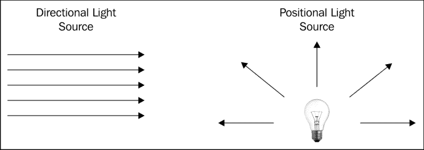

除了位置光和方向光，还有聚光灯：

1.  我们也将通过调用以下方法来启用光照和光源

    ```kt
    glEnable(GL_LIGHTING);
    ```

    以及

    ```kt
    glEnable(GL_LIGHTx);
    ```

1.  为所有对象的每个顶点定义法向量。这些法向量决定了物体相对于光源的方向。在我们的代码中，我们依赖 OpenGL ES 的默认法向量。

1.  定义材质。这可以通过`glMaterialf`或`glMaterialfv`方法来完成。在我们的示例代码中，我们将漫反射光的红色分量指定为`0.8`，而将绿色和蓝色分量保持为 0。因此，最终的立方体看起来是红色的。

# 使用 OpenGL ES 1.x API 将纹理映射到 3D 对象

**纹理映射**是一种将图像覆盖到物体表面以创建更真实场景的技术。这个菜谱涵盖了如何在 OpenGL ES 1.x 中添加纹理。

## 准备就绪

建议读者在阅读本节内容之前，先阅读《使用 OpenGL ES 1.x API 绘制 3D 图形并照亮场景》的菜谱。

## 如何操作...

以下步骤创建了一个展示如何将纹理映射到 3D 对象的 Android 项目：

1.  创建一个名为`DiceG1`的 Android 应用程序。将包名设置为`cookbook.chapter4.gl1x`。如果你需要更详细的说明，请参考第二章《Java 本地接口》中的《加载本地库和注册本地方法》菜谱。

1.  在项目`CubeG1`上点击右键，选择**Android Tools** | **添加本地支持**。

1.  在`cookbook.chapter4.diceg1`包下添加三个 Java 文件，分别为`MyActivity.java`，`MySurfaceView.java`和`MyRenderer.java`。`MyActivity.java`和`MySurfaceView.java`与之前的配方相似。

1.  `MyRenderer.java`代码如下：

    ```kt
    public class MyRenderer implements GLSurfaceView.Renderer{
       public float mAngleX;
       public float mAngleY;
       private Context mContext;
       public MyRenderer(Context pContext) {
         super();
         mContext = pContext;
       }
      @Override
      public void onSurfaceCreated(GL10 gl, EGLConfig config) {
        //call native methods to load the textures
        LoadTexture(R.drawable.dice41, mContext, 0);
        LoadTexture(R.drawable.dice42, mContext, 1);
        LoadTexture(R.drawable.dice43, mContext, 2);
        LoadTexture(R.drawable.dice44, mContext, 3);
        LoadTexture(R.drawable.dice45, mContext, 4);
        LoadTexture(R.drawable.dice46, mContext, 5);
        naInitGL1x();
      }
    … …
      private void LoadTexture(int resId, Context context, int texIdx) {
        //Get the texture from the Android resource directory
        InputStream is = context.getResources().openRawResource(resId);
        Bitmap bitmap = null;
        try {
          BitmapFactory.Options options = new BitmapFactory.Options();
          options.inPreferredConfig = Bitmap.Config.ARGB_8888;
          bitmap = BitmapFactory.decodeStream(is, null, options);
          naLoadTexture(bitmap, bitmap.getWidth(), bitmap.getHeight(), texIdx);
        } finally {
          try {
            is.close();
            is = null;
          } catch (IOException e) {
          }
        }
        if (null != bitmap) {
          bitmap.recycle();
        }
      }
    }
    ```

1.  在`jni`文件夹下添加`DiceG1.cpp`，`Cube.cpp`，`Cube.h`和`mylog.h`文件。请参考下载的项目以获取完整内容。这里，我们列出`DiceG1.cpp`中的`fornaLoadTexture`和`naInitGL1x`本地方法以及`Cube.cpp`中的`draw`方法的代码：

    ```kt
    void naLoadTexture(JNIEnv* env, jclass clazz, jobject pBitmap, int pWidth, int pHeight, int pId) {
      int lRet;
      AndroidBitmapInfo lInfo;
      void* l_Bitmap;
      GLint format;
      GLenum type;
      if ((lRet = AndroidBitmap_getInfo(env, pBitmap, &lInfo)) < 0) {
        return;
      }
      if (lInfo.format == ANDROID_BITMAP_FORMAT_RGB_565) {
        format = GL_RGB;
        type = GL_UNSIGNED_SHORT_5_6_5;
      } else if (lInfo.format == ANDROID_BITMAP_FORMAT_RGBA_8888) {
        format = GL_RGBA;
        type = GL_UNSIGNED_BYTE;
      } else {
        return;
      }
      if ((lRet = AndroidBitmap_lockPixels(env, pBitmap, &l_Bitmap)) < 0) {
        return;
      }
      glGenTextures(1, &texIds[pId]);
      glBindTexture(GL_TEXTURE_2D, texIds[pId]);
      glTexParameteri(GL_TEXTURE_2D, GL_TEXTURE_MIN_FILTER, GL_NEAREST);
      glTexParameteri(GL_TEXTURE_2D, GL_TEXTURE_MAG_FILTER, GL_NEAREST);
      glTexParameteri(GL_TEXTURE_2D, GL_TEXTURE_WRAP_S, GL_REPEAT);
      glTexParameteri(GL_TEXTURE_2D, GL_TEXTURE_WRAP_T, GL_REPEAT);
      glTexImage2D(GL_TEXTURE_2D, 0, format, pWidth, pHeight, 0, format, type, l_Bitmap);
      AndroidBitmap_unlockPixels(env, pBitmap);
    }
    void naInitGL1x(JNIEnv* env, jclass clazz) {
      glDisable(GL_DITHER);  
      glHint(GL_PERSPECTIVE_CORRECTION_HINT, GL_NICEST);
      glClearColor(0.0f, 0.0f, 0.0f, 1.0f);  
      glEnable(GL_CULL_FACE);    
      glClearDepthf(1.0f);  
      glEnable(GL_DEPTH_TEST);  
      glDepthFunc(GL_LEQUAL);    
      glShadeModel(GL_SMOOTH);   
      mCube.setTexCoords(texIds);
      glTexEnvx(GL_TEXTURE_ENV, GL_TEXTURE_ENV_MODE, GL_REPLACE);
      glEnable(GL_TEXTURE_2D);
    }
    Cube.cpp: drawing the cube and mapping texture
    void Cube::draw() {
      glEnableClientState(GL_VERTEX_ARRAY);
      glEnableClientState(GL_TEXTURE_COORD_ARRAY);  // Enable texture-coords-array
      glFrontFace(GL_CW);

      glBindTexture(GL_TEXTURE_2D, texIds[0]);
      glTexCoordPointer(2, GL_FLOAT, 0, texCoords);
      glVertexPointer(3, GL_FLOAT, 0, vertices);
      glDrawElements(GL_TRIANGLES, 18, GL_UNSIGNED_BYTE, indices);

    ….
      glDisableClientState(GL_VERTEX_ARRAY);
      glDisableClientState(GL_TEXTURE_COORD_ARRAY);
    }
    ```

1.  在`jni`文件夹下添加`Android.mk`文件，内容如下：

    ```kt
    LOCAL_PATH := $(call my-dir)
    include $(CLEAR_VARS)
    LOCAL_MODULE    := DiceG1
    LOCAL_SRC_FILES := Cube.cpp DiceG1.cpp
    LOCAL_LDLIBS := -lGLESv1_CM -llog -ljnigraphics
    include $(BUILD_SHARED_LIBRARY)
    ```

1.  构建 Android NDK 应用程序并在 Android 设备上运行。该应用将显示一个纹理为骰子的立方体：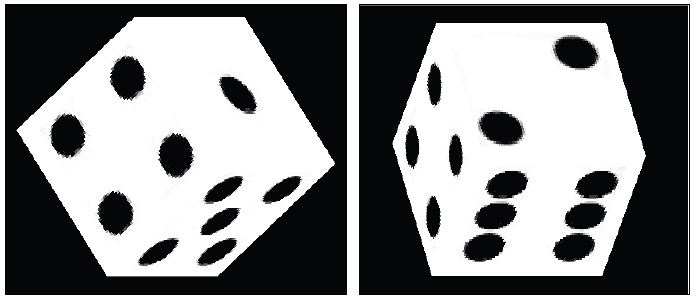

## 工作原理...

这个配方给 3D 立方体添加了一个纹理，使其看起来像骰子。

+   **纹理坐标**：纹理通常是 2D 图像。纹理坐标`(s, t)`通常被归一化到`[0.0, 1.0]`，如下图所示。纹理图像在`s`和`t`轴上被映射到`[0, 1]`：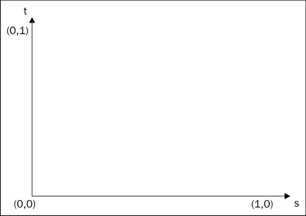

+   **加载纹理**：在 OpenGL ES 中映射纹理的第一步是加载它们。在我们的示例中，我们使用 Android SDK 从可绘制资源中读取图像文件，并将位图传递给本地代码。本地方法`naLoadTexture`锁定位图图像并执行以下 OpenGL 操作。

    +   **创建 glGenTexture 纹理**：这生成纹理 ID。

    +   绑定纹理：glBindTexture。这告诉 OpenGL 我们要使用的纹理 id。

    +   **设置纹理过滤**：使用`glTexParameter`与`GL_TEXTURE_MIN_FILTER`或`GL_TEXTURE_MAG_FILTER`（这将在后面讨论）。

    +   **设置纹理包装**：使用`glTexParameter`与`GL_TEXTURE_WRAP_S`或`GL_TEXTURE_WRAP_T`（这将在后面讨论）。

    +   **将图像数据加载到 OpenGL 中**：（`glTexImage2D`）我们需要指定图像数据、宽度、高度、颜色格式等。

+   **纹理包装**：纹理在`s`和`t`轴上被映射到`[0, 1]`。但是，我们可以指定超出范围的纹理坐标。一旦发生这种情况，将应用包装。典型的纹理包装设置如下：

    +   `GL_CLAMP`：将纹理坐标限制在`[0.0, 1.0]`。

    +   `GL_REPEAT`：重复纹理。这创建了一个重复的模式。

+   **纹理过滤**：通常纹理图像的分辨率与对象不同。如果纹理较小，则会进行放大处理；如果纹理较大，则会进行缩小处理。通常使用以下两种方法：

    +   `GL_NEAREST`：使用与被纹理化的像素中心最近的纹理元素。

    +   `GL_LINEAR`：对基于与被纹理化的像素最近的四个纹理元素进行插值计算颜色值。

+   **设置纹理环境**：在我们将纹理映射到对象之前，可以调用 `glTexEnvf` 来控制当片段被纹理化时如何解释纹理值。我们可以配置 `GL_TEXTURE_ENV_COLOR` 和 `GL_TEXTURE_ENV_MODE`。在我们的示例项目中，我们使用了 `GL_REPLACE` 作为 `GL_TEXTURE_ENV_MODE`，这简单地将立方体片段替换为纹理值。

+   **映射纹理**：我们绘制 3D 立方体的每个面并通过 `glDrawElement` 映射纹理。必须通过调用 `glEnableClientState` 启用 `GL_TEXTURE_COORD_ARRAY`。在绘制每个接口之前，我们通过调用 `glBindTexture` 绑定到相应的纹理。

## 还有更多...

在我们的本地代码中，我们使用了 Android 本地位图 API 从 Java 代码接收纹理位图对象。这个 API 的更多细节将在第七章，*其他 Android NDK API*中进行介绍。

# 使用 OpenGL ES 2.0 API 绘制 3D 图形

前面的食谱描述了在 Android NDK 上的 OpenGL ES 1.x。这个食谱涵盖了如何在 Android NDK 中使用 OpenGL ES 2.0。

## 准备就绪

建议读者在阅读这个食谱之前先阅读本章的介绍。在以下食谱中涵盖了大量的图形基础；建议我们首先阅读它们：

+   *使用 OpenGL ES 1.x API 绘制 2D 图形和应用变换*

+   *使用 OpenGL ES 1.x API 绘制 3D 图形并照亮场景*

## 如何操作...

以下步骤使用 Android NDK 中的 OpenGL ES 2.0 API 创建一个渲染 3D 立方体的 Android 项目：

1.  创建一个名为 `CubeG2` 的 Android 应用程序。将包名设置为 `cookbook.chapter4.cubeg2`。如果你需要更详细的说明，请参考第二章的*加载本地库和注册本地方法*一节，*Java Native Interface*。

1.  在项目 `CubeG2` 上右键点击，选择 **Android Tools** | **添加本地支持**。

1.  添加三个 Java 文件，分别为 `MyActivity.java`，`MyRenderer.java` 和 `MySurfaceView.java`。我们只列出了部分 `MyRenderer.java` 代码，因为其他两个文件 `MyActivity.java` 和 `MySurfaceView.java` 与前一个食谱中的文件相似：

    ```kt
    @Override
    public void onSurfaceCreated(GL10 gl, EGLConfig config) {
        String vertexShaderStr = LoadShaderStr(mContext, R.raw.vshader);
        String fragmentShaderStr = LoadShaderStr(mContext, R.raw.fshader);
        naInitGL20(vertexShaderStr, fragmentShaderStr);
    }
    @Override
    public void onDrawFrame(GL10 gl) {
      naDrawGraphics(mAngleX, mAngleY);
    }
    @Override
    public void onSurfaceChanged(GL10 gl, int width, int height) {
      naSurfaceChanged(width, height);
    }
    ```

1.  在 `jni` 文件夹下添加 `Cube.cpp`，`matrix.cpp`，`CubeG2.cpp`，`Cube.h`，`matrix.h` 和 `mylog.h` 文件。文件内容总结如下：

    +   **Cube.cpp 和 Cube.h**：它们定义了一个 `Cube` 对象和方法来绘制 3D 立方体。

    +   **matrix.cpp 和 matrix.h**：这些矩阵操作，包括创建平移、缩放和旋转矩阵以及矩阵乘法。

    +   **CubeG2.cpp**：它们创建并加载着色器。它们还创建、链接并使用程序，并对 3D 立方体应用变换。

    +   **mylog.h**：它们定义了用于 Android NDK 日志记录的宏。

    在这里，我们列出了 `Cube.cpp` 和 `CubeG2.cpp` 的部分内容。

    `Cube.cpp`：

    ```kt
    …
    void Cube::draw(GLuint pvPositionHandle) {
      glVertexAttribPointer(pvPositionHandle, 3, GL_FLOAT, GL_FALSE, 0, vertices);
      glEnableVertexAttribArray(pvPositionHandle);
      glDrawArrays(GL_TRIANGLES, 0, 36);
    }
    ...
    ```

    `CubeG2.cpp`：它包含了 `loadShader`，`createProgram`，`naInitGL20` 和 `naDrawGraphics` 方法，下面将进行解释：

    +   `loadShader`：这个方法创建一个着色器，附加源代码，并编译着色器：

        ```kt
        GLuint loadShader(GLenum shaderType, const char* pSource) {
           GLuint shader = glCreateShader(shaderType);
           if (shader) {
               glShaderSource(shader, 1, &pSource, NULL);
               glCompileShader(shader);
               GLint compiled = 0;
               glGetShaderiv(shader, GL_COMPILE_STATUS, &compiled);
               if (!compiled) {
                   GLint infoLen = 0;
                   glGetShaderiv(shader, GL_INFO_LOG_LENGTH, &infoLen);
                   if (infoLen) {
                       char* buf = (char*) malloc(infoLen);
                       if (buf) {
                           glGetShaderInfoLog(shader, infoLen, NULL, buf);
                           free(buf);
                       }
                       glDeleteShader(shader);
                       shader = 0;
                   }
               }
           }
           return shader;
        }
        ```

    +   `createProgram`：这个方法创建一个程序对象，附加着色器，并链接程序：

        ```kt
        GLuint createProgram(const char* pVertexSource, const char* pFragmentSource) {
           GLuint vertexShader = loadShader(GL_VERTEX_SHADER, pVertexSource);
           GLuint pixelShader = loadShader(GL_FRAGMENT_SHADER, pFragmentSource);
           GLuint program = glCreateProgram();
           if (program) {
               glAttachShader(program, vertexShader);
               glAttachShader(program, pixelShader);
               glLinkProgram(program);
           }
           return program;
        }
        ```

    +   `naInitGL20`：这个方法设置 OpenGL ES 2.0 环境，获取着色器源字符串，以及获取着色器属性和统一变量的位置：

        ```kt
        void naInitGL20(JNIEnv* env, jclass clazz, jstring vertexShaderStr, jstring fragmentShaderStr) {
          glDisable(GL_DITHER);  
          glClearColor(0.0f, 0.0f, 0.0f, 1.0f);  
        glClearDepthf(1.0f);  
          glEnable(GL_DEPTH_TEST);  
          glDepthFunc(GL_LEQUAL);    
            const char *vertexStr, *fragmentStr;
          vertexStr = env->GetStringUTFChars(vertexShaderStr, NULL);
          fragmentStr = env->GetStringUTFChars(fragmentShaderStr, NULL);
          setupShaders(vertexStr, fragmentStr);
          env->ReleaseStringUTFChars(vertexShaderStr, vertexStr);
          env->ReleaseStringUTFChars(fragmentShaderStr, fragmentStr);
          gvPositionHandle = glGetAttribLocation(gProgram, "vPosition");
          gmvP = glGetUniformLocation(gProgram, "mvp");

        }
        ```

    +   `naDrawGraphics`：这个方法应用模型变换（旋转、缩放和平移）和投影变换：

        ```kt
        void naDrawGraphics(JNIEnv* env, jclass clazz, float pAngleX, float pAngleY) {
          glClear(GL_COLOR_BUFFER_BIT | GL_DEPTH_BUFFER_BIT);
          glClearColor(0.0, 0.0, 0.0, 1.0f);
          glUseProgram(gProgram);
        //  GL1x: glRotatef(pAngleX, 0, 1, 0);  //rotate around y-axis
        //  GL1x: glRotatef(pAngleY, 1, 0, 0);  //rotate around x-axis
          //rotate
          rotate_matrix(pAngleX, 0.0, 1.0, 0.0, aRotate);
          rotate_matrix(pAngleY, 1.0, 0.0, 0.0, aModelView);
          multiply_matrix(aRotate, aModelView, aModelView);
        //  GL1x: glScalef(0.3f, 0.3f, 0.3f);      // Scale down
          scale_matrix(0.5, 0.5, 0.5, aScale);
          multiply_matrix(aScale, aModelView, aModelView);
        // GL1x: glTranslate(0.0f, 0.0f, -3.5f);
          translate_matrix(0.0f, 0.0f, -3.5f, aTranslate);
          multiply_matrix(aTranslate, aModelView, aModelView);
        //  gluPerspective(45, aspect, 0.1, 100);
          perspective_matrix(45.0, (float)gWidth/(float)gHeight, 0.1, 100.0, aPerspective);
          multiply_matrix(aPerspective, aModelView, aMVP);
          glUniformMatrix4fv(gmvP, 1, GL_FALSE, aMVP);
          mCube.draw(gvPositionHandle);
        }
        ```

1.  在 `res` 文件夹下创建一个名为 `raw` 的文件夹，并向其中添加以下两个文件：

    +   `vshader`：这是顶点着色器的源代码：

        ```kt
        attribute vec4 vPosition;
        uniform mat4 mvp;
        void main() 
        {
           gl_Position = mvp * vPosition;
        }
        ```

    +   `fshader`：这是片段着色器的源代码：

        ```kt
        void main()
        {
           gl_FragColor = vec4(0.0,0.5,0.0,1.0);
        }
        ```

1.  在 `jni` 文件夹下添加 `Android.mk` 文件，如下所示。注意，我们必须通过 `LOCAL_LDLIBS := -lGLESv2` 链接到 OpenGL ES 2.0：

    ```kt
    LOCAL_PATH := $(call my-dir)
    include $(CLEAR_VARS)
    LOCAL_MODULE    := CubeG2
    LOCAL_SRC_FILES := matrix.cpp Cube.cpp CubeG2.cpp
    LOCAL_LDLIBS := -lGLESv2 -llog
    include $(BUILD_SHARED_LIBRARY)
    ```

1.  在 `AndroidManifest.xml` 文件中的 `<application>...</application>` 之前添加以下行，表示安卓应用使用 OpenGL ES 2.0 功能：

    ```kt
    <uses-feature android:glEsVersion="0x00020000" android:required="true" />
    ```

1.  构建安卓 NDK 应用程序并在安卓设备上运行。该应用将显示一个立方体，我们可以触摸以旋转立方体：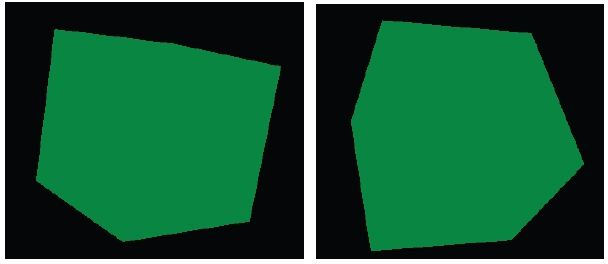

## 它是如何工作的...

示例项目使用 OpenGL ES 2.0 渲染了一个 3D 立方体。OpenGL ES 2.0 提供了一个可编程管线，可以提供顶点着色器和片段着色器来控制顶点和片段的处理方式：

+   **顶点着色器**：它对每个顶点执行。通常使用它进行变换、光照、纹理映射等。

+   **片段着色器**：它对光栅化器产生的每个片段执行。一个典型的处理是向每个片段添加颜色。

着色器是使用 OpenGL 着色语言编程的，下面将讨论这一点。

### OpenGL 着色语言（GLSL）

在此，我们简要介绍 GLSL。

+   **数据类型**：它们主要有四种类型，包括 `bool`、`int`、`float` 和 `sampler`。对于前三种类型还有向量类型——`bvec2`、`bvec3`、`bvec4` 分别指 2D、3D 和 4D 布尔向量。`ivec2`、`ivec3` 和 `ivec4` 代表整数向量。`vec2`、`vec3` 和 `vec4` 指浮点向量。**采样器**用于纹理采样，必须是统一变量。

+   **属性、统一变量和着色器间变量**：着色器包括三种输入和输出类型，包括统一变量、属性和着色器间变量。这三种类型都必须是全局的：

    +   **统一变量**：它是只读类型的，在渲染过程中不需要更改。例如，光源位置。

    +   **属性**：它是只读类型的，仅作为顶点着色器的输入。它对每个顶点都不同。例如，顶点位置。

    +   **着色器间变量**：它用于将数据从顶点着色器传递到片段着色器。在顶点着色器中它是可读可写的，但在片段着色器中仅可读。

+   **内置类型**：GLSL 有各种内置的属性、统一变量和着色器间的变量。以下我们突出介绍其中的一些：

    +   `gl_Vertex`：它是一个属性——一个表示顶点位置的 4D 向量。 

    +   `gl_Color`：这是一个属性——表示顶点颜色的 4D 向量。

    +   `gl_ModelViewMatrix`：这是一个统一变量——4x4 的模型视图矩阵。

    +   `gl_ModelViewProjectionMatrix`：这是一个统一变量。4x4 的模型视图投影矩阵。

    +   `gl_Position`：它仅作为顶点着色器输出可用。它是一个 4D 向量，表示最终处理的顶点位置。

    +   `gl_FragColor`：它仅作为片段着色器输出可用。它是一个 4D 向量，表示最终要写入帧缓冲区的颜色。

### 如何使用着色器：

在我们的示例项目中，顶点着色器程序简单地将每个立方体顶点与模型视图投影矩阵相乘，而片段着色器将每个片段设置为绿色。要使用着色器源代码，应遵循以下步骤：

1.  **创建着色器**：调用了以下 OpenGL ES 2.0 方法：

    +   `glCreateShader`：它创建一个`GL_VERTEX_SHADER`或`GL_FRAGMENT_SHADER`着色器。它返回一个非零值，通过这个值可以引用着色器。

    +   `glShaderSource`：它将源代码放入着色器对象中。之前存储的源代码将被完全替换。

    +   `glCompileShader`：它编译着色器对象中的源代码。

1.  **创建程序并附加着色器**：调用了以下方法：

    +   `glCreateProgram`：它创建一个空的程序对象，可以向其附加着色器。程序对象本质上是提供一种机制，将所有需要一起执行的内容链接起来。

    +   `glAttachShader`：它将着色器附加到程序对象上。

    +   `glLinkProgram`：它链接一个程序对象。如果程序对象附加了任何`GL_VERTEX_SHADER`对象，它们将被用来在顶点处理器上创建一个可执行文件。如果附加了任何`GL_FRAGMENT_SHADER`着色器，它们将被用来在片段处理器上创建一个可执行文件。

1.  **使用程序**：我们使用以下调用向着色器传递数据并执行 OpenGL 操作：

    +   `glUseProgram`：将程序对象作为当前渲染状态的一部分安装。

    +   `glGetAttribLocation`：它返回一个属性变量的位置。

    +   `glVertexAttribPointer`：它指定了在渲染时要使用的通用顶点属性数组的存储位置和数据格式。

    +   `glEnableVertexAttribArray`：它启用一个顶点属性数组。

    +   `glGetUniformLocation`：它返回一个统一变量的位置。

    +   `glUniform`：它指定一个统一变量的值。

    +   `glDrawArrays`：它从数组数据中渲染图元。

## 还有更多...

示例项目通过**矩阵操作**执行模型视图变换和投影变换。这些变换的细节很繁琐，不在本书的讨论范围内，因此这里不予介绍。但是，代码中提供了详细的注释。感兴趣的读者也可以轻松地在网上找到这些操作的资源。

# 使用 EGL 显示图形

除了我们在上一个配方中描述的 `GLSurfaceView` 显示机制外，还可以使用 EGL 显示 OpenGL 图形。

## 准备就绪

建议读者在阅读本节之前先阅读 *使用 OpenGL ES 1.x API 绘制 3D 图形和点亮场景* 的配方。

## 如何操作...

以下步骤描述了如何创建一个演示 EGL 用法的 Android 项目：

1.  创建一个名为 `EGLDemo` 的 Android 应用程序。将包名设置为 `cookbook.chapter4.egl`。如果你需要更详细的说明，请参考 第二章 *Java Native Interface* 中的 *加载本地库和注册本地方法* 配方。

1.  在项目 `EGLDemo` 上右键点击，选择 **Android Tools** | **添加本地支持**。

1.  添加两个 Java 文件，分别是 `EGLDemoActivity.java` 和 `MySurfaceView.java`。`EGLDemoActivity.java` 将 `ContentView` 设置为 `MySurfaceView` 的实例，并在 Android 活动回调函数中开始和停止渲染：

    ```kt
    … …
    public void onCreate(Bundle savedInstanceState) {
    super.onCreate(savedInstanceState);
    myView = new MySurfaceView(this);
    this.setContentView(myView);
    }
    protected void onResume() {
    super.onResume();
    myView.startRenderer();
    }
    … …
    protected void onStop() {
    super.onStop();
    myView.destroyRender();
    }
    … …
    ```

1.  `MySurfaceView.java` 执行的角色类似于 `GLSurfaceView`。它与本地渲染器交互来管理显示表面和处理触摸事件：

    ```kt
    public class MySurfaceView extends SurfaceView implements SurfaceHolder.Callback {
    … …
    public MySurfaceView(Context context) {
    super(context);
    this.getHolder().addCallback(this);
    }
    … …
    public boolean onTouchEvent(final MotionEvent event) {
    float x = event.getX();
    float y = event.getY();
    switch (event.getAction()) {
    case MotionEvent.ACTION_MOVE:
        float dx = x - mPreviousX;
        float dy = y - mPreviousY;
        mAngleX += dx * TOUCH_SCALE_FACTOR;
        mAngleY += dy * TOUCH_SCALE_FACTOR;
        naRequestRenderer(mAngleX, mAngleY);
    }
    mPreviousX = x;
    mPreviousY = y;
    return true;
    }
    @Override
    public void surfaceChanged(SurfaceHolder holder, int format, int width,int height) {
    naSurfaceChanged(holder.getSurface());
    }
    @Override
    public void surfaceCreated(SurfaceHolder holder) {}
    @Override
    public void surfaceDestroyed(SurfaceHolder holder) {
    naSurfaceDestroyed();
    }
    }
    ```

1.  以下代码应添加到 `jni` 文件夹中：

    +   **Cube.cpp 和 Cube.h**：使用 OpenGL 1.x API 绘制 3D 立方体。

    +   **OldRenderMethods.cpp 和 OldRenderMethods.h**：初始化 OpenGL 1.x，执行变换，绘制图形等。这类似于 *在 OpenGL 1.x 中绘制 3D 图形* 配方中的相应方法。

    +   **Renderer.cpp 和 Renderer.h**：模拟 `android.opengl.GLSurfaceView.Renderer`。它设置 EGL 上下文，管理显示等。

    +   `renderAFrame`：设置事件类型，然后通知渲染线程处理事件：

        ```kt
        void Renderer::renderAFrame(float pAngleX, float pAngleY) {
        pthread_mutex_lock(&mMutex);
        mAngleX = pAngleX; mAngleY = pAngleY;
        mRendererEvent = RTE_DRAW_FRAME;
        pthread_mutex_unlock(&mMutex);
        pthread_cond_signal(&mCondVar); 
        }
        ```

    +   `renderThreadRun`：在一个单独的线程中运行，处理各种事件，包括表面更改、绘制一帧等：

        ```kt
        void Renderer::renderThreadRun() {
            bool ifRendering = true;
            while (ifRendering) {
                pthread_mutex_lock(&mMutex);
                pthread_cond_wait(&mCondVar, &mMutex);
                switch (mRendererEvent) {
                … …
                    case RTE_DRAW_FRAME:
                        mRendererEvent = RTE_NONE;
                        pthread_mutex_unlock(&mMutex);
                        if (EGL_NO_DISPLAY!=mDisplay) {
                    naDrawGraphics(mAngleX, mAngleY);
                    eglSwapBuffers(mDisplay, mSurface);
                    }
                        }
                        break;
                    ……
                }
        }
        }
        ```

    +   `initDisplay`：设置 EGL 上下文：

        ```kt
        bool Renderer::initDisplay() {
        const EGLint attribs[] = {
            EGL_SURFACE_TYPE, EGL_WINDOW_BIT,
            EGL_BLUE_SIZE, 8,
            EGL_GREEN_SIZE, 8,
            EGL_RED_SIZE, 8,
            EGL_NONE};
        EGLint width, height, format;
        EGLint numConfigs;
        EGLConfig config;
        EGLSurface surface;
        EGLContext context;
        EGLDisplay display = eglGetDisplay(EGL_DEFAULT_DISPLAY);
        eglInitialize(display, 0, 0);
        eglChooseConfig(display, attribs, &config, 1, &numConfigs);
        eglGetConfigAttrib(display, config, EGL_NATIVE_VISUAL_ID, &format);
        ANativeWindow_setBuffersGeometry(mWindow, 0, 0, format);
        surface = eglCreateWindowSurface(display, config, mWindow, NULL);
        context = eglCreateContext(display, config, NULL, NULL);
        if (eglMakeCurrent(display, surface, surface, context) == EGL_FALSE) {
            return -1;
        }
        eglQuerySurface(display, surface, EGL_WIDTH, &width);
        eglQuerySurface(display, surface, EGL_HEIGHT, &height);
          … ...
        }
        ```

    +   `EGLDemo.cpp`：注册本地方法并包装本地代码。以下两个方法被使用：

        `naSurfaceChanged`：它获取与 Java `Surface` 对象关联的本地窗口，并初始化 EGL 和 OpenGL：

        ```kt
        void naSurfaceChanged(JNIEnv* env, jclass clazz, jobject pSurface) {
        gWindow = ANativeWindow_fromSurface(env, pSurface);
        gRenderer->initEGLAndOpenGL1x(gWindow);
        }
        ```

        `naRequestRenderer`：渲染一帧，由 `MySurfaceView` 中的 `touch` 事件处理程序调用：

        ```kt
        void naRequestRenderer(JNIEnv* env, jclass clazz, float pAngleX, float pAngleY) {
        gRenderer->renderAFrame(pAngleX, pAngleY);
        }
        ```

1.  在 `jni` 文件夹下添加 `Android.mk` 文件，内容如下：

    ```kt
    LOCAL_PATH := $(call my-dir)
    include $(CLEAR_VARS)
    LOCAL_MODULE := EGLDemo
    LOCAL_SRC_FILES := Cube.cpp OldRenderMethods.cpp Renderer.cpp EGLDemo.cpp
    LOCAL_LDLIBS := -llog -landroid -lEGL -lGLESv1_CM
    include $(BUILD_SHARED_LIBRARY)
    ```

1.  构建 Android NDK 应用程序并在 Android 设备上运行。应用程序将显示一个立方体，我们可以触摸它使其旋转：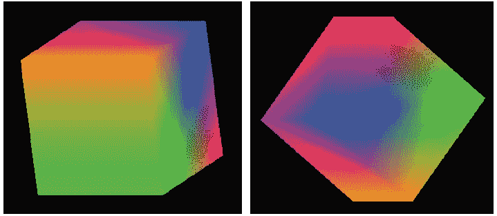

## 它是如何工作的...

EGL 是 OpenGL ES 与底层本地窗口系统之间的接口。根据 Khronos EGL 网页（[`www.khronos.org/egl`](http://www.khronos.org/egl)）的说明，它处理包括 OpenGL ES 在内的其他 Khronos 2D 和 3D API 的图形上下文管理、表面绑定和渲染同步。

### 提示

**EGL**是一个在嵌入式系统中广泛使用的跨平台 API，包括 Android 和 iPhone（苹果实现的 EGL 称为**EAGL**）。许多桌面平台也支持 EGL。不同的实现可能不是 100%兼容，但通常 EGL 代码的移植工作不会很繁重。

以下步骤描述了如何设置和操作 EGL 及其与 OpenGL 的集成：

1.  **获取并初始化显示连接**：EGL 需要知道内容应该显示在哪里，因此我们将需要获取一个显示连接并初始化它。这是使用以下两个方法完成的：

    +   `eglGetDisplay`：它获取原生显示的 EGL 显示连接。如果输入参数是`EGL_DEFAULT_DISPLAY`，则返回默认显示连接。

    +   `eglInitialize`：它初始化通过`eglGetDisplay`获取的 EGL 显示连接。

1.  **配置 EGL**：这是通过`eglChooseConfig`完成的。

    `eglChooseConfig`返回与`attrib_list`参数指定的要求相匹配的 EGL 帧缓冲区配置列表。属性是一个属性和相应期望值对的数组，以`EGL_NONE`结束。在我们的代码中，我们简单指定`EGL_SURFACE_TYPE`为`EGL_WINDOW_BIT`，颜色组件大小为 8 位。

1.  **创建一个渲染表面，用于放置显示内容**：这是通过`eglCreateWindowSurface`完成的。

    `eglCreateWindowSurface`，给定 EGL 显示连接、EGL 帧缓冲区配置和原生窗口，返回一个新的 EGL 窗口表面。

    在我们的代码中，我们从`SurfaceView`开始，并将其关联的`android.view.Surface`值传递给原生代码。在原生代码中，我们获取其原生窗口，并最终为 OpenGL 绘制创建 EGL 窗口表面。

1.  **创建 EGL 渲染上下文并将其设为当前**：这是通过`eglCreateContext`和`eglMakeCurrent`完成的。

    +   `eglCreateContext`：它创建一个新的 EGL 渲染上下文，用于渲染到 EGL 绘制表面。

    +   `eglMakeCurrent`：它将 EGL 上下文附加到 EGL 绘制和读取表面。在我们的代码中，创建的窗口表面被用作读取和绘制表面。

1.  **OpenGL 绘制**：这在前面的食谱中已经介绍过了。

1.  **交换 EGL 表面内部缓冲区以显示内容**：这是通过`eglSwapBuffers`调用完成的。

    `eglSwapBuffers`将 EGL 表面颜色缓冲区发布到原生窗口。这有效地在屏幕上显示绘制内容。

    EGL 内部维护两个缓冲区。前缓冲区的内容被显示，而绘制可以在后缓冲区进行。当我们决定显示新的绘制内容时，我们交换这两个缓冲区。

1.  当我们想要停止渲染时，释放 EGL 上下文，销毁 EGL 表面，终止 EGL 显示连接：

    +   使用`EGL_NO_SURFACE`和`EGL_NO_CONTEXT`的`eglMakeCurrent`释放当前上下文。

    +   `eglDestroySurface`销毁一个 EGL 表面。

    +   `eglTerminate` 终止了 EGL 显示连接

### 窗口管理

我们的代码使用 Android 原生窗口管理 API 调用来获取原生窗口并配置它。调用了以下方法：

+   `ANativeWindow_fromSurface`：它返回与 Java 表面对象关联的原生窗口。返回的引用应该传递给 `ANativeWindow_release`，以确保没有内存泄漏。

+   `ANativeWindow_setBuffersGeometry`：它设置窗口缓冲区的大小和格式。在我们的代码中，我们将宽度和高度指定为 `0`，在这种情况下，将使用窗口的基本值。

请注意，我们将在 `Android.mk` 文件中链接到 Android 库（`LOCAL_LDLIBS := -landroid`），因为它是 Android 原生应用程序 API 的一部分，我们将在下一章中详细介绍。

## 还有更多...

渲染器在一个单独的线程中运行事件循环。我们使用了**POSIX 线程**（`pthreads`）调用创建原生线程，将其与主线程同步等。我们将在第六章，*Android NDK Multithreading*中详细讲解 `pthread`。
