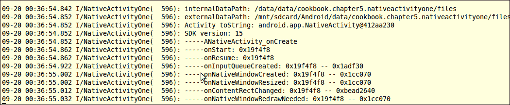
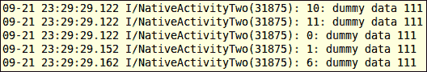
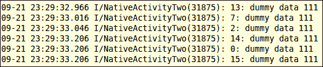
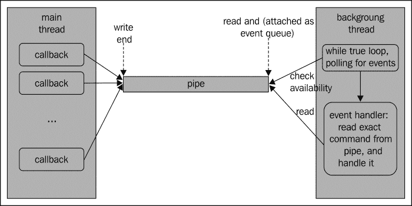
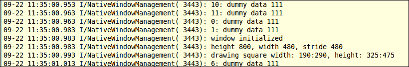
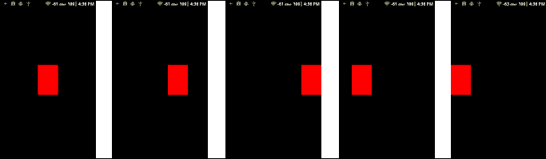

# 第五章：Android 本地应用程序 API

在本章中，我们将涵盖以下内容：

+   使用 native_activity.h 接口创建本地活动

+   使用 Android 本地应用程序胶水创建本地活动

+   在 Android NDK 中管理本地窗口

+   在 Android NDK 中检测和处理输入事件

+   在 Android NDK 中访问传感器

+   在 Android NDK 中管理资产

# 引言

感谢 Android 本地应用程序 API，从 Android API 级别 9（Android 2.3，姜饼）起，就有可能用纯本地代码编写 Android 应用程序。也就是说，不需要任何 Java 代码。Android 本地 API 在`<NDK root>/platforms/android-<API level>/arch-arm/usr/include/android/`文件夹下的几个头文件中定义。根据这些头文件中定义的函数提供的功能，它们可以分为以下几类：

+   活动生命周期管理：

    +   `native_activity.h`

    +   `looper.h`

+   窗口管理：

    +   `rect.h`

    +   `window.h`

    +   `native_window.h`

    +   `native_window_jni.h`

+   输入（包括按键和动作事件）和传感器事件：

    +   `input.h`

    +   `keycodes.h`

    +   `sensor.h`

+   资产、配置和存储管理：

    +   `configuration.h`

    +   `asset_manager.h`

    +   `asset_manager_jni.h`

    +   `storage_manager.h`

    +   `obb.h`

此外，Android NDK 还提供了一个名为**本地应用程序胶水**的静态库，以帮助创建和管理本地活动。该库的源代码可以在`sources/android/native_app_glue/`目录下找到。

在本章中，我们首先会介绍使用`native_acitivity.h`提供的简单回调模型创建本地活动，以及本地应用程序胶水库支持的更复杂但灵活的两个线程模型。然后，我们将讨论在 Android NDK 中的窗口管理，我们将在本地代码中在屏幕上绘制内容。接下来介绍输入事件处理和传感器访问。最后，我们将介绍资产管理，它管理我们项目`assets`文件夹下的文件。请注意，本章涵盖的 API 可以完全摆脱 Java 代码，但我们不必这样做。《在 Android NDK 中管理资产》一节提供了一个在混合代码 Android 项目中使用资产管理 API 的示例。

在开始之前，我们需要牢记，尽管在本地活动中不需要 Java 代码，但 Android 应用程序仍然在 Dalvik VM 上运行，许多 Android 平台功能是通过 JNI 访问的。Android 本地应用程序 API 只是为我们隐藏了 Java 世界。

# 使用 native_activity.h 接口创建本地活动

Android 本地应用程序 API 允许我们创建本地活动，这使得用纯本地代码编写 Android 应用程序成为可能。本节介绍如何使用纯 C/C++代码编写简单的 Android 应用程序。

## 准备就绪

期望读者对如何调用 JNI 函数有基本了解。第二章，*Java Native Interface* 详细介绍了 JNI，建议在阅读当前部分之前至少阅读该章节或以下内容：

+   *在安卓 NDK 中操作字符串*

+   *在 NDK 中调用实例和静态方法*

## 如何操作…

创建一个没有一行 Java 代码的简单安卓 NDK 应用程序的以下步骤：

1.  创建一个名为 `NativeActivityOne` 的安卓应用程序。将包名设置为 `cookbook.chapter5.nativeactivityone`。如果你需要更详细的说明，请参考 第二章，*Java Native Interface* 中的 *加载本地库和注册本地方法* 部分。

1.  右键点击 `NativeActivityOne` 项目，选择 **Android Tools** | **添加本地支持**。

1.  按照以下方式更改 `AndroidManifest.xml` 文件：

    ```kt
    <manifest 
       package="cookbook.chapter5.nativeactivityone"
       android:versionCode="1"
       android:versionName="1.0">
       <uses-sdk android:minSdkVersion="9"/>
       <application android:label="@string/app_name"
           android:icon="@drawable/ic_launcher"
           android:hasCode="true">        
      <activity android:name="android.app.NativeActivity"
          android:label="@string/app_name"
          android:configChanges="orientation|keyboardHidden">  
               <meta-data android:name="android.app.lib_name"
                 android:value="NativeActivityOne" />
               <intent-filter>
                 <action android:name="android.intent.action.MAIN" />
                 <category android:name="android.intent.category.LAUNCHER" />
               </intent-filter>
             </activity>   
       </application>
    </manifest>
    ```

    我们应该确保在前一个文件中正确设置以下内容：

    +   活动名称必须设置为 `android.app.NativeActivity`。

    +   `android.app.lib_name` 元数据的值必须设置为本地模块名称，不带 `lib` 前缀和 `.so` 后缀。

    +   `android:hasCode` 需要设置为 `true`，表示应用程序包含代码。注意 `<NDK 根目录>/docs/NATIVE-ACTIVITY.HTML` 中的文档提供了一个将 `android:hasCode` 设置为 `false` 的 `AndroidManifest.xml` 文件示例，这将不允许应用程序启动。

1.  在 `jni` 文件夹下添加两个名为 `NativeActivityOne.cpp` 和 `mylog.h` 的文件。`ANativeActivity_onCreate` 方法应该在 `NativeActivityOne.cpp` 中实现。以下是实现的一个示例：

    ```kt
    void ANativeActivity_onCreate(ANativeActivity* activity,
           void* savedState, size_t savedStateSize) {
      printInfo(activity);
      activity->callbacks->onStart = onStart;
      activity->callbacks->onResume = onResume;
      activity->callbacks->onSaveInstanceState = onSaveInstanceState;
      activity->callbacks->onPause = onPause;
      activity->callbacks->onStop = onStop;
      activity->callbacks->onDestroy = onDestroy;
      activity->callbacks->onWindowFocusChanged = onWindowFocusChanged;
      activity->callbacks->onNativeWindowCreated = onNativeWindowCreated;
      activity->callbacks->onNativeWindowResized = onNativeWindowResized;
      activity->callbacks->onNativeWindowRedrawNeeded = onNativeWindowRedrawNeeded;
      activity->callbacks->onNativeWindowDestroyed = onNativeWindowDestroyed;
      activity->callbacks->onInputQueueCreated = onInputQueueCreated;
      activity->callbacks->onInputQueueDestroyed = onInputQueueDestroyed;
      activity->callbacks->onContentRectChanged = onContentRectChanged;
      activity->callbacks->onConfigurationChanged = onConfigurationChanged;
      activity->callbacks->onLowMemory = onLowMemory;
      activity->instance = NULL;
    }
    ```

1.  在 `jni` 文件夹下添加 `Android.mk` 文件：

    ```kt
    LOCAL_PATH := $(call my-dir)
    include $(CLEAR_VARS)
    LOCAL_MODULE    := NativeActivityOne
    LOCAL_SRC_FILES := NativeActivityOne.cpp
    LOCAL_LDLIBS    := -landroid -llog
    include $(BUILD_SHARED_LIBRARY)
    ```

1.  构建安卓应用程序并在模拟器或设备上运行。启动一个终端并使用以下命令显示 logcat 输出：

    ```kt
    $ adb logcat -v time NativeActivityOne:I *:S
    ```

    或者，你也可以使用 Eclipse 中的 logcat 视图来查看 logcat 输出。

    当应用程序启动时，你应该能够看到以下 logcat 输出：

    

    如截图所示，执行了几个安卓活动生命周期回调函数。我们可以操作手机以执行其他回调。例如，长按主页按钮然后按返回按钮将导致 `onWindowFocusChanged` 回调执行。

## 工作原理…

在我们的示例中，我们创建了一个简单的“纯”本地应用程序，当安卓框架调用我们定义的回调函数时输出日志。"纯"本地应用程序实际上并不是完全本地化的。尽管我们没有编写一行 Java 代码，安卓框架仍然在 Dalvik VM 上运行一些 Java 代码。

Android 框架提供了一个`android.app.NativeActivity.java`类，帮助我们创建一个“本地”活动。在一个典型的 Java 活动中，我们扩展`android.app.Activity`并覆盖活动生命周期方法。`NativeActivity`也是`android.app.Activity`的一个子类，做类似的事情。在本地活动的开始，`NativeActivity.java`将调用`ANativeActivity_onCreate`，这在`native_activity.h`中声明，并由我们实现。在`ANativeActivity_onCreate`方法中，我们可以注册我们的回调方法来处理活动生命周期事件和用户输入。在运行时，`NativeActivity`将在相应事件发生时调用这些本地回调方法。

总之，`NativeActivity`是一个封装，它为我们的本地代码隐藏了管理的 Android Java 世界，并公开了`native_activity.h`中定义的本地接口。

**`ANativeActivity`数据结构**：本地代码中的每个回调方法都接受一个`ANativeActivity`结构的实例。Android NDK 在`native_acitivity.h`中定义了`ANativeActivity`数据结构，如下所示：

```kt
typedef struct ANativeActivity {
   struct ANativeActivityCallbacks* callbacks;
   JavaVM* vm;
   JNIEnv* env;
   jobject clazz;
   const char* internalDataPath;
   const char* externalDataPath;
   int32_t sdkVersion;
   void* instance;
   AAssetManager* assetManager;
} ANativeActivity;
```

上述代码的各种属性解释如下：

+   `callbacks`：这是一个定义了 Android 框架将在主 UI 线程中调用的所有回调的数据结构。

+   `vm`：它是应用程序进程的全局 Java VM 句柄。它被用于某些 JNI 函数中。

+   `env`：这是一个`JNIEnv`接口指针。`JNIEnv`通过局部存储数据使用（更多详情请参考第二章中的*在 Android NDK 中操作字符串*食谱，*Java Native 接口*），因此这个字段只能通过主 UI 线程访问。

+   `clazz`：这是由 Android 框架创建的`android.app.NativeActivity`对象的引用。它可以用来访问`android.app.NativeActivity` Java 类中的字段和方法。在我们的代码中，我们访问了`android.app.NativeActivity`的`toString`方法。

+   `internalDataPath`：它是应用程序的内部数据目录路径。

+   `externalDataPath`：它是应用程序的外部数据目录路径。

    ### 提示

    `internalDataPath`和`externalDataPath`在 Android 2.3.x 版本中是`NULL`。这是一个已知的错误，从 Android 3.0 开始已经修复。如果我们针对的是低于 Android 3.0 的设备，那么我们需要寻找其他方法来获取内部和外部数据目录。

+   `sdkVersion`：这是 Android 平台的 SDK 版本号。注意，这指的是运行应用的设备/模拟器的版本，而不是我们开发中使用的 SDK 版本。

+   `instance`：框架不使用它。我们可以用它来存储用户定义的数据并在需要时传递。

+   `assetManager`：这是指向应用程序资源管理器实例的指针。我们需要它来访问`assets`数据。我们将在本章的*在 Android NDK 中管理资源*食谱中详细讨论它。

## 还有更多内容…

`native_activity.h`接口提供了一个简单的单线程回调机制，它允许我们编写不涉及 Java 代码的活动。但是，这种单线程方法意味着我们必须快速从本地回调方法中返回。否则，应用程序将无法响应用户操作（例如，当我们触摸屏幕或按下**菜单**按钮时，应用无法响应，因为 GUI 线程正忙于执行回调函数）。

解决这个问题的方法之一是使用多线程。例如，许多游戏需要几秒钟来加载。我们需要将加载工作放到后台线程中，这样 UI 就可以显示加载进度并响应用户输入。Android NDK 附带一个名为`android_native_app_glue`的静态库，以帮助我们处理此类情况。这个库的细节在*使用 Android 本地应用胶水创建本地活动*的食谱中有所介绍。

### 提示

Java 活动中也存在类似的问题。例如，如果我们编写一个在`onCreate`中搜索整个设备图片的 Java 活动，应用程序将会无响应。我们可以使用`AsyncTask`在后台搜索和加载图片，并让主 UI 线程显示进度条并响应用户输入。

# 使用 Android 本地应用胶水创建本地活动

上一个食谱描述了`native_activity.h`中定义的接口如何让我们创建本地活动。然而，所有定义的回调都是在主 UI 线程中调用的，这意味着我们不能在回调中进行繁重的处理。

Android SDK 提供了`AsyncTask`、`Handler`、`Runnable`、`Thread`等，帮助我们后台处理事情并与主 UI 线程通信。Android NDK 提供了一个名为`android_native_app_glue`的静态库，以帮助我们在单独的线程中执行回调函数并处理用户输入。本食谱将详细讨论`android_native_app_glue`库。

## 准备就绪

`android_native_app_glue`库是建立在`native_activity.h`接口之上的。因此，建议读者在阅读这个食谱之前先阅读*使用 native_activity.h 接口创建本地活动*的食谱。

## 如何操作…

以下步骤基于`android_native_app_glue`库创建一个简单的 Android NDK 应用程序：

1.  创建一个名为`NativeActivityTwo`的 Android 应用程序。将包名设置为`cookbook.chapter5.nativeactivitytwo`。如果你需要更详细的说明，请参考第二章中的*加载本地库和注册本地方法*食谱，*Java Native Interface*。

1.  右键点击`NativeActivityTwo`项目，选择**Android Tools** | **添加本地支持**。

1.  修改`AndroidManifest.xml`文件如下：

    ```kt
    <manifest 
       package="cookbook.chapter5.nativeactivitytwo"
       android:versionCode="1"
       android:versionName="1.0">
       <uses-sdk android:minSdkVersion="9"/>
       <application android:label="@string/app_name"
           android:icon="@drawable/ic_launcher"
           android:hasCode="true">
        <activity android:name="android.app.NativeActivity"
            android:label="@string/app_name"
            android:configChanges="orientation|keyboardHidden">        
               <meta-data android:name="android.app.lib_name"
                 android:value="NativeActivityTwo" />
               <intent-filter>
                 <action android:name="android.intent.action.MAIN" />
                 <category android:name="android.intent.category.LAUNCHER" />
               </intent-filter>
           </activity>
       </application>
    </manifest>
    ```

1.  在`jni`文件夹下添加两个名为`NativeActivityTwo.cpp`和`mylog.h`的文件。以下是`NativeActivityTwo.cpp`的代码：

    ```kt
    #include <jni.h>
    #include <android_native_app_glue.h>
    #include "mylog.h"
    void handle_activity_lifecycle_events(struct android_app* app, int32_t cmd) {
      LOGI(2, "%d: dummy data %d", cmd, *((int*)(app->userData)));
    }
    void android_main(struct android_app* app) {
      app_dummy();    // Make sure glue isn't stripped.
      int dummyData = 111;
      app->userData = &dummyData;
      app->onAppCmd = handle_activity_lifecycle_events;
      while (1) {
        int ident, events;
        struct android_poll_source* source;
    if ((ident=ALooper_pollAll(-1, NULL, &events, (void**)&source)) >= 0) {
          source->process(app, source);
        }
      }
    }
    ```

1.  在`jni`目录下添加`Android.mk`文件：

    ```kt
    LOCAL_PATH := $(call my-dir)
    include $(CLEAR_VARS)
    LOCAL_MODULE    := NativeActivityTwo
    LOCAL_SRC_FILES := NativeActivityTwo.cpp
    LOCAL_LDLIBS    := -llog -landroid
    LOCAL_STATIC_LIBRARIES := android_native_app_glue
    include $(BUILD_SHARED_LIBRARY)
    $(call import-module,android/native_app_glue)
    ```

1.  构建 Android 应用程序并在模拟器或设备上运行。启动一个终端并使用以下命令显示 logcat 输出：

    ```kt
    adb logcat -v time NativeActivityTwo:I *:S
    ```

    当应用程序启动时，你应该能够看到以下 logcat 输出，并且设备屏幕将显示一个黑屏：

    

    按下返回键时，将显示以下输出：

    

## 它的工作原理是…

本示例演示了如何使用`android_native_app_glue`库创建一个本地活动。

使用`android_native_app_glue`库应遵循以下步骤：

+   实现一个名为`android_main`的函数。这个函数应该实现一个事件循环，持续地轮询事件。这个方法将在库创建的后台线程中运行。

+   默认情况下，后台线程附带了两个事件队列，包括活动生命周期事件队列和输入事件队列。当使用库创建的 looper 轮询事件时，你可以通过检查返回的标识符（`LOOPER_ID_MAIN`或`LOOPER_ID_INPUT`）来确定事件来自哪里。也可以将附加的事件队列附加到后台线程。

+   当返回一个事件时，数据指针将指向一个`android_poll_source`数据结构。我们可以调用这个结构的 process 函数。这个过程是一个函数指针，对于活动生命周期事件，它指向`android_app->onAppCmd`；对于输入事件，它指向`android_app->onInputEvent`。我们可以提供自己的处理函数，并将相应的函数指针指向这些函数。

在我们的示例中，我们实现了一个名为`handle_activity_lifecycle_events`的简单函数，并将`android_app->onAppCmd`函数指针指向它。这个函数只是简单地打印`cmd`值以及与`android_app`数据结构一起传递的用户数据。`cmd`在`android_native_app_glue.h`中定义为枚举。例如，当应用启动时，`cmd`值为`10`、`11`、`0`、`1`和`6`，分别对应于`APP_CMD_START`、`APP_CMD_RESUME`、`APP_CMD_INPUT_CHANGED`、`APP_CMD_INIT_WINDOW`和`APP_CMD_GAINED_FOCUS`。

**`android_native_app_glue`库内部机制**：你可以在 Android NDK 的`sources/android/native_app_glue`目录下找到`android_native_app_glue`库的源代码。它仅由两个文件组成，分别是`android_native_app_glue.c`和`android_native_app_glue.h`。我们首先描述代码的流程，然后详细讨论一些重要的方面。

### 提示

由于提供了`native_app_glue`的源代码，我们可以在必要时修改它，尽管在大多数情况下并不需要。

`android_native_app_glue`是建立在`native_activity.h`接口之上的。如下代码所示（从`sources/android/native_app_glue/android_native_app_glue.c`提取），它实现了`ANativeActivity_onCreate`函数，在其中注册回调函数并调用`android_app_create`函数。请注意，返回的`android_app`实例由原生活动的`instance`字段指向，可以传递给各种回调函数：

```kt
void ANativeActivity_onCreate(ANativeActivity* activity,
        void* savedState, size_t savedStateSize) {
    LOGV("Creating: %p\n", activity);
    activity->callbacks->onDestroy = onDestroy;
    activity->callbacks->onStart = onStart;
    activity->callbacks->onResume = onResume;
    … …
    activity->callbacks->onNativeWindowCreated = onNativeWindowCreated;
    activity->callbacks->onNativeWindowDestroyed = onNativeWindowDestroyed;
    activity->callbacks->onInputQueueCreated = onInputQueueCreated;
    activity->callbacks->onInputQueueDestroyed = onInputQueueDestroyed;
    activity->instance = android_app_create(activity, savedState, savedStateSize);
}
```

`android_app_create`函数（如下代码片段所示）初始化`android_app`数据结构的一个实例，该结构在`android_native_app_glue.h`中定义。这个函数为线程间通信创建了一个单向管道。之后，它生成一个新的线程（之后我们称之为**后台线程**）以初始化的`android_app`数据作为输入参数运行`android_app_entry`函数。主线程将等待后台线程启动，然后返回：

```kt
static struct android_app* android_app_create(ANativeActivity* activity, void* savedState, size_t savedStateSize) {
    struct android_app* android_app = (struct android_app*)malloc(sizeof(struct android_app));
    memset(android_app, 0, sizeof(struct android_app));
    android_app->activity = activity;

    pthread_mutex_init(&android_app->mutex, NULL);
    pthread_cond_init(&android_app->cond, NULL);
  ……
    int msgpipe[2];
    if (pipe(msgpipe)) {
        LOGE("could not create pipe: %s", strerror(errno));
        return NULL;
    }
    android_app->msgread = msgpipe[0];
    android_app->msgwrite = msgpipe[1];

    pthread_attr_t attr; 
    pthread_attr_init(&attr);
    pthread_attr_setdetachstate(&attr, PTHREAD_CREATE_DETACHED);
    pthread_create(&android_app->thread, &attr, android_app_entry, android_app);
    // Wait for thread to start.
    pthread_mutex_lock(&android_app->mutex);
    while (!android_app->running) {
        pthread_cond_wait(&android_app->cond, &android_app->mutex);
    }
    pthread_mutex_unlock(&android_app->mutex);
    return android_app;
}
```

后台线程从`android_app_entry`函数开始（如下代码片段所示），在其中创建一个循环器。两个事件队列将被附加到循环器上。活动生命周期事件队列被附加到`android_app_entry`函数上。当活动的输入队列被创建时，输入队列被附加（到`android_native_app_glue.c`的`android_app_pre_exec_cmd`函数）。在附加了活动生命周期事件队列之后，后台线程向主线程发出信号，表明它已经在运行。然后它调用名为`android_main`的函数，并传入`android_app`数据。`android_main`是我们需要实现的函数，正如我们的示例代码所示。它必须在一个循环中运行，直到活动退出：

```kt
static void* android_app_entry(void* param) {
    struct android_app* android_app = (struct android_app*)param;
  … …
  //Attach life cycle event queue with identifier LOOPER_ID_MAIN
    android_app->cmdPollSource.id = LOOPER_ID_MAIN;
    android_app->cmdPollSource.app = android_app;
    android_app->cmdPollSource.process = process_cmd;
    android_app->inputPollSource.id = LOOPER_ID_INPUT;
    android_app->inputPollSource.app = android_app;
    android_app->inputPollSource.process = process_input;
    ALooper* looper = ALooper_prepare(ALOOPER_PREPARE_ALLOW_NON_CALLBACKS);
    ALooper_addFd(looper, android_app->msgread, LOOPER_ID_MAIN, ALOOPER_EVENT_INPUT, NULL, &android_app->cmdPollSource);
    android_app->looper = looper;

    pthread_mutex_lock(&android_app->mutex);
    android_app->running = 1;
    pthread_cond_broadcast(&android_app->cond);
    pthread_mutex_unlock(&android_app->mutex);
    android_main(android_app);
    android_app_destroy(android_app);
    return NULL;
}
```

下图展示了主线程和后台线程如何共同工作以创建多线程原生活动：



我们以活动生命周期事件队列为例。主线程调用回调函数，这些函数只是向管道的写端写入数据，而在`android_main`函数中实现的真正循环将轮询事件。一旦检测到事件，该函数就会调用事件处理程序，从管道的读端读取确切的命令并进行处理。`android_native_app_glue`库为我们实现了所有`主线程`的工作以及部分`后台线程`的工作。我们只需要提供轮询循环和事件处理程序，正如我们的示例代码所示。

**管道**：主线程通过在`android_app_create`函数中调用`pipe`方法创建一个单向管道。这个方法接受一个包含两个整数的数组。函数返回后，第一个整数将被设置为代表管道读端的文件描述符，而第二个整数将被设置为代表管道写端的文件描述符。

管道通常用于**进程间通信**（**IPC**），但在这里它被用于主 UI 线程与在`android_app_entry`创建的后台线程之间的通信。当一个活动生命周期事件发生时，主线程将执行在`ANativeActivity_onCreate`注册的相应回调函数。回调函数只是将一个命令写入管道的写入端，然后等待来自后台线程的信号。后台线程应该不断地轮询事件，一旦检测到生命周期事件，它将从管道的读取端读取确切的事件，通知主线程解除阻塞并处理事件。因为信号在收到命令后立即发送，且在实际处理事件之前，主线程可以快速从回调函数返回，而无需担心事件可能需要长时间处理。

不同的操作系统对管道的实现各不相同。安卓系统实现的管道是“半双工”的，即通信是单向的。也就是说，一个文件描述符只能写，另一个文件描述符只能读。某些操作系统中的管道是“全双工”的，两个文件描述符都可以读写。

**循环器**是一个事件跟踪设施，它允许我们为一个线程的事件循环附加一个或多个事件队列。每个事件队列都有一个关联的文件描述符。一个**事件**是在文件描述符上可用的数据。为了使用循环器，我们需要包含`android/looper.h`头文件。

该库为我们在后台线程中创建的事件循环附加了两个事件队列，包括活动生命周期事件队列和输入事件队列。为了使用循环器，应按以下步骤操作：

1.  **为当前线程创建或获取一个循环器**：这是通过`ALooper_prepare`函数完成的：

    ```kt
    ALooper* ALooper_prepare(int opts);
    ```

    该函数准备与调用线程关联的循环器并返回它。如果循环器不存在，它会创建一个，将其与线程关联，并返回它。

1.  **附加一个事件队列**：这是通过`ALooper_addFd`完成的。该函数具有以下原型：

    ```kt
    int ALooper_addFd(ALooper* looper, int fd, int ident, int events, ALooper_callbackFunc callback, void* data);
    ```

    该函数有两种使用方式。首先，如果将`callback`设置为`NULL`，则`ident`集合将由`ALooper_pollOnce`和`ALooper_pollAll`返回。其次，如果`callback`非`NULL`，则将执行回调函数，并忽略`ident`。`android_native_app_glue`库采用第一种方法将新的事件队列附加到 looper 上。输入参数`fd`表示与事件队列相关联的文件描述符。`ident`是事件队列中事件的标识符，可用于分类事件。当`callback`设置为`NULL`时，标识符必须大于零。在库源代码中，`callback`被设置为`NULL`，`data`指向将随标识符一起在轮询时返回的私有数据。

    在库中，此函数被调用来将活动生命周期事件队列附加到后台线程。输入事件队列通过特定于输入队列的函数`AInputQueue_attachLooper`进行附加，我们将在*在 NDK 中检测和处理输入事件*的菜谱中进行讨论。

1.  **轮询事件**：可以通过以下两个函数之一来完成：

    ```kt
    int ALooper_pollOnce(int timeoutMillis, int* outFd, int* outEvents, void** outData);
    int ALooper_pollAll(int timeoutMillis, int* outFd, int* outEvents, void** outData);
    ```

    当在`ALooper_addFd`中将`callback`设置为`NULL`时，这两种方法是等价的。它们具有相同的输入参数。`timeoutMillis`指定轮询的超时时间。如果设置为 0，则函数立即返回；如果设置为负数，它们将无限期等待直到发生事件。当与 looper 关联的任何输入队列发生事件时，函数将返回标识符（大于零）。在这种情况下，`outFd`、`outEvents`和`outData`将被设置为与事件关联的文件描述符、轮询事件和数据。否则，它们将被设置为`NULL`。

1.  **分离事件队列**：这是通过以下函数完成的：

    ```kt
    int ALooper_removeFd(ALooper* looper, int fd);
    ```

    它接受与事件队列相关联的 looper 和文件描述符，并将队列从 looper 上分离。

# 在 Android NDK 中管理原生窗口

本章前面的菜谱仅提供了带有 logcat 输出的简单示例。这个菜谱将讨论如何在 Android NDK 中管理原生窗口。

## 准备就绪

建议读者在阅读这个菜谱之前阅读以下菜谱：

+   *使用 native_activity.h 接口创建原生活动*

+   *使用 Android 原生应用胶水创建原生活动*

还要回顾一下，在第四章，*Android NDK OpenGL ES API*中的*使用 EGL 显示图形*菜谱中简要介绍了原生窗口管理。

## 如何操作…

以下步骤创建示例应用程序：

1.  创建一个名为`NativeWindowManagement`的 Android 应用程序。将包名设置为`cookbook.chapter5.nativewindowmanagement`。如果你需要更详细的说明，请参考第二章，*Java Native Interface*中的*加载本地库和注册本地方法*的菜谱。

1.  右键点击`NativeWindowManagement`项目，选择**Android Tools** | **添加原生支持**。

1.  更新`AndroidManifest.xml`。具体细节请参考之前的食谱或下载的代码。注意，元数据`android.app.lib_name`的值必须为`NativeWindowManagement`。

1.  在`jni`文件夹下添加两个名为`NativeWindowManagement.cpp`和`mylog.h`的文件。`NativeWindowManagement.cpp`是基于之前食谱修改的。以下代码段显示了更新的部分：

    ```kt
    void drawSomething(struct android_app* app) {
      ANativeWindow_Buffer lWindowBuffer;
      ANativeWindow* lWindow = app->window;
      ANativeWindow_setBuffersGeometry(lWindow, 0, 0, WINDOW_FORMAT_RGBA_8888);
      if (ANativeWindow_lock(lWindow, &lWindowBuffer, NULL) < 0) {
        return;
      }
      memset(lWindowBuffer.bits, 0, lWindowBuffer.stride*lWindowBuffer.height*sizeof(uint32_t));
      int sqh = 150, sqw = 100;
      int wst = lWindowBuffer.stride/2 - sqw/2;
      int wed = wst + sqw;
      int hst = lWindowBuffer.height/2 - sqh/2;
      int hed = hst + sqh;
      for (int i = hst; i < hed; ++i) {
        for (int j = wst; j < wed; ++j) {
          ((char*)(lWindowBuffer.bits))[(i*lWindowBuffer.stride + j)*sizeof(uint32_t)] = (char)255;      //R
          ((char*)(lWindowBuffer.bits))[(i*lWindowBuffer.stride + j)*sizeof(uint32_t) + 1] = (char)0;    //G
          ((char*)(lWindowBuffer.bits))[(i*lWindowBuffer.stride + j)*sizeof(uint32_t) + 2] = (char)0;    //B
          ((char*)(lWindowBuffer.bits))[(i*lWindowBuffer.stride + j)*sizeof(uint32_t) + 3] = (char)255;    //A
        }
      }
      ANativeWindow_unlockAndPost(lWindow);
    }

    void handle_activity_lifecycle_events(struct android_app* app, int32_t cmd) {
      LOGI(2, "%d: dummy data %d", cmd, *((int*)(app->userData)));
      switch (cmd) {
      case APP_CMD_INIT_WINDOW:
        drawSomething(app);
        break;
      }
    }
    ```

1.  在`jni`文件夹下添加`Android.mk`文件，与之前食谱中使用的类似。你只需要将模块名称替换为`NativeWindowManagement`，源文件替换为`NativeWindowManagement.cpp`。

1.  构建 Android 应用程序并在模拟器或设备上运行。启动终端并使用以下命令显示 logcat 输出：

    ```kt
    $ adb logcat -v time NativeWindowManagement:I *:S
    ```

    当应用程序启动时，我们将看到以下 logcat 输出：

    

    设备屏幕将在屏幕中心显示一个红色矩形，如下所示：

    

## 工作原理…

原生窗口管理的 NDK 接口在`window.h`、`rect.h`、`native_window_jni.h`和`native_window.h`头文件中定义。前两个只是定义了一些常量和数据结构。`native_window_jni.h`定义了一个名为`ANativeWindow_fromSurface`的单一函数，它帮助我们从一个 Java 表面对象获取原生窗口。我们在第四章，*使用 EGL 显示图形*的食谱中说明了这个函数。这里，我们关注`native_window.h`中提供的函数。

执行以下步骤在手机屏幕上绘制一个正方形：

1.  **设置窗口缓冲区格式和大小**：这是通过`ANativeWindow_setBuffersGeometry`函数完成的：

    ```kt
    int32_t ANativeWindow_setBuffersGeometry(ANativeWindow* window, int32_t width, int32_t height, int32_t format);
    ```

    此函数更新与输入参数 window 引用的原生窗口关联的原生窗口缓冲区。根据其余输入参数，窗口大小和格式会发生变化。在`native_window.h`中定义了三种格式，包括`WINDOW_FORMAT_RGBA_8888`、`WINDOW_FORMAT_RGBX_8888`和`WINDOW_FORMAT_RGB_565`。如果大小或格式设置为`0`，则将使用原生窗口的基本值。

1.  **锁定窗口下一次绘图表面**：这是通过`ANativeWindow_lock`函数完成的：

    ```kt
    int32_t ANativeWindow_lock(ANativeWindow* window, ANativeWindow_Buffer* outBuffer,  ARect* inOutDirtyBounds);
    ```

    在此调用返回后，输入参数`outBuffer`将引用用于绘图的窗口缓冲区。

1.  **清除缓冲区**：这是可选的。有时我们可能只想覆盖窗口缓冲区的一部分。在我们的示例中，我们调用了`memset`将所有数据设置为`0`。

1.  **在缓冲区中绘制内容**：在我们的示例中，我们首先计算矩形的开始和结束宽度与高度，然后将矩形区域的红色和 alpha 字节设置为`255`。这将显示一个红色矩形。

1.  **解锁窗口的绘图表面并向显示发布新缓冲区**：这是通过`ANativeWindow_unlockAndPost`函数完成的：

    ```kt
    int32_t ANativeWindow_unlockAndPost(ANativeWindow* window);
    ```

# 在 Android NDK 中检测和处理输入事件

输入事件对于 Android 应用中的用户交互至关重要。这个食谱讨论了如何在 Android NDK 中检测和处理输入事件。

## 准备就绪

我们将进一步开发上一个食谱中的示例。在阅读这个食谱之前，请先阅读*在 Android NDK 中管理本地窗口*的食谱。

## 如何操作…

以下步骤将创建一个示例应用程序，该程序在本地代码中检测和处理输入事件：

1.  创建一个名为`NativeInputs`的 Android 应用程序。将包名设置为`cookbook.chapter5.nativeinputs`。如果你需要更详细的说明，请参考第二章，*Java Native Interface*中的*加载本地库和注册本地方法*的食谱。

1.  右键点击`NativeInputs`项目，选择**Android Tools** | **添加本地支持**。

1.  更新`AndroidManifest.xml`。具体细节请参考上一个食谱或下载的代码。注意，元数据`android.app.lib_name`的值必须为`NativeInputs`。

1.  在`jni`文件夹下添加两个名为`NativeInputs.cpp`和`mylog.h`的文件。`NativeInputs.cpp`是基于上一个食谱修改的。让我们在这里看一部分它的代码：

    +   `handle_input_events`：这是输入事件的事件处理方法。请注意，当检测到具有移动动作（`AINPUT_EVENT_TYPE_MOTION`）的移动事件时，我们会更新`app->userData`并将`app->redrawNeeded`设置为`1`：

        ```kt
        int mPreviousX = -1;
        int32_t handle_input_events(struct android_app* app, AInputEvent* event) {
          int etype = AInputEvent_getType(event);
          switch (etype) {
          case AINPUT_EVENT_TYPE_KEY:
        … ...    
            break;
          case AINPUT_EVENT_TYPE_MOTION:
            int32_t action, posX, pointer_index;
            action = AMotionEvent_getAction(event);
            pointer_index = (action&AMOTION_EVENT_ACTION_POINTER_INDEX_MASK) >> AMOTION_EVENT_ACTION_POINTER_INDEX_SHIFT;
            posX = AMotionEvent_getX(event, pointer_index);
            if (action == AMOTION_EVENT_ACTION_MOVE) {
              int xMove = posX - mPreviousX;
              USERDATA* userData = (USERDATA*)app->userData;
              userData->xMove = xMove;
              app->redrawNeeded = 1;
            }
            mPreviousX = posX;
            break;
          }
        }
        ```

    +   `android_main`：我们更新了 while true 循环。当设置`app->redrawNeeded`时，我们重新绘制矩形：

        ```kt
        void android_main(struct android_app* app) {
        … ...
        while (1) {
            int ident, events;
            struct android_poll_source* source;
            if ((ident=ALooper_pollOnce(app->redrawNeeded?0:-1, NULL, &events, (void**)&source)) >= 0) {
              if (NULL!=source) {
                source->process(app, source);
              }
              if (app->redrawNeeded) {
                drawSomething(app);
              }
            }
        }
        }
        ```

1.  在`jni`文件夹下添加`Android.mk`文件，与上一个食谱类似。我们只需要将模块名称替换为`NativeInputs`，将源文件替换为`NativeInputs.cpp`。

1.  构建 Android 应用程序并在模拟器或设备上运行。我们可以移动屏幕上的图形来观察矩形水平移动：

## 工作原理…

这个食谱讨论了在 Android NDK 中使用`android_native_app_glue`库处理输入事件。

**android_native_app_glue 中的输入事件队列**：`android_native_app_glue`默认为我们附加了输入事件队列。

1.  当为活动创建输入队列时，主线程会调用`onInputQueueCreated`回调，该回调将`APP_CMD_INPUT_CHANGED`写入我们在上一个食谱中描述的管道的写入端。后台线程将接收命令并调用`AInputQueue_attachLooper`函数，将输入队列附加到后台线程循环器。

1.  当发生输入事件时，它将被`process_input`处理（在 while true 循环中我们调用的`source->process`函数指针指向`process_input`，如果事件是输入事件）。在`process_input`内部，首先调用`AInputQueue_getEvent`来获取事件。然后，调用`AInputQueue_preDispatchEvent`来发送预分派的键。这可能导致它在使用者提供的应用程序之前被当前的**输入法编辑器**（**IME**）消耗掉。接下来是`android_app->onInputEvent`，这是一个指向由我们提供的事件处理器的函数指针。如果我们没有提供事件处理器，它会被设置为`NULL`。之后，调用`AInputQueue_finishEvent`来表示事件处理结束。

1.  最后，当输入队列被销毁时，主线程会调用`onInputQueueDestroyed`回调，这也会写入`APP_CMD_INPUT_CHANGED`。后台线程将读取命令并调用名为`AInputQueue_detachLooper`的函数，以将输入队列从线程循环器中分离。

**事件处理器**：在`handle_input_events`函数中，我们首先调用了`AInputEvent_getType`来获取输入事件类型。`android/input.h`头文件定义了两种输入事件类型，即`AINPUT_EVENT_TYPE_KEY`和`AINPUT_EVENT_TYPE_MOTION`。第一种事件类型表示输入事件是按键事件，而第二种表示它是动作事件。

我们调用了`AKeyEvent_getAction`、`AKeyEvent_getFlags`和`AKeyEvent_getKeyCode`来获取按键事件的行为、标志和键码，并打印出描述它的字符串。另一方面，我们调用了`AMotionEvent_getAction`和`AMotionEvent_getX`来获取动作事件的行为和`x`位置。注意，`AMotionEvent_getX`函数需要第二个输入参数作为指针索引。通过以下代码获取指针索引：

```kt
pointer_index = (action&AMOTION_EVENT_ACTION_POINTER_INDEX_MASK) >> AMOTION_EVENT_ACTION_POINTER_INDEX_SHIFT;
```

`andoid/input.h`中还有更多的输入事件函数。

# 在 Android NDK 中访问传感器

许多 Android 设备内置有传感器，用于检测和测量运动、方向和其他环境条件。在 Android NDK 中可以访问这些传感器。本食谱将详细讨论如何进行操作。

## 准备就绪

本食谱提供的示例基于前两个食谱中的示例代码。建议读者先阅读它们：

+   *在 Android NDK 中管理原生窗口*

+   *在 Android NDK 中检测和处理输入事件*

## 如何操作...

以下步骤开发了一个示例 Android 应用程序，演示了如何从 Android NDK 访问传感器：

1.  创建一个名为`nativesensors`的 Android 应用程序。将包名设置为`cookbook.chapter5.nativesensors`。如果你需要更详细的说明，请参考第二章的*加载原生库和注册原生方法*食谱，*Java Native Interface*。

1.  右键点击`nativesensors`项目，选择**Android Tools** | **Add Native Support**。

1.  更新`AndroidManifest.xml`。具体细节请参考上一个配方或下载的代码。注意，元数据`android.app.lib_name`的值必须为`nativesensors`。

1.  在`jni`文件夹下添加两个名为`nativesensors.cpp`和`mylog.h`的文件。让我们展示一下`nativesensors.cpp`中的部分代码。

    +   `handle_activity_lifecycle_events`：此函数处理活动生命周期事件。当活动处于焦点时，我们启用传感器，当活动失去焦点时禁用它。这通过避免在活动未处于焦点时读取传感器来节省电池寿命：

        ```kt
        void handle_activity_lifecycle_events(struct android_app* app, int32_t cmd) {
          USERDATA* userData;
          switch (cmd) {
        …...
          case APP_CMD_SAVE_STATE:
            // save current state
            userData = (USERDATA*)(app->userData);
            app->savedState = malloc(sizeof(SAVED_USERDATA));
            *((SAVED_USERDATA*)app->savedState) = userData->drawingData;
            app->savedStateSize = sizeof(SAVED_USERDATA);
            break;
          case APP_CMD_GAINED_FOCUS:
            userData = (USERDATA*)(app->userData);
            if (NULL != userData->accelerometerSensor) {
              ASensorEventQueue_enableSensor(userData->sensorEventQueue,
                  userData->accelerometerSensor);
              ASensorEventQueue_setEventRate(userData->sensorEventQueue,
                  userData->accelerometerSensor, (1000L/60)*1000);
            }
            break;
          case APP_CMD_LOST_FOCUS:
            USERDATA userData = *(USERDATA*) app->userData;
            if (NULL!=userData.accelerometerSensor) {      ASensorEventQueue_disableSensor(userData.sensorEventQueue, userData.accelerometerSensor);
            }
            break;
          }
        }
        ```

    +   `android_main`：我们不断地轮询事件，并处理由`LOOPER_ID_USER`标识的传感器事件：

        ```kt
        void android_main(struct android_app* app) {
        … ...
        while (0==app->destroyRequested) {
          int ident, events;
          struct android_poll_source* source;
          if ((ident=ALooper_pollOnce(-1, NULL, &events, (void**)&source)) >= 0) {
            if (LOOPER_ID_USER == ident) {
            ASensorEvent event;
            while (ASensorEventQueue_getEvents(userData.sensorEventQueue,
                &event, 1) > 0) {
              int64_t currentTime = get_time();
              … ...
              if ((currentTime - lastTime) > TIME_THRESHOLD) {
                long diff = currentTime - lastTime;
                float speedX = (event.acceleration.x - lastX)/diff*10000;
                float speedY = (event.acceleration.y - lastY)/diff*10000;
                float speedZ = (event.acceleration.z - lastZ)/diff*10000;
                float speed = fabs(speedX + speedY + speedZ);
        …...        
              }
            }
            }
          }
        }
        ```

        ```kt
        ASensorManager_destroyEventQueue(userData.sensorManager, userData.sensorEventQueue);
        }

        ```

1.  在`jni`文件夹下添加`Android.mk`文件，该文件与上一个配方中使用的类似。我们只需要将模块名称替换为`nativesensors`，并将源文件替换为`nativesensors.cpp`。

1.  构建 Android 应用程序并在模拟器或设备上运行。我们可以摇动设备来观察矩形水平移动：

## 工作原理…

在我们的示例中，我们使用了加速度传感器来检测手机摇动。然后，根据手机摇动的速度，我们将红色矩形移动到手机屏幕的一侧。一旦矩形到达手机屏幕的边缘，它就会开始移动到另一边缘。

示例代码提供了一个简单的算法来确定是否发生了摇动。存在更复杂和准确的算法，并且可以实施。我们还可以调整`SHAKE_TIMEOUT`和`SHAKE_COUNT_THRESHOLD`常数以微调算法。

示例的重要部分是如何访问传感器。让我们总结一下步骤：

1.  **获取传感器管理器的引用**：这是通过使用以下函数完成的：

    ```kt
    ASensorManager* ASensorManager_getInstance();
    ```

1.  **获取给定类型的默认传感器**：我们还可以获取所有可用传感器的列表。这是通过分别使用以下两个函数完成的：

    ```kt
    ASensor const* ASensorManager_getDefaultSensor(ASensorManager* manager, int type);
    int ASensorManager_getSensorList(ASensorManager* manager, ASensorList* list);
    ```

    可用类型在`android/sensor.h`中定义。在我们的示例中，我们打印出所有传感器名称和类型，但只使用`ASENSOR_TYPE_ACCELEROMETER`。

1.  **创建一个新的传感器队列并将其附加到线程的 looper 上**：这是通过使用以下`ASensorManager_createEventQueue`函数完成的：

    ```kt
    ASensorEventQueue* ASensorManager_createEventQueue(ASensorManager* manager, ALooper* looper, int ident, ALooper_callbackFunc callback, void* data);
    ```

    此函数的使用与*使用 Android 原生应用胶水创建原生活动*配方中的`ALooper_addFd`函数的使用类似，以及*在 Android NDK 中检测和处理输入事件*配方中的`AInputQueue_attachLooper`。在我们的示例中，我们将`ident`设置为`LOOPER_ID_USER`。请注意，我们还可以通过更改`android_native_app_glue.h`的代码并在此处定义新的 looper ID。

1.  **启用并配置传感器**：

    ```kt
    int ASensorEventQueue_enableSensor(ASensorEventQueue* queue, ASensor const* sensor);
    int ASensorEventQueue_setEventRate(ASensorEventQueue* queue, ASensor const* sensor, int32_t usec);
    ```

    第一个函数启用由传感器输入参数引用的传感器。第二个函数为引用由传感器输入参数的传感器设置事件传递率，以微秒为单位。在我们的示例中，当活动获得焦点时调用了这两个函数。

1.  **轮询事件并从队列中获取可用事件**：如前一个菜谱所示，通过调用`ALooper_pollOnce`进行轮询。如果返回的事件标识符是`LOOPER_ID_USER`，我们知道这是一个传感器事件，我们可以使用以下函数来获取它：

    ```kt
    ssize_t ASensorEventQueue_getEvents(ASensorEventQueue* queue, ASensorEvent* events, size_t count);
    ```

    `count`表示我们想要获取的最大可用事件数。在我们的示例中，我们将其设置为`1`。也可以定义一个`ASensorEvent`数组，一次性获取多个事件。

1.  **处理传感器事件**：传感器事件由`ASensorEvent`数据结构表示，可以在`android/sensor.h`中找到（该文件的确切路径为`<Android NDK 根目录>/platforms/android-<版本>/arch-arm/usr/include/android/sensor.h`）。在我们的示例中，我们访问了 x、y、z 轴上的加速度读数，并使用这些读数来确定是否发生了手机摇晃。

1.  **禁用传感器**：访问完传感器后，你可以使用以下函数禁用它：

    ```kt
    int ASensorEventQueue_disableSensor(ASensorEventQueue* queue, ASensor const* sensor);
    ```

1.  **销毁传感器事件队列并释放与其相关的所有资源**：

    ```kt
    int ASensorManager_destroyEventQueue(ASensorManager* manager, ASensorEventQueue* queue);
    ```

# 在 Android NDK 中管理资源

资源为 Android 应用提供了一种包含各种类型文件的方式，包括文本、图像、音频、视频等。本菜谱讨论了如何从 Android NDK 加载资源文件。

## 准备就绪

我们将修改在第四章的*在 OpenGL ES 1.x 中映射纹理*菜谱中开发的示例，*Android NDK OpenGL ES API*。建议读者阅读该菜谱或先查看代码。

## 如何操作…

以下步骤描述了如何开发示例应用程序：

1.  创建一个名为`NativeAssets`的 Android 应用程序。将包名设置为`cookbook.chapter5.nativeassets`。如果你需要更详细的说明，请参考第二章的*加载本地库和注册本地方法*菜谱，*Java Native Interface*。

1.  在`NativeAssets`项目上右键点击，选择**Android Tools** | **Add Native Support**。

1.  在`cookbook.chapter5.nativeassets`包下添加三个 Java 文件，分别为`MyActivity.java`，`MySurfaceView.java`和`MyRenderer.java`。前两个文件与第四章中的*在 OpenGL ES 1.x 中映射纹理*菜谱中的对应文件完全相同，*Android NDK OpenGL ES API*。最后一个文件略有改动，其中`naLoadTexture`本地方法签名更新如下：

    ```kt
    private static native void naLoadTexture(AssetManager pAssetManager);
    ```

    在`onSurfaceCreated`方法中，我们通过传递一个 Java `AssetManager`实例来调用本地方法：

    ```kt
    naLoadTexture(mContext.getAssets());
    ```

1.  在`jni`文件夹下创建两个文件夹，分别为`dice`和`libpng-1.5.12`。在`libpng-1.5.12`文件夹中，我们放置了 libpng 的源文件，可以从[`sourceforge.net/projects/libpng/files/`](http://sourceforge.net/projects/libpng/files/)下载。

    在`dice`文件夹中，我们添加了`Cube.cpp`、`Cube.h`、`mylog.h`和`DiceG1.cpp`文件。前三个文件与第四章中*在 OpenGL ES 1.x 中映射纹理*的示例相同，*Android NDK OpenGL ES API*。`DiceG1.cpp`文件通过添加从`assets`文件夹读取`.png`资产文件的程序进行了更新。下面是更新代码的一部分：

    +   `readPng`：这是在`png_set_read_fn`中使用的回调函数。它从`asset`文件中读取数据：

        ```kt
        void readPng(png_structp pPngPtr, png_bytep pBuf, png_size_t pCount) {
          AAsset* assetF = (AAsset*)png_get_io_ptr(pPngPtr);
          AAsset_read(assetF, pBuf, pCount);
        }
        ```

    +   `naLoadTexture`：它读取`assets`顶级目录下的所有`.png`文件，并将数据加载到 OpenGL 中进行纹理映射：

        ```kt
        void naLoadTexture(JNIEnv* env, jclass clazz, jobject pAssetManager) {
          AAssetManager* assetManager = AAssetManager_fromJava(env, pAssetManager);
          AAssetDir* texDir = AAssetManager_openDir(assetManager, "");
          const char* texFn;
          int pId = 0;
          while (NULL != (texFn = AAssetDir_getNextFileName(texDir))) {
            AAsset* assetF = AAssetManager_open(assetManager, texFn, AASSET_MODE_UNKNOWN);
            //read the png header
            png_byte header[8];
           png_byte *imageData;
            …...
            if (8 != AAsset_read(assetF, header, 8)) {
              goto FEND;
            }
            …...
            //init png reading by setting a read callback
            png_set_read_fn(pngPtr, assetF, readPng);
            …...
            // Loads image data into OpenGL.
            glTexImage2D(GL_TEXTURE_2D, 0, format, width, height, 0, format, type, imageData);
        FEND:
            AAsset_close(assetF);
            pId++;
          }
          AAssetDir_close(texDir);
        }
        ```

1.  在`jni`、`jni/dice`和`jni/libpng-1.5.12`下分别添加一个`Android.mk`文件。`jni`顶级文件夹下的`Android.mk`文件如下。这仅指示 Android 构建系统包含`jni`文件夹下每个子目录中的`Android.mk`文件：

    ```kt
    LOCAL_PATH := $(call my-dir)
    include $(call all-subdir-makefiles)
    ```

    `jni/libpng-1.5.12`文件夹下的`Android.mk`文件如下。这将编译`libpng`作为本地静态库：

    ```kt
    LOCAL_PATH := $(call my-dir)
    include $(CLEAR_VARS)
    LOCAL_CFLAGS := 
    LOCAL_MODULE    := libpng
    LOCAL_SRC_FILES :=\
      png.c \
      pngerror.c \
      pngget.c \
      pngmem.c \
      pngpread.c \
      pngread.c \
      pngrio.c \
      pngrtran.c \
      pngrutil.c \
      pngset.c \
      pngtrans.c \
      pngwio.c \
      pngwrite.c \
      pngwtran.c \
      pngwutil.c 
    LOCAL_LDLIBS := -lz
    include $(BUILD_STATIC_LIBRARY)
    ```

    `jni/dice`文件夹下的`Android.mk`文件如下：

    ```kt
    LOCAL_PATH := $(call my-dir)
    include $(CLEAR_VARS)
    LOCAL_MODULE    := DiceG1NativeAssets
    LOCAL_C_INCLUDES := $(LOCAL_PATH)/../libpng-1.5.12/
    LOCAL_STATIC_LIBRARIES := libpng
    LOCAL_SRC_FILES := Cube.cpp DiceG1.cpp
    LOCAL_LDLIBS := -lGLESv1_CM -llog -landroid -lz
    include $(BUILD_SHARED_LIBRARY)
    ```

1.  构建 Android NDK 应用程序并在 Android 设备上运行。该应用程序将显示一个作为骰子的纹理立方体；这与我们在第四章中*Android NDK OpenGL ES API*看到的相同。

## 工作原理…

在示例中，我们从`assets`文件夹加载了`.png`文件，并将其用作 OpenGL 纹理。你可以使用以下步骤读取`assets`：

1.  **从 Java AssetManager 对象获取本地 AAssetManager 对象**：这是通过`AAssetManager_fromJava`函数完成的，该函数在`asset_manager_jni.h`中定义。

1.  **打开资产目录**：这是通过 AAssetManager_openDir 完成的。

    ```kt
    AAssetDir* AAssetManager_openDir(AAssetManager* mgr, const char* dirName);
    ```

    要打开顶级目录"assets"，我们将 dirName 设置为""。对于子目录，我们需要提供目录名称。

1.  **获取资产文件名**：

    ```kt
    const char* AAssetDir_getNextFileName(AAssetDir* assetDir);
    ```

    遍历输入参数`assetDir`所引用的`asset`目录下的文件。如果所有文件都已返回或没有文件，则返回`NULL`。

1.  **打开资产文件**：这是通过使用`AAssetManager_open`完成的：

    ```kt
    AAsset* AAssetManager_open(AAssetManager* mgr, const char* filename, int mode);
    ```

    文件名应设置为`asset`文件名，其中`mode`可以是以下之一：

    +   `AASSET_MODE_UNKNOWN`：不知道数据将如何被访问

    +   `AASSET_MODE_RANDOM`：读取块，并向前和向后查找

    +   `AASSET_MODE_STREAMING`：顺序读取，偶尔向前查找

    +   `AASSET_MODE_BUFFER`：尝试将内容加载到内存中，以便快速小读取

1.  **读取资产文件**：这是通过使用`AAsset_read`完成的。

    ```kt
    int AAsset_read(AAsset* asset, void* buf, size_t count);
    ```

    输入参数 `buf` 指的是读取后数据放置的位置，而 `count` 表示我们想要读取的字节数。实际读取的字节数将被返回，可能与 `count` 不一致。

1.  **关闭资产文件**：这是通过使用 `AAsset_close` 函数完成的。

1.  **关闭资产目录**：这是通过使用 `AAssetDir_close` 函数完成的。

## 还有更多内容…

在这个例子中，我们将 `libpng` 作为本地静态库构建。这是读取 `.png` 文件所必需的，因为 Android NDK 没有提供访问 `.png` 文件的 API。我们将在第八章，*移植和使用现有库*中讨论如何利用现有库开发 Android NDK 应用程序。
