# 第六章：Android NDK 多线程

本章将涵盖以下内容：

+   在 Android NDK 中创建和终止本地线程

+   在 Android NDK 中使用互斥锁同步本地线程

+   在 Android NDK 中使用条件变量同步本地线程

+   在 Android NDK 中使用读写锁同步本地线程

+   在 Android NDK 中用信号量同步本地线程

+   在 Android NDK 中调度本地线程

+   在 Android NDK 中为本地线程管理数据

# 简介

大多数非琐碎的 Android 应用都使用不止一个线程，因此多线程编程对 Android 开发至关重要。在 Android NDK 中，**POSIX 线程**（**pthreads**）被包含在 Android 的 Bionic C 库中，以支持多线程。本章主要讨论`pthread.h`和`semaphore.h`头文件中定义的 API 函数，这些文件可以在 Android NDK 的`platforms/android-<API level>/arch-arm/usr/include/`目录下找到。

我们将首先介绍线程的创建和终止。在所有多线程应用程序中，同步非常重要，因此我们讨论了 Android NDK 中四种常用的同步技术，包括互斥锁、条件变量、读写锁和信号量。然后我们说明了线程调度，最后描述了如何为线程管理数据。

作为一本实用书籍，我们将不涉及多线程编程背后的理论。读者需要了解多线程的基础知识，包括并发、互斥、死锁等。

此外，pthreads 编程是一个复杂的话题，有专门针对 pthreads 编程的书籍。本章将仅关注 Android NDK 编程环境下的基本内容。感兴趣的读者可以参考*Bradford Nicols*，*Dick Buttlar*和*Jacqueline Proulx Farrell*所著的《Pthreads Programming: A POSIX Standard for Better Multiprocessing》以获取更多信息。

# 在 Android NDK 中创建和终止本地线程

本食谱讨论如何在 Android NDK 中创建和终止本地线程。

## 准备就绪…

读者需要知道如何创建一个 Android NDK 项目。我们可以参考第一章中的*编写 Hello NDK 程序*食谱，详细说明操作步骤。

## 如何操作...

以下步骤描述了如何创建一个具有多个本地线程的简单 Android 应用程序：

1.  创建一个名为`NativeThreadsCreation`的 Android 应用程序。将包名设置为`cookbook.chapter6.nativethreadscreation`。更多详细说明请参考第二章中的*加载本地库和注册本地方法*食谱。

1.  右键点击项目**NativeThreadsCreation**，选择**Android Tools** | **Add Native Support**。

1.  在 `cookbook.chapter6.nativethreadscreation` 包下添加一个名为 `MainActivity.java` 的 Java 文件。这个 Java 文件简单加载原生库 `NativeThreadsCreation` 并调用原生的 `jni_start_threads` 方法。

1.  在 `jni` 文件夹下添加 `mylog.h` 和 `NativeThreadsCreation.cpp` 文件。`mylog.h` 文件包含了安卓原生 `logcat` 实用功能函数，而 `NativeThreadsCreation.cpp` 文件包含了启动多线程的原生代码。部分代码如下所示。

    `jni_start_threads` 函数启动两个线程并等待这两个线程结束：

    ```kt
    void jni_start_threads() {
      pthread_t th1, th2;
      int threadNum1 = 1, threadNum2 = 2;
      int ret;
      ret = pthread_create(&th1, NULL, run_by_thread, (void*)&threadNum1);
      ret = pthread_create(&th2, NULL, run_by_thread, (void*)&threadNum2);
      void *status;
      ret = pthread_join(th1, &status);
      int* st = (int*)status;
      LOGI(1, "thread 1 end %d %d", ret, *st);
      ret = pthread_join(th2, &status);
      st = (int*)status;
      LOGI(1, "thread 2 end %d %d", ret, *st);
    }
    ```

    `run_by_thread` 函数被原生线程执行：

    ```kt
    int retStatus;
    void *run_by_thread(void *arg) {
      int cnt = 3, i;
      int* threadNum = (int*)arg;
      for (i = 0; i < cnt; ++i) {
        sleep(1);
        LOGI(1, "thread %d: %d", *threadNum, i);
      }
      if (1 == *threadNum) {
        retStatus = 100;
        return (void*)&retStatus;
      } else if (2 == *threadNum) {
        retStatus = 200;
        pthread_exit((void*)&retStatus);
      }
    }
    ```

1.  在 `jni` 文件夹中添加一个 `Android.mk` 文件，并包含以下代码：

    ```kt
    LOCAL_PATH := $(call my-dir)
    include $(CLEAR_VARS)
    LOCAL_MODULE := NativeThreadsCreation
    LOCAL_SRC_FILES := NativeThreadsCreation.cpp
    LOCAL_LDLIBS := -llog
    include $(BUILD_SHARED_LIBRARY)
    ```

1.  构建并运行安卓项目，并使用以下命令监控 `logcat` 输出：

    ```kt
    $ adb logcat -v time NativeThreadsCreation:I *:S
    ```

    以下是 `logcat` 输出的截图：

    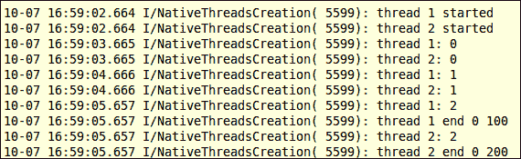

## 工作原理...

本教程展示了如何在安卓 NDK 中创建和终止线程。

### 使用 pthreads 构建

传统上，pthread 被实现为一个外部库，必须通过提供链接器标志 `-lpthread` 来链接。安卓的 Bionic C 库有自己的 pthread 实现。因此，在我们的项目中，`Android.mk` 文件不使用 `-lpthread`。

### 线程创建

正如我们的代码所示，可以使用 `pthread_create` 函数创建一个线程，该函数具有以下原型：

```kt
int pthread_create(pthread_t *thread, const pthread_attr_t *attr, void *(*start_routine)(void*), void *arg);
```

这个函数使用 `attr` 输入参数指定的属性创建并启动一个新线程。如果 `attr` 设置为 `NULL`，则使用默认属性。`start_routine` 参数指向新创建的线程要执行的函数，`arg` 作为函数的输入参数。当函数返回时，`thread` 输入参数将指向存储线程 ID 的位置，返回值为零表示成功，或其他值表示错误。

在我们的示例代码中，我们创建了两个线程来执行 `run_by_thread` 函数。我们传递一个整数指针作为输入参数给 `run_by_thread` 函数。

### 线程终止

线程在从 `start_routine` 函数返回后终止，或者我们显式调用 `pthread_exit`。`pthread_exit` 函数具有以下原型：

```kt
void pthread_exit(void *value_ptr);
```

这个函数终止调用线程，并将 `value_ptr` 指向的值返回给与调用线程成功 `join` 的任何线程。这也在我们的示例代码中进行了演示。我们对创建的两个线程调用了 `pthread_join`。`pthread_join` 函数具有以下原型：

```kt
int pthread_join(pthread_t thread, void **value_ptr);
```

该函数挂起调用线程的执行，直到由第一个输入参数指定的线程终止。当函数成功返回时，第二个参数可用于获取已终止线程的退出状态，正如我们的示例代码所示。

此外，我们之前看到的`logcat`截图显示，从线程中返回相当于调用`pthread_exit`。因此，无论调用哪种方法，我们都可以获取退出状态。

### 注意

Android Bionic C 库 pthread 不支持`pthread_cancel`。因此，如果我们正在移植使用`pthread_cancel`的代码，我们需要重构代码以摆脱它。

# 在 Android NDK 中用互斥锁同步本地线程

本食谱讨论如何在 Android NDK 中使用 pthread 互斥锁。

## 如何操作...

以下步骤帮助创建一个演示 pthread 互斥锁使用的 Android 项目：

1.  创建一个名为`NativeThreadsMutex`的 Android 应用程序。将包名设置为`cookbook.chapter6.nativethreadsmutex`。更多详细说明请参考第二章中的*加载本地库和注册本地方法*食谱，*Java Native Interface*。

1.  右键点击项目**NativeThreadsMutex**，选择**Android Tools** | **添加本地支持**。

1.  在`cookbook.chapter6.nativethreadsmutex`包下添加一个名为`MainActivity.java`的 Java 文件。这个 Java 文件只是加载本地`NativeThreadsMutex`库并调用本地`jni_start_threads`方法。

1.  在`jni`文件夹中添加两个名为`mylog.h`和`NativeThreadsMutex.cpp`的文件。`NativeThreadsMutex.cpp`包含启动两个线程的代码。这两个线程将更新一个共享计数器。部分代码如下所示：

    `run_by_thread1`函数由第一个本地线程执行：

    ```kt
    int cnt = 0;
    int THR = 10;
    void *run_by_thread1(void *arg) {
      int* threadNum = (int*)arg;
      while (cnt < THR) {
        pthread_mutex_lock(&mux1);
        while ( pthread_mutex_trylock(&mux2) ) {
          pthread_mutex_unlock(&mux1);  //avoid deadlock
          usleep(50000);  //if failed to get mux2, release mux1 first
          pthread_mutex_lock(&mux1);
        }
        ++cnt;
        LOGI(1, "thread %d: cnt = %d", *threadNum, cnt);
        pthread_mutex_unlock(&mux1);
        pthread_mutex_unlock(&mux2);
        sleep(1);
      }
    }
    ```

    `run_by_thread2`函数由第二个本地线程执行：

    ```kt
    void *run_by_thread2(void *arg) {
      int* threadNum = (int*)arg;
      while (cnt < THR) {
        pthread_mutex_lock(&mux2);
        while ( pthread_mutex_trylock(&mux1) ) {
          pthread_mutex_unlock(&mux2);  //avoid deadlock
          usleep(50000);   //if failed to get mux2, release mux1 first
          pthread_mutex_lock(&mux2);
        }
        ++cnt;
        LOGI(1, "thread %d: cnt = %d", *threadNum, cnt);
        pthread_mutex_unlock(&mux2);
        pthread_mutex_unlock(&mux1);
        sleep(1);
      }
    }
    ```

1.  在`jni`文件夹中添加一个`Android.mk`文件，内容如下：

    ```kt
    LOCAL_PATH := $(call my-dir)
    include $(CLEAR_VARS)
    LOCAL_MODULE := NativeThreadsMutex
    LOCAL_SRC_FILES := NativeThreadsMutex.cpp
    LOCAL_LDLIBS := -llog
    include $(BUILD_SHARED_LIBRARY)
    ```

1.  构建并运行 Android 项目，并使用以下命令监控`logcat`输出。

    ```kt
    $ adb logcat -v time NativeThreadsMutex:I *:S
    ```

    `logcat`输出如下所示：

    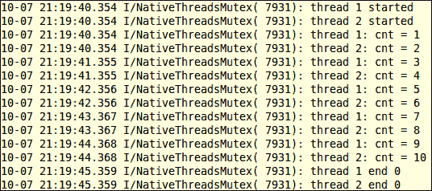

1.  我们还在`NativeThreadsMutex.cpp`中实现了一个本地方法`jni_start_threads_dead`，这可能会导致死锁（可能需要运行几次代码才能产生死锁情况）。如果在`MainActivity.java`中调用`jni_start_threads_dead`，两个线程将会启动然后如以下`logcat`输出所示阻塞：

    如此截图所示，两个线程在**启动后**无法继续执行。

## 工作原理...

示例项目演示了如何使用互斥锁来同步本地线程。以下是详细信息：

### 初始化和销毁互斥锁

可以使用`pthread_mutex_init`函数初始化互斥锁，该函数具有以下原型：

```kt
int pthread_mutex_init(pthread_mutex_t *mutex, const pthread_mutexattr_t *attr);
```

输入参数 mutex 是要初始化的互斥锁的指针，`attr`表示互斥锁的属性。如果`attr`设置为`NULL`，将使用默认属性。如果互斥锁初始化成功，该函数将返回零，否则返回非零值。

### 注意

在`pthread.h`中定义了一个宏`PTHREAD_MUTEX_INITIALIZER`，用于使用默认属性初始化互斥量。

当我们完成互斥量的使用后，可以通过`pthread_mutex_destroy`函数销毁它，该函数具有以下原型：

```kt
int pthread_mutex_destroy(pthread_mutex_t *mutex);
```

输入参数是指向要销毁的互斥量的指针。

在我们的示例项目中，我们创建了两个互斥量`mux1`和`mux2`，以同步两个线程对共享计数器`cnt`的访问。两个线程退出后，我们销毁了这些互斥量。

### 使用互斥量

以下是可用于锁定和解锁互斥量的四个函数：

```kt
int pthread_mutex_lock(pthread_mutex_t *mutex);
int pthread_mutex_unlock(pthread_mutex_t *mutex);
int pthread_mutex_trylock(pthread_mutex_t *mutex);
int pthread_mutex_lock_timeout_np(pthread_mutex_t *mutex, unsigned msecs);
```

在所有四个函数中，输入参数指的是正在使用的`mutex`对象。零返回值表示互斥量锁定或解锁成功。最后一个函数允许我们指定以毫秒为单位的等待超时。如果超时后无法获取互斥量，它将返回`EBUSY`表示失败。

### 注意

`pthread_mutex_timedlock`函数在一些 pthread 实现中被定义，允许我们指定一个超时值。然而，这个函数在 Android Bionic C 库中是不可用的。

我们在之前的示例中演示了这些函数的使用。在`run_by_thread1`函数中，我们首先通过`pthread_mutex_lock`锁定`mux1`，然后通过`pthread_mutex_trylock`尝试锁定`mux2`。如果无法锁定`mux2`，我们就解锁`mux1`，休眠 50 毫秒，然后再次尝试。如果可以锁定`mux2`，我们就更新共享计数器`cnt`，记录其当前值，然后释放两个互斥量。另一个函数`run_by_thread2`与`run_by_thread1`类似，不同之处在于它首先锁定`mux2`，然后锁定`mux1`。这两个函数由两个线程执行。这可以通过以下图示说明：

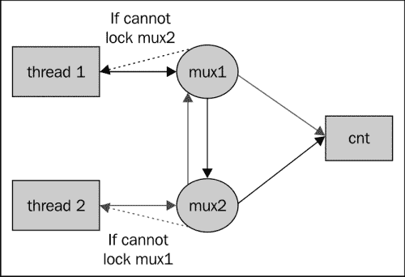

如前面的图所示，线程 1 需要获取`mux1`，然后是`mux2`以更新`cnt`，而线程 2 需要获取`mux2`，然后是`mux1`以更新`cnt`。如果线程 1 锁定了`mux1`而线程 2 锁定了`mux2`，那么这两个线程都无法继续。这对应于`pthread_mutex_trylock`返回非零值的情况。如果发生这种情况，一个线程将放弃其互斥量，以便另一个线程可以继续更新共享计数器`cnt`并释放两个互斥量。请注意，我们可以在代码中将`pthread_mutex_trylock`替换为`pthread_mutex_lock_timeout_np`。鼓励读者亲自尝试。

我们还实现了一个本地方法`jni_start_threads_dead`，它很可能会造成死锁。线程设置与上一个案例相似，但我们使用`pthread_mutex_lock`而不是`pthread_mutex_trylock`，并且线程不会放弃它们已经锁定的互斥量。这可以如下所示图示：

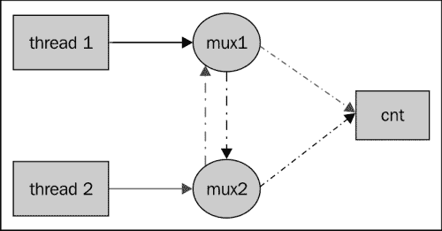

线程 1 尝试锁定`mux1`然后是`mux2`，而线程 2 尝试锁定`mux2`然后是`mux1`。如果线程 1 锁定了`mux1`而线程 2 锁定了`mux2`，那么这两个线程都无法继续。因为它们不会放弃已经获得的互斥锁，这两个线程将被永久阻塞。这被称为死锁。

## 还有更多...

回想一下，函数`pthread_mutex_init`的第二个输入参数是指向`pthread_mutexattr_t`的指针。`pthread.h`中定义了一些函数来初始化、操作和销毁互斥属性，包括：

+   `pthread_mutexattr_init`

+   `pthread_mutexattr_destroy`

+   `pthread_mutexattr_gettype`

+   `pthread_mutexattr_settype`

+   `pthread_mutexattr_setpshared`

+   `pthread_mutexattr_getpshared`

感兴趣的读者可以查看`pthread.h`头文件以获取更多信息。

# 在 Android NDK 中使用条件变量同步本地线程

前一个食谱讨论了如何使用互斥锁来同步线程。这个食谱描述了如何使用条件变量。

## 如何操作...

以下步骤将帮助我们创建一个展示 pthread 条件变量使用的 Android 项目：

1.  创建一个名为`NativeThreadsCondVar`的 Android 应用程序。将包名设置为`cookbook.chapter6.nativethreadscondvar`。有关更详细的说明，请参考第二章中的*加载本地库和注册本地方法*食谱，*Java Native Interface*。

1.  右键点击项目**NativeThreadsCondVar**，选择**Android Tools** | **Add Native Support**。

1.  在`cookbook.chapter6.nativethreadscondvar`包下添加一个名为`MainActivity.java`的 Java 文件。这个 Java 文件简单加载了本地库`NativeThreadsCondVar`并调用了本地方法`jni_start_threads`。

1.  在`jni`文件夹下添加两个名为`mylog.h`和`NativeThreadsCondVar.cpp`的文件。`NativeThreadsCondVar.cpp`包含了启动两个线程的代码。这两个线程将更新一个共享计数器。部分代码如下所示：

    `jni_start_threads`函数初始化互斥锁、条件变量并创建两个线程：

    ```kt
    pthread_mutex_t mux;
    pthread_cond_t cond;
    void jni_start_threads() {
      pthread_t th1, th2;
      int threadNum1 = 1, threadNum2 = 2;
      int ret;
      pthread_mutex_init(&mux, NULL);
      pthread_cond_init(&cond, NULL);
      ret = pthread_create(&th1, NULL, run_by_thread1, 
    void*)&threadNum1);
      LOGI(1, "thread 1 started");
      ret = pthread_create(&th2, NULL, run_by_thread2, 
    void*)&threadNum2);
      LOGI(1, "thread 2 started");
      ret = pthread_join(th1, NULL);
      LOGI(1, "thread 1 end %d", ret);
      ret = pthread_join(th2, NULL);
      LOGI(1, "thread 2 end %d", ret);
      pthread_mutex_destroy(&mux);
      pthread_cond_destroy(&cond);
    }
    ```

    `run_by_thread1`函数由第一个本地线程执行：

    ```kt
    int cnt = 0;
    int THR = 10, THR2 = 5;
    void *run_by_thread1(void *arg) {
      int* threadNum = (int*)arg;
      pthread_mutex_lock(&mux);
      while (cnt != THR2) {
          LOGI(1, "thread %d: about to wait", *threadNum);
          pthread_cond_wait(&cond, &mux);
      }
      ++cnt;
      LOGI(1, "thread %d: cnt = %d", *threadNum, cnt);
      pthread_mutex_unlock(&mux);
    }
    ```

    `run_by_thread2`函数由第二个本地线程执行：

    ```kt
    void *run_by_thread2(void *arg) {
      int* threadNum = (int*)arg;
      while (cnt < THR) {
        pthread_mutex_lock(&mux);
        if (cnt == THR2) {
          pthread_cond_signal(&cond);
        } else {
          ++cnt;
          LOGI(1, "thread %d: cnt = %d", *threadNum, cnt);
        }
        pthread_mutex_unlock(&mux);
        sleep(1);
      }
    }
    ```

1.  在`jni`文件夹下添加一个名为`Android.mk`的文件，内容如下：

    ```kt
    LOCAL_PATH := $(call my-dir)
    include $(CLEAR_VARS)
    LOCAL_MODULE    := NativeThreadsCondVar
    LOCAL_SRC_FILES := NativeThreadsCondVar.cpp
    LOCAL_LDLIBS    := -llog
    include $(BUILD_SHARED_LIBRARY)
    ```

1.  构建并运行 Android 项目，使用以下命令监控`logcat`输出：

    ```kt
    $ adb logcat -v time NativeThreadsCondVar:I *:S
    ```

    `logcat`输出如下所示：

    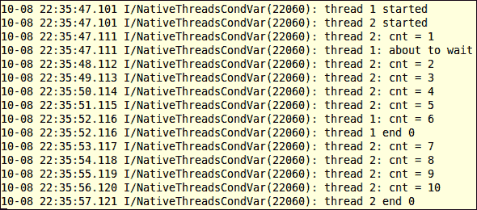

## 工作原理...

当互斥锁控制线程间共享数据的访问时，条件变量允许线程根据数据的实际值进行同步。典型用例是一个线程等待条件被满足。没有条件变量，线程需要不断地检查条件（通常称为轮询）。条件变量允许我们在不消耗资源的轮询情况下处理这种情况。

### 初始化和销毁条件变量

`pthread_cond_init`函数用于初始化条件变量。它具有以下原型：

```kt
int pthread_cond_init(pthread_cond_t *cond, const pthread_condattr_t *attr);
```

该函数使用`attr`参数引用的属性初始化`cond`输入参数指向的条件变量。如果`attr`设置为`NULL`，则使用默认属性。

类似于互斥量，`pthread.h`中定义了一个宏`PTHREAD_COND_INITIALIZER`，用于使用默认属性初始化条件变量。

完成条件变量的使用后，我们可以通过调用`pthread_cond_destroy`来销毁它，该函数具有以下原型：

```kt
int pthread_cond_destroy(pthread_cond_t *cond);
```

在我们的示例代码中，我们调用了这两个函数来初始化和销毁名为`cond`的条件变量。

### 使用条件变量：

以下三个函数通常用于操作条件变量：

```kt
int pthread_cond_wait(pthread_cond_t *cond, pthread_mutex_t *mutex);
int pthread_cond_broadcast(pthread_cond_t *cond);
int pthread_cond_signal(pthread_cond_t *cond);
```

所有这三个函数接受正在使用的条件变量的指针。第一个函数还接受关联互斥量的指针作为第二个参数。请注意，条件变量必须与关联的互斥量一起使用。

第一个函数应在关联互斥量锁定后被调用；否则该函数行为是未定义的。它会使得调用线程在条件变量上阻塞。此外，关联的互斥量会自动且原子性地解锁，以便另一个线程可以使用它。

第二个和第三个函数用于解除之前在条件变量上阻塞的线程。`pthread_cond_broadcast`将解除在`cond`指向的条件变量上阻塞的所有线程，而`pthread_cond_signal`将至少解除在`cond`上阻塞的一个线程。如果没有任何线程在由`cond`指定的条件变量上阻塞，这两个函数不起作用。如果有多个线程需要解除阻塞，其顺序取决于调度策略，这将在本章后面的*在 Android NDK 中调度本地线程*的菜谱中讨论。 

这些函数的使用在我们的示例代码中有演示。在`run_by_thread1`函数中，线程一将锁定关联的互斥量，然后在条件变量`cond`上等待。这将导致线程一释放互斥量`mux`。在`run_by_thread2`函数中，线程二将获取`mux`并增加共享计数器`cnt`。

当`cnt`增加到五时，线程二调用`pthread_cond_signal`来解除线程一的阻塞并释放`mux`。线程一会自动且原子性地锁定`mux`（注意，在唤醒时不需要`pthread_mutex_lock`调用），然后将`cnt`从五增加到六，并最终退出。线程二将继续增加`cnt`的值到 10 并退出。这就解释了前面的截图。

### 注意

我们将 `pthread_cond_wait(&cond, &mux)` 函数放入一个 while 循环中以处理虚假唤醒。虚假唤醒是指即使没有线程信号条件，线程也会被唤醒的情况。建议我们总是在 `pthread_cond_wait` 返回时检查条件。你可以参考 [`pubs.opengroup.org/onlinepubs/7908799/xsh/pthread_cond_wait.html`](http://pubs.opengroup.org/onlinepubs/7908799/xsh/pthread_cond_wait.html) 了解更多信息。

## 还有更多...

示例项目演示了条件变量如何用于本地线程同步。我们将在下一节中详细介绍。

### 条件变量属性函数

在我们的示例代码中，通过将 `pthread_cond_init` 的第二个参数指定为 `NULL` 来使用默认属性创建条件变量。`pthread.h` 定义了一些函数来初始化和操作条件变量属性。这些函数包括 `pthread_condattr_init`、`pthread_condattr_getpshared`、`pthread_condattr_setpshared` 和 `pthread_condattr_destroy`。我们不讨论这些函数，因为它们不常使用。感兴趣的读者可以参考位于 `platforms/android-<API level>/arch-arm/usr/include/` 的 `pthread.h` 头文件以获取更多信息。

### 定时条件变量函数

`pthread.h` 还定义了一些允许我们为条件变量的等待指定超时值的函数。它们如下所示：

```kt
int pthread_cond_timedwait(pthread_cond_t *cond, pthread_mutex_t * mutex, const struct timespec *abstime);
int pthread_cond_timedwait_monotonic_np(pthread_cond_t *cond, pthread_mutex_t        *mutex, const struct timespec  *abstime);
int pthread_cond_timedwait_relative_np(pthread_cond_t *cond, pthread_mutex_t        *mutex, const struct timespec  *reltime);
int pthread_cond_timeout_np(pthread_cond_t *cond, pthread_mutex_t * mutex, unsigned msecs);
```

前两个函数 `pthread_cond_timedwait` 和 `pthread_cond_timedwait_monotonic_np` 允许我们指定一个绝对时间值。当系统时间等于或超过指定时间时，将返回超时错误。这两个函数之间的区别在于，第一个函数使用的是挂钟时间，而第二个函数使用的是 `CLOCK_MONOTONIC` 时钟。系统挂钟时间可以向前或向后跳跃（例如，配置为使用网络时间协议的机器的挂钟时间可能在时钟同步时发生变化），而 `CLOCK_MONOTONIC` 是自过去某个固定点以来经过的绝对时间，它不能突然改变。

### 注意

Android `pthread.h` 还定义了一个函数 `pthread_cond_timedwait_monotonic`，该函数已被弃用。它在功能上等同于 `pthread_cond_timedwait_monotonic_np`。我们应该始终使用 `pthread_cond_timedwait_monotonic_np`。

最后两个函数 `pthread_cond_timedwait_relative_np` 和 `pthread_cond_timeout_np` 允许我们指定一个相对于当前时间的相对超时值。不同之处在于，一个函数将超时值指定为 `timespec` 结构，而另一个则指定为毫秒数。

### 注意

本菜谱中介绍的一些方法以`np`结尾，表示“不可移植”。这意味着这些函数可能不会在其他 pthread 库中实现。如果我们设计的程序也想在其他非 Android 平台上工作，我们应该避免使用这些函数。

# 在 Android NDK 中使用读写锁同步本地线程

前两个菜谱涵盖了使用互斥量和条件变量进行线程同步。本菜谱讨论了 Android NDK 中的读写锁。

## 准备工作...

建议读者在阅读本节之前先阅读前两个菜谱，*在 Android NDK 中使用互斥量同步本地线程*和*在 Android NDK 中使用条件变量同步本地线程*。

## 如何操作...

以下步骤将帮助你创建一个展示 pthread 读写锁用法的 Android 项目：

1.  创建一个名为`NativeThreadsRWLock`的 Android 应用。设置包名为`cookbook.chapter6.nativethreadsrwlock`。关于更详细的说明，请参考第二章中的*加载本地库和注册本地方法*部分，*Java Native Interface*。

1.  右键点击项目**NativeThreadsRWLock**，选择**Android Tools** | **Add Native Support**。

1.  在`cookbook.chapter6.nativethreadsrwlock`包下添加一个名为`MainActivity.java`的 Java 文件。这个 Java 文件简单加载了本地库`NativeThreadsRWLock`并调用了本地方法`jni_start_threads`。

1.  在`jni`文件夹下添加两个名为`mylog.h`和`NativeThreadsRWLock.cpp`的文件。`NativeThreadsRWLock.cpp`中的一部分代码如下所示：

    `jni_start_threads`启动`pNumOfReader`个读线程和`pNumOfWriter`个写线程：

    ```kt
    void jni_start_threads(JNIEnv *pEnv, jobject pObj, int pNumOfReader, int pNumOfWriter) {
      pthread_t *ths;
      int i, ret;
      int *thNum;
      ths = (pthread_t*)malloc(sizeof(pthread_t)*(pNumOfReader+pNumOfWriter));
      thNum = (int*)malloc(sizeof(int)*(pNumOfReader+pNumOfWriter));
      pthread_rwlock_init(&rwlock, NULL);
      for (i = 0; i < pNumOfReader + pNumOfWriter; ++i) {
        thNum[i] = i;
        if (i < pNumOfReader) {
          ret = pthread_create(&ths[i], NULL, run_by_read_thread, (void*)&(thNum[i]));
        } else {
          ret = pthread_create(&ths[i], NULL, run_by_write_thread, (void*)&(thNum[i]));
        }
      }
      for (i = 0; i < pNumOfReader+pNumOfWriter; ++i) {
        ret = pthread_join(ths[i], NULL);
      }
      pthread_rwlock_destroy(&rwlock);
      free(thNum);
      free(ths);
    }
    ```

    `run_by_read_thread`函数由读线程执行：

    ```kt
    void *run_by_read_thread(void *arg) {
      int* threadNum = (int*)arg;
      int ifRun = 1;
      int accessTimes = 0;
      int ifPrint = 1;
      while (ifRun) {
        if (!pthread_rwlock_rdlock(&rwlock)) {
          if (100000*numOfWriter == sharedCnt) {
            ifRun = 0;
          }
          if (0 <= sharedCnt && ifPrint) {
            LOGI(1, "reader thread %d sharedCnt value before processing %d\n", *threadNum, sharedCnt);
            int j, k;//some dummy processing
            for (j = 0; j < 100000; ++j) {
              k = j*2;
              k = sqrt(k);
            }
            ifPrint = 0;
            LOGI(1, "reader thread %d sharedCnt value after processing %d %d\n", *threadNum, sharedCnt, k);
          }
          if ((++accessTimes) == INT_MAX/5) {
            accessTimes = 0;
            LOGI(1, "reader thread %d still running: %d\n", *threadNum, sharedCnt);
          }
          pthread_rwlock_unlock(&rwlock);
        }
      }
      LOGI(1, "reader thread %d return %d\n", *threadNum, sharedCnt);
      return NULL;
    }
    ```

    `run_by_write_thread`函数由写线程执行：

    ```kt
    void *run_by_write_thread(void *arg) {
      int cnt = 100000, i, j, k;
      int* threadNum = (int*)arg;
      for (i = 0; i < cnt; ++i) {
        if (!pthread_rwlock_wrlock(&rwlock)) {
          int lastShCnt = sharedCnt;
          for (j = 0; j < 10; ++j) {  //some dummy processing
            k = j*2;
            k = sqrt(k);
          }
          sharedCnt = lastShCnt + 1;
          pthread_rwlock_unlock(&rwlock);
        }
      }
      LOGI(1, "writer thread %d return %d %d\n", *threadNum, sharedCnt, k);
      return NULL;
    }
    ```

1.  在`jni`文件夹下添加一个`Android.mk`文件，内容如下：

    ```kt
    LOCAL_PATH := $(call my-dir)
    include $(CLEAR_VARS)
    LOCAL_MODULE    := NativeThreadsRWLock
    LOCAL_SRC_FILES := NativeThreadsRWLock.cpp
    LOCAL_LDLIBS    := -llog
    include $(BUILD_SHARED_LIBRARY)
    ```

1.  构建并运行 Android 项目，并使用以下命令监控`logcat`输出：

    ```kt
    $ adb logcat -v time NativeThreadsRWLock:I *:S
    ```

    `logcat`输出如下所示：

    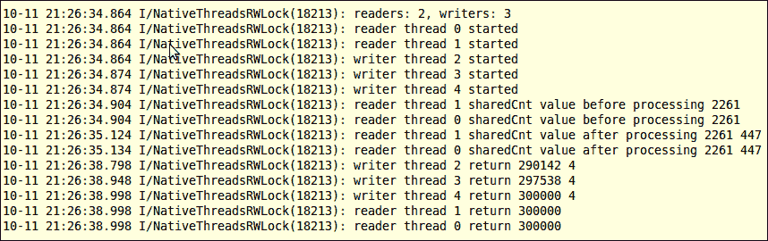

## 工作原理...

读写锁在内部实现时使用了互斥量和条件变量。它具有以下规则：

+   如果一个线程尝试获取一个资源的读锁，只要没有其他线程持有该资源的写锁，它就可以成功。

+   如果一个线程尝试获取一个资源的写锁，只有当没有其他线程持有该资源的写锁或读锁时，它才能成功。

+   读写锁保证只有一个线程可以修改（需要获取写锁）资源，同时允许多个线程读取资源（需要获取读锁）。它还确保在资源被更改时不会发生读取操作。以下部分我们将描述 Android `pthread.h`提供的读写锁功能。

### 初始化和销毁读写锁

下面定义了两个函数来初始化和销毁读写锁：

```kt
int pthread_rwlock_init(pthread_rwlock_t *rwlock, const pthread_rwlockattr_t *attr);
int pthread_rwlock_destroy(pthread_rwlock_t *rwlock);
```

`pthread_rwlock_init` 函数用于初始化由 `rwlock` 参数指向的读写锁，并使用 `attr` 参数引用的属性。如果 `attr` 设置为 `NULL`，将使用默认属性。`pthread_rwlock_destroy` 函数接受一个指向读写锁的指针，并销毁它。

### 注意

还定义了一个宏 `PTHREAD_RWLOCK_INITIALIZER` 来初始化读写锁。在这种情况下使用默认属性。

### 使用读写锁

下面定义了两个函数来分别获取读锁和写锁：

```kt
int pthread_rwlock_rdlock(pthread_rwlock_t *rwlock);
int pthread_rwlock_wrlock(pthread_rwlock_t *rwlock);
```

这两个函数都接受一个读写锁的指针，并返回零表示成功。如果无法获取锁，调用线程将被阻塞，直到锁可用或发生错误。

以下函数定义用于解锁读锁或写锁：

```kt
int pthread_rwlock_unlock(pthread_rwlock_t *rwlock);
```

在我们的示例代码中，我们演示了这些函数的使用。在 `run_by_read_thread` 函数中，读线程需要获取读锁才能访问共享资源 `sharedCnt` 的值。在 `run_by_write_thread` 函数中，写线程在更新共享资源 `sharedCnt` 之前需要获取写锁。

如果我们移除锁定和解锁读写的代码，构建应用程序，并重新运行它，输出将如下截图所示：

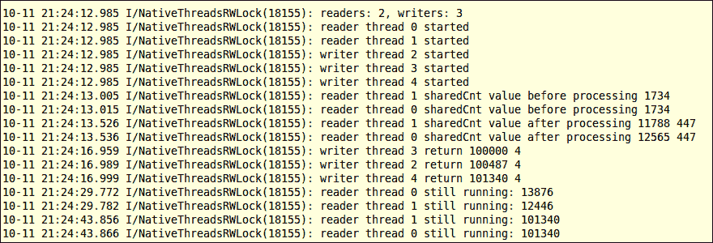

如输出所示，当启用读写锁时，共享资源 `sharedCnt` 被更新为一个小于最终值的值。原因在下图中说明：

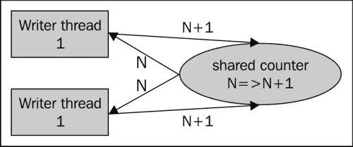

在这个图表中，两个写者获取了共享计数器的相同值（N），并且都将其从 N 更新到 N+1。当它们将值写回共享计数器时，尽管两个写者两次更新，共享计数器仍从 N 更新到 N+1。这说明了为什么我们需要写锁。同时注意，由于写者更新了值，读线程对 `sharedCnt` 的两次读取（处理前一次和处理后一次）给出了两个不同的值。有时这可能不是我们想要的，这就是为什么有时需要读锁的原因。

## 还有更多...

在 `pthread.h` 中还定义了一些其他的读写锁函数。

### 定时的读/写锁和尝试锁

安卓的 `pthread.h` 定义了以下两个函数，允许调用线程在尝试获取读锁或写锁时指定超时值：

```kt
int pthread_rwlock_timedrdlock(pthread_rwlock_t *rwlock, const struct timespec *abs_timeout);
int pthread_rwlock_timedwrlock(pthread_rwlock_t *rwlock, const struct timespec *abs_timeout);
```

此外，以下两个函数允许调用线程在不阻塞自身的情况下获取读锁或写锁。如果锁不可用，这些函数将返回非零值而不是阻塞：

```kt
int pthread_rwlock_tryrdlock(pthread_rwlock_t *rwlock);
int pthread_rwlock_trywrlock(pthread_rwlock_t *rwlock);
```

### 读写锁属性函数

Android 的`pthread.h`定义了一组函数来初始化和操作读写锁属性，可以作为第二个参数传递给`pthread_rwlock_init`。这些函数包括`pthread_rwlockattr_init`、`pthread_rwlockattr_destroy`、`pthread_rwlockattr_setpshared`和`pthread_rwlockattr_getpshared`。它们在 Android NDK 开发中不常使用，因此这里不进行讨论。

# 在 Android NDK 中用信号量同步本地线程。

我们在前三个食谱中已经介绍了互斥锁、条件变量和读写锁。这是在 Android NDK 上关于线程同步的最后一个食谱，我们将讨论信号量。

## 准备工作...

读者在阅读本食谱之前，应阅读前三个食谱，*在 Android NDK 中使用互斥锁同步本地线程*、*在 Android NDK 中使用条件变量同步本地线程*和*在 Android NDK 中使用读写锁同步本地线程*。

## 如何操作...

以下步骤将帮助您创建一个展示 pthread 读写锁使用的 Android 项目：

1.  创建一个名为`NativeThreadsSemaphore`的 Android 应用程序。将包名设置为`cookbook.chapter6.nativethreadssemaphore`。更多详细说明请参考第二章中的*加载本地库和注册本地方法*食谱，*Java Native Interface*。

1.  右键点击项目**NativeThreadsSemaphore**，选择**Android Tools** | **添加本地支持**。

1.  在`cookbook.chapter6.nativethreadssemaphore`包下添加一个名为`MainActivity.java`的 Java 文件。这个 Java 文件仅加载本地库`NativeThreadsSemaphore`并调用本地方法`jni_start_threads`。

1.  在`jni`文件夹下添加两个名为`mylog.h`和`NativeThreadsSemaphore.cpp`的文件。`NativeThreadsSemaphore.cpp`中的一部分代码如下所示：

    `jni_start_threads`创建`pNumOfConsumer`个消费者线程，`pNumOfProducer`个生产者线程，以及`numOfSlots`个插槽：

    ```kt
    void jni_start_threads(JNIEnv *pEnv, jobject pObj, int pNumOfConsumer, int pNumOfProducer, int numOfSlots) {
      pthread_t *ths;
      int i, ret;
      int *thNum;
      pthread_mutex_init(&mux, NULL);
      sem_init(&emptySem, 0, numOfSlots);
      sem_init(&fullSem, 0, 0);
      ths = (pthread_t*)malloc(sizeof(pthread_t)*(pNumOfConsumer+pNumOfProducer));
      thNum = (int*)malloc(sizeof(int)*(pNumOfConsumer+pNumOfProducer));
      for (i = 0; i < pNumOfConsumer + pNumOfProducer; ++i) {
        thNum[i] = i;
        if (i < pNumOfConsumer) {
          ret = pthread_create(&ths[i], NULL, 
    un_by_consumer_thread, (void*)&(thNum[i]));
        } else {
          ret = pthread_create(&ths[i], NULL, run_by_producer_thread, (void*)&(thNum[i]));
        }
      }
      for (i = 0; i < pNumOfConsumer+pNumOfProducer; ++i) {
        ret = pthread_join(ths[i], NULL);
      }
      sem_destroy(&emptySem);
      sem_destroy(&fullSem);
      pthread_mutex_destroy(&mux);
      free(thNum);
      free(ths);
    }
    ```

    `run_by_consumer_thread`是由消费者线程执行的功能：

    ```kt
    void *run_by_consumer_thread(void *arg) {
      int* threadNum = (int*)arg;
      int i;
      for (i = 0; i < 4; ++i) {
        sem_wait(&fullSem);
        pthread_mutex_lock(&mux);
        --numOfItems;
        pthread_mutex_unlock(&mux);
        sem_post(&emptySem);
      }
      return NULL;
    }
    ```

    `run_by_producer_thread`是由生产者线程执行的功能：

    ```kt
    void *run_by_producer_thread(void *arg) {
      int* threadNum = (int*)arg;
      int i;
      for (i = 0; i < 4; ++i) {
        sem_wait(&emptySem);
        pthread_mutex_lock(&mux);
        ++numOfItems;
        pthread_mutex_unlock(&mux);
        sem_post(&fullSem);
      }
      return NULL;
    }
    ```

1.  在`jni`文件夹下添加一个名为`Android.mk`的文件，内容如下：

    ```kt
    LOCAL_PATH := $(call my-dir)
    include $(CLEAR_VARS)
    LOCAL_MODULE    := NativeThreadsSemaphore
    LOCAL_SRC_FILES := NativeThreadsSemaphore.cpp
    LOCAL_LDLIBS    := -llog
    include $(BUILD_SHARED_LIBRARY)
    ```

1.  构建并运行 Android 项目，并使用以下命令监控`logcat`输出：

    ```kt
    $ adb logcat -v time NativeThreadsSemaphore:I *:S
    ```

    `logcat`输出如下截图所示：

    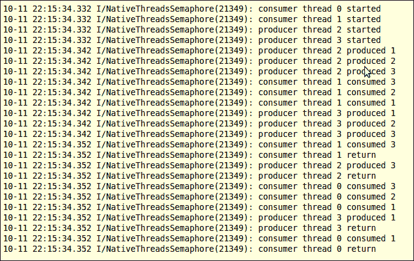

## 工作原理...

信号量本质上是一个整数计数器。信号量支持两种主要操作：

+   **等待（Wait）**：尝试减少信号量的值。如果在值为零的信号量上调用 wait，调用线程将被阻塞，直到在其他地方调用`post`以增加信号量的值。

+   **发布（Post）**：尝试增加信号量的值。

信号量相关的函数定义在`semaphore.h`中，而不是`pthread.h`。接下来，我们将描述一些关键函数。

### 注意

Android 不支持进程间互斥锁、条件变量和信号量。Android 使用 `Intent`、`Binder` 等进行进程间通信和同步。

### 初始化和销毁信号量

以下三个函数被定义用于初始化或销毁信号量：

```kt
extern int sem_init(sem_t *sem, int pshared, unsigned int value);
extern int    sem_init(sem_t *, int, unsigned int value);
extern int    sem_destroy(sem_t *);
```

前两个函数用于初始化信号量。它们都使用输入参数 `value` 指示的值初始化指向输入参数 `sem` 的信号量。第一个函数还接受一个参数 `pshared`，对于线程同步应将其设置为零。如果设置为非零，信号量可以在进程间共享，这在 Android 上不支持，因此不进行讨论。

### 使用信号量

以下函数被定义用于使用信号量。

```kt
extern int    sem_trywait(sem_t *);
extern int    sem_wait(sem_t *);
extern int    sem_post(sem_t *);
extern int    sem_getvalue(sem_t *, int *);
```

前两个函数用于等待信号量。如果信号量的值不为零，则值会减一。如果值为零，第一个函数将返回非零值以表示失败，而第二个函数将阻塞调用线程。第三个函数用于将信号量的值增加一，最后一个函数用于查询信号量的值。注意，值是通过第二个输入参数返回，而不是通过返回值。

### 注意

Android 中的 `semaphore.h` 也定义了一个名为 `sem_timedwait` 的函数，允许我们在等待信号量时指定一个超时值。

在我们的示例项目中，我们使用了两个信号量 `emptySem` 和 `fullSem`，以及一个互斥锁 `mux`。应用程序将创建一些生产者线程和消费者线程。`emptySem` 信号量用于指示可用于存储生产者线程生产的项目的空位数量，而 `fullSem` 指的是消费者线程可以消费的项目数量。互斥锁 `mux` 用于确保一次没有两个线程可以访问共享计数器 `numOfItems`。

生产者线程将需要在 `emptySem` 信号量上等待。当它被解锁时，生产者获得了一个空位。它会锁定 `mux` 然后更新共享计数 `numOfItems`，这意味着产生了新的项目。因此，它将调用 `fullSem` 的 `post` 函数以增加其值。

另一方面，消费者线程将在 `fullSem` 上等待。当它被解锁时，消费者已经消费了一个项目。它会锁定 `mux` 然后更新共享计数 `numOfItems`。由于消费了一个项目，一个新的空位变得可用，因此消费者线程将调用 `emptySem` 的 post 方法以增加其值。

### 注意

互斥锁 `mux` 也可以被二进制信号量替代。二进制信号量的可能值被限制为零和一。

# 在 Android NDK 中调度本地线程

本食谱讨论如何在 Android NDK 中调度本地线程。

## 准备就绪...

建议读者阅读第二章中的*在 JNI 中操作类*和*从原生代码调用静态和实例方法*的食谱，以及本章中的*在 Android NDK 中创建和终止原生线程*的食谱。

## 如何操作...

以下步骤将帮助我们创建一个演示在 Android NDK 中线程调度的 Android 项目：

1.  创建一个名为`NativeThreadsSchedule`的 Android 应用程序。将包名设置为`cookbook.chapter6.nativethreadsschedule`。更多详细说明请参考第二章中的*加载原生库和注册原生方法*部分，*Java Native Interface*。

1.  右键点击项目**NativeThreadsSchedule**，选择**Android Tools** | **Add Native Support**。

1.  在`cookbook.chapter6.nativethreadsschedule`包下添加一个名为`MainActivity.java`的 Java 文件。这个 Java 文件简单加载了原生库`NativeThreadsSchedule`并调用原生方法。

1.  在`jni`文件夹下添加五个名为`mylog.h`、`NativeThreadsSchedule.h`、`NativeThreadsSchedule.cpp`、`SetPriority.cpp`和`JNIProcessSetThreadPriority.cpp`的文件。最后三个文件的部分代码如下所示：

    +   `NativeThreadsSchedule.cpp`文件包含了在`pthread.h`中定义的线程调度函数的演示源代码

        `jni_thread_scope`展示了如何设置原生线程的争用范围：

        ```kt
        void jni_thread_scope() {
          pthread_attr_t attr;
          int ret;
          pid_t fpId = fork();
          if (0 == fpId) {
            pthread_attr_init(&attr);
            int ret = pthread_attr_setscope(&attr, PTHREAD_SCOPE_PROCESS);
            pthread_t thFive[5];
            int threadNums[5];
    int i;
            for (i = 0; i < 5; ++i) {
              threadNums[i] = i;      ret = pthread_create(&thFive[i], &attr, run_by_thread, (void*)&(threadNums[i]));
            }
            for (i = 0; i < 5; ++i) {
              ret = pthread_join(thFive[i], NULL);
            }
          } else {
            pthread_attr_init(&attr);
            int ret = pthread_attr_setscope(&attr, PTHREAD_SCOPE_SYSTEM);
            pthread_t th1;
            int threadNum1 = 0;
            ret = pthread_create(&th1, &attr, run_by_thread, (void*)&threadNum1);
            ret = pthread_join(th1, NULL);
          }
          //code executed by both processes
          pthread_attr_destroy(&attr);
        }
        ```

        `jni_thread_fifo`展示了如何设置原生线程的调度策略和优先级：

        ```kt
        void jni_thread_fifo() {
          pthread_attr_t attr;
          int ret;
          pid_t fpId = fork();
          struct sched_param prio;
          if (0 == fpId) {
            //the child process
            pthread_attr_init(&attr);
            pthread_t thFive[5];
            int threadNums[5];
            int i;
            for (i = 0; i < 5; ++i) {
              if (i == 4) {
                prio.sched_priority = 10;
              } else {
                prio.sched_priority = 1;
              }
              ret = pthread_attr_setschedpolicy(&attr, SCHED_FIFO);
              ret = pthread_attr_setschedparam(&attr, &prio);
              threadNums[i] = i;
              ret = pthread_create(&thFive[i], &attr, run_by_thread, (void*)&(threadNums[i]));
              pthread_attr_t lattr;
              struct sched_param lprio;
              int lpolicy;
              pthread_getattr_np(thFive[i], &lattr);
              pthread_attr_getschedpolicy(&lattr, &lpolicy);
              pthread_attr_getschedparam(&lattr, &lprio);
              pthread_attr_destroy(&lattr);
            }
            for (i = 0; i < 5; ++i) {
              ret = pthread_join(thFive[i], NULL);
            }
          } else {
            //the parent process
            pthread_attr_init(&attr);
            prio.sched_priority = 10;
            ret = pthread_attr_setschedpolicy(&attr, SCHED_FIFO);
            ret = pthread_attr_setschedparam(&attr, &prio);
            pthread_t th1;
            int threadNum1 = 0;
            ret = pthread_create(&th1, &attr, run_by_thread, (void*)&threadNum1);
            pthread_attr_t lattr;
            struct sched_param lprio;
            int lpolicy;
            pthread_getattr_np(th1, &lattr);
            pthread_attr_getschedpolicy(&lattr, &lpolicy);
            pthread_attr_getschedparam(&lattr, &lprio);
            pthread_attr_destroy(&lattr);
            ret = pthread_join(th1, NULL);
          }
          //code executed by both processes
          pthread_attr_destroy(&attr);
        }
        ```

        `run_by_thread`是每个原生线程实际要执行的功能：

        ```kt
        void *run_by_thread(void *arg) {
          int cnt = 18000000, i;
          int* threadNum = (int*)arg;
          for (i = 1; i < cnt; ++i) {
            if (0 == i%6000000) {
              LOGI(1, "process %d thread %d: %d", getpid(), *threadNum, i);
            }
          }
          LOGI(1, "process %d thread %d return", getpid(), *threadNum);
        }
        ```

    +   `SetPriority.cpp`文件包含了通过`setpriority`配置线程 nice 值的源代码

        `jni_thread_set_priority`方法创建了并加入了五个原生方法：

        ```kt
        void jni_thread_set_priority() {
          int ret;
          pthread_t thFive[5];
          int threadNums[5];
          int i;
          for (i = 0; i < 5; ++i) {
            threadNums[i] = i;
            ret = pthread_create(&thFive[i], NULL, run_by_thread2, (void*)&(threadNums[i]));
          }
          for (i = 0; i < 5; ++i) {
            ret = pthread_join(thFive[i], NULL);
          }
        }
        ```

        `run_by_thread2`函数由每个原生线程执行：

        ```kt
        void *run_by_thread2(void *arg) {
          int cnt = 18000000, i;
          int* threadNum = (int*)arg;
          switch (*threadNum) {
          case 0:
            setpriority(PRIO_PROCESS, 0, 21);
            break;
          case 1:
            setpriority(PRIO_PROCESS, 0, 10);
            break;
          case 2:
            setpriority(PRIO_PROCESS, 0, 0);
            break;
          case 3:
            setpriority(PRIO_PROCESS, 0, -10);
            break;
          case 4:
            setpriority(PRIO_PROCESS, 0, -21);
            break;
          default:
            break;
          }
          for (i = 1; i < cnt; ++i) {
            if (0 == i%6000000) {
              int prio = getpriority(PRIO_PROCESS, 0);
              LOGI(1, "thread %d (prio = %d): %d", *threadNum, prio, i);
            }
          }
          int prio = getpriority(PRIO_PROCESS, 0);
          LOGI(1, "thread %d (prio = %d): %d return", *threadNum, prio, i);
        }
        ```

    +   `JNIProcessSetThreadPriority.cpp`文件包含了通过`android.os.Process.setThreadPriority` Java 方法配置线程 nice 值的源代码

        `jni_process_setThreadPriority`方法创建了并加入了五个原生线程：

        ```kt
        void jni_process_setThreadPriority() {
          int ret;
          pthread_t thFive[5];
          int threadNums[5];
          int i;
          for (i = 0; i < 5; ++i) {
            threadNums[i] = i;
            ret = pthread_create(&thFive[i], NULL, run_by_thread3, (void*)&(threadNums[i]));
            if(ret) {
              LOGE(1, "cannot create the thread %d: %d", i, ret);
            }
            LOGI(1, "thread %d started", i);
          }
          for (i = 0; i < 5; ++i) {
            ret = pthread_join(thFive[i], NULL);
            LOGI(1, "join returned for thread %d", i);
          }
        }
        ```

        `run_by_thread3`函数由每个原生线程执行。在这里设置线程的 nice 值：

        ```kt
        void *run_by_thread3(void *arg) {
          int cnt = 18000000, i;
          int* threadNum = (int*)arg;
          JNIEnv *env;
          jmethodID setThreadPriorityMID;
          cachedJvm->AttachCurrentThread(&env, NULL);
          jclass procClass = env->FindClass("android/os/Process");
          setThreadPriorityMID = env->GetStaticMethodID(procClass, "setThreadPriority", "(I)V");
          switch (*threadNum) {
          case 0:
            env->CallStaticVoidMethod(procClass, setThreadPriorityMID, 21);
            break;
          case 1:
            env->CallStaticVoidMethod(procClass, setThreadPriorityMID, 10);
            break;
          case 2:
            env->CallStaticVoidMethod(procClass, setThreadPriorityMID, 0);
            break;
          case 3:
            env->CallStaticVoidMethod(procClass, setThreadPriorityMID, -10);
            break;
          case 4:
            env->CallStaticVoidMethod(procClass, setThreadPriorityMID, -21);
            break;
          default:
            break;

         }
          //we can also use getThreadPriority(int tid) through JNI interface
          for (i = 1; i < cnt; ++i) {
            if (0 == i%6000000) {
              int prio = getpriority(PRIO_PROCESS, 0);
              LOGI(1, "thread %d (prio = %d): %d", *threadNum, prio, i);
            }
          }
          int prio = getpriority(PRIO_PROCESS, 0);
          LOGI(1, "thread %d (prio = %d): %d return", *threadNum, prio, i);
          cachedJvm->DetachCurrentThread();
        }
        ```

1.  在`jni`文件夹下添加一个`Android.mk`文件，内容如下：

    ```kt
    LOCAL_PATH := $(call my-dir)
    include $(CLEAR_VARS)
    LOCAL_MODULE    := NativeThreadsSchedule
    LOCAL_SRC_FILES := NativeThreadsSchedule.cpp
    LOCAL_LDLIBS    := -llog
    include $(BUILD_SHARED_LIBRARY)
    ```

1.  在`MainActivity.java`中，除了`jni_thread_scope`，禁用所有原生方法。构建项目并运行它。启动一个终端并输入以下命令，以监控`logcat`的输出：

    ```kt
    $ adb logcat -v time NativeThreadsSchedule:I *:S
    ```

    下面的截图显示了输出结果：

    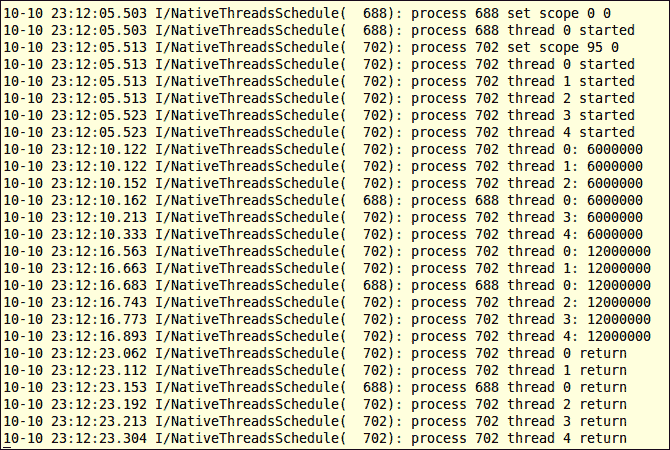

1.  在`MainActivity.java`中，除了`jni_thread_fifo`，禁用所有原生方法。构建项目并运行它。`logcat`的输出在下图的截图中显示：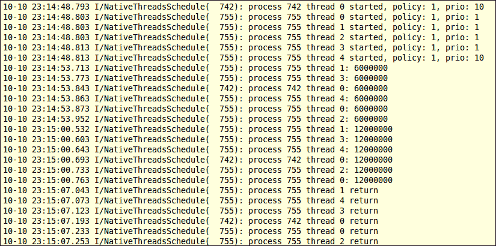

1.  在`MainActivity.java`中，除了`jni_thread_set_priority`之外，禁用所有本地方法。构建项目并运行它。`logcat`的输出显示在以下屏幕截图中：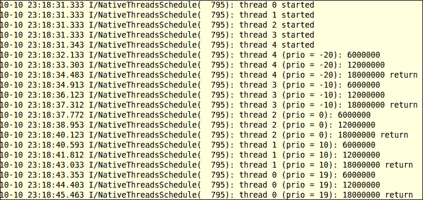

1.  在`MainActivity.java`中，除了`jni_process_setThreadPriority`之外，禁用所有本地方法。构建项目并运行它。`logcat`的输出显示在以下屏幕截图中：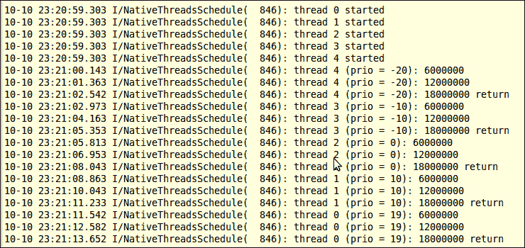

## 它的工作原理...

我们可以通过设置调度竞争范围、线程优先级和调度策略来调度本地线程：

+   **调度竞争范围**：它决定了当调度器调度线程时，线程必须与之竞争的线程

+   **线程优先级**：它决定了当 CPU 可用时，调度器更有可能选择哪个线程

+   **调度策略**：它决定了调度器如何调度具有相同优先级的线程

调整这些设置的一种方式是通过线程属性。以下函数在`pthread.h`中定义，用于初始化和销毁`pthread_attr_t`实例：

```kt
int pthread_attr_init(pthread_attr_t * attr); 
int pthread_attr_destroy(pthread_attr_t * attr);
```

在这两个函数中，输入参数是一个指向`pthread_attr_t`对象的指针。接下来我们将详细描述竞争范围、线程优先级和调度策略。

### 调度竞争范围

在典型的 pthread 实现中定义了两种范围，即`PTHREAD_SCOPE_SYSTEM`和`PTHREAD_SCOPE_PROCESS`。系统范围的线程与系统范围内的所有其他线程竞争 CPU。另一方面，进程范围的线程与同一进程中的其他线程进行调度。

安卓 Bionic `pthread.h`定义了以下两个函数用于设置和获取线程范围：

```kt
int pthread_attr_setscope(pthread_attr_t *attr, int  scope); 
int pthread_attr_getscope(pthread_attr_t const *attr);
```

这两个函数接受一个指向 pthread 属性对象的指针作为输入参数。`set`函数还包括第二个参数，让我们传递范围常量。这两个函数返回零表示成功，返回非零值表示失败。

结果显示，带有`PTHREAD_SCOPE_PROCESS`作为第二个输入参数的`pthread_attr_setscope`不被安卓支持。换句话说，安卓本地线程总是具有系统范围。如`NativeThreadsSchedule.cpp`中的`jni_thread_scope`所示，使用`PTHREAD_SCOPE_PROCESS`调用`pthread_attr_setscope`将返回非零值。

我们之前在本地方法`jni_thread_scope`中演示了这两个函数的用法。我们在方法中创建了两个进程。子进程运行五个线程，而父进程只运行一个线程。因为它们都是系统范围的线程，所以无论它们属于哪个进程，调度器都会为它们分配大致相同的 CPU 时间片，因此它们都会在大致相同的时间完成，如本食谱的*如何操作...*部分的第 6 步中的第一个`logcat`屏幕截图所示。

### 注意

我们在代码中调用了`fork`来创建一个进程。这仅用于演示目的。强烈建议不要在 Android 上使用`fork`创建本地进程，因为本地进程不会被 Android 框架管理，行为不当的本地进程可能会占用大量 CPU 周期并导致安全漏洞。

### 调度策略和线程优先级

每个线程都关联有一个调度策略和优先级。当 CPU 可用时，优先级更高的线程更有可能被调度器选中。如果多个线程具有相同的优先级，调度策略将决定如何调度它们。在 Android 的`pthread.h`中定义的策略包括`SCHED_OTHER`、`SCHED_FIFO`和`SCHED_RR`。

### 注意事项

优先级值的合法范围与调度策略相关联。

`SCHED_FIFO`：在**先进先出（FIFO）**策略中，线程将获得 CPU 直到它退出或阻塞。如果被阻塞，它将被放在其优先级队列的末尾，队列前面的线程将被交给 CPU。此策略允许的优先级范围是 1 到 99。

`SCHED_RR`：**轮询（RR）**策略与 FIFO 类似，不同之处在于每个线程只允许运行一定时间，称为量子。当一个线程完成其量子，它将被中断并放在其优先级队列的末尾。此策略允许的优先级范围也是 1 到 99。

`SCHED_OTHER`：这是默认的调度策略。它也允许线程只运行有限次数，但算法可能不同于`SCHED_RR`，并且更为复杂。此策略下的所有线程优先级为 0。

熟悉 pthread 编程的人可能熟悉 pthread 策略和优先级函数，包括：

+   `pthread_attr_setschedpolicy`

+   `pthread_attr_getschedpolicy`

+   `pthread_attr_setschedparam`

+   `pthread_attr_getschedparam`

这些函数在 Android 上不能按预期工作，尽管它们在 Android 的`pthread.h`头文件中有定义。因此，我们在这里不讨论细节。

在我们的示例项目中，我们实现了一个本地方法`jni_thread_fifo`，它试图将调度策略设置为`SCHED_FIFO`以及线程优先级。正如第二个`logcat`截图所示，这些设置并没有影响到线程。

总结来说，所有 Android 线程都是系统范围的线程，优先级为 0，调度策略为`SCHED_OTHER`。

### 使用 nice 值/级别进行调度

Nice 值/级别是另一个可能影响调度器的因素。它也常被称为优先级，但在这里我们将使用 nice 值来与我们之前讨论的线程优先级区分开来。

我们使用以下两种方法来调整 nice 值：

+   **调用 setpriority**：这在`SetPriority.cpp`中有所展示。我们创建了五个具有不同 nice 值的线程，*如何操作*部分的第 8 步的第三个`logcat`截图显示，具有较低 nice 值的线程先返回。

+   **调用 android.os.Process.setThreadPriority**：这在`JNIProcessSetThreadPriority.cpp`中有说明。如*如何操作*部分的第 9 步的第四个`logcat`截图所示，我们得到了与调用`setpriority`类似的结果。实际上，`setThreadPriority`内部调用了`setpriority`。

# 在 Android NDK 中管理原生线程数据

当我们想在函数间保存线程范围内的数据时，有几种选择，包括全局变量、参数传递和线程特定数据键。本食谱将讨论这三种选择，重点放在线程特定数据键上。

## 准备就绪...

建议读者在阅读本章中的*在 Android NDK 中创建和终止原生线程*食谱和*在 Android NDK 中使用互斥锁同步原生线程*食谱后再阅读本食谱。

## 如何操作...

以下步骤将帮助我们创建一个展示 Android NDK 数据管理的项目：

1.  创建一个名为`NativeThreadsData`的 Android 应用程序。将包名设置为`cookbook.chapter6.nativethreadsdata`。如果你需要更详细的说明，请参考第二章，*Java Native Interface*中的*加载原生库和注册原生方法*食谱。

1.  右键点击项目**NativeThreadsData**，选择**Android Tools** | **添加原生支持**。

1.  在`cookbook.chapter6.nativethreadsdata`包下添加一个名为`MainActivity.java`的 Java 文件。这个 Java 文件只是加载了原生库`NativeThreadsData`并调用了原生方法。

1.  在`jni`文件夹下添加`mylog.h`和`NativeThreadsData.cpp`文件。`mylog.h`包含 Android 原生`logcat`工具函数，而`NativeThreadsData.cpp`文件包含启动多个线程的原生代码。部分代码如下所示：

    `jni_start_threads`函数启动了*n*个线程，其中*n*由变量`pNumOfThreads`指定：

    ```kt
    void jni_start_threads(JNIEnv *pEnv, jobject pObj, int pNumOfThreads) {
      pthread_t *ths;
      int i, ret;
      int *thNum;
      ths = (pthread_t*)malloc(sizeof(pthread_t)*pNumOfThreads);
      thNum = (int*)malloc(sizeof(int)*pNumOfThreads);
      pthread_mutex_init(&mux, NULL);
      pthread_key_create(&muxCntKey, free_muxCnt);
      for (i = 0; i < pNumOfThreads; ++i) {
        thNum[i] = i;
        ret = pthread_create(&ths[i], NULL, run_by_thread, (void*)&(thNum[i]));
      }
      for (i = 0; i < pNumOfThreads; ++i) {
        ret = pthread_join(ths[i], NULL);
      }
      pthread_key_delete(muxCntKey);
      pthread_mutex_destroy(&mux);
      free(thNum);
      free(ths);
    }
    ```

    `thread_step_1`函数由线程执行。它获取与线程特定键关联的数据，并使用它来计算互斥锁被锁定的次数：

    ```kt
    void thread_step_1() {
      struct timeval st, cu;
      long stt, cut;
      int *muxCntData = (int*)pthread_getspecific(muxCntKey);
      gettimeofday(&st, NULL);
      stt = st.tv_sec*1000 + st.tv_usec/1000;
      do {
               pthread_mutex_lock(&mux);
        (*muxCntData)++;
               pthread_mutex_unlock(&mux);
        gettimeofday(&st, NULL);
        cut = st.tv_sec*1000 + st.tv_usec/1000;
         } while (cut - stt < 10000);
    }
    ```

    `thread_step_2`函数由线程执行。它获取与线程特定键关联的数据并打印出来：

    ```kt
    void thread_step_2(int thNum) {
      int *muxCntData = (int*)pthread_getspecific(muxCntKey);
      LOGI(1, "thread %d: mux usage count: %d\n", thNum, *muxCntData);
    }
    ```

    `run_by_thread`函数由线程执行：

    ```kt
    void *run_by_thread(void *arg) {
      int* threadNum = (int*)arg;
      int *muxCntData = (int*)malloc(sizeof(int));
      *muxCntData = 0;
      pthread_setspecific(muxCntKey, (void*)muxCntData);
      thread_step_1();
      thread_step_2(*threadNum);
      return NULL;
    }
    ```

1.  在`jni`文件夹下添加一个`Android.mk`文件，内容如下：

    ```kt
    LOCAL_PATH := $(call my-dir)
    include $(CLEAR_VARS)
    LOCAL_MODULE    := NativeThreadsData
    LOCAL_SRC_FILES := NativeThreadsData.cpp
    LOCAL_LDLIBS    := -llog
    include $(BUILD_SHARED_LIBRARY)
    ```

1.  构建并运行 Android 项目，并使用以下命令监控`logcat`输出：

    ```kt
    $ adb logcat -v time NativeThreadsData:I *:S
    ```

    `logcat`输出在下图中显示：

    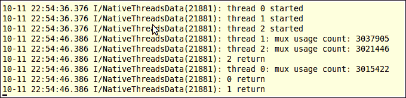

## 工作原理...

在我们的示例项目中，我们展示了使用全局变量、参数和线程特定数据键传递数据的方法：

+   互斥量 `mux` 被声明为一个全局变量，每个线程都可以访问它。

+   每个线程都被分配一个作为输入参数的线程编号。在 `run_by_thread` 函数中，每个线程将接收到的线程编号传递给另一个函数 `thread_step_2`。

+   我们定义了一个线程特定键 `muxCntKey`。每个线程都可以将自身的值与该键关联。在我们的代码中，我们使用这个键来存储一个线程锁定互斥量 `mux` 的次数。

接下来我们将详细讨论线程特定数据键。

### 创建和删除线程特定数据键

以下两个函数在 `pthread.h` 中定义，分别用于创建和删除线程特定数据键：

```kt
int pthread_key_create(pthread_key_t *key, void (*destructor_function)(void *));
int pthread_key_delete (pthread_key_t key);
```

`pthread_key_create` 函数接收一个指向 `pthread_key_t` 结构的指针和一个函数指针，该函数指针指向与每个键值相关联的销毁函数。销毁函数是可选的，可以被设置为 `NULL`。在我们的示例中，我们调用了 `pthread_key_create` 来创建名为 `muxCntKey` 的键。

`pthread_key_create` 函数返回零表示成功，其他值表示失败。如果成功，第一个输入参数 `key` 将指向新创建的键，并且所有活动线程中新的键关联的值是 `NULL`。如果在键创建后创建了一个新线程，新线程也会将 `NULL` 与键关联。

当一个线程退出时，与键关联的值被设置为 `NULL`，然后调用与键关联的销毁函数，并将键之前关联的值作为唯一的输入参数。在我们的示例代码中，我们定义了一个销毁函数 `free_muxCnt`，用于释放与键 `muxCntKey` 关联的数据的内存。

`pthread_key_delete` 的使用相对简单。它接收由 `pthread_key_create` 创建的键并删除它。成功时返回零，失败时返回非零值。

### 设置和获取线程特定数据

安卓的 `pthread.h` 为线程特定数据管理定义了以下两个函数：

```kt
int pthread_setspecific(pthread_key_t key, const void *value);
void *pthread_getspecific(pthread_key_t key);
```

`pthread_setspecific` 函数接收一个先前创建的数据键和一个指向要与键关联的数据的指针。它返回零表示成功，否则返回非零值。不同的线程可以调用这个函数，将不同的值绑定到同一个键上。

`pthread_getspecific` 函数接收一个先前创建的数据和键，并返回调用线程中与键关联的数据的指针。

在我们的示例代码中的 `run_by_thread` 函数中，我们将一个初始化为零的整数变量与 `muxCntKey` 键关联。在 `thread_step_1` 函数中，我们获取与键关联的整数变量，并使用它来计算 `mux` 被锁定的次数。在 `thread_step_2` 函数中，我们再次获取与 `muxCntKey` 关联的整数变量并打印其值。
