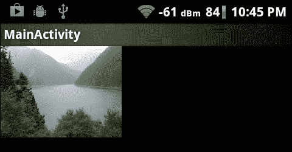
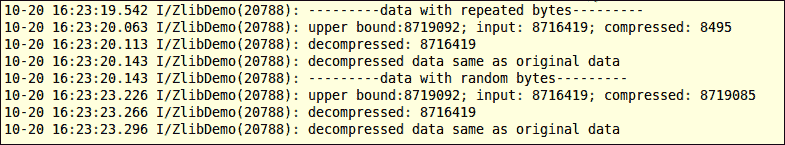
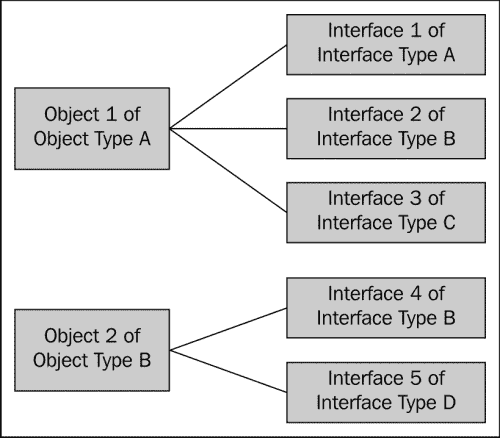
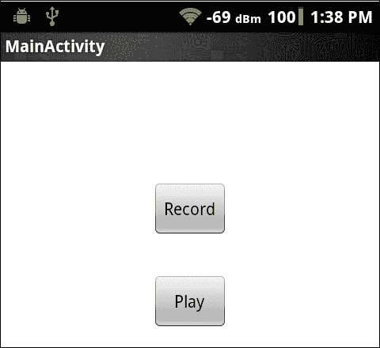
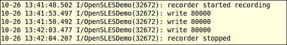
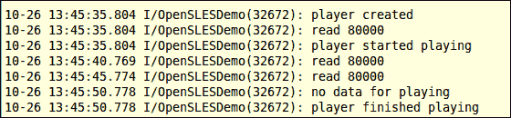
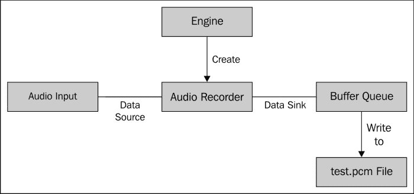
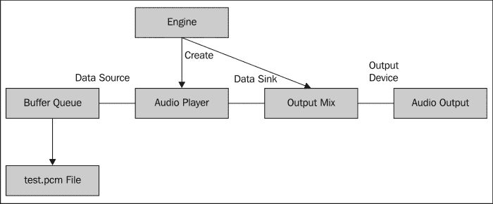
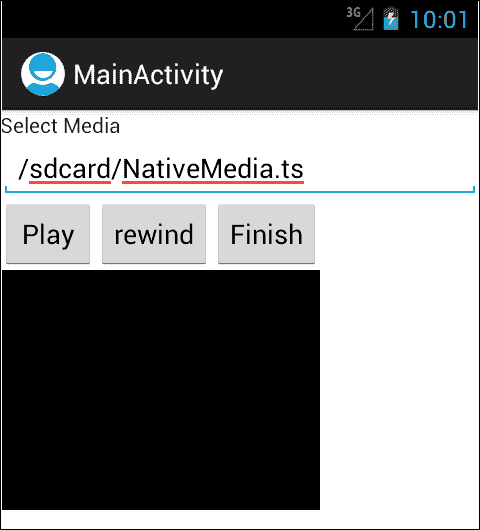
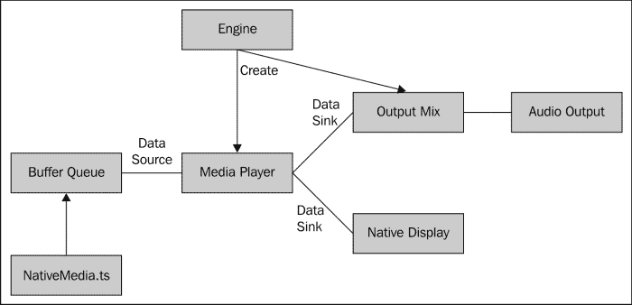

# 第七章：其他 Android NDK API

在本章中，我们将涵盖以下内容：

+   使用 Android NDK 中的 jnigraphics 库进行编程

+   使用 Android NDK 中的动态链接库进行编程

+   使用 Android NDK 中的 zlib 压缩库进行编程

+   使用 Android NDK 中的 OpenSL ES 音频库进行音频编程

+   使用 Android NDK 中的 OpenMAX AL 多媒体库进行编程

# 引言

在前三章中，我们已经涵盖了 Android NDK OpenGL ES API（第四章，*Android NDK OpenGL ES API*）、Native Application API（第五章，*Android Native Application API*）和 Multithreading API（第六章，*Android NDK Multithreading*）。这是关于 Android NDK API 说明的最后一章，我们将介绍更多库，包括`jnigraphics`库、动态链接库、`zlib`压缩库、OpenSL ES 音频库和 OpenMAX AL 多媒体库。

我们首先介绍两个小型库，`jnigraphics`和动态链接器，它们的 API 函数较少，易于使用。然后我们描述`zlib`压缩库，该库可用于以`.zlib`和`.gzip`格式压缩和解压数据。OpenSL ES 音频库和 OpenMAX AL 多媒体库是两个相对较新的 API，在 Android 的新版本上可用。这两个库中的 API 函数尚未冻结，仍在发展中。正如 NDK OpenSL ES 和 OpenMAX AL 文档所述，由于 Android 上的库开发并不追求源代码兼容性，因此这两个库的未来版本可能需要我们更新代码。

请注意，OpenSL ES 和 OpenMAX AL 是相当复杂的库，拥有大量的 API 函数。我们只能通过简单示例介绍这两个库的基本用法。感兴趣的读者应查阅库文档以获取更多详细信息。

# 使用 Android NDK 中的 jnigraphics 库进行编程

`jnigraphics`库提供了一个基于 C 的接口，使本地代码能够访问 Java 位图对象的像素缓冲区，该接口在 Android 2.2 系统映像及更高版本上作为一个稳定的本地 API 提供。本节讨论如何使用`jnigraphics`库。

## 准备工作…

读者应该知道如何创建一个 Android NDK 项目。我们可以参考第一章《Hello NDK》中的*编写一个 Hello NDK 程序*一节获取详细说明。

## 如何操作…

以下步骤描述了如何创建一个简单的 Android 应用，该应用演示了`jnigraphics`库的使用方法：

1.  创建一个名为`JNIGraphics`的 Android 应用。将包名设置为`cookbook.chapter7.JNIGraphics`。更多详细说明请参考第二章《Java Native Interface》中的*加载本地库和注册本地方法*一节。

1.  右键点击项目**JNIGraphics**，选择**Android Tools** | **Add Native Support**。

1.  在`cookbook.chapter7.JNIGraphics`包中添加两个名为`MainActivity.java`和`RenderView.java`的 Java 文件。`RenderView.java`加载`JNIGraphics`本地库，调用本地`naDemoJniGraphics`方法处理位图，并最终显示位图。`MainActivity.java`文件创建一个位图，将其传递给`RenderView`类，并将`RenderView`类设置为它的内容视图。

1.  在`jni`文件夹下添加`mylog.h`和`JNIGraphics.cpp`文件。`mylog.h`包含 Android 本地`logcat`实用函数，而`JNIGraphics.cpp`文件包含使用`jnigraphics`库函数处理位图的本地代码。`JNIGraphics.cpp`文件中的部分代码如下所示：

    ```kt
    void naDemoJniGraphics(JNIEnv* pEnv, jclass clazz, jobject pBitmap) {
      int lRet, i, j;
      AndroidBitmapInfo lInfo;
      void* lBitmap;
      //1\. retrieve information about the bitmap
      if ((lRet = AndroidBitmap_getInfo(pEnv, pBitmap, &lInfo)) < 0) {
        return;
      }
      if (lInfo.format != ANDROID_BITMAP_FORMAT_RGBA_8888) {
        return;
      }
      //2\. lock the pixel buffer and retrieve a pointer to it
      if ((lRet = AndroidBitmap_lockPixels(pEnv, pBitmap, &lBitmap)) < 0) {
        LOGE(1, "AndroidBitmap_lockPixels() failed! error = %d", lRet);
      }
      //3\. manipulate the pixel buffer
      unsigned char *pixelBuf = (unsigned char*)lBitmap;
      for (i = 0; i < lInfo.height; ++i) {
        for (j = 0; j < lInfo.width; ++j) {
        unsigned char *pixelP = pixelBuf + i*lInfo.stride + j*4;
        *pixelP = (unsigned char)0x00;	//remove R component
    //    *(pixelP+1) = (unsigned char)0x00;	//remove G component
    //    *(pixelP+2) = (unsigned char)0x00;	//remove B component
    //    LOGI(1, "%d:%d:%d:%d", *pixelP, *(pixelP+1), *(pixelP+2), *(pixelP+3));}
      }
      //4\. unlock the bitmap
      AndroidBitmap_unlockPixels(pEnv, pBitmap);
    }
    ```

1.  在`jni`文件夹中添加一个`Android.mk`文件，内容如下：

    ```kt
    LOCAL_PATH := $(call my-dir)
    include $(CLEAR_VARS)
    LOCAL_MODULE    := JNIGraphics
    LOCAL_SRC_FILES := JNIGraphics.cpp
    LOCAL_LDLIBS := -llog -ljnigraphics
    include $(BUILD_SHARED_LIBRARY)
    ```

1.  构建并运行 Android 项目。我们可以启用代码从位图中移除不同的组件。以下屏幕截图分别显示了原始图片以及移除了红色、绿色和蓝色组件的图片：

## 它的工作原理...

在我们的示例项目中，我们通过将位图传递给本地`naDemoJniGraphics`函数的一个 RGB 组件设置为 0 来修改位图。

### 注意

`jnigraphics`库仅适用于 Android API 级别 8（Android 2.2，Froyo）及更高版本。

使用`jnigraphics`库应遵循以下步骤：

1.  在使用`jnigraphics`API 的源代码中包含`<android/bitmap.h>`头文件。

1.  在`Android.mk`文件中包含以下行以链接到`jnigraphics`库。

    ```kt
    LOCAL_LDLIBS += -ljnigraphics
    ```

1.  在源代码中，调用`AndroidBitmap_getInfo`函数来获取关于位图对象的信息。`AndroidBitmap_getInfo`函数具有以下原型：

    ```kt
    int AndroidBitmap_getInfo(JNIEnv* env, jobject jbitmap, AndroidBitmapInfo* info);
    ```

    该函数接受指向`JNIEnv`结构的指针、位图对象的引用以及指向`AndroidBitmapInfo`结构的指针。如果调用成功，`info`指向的数据结构将被填充。

    `AndroidBitmapInfo`的定义如下：

    ```kt
    typedef struct {
    uint32_t    width;
    	uint32_t    height;
    uint32_t    stride;
    int32_t     format;
    uint32_t    flags; 
    } AndroidBitmapInfo;
    ```

    `width`和`height`表示位图的像素宽度和高度。`stride`指的是像素缓冲区行之间跳过的字节数。该数字不得小于宽度字节。在大多数情况下，`stride`与`width`相同。然而，有时像素缓冲区包含填充，所以`stride`可能比位图`width`大。

    `format`是颜色格式，可以是`bitmap.h`头文件中定义的`ANDROID_BITMAP_FORMAT_RGBA_8888`、`ANDROID_BITMAP_FORMAT_RGB_565`、`ANDROID_BITMAP_FORMAT_RGBA_4444`、`ANDROID_BITMAP_FORMAT_A_8`或`ANDROID_BITMAP_FORMAT_NONE`。

    在我们的示例中，我们使用`ANDROID_BITMAP_FORMAT_RGBA_8888`作为位图格式。因此，每个像素占用 4 个字节。

1.  通过调用`AndroidBitmap_lockPixels`函数锁定像素地址：

    ```kt
    int AndroidBitmap_lockPixels(JNIEnv* env, jobject jbitmap, void** addrPtr);
    ```

    如果调用成功，`*addrPtr` 指针将指向位图的像素。一旦像素地址被锁定，在像素地址被解锁之前，像素的内存不会移动。

1.  在本地代码中操作像素缓冲区。

1.  通过调用 `AndroidBitmap_unlockPixels` 来解锁像素地址：

    ```kt
    int AndroidBitmap_unlockPixels(JNIEnv* env, jobject jbitmap);
    ```

    请注意，如果 `AndroidBitmap_lockPixels` 函数调用成功，则必须调用此函数。

    ### 注意

    `jnigraphics` 函数在成功时返回 `ANDROID_BITMAP_RESUT_SUCCESS`，其值为 `0`。失败时返回负值。

## 还有更多内容...

回顾我们在第四章，*Android NDK OpenGL ES API* 的*使用 OpenGL ES 1.x API 将纹理映射到 3D 对象*示例中使用了 `jnigraphics` 库来加载纹理。我们可以重新访问该示例，了解我们如何使用 `jnigraphics` 库的另一个例子。

# 在 Android NDK 中使用动态链接库进行编程

动态加载是一种在运行时将库加载到内存中，并执行库中定义的函数或访问变量的技术。它允许应用程序在没有这些库的情况下启动。

在本书的几乎每个示例中，我们都看到了动态加载。当我们调用 `System.loadLibrary` 或 `System.load` 函数来加载本地库时，我们就是在使用动态加载。

自从 Android 1.5 起，Android NDK 就提供了动态链接库以支持 NDK 中的动态加载。本示例讨论动态链接库函数。

## 准备就绪...

期望读者知道如何创建一个 Android NDK 项目。你可以参考第一章的*编写一个 Hello NDK 程序*示例，*Hello NDK* 以获取详细说明。

## 如何操作...

以下步骤描述了如何使用动态链接库创建一个 Android 应用程序，以加载数学库并计算 2 的平方根。

1.  创建一个名为 `DynamicLinker` 的 Android 应用程序。将包名设置为 `cookbook.chapter7.dynamiclinker`。更多详细说明请参考第二章，*Java Native Interface* 的*加载本地库和注册本地方法*示例。

1.  右键点击 `DynamicLinker` 项目，选择 **Android Tools** | **Add Native Support**。

1.  在 `cookbook.chapter7.dynamiclinker` 包下添加一个名为 `MainActivity.java` 的 Java 文件。这个 Java 文件简单加载了本地 `DynamicLinker` 库，并调用了本地 `naDLDemo` 方法。

1.  在 `jni` 文件夹下添加 `mylog.h` 和 `DynamicLinker.cpp` 文件。`OpenSLESDemo.cpp` 文件中的一部分代码在以下代码中显示。

    `naDLDemo` 加载了 `libm.so` 库，获取了 `sqrt` 函数的地址，并以输入参数 `2.0` 调用该函数：

    ```kt
    void naDLDemo(JNIEnv* pEnv, jclass clazz) {
      void *handle;
      double (*sqrt)(double);
      const char *error;
      handle = dlopen("libm.so", RTLD_LAZY);
      if (!handle) {
        LOGI(1, "%s\n", dlerror());
        return;
      }
      dlerror();    /* Clear any existing error */
      *(void **) (&sqrt) = dlsym(handle, "sqrt");
      if ((error = dlerror()) != NULL)  {
        LOGI(1, "%s\n", error);
        return;
      }
      LOGI(1, "%f\n", (*sqrt)(2.0));
    }
    ```

1.  在 `jni` 文件夹下添加一个 `Android.mk` 文件，内容如下：

    ```kt
    LOCAL_PATH := $(call my-dir)
    include $(CLEAR_VARS)
    LOCAL_MODULE    := DynamicLinker
    LOCAL_SRC_FILES := DynamicLinker.cpp
    LOCAL_LDLIBS := -llog -ldl
    include $(BUILD_SHARED_LIBRARY)
    ```

1.  构建并运行 Android 项目，使用以下命令监控 `logcat` 输出：

    ```kt
    $ adb logcat -v time DynamicLinker:I *:S
    ```

    `logcat`输出的屏幕截图如下所示：

    

## 它的工作原理...

为了使用动态加载库`libdl.so`进行构建，我们必须在`Android.mk`文件中添加以下行：

```kt
LOCAL_LDLIBS := -ldl
```

以下函数在`dlfcn.h`头文件中由 Android 动态链接库定义：

```kt
void*        dlopen(const char*  filename, int flag);
int          dlclose(void*  handle);
const char*  dlerror(void);
void*        dlsym(void*  handle, const char*  symbol);
int          dladdr(const void* addr, Dl_info *info);
```

`dlopen`函数动态加载库。第一个参数指示库名称，而第二个参数指的是加载模式，描述了`dlopen`如何解析未定义的符号。当一个对象文件（例如共享库、可执行文件等）被加载时，它可能包含对符号的引用，这些符号的地址在另一个对象文件被加载之前是未知的（这类符号被称为未定义符号）。在使用这些引用访问符号之前，需要解析这些引用。以下两种模式决定了解析何时发生：

+   `RTLD_NOW`：当对象文件被加载时，未定义的符号将被解析。这意味着解析在`dlopen`函数返回之前发生。如果执行了解析但从未访问过引用，这可能是浪费。

+   `RTLD_LAZY`：解析可以在`dlopen`函数返回后执行，即当代码执行时解析未定义的符号。

以下两种模式决定了已加载对象中符号的可见性。它们可以与前面提到的两种模式进行 OR 运算：

+   `RTLD_LOCAL`：符号对另一个对象不可用

+   `RTLD_GLOBAL`：符号将对随后加载的对象可用

`dlopen`函数在成功时返回一个句柄。该句柄应用于后续对`dlsym`和`dlclose`的调用。

`dlclose`函数只是减少了加载库句柄的引用计数。如果引用计数减少到零，将卸载库。

`dlerror`函数返回一个字符串，以描述自上次调用`dlerror`以来在调用`dlopen`、`dlsym`或`dlclose`时发生的最新错误。如果没有发生此类错误，它将返回`NULL`。

`dlsym`函数返回输入参数句柄所引用的已加载动态库中给定符号的内存地址。返回的地址可以用来访问该符号。

`dladdr`函数接收一个地址，并尝试通过`DI_info`类型的`info`参数返回有关该地址和库的更多信息。`DI_info`数据结构定义如下代码片段所示：

```kt
typedef struct {
   const char *dli_fname;  
   void       *dli_fbase;  
   const char *dli_sname;  
   void       *dli_saddr;  
} Dl_info;
```

`dli_fname`表示输入参数`addr`引用的共享对象的路径。`dli_fbase`是共享对象加载的地址。`dli_sname`表示地址低于`addr`的最近符号的名称，而`dli_saddr`是名为`dli_sname`的符号的地址。

在我们的示例中，我们演示了前四个函数的用法。我们通过 `dlopen` 加载数学库，通过 `dlsym` 获取 `sqrt` 函数的地址，通过 `dlerror` 检查错误，并通过 `dlclose` 关闭库。

有关动态加载库的更多详细信息，请参考 [`tldp.org/HOWTO/Program-Library-HOWTO/dl-libraries.html`](http://tldp.org/HOWTO/Program-Library-HOWTO/dl-libraries.html) 和 [`linux.die.net/man/3/dlopen`](http://linux.die.net/man/3/dlopen)。

# 在 Android NDK 中使用 zlib 压缩库进行编程

`zlib` 是一个广泛使用的、无损的数据压缩库，适用于 Android 1.5 系统镜像或更高版本。本食谱讨论了 `zlib` 函数的基本用法。

## 准备中...

期望读者知道如何创建一个 Android NDK 项目。我们可以参考 第一章 的 *编写一个 Hello NDK 程序* 食谱，*Hello NDK* 以获取详细说明。

## 如何操作...

以下步骤描述了如何创建一个简单的 Android 应用程序，该程序演示了 `zlib` 库的用法：

1.  创建一个名为 `ZlibDemo` 的 Android 应用程序。将包名设置为 `cookbook.chapter7.zlibdemo`。有关更详细的说明，请参考 第二章 的 *加载本地库和注册本地方法* 食谱，*Java Native Interface*。

1.  在项目 **ZlibDemo** 上右键点击，选择 **Android Tools** | **添加本地支持**。

1.  在 `cookbook.chapter7.zlibdemo` 包中添加一个名为 `MainActivity.java` 的 Java 文件。`MainActivity.java` 文件加载 `ZlibDemo` 本地库，并调用本地方法。

1.  在 `jni` 文件夹下添加 `mylog.h`、`ZlibDemo.cpp` 和 `GzFileDemo.cpp` 文件。`mylog.h` 头文件包含了 Android 本地的 `logcat` 实用功能函数，而 `ZlibDemo.cpp` 和 `GzFileDemo.cpp` 文件包含了压缩和解压缩的代码。`ZlibDemo.cpp` 和 `GzFileDemo.cpp` 的一部分代码在以下代码中展示。

    `ZlibDemo.cpp` 包含了在内存中压缩和解压缩数据的本地代码。

    `compressUtil` 在内存中压缩和解压缩数据。

    ```kt
    void compressUtil(unsigned long originalDataLen) {
      int rv;
      int compressBufBound = compressBound(originalDataLen);
      compressedBuf = (unsigned char*) malloc(sizeof(unsigned char)*compressBufBound);
      unsigned long compressedDataLen = compressBufBound;
      rv = compress2(compressedBuf, &compressedDataLen, dataBuf, originalDataLen, 6);
      if (Z_OK != rv) {
        LOGE(1, "compression error");
        free(compressedBuf);
        return;
      }
      unsigned long decompressedDataLen = S_BUF_SIZE;
      rv = uncompress(decompressedBuf, &decompressedDataLen, compressedBuf, compressedDataLen);
      if (Z_OK != rv) {
        LOGE(1, "decompression error");
        free(compressedBuf);
        return;
      }
      if (0 == memcmp(dataBuf, decompressedBuf, originalDataLen)) {
        LOGI(1, "decompressed data same as original data");
      }   //free resource
      free(compressedBuf);
    }
    ```

1.  `naCompressAndDecompress` 生成压缩数据并调用 `compressUtil` 函数来压缩和解压缩生成的数据：

    ```kt
    void naCompressAndDecompress(JNIEnv* pEnv, jclass clazz) {
      unsigned long originalDataLen = getOriginalDataLen();
      LOGI(1, "---------data with repeated bytes---------")
      generateOriginalData(originalDataLen);
      compressUtil(originalDataLen);
      LOGI(1, "---------data with random bytes---------")
      generateOriginalDataRandom(originalDataLen);
      compressUtil(originalDataLen);
    }
    ```

    `GzFileDemo.cpp` 包含了本地代码，用于压缩和解压缩文件中的数据。

    `writeToFile` 函数将字符串写入到 `gzip` 文件中。在写入时会应用压缩：

    ```kt
    int writeToFile() {
      gzFile file;
      file = gzopen("/sdcard/test.gz", "w6");
      if (NULL == file) {
        LOGE(1, "cannot open file to write");
        return 0;
      }
      const char* dataStr = "hello, Android NDK!";
      int bytesWritten = gzwrite(file, dataStr, strlen(dataStr));
      gzclose(file);
      return bytesWritten;
    }
    ```

    `readFromFile` 从 `gzip` 文件中读取数据。在读取时会应用解压缩：

    ```kt
    void readFromFile(int pBytesToRead) {
      gzFile file;
      file = gzopen("/sdcard/test.gz", "r6");
      if (NULL == file) {
        LOGE(1, "cannot open file to read");
        return;
      }
      char readStr[100];
      int bytesRead = gzread(file, readStr, pBytesToRead);
      gzclose(file);
      LOGI(1, "%d: %s", bytesRead, readStr);
    }
    ```

1.  在 `jni` 文件夹下添加一个 `Android.mk` 文件，内容如下：

    ```kt
    LOCAL_PATH := $(call my-dir)
    include $(CLEAR_VARS)
    LOCAL_MODULE    := ZlibDemo
    LOCAL_SRC_FILES := ZlibDemo.cpp GzFileDemo.cpp
    LOCAL_LDLIBS := -llog -lz
    include $(BUILD_SHARED_LIBRARY)
    ```

1.  启用 `naCompressAndDecompress` 函数并禁用 `naGzFileDemo` 函数，构建并运行应用程序。我们可以使用以下命令监控 `logcat` 输出：

    ```kt
    $ adb logcat -v time ZlibDemo:I *:S
    ```

    `logcat` 输出的屏幕截图如下所示：

    

    启用 `naGzFileDemo` 函数并禁用 `naCompressAndDecompress` 函数，构建并运行应用程序。`logcat` 输出在以下屏幕截图中显示：

    

## 工作原理...

`zlib` 库为内存数据和文件提供压缩和解压缩功能。我们演示了这两种用例。在 `ZlibDemo.cpp` 文件中，我们创建了两个数据缓冲区，一个包含重复的字节，另一个包含随机的字节。我们按照以下步骤压缩和解压缩数据：

1.  计算压缩后大小的上限。这是通过以下函数完成的：

    ```kt
    uLong compressBound(uLong sourceLen);
    ```

    该函数返回在 `sourceLen` 字节的源数据上调用 `compress` 或 `compress2` 函数后压缩数据的最大大小。

1.  为存储压缩数据分配内存。

1.  压缩数据。这是通过以下函数完成的：

    ```kt
    int compress2(Bytef *dest,   uLongf *destLen, const Bytef *source, uLong sourceLen, int level);
    ```

    这个函数接受五个输入参数。`source` 和 `sourceLen` 指的是源数据缓冲区和源数据长度。`dest` 和 `destLen` 指示用于存储压缩数据的数据缓冲区和这个缓冲区的大小。`destLen` 的值必须在调用函数时至少为 `compressBound` 返回的值。当函数返回时，`destLen` 被设置为压缩数据的实际大小。最后一个输入参数 `level` 可以在 0 到 9 之间取值，其中 1 表示最快的速度，9 表示最佳的压缩率。在我们的示例中，我们将其值设置为 6，以在速度和压缩之间取得平衡。

    ### 注意

    我们还可以使用压缩函数来压缩数据，该函数没有级别输入参数。相反，它假设一个默认级别，相当于 6。

1.  解压缩数据。这是通过使用 `uncompress` 函数完成的：

    ```kt
    int uncompress(Bytef *dest,   uLongf *destLen, const Bytef *source, uLong sourceLen);
    ```

    输入参数与 `compress2` 函数的含义相同。

1.  将解压缩的数据与原始数据比较。这只是简单的检查。

    默认情况下，这些函数使用 `zlib` 格式来处理压缩数据。

    这个库还支持以 `gzip` 格式读写文件。这在 `GzFileDemo.cpp` 中有演示。这些函数的使用类似于 `stdio` 文件读写函数。

我们遵循的步骤将压缩数据写入 `gzip` 文件，然后从中读取未压缩数据，如下所示：

1.  打开一个 `gzip` 文件以供写入。这是通过以下函数完成的：

    ```kt
    gzFile gzopen(const char *path, const char *mode);
    ```

    该函数接受一个文件名和打开模式，并在成功时返回一个 `gzFile` 对象。该模式类似于 `fopen` 函数，但有一个可选的压缩级别。在我们的示例中，我们用 `w6` 调用 `gzopen` 以指定压缩级别为 6。

1.  将数据写入 `gzip` 文件。这是通过以下函数完成的：

    ```kt
    int gzwrite(gzFile file, voidpc buf, unsigned len);
    ```

    此函数将未压缩数据写入压缩文件中。输入参数`file`指的是压缩文件，`buf`指的是未压缩数据缓冲区，而`len`表示要写入的字节数。函数返回实际写入的未压缩数据数量。

1.  关闭`gzip`文件。这是通过以下函数完成的：

    ```kt
    int ZEXPORT    gzclose(gzFile file);
    ```

    调用此函数将刷新所有挂起的输出并关闭压缩文件。

1.  打开文件以供读取。我们向`gzopen`函数传递了`r6`。

1.  从压缩文件中读取数据。这是通过`gzread`函数完成的。

    ```kt
    int gzread(gzFile file, voidp buf, unsigned len);
    ```

    该函数从文件中读取`len`个字节到`buf`中。它返回实际读取的字节数。

    ### 注意

    `zlib`库支持两种压缩格式，`zlib`和`gzip`。`zlib`旨在紧凑且快速，因此最适合在内存和通信通道中使用。另一方面，`gzip`专为文件系统上的单个文件压缩设计，它有一个更大的头部来维护目录信息，并且比`zlib`使用更慢的校验方法。

为了使用`zlib`库，我们必须在源代码中包含`zlib.h`头文件，并在`Android.mk`中添加以下行以链接到`libz.so`库：

```kt
LOCAL_LDLIBS := -lz
```

## 还有更多...

回顾第五章中的*管理 Android NDK 的资产*一节，*Android Native Application API*，我们编译了`libpng`库，它需要`zlib`库。

我们只介绍了`zlib`库提供的一些函数。更多信息，您可以参考`platforms/android-<version>/arch-arm/usr/include/`文件夹中的`zlib.h`和`zconf.h`头文件。`zlib`库的详细文档可以在[`www.zlib.net/manual.html`](http://www.zlib.net/manual.html)找到。

# 使用 Android NDK 中的 OpenSL ES 音频库进行音频编程

OpenSL ES 是一个 C 语言级别的应用程序音频库。Android NDK 原生音频 API 基于 OpenSL ES 1.0.1 标准，并带有 Android 特定的扩展。该 API 适用于 Android 2.3 或更高版本，某些功能仅在 Android 4.0 或更高版本上支持。此库中的 API 函数尚未冻结，仍在发展中。此库的未来版本可能需要我们更新代码。本节在 Android 环境下介绍 OpenSL ES API。

## 准备就绪...

在开始使用 OpenSL ES 编码之前，了解这个库的一些基本知识是至关重要的。OpenSL ES 代表嵌入式系统的**开放声音库**，它是一个跨平台、免版税、使用 C 语言的应用程序级别 API，供开发者访问嵌入式系统的音频功能。该库规范定义了如音频播放和录制、音频效果和控制、2D 和 3D 音频、高级 MIDI 等功能。根据支持的功能，OpenSL ES 定义了三个配置文件，包括电话、音乐和游戏。

然而，Android 原生音频 API 并不符合这三个配置文件中的任何一个，因为它没有实现任何配置文件中的所有功能。此外，Android 实现了一些特定于 Android 的功能，例如 Android 缓冲队列。关于在 Android 上支持的功能的详细描述，我们可以参考随 Android NDK 提供的`docs/opensles/`文件夹下的 OpenSL ES for Android 文档。

尽管 OpenSL ES API 是用 C 语言实现的，但它通过基于对象和接口构建库，采用了面向对象的方法：

+   **对象**：对象是一组资源和它们状态的抽象。每个对象在创建时都会分配一个类型，而类型决定了对象可以执行的任务集合。这类似于 C++中的类概念。

+   **接口**：接口是一组对象可以提供的特性的抽象。这些特性以一组方法和每种接口类型的精确特性集合的形式暴露给我们。在代码中，接口类型通过接口 ID 来识别。

需要注意的是，对象在代码中没有实际的表现形式。我们通过接口改变对象的状态和访问其特性。一个对象可以有一个或多个接口实例。然而，一个单一对象的两个实例不能是同一类型。此外，给定的接口实例只能属于一个对象。这种关系可以如下所示的关系图进行说明：



如图中所示，对象 1 和对象 2 具有不同的类型，因此暴露了不同的接口。对象 1 有三个接口实例，所有实例类型都不同。而对象 2 有另外两个不同类型的接口实例。注意对象 1 的接口 2 和对象 2 的接口 4 具有相同的类型，这意味着对象 1 和对象 2 都支持通过 Interface Type B 的接口暴露的特性。

## 如何操作...

以下步骤描述了如何使用原生音频库创建一个简单的 Android 应用程序以录制和播放音频：

1.  创建一个名为`OpenSLESDemo`的 Android 应用程序。将包名设置为`cookbook.chapter7.opensles`。更多详细说明请参考第二章的*加载本地库和注册本地方法*部分，*Java Native Interface*。

1.  右键点击项目**OpenSLESDemo**，选择**Android Tools** | **Add Native Support**。

1.  在`cookbook.chapter7.opensles`包中添加一个名为`MainActivity.java`的 Java 文件。这个 Java 文件仅加载本地库`OpenSLESDemo`，并调用本地方法来录制和播放音频。

1.  在`jni`文件夹中添加`mylog.h`、`common.h`、`play.c`、`record.c`和`OpenSLESDemo.cpp`文件。`play.c`、`record.c`和`OpenSLESDemo.cpp`文件中的一部分代码在以下代码片段中展示。

    `record.c`包含创建音频录音器对象并录制音频的代码。

    `createAudioRecorder`创建并实现一个音频播放器对象，并获得录音和缓冲队列接口：

    ```kt
    jboolean createAudioRecorder() {
       SLresult result;
       SLDataLocator_IODevice loc_dev = {SL_DATALOCATOR_IODEVICE, SL_IODEVICE_AUDIOINPUT, SL_DEFAULTDEVICEID_AUDIOINPUT, NULL};
       SLDataSource audioSrc = {&loc_dev, NULL};
       SLDataLocator_AndroidSimpleBufferQueue loc_bq = {SL_DATALOCATOR_ANDROIDSIMPLEBUFFERQUEUE, 1};
       SLDataFormat_PCM format_pcm = {SL_DATAFORMAT_PCM, 1, SL_SAMPLINGRATE_16,
           SL_PCMSAMPLEFORMAT_FIXED_16, SL_PCMSAMPLEFORMAT_FIXED_16,
           SL_SPEAKER_FRONT_CENTER, SL_BYTEORDER_LITTLEENDIAN};
       SLDataSink audioSnk = {&loc_bq, &format_pcm};
       const SLInterfaceID id[1] = {SL_IID_ANDROIDSIMPLEBUFFERQUEUE};
       const SLboolean req[1] = {SL_BOOLEAN_TRUE};
       result = (*engineEngine)->CreateAudioRecorder(engineEngine, &recorderObject, &audioSrc,
               &audioSnk, 1, id, req);
         result = (*recorderObject)->Realize(recorderObject, SL_BOOLEAN_FALSE);
       result = (*recorderObject)->GetInterface(recorderObject, SL_IID_RECORD, &recorderRecord);
       result = (*recorderObject)->GetInterface(recorderObject, SL_IID_ANDROIDSIMPLEBUFFERQUEUE, &recorderBufferQueue);
       result = (*recorderBufferQueue)->RegisterCallback(recorderBufferQueue, bqRecorderCallback, NULL);
       return JNI_TRUE;
    }
    ```

    `startRecording`将缓冲区入队以存储录音音频，并将音频对象状态设置为录音状态：

    ```kt
    void startRecording() {
       SLresult result;
       recordF = fopen("/sdcard/test.pcm", "wb");
       result = (*recorderRecord)->SetRecordState(recorderRecord, SL_RECORDSTATE_STOPPED);
       result = (*recorderBufferQueue)->Clear(recorderBufferQueue);
       recordCnt = 0;
       result = (*recorderBufferQueue)->Enqueue(recorderBufferQueue, recorderBuffer,
               RECORDER_FRAMES * sizeof(short));
       result = (*recorderRecord)->SetRecordState(recorderRecord, SL_RECORDSTATE_RECORDING);
    }
    ```

    每当缓冲队列准备好接受新的数据块时，就会调用`bqRecorderCallback`回调方法。这发生在缓冲区填满音频数据时：

    ```kt
    void bqRecorderCallback(SLAndroidSimpleBufferQueueItf bq, void *context) {
       int numOfRecords = fwrite(recorderBuffer, sizeof(short), RECORDER_FRAMES, recordF);
       fflush(recordF);
       recordCnt++;
       SLresult result;
       if (recordCnt*5 < RECORD_TIME) {
        result = (*recorderBufferQueue)->Enqueue(recorderBufferQueue, recorderBuffer,
            RECORDER_FRAMES * sizeof(short));
       } else {
        result = (*recorderRecord)->SetRecordState(recorderRecord, SL_RECORDSTATE_STOPPED);
        if (SL_RESULT_SUCCESS == result) {
          fclose(recordF);
        }
       }
    }
    ```

    `play.c`包含创建音频播放器对象并播放音频的代码。

    `createBufferQueueAudioPlayer`创建并实现一个从缓冲队列播放音频的音频播放器对象：

    ```kt
    void createBufferQueueAudioPlayer() {
       SLresult result;
       SLDataLocator_AndroidSimpleBufferQueue loc_bufq = {SL_DATALOCATOR_ANDROIDSIMPLEBUFFERQUEUE, 1};
       SLDataFormat_PCM format_pcm = {SL_DATAFORMAT_PCM, 1, SL_SAMPLINGRATE_16,
           SL_PCMSAMPLEFORMAT_FIXED_16, SL_PCMSAMPLEFORMAT_FIXED_16,
           SL_SPEAKER_FRONT_CENTER, SL_BYTEORDER_LITTLEENDIAN};
       SLDataSource audioSrc = {&loc_bufq, &format_pcm};
       SLDataLocator_OutputMix loc_outmix = {SL_DATALOCATOR_OUTPUTMIX, outputMixObject};
       SLDataSink audioSnk = {&loc_outmix, NULL};
       const SLInterfaceID ids[3] = {SL_IID_BUFFERQUEUE, SL_IID_EFFECTSEND, SL_IID_VOLUME};
       const SLboolean req[3] = {SL_BOOLEAN_TRUE, SL_BOOLEAN_TRUE, SL_BOOLEAN_TRUE};
       result = (*engineEngine)->CreateAudioPlayer(engineEngine, &bqPlayerObject, &audioSrc, &audioSnk, 3, ids, req);
       result = (*bqPlayerObject)->Realize(bqPlayerObject, SL_BOOLEAN_FALSE);
       result = (*bqPlayerObject)->GetInterface(bqPlayerObject, SL_IID_PLAY, &bqPlayerPlay);
       result = (*bqPlayerObject)->GetInterface(bqPlayerObject, SL_IID_BUFFERQUEUE,
               &bqPlayerBufferQueue);
       result = (*bqPlayerBufferQueue)->RegisterCallback(bqPlayerBufferQueue, bqPlayerCallback, NULL);
       result = (*bqPlayerObject)->GetInterface(bqPlayerObject, SL_IID_EFFECTSEND,
               &bqPlayerEffectSend);
       result = (*bqPlayerObject)->GetInterface(bqPlayerObject, SL_IID_VOLUME, &bqPlayerVolume);
    }
    ```

    `startPlaying`从`test.cpm`文件填充缓冲区数据并开始播放：

    ```kt
    jboolean startPlaying() {
      SLresult result;
      recordF = fopen("/sdcard/test.pcm", "rb");
      noMoreData = 0;
      int numOfRecords = fread(recorderBuffer, sizeof(short), RECORDER_FRAMES, recordF);
      if (RECORDER_FRAMES != numOfRecords) {
        if (numOfRecords <= 0) {
          return JNI_TRUE;
        }
        noMoreData = 1;
      }   
    result = (*bqPlayerBufferQueue)->Enqueue(bqPlayerBufferQueue, recorderBuffer, RECORDER_FRAMES * sizeof(short));
      result = (*bqPlayerPlay)->SetPlayState(bqPlayerPlay, SL_PLAYSTATE_PLAYING);
      return JNI_TRUE;
    }
    ```

    `bqPlayerCallback`每次缓冲队列准备好接受新的缓冲区时，都会调用这个回调方法。这发生在缓冲区播放完毕时：

    ```kt
    void bqPlayerCallback(SLAndroidSimpleBufferQueueItf bq, void *context) {
       if (!noMoreData) {
            SLresult result;
    int numOfRecords = fread(recorderBuffer, sizeof(short), RECORDER_FRAMES, recordF);
      if (RECORDER_FRAMES != numOfRecords) {
        if (numOfRecords <= 0) {
          noMoreData = 1;
          (*bqPlayerPlay)->SetPlayState(bqPlayerPlay, SL_PLAYSTATE_STOPPED);
          fclose(recordF);
          return;
        }
        noMoreData = 1;
      } 
      result = (*bqPlayerBufferQueue)->Enqueue(bqPlayerBufferQueue, recorderBuffer,  RECORDER_FRAMES * sizeof(short));
       } else {
         (*bqPlayerPlay)->SetPlayState(bqPlayerPlay, SL_PLAYSTATE_STOPPED);
         fclose(recordF);
       }
    }
    ```

    `OpenSLESDemo.cpp`文件包含创建 OpenSL ES 引擎对象、释放对象以及注册本地方法的代码：

    `naCreateEngine`创建引擎对象并输出混合对象。

    ```kt
    void naCreateEngine(JNIEnv* env, jclass clazz) {
       SLresult result;
       result = slCreateEngine(&engineObject, 0, NULL, 0, NULL, NULL);
       result = (*engineObject)->Realize(engineObject, SL_BOOLEAN_FALSE);
       result = (*engineObject)->GetInterface(engineObject, SL_IID_ENGINE, &engineEngine);
       const SLInterfaceID ids[1] = {SL_IID_ENVIRONMENTALREVERB};
       const SLboolean req[1] = {SL_BOOLEAN_FALSE};
       result = (*engineEngine)->CreateOutputMix(engineEngine, &outputMixObject, 1, ids, req);
       result = (*outputMixObject)->Realize(outputMixObject, SL_BOOLEAN_FALSE);
       result = (*outputMixObject)->GetInterface(outputMixObject, SL_IID_ENVIRONMENTALREVERB,
               &outputMixEnvironmentalReverb);
       if (SL_RESULT_SUCCESS == result) {
            result = (*outputMixEnvironmentalReverb)->SetEnvironmentalReverbProperties(
                   outputMixEnvironmentalReverb, &reverbSettings);
       }
    }
    ```

1.  在`AndroidManifest.xml`文件中添加以下权限。

    ```kt
    <uses-permission android:name="android.permission.RECORD_AUDIO"/>
    <uses-permission android:name="android.permission.WRITE_EXTERNAL_STORAGE"/>
    <uses-permission android:name="android.permission.MODIFY_AUDIO_SETTINGS"></uses-permission>
    ```

1.  在`jni`文件夹中添加一个`Android.mk`文件，内容如下：

    ```kt
    LOCAL_PATH := $(call my-dir)
    include $(CLEAR_VARS)
    LOCAL_MODULE    := OpenSLESDemo
    LOCAL_SRC_FILES := OpenSLESDemo.cpp record.c play.c
    LOCAL_LDLIBS := -llog
    LOCAL_LDLIBS    += -lOpenSLES
    include $(BUILD_SHARED_LIBRARY)
    ```

1.  构建并运行 Android 项目，并使用以下命令监控`logcat`输出：

    ```kt
    $ adb logcat -v time OpenSLESDemo:I *:S
    ```

1.  应用的 GUI 如下截图所示：

    +   我们可以通过点击**录音**按钮开始音频录音。录音将持续 15 秒。`logcat`输出将如下截图所示：

    +   录音完成后，将在 Android 设备上创建一个`/sdcard/test.pcm`文件。我们可以点击**播放**按钮来播放音频文件。`logcat`输出将如下截图所示：

    

## 工作原理...

本示例项目展示了如何使用 OpenSL ES 音频库。我们首先解释一些关键概念，然后描述我们是如何使用录音和播放 API 的。

### 对象创建

对象在代码中没有实际的表现形式，对象的创建是通过接口完成的。每个创建对象的方法都返回一个`SLObjectInf`接口，该接口可用于执行对象的基本操作并访问对象的其它接口。对象创建的步骤如下所述：

1.  创建一个引擎对象。引擎对象是 OpenSL ES API 的入口点。创建引擎对象是通过全局函数`slCreateEngine()`完成的，该函数返回一个`SLObjectItf`接口。

1.  实现引擎对象。在对象被实现之前，不能使用该对象。我们将在下一节详细讨论这一点。

1.  通过`SLObjectItf`接口的`GetInterface()`方法获取引擎对象的`SLEngineItf`接口。

1.  调用`SLEngineItf`接口提供的对象创建方法。成功后，将返回新创建对象的`SLObjectItf`接口。

1.  实现新创建的对象。

1.  通过对象的`SLObjectItf`接口操作创建的对象或访问其他接口。

1.  完成对象操作后，调用`SLObjectItf`接口的`Destroy()`方法来释放对象及其资源。

在我们的示例项目中，我们在`OpenSLESDemo.cpp`的`naCreateEngine`函数中创建了并实现了引擎对象，并获得了`SLEngineItf`接口。然后，我们调用了`SLEngineItf`接口暴露的`CreateAudioRecorder()`方法，在`record.c`的`createAudioRecorder`函数中创建了一个音频录音对象。在同一个函数中，我们还实现了录音对象，并通过对象创建时返回的`SLObjectItf`接口访问了对象的其他几个接口。完成录音对象后，我们调用了`Destroy()`方法来释放对象及其资源，如`OpenSLESDemo.cpp`中的`naShutdown`函数所示。

在对象创建时需要注意的另一件事是接口请求。对象创建方法通常接受与接口相关的三个参数，如`SLEngineItf`接口的`CreateAudioPlayer`方法所示，以下代码片段展示了这一点：

```kt
SLresult (*CreateAudioPlayer) (
SLEngineItf self,
SLObjectItf * pPlayer,
SLDataSource *pAudioSrc,
SLDataSink *pAudioSnk,
SLuint32 numInterfaces,
const SLInterfaceID * pInterfaceIds,
const SLboolean * pInterfaceRequired
);
```

最后三个输入参数与接口相关。`numInterfaces`参数表示我们请求访问的接口数量。`pInterfaceIds`是一个包含`numInterfaces`接口 ID 的数组，表示对象应该支持的接口类型。`pInterfaceRequired`是一个`SLboolean`数组，指定请求的接口是可选的还是必需的。在我们的音频播放器示例中，我们调用了`CreateAudioPlayer`方法来请求三种类型的接口（分别由`SL_IID_BUFFERQUEUE`、`SL_IID_EFFECTSEND`和`SL_IID_VOLUME`表示的`SLAndroidSimpleBufferQueueItf`、`SLEffectSendItf`和`SLVolumeItf`）。由于`req`数组中的所有元素都是`true`，因此所有接口都是必需的。如果对象无法提供任何接口，对象创建将失败：

```kt
const SLInterfaceID ids[3] = {SL_IID_BUFFERQUEUE, SL_IID_EFFECTSEND, SL_IID_VOLUME};
const SLboolean req[3] = {SL_BOOLEAN_TRUE, SL_BOOLEAN_TRUE,  SL_BOOLEAN_TRUE};
result = (*engineEngine)->CreateAudioPlayer(engineEngine, &bqPlayerObject, &audioSrc, &audioSnk, 3, ids, req);
```

请注意，一个对象可以具有隐式和显式接口。隐式接口对类型的每个对象都是可用的。例如，`SLObjectItf`接口是所有类型所有对象的隐式接口。在对象创建方法中，不需要请求隐式接口。然而，如果我们想要访问一些显式接口，必须在方法中请求它们。

有关接口的更多信息，请参考*OpenSL ES 1.0.1 Specification*文档中的*第 3.1.6 节*，*对象与接口之间的关系*。

### 改变对象的状态

对象创建方法创建一个对象并将其置于未实现状态。在这种状态下，对象的资源尚未分配，因此无法使用。

我们需要调用对象的`SLObjectItf`接口的`Realize()`方法，使对象过渡到实现状态，在该状态下分配资源并且可以访问接口。

一旦我们完成了对象操作，我们调用`Destroy()`方法来释放对象及其资源。这个调用内部将对象转移到未实现阶段，在该阶段释放资源。因此，在释放对象本身之前，首先释放资源。

在这个食谱中，我们使用我们的示例项目展示了录制和播放 API。

### 使用和构建 OpenSL ES 音频库

为了调用 API 函数，我们必须向我们的代码中添加以下行：

```kt
#include <SLES/OpenSLES.h>
```

如果我们也使用安卓特有的功能，我们应该包含另一个头文件：

```kt
#include <SLES/OpenSLES_Android.h>
```

在`Android.mk`文件中，我们必须添加以下行以链接到本地 OpenSL ES 音频库：

```kt
LOCAL_LDLIBS += libOpenSLES
```

### OpenSL ES 音频录制

因为 MIME 数据格式和`SLAudioEncoderItf`接口对安卓上的音频录音机不可用，我们只能以 PCM 格式录制音频。我们的示例展示了如何以 PCM 格式录制音频并将数据保存到文件中。这可以用以下图示说明：



在`record.c`的`createAudioRecorder`函数中，我们创建并实现了音频录音对象。我们将音频输入设置为数据源，将安卓缓冲队列设置为数据接收端。注意，我们注册了`bqRecorderCallback`函数作为缓冲队列的回调函数。每当缓冲队列准备好新的缓冲区时，将调用`bqRecorderCallback`函数将缓冲区数据保存到`test.cpm`文件中，并将缓冲区重新入队以录制新的音频数据。在`startRecording`函数中，我们开始录音。

### 注意事项

OpenSL ES 中的回调函数是从内部非应用程序线程执行的。这些线程不由 Dalvik VM 管理，因此它们无法访问 JNI。这些线程对 OpenSL ES 实现至关重要，因此回调函数不应该阻塞或执行任何繁重的处理任务。

如果当回调函数被触发时我们需要执行繁重任务，我们应该发布一个事件给另一个线程来处理这些任务。

这同样适用于我们将在下一个食谱中介绍的 OpenMAX AL 库。更详细的信息可以从 NDK OpenSL ES 文档的`docs/opensles/`文件夹中获得。

### OpenSL ES 音频播放

安卓的 OpenSL ES 库为音频播放提供了许多功能。我们可以播放编码的音频文件，包括 mp3、aac 等。我们的示例展示了如何播放 PCM 音频。这可以如下所示图示：



我们在 `OpenSLESDemo.cpp` 的 `naCreateEngine` 函数中创建了引擎对象和输出混合对象。在 `play.c` 的 `createBufferQueueAudioPlayer` 函数中创建了音频播放器对象，以 Android 缓冲队列作为数据源和输出混合对象作为数据接收器。通过 `SLAndroidSimpleBufferQueueItf` 接口注册了 `bqPlayerCallback` 函数作为回调方法。每当播放器播放完一个缓冲区，缓冲队列就准备好接收新数据，此时会调用回调函数 `bqPlayerCallback`。该方法从 `test.pcm` 文件读取数据到缓冲区并将其入队。

在 `startPlaying` 函数中，我们将初始数据读取到缓冲区，并将播放器状态设置为 `SL_PLAYSTATE_PLAYING`。

## 还有更多...

OpenSL ES 是一个复杂的库，其规范超过 500 页。在开发 OpenSL ES 应用程序时，规范是一个很好的参考，它可以通过 Android NDK 获得。

Android NDK 还附带了一个本地音频示例，演示了更多 OpenSL ES 函数的使用。

# 在 Android NDK 中使用 OpenMAX AL 多媒体库进行编程

OpenMAX AL 是一个用 C 语言编写的应用层多媒体库。Android NDK 多媒体 API 基于 OpenMAX AL 1.0.1 标准，并带有 Android 特定的扩展。该 API 可用于 Android 4.0 或更高版本。需要注意的是，API 正在不断发展，Android NDK 团队提到，未来版本的 OpenMAX AL API 可能会要求开发者更改他们的代码。

## 准备就绪...

在开始使用 OpenMAX AL 库进行编程之前，了解一些关于库的基础知识是很重要的。我们将在以下文本中简要描述该库。

OpenMAX AL 指的是 **Open Media Acceleration**（**OpenMAX**）库的应用层接口。它是一个免版税、跨平台、使用 C 语言的 应用层 API，供开发者创建多媒体应用程序。其主要特性包括媒体记录、媒体播放、媒体控制（例如，亮度控制）和效果。与 OpenSL ES 库相比，OpenMAX AL 提供了视频和音频的功能，但它缺少 OpenSL ES 可以提供的某些音频功能，如 3D 音频和音频效果。某些应用程序可能需要同时使用这两个库。

OpenMAX AL 定义了两个配置文件，分别是媒体播放和媒体播放器/记录器。Android 并没有实现这两个配置文件所需的所有功能，因此 Android 中的 OpenMAX AL 库不符合任何一个配置文件。此外，Android 还实现了一些特定于 Android 的功能。

Android OpenMAX AL 实现提供的主要功能是处理 MPEG-2 传输流的能力。我们可以对流进行解复用，解码视频和音频，并将它们作为音频输出或渲染到手机屏幕。这个库允许我们在将媒体数据传递以供展示之前完全控制它。例如，我们可以在渲染视频数据之前调用 OpenGL ES 函数以应用图形效果。

要了解 Android 支持的内容，我们可以参考随 Android NDK 提供的 OpenMAX AL for Android 文档，位于 `docs/openmaxal/` 文件夹中。

OpenMAX AL 库的设计与 OpenSL ES 库类似。它们都采用面向对象的方法，基本概念包括对象和接口都是相同的。读者应参考之前的食谱以获取这些概念的详细解释。

## 如何操作...

以下步骤描述了如何使用 OpenMAX AL 函数创建一个简单的 Android 视频播放应用程序：

1.  创建一个名为 `OpenMAXSLDemo` 的 Android 应用程序。将包名设置为 `cookbook.chapter7.openmaxsldemo`。有关更详细的说明，请参考 第二章，*Java 本地接口*中的*加载本地库和注册本地方法*食谱。

1.  右键点击项目 **OpenMAXSLDemo**，选择 **Android Tools** | **添加本地支持**。

1.  在包 `cookbook.chapter7.openmaxsldemo` 中添加一个名为 `MainActivity.java` 的 Java 文件。这个 Java 文件加载本地库 `OpenMAXSLDemo`，设置视图，并调用本地方法来播放视频。

1.  在 `jni` 文件夹中添加 `mylog.h` 和 `OpenMAXSLDemo.c` 文件。`OpenMAXSLDemo.c` 的一部分代码在以下代码片段中显示。

    `naCreateEngine` 创建并实现引擎对象和输出混合对象。

    ```kt
    void naCreateEngine(JNIEnv* env, jclass clazz) {
       XAresult res;
       res = xaCreateEngine(&engineObject, 0, NULL, 0, NULL, NULL);
       res = (*engineObject)->Realize(engineObject, XA_BOOLEAN_FALSE);
       res = (*engineObject)->GetInterface(engineObject, XA_IID_ENGINE, &engineEngine);
       res = (*engineEngine)->CreateOutputMix(engineEngine, &outputMixObject, 0, NULL, NULL);
       res = (*outputMixObject)->Realize(outputMixObject, XA_BOOLEAN_FALSE);
    }
    ```

    `naCreateStreamingMediaPlayer` 创建并实现具有数据源和数据接收器的媒体播放器对象。它获取缓冲队列接口，并将 `AndroidBufferQueueCallback` 函数注册为回调函数。回调函数将在处理完缓冲区后被调用：

    ```kt
    jboolean naCreateStreamingMediaPlayer(JNIEnv* env, jclass clazz, jstring filename) {
       XAresult res;
       const char *utf8FileName = (*env)->GetStringUTFChars(env, filename, NULL);
       file = fopen(utf8FileName, "rb");
       XADataLocator_AndroidBufferQueue loc_abq = { XA_DATALOCATOR_ANDROIDBUFFERQUEUE, NB_BUFFERS };
       XADataFormat_MIME format_mime = {XA_DATAFORMAT_MIME, XA_ANDROID_MIME_MP2TS, XA_CONTAINERTYPE_MPEG_TS };
       XADataSource dataSrc = {&loc_abq, &format_mime};
       XADataLocator_OutputMix loc_outmix = { XA_DATALOCATOR_OUTPUTMIX, outputMixObject };
       XADataSink audioSnk = { &loc_outmix, NULL };
       XADataLocator_NativeDisplay loc_nd = {XA_DATALOCATOR_NATIVEDISPLAY,       
               (void*)theNativeWindow, NULL};
       XADataSink imageVideoSink = {&loc_nd, NULL};
       XAboolean required[NB_MAXAL_INTERFACES] = {XA_BOOLEAN_TRUE, XA_BOOLEAN_TRUE};
       XAInterfaceID iidArray[NB_MAXAL_INTERFACES] = {XA_IID_PLAY, XA_IID_ANDROIDBUFFERQUEUESOURCE};
       res = (*engineEngine)->CreateMediaPlayer(engineEngine, &playerObj, &dataSrc, NULL,   &audioSnk, &imageVideoSink, NULL, NULL, NB_MAXAL_INTERFACES, iidArray, required );
       (*env)->ReleaseStringUTFChars(env, filename, utf8FileName);
       res = (*playerObj)->Realize(playerObj, XA_BOOLEAN_FALSE);
       res = (*playerObj)->GetInterface(playerObj, XA_IID_PLAY, &playerPlayItf);
       res = (*playerObj)->GetInterface(playerObj, XA_IID_ANDROIDBUFFERQUEUESOURCE, &playerBQItf);
       res = (*playerBQItf)->SetCallbackEventsMask(playerBQItf, XA_ANDROIDBUFFERQUEUEEVENT_PROCESSED);
       res = (*playerBQItf)->RegisterCallback(playerBQItf, AndroidBufferQueueCallback, NULL);
       if (!enqueueInitialBuffers(JNI_FALSE)) {
           return JNI_FALSE;
       }
       res = (*playerPlayItf)->SetPlayState(playerPlayItf, XA_PLAYSTATE_PAUSED);
       res = (*playerPlayItf)->SetPlayState(playerPlayItf, XA_PLAYSTATE_PLAYING);
       return JNI_TRUE;
    }
    ```

    `AndroidBufferQueueCallback` 是注册的回调函数，用于用媒体数据重新填充缓冲区或处理命令：

    ```kt
    XAresult AndroidBufferQueueCallback(XAAndroidBufferQueueItf caller, void *pCallbackContext, void *pBufferContext,  void *pBufferData, XAuint32 dataSize,  XAuint32 dataUsed, const XAAndroidBufferItem *pItems, XAuint32 itemsLength) {
       XAresult res;
       int ok;
       ok = pthread_mutex_lock(&mutex);
       if (discontinuity) {
           if (!reachedEof) {
               res = (*playerBQItf)->Clear(playerBQItf);
               rewind(file);
                (void) enqueueInitialBuffers(JNI_TRUE);
           }
           discontinuity = JNI_FALSE;
           ok = pthread_cond_signal(&cond);
           goto exit;
       }
       if ((pBufferData == NULL) && (pBufferContext != NULL)) {
           const int processedCommand = *(int *)pBufferContext;
           if (kEosBufferCntxt == processedCommand) {
               goto exit;
           }
       }
       if (reachedEof) {
           goto exit;
       }
       size_t nbRead;
       size_t bytesRead;
       bytesRead = fread(pBufferData, 1, BUFFER_SIZE, file);
       if (bytesRead > 0) {
           if ((bytesRead % MPEG2_TS_PACKET_SIZE) != 0) {
               LOGI(2, "Dropping last packet because it is not whole");
           }
           size_t packetsRead = bytesRead / MPEG2_TS_PACKET_SIZE;
           size_t bufferSize = packetsRead * MPEG2_TS_PACKET_SIZE;
           res = (*caller)->Enqueue(caller, NULL, pBufferData, bufferSize, NULL, 0);
       } else {
           XAAndroidBufferItem msgEos[1];
           msgEos[0].itemKey = XA_ANDROID_ITEMKEY_EOS;
           msgEos[0].itemSize = 0;
           res = (*caller)->Enqueue(caller, (void *)&kEosBufferCntxt, NULL, 0, msgEos, sizeof(XAuint32)*2);
           reachedEof = JNI_TRUE;
       }
    exit:
       ok = pthread_mutex_unlock(&mutex);
       return XA_RESULT_SUCCESS;
    }
    ```

1.  在 `jni` 文件夹中添加一个 `Android.mk` 文件，内容如下：

    ```kt
    LOCAL_PATH := $(call my-dir)
    include $(CLEAR_VARS)
    LOCAL_MODULE    := OpenMAXSLDemo
    LOCAL_SRC_FILES := OpenMAXSLDemo.c
    LOCAL_LDLIBS := -llog
    LOCAL_LDLIBS    += -landroid
    LOCAL_LDLIBS    += -lOpenMAXAL
    include $(BUILD_SHARED_LIBRARY)
    ```

1.  我们可以使用 `samples/native-media/` 目录中可用的 `NativeMedia.ts` 视频文件进行测试。以下命令可以将视频文件放入测试 Android 设备的 `/sdcard/` 目录中：

    ```kt
    $ adb push NativeMedia.ts /sdcard/
    ```

1.  构建并启动 Android 应用程序。我们可以看到如下截图所示的 GUI：

    我们可以按下 **播放** 开始播放视频。

## 它是如何工作的...

在此食谱中，我们使用了 OpenMAX AL 库来实现一个简单的视频播放器。

### 使用 OpenMAX AL 多媒体库进行构建和使用：

为了调用 API 函数，我们必须在代码中添加以下行：

```kt
#include <OMXAL/OpenMAXAL.h>
```

如果我们也在使用 Android 特定的功能，我们应该包含另一个头文件：

```kt
#include <OMXAL/OpenMAXAL_Android.h>
```

在 `Android.mk` 文件中，我们必须添加以下行以链接到 OpenMAX AL 多媒体库：

```kt
LOCAL_LDLIBS += libOpenMAXAL
```

### OpenMAX AL 视频播放

我们的示例项目是随 Android NDK 一起提供的原生媒体项目的简化版本。下图说明了应用程序的工作原理：



在我们的代码中，在 `naCreateEngine` 函数中创建并实现了引擎和输出混合对象。在 `naCreateStreamingMediaPlayerfunction` 函数中，我们创建并实现了媒体播放器对象，将音频数据接收器设置为输出混合，视频数据接收器设置为本地显示，数据源设置为 Android 缓冲队列。

当一个缓冲区被消耗时，会调用回调函数 `AndroidBufferQueueCallback`，我们在其中用 `NativeMedia.ts` 文件中的数据重新填充缓冲区，并将其加入缓冲队列。

## 还有更多……

OpenMAX AL 是一个复杂的库。在开发具有 OpenMAX AL 的应用程序时，规范是一个很好的参考，并且它随 Android NDK 一起提供。Android NDK 还附带了一个原生媒体示例，这个示例很好地展示了如何使用 API。
