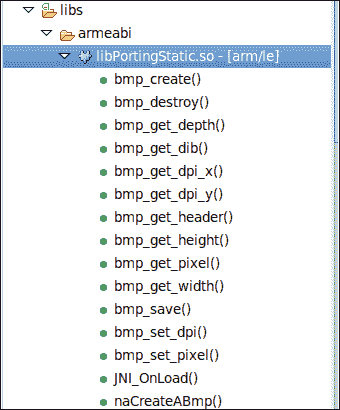
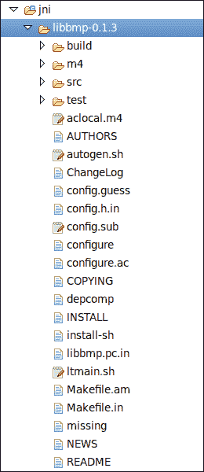
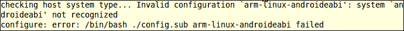
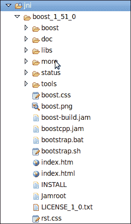
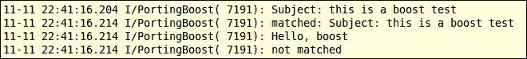

# 第八章：使用 Android NDK 移植和使用现有库

在本章中，我们将介绍以下食谱：

+   使用 Android NDK 构建系统将库作为共享库模块移植

+   使用 Android NDK 构建系统将库作为静态库模块移植

+   使用 Android NDK 工具链移植使用现有构建系统的库

+   将库作为预构建库使用

+   在多个项目中使用 import-module 引入库

+   移植需要 RTTI、异常和 STL 支持的库

# 引言

对于桌面计算领域有许多 C/C++库。如果我们能在 Android 平台上重用它们，这些库可以为我们节省大量的努力。Android NDK 使这成为可能。在本章中，我们将讨论如何使用 NDK 将现有库移植到 Android。

我们将首先介绍如何使用 Android NDK 构建系统构建库。我们可以将库构建为静态库模块或共享库模块。本章将讨论这两种方式的区别。

我们还可以将 Android NDK 工具链作为独立的交叉编译器使用，这将在下一节介绍。然后，我们将描述如何使用编译后的库作为预构建模块。

我们经常在多个 Android 项目中使用同一个库。我们可以使用 **import-module** 功能将相同的库模块链接到多个项目，同时保持库的单个副本。

许多 C++库需要 STL、C++异常和**运行时类型信息**（**RTTI**）的支持，这些在 Android 默认的 C++运行时库中是不可用的。我们将通过使用流行的 `boost` 库作为示例，说明如何启用这些支持。

# 使用 Android NDK 构建系统将库作为共享库模块移植

本食谱将讨论如何使用 Android NDK 构建系统将现有库作为一个共享库进行移植。我们将以开源的 `libbmp` 库为例。

## 准备工作

建议读者在阅读本节之前先阅读第三章中的*在命令行构建 Android NDK 应用程序*食谱，*构建和调试 NDK 应用程序*。

## 如何操作...

以下步骤描述了如何创建我们的示例 Android 项目，演示如何将 libbmp 库作为共享库进行移植：

1.  创建一个名为 `PortingShared` 的 Android 应用程序，并具有本地支持。将包名设置为 `cookbook.chapter8.portingshared`。如果你需要更详细的说明，请参考第二章中的*加载本地库和注册本地方法*食谱，*Java Native Interface*。

1.  在 `cookbook.chapter8.portingshared` 包下添加一个 Java 文件 `MainActivity.java`。这个 Java 文件简单加载共享库 `.bmp` 和 `PortingShared`，并调用本地方法 `naCreateABmp`。

1.  从[`code.google.com/p/libbmp/downloads/list`](http://code.google.com/p/libbmp/downloads/list)下载`libbmp`库，并解压存档文件。在`jni`文件夹下创建一个名为`libbmp`的文件夹，并将提取的文件夹中的`src/bmpfile.c`和`src/bmpfile.h`文件复制到`libbmp`文件夹。

1.  如果您使用的是 NDK r8 及以下版本，请从`bmpfile.h`中删除以下代码：

    ```kt
    #ifndef uint8_t
    typedef unsigned char uint8_t;
    #endif
    #ifndef uint16_t
    typedef unsigned short uint16_t;
    #endif
    #ifndef uint32_t
    typedef unsigned int uint32_t;
    #endif
    ```

1.  然后，添加以下代码行：

    ```kt
    #include <stdint.h>
    ```

    ### 注意

    对`bmpfile.h`的代码更改仅适用于 Android NDK r8 及以下版本。编译库将返回错误`"error: redefinition of typedef 'uint8_t'"`。这是 NDK 构建系统中的一个错误，因为`uint8_t`的定义被`#ifndef`预处理指令包围。从 NDK r8b 开始，这个问题已被修复，如果我们使用 r8b 及以上版本，则无需更改代码。

1.  在`libbmp`文件夹下创建一个`Android.mk`文件，以将`libbmp`编译为共享库`libbmp.so`。此`Android.mk`文件的内容如下：

    ```kt
    LOCAL_PATH := $(call my-dir)
    include $(CLEAR_VARS)
    LOCAL_MODULE    := libbmp
    LOCAL_SRC_FILES := bmpfile.c
    include $(BUILD_SHARED_LIBRARY)
    ```

1.  在`jni`文件夹下创建另一个名为`libbmptest`的文件夹。在其下添加`mylog.h`和`PortingShared.c`文件。`PortingShared.c`实现了本地方法`naCreateABmp`，该方法使用`libbmp`库中定义的函数来创建位图图像并将其保存到`/sdcard/test_shared.bmp`。如果您的设备上没有`/sdcard`目录，您需要更改目录：

    ```kt
    void naCreateABmp(JNIEnv* env, jclass clazz, jint width, jint height, jint depth) {
      bmpfile_t *bmp;
      int i, j;
      rgb_pixel_t pixel = {128, 64, 0, 0};
      for (i = 10, j = 10; j < height; ++i, ++j) {
        bmp_set_pixel(bmp, i, j, pixel);
        pixel.red++;
        pixel.green++;
        pixel.blue++;
        bmp_set_pixel(bmp, i + 1, j, pixel);
        bmp_set_pixel(bmp, i, j + 1, pixel);
      }
      bmp_save(bmp, "/sdcard/test_shared.bmp");
      bmp_destroy(bmp);
    }
    ```

1.  在`libbmptest`文件夹下创建另一个`Android.mk`文件，以将`PortingShared.c`文件编译为另一个共享库`libPortingShared.so`。此`Android.mk`文件的内容如下：

    ```kt
    LOCAL_PATH := $(call my-dir)
    include $(CLEAR_VARS)
    LOCAL_MODULE    := PortingShared
    LOCAL_C_INCLUDES := $(LOCAL_PATH)/../libbmp/
    LOCAL_SRC_FILES := PortingShared.c
    LOCAL_SHARED_LIBRARIES := libbmp
    LOCAL_LDLIBS := -llog
    include $(BUILD_SHARED_LIBRARY)
    ```

1.  在`jni`文件夹下创建一个`Android.mk`文件，内容如下：

    ```kt
    LOCAL_PATH := $(call my-dir)
    include $(call all-subdir-makefiles)
    ```

1.  向`AndroidManifest.xml`文件添加`WRITE_EXTERNAL_STORAGE`权限，如下所示：

    ```kt
    <uses-permission android:name="android.permission.WRITE_EXTERNAL_STORAGE"/>
    ```

1.  构建并运行 Android 项目。在 Android 设备的`sdcard`文件夹中应创建一个位图文件`test_shared.bmp`。我们可以使用以下命令获取该文件：

    ```kt
    $ adb pull /sdcard/test_shared.bmp .
    ```

    以下是`.bmp`文件：

    

## 工作原理...

示例项目演示了如何将`libbmp`代码作为共享库进行移植并在本地代码`PortingShared.c`中使用。

**共享库**：共享库可以被多个可执行文件和库共享。Android 本地代码通常被编译为共享库并由 Java 代码加载。实际上，Android 构建系统只将共享库打包到应用程序的`apk`文件中。因此，我们必须至少提供一个共享库来包含我们的本地代码。

### 注意

我们仍然可以使用静态库来生成共享库，正如我们将在*将库作为静态库模块与 Android NDK 构建系统*的配方中看到的那样。

我们的示例项目构建了两个共享库，分别是`libbmp.so`和`libPortingShared.so`。我们可以在项目的`libs`文件夹下找到这些库。`libPortingShared.so`依赖于`libbmp.so`，因为`PortingShared.c`调用了`libbmp`库中定义的函数。

在我们的 Java 文件中，我们需要在`libPortingShared.so`之前加载`libbmp.so`，如下所示：

```kt
static {
       System.loadLibrary("bmp");
         System.loadLibrary("PortingShared");
}
```

**理解 Android.mk 文件**：Android NDK 提供了一个易于使用的构建系统，使我们免于编写 makefile。然而，我们仍然需要通过`Android.mk`和`Application.mk`向系统提供一些基本输入。本节仅讨论`Android.mk`。

`Android.mk`文件是一个 GNU makefile 片段，它向 Android 构建系统描述源文件。源文件被分组到模块中。每个模块都是一个静态或共享库。Android NDK 提供了一些预定义的变量和宏。这里，我们将简要介绍本节中使用的那些。我们将在后续的菜谱中介绍更多预定义的变量和宏，你也可以参考 Android NDK 的`docs/ANDROID-MK.html`获取更多信息。

+   `CLEAR_VARS`：此变量指向一个脚本，它取消定义几乎所有模块描述变量，除了`LOCAL_PATH`。我们必须在每个新模块之前包含它，如下所示：

    ```kt
    include $(CLEAR_VARS)
    ```

+   `BUILD_SHARED_LIBRARY`：此变量指向一个构建脚本，它根据模块描述确定如何从列出的源构建共享库。包含此变量时，我们必须定义`LOCAL_MODULE`和`LOCAL_SRC_FILES`，如下所示：

    ```kt
    include $(BUILD_SHARED_LIBRARY)
    ```

    包含它将生成共享库`lib$(LOCAL_MODULE).so`。

+   `my-dir`：必须使用`$(call <macro>)`来评估它。`my-dir`宏返回最后一个包含的 makefile 的路径，这通常是包含当前`Android.mk`文件的目录。它通常用于定义`LOCAL_PATH`，如下所示：

    ```kt
    LOCAL_PATH := $(call my-dir)
    ```

+   `all-subdir-makefiles`：此宏返回当前`my-dir`路径下所有子目录中的`Android.mk`文件列表。在我们的示例中，我们在`jni`目录下的`Android.mk`文件中使用了这个宏，如下所示：

    ```kt
    include $(call all-subdir-makefiles)
    ```

    这将包含`libbmp`和`libbmptest`目录下的两个`Android.mk`文件。

+   `LOCAL_PATH`：这是一个模块描述变量，用于定位源文件的路径。它通常与`my-dir`宏一起使用，如下所示：

    ```kt
    LOCAL_PATH := $(call my-dir)
    ```

+   `LOCAL_MODULE`：这是一个模块描述变量，用于定义我们模块的名称。请注意，它必须在所有模块名称中唯一，并且不能包含任何空格。

+   `LOCAL_SRC_FILES`：这是一个模块描述变量，用于列出构建模块时使用的源文件。注意，这些源文件应该是相对于`LOCAL_PATH`的路径。

+   `LOCAL_C_INCLUDES`：这是一个可选的模块描述变量，它提供将附加到编译时包含搜索路径的路径列表。这些路径应该是相对于 NDK 根目录的。在我们的示例项目的`libbmptest`文件夹下的`Android.mk`中，我们使用这个变量如下：

    ```kt
    LOCAL_C_INCLUDES := $(LOCAL_PATH)/../libbmp/
    ```

+   `LOCAL_SHARED_LIBRARIES`：这是一个可选的模块描述变量，提供当前模块依赖的共享库列表。在`libbmptest`文件夹下的`Android.mk`中，我们使用这个变量来包含`libbmp.so`共享库：

    ```kt
    LOCAL_SHARED_LIBRARIES := libbmp
    ```

+   `LOCAL_LDLIBS`：这是一个可选的模块描述变量，提供链接器标志列表。它用于传递带有`-l`前缀的系统库。在我们的示例项目中，我们使用它来链接系统日志库：

    ```kt
    LOCAL_LDLIBS := -llog
    ```

有了前面的描述，现在可以很容易地理解我们示例项目中使用的三个`Android.mk`文件。`jni`下的`Android.mk`简单地包含了另外两个`Android.mk`文件。`libbmp`文件夹下的`Android.mk`将`libbmp`源代码编译为共享库`libbmp.so`，而`libbmptest`文件夹下的`Android.mk`将`PortingShared.c`编译为依赖于`libbmp.so`库的`libPortingShared.so`共享库。

## 另请参阅

可以在本地代码中使用共享库，正如我们在第六章的*使用 Android NDK 动态链接库进行编程*食谱中演示的那样，*其他 Android NDK API*。

# 使用 Android NDK 构建系统将库作为静态库模块移植

前一个食谱讨论了如何将库作为共享库模块移植，以`libbmp`库为例。在本食谱中，我们将展示如何将`libbmp`库作为静态库移植。

## 准备就绪

建议读者在阅读本食谱之前，先阅读第三章的*在命令行构建 Android NDK 应用程序*食谱，*构建和调试 NDK 应用程序*。

## 如何操作...

以下步骤描述了如何创建我们的示例 Android 项目，演示如何将`libbmp`库作为静态库移植：

1.  创建一个名为`PortingStatic`的具有本地支持的 Android 应用程序。将包名设置为`cookbook.chapter8.portingstatic`。如果你需要更详细的说明，请参考第二章的*加载本地库和注册本地方法*食谱，*Java Native Interface*。

1.  在`cookbook.chapter8.portingstatic`包下添加一个 Java 文件`MainActivity.java`。这个 Java 文件简单地加载共享库`PortingStatic`，并调用本地方法`naCreateABmp`。

1.  按照第 3 步的*使用 Android NDK 构建系统将库作为共享库模块移植*食谱下载`libbmp`库并进行修改。

1.  在`libbmp`文件夹下创建一个`Android.mk`文件，以编译`libbmp`为静态库`libbmp.a`。这个`Android.mk`文件的内容如下：

    ```kt
    LOCAL_PATH := $(call my-dir)
    include $(CLEAR_VARS)
    LOCAL_MODULE    := libbmp
    LOCAL_SRC_FILES := bmpfile.c
    include $(BUILD_STATIC_LIBRARY)
    ```

1.  在`jni`文件夹下创建另一个文件夹`libbmptest`。向其中添加`mylog.h`和`PortingStatic.c`文件。注意，它的代码与之前章节中的`naCreateABmp`方法相同，只是`.bmp`文件名从`test_shared.bmp`更改为`test_static.bmp`。

1.  在`libbmptest`文件夹下创建另一个`Android.mk`文件，以编译`PortingStatic.c`文件作为共享库`libPortingStatic.so`。这个`Android.mk`文件的内容如下：

    ```kt
    LOCAL_PATH := $(call my-dir
    include $(CLEAR_VARS)
    LOCAL_MODULE    := PortingStatic
    LOCAL_C_INCLUDES := $(LOCAL_PATH)/../libbmp/
    LOCAL_SRC_FILES := PortingStatic.c
    LOCAL_STATIC_LIBRARIES := libbmp
    LOCAL_LDLIBS := -llog
    include $(BUILD_SHARED_LIBRARY)
    ```

1.  在`jni`文件夹下创建一个`Android.mk`文件，内容如下：

    ```kt
    LOCAL_PATH := $(call my-dir)
    include $(call all-subdir-makefiles)
    ```

1.  向`AndroidManifest.xml`文件添加`WRITE_EXTERNAL_STORAGE`权限，如下所示：

    ```kt
    <uses-permission android:name="android.permission.WRITE_EXTERNAL_STORAGE"/>
    ```

1.  构建并运行 Android 项目。应该在 Android 设备的`sdcard`文件夹中创建位图文件`test_static.bmp`。我们可以使用以下命令获取该文件：

    ```kt
    $ adb pull /sdcard/test_static.bmp .
    ```

    这个文件与上一个食谱中使用的`test_static.bmp`文件相同。

## 工作原理...

在示例项目中，我们将`libbmp`构建为静态库`libbmp.a`，可以在`obj/local/armeabi/`文件夹下找到。我们在本地代码`PortingStatic.c`中调用了在`libbmp`中定义的函数。

**静态库**仅仅是从源代码编译的对象文件的归档。在 Android NDK 中，它们被构建为以"`.a`"后缀结尾的文件。静态库在构建时由编译器或链接器复制到目标可执行文件或库中。在 Android NDK 中，静态库仅用于构建共享库，因为只有共享库会被打包到`apk`文件中以便部署。

我们的示例项目构建了一个静态库`libbmp.a`和一个共享库`libPortingStatic.so`。`libPortingStatic.so`共享库位于`libs/armeabi`文件夹下，将被复制到应用程序的`apk`文件中。`libbmp.a`库用于构建`libPortingStatic.so`共享库。如果你使用 Eclipse 项目资源管理器检查`libPortingStatic.so`库的符号，你会发现`libbmp`中定义的函数的符号被包含在内。以下截图展示了这一点：



函数`bmp_create`、`bmp_destroy`等在`libbmp`中定义，并包含在共享库`libPortingStatic.so`中。

在我们的 Java 代码中，我们需要使用以下代码加载共享库：

```kt
static {
       System.loadLibrary("PortingStatic");
}
```

**理解 Android.mk 文件**：上一个食谱已经描述了在这三个`Android.mk`文件中使用的预定义变量和宏的大部分内容。因此，我们只涉及那些在上一个食谱中没有看到的内容：

+   `BUILD_STATIC_LIBRARY`：该变量指向一个构建脚本，该脚本将收集模块的信息并确定如何从源代码构建静态库。通常在另一个模块的`LOCAL_STATIC_LIBRARIES`中列出构建的模块。这个变量通常在`Android.mk`中如下包含：

    ```kt
    include $(BUILD_STATIC_LIBRARY)
    ```

    在我们的示例项目中，我们在`jni/libbmp`文件夹下的`Android.mk`文件中包含了这个变量。

+   `LOCAL_STATIC_LIBRARIES`：这是一个模块描述变量，它提供当前模块应链接到的静态库列表。它只在共享库模块中有意义。

    在我们的项目中，我们使用这个变量链接到`libbmp.a`静态库，如`jni/libbmptest/`文件夹下的`Android.mk`文件所示。

    ```kt
    LOCAL_STATIC_LIBRARIES := libbmp
    ```

+   `LOCAL_WHOLE_STATIC_LIBRARIES`：这是`LOCAL_STATIC_LIBRARIES`变量的一个变体。它指示列出的静态库应该作为完整的归档链接。这将强制将静态库中的所有对象文件添加到当前的共享库模块中。

**静态库与共享库**：现在你已经了解了如何将现有库作为静态库或共享库移植，你可能会问哪个更好。答案可能如你所料，取决于我们的需求。

当你移植一个大型库，并且只使用了库提供的一小部分功能时，静态库是一个好的选择。Android NDK 构建系统可以在构建时解决依赖关系，并且只将最终共享库中使用的那部分复制。这意味着库的大小更小，相应的`apk`文件大小也更小。

### 注意事项

有时，我们需要强制将整个静态库构建到最终的共享库中（例如，几个静态库之间存在循环依赖）。我们可以在`Android.mk`中使用`LOCAL_WHOLE_STATIC_LIBRARIES`变量或"`--whole-archive`"链接器标志。

当你需要移植一个将被多个 Android 应用使用的库时，共享库是一个更好的选择。假设你想要构建两个 Android 应用，一个是视频播放器，一个是视频编辑器。这两个应用都需要一个第三方`codec`库，你可以使用 NDK 将其移植到 Android 上。在这种情况下，你可以将库作为一个共享库单独放在一个`apk`文件中（例如，MX Player 将`codecs`库放在单独的`apk`文件中），这样两个应用可以在运行时加载同一个库。这意味着用户只需下载一次库就可以使用这两个应用。

另一个可能需要共享库的情况是，一个库`L`被多个共享库使用。如果`L`是一个静态库，每个共享库将包含其代码的副本，并因代码重复（例如，重复的全局变量）而造成问题。

## 另请参阅

实际上，我们之前使用 Android NDK 构建系统将一个库作为静态库移植过。回想一下我们在第五章的*在 Android NDK 上管理资产*菜谱中，如何将`libpng`作为静态库移植的。

# 使用 Android NDK 工具链移植带有现有构建系统的库

前两个食谱讨论了如何使用 Android NDK 构建系统移植库。然而，许多开源项目都有自己的构建系统，有时在`Android.mk`文件中列出所有源文件会很麻烦。幸运的是，Android NDK 工具链也可以作为一个独立的交叉编译器使用，我们可以将交叉编译器用在开源项目的现有构建系统中。这个食谱将讨论如何使用现有的构建系统移植库。

## 如何操作...

以下步骤描述了如何创建我们的示例项目，该项目展示了如何使用现有的构建系统移植开源`libbmp`库：

1.  创建一个名为 PortingWithBuildSystem 的 Android 应用程序，并支持本地原生代码。将包名设置为`cookbook.chapter8.portingwithbuildsystem`。如果你需要更详细的说明，请参考第二章的*加载本地库和注册本地方法*食谱，*Java Native Interface*。

1.  在`cookbook.chapter8.portingwithbuildsystem`包下添加一个 Java 文件`MainActivity.java`。这个 Java 文件简单地加载共享库`PortingWithBuildSystem`，并调用本地方法`naCreateABmp`。

1.  从[`code.google.com/p/libbmp/downloads/list`](http://code.google.com/p/libbmp/downloads/list)下载`libbmp`库，并将归档文件解压到`jni`文件夹。这将在`jni`文件夹下创建一个`libbmp-0.1.3`文件夹，内容如下：

1.  按照食谱*将库作为共享库模块与 Android NDK 构建系统一起移植*的第 3 步，更新`src/bmpfile.h`。

1.  在`libbmp-0.1.3`文件夹下添加一个 bash shell 脚本文件`build_android.sh`，内容如下：

    ```kt
    #!/bin/bash
    NDK=<path to Android ndk folder>/android-ndk-r8b
    SYSROOT=$NDK/platforms/android-8/arch-arm/
    CFLAGS="-mthumb"
    LDFLAGS="-Wl,--fix-cortex-a8"
    export CC="$NDK/toolchains/arm-linux-androideabi-4.4.3/prebuilt/linux-x86/bin/arm-linux-androideabi-gcc --sysroot=$SYSROOT"
    ./configure \
       --host=arm-linux-androideabi \
       --disable-shared \
       --prefix=$(pwd) \
       --exec-prefix=$(pwd) 
    make clean
    make 
    make install
    ```

1.  使用以下命令为`build_android.sh`文件添加执行权限：

    ```kt
    $ sudo chmod +x build_android.sh
    ```

1.  在命令行终端，转到`libbmp-0.1.3`目录，输入以下命令来构建库：

    ```kt
    $ ./build_android.sh
    ```

    构建将会因为以下错误而失败：

    

    这是因为`libbmp-0.1.3`文件夹下的`config.guess`和`config.sub`脚本过时了（这两个文件的第一行表明时间戳是`2009-08-19`）。我们需要时间戳为`2010-05-20`或之后的脚本副本。可以在[`gcc.gnu.org/svn/gcc/branches/cilkplus/config.guess`](http://gcc.gnu.org/svn/gcc/branches/cilkplus/config.guess)找到`config.guess`脚本，在[`gcc.gnu.org/svn/gcc/branches/cilkplus/config.sub`](http://gcc.gnu.org/svn/gcc/branches/cilkplus/config.sub)找到`config.sub`脚本。

1.  再次尝试执行`build_android.sh`脚本。这次它成功完成了。我们应当在`jni/libbmp-0.1.3/lib`文件夹下找到`libbmp.a`静态库，在`jni/libbmp-0.1.3/include`文件夹下找到`bmpfile.h`。

## 工作原理...

许多现有的开源库可以通过 shell 命令"`./configure; make; make install`"来构建。在我们的示例项目中，我们编写了一个`build_android.sh`脚本来使用 Android NDK 交叉编译器执行这三个步骤。

以下是我们使用 Android NDK 交叉编译器移植库时应该考虑的事项列表：

1.  **选择合适的工具链**：根据我们目标设备（ARM、x86 或 MIPS）的 CPU 架构，你需要选择相应的工具链。以下工具链可在 Android NDK r8d 的`toolchains`文件夹下找到：

    +   **对于基于 ARM 的设备**：`arm-linux-androideabi-4.4.3`，`arm-linux-androideabi-4.6`，`arm-linux-androideabi-4.7`，以及`arm-linux-androideabi-clang3.1`

    +   **对于基于 MIPS 的设备**：`mipsel-linux-android-4.4.3`，`mipsel-linux-android-4.6`，`mipsel-linux-android-4.7`，以及`mipsel-linux-android-clang3.1`

    +   **对于基于 x86 的设备**：`x86-4.4.3`，`x86-4.6`，`x86-4.7`，以及`x86-clang3.1`

1.  **选择 sysroot**：根据我们想要针对的 Android 原生 API 级别和 CPU 架构，你需要选择合适的 sysroot。编译器在编译时会查找`sysroot`目录下的头文件和库。

    `sysroot`的路径遵循以下格式：

    ```kt
    $NDK/platforms/android-<level>/arch-<arch>/
    ```

    `$NDK`指的是 Android NDK 的根目录，`<level>`指的是 Android API 级别，`<arch>`表示 CPU 架构。在你的`build_android.sh`脚本中，`SYSROOT`定义如下： 

    ```kt
    SYSROOT=$NDK/platforms/android-8/arch-arm/
    ```

1.  **指定交叉编译器**：库现有的构建系统通常有一种方法让我们指定交叉编译器。这通常是通过配置选项或环境变量来实现的。

    在`libbmp`中，我们可以输入"`./configure --help`"命令来了解如何设置编译器。`compiler`命令是通过环境变量`CC`指定的，而环境变量`CFLAGS`和`LDFLAGS`用于指定编译器标志和链接器标志。在你的`build_android.sh`脚本中，这三个环境变量如下设置：

    ```kt
    export CFLAGS="-mthumb"
    export LDFLAGS="-Wl,--fix-cortex-a8"
    export CC="$NDK/toolchains/arm-linux-androideabi-4.4.3/prebuilt/linux-x86/bin/arm-linux-androideabi-gcc --sysroot=$SYSROOT"
    ```

    ### 注意

    "`-mthumb`"编译器标志表示你将使用 thumb 指令集而不是 ARM 指令集。"`-wl, --fix-cortex-a8`"链接器标志是为了绕过某些 Cortex-A8 实现中的 CPU 错误。

1.  **指定头文件和库二进制文件的输出位置**：你通常希望将库放在`jni/<library folder>/`下。

    在`libbmp`的情况下，库二进制文件安装在`PREFIX/lib`文件夹下，头文件安装在`EPREFIX/include`文件夹下。因此，我们通过向配置脚本传递以下选项，将`PREFIX`和`EPREFIX`设置为`jni/libbmp-0.1.3`：

    ```kt
    --prefix=$(pwd) \
    --exec-prefix=$(pwd)
    ```

1.  **构建并安装库**：你可以简单地执行"`make; make install;`"来构建和安装库。

## 还有更多...

在你的`build_android.sh`脚本中，我们已经禁用了共享库。如果你删除了这行"`--disable-shared \`"，构建将在`jni/libbmp-0.1.3/lib/`文件夹下生成共享库（`libbmp.so`）和静态库（`libbmp.a`）。

在你的示例项目中，我们直接使用了 NDK 工具链。这种方法有一个严重的限制，即你不能使用任何 C++ STL 函数，且 C++异常和 RTTI 不支持。实际上，Android NDK 允许你使用脚本`$NDK/build/tools/make-standalone-toolchain.sh`创建一个自定义的工具链安装。假设你的目标是 Android API 级别 8；你可以使用以下命令在`/tmp/my-android-toolchain`文件夹中安装工具链。

```kt
$ANDROID_NDK/build/tools/make-standalone-toolchain.sh --platform=android-8 --install-dir=/tmp/my-android-toolchain
```

你可以使用以下命令来使用这个工具链：

```kt
export PATH=/tmp/my-android-toolchain/bin:$PATH
export CC=arm-linux-androideabi-gcc
```

请注意，安装的工具链将在`/tmp/my-android-toolchain/arm-linux-androideabi/lib/`文件夹下拥有几个库（`libgnustl_shared.so`、`libstdc++.a`和`libsupc++.a`）。你可以链接这些库以启用异常、RTTI 和 STL 函数支持。我们将在*需要 RTTI 的库移植*配方中进一步讨论异常和 STL 支持。

有关将 Android 工具链作为独立编译器使用的更多信息，请参见 Android NDK 中的`docs/STANDALONE-TOOLCHAIN.html`。

# 将库作为预构建库使用

上一个配方描述了如何使用自己的构建系统构建现有库。我们获得了开源`libbmp`库的编译静态库`libbmp.a`。这个配方将讨论如何使用预构建库。

## 如何操作...

以下步骤构建了一个使用预构建库的 Android NDK 应用程序。请注意，示例项目基于我们之前配方的操作。如果你还没有完成之前的配方，现在应该去做。

1.  打开你在之前配方中创建的`PortingWithBuildSystem`项目。在`cookbook.chapter8.portingwithbuildsystem`包下添加一个 Java 文件`MainActivity.java`。这个 Java 文件只是加载共享库`PortingWithBuildSystem`，并调用本地方法`naCreateABmp`。

1.  在此目录下添加`mylog.h`和`PortingWithBuildSystem.c`文件。`PortingWithBuildSystem.c`实现了本地方法`naCreateABmp`。

1.  在`jni`文件夹下创建一个`Android.mk`文件，以编译`PortingWithBuildSystem.c`作为共享库`libPortingWithBuildSystem.so`。此`Android.mk`文件的内容如下：

    ```kt
    LOCAL_PATH := $(call my-dir)
    include $(CLEAR_VARS)
    LOCAL_MODULE := libbmp-prebuilt
    LOCAL_SRC_FILES := libbmp-0.1.3/lib/libbmp.a
    LOCAL_EXPORT_C_INCLUDES := $(LOCAL_PATH)/libbmp-0.1.3/include/
    include $(PREBUILT_STATIC_LIBRARY)
    include $(CLEAR_VARS)
    LOCAL_MODULE    := PortingWithBuildSystem
    LOCAL_SRC_FILES := PortingWithBuildSystem.c
    LOCAL_STATIC_LIBRARIES := libbmp-prebuilt
    LOCAL_LDLIBS := -llog
    include $(BUILD_SHARED_LIBRARY)
    ```

1.  在`AndroidManifest.xml`文件中添加`WRITE_EXTERNAL_STORAGE`权限，如下所示：

    ```kt
    <uses-permission android:name="android.permission.WRITE_EXTERNAL_STORAGE"/>
    ```

1.  构建并运行 Android 项目。应该在 Android 设备的`sdcard`文件夹中创建位图文件`test_bs_static.bmp`。我们可以使用以下命令来获取该文件：

    ```kt
    $ adb pull /sdcard/test_bs_static.bmp .
    ```

    该文件与本章中*将库作为共享库模块与 Android NDK 构建系统*的配方中显示的`test_static.bmp`文件相同。

## 它的工作原理...

预构建库有两种常见用例：

+   你想使用第三方开发者的库，而只提供了库的二进制文件

+   你已经构建了一个库，并希望在不重新编译的情况下使用该库

你的示例项目属于第二种情况。让我们看看在 Android NDK 中使用预构建库时需要考虑的事项：

1.  **声明一个预构建库模块**：在 Android NDK 中，构建模块可以是静态库或共享库。你已经看到了如何用源代码声明一个模块。当模块基于预构建的库时，声明方式类似。

    i. **声明模块名称**：这是通过`LOCAL_MODULE`模块描述变量完成的。在你的示例项目中，使用以下行定义模块名称：

    ```kt
    	LOCAL_MODULE := libbmp-prebuilt
    ```

    ii. **列出预构建库的源代码**：你需要将预构建库的路径提供给`LOCAL_SRC_FILES`变量。注意，该路径是相对于`LOCAL_PATH`的。在你的示例项目中，以下列方式列出`libbmp.a`静态库的路径：

    ```kt
    	LOCAL_SRC_FILES := libbmp-0.1.3/lib/libbmp.a
    ```

    iii. **导出库头文件**：这是通过`LOCAL_EXPORT_C_INCLUDES`模块描述变量完成的。该变量确保任何依赖预构建库模块的模块都会自动将库头文件的路径追加到`LOCAL_C_INCLUDES`中。注意，这一步是可选的，因为我们可以显式地将库头文件的路径添加到任何依赖预构建库模块的模块中。然而，最好是将头文件导出，而不是将路径添加到每个依赖预构建库模块的模块中。

    在你的示例项目中，通过在`Android.mk`文件中添加以下行来导出库头文件：

    ```kt
    LOCAL_EXPORT_C_INCLUDES := $(LOCAL_PATH)/libbmp-0.1.3/include/
    ```

    iv. **导出编译器和/或链接器标志**：这可以通过`LOCAL_EXPORT_CFLAGS`、`LOCAL_EXPORT_CPPFLAGS`和`LOCAL_EXPORT_LDLIBS`来完成。这一步也是可选的，我们在你的示例项目中不会使用它们。你可以参考 Android NDK 中的`docs/ANDROID-MK.html`获取关于这些模块描述变量的更详细信息。

    v. **声明构建类型**：对于共享预构建库，你需要包含`PREBUILT_SHARED_LIBRARY`，对于静态预构建库，需要包含`PREBUILT_STATIC_LIBRARY`。在你的示例项目中，使用以下行来声明你想要构建一个预构建的静态库模块： 

    ```kt
    	include $(PREBUILT_STATIC_LIBRARY) 
    ```

1.  **使用预构建的库模块**：一旦你有了预构建的库模块，你只需在任何依赖该预构建库的模块的`LOCAL_STATIC_LIBRARIES`或`LOCAL_SHARED_LIBRARIES`声明中列出模块名称即可。这在你的示例项目的`Android.mk`文件中有展示：

    ```kt
    LOCAL_STATIC_LIBRARIES := libbmp-prebuilt
    ```

1.  **用于调试的预构建库**：Android NDK 建议你提供包含调试符号的预构建库二进制文件，以便使用`ndk-gdb`进行调试。当你将库打包进`apk`文件时，将使用 Android NDK 创建的剥离版本（位于项目的`libs/<abi>/`文件夹中）。

    ### 提示

    我们不讨论如何生成库的调试版本，因为这取决于库是如何构建的。通常，库的文档将包含如何生成调试构建的说明。如果您直接使用 GCC 构建库，那么您可以参考[`gcc.gnu.org/onlinedocs/gcc/Debugging-Options.html`](http://gcc.gnu.org/onlinedocs/gcc/Debugging-Options.html)了解各种调试选项。

# 使用 import-module 在多个项目中使用库

您可能经常需要在多个项目中使用同一个库。您可以将库放入每个项目的`jni`文件夹中并分别构建它们。然而，维护同一库的多个副本是件麻烦事。例如，当库有新版本发布，您想要更新库时，您将不得不更新每个库副本。

幸运的是，Android NDK 提供了一个功能，允许我们在 NDK 项目的主源代码树之外维护一个库模块，并通过在`Android.mk`文件中使用简单的命令导入该模块。让我们讨论一下如何在此配方中导入一个模块。

## 如何操作...

以下步骤描述了如何在项目的`jni`文件夹之外声明和导入一个模块：

1.  创建一个名为`ImportModule`的具有本地支持的 Android 应用程序。将包名设置为`cookbook.chapter8.importmodule`。请参考第二章，*Java Native Interface*中的*加载本地库和注册本地方法*的配方，以获取更详细的说明。

1.  在`cookbook.chapter8.importmodule`包下添加一个 Java 文件`MainActivity.java`。这个 Java 文件仅加载共享库`ImportModule`，并调用本地方法`naCreateABmp`。

1.  从[`code.google.com/p/libbmp/downloads/list`](http://code.google.com/p/libbmp/downloads/list)下载`libbmp`库并提取归档文件。在项目下创建一个名为`modules`的文件夹，并在`modules`文件夹下创建一个`libbmp-0.1.3`文件夹。将提取的文件夹中的`src/bmpfile.c`和`src/bmpfile.h`文件复制到`libbmp-0.1.3`文件夹。

1.  按照第 3 步*使用 Android NDK 构建系统将库作为共享库模块移植*的配方更新`src/bmpfile.h`。

1.  在`libbmp-0.1.3`文件夹下创建一个`Android.mk`文件，以编译静态库`libbmp.a`的`libbmp`。这个`Android.mk`文件的内容如下：

    ```kt
    LOCAL_PATH := $(call my-dir)
    include $(CLEAR_VARS)
    LOCAL_MODULE := libbmp
    LOCAL_SRC_FILES := bmpfile.c
    LOCAL_EXPORT_C_INCLUDES := $(LOCAL_PATH)
    include $(BUILD_STATIC_LIBRARY)
    ```

1.  向其添加`mylog.h`和`ImportModule.c`文件。`ImportModule.c`实现了本地方法`naCreateABmp`。

1.  在`jni`文件夹下创建一个`Android.mk`文件，以编译共享库`libImportModule.so`的`ImportModule.c`。这个`Android.mk`文件的内容如下：

    ```kt
    LOCAL_PATH := $(call my-dir)
    include $(CLEAR_VARS)
    LOCAL_MODULE    := ImportModule
    LOCAL_SRC_FILES := ImportModule.c
    LOCAL_LDLIBS := -llog
    LOCAL_STATIC_LIBRARIES := libbmp
    include $(BUILD_SHARED_LIBRARY)
    $(call import-add-path,$(LOCAL_PATH)/../modules)
    $(call import-module,libbmp-0.1.3)
    ```

1.  向`AndroidManifest.xml`文件添加`WRITE_EXTERNAL_STORAGE`权限，如下所示：

    ```kt
    <uses-permission android:name="android.permission.WRITE_EXTERNAL_STORAGE"/>
    ```

1.  构建并运行 Android 项目。应该在 Android 设备的`sdcard`文件夹中创建一个位图文件`test_bs_static.bmp`。您可以使用以下命令获取该文件：

    ```kt
    $ adb pull /sdcard/test_im.bmp .
    ```

    该文件与本章中的*使用 Android NDK 构建系统将库作为共享库模块移植*的配方中显示的`test_static.bmp`相同。

## 它的工作原理...

在您的示例项目中，您在项目的`jni`文件夹外部创建了一个模块，然后导入该模块以构建共享库`libImportModule.so`。在声明和导入模块时，应执行以下步骤：

1.  **声明导入模块**：声明导入模块时没有什么特别的。由于导入模块通常被多个 NDK 项目使用，因此在声明导入模块时，导出头文件（使用`LOCAL_EXPORT_C_INCLUDES`）、编译器标志（`LOCAL_EXPORT_CFLAGS`或`LOCAL_EXPORT_CPPFLAGS`）和链接器标志（`LOCAL_EXPORT_LDLIBS`）是一个好习惯。

    在我们的示例项目中，您声明了一个导入的静态库模块`libbmp`。

1.  **决定放置导入模块的位置**：Android NDK 构建系统将在`NDK_MODULE_PATH`中定义的路径中搜索导入模块。默认情况下，Android NDK 目录的`sources`文件夹会添加到`NDK_MODULE_PATH`中。因此，您只需将导入模块文件夹放在`sources`文件夹下，Android NDK 构建系统就能找到它。

    或者，您可以将导入模块文件夹放在任何地方，并将路径追加到`NDK_MODULE_PATH`。在我们的示例项目中，将导入的`libbmp`模块放在`modules`文件夹中。

1.  **追加导入路径**：当将导入模块文件夹放置在 Android NDK 的`sources`目录下时，这不需要。否则，您需要通过向`NDK_MODULE_PATH`追加路径来告诉 Android NDK 构建系统导入模块的位置。`import-add-path`宏由 NDK 提供，以帮助您追加路径。

    在您的示例项目中，您通过在`jni/Android.mk`中的以下这行代码将`modules`文件夹追加到`NDK_MODULE_PATH`：

    ```kt
    $(call import-add-path,$(LOCAL_PATH)/../modules)
    ```

1.  **导入模块**：Android NDK 提供了一个`import-module`宏来导入一个模块。这个宏接受一个相对路径，指向导入模块文件夹，该文件夹中包含导入模块的`Android.mk`文件。Android NDK 构建系统将在`NDK_MODULE_PATH`中定义的所有路径中搜索导入模块。

    在您的示例项目中，您通过在`jni/Android.mk`文件中以下这行代码导入了模块：

    ```kt
    $(call import-module,libbmp-0.1.3)
    ```

    NDK 构建系统将在所有`NDK_MODULE_PATH`目录中搜索导入模块的`libbmp-0.1.3/Android.mk`文件。

1.  **使用该模块**：使用导入模块就像使用其他任何库模块一样。您需要通过在`LOCAL_STATIC_LIBRARIES`中列出静态库导入模块，在`LOCAL_SHARED_LIBRARIES`中列出共享库导入模块来进行链接。

有关如何导入模块的更多信息，您可以参考 Android NDK 中的`docs/IMPORT-MODULE.html`。

# 移植需要 RTTI、异常和 STL 支持的库。

Android 平台在`/system/lib/libstdc++.so`提供了一个 C++运行时库。这个默认的运行时库不提供 C++异常处理和 RTTI，对标准 C++库的支持也有限。幸运的是，Android NDK 提供了对默认 C++运行时库的替代方案，这使得大量需要异常处理、RTTI 和 STL 支持的现有库的移植成为可能。本食谱讨论如何移植一个需要 RTTI、异常处理和 STL 支持的 C++库。你会广泛使用`boost`库作为例子。

## 如何操作...

以下步骤描述了如何为 Android NDK 构建和使用`boost`库：

1.  使用以下命令安装自定义的 Android 工具链：

    ```kt
    $ANDROID_NDK/build/tools/make-standalone-toolchain.sh --platform=android-9 --install-dir=/tmp/my-android-toolchain
    ```

    这应该在`/tmp/my-android-toolchain`文件夹中安装工具链。

1.  创建一个名为`PortingBoost`的具有本地支持的 Android 应用程序。将包名设置为`cookbook.chapter8.portingboost`。更详细的说明，请参考第二章，*Java Native Interface*中的*加载本地库和注册本地方法*食谱。

1.  在`cookbook.chapter8.portingboost`包下添加一个 Java 文件`MainActivity.java`。这个 Java 文件简单地加载共享库`PortingBoost`，并调用本地方法`naExtractSubject`。

1.  从[`sourceforge.net/projects/boost/files/boost/`](http://sourceforge.net/projects/boost/files/boost/)下载 boost 库。在这个食谱中，你将构建`boost`库 1.51.0。将下载的归档文件解压到`jni`文件夹中。这将创建一个名为`boost_1_51_0`的文件夹在`jni`文件夹下，如下所示：

1.  在命令行终端，进入`boost_1_51_0`目录。输入以下命令：

    ```kt
    $ ./bootstrap.sh
    ```

1.  编辑`jni/boost_1_51_0/tools/build/v2`目录下的`user-config.jam`文件。在文件末尾添加以下内容。关于 boost 配置的更多信息，你可以参考[`www.boost.org/boost-build2/doc/html/bbv2/overview/configuration.html`](http://www.boost.org/boost-build2/doc/html/bbv2/overview/configuration.html)：

    ```kt
    NDK_TOOLCHAIN = /tmp/my-android-toolchain ;
    using gcc : android4.6 :
       $(NDK_TOOLCHAIN)/bin/arm-linux-androideabi-g++ :
       <archiver>$(NDK_TOOLCHAIN)/bin/arm-linux-androideabi-ar
       <ranlib>$(NDK_TOOLCHAIN)/bin/arm-linux-androideabi-ranlib
       <compileflags>--sysroot=$(NDK_TOOLCHAIN)/sysroot
       <compileflags>-I$(NDK_TOOLCHAIN)/arm-linux-androideabi/include/c++/4.6
       <compileflags>-I$(NDK_TOOLCHAIN)/arm-linux-androideabi/include/c++/4.6/arm-linux-androideabi
       <compileflags>-DNDEBUG
       <compileflags>-D__GLIBC__
       <compileflags>-DBOOST_FILESYSTEM_VERSION=3
       <compileflags>-lstdc++
       <compileflags>-mthumb
       <compileflags>-fno-strict-aliasing
       <compileflags>-O2
           ;
    ```

1.  尝试使用以下命令构建`boost`库：

    ```kt
    $ ./b2 --without-python --without-mpi  toolset=gcc-android4.6 link=static runtime-link=static target-os=linux --stagedir=android > log.txt &
    ```

    这个命令将在后台执行`boost`构建。你可以使用以下命令监控构建输出：

    ```kt
    $ tail -f log.txt
    ```

    构建完成需要一些时间。有些目标构建可能会失败。我们可以通过`log.txt`文件检查错误。

    第一个错误是找不到`sys/statvfs.h`文件。你可以通过更新`libs/filesystem/src/operations.cpp`文件来修复这个问题。更新的部分如下所示：

    ```kt
    #   include <sys/types.h>
    #   include <sys/stat.h>
    #   if !defined(__APPLE__) && !defined(__OpenBSD__) && !defined(__ANDROID__)
    #     include <sys/statvfs.h>
    #     define BOOST_STATVFS statvfs
    #     define BOOST_STATVFS_F_FRSIZE vfs.f_frsize
    #   else
    #     ifdef __OpenBSD__
    #       include <sys/param.h>
    #     elif defined(__ANDROID__)
    #         include <sys/vfs.h>
    #     endif
    #     include <sys/mount.h>
    #     define BOOST_STATVFS statfs
    #     define BOOST_STATVFS_F_FRSIZE   static_cast<boost::uintmax_t>(vfs.f_bsize)
    #   endif
    ```

    第二个错误是找不到`bzlib.h`文件。这是因为 Android 上可用`bzip`。你可以在`jni/boost_1_51_0/tools/build/v2/user-config.jam`文件顶部添加以下行来禁用`bzip`：

    ```kt
    modules.poke : NO_BZIP2 : 1 ;
    ```

    第三个错误是 `PAGE_SIZE` 在此作用域中没有声明。您可以通过在 `boost_1_51_0/boost/thread/thread.hpp` 和 `boost_1_51_0/boost/thread/pthread/thread_data.hpp` 中添加以下行来修复此问题：

    ```kt
    #define PAGE_SIZE sysconf(_SC_PAGESIZE)
    ```

1.  使用第 5 步的相同命令再次尝试构建库。这次库将成功构建。

1.  在 `jni` 文件夹下添加 `mylog.h` 和 `PortingBoost.cpp` 文件。`PortingBoost.cpp` 文件包含本地方法 `naExtractSubject` 的实现。该函数将使用 `boost` 库的 `regex_match` 方法，将输入字符串 `pInputStr` 的每一行与正则表达式匹配：

    ```kt
    void naExtractSubject(JNIEnv* pEnv, jclass clazz, jstring pInputStr) {
       std::string line;
       boost::regex pat( "^Subject: (Re: |Aw: )*(.*)" );
       const char *str;
       str = pEnv->GetStringUTFChars(pInputStr, NULL);
       std::stringstream stream;  
       stream << str;
       while (1) {
           std::getline(stream, line);
           LOGI(1, "%s", line.c_str());
           if (!stream.good()) {
             break;
           }
           boost::smatch matches;
           if (boost::regex_match(line, matches, pat)) {
               LOGI(1, "matched: %s", matches[0].str().c_str());
           } else {
             LOGI(1, "not matched");
           }
       }
    }
    ```

1.  在 `jni` 文件夹下添加一个 `Android.mk` 文件，内容如下：

    ```kt
    LOCAL_PATH := $(call my-dir)
    include $(CLEAR_VARS)
    LOCAL_MODULE := boost_regex
    LOCAL_SRC_FILES := boost_1_51_0/android/lib/libboost_regex.a
    LOCAL_EXPORT_C_INCLUDES := $(LOCAL_PATH)/boost_1_51_0
    include $(PREBUILT_STATIC_LIBRARY)
    include $(CLEAR_VARS)
    LOCAL_MODULE    := PortingBoost
    LOCAL_SRC_FILES := PortingBoost.cpp
    LOCAL_LDLIBS := -llog
    LOCAL_STATIC_LIBRARIES := boost_regex
    include $(BUILD_SHARED_LIBRARY)
    ```

1.  在 `jni` 文件夹下添加一个 `Application.mk` 文件，内容如下：

    ```kt
    APP_STL := gnustl_static
    APP_CPPFLAGS := -fexceptions
    ```

1.  构建并运行项目。您可以使用以下命令监控 logcat 输出：

    ```kt
    $ adb logcat -v time PortingBoost:I *:S
    ```

    以下是 logcat 输出的截图：

    

## 它的工作原理...

在您的示例项目中，首先使用 Android 工具链作为独立编译器构建了 boost 库。然后，您将 `boost` 中的 `regex` 库作为预构建模块使用。注意，`boost` 库需要支持 C++ 异常和 STL。让我们讨论如何在 Android NDK 上启用这些特性的支持。

**Android NDK 中的 C++ 运行时**：默认情况下，Android 带有一个最小的 C++ 运行时库位于 `/system/lib/libstdc++.so`。该库不支持大多数 C++ 标准库函数、C++ 异常和 RTTI。幸运的是，Android NDK 提供了额外的 C++ 运行时库供我们使用。以下表格总结了 NDK r8 中不同运行时库提供的特性：

|   | C++ 标准库 | C++ 异常 | C++ RTTI |
| --- | --- | --- | --- |
| **system** | 最小化 | 否 | 否 |
| **gabi++** | 最小化 | 否（NDK r8d 或更高版本为是） | 是 |
| **stlport** | 是 | 否（NDK r8d 或更高版本为是） | 是 |
| **gnustl** | 是 | 是 | 是 |

### 注意

自从 Android NDK r8d 开始，`gabi++` 和 `stlport` 中增加了 C++ 异常支持。

系统库指的是随 Android 系统默认提供的值。这里只支持最小的 C++ 标准库，并且不支持 C++ 异常和 RTTI。支持的 C++ 头文件包括以下内容：

```kt
cassert, cctype, cerrno, cfloat, climits, cmath, csetjmp, csignal, cstddef, cstdint, cstdio, cstdlib, cstring, ctime, cwchar, new, stl_pair.h, typeinfo, utility
```

+   `gabi++` 是一个运行时库，除了支持系统默认提供的 C++ 函数外，还支持 RTTI。

+   `stlport` 提供了一套完整的 C++ 标准库头文件和 RTTI，但不支持 C++ 异常。实际上，Android NDK 的 `stlport` 是基于 `gabi++` 的。

+   `gnustl` 是 GNU 标准的 C++ 库。它附带了一套完整的 C++ 头文件，并支持 C++ 异常和 RTTI。

    ### 提示

    共享库文件 `gnustl` 命名为 `libgnustl_shared.so`，而不是在其他平台上使用的 `libstdc++.so`。这是因为名称 `libstdc++.so` 被系统默认的 C++ 运行时使用。

Android NDK 构建系统允许我们在`Application.mk`文件中指定要链接的 C++ 库运行时。根据库类型（共享或静态）以及要使用的运行时，我们可以如下定义`APP_STL`：

|   | 静态库 | 共享库 |
| --- | --- | --- |
| **gabi++** | `gabi++_static` | `gabi++_shared` |
| **stlport** | `stlport_static` | `stlport_shared` |
| **gnustl** | `gnustl_static` | `gnustl_shared` |

在你的示例项目中，在`Application.mk`中添加以下行，以使用`gnustl`静态库：

```kt
APP_STL := gnustl_static
```

### 提示

你只能将静态 C++ 库链接到一个共享库中。如果一个项目使用多个共享库，并且所有库都链接到静态 C++ 库，每个共享库都会在其二进制文件中包含该库代码的副本。这会导致一些问题，因为 C++ 运行时库使用的一些全局变量会被重复。

这些库的源代码、头文件和二进制文件可以在 Android NDK 的`sources/cxx-stl`文件夹中找到。你也可以参考`docs/CPLUSPLUS-SUPPORT.html`获取更多信息。

**启用 C++ 异常支持**：默认情况下，所有 C++ 源文件都是使用`-fno-exceptions`编译的。为了启用 C++ 异常，你需要选择一个支持异常的 C++ 库（`gnustl_static`或`gnustl_shared`），并执行以下操作之一：

+   在`Android.mk`中，将异常添加到`LOCAL_CPP_FEATURES`中，如下所示：

    ```kt
    LOCAL_CPP_FEATURES += exceptions
    ```

+   在`Android.mk`中，将`-fexceptions`添加到`LOCAL_CPPFLAGS`中，如下所示：

    ```kt
    LOCAL_CPPFLAGS += -fexceptions
    ```

+   在`Application.mk`中，添加以下行：

    ```kt
    APP_CPPFLAGS += -fexceptions
    ```

**启用 C++ RTTI 支持**：默认情况下，C++ 源文件是使用`-fno-rtti`编译的。为了启用 RTTI 支持，你需要使用一个支持 RTTI 的 C++ 库，并执行以下操作之一：

+   在`Android.mk`中，将`rtti`添加到`LOCAL_CPP_FEATURES`中，如下所示：

    ```kt
    LOCAL_CPP_FEATURES += rtti
    ```

+   在`Android.mk`中，将`-frtti`添加到`LOCAL_CPPFLAGS`中，如下所示：

    ```kt
    LOCAL_CPPFLAGS += -frtti
    ```

+   在`Application.mk`中，将`-frtti`添加到`APP_CPPFLAGS`中，如下所示：

    ```kt
    APP_CPPFLAGS += -frtti
    ```
