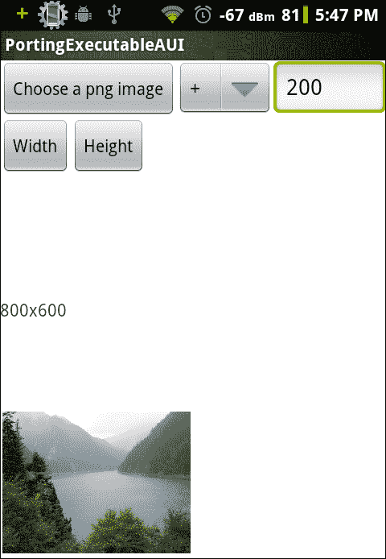
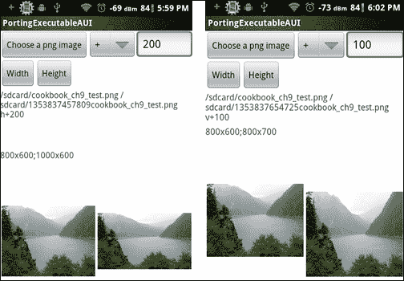
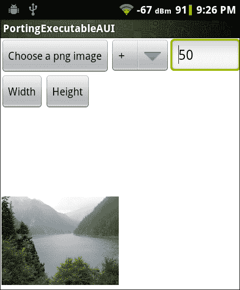
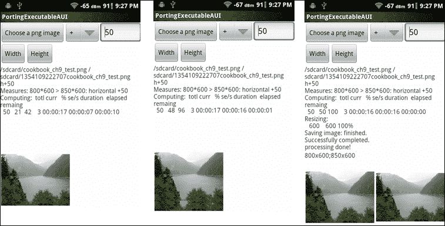
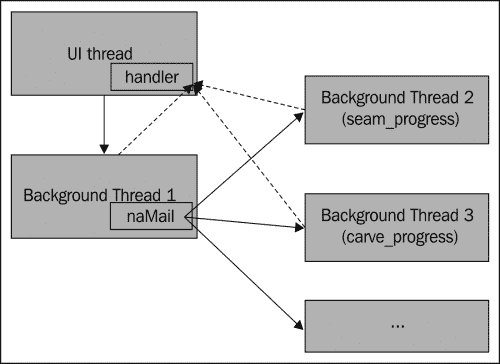

# 第九章：使用 NDK 将现有应用程序移植到 Android

在本章中，我们将涵盖以下内容：

+   使用 NDK 构建系统将命令行可执行文件移植到 Android

+   使用 NDK 独立编译器将命令行可执行文件移植到 Android

+   为移植的 Android 应用程序添加 GUI

+   在移植时使用后台线程

# 简介

上一章涵盖了使用 NDK 将本地库移植到 Android 的各种技术。本章讨论了本地应用程序的移植。

我们将首先介绍如何使用 Android NDK 构建系统和 NDK 提供的独立编译器为 Android 构建本地命令行应用程序。然后，我们为移植的应用程序添加一个图形用户界面（GUI）。最后，我们说明如何使用后台线程进行繁重处理，并将进度更新消息从本地代码发送到 Java UI 线程以进行 GUI 更新。

我们将在本章中使用开源的 Fugenschnitzer 程序。它是一个基于**Seam Carving**算法的内容感知图像调整大小程序。该算法的基本思想是通过搜索并操作原始图像中的接缝（一个**接缝**是从上到下或从左到右连接像素的路径）来改变图像的大小。该算法能够在尝试保留重要信息的同时调整图像大小。对于对程序和算法感兴趣的读者，可以访问[`fugenschnitzer.sourceforge.net/main_en.html`](http://fugenschnitzer.sourceforge.net/main_en.html)了解更多详情。否则，我们可以忽略算法，专注于移植过程。

# 使用 NDK 构建系统将命令行可执行文件移植到 Android

本食谱讨论了如何使用 NDK 构建系统将命令行可执行文件移植到 Android。我们将以开源的 Fugenschnitzer 程序（`fusch`）为例。

## 准备工作

在阅读本章之前，你应该先阅读第八章中的*使用 Android NDK 构建系统将库作为静态库移植*的食谱，*使用 Android NDK 移植和使用现有库*。

## 如何操作...

以下步骤描述了如何使用 NDK 构建系统将`fusch`程序移植到 Android：

1.  创建一个名为**PortingExecutable**的具有本地支持的 Android 应用程序。将包名设置为`cookbook.chapter9.portingexecutable`。如果你需要更详细的说明，请参考第二章中的*加载本地库和注册本地方法*的食谱，*Java 本地接口*。

1.  删除项目`jni`文件夹下的现有内容。

1.  从[`fugenschnitzer.sourceforge.net/main_en.html`](http://fugenschnitzer.sourceforge.net/main_en.html)下载`fusch`库和命令行应用程序的源代码。解压归档文件，并将它们分别放入`jni/fusch`和`jni/fusch_lib`文件夹中。

1.  从[`sourceforge.net/projects/libpng/files/libpng12/1.2.50/`](http://sourceforge.net/projects/libpng/files/libpng12/1.2.50/)下载`libpng 1.2.50`，并将文件解压到`jni/libpng-1.2.50`文件夹中。最新版本的`libpng`无法工作，因为接口不同。

1.  在`jni/libpng-1.2.50`文件夹下添加一个`Android.mk`文件，以将`libpng`构建为一个静态库模块。该文件具有以下内容：

    ```kt
    LOCAL_PATH := $(call my-dir)
    include $(CLEAR_VARS)
    LOCAL_CFLAGS := 
    LOCAL_MODULE    := libpng
    LOCAL_SRC_FILES :=\
      png.c \
      pngerror.c \
      pngget.c \
      pngmem.c \
      pngpread.c \
      pngread.c \
      pngrio.c \
      pngrtran.c \
      pngrutil.c \
      pngset.c \
      pngtrans.c \
      pngwio.c \
      pngwrite.c \
      pngwtran.c \
      pngwutil.c 
    LOCAL_LDLIBS := -lz
    LOCAL_EXPORT_LDLIBS := -lz
    LOCAL_EXPORT_C_INCLUDES := $(LOCAL_PATH)
    include $(BUILD_STATIC_LIBRARY)
    ```

1.  在`jni/fusch_lib`文件夹下添加一个`Android.mk`文件，以将`libseamcarv`构建为一个静态库模块。文件内容如下：

    ```kt
    LOCAL_PATH := $(call my-dir)
    include $(CLEAR_VARS)
    LOCAL_MODULE    := libseamcarv
    LOCAL_SRC_FILES :=\
      sc_core.c  \
      sc_carve.c  \
      sc_color.c  \
      sc_shift.c \
      sc_mgmnt.c \
      seamcarv.c
    LOCAL_CFLAGS := -std=c99 
    LOCAL_EXPORT_C_INCLUDES := $(LOCAL_PATH)
    include $(BUILD_STATIC_LIBRARY)
    ```

1.  在`jni/fusch`文件夹下添加第三个`Android.mk`文件，以构建使用`libpng-1.2.50`和`fusch_lib`两个文件夹中构建的两个静态库的`fusch`可执行文件。

    ```kt
    LOCAL_PATH := $(call my-dir)
    include $(CLEAR_VARS)
    LOCAL_MODULE    := fusch
    LOCAL_SRC_FILES := fusch.c
    LOCAL_CFLAGS := -std=c99
    LOCAL_STATIC_LIBRARIES := libpng libseamcarv
    include $(BUILD_EXECUTABLE)
    ```

1.  在`jni`文件夹下添加第四个`Android.mk`文件，以包含其子文件夹下的`Android.mk`文件。

    ```kt
    LOCAL_PATH := $(call my-dir)
    include $(call all-subdir-makefiles)
    ```

1.  构建应用程序，你会在`libs/armeabi`文件夹下看到一个名为`fusch`的二进制文件。我们可以使用以下命令将此二进制文件放入已越狱的 Android 设备或模拟器中：

    ```kt
    $ adb push fusch /data/data/
    ```

1.  请注意，我们无法在未越狱的 Android 设备上复制并执行二进制文件，因为我们无法获得执行权限。

1.  在控制台上启动第一个命令行。我们可以使用以下命令授予二进制文件执行权限并执行它：

    ```kt
    $ adb shell
    # cd /data/data
    # chmod 755 fusch
    # ./fusch
    ```

    这将输出程序的帮助信息。

1.  启动第二个命令行终端。使用以下命令将测试 PNG 文件`cookbook_ch9_test.png`（位于示例项目源代码的`assets`文件夹中）推送到测试设备或模拟器中：

    ```kt
    $ adb push cookbook_ch9_test.png /data/data/
    ```

1.  回到第一个命令行终端，使用以下命令再次执行`fusch`程序：

    ```kt
    # ./fusch cookbook_ch9_test.png 1.png h-200
    ```

1.  程序将花费一些时间将输入图像从 800 x 600 调整到 600 x 600。一旦完成，我们可以在第二个命令行终端使用以下命令获取处理后的图像：

    ```kt
    $ adb pull /data/data/1.png .
    ```

1.  以下屏幕截图显示了左侧的原始图像和右侧的处理后图像：

## 工作原理...

示例项目演示了如何将`fusch`程序作为命令行可执行文件移植到 Android。我们在`Android.mk`文件中向 Android NDK 构建系统描述了源代码，NDK 构建系统处理其余部分。

移植命令行可执行文件的操作步骤如下：

1.  确定库依赖关系。在我们的示例程序中，`fusch`依赖于`libseamcarv`（位于`fusch_lib`文件夹中）和`libpng`，而`libpng`随后又依赖于`zlib`。

1.  如果 Android 系统上没有可用的库，将其作为静态库模块移植。这是我们示例应用程序中的`libseamcarv`和`libpng`的情况。但是因为 Android 上有`zlib`，所以我们只需链接到它即可。

1.  将可执行文件作为单独的模块移植，并将其链接到库模块。

### 理解 Android.mk 文件

我们在第八章《使用 Android NDK 移植和使用现有库》中已经介绍了大部分`Android.mk`变量和宏。这里我们将介绍另外两个预定义变量。你也可以查阅 Android NDK 文件`docs/ANDROID-MK.html`获取更多关于宏和变量的信息。

+   `LOCAL_CFLAGS`：一个模块描述变量。它允许我们为构建 C 和 C++源文件指定额外的编译器选项或宏定义。另一个具有类似功能的变量是`LOCAL_CPPFLAGS`，但它仅用于 C++源文件。在我们示例项目中，在构建`libseamcarv`和`fusch`时，我们向编译器传递了`-std=c99`。这要求编译器接受 ISO C99 C 语言标准的语法。如果在构建时未指定该标志，将导致编译错误。

    ### 注意

    也可以使用`LOCAL_CFLAGS += I<包含路径>`来指定包含路径。但是，建议我们使用`LOCAL_C_INCLUDES`，因为`LOCAL_C_INCLUDES`路径也将用于`ndk-gdb`本地调试。

+   `BUILD_EXECUTABLE`：一个 GNU make 变量。它指向一个构建脚本，该脚本收集了我们想要构建的可执行文件的所有信息，并确定如何构建它。它与`BUILD_SHARED_LIBRARY`和`BUILD_STATIC_LIBRARY`类似，不同之处在于它用于构建可执行文件。在我们示例项目中构建`fusch`时使用了它。

    ```kt
    include $(BUILD_EXECUTABLE)
    ```

通过本章的解释以及第八章《使用 Android NDK 移植和使用现有库》的知识，现在理解我们示例应用程序中使用的四个`Android.mk`文件已经相当容易了。我们将`libpng`和`libseamcarv`作为两个静态库模块进行移植。我们导出依赖的库（通过`LOCAL_EXPORT_LDLIBS`）和头文件（通过`LOCAL_EXPORT_C_INCLUDES`），这样在使用模块时它们会被自动包含。在移植`libpng`时，我们还链接了 Android 系统上可用的`zlib`库（通过`LOCAL_LDLIBS`）。最后，我们通过引用这两个库模块（通过`LOCAL_STATIC_LIBRARIES`）来移植`fusch`程序。

# 使用 NDK 独立编译器将命令行可执行文件移植到 Android。

上一个食谱介绍了如何使用 NDK 构建系统将命令行可执行文件移植到 Android。这个食谱描述了如何使用 Android NDK 工具链作为独立编译器来实现这一点。

## 准备工作

在继续之前，建议您阅读第八章中的*使用现有构建系统移植库*一节，*使用 Android NDK 移植和利用现有库*。

## 如何操作...

以下步骤描述了如何使用 NDK 工具链直接将`fusch`程序移植到 Android：

1.  创建一个名为**PortingExecutableBuildSystem**的具有本地支持的 Android 应用。设置包名为`cookbook.chapter9.portingexecutablebuildsystem`。如果您需要更详细的说明，请参考第二章中的*加载本地库和注册本地方法*一节，*Java 本地接口*。

1.  删除项目`jni`文件夹下的现有内容。

1.  从[`fugenschnitzer.sourceforge.net/main_en.html`](http://fugenschnitzer.sourceforge.net/main_en.html)下载`fusch`库和命令行应用的源代码。解压归档文件，并将它们分别放入`jni/fusch`和`jni/fusch_lib`文件夹。

1.  从[`sourceforge.net/projects/libpng/files/libpng12/1.2.50/`](http://sourceforge.net/projects/libpng/files/libpng12/1.2.50/)下载`libpng 1.2.50`，并将文件解压到`jni/libpng-1.2.50`文件夹。最新版本的`libpng`不能工作，因为接口已经改变。将`libpng-1.2.50`下的`config.guess`脚本替换为[`gcc.gnu.org/svn/gcc/branches/cilkplus/config.guess`](http://gcc.gnu.org/svn/gcc/branches/cilkplus/config.guess)的内容，`config.sub`替换为[`gcc.gnu.org/svn/gcc/branches/cilkplus/config.sub`](http://gcc.gnu.org/svn/gcc/branches/cilkplus/config.sub)的脚本。

1.  在`jni/libpng-1.2.50`文件夹下添加一个`build_android.sh`文件来构建`libpng`。文件内容如下：

    ```kt
    #!/bin/bash
    NDK=~/Desktop/android/android-ndk-r8b
    SYSROOT=$NDK/platforms/android-8/arch-arm/
    export CFLAGS="-fpic \
       -ffunction-sections \
       -funwind-tables \
       -D__ARM_ARCH_5__ -D__ARM_ARCH_5T__ \
       -D__ARM_ARCH_5E__ -D__ARM_ARCH_5TE__ \
      -Wno-psabi \
      -march=armv5te \
       -mtune=xscale \
       -msoft-float \
      -mthumb \
       -Os \
      -DANDROID \
       -fomit-frame-pointer \
       -fno-strict-aliasing \
       -finline-limit=64"
    export LDFLAGS="-lz"
    export CC="$NDK/toolchains/arm-linux-androideabi-4.4.3/prebuilt/linux-x86/bin/arm-linux-androideabi-gcc --sysroot=$SYSROOT"
    ./configure \
       --host=arm-linux-androideabi \
       --prefix=$(pwd) \
       --exec-prefix=$(pwd) \
      --enable-shared=false \
      --enable-static=true
    make clean
    make 
    make install
    ```

1.  在`jni/fusch_lib`文件夹下添加一个`build_android.sh`文件来构建`libseamcarv`库。文件内容如下：

    ```kt
    #!/bin/bash
    NDK=~/Desktop/android/android-ndk-r8b
    SYSROOT=$NDK/platforms/android-8/arch-arm/
    export CFLAGS="-fpic \
       -ffunction-sections \
       -funwind-tables \
       -D__ARM_ARCH_5__ -D__ARM_ARCH_5T__ \
       -D__ARM_ARCH_5E__ -D__ARM_ARCH_5TE__ \
      -Wno-psabi \
      -march=armv5te \
       -mtune=xscale \
       -msoft-float \
      -mthumb \
       -Os \
       -fomit-frame-pointer \
       -fno-strict-aliasing \
       -finline-limit=64 \
      -std=c99 \
      -DANDROID "
    export CC="$NDK/toolchains/arm-linux-androideabi-4.4.3/prebuilt/linux-x86/bin/arm-linux-androideabi-gcc --sysroot=$SYSROOT"
    AR="$NDK/toolchains/arm-linux-androideabi-4.4.3/prebuilt/linux-x86/bin/arm-linux-androideabi-ar"
    SRC_FILES="\
      sc_core.c  \
      sc_carve.c  \
      sc_color.c  \
      sc_shift.c \
      sc_mgmnt.c \
      seamcarv.c"
    $CC $SRC_FILES $CFLAGS -c
    $AR cr libseamcarv.a *.o 
    ```

1.  在`jni/fusch`文件夹下添加第三个`build_android.sh`文件，以构建使用在`libpng-1.2.50`和`fusch_lib`两个文件夹下构建的两个静态库的`fusch`可执行文件。

    ```kt
    #!/bin/bash
    NDK=~/Desktop/android/android-ndk-r8b
    SYSROOT=$NDK/platforms/android-8/arch-arm
    CUR_D=$(pwd)
    export CFLAGS="-fpic \
       -ffunction-sections \
       -funwind-tables \
       -D__ARM_ARCH_5__ -D__ARM_ARCH_5T__ \
       -D__ARM_ARCH_5E__ -D__ARM_ARCH_5TE__ \
      -Wno-psabi \
      -march=armv5te \
       -mtune=xscale \
       -msoft-float \
      -mthumb \
       -Os \
       -fomit-frame-pointer \
       -fno-strict-aliasing \
       -finline-limit=64 \
      -std=c99 \
      -DANDROID \
      -I$CUR_D/../fusch_lib \
      -I$CUR_D/../libpng-1.2.50/include"
    export LDFLAGS="-Wl,--no-undefined -Wl,-z,noexecstack -Wl,-z,relro -Wl,-z,now -lz -lc -lm -lpng -lseamcarv -L$CUR_D/../fusch_lib -L$CUR_D/../libpng-1.2.50/lib"
    export CC="$NDK/toolchains/arm-linux-androideabi-4.4.3/prebuilt/linux-x86/bin/arm-linux-androideabi-gcc --sysroot=$SYSROOT"
    SRC_FILES="fusch.c"
    $CC $SRC_FILES $CFLAGS $LDFLAGS -o fusch
    ```

1.  通过在`libpng-1.2.50`、`fusch_lib`和`fusch`三个子文件夹中执行`build_android.sh`脚本来构建`libpng`和`libseamcarv`两个库以及`fusch`可执行文件。我们可以在`libpng-1.2.50/lib`文件夹下找到`libpng.a`，在`fusch_lib`文件夹下找到`libseamcarv.a`，在`fusch`文件夹下找到`fusch`可执行文件。

1.  我们可以使用以下命令将二进制文件`fusch`放到已越狱的 Android 设备或模拟器上：

    ```kt
    $ cd <path to project folder>/PortingExecutableBuildSystem/jni/fusch
    $ adb push fusch /data/data/
    ```

1.  请注意，由于我们无法获得权限，因此不能在未越狱的 Android 设备上复制和执行二进制文件。

1.  启动第一个命令行终端。我们可以给二进制文件执行权限，然后使用以下命令执行它：

    ```kt
    $ adb shell
    # cd /data/data
    # chmod 755 fusch
    # ./fusch
    ```

1.  这将打印出程序的帮助信息。

1.  启动第二个命令行终端。使用以下命令将测试 PNG 文件`cookbook_ch9_test.png`（位于示例项目源代码的`assets`文件夹下）推送到测试设备或模拟器上：

    ```kt
    $ adb push cookbook_ch9_test.png /data/data/
    ```

1.  回到第一个命令行终端，使用以下命令再次执行`fusch`程序：

    ```kt
    # ./fusch cookbook_ch9_test.png 1.png v-200
    ```

1.  程序将花费一些时间将输入图像从 800 x 600 调整到 800 x 400。一旦完成，我们可以在第二个命令行终端使用以下命令获取处理后的图像：

    ```kt
    $ adb pull /data/data/1.png .
    ```

1.  下图显示了左侧的原始图像和右侧的处理后图像：

## 工作原理...

示例项目展示了如何使用 NDK 工具链作为独立编译器将命令行可执行文件移植到 Android。

移植可执行文件的过程与之前使用 Android NDK 构建系统的食谱类似。关键在于向独立编译器传递适当的选项。

### 移植 libpng

`libpng`附带了它自己的构建脚本。我们可以使用以下命令获取配置构建过程的选项列表：

```kt
$ ./configure –help
```

编译器命令、编译器标志和链接器标志可以通过环境变量`CC`、`CFLAGS`和`LDFLAGS`分别配置。在`libpng-1.2.50`文件夹下的`build_android.sh`脚本中，我们设置这些变量以使用 NDK 编译器为 ARM 架构构建。关于如何移植库的详细说明，我们可以参考*使用 Android NDK 工具链的现有构建系统移植库*的食谱，在第八章，*移植带有其现有构建系统的库*。

我们现在将介绍一些编译选项。由于 Android NDK 工具链基于 GCC，我们可以参考}[`gcc.gnu.org/onlinedocs/gcc/Option-Summary.html`](http://gcc.gnu.org/onlinedocs/gcc/Option-Summary.html)详细了解每个选项。

+   `-fpic`：它生成适用于构建共享库的位置无关代码。

+   `-ffunction-sections`：此选项要求链接器执行优化，以提高代码中的引用局部性。

+   `-funwind-tables`：它生成用于展开调用栈的静态数据。

+   `-D__ARM_ARCH_5__`, `-D__ARM_ARCH_5T`, `-D__ARM_ARCH_5E__`, `-D__ARM_ARCH_5TE`, `-DANDROID`定义了`__ARM_ARCH_5__`, `__ARM_ARCH_5T`, `__ARM_ARCH_5E__`, `__ARM_ARCH_5TE`, 和`ANDROID`作为宏，定义等于`1`。例如，`-DANDROID`等同于`-D ANDROID=1`。

+   `-Wno-psabi`：它抑制了关于`va_list`等的警告信息。

+   `-march=armv5te`：它指定目标 ARM 架构为`ARMv5te`。

+   `-mtune=xscale`：它调整代码的性能，因为代码将在 xscale 处理器上运行。请注意，xscale 是一个处理器名称。

+   `-msoft-float`：它使用软件浮点函数。

+   `-mthumb`：它使用 Thumb 指令集生成代码。

+   `-Os`：提供针对大小的优化。

+   `-fomit-frame-pointer`：如果可能，帮助避免在寄存器中保存帧指针。

+   `-fno-strict-aliasing`：不应用严格的别名规则。这防止编译器进行不想要的优化。

+   `-finline-limit=64`：设置可以作为`64`伪指令内联的函数的大小限制。

+   `-std=c99`：接受`c99`标准语法。

当构建成功执行后，我们可以在`libpng-1.2.50/lib`文件夹下找到`libpng.a`静态库，以及在`libpng-1.2.50/include`文件夹下的头文件。

### 注意

Android NDK 构建系统本质上是为我们确定合适的编译选项并为我们调用交叉编译器。因此，我们可以从 NDK 构建系统的输出中学习传递给编译器的选项。例如，我们可以在前一个食谱中调用命令`ndk-build -B V=1`或`ndk-build -B -n`，以了解 NDK 构建系统如何处理`libpng`、`libseamcarv`和`fusch`的构建，并在本食谱中应用类似的选项。

### 移植 libseamcarv

`libseamcarv`附带一个 Makefile 但没有配置文件。我们可以修改 Makefile 或者从头开始编写构建脚本。由于库只包含几个文件，我们将直接编写构建脚本。需要遵循两个步骤：

1.  将所有源文件编译成对象文件。这是通过在编译时传递`"-c"`选项完成的。

1.  将对象文件归档成静态库。这一步是通过 NDK 工具链中的归档器`arm-linux-androideabi-ar`完成的。

### 提示

正如我们在第八章，*使用 Android NDK 移植和现有库*中所解释的，静态库不过是对象文件的归档，可以通过`archiver`程序创建。

### 移植 fusch

我们需要链接到我们构建的两个库，即`libpng`和`libseamcarv`。这是通过向链接器传递以下选项完成的：

```kt
-lpng -lseamcarv -L$CUR_D/../fusch_lib -L$CUR_D/../libpng-1.2.50/lib
```

这个"`-L`"选项将`fusch_lib`和`libpng-1.2.50/lib`添加到库的搜索路径中，而"`-l`"告诉链接器链接到`libpng`和`libseamcarv`库。构建脚本将在`fusch`文件夹下输出名为`fusch`的二进制文件。

`fusch`程序相当简单。因此，我们可以使用 Android NDK 构建系统或独立的编译器来移植它。如果一个应用程序有更多的依赖，用`Android.mk`文件描述所有内容可能会很困难。因此，能够使用 NDK 工具链作为独立的编译器并利用库的现有构建脚本是非常有帮助的。

# 为移植的 Android 应用添加 GUI

前两个食谱展示了如何将命令行可执行文件移植到 Android。不用说，这种方法最大的缺点是它不能在未越狱的 Android 设备上执行。本食谱讨论了在将应用程序移植到 Android 时，如何通过添加 GUI 来解决这一问题。

## 如何操作...

以下步骤描述了如何向移植的应用添加一个简单的用户界面：

1.  创建一个名为`PortingExecutableAUI`的具有本地支持的 Android 应用。将包名设置为`cookbook.chapter9.portingexecutableaui`。如果你需要更详细的说明，请参考第二章的*加载本地库和注册本地方法*部分，*Java Native Interface*。

1.  按照本章中*使用 NDK 构建系统将命令行可执行文件移植到 Android*的步骤 2 至 8 进行操作。

1.  在`jni/fusch`文件夹下添加一个`mylog.h`文件。在`jni/fusch/fusch.c`文件的开头部分添加以下几行，然后移除原始的主方法签名行。`naMain`方法接受来自 Java 代码的命令，而不是命令行 shell。参数应以空格分隔：

    ```kt
    #ifdef ANDROID_BUILD
    #include <jni.h>
    #include "mylog.h"
    int naMain(JNIEnv* env, jclass clazz, jstring pCmdStr);

    jint JNI_OnLoad(JavaVM* pVm, void* reserved) {
      JNIEnv* env;
      if ((*pVm)->GetEnv(pVm, (void **)&env, JNI_VERSION_1_6) != JNI_OK) {
        return -1;
      }
      JNINativeMethod nm[1];
      nm[0].name = "naMain";
      nm[0].signature = "(Ljava/lang/String;)I";
      nm[0].fnPtr = (void*)naMain;
      jclass cls = (*env)->FindClass(env, "cookbook/chapter9/portingexecutableaui/MainActivity");
      // Register methods with env->RegisterNatives.
      (*env)->RegisterNatives(env, cls, nm, 1);
      return JNI_VERSION_1_6;
    }

     int naMain(JNIEnv* env, jclass clazz, jstring pCmdStr) {
      int argc = 0;
      char** argv = (char**) malloc (sizeof(char*)*4);
      *argv = "fusch";
      char** targv = argv + 1;
      argc++;
      jboolean isCopy;
       char *cmdstr = (*env)->GetStringUTFChars(env, pCmdStr, &isCopy);
       if (NULL == cmdstr) {
         LOGI(2, "get string failed");
       }
       LOGI(2, "naMain assign parse string %s", cmdstr);
       char* pch;
       pch = strtok(cmdstr, " ");
       while (NULL != pch) {
         *targv = pch;
         argc++;
         targv++;
         pch = strtok(NULL, " ");
       }
       LOGI(1, "No. of arguments: %d", argc);
       LOGI(1, "%s %s %s %s", argv[0], argv[1], argv[2], argv[3]);
    #else
     int main(int argc, char *argv[]) {
    #endif
    ```

1.  在主方法的`return`语句之前添加以下几行以释放本地字符串：

    ```kt
    #ifdef ANDROID_BUILD
       (*env)->ReleaseStringUTFChars(env, pCmdStr, cmdstr);
    #endif
    ```

1.  更新`jni/fusch`下的`Android.mk`文件，如下所示。更新的部分已被高亮显示：

    ```kt
    LOCAL_PATH := $(call my-dir)
    include $(CLEAR_VARS)
    LOCAL_MODULE    := fusch
    LOCAL_SRC_FILES := fusch.c
    LOCAL_CFLAGS := -std=c99 -DANDROID_BUILD
    LOCAL_STATIC_LIBRARIES := libpng libseamcarv
    LOCAL_LDLIBS := -llog
    include $(BUILD_SHARED_LIBRARY)

    ```

1.  在`cookbook.chapter9.portingexecutableaui`包下添加`MainActivity.java`文件。Java 代码设置图形用户界面，加载共享库`libfusch.so`，并调用本地方法`naMain`。

1.  在`res/layout`文件夹下添加一个`activity_main.xml`文件以描述图形用户界面。

1.  在`AndroidManifest.xml`文件中，在`<application>...</application>`之前添加以下行：

    ```kt
    <uses-permission android:name="android.permission.WRITE_EXTERNAL_STORAGE"/>
    ```

1.  构建并运行 Android 应用。你应该能看到一个与以下截图类似的图形用户界面：

1.  我们可以点击**宽度**或**高度**按钮来处理默认图像。或者，我们可以加载另一个`.png`图像并处理它。一旦我们点击**宽度**或**高度**，图形用户界面将不再响应，我们必须等待处理完成。如果出现著名的**应用无响应**（**ANR**）对话框，只需点击**等待**。

1.  处理完成后，将加载处理过的图像并显示其尺寸。左侧的截图显示了点击**宽度**按钮的结果，而右侧的截图则表示**高度**处理的结果。请注意，图像被缩放以适应显示区域：

## 工作原理...

该示例展示了如何为移植到 Android 的`fusch`程序添加图形用户界面。`fusch`源代码被修改，以便本地代码与图形用户界面接口。

通常，可以按照以下步骤向已移植到 Android 的命令行可执行文件添加图形用户界面。

1.  用本地方法替换主方法。在我们的示例应用中，我们用`naMain`替换了 main。

1.  解析本地方法的输入参数以获取命令选项，而不是从命令行读取。在我们的示例应用程序中，我们解析了第三个输入参数 `pCmdStr` 以获取 `fusch` 命令选项。这使得命令可以在 Java 代码中构建，并轻松地传递给本地代码。

1.  将本地方法注册到 Java 类。

1.  在 Java 代码中，图形用户界面（GUI）可以接收用户指定的各种参数值，构建命令，并将其传递给本地方法进行处理。

请注意，在我们的修改后的本地代码中，我们并没有移除原始代码。我们使用了 C 预处理器宏 `ANDROID_BUILD` 来控制哪些源代码部分应该被包含以构建 Android 共享库。我们在 `Android.mk` 文件（位于 `fusch` 文件夹下）中向编译器传递 `-DANDROID_BUILD`，以启用特定的 Android 代码。这种方法使得我们能够轻松添加对 Android 的支持，而不会破坏其他平台的代码。

本食谱中的示例应用程序有两个严重的限制。首先，主 UI 线程处理繁重的图像处理，这导致应用程序变得无响应。其次，在图像处理过程中没有进度更新。只有在图像处理完成后 GUI 才会更新。我们将在下一个食谱中解决这些问题。

# 在移植中使用后台线程

前一个食谱为移植的 `fusch` 程序添加了 GUI，但留下了两个问题——GUI 的无响应性和处理过程中没有进度更新。这个食谱讨论了如何使用后台线程来处理进程，并将进度报告给主 UI 线程。

## 准备就绪。

本食谱中的示例程序基于我们本章前一个食谱中开发的程序。您应该首先阅读它们。此外，建议读者阅读以下 第二章，*Java Native Interface* 的食谱：

+   *从本地代码调用静态和实例方法*

+   *缓存 `jfieldID`、`jmethodID` 和引用数据以提高性能*

## 如何操作...

以下步骤描述了如何使用后台线程进行繁重的处理，并将进度更新报告给 Java UI 线程：

1.  将我们在前一个食谱中开发的 `PortingExecutableAUI` 项目复制到一个名为 `PortingExecutableAUIAsync` 的文件夹中。在 Eclipse IDE 中打开文件夹中的项目。

1.  向 `MainActivity.java` 添加以下代码：

    `handler`：`handler` 类的实例处理从后台线程发送的消息。它将使用消息内容更新 GUI。

    ```kt
    public static final int MSG_TYPE_PROG = 1;
    public static final int MSG_TYPE_SUCCESS = 2;
    public static final int MSG_TYPE_FAILURE = 3;
    Handler handler = new Handler() {
      @Override
      public void handleMessage(Message msg) {
        switch(msg.what) {
          case MSG_TYPE_PROG:
            String updateMsg = (String)msg.obj;
            if (1 == msg.arg1) {
              String curText = text1.getText().toString();
              String newText = curText.substring(0, curText.lastIndexOf("\n")) + "\n" + updateMsg;
              text1.setText(newText);
            } else if (2 == msg.arg1) {
              text1.append(updateMsg);
            } else {
              text1.append("\n" + updateMsg);
            }
            break;
          case MSG_TYPE_SUCCESS:
            Uri uri = Uri.fromFile(new File(outputImageDir + outputImgFileName));
            img2.setImageURI(uri);
            text1.append("\nprocessing done!");
            text2.setText(getImageDimension(inputImagePath) + ";" + 
            getImageDimension(outputImageDir + outputImgFileName));
            break;
          case MSG_TYPE_FAILURE:
            text1.append("\nerror processing the image");
            break;
        }
      }
    };
    ```

    `ImageProcRunnable`：`MainActivity` 的一个私有类实现了 `Runnable` 接口，它接受命令字符串，调用本地方法 `naMain`，并将结果消息发送给 Java UI 线程的处理器。这个类的实例将从后台线程中调用：

    ```kt
    private class ImageProcRunnable implements Runnable {
      String procCmd;
      public ImageProcRunnable(String cmd) {
        procCmd = cmd;
      }
      @Override
      public void run() {
        int res = naMain(procCmd, MainActivity.this);
        if (0 == res) {
          //success, send message to handler
          Message msg = new Message();
          msg.what = MSG_TYPE_SUCCESS;
          handler.sendMessage(msg);
        } else {
          //failure, send message to handler
          Message msg = new Message();
          msg.what = MSG_TYPE_FAILURE;
          handler.sendMessage(msg);
        }
      }
    }
    ```

    `updateProgress`：这是一个从本地代码通过 JNI 调用的方法。它向 Java UI 线程的处理程序发送一条消息：

    ```kt
    public void updateProgress(String pContent, int pInPlaceUpdate) {
      Message msg = new Message();
      msg.what = MSG_TYPE_PROG;
      msg.arg1 = pInPlaceUpdate;
      msg.obj = pContent;
      handler.sendMessage(msg);
    }
    ```

1.  更新 `fusch.c` 源代码。

1.  在 `naMain` 方法中我们缓存了 `JavaVM` 引用，并为 `MainAcitvity` 对象引用 `pMainActObj` 获取了一个全局引用。`fusch` 程序使用了不止一个后台线程。我们将需要这些引用从那些后台线程调用 Java 方法：

    ```kt
    #ifdef ANDROID_BUILD
    int naMain(JNIEnv* env, jobject pObj, jstring pCmdStr, jobject pMainActObj);
    jint JNI_OnLoad(JavaVM* pVm, void* reserved) {
      JNIEnv* env;
      if ((*pVm)->GetEnv(pVm, (void **)&env, JNI_VERSION_1_6) != JNI_OK) {
        return -1;
      }
      cachedJvm = pVm;
      JNINativeMethod nm[1];
      nm[0].name = "naMain";
      nm[0].signature = "(Ljava/lang/String;Lcookbook/chapter9/portingexecutableaui/MainActivity;)I";
      nm[0].fnPtr = (void*)naMain;
      jclass cls = (*env)->FindClass(env, "cookbook/chapter9/portingexecutableaui/MainActivity");
      (*env)->RegisterNatives(env, cls, nm, 1);
      return JNI_VERSION_1_6;
    }
    int naMain(JNIEnv* env, jobject pObj, jstring pCmdStr, jobject pMainActObj) {
      char progBuf[500];
      jmethodID updateProgMID, toStringMID;
      jstring progStr;
      jclass mainActivityClass = (*env)->GetObjectClass(env, pMainActObj);
      cachedMainActObj = (*env)->NewGlobalRef(env, pMainActObj);
      updateProgMID = (*env)->GetMethodID(env, mainActivityClass, "updateProgress", "(Ljava/lang/String;I)V");
      if (NULL == updateProgMID) {
        LOGE(1, "error finding method updateProgress");
        return EXIT_FAILURE;
      }
      int argc = 0;
      char** argv = (char**) malloc (sizeof(char*)*4);
      *argv = "fusch";
      char** targv = argv + 1;
      argc++;
      jboolean isCopy = JNI_TRUE;
        char *cmdstr = (*env)->GetStringUTFChars(env, pCmdStr, &isCopy);
        if (NULL == cmdstr) {
           LOGI(2, "get string failed");
           return EXIT_FAILURE;
         }
         char* pch;
        pch = strtok(cmdstr, " ");
        while (NULL != pch) {
           *targv = pch;
           argc++;
           targv++;
           pch = strtok(NULL, " ");
       }
        LOGI(1, "No. of arguments: %d", argc);
         LOGI(1, "%s %s %s %s", argv[0], argv[1], argv[2], argv[3]);
    #else
     int main(int argc, char *argv[]) {
    #endif
    ```

1.  在 `main` 方法的 `return` 语句之前添加以下行，以释放本地字符串和缓存的 JavaVM 引用，避免内存泄漏：

    ```kt
    #ifdef ANDROID_BUILD
       (*env)->ReleaseStringUTFChars(env, pCmdStr, cmdstr);
       (*env)->DeleteGlobalRef(env, cachedMainActObj);
       cachedMainActObj = NULL;
    #endif
    ```

1.  为了更新 GUI，我们向 Java 代码发送一条消息。我们需要更新源文件不同部分用于生成输出消息的代码。以下是这方面的一个示例：

    ```kt
    #ifdef ANDROID_BUILD
      progStr = (*env)->NewStringUTF(env, MSG[I_NOTHINGTODO]);
      (*env)->CallVoidMethod(env, pMainActObj, updateProgMID, progStr, 0);
    #else
      puts(MSG[I_NOTHINGTODO]);
    #endif
    ```

1.  `seam_progress` 和 `carve_progress` 函数是由在 `naMain` 启动的本地线程执行的。我们使用了缓存的 `JavaVM` 引用 `cachedJvm` 和 `MainActivity` 对象引用 `cachedMainActObj` 来获取在 `MainActivity.java` 中定义的 `updateProgress` 方法的 `jmethodID`。

    ```kt
    #ifdef ANDROID_BUILD
      char progBuf[500];
      JNIEnv *env;
      jmethodID updateProgMID;
      (*cachedJvm)->AttachCurrentThread(cachedJvm, &env, NULL);
      jstring progStr;
      jclass mainActivityClass = (*env)->GetObjectClass(env, cachedMainActObj);
      updateProgMID = (*env)->GetMethodID(env, mainActivityClass, "updateProgress", "(Ljava/lang/String;I)V");
      if (NULL == updateProgMID) {
        LOGE(1, "error finding method updateProgress at seam_progress");
        (*cachedJvm)->DetachCurrentThread(cachedJvm);
        pthread_exit((void*)NULL);
      }
    #endif
    ```

1.  然后，我们可以从 `seam_progress` 和 `carve_progress` 调用 `updateProgress` 方法。以下是来自 `carve_progress` 函数的代码段，显示了这一点：

    ```kt
    #ifdef ANDROID_BUILD
      sprintf(progBuf, "%6d %6d %3d%%", max, pro, lrintf((float)(pro * 100) / max));
      progStr = (*env)->NewStringUTF(env, progBuf);
      (*env)->CallVoidMethod(env, cachedMainActObj, updateProgMID, progStr, 1);
    #else
      printf("%6d %3d%% ", pro, lrintf((float)(pro * 100) / max));
    #endif
    ```

1.  构建并运行 Android 应用。你应该能看到一个与以下截图相似的图形用户界面：

1.  我们可以点击**宽度**或**高度**按钮开始处理。左中和右截图分别显示了处理过程和结果：

## 工作原理...

前面的示例显示了如何使用后台线程处理繁重的处理工作，以便 GUI 能够响应用户输入。当后台线程处理图像时，它还会向 UI 线程发送进度更新。

`fusch` 程序的细节实际上比所描述的核心思想要复杂一些，因为它使用了大量的并发处理。以下图表对此进行了说明：



一旦我们在 `MainActivity.java` 中点击了**宽度**或**高度**按钮，将创建一个新的 Java 线程（**后台线程 1**），其实例为 `ImageProcRunnable`。此线程将调用 `naMain` 本地方法。

在 `naMain` 方法中使用 `pthread_create` 函数创建了多个本地线程。其中两个，分别标记为**后台线程 2**和**后台线程 3**，将分别运行 `seam_progress` 和 `carve_progress`。

在所有三个后台线程中，我们向绑定到 UI 线程的处理程序发送 `MSG_TYPE_PROG` 类型的消息。处理程序将处理这些消息并更新图形用户界面。

### 从本地代码发送消息

在 Java 中向处理程序发送消息很简单；我们只需调用 `handler.sendMessage()` 方法。但在本地代码中可能会有些麻烦。

在`MainActivity.java`中，我们定义了一个`updateProgress`方法，该方法接收一个字符串和一个整数，构建一条消息，并将其发送给处理器。本地代码通过 JNI 调用这个 Java 方法以便发送消息。有两种情况：

+   **本地代码在 Java 线程中**：这是前一个图中**后台线程 1**的情况。该线程是在 Java 代码中创建的，并调用了`naMain`本地方法。在`naMain`中，我们获取`updateProgress`的`jmethodID`，并通过 JNI 函数`CallVoidMethod`调用`updateProgress`方法。更多详情，您可以参考第二章，*Java Native Interface*中的*Calling static and instance methods from native code*一节。

+   **本地代码在本地线程中**：这就是**后台线程 2**和**后台线程 3**发生的情况。这些线程是通过`naMain`中的`pthread_create`函数创建的。在进行任何 JNI 调用之前，我们必须调用`AttachCurrentThread`将本地线程附加到 Java 虚拟机。注意，我们使用了缓存的`MainActivity`对象引用`cachedMainActObj`来调用`updateProgress`方法。关于在 JNI 中缓存更多详情，我们可以参考第二章，*Java Native Interface*中的*Caching jfieldID, jmethodID, and reference data to improve performance*一节。

我们创建的 GUI 看起来并不完美，但它足够简单，足以说明如何使用后台线程进行繁重处理以及从本地代码发送 GUI 更新消息。
