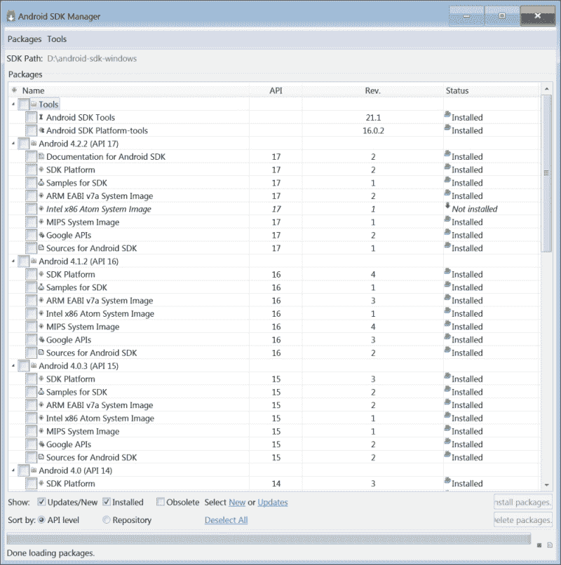
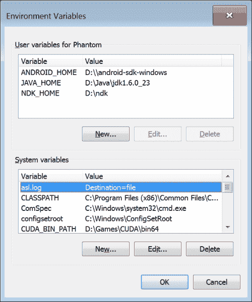
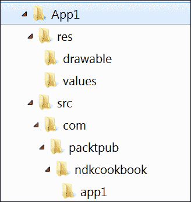
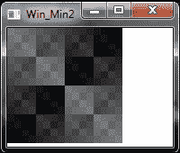
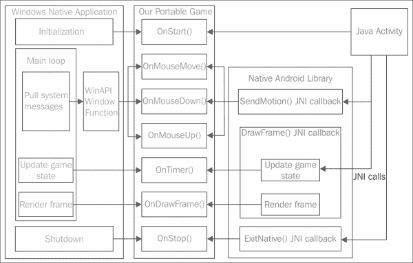

# 第一章：建立构建环境

|   | *一些 LinkedIn 个人资料说使用特定 IDE 进行开发是一种技能。**不！不使用任何 IDE 进行开发才是真正的技能！** |   |
| --- | --- | --- |
|   | --*谢尔盖·科萨列夫斯基* |

在本章中，我们将涵盖以下内容：

+   在 Windows 上安装 Android 开发工具

+   在 Linux 上安装 Android 开发工具

+   手动创建应用程序模板

+   向你的应用程序添加本地 C++代码

+   切换 NDK 工具链

+   支持多种 CPU 架构

+   使用 OpenGL ES 进行基本渲染

+   跨平台开发

+   统一跨平台代码

+   链接与源代码组织

+   签名发布 Android 应用程序

# 引言

本章介绍如何在 Microsoft Windows 或 Ubuntu/Debian Linux 上安装和配置 Android NDK，以及如何在基于 Android 的设备上构建和运行你的第一个应用程序。我们将学习如何设置不同的编译器和随 Android NDK 提供的**工具链**。此外，我们还将展示如何设置 Windows 上的 GCC 工具链以构建你的项目。本章的其余部分致力于使用 C++进行跨平台开发。

# 在 Windows 上安装 Android 开发工具

要开始为 Android 开发游戏，你需要在系统上安装一些基本工具。

## 准备就绪

以下是开始为 Android 开发游戏所需的所有先决条件列表：

+   Android SDK 位于[`developer.android.com/sdk/index.html`](http://developer.android.com/sdk/index.html)。

    ### 注意

    本书基于 Android SDK 修订版 22.3，并使用 Android API Level 19 进行测试。

+   Android NDK 位于[`developer.android.com/tools/sdk/ndk/index.html`](http://developer.android.com/tools/sdk/ndk/index.html)（我们使用的是 Android NDK r9b）。

+   Apache Ant 位于[`ant.apache.org`](http://ant.apache.org)。这是一个 Java 命令行工具，C++开发者可能不太熟悉。它的目的是构建 Java 应用程序，由于每个 Android 应用程序都有一个 Java 包装器，因此此工具将帮助我们打包成部署就绪的存档（这些被称为`.apk`包，代表**Android Package**）。

+   Java SE 开发工具包位于[`www.oracle.com/technetwork/java/javase/downloads/index.html`](http://www.oracle.com/technetwork/java/javase/downloads/index.html)。

早期版本的 Windows SDK/NDK 需要安装**Cygwin**环境，这是一种类似于 Linux 的 Windows 环境。最新版本的这些工具可以在 Windows 上本机运行，无需任何中间层。我们将重点介绍无 Cygwin 环境，并且将在不使用 IDE 的情况下进行所有开发。你没听错，我们将仅使用命令行。本书中的所有示例都是在 Windows PC 上编写和调试的。

要编译本书中介绍的本地 Windows 应用程序，你需要一个像样的 C++编译器，例如带有 GCC 工具链的 MinGW 包。使用 Microsoft Visual Studio 也是可行的。

### 注意

**Windows 的最小化 GNU**（**MinGW**）是一个使用**GNU 编译器集合**（**GCC**）端口的 Windows 应用程序的最小开发环境。

## 如何操作...

1.  Android SDK 和 NDK 应安装到名称中不包含任何空格的文件夹中。

    ### 注意

    这个要求源于 Android SDK 中脚本的限制。StackOverflow 上有一个很好的讨论，解释了这些限制背后的部分原因，请见[`stackoverflow.com/q/6603194/1065190`](http://stackoverflow.com/q/6603194/1065190)。

1.  其他工具可以安装到它们的默认位置。我们在 Windows 7 系统上使用了以下路径：

| 工具 | 路径 |
| --- | --- |
| Android SDK | `D:\android-sdk-windows` |
| Android NDK | `D:\ndk` |
| Apache Ant | `D:\ant` |
| Java 开发工具包 | `C:\Program Files\Java\jdk1.6.0_33` |

所有工具都有相当不错的 GUI 安装程序（请看以下图片，展示了 SDK R21 的 Android SDK 管理器），所以你不必使用命令行。



对于 Windows 环境，你需要 MinGW GCC 工具链。易于安装的一体化软件包可以在[`www.equation.com`](http://www.equation.com)的**编程工具**部分，**Fortran, C, C++**子部分找到。或者，你也可以从[`www.mingw.org`](http://www.mingw.org)下载官方安装程序。我们将使用来自[www.equation.com](http://www.equation.com)的版本。

## 还有更多内容...

你需要设置一些环境变量，让工具知道文件的位置。`JAVA_HOME`变量应指向 Java 开发工具包文件夹。`NDK_HOME`变量应指向 Android NDK 安装文件夹，而`ANDROID_HOME`应指向 Android SDK 文件夹（注意双反斜杠）。我们使用了以下环境变量值：

`JAVA_HOME=D:\Java\jdk1.6.0_23`

`NDK_HOME=D:\ndk`

`ANDROID_HOME=D:\\android-sdk-windows`

最终配置类似于以下截图所示，展示了 Windows 的**环境变量**对话框：



安装 MinGW 成功后，你还需要将其安装文件夹中的`bin`文件夹添加到`PATH`环境变量中。例如，如果 MinGW 安装在`C:\MinGW`，那么`PATH`应该包含`C:\MinGW\bin`文件夹。

# 在 Linux 上安装 Android 开发工具

在 Linux 上安装基本工具与在 Windows 上一样简单。在本教程中，我们将看到如何在*nix 系统上安装基本的 Android 开发工具。

## 准备就绪

我们假设你已经有一个带有`apt`包管理器的 Ubuntu/Debian 系统。详情请参考[`wiki.debian.org/Apt`](http://wiki.debian.org/Apt)。

## 如何操作...

执行以下步骤来安装所需的基本工具：

1.  通过运行以下命令，确保你为你的操作系统使用了最新版本的软件包：

    ```kt
    >sudo apt-get update

    ```

1.  安装 OpenJDK 6+：

    ```kt
    >sudo apt-get install openjdk-6-jdk

    ```

1.  安装 Apache Ant 构建自动化工具：

    ```kt
    >sudo apt-get install ant

    ```

1.  从[`developer.android.com`](http://developer.android.com)下载官方的 Android SDK。旁边有一个更大的包，其中包含 Eclipse IDE 的 ADT 插件。然而，由于我们所有的开发都是通过命令行进行的，所以我们不需要它。运行以下命令：

    ```kt
    >wget http://dl.google.com/android/android-sdk_r22.2.1-linux.tgz

    ```

1.  解压下载的`.tgz`文件（实际版本可能有所不同，截至 2013 年 10 月，22.2.1 是最新版本）：

    ```kt
    >tar -xvf android-sdk_r22.2.1-linux.tgz

    ```

1.  使用`~/<sdk>/tools/android`安装最新的 Platform Tools 和所有 SDKs——就像在 Windows 情况下一样。

    如果不这样做，在尝试使用 Ant 工具构建任何 Android 应用程序时将出现错误。

1.  从[`developer.android.com`](http://developer.android.com)获取官方的 Android NDK：

    ```kt
    >wget http://dl.google.com/android/ndk/android-ndk-r9b-linux-x86_64.tar.bz2

    ```

1.  解压下载的 NDK `.tgz`文件：

    ```kt
    >tar -xvf android-ndk-r9b-linux-x86_64.tar.bz2

    ```

1.  将`NDK_ROOT`环境变量设置为你的 Android NDK 目录（例如，在我们的情况下是`~/android-ndk-r9b`）：

    ```kt
    >NDK_ROOT=/path/to/ndk

    ```

    如果这些设置适用于系统的所有用户，将这行和`JAVA_HOME`的定义放到`/etc/profile`或`/etc/environment`中是有用的。

1.  如果你运行的是 64 位系统，你必须确保你也安装了 32 位的 Java 运行时。

1.  运行以下命令以安装库。如果不这样做可能会导致`adb`和`aapt`工具出现错误：

    ```kt
    >sudo apt-get install ia32-libs

    ```

## 还有更多...

有一个很好的单行脚本可以帮助你自动检测 OpenJDK 的主目录。它本质上解析了`/usr/bin/javac`链接到完整路径，并返回路径的目录部分。

```kt
 JAVA_HOME=$(readlink -f /usr/bin/javac | sed "s:bin/javac::")

```

# 手动创建应用程序模板

首先，我们将为我们的应用程序创建一个基本模板。通过 Android SDK 构建的每个 Android 应用程序都应该包含预定义的目录结构和配置`.xml`文件。这可以使用 Android SDK 工具和 IDE 完成。在本教程中，我们将学习如何手动完成。我们稍后会把这些文件作为所有示例的起点。

## 准备工作

让我们设置项目的目录结构（见下截图）：



这是一般 Android 项目的典型结构。我们将手动创建所有必需的文件，而不是使用 Android 工具。

## 如何操作...

将 Java `Activity`代码放入`App1\src\com\packtpub\ndkcookbook\app1\App1Activity.java`文件中，其内容应如下所示：

```kt
package com.packtpub.ndkcookbook.app1;
import android.app.Activity;
public class App1Activity extends Activity
{
};
```

可本地化的应用程序名称应放入`App1\res\values\strings.xml`。在`AndroidManifest.xml`文件中，字符串参数`app_name`用于指定我们应用程序的用户可读名称，如下代码所示：

```kt
<?xml version="1.0" encoding="utf-8"?>
<resources>
    <string name="app_name">App1</string>
</resources>
```

现在我们需要为 Apache Ant 和 Android SDK 构建系统编写更多脚本。它们是构建应用程序的`.apk`包所必需的。

1.  下面是`App1/project.properties`文件：

    ```kt
    target=android-15
    sdk.dir=d:/android-sdk-windows
    ```

1.  我们还需要为 Ant 准备两个文件。以下是`App1/AndroidManifest.xml`：

    ```kt
    <?xml version="1.0" encoding="utf-8"?>
    <manifest 
      package="com.packtpub.ndkcookbook.app1"
      android:versionCode="1"
      android:versionName="1.0.0">
      <supports-screens
         android:smallScreens="false"
         android:normalScreens="true"
         android:largeScreens="true"
         android:xlargeScreens="true"
         android:anyDensity="true" />
      <uses-sdk android:minSdkVersion="8" />
      <uses-sdk android:targetSdkVersion="18" />
    ```

    我们的示例至少需要 OpenGL ES 2。让 Android 知道这一点：

    ```kt
      <uses-feature android:glEsVersion="0x00020000"/>
      <application android:label="@string/app_name"
                   android:icon="@drawable/icon"
                   android:installLocation="preferExternal"
                   android:largeHeap="true"
                   android:debuggable="false">
      <activity android:name="com.packtpub.ndkcookbook.app1.App1Activity"
    android:launchMode="singleTask"
    ```

    创建一个横屏方向的全屏应用程序：

    ```kt
                      android:theme="@android:style/Theme.NoTitleBar.Fullscreen"
                      android:screenOrientation="landscape"
                      android:configChanges="orientation|keyboardHidden"
                      android:label="@string/app_name">
        <intent-filter>
          <action android:name="android.intent.action.MAIN" />
          <category android:name="android.intent.category.LAUNCHER" />
         </intent-filter>
       </activity>
     </application>
    </manifest>
    ```

    第二个文件是`App1/build.xml`：

    ```kt
    <?xml version="1.0" encoding="UTF-8"?>
    <project name="App1" default="help">
        <property file="ant.properties" />
        <loadproperties srcFile="project.properties" />
        <import file="${sdk.dir}/tools/ant/build.xml" />
    </project>
    ```

## 工作原理...

将所有列出的文件就位后，我们现在可以构建项目并将其安装在 Android 设备上，具体步骤如下：

1.  从`App1`文件夹运行：

    ```kt
    >ant debug

    ```

1.  之前命令输出的末尾应如下所示：

    ```kt
    BUILD SUCCESSFUL
    Total time: 12 seconds

    ```

1.  构建的调试`.apk`包位于`bin/App1-debug.apk`。

1.  要安装应用，请运行：

    ```kt
    >adb install App1-debug.apk

    ```

    ### 注意

    在运行此命令之前，不要忘记通过 USB 连接设备并在 Android 设置中打开 USB 调试。

1.  您应该看到来自`adb`的输出，类似于以下命令：

    ```kt
    * daemon not running. starting it now on port 5037 *
    * daemon started successfully *
    1256 KB/s (8795 bytes in 0.006s)
     pkg: /data/local/tmp/App1-debug.apk
    Success

    ```

应用程序现在可以从您的 Android 启动器（名为`App1`）启动。您将看到一个黑色屏幕。您可以使用**返回**按钮退出应用程序。

## 还有更多...

不要忘记将应用图标放入`App1\res\drawable\icon.png`。如果您想快速构建应用程序，可以参考本书的代码包，或者放置自己的图标。72 x 72 32 位即可。您可以在[`developer.android.com/design/style/iconography.html`](http://developer.android.com/design/style/iconography.html)找到官方的 Android 图标指南。

关于`AndroidManifest.xml`文件的官方文档可以在[`developer.android.com/guide/topics/manifest/manifest-intro.html`](http://developer.android.com/guide/topics/manifest/manifest-intro.html)找到。

此外，您可以使用以下方式通过`adb -r`命令行开关更新应用程序，而无需卸载之前的版本：

```kt
>adb install -r App1-debug.apk

```

否则，在安装应用程序的新版本之前，您必须使用以下命令卸载现有版本：

```kt
>adb uninstall <package-name>

```

## 另请参阅...

+   *签名发布 Android 应用程序*

# 向您的应用程序添加本地 C++代码

让我们扩展之前食谱中讨论的最小化 Java 模板，以便为我们的本地 C++代码创建一个占位符。

## 准备就绪

我们需要将`App1`项目中的所有文件复制过来，以便在创建初始项目文件时节省时间。这个食谱将重点介绍需要修改`App1`项目以添加 C++代码的内容。

## 如何操作...

执行以下步骤为我们的 C++代码创建占位符：

1.  添加包含以下代码的`jni/Wrappers.cpp`文件：

    ```kt
    #include <stdlib.h>
    #include <jni.h>
    #include <android/log.h>
    #define LOGI(...) ((void)__android_log_print(ANDROID_LOG_INFO, "App2", __VA_ARGS__))

    extern "C"
    {
      JNIEXPORT void JNICALL
    Java_com_packtpub_ndkcookbook_app2_App2Activity_onCreateNative( JNIEnv* env, jobject obj )
        {
          LOGI( "Hello World!" );
        }
    }
    ```

1.  我们需要修改前一个食谱中的`Activity`类，以便通过以下代码利用我们在上一节中添加的本机代码：

    ```kt
    package com.packtpub.ndkcookbook.app2;

    import android.app.Activity;
    import android.os.Bundle;

    public class App2Activity extends Activity
    {
        static
        {
    ```

    在这里我们加载名为`libApp2.so`的本机库。注意省略的`lib`前缀和`.so`扩展名：

    ```kt
          System.loadLibrary( "App2" );
        }
        @Override protected void onCreate( Bundle icicle )
        {
          super.onCreate( icicle );
          onCreateNative();
        }
        public static native void onCreateNative();
    };
    ```

1.  告诉 NDK 构建系统如何处理`.cpp`文件。创建`jni/Android.mk`文件。`Android.mk`文件由 Android NDK 构建系统使用，以了解如何处理项目的源代码：

    ```kt
    TARGET_PLATFORM := android-7
    LOCAL_PATH := $(call my-dir)
    include $(CLEAR_VARS)
    LOCAL_ARM_MODE := arm
    LOCAL_MODULE     := App2
    LOCAL_SRC_FILES += Wrappers.cpp
    LOCAL_ARM_MODE := arm
    COMMON_CFLAGS := -Werror -DANDROID -DDISABLE_IMPORTGL \
    -isystem $(SYSROOT)/usr/include/
    ifeq ($(TARGET_ARCH),x86)
    	LOCAL_CFLAGS   := $(COMMON_CFLAGS)
      else
    	LOCAL_CFLAGS   := -mfpu=vfp -mfloat-abi=softfp \
      -fno-short-enums $(COMMON_CFLAGS)
    endif
    LOCAL_LDLIBS     := -llog -lGLESv2 -Wl,-s
    LOCAL_CPPFLAGS += -std=gnu++0x
    include $(BUILD_SHARED_LIBRARY)
    ```

    注意 `ifeq ($(TARGET_ARCH),x86)` 部分。在这里，我们为 ARMv7 上的浮点支持指定了架构特定的编译器标志。这将在 ARM 架构上为您提供硬件浮点支持，并在 x86 Android 目标架构上提供无警告的日志。

1.  将以下代码粘贴到 `jni/Application.mk` 文件中：

    ```kt
    APP_OPTIM := release
    APP_PLATFORM := android-7
    APP_STL := gnustl_static
    APP_CPPFLAGS += -frtti 
    APP_CPPFLAGS += -fexceptions
    APP_CPPFLAGS += -DANDROID
    APP_ABI := armeabi-v7a
    APP_MODULES := App2
    NDK_TOOLCHAIN_VERSION := clang
    ```

## 工作原理...

1.  首先，我们需要编译本地代码。从 `App2` 项目的根目录运行以下命令：

    ```kt
    >ndk-build

    ```

1.  您应该看到以下输出：

    ```kt
    Compile++ arm: App2 <= Wrappers.cpp
    SharedLibrary: libApp2.so
    Install      : libApp2.so => libs/armeabi-v7a/libApp2.so

    ```

1.  现在，像上一个食谱一样，通过运行以下命令开始创建 `.apk`：

    ```kt
    >ant debug

    ```

1.  您的 `libApp2.so` 本地共享库将被打包进 `App2-debug.apk` 文件中。安装并运行它，它将在设备日志中输出 `Hello World!` 字符串。

## 还有更多...

您可以使用 `adb` 命令查看设备日志。使用以下命令可以创建一个带有时间戳的整洁格式化日志：

```kt
>adb logcat -v time > 1.txt

```

从您的设备实际输出的内容将类似于以下命令：

```kt
05-22 13:00:13.861 I/App2    ( 2310): Hello World!

```

# 切换 NDK 工具链

工具链是一组用于构建项目的工具。工具链通常包括编译器、汇编器和链接器。Android NDK 提供了不同版本的 GCC 和 Clang 不同的工具链。它有一种方便简单的方式来切换它们。

## 准备就绪

在继续操作之前，请查看可用的工具链列表。您可以在 `$(NDK_ROOT)/toolchains/` 文件夹中找到所有可用的工具链。

## 如何操作...

`Application.mk` 中的参数 `NDK_TOOLCHAIN_VERSION` 对应于可用的工具链之一。在 NDK r9b 中，您可以在三个 GCC 版本之间切换—4.6 和 4.7（已被标记为不推荐使用，并将在下一个 NDK 版本中移除），以及 4.8。还有两个 Clang 版本—Clang3.2（也已标记为不推荐使用）和 Clang3.3。NDK r9b 中的默认工具链仍然是 GCC 4.6。

从 NDK r8e 开始，您只需将 `clang` 指定为 `NDK_TOOLCHAIN_VERSION` 的值。此选项将选择可用的最新 Clang 工具链版本。

## 还有更多...

工具链是由 `$(NDK_ROOT)/build/core/init.mk` 脚本发现的，因此您可以在名为 `<ABI>-<ToolchainName>` 的文件夹中定义自己的工具链，并在 `Application.mk` 中使用它。

# 支持多种 CPU 架构

Android NDK 支持不同的 CPU 架构，例如基于 ARMv5TE 和 ARMv7 的设备、x86 和 MIPS（大端架构）。我们可以创建能在任何支持平台上运行的**胖**二进制文件。

## 准备就绪

查找基于 Android 的设备的架构。您可以使用以下 `adb` 命令进行操作：

```kt
>adb shell cat /proc/cpuinfo

```

## 如何操作...

以下是选择适当 CPU 架构集的两种方法：

1.  默认情况下，NDK 将为基于 ARMv5TE 的 CPU 生成代码。在 `Application.mk` 中使用参数 `APP_ABI` 选择不同的架构，例如（从以下列表中选择一行）：

    ```kt
    APP_ABI := armeabi-v7a
    APP_ABI := x86
    APP_ABI := mips
    ```

1.  我们可以指定多个架构，通过以下命令创建一个胖二进制文件，以便在任何架构上运行：

    ```kt
    APP_ABI := armeabi armeabi-v7a x86 mips
    ```

## 还有更多内容...

胖二进制的主要缺点是生成的`.apk`大小，因为为每个指定的架构编译了单独的本地代码版本。如果你的应用程序大量使用第三方库，那么包大小可能会成为问题。请明智地规划你的交付物。

# 使用 OpenGL ES 的基本渲染

让我们为示例 Android 应用程序`App2`添加一些图形。在这里，我们展示了如何创建一个离屏位图，然后使用你 Android 设备上可用的 OpenGL ES 版本 2 或 3 将其复制到屏幕上。

### 注意

有关完整源代码，请参考书中可下载代码包中的`App3`示例。

## 准备工作

我们假设读者对 OpenGL 和**GL 着色语言**（**GLSL**）有一定的了解。有关桌面 OpenGL 的文档，请参考[`www.opengl.org/documentation`](http://www.opengl.org/documentation)，有关移动 OpenGL ES 的文档，请参考[`www.khronos.org/opengles`](http://www.khronos.org/opengles)。

## 如何操作...

1.  我们需要编写一个简单的顶点和片段 GLSL 着色器，它将使用 OpenGL ES 在屏幕上渲染我们的帧缓冲区。我们将它们直接作为字符串放入`jni/Wrappers.cpp`中。以下代码显示了顶点着色器：

    ```kt
    static const char g_vShaderStr[] =
       "#version 100\n"
       "precision highp float;\n"
       "attribute vec3 vPosition;\n"
       "attribute vec3 vCoords;\n"
       "varying vec2 Coords;\n"
       "void main()\n"
       "{\n"
       "   Coords = vCoords.xy;\n"
       "   gl_Position = vec4( vPosition, 1.0 );\n"
       "}\n";
    ```

1.  片段着色器如下：

    ```kt
    static const char g_fShaderStr[] =
       "#version 100\n"
       "precision highp float;\n"
       "varying vec2 Coords;\n"
       "uniform sampler2D Texture0;\n"
       "void main()\n"
       "{\n"
       "   gl_FragColor = texture2D( Texture0, Coords );\n"
       "}\n";
    ```

1.  我们还需要以下帮助函数来将着色器加载到 OpenGL ES 中：

    ```kt
    static GLuint LoadShader( GLenum type, const char* shaderSrc )
    {
       GLuint shader = glCreateShader( type );
       glShaderSource ( shader, 1, &shaderSrc, NULL );
       glCompileShader ( shader );
       GLint compiled;
       glGetShaderiv ( shader, GL_COMPILE_STATUS, &compiled );
       GLsizei MaxLength = 0;
       glGetShaderiv( shader, GL_INFO_LOG_LENGTH, &MaxLength );
       char* InfoLog = new char[MaxLength];
       glGetShaderInfoLog( shader, MaxLength, &MaxLength, InfoLog );
       LOGI( "Shader info log: %s\n", InfoLog );
       return shader;
    }
    ```

## 工作原理...

在这里，我们不会详细介绍 OpenGL ES 编程的所有细节，而是专注于一个最小的应用程序（`App3`），它应该在 Java 中初始化`GLView`；创建片段和顶点程序，创建并填充由两个三角形组成的单一四边形的顶点数组，然后用纹理渲染它们，该纹理是从`g_FrameBuffer`内容更新的。就是这样——只需绘制离屏帧缓冲区。以下代码展示了用离屏缓冲区内容绘制全屏四边形的纹理：

```kt
  const GLfloat vVertices[] = { -1.0f, -1.0f, 0.0f,
                                -1.0f,  1.0f, 0.0f,
                                 1.0f, -1.0f, 0.0f,
                                -1.0f,  1.0f, 0.0f,
                                1.0f, -1.0f, 0.0f,
                                1.0f,  1.0f, 0.0f
                              };

  const GLfloat vCoords[]   = {  0.0f,  0.0f, 0.0f,
                                 0.0f,  1.0f, 0.0f,
                                 1.0f,  0.0f, 0.0f,
                                 0.0f,  1.0f, 0.0f,
                                 1.0f,  0.0f, 0.0f,
                                 1.0f,  1.0f, 0.0f
                              };
  glUseProgram ( g_ProgramObject );
```

这些属性变量在顶点着色器中声明。请参考前面代码中的`g_vShaderStr[]`的值。

```kt
  GLint Loc1 = glGetAttribLocation(g_ProgramObject,"vPosition");
  GLint Loc2 = glGetAttribLocation(g_ProgramObject,"vCoords");

  glBindBuffer( GL_ARRAY_BUFFER, 0 );
  glBindBuffer( GL_ELEMENT_ARRAY_BUFFER, 0 );
  glVertexAttribPointer(
    Loc1, 3, GL_FLOAT, GL_FALSE, 0, vVertices );
  glVertexAttribPointer(
    Loc2, 3, GL_FLOAT, GL_FALSE, 0, vCoords   );
  glEnableVertexAttribArray( Loc1 );
  glEnableVertexAttribArray( Loc2 );

  glDisable( GL_DEPTH_TEST );
  glDrawArrays( GL_TRIANGLES, 0, 6 );
  glUseProgram( 0 );
  glDisableVertexAttribArray( Loc1 );
  glDisableVertexAttribArray( Loc2 );
```

我们还需要一些 JNI 回调。第一个处理表面大小变化，如下代码所示：

```kt
  JNIEXPORT void JNICALLJava_com_packtpub_ndkcookbook_app3_App3Activity_SetSurfaceSize(JNIEnv* env, jclass clazz, int Width, int Height )
  {
    LOGI( "SurfaceSize: %i x %i", Width, Height );
    g_Width  = Width;
    g_Height = Height;
    GLDebug_LoadStaticProgramObject();
    glGenTextures( 1, &g_Texture );
    glBindTexture( GL_TEXTURE_2D, g_Texture );
```

通过以下代码禁用纹理映射：

```kt
    glTexParameteri( GL_TEXTURE_2D,GL_TEXTURE_MIN_FILTER, GL_NEAREST );
    glTexImage2D( GL_TEXTURE_2D, 0, GL_RGBA,ImageWidth, ImageHeight, 0, GL_RGBA,GL_UNSIGNED_BYTE, g_FrameBuffer );
  }
```

第二个回调实际执行帧渲染：

```kt
  JNIEXPORT void JNICALL Java_com_packtpub_ndkcookbook_app3_App3Activity_DrawFrame( JNIEnv* env, jobject obj )
  {
```

通过以下代码调用我们的帧渲染回调：

```kt
    OnDrawFrame();

    glActiveTexture( GL_TEXTURE0 );
    glBindTexture( GL_TEXTURE_2D, g_Texture );
    glTexSubImage2D( GL_TEXTURE_2D, 0, 0, 0,ImageWidth, ImageHeight, GL_RGBA,GL_UNSIGNED_BYTE, g_FrameBuffer );
    GLDebug_RenderTriangle();
  }
```

# 跨平台开发

主要思想是在 What You See (在 PC 上) is What You Get (在设备上) 的跨平台开发可能性，当大部分应用程序逻辑可以在像 Windows 这样的熟悉桌面环境中开发，并且必要时可以使用 NDK 为 Android 构建。

## 准备工作

要实现我们刚才讨论的内容，我们必须在 NDK、POSIX 和 Windows API 之上实现某种抽象。这种抽象至少应该具备以下特点：

+   **能够在屏幕上渲染缓冲区内容**：我们的框架应该提供函数，将离屏 framebuffer（一个 2D 像素数组）的内容构建到屏幕上（对于 Windows，我们将窗口称为“屏幕”）。

+   **事件处理**：框架必须能够处理多点触控输入以及虚拟/物理按键按下（一些 Android 设备，如东芝 AC 100，或者 Ouya 游戏机以及其他游戏设备具有物理按钮），定时事件以及异步操作完成。

+   **文件系统、网络和音频播放**：这些实体的抽象层需要你完成大量工作，因此实现在第三章，*网络编程*，第四章，*组织虚拟文件系统*，以及第五章，*跨平台音频流*中介绍。

## 如何进行...

1.  让我们继续为 Windows 环境编写一个最小应用程序，因为我们已经有了 Android 的应用程序（例如，`App1`）。一个最小化的 Windows GUI 应用程序是指创建单一窗口并启动事件循环的应用程序（见以下`Win_Min1/main.c`中的示例）：

    ```kt
    #include <windows.h>

    LRESULT CALLBACK MyFunc(HWND h, UINT msg, WPARAM w, LPARAM p)
    {
      if(msg == WM_DESTROY) { PostQuitMessage(0); }
      return DefWindowProc(h, msg, w, p);
    }

    char WinName[] = "MyWin";
    ```

1.  入口点与 Android 不同。但其目的依然不变——初始化表面渲染并调用回调：

    ```kt
    int main()
    {
      OnStart();

      const char WinName[] = "MyWin";

      WNDCLASS wcl;
      memset( &wcl, 0, sizeof( WNDCLASS ) );
      wcl.lpszClassName = WinName;
      wcl.lpfnWndProc = MyFunc;
      wcl.hCursor = LoadCursor( NULL, IDC_ARROW );

      if ( !RegisterClass( &wcl ) ) { return 0; }

      RECT Rect;

      Rect.left = 0;
      Rect.top = 0;
    ```

1.  窗口客户区的尺寸预定义为`ImageWidth`和`ImageHeight`常量。然而，WinAPI 函数`CreateWindowA()`接受的并非客户区的尺寸，而是包括标题栏、边框和其他装饰的窗口尺寸。我们需要通过以下代码调整窗口矩形，以将客户区设置为期望的尺寸：

    ```kt
      Rect.right  = ImageWidth;
      Rect.bottom = ImageHeight;

      DWORD dwStyle = WS_OVERLAPPEDWINDOW;

      AdjustWindowRect( &Rect, dwStyle, false );

      int WinWidth  = Rect.right  - Rect.left;
      int WinHeight = Rect.bottom - Rect.top;

      HWND hWnd = CreateWindowA( WinName, "App3", dwStyle,100, 100, WinWidth, WinHeight,0, NULL, NULL, NULL );
      ShowWindow( hWnd, SW_SHOW );

      HDC dc = GetDC( hWnd );
    ```

1.  通过以下代码创建离屏设备上下文和位图，该位图保存我们的离屏 framebuffer：

    ```kt
      hMemDC = CreateCompatibleDC( dc );
      hTmpBmp = CreateCompatibleBitmap( dc,ImageWidth, ImageHeight );
      memset( &BitmapInfo.bmiHeader, 0,sizeof( BITMAPINFOHEADER ) );
      BitmapInfo.bmiHeader.biSize = sizeof( BITMAPINFOHEADER );
      BitmapInfo.bmiHeader.biWidth = ImageWidth;
      BitmapInfo.bmiHeader.biHeight = ImageHeight;
      BitmapInfo.bmiHeader.biPlanes = 1;
      BitmapInfo.bmiHeader.biBitCount = 32;
      BitmapInfo.bmiHeader.biSizeImage = ImageWidth*ImageHeight*4;
      UpdateWindow( hWnd );
    ```

1.  创建应用程序窗口后，我们必须运行一个典型的消息循环：

    ```kt
      MSG msg;
      while ( GetMessage( &msg, NULL, 0, 0 ) )
      {
        TranslateMessage( &msg );
        DispatchMessage( &msg );
      }
      …
    }
    ```

1.  这个程序只处理窗口销毁事件，并不渲染任何内容。编译此程序只需以下单一命令：

    ```kt
    >gcc -o main.exe main.c -lgdi32
    ```

## 它是如何工作的...

要在屏幕上渲染一个 framebuffer，我们需要创建一个所谓的设备上下文以及相关的位图，并在窗口函数中添加`WM_PAINT`事件处理程序。

为了处理键盘和鼠标事件，我们在之前程序的`switch`语句中添加了`WM_KEYUP`和`WM_MOUSEMOVE`的情况。实际的事件处理在外部提供的例程`OnKeyUp()`和`OnMouseMove()`中执行，这些例程包含了我们的游戏逻辑。

以下是程序完整的源代码（省略的部分与之前的示例相似）。函数`OnMouseMove()`、`OnMouseDown()`和`OnMouseUp()`接受两个整数参数，用于存储鼠标指针的当前坐标。函数`OnKeyUp()`和`OnKeyDown()`接受一个参数——按下的（或释放的）键码：

```kt
#include <windows.h>

HDC hMemDC;
HBITMAP hTmpBmp;
BITMAPINFO BmpInfo;
```

在以下代码中，我们存储全局 RGBA 帧缓冲区：

```kt
unsigned char* g_FrameBuffer;
```

我们在这个回调中完成所有与操作系统无关的帧渲染。我们绘制一个简单的 XOR 图案（[`lodev.org/cgtutor/xortexture.html`](http://lodev.org/cgtutor/xortexture.html)）到帧缓冲区中，如下所示：

```kt
void DrawFrame()
{
  int x, y;
  for (y = 0 ; y < ImageHeight ; y++)
  {
    for (x = 0 ; x < ImageWidth ; x++)
    {
      int Ofs = y * ImageWidth + x;
      int c = (x ^ y) & 0xFF;
      int RGB = (c<<16) | (c<<8) | (c<<0) | 0xFF000000;
      ( ( unsigned int* )g_FrameBuffer )[ Ofs ] =	RGB;
    }
  }
}
```

以下代码展示了`WinAPI`窗口函数：

```kt
LRESULT CALLBACK MyFunc(HWND h, UINT msg, WPARAM w, LPARAM p)
{
  PAINTSTRUCT ps;
  switch(msg)
  {
  case WM_DESTROY:
    PostQuitMessage(0);
break;
  case WM_KEYUP:
    OnKeyUp(w);
break;
  case WM_KEYDOWN:
    OnKeyDown(w);
break;
  case WM_LBUTTONDOWN:
    SetCapture(h);
    OnMouseDown(x, y);
break;
  case WM_MOUSEMOVE:
    OnMouseMove(x, y);
break;
  case WM_LBUTTONUP:
    OnMouseUp(x, y);
    ReleaseCapture();
break;
  case WM_PAINT:
    dc = BeginPaint(h, &ps);
    DrawFrame();         
```

通过以下代码将`g_FrameBuffer`传输到位图：

```kt
    SetDIBits(hMemDC, hTmpBmp, 0, Height,g_FrameBuffer, &BmpInfo, DIB_RGB_COLORS);
    SelectObject(hMemDC, hTmpBmp);
```

并通过以下代码将其复制到窗口表面：

```kt
    BitBlt(dc, 0, 0, Width, Height, hMemDC, 0, 0, SRCCOPY);
    EndPaint(h, &ps);
break;
  }
  return DefWindowProc(h, msg, w, p);
}
```

由于我们的项目包含一个 make 文件，因此可以通过单个命令完成编译：

```kt
>make all

```

运行此程序应产生如下截图所示的结果，显示了在 Windows 上运行的**Win_Min2**示例：



## 还有更多…

安卓和 Windows 对主循环的实现主要区别可以概括如下。在 Windows 中，我们控制主循环。我们声明一个循环，从系统中获取消息，处理输入，更新游戏状态，并渲染帧（在以下图中以绿色标记）。每个阶段调用我们可移植游戏中的适当回调（以下图中以蓝色表示）。相反，安卓部分的工作方式完全不同。主循环从本地代码中移出，并存在于**Java Activity**和**GLSurfaceView**类中。它调用我们在封装本地库中实现的 JNI 回调（以下图中以红色显示）。本地封装器调用我们的可移植游戏回调。以下是这样总结的：



书的其余部分以此类架构为中心，游戏功能将在这些可移植**On...()**回调中实现。

还有一个重要的注意事项。对定时器事件做出响应以创建动画，在 Windows 上可以通过`SetTimer()`调用和`WM_TIMER`消息处理程序来完成。我们在第二章，*移植公共库*中讨论刚体物理模拟时会涉及到这一点。然而，组织一个固定时间步长主循环会更好，这在本书的后面会解释。

## 另请参阅

+   第六章，*统一 OpenGL ES 3 和 OpenGL 3*

+   第八章，*编写消除类游戏*中的食谱*实现主循环*

# 统一跨平台代码

现在，我们有一个简单程序的两个不同版本（`Win_Min2`和`App3`）。让我们看看如何统一代码的公共部分。

## 准备就绪

在 Android 中，应用程序初始化阶段是不同的，由于我们采用了混合 Java 和 C++的方法，入口点也会有所不同。在 C++中，我们依赖于`int main()`或`DWORD WinMain()`函数；而在 Android 中，我们可以从 Java 启动代码中调用我们选择的 JNI 函数。事件处理和初始化代码的渲染也有很大差异。为此，我们使用预处理器定义标记代码部分，并将不同操作系统的代码放入不同的文件中——`Wrappers_Android.h`和`Wrappers_Windows.h`。

## 如何操作...

我们使用标准宏来检测程序正在编译的目标操作系统：针对 Windows 的编译器提供`_WIN32`符号定义，而任何基于 Linux 的操作系统（包括 Android）都会定义`__linux__`宏。然而，`__linux__`的定义还不够，因为 Android 中缺少一些 API。`ANDROID`是一个非标准宏，我们向编译器传递`-DANDROID`开关，以便在我们的 C++代码中识别 Android 目标。为了对每个源文件执行此操作，我们修改了`Android.mk`文件中的`CFLAGS`变量。

最后，当我们编写低级代码时，检测看起来如下面的代码所示：

```kt
#if defined(_WIN32)
// windows-specific code
#elif defined(ANDROID)
// android-specific code
#endif
```

例如，为了使 Android 和 Windows 版本的入口点看起来相同，我们编写以下代码：

```kt
#if defined(_WIN32)
#  define APP_ENTRY_POINT()  int main()
#elif defined(ANDROID)
#  define APP_ENTRY_POINT() int App_Init()
#endif
```

稍后我们将用`APP_ENTRY_POINT()`宏替换`int main()`的定义。

## 还有更多...

为了检测更多的操作系统、编译器和 CPU 架构，查看一下[`predef.sourceforge.net`](http://predef.sourceforge.net)上预定义的宏列表会很有帮助。

# 链接和源代码组织

在之前的食谱中，我们学习了如何创建基本的包装器，以允许我们的应用程序在 Android 和 Windows 上运行。然而，由于源代码量较少且适合放在单个文件中，我们采用了临时方法。我们必须以适合在 Windows 和 Android 上构建大型项目代码的方式组织我们的项目源文件。

## 准备工作

回顾一下`App3`项目的文件夹结构。我们在`App2`文件夹中拥有`src`和`jni`文件夹。`jni/Android.mk`、`jni/Application.mk`和`build.xml`文件指定了 Android 构建过程。为了启用 Windows 可执行文件的创建，我们添加了一个名为`Makefile`的文件，该文件引用了`main.cpp`文件。

## 如何操作...

下面是`Makefile`的内容：

```kt
CC = gcc
all:
  $(CC) -o main.exe main.cpp -lgdi32 -lstdc++
```

当我们添加越来越多的与操作系统无关的逻辑时，代码位于`.cpp`文件中，这些文件不引用任何特定于操作系统的头文件或库。对于前几章，这个简单的框架足够了，它将帧渲染和事件处理委托给可移植的、与操作系统无关的函数（`OnDrawFrame()`、`OnKeyUp()`等）。

## 工作原理...

后续章节中的所有示例都可以通过命令行在 Windows 上使用单个 `make all` 命令进行构建。Android 原生代码也可以通过单个 `ndk-build` 命令构建。我们将在本书的其余部分使用这个约定。

# 签名发布 Android 应用程序

现在，我们可以创建一个跨平台应用程序，在 PC 上进行调试，并将其部署到 Android 设备上。然而，我们还不能将其上传到 Google Play，因为它还没有（尚未）使用发布密钥正确签名。

## 准备就绪

Android 上签名过程的详细说明在开发者手册中有提供，地址是 [`developer.android.com/tools/publishing/app-signing.html`](http://developer.android.com/tools/publishing/app-signing.html)。我们将专注于从命令行进行签名，并通过批处理文件自动化整个流程。

## 如何操作...

首先，我们需要重新构建项目，并创建 `.apk` 包的发布版本。让我们用 `App2` 项目来完成这个操作：

```kt
>ndk-build -B
>ant release

```

你应该会看到来自 `Ant` 的很多文本输出，最后类似以下命令：

```kt
-release-nosign:
[echo] No key.store and key.alias properties found in build.properties.
[echo] Please sign App2\bin\App2-release-unsigned.apk manually
[echo] and run zipalign from the Android SDK tools.

```

让我们使用 JDK 中的 `keytool` 通过以下命令生成一个自签名的发布密钥：

```kt
>keytool -genkey -v -keystore my-release-key.keystore -alias alias_name -keyalg RSA -keysize 2048 -validity 10000

```

填写创建密钥所需的所有字段，如下面的命令所示：

```kt
Enter keystore password:
Re-enter new password:
What is your first and last name?
 [Unknown]:  Sergey Kosarevsky
What is the name of your organizational unit?
 [Unknown]:  SD
What is the name of your organization?
 [Unknown]:  Linderdaum
What is the name of your City or Locality?
 [Unknown]:  St.Petersburg
What is the name of your State or Province?
 [Unknown]:  Kolpino
What is the two-letter country code for this unit?
 [Unknown]:  RU
Is CN=Sergey Kosarevsky, OU=SD, O=Linderdaum, L=St.Petersburg, ST=Kolpino, C=RU correct?
 [no]:  yes

Generating 2048 bit RSA key pair and self-signed certificate (SHA1withRSA) with a validity of 10000 days
 for: CN=Sergey Kosarevsky, OU=SD, O=Linderdaum, L=St.Petersburg, ST=Kolpino, C=RU
Enter key password for <alias_name>
 (RETURN if same as keystore password):
[Storing my-release-key.keystore]

```

现在我们准备进行实际的应用程序签名。使用 JDK 中的 `jarsigner` 工具通过以下代码进行操作：

```kt
>jarsigner -verbose -sigalg MD5withRSA -digestalg SHA1 -keystore my-release-key.keystore bin\App2-release-unsigned.apk alias_name

```

这个命令是交互式的，它将要求用户输入密钥库密码和密钥密码。然而，我们可以通过以下方式在批处理文件中提供密码：

```kt
>jarsigner -verbose -sigalg MD5withRSA -digestalg SHA1 -keystore my-release-key.keystore -storepass 123456 –keypass 123456 bin\App2-release-unsigned.apk alias_name

```

密码应与创建发布密钥和密钥库时输入的信息相匹配。

在我们能够安全地在 Google Play 上发布 `.apk` 包之前，还有一步需要完成。Android 应用程序可以使用 `mmap()` 调用访问 `.apk` 中的未压缩内容。然而，`mmap()` 可能会对底层数据施加一些对齐限制。我们需要将 `.apk` 中的所有未压缩数据按照 4 字节边界对齐。Android SDK 提供了 `zipalign` 工具来完成这个任务，如下面的命令所示：

```kt
>zipalign -v 4 bin\App2-release-unsigned.apk App2-release.apk

```

现在，我们的 `.apk` 已经准备好发布。

## 另请参阅

+   第二章，*移植通用库*
