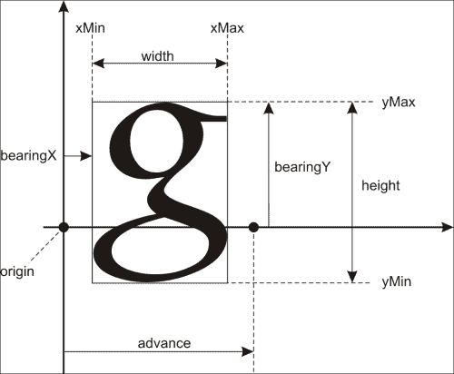
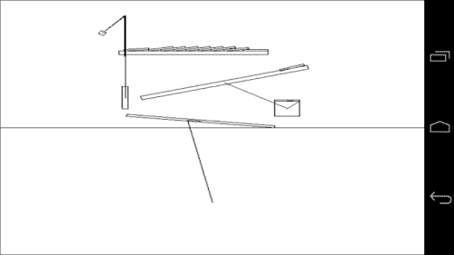

# 第二章： 移植通用库

在本章中，我们将涵盖：

+   为 Windows 编译本地静态库

+   为 Android 编译本地静态库

+   编译 libcurl 网络库

+   编译 OpenAL 库

+   编译 libvorbis、libmodplug 和 libtheora

+   使用 FreeImage 图形库

+   使用 FreeType 库进行文本渲染

+   在物理中实现定时

+   在 2D 中渲染图形

+   设置 Box2D 模拟

+   构建 ODE 物理库

# 引言

本章介绍如何使用**Android NDK**将现有的流行 C/C++库移植到 Android。这些库广泛应用于在 C++中完全实现具有图形、声音和物理模拟的富特性应用程序。仅仅编译库并没有多大意义。因此，与 FreeImage、FreeType 和 Box2D 相关的部分提供了最小示例，以演示每个库的功能。音频和网络库将在后续章节中详细讨论。我们将向您展示如何编译库，当然也会提供一些简短的示例和关于如何开始使用它们的提示。

在不同的处理器和操作系统间移植库时典型的陷阱包括内存访问（结构对齐/填充）、字节序（大小端）、调用约定和浮点问题。下面描述的所有库都很好地处理了这些问题，即使其中一些库并不正式支持 Android NDK，修复这些问题也只是几个编译器开关的问题。

要构建上述任何库，我们需要为 Windows 版本创建 makefile，并为 Android NDK 创建一对`Android.mk`和`Application.mk`文件。库的源文件被编译成目标文件。一系列目标文件组合成一个存档，这也称为静态库。稍后，这个静态库可以作为链接器的输入传递。我们从 Windows 版本开始，因为`Android.mk`和`Application.mk`文件是基于标准 makefile 构建的。

# 为 Windows 编译本地静态库

要构建 Windows 版本的库，我们需要一个 C++编译器。我们使用第一章中描述的 GCC 工具链的 MinGW。对于每个库，我们有一系列的源代码文件，并且我们需要得到静态库，一个带有`.a`扩展名的文件。

## 准备就绪

假设`src`目录包含我们需要为 Android 构建的库的源代码。

## 如何操作...

1.  让我们从编写 makefile 开始：

    ```kt
    CFLAGS = -I src
    ```

    这行定义了一个变量，其中包含编译器命令行参数的列表。在我们的例子中，我们指示编译器在`src`目录中查找头文件。如果库的源代码跨越许多目录，我们需要为每个目录添加`–I`开关。

1.  接下来，我们为每个源文件添加以下行：

    ```kt
    <SourceFile>.o:
      gcc $(CFLAGS) –c <SourceFile>.cpp –o <SourceFile>.o
    ```

    `<SourceFile>`应该被替换为实际的`.cpp`源文件名，并且针对每个源文件都要编写这些行。

1.  现在，我们添加目标文件列表：

    ```kt
    ObjectFiles = <SourceFile1>.o <SourceFile2>.o ...
    ```

1.  最后，我们编写库的目标：

    ```kt
    <LibraryName>:
      ar –rvs <LibraryName>.a $(ObjectList)
    ```

    ### 注意

    makefile 中的每一行，除了空行和目标名称，都应该以制表符开头。

1.  要构建库，请调用以下命令：

    ```kt
    >make <LibraryName>.a
    ```

    当在程序中使用库时，我们将`LibraryName.a`文件作为参数传递给`gcc`。

## 工作原理...

Makefiles 由类似于编程语言中的子例程的目标组成，通常每个目标都会生成一个目标文件。例如，我们已经看到，库的每个源文件都被编译成相应的目标文件。

目标名称可能包含文件名模式，以避免复制和粘贴，但在最简单的情况下，我们只需列出所有的源文件，并替换`SourceFile`为适当的文件名，复制这些行。`gcc`命令后的`–c`开关是编译源文件的选项，`–o`指定输出目标文件的名字。`$(CFLAGS)`符号表示将`CFLAGS`变量的值替换到命令行中。

Windows 的 GCC 工具链包括`AR`工具，这是归档器的缩写。我们库的 makefiles 调用此工具来创建库的静态版本。这是在 makefile 的最后几行完成的。

## 还有更多...

下面是一些编写 makefiles 的技巧：

1.  当带有目标文件列表的行变得过长时，可以使用反斜杠符号进行拆分，如下所示：

    ```kt
    ObjectFileList = File1.o \
       ... \
       FileN.o
    ```

    ### 注意

    反斜杠后面不应该有空格。这是`make`工具的一个限制。

1.  有时需要注释。这可以通过编写以井号开头的行来完成：

    ```kt
    # This line is a comment
    ```

如果库的头文件不在源文件所在的目录中，我们必须将这些目录添加到`CFLAGS`列表中。

# 为 Android 编译本地静态库

Android NDK 包括针对每种支持处理器的多个 GCC 和 Clang 工具链。

## 准备就绪

从源代码构建静态库时，我们遵循与 Windows 版本类似的步骤。

## 如何操作...

1.  创建一个名为`jni`的文件夹，并创建一个`Application.mk`文件，其中包含适当的编译器开关，并相应地设置库的名称。例如，FreeImage 库的一个示例应如下所示：

    ```kt
    APP_OPTIM := release
    APP_PLATFORM := android-8
    APP_STL := gnustl_static
    APP_CPPFLAGS += -frtti 
    APP_CPPFLAGS += -fexceptions
    APP_CPPFLAGS += -DANDROID
    APP_ABI := armeabi-v7a x86
    APP_MODULES := FreeImage
    ```

1.  `Android.mk`文件与我们之前章节为示例应用程序编写的类似，但有一些例外。在文件的顶部，必须定义一些必要的变量。让我们看看 FreeImage 库的`Android.mk`文件可能如下所示：

    ```kt
    # Android API level
    TARGET_PLATFORM := android-8
    # local directory
    LOCAL_PATH := $(call my-dir)
    # the command to reset the compiler flags to the empty state
    include $(CLEAR_VARS)
    # use the complete ARM instruction set
    LOCAL_ARM_MODE := arm
    # define the library name and the name of the .a file
    LOCAL_MODULE     := FreeImage
    # add the include directories
    LOCAL_C_INCLUDES += src \
    # add the list of source files
    LOCAL_SRC_FILES += <ListOfSourceFiles>
    ```

1.  定义一些常见的编译器选项：将所有警告视为错误（`-Werror`），定义`ANDROID`预处理符号，设置`system`包含目录：

    ```kt
    COMMON_CFLAGS := -Werror -DANDROID -isystem $(SYSROOT)/usr/include/
    ```

1.  编译标志根据选定的 CPU 架构而定：

    ```kt
    ifeq ($(TARGET_ARCH),x86)
      LOCAL_CFLAGS   := $(COMMON_CFLAGS)
    else
      LOCAL_CFLAGS   := -mfpu=vfp -mfloat-abi=softfp -fno-short-enums $(COMMON_CFLAGS)
    endif
    ```

1.  由于我们正在构建一个静态库，我们需要在 makefile 文件末尾添加以下行：

    ```kt
    include $(BUILD_STATIC_LIBRARY)
    ```

## 工作原理...

Android NDK 开发者提供了一组自己的规则来构建应用程序和库。在前一章中，我们看到了如何构建带有`.so`扩展名的共享对象文件。在这里，我们只需将`BUILD_SHARED_LIBRARY`符号替换为`BUILD_STATIC_LIBRARY`，并明确列出构建每个对象文件所需的源文件。

### 注意

当然，你可以构建一个共享库并以动态方式将你的应用程序链接到它。然而，这通常是在库位于系统内并被多个应用程序共享时是一个不错的选择。在我们的情况下，由于我们的应用程序是库的唯一用户，静态链接将使项目链接和调试更加容易。

# 编译 libcurl 网络库

libcurl 库是处理众多网络协议的本机应用程序的实际标准。在 Windows 主机上为 Android 编译 libcurl 需要进行一些额外的步骤。我们在此食谱中解释它们。

## 准备工作

从库主页下载 libcurl 源代码：[`curl.haxx.se/libcurl/`](http://curl.haxx.se/libcurl/)。

## 如何操作...

1.  由于 libcurl 库的构建过程基于`Autoconf`，我们实际上在构建库之前需要生成一个`curl_config.h`文件。从包含未打包的 libcurl 发行包的文件夹中运行`configure`脚本。交叉编译命令行标志应设置为：

    ```kt
    --host=arm-linux CC=arm-eabi-gcc
    ```

1.  `CPPFLAGS`变量的`-I`参数应指向你的 NDK 文件夹中的`/system/core/include`子文件夹，在我们的情况下：

    ```kt
    CPPFLAGS=”-I D:/NDK/system/core/include”
    ```

1.  libcurl 库可以通过多种方式进行定制。我们使用这组参数（除了 HTTP 之外禁用所有协议）：

    ```kt
    >configure CC=arm-eabi-gcc --host=arm-linux --disable-tftp --disable-sspi --disable-ipv6 --disable-ldaps --disable-ldap --disable-telnet --disable-pop3 --disable-ftp --without-ssl --disable-imap --disable-smtp --disable-pop3 --disable-rtsp --disable-ares --without-ca-bundle --disable-warnings --disable-manual --without-nss --enable-shared --without-zlib --without-random --enable-threaded-resolver
    ```

1.  `configure`脚本将生成一个有效的`curl_config.h`头文件。你可以在配套材料中找到它。

1.  进一步编译需要一套常规的`Android.mk/Application.mk`文件，这些文件也包含在配套材料中。

## 工作原理…

一个简单的使用示例如下所示：

```kt
CURL* Curl = curl_easy_init();
curl_easy_setopt( Curl, CURLOPT_URL, “http://www.google.com” );
curl_easy_setopt( Curl, CURLOPT_FOLLOWLOCATION, 1 );
curl_easy_setopt( Curl, CURLOPT_FAILONERROR, true );
curl_easy_setopt( Curl, CURLOPT_WRITEFUNCTION, &MemoryCallback );
curl_easy_setopt( Curl, CURLOPT_WRITEDATA, 0 );
curl_easy_perform( Curl );
curl_easy_cleanup( Curl );
```

在这里，`MemoryCallback()`是处理接收到的数据的函数。将网络响应转储到终端的最小化不安全实现可以如下所示：

```kt
size_t MemoryCallback( void* P, size_t Size, size_t Num, void* )
{
  printf( (unsigned char*)P) );
}
```

在 Windows 应用程序中，检索到的数据将在屏幕上打印。同样的代码在 Android 中将像一个哑巴一样工作，不会产生任何可见的副作用。

## 还有更多…

为了处理 SSL 加密连接，我们需要告诉 libcurl 我们的系统证书位于何处。这可以在`curl_config.h`文件开头通过定义`CURL_CA_BUNDLE`来完成：

```kt
#define CURL_CA_BUNDLE “/etc/ssl/certs/ca-certificates.crt”
```

## 另请参阅

+   第三章，*网络通信*

# 编译 OpenAL 库

OpenAL 是一个跨平台的音频库，被许多游戏引擎使用。以下是如何为 Android 构建它的注意事项。

## 准备工作

从 Martins Mozeiko 的页面下载他移植的源代码：[`pielot.org/2010/12/14/openal-on-android/`](http://pielot.org/2010/12/14/openal-on-android/)。

库的主页如下：[`github.com/AerialX/openal-soft-android`](http://github.com/AerialX/openal-soft-android)。

## 如何操作...

1.  为了渲染生成的或保存的音频流，我们使用 OpenAL 库，它是使用随附材料中包含的标准`Android.mk`和`Application.mk`配置文件编译的。

1.  该库的 Android 端口实际上是由 Martins Mozeiko 为 Android Java 类`android.media.AudioTrack`使用 JNI 制作的一个包装器。代码是在 GNU Library General Public License 下授权的，并包含在本书的补充材料中。

## 工作原理…

初始化和反初始化 OpenAL 的最小源代码如下所示：

```kt
ALCdevice* Device = alcOpenDevice( NULL );
ALCcontext* Context = alcCreateContext( Device, NULL );
alcMakeContextCurrent( Context );
…
alcDestroyContext( Context );
alcCloseDevice( Device );
```

## 另请参阅

+   第五章，*跨平台音频流传输*

# 编译 libvorbis、libmodplug 和 libtheora

对于音频流的加载，我们使用**libogg**、**libvorbis**和**libmodplug**。视频流的处理方式类似，使用**libtheora**库。在这里，我们仅提供如何从源代码构建库的一般性提示，因为一旦你有了我们的典型`Android.mk`和`Application.mk`文件，实际的构建过程是非常简单的。

## 准备工作

从[`www.xiph.org/downloads`](http://www.xiph.org/downloads)下载 libvorbis 和 libtheora 编解码器的源代码，以及从[`modplug-xmms.sourceforge.net`](http://modplug-xmms.sourceforge.net)下载 libmodplug 库。

## 如何操作...

1.  libvorbis 和 libtheora 都依赖于 libogg。使用提供的 makefiles 和包含源文件列表的标准`Android.mk`文件，这些库的编译是非常简单的。

    ### 注意

    libvorbis 和 libtheora 库的 Makefiles 必须引用 libogg 的包含目录。

1.  libmodplug 是 Olivier Lapicque 开发的开源跟踪音乐解码器。我们提供了他库的简化版本，包含最流行的跟踪文件格式的加载器。它仅由三个文件组成，并且对 Android 和 Linux 的支持非常出色。该库在大端 CPU 上没有任何问题。

# 使用 FreeImage 图形库

FreeImage 是一个可移植的图形库，它统一了诸如 JPEG、TIFF、PNG、TGA、高动态范围 EXR 图像等流行图像格式的加载和保存。

## 准备工作

从库的主页[`freeimage.sourceforge.net`](http://freeimage.sourceforge.net)下载最新的 FreeImage 源代码。我们使用的是 2012 年 10 月发布的 Version 3.15.4。

## 如何操作...

1.  `Android.mk`和`Application.mk`文件都是相当标准的。前者应该包含以下`GLOBAL_CFLAGS`的定义：

    ```kt
    GLOBAL_CFLAGS   := -O3 -DHAVE_CONFIG_H=1 -DFREEIMAGE_LIB-isystem $(SYSROOT)/usr/include/ 
    ```

1.  不幸的是，Android NDK 运行时库中缺少了 FreeImage 内部使用的`lfind()`函数（该函数在 LibTIFF4 库中使用，而 FreeImage 又使用了该库）。以下是它的实现方法：

    ```kt
    void* lfind( const void * key, const void * base, size_t num, size_t width, int (*fncomparison)(const void *, const void * ) )
    {
      char* Ptr = (char*)base;
      for ( size_t i = 0; i != num; i++, Ptr+=width )
      {
        if ( fncomparison( key, Ptr ) == 0 ) return Ptr;
      }
      return NULL;
    }
    ```

1.  现在，一个命令就能完成这项工作：

    ```kt
    >ndk-build 
    ```

## 工作原理...

图像是作为原始像素数据集合的 2D 数组表示，但存储这个数组的方法有很多：可能会应用一些压缩，可能会涉及一些非 RGB 色彩空间，或者非平凡的像素布局。为了避免处理所有这些复杂性，我们建议使用 Herve Drolon 的 FreeImage 库。

我们需要能够将图像文件数据作为内存块处理，而 FreeImage 支持这种输入方式。假设我们有一个名为`1.jpg`的文件，我们使用`fread()`或`ifstream::read()`调用将其读取到数组`char Buffer[]`中。数组的大小存储在`Size`变量中。然后，我们可以创建`FIBITMAP`结构，并使用`FreeImage_OpenMemory()` API 调用将缓冲区加载到这个`FIBITMAP`结构中。`FIBITMAP`结构几乎是我们想要的 2D 数组，包含了像素布局和图像大小的额外信息。要将它转换为 2D 数组，FreeImage 提供了函数`FreeImage_GetRowPtr()`，它返回指向第*i*行原始 RGB 数据的指针。反之，我们的帧缓冲区或任何其他 2D RGB 图像也可以使用`FreeImage_SaveMemory()`编码到内存块中，并通过单个`fwrite()`或`ofstream::write()`调用保存到文件。

下面是加载 FreeImage 支持的任何图片格式（例如 JPEG、TIFF 或 PNG）并将其转换为 24 位 RGB 图像的代码。其他支持的像素格式，如 RGBA 或浮点数 EXR，将被自动转换为 24 位颜色格式。为了简洁起见，此代码中我们不处理错误。

让我们声明一个结构体，用于保存图像尺寸和像素数据：

```kt
struct sBitmap
{
  int Width;
  int Height;
  void* RGBPixels;
};
```

从内存块到`sBitmap`结构体解码图像的方式如下：

```kt
void FreeImage_LoadImageFromMemory( unsigned char* Data, unsigned 
  int Size, sBitmap* OutBitmap )
{
  FIMEMORY* Mem = FreeImage_OpenMemory( Data, Size );

  FREE_IMAGE_FORMAT FIF=FreeImage_GetFileTypeFromMemory(Mem, 0);

  FIBITMAP* Bitmap = FreeImage_LoadFromMemory( FIF, Mem, 0 );
  FIBITMAP* ConvBitmap;

  FreeImage_CloseMemory( Mem );

  ConvBitmap = FreeImage_ConvertTo24Bits( Bitmap );

  FreeImage_Unload( Bitmap );

  Bitmap = ConvBitmap;

  OutBitmap->Width  = FreeImage_GetWidth( Bitmap );
  OutBitmap->Height = FreeImage_GetHeight( Bitmap );

  OutBitmap->RGBPixels = malloc( OutBitmap->Width * OutBitmap->Height * 3 );

	FreeImage_ConvertToRawBits( OutBitmap->RGBPixels, Bitmap, OutBitmap->Width * 3, 24, 0, 1, 2, false );

  FreeImage_Unload( Bitmap );
}
```

保存图像甚至更简单。保存表示图像的数组`img`，其宽度为`W`，高度为`H`，包含每像素`BitsPP`位：

```kt
void FreeImage_Save( const char* fname, unsigned char* img, int W, int H, int BitsPP )
{
  // Create the FIBITMAP structure
  // using the source image data
  FIBITMAP* Bitmap = FI_ConvertFromRawBits(img,
    W, H, W * BitsPP / 8,
    BitsPP, 0, 1, 2, false);
  // save PNG file using the default parameters

  FI_Save( FIF_PNG, Bitmap, fname, PNG_DEFAULT );
  FI_Unload( Bitmap );
}
```

将`FIF_PNG`更改为`FIF_BMP`、`FIF_TIFF`或`FIF_JPEG`中的任何一个，将输出文件格式分别更改为 BMP、TIFF 或 JPEG。

## 还有更多...

要理解从内存块中读取图像的重要性，我们应牢记两点。诸如**Picasa**和**Flickr**之类的网络服务提供了图像的 URL，然后使用第三章*网络通信*中的技术将这些图像下载到内存中。为了避免浪费时间，我们不将这个内存块保存到磁盘，而是直接使用 FreeImage 库从内存中解码。从压缩档案中读取图像文件也同样适用。

## 另请参阅

+   第四章，*组织虚拟文件系统*

# 使用 FreeType 库进行文本渲染

FreeType 已成为高质量文本渲染的实际标准。该库本身非常易于使用，静态版本的编译依赖于与其他本章库类似的 makefile。

## 准备开始

从库的主页下载最新的源代码：[`www.freetype.org`](http://www.freetype.org)。

FreeType 的主要概念包括：字体面、字形和位图。字体面是针对给定编码的字体中所有字符的集合。这正是存储在 `.ttf` 文件中的内容（除了版权信息和其他类似的元信息）。每个字符称为字形，使用几何基本元素表示，如样条曲线。这些字形不是我们可以逐像素复制到屏幕或帧缓冲区的东西。我们需要使用 FreeType 光栅化函数来生成字形的位图。

让我们来看一个单独的字形：



FreeType 字形度量

`xMin`、`xMax`、`yMin` 和 `yMax` 值定义了字形在逻辑坐标中的尺寸，而前进值显示了如果没有字距调整，下一个字形开始的位置。一旦我们想要在屏幕上渲染，我们需要将 FreeType 使用的逻辑坐标转换为屏幕坐标。FreeType 避免使用浮点计算，并将所有内容存储在 26.6 定点格式中（[`www.freetype.org/freetype2/docs/glyphs/glyphs-6.html`](http://www.freetype.org/freetype2/docs/glyphs/glyphs-6.html)）。为了转换从 FreeType 获取的这些复杂值，我们将这些值向右移动六位（相当于整数除以 64），得到我们可以轻松使用的值。

单独渲染每个字符的图像是不够的。有时字符在相互靠近渲染时看起来更好，某些字母组合甚至可能产生新的字形。屏幕上字符间距离的变化称为**字距调整**，FreeType 提供了计算字形之间偏移量的函数。将几个字形组合成一个字形称为**连字**，这超出了本书的范围（详情和参考资料请见[`en.wikipedia.org/wiki/Typographic_ligature`](http://en.wikipedia.org/wiki/Typographic_ligature))。在第七章，*跨平台 UI 和输入系统*中，我们仅使用简单的字距调整，这对于我们的交互式应用程序来说已经足够好了。

为了展示 FreeType 的基本使用方法，我们将在本食谱中编写代码实现：

+   使用**等宽字体**的 ASCII 字符串渲染器。

+   用于等宽字体的基于 FreeType 的纹理生成器。

后面，我们将回到涉及比例字体、UTF-8 编码和字距调整的高级 FreeType 使用方法。

## 如何操作...

1.  对于等宽字体和 8 位 ASCII 字符集，我们可以使用一个包含所有 256 个字符的单一预渲染位图来简化渲染代码。为了制作这个位图，我们编写了一个小工具，它读取 TrueType 字体，并输出一个 512 x 512 像素的方形位图，其中包含 16 × 16 字符网格：

    ```kt
    #include <stdio.h>
    #include <string.h>
    ```

1.  包含 FreeType 头文件：

    ```kt
    #include <ft2build.h>
    #include FT_FREETYPE_H
    ```

1.  声明每侧的字符数以及每个字符的大小：

    ```kt
    #define CHAR_SIZE 16
    #define SLOT_SIZE 32
    ```

1.  声明一个数组以 RGBA 格式存储输出位图：

    ```kt
    #define WIDTH CHAR_SIZE*SLOT_SIZE
    #define HEIGHT CHAR_SIZE*SLOT_SIZE
    unsigned char image[HEIGHT][WIDTH][4];
    ```

1.  使用 FreeImage 库声明一个外部定义的例程来保存`.bmp`文件：

    ```kt
    void write_bmp(const char *fname, int w, int h, int bits_pp, unsigned char *img);
    ```

1.  声明在位置`(x, y)`处渲染`FT_Bitmap`的渲染器如下：

    ```kt
    void draw_bitmap( FT_Bitmap* bitmap, FT_Int x, FT_Int y)
    {
      FT_Int i, j, p, q;
      FT_Int x_max = x + bitmap->width, y_max = y + bitmap->rows;
    ```

1.  遍历源位图的像素：

    ```kt
    for ( i = x, p = 0; i < x_max; i++, p++ )
    for ( j = y, q = 0; j < y_max; j++, q++ )
    {
      if (i < 0 || j < 0 ||
          i >= WIDTH || j >= HEIGHT ) continue;
    ```

1.  从位图中读取值`v`并将四个 RGBA 组件的每一个复制到输出中：

    ```kt
      unsigned char v = bitmap->buffer[q * bitmap->width + p];
      for(int k = 0 ; k < 4 ; k++) image[j][i][k] = v;
        }
      }
    ```

1.  应用程序的主函数`main()`如下所示：

    ```kt
    int main()
    {
    ```

1.  将位图清除为黑色：

    ```kt
      memset( &image[0][0][0], 0, sizeof(image) );
    ```

1.  初始化 FreeType 库：

    ```kt
      FT_Library   library;
      FT_Init_FreeType( &library );              
    ```

1.  创建面(face)对象：

    ```kt
      FT_Face      face;
      FT_New_Face( library, “font.ttf”, 0, &face ); 
    ```

1.  设置字符大小。我们声明了`CHAR_SIZE`来表示位图中单个字符的像素数。乘数`64`是使用的，因为 FreeType 的单位等于 1/64 点。值`100`对应于每英寸 100 个点的水平分辨率：

    ```kt
      FT_Set_Char_Size( face, CHAR_SIZE * 64, 0, 100, 0 );
      FT_GlyphSlot slot = face->glyph;
    ```

1.  渲染 ASCII 表中的每个字符：

    ```kt
      for ( int n = 0; n < 256; n++ )
      {
    ```

1.  加载下一个字形图像到槽中，覆盖之前的图像，并忽略错误：

    ```kt
        if( FT_Load_Char( face, n, FT_LOAD_RENDER ) )
          { continue; }
    ```

1.  计算字形在结果位图中的非变换原点：

    ```kt
      FT_Vector pen;
          pen.x = (n % 16) * SLOT_SIZE * 64;
          pen.y = ( HEIGHT - (n / 16) * SLOT_SIZE) * 64;
    ```

1.  现在，转换位置，绘制到我们的目标位图：

    ```kt
        draw_bitmap( &slot->bitmap,
          (pen.x/64)+slot->bitmap_left,
          EIGHT-(pen.y / 64) - slot->bitmap_top );
      }
    ```

1.  将生成的字体纹理保存为矩形`.bmp`图像文件：

    ```kt
      write_bmp( “font.bmp”, WIDTH, HEIGHT, 32,
        (unsigned char*)image );
    ```

1.  清除字体面并释放库分配的资源：

    ```kt
      FT_Done_Face(face);
      FT_Done_FreeType(library);

      return 0;
    }
    ```

1.  现在，我们有一个以左至右书写的 ASCII 字符串，我们想要构建这个字符串的图形表示。我们遍历字符串中的字符来逐个渲染它们。在每次迭代结束时，我们将当前字符的位图复制到帧缓冲区，然后使用固定的字体宽度（即`SLOT_SIZE`值）增加当前位置。

1.  这是使用预渲染位图字体来呈现文本字符串的完整代码。我们使用字体数组来存储我们字体的 RGB 位图：

    ```kt
    unsigned char* font;
    ```

1.  输出帧缓冲区的宽度和高度定义如下：

    ```kt
    int w = 1000;
    int h = 1000;
    int fw, fh;
    int char_w, char_h;
    ```

1.  将单个字符渲染到位图缓冲区：

    ```kt
    void render_char(unsigned char* buf, char ch,
     int x, int y, int col)
    {
      int u = (ch % 16) * char_w;
      int v = char_h / 2 + ((((int)ch) >> 4) - 1) * char_h;
    ```

1.  遍历当前字符的像素：

    ```kt
      for (int y1 = v ; y1 < v + char_h ; y1++ )
        for (int x1 = u ; x1 <= u + char_w ; x1++ )
        {
          int m_col = get_pixel(font, fw, fh, x1, y1);
    ```

1.  只绘制非零像素。这将保留帧缓冲区中的现有内容：

    ```kt
         if(m_col != 0)
           put_pixel(buf, w, h, x+x1-u, y+y1-v, col);
        }
    }
    ```

1.  将完整的 ASCII 文本行渲染到缓冲区：

    ```kt
    void render_text(unsigned char* buf, const char* str,
     int x, int y, int col)
    {
      const char* c = str;
      while (*c)
      {
        render_char(buf, *c, x, y, col);
        c++;
    ```

1.  以固定数量的像素前进：

    ```kt
        x += char_w;
      }
    }
    ```

## 工作原理…

让我们读取 FreeType 字体生成器的输出。我们使用以下代码来测试它：

```kt
font = read_bmp( “font.bmp”, &fw, &fh );
char_w = fw / CHAR_SIZE;
char_h = fh / CHAR_SIZE;
```

分配并清除输出 3 通道 RGB 位图：

```kt
unsigned char* bmp = (unsigned char* )malloc( w * h * 3 );
memset( bmp, 0, w * h * 3 );
```

在位置`(10,10)`处渲染白色文本行：

```kt
render_text( bmp, “Test string”, 10, 10, 0xFFFFFF );
```

将结果位图保存到文件：

```kt
write_bmp( “test.bmp”, w, h, bmp );
free( bmp );
```

## 还有更多...

我们鼓励读者访问[`www.1001freefonts.com`](http://www.1001freefonts.com)寻找一些免费字体，使用所描述的 FreeType 字体生成器为这些字体创建`.bmp`文件，并使用预渲染的字符来渲染字符串。

# 在物理中实现计时

本章的其余部分专门介绍两个物理模拟库：Box2D（2D 模拟）和 Open Dynamics Engine（3D 模拟）。构建这些并不困难，因此我们将重点放在如何实际使用它们。Box2D 和 ODE 的 API 仅提供计算模拟中刚体当前位置的函数。首先，我们必须调用计算例程。然后，我们必须将身体的物理坐标转换成与屏幕相关的坐标系。将物理模拟与渲染和计时连接起来是本节处理的主要问题。

## 准备就绪

几乎每个刚体物理库都提供了世界、物体（或身体）、约束（或关节）以及形状的抽象。这里的世界只是一个包含身体和附着在身体上的关节的集合。形状定义了身体如何碰撞。

要基于物理模拟创建动态应用程序，我们必须能够在任何时刻渲染物理场景。同时，我们还需要将离散的计时器事件转换成看似连续的物体位置计算过程。

在这里，我们解释了计时和渲染，然后提供了一个使用 Box2D 库的完整示例，即`App4`。

## 如何操作...

1.  为了在屏幕上动画化所有内容，我们需要设置一个计时器。在 Android 中，我们尽可能快地进行时间步进，并且在渲染循环的每次迭代中，我们只需调用`GetSeconds()`函数并计算前一个时间与当前时间之间的差值。`Wrappers_Android.h`文件中的`GetSeconds()`函数代码使用了标准的**POSIX** `gettimeofday()`函数：

    ```kt
    double GetSeconds()
    {
    ```

1.  将时间从微秒转换为秒的系数：

    ```kt
      const unsigned usec_per_sec = 1000000;
    ```

1.  获取当前时间：

    ```kt
      struct timeval Time;
      gettimeofday( &Time, NULL );
    ```

1.  计算微秒数：

    ```kt
    int64_t T1 = Time.tv_usec + Time.tv_sec * usec_per_sec;
    ```

1.  返回当前时间（秒）。这里需要`double`精度，因为计时器从系统启动时刻开始计时，32 位的`float`精度不够：

    ```kt
      return (double)( T1 ) / (double)usec_per_sec;
    }
    ```

1.  我们使用三个变量来记录当前时间、之前的时间和总时间。首先，我们初始化`g_OldTime`和`g_NewTime`时间计数器：

    ```kt
    g_OldTime = GetSeconds();
    g_NewTime = g_OldTime;
    ```

1.  在开始之前，总时间计数器应设为零：

    ```kt
    g_ExecutionTime = 0;
    ```

1.  每帧我们调用`GenerateTicks()`方法来设置动画：

    ```kt
    void GenerateTicks()
    {
      g_NewTime = GetSeconds();
    ```

1.  计算自上次更新以来经过的时间：

    ```kt
      float DeltaSeconds = static_cast<float>(g_NewTime-g_OldTime);
      g_OldTime = g_NewTime;
    ```

1.  使用非零秒数调用`OnTimer()`例程：

    ```kt
      if (DeltaSeconds > 0) { OnTimer(DeltaSeconds); }
    }
    ```

1.  对于 Windows 版本，使用`SetTimer()`函数进行时间步进，该函数每隔 10 毫秒启用一个系统计时器事件：

    ```kt
    SetTimer( hWnd, 1, 10, NULL);
    ```

1.  每次这些毫秒经过，`WM_TIMER`事件会被发送到我们的窗口函数。我们在`switch`构造中添加另一个`case`，只需调用`OnTimer()`方法：

    ```kt
    LRESULT CALLBACK MyFunc( HWND h, UINT msg, WPARAM w, LPARAM p )
      ...
      case WM_TIMER:
    ```

1.  由于我们即将改变状态，重新绘制一切：

    ```kt
        InvalidateRect(h, NULL, 1);
    ```

1.  使用 0.01 秒的时间片重新计算一切：

    ```kt
        OnTimer(0.01);
        break;
    ```

如第二章，*移植通用库*所述，新的`OnTimer()`回调函数与 Windows 或 Android 的特定内容无关。

## 工作原理...

现在，当我们有了为我们生成的时间器事件时，我们可以继续计算刚体的位置。这是一个解决运动方程的复杂过程。简单来说，给定当前的位置和方向，我们想要计算场景中所有刚体的新位置和方向：

```kt
positions_new = SomeFunction(positions_old, time_step);
```

在这个伪代码中，`positions_new`和`positions_old`是与刚体位置和方向的新旧数组，而`time_step`是我们应该推进时间计数器的秒数值。通常，我们需要使用`0.05`秒或更低的时间步长更新一切，以确保我们以足够高的精度计算位置和方向。对于每个逻辑计时器事件，我们可能需要进行一个或多个计算步骤。为此，我们引入了`TimeCounter`变量，并实现了所谓的**时间分片**：

```kt
const float TIME_STEP = 1.0f / 60.0f;
float TimeCounter = 0;

void OnTimer (float Delta)
{
  g_ExecutionTime += Delta;

  while (g_ExecutionTime > TIME_STEP)
  {
```

调用 Box2D 的`Step()`方法，重新计算刚体的位置，并将时间计数器减一：

```kt
    g_World->Step(Delta);
    g_ExecutionTime -= TIME_STEP;
  }
}
```

所提供的代码保证了对于时间值`t`，`Step()`方法会被调用`t / TIME_STEP`次，且物理时间和逻辑时间之间的差值不会超过`TIME_STEP`秒。

## 另请参阅…

+   第八章，*编写一个匹配 3 游戏*

# 在 2D 环境中渲染图形

为了渲染一个 2D 场景，我们使用线框模式。这只需要实现`Line2D()`过程，其原型如下：

```kt
Line2D(int x1, int y1, int x2, int y2, int color);
```

## 准备开始

这可以是对 Bresenham 算法的简单实现（[`en.wikipedia.org/wiki/Bresenham’s_line_algorithm`](http://en.wikipedia.org/wiki/Bresenham’s_line_algorithm)），本书中没有提供代码以节省空间。有关`App4`的`Rendering.h`和`Rendering.cpp`文件，请参见随书附带的材料。该书的补充材料可以从[www.packtpub.com/support](http://www.packtpub.com/support)下载。

## 如何操作…

1.  为了将模拟物理世界中的对象转换到 Box2D 库的 2D 环境中，我们必须设置一个坐标变换：

    ```kt
    [x, y]  [X_screen, Y_screen]
    ```

1.  为此，我们引入了几个系数，`XScale`，`YScale`，`XOfs`，`YOfs`，以及两个公式：

    ```kt
    X_screen = x * XScale + XOfs
    Y_screen = y * YScale + YOfs
    ```

1.  它们的工作原理如下：

    ```kt
    int XToScreen(float x)
    {
      return Width / 2 + x * XScale + XOfs;
    }
    int YToScreen(float y)
    {
      return Height / 2 - y * YScale + YOfs;
    }
    float ScreenToX(int x)
    {
      return ((float)(x - Width / 2)  - XOfs) / XScale;
    }
    float ScreenToY(int y)
    {
      return -((float)(y - Height / 2) - YOfs) / YScale;
    }
    ```

1.  我们还引入了`Line2D()`例程的快捷方式，使用 Box2D 库的`Vec2`类型直接处理向量值参数：

    ```kt
    void LineW(float x1, float y1, float x2, float y2, int col)
    {
      Line( XToScreen(x1),YToScreen(y1),
      XToScreen(x2),YToScreen(y2),col );
    }
    void Line2DLogical(const Vec2& p1, const Vec2& p2)
    {
      LineW(p1.x, p1.y, p2.x, p2.y);
    }
    ```

## 工作原理…

为了渲染一个单独的盒子，我们只需要绘制连接角点的四条线。如果一个刚体的角度是`Alpha`，质心坐标是`x`和`y`，且尺寸由宽度`w`和高度`h`指定，那么角点的坐标计算如下：

```kt
Vec2 pt[4];
pt[0] = x + w * cos(Alpha) + h * sin(Alpha)
pt[1] = x - w * cos(Alpha) + h * sin(Alpha)
pt[2] = x - w * cos(Alpha) - h * sin(Alpha)
pt[3] = x + w * cos(Alpha) - h * sin(Alpha)
```

最后，将盒子渲染为四条线：

```kt
for(int i = 0 ; i < 4 ; i++)
{
  Line2DLogical(pt[i], pt[(i+1)%4]);
}
```

## 另请参阅…

+   第六章，*统一 OpenGL ES 3 和 OpenGL 3*

# 设置 Box2D 模拟

Box2D 是一个纯 C++库，不依赖于 CPU 架构，因此使用与前面章节中类似的简单`makefile`和`Android.mk`脚本就足以构建该库。我们使用前面章节中描述的技术来设置一个模拟。我们还有上一章中的帧缓冲区，仅使用 2D 线条渲染盒子。

## 准备就绪

作为奖励，库的作者 Erin Catto 提供了一个 Box2D 的简化版本。一旦你满足于仅使用现有的盒子，你可以限制自己使用**BoxLite**版本。

从库的主页下载最新的源代码：[`box2d.org`](http://box2d.org)。

## 如何操作...

1.  为了开始使用 Box2D，我们采用了本书材料中包含的经过略微修改的 BoxLite 版本的标准示例。首先，我们声明全局的`World`对象：

    ```kt
    World* g_World = NULL;
    ```

1.  在`OnStartup()`例程的最后初始化它：

    ```kt
    g_World = new World(Vec2(0,0), 10);
    Setup(g_World);
    ```

1.  `OnTimer()`回调（之前食谱中使用的）通过调用`Step()`方法使用`TIME_STEP`常量更新`g_World`对象。

1.  `OnDrawFrame()`回调将每个刚体的参数传递给`DrawBody()`函数，该函数渲染刚体的边界框：

    ```kt
    void OnDrawFrame()
    {
      Clear(0xFFFFFF);
      for (auto b = g_World->bodies.begin();
      b !=g_World->bodies.end(); b++ )
      {
        DrawBody(*b);
      }
    ```

1.  渲染每个关节：

    ```kt
    for ( auto j = g_World->joints.begin() ;
      j != g_World->joints.end() ; j++ )
    {
      DrawJoint(*j);
    }
    ```

1.  尽可能快地更新状态：

    ```kt
        GenerateTicks();
      }
    ```

对`GenerateTicks()`函数的调用为 Android 版本实际更新定时。它是使用本章中“在物理中实现定时”食谱中的想法来实现的。

## 它是如何工作的...

`Setup()`函数是对 Box2D 原始示例代码的修改，用于设置一个物理场景。修改包括定义一些快捷方式以简化场景组装。

函数`CreateBody()`和`CreateBodyPos()`根据指定的位置、方向、尺寸和质量创建刚体。函数`AddGround()`向`g_World`添加一个静态不可移动的物体，而函数`CreateJoint()`则创建一个将一个刚体附着到另一个刚体的新物理连接。

在这个示例场景中，还有一些关节连接着这些刚体。

应用程序`App4`在 Android 和 Windows 上产生相同的结果，如下面的图像所示，这是其中一个模拟步骤：



## 还有更多...

作为练习，我们建议你尝试调整设置，并在`App4`示例中添加更多自己的 2D 场景。

## 另请参阅

+   在物理中实现定时

# 构建 ODE 物理库

本食谱致力于构建开源**ODE**（**开放动力学引擎**）物理模拟库，这是互动应用中最古老的刚体模拟器之一。

## 准备就绪

从库的主页下载最新的源代码：[`www.ode.org/download.html`](http://www.ode.org/download.html)。

## 如何操作...

1.  编译 ODE 与其他库没有区别。一个微妙的点是选择`single`和`double`浮点精度。标准编译涉及`autoconf`和`automake`工具，但这里我们只需像往常一样准备`Android.mk`、`makefile`和`odeconfig.h`。我们需要在那里定义`dDOUBLE`或`dSINGLE`符号，以启用`single`或`double`精度计算。在`odeconfig.h`文件的开头有这一行：

    ```kt
    #define dSINGLE
    ```

1.  它启用了单精度、32 位浮点计算，这对于简单的交互式应用程序来说已经足够了。将值更改为`dDOUBLE`可以启用双精度、64 位浮点计算：

    ```kt
    #define dDOUBLE
    ```

1.  ODE 是相当复杂的软件，它包含了**Ice**碰撞检测库，不幸的是，在使用 Clang 编译器的最严格设置时，它会有编译问题。但是，通过注释掉`OPCODE/Ice/IceUtils.h`文件中的`_prefetch`函数内容，可以轻松修复。

## 工作原理...

由于 ODE 在 3D 空间中计算刚体的位置和方向，因此我们必须在我们在本章中完成的简单 2D 渲染之上建立一个小型的 3D 渲染管道。为了演示 ODE 库，我们不可避免地需要一些 3D 数学知识。场景（世界）中的所有对象都有其坐标和方向，由 3D 向量和四元数组成的一对值指定。我们将它们转换为 4x4 仿射变换矩阵。然后，我们遵循坐标变换链：我们将**对象空间**转换为**世界空间**，世界空间转换为**相机空间**，然后通过乘以投影矩阵将相机空间转换为**透视后空间**。

最后，第一个透视坐标`x`和`y`被转换成标准化设备坐标，以适应我们的 2D 帧缓冲区，就像在 Box2D 示例中一样。摄像机固定在一个静止点上，其观察方向在我们的简单应用程序中无法更改。投影矩阵也是固定的，但没有其他限制。

## 还有更多...

3D 物理模拟是一个非常复杂的话题，需要阅读许多书籍。我们鼓励读者查看 ODE 社区维基页面，在[`ode-wiki.org/wiki`](http://ode-wiki.org/wiki)可以找到官方文档和开源示例。通过 Packt Publishing 出版的《*使用 Bullet Physics 和 OpenGL 学习游戏物理*》一书，可以开始游戏物理的好学习：[`www.packtpub.com/learning-game-physics-with-bullet-physics-and-opengl/book`](http://www.packtpub.com/learning-game-physics-with-bullet-physics-and-opengl/book)。

## 另请参阅

+   设置 Box2D 模拟
