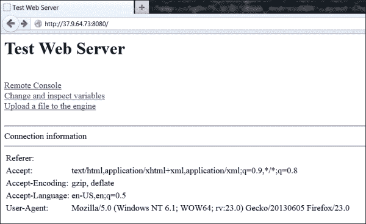

# 第三章：网络

在本章中，我们将涵盖以下内容：

+   从 Flickr 和 Picasa 获取照片列表（注意：此行为重复，在翻译中应避免重复输出）

+   从 Flickr 和 Picasa 下载图片

+   执行跨平台多线程操作

+   同步跨平台原生线程

+   使用引用计数管理内存

+   实现异步任务队列

+   处理异步回调调用

+   异步处理网络工作

+   检测网络地址

+   编写 HTTP 服务器

# 引言

在时间上，网络本质上是一个异步且不可预测的领域。我们无法确信连接的可靠性。即使使用 **TCP** 协议，也不能保证数据的送达时间，且应用程序在等待套接字中的数据时完全有可能冻结。为了开发响应迅速且安全的应用程序，我们必须解决许多问题：我们需要完全控制下载过程，限制下载数据的大小，并优雅地处理出现的错误。在不深入 HTTP 协议实现细节的情况下，我们使用 libcurl 库，专注于与游戏开发相关的高级任务。

首先，我们查看 Picasa 和 Flickr 的 REST API，以下载图像列表并构建到照片的直接 URL。然后，我们探讨线程安全的异步编程，最后使用纯 Berkeley 套接字接口实现一个简单的 HTTP 服务器，用于调试目的。

本章节关于多线程编程的示例仅限于 Windows 平台，但到了章节末尾，我们将整合所学内容，创建内置 Web 服务器的 Android `App5` 示例。

# 从 Flickr 和 Picasa 获取照片列表

在上一章节，我们构建了 libcurl 库。为了回顾如何下载网页，请参考本章配套材料中的 `1_CurlDownloader` 示例。

关于在 C++中使用 Picasa 和 Flickr 的信息相对有限，但调用这些网站的 **REST** （**表现层状态转移**）API 与下载网页没有区别。我们需要做的是为图像列表构建正确的 URL，从此 URL 下载 XML 文件，然后解析此文件以构建单个图像 URL 列表。通常，REST API 需要某种形式的 **oAuth** 认证，但对于只读访问，仅使用通过简单在线注册即可获得的应用程序密钥就足够了。

### 注意

本食谱中的示例代码仅用于构建 URL，读者需要自行下载实际图像列表。同时，这里没有提供应用程序密钥，我们鼓励读者获取密钥并测试代码。

## 准备工作

每个应用程序都必须使用通过简单注册过程获得的唯一密钥对其请求进行签名。应用程序密钥和秘密密钥是类似`14fc6b12345678901234567890d69c8d`的长十六进制数字。创建您的 Yahoo ID 账户并在以下网站获取应用程序密钥：[`www.flickr.com/services/api/misc.api_keys.html`](http://www.flickr.com/services/api/misc.api_keys.html)。如果您已经有了 Yahoo ID 账户，直接前往[`www.flickr.com/services/apps/create`](http://www.flickr.com/services/apps/create)。

Picasa 照片托管服务提供了对 RSS 订阅的免费访问，并不要求客户端应用程序使用任何认证密钥。

## 如何操作…

1.  我们希望跟上最新的照片趋势，因此我们想要获取点赞数最多的图片列表，或者最近添加的图片列表。为了访问这些列表，Flickr 提供了`flickr.interestingness.getList`和`flickr.photos.getRecent`方法，而 Picasa 提供了两个 RSS 订阅：`featured`和`all`。以下是 Flickr RSS 订阅中最近照片的示例截图：

1.  为了形成 Flickr 和 Picasa 所需的 URL，我们实现了两个函数。一个是针对 Flickr 的：

    ```kt
    std::string Flickr_GetListURL( const std::string& BaseURL,
    int MaxResults,
    int PageIndex,
    const std::string& SearchQuery )
    {
      std::string Result = BaseURL + std::string( "&api_key=" );
      Result += AppKey;
      if ( !SearchQuery.empty() )
      {
      Result += std::string( "&q=\"" ) + 
      SearchQuery + std::string( "\"" );
      }
      Result += std::string( "&per_page=" );
      Result += IntToStr( MaxResults );
    ```

1.  列表可能很大，包含很多页面。我们可以通过索引选择一个页面：

    ```kt
      if ( PageIndex > -1 )
      {
      Result += std::string( "&page=" ) + 
      IntToStr( PageIndex + 1 );
      }
      return Result;
    }
    ```

1.  另一个函数是针对 Picasa 的：

    ```kt
    std::string Picasa_GetListURL( const std::string& BaseURL,
    int MaxResults,
    int PageIndex,
    const std::string& SearchQuery )
    {
      std::string Result = BaseURL;

      Result +=  std::string( "kind=photo&imgmax=1600" );

      if ( !SearchQuery.empty() )
      {
      Result += std::string( "&q=\"" ) + 
      SearchQuery + std::string( "\"" );
      }

      Result += std::string( "&max-results=" );
      Result += IntToStr( MaxResults );

      if ( PageIndex > 0 )
      {
      Result += std::string( "&start-index=" ) + 
      IntToStr( ( int )( 1 + PageIndex * MaxResults ) );
      }

      return Result;
    }
    ```

1.  根据我们想要的列表，我们将`FlickrFavoritesURL`或`FlickrRecentURL`常量作为`Flickr_GetListURL()`函数的`BaseURL`参数传递，将`PicasaFavoritesURL`或`PicasaRecentURL`常量作为`Picasa_GetListURL()`函数的`BaseURL`参数传递。

1.  这里是需要字符串常量的完整列表：

    ```kt
    const std::string AppKey = "YourAppKeyHere";
    const std::string FlickrAPIBase = "http://api.flickr.com/services/rest/?method=";

    const std::string FlickrFavoritesURL = FlickrAPIBase + "flickr.interestingness.getList";
    const std::string FlickrRecentURL    = FlickrAPIBase + "flickr.photos.getRecent";

    const std::string PicasaAPIBase = "http://picasaweb.google.com/data/feed/api/";

    const std::string PicasaFavoritesURL = PicasaAPIBase + "featured/?";
    const std::string PicasaRecentURL    = PicasaAPIBase + "all/?";
    ```

1.  `MaxResults`参数限制了列表中的图片数量。`PageIndex`参数指定跳过多少个结果页面，而`SearchQuery`字符串可以用来获取描述中包含给定文本的图片。

1.  Flickr 版本使用了应包含获取的应用程序密钥的全局字符串常量`AppKey`。

## 它是如何工作的…

我们形成了 URL；在这种情况下，它是 Flickr 用户点赞图片的第一页：

```kt
string URL = Flickr_GetListURL(FlickrFavoritesURL, 15, 0, "");
```

然后，我们可以将这个 URL 传递给我们的 HTTP 下载器，并接收到包含图片列表的 XML 文件。对 Picasa 也可以这样做；注意基于 1 的页面索引：

```kt
string URL = Picasa_GetListURL(PicasaFavoritesURL, 15, 1, "");
```

这些函数的完整源代码可以在`2_FlickrAndPicasa`文件夹中的`PhotoAPI.cpp`文件中找到。

## 还有更多…

提供的示例不包含 Flickr 的有效应用程序密钥。另外，根据 Flickr 的许可协议，您的应用程序在一个屏幕上可能不会显示超过十五张图片。

在[`www.flickr.com/services/api/`](http://www.flickr.com/services/api/)上有关于 Flickr API 的广泛文档。

## 另请参阅

+   *从 Flickr 和 Picasa 下载图片*

# 从 Flickr 和 Picasa 下载图片

我们有一个以 XML 格式下载的图片列表，我们在 Flickr 和 Picasa 获取照片列表的食谱中下载了它。现在让我们从照片托管服务中下载实际的照片。

## 准备就绪

这里，我们需要从 Flickr 或 Picasa 获取图片列表以开始操作。使用上一个食谱下载该列表。

## 如何操作…

1.  获取列表后，我们从列表中提取单个图像 ID。拥有这些 ID 允许我们形成单个图像的 URL。Flickr 使用复杂的图像 URL 形成过程，而 Picasa 直接存储 URL。这两种服务都可以生成 XML 和 JSON 格式的响应。我们将向您展示如何使用我们的小型临时解析器解析 XML 响应。但是，如果你的项目中已经使用某种 XML 或 JSON 解析库，我们也鼓励你用它来完成这项任务。

1.  要解析 Flickr XML 列表，我们使用以下函数：

    ```kt
    void Flickr_ParseXMLResponse( const std::string& Response,
      std::vector<std::string>& URLs )
    {
      using std::string::npos;
      size_t begin = Response.find( "<photos" );
      if ( begin == npos ) { return; }
      begin = Response.find_first_of( '>', begin );
      if ( begin == npos ) { return; }
      size_t end = Response.find( "/photos>" );
      if ( end == npos ) { return; }
      size_t cur = begin;
      size_t ResLen = Response.length();
    ```

1.  用临时方法解析字符串。你可以使用你喜欢的 XML 库代替这个循环：

    ```kt
      while ( cur < ResLen )
      {
        using std::string::npos;
        size_t s_begin = Response.find( "<photo", cur );
        if ( s_begin == npos ) { break; }
        size_t s_end = Response.find( "/>", s_begin );
        if ( s_end == npos ) { break; }
        std::string Part = Response.substr( s_begin,s_end - s_begin + 2 );
        URLs.push_back( Part );
        cur = s_end + 2;
      }
    }
    ```

1.  Picasa RSS 订阅功能的 XML 格式如下所示：

    ```kt
    void Picasa_ParseXMLResponse( const std::string& Response, 
    std::vector<std::string>& URLs )
    {
      using std::string::npos;
      size_t cur = 0;
      size_t ResLen = Response.length();
    ```

1.  我们使用类似的临时代码解析提供的字符串：

    ```kt
      while ( cur < ResLen )
      {
        size_t s_begin = Response.find( "<media:content ",cur );
        if ( s_begin == npos ) { break; }
        size_t s_end = Response.find( "/>", s_begin );
        if ( s_end == npos ) { break; }
        std::string new_s = Response.substr( s_begin,s_end - s_begin + 2 );
        URLs.push_back( ExtractURLAttribute( new_s,"url=\'", '\'' ) );
        cur = s_end + 2;
      }
    }
    ```

1.  辅助函数`ExtractURLAttribute()`用于从 XML 标签中提取单个属性的值：

    ```kt
    std::string ExtractURLAttribute( const std::string& InStr,
      const std::string& AttrName,
      char Delim )
    {
      size_t AttrLen = AttrName.length();
      size_t pos = InStr.find( AttrName );
    ```

1.  扫描字符串直到末尾：

    ```kt
      if ( pos != std::string::npos )
      {
        for ( size_t j = pos+AttrLen ; j < InStr.size() ; j++ )
        {
          if ( InStr[j] == Delim ) { break; }
        }
        return InStr.substr( pos + AttrLen, j - pos - AttrLen );
      }
      return "";
    }
    ```

1.  最后，为了形成选定分辨率的 Flickr 图片 URL，我们使用这个函数：

    ```kt
    std::string Flickr_GetDirectImageURL( const std::string& InURL,
      int ImgSizeType )
    {
    ```

1.  首先，我们需要使用来自`InURL`的地址准备参数：

    ```kt
    string id     = ExtractURLAttribute(InURL, "id=\"", '"');
    string secret = ExtractURLAttribute(InURL, "secret=\"", '"');
    string server = ExtractURLAttribute(InURL, "server=\"", '"');
    string farm   = ExtractURLAttribute(InURL, "farm=\"", '"');
    ```

1.  将所有内容组合成最终字符串：

    ```kt
    std::string Res = std::string( "http://farm" ) + farm +
    std::string( ".staticflickr.com/" ) + server +
    std::string( "/" ) + id + std::string( "_" ) + secret;
    std::string Fmt = "";
    ```

1.  向结果字符串添加后缀，以确定请求照片的大小，并添加`.jpg`扩展名：

    ```kt
    if ( ImgSizeType == PHOTO_SIZE_128       ) { Fmt = "t"; }
    else if ( ImgSizeType == PHOTO_SIZE_256  ) { Fmt = "m"; }
    else if ( ImgSizeType == PHOTO_SIZE_512  ) { Fmt = "-"; }
    else if ( ImgSizeType == PHOTO_SIZE_1024 ) { Fmt = "b"; }
    else if ( ImgSizeType == PHOTO_SIZE_ORIGINAL ) { Fmt = "b"; };
    return Res + std::string( "_" ) + Fmt + std::string( ".jpg" );
    }
    ```

1.  对于 Picasa，我们通过插入不同的代码路径来修改列表中的图片 URL：

    ```kt
    std::string Picasa_GetDirectImageURL( const std::string& InURL,
      int ImgSizeType )
    {
      std::string Fmt = "";

      if ( ImgSizeType == PHOTO_SIZE_128       ) 
        { Fmt = "/s128/"; }
        else if ( ImgSizeType == PHOTO_SIZE_256  )
        { Fmt = "/s256/"; }
        else if ( ImgSizeType == PHOTO_SIZE_512  )
        { Fmt = "/s512/"; }
        else if ( ImgSizeType == PHOTO_SIZE_1024 )
        { Fmt = "/s1024/"; }
        else if ( ImgSizeType == PHOTO_SIZE_ORIGINAL )
        { Fmt = "/s1600/"; };

      size_t spos = InURL.find( "/s1600/" );

      if ( spos == std::string::npos ) { return ""; }
      const size_t Len = strlen("/s1600/");
      return InURL.substr( 0, spos ) + Fmt +
      InURL.substr( spos+Len, InURL.length()-spos-Len );
    }
    ```

1.  当我们需要同一张图片的不同分辨率时，我们提供了类型为`PhotoSize`的`ImgSizeType`参数，它可以取以下值：

    ```kt
    enum PhotoSize
    {
       PHOTO_SIZE_128     = 0,
       PHOTO_SIZE_256     = 1,
       PHOTO_SIZE_512     = 2,
       PHOTO_SIZE_1024    = 3,
       PHOTO_SIZE_ORIGINAL = 4
    };
    ```

1.  这些值与 Flickr 或 Picasa 的命名约定无关，仅内部方便使用（且与 API 独立）。

## 工作原理…

我们有来自上一个食谱的图片列表：

```kt
std::vector<std::string> Images;
void Picasa_ParseXMLResponse( Response, Images);

```

然后，对于第一张图片的 URL：

```kt
ImageURL = Picasa_GetDirectImageURL(Images[0],
PHOTO_SIZE_128);
```

最后，使用下载器获取位于`ImageURL`的图片。

## 还有更多…

Flickr 和 Picasa 网站都有一套规则，禁止大规模自动下载全尺寸图片（每秒不超过一张），我们开发的应用程序应严格遵守这些规则。

这个食谱代码的一个好处是，它可以被修改以支持知名的`Yandex.Fotki`照片网站或其他类似的提供 RSS 订阅的照片托管服务。我们将其留给读者作为一个自助练习。

# 执行跨平台多线程操作

为了继续提升用户体验，我们应该使长时间运行的任务异步化，并对其执行进行细粒度控制。为此，我们在操作系统线程之上实现了一个抽象层。

## 准备就绪

Android NDK 线程基于 POSIX 线程。查看你的 NDK 文件夹中的`platforms\android-14\arch-arm\usr\include\pthread.h`头文件。

## 如何操作...

1.  我们从线程句柄类型的声明开始：

    ```kt
    #ifndef _WIN32
    #include <pthread.h>
    typedef pthread_t thread_handle_t;
    typedef pthread_t native_thread_handle_t;
    #else
    #include <windows.h>
    typedef uintptr_t thread_handle_t;
    typedef uintptr_t native_thread_handle_t;
    #endif
    ```

1.  然后，我们声明线程接口：

    ```kt
    class iThread
    {
    public:
      iThread::iThread():FThreadHandle( 0 ), FPendingExit(false) {}
      virtual ~iThread() {}
      void Start();
      void Exit( bool Wait );
      bool IsPendingExit() const { return FPendingExit; };
    protected:
      virtual void Run() = 0;
    ```

1.  Windows 和 Android 的入口点原型在返回类型上有所不同：

    ```kt
    #ifdef _WIN32
      static unsigned int __stdcall EntryPoint( void* Ptr );
    #else
      static void* EntryPoint( void* Ptr );
    #endif
      native_thread_handle_t GetCurrentThread();
    private:
      volatile bool FPendingExit;
      thread_handle_t FThreadHandle;
    };
    ```

1.  `iThread::Start()`方法的可移植实现如下：

    ```kt
    void iThread::Start()
    {
      void* ThreadParam = reinterpret_cast<void*>( this );

    #ifdef _WIN32
      unsigned int ThreadID = 0;
      FThreadHandle = ( uintptr_t )_beginthreadex( NULL, 0, &ThreadStaticEntryPoint, ThreadParam, 0, &ThreadID );

    #else
      pthread_create( &FThreadHandle, NULL, ThreadStaticEntryPoint, ThreadParam );
      pthread_detach( FThreadHandle );
    #endif
    }
    ```

## 工作原理...

为了演示实现的线程类的使用，我们定义了一个每秒输出一条消息的新线程：

```kt
class TestThread: public iThread
{
public:
  virtual void Run()
  {
    printf("Test\n");
    Sleep(1000);
  }
};

void Test()
{
  TestThread* Thread = new TestThread();
  Thread->Start();
  while (true) {}
}
```

现在，用 C++实现一个简单的多线程应用程序并不比用 Java 难多少。

# 同步跨平台的本地线程

为了防止不同线程同时访问共享资源，需要进行同步。访问共享资源的一段代码——不能被多个线程同时访问——被称为关键段（[`en.wikipedia.org/wiki/Critical_section`](http://en.wikipedia.org/wiki/Critical_section)）。为了避免竞态条件，在关键段的入口和出口需要一种机制。在 Windows 应用程序中，关键段是 WinAPI 的一部分，在 Android 中，我们使用`pthread`库中的互斥锁，它们起到相同的作用。

## 准备工作

Android 的原生同步原语是基于 POSIX 的。它们包括线程管理函数、互斥锁、条件变量和屏障。查看你的 NDK 文件夹中的`platforms\android-14\arch-arm\usr\include\pthread.h`头文件。

## 如何操作...

1.  让我们创建一个与 API 无关的线程同步抽象：

    ```kt
    class Mutex
    {
    public:
      Mutex()
      {
    #if defined( _WIN32 )
        InitializeCriticalSection( &TheCS );
    #else
        pthread_mutex_init( &TheMutex, NULL );
    #endif
      }
      ~Mutex()
      {
    #if defined( _WIN32)
        DeleteCriticalSection( &TheCS );
    #else
        pthread_mutex_destroy( &TheMutex );
    #endif
      }
    ```

1.  在 Windows 和 Android 中锁定和解锁互斥锁也是不同的：

    ```kt
      void Lock() const
      {
    #if defined( _WIN32 )
        EnterCriticalSection( (CRITICAL_SECTION*)&TheCS );
    #else
        pthread_mutex_lock( &TheMutex );
    #endif
      }

      void Unlock() const
      {
    #if defined( _WIN32 )
        LeaveCriticalSection( (CRITICAL_SECTION*)&TheCS );
    #else
        pthread_mutex_unlock( &TheMutex );
    #endif
      }

    #if defined( _WIN32 )
      CRITICAL_SECTION TheCS;
    #else
      mutable pthread_mutex_t TheMutex;
    #endif
    };
    ```

## 工作原理...

使用**资源获取即初始化**（**RAII**）的 C++习惯用法，我们可以定义`Lock`类：

```kt
class Lock
{
public:
  explicit Lock( const clMutex* Mutex ) : FMutex( Mutex )
{ FMutex->Lock(); };
  ~Lock() { FMutex->Unlock(); };
private:
  const Mutex* FMutex;
};
```

然后，使用互斥锁就很直接了：

```kt
Lock( &SomeMutex );
```

在本书的后续章节中，几乎到处都广泛使用了互斥锁。

## 另请参阅

+   *实现异步任务队列*

# 使用引用计数管理内存

在本地代码环境中工作时，每个内存分配事件都由开发者处理。在多线程环境中跟踪所有分配变得异常困难。C++语言提供了一种避免使用智能指针手动对象析构的方法。由于我们正在开发移动应用程序，我们不能仅仅为了包含智能指针而使用整个**Boost**库。

### 注意

你可以在 Android NDK 中使用 Boost 库。我们在小型示例中避免使用它的主要原因有两个：编译时间大幅增加以及展示如何自己实现基本事物。如果你的项目已经包含了 Boost，建议你使用该库中的智能指针。编译过程简单，不需要特殊的移植步骤。

## 准备工作

我们需要一个简单的侵入式计数器，嵌入到我们所有引用计数类中。这里，我们提供了一个此类计数器的轻量级实现：

```kt
class iObject
{
public:
  iObject(): FRefCounter(0) {}
  virtual ~iObject() {}
  void    IncRefCount()
  {
#ifdef _WIN32
    return InterlockedIncrement( &FRefCounter );
#else
    return __sync_fetch_and_add( &FRefCounter, 1 );
#endif
  }
  void    DecRefCount()
  {
#ifdef _WIN32
    if ( InterlockedDecrement( &FRefCounter ) == 0 )
#else
    if ( __sync_sub_and_fetch( Value, 1 ) == 0 )
#endif
    { delete this; }
  }
private:
  volatile long    FRefCounter;
};
```

此代码在 Windows、Android 以及其他使用 `gcc` 或 `clang` 工具链的系统中可移植。

## 如何操作...

1.  我们侵入式智能指针类的实现如下：

    ```kt
    template <class T> class clPtr
    {
    public:
      clPtr(): FObject( 0 ) {}
      clPtr( const clPtr& Ptr ): FObject( Ptr.FObject )
      {
    ```

1.  在这里，我们调用一个助手来进行侵入式计数器的原子递增。这使得我们可以使用此智能指针处理不完整类型：

    ```kt
        LPtr::IncRef( FObject );
      }
      template <typename U>
      clPtr( const clPtr<U>& Ptr ): FObject( Ptr.GetInternalPtr() )
      {
        LPtr::IncRef( FObject );
      }
      ~clPtr()
      {
    ```

1.  同样的技巧也应用于原子减量操作：

    ```kt
        LPtr::DecRef( FObject );
      }
    ```

1.  我们需要一个构造函数，用于从 `T*` 进行隐式类型转换：

    ```kt
      clPtr( T* const Object ): FObject( Object )
      {
        LPtr::IncRef( FObject );
      }
    ```

1.  我们还需要一个赋值运算符：

    ```kt
      clPtr& operator = ( const clPtr& Ptr )
      {
        T* Temp = FObject;
        FObject = Ptr.FObject;

        LPtr::IncRef( Ptr.FObject );
        LPtr::DecRef( Temp );

        return *this;
      }
    ```

1.  解引用运算符（`->`）是任何智能指针的关键特性之一：

    ```kt
      inline T* operator -> () const
      {
        return FObject;
      }
    ```

1.  模仿 `dynamic_cast` 的行为：

    ```kt
      template <typename U>
      inline clPtr<U> DynamicCast() const
      {
        return clPtr<U>( dynamic_cast<U*>( FObject ) );
      }
    ```

1.  还实现了比较运算符：

    ```kt
      template <typename U>
      inline bool operator == ( const clPtr<U>& Ptr1 ) const
      {
        return FObject == Ptr1.GetInternalPtr();
      }
    ```

1.  有时，我们需要将智能指针的值传递给第三方 C API。为此，我们需要获取内部指针：

    ```kt
      inline T* GetInternalPtr() const
      {
        return FObject;
      }
    private:
      T*    FObject;
    };
    ```

请参考书中补充材料中的示例 `4_ReferenceCounting_ptr` 以获取完整的源代码。

## 工作原理...

下面是一个演示我们智能指针使用方法的简约示例：

```kt
class SomeClass: public iObject {};
void Test()
{
  clPtr<SomeClass> Ptr = new SomeClass();
}
```

`SomeClass` 的分配对象被赋值给智能指针 `Ptr`。在 `Test()` 结尾，智能指针自动销毁，分配对象引用数变为零。因此，通过 `delete()` 调用隐式销毁分配对象，从而避免内存泄漏。

## 还有更多...

我们广泛检查我们的智能指针非空，并且我们希望使用如下传统语法：

```kt
if ( SomeSmartPointer ) ...
```

这可以在不向另一个可用类型添加转换运算符的情况下实现。以下是使用私有内部类完成的方式：

```kt
private:
   class clProtector
  {
  private:
    void operator delete( void* );
  };
public:
  inline operator clProtector* () const
  {
    if ( !FObject ) return NULL;
    static clProtector Protector;
    return &Protector;
  }
```

基本上，条件 `if ( SomeSmartPointer )` 会将智能指针转换为指向 `clProtector` 类的指针。然而，C++编译器将防止你误用它。`clProtector` 的 `operator delete( void* )` 应该声明但不要定义，防止用户创建 `clProtector` 的实例。

智能指针常见的一个问题就是循环引用问题。当对象`A`持有一个指向对象`B`的引用，同时对象`B`也持有一个指向对象`A`的引用时，这两个对象的引用计数都不能为零。对于容器类来说，这种情况很常见，可以通过使用指向包含对象的原始指针而不是智能指针来避免。以下代码就是一个例子：

```kt
class SomeContainer;
class SomeElement: public iObject
{
```

指向父对象的原始指针：

```kt
  SomeContainer* Parent;
};

class SomeContainer: public iObject
{
```

被垃圾收集的元素列表：

```kt
  std::vector< clPtr<SomeElement> > Elements;
};
```

## 另请参阅

+   *实现异步任务队列*

# 实现异步任务队列

我们希望从主线程异步执行一系列任务，但保持它们之间的相对顺序。让我们为此实现一个任务队列。

## 准备就绪

我们需要前一个食谱中的互斥量和智能指针来做这件事，因为队列需要同步原语来保持其内部数据结构的一致性，并且需要智能指针来防止任务泄露。

## 如何操作...

1.  我们想要放入工作线程的任务接口如下：

    ```kt
    class iTask: public iObject
    {
    public:
      iTask()
      : FIsPendingExit(false)
      , FTaskID(0)
      , FPriority(0) {};
    ```

1.  `Run()` 方法包含了我们任务的有效载荷。所有有用的工作都在这里完成：

    ```kt
      virtual void Run() = 0;
    ```

1.  由于外部代码不知道任务的当前状态以及它现在正在做什么样的工作，因此不能从外部安全地终止任务。所以，`Exit()` 方法只是设置一个适当的标志，这意味着我们想要退出：

    ```kt
      virtual void Exit() { FIsPendingExit = true; }
    ```

1.  我们可以在 `Run()` 方法内部通过调用 `IsPendingExit()` 来检查这个标志：

    ```kt
      virtual bool IsPendingExit() const volatile
        { 
        return FIsPendingExit; }
    ```

1.  任务应该能够相互区分。这就是 ID 的作用：

    ```kt
      virtual void   SetTaskID( size_t ID ) { FTaskID = ID; };
      virtual size_t GetTaskID() const { return FTaskID; };
    private:
      volatile bool           FIsPendingExit;
      size_t                  FTaskID;
    };
    ```

1.  这里是工作线程的接口（完整的实现可以在本书的下载包中找到）：

    ```kt
    class WorkerThread: public iThread
    {
    public:
    ```

1.  我们可以随意入队和取消任务：

    ```kt
      virtual void   AddTask( const clPtr<iTask>& Task );
      virtual bool   CancelTask( size_t ID );
      virtual void   CancelAll();
      …
    ```

1.  `ExtractTask()` 私有方法用于原子地访问任务列表：

    ```kt
    private:
      clPtr<iTask> ExtractTask();
      clPtr<iTask> FCurrentTask;
    private:
      std::list< clPtr<iTask> >   FPendingTasks;
      tthread::mutex              FTasksMutex;
      tthread::condition_variable FCondition;
    };
    ```

## 工作原理...

我们启动一个单独的工作线程并运行一个简单任务。与运行三个独立线程的关键区别在于，所有任务都是顺序执行的，并且一个公共资源（在我们的例子中是输出窗口）也是顺序使用，无需处理并发访问：

```kt
class TestTask: public iTask
{
public:
  virtual void Run()
  {
    printf("Test\n");
  }
};

int main()
{
  WorkerThread* wt = new WorkerThread();
  wt->Start( iThread::Priority_Normal );
```

逐个添加三个任务：

```kt
  wt->AddTask( new TestTask() );
  wt->AddTask( new TestTask() );
  wt->AddTask( new TestTask() );
```

任务永远不会并行执行，而是顺序执行。使用一个简单的自旋锁来等待所有任务的完成：

```kt
  while (wt->GetQueueSize() > 0) {}

  return 0;
}
```

# 处理异步回调调用

在多线程编程中，我们可能会遇到的一个简单情况是需要在另一个线程上运行一个方法。例如，当工作线程上的下载任务完成时，主线程可能希望被通知任务完成，以解析下载的数据。在本食谱中，我们将实现这样的通知机制。

## 准备就绪

在我们继续实现细节之前，理解**异步事件**的概念很重要。当我们说异步时，我们指的是某件事发生不可预测并且没有确定的时间。例如，我们无法预测下载 URL 需要多长时间——这就是任务；任务异步完成并应异步调用**回调**。

## 如何操作…

1.  对我们来说，消息应该是一个方法调用。我们将一个方法调用隐藏在这个接口后面：

    ```kt
    class iAsyncCapsule: public iObject
    {
    public:
      virtual void Invoke() = 0;
    };
    ```

1.  此类型的实例指针表示一个准备好的方法调用。我们定义了一个 `iAsyncCapsule` 队列，以下是其实现：

    ```kt
    class AsyncQueue
    {
    public:
      AsyncQueue(): FDemultiplexerMutex()
      , FCurrentQueue( 0 )
      , FAsyncQueues( 2 )
      , FAsyncQueue( &FAsyncQueues[0] )
      { }
    ```

1.  入队一个事件：

    ```kt
      void EnqueueCapsule( const clPtr<iAsyncCapsule>& Capsule )
      {
        LMutex Mutex( &FDemultiplexerMutex );
        FAsyncQueue->push_back( Capsule );
      }
    ```

1.  如 `Reactor` 模式（[`en.wikipedia.org/wiki/Reactor_pattern`](http://en.wikipedia.org/wiki/Reactor_pattern)）中描述的事件多路分解器：

    ```kt
      void DemultiplexEvents()
      {
        CallQueue* LocalQueue = &FAsyncQueues[ FCurrentQueue ];

        {
          LMutex Lock( &FDemultiplexerMutex );
    ```

1.  这是一个奇偶技巧，用来防止复制整个队列。我们保留两个队列并在它们之间切换：

    ```kt
          FCurrentQueue = ( FCurrentQueue + 1 ) % 2;
          FAsyncQueue = &FAsyncQueues[ FCurrentQueue ];
        }
    ```

1.  注意上面互斥锁的作用域。我们在互斥锁锁定时不应调用回调：

    ```kt
        for ( CallQueue::iterator i = LocalQueue->begin();
         i != LocalQueue->end(); ++i )
         (*i)->Invoke();
         LocalQueue->clear();
      }
    private:
      size_t FCurrentQueue;

      typedef std::vector< clPtr<iAsyncCapsule> > CallQueue;
      std::vector<CallQueue> FAsyncQueues;

      CallQueue* FAsyncQueue;
      Mutex FDemultiplexerMutex;
    };
    ```

## 工作原理…

我们启动两个线程。一个通过在无限循环中调用 `DemultiplexEvents()` 函数来处理传入事件：

```kt
class ResponseThread: public iThread, public AsyncQueue
{
public:
  virtual void Run() { while (true) { DemultiplexEvents(); } }
};
ResponseThread* Responder;
```

另一个线程生成异步事件：

```kt
class RequestThread: public iThread
{
public:
  virtual void Run()
  {
    while ( true )
    {
      Responder->EnqueueCapsule( new TestCall() );
      Sleep(1000);
    }
  }
};
```

我们对事件的响应在 `TestCall` 类中实现：

```kt
class TestCall: public iAsyncCapsule
{
public:
  virtual void Invoke() { printf("Test\n"); }
};
```

`main()` 函数启动两个线程并无限期等待（你可以按 *Ctrl* + *Break* 来停止它）：

```kt
int main()
{
   (Responder = new ResponseThread())->Start();
   (new RequestThread())->Start();
    while (true) {}
    return 0;
}
```

你应该看到以下输出：

```kt
Test
Test
Test
…
```

`printf()` 函数可能不是线程安全的，但我们的队列确保对它的调用不会相互干扰。

# 异步处理网络工作

网络本质上是一组不可预测和异步的操作。让我们在单独的线程中异步执行，以防止在 UI 线程上发生停滞，这可能导致 Android 上的 ANR 行为。

## 准备就绪

这里，我们需要用到本章前面食谱中实现的所有内容：智能指针、工作线程、libcurl 下载器以及异步事件队列。

## 如何操作…

1.  我们从 `iTask` 派生 `DownloadTask` 类，它使用 libcurl 库执行 HTTP 请求。在这里，我们实现其方法 `Run()`，该方法设置 libcurl 库并执行网络操作：

    ```kt
    void DownloadTask::Run()
    {
      clPtr<DownloadTask> Guard( this );
      CURL* C = curl_easy_init();
    ```

1.  设置 libcurl 的参数：

    ```kt
      curl_easy_setopt( C, CURLOPT_URL, FURL.c_str() );
      curl_easy_setopt( C, CURLOPT_FOLLOWLOCATION, 1 );
      curl_easy_setopt( C, CURLOPT_NOPROGRESS, false );
      curl_easy_setopt( C, CURLOPT_FAILONERROR, true );
      curl_easy_setopt( C, CURLOPT_MAXCONNECTS, 10 );
      curl_easy_setopt( C, CURLOPT_MAXFILESIZE, DownloadSizeLimit );
      curl_easy_setopt( C, CURLOPT_WRITEFUNCTION, &MemoryCallback );
      curl_easy_setopt( C, CURLOPT_WRITEDATA, this );
      curl_easy_setopt( C, CURLOPT_PROGRESSFUNCTION,
        &ProgressCallback );
      curl_easy_setopt( C, CURLOPT_PROGRESSDATA, this );
      curl_easy_setopt( C, CURLOPT_CONNECTTIMEOUT, 30 );
      curl_easy_setopt( C, CURLOPT_TIMEOUT, 60 );
    ```

1.  禁用 SSL 密钥验证：

    ```kt
      curl_easy_setopt( C, CURLOPT_SSL_VERIFYPEER, 0 );
      curl_easy_setopt( C, CURLOPT_SSL_VERIFYHOST, 0 );
    ```

1.  同步执行网络操作。`curl_easy_perform()` 调用会阻塞当前线程，直到从网络获取结果或发生错误：

    ```kt
      FCurlCode = curl_easy_perform( Curl );
    ```

1.  读取结果并为库清理：

    ```kt
      curl_easy_getinfo( Curl, CURLINFO_RESPONSE_CODE, &FRespCode );
      curl_easy_cleanup( Curl );
    ```

1.  告诉下载器为此任务调用完成回掉：

    ```kt
      if ( FDownloader ) { FDownloader->CompleteTask( this ); }
    }
    ```

## 工作原理…

我们提供了一个代码片段，该片段从 Flickr 回声服务下载响应并在主线程上处理任务完成：

```kt
volatile bool g_ShouldExit = false;

class TestCallback: public DownloadCompleteCallback
{
public:
  TestCallback() {}
```

将结果打印到控制台窗口：

```kt
  virtual void Invoke()
  {
    printf("Download complete\n");
    printf("%s\n", (unsigned char*)FResult->GetData());
    g_ShouldExit = true;
  }
};

int main()
{
  Curl_Load();
  iAsyncQueue* Events = new iAsyncQueue();
  Downloader* d = new Downloader();
  d->FEventQueue = Events;
  …
  d->DownloadURL(
  "http://api.flickr.com/services/rest/?method=flickr.test.echo&name=value", 1, new TestCallback()
);
```

等待传入事件：

```kt
  while (!g_ShouldExit)
  {
    Events->DemultiplexEvents();
  }
  …
}
```

## 另请参阅

+   *从 Flickr 和 Picasa 下载图片*

# 检测网络地址

要与网页服务器通信，我们需要指定其 IP 地址。在受限的移动环境中，向用户询问 IP 地址不方便，我们必须自己检测地址（且不涉及任何不可移植的代码）。在接下来的 `App5` 示例中，我们使用了来自 Windows API 的 `GetAdaptersAddresses()` 函数以及 POSIX 的 `getifaddrs()` 函数。Android 运行时库提供了自己的 `getifaddrs()` 实现，该实现包含在 `App5` 源文件中的 `DetectAdapters.cpp` 文件中。

## 准备就绪

让我们声明一个结构来保存描述网络适配器的信息：

```kt
struct sAdapterInfo
{
```

这是网络适配器的内部系统名称：

```kt
  char FName[256];
```

适配器的 IP 地址如下：

```kt
  char FIP[128];
```

适配器的唯一识别号码：

```kt
  char FID[256];
};
```

## 如何操作…

1.  我们在下面的代码中提供了 Android 版本的 `Net_EnumerateAdapters()` 函数的详细代码。它枚举了系统中可用的所有网络适配器：

    ```kt
    bool Net_EnumerateAdapters( std::vector<sAdapterInfo>& Adapters )
    {
      struct ifaddrs* MyAddrs, *ifa;
      void* in_addr;
      char buf[64];
    ```

1.  `getifaddrs()` 函数创建一个描述本地系统网络接口的结构链表：

    ```kt
      if ( getifaddrs( &MyAddrs ) != 0 ) { return false; }
      …
    ```

1.  遍历链表：

    ```kt
      for ( ifa = MyAddrs; ifa != NULL; ifa = ifa->ifa_next )
      {
        if ( ( ifa->ifa_addr == NULL ) ||
        !( ifa->ifa_flags & IFF_UP ) ) { continue; }
    ```

1.  分别处理 IPv4 和 IPv6 地址：

    ```kt
        switch ( ifa->ifa_addr->sa_family )
        {
          case AF_INET:
          { in_addr = &( ( struct sockaddr_in* )
          ifa->ifa_addr )->sin_addr;   break; }

          case AF_INET6:
          { in_addr = &( ( struct sockaddr_in6* )
          ifa->ifa_addr )->sin6_addr; break; }

          default:
            continue;
        }
    ```

1.  将网络地址结构转换为 C 字符串，并将其保存在`Adapters`向量中：

    ```kt
        if ( inet_ntop( ifa->ifa_addr->sa_family,in_addr, buf, sizeof( buf ) ) )
        {
          sAdapterInfo Info;
          strcpy( Info.FName, ifa->ifa_name );
          strcpy( Info.FIP, buf );
          sprintf( Info.FID, "%d", Idx );
          Adapters.push_back( Info );
          Idx++;
        }
      }
    ```

1.  释放链表：

    ```kt
      freeifaddrs( MyAddrs );
    ```

## 工作原理...

要在控制台窗口中枚举所有适配器，我们使用一个简单的循环：

```kt
  int main()
  {
    std::vector<sAdapterInfo> a;
    Net_EnumerateAdapters( a );

    for(size_t i = 0 ; i < a.size() ; i++)
    {
      printf("[%d] %s\n", i + 1, a[i].FIP);
    }
    return 0;
  }
```

这段代码的 Android 实现在`App5`项目中。

## 还有更多...

幸运的是，上述代码适用于任何 POSIX 系统，`App5`示例还提供了 Windows 版本的`Net_EnumerateAdapters()`。在 Android 上，我们必须为我们的应用程序启用`ACCESS_NETWORK_STATE`和`INTERNET`权限；否则，系统将不允许我们访问互联网。这在`App5`示例的`AndroidManifest.xml`文件中完成，使用以下几行：

```kt
<uses-permission
android:name="android.permission.INTERNET"/>
<uses-permission
android:name="android.permission.ACCESS_NETWORK_STATE"/>
```

不要忘记将这些行放入打算与网络工作的应用程序的清单中。

# 编写 HTTP 服务器

在处理移动开发时，我们最终要在真实设备上运行游戏。在此之前，我们必须使用一些调试工具。当然，我们可能会设置远程调试`gdb`，但当大多数与访问违规相关的关键错误被消除后，逻辑错误或与竞态条件相关的错误就会出现，这些问题难以追踪，并且需要多次对应用程序进行一些琐碎的更改并重新部署。为了能够直接在 Android 设备上快速更改应用程序的运行时行为，我们可以实现一个嵌入式 Web 服务器，并通过界面微调应用程序的一些内部参数。此配方包含了`App5`的概要，它实现了这样的 Web 服务器。

## 准备就绪

从零开始编写 HTTP 服务器并不容易，因此我们使用了 René Nyffenegger 提供的免费简单服务器，可以从以下网页获取：[`www.adp-gmbh.ch/win/misc/webserver.html`](http://www.adp-gmbh.ch/win/misc/webserver.html)。

我们直接使用这些资源的大部分，并在`App5`示例中包含了支持 Android 的更精致版本。与原始版本最重要的区别在于，我们使用了基于**WinSock**和**Android BSD**套接字的抽象套接字 API。我们建议您仔细查看`App5`源中的`Sockets.h`和`Sockets.cpp`文件。

## 如何操作…

1.  HTTP 服务器在一个单独的线程上启动，该线程是`iThread`类的后代。服务器的主循环很简单：

    ```kt
      while ( !IsPendingExit() )
      {
        LTCPSocket* NewSocket = in->Accept();
        if ( NewSocket != 0 )
        {
          // Add new thread
          HTTPRequestThread* T = new HTTPRequestThread();
          T->FServer = this;
          T->FSocket = NewSocket;
          T->Start();
        }
      }
    ```

1.  我们等待传入的连接，当`Accept()`方法成功时，将启动一个新的`HTTPRequestThread`。此线程从新创建的套接字读取数据并填充`sHTTPServerRequest`结构。最后，在`HandleRequest()`方法中处理此请求，通过填充`sHTTPServerRequest::FData`字段来发送 HTML 页面的内容。最终，这些数据被发送到客户端。代码是线性的，但在这里呈现有些过长。我们建议读者查看`HTTP.cpp`文件以了解详细信息。

## 工作原理…

为了使用这个服务器，我们在`HTTP.cpp`文件中创建了`HTTPServerThread`实例，并实现了`SetVariableValue()`和`GetVariableValue()`函数，默认情况下这些函数是空的。服务器启动代码位于`OnStart()`函数中。

我们创建服务器实例：

```kt
g_Server = new HTTPServerThread();
```

然后，我们使用检测到的适配器地址：

```kt
if ( !Adapters.empty() )
{
  g_Server->FBindAddress = Adapters[0].FIP;
}
```

最后，我们启动网页服务器线程：

```kt
g_Server->Start();
```

默认情况下，服务器启动的 IP 地址是`127.0.0.1`，端口号是`8080`。

在 Android 设备上启动`App5`之后，我们可以通过任何桌面电脑的网页浏览器连接到它：只需输入其 IP 地址和端口号。IP 地址由网页服务器在启动时检测，并显示在设备屏幕顶部。

以下是我们的微型网页服务器输出的浏览器截图：



从桌面网页浏览器访问我们的 Android 网页服务器。

## 还有更多…

`App5`既可以在 Windows 上运行，也可以在 Android 上运行，但与网络配置相关的细节需要注意。

如果我们使用 3G 或类似的蜂窝网络，很可能我们没有外部 IP 地址，因此为了让我们的网页服务器在浏览器中可见，我们应该坚持使用 Wi-Fi 连接。

## 另请参阅

+   *从 Flickr 和 Picasa 下载图片*
