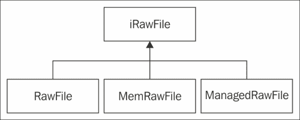

# 第四章：组织虚拟文件系统

> ***文件*：可以写入、读取或同时进行两者的对象。文件具有某些属性，包括类型。常见的文件类型包括普通文件和目录。其他类型的文件，如符号链接，可能由实现支持。*
> 
> ***文件系统*：一系列文件及其某些属性的集合。*
> 
> （Boost 文档，[`www.boost.org`](http://www.boost.org)）

在本章中，我们将涵盖以下内容：

+   抽象文件流

+   实现可移植的内存映射文件

+   实现文件写入器

+   使用内存文件

+   实现挂载点

+   列举.zip 档案中的文件

+   从.zip 压缩文件中解压文件

+   异步加载资源

+   存储应用程序数据

# 引言

文件是任何计算机系统的构建块。本章处理只读应用程序资源的可移植处理，并提供存储应用程序数据的方案。我们还使用第三章*网络通信*中的代码，组织从`.zip`档案中异步加载资源。

让我们简要考虑本章所涉及的问题。第一个问题是访问应用程序数据文件。通常，桌面操作系统的应用程序数据与可执行文件位于同一文件夹中。在 Android 上，事情会变得有些复杂。应用程序文件被打包在`.apk`文件中，我们根本无法使用标准的`fopen()`类函数，或者`std::ifstream`和`std::ofstream`类。

第二个问题源于文件名和路径的不同规则。Windows 和基于 Linux 的系统使用不同的路径分隔符字符，并提供不同的低级文件访问 API。

第三个问题源于文件 I/O 操作很容易成为整个应用程序中最慢的部分。如果涉及到交互延迟，用户体验可能会出现问题。为了避免延迟，我们应该在单独的线程上执行 I/O 操作，并在另一个线程上处理`Read()`操作的结果。为了实现这一点，我们拥有所需的所有工具，如第三章*网络通信*所述——工作线程、任务、互斥量和异步事件队列。

我们从抽象的 I/O 接口开始，实现可移植的`.zip`档案处理方法，并继续进行异步资源加载。

# 抽象文件流

文件 I/O API 在 Windows 和 Android（POSIX）操作系统之间略有不同，我们必须将这些差异隐藏在一系列一致的 C++接口后面。我们在第二章*移植通用库*中编译的所有库都使用它们自己的回调和接口。为了统一它们，我们将在本章及后续章节中编写适配器。

## 准备工作

请确保你熟悉 UNIX 关于文件和内存映射的概念。维基百科可能是一个不错的起点（[`en.wikipedia.org/wiki/Memory-mapped_file`](http://en.wikipedia.org/wiki/Memory-mapped_file)）。

## 如何操作...

1.  从现在开始，我们的程序将使用以下简单的接口来读取输入数据。基类`iObject`用于向此类实例添加侵入式引用计数器：

    ```kt
    class iIStream: public iObject
    {
    public:
      virtual void    Seek( const uint64 Position ) = 0;
      virtual uint64  Read( void* Buf, const uint64 Size ) = 0;
      virtual bool    Eof() const = 0;
      virtual uint64  GetSize() const = 0;
      virtual uint64  GetPos() const = 0;
    ```

    以下是一些利用内存映射文件的方法：

    ```kt
      virtual const ubyte*  MapStream() const = 0;
      virtual const ubyte*  MapStreamFromCurrentPos() const = 0;
    };
    ```

    此接口支持使用`MapStream()`和`MapStreamFromCurrentPos()`成员函数进行内存映射访问，以及使用`BlockRead()`和`Seek()`方法的顺序访问。

1.  为了将一些数据写入存储，我们使用了如下的输出流接口（同样，基类`iObject`用于添加引用计数器）：

    ```kt
    class iOStream: public iObject
    {
    public:
      virtual void   Seek( const uint64 Position ) = 0;
      virtual uint64 GetFilePos() const = 0;
      virtual uint64 Write( const void* B, const uint64 Size ) = 0;
    };
    ```

1.  `iIStream`接口的`Seek()`、`GetFileSize()`、`GetFilePos()`以及与文件名相关的方法可以在一个名为`FileMapper`的单一类中实现：

    ```kt
    class FileMapper: public iIStream
    {
    public:
      explicit FileMapper( clPtr<iRawFile> File );
      virtual ~FileMapper();
      virtual std::string GetVirtualFileName() const{ return FFile->GetVirtualFileName(); }
      virtual std::string  GetFileName() const{ return FFile->GetFileName(); }
    ```

1.  从此流中读取连续的数据块，并返回实际读取的字节数：

    ```kt
      virtual uint64 BlockRead( void* Buf, const uint64 Size )
      {
        uint64 RealSize =( Size > GetBytesLeft() ) ? GetBytesLeft() : Size;
    ```

1.  如果我们已经读取了所有内容，则返回零：

    ```kt
        if ( RealSize < 0 ) { return 0; }
        memcpy( Buf, ( FFile->GetFileData() + FPosition ),static_cast<size_t>( RealSize ) );
    ```

1.  前进当前位置并返回复制的字节数：

    ```kt
        FPosition += RealSize;
        return RealSize;
      }

      virtual void Seek( const uint64 Position )     
      { FPosition  = Position; }
      virtual uint64 GetFileSize() const
      { return FFile->GetFileSize(); }
      virtual uint64 GetFilePos()  const
      { return FPosition; }
      virtual bool         Eof() const        
      { return ( FPosition >= GetFileSize() ); }

      virtual const ubyte* MapStream() const
      { return FFile->GetFileData(); }
      virtual const ubyte* MapStreamFromCurrentPos() const 
      { return ( FFile->GetFileData() + FPosition ); }
    private:
      clPtr<iRawFile> FFile;
      uint64          FPosition;
    };
    ```

1.  `FileMapper`使用以下`iRawFile`接口来抽象数据访问：

    ```kt
    class iRawFile: public iObject
    {
    public:
      iRawFile() {};
      virtual ~iRawFile() {};
      void        SetVirtualFileName( const std::string& VFName );void        SetFileName( const std::string& FName );std::string GetVirtualFileName() const;
      std::string GetFileName();
      virtual const ubyte* GetFileData() const = 0;
      virtual uint64       GetFileSize() const = 0;
    protected:
      std::string    FFileName;
      std::string    FVirtualFileName;
    };
    ```

除了这里实现的琐碎的`GetFileName()`和`SetFileName()`方法，在以下食谱中，我们实现了`GetFileData()`和`GetFileSize()`方法。

## 它是如何工作的...

`iIStream::BlockRead()`方法在处理不可查找流时非常有用。为了尽可能快地访问，我们使用了以下食谱中实现的内存映射文件。`MapStream()`和`MapStreamFromCurrentPos()`方法旨在方便地提供对内存映射文件的访问。这些方法返回一个指向内存的指针，你的文件或文件的一部分就在这里映射。`iOStream::Write()`方法与标准的`ofstream::write()`函数类似。有关此食谱及以下食谱的完整源代码，请参考项目`1_AbstractStreams`。

## 还有更多...

在为多个平台编程时，对我们来说，在 Windows 和基于 Linux 的 Android 上，文件名转换是一个重要的问题。

我们定义了以下`PATH_SEPARATOR`常量，使用特定于操作系统的宏，以以下方式确定路径分隔符字符：

```kt
#if defined( _WIN32 )
const char PATH_SEPARATOR = '\\';
#else
const char PATH_SEPARATOR = '/';
#endif
```

以下简单的函数帮助我们确保为我们的操作系统使用有效的文件名：

```kt
inline std::string Arch_FixFileName(const std::string& VName)
{
  std::string s( VName );
  std::replace( s.begin(), s.end(), '\\', PATH_SEPARATOR );
  std::replace( s.begin(), s.end(), '/', PATH_SEPARATOR );
  return s;
}
```

## 另请参阅

+   *实现可移植的内存映射文件*

+   *使用内存中文件*

# 实现可移植的内存映射文件

现代操作系统提供了一个强大的机制，称为内存映射文件。简而言之，它允许我们将文件内容映射到应用程序地址空间。在实践中，这意味着我们可以像使用普通数组一样处理文件，并使用 C 指针访问它们。

## 准备就绪

为了理解前一个食谱中接口的实现，我们建议阅读有关内存映射的内容。在 MSDN 页面可以找到此机制在 Windows 中的实现概述，链接为：[`msdn.microsoft.com/en-us/library/ms810613.aspx`](http://msdn.microsoft.com/en-us/library/ms810613.aspx)。

要了解更多关于内存映射的信息，读者可以参考 `mmap()` 函数的文档。

## 如何操作...

1.  在 Windows 中，内存映射文件是通过 `CreateFileMapping()` 和 `MapViewOfFile()` API 调用创建的。Android 使用 `mmap()` 函数，其工作方式几乎相同。这里我们声明实现了 `iRawFile` 接口的 `RawFile` 类。

    `RawFile` 持有一个指向内存映射文件的指针及其大小：

    ```kt
      ubyte*    FFileData;
      uint64    FSize;
    ```

1.  对于 Windows 版本，我们使用两个句柄分别指向文件和内存映射对象，而对于 Android，我们只使用文件句柄：

    ```kt
    #ifdef _WIN32
      HANDLE     FMapFile;
      HANDLE     FMapHandle;
    #else
      int        FFileHandle;
    #endif
    ```

1.  我们使用以下函数来打开文件并创建内存映射：

    ```kt
    bool RawFile::Open( const string& FileName,const string& VirtualFileName )
    {
    ```

1.  首先，我们需要获取与文件关联的有效文件描述符：

    ```kt
    #ifdef OS_WINDOWS
      FMapFile = (void*)CreateFileA( FFileName.c_str(),GENERIC_READ, FILE_SHARE_READ,NULL, OPEN_EXISTING,FILE_ATTRIBUTE_NORMAL | FILE_FLAG_RANDOM_ACCESS,NULL );
    #else
      FFileHandle = open( FileName.c_str(), O_RDONLY );
      if ( FFileHandle == -1 )
      {
        FFileData = NULL;
        FSize = 0;
      }
    #endif
    ```

1.  使用文件描述符，我们可以创建一个文件映射。这里为了清晰起见，我们省略了错误检查。但是，补充材料中的示例包含了更多的错误检查：

    ```kt
    #ifdef OS_WINDOWS
      FMapHandle = (void*)CreateFileMapping( ( HANDLE )FMapFile,NULL, PAGE_READONLY, 0, 0, NULL );
      FFileData = (Lubyte*)MapViewOfFile((HANDLE)FMapHandle,FILE_MAP_READ, 0, 0, 0 );
      DWORD dwSizeLow = 0, dwSizeHigh = 0;
      dwSizeLow = ::GetFileSize( FMapFile, &dwSizeHigh );
      FSize = ((uint64)dwSizeHigh << 32) | (uint64)dwSizeLow;
    #else
      struct stat FileInfo;
     fstat( FFileHandle, &FileInfo );
      FSize = static_cast<uint64>( FileInfo.st_size );
      FFileData = (Lubyte*) mmap(NULL, FSize, PROT_READ,MAP_PRIVATE, FFileHandle, 0 );
      close( FFileHandle );
    #endif
      return true;
    }
    ```

1.  正确的逆初始化函数会关闭所有的句柄：

    ```kt
    bool RawFile::Close()
    {
    #ifdef OS_WINDOWS
      if ( FFileData  ) UnmapViewOfFile( FFileData );
      if ( FMapHandle ) CloseHandle( (HANDLE)FMapHandle );
      CloseHandle( (HANDLE)FMapFile );
    #else
      if ( FFileData ) munmap( (void*)FFileData, FSize );
    #endif
      return true;
    }
    ```

1.  `iRawFile` 接口的主要函数 `GetFileData` 和 `GetFileSize` 在这里有简单的实现：

    ```kt
      virtual const ubyte* GetFileData() { return FFileData; }
      virtual uint64       GetFileSize() { return FSize;     }
    ```

## 它是如何工作的...

要使用 `RawFile` 类，我们需要创建一个实例并将其包裹进 `FileMapper` 类的实例中：

```kt
  clPtr<RawFile> F = new RawFile();
  F->Open("SomeFileName");
  clPtr<FileMapper> FM = new FileMapper(F);
```

`FM` 对象可以与任何支持 `iIStream` 接口的功能一起使用。我们所有的 `iRawFile` 实现层次结构如下所示：



# 实现文件写入器

通常情况下，我们的应用程序可能希望将其一些数据存储在磁盘上。我们已经遇到过的另一个典型用例是从网络下载文件到内存缓冲区。这里，我们为普通文件和内存文件实现了 `iOStream` 接口的两种变体。

## 如何操作...

1.  让我们从 `iOStream` 接口派生 `FileWriter` 类。我们在 `iOStream` 接口的基础上添加了 `Open()` 和 `Close()` 成员函数，并仔细实现了 `Write()` 操作。我们的输出流实现不使用内存映射文件，而是使用普通文件描述符，如下代码所示：

    ```kt
    class FileWriter: public iOStream
    {
    public:
      FileWriter(): FPosition( 0 ) {}
      virtual ~FileWriter() { Close(); }

      bool Open( const std::string& FileName )
      {
        FFileName = FileName;
    ```

1.  我们使用定义分割 Android 和 Windows 特定的代码路径：

    ```kt
    #ifdef _WIN32
        FMapFile = CreateFile( FFileName.c_str(),GENERIC_WRITE, FILE_SHARE_READ, NULL, CREATE_ALWAYS,FILE_ATTRIBUTE_NORMAL, NULL );
        return !( FMapFile == ( void* )INVALID_HANDLE_VALUE );
    #else
        FMapFile = open( FFileName.c_str(), O_WRONLY|O_CREAT );
        FPosition = 0;
        return !( FMapFile == -1 );
    #endif
      }
    ```

1.  同样的技术在其他方法中也被使用。两个操作系统之间的差异微不足道，因此我们决定将所有内容放在一个单一类别中，并通过定义来分隔代码：

    ```kt
      void Close()
      {
    #ifdef _WIN32
        CloseHandle( FMapFile );
    #else
        if ( FMapFile != -1 ) { close( FMapFile ); }
    #endif
      }
      virtual std::string GetFileName() const { return FFileName; }
      virtual uint64      GetFilePos() const { return FPosition; }
      virtual void        Seek( const uint64 Position )
      {
    #ifdef _WIN32
        SetFilePointerEx( FMapFile,*reinterpret_cast<const LARGE_INTEGER*>( &Position ),NULL, FILE_BEGIN );
    #else
        if ( FMapFile != -1 )
        { lseek( FMapFile, Position, SEEK_SET ); }
    #endif
        FPosition = Position;
      }
    ```

    ### 注意

    然而，如果你决定支持更多的操作系统，事情可能会变得更加复杂。这将是一个很好的重构练习。

    ```kt
      virtual uint64 Write( const void* Buf, const uint64 Size )
      {
    #ifdef _WIN32
        DWORD written;
        WriteFile( FMapFile, Buf, DWORD( Size ),&written, NULL );
    #else
        if ( FMapFile != -1 ) { write( FMapFile, Buf, Size ); }
    #endif
        FPosition += Size;
        return Size;
      }
    private:
      std::string FFileName;
    #ifdef _WIN32
      HANDLE FMapFile;
    #else
      int    FMapFile;
    #endif
      uint64    FPosition;
    };
    ```

## 它是如何工作的…

现在我们还可以展示一个将所有内容存储在内存块中的 `iOStream` 实现。为了在内存块中存储任意数据，我们声明了 `Blob` 类，如下代码所示：

```kt
class Blob: public iObject
{
public:
  Blob();
  virtual ~Blob();
```

将 Blob 数据指针设置到某个外部内存块：

```kt
  void SetExternalData( void* Ptr, size_t Sz );
```

直接访问此 Blob 内的数据：

```kt
  void* GetData();
  …
```

获取 Blob 的当前大小：

```kt
  size_t GetSize() const;
```

检查这个 Blob 是否负责管理它使用的动态内存：

```kt
  bool OwnsData() const;
  …
```

增加 Blob 的大小并向其中添加更多数据。这个方法在网络下载器中非常有用：

```kt
  bool AppendBytes( void* Data, size_t Size );
…
};
```

这个类中还有很多其他方法。你可以在 `Blob.h` 文件中找到完整的源代码。我们使用这个 `Blob` 类，并声明了 `MemFileWriter` 类，它以下列方式实现我们的 `iOStream` 接口：

```kt
class MemFileWriter: public iOStream
{
public:
  MemFileWriter(clPtr<Blob> Container);
```

改变文件内部的绝对位置，新数据将写入此处：

```kt
  virtual void    Seek( const uint64 Position )
  {
    if ( Position > FContainer->GetSize() )
    {
```

检查我们是否允许调整 Blob 的大小：

```kt
      if ( Position > FMaxSize - 1 ) { return; }
```

并尝试调整它的大小：

```kt
      if ( !FContainer->SafeResize(static_cast<size_t>( Position ) + 1 ))
     { return; }
    }
    FPosition = Position;
  }
```

将数据写入此文件的当前位置：

```kt
  virtual uint64    Write( const void* Buf, const uint64 Size )
  {
    uint64 ThisPos = FPosition;
```

确保有足够的空间：

```kt
    Seek( ThisPos + Size );
    if ( FPosition + Size > FMaxSize ) { return 0; }
    void* DestPtr = ( void* )( &( ( ( ubyte* )(FContainer->GetData() ) )[ThisPos] ) );
```

写入实际数据：

```kt
    memcpy( DestPtr, Buf, static_cast<size_t>( Size ) );
    return Size;
  }
}
private:
  …
};
```

我们省略了 `GetFileName()`、`GetFilePos()`、`GetMaxSize()`、`SetContainer()`、`GetContainer()`、`GetMaxSize()` 和 `SetMaxSize()` 成员函数的简单实现以及字段声明。你可以在本书的代码包中找到它们的完整源代码。

## 另请参阅

+   *使用内存文件工作*

# 使用内存文件工作

有时能够将某些任意的运行时生成的内存数据当作文件来处理非常方便。例如，考虑使用从照片托管服务下载的 JPEG 图像作为 OpenGL 纹理。我们不需要将其保存到内部存储中，因为这是浪费 CPU 时间。我们也不想编写从内存加载图像的单独代码。由于我们有抽象的 `iIStream` 和 `iRawFile` 接口，我们只需实现后者以支持内存块作为数据源。

## 准备就绪

在前面的食谱中，我们已经使用了 `Blob` 类，它是一个围绕 `void*` 缓冲区的简单包装。

## 如何操作...

1.  我们的 `iRawFile` 接口包括两个方法：`GetFileData()` 和 `GetFileSize()`。我们只需将这些调用委托给 `Blob` 的一个实例：

    ```kt
    class ManagedMemRawFile: public iRawFile
    {
    public:
      ManagedMemRawFile(): FBlob( NULL ) {}
      virtual const ubyte* GetFileData() const
      { return ( const ubyte* )FBlob->GetData(); }
      virtual uint64       GetFileSize() const
      { return FBlob->GetSize(); }
      void SetBlob( const clPtr<Blob>& Ptr )
      { FBlob = Ptr; }
    private:
      clPtr<Blob> FBlob;
    };
    ```

1.  有时避免使用 `Blob` 对象的开销很有用，为此我们提供了另一个类 `MemRawFile`，它持有一个指向内存块的原始指针，并可选地负责内存分配：

    ```kt
    class MemRawFile: public iRawFile
    {
    public:
      virtual const ubyte* GetFileData() const

      { return (const ubyte*) FBuffer; }
      virtual uint64 GetFileSize() const
      { return FBufferSize; }

      void CreateFromString( const std::string& InString );
      void CreateFromBuffer( const void* Buf, uint64 Size );
      void CreateFromManagedBuffer( const void* Buf, uint64 Size );
    private:
      bool        FOwnsBuffer;
      const void* FBuffer;
      uint64      FBufferSize;
    };
    ```

## 工作原理...

我们使用 `MemRawFile` 作为从 `.zip` 文件提取的内存块的适配器，以及 `ManagedMemRawFile` 作为从照片网站下载的数据的容器。

## 另请参阅

+   第三章, *网络*

+   第六章, *统一 OpenGL ES 3 和 OpenGL3*

# 实现挂载点

这样很方便，无论应用程序资源的实际来源如何——来自实际文件、磁盘上的 `.zip` 存档，还是通过网络下载的内存中存档——都可以像它们都在同一个文件夹树中一样访问。让我们为此类访问实现一个抽象层。

## 准备就绪

我们假设读者熟悉 NTFS 重解析点（[`en.wikipedia.org/wiki/NTFS_reparse_point`](http://en.wikipedia.org/wiki/NTFS_reparse_point)）、UNIX 符号链接（[`en.wikipedia.org/wiki/Symbolic_link`](http://en.wikipedia.org/wiki/Symbolic_link)）和目录挂载过程（[`en.wikipedia.org/wiki/Mount_(Unix)`](http://en.wikipedia.org/wiki/Mount_(Unix))）的概念。

## 如何实现...

1.  我们的文件夹树将由抽象的挂载点组成。一个单独的挂载点可以对应于现有操作系统文件夹的路径、磁盘上的 `.zip` 存档、`.zip` 存档内的路径，甚至可以表示已移除的网络路径。

    ### 注意

    尝试将建议的框架扩展到网络路径挂载点。

    ```kt
    class iMountPoint: public iObject
    {
    public:
    ```

1.  检查此挂载点下是否存在文件：

    ```kt
      virtual bool FileExists( const string& VName ) const = 0;
    ```

1.  将虚拟文件名（这是我们文件夹树中此文件的名称）转换为此挂载点后的完整文件名：

    ```kt
      virtual string MapName( const string& VName ) const = 0;
    ```

1.  我们需要创建一个文件阅读器，以便与 `FileMapper` 类一起使用，用于此挂载点内指定的虚拟文件：

    ```kt
      virtual clPtr<iRawFile> CreateReader(const string& Name ) const = 0;
    };
    ```

1.  对于物理文件夹，我们提供了一个简单的实现，该实现创建 `FileMapper` 类的实例，并引用 `iRawFile`：

    ```kt
    class PhysicalMountPoint: public iMountPoint
    {
    public:
      explicit PhysicalMountPoint(const std::string& PhysicalName);
      virtual bool FileExists(const std::string& VirtualName ) const
      { return FS_FileExistsPhys( MapName( VirtualName ) ); }
      virtual std::string  MapName(const std::string& VirtualName ) const
      {
        return ( FS_IsFullPath( VirtualName ) ) ?VirtualName : ( FPhysicalName + VirtualName );
      }
    ```

1.  创建一个阅读器以访问此挂载点内的数据：

    ```kt
      virtual clPtr<iRawFile> CreateReader(const std::string& VirtualName ) const
      {
        std::string PhysName = FS_IsFullPath( VirtualName ) ?VirtualName : MapName( VirtualName );
        clPtr<RawFile> File = new RawFile();
        return !File->Open( FS_ValidatePath( PhysName ),VirtualName ) ? NULL : File;
      }
    private:
      std::string FPhysicalName;
    };
    ```

1.  挂载点的集合将被命名为 `FileSystem`，如下代码所示：

    ```kt
    class FileSystem: public iObject
    {
    public:
     void Mount( const std::string& PhysicalPath );
      void AddAlias(const std::string& Src,const std::string& Prefix );
      std::string VirtualNameToPhysical(const std::string& Path ) const;
      bool FileExists( const std::string& Name ) const;
    private:
      std::vector< clPtr<iMountPoint> > FMountPoints;
    };
    ```

## 工作原理...

`MapName()` 成员函数将给定的虚拟文件名转换成可以传递给 `CreateReader()` 方法的形式。

`FS_IsFullPath()` 函数检查路径是否以 Android 上的 `/` 字符或 Windows 上的 `:\` 子字符串开头。`Str_AddTrailingChar()` 函数确保我们在给定路径的末尾有一个路径分隔符。

`FileSystem` 对象充当挂载点的容器，并将文件阅读器的创建重定向到适当的点。`Mount` 方法确定挂载点的类型。如果 `PhysicalPath` 以 `.zip` 或 `.apk` 子字符串结尾，将创建 `ArchiveMountPoint` 类的实例，否则将实例化 `PhysicalMountPoint` 类。`FileExists()` 方法遍历活动的挂载点，并调用 `iMountPoint::FileExists()` 方法。`VirtualNameToPhysical()` 函数找到适当的挂载点，并调用 `iMountPoint::MapName()` 方法，以使文件名能够与底层操作系统 I/O 函数一起使用。这里我们省略了 `FMountPoints` 向量管理的琐碎细节。

## 还有更多...

使用我们的 `FileSystem::AddAlias` 方法，我们可以创建一个装饰文件名的特殊挂载点：

```kt
class AliasMountPoint: public iMountPoint
{
public:
  AliasMountPoint( const clPtr<iMountPoint>& Src );
  virtual ~AliasMountPoint();
```

设置别名路径：

```kt
  void    SetAlias( const std::string& Alias )
  {
    FAlias = Alias;
    Str_AddTrailingChar( &FAlias, PATH_SEPARATOR );
  }
…
  virtual clPtr<iRawFile> CreateReader(const std::string& VirtualName ) const
{ return FMP->CreateReader( FAlias + VirtualName ); }
private:
```

设置一个前缀，以附加到此挂载点中的每个文件：

```kt
  std::string FAlias;
```

设置一个指向隐藏在别名背后的另一个挂载点的指针：

```kt
  clPtr<iMountPoint> FMP;
};
```

这个装饰器类会在任何传递给它的文件名前添加`FAlias`字符串。这个简单的挂载点在同时为 Android 和 Windows 开发时很有用，因为在 Android 的`.apk`文件中，文件位于比 Windows 开发文件夹更低的文件夹层次结构中。稍后我们确定 Android 应用程序所在的文件夹，并使用`AliasMountPoint`类进行挂载。

作为提醒，以下是我们`iMountPoint`接口及其实现的类图：


## 另请参阅

+   *从`.zip`归档中解压缩文件*

# 列举`.zip`归档中的文件

要将`.zip`文件的内容无缝地整合到我们的文件系统中，我们需要读取归档内容，并能够单独访问每个文件。由于我们正在开发自己的文件 I/O 库，我们使用`iIStream`接口来访问`.zip`文件。NDK 提供了一种从 C++应用程序读取`.apk`资产的方法（请参阅 NDK 文件夹中的`usr/include/android/asset_manager.h`）。然而，它仅在 Android 2.3 上可用，并且会使在桌面计算机（没有模拟器）上调试游戏中的文件访问变得更加复杂。为了使我们的本地代码可移植到之前的 Android 版本和其他移动操作系统，我们将构建自己的资产读取器。

### 注意

Android 应用程序作为`.apk`包分发，这些包基本上只是重命名的`.zip`归档，其中包含特殊的文件夹结构和元数据。

## 准备就绪

我们使用`zlib`库和`MiniZIP`项目来访问`.zip`压缩文件的内容。最新版本可以从以下链接下载：[`www.winimage.com/zLibDll/minizip.html`](http://www.winimage.com/zLibDll/minizip.html)。

## 如何操作...

1.  `zlib`库被设计为可扩展的。它并不假设每个开发者只使用`fopen()`调用或`std::ifstream`接口。要从我们自己的带有`iIStream`接口的容器中读取数据，我们将`iIStream`实例转换为`void*`指针，并编写一组传递给`zlib`的例程。这些例程类似于标准的`fopen()`式接口，本质上只是将`zlib`重定向到我们的`iIStream`类：

    ```kt
    static voidpf ZCALLBACK zip_fopen( voidpf opaque,const void* filename, int mode )
    {
      ( ( iIStream* )opaque )->Seek( 0 );
      return opaque;
    }
    ```

1.  从`.zip`文件中读取压缩数据。这种间接访问实际上允许访问其他归档中的归档：

    ```kt
    static uLong ZCALLBACK zip_fread( voidpf opaque, voidpf stream,void* buf, uLong size )
    {
      iIStream* S = ( iIStream* )stream;
      int64_t CanRead = ( int64 )size;
      int64_t Sz = S->GetFileSize();
      int64_t Ps = S->GetFilePos();
      if ( CanRead + Ps >= Sz ) { CanRead = Sz - Ps; }
      if ( CanRead > 0 )
      { S->BlockRead( buf, (uint64_t)CanRead ); }
      else
      { CanRead = 0; }
      return ( uLong )CanRead;
    }
    ```

1.  返回`.zip`文件内的当前位置：

    ```kt
    static ZPOS64_T ZCALLBACK zip_ftell( voidpf opaque, voidpf stream )
    {
      return ( ZPOS64_T )( ( iIStream* )stream )->GetFilePos();
    }
    ```

1.  移动到指定的位置。偏移值相对于当前位置（`SEEK_CUR`）、文件开始（`SEEK_SET`）或文件结束（`SEEK_END`）：

    ```kt
    static long ZCALLBACK zip_fseek ( voidpf  opaque, voidpf stream,ZPOS64_T offset, int origin )
    {
      iIStream* S = ( iIStream* )stream;
      int64 NewPos = ( int64 )offset;
      int64 Sz = ( int64 )S->GetFileSize();
      switch ( origin )
      {
        case ZLIB_FILEFUNC_SEEK_CUR:
          NewPos += ( int64 )S->GetFilePos();
          break;
        case ZLIB_FILEFUNC_SEEK_END:
          NewPos = Sz - 1 - NewPos;
          break;
        case ZLIB_FILEFUNC_SEEK_SET:
          break;
        default:
          return -1;
      }
      if ( NewPos >= 0 && ( NewPos < Sz ) )
      { S->Seek( ( uint64 )NewPos ); }
      else
      { return -1; }
      return 0;
    }
    ```

1.  我们没有关闭或处理错误，所以`fclose()`和`ferror()`回调是空的：

    ```kt
    static int ZCALLBACK zip_fclose(voidpf op, voidpf s) { return 0; }
    static int ZCALLBACK zip_ferror(voidpf op, voidpf s) { return 0; }
    ```

1.  最后，所有函数的指针存储在`zlib_filefunc64_def`结构中，该结构代替了`MiniZIP`所有函数中的常规`FILE*`。我们编写了一个简单的例程来填充这个结构，如下面的代码所示：

    ```kt
    void fill_functions( iIStream* Stream, zlib_filefunc64_def* f )
    {
      f->zopen64_file = zip_fopen;
      f->zread_file = zip_fread;
      f->zwrite_file = NULL;
      f->ztell64_file = zip_ftell;
      f->zseek64_file = zip_fseek;
      f->zclose_file = zip_fclose;
      f->zerror_file = zip_ferror;
      f->opaque = Stream;
    }
    ```

1.  实现了`fopen()`接口后，我们可以提供代码片段以枚举由`iIStream`对象表示的归档中的文件。这是`ArchiveReader`类中的两个基本函数之一：

    ```kt
    bool ArchiveReader::Enumerate_ZIP()
    {
      iIStream* TheSource = FSourceFile;

      zlib_filefunc64_def ffunc;
      fill_functions( TheSource, &ffunc );
      unzFile uf = unzOpen2_64( "", &ffunc );
      unz_global_info64 gi;
      int err = unzGetGlobalInfo64( uf, &gi );
    ```

1.  遍历此归档中的所有文件：

    ```kt
      for ( uLong i = 0; i < gi.number_entry; i++ )
      {
        char filename_inzip[256];
        unz_file_info64 file_info;
        err = unzGetCurrentFileInfo64( uf, &file_info,filename_inzip, sizeof( filename_inzip ),NULL, 0, NULL, 0 );
        if ( err != UNZ_OK ) { break; }
        if ( ( i + 1 ) < gi.number_entry )
        {
          err = unzGoToNextFile( uf );
        }
    ```

1.  将遇到的文件名存储在我们自己的结构体向量中：

    ```kt
        sFileInfo Info;
        std::string TheName = Arch_FixFileName(filename_inzip);
        Info.FCompressedSize = file_info.compressed_size;
        Info.FSize = file_info.uncompressed_size;
        FFileInfos.push_back( Info );
        FFileNames.push_back( TheName );
      }
      unzClose( uf );
      return true;
    }
    ```

1.  `sFileInfo`结构的数组存储在`ArchiveReader`实例中：

    ```kt
    class ArchiveReader: public iObject
    {
    public:
      ArchiveReader();
      virtual ~ArchiveReader();
    ```

1.  分配源流并枚举文件：

    ```kt
      bool    OpenArchive( const clPtr<iIStream>& Source );
    ```

1.  从归档中提取单个文件到`FOut`流中。这意味着我们可以直接将压缩文件提取到内存中：

    ```kt
      bool    ExtractSingleFile( const std::string& FName,const std::string& Password,const clPtr<iOStream>& FOut );
    ```

1.  释放所有资源，并可选择性地关闭源流：

    ```kt
      bool    CloseArchive();
    ```

1.  检查归档中是否存在这样的文件：

    ```kt
      bool    FileExists( const std::string& FileName ) const
      { return ( GetFileIdx( FileName ) > -1 ); }
    …
    ```

1.  以下代码是前一点提到的`sFileInfo`结构，它定义了文件在`.zip`归档中的位置：

    ```kt
      struct sFileInfo
      {
    ```

1.  首先，我们需要归档内部文件数据的偏移量：

    ```kt
        uint64 FOffset;
    ```

1.  然后，我们需要未压缩文件的大小：

    ```kt
        uint64 FSize;
    ```

1.  以及压缩文件的大小，让`zlib`库知道何时停止解码：

    ```kt
        uint64 FCompressedSize;
    ```

1.  不要忘记指向压缩数据本身的指针：

    ```kt
        void* FSourceData;
      };
      …
    };
    ```

我们没有提供`ArchiveReader`类的完整源代码，但鼓励您查看随附的源代码。第二个基本函数`ExtractSingleFile()`将在下一个食谱中介绍。

## 工作原理...

我们使用`ArchiveReader`类编写`ArchiveMountPoint`，它提供了对`.zip`文件内容的无缝访问：

```kt
class ArchiveMountPoint: public iMountPoint
{
public:
  ArchiveMountPoint( const clPtr<ArchiveReader>& R );
```

创建一个读取器接口以访问归档的内容：

```kt
  virtual clPtr<iRawFile> CreateReader(
    const std::string&  VirtualName ) const
  {
    std::string FName = Arch_FixFileName( VirtualName );
    MemRawFile* File = new MemRawFile();
    File->SetFileName( VirtualName );
    File->SetVirtualFileName( VirtualName );
    const void* DataPtr = FReader->GetFileData( FName );
    uint64 FileSize = FReader->GetFileSize( FName );
    File->CreateFromManagedBuffer( DataPtr, FileSize );
    return File;
  }
```

检查此归档挂载点内是否存在指定的文件：

```kt
  virtual bool FileExists(const std::string& VirtualName ) const
  {
  return
  FReader->FileExists(Arch_FixFileName(VirtualName));
  }
  virtual std::string      MapName(const std::string& VirtualName ) const
  { return VirtualName; }
private:
  clPtr<ArchiveReader> FReader;
};
```

`ArchiveReader`类负责内存管理，并返回一个立即可用的`MemRawFile`实例。

## 另请参阅

+   *从.zip 压缩包中解压文件*

+   第五章, *跨平台音频流*

# 从.zip 压缩包中解压文件

我们有`Enumerate_ZIP()`函数来遍历`.zip`归档内的单个文件，现在是提取其内容的时候了。

## 准备就绪

这段代码使用了与前一个食谱相同的`fopen()`类函数。

## 如何操作...

1.  以下辅助函数负责文件提取，并在`ArchiveReader::ExtractSingleFile()`方法中使用：

    ```kt
    int ExtractCurrentFile_ZIP( unzFile uf,const char* password, const clPtr<iOStream>& fout )
    {
      char filename_inzip[256];
      int err = UNZ_OK;
      void* buf;
      uInt size_buf;
      unz_file_info64 file_info;
      err = unzGetCurrentFileInfo64( uf, &file_info,filename_inzip, sizeof( filename_inzip ),NULL, 0, NULL, 0 );
      if ( err != UNZ_OK ) { return err; }
      uint64_t file_size = ( uint64_t )file_info.uncompressed_size;
      uint64_t total_bytes = 0;
      unsigned char _buf[WRITEBUFFERSIZE];
      size_buf = WRITEBUFFERSIZE;
      buf = ( void* )_buf;
      if ( buf == NULL ) { return UNZ_INTERNALERROR; }
    ```

1.  将提供的密码传递给`zlib`库：

    ```kt
      err = unzOpenCurrentFilePassword( uf, password );
    ```

1.  以下是实际的解压缩循环：

    ```kt
      do
      {
        err = unzReadCurrentFile( uf, buf, size_buf );
        if ( err < 0 )
      { break; }
        if ( err > 0 )
      { total_bytes += err; fout->Write( buf, err ); }
      }
      while ( err > 0 );
      int close_err = unzCloseCurrentFile ( uf );
      …
    }
    ```

1.  `ExtractSingleFile()`函数负责从归档中提取单个文件到输出流中：

    ```kt
    bool ArchiveReader::ExtractSingleFile( const string& FName,const string& Password, const clPtr<iOStream>& FOut )
    {
      int err = UNZ_OK;
      LString ZipName = FName;
      std::replace ( ZipName.begin(), ZipName.end(), '\\', '/' );
      clPtr<iIStream> TheSource = FSourceFile;
      TheSource->Seek(0);
    ```

1.  通过以下代码解压缩数据：

    ```kt
      zlib_filefunc64_def ffunc;
      fill_functions( FSourceFile.GetInternalPtr(), &ffunc );
      unzFile uf = unzOpen2_64( "", &ffunc );
      if ( unzLocateFile( uf, ZipName.c_str(), 0) != UNZ_OK )
      {
        return false;
      }
      err = ExtractCurrentFile_ZIP( uf,Password.empty() ? NULL : Password.c_str(), FOut );
      unzClose( uf );
      return ( err == UNZ_OK );
    }
    ```

## 工作原理...

`ExtractSingleFile()`方法使用了`zlib`和`MiniZIP`库。在随附材料中，我们包含了`libcompress.c`和`libcompress.h`文件，其中包含了合并的`zlib`、`MiniZIP`和`libbzip2`源代码。

`2_MountPoints`示例包含了`test.cpp`文件，其中包含了遍历归档文件的代码：

```kt
  clPtr<RawFile> File = new RawFile();
  File->Open( "test.zip", "" );
  clPtr<ArchiveReader> a = new ArchiveReader();
  a->OpenArchive( new FileMapper(File) );
```

`ArchiveReader`实例包含了有关`test.zip`文件内容的所有信息。

# 异步加载资源

本书的序言告诉我们，在本章中我们将开发一个异步资源加载系统。我们已经为此完成了所有准备工作。我们现在配备了安全的内存管理、任务队列，以及最终带有归档文件支持的`FileSystem`抽象。

现在我们想要做的是，将所有这些代码结合起来实现一个看似简单的事情：创建一个应用程序，渲染一个带有纹理的四边形，并在运行中更新其纹理。应用程序启动后，屏幕上出现一个白色四边形，然后，一旦纹理文件从磁盘加载，四边形的纹理就会改变。这相对容易做到——我们只需运行在这里实现的`LoadImage`任务，一旦此任务完成，我们就在主线程上获得完成事件，主线程还拥有一个事件队列。我们不能只用一个互斥锁来更新纹理数据，因为在第六章，*统一 OpenGL ES 3 和 OpenGL 3*中使用 OpenGL 纹理对象时，所有渲染状态只能在创建纹理的同一个线程中改变——在我们的主线程中。

## 准备就绪

我们强烈建议你复习第三章，*网络编程*中提到的所有多线程技术。我们在这里使用的简单渲染技术已在`App3`示例中介绍，该示例位于第三章，*建立构建环境*部分，以及在第二章，*移植通用库*中的`App4`示例中。

## 如何操作...

1.  在这里我们为资源管理奠定了基础。我们需要内存中存储位图的概念。它在`Bitmap`类中实现，如下代码所示：

    ```kt
    class Bitmap: public iObject
    {
    public:
      Bitmap( const int W, const int H)
      {
        size_t Size = W * H * 3;
        if ( !Size ) { return; }

        FWidth  = W;
        FHeight = H;

        FBitmapData = (ubyte*)malloc( Size );
        memset(FBitmapData, 0xFF, Size);
      }
      virtual ~Bitmap() { free(FBitmapData); }
      void Load2DImage( clPtr<iIStream> Stream )
      {
        free( FBitmapData );
        FBitmapData = read_bmp_mem(Stream->MapStream(), &FWidth, &FHeight );
      }
    …
    ```

1.  图像尺寸和原始像素数据设置如下：

    ```kt
      int FWidth;
      int FHeight;
    ```

1.  在这里我们使用 C 风格数组：

    ```kt
      ubyte* FBitmapData;
    };
    ```

    我们再次使用了第二章中的`read_bmp_mem()`函数，但这次内存缓冲区来自一个`iIStream`对象。在第六章，*统一 OpenGL ES 3 和 OpenGL 3*中，我们添加了`Texture`类来处理所有 OpenGL 复杂性，但现在我们只是渲染了一个`Bitmap`类的实例。

1.  接下来，我们实现异步加载操作：

    ```kt
    class LoadOp_Image: public iTask
    {
    public:
      LoadOp_Image( clPtr<Bitmap> Bmp, clPtr<iIStream> IStream ):FBmp( Bmp ), FStream( IStream ) {}

      virtual void Run()
      {
        FBmp->Load2DImage( FStream );
        g_Events->EnqueueCapsule(new LoadCompleteCapsule(FBmp) );
      }
    private:
      clPtr<Bitmap>  FBmp;
      clPtr<iIStream> FStream;
    };
    ```

1.  `LoadCompleteCapsule`类是一个派生自`iAsyncCapsule`的类，它覆盖了`Run()`方法：

    ```kt
    class LoadCompleteCapsule: public iAsyncCapsule
    {
    public:
      LoadCompleteCapsule(clPtr<Bitmap> Bmp): FBmp(Bmp) {}
      virtual void Invoke()
      {
        // … copy FBmp to g_FrameBuffer … 
      }
    private:
      clPtr<Bitmap> FBmp;
    };
    ```

1.  为了加载一个`Bitmap`对象，我们实现了以下函数：

    ```kt
    clPtr<Bitmap> LoadImg( const std::string& FileName )
    {
      clPtr<iIStream> IStream = g_FS->CreateReader(FileName);
      clPtr<Bitmap> Bmp = new Bitmap(1, 1);
      g_Loader->AddTask( new LoadOp_Image( Bmp, IStream ) );
      return Bmp;
    }
    ```

1.  我们使用三个全局对象：文件系统`g_FS`、事件队列`g_Events`和加载器线程`g_Loader`。我们在程序开始时初始化它们。首先，我们启动`FileSystem`：

    ```kt
      g_FS = new FileSystem();
      g_FS->Mount(".");
    ```

1.  `iAsyncQueue` 和 `WorkerThread` 对象被创建，正如在第三章，*网络通信*中一样：

    ```kt
      g_Events = new iAsyncQueue();
      g_Loader = new WorkerThread();
      g_Loader->Start( iThread::Priority_Normal );
    ```

1.  最后，我们可以加载位图：

    ```kt
      clPtr<Bitmap> Bmp = LoadImg("test.bmp");
    ```

在这一点上，`Bmp` 是一个准备使用的对象，它将在另一个线程上自动更新。当然，使用 `Bmp->FBitmapData` 不是线程安全的，因为在我们读取它时可能会被销毁，或者只部分更新。为了克服这些困难，我们必须引入所谓的**代理对象**，我们在第六章，*统一 OpenGL ES 3 和 OpenGL 3*中使用它。

## 还有更多

完整的示例可以在 `3_AsyncTextures` 中找到。它实现了本章中描述的异步图像加载技术。

## 另请参阅

+   第五章, *跨平台音频流*

+   第三章, *网络通信*

# 存储应用程序数据

应用程序应该能够保存其临时和持久数据。有时数据应该写入外部存储器上的一个文件夹，其他应用程序可以访问该文件夹。让我们找出如何在 Android 和 Windows 上以可移植的方式获取此文件夹的路径。

## 准备就绪

如果你的 Android 智能手机在连接到台式电脑时卸载了外部存储，确保你断开连接并等待存储器重新挂载。

## 如何操作...

1.  我们需要编写一些 Java 代码来完成这个任务。首先，我们会向 `Environment` 询问外部存储目录及其后缀，这样我们就可以将我们的数据与其他应用程序区分开来：

    ```kt
    protected String GetDefaultExternalStoragePrefix()
    {
      String Suffix = "/external_sd/Android/data/";
      return Environment.getExternalStorageDirectory().getPath() +Suffix + getApplication().getPackageName();
    }
    ```

    ### 注意

    `Suffix` 值可以随意选择。你可以使用你希望的任何值。

1.  这很简单；然而，我们必须执行一些额外的检查，以确保此路径确实存在。例如，在一些没有外部存储的设备上，它将不可用。

    ```kt
    String ExternalStoragePrefix = GetDefaultExternalStoragePrefix();
    String state = Environment.getExternalStorageState();
    ```

1.  检查存储是否已挂载并且可以写入：

    ```kt
    if ( !Environment.MEDIA_MOUNTED.equals( state ) ||Environment.MEDIA_MOUNTED_READ_ONLY.equals( state ) )
    {
    ExternalStoragePrefix = this.getDir(getApplication().getPackageName(), MODE_PRIVATE).getPath();
    }
    ```

1.  检查存储是否可写：

    ```kt
    try
    {
      new File( ExternalStoragePrefix ).mkdirs();
      File F = new File(ExternalStoragePrefix + "/engine.log" );
      F.createNewFile();
      F.delete();
    }
    catch (IOException e)
    {
      Log.e( "App6", "Falling back to internal storage" );
      ExternalStoragePrefix = this.getDir(getApplication().getPackageName(), MODE_PRIVATE).getPath();
    }
    ```

1.  将路径传递给我们的 C++ 代码：

    ```kt
    OnCreateNative( ExternalStoragePrefix );
    public static native void OnCreateNative(StringExternalStorage);
    ```

## 工作原理...

本地代码以这种方式实现 JNI 调用 `OnCreateNative()`：

```kt
extern std::string g_ExternalStorage;
extern "C"
{
  JNIEXPORT void JNICALLJava_com_packtpub_ndkcookbook_app6_App6Activity_OnCreateNative(JNIEnv* env, jobject obj, jstring Path )
  {
    g_ExternalStorage = ConvertJString( env, Path );
    OnStart();
  }
}
```

还有一个小助手函数将 Java 字符串转换为 `std::string`，我们会经常使用它：

```kt
std::string ConvertJString(JNIEnv* env, jstring str)
{
  if ( !str ) std::string();
  const jsize len = env->GetStringUTFLength(str);
  const char* strChars = env->GetStringUTFChars(str,(jboolean *)0);
  std::string Result(strChars, len);
  env->ReleaseStringUTFChars(str, strChars);
  return Result;
}
```

查看本书代码包中的应用程序 `6_StoringApplicationData`。在 Android 上，它将输出类似于以下内容的行到系统日志：

```kt
I/App6    (27043): External storage path:/storage/emulated/0/external_sd/Android/data/com.packtpub.ndkcookbook.app6
```

在 Windows 上，它将以下内容打印到应用程序控制台：

```kt
External storage path: C:\Users\Author\Documents\ndkcookbook\App6
```

## 还有更多...

不要忘记将 `WRITE_EXTERNAL_STORAGE` 权限添加到你的 `AndroidManifest.xml`，以便你的应用程序能够写入外部存储：

```kt
<uses-permissionandroid:name="android.permission.WRITE_EXTERNAL_STORAGE"/>
```

否则，之前的代码将始终回退到内部存储。

## 另请参阅

+   第八章, *编写一个匹配-3 游戏*
