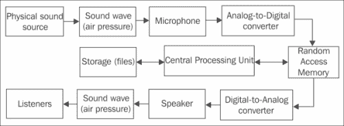

# 第五章：跨平台音频流

|   | *尝试关闭你最喜欢的游戏中的声音。* |   |
| --- | --- | --- |
|   | --*维克多·拉蒂波夫* |

本章我们将介绍以下内容：

+   初始化 OpenAL 并播放.wav 文件

+   抽象基本音频组件

+   流式声音

+   解码 Ogg Vorbis 文件

+   使用 ModPlug 解码跟踪器音乐

# 引言

我们在寻找一种真正可移植的实现方案，以在桌面电脑和移动设备上进行声音播放。我们建议使用 OpenAL 库，因为它在桌面端已经相当成熟，使用它将使得将现有游戏移植到 Android 更加容易。在本章中，我们将组织一个小型的多线程声音流媒体库。

音频播放本质上是一个异步过程，因此解码和控制声音硬件应该在单独的线程上完成，并从其他专用线程进行控制。例如，当玩家按下开火按钮，或者在街机游戏中一个角色撞击地面时，我们可能只是要求系统开始播放一个音频文件。在游戏中，这个操作的延迟通常不是很重要。

从数字角度来看，单声道或单声道声音（简称 mono），不过是表示连续信号的长时间一维数组。立体声或多声道声音由几个声道表示，并以交错数组的形式存储，其中一个声道的采样紧接着另一个声道的采样，依此类推。OpenAL 期望我们以一系列缓冲区的形式提交这些数据。OpenAL 库的主要概念包括设备、上下文、监听器、音频源和声音缓冲区：



在虚拟环境中产生的声音经过一系列滤波器处理后，通过扬声器播放。本章涵盖的内容将允许你为你的游戏创建一个可移植的音频子系统。

# 初始化 OpenAL 并播放.wav 文件

在这个食谱中，我们展示了播放未压缩音频文件的最简单示例，这些文件采用**PCM**格式（**脉冲编码调制**，[`en.wikipedia.org/wiki/Pulse-code_modulation`](http://en.wikipedia.org/wiki/Pulse-code_modulation)）。这个示例只是在无限循环中播放单个文件。我们将创建一个单一设备、一个单一设备上下文和一个音频源。所有这些都在一个专用线程中完成，但我们不应该担心多线程问题，因为 OpenAL 函数是保证线程安全的。

## 准备工作

OpenAL 库的源代码和构建脚本可以在`0_OpenAL`文件夹中找到，本章的每个示例都包含预编译的静态库。对于 Windows，我们使用动态链接与 OpenAL。关于如何从 Android `.apk`包中加载文件的说明可以在第四章，*组织虚拟文件系统*中找到。此配方的完整示例源代码可以在`0_AL_On_Android`文件夹中找到。

## 如何操作...

1.  `SoundThread`类，我们在这个类中实现了实际播放，如下所示：

    ```kt
    class SoundThread: public iThread
    {
    ```

1.  首先，我们声明 OpenAL 音频设备和设备上下文的句柄：

    ```kt
      ALCdevice*  FDevice;
      ALCcontext* FContext;
    ```

1.  然后，我们声明 OpenAL 音频源和缓冲区的句柄：

    ```kt
      ALuint FSourceID;
      ALuint FBufferID;
    ```

1.  `Run()`成员函数执行所有工作，包括初始化、反初始化以及将音频数据提交到 OpenAL：

    ```kt
      virtual void Run()
      {
    ```

1.  我们初始化指向 OpenAL 函数的指针：

    ```kt
        LoadAL();
    ```

1.  然后，我们创建设备和设备上下文：

    ```kt
        FDevice = alcOpenDevice( NULL );
        FContext = alcCreateContext( FDevice, NULL );
    ```

1.  最后，我们将新创建的设备上下文选为当前上下文：

    ```kt
        alcMakeContextCurrent( FContext );
    ```

1.  现在，我们开始创建音频源：

    ```kt
        alGenSources( 1, &FSourceID );
    ```

1.  我们设置一个常量最大播放音量为`1.0`，在 OpenAL 中这被称为**增益**：

    ```kt
        alSourcef( FSourceID, AL_GAIN, 1.0f );
    ```

1.  为了听到声音，我们必须加载包含声音数据的文件：

    ```kt
        clPtr<iIStream> Sound = g_FS->CreateReader("test.wav");
    ```

1.  我们使用内存映射文件，并询问 iStream 对象关于文件大小：

    ```kt
        int DataSize = (int)Sound->GetSize();
        const ubyte* Data = Sound->MapStream();
    ```

1.  为了避免处理完整的**RIFF WAVE**文件格式，我们准备了一个包含单个未压缩音频数据块的特定文件；此数据的格式是 22 kHz 单声道 16 位声音。我们传递`Data+sizeof(sWAVHeader)`作为音频数据，音频数据的大小显然是`DataSize-sizeof(sWAVHeader)`：

    ```kt
        PlayBuffer( Data + sizeof( sWAVHeader ),
        DataSize - sizeof( sWAVHeader ));
    ```

1.  然后，我们在自旋循环中调用`IsPlaying()`函数，以检测 OpenAL 何时停止播放声音：

    ```kt
        while ( IsPlaying() ) {}
    ```

1.  一旦声音播放完成，我们就删除我们创建的所有对象：

    ```kt
        alSourceStop( FSourceID );
        alDeleteSources( 1, &FSourceID );
        alDeleteBuffers( 1, &FBufferID );
        alcDestroyContext( FContext );
        alcCloseDevice( FDevice );
    ```

1.  最后，在 Windows 上卸载 OpenAL 库：

    ```kt
        UnloadAL();
    ```

1.  在 Android 上，释放分配的资源并释放音频设备非常重要。否则，音频会在后台继续播放。为了避免在这个小示例中编写 Java 代码，我们只需通过`exit()`调用终止本地活动：

    ```kt
        exit( 0 );
      }
    ```

1.  上面的代码使用`IsPlaying()`函数来检查音频源是否忙碌：

    ```kt
      bool IsPlaying()
      {
        int State;
        alGetSourcei( FSourceID, AL_SOURCE_STATE, &State );
        return State == AL_PLAYING;
      }
    ```

1.  `PlayBuffer()`函数将音频数据提供给音频源：

    ```kt
      void PlayBuffer(const unsigned char* Data, int DataSize)
      {
        alGenBuffers( 1, &FBufferID );
        alBufferData( FBufferID, AL_FORMAT_MONO16,
        Data, DataSize, 22050 );
        alSourcei( FSourceID, AL_BUFFER, FBufferID );
        alSourcePlay( FSourceID );
      }
    };
    ```

1.  上面的代码使用`sWAVHeader`结构的大小来确定音频数据的偏移量：

    ### 注意

    `sWAVHeader`的结构字段对齐应设置为`1`。我们的声明与 Android NDK 和 MinGW 的 Clang 和 GCC 编译器兼容。对于 VisualStudio 使用#pragma pack。

    ```kt
    struct __attribute__((packed,aligned(1))) sWAVHeader
    {
      unsigned char    RIFF[4];
      unsigned int     Size;
      unsigned char    WAVE[4];
      unsigned char    FMT[4];
      unsigned int     SizeFmt;
      unsigned short   FormatTag;
      unsigned short   Channels;
      unsigned int     SampleRate;
      unsigned int     AvgBytesPerSec;
      unsigned short   nBlockAlign;
      unsigned short   nBitsperSample;
      unsigned char    Reserved[4];
      unsigned int     DataSize;
    };
    ```

之后我们重用这个结构来加载`.wav`文件。

## 工作原理...

首先，我们声明保存虚拟文件系统和`SoundThread`对象的的全局变量：

```kt
clPtr<FileSystem> g_FS;
SoundThread g_Sound;
```

我们创建常规的应用程序模板，并在`OnStart()`回调函数中启动一个线程来初始化 OpenAL 库：

```kt
void OnStart( const std::string& RootPath )
{
  …
  g_FS = new FileSystem();
  g_FS->Mount( "." );
#if defined(ANDROID)
  g_FS->Mount( RootPath );
  g_FS->AddAliasMountPoint( RootPath, "assets" );
#endif
  g_Sound.Start( iThread::Priority_Normal );
}
```

## 另请参阅

+   第二章，*移植通用库*

+   第四章《组织虚拟文件系统》中的*实现可移植的内存映射文件*食谱

# 抽象基本音频组件

在上一个食谱中，我们学习了如何初始化 OpenAL 以及如何播放未压缩的`.wav`文件。在这里，我们介绍`AudioSource`和`AudioThread`类，它们帮助我们管理初始化过程。

## 准备就绪

查看补充材料中的示例`0_AL_On_Android`，以了解 OpenAL 的基本概念。

## 如何操作…

1.  让我们仔细地将 OpenAL 的初始化移动到另一个名为`AudioThread`的线程中：

    ```kt
    class AudioThread: public iThread
    {
    public:
      AudioThread():
        FDevice( NULL ),
        FContext( NULL ),
        FInitialized( false ) {}
      virtual ~AudioThread() {}

      virtual void Run()
      {
    ```

1.  `Run()`方法开头的代码执行默认 OpenAL 设备的初始化并创建音频上下文：

    ```kt
        if ( !LoadAL() ) { return; }

        FDevice = alcOpenDevice( NULL );
        FContext = alcCreateContext( FDevice, NULL );
        alcMakeContextCurrent( FContext );
    ```

1.  我们设置一个标志，告诉其他线程它们是否可以使用我们的音频子系统：

    ```kt
        FInitialized = true;
    ```

1.  然后，我们进入一个无限循环，调用`Env_Sleep()`函数，其源代码如下所述，以避免使用 CPU 的 100%利用率：

    ```kt
        FPendingExit = false;
        while ( !IsPendingExit() ) { Env_Sleep( 100 ); }
    ```

    ### 注意

    在此示例中，我们使用了 100 毫秒的固定值将线程置于睡眠模式。在处理音频时，根据缓冲区大小和采样率计算睡眠延迟很有用。例如，一个包含 16 位单声道样本的`65535`字节的缓冲区，在`44100`赫兹的采样率下，大约可以播放*65535 / (44100 × 16 / 8) ≈ 0.7*秒的音频。立体声播放将这个时间减半。

1.  最后，我们释放 OpenAL 对象：

    ```kt
        alcDestroyContext( FContext );
        alcCloseDevice( FDevice );
        UnloadAL();
      }
    ```

1.  声明其余部分简单包含了所有必需的字段和初始化标志：

    ```kt
      bool FInitialized;
    private:
      ALCdevice*     FDevice;
      ALCcontext*    FContext;
    };
    ```

1.  代码中使用的`Env_Sleep()`函数只是让线程在给定毫秒数内不活跃。它在 Windows 中使用`Sleep()`系统调用，在 Android 中使用`usleep()`函数实现：

    ```kt
    void Env_Sleep( int Milliseconds )
    {
    #if defined _WIN32
      Sleep( Milliseconds );
    #else
      usleep( static_cast<useconds_t>( Milliseconds ) * 1000 );
    #endif
    }
    ```

1.  仅播放`.wav`文件还不够，因为我们想要支持不同的音频格式。因此，我们必须将音频播放和文件格式的实际解码分为两个独立的实体。我们准备引入`iWaveDataProvider`类，其子类作为我们音频播放类的数据源：

    ```kt
    class iWaveDataProvider: public iObject
    {
    public:
      iWaveDataProvider(): FChannels( 0 ),
        FSamplesPerSec( 0 ),
        FBitsPerSample( 0 ) {}
    ```

1.  这个类的主要例程允许访问解码的音频数据：

    ```kt
      virtual ubyte* GetWaveData() = 0;
      virtual size_t GetWaveDataSize() const = 0;
    ```

1.  下面是如何从该提供者获取内部 OpenAL 音频格式标识符的方法：

    ```kt
      ALuint GetALFormat() const
      {
        if ( FBitsPerSample == 8 )
           {
          return (FChannels == 2) ?
            AL_FORMAT_STEREO8  : AL_FORMAT_MONO8;
           }
        else if ( FBitsPerSample == 16)
           {
          return (FChannels == 2) ?
            AL_FORMAT_STEREO16 : AL_FORMAT_MONO16;
           }
        return AL_FORMAT_MONO8;
      }
    ```

1.  同时，我们在这里存储有关音频格式的信息：

    ```kt
      int FChannels;
      int FSamplesPerSec;
      int FBitsPerSample;
    };
    ```

1.  如我们所知，必须创建一个音频源以产生声音。这一功能在`AudioSource`类中实现，该类封装了前一个食谱中的 OpenAL 函数调用。这个类使用`iWaveDataProvider`实例作为音频数据源：

    ```kt
    class AudioSource: public iObject
    {
    public:
    ```

1.  构造函数只是创建了一个 OpenAL 源句柄并设置了默认参数：

    ```kt
      AudioSource(): FWaveDataProvider( NULL )
      {
        alGenSources( 1, &FSourceID );
        alSourcef( FSourceID, AL_GAIN,    1.0 );
        alSourcei( FSourceID, AL_LOOPING, 0   );
      }
    ```

1.  析构函数停止播放并执行清理工作：

    ```kt
      virtual ~AudioSource()
      {
        Stop();
        FWaveDataProvider = NULL;
        alDeleteSources( 1, &FSourceID );
        alDeleteBuffers( 1, &FBufferID );
      }
    ```

1.  `Play()`方法将 OpenAL 源切换到播放状态：

    ```kt
      void Play()
      {
        if ( IsPlaying() ) { return; }
        alSourcePlay( FSourceID );
      }
    ```

1.  `Stop()`方法将 OpenAL 源切换到停止状态。停止后只能从声音缓冲区的开始处恢复播放：

    ```kt
      void Stop()
      {
        alSourceStop( FSourceID );
      }
    ```

1.  `IsPlaying()`方法检查源是否正在播放音频。实现来自之前的食谱：

    ```kt
      bool IsPlaying() const
      {
        int State;
        alGetSourcei( FSourceID, AL_SOURCE_STATE, &State );
        return State == AL_PLAYING;
      }
    ```

1.  一个小的`SetVolume()`方法改变源的播放音量。接受的浮点值范围是`0.0…1.0`：

    ```kt
      void SetVolume( float Volume )
      {
        alSourcef( FSourceID, AL_GAIN, Volume );
      }
    ```

1.  主例程，即向音频源提供数据的`BindWaveform()`。这个函数存储了对数据提供者的智能指针，并生成了一个 OpenAL 缓冲区对象：

    ```kt
      void BindWaveform( clPtr<iWaveDataProvider> Wave )
      {
        FWaveDataProvider = Wave;
        if ( !Wave ) return;

        alGenBuffers( 1, &FBufferID );
        alBufferData( FBufferID,
          Wave->GetALFormat(),
          Wave->GetWaveData(),
          (int)Wave->GetWaveDataSize(),
          Wave->FSamplesPerSec );
        alSourcei( FSourceID, AL_BUFFER, FBufferID );
      }
    ```

1.  `AudioSource`类的私有部分包含对音频数据提供者的引用以及内部 OpenAL 源和缓冲区句柄：

    ```kt
    private:
      clPtr<iWaveDataProvider> FWaveDataProvider;
      ALuint FSourceID;
      ALuint FBufferID;
    };
    ```

1.  为了能够从文件中读取声音，我们在`WavProvider`类中实现了`iWaveDataProvider`接口：

    ```kt
    class WavProvider: public iWaveDataProvider
    ```

1.  这个类包含的唯一字段是一个指向包含文件数据的`Blob`对象的智能指针：

    ```kt
      clPtr<Blob> FRawData;
    ```

1.  一个简单的脉冲编码调制`.wav`文件由开头的`sWAVHeader`结构和音频数据组成，可以直接输入到 OpenAL 音频源中。`WavProvider`类的构造函数提取有关音频数据的信息：

    ```kt
      WavProvider( const clPtr<clBlob>& blob )
      {
        FRawData = blob;
        sWAVHeader H = *(sWAVHeader*)FRawData->GetData();

        const unsigned short FORMAT_PCM = 1;
        FChannels      = H.Channels;
        FSamplesPerSec = H.SampleRate;
        FBitsPerSample = H.nBitsperSample;
      }
    ```

1.  析构函数是空的，因为我们的`Blob`对象被包装成了一个智能指针：

    ```kt
      virtual ~WavProvider() {}
    ```

1.  `iWaveDataProvider`接口很简单，这里我们只实现两个成员函数。`GetWaveData()`返回指向音频数据的指针：

    ```kt
      virtual ubyte* GetWaveData()
      {
        return (ubyte*)FRawData->GetDataConst() +
          sizeof( sWAVHeader );
      }
    ```

1.  `GetWaveDataSize()`方法从总文件大小中减去文件头大小：

    ```kt
      virtual size_t GetWaveDataSize() const
      {
        return FRawData->GetSize() - sizeof( sWAVHeader );
      };
    ```

现在我们完成了音频播放和解码。

## 它是如何工作的…

现在我们可以演示如何一起使用所有音频类。像往常一样，我们创建一个空的应用程序模板，可以在`1_AL_Abstraction`文件夹中找到。

为了能够使用 OpenAL，我们必须声明一个全局`AudioThread`实例：

```kt
AudioThread g_Audio;
```

我们在`OnStart()`回调函数中启动这个线程：

```kt
g_Audio.Start( iThread::Priority_Normal );
```

在这个例子中，我们实现了`SoundThread`类，其`Run()`方法处理所有播放。在这个线程上，我们必须等待`g_Audio`初始化完成：

```kt
while ( !g_Audio.FInitialized ) {}
```

现在我们可以创建音频源：

```kt
clPtr<AudioSource> Src = new AudioSource();
```

最后，我们需要创建一个`WavProvider`对象，它解码音频文件，将其附加到`Src`源，开始播放并等待其完成：

```kt
clPtr<Blob> Data = LoadFileAsBlob("test.wav");
Src->BindWaveform( new WavProvider( Data ) );
Src->Play();
while ( Src->IsPlaying() ) {}
```

音频播放完成后，我们将`Src`指针重置为`NULL`，并向`g_Audio`线程发送终止信号：

```kt
Src = NULL;
g_Audio.Exit(true);
```

为了获取`Data`对象，我们必须实现以下函数，它将文件内容读取到内存块中：

```kt
clPtr<Blob> LoadFileAsBlob( const std::string& FName )
{
  clPtr<iIStream> input = g_FS->CreateReader( FName );
  clPtr<Blob> Res = new Blob();
  Res->CopyMemoryBlock( input->MapStream(), input->GetSize() );
  return Res;
}
```

我们使用全局初始化的`FileSystem`实例，即`g_FS`对象。请注意，在 Android OS 上，我们不能使用标准路径，因此采用我们的虚拟文件系统实现。

## 还有更多…

我们可以实施一些辅助程序，以简化`AudioSource`类的使用。第一个有用的例程是源暂停。OpenAL 提供了`alSourcePause()`函数，但这还不够，因为我们必须控制所有正在播放的未排队缓冲区。此时，这个未排队并不重要，因为我们只有一个缓冲区，但是当我们开始流式传输声音时，我们必须注意缓冲区队列。以下代码应该添加到`AudioSource`类以实现暂停：

```kt
void Pause()
{
  alSourcePause( FSourceID );
  UnqueueAll();
}
void UnqueueAll()
{
  int Queued;
  alGetSourcei( FSourceID, AL_BUFFERS_QUEUED, &Queued );

  if ( Queued > 0 )
  alSourceUnqueueBuffers(FSourceID, Queued, &FBufferID);
}
```

对于无限声音循环，我们可以在`AudioSource`类中实现`LoopSound()`方法：

```kt
void LoopSound( bool Loop )
{
  alSourcei( FSourceID, AL_LOOPING, Loop ? 1 : 0);
}
```

安卓操作系统运行在多种硬件架构上，这可能导致在读取`.wav`文件时出现一些额外的困难。如果我们运行的 CPU 具有大端架构，我们就必须交换`sWAVHeader`结构字段中的字节。修改后的`WavProvider`类的构造函数如下所示：

```kt
WavProvider(clPtr<Blob> source)
{
  FRawData = source;
  sWAVHeader H = *(sWAVHeader*)(FRawData->GetData());
#if __BIG_ENDIAN__
  Header.FormatTag = SwapBytes16(Header.FormatTag);
  Header.Channels  = SwapBytes16(Header.Channels);
  Header.SampleRate = SwapBytes32(Header.SampleRate);
  Header.DataSize   = SwapBytes32(Header.DataSize);
  Header.nBlockAlign = SwapBytes16(Header.nBlockAlign);
  Header.nBitsperSample = SwapBytes16(Header.nBitsperSample);
```

大端内存字节顺序要求 16 位值的低字节和高字节互换：

```kt
  if ( (Header.nBitsperSample == 16) )
  {
    clPtr<Blob> NewBlob = new clBlob();
    NewBlob->CopyBlob( FRawData.GetInternalPtr() );
    FRawData = NewBlob;
    unsigned short* Ptr =
      (unsigned short*)FRawData->GetData();
    for ( size_t i = 0 ; i != Header.DataSize / 2; i++ )
    {
      *Ptr = SwapBytes16(*Ptr);
      Ptr++;
     }
  }
#endif
  FChannels      = H.Channels;
  FSamplesPerSec = H.SampleRate;
  FBitsPerSample = H.nBitsperSample;
}
```

在这里，我们使用 GCC 编译器提供的`__BIG_ENDIAN__`预处理器符号来检测大端 CPU。两个`SwapBytes()`函数改变无符号字和双字的字节顺序：

```kt
unsigned short SwapBytes16( unsigned short Val )
{
  return (Val >> 8) | ((Val & 0xFF) << 8);
}
unsigned int SwapBytes32( unsigned int Val )
{
  return	(( Val & 0xFF ) << 24 ) |
    (( Val & 0xFF00   ) <<  8 ) |
    (( Val & 0xFF0000 ) >>  8 ) |
    (  Val >> 24);
}
```

## 另请参阅

+   *解码 Ogg Vorbis 文件*

# 流式声音

我们已经学会了如何播放短音频样本，现在我们准备组织声音流。本食谱解释了如何组织一个缓冲区队列，以允许即时声音生成和流式传输。

## 准备工作

我们假设读者已经熟悉我们在上一个食谱中描述的`AudioSource`和`iWaveDataProvider`类。

## 如何操作...

1.  首先，我们用额外的`IsStreaming()`方法丰富`iWaveDataProvider`，该方法表示应该以小块的方式从这个提供者读取数据，以及`StreamWaveData()`，它实际读取单个块：

    ```kt
    class iWaveDataProvider: public iObject
      …
      virtual bool IsStreaming() const { return false; }
      virtual int  StreamWaveData( int Size ) { return 0; }
      …
    };
    ```

1.  接下来，我们编写一个派生类，其中包含一个用于解码或生成的声音数据的中间缓冲区。它没有实现`StreamWaveData()`，但实现了`GetWaveData()`和`GetWaveDataSize()`方法：

    ```kt
    class StreamingWaveDataProvider: public iWaveDataProvider
    {
    public:
      virtual bool IsStreaming() const { return true; }

      virtual ubyte* GetWaveData() { return (ubyte*)&FBuffer[0]; }
      virtual size_t GetWaveDataSize() const { return FBufferUsed; }

      std::vector<char> FBuffer;
      int               FBufferUsed;
    };
    ```

1.  `FBufferUsed`字段保存了`FBuffer`向量中使用的字节数。现在我们修改`AudioSource`类以支持我们的新流式数据提供者。我们不希望在播放过程中出现裂缝或中断，因此我们使用缓冲区队列代替在单块声音播放中使用的单个缓冲区。为此，我们首先声明一个缓冲区计数器和缓冲区 ID 数组：

    ```kt
    class AudioSource: public iObject
    {
    private:
      unsigned int FSourceID;
      int          FBuffersCount;
      unsigned int FBufferID[2];
    ```

1.  我们将`LoopSound()`、`Stop()`、`Pause()`、`IsPlaying()`和`SetVolume()`成员函数，构造函数和析构函数的实现保持不变。现在`BindWaveform()`方法在关联的波形数据提供者支持流式传输时生成缓冲区：

    ```kt
      void BindWaveform( clPtr<iWaveDataProvider> Wave )
      {
        FWaveDataProvider = Wave;
        if ( !Wave ) return;

        if ( Wave->IsStreaming() )
        {
          FBuffersCount = 2;
          alGenBuffers( FBuffersCount, &FBufferID[0] );
        }
        else
        {
          FBuffersCount = 1;
          alGenBuffers( FBuffersCount, &FBufferID[0] );
          alBufferData( FBufferID[0],
            Wave->GetALFormat(),
            Wave->GetWaveData(),
            (int)Wave->GetWaveDataSize(),
            Wave->FSamplesPerSec );
          alSourcei( FSourceID, AL_BUFFER, FBufferID[0] );
        }
      }
    ```

1.  `Play()`方法调用`alSourcePlay()`函数，并在流式传输模式下将缓冲区添加到队列中：

    ```kt
      void Play()
      {
        if ( IsPlaying() ) { return; }
        if ( !FWaveDataProvider ) { return; }

        int State;
        alGetSourcei( FSourceID, AL_SOURCE_STATE, &State );

        if (  State != AL_PAUSED &&
          FWaveDataProvider->IsStreaming() )
        {
          UnqueueAll();
    ```

1.  将两个音频缓冲区填充好并将它们提交给 OpenAL API：

    ```kt
          StreamBuffer( FBufferID[0], BUFFER_SIZE );
          StreamBuffer( FBufferID[1], BUFFER_SIZE );
          alSourceQueueBuffers(FSourceID, 2, &FBufferID[0]);
        }
        alSourcePlay( FSourceID );
      }
    ```

1.  既然我们使用了不止一个缓冲区，我们将在`UnqueueAll()`方法中将`FBufferID`更改为`FBufferID[0]`：

    ```kt
      void   UnqueueAll()
      {
        int Queued;
        alGetSourcei(FSourceID, AL_BUFFERS_QUEUED, &Queued);
        if ( Queued > 0 )
          alSourceUnqueueBuffers(FSourceID,
            Queued, &FBufferID[0]);
      }
    ```

1.  最后，由于流式传输是一个持续的过程，而不是一次性的操作，我们提供了`Update()`方法，它从`iWaveDataProvider`获取适当量的数据：

    ```kt
      void Update( float DeltaSeconds )
      {
        if ( !FWaveDataProvider ) { return; }
        if ( !IsPlaying() ) { return; }

        if ( FWaveDataProvider->IsStreaming() )
        {
          int Processed;
          alGetSourcei( FSourceID,
          AL_BUFFERS_PROCESSED, &Processed );

          while ( Processed-- )
          {
            unsigned int BufID;
            alSourceUnqueueBuffers(FSourceID,1,&BufID);
            StreamBuffer( BufID, BUFFER_SIZE );
            alSourceQueueBuffers(FSourceID, 1, &BufID);
          }
        }
      }
    ```

1.  在`Update()`方法中，我们使用了`StreamBuffer()`成员函数，它负责用提供者解码或生成的数据填充缓冲区：

    ```kt
      int StreamBuffer( unsigned int BufferID, int Size )
      {
        int ActualSize = 
          FWaveDataProvider->StreamWaveData(Size);

        ubyte* Data = FWaveDataProvider->GetWaveData();
        int Sz = (int)FWaveDataProvider->GetWaveDataSize();

        alBufferData( BufferID,
          FWaveDataProvider->GetALFormat(),
          Data, Sz,
          FWaveDataProvider->FSamplesPerSec );

        return ActualSize;
      }
    ```

1.  `BUFFER_SIZE`常数被设置为足够大，以容纳几秒钟的流式数据：

    ```kt
    const int BUFFER_SIZE = 352800;
    ```

    ### 注意

    值`352800`的推导如下：

    *2 通道 × 44,100 每秒采样数 × 每个样本 2 字节 × 2 秒 = 352,800 字节*。

## 工作原理…

本食谱中的代码没有实现`StreamWaveData()`方法。为了从扬声器中听到声音，我们编写了`ToneGenerator`类，它生成纯正弦波作为输出数据。这个类是从`StreamingWaveDataProvider`派生而来的：

```kt
class ToneGenerator : public StreamingWaveDataProvider
{
```

首先声明信号参数和内部样本计数器：

```kt
  int   FSignalFreq;
  float FFrequency;
  float FAmplitude;
private:
  int LastOffset;
```

构造函数设置声音数据参数并预先分配缓冲区空间：

```kt
public:
  ToneGenerator()
  {
    FBufferUsed = 100000;
    FBuffer.resize( 100000 );

    FChannels = 2;
    FSamplesPerSec = 4100;
    FBitsPerSample = 16;

    FAmplitude = 350.0f;
    FFrequency = 440.0f;
  }
  virtual ~ToneGenerator() {}
```

这个类的主例程计算正弦函数，跟踪当前样本索引，以使声音缓冲队列包含所有值：

```kt
  virtual int StreamWaveData( int Size )
  {
    if ( Size > static_cast<int>( FBuffer.size() ) )
    {
      FBuffer.resize( Size );
      LastOffset = 0;
    }

    for ( int i = 0 ; i < Size / 4 ; i++ )
    {
```

正弦函数的参数`t`是从局部索引`i`和名为`LastOffset`的相位值计算得出的：

```kt
      float t = ( 2.0f * 3.141592654f *
        FFrequency * ( i + LastOffset ) ) / 
         (float) FSamplesPerSec;
        float val = FAmplitude * std::sin( t );
```

以下几行代码将单个浮点数值转换成有符号字。这种转换是必要的，因为数字音频硬件只能处理整数数据：

```kt
      short V = static_cast<short>( val );
      FBuffer[i * 4 + 0] = V & 0xFF;
      FBuffer[i * 4 + 1] = V >> 8;
      FBuffer[i * 4 + 2] = V & 0xFF;
      FBuffer[i * 4 + 3] = V >> 8;
    }
```

接下来，我们在保持生成的样本计数器在`0…FSignalFreq-1`范围内时递增它：

```kt
    LastOffset += Size / 2;
    LastOffset %= FSamplesPerSec;
```

最后，返回生成的字节数：

```kt
    FBufferUsed = Size;
    return FBufferUsed;
  }
};
```

现在，我们可以使用`AudioSource`类来流式传输声音。一旦创建了音频源，我们就附加一个新的流式提供者，它生成 440 Hz 的正弦波形：

```kt
class SoundThread: public iThread
{
  virtual void Run()
  {
    while ( !g_Audio.Finitialized ) {}

    clPtr<AudioSource> Src = new AudioSource();
    Src->BindWaveform( new ToneGenerator() );
    Src->Play();

    FPendingExit = false;
    double Seconds = Env_GetSeconds();
```

在无限循环中，我们不断更新源，强制它生成声音数据：

```kt
    While ( !IsPendingExit() )
    {
      float DeltaSeconds =
         (float)( Env_GetSeconds() - Seconds );
      Src->Update( DeltaSeconds );
      Seconds = Env_GetSeconds();
    }
  }
}
```

## 还有更多…

容易注意到在`ToneGenerator::StreamWaveData()`成员函数中，我们可以使用任何公式，不仅仅是正弦函数。我们鼓励读者进行实验，创建某种软件合成器。

# 解码 Ogg Vorbis 文件

Ogg Vorbis 是一种广泛使用的、免费的、开放的、无专利的音频压缩格式。它可以与其他用于存储和播放数字音乐的格式相媲美，如 MP3、VQF 和 AAC。

## 准备就绪

读者应该熟悉前一个食谱中的声音流传输技术。关于`.ogg`容器文件格式和 Vorbis 音频压缩算法的详细信息可以在[`xiph.org`](http://xiph.org)找到。

## 如何操作…

1.  我们向`iWaveDataProvider`接口添加了`IsEOF()`方法。这用于通知`AudioSource`声音何时结束：

    ```kt
      virtual bool    IsEOF() const { return true; }
    ```

1.  我们添加的另一个方法是`Seek()`，它倒带音频流：

    ```kt
      virtual void    Seek( float Time ) {}
    ```

1.  在`DecodingProvider`类中，我们实现了`StreamWaveData()`成员函数，它使用`ReadFromFile()`方法从源内存块中读取解码的音频数据：

    ```kt
    class DecodingProvider: public StreamingWaveDataProvider
    {
      clPtr<Blob> FRawData;
    public:
      bool FEof;
      virtual bool IsEOF() const { return FEof; }
    ```

1.  `FLoop`标志告诉解码器，如果遇到流末尾，则倒回并从开始处重新播放：

    ```kt
      bool FLoop;
    public:
      DecodingProvider( const clPtr<Blob>& blob )
      {
        FRawData = blob;
        FEof = false;
      }
    ```

1.  主要的流处理程序尝试从源内存块中读取更多数据：

    ```kt
      virtual int StreamWaveData( int Size )
      {
    ```

1.  我们用零填充缓冲区的未使用部分以避免噪音：

    ```kt
        int OldSize = (int)FBuffer.size();
        if ( Size > OldSize )
        {
          FBuffer.resize( Size );
          for ( int i = 0 ; i < OldSize - Size ; i++ )
            FBuffer[OldSize + i] = 0;
        }
    ```

1.  在文件末尾，我们将解码数据的大小返回为零：

    ```kt
        if ( FEof ) { return 0; }
    ```

1.  接下来，我们尝试从源读取，直到收集到`Size`个字节：

    ```kt
        int BytesRead = 0;
        while ( BytesRead < Size )
        {
          int Ret = ReadFromFile(Size);
    ```

1.  如果我们有数据，增加计数器：

    ```kt
          if ( Ret > 0 )
          {
            BytesRead += Ret;
          }
    ```

1.  如果字节数为零，我们已经到达文件的末尾：

    ```kt
          else if (Ret == 0)
            {
            FEof = true;
    ```

1.  `FLoop`标志告诉我们需要将流倒回到开始处：

    ```kt
            if ( FLoop )
            {
              Seek(0);
              FEof = false;
              continue;
            }
            break;
          } else
    ```

1.  否则，我们在流中有一个错误：

    ```kt
          {
            Seek( 0 );
            FEof = true;
            break;
          }
        }
    ```

1.  当前缓冲的字节数现在是文件中读取的字节数：

    ```kt
        return ( FBufferUsed = BytesRead );
      }
    ```

1.  `ReadFromFile()`函数在这里是纯虚的，实现都在派生类中：

    ```kt
    protected:
      virtual int ReadFromFile(int Size) = 0;
    };
    ```

1.  在第二章《移植通用库》中，我们编译了 Ogg 和 Vorbis 静态库。我们现在在`OggProvider`类中使用它们，该类实现了实际音频数据的解码：

    ```kt
    class OggProvider: public DecodingProvider
    {
    ```

1.  解码器的状态存在于三个变量中：

    ```kt
      OggVorbis_File         FVorbisFile;
      ogg_int64_t            FOGGRawPosition;
      int                    FOGGCurrentSection;
    ```

1.  构造函数初始化 Ogg 和 Vorbis 库。`Callbacks`结构包含指向函数的指针，这允许 OGG 库使用我们的虚拟文件系统流从我们的内存块中读取数据：

    ```kt
    public:
      OggProvider( const clPtr<Blob>& Blob ): DecodingProvider(Blob)
      {
        FOGGRawPosition = 0;
    ```

1.  填充`Callbacks`结构并初始化文件阅读器：

    ```kt
        ov_callbacks Callbacks;
        Callbacks.read_func  = OGG_ReadFunc;
        Callbacks.seek_func  = OGG_SeekFunc;
        Callbacks.close_func = OGG_CloseFunc;
        Callbacks.tell_func  = OGG_TellFunc;
        OGG_ov_open_callbacks( this, &FVorbisFile,
        NULL, -1, Callbacks );
    ```

1.  声明`vorbis_info`结构以读取音频流的持续时间。存储关于流的信息：

    ```kt
        vorbis_info* VorbisInfo;
        VorbisInfo     = OGG_ov_info ( &FVorbisFile, -1 );
        FChannels      = VorbisInfo->channels;
        FSamplesPerSec = VorbisInfo->rate;
    ```

1.  `FBitsPerSample`结构被设置为 16 位，然后我们告诉解码器以 16 位信号输出音频数据：

    ```kt
        FBitsPerSample = 16;
      }
    ```

1.  在析构函数中，`FVorbisFile`被清除：

    ```kt
      virtual ~OggProvider() { OGG_ov_clear( &FVorbisFile ); }
    ```

1.  `ReadFromFile()`函数使用 OGG 库进行流解码：

    ```kt
      virtual int ReadFromFile(int Size, int BytesRead)
      {
        return (int)OGG_ov_read( &FVorbisFile,
          &FBuffer[0] + BytesRead,
          Size - BytesRead,
    ```

1.  在这里，我们假设我们正在小端 CPU 上运行，例如 Intel Atom、Intel Core，或其他通常在移动 Android 设备中遇到的 ARM 处理器（[`en.wikipedia.org/wiki/Endianness`](http://en.wikipedia.org/wiki/Endianness)）。如果不是这种情况，例如处理器是 PowerPC 或 MIPS 在大端模式下，你应该向`OGG_ov_read()`函数提供一个`1`作为参数：

    ```kt
          0, // 0 for LITTLE_ENDIAN, 1 for BIG_ENDIAN
          FBitsPerSample >> 3,
          1,
          &FOGGCurrentSection );
      }
    ```

1.  `Seek()`成员函数将流倒回到指定的时间：

    ```kt
      virtual void Seek( float Time )
      {
        FEof = false;
        OGG_ov_time_seek( &FVorbisFile, Time );
      }
    ```

1.  在类的定义末尾，包含了`OGG_Callbacks.h`文件，其中实现了静态回调函数：

    ```kt
    private:
      #include "OGG_Callbacks.h"
    };
    ```

1.  `OGG_Callbacks.h`文件中的函数实现了一个类似`FILE*`的接口，OGG 库使用它来读取我们的内存块。我们在所有这些函数中将`OggProvider`的实例作为`void* DataSource`参数传递。

1.  `OGG_ReadFunc()`函数读取指定数量的字节并检查数据的末尾：

    ```kt
    size_t OGG_ReadFunc( void* Ptr, size_t Size, size_t NMemB,
      void* DataSource )
      {
        OggProvider* OGG = (OggProvider*)DataSource;

        size_t DataSize = OGG->FRawData->GetSize();

        ogg_int64_t BytesRead = DataSize - OGG- >FOGGRawPosition;
        ogg_int64_t BytesSize = Size * NMemB;

        if ( BytesSize < BytesRead ) { BytesRead = BytesSize; }

        memcpy( Ptr,
          (ubyte*)OGG->FRawData->GetDataConst() +
            OGG->FOGGRawPosition, (size_t)BytesRead );

        OGG->FOGGRawPosition += BytesRead;
        return (size_t)BytesRead;
      }
    ```

1.  `OGG_SeekFunc()`函数将当前读取位置设置为`Offset`的值：

    ```kt
      int OGG_SeekFunc( void* DataSource, ogg_int64_t Offset,
      int Whence )
      {
        OggProvider* OGG = (OggProvider*)DataSource;
        size_t DataSize = OGG->FRawData->GetSize();
        if ( Whence == SEEK_SET )
        {
          OGG->FOGGRawPosition = Offset;
        }
        else if ( Whence == SEEK_CUR )
        {
          OGG->FOGGRawPosition += Offset;
        }
        else if ( Whence == SEEK_END )
        {
          OGG->FOGGRawPosition = DataSize + Offset;
        }
    ```

1.  防止位置超过流结尾：

    ```kt
        if ( OGG->FOGGRawPosition > (ogg_int64_t)DataSize )
        {
          OGG->FOGGRawPosition = (ogg_int64_t)DataSize;
        }
        return static_cast<int>( OGG->FOGGRawPosition );
      }
    ```

1.  由于我们使用内存块作为数据源，`OGG_CloseFunc()`函数立即返回零，因为我们不需要关闭任何句柄：

    ```kt
      int OGG_CloseFunc( void* DataSource ) { return 0; }
    ```

1.  `OGG_TellFunc()`函数返回当前的读取位置：

    ```kt
      long OGG_TellFunc( void* DataSource )
      {
        return (int)
          (((OggProvider*)DataSource)->FOGGRawPosition);
      }
    ```

## 工作原理…

我们像之前的食谱一样初始化 OpenAL，并将`OggProvider`绑定到`AudioSource`实例的数据源：

```kt
  clPtr<AudioSource> Src = new AudioSource();
  clPtr<Data> = LoadFileAsBlob( "test.ogg" );
  Src->BindWaveform( new OggProvider(Data) );
  Src->Play();
  FPendingExit = false;
  double Seconds = Env_GetSeconds();
```

在循环中更新音频源，就像我们对`ToneGenerator`所做的那样：

```kt
  While ( !IsPendingExit() )
  {
    float DeltaSeconds =
       (float)(Env_GetSeconds() - Seconds );
    Src->Update(DeltaSeconds);
    Seconds = Env_GetSeconds();
  }
```

`LoadFileAsBlob()`函数与我们用来加载`.wav`文件的函数相同。

# 使用 ModPlug 解码跟踪器音乐

与桌面计算机相比，移动设备在资源上总是受限的。这些限制既包括计算能力，也包括可用的存储空间。即使是在适中的比特率下，高质量的 MPEG-1 Layer 3 或 Ogg Vorbis 音频文件也会占用大量空间。例如，在一个 20 Mb 的游戏中，两个各占 5 Mb 大小的音轨是不可接受的。然而，质量和压缩之间有一个很好的折中方案。一种起源于八十年代的技术，称为跟踪器音乐——有时也被称为芯片音乐或 8 位音乐（[`en.wikipedia.org/wiki/Music_tracker`](http://en.wikipedia.org/wiki/Music_tracker)）。跟踪器音乐格式不使用脉冲编码调制来存储整个音轨。相反，它们使用`音符`和效果，这些音符和效果被应用到`样本`并在多个通道中播放。`样本`是乐器的小型 PCM 编码声音。`音符`对应于样本的播放速度。我们使用**libmodplug**库来解码最流行的跟踪器音乐文件格式，如`.it`、`.xm`和`.mod`。

## 准备就绪

在[`modplug-xmms.sourceforge.net`](http://modplug-xmms.sourceforge.net)查看 libmodplug 的最新版本。

## 如何操作...

1.  ModPlug 库允许我们实现另一个从`DecodingProvider`派生的类，称为`ModPlugProvider`。该库支持直接解码内存块，因此我们不需要实现任何 I/O 回调：

    ```kt
    class ModPlugProvider: public DecodingProvider
    {
    ```

1.  作为状态，这个类包含了`ModPlugFile`结构：

    ```kt
    private:
      ModPlugFile* FModFile;
    ```

1.  唯一的构造函数初始化了`ModPlugFile`字段：

    ```kt
    public:
      explicit ModPlugProvider( const clPtr<Blob>& Blob )
      : DecodingProvider(Blob)
      {
        FChannels = 2;
        FSamplesPerSec = 44100;
        FBitsPerSample = 16;

        FModFile = ModPlug_Load_P(
          ( const void* )FRawData->GetDataConst(),
          ( int )FRawData->GetSize() );
      }
    ```

1.  析构函数卸载文件：

    ```kt
      virtual ~ModPlugProvider() { ModPlug_Unload_P( FModFile ); }
    ```

1.  `ReadFromFile()`方法调用 ModPlug 的读取函数：

    ```kt
      virtual int ReadFromFile(int Size, int BytesRead)
      {
        return ModPlug_Read_P( FModFile,
          &FBuffer[0] + BytesRead,
          Size - BytesRead );
      }
    ```

1.  要重置源流，我们使用`ModPlug_Seek()`成员函数：

    ```kt
      virtual void Seek( float Time )
      {
        FEof = false;
        ModPlug_Seek_P( FModFile, ( int )( Time * 1000.0f ) );
      }
    };
    ```

## 工作原理...

没有专用的样本用于模块文件解码。为了更好地理解，我们建议修改`3_AL_PlayingOGG`源代码。唯一需要的修改是将`OggProvider`替换为`ModPlugProvider`。在测试中，你可以在`3_AL_PlayingOGG`文件夹中找到`test.it`文件。

## 另请参阅

+   *解码 Ogg Vorbis 文件*
