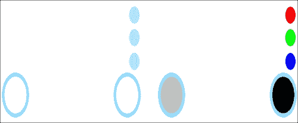
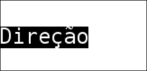

# 第七章：跨平台 UI 和输入系统

在本章中，我们将涵盖：

+   在安卓上处理多触摸事件

+   在 Windows 上设置多触摸模拟

+   在 Windows 上处理多触摸事件

+   识别手势

+   实现屏幕上的游戏手柄

+   使用 FreeType 进行文本渲染

+   游戏内字符串的本地化

# 引言

移动用户界面基于（除了图形渲染）多触摸输入。本章将向您展示如何在安卓操作系统上处理触摸事件，以及如何在 Windows 上调试它们。还包含了一个关于在 Windows 上使用多个鼠标模拟多触摸能力的专门教程。本章的其余部分致力于高质量文本渲染和支持多种语言。

# 在安卓上处理多触摸事件

迄今为止，我们还没有处理除了安卓上的**返回**按钮之外的任何用户交互。在本教程中，我们将展示如何处理安卓上的多触摸事件。

## 准备就绪

你应该熟悉多触摸输入处理的概念。在 Java 中，安卓多触摸事件是在`MotionEvent`类内部传递的，该类的实例作为参数传递给你的`Activity`类的`onTouchEvent()`方法。`MotionEvent`类包含了所有当前活动中和已释放的触摸信息。为了将此信息传递给我们的本地代码，我们将携带多个触摸的单个事件转换为一系列仅包含单个触摸数据的事件。这简化了 JNI 的交互操作，并使我们的代码易于移植。

## 如何操作...

每个安卓活动都支持多触摸事件处理。我们所要做的就是重写`Activity`类的`onTouchEvent()`方法：

1.  首先，我们声明一些与单个触摸点相关的事件的内部常量：

    ```kt
    private static final int MOTION_MOVE = 0;
    private static final int MOTION_UP   = 1;
    private static final int MOTION_DOWN = 2;
    private static final int MOTION_START = -1;
    private static final int MOTION_END   = -2;
    ```

1.  事件处理器使用`MotionEvent`结构，并提取有关单个触摸的信息。在本地代码中声明的`SendMotion()`函数包含了我们通过 JNI 从`onTouchEvent()`中调用的手势解码：

    ```kt
    @Override public boolean onTouchEvent( MotionEvent event )
    {
    ```

1.  告诉我们的本地代码我们将要发送一系列事件：

    ```kt
      SendMotion( MOTION_START, 0, 0, false, MOTION_MOVE );
    ```

1.  确定事件代码和第一个触摸点的`ID`：

    ```kt
      int E = event.getAction() & MotionEvent.ACTION_MASK;
      int nPointerID = event.getPointerId((event.getAction() &MotionEvent.ACTION_POINTER_INDEX_MASK) >>MotionEvent.ACTION_POINTER_INDEX_SHIFT );
      try
      {
    ```

1.  获取主触摸点的坐标：

    ```kt
        int x = (int)event.getX(), y = (int)event.getY();
        int cnt = event.getPointerCount();
    ```

1.  处理触摸开始：

    ```kt
        if ( E == MotionEvent.ACTION_DOWN )
        {
          for ( int i = 0; i != cnt; i++ )
            SendMotion( event.getPointerId(i),(int)event.getX(i),(int)event.getY(i),true, MOTION_DOWN );
        }
    ```

1.  当所有触摸点释放时，处理整个手势的结束：

    ```kt
        if ( E == MotionEvent.ACTION_UP ||E == MotionEvent.ACTION_CANCEL )
        {
          SendMotion( MOTION_END, 0, 0, false, MOTION_UP );
          return E <= MotionEvent.ACTION_MOVE;
        }
    ```

1.  处理次要触摸点：

    ```kt
        int maskedEvent = event.getActionMasked();
        if ( maskedEvent== MotionEvent.ACTION_POINTER_DOWN )
        {
          for ( int i = 0; i != cnt; i++ )
            SendMotion( event.getPointerId(i),(int)event.getX(i),(int)event.getY(i),true, MOTION_DOWN );
        }
        if ( maskedEvent == MotionEvent.ACTION_POINTER_UP )
        {
          for ( int i = 0; i != cnt ; i++ )
            SendMotion( event.getPointerId(i),(int)event.getX(i),(int)event.getY(i),i != nPointerID, MOTION_UP );
          SendMotion( nPointerID,(int)event.getX(nPointerID),(int)event.getY(nPointerID),false, MOTION_MOVE );
        }
    ```

1.  最后，我们更新每个触摸点的坐标：

    ```kt
        if ( E == MotionEvent.ACTION_MOVE )
        {
          for ( int i = 0; i != cnt; i++ )
            SendMotion(event.getPointerId(i),(int)event.getX(i),(int)event.getY(i),true, MOTION_MOVE );
        }
      }
    ```

1.  当所有操作完成后，我们通知本地手势解码器事件序列的结束：

    ```kt
      SendMotion( MOTION_END, 0, 0, false, MOTION_MOVE );
      return E <= MotionEvent.ACTION_MOVE;
    }
    ```

1.  本地`SendMotion()`函数接受触摸点`ID`、屏幕像素坐标、运动标志和一个表示触摸点是否激活的布尔参数：

    ```kt
    public native static void SendMotion( int PointerID, int x, int y,
      boolean Pressed, int Flag );
    ```

## 工作原理...

安卓操作系统将触摸点的通知发送到我们的应用程序，`onTouchEvent()`函数将包含在`MotionEvent`对象中的触摸事件集合转换为一连串的 JNI `SendMotion()`调用。

## 另请参阅

+   *在 Windows 上处理多触摸事件*

+   *识别手势*

# 在 Windows 上设置多点触控仿真

没有硬件的情况下测试基于触摸的界面是很困难的，但即使有可用的 Android 硬件，我们也没有逐步调试器的奢侈。幸运的是，Windows 支持触摸屏硬件，可以为我们的应用程序提供`WM_TOUCH`事件。这个方法展示了一个技巧，利用多只鼠标来模拟触摸事件。

## 准备就绪

本方法依赖于第三方 Windows 驱动程序，即 MultiTouchVista，它是一个用户输入管理层，处理来自各种设备的输入。可以从[`multitouchvista.codeplex.com/`](http://multitouchvista.codeplex.com/)下载。

## 如何操作...

1.  首先，我们需要安装系统驱动。我们解压`MultiTouchVista_-_second_release_-_refresh_2.zip`文件，这是在撰写本文时最新的版本，然后用管理员权限打开命令行。如果未以管理员权限运行控制台，驱动程序安装将会失败。解压后的文件夹包含一个名为`Driver`的子文件夹，你应根据操作系统的类型选择`x64`或`x32`文件夹。在那个文件夹中，我们执行以下命令：

    ```kt
    >Install driver.cmd
    ```

1.  会弹出一个对话框，询问你是否想要安装这个设备软件，你应该点击**安装**按钮。安装完成后，你将在命令行上看到一条消息。

1.  接下来我们要做的是在**设备管理器**中激活驱动。我们打开**控制面板**，然后打开**设备管理器**窗口。在那里，我们在列表中找到**人体学输入设备**项。我们右键点击刚刚安装了驱动程序的**通用软件 HID 设备**。从上下文菜单中选择**禁用**以禁用该设备。在禁用设备前的确认中，我们只需回答**是**。之后，我们再次通过右键点击这个节点并选择**启用**来重新启用这个设备。

1.  现在，由于我们使用鼠标模拟多点触控，我们应该在屏幕上以某种方式显示触摸点，因为否则不可能知道鼠标指针的位置。在**控制面板** | **硬件和声音**中，我们打开**笔和触摸**窗口。**触摸**选项卡包含**当我与屏幕上的项目互动时显示触摸指针**复选框，应该启用它。

1.  当所有鼠标都连接后，我们可以启动驱动程序。我们打开两个命令行窗口，在第一个窗口中运行来自`MultiTouchVista`软件包的`Multitouch.Service.Console.exe`。在第二个控制台窗口中，我们运行`Multitouch.Driver.Console.exe`，同时不要关闭**MultiTouch.Server.Console**窗口。退出这两个应用程序，以返回到正常的非多点触控 Windows 环境。

## 它是如何工作的...

为了检查驱动程序和服务是否如预期般工作，我们可以尝试使用标准微软画图应用程序，并使用两只或多只鼠标同时绘制一些内容。

## 另请参阅

+   *在 Windows 上处理多点触控事件*

# 在 Windows 上处理多点触控事件

安装了`MultiTouchVista`驱动后，或者如果我们恰好有一个支持多点触控的屏幕，我们可以在应用程序中初始化一个事件循环并处理`WM_TOUCH`消息。

## 准备就绪

第一个食谱包含了关于多点触控处理的所有相关信息。在这个食谱中，我们仅扩展了针对 Microsoft Windows 的代码。

### 注意

本书没有讨论关于 Mac 的多点触控输入模拟。

## 如何操作...

1.  `MinGW`工具链不包括最新的 Windows SDK 头文件，因此需要定义许多常量以使用`WM_TOUCH`消息：

    ```kt
    #if !defined(_MSC_VER)
    #define SM_DIGITIZER            94
    #define SM_MAXIMUMTOUCHES       95
    #define TOUCHEVENTF_DOWN        0x0001
    #define TOUCHEVENTF_MOVE        0x0002
    #define TOUCHEVENTF_UP          0x0004
    #define TOUCHEVENTF_PRIMARY     0x0010
    #define WM_TOUCH                0x0240
    ```

1.  `TOUCHINPUT`结构使用`WinAPI`数据类型封装了一个单独的触摸，并且也应该为`MinGW`手动声明：

    ```kt
    typedef struct _TOUCHINPUT {
      LONG x, y;
      HANDLE hSource;
      DWORD dwID, dwFlags, wMask, dwTime;
      ULONG_PTR dwExtraInfo;
      DWORD cxContact, cyContact;
    } TOUCHINPUT,*PTOUCHINPUT;
    #endif
    ```

1.  接下来的四个函数为我们的应用程序提供了触摸界面处理。我们声明函数原型和静态函数指针，以便从`user32.dll`加载它们：

    ```kt
    typedef BOOL (WINAPI *CloseTouchInputHandle_func)(HANDLE);
    typedef BOOL (WINAPI *Get_func)(HANDLE, UINT, PTOUCHINPUT, int);
    typedef BOOL (WINAPI *RegisterTouch_func)(HWND, ULONG);
    typedef BOOL (WINAPI *UnregisterTouch_func)(HWND);
    static CloseTouch_func CloseTouchInputHandle_Ptr = NULL;
    static Get_func GetTouchInputInfo_Ptr = NULL;
    static RegisterTouch_func RegisterTouchWindow_Ptr = NULL;
    static UnregisterTouch_func UnregisterTouchWindow_Ptr =NULL;
    ```

1.  由于`MinGW`不支持自动导出与`WM_TOUCH`相关的方法，我们必须使用`GetProcAddress()`手动从`user32.dll`加载它们。这一操作在`1_MultitouchInput`中的`Wrapper_Windows.cpp`文件中定义的`LoadTouchFuncs()`函数中完成：

    ```kt
    static bool LoadTouchFuncs()
    {
      if ( !CloseTouchInputHandle_Ptr )
      {
        HMODULE hUser = LoadLibraryA( "user32.dll" );
        CloseTouchInputHandle_Ptr =(CloseTouchInputHandle_func)GetProcAddress( hUser, "CloseTouchInputHandle" );
        GetTouchInputInfo_Ptr = ( GetTouchInputInfo_func )GetProcAddress( hUser, "GetTouchInputInfo" );
        RegisterTouchWindow_Ptr = (RegisterTouchWindow_func)GetProcAddress( hUser, "RegisterTouchWindow" );
        UnregisterTouchWindow_Ptr =(UnregisterTouchWindow_func)GetProcAddress( hUser, "UnregisterTouchWindow" );
      }
      return ( RegisterTouchWindow_Ptr != NULL );
    }
    ```

1.  最后，我们需要声明`GetTouchPoint()`例程，它将`TOUCHPOINT`坐标转换为屏幕像素，为了简单起见，这里使用了硬编码的窗口大小 100 x 100 像素：

    ```kt
    static POINT GetTouchPoint(HWND hWnd, const TOUCHINPUT& ti)
    {
      POINT pt;
      pt.x = ti.x / 100;
      pt.y = ti.y / 100;
      ScreenToClient( hWnd, &pt );
      return pt;
    }
    ```

1.  现在，我们准备在 Windows 上实现多点触控消息处理。在我们的窗口函数中，我们为`WM_TOUCH`消息添加一个新的消息处理程序，其中包含了打包在一起的不同触摸点的数据。我们将参数解包到一个数组中，其中每个条目代表单个触摸点的消息：

    ```kt
    case WM_TOUCH:
    {
      unsigned int NumInputs = (unsigned int)wParam;
      if ( NumInputs < 1 ) { break; }
      TOUCHINPUT* ti = new TOUCHINPUT[NumInputs];
      DWORD Res = GetTouchInputInfo_Ptr((HANDLE)lParam, NumInputs, ti, sizeof(TOUCHINPUT));
      double EventTime = Env_GetSeconds();
      if ( !Res ) { break; }
    ```

1.  对于每个触摸点，我们在全局数组`g_TouchPoints`中更新其状态。这是与 Android 代码的主要区别，因为在 Java 代码中我们会解码`MotionEvent`结构体，并将点列表传递给本地代码：

    ```kt
      for (unsigned int i = 0; i < NumInputs ; ++i)
      {
        POINT touch_pt = GetTouchPoint(Window, ti[i]);
        vec2 Coord(touch_pt.x / ImageWidth,touch_pt.y / ImageHeight);
        sTouchPoint pt(ti[i].dwID, Coord,MOTION_MOVE, EventTime);
        if (ti[i].dwFlags & TOUCHEVENTF_DOWN)pt.FFlag = MOTION_DOWN;
        if (ti[i].dwFlags & TOUCHEVENTF_UP)
          pt.FFlag = MOTION_UP;
        Viewport_UpdateTouchPoint(pt);
      }
    ```

1.  然后，我们清理临时数组：

    ```kt
      CloseTouchInputHandle_Ptr((HANDLE)lParam);
      delete[] ti;
    ```

1.  我们移除所有释放的点：

    ```kt
      Viewport_ClearReleasedPoints();
    ```

1.  最后，我们处理所有活动的触摸点：

    ```kt
      Viewport_UpdateCurrentGesture();
      break;
    }
    ```

1.  事件处理程序使用一个全局触摸点列表：

    ```kt
    std::list<sTouchPoint> g_TouchPoints;
    ```

1.  `sTouchPoint`结构体封装了一个触摸点的坐标、触摸点`ID`、运动标志和关联的事件时间戳：

    ```kt
    struct sTouchPoint
    {
      int FID;
      vec2 FPoint;
      int FFlag;
      double FTimeStamp;
      sTouchPoint(int ID, const vec2& C, int flag, doubletstamp):
        FID(ID), FPoint(c), FFlag(flag), FTimeStamp(tstamp) {}
    ```

1.  检查这个触摸点是否处于激活状态：

    ```kt
      inline bool IsPressed() const
      {
        return (FFlag == MOTION_MOVE) || (FFlag ==MOTION_DOWN);
      }
    };
    ```

1.  `Viewport_UpdateTouchPoint()`函数会根据运动标志将点添加到列表中，或者只是更新状态：

    ```kt
    void Viewport_UpdateTouchPoint(const sTouchPoint& pt)
    {
      std::list<sTouchPoint>::iterator foundIt =FTouchPoints.end();
      for ( auto it = FTouchPoints.begin(); it != foundIt;++it )
      {
        if ( it->FID == pt.FID )
        {
          foundIt = it;
          break;
        }
      }
      switch ( pt.FFlag )
      {
        case MOTION_DOWN:
          if ( foundIt == FTouchPoints.end() )
            FTouchPoints.push_back( pt );
        case MOTION_UP:
        case MOTION_MOVE:
          if ( foundIt != FTouchPoints.end() )
            *foundIt = pt;
          break;
      }
    }
    ```

1.  `Viewport_ClearReleasedPoints()`函数移除所有运动标志设置为`MOTION_UP`的点：

    ```kt
    void Viewport_ClearReleasedPoints()
    {
      auto first = FTouchPoints.begin();
      auto result = first;
      for ( ; first != FTouchPoints.end() ; ++first )
        if ( first->FFlag != MOTION_UP ) *result++ = *first;
      FTouchPoints.erase( result, FTouchPoints.end() );
    }
    ```

1.  最后一个函数，`Viewport_UpdateCurrentGesture()`，将点列表发送到手势处理器：

    ```kt
    void Viewport_UpdateCurrentGesture()
    {
      Viewport_ProcessMotion( MOTION_START,vec2(), false, MOTION_MOVE );
      auto j = FTouchPoints.begin();
      for ( ; j != FTouchPoints.end(); ++j )
        Viewport_ProcessMotion( j->FID, j->FPoint,j->IsPressed(), j->FFlag );
      Viewport_ProcessMotion( MOTION_END, vec2(), false,MOTION_MOVE );
    }
    ```

## 工作原理...

在`WM_CREATE`事件处理程序中，我们将我们的窗口注册为触摸事件响应者：

```kt
case WM_CREATE:
...
g_TouchEnabled = false;
BYTE DigitizerStatus = (BYTE)GetSystemMetrics( SM_DIGITIZER );
if ( (DigitizerStatus & (0x80 + 0x40)) != 0 )
{
  BYTE nInputs = (BYTE)GetSystemMetrics( SM_MAXIMUMTOUCHES );
  if ( LoadTouchFuncs() )
  {
    if ( !RegisterTouchWindow_Ptr(h, 0) )
    {
      LOGI( "Enabled, num points: %d\n", (int)nInputs );
      g_TouchEnabled = true;
      break;
    }
  }
}
```

然后，我们在`Viewport_ProcessMotion()`函数中获取一系列触摸事件。

## 还有更多...

Windows 8 引入了`WM_POINTER`消息，这确保了代码更加整洁，类似于 Android 和其他基于触摸的环境。感兴趣的读者可以阅读相应的 MSDN 文章（[`msdn.microsoft.com/en-us/library/hh454928(v=vs.85).aspx`](http://msdn.microsoft.com/en-us/library/hh454928(v=vs.85).aspx)），并在窗口函数中编写类似的处理程序。

## 另请参阅

`1_MultitouchInput`示例中包含了`WM_TOUCH`消息处理代码。下一个食谱将展示如何解码一系列的多点触控事件并识别一些基本的手势。

# 识别手势

在这个食谱中，我们实现了一个检测捏合缩放旋转和 fling/swipe 手势的函数。它可以作为识别您自定义手势的起点。

## 准备工作

本食谱依赖于本章中的*在 Android 上处理多点触控事件*食谱来处理多点触控输入。

## 如何操作...

1.  我们将运动解码任务分解为各个层次。低级代码处理操作系统生成的触摸事件。收集到的触摸点数据由中级代码中的一组例程处理，我们将在本食谱中介绍这些内容。最后，所有解码的手势都通过简单的`iGestureResponder`接口报告给用户的高级代码：

    ```kt
    class iGestureResponder
    {
    public:
    ```

1.  `Event_UpdateGesture()`方法提供了直接访问接触点当前状态的功能。在讨论了`iGestureResponder`之后，紧接着介绍了`sMotionData`结构。`1_MultitouchInput`示例重写了这个方法来渲染触摸点：

    ```kt
      virtual void Event_UpdateGesture( const sMotionData& Data ) {}
    ```

1.  `Event_PointerChanged()`和`Event_PointerMoved()`方法被调用，以指示单个触摸的变化：

    ```kt
      virtual void Event_PointerChanged(int PtrID,const vec2& Pnt, bool Pressed) {}
      virtual void Event_PointerMoved(int PtrID, const vec2&const vec2& Pnt){}
    ```

1.  解码的手势信息被发送到`iGestureResponder`实例。当 fling/swipe 事件结束时，会调用`Event_Fling()`方法：

    ```kt
      virtual void Event_Fling( const sTouchPoint& Down,const sTouchPoint& Up ) {}
    ```

1.  使用`Up`和`Down`点的时间戳，响应者可以估计手指移动的速度并决定手势是否成功。当手指在屏幕上拖动时，会调用`Event_Drag()`方法：

    ```kt
      virtual void Event_Drag( const sTouchPoint& Down,const sTouchPoint& Current ) {}
    ```

1.  捏合缩放事件通过三种方法处理。当手势开始时调用`Event_PinchStart()`方法，手势结束时调用`Event_PinchStop()`，每次更新两个触摸点时调用`Event_Pinch()`方法：

    ```kt
      virtual void Event_PinchStart( const sTouchPoint& Initial1,const sTouchPoint& Initial2 ) {}
      virtual void Event_Pinch( const sTouchPoint& Initial1,const sTouchPoint& Initial2,const sTouchPoint& Current1,const sTouchPoint& Current2 ) {}
      virtual void Event_PinchStop( const sTouchPoint& Initial1,const sTouchPoint& Initial2,const sTouchPoint& Current1,const sTouchPoint& Current2 ) {};
    };
    ```

1.  让我们转到中级例程来解码手势。首先，声明一个`iGestureResponder`的实例，稍后使用：

    ```kt
      iGestureResponder* g_Responder;
    ```

1.  我们引入了`sMotionData`结构，它描述了当前的手势状态。使用`Get*`函数访问单个触摸点的特征。`AddTouchPoint()`函数确保不会添加具有重复 ID 的点：

    ```kt
    struct sMotionData
    {
      sMotionData(): FTouchPoints() {};
      void Clear() { FTouchPoints.clear(); };
      size_t GetNumTouchPoints() const { returnFTouchPoints.size(); }
      const sTouchPoint& GetTouchPoint( size_t Idx )    const {return FTouchPoints[Idx]; }
      vec2 GetTouchPointPos(size_t i) const { returnFTouchPoints[i].FPoint; }
      int GetTouchPointID(size_t i)  const { returnFTouchPoints[i].FID; }
      void AddTouchPoint( const sTouchPoint& TouchPoint )
      {
        for ( size_t i = 0; i != FTouchPoints.size(); i++ )
          if ( FTouchPoints[i].FID == TouchPoint.FID )
          {
            FTouchPoints[i] = TouchPoint;
            return;
          }
        FTouchPoints.push_back( TouchPoint );
      }
    private:
      std::vector<sTouchPoint> FTouchPoints;
    };
    ```

1.  手势由其触摸点的当前状态和先前触摸点状态的环形缓冲区描述。为了检测手势，我们创建了一个临时的状态机。两个布尔变量指示我们是否真的有手势以及手势是否正在进行中。对于每种类型的手势，也存储有效性标志：

    ```kt
    sMotionData                 FMotionData;
    RingBuffer<sMotionData>     FPrevMotionData(5);
    bool FMotionDataValid = false;
    bool FMoving = false;
    bool FFlingWasValid = false;
    bool FPinchZoomValid = false;
    bool FPinchZoomWasValid = false;
    ```

1.  单指手势，如抛掷、拖拽或轻触，由当前点和初始点描述。捏合缩放是双指手势，其状态由两个初始点和两个当前点确定。中心点坐标是初始点和当前点坐标的平均值：

    ```kt
    sTouchPoint FInitialPoint( 0, LVector2(), MOTION_MOVE, 0.0 );
    sTouchPoint FCurrentPoint( 0, LVector2(), MOTION_MOVE, 0.0 );
    sTouchPoint FInitialPoint1, FInitialPoint2;
    sTouchPoint FCurrentPoint1, FCurrentPoint2;
    float FZoomFactor = 1.0f;
    float FInitialDistance = 1.0f;
    LVector2 FInitialCenter, FCurrentCenter;
    ```

1.  为了忽略意外的屏幕触摸，我们引入了一个灵敏度阈值，这是手指必须移动的最小屏幕空间百分比，以便检测到抛掷手势：

    ```kt
      float FlingStartSensitivity = 0.2f;
    ```

1.  如果手指最终位置相对于初始位置移动小于以下值，那么抛掷手势将被完全忽略：

    ```kt
      float FlingThresholdSensitivity = 0.1f;
    ```

1.  `RingBuffer`数据结构是使用一个简单的动态数组实现的。完整的源代码在`RingBuffer.h`文件中：

    ```kt
    template <typename T> class RingBuffer
    {
    public:
      explicit RingBuffer(size_t Num): FBuffer(Num) { clear(); }
      inline void clear() { FCount = FHead  = 0; }
      inline void push_back( const T& Value )
      {
        if ( FCount < FBuffer.size() ) FCount++;
        FBuffer[ FHead++ ] = Value;
        if ( FHead == FBuffer.size() ) FHead = 0;
      }
    ```

1.  唯一的特殊方法是相对于`FHead`的先前状态的访问器：

    ```kt
      inline T* prev(size_t i)
      { return (i >= FCount) ? NULL: &FBuffer[AdjustIndex(i)]; }
    private:
      std::vector<T> FBuffer;
    ```

1.  当前元素和项目总数：

    ```kt
      size_t FHead;
      size_t FCount;
    ```

1.  负值时的带环绕的除法余数：

    ```kt
      inline int ModInt( int a, int b )
      { int r = a % b; return ( r < 0 ) ? r+b : r; }
    ```

1.  最后一个例程计算前一个元素索引：

    ```kt
      inline size_t AdjustIndex( size_t i ) const
      {
        return (size_t)ModInt( (int)FHead - (int)i - 1,(int)FBuffer.size() );
      }
    };
    ```

1.  为了解码手势，我们仔细处理每一个触摸事件。在开始时我们重置触摸点集合，在触摸结束时我们检查手势是否完成：

    ```kt
    void GestureHandler_SendMotion( int ContactID, eMotionFlagFlag,LVector2 Pos, bool Pressed )
    {
      if ( ContactID == MOTION_START )
      {
        FMotionDataValid = false;
        FMotionData.Clear();
        return;
      }
      if ( ContactID == MOTION_END )
      {
        FMotionDataValid = true;
        UpdateGesture();
        g_Responder->Event_UpdateGesture( FMotionData );
        if ( sMotionData* P = FPrevMotionData.prev(0) )
        {
          if ( P->GetNumTouchPoints() !=FMotionData.GetNumTouchPoints() )FPrevMotionData.push_back( FMotionData );
        }
        else
        {
          FPrevMotionData.push_back( FMotionData );
        }
        return;
      }
    ```

1.  如果我们仍在移动，那么修改当前点的信息：

    ```kt
      if ( Pressed )
        FMotionData.AddTouchPoint( sTouchPoint( ContactID, Pos,MOTION_DOWN, Env_GetSeconds() ) );
    ```

1.  根据运动标志，我们通知响应者关于个别触摸的信息：

    ```kt
      switch ( Flag )
      {
        case MOTION_MOVE:
          g_Responder->Event_PointerMoved( ContactID, Pos );
          break;
        case MOTION_UP:
        case MOTION_DOWN:
          g_Responder->Event_PointerChanged( ContactID, Pos,Flag == MOTION_DOWN );
          break;
      }
    }
    ```

1.  `UpdateGesture()`函数负责所有的检测工作。它会检查当前的手势状态，并在有手势进行中的时候调用`g_Responder`对象的方法：

    ```kt
    void UpdateGesture()
    {
      const sTouchPoint& Pt1 = FInitialPoint;
      const sTouchPoint& Pt2 = FCurrentPoint;
      g_Responder->Event_UpdateGesture( FMotionData );
    ```

1.  拖拽和捏合手势通过`IsDraggingValid()`和`IsPinchZoomValid()`方法进行检查，这些方法稍后会进行描述。如果手指移动超过特定距离，我们会响应单点拖拽：

    ```kt
      if ( IsDraggingValid() )
      {
        if ( GetPositionDelta().Length() >FlingThresholdSensitivity )
        {
          g_Responder->Event_Drag( Pt1, Pt2 );
          FFlingWasValid = true;
        }
      }
    else if ( FFlingWasValid )
      {
        if ( GetPositionDelta().Length() >FlingStartSensitivity )
          g_Responder->Event_Fling( Pt1, Pt2 );
        else
          g_Responder->Event_Drag( Pt1, Pt2 );
        FFlingWasValid = false;
      }
      if ( IsPinchZoomValid() )
      {
        if ( FPinchZoomWasValid )
          g_Responder->Event_Pinch( FInitialPoint1,FInitialPoint2, FCurrentPoint1,FCurrentPoint2 );
        else
          g_Responder->Event_PinchStart( FInitialPoint1,FInitialPoint2 );
        FPinchZoomWasValid = true;
      }
      else if ( FPinchZoomWasValid )
      {
        FPinchZoomWasValid = false;
        g_Responder->Event_PinchStop( FInitialPoint1,FInitialPoint2, FCurrentPoint1, FCurrentPoint2 );
      }
    }
    ```

1.  之前描述的`UpdateGesture()`函数使用了以下辅助函数：

    ```kt
    static vec2 GetPositionDelta()
    { return FCurrentPoint.FPoint - FInitialPoint.FPoint; }
    ```

1.  拖拽或抛掷动作应该用一根手指完成。为了区分拖拽和抛掷，我们使用`IsDraggingValid()`函数：

    ```kt
    static bool IsDraggingValid()
    {
      if ( FMotionDataValid && FMotionData.GetNumTouchPoints() == 1&& FMotionData.GetTouchPointID( 0 ) == 0 )
      {
        if ( !FMoving )
        {
          FMoving       = true;
          FInitialPoint = FMotionData.GetTouchPoint( 0 );
          return false;
        }
        FCurrentPoint = FMotionData.GetTouchPoint( 0 );
      }
      else
      {
      FMoving = false;
      }
      return FMoving;
    }
    ```

1.  为了检查用户是否正在执行捏合缩放手势，我们调用`IsPinchZoomValid()`函数。我们获取触摸点并计算它们之间的距离。如果我们已经在执行捏合缩放手势，我们更新当前点。否则，我们存储初始点并计算中心：

    ```kt
    static bool IsPinchZoomValid()
    {
      if (FMotionDataValid && FMotionData.GetNumTouchPoints() == 2 )
      {
        const sTouchPoint& Pt1 = FMotionData.GetTouchPoint(0);
        const sTouchPoint& Pt2 = FMotionData.GetTouchPoint(1);
        const LVector2& Pos1(FMotionData.GetTouchPointPos(0));
        const LVector2& Pos2(FMotionData.GetTouchPointPos(1));
        float NewDistance = (Pos1 - Pos2).Length();
        if ( FPinchZoomValid )
        {
          FZoomFactor    = NewDistance / FInitialDistance;
          FCurrentPoint1 = Pt1;
          FCurrentPoint2 = Pt2;
          FCurrentCenter = ( Pos1 + Pos2 ) * 0.5f;
        }
        else
        {
          FInitialDistance = NewDistance;
          FPinchZoomValid  = true;
          FZoomFactor      = 1.0f;
          FInitialPoint1   = Pt1;
          FInitialPoint2   = Pt2;
          FInitialCenter = ( Pos1 + Pos2 ) * 0.5f;
          return false;
        }
      }
      else
      {
        FPinchZoomValid = false;
        FZoomFactor     = 1.0f;
      }
      return FPinchZoomValid;
    }
    ```

## 它的工作原理...

`g_Responder`实例接收所有关于解码手势的数据。

# 实现屏幕上的游戏手柄

是时候利用多点触控功能，在 Android 设备触摸屏上模拟类似游戏控制台界面了。

## 准备就绪

在继续这个食谱之前，先学习如何处理来自*在 Android 上处理多点触控事件*和*在 Windows 上处理多点触控事件*的食谱的多点触控输入。

## 如何操作...

我们实现了一个自定义的多点触控事件处理器，它跟踪所有的触控点。游戏手柄被渲染成左侧的全屏位图。当用户触摸屏幕时，我们使用触摸坐标从图右侧的遮罩中获取像素颜色。然后，我们找到与颜色对应的内部按钮并改变其`Pressed`状态。下图展示了游戏手柄的可视表示和颜色遮罩：



1.  我们虚拟游戏手柄的单个按钮由其在遮罩中的颜色和在按钮表中的索引确定：

    ```kt
    struct sBitmapButton
    {
      vec4 FColour;
      int FIndex;
    };
    ```

1.  虚拟模拟杆支持两个方向，由其半径、遮罩颜色和位置确定：

    ```kt
    struct sBitmapAxis
    {
      float FRadius;
      vec2 FPosition;
      int FAxis1, FAxis2;
      vec4 Fcolour;
    };
    ```

1.  `ScreenJoystick`类包含了所有按钮和轴的描述：

    ```kt
    class ScreenJoystick
    {
      std::vector<sBitmapButton> FButtonDesc;
      std::vector<sBitmapAxis> FAxisDesc;
    ```

1.  每个轴的值和每个按钮的`Pressed`标志存储在两个数组中：

    ```kt
      std::vector<float> FAxisValue;
      std::vector<bool> FKeyValue;
    ```

1.  这个类还需要遮罩位图数据指针：

    ```kt
      unsigned char* FMaskBitmap;
    ```

1.  `FPushed*`数组告诉我们当前哪些按钮和轴被激活了：

    ```kt
      sBitmapButton* FPushedButtons[MAX_TOUCH_CONTACTS];
      sBitmapAxis*   FPushedAxis[MAX_TOUCH_CONTACTS];
    ```

1.  构造函数和析构函数本质上是空的：

    ```kt
      ScreenJoystick(): FMaskBitmap( NULL ) {}
      virtual ~ScreenJoystick() {}
    ```

1.  `InitKeys()`方法在游戏手柄构造完成后分配状态数组：

    ```kt
      void InitKeys()
      {
        FKeyValue.resize( FButtonDesc.size() );
        if ( FKeyValue.size() > 0 )
        {
          for (size_t j = 0 ; j < FKeyValue.size() ; j++ )
            FKeyValue[j] = false;
    }
        FAxisValue.resize( FAxisDesc.size() * 2 );
        if ( FAxisValue.size() > 0 )
        {
          memset( &FAxisValue[0], 0, FAxisValue.size() *sizeof( float ) );
        }
        Restart();
      }
    ```

1.  `Restart()`方法清除被按下按钮的状态：

    ```kt
      void Restart()
      {
        memset( &FPushedAxis[0], 0, sizeof(sBitmapAxis*) *MAX_TOUCH_CONTACTS );
        memset( &FPushedButtons[0], 0, sizeof(sBitmapButton*) *MAX_TOUCH_CONTACTS );
      }
    ```

1.  内部状态由私有的`SetAxisValue()`和`SetKeyState()`方法改变：

    ```kt
      void SetKeyState( int KeyIdx, bool Pressed )
      {
        if ( KeyIdx < 0 || KeyIdx >= ( int )FKeyValue.size() )
      { return; }
        FKeyValue[KeyIdx] = Pressed;
      }
      void SetAxisValue( int AxisIdx, float Val )
      {
        if ( ( AxisIdx < 0 ) ||AxisIdx >= (int)FAxisValue.size() )
      { return; }
        FAxisValue[AxisIdx] = Val;
      }
    ```

1.  `IsPressed()`和`GetAxisValue()`方法可以读取一个键或轴的状态：

    ```kt
      bool IsPressed( int KeyIdx ) const
      {
        return ( KeyIdx < 0 ||KeyIdx >= ( int )FKeyValue.size() ) ?false : FKeyValue[KeyIdx];
      }
      float GetAxisValue( int AxisIdx ) const
      {
        return ( ( AxisIdx < 0 ) ||AxisIdx >= ( int )FAxisValue.size() ) ?0.0f : FAxisValue[AxisIdx];
      }
    ```

1.  下面的内部方法通过给定的颜色查找按钮和轴：

    ```kt
      sBitmapButton* GetButtonForColour( const vec4& Colour )const
      {
        for ( size_t k = 0 ; k < FButtonDesc.size(); k++ )
        {
          float Distance = (FButtonDesc[k]->FColour –Colour).Length();
          if ( Distance < 0.1f ) return FButtonDesc[k];
        }
        return NULL;
      }

      sBitmapAxis* GetAxisForColour( const vec4& Colour ) const
      {
        for ( size_t k = 0 ; k < FAxisDesc.size(); k++ )
        {
          float Distance = (FButtonDesc[k]->FColour –Colour).Length();
          if ( Distance < 0.1f ) return FAxisDesc[k];
        }
        return NULL;
      }
    ```

1.  每个轴的两个值作为从中心点的位移读取：

    ```kt
      void ReadAxis( sBitmapAxis* Axis, const vec2& Pos )
      {
        if ( !Axis ) { return; }
    ```

1.  根据中心点和触摸点读取轴值：

    ```kt
        float v1 = ( (Axis->FPosition - Pos).x/Axis->FRadius);
        float v2 = (-(Axis->FPosition - Pos).y/Axis->FRadius);
        this->SetAxisValue( Axis->FAxis1, v1 );
        this->SetAxisValue( Axis->FAxis2, v2 );
      }
      vec4 GetColourAtPoint( const vec2& Pt ) const
      {
        if ( !FMaskBitmap ) { return vec4( -1 ); }
        int x = (int)(Pt.x * 512.0f);
        int y = (int)(Pt.y * 512.0f);
        int Ofs = (y * 512 + x) * 3;
        float r = (float)FMaskBitmap[Ofs + 0] / 255.0f;
        float g = (float)FMaskBitmap[Ofs + 1] / 255.0f;
        float b = (float)FMaskBitmap[Ofs + 2] / 255.0f;
        return vec4( b, g, r, 0.0f );
      }
    ```

1.  主例程是`HandleTouch()`方法：

    ```kt
    void HandleTouch( int ContactID, const vec2& Pos, bool Pressed,
      eMotionFlag Flag )
    {
    ```

1.  如果触摸刚刚开始，我们重置每个按钮和轴的值：

    ```kt
      if ( ContactID == MOTION_START )
      {
        for ( size_t i = 0; i != MAX_TOUCH_CONTACTS; i++ )
        {
          if ( FPushedButtons[i] )
          {
            this->SetKeyState(
              FPushedButtons[i]->FIndex, false );
            FPushedButtons[i] = NULL;
          }
          if ( FPushedAxis[i] )
          {
            this->SetAxisValue(
              FPushedAxis[i]->FAxis1, 0.0f );
            this->SetAxisValue(
              FPushedAxis[i]->FAxis2, 0.0f );
            FPushedAxis[i] = NULL;
          }
        }
        return;
      }
      if ( ContactID == MOTION_END ) { return; }
      if ( ContactID < 0 || ContactID >= MAX_TOUCH_CONTACTS )
      { return; }
    ```

1.  如果指针正在移动，我们查找相应的按钮或轴：

    ```kt
      if ( Flag == MOTION_DOWN || Flag == MOTION_MOVE )
      {
        vec4 Colour = GetColourAtPoint( Pos );
        sBitmapButton* Button = GetButtonForColour( Colour );
        sBitmapAxis*     Axis = GetAxisForColour( Colour );
    ```

1.  对于我们找到的每个按钮，将按下状态设置为真：

    ```kt
        if ( Button && Pressed )
        {
          int Idx = Button->FIndex;
          this->SetKeyState( Idx, true );
          FPushedButtons[ContactID] = Button;
        }
    ```

1.  对于找到的每个轴，我们读取其值：

    ```kt
        if ( Axis && Pressed )
        {
          this->ReadAxis( Axis,  Pos );
          FPushedAxis[ContactID] = Axis;
        }
      }
    }
    ```

## 工作原理...

我们声明了一个全局变量，它保存了游戏手柄的状态：

```kt
ScreenJoystick g_Joystick;
```

在`OnStart()`方法中，我们添加两个轴和一个按钮：

```kt
  float A_Y = 414.0f / 512.0f;

  sBitmapAxis B_Left;
  B_Left.FAxis1 = 0;
  B_Left.FAxis2 = 1;
  B_Left.FPosition = vec2( 55.0f / 512.f, A_Y );
  B_Left.FRadius = 40.0f / 512.0f;
  B_Left.FColor = vec4( 0.75f, 0.75f, 0.75f, 0.0f );

  sBitmapButton B_Fire;
  B_Fire.FIndex = ID_BUTTON_THRUST;
  B_Fire.FColor = vec4( 0 );
  g_Joystick.FAxisDesc.push_back( B_Left );
  g_Joystick.FButtonDesc.push_back( B_Fire );
```

然后，我们初始化游戏手柄并重置其状态：

```kt
  g_Joystick.InitKeys();
  g_Joystick.Restart();
```

在代码稍后部分，我们可以使用`g_Joystick.GetAxisValue`的结果来获取当前的轴值，以及使用`g_Joystick.IsPressed`来查看按键是否被按下。

# 使用 FreeType 进行文本渲染

界面可能避免渲染文本信息。然而，大多数应用程序必须在屏幕上显示一些文本。现在是详细考虑带字符间距和字形缓存的**FreeType**文本渲染的时候了。这是本书最长的食谱，但我们确实不希望错过 FreeType 使用中的细节和微妙之处。

## 准备就绪

现在是时候将本书第二章《移植通用库》中关于 FreeType 编译的实际应用提上日程了。我们从第一章*建立构建环境*中描述的空应用程序模板开始。以下代码支持多种字体、自动字距调整和字形缓存。

> *在排版中，字距调整（较少见的是嵌槽）是调整比例字体中字符间间距的过程，通常是为了达到视觉上令人满意的效果。*

致谢：[`en.wikipedia.org/wiki/Kerning`](http://en.wikipedia.org/wiki/Kerning)

字形缓存是 FreeType 库的一个特性，它通过使用字形图像和字符图来减少内存使用。你可以阅读关于它的内容在[`www.freetype.org/freetype2/docs/reference/ft2-cache_subsystem.html`](http://www.freetype.org/freetype2/docs/reference/ft2-cache_subsystem.html)。

## 如何操作...

在这里我们开发了`TextRenderer`类，它保存了 FreeType 库的所有状态。我们将文本渲染封装在一个类中以支持此类多个实例，并确保线程安全。

1.  所需的 FreeType 库初始化包括库实例、字形缓存、字符图缓存和图像缓存。我们首先声明内部的 FreeType 对象：

    ```kt
    class TextRenderer
    {
      // Local instance of the library (for thread-safeexecution)
      FT_Library FLibrary;
      // Cache manager
      FTC_Manager FManager;
      // Glyph cache
      FTC_ImageCache FImageCache;
      // Character map cache
      FTC_CMapCache FCMapCache;
    ```

1.  然后声明已加载字体的列表：

    ```kt
      // List of available font faces
      std::vector<std::string> FFontFaces;
      // Handle for the current font face
      FT_Face FFace;
      // List of loaded font files to prevent multiple filereads
      std::map<std::string, void*> FAllocatedFonts;
      // List of initialized font face handles
      std::map<std::string, FT_Face> FFontFaceHandles;
    ```

1.  `FMaskMode`开关用于选择不透明渲染和 alpha 遮罩创建。它稍后在字形渲染代码中提到：

    ```kt
      bool FMaskMode;
    ```

1.  初始化例程创建 FreeType 库实例并初始化字形和图像缓存：

    ```kt
    void InitFreeType()
    {
      LoadFT();
      FT_Init_FreeTypePTR( &FLibrary );
      FTC_Manager_NewPTR(FLibrary,0,0,0,
        FreeType_Face_Requester, this, &FManager);
      FTC_ImageCache_NewPTR( FManager, &FImageCache );
      FTC_CMapCache_NewPTR( FManager, &FCMapCache );
    }
    ```

    与往常一样，我们提供了尽可能简短的代码。完整的代码应该检查`FTC_*`函数返回的非零代码。`LoadFT()`函数初始化 FreeType 库的函数指针。在本书的代码中，为了允许在 Windows 上动态加载库，我们为所有 FreeType 函数使用了`PTR`后缀。如果你只关心 Android 开发，可以省略`PTR`后缀。

1.  反初始化例程清除所有内部数据并销毁 FreeType 对象：

    ```kt
    void StopFreeType()
    {
      FreeString();
      auto p = FAllocatedFonts.begin();
      for ( ; p!= FAllocatedFonts.end() ; p++ )
        delete[] ( char* )( p->second );
      FFontFaces.clear();
      FTC_Manager_DonePTR( FManager );
      FT_Done_FreeTypePTR( FLibrary );
    }
    ```

1.  `FreeString()`例程清除内部 FreeType 字形缓存：

    ```kt
    void FreeString()
    {
      for ( size_t i = 0 ; i < FString.size() ; i++ )
        if ( FString[i].FCacheNode != NULL )
          FTC_Node_UnrefPTR(FString[i].FCacheNode,FManager);
      FString.clear();
    }
    ```

1.  `FString`包含正在渲染的字符串的所有字符。初始化和反初始化函数分别在构造函数和析构函数中调用：

    ```kt
    TextRenderer(): FLibrary( NULL ), FManager( NULL ),FImageCache( NULL ), FCMapCache( NULL )
    {
      InitFreeType();
      FMaskMode = false;
    }
    virtual ~clTextRenderer() { StopFreeType(); }
    ```

1.  为了利用**TrueType**字体并渲染字形，我们需要创建一组简单的管理例程来加载字体文件。第一个是`LoadFontFile()`函数，它加载字体文件，将其内容存储在列表中，并返回错误代码：

    ```kt
    FT_ErrorLoadFontFile( const std::string& File )
    {
      if ( FAllocatedFonts.count( File ) > 0 ) { return 0; }
      char* Data = NULL;
      int DataSize;
      ReadFileData( File.c_str(), &Data, DataSize );
      FT_Face TheFace;
    ```

1.  我们总是使用第 0 个面，这是加载文件中的第一个：

    ```kt
      FT_Error Result = FT_New_Memory_FacePTR(FLibrary,(FT_Byte*)Data, (FT_Long)DataSize, 0, &TheFace );
    ```

1.  检查是否成功并将字体存储在已加载字体面的数组中：

    ```kt
      if ( Result == 0 )
      {
        FFontFaceHandles[File] = TheFace;
        FAllocatedFonts[File] = ( void* )Data;
        FFontFaces.push_back( File );
      }
      return Result;
    }
    ```

    `ReadFileData()`函数加载`File`的内容。鼓励您实现此功能或查看随附的源代码，其中通过我们的虚拟文件系统完成此操作。

1.  静态函数`FreeType_Face_Requester()`缓存对字体面的访问，并允许我们重用已加载的字体。它在 FreeType 库头文件中定义：

    ```kt
    FT_Error FreeType_Face_Requester( FTC_FaceID FaceID,FT_Library Library, FT_Pointer RequestData, FT_Face* Face )
    {
    #ifdef _WIN64
      long long int Idx = (long long int)FaceID;
      int FaceIdx = (int)(Idx & 0xFF);
    #else
      int FaceIdx = reinterpret_cast< int >(FaceID);
    #endif
      if ( FaceIdx < 0 ) { return 1; }
      TextRenderer* Renderer = ( TextRenderer* )RequestData;
      std::string File = Renderer ->FFontFaces[FaceIdx];
      FT_Error Result = Renderer ->LoadFontFile( File );
      *Face = (Result == 0) ?
      Renderer->FFontFaceHandles[File] : NULL;
      return Result;
    }
    ```

    FreeType 库允许`RequestData`参数，我们通过指针传递`TextRenderer`的实例。在`FreeType_Face_Requester()`代码中的`#ifdef`是必要的，以便在 64 位 Windows 版本上运行。Android OS 是 32 位的，允许将`void*`隐式地转换为`int`。

1.  `GetSizedFace`函数为已加载的面设置字体大小：

    ```kt
    FT_Face GetSizedFace( int FontID, int Height )
    {
      FTC_ScalerRec Scaler;
      Scaler.face_id = IntToID(FontID);
      Scaler.height = Height;
      Scaler.width = 0;
      Scaler.pixel = 1;
      FT_Size SizedFont;
      if ( !FTC_Manager_LookupSizePTR(FManager, &Scaler,&SizedFont) ) return NULL;
      if ( FT_Activate_SizePTR( SizedFont ) != 0 ) { returnNULL; }
      return SizedFont->face;
    }
    ```

1.  然后，我们定义内部的`sFTChar`结构体，它保存有关单个字符的信息：

    ```kt
    struct sFTChar
    {
      // UCS2 character, suitable for FreeType
      FT_UInt FChar;
      // Internal character index
      FT_UInt FIndex;
      // Handle for the rendered glyph
      FT_Glyph FGlyph;
      // Fixed-point character advance and character size
      FT_F26Dot6 FAdvance, FWidth;
      // Cache node for this glyph
      FTC_Node FCacheNode;
      // Default parameters
      sFTChar(): FChar(0), FIndex((FT_UInt)(-1)), FGlyph(NULL),FAdvance(0), FWidth(0), FCacheNode( NULL ) { }
    };
    ```

1.  我们渲染的文本采用 UTF-8 编码，必须将其转换为 UCS-2 多字节表示。最简单的 UTF-8 解码器读取输入字符串并将其字符输出到`FString`向量中：

    ```kt
    bool DecodeUTF8( const char* InStr )
    {
      FIndex = 0;
      FBuffer = InStr;
      FLength = ( int )strlen( InStr );
      FString.clear();
      int R = DecodeNextUTF8Char();
      while ( ( R != UTF8_LINE_END ) && ( R != UTF8_DECODE_ERROR ) )
      {
        sFTChar Ch;
        Ch.FChar    = R;
        FString.push_back( Ch );
        R = DecodeNextUTF8Char();
      }
      return ( R != UTF8_DECODE_ERROR );
    }
    ```

1.  解码器使用以下函数来读取单个字符编码：

    ```kt
    int DecodeNextUTF8Char()
    {
      // the first byte of the character and the result
      int c, r;
      if ( FIndex >= FLength )
        return FIndex == FLength ?UTF8_LINE_END : UTF8_DECODE_ERROR;
      c = NextUTF8();
      if ( ( c & 0x80 ) == 0 ) { return c; }
      if ( ( c & 0xE0 ) == 0xC0 )
      {
        int c1 = ContUTF8();
        if ( c1 < 0 ) { return UTF8_DECODE_ERROR; }
        r = ( ( c & 0x1F ) << 6 ) | c1;
        return r >= 128 ? r : UTF8_DECODE_ERROR;
      }
      if ( ( c & 0xF0 ) == 0xE0 )
      {
        int c1 = ContUTF8(), c2 = ContUTF8();
        if ( c1 < 0 || c2 < 0 ) { return UTF8_DECODE_ERROR; }
        r = ( ( c & 0x0F ) << 12 ) | ( c1 << 6 ) | c2;
        return r>=2048&&(r<55296||r>57343)?r:UTF8_DECODE_ERROR;
      }
      if ( ( c & 0xF8 ) == 0xF0 )
      {
        int c1 = ContUTF8(), c2 = ContUTF8(), c3 = ContUTF8();
        if (c1 < 0||c2 < 0||c3< 0) { return UTF8_DECODE_ERROR; }
        r = (( c & 0x0F ) << 18) | (c1 << 12) | (c2 << 6) | c3;
        return r>=65536 && r<=1114111 ? r: UTF8_DECODE_ERROR;
      }
      return UTF8_DECODE_ERROR;
    }
    ```

    ### 注意

    `DecodeNextUTF8Char()`的源代码取自 Linderdaum Engine，位于[`www.linderdaum.com`](http://www.linderdaum.com)。

1.  `NextUTF8()`和`ContUTF8()`内联函数在解码缓冲区旁边声明：

    ```kt
      static const int UTF8_LINE_END = 0;
      static const int UTF8_DECODE_ERROR = -1;
    ```

1.  包含当前字符串的缓冲区：

    ```kt
      std::vector<sFTChar> FString;
    ```

1.  当前字符索引和源缓冲区长度：

    ```kt
      int FIndex, FLength;
    ```

1.  源缓冲区的原始指针和当前字节：

    ```kt
      const char* FBuffer;
      int  FByte;
    ```

1.  如果没有剩余的字节，则获取下一个字节或`UTF8_LINE_END`：

    ```kt
      inline int NextUTF8()
      {
        return ( FIndex >= FLength ) ?
          UTF8_LINE_END : ( FBuffer[FIndex++] & 0xFF );
      }
    ```

1.  获取下一个延续字节的低六位，如果它不是延续字节，则返回`UTF8_DECODE_ERROR`：

    ```kt
      inline int ContUTF8()
      {
        int c = NextUTF8();
        return ( ( c & 0xC0 ) == 0x80 ) ?
          ( c & 0x3F ) : UTF8_DECODE_ERROR;
      }
    ```

1.  到目前为止，我们已经有了字体加载函数和一个 UTF-8 解码器。现在是处理实际渲染的时候了。我们首先想要做的是计算屏幕像素中的字符串大小，这由`CalculateLineParameters`函数执行：

    ```kt
    void CalculateLineParameters(int* Width, int* MinY, int* MaxY, int* BaseLine ) const
    {
    ```

1.  我们使用两个变量来查找最小和最大垂直位置：

    ```kt
      int StrMinY = -1000, StrMaxY = -1000;
      if ( FString.empty() )
        StrMinY = StrMaxY = 0;
    ```

1.  另一个变量存储字符串的水平大小：

    ```kt
      int SizeX = 0;
    ```

1.  我们遍历`FString`数组，并使用`sFTChar::FGlyph`字段来获取字符的垂直大小。同时，我们将`FAdvance`字段加到`SizeX`上，以考虑字距调整和水平字符大小：

    ```kt
      for ( size_t i = 0 ; i != FString.size(); i++ )
      {
        if ( FString[i].FGlyph == NULL ) { continue; }
        auto Glyph = ( FT_BitmapGlyph )FString[i].FGlyph;
        SizeX += FString[i].FAdvance;
        int Y = Glyph->top;
        int H = Glyph->bitmap.rows;
        if ( Y     > StrMinY ) { StrMinY = Y; }
        if ( H - Y > StrMaxY ) { StrMaxY = H - Y; }
      }
      if ( Width    ) { *Width = ( SizeX >> 6 ); }
      if ( BaseLine ) { *BaseLine = StrMaxY; }
      if ( MinY     ) { *MinY = StrMinY; }
      if ( MaxY     ) { *MaxY = StrMaxY; }
    }
    ```

1.  我们使用前面的代码将 UTF-8 字符串渲染到新分配的位图中：

    ```kt
    clPtr<Bitmap> RenderTextWithFont( const std::string& Str,
    	int FontID, int FontHeight,
    	unsigned int Color, bool LeftToRight )
    {
    ```

1.  解码 UTF-8 输入字符串并计算每个字符的位置：

    ```kt
      if ( !LoadTextStringWithFont(Str, FontID, FontHeight) )
      { return NULL; }
    ```

1.  计算水平和垂直字符串尺寸并为输出位图分配空间：

    ```kt
      int W, Y, MinY, MaxY;
      CalculateLineParameters( &W, &MinY, &MaxY, &Y );
      clPtr<Bitmap> Result = new Bitmap( W, MaxY + MinY);
    ```

1.  将所有字形渲染到位图中。如果文本是从右到左的，则从位图的另一侧开始：

    ```kt
      RenderLineOnBitmap( TextString, FontID, FontHeight,
        LeftToRight ? 0 : W - 1, 	MinY, Color, LeftToRight,Result );
      return Result;
    }
    ```

1.  `LoadStringWithFont()`例程负责计算字符串`S`中每个字符的水平位置：

    ```kt
    bool LoadStringWithFont(const std::string& S, int ID, intHeight )
    {
      if ( ID < 0 ) { return false; }
    ```

1.  获取所需的字体面：

    ```kt
      FFace = GetSizedFace( ID, Height );
      if ( FFace == NULL ) { return false; }
      bool UseKerning = FT_HAS_KERNING( Face );
    ```

1.  解码输入的 UTF-8 字符串并计算字符大小，检查`FString`中的每个元素：

    ```kt
      DecodeUTF8( S.c_str() );
      for ( size_t i = 0, count = FString.size(); i != count;i++ )
      {
        sFTChar& Char = FString[i];
        FT_UInt ch = Char.FChar;
        Char.FIndex = ( ch != '\r' && ch != '\n' ) ?GetCharIndex(ID, ch) : -1;
    ```

1.  加载与字符对应的字形：

    ```kt
        Char.FGlyph = ( Char.FIndex != -1 ) ?GetGlyph( ID, Height, ch,FT_LOAD_RENDER, &Char.FCacheNode ) : NULL;
        if ( !Char.FGlyph || Char.FIndex == -1 ) continue;
    ```

1.  计算此字形的水平偏移量：

    ```kt
        SetAdvance( Char );
    ```

1.  计算除第一个字符外的每个字符的间距：

    ```kt
        if (i > 0 && UseKerning) Kern(FString[i - 1], Char);
      }
      return true;
    }
    ```

1.  `LoadStringWithFont()`函数使用辅助例程`Kern()`和`SetAdvance()`来计算两个连续字符之间的偏移量：

    ```kt
    void SetAdvance( sFTChar& Char )
    {
      Char.FAdvance = Char.FWidth = 0;
      if ( !Char.FGlyph ) { return; }
    ```

1.  将值从 26.6 固定小数格式转换：

    ```kt
      Char.FAdvance = Char.FGlyph->advance.x >> 10;
      FT_BBox bbox;
      FT_Glyph_Get_CBoxPTR( Char.FGlyph,FT_GLYPH_BBOX_GRIDFIT, &bbox );
      Char.FWidth = bbox.xMax;
      if ( Char.FWidth == 0 && Char.FAdvance != 0 )
        { Char.FWidth = Char.FAdvance; }
      }
    void Kern( sFTChar& Left, const sFTChar& Right )
    {
      if ( Left.FIndex == -1 || Right.FIndex == -1 )
        { return; }
      FT_Vector Delta;
      FT_Get_KerningPTR( FFace, Left.FIndex, Right.FIndex,FT_KERNING_DEFAULT, &Delta );
      Left.FAdvance += Delta.x;
    }
    ```

1.  最后，一旦我们有了每个字符的位置，我们将各个字形渲染到位图上：

    ```kt
    void RenderLineOnBitmap( const std::string& S,int FontID, int FontHeight, int StartX, int Y,unsigned int C, bool LeftToRight, const clPtr<Bitmap>&Out )
    {
      LoadStringWithFont( S, FontID, FontHeight );
      int x = StartX << 6;
      for ( size_t j = 0 ; j != FString.size(); j++ )
      {
        if ( FString[j].FGlyph != 0 )
        {
          auto Glyph = (FT_BitmapGlyph) FString[j].FGlyph;
          int in_x = (x>>6);
          in_x  += (LeftToRight ? 1 : -1) * BmpGlyph->left;
          if ( !LeftToRight )
          {
            in_x += BmpGlyph->bitmap.width;
            in_x = StartX + ( StartX - in_x );
          }
          DrawGlyph( Out, &BmpGlyph->bitmap, in_x, Y -BmpGlyph->top, Color );
        }
        x += FString[j].FAdvance;
      }
    }
    ```

    `RenderLineOnBitmap()`中的代码相当直接。唯一微妙之处在于位运算移位操作，它将内部的 FreeType 26.6 位固定小数格式转换为标准整数。首先，我们将`StartX`左移以获得 FreeType 的坐标，对于每个像素，我们将`x`右移以获得屏幕位置。

    ### 注意事项

    FreeType 在内部使用 26.6 固定小数格式来定义分数像素坐标。

1.  `DrawGlyph()`例程根据渲染模式，从字形复制原始像素，或者将源像素与字形的像素相乘：

    ```kt
    void DrawGlyph (const clPtr<Bitmap>& Out, FT_Bitmap* Bmp,int X0, int Y0, unsigned int Color )
    {
      unsigned char* Data = Out->FBitmapData;
      int W = Out->FWidth;
      int Width = W - X0;
      if ( Width > Bmp->width ) { Width = Bmp->width; }
      for ( int Y = Y0 ; Y < Y0 + Bmp->rows ; ++Y )
      {
        unsigned char* Src = Bmp->buffer + (Y-Y0)*Bmp->pitch;
        if ( FMaskMode )
        {
          for ( int X = X0 + 0 ; X < X0 + Width ; X++ )
          {
            int Int = *Src++;
            unsigned char Col = (Int & 0xFF);
            for(int j = 0 ; j < 4 ; j++)
              Data[(Y * W + X) * 4 + j]=  Col;
          }
        }
        else
        {
          for ( int X = X0 + 0 ; X < X0 + Width ; X++ )
          {
            unsigned int Col = MultColor(Color, *Src++);
            if ( Int > 0 )
              { ((unsigned int*)Data)[Y * W + X] = Col; }
          }
        }
      }
    }
    ```

1.  辅助`MultColor()`函数将整数编码颜色的每个分量与`Mult`因子相乘：

    ```kt
    unsigned int MultColor( unsigned int C, unsigned int Mult )
    { return (Mult << 24) | C; }
    ```

## 工作原理...

渲染 UTF-8 字符串所需的最小代码涵盖了创建`TextRenderer`实例、字体加载以及使用加载的字体进行实际文本渲染：

```kt
TextRenderer txt;
int fnt = txt.GetFontHandle("some_font.ttf");
```

以葡萄牙语单词*direção*（意为*方向*）为例进行渲染：

```kt
char text[] = { 'D','i','r','e',0xC3,0xA7,0xC3,0xA3,'o',0 };
auto bmp = 
  txt.RenderTextWithFont(text, fnt, 24, 0xFFFFFFFF, true);
```

结果是`bmp`变量，其中包含渲染的文本，如下面的屏幕截图所示：



## 还有更多…

这是迄今为止最长的食谱，但仍然省略了一些重要细节。如果你每帧渲染的文本量足够大，预渲染一些字符串并避免重新创建图像是有意义的。

# 游戏内字符串的本地化

移动应用程序在各种设备上使用，而且这些设备经常配置为使用非英语的语言。本食谱展示了如何在应用程序 UI 中显示文本消息时实现国际化。

## 准备就绪

回顾第四章，*组织虚拟文件系统*，关于使用我们实现的虚拟文件系统抽象进行只读文件访问。

## 如何操作...

1.  对于我们想要支持的每种语言，我们需要准备一组翻译后的字符串。我们将这些字符串存储在一个文件中。对于英文-俄文语言对，一个例子就是`Localizer-ru.txt`文件：

    ```kt
    Hello~Привет
    Good Bye~Пока
    ```

1.  `~`字符用作原始短语与其翻译之间的分隔符。原始短语可以用作键，并与它的翻译一起存储在一个全局的`std::map`容器中：

    ```kt
    std::map<std::string, std::string> g_Translations;
    …
    g_Translations["Original phrase"] = "Translation"
    ```

1.  假设我们有一个全局变量中的地区名称：

    ```kt
    std::string g_LocaleName;
    ```

1.  我们只需要实现使用`g_Translations`映射的`LocalizeString()`函数：

    ```kt
    std::string LocalizeString( const std::string& Str ) const
    {
      auto i = g_Translations.find( Str );
      return (i != g_Translations.end()) ? i->second : Str;
    }
    ```

1.  `LoadLocale()`例程使用全局`g_LocaleName`变量，并加载所需的翻译表，跳过不含`~`字符的行：

    ```kt
    void LoadLocale()
    {
      g_Translations.clear();
      const std::string FileName( g_LocalePath + "/Localizer-"+ g_LocaleName + ".txt" );
      if ( !g_FS->FileExists( FileName ) ) { return; }
      auto Stream = g_FS->CreateReader( FileName );
      while ( !Stream->Eof() )
      {
        std::string L = Stream->ReadLine();
        size_t Pos = L.find( "~" );
        if ( Pos == std::string::npos ) { continue; }g_Translations[ L.substr(0, Pos) ] = L.substr(Pos + 1);
      }
    }
    ```

1.  为了简单起见，我们定义了存储本地化字符串文件的目录，在另一个全局变量中：

    ```kt
    const std::string g_LocalePath = "Localizer";
    ```

## 它是如何工作的...

`LocalizeString()`函数接受基础语言的字符串并返回其翻译。每当我们想要渲染一些文本时，我们不会直接使用字符串字面量，因为这会严重降低我们本地化游戏的能力。相反，我们将这些字面量包装到`LocalizeString()`调用中：

```kt
  PrintString( LocalizeString( "Some text") );
```

## 还有很多...

要以适当的语言渲染文本，我们可以使用操作系统函数来检测其当前地区设置。在 Android 上，我们在`Activity`中使用以下 Java 代码。`SetLocale()`是从`Activity`构造函数中调用的：

```kt
import java.util.Locale;
…
private static void SetLocale()
{
```

检测地区名称并将其传递给我们的本地代码：

```kt
  String Lang    = Locale.getDefault().getLanguage();
  SetLocaleName( Lang );
}
```

在本地代码中，我们只是捕获了地区名称：

```kt
JNIEXPORT void JNICALL
Java_ com_packtpub_ndkcookbook_app14_App14Activity_SetLocaleName(
  JNIEnv* env, jobject obj, jstring LocaleName )
{
g_LocaleName = ConvertJString( env, LocaleName );
}
```

在 Windows 上，事情甚至更简单。我们调用`GetLocaleInfo() WinAPI`函数，并以 ISO639 格式提取当前语言名称（[`en.wikipedia.org/wiki/ISO_639`](http://en.wikipedia.org/wiki/ISO_639)）：

```kt
  char Buf[9];
  GetLocaleInfo( LOCALE_USER_DEFAULT, LOCALE_SISO639LANGNAME,Buf, sizeof(Buf) );
  g_LocaleName = std::string( Buf );
```
